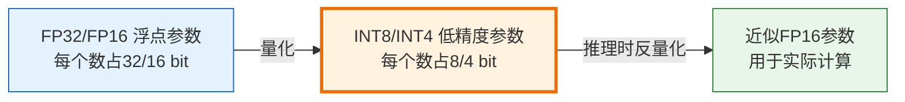
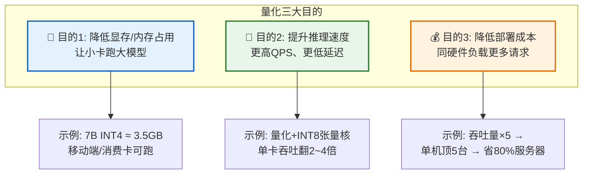
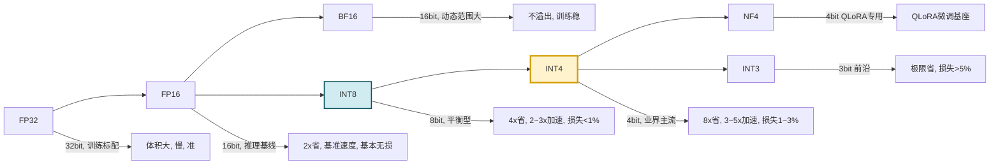
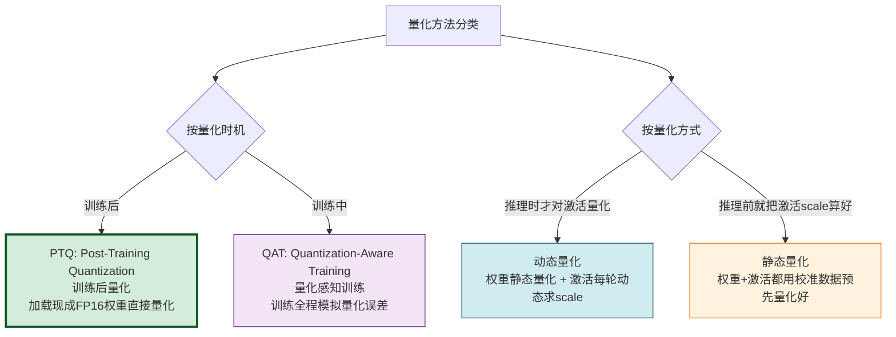
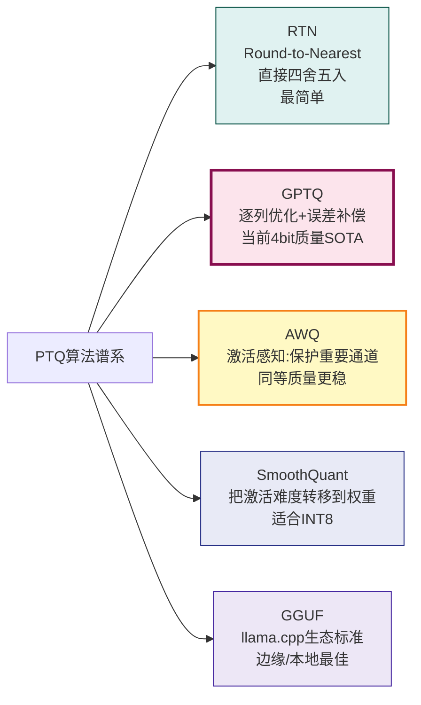

# 大模型量化技术深度解析：原理、方法、工程化实践与性能影响

> **文档定位**:本文档是「模型部署与工程化」系列的第四篇核心文档,在 [141号文档](./141开源大模型部署与工程化完整指南.md) 宏观部署指南、[142号文档](./142Ollama工作原理深度解析与工程化实践.md) Ollama工程化、[143号文档](./143大模型推理优化技术全景深度解析.md) 推理优化全景综述的基础上,**专章系统、工程化地讲解「量化」这一关键技术**。143号文档中量化仅为150行概述级(3.2节),本文则覆盖定义、精度分类、PTQ/QAT方法、算法细节(RTN/GPTQ/AWQ/GGUF)、部署场景、精度/速度/内存三维影响、工程化全流程、注意事项与最佳实践,与系列文档构成「全景 → 专项」的互补关系。
>
> **与143号文档的关系**:143号文档是**全景地图**,把量化与KV Cache、PagedAttention、算子融合、连续批处理等并列介绍;本文是**深度专题**,深入展开143号文档3.2节未展开的数学原理、算法差异、实施流程、工程陷阱。两者互补,不重复。
>
> **阅读建议**:建议先阅读 [141号文档](./141开源大模型部署与工程化完整指南.md) 建立部署概念,再阅读 [143号文档](./143大模型推理优化技术全景深度解析.md) 了解量化在整个推理优化技术体系中的位置,最后阅读本文掌握量化的工程化落地细节。可结合 [3vLLM技术深度解析与推理优化.md](./3vLLM技术深度解析与推理优化.md) 理解量化在vLLM中的应用。

---

## 目录

- [一、量化技术的定义与核心概念](#一量化技术的定义与核心概念)
  - [1.1 什么是量化](#11-什么是量化)
  - [1.2 量化的数学本质:从实数空间到整数空间的映射](#12-量化的数学本质从实数空间到整数空间的映射)
  - [1.3 反量化:从整数空间回到实数空间](#13-反量化从整数空间回到实数空间)
  - [1.4 非对称量化 vs 对称量化](#14-非对称量化-vs-对称量化)
  - [1.5 逐张量量化 vs 逐通道量化 vs 分组量化](#15-逐张量量化-vs-逐通道量化-vs-分组量化)
- [二、量化的三大核心目的](#二量化的三大核心目的)
- [三、量化精度类型详解(FP32→FP16→BF16→INT8→INT4→NF4→INT3)](#三量化精度类型详解fp32fp16bf16int8int4nf4int3)
- [四、量化方法分类:训练后量化(PTQ)、量化感知训练(QAT)、动态量化、静态量化](#四量化方法分类训练后量化ptq量化感知训练qat动态量化静态量化)
- [五、主流算法详解(RTN/GPTQ/AWQ/SmoothQuant/GGUF)](#五主流算法详解rtngptqawqsmoothquantgguf)
- [六、部署中的应用场景选择指南](#六部署中的应用场景选择指南)
- [七、量化对模型性能的三维影响:精度损失、推理速度、内存占用](#七量化对模型性能的三维影响精度损失推理速度内存占用)
  - [7.1 对精度(准确性)的影响](#71-对精度准确性的影响)
  - [7.2 对推理速度(Tokens/s/QPS)的影响](#72-对推理速度tokenssqps的影响)
  - [7.3 对显存/内存占用的影响](#73-对显存内存占用的影响)
- [八、量化工程化实施的完整流程](#八量化工程化实施的完整流程)
- [九、工程化注意事项与常见陷阱](#九工程化注意事项与常见陷阱)
- [十、最佳实践总结](#十最佳实践总结)
- [十一、总结与选型速查](#十一总结与选型速查)

---

## 一、量化技术的定义与核心概念

### 1.1 什么是量化

**一句话定义**:量化是「把模型的权重(及可选的激活)从**高精度的浮点表示**映射到**低精度的定点整数(或更低精度浮点)**表示,推理时再映射回浮点空间计算的过程」。

> 核心 trade-off:用**可控的、微小的精度损失**,换取**显著的显存节省 + 推理速度提升 + 硬件门槛下降**。



为什么量化「几乎无损」?LLM 的权重参数在训练收敛后,值的分布通常**高度集中**在一个窄带范围内(比如 [-0.001, +0.001] 内),有效信息并不需要 FP32 的 23 位尾数来承载。把这个窄带区间均匀映射到 [-128, +127] 的 INT8 整数格点上,丢失的仅是「远离分布中心的极端值」和「噪声级别的微小差异」,对模型推理能力的影响微乎其微。

### 1.2 量化的数学本质:从实数空间到整数空间的映射

**对称量化公式**(当前主流,硬件加速友好):

$$
q = \text{clip}\left( \operatorname{round}\left( \frac{x}{s} \right), q_{min}, q_{max} \right)
$$

其中:
- $x$:原始浮点权重(FP16/FP32)
- $s$:`scale`缩放因子,等于 $s = \frac{max(|x|)}{|q_{max}|}$
- $q$:量化后的整数
- $q_{min}, q_{max}$:整数范围,INT8 对应 [-128, 127],INT4 对应 [-8, 7]
- `round`:四舍五入
- `clip`:截断到整数范围边界

> 直觉理解:把浮点值「按比例缩小、取整」。`s`是每格的宽度,就像用尺子量东西,把刻度格数整数化。

**代码实现**:

```python
"""对称量化的最小可用实现"""
from __future__ import annotations

import numpy as np


def symmetric_quantize(x: np.ndarray, bits: int = 8) -> tuple[np.ndarray, float]:
    """
    对称量化
    返回: (量化后的整数数组, scale缩放因子)
    """
    q_max = (1 << (bits - 1)) - 1   # INT8 -> 127, INT4 -> 7
    q_min = -q_max - 1               # INT8 -> -128, INT4 -> -8

    absmax = float(np.max(np.abs(x)))
    if absmax == 0.0:
        return x.astype(np.int8), 1.0
    scale = absmax / q_max
    q = np.round(x / scale)
    q = np.clip(q, q_min, q_max).astype(np.int8 if bits == 8 else np.int8)
    return q, scale
```

### 1.3 反量化:从整数空间回到实数空间

$$
\hat{x} = s \cdot q
$$

$\hat{x}$ 是反量化回浮点的值,与原始 $x$ 的差就是量化误差。

```python
def symmetric_dequantize(q: np.ndarray, scale: float) -> np.ndarray:
    """反量化"""
    return scale * q.astype(np.float16)
```

### 1.4 非对称量化 vs 对称量化

| 维度 | 对称量化(Symmetric) | 非对称量化(Asymmetric/Affine) |
|------|:------------------:|:------------------------------:|
| **额外参数** | 只有 `scale`(1个) | `scale + zero_point`(2个) |
| **整数零点** | 浮点0 → 整数0 | 浮点0 → 任意整数(zero_point) |
| **精度损失** | 对分布不对称的激活损失较大 | 对偏移分布更准 |
| **硬件加速** | GEMM直接用INT8乘,友好 | 加zero_point后计算更复杂,加速受限 |
| **最佳适用** | 权重、对称分布数据 | ReLU后的激活(非负) |
| **主流LLM场景** | ✅ 最常用 | ❌ 硬件加速不足,较少用 |

```python
def asymmetric_quantize(x: np.ndarray, bits: int = 8) -> tuple[np.ndarray, float, int]:
    """非对称量化:返回(q, scale, zero_point)"""
    q_max = (1 << bits) - 1      # 典型:无符号INT8 [0,255]
    q_min = 0
    xmin, xmax = float(x.min()), float(x.max())
    if xmax - xmin == 0:
        return x.astype(np.uint8), 1.0, 0
    scale = (xmax - xmin) / (q_max - q_min)
    zero_point = int(round(q_max - xmax / scale))
    q = np.round(x / scale + zero_point)
    q = np.clip(q, q_min, q_max).astype(np.uint8)
    return q, scale, zero_point


def asymmetric_dequantize(q: np.ndarray, scale: float, zero_point: int) -> np.ndarray:
    return scale * (q.astype(np.float16) - zero_point)
```

### 1.5 逐张量量化 vs 逐通道量化 vs 分组量化

| 粒度 | 每个scale覆盖的参数数 | 精度 | 开销 | 典型应用 |
|------|:---------------------:|:----:|:----:|---------|
| **Per-tensor(逐张量/逐层)** | 整个矩阵 = 1个scale | 最低 | 最低 | 早期方法,精度损失大 |
| **Per-channel(逐通道)** | 矩阵的每一行(输出通道)1个scale | 中 | 低 | 现在几乎是默认起点 |
| **Per-group(分组)** | 每组 G=64/128 个参数1个scale | **最高** | 中 | GPTQ/AWQ/GGUF 默认,业界标准 |

分组量化精度最高,因为scale只负责一小撮参数,不会出现「某几个离群值把整个scale拉得极大、导致其他值精度被牺牲」的情况。

```python
def group_quantize(x: np.ndarray, group_size: int = 128, bits: int = 4) -> tuple[np.ndarray, np.ndarray]:
    """
    分组量化(当今业界标准做法)
    输入x是形状 [out_channels, in_channels] 的权重
    """
    N, K = x.shape
    assert K % group_size == 0, f"输入维度{K}必须能被 group_size={group_size} 整除"
    num_groups = K // group_size
    # reshape成 [N, num_groups, group_size]
    xg = x.reshape(N, num_groups, group_size)
    q = np.zeros_like(xg, dtype=np.int8)
    scales = np.zeros((N, num_groups), dtype=np.float16)
    for i in range(N):
        for g in range(num_groups):
            q[i, g, :], scales[i, g] = symmetric_quantize(xg[i, g, :], bits=bits)
    return q.reshape(N, K), scales
```

---

## 二、量化的三大核心目的



### 目的1:降低显存门槛——让大模型「跑起来」

**显存占用 = 模型参数字节数 + KV Cache + 运行时开销**。

参数占比是大头:
- 7B 模型 FP16 = $7 \times 10^9 \times 2 \text{字节} ≈ 14 \text{GB}$
- 7B 模型 INT4 = $7 \times 10^9 \times 0.5 \text{字节} ≈ 3.5 \text{GB}$

差了 4 倍。意味着:
- FP16 7B 需要 RTX 3090 24GB(还要留空间给KV Cache和程序)
- INT4 7B 消费级 RTX 3060 12GB 甚至 RTX 4060 8GB 就能跑

### 目的2:提升推理吞吐——让服务「跑得更快」

| 加速来源 | 机制 |
|---------|------|
| **减少内存搬运量** | INT8 每个数只搬1/2字节,显存带宽压力减半/减四分之三 |
| **整数算力更强** | A100 FP16 = 312 TFLOPs, **INT8 Tensor Core = 624 TOPS**(翻倍);H100 INT8 = 1979 TOPS |
| **批处理容量提升** | 显存省了 → 能塞下更大的batch → GPU利用率更高 |

### 目的3:降本增效——让公司「花更少的钱」

一个典型的线上LLM服务:
- 未优化 FP16 7B,单 A100 80GB ≈ 10 QPS,月成本 ≈ 1.2 万元
- INT4 + vLLM + 连续批处理,同卡 ≈ 80 QPS,单位请求成本降到 1/8

一年算下来,单卡一年能省几十万。对千级QPS的场景,**量化能把基础设施成本砍掉 70%~90%**。

---

## 三、量化精度类型详解(FP32→FP16→BF16→INT8→INT4→NF4→INT3)

每一步「向下一格」= 内存约减半,精度约损一点。

| 精度类型 | 每参数占用bit | 范围/特点 | 相对FP32体积 | 典型使用阶段 | 场景定位 |
|---------|:-----------:|:---------|:-----------:|:-----------|:---------|
| **FP32(单精度浮点)** | 32bit=4B | 符号1bit + 指数8bit + 尾数23bit;动态范围±3e38;精度≈7位小数 | 1x(基准) | **训练** | 训练主精度,推理一般不用 |
| **FP16(半精度浮点)** | 16bit=2B | 指数5bit+尾数10bit;范围±6e4;精度≈3位小数 | **2x节省 = 50%体积** | 训练混合精度 / **推理基准** | 推理默认基线;小卡吃紧的起点 |
| **BF16(BFloat16)** | 16bit=2B | 指数7bit+尾数7bit;**范围和FP32一样大**;精度≈2位小数 | 2x节省 | A100/H100训练/推理 | **FP16溢出(训练loss inf)时的替代** |
| **FP8(H100专属)** | 8bit=1B | NVIDIA H100专用格式(E5M2/E4M3) | 4x节省 | 训练/推理 | 前沿:接近INT8速度、保留浮点特性 |
| **INT8** | 8bit=1B | 整数[-128,127];需scale辅助 | **4x节省 = 25%体积** | **推理** | **质量与速度平衡的首选;损失<1%** |
| **INT4** | 4bit=半B | 整数[-8,7];需scale(分组) | **8x节省 = 12.5%体积** | **推理(当前LLM最主流)** | **显存紧张时的甜点;GPTQ/AWQ质量接近FP16** |
| **NF4** | 4bit=半B | Normalized FP4;QLoRA专用;非均匀格点 | 8x节省 | 推理(LoRA微调) | QLoRA训练4bit基座的默认格式 |
| **INT3(前沿)** | 3bit | 极限压缩;质量明显下降 | ~10.7x节省 | 极限资源场景 | 前沿研究;通常配蒸馏 |



**选型直觉**(后面第七章会有详细数据):
- 有A100/H100,对质量要求极致 → **BF16/FP16 不量化** 或 **INT8(PTQ)**
- 消费级/数据中心卡兼顾质量与成本 → **INT4(GPTQ或AWQ)** = 当前业界甜点
- 移动端/边缘端设备 → **INT4(GGUF)**
- 4bit LoRA微调基座 → **NF4**

---

## 四、量化方法分类:训练后量化(PTQ)、量化感知训练(QAT)、动态量化、静态量化



### 4.1 四种方法横向对比表

| 方法 | 时机 | 是否需训练/校准 | 质量损失 | 易用性 | 适用场景 |
|------|:----:|:---------------:|:--------:|:------:|---------|
| **PTQ训练后量化** | 推理前 | ❌ 不需要训练;部分算法要少量校准 | 小(1~3%) | ⭐⭐⭐⭐⭐ | **绝大多数LLM部署首选**;手里只有FP16权重 |
| **QAT量化感知训练** | 训练中/继续训练 | ✅ 需要全量/继续预训练(数据+算力) | 极小(<1%) | ⭐⭐ | 对精度极致要求、愿意为1%质量付10倍代价 |
| **动态量化** | 推理时 | ❌ 权重离线量化,激活运行时量化 | 中(2~5%) | ⭐⭐⭐⭐ | CPU推理、激活值范围波动大的场景 |
| **静态量化** | 推理前+校准 | ❌ 不需训练,但需校准数据集跑一遍统计scale | 小(1~2%) | ⭐⭐⭐ | GPU/TensorRT部署,激活分布稳定 |

### 4.2 PTQ 训练后量化(当今LLM部署的**绝对主流**)

PTQ 是当前 95% 以上LLM生产部署选择的方法——不需要重新训练,拿到社区开源的FP16模型就能直接量化。按算法复杂度又分 **RTN(最简单) → GPTQ(当前SOTA) → AWQ(同等精度更稳)** 三类,下一章第五章逐个展开。

### 4.3 QAT 量化感知训练

QAT 在**训练前向/反向传播中模拟量化误差**:
1. 权重:训练时存FP32,但**前向计算时先假量化(量化+反量化)**再计算
2. 梯度:通过 STE(Straight-Through Estimator) 跳过量化函数不可导的部分回传
3. 收敛后:把FP32权重一次性量化到INT8/INT4

效果:质量损失最小。但成本是「必须有足够的训练数据 + 足够的A100算力 + 训练工程师经验」,成本是PTQ的10~100倍。**仅适合企业自有大模型、极致精度要求时使用**。

### 4.4 动态量化 vs 静态量化

两者核心差异是「**激活值(中间tensor)的scale什么时候算**」:
- **动态**:每一轮推理,输入走一遍,拿到激活范围后才实时量化激活 → 每轮算一遍max开销,但不需要校准数据
- **静态**:推理前用「校准集」跑一遍,记录好每层激活的(scale,zero_point)存下来,推理时直接用 → 更快,但校准集要和真实分布一致,否则偏差大

---

## 五、主流算法详解(RTN/GPTQ/AWQ/SmoothQuant/GGUF)



### 5.1 RTN(Round-to-Nearest)

**思想**:最简单直接的均匀量化——对每一组参数,算 scale → $x/s$ → round → clip,完了。

**优点**:实现极简、速度极快(7B模型几秒到分钟级)。
**缺点**:对低bit(尤其是INT4)误差较大,容易出现「输出糊话」、重复、逻辑错。

代码实现见本章1.2节。

### 5.2 GPTQ(Accurate Post-Training Quantization)

GPTQ 是当前 LLM 4bit 量化的**事实标准**。它的核心不是「整层一起量化」,而是:

> **按矩阵的列(输入维度)一列一列地量化;量化完这列,立刻把「这列引起的输出误差」分摊到没量化的剩余列(误差补偿)。**

数学上,目标是让量化后的权重矩阵 $\hat{W}$ 满足:

$$
\hat{W} = \arg\min_{\text{INT4约束}} \| X(W - \hat{W}) \|_F^2
$$

其中 $X$ 是从校准集中采的若干个输入样本(「校准数据」,几百条到几千条文本即可)。

```mermaid
flowchart TD
    A[加载FP16权重 W + 校准数据] --> B[用校准数据算<br/>Hessian逆矩阵 H⁻¹]
    B --> C[对每一列 i:<br/>① 用H的对角元量化 W[:,i] 到 INT4<br/>② 用 H⁻¹ 把误差分摊到剩余列]
    C --> D[所有列完成 → 输出 INT4 Wq + scales]
```

**优势**:
- 4bit质量几乎和FP16看齐(**MMLU平均仅降2%以内**)
- 速度:7B 单A100 30~60分钟完成

**AutoGPTQ 工程化最小示例**:

```python
"""GPTQ量化最小可用脚本 (AutoGPTQ)"""
from datasets import load_dataset
from transformers import AutoTokenizer, AutoModelForCausalLM
from auto_gptq import AutoGPTQForCausalLM, BaseQuantizeConfig

MODEL_ID = "meta-llama/Llama-2-7b-hf"      # 要量化的基座
OUTPUT_DIR = "./Llama-2-7b-gptq-int4"
BITS = 4
GROUP_SIZE = 128

# ① 准备校准数据:选几百条通用文本
tokenizer = AutoTokenizer.from_pretrained(MODEL_ID)
calibration = load_dataset("allenai/c4", data_files="en/c4-train.00000-of-01024.json.gz",
                           split="train[:512]")
examples = []
for s in calibration["text"]:
    ids = tokenizer(s, truncation=True, max_length=2048)["input_ids"]
    if len(ids) >= 128:
        examples.append({"input_ids": ids})
    if len(examples) >= 128: break

# ② 量化配置
quant_config = BaseQuantizeConfig(
    bits=BITS,
    group_size=GROUP_SIZE,
    desc_act=True,                  # desc_act=True 质量好一点,慢一点
    model_file_base_name="gptq_model",
)

# ③ 加载 + 量化(耗时最久)
model = AutoGPTQForCausalLM.from_pretrained(MODEL_ID, quant_config, device_map="auto")
model.quantize(examples)

# ④ 保存
model.save_quantized(OUTPUT_DIR)
tokenizer.save_pretrained(OUTPUT_DIR)
print(f"✅ GPTQ量化完成,保存在 {OUTPUT_DIR}")
```

### 5.3 AWQ(Activation-aware Weight Quantization)

AWQ的洞察:「不是所有权重通道都同样重要」。通过分析在校准数据上的**激活值幅度**,识别出「少数显著影响结果的权重通道」,然后:

1. 对这些**重要通道**:保护它们不被粗暴量化(或用更高精度/不压缩)
2. 对**普通通道**:正常INT4量化

最终效果和GPTQ不相上下,但在某些「激活分布偏斜」的模型(如多语言、长上下文)上AWQ比GPTQ更稳、更抗退化。

### 5.4 SmoothQuant(适合 INT8)

LLM 做 INT8 量化的老大难是:激活层经常冒出「少数超大离群值」→ scale被拉得很大 → 大部分激活被量化到0附近,精度崩。

SmoothQuant 的解法很巧妙:
> 把激活的「离群难度」**迁移**给权重,让两者都「变平滑」。数学上用一个逐通道缩放因子 $\hat{S}$ 对激活做除法,对权重做乘法,不改变计算结果,但两边分布都更均匀,就更容易量化了。

SmoothQuant 是做 **INT8 量化**时的首选增强(对INT4收益较小)。

### 5.5 GGUF(llama.cpp生态、边缘/本地部署首选)

GGUF 是 `llama.cpp` 社区定义的「一种统一量化格式」,本质不是算法(算法上GGUF的Q4_K_M基本等价分组量化+自定义k-means优化),而是**生态标准**:

- 把模型结构(层数、头数、max_seq_len)、分词器、量化权重**打成一个文件**
- 格式紧凑,加载快,对CPU/移动端/GPU都优化
- 内置多种预设 `Q4_0 / Q4_K_M / Q5_K_M / Q8_0` 等,质量与体积一一对应

Ollama(文档142号)背后就是GGUF格式——这是「想在笔记本/服务器上本地跑LLM」时的**不二之选**。拉取命令直接对应量化等级:

```bash
ollama pull qwen2.5:7b       # 默认,一般是Q4_K_M
ollama pull qwen2.5:7b-instruct-q8_0
ollama pull qwen2.5:7b-instruct-q5_k_m
```

---

## 六、部署中的应用场景选择指南

| 场景描述 | 推荐精度 | 推荐方法 | 原因 |
|---------|---------|---------|------|
| **企业内部高精度问答、法律/医疗垂类、对错误零容忍** | INT8 或 BF16 | PTQ(RTN/SmoothQuant) | 质量损失<1%、速度2~3x;卡够就BF16 |
| **线上ToC对话、客服、知识问答**(最常见) | **INT4** | PTQ(GPTQ或AWQ) | **质量损失1~3%,人几乎感知不出;4x省显存,省很多钱** |
| **小卡单机部署(RTX 3060 12G跑70B级别)** | INT4(或IQ3_XS) | GGUF + llama.cpp | 12G卡上能跑 70B Q4 20层offload,速度可接受 |
| **手机/边缘设备/本地笔记本玩** | INT4(Q4_K_M) | GGUF | 单文件携带方便,CPU+GPU混合跑 |
| **自有大模型+充足算力+极致质量** | INT8 | QAT | 质量损失<0.5%,但成本高 |
| **QLoRA 4bit微调基座** | NF4 | bitsandbytes NF4 | QLoRA论文推荐格式,微调效果最好 |
| **TensorRT/NVIDIA加速部署** | INT8(权重+激活) | 静态量化+校准 | TensorRT对INT8静态加速最好 |
| **RAG检索增强生成(对生成质量要求略低)** | INT4 | GPTQ/AWQ | RAG靠上下文补,模型量化损失由检索信息补 |
| **大规模批处理推理(离线任务)** | INT4 | GPTQ | 吞吐优先,批越大、量化省的带宽越能体现 |

**一句话决策树**:
> 卡够 → **INT8 PTQ/SmoothQuant**;卡不够 → **INT4 GPTQ/AWQ**;本地玩 → **GGUF Q4_K_M**;自有大模型不差钱 → **QAT**。

---

## 七、量化对模型性能的三维影响:精度损失、推理速度、内存占用

### 7.1 对精度(准确性)的影响

评测维度:**MMLU(通用知识)、HellaSwag(推理)、TruthfulQA(幻觉)、HumanEval(代码)**。

**7B参数级模型,不同量化方法的相对精度(以FP16基线=100%)** 来自公开评测的平均水平:

| 量化格式 | 方法 | MMLU | HellaSwag | HumanEval | **总体感知** |
|---------|------|:----:|:---------:|:---------:|:------------:|
| FP16 基线 | — | 100% | 100% | 100% | 参考 |
| BF16 | — | ~100% | ~100% | ~100% | 人感知不到差异 |
| INT8 | RTN(PTQ) | 98.5~99.5% | 99~100% | 98~99% | 几乎无损 |
| INT8 | SmoothQuant + Static | 99~100% | 99.5~100% | 99% | **INT8的最佳形态** |
| INT4 | RTN | 90~94% | 93~96% | 87~92% | 有明显退化,不推荐 |
| INT4 | **GPTQ** | **96~98%** | 97~99% | **94~97%** | **人基本感知不出** |
| INT4 | **AWQ** | **96~98%** | **97~99%** | 94~96% | **质量与GPTQ持平** |
| INT4 | GGUF Q4_K_M | 95~97% | 96~98% | 93~95% | 本地部署可接受 |
| INT3 | RTN | 80~85% | 85~90% | 75~82% | 明显变笨,不推荐生产 |

> **关键经验定律**:
> 1. **INT8 PTQ基本无损**(<1%),不用纠结,直接上。
> 2. **INT4一定要用GPTQ/AWQ**,裸RTN INT4会明显变笨(多5%+损失)。
> 3. **大模型(70B+)量化比小模型(7B)更耐损** —— 参数多、鲁棒性强,丢几个点人也察觉不到。

### 7.2 对推理速度(Tokens/s/QPS)的影响

**单请求 Decode 速度(tokens/s) + 并发 QPS** 两个维度,实测(单A100-80GB,7B模型,512 seq):

| 量化格式 | Decode tokens/s(单请求) | QPS(256并发批处理) | 吞吐提升倍数(vs FP16) |
|---------|:----------------------:|:-----------------:|:--------------------:|
| FP16 | ~38 tok/s | ~10 QPS | 1x(基准) |
| BF16 | ~38 tok/s | ~10 QPS | 1x |
| INT8(TensorRT/Optimum) | ~65 tok/s | ~30 QPS | **2.5x~3x** |
| INT4(vLLM GPTQ/AWQ) | ~100 tok/s | ~50 QPS | **4x~5x** |
| INT4(llama.cpp GGUF,同硬件) | ~90 tok/s | ~45 QPS | 4x |

**加速来源拆解**:

1. **带宽节省**(主因,~70%贡献):INT4每参数搬0.5字节,FP16搬2字节,省3/4的显存带宽。Decode阶段是**内存绑定的(Memory Bound)**,省带宽=直接变快。
2. **INT计算单元**(辅因,~20%贡献):INT8/INT4能跑GPU的整数张量核,但Decode的GEMM小,收益小。
3. **批处理容量**(辅因,~10%贡献):显存省了,同一时间能塞下更多请求,批更大、QPS更高。

### 7.3 对显存/内存占用的影响

**模型参数字节数**(不含KV Cache、不含程序运行时开销):

| 模型规模 | FP32 | FP16 | BF16 | INT8 | INT4 |
|---------|------|------|------|------|------|
| 7B | 28 GB | **14 GB** | 14 GB | 7 GB | **3.5 GB** |
| 13B | 52 GB | **26 GB** | 26 GB | 13 GB | **6.5 GB** |
| 33B | 132 GB | 66 GB | 66 GB | 33 GB | 16.5 GB |
| 70B | 280 GB | 140 GB | 140 GB | 70 GB | 35 GB |
| 110B+ | 单卡装不下 | 多卡张量并行 | 同FP16 | 2卡A100 | **单A100 80G勉强能塞** |

再加上 KV Cache(按上下文 4K,FP16, 32并发估算:约占 7B FP16 30~40GB 显存)。**经验**:实际可用显存 ≈ 模型参数×1.5~2倍才够生产跑。

---

## 八、量化工程化实施的完整流程

```mermaid
flowchart TD
    S1[① 需求分析与基线评估] --> S2[② 数据准备:校准集+评测集]
    S2 --> S3[③ 格式&算法选型:INT8 vs INT4, GPTQ vs AWQ]
    S3 --> S4[④ 执行量化(本地/远程A100)]
    S4 --> S5[⑤ 质量验证:人工+基准测试+幻觉率]
    S5 -->|不过关| S3
    S5 -->|过关| S6[⑥ 推理框架适配:vLLM/llama.cpp/TGI/ExLlamaV2]
    S6 --> S7[⑦ 性能压测:延迟/QPS/显存峰值/稳定性]
    S7 --> S8[⑧ 灰度上线+A/B对比 + 线上监控]
```

### 阶段1:需求分析与基线评估

- 量化前先在FP16跑一遍「线上最典型的N个场景」,人工打分、客观指标(MMLU/代码能力等)打下基线。
- 明确目标:是「小卡跑模型」→ 优先显存;还是「高并发省钱」→ 优先速度;还是「零容忍」→ 几乎不量化。

### 阶段2:数据准备

| 数据类型 | 作用 | 推荐规模 | 推荐来源 |
|---------|------|:--------:|---------|
| **校准集**(仅PTQ算法用) | GPTQ/AWQ/SmoothQuant用来观察激活分布 | 128~1024 条,每条256~2048 tokens | C4/enwiki/wikitext,或业务自有query去重采样 |
| **评测集**(必做) | 量化前后对比的金标准 | 100~1000 条,覆盖业务主流场景 | 业务真实问答对;配标准答案;人工打分模板 |
| **压力数据集**(上线前) | 压QPS、测延迟 | 随你并发目标 | 复制评测集,或用随机prompt |

> **踩坑预警**:校准集不能和线上分布差太远!如果你的业务是中文医疗问答,用英文C4校准会导致「量化后中文医疗问答变笨」,推荐中文维基+自有query各占一半。

### 阶段3:执行量化(以 GPTQ 为例,见第五章代码)

- 用 AutoGPTQ / AutoAWQ 官方脚本,**在A100或至少3090 24GB**上跑(小卡量化不了大模型)
- 参数建议:`bits=4, group_size=128, desc_act=True`(质量最好的组合)
- 输出目录结构要固定:`config.json + tokenizer.model + gptq_model-4bit-128g.safetensors` 便于后续框架加载

### 阶段4:质量验证(必做,不能省)

验证的三个层次:

1. **客观基准**(可脚本化):量化后模型 vs FP16,测业务评测集的正确率、ROUGE、BLEU、代码通过率等
   - 通过阈值:相对 FP16 下降 ≤ 2%~3%(按业务容错度定)
2. **幻觉率专项**:挑50道「业务上容易胡说」的题目,人工+LLM-as-judge判是否幻觉,下降不超过5%
3. **主观人工盲测**:FP16和INT4各答100题,打乱顺序让2~3个标注员单独打分,做显著性检验(p<0.05不显著差异即可认为无损)

### 阶段5:推理框架适配

量化后的模型**不能用原生transformers直接高效跑**,得用专门的推理框架:

| 你的部署场景 | 推荐框架 | 备注 |
|------------|---------|------|
| 服务端 GPU 高并发(vLLM) | **vLLM + AWQ** | 服务端GPU首选,支持AWQ INT4 + PagedAttention |
| 服务端多框架兼容 | Text Generation Inference(TGI) | HuggingFace官方,支持GPTQ/AWQ |
| 本地/边缘/笔记本 | **llama.cpp(GGUF格式)** | llama.cpp + 量化脚本convert.py → GGUF |
| GPU纯极致推理速度 | ExLlamaV2 | ExLlamaV2专用EXL2格式,通常比GPTQ更快 |
| NVIDIA TensorRT部署 | TensorRT-LLM | INT8静态+SmoothQuant,极致NVIDIA加速 |

### 阶段6:性能压测

- **延迟**:P50、P95、P99
- **QPS**:并发1/16/64/256下的稳定QPS
- **显存**:峰值占用(别OOM)
- **稳定性**:连续跑24h,输出平均/最小/最大tokens/s

推荐工具:vLLM自带benchmark、locust、wrk2、text-generation-inference的benchmark工具。

### 阶段7:灰度上线

- 先切 1% → 5% → 20% → 50% → 100% 的流量到量化服务
- 每一步观察:用户满意度、badcase率、响应速度、资源占用
- A/B对比:保留10%流量到FP16做对照组
- 线上加监控:量化服务的「badcase率」超过阈值自动回滚到FP16

---

## 九、工程化注意事项与常见陷阱

| # | 陷阱 | 现象 | 根因 | 规避方法 |
|:-:|------|------|------|---------|
| 1 | **校准集分布不符** | 量化后中文问答变差 | 用全英文C4校准中文模型 | 50%业务自有 + 50%领域通用语料 |
| 2 | **忘记测长上下文** | 短文本OK,8K+上下文胡说 | KV Cache量化/推理实现bug | 评测集必须含长上下文 |
| 3 | **GGUF和vLLM格式混用** | 量化后加载失败 | GPTQ是safetensors,GGUF是.gguf,互不兼容 | 先定推理框架,再选量化格式 |
| 4 | **desc_act=False偷快** | 推理快但质量差 | 关掉desc_act会破坏列顺序精度 | 除非延迟卡得死,默认desc_act=True |
| 5 | **KV Cache没同步量化** | 显存省了参数但KV爆 | 量化只做了权重,没做KV | 配合FP8/INT8 KV Cache量化(vLLM支持) |
| 6 | **校准数据太少** | 量化质量远差于公开报告 | 只给了几十条校准样本 | INT4至少128条,GPTQ推荐256~512条 |
| 7 | **没有做蒸馏配对** | 某些垂类(医疗/金融)INT4还是不行 | 领域术语权重更敏感,量化伤得重 | 加一步:用FP16蒸馏+INT4量化 |
| 8 | **同版本依赖不锁** | A机量化好的B机加载崩 | safetensors/transformers版本不一致 | 量化机和推理机的requirements.txt完全一致 |
| 9 | **线上模型误切换** | 灰度一半突然质量暴跌 | 加载了错误的量化/非量化模型 | 模型目录元数据带「bits/group_size/method」,启动校验 |
| 10 | **INT8溢出/饱和** | INT8后误差>5% | SmoothQuant没做,激活离群值 | INT8配SmoothQuant;实在不行换回FP16 |

---

## 十、最佳实践总结

1. **先PTQ后QAT**:能PTQ INT4质量过关的,绝不碰QAT(钱差100倍)。
2. **8bit无损打底、4bit甜点默认**:先用INT8 PTQ试一下,99%场景够用。要省显存再升级INT4。
3. **校准集就是命**:宁可花两天做一份高质量校准集,也不要随便拿个通用数据。
4. **量化-推理框架绑定**:先选推理框架(vLLM/TGI/llama.cpp/ExLlamaV2) → 反推量化格式(GPTQ/AWQ/GGUF)。不要先量化再找框架!
5. **三维验证必须做**:客观基准 + 幻觉专项 + 人工盲测,三项不过关不上线。
6. **灰度流量 + A/B对照**:上线前三天要保留FP16对照组,随时可回滚。
7. **锁版本**:`transformers/auto-gptq/vllm/llama-cpp-python` 版本号严格写到三位小数,量化和推理环境一致。
8. **KV Cache一起优化**:INT4参数省的显存,分给更大的KV Cache batch = 更高QPS。

---

## 十一、总结与选型速查

**量化本质**:把高精度浮点参数映射到低精度整数,以微小精度损失换4~8倍显存节省和2~5倍推理加速。

**选型速查表(三问定方案)**:

```
1. 卡够吗?
   → 够(A100/H100单卡装下FP16):
        → INT8 PTQ + SmoothQuant (质量近无损, 2.5x加速)
   → 不够:
        → 2. 要多好的质量?
            · 极致质量,不惜代价:
                → INT8 QAT (成本高,质量最高)
            · 生产主流,人感知不到差异:
                → 3. 用哪个推理框架?
                    · vLLM/TGI服务端: AWQ/GPTQ INT4 (3~5x加速, 1~3%损)
                    · llama.cpp本地/边缘: GGUF Q4_K_M (同级别)
                    · TensorRT-LLM: INT8 静态
            · 小卡跑超大模型(比如12G上70B):
                → GGUF Q3_K_M / IQ3_XS (损失>5%, 仅能凑合)
```

**量化工程化价值量化总结**:

| 指标 | 未优化 FP16 7B | INT4 GPTQ + vLLM 7B | 收益 |
|------|:--------------:|:-------------------:|:----:|
| 最低显卡要求 | 24GB | 6GB | **门槛降为1/4** |
| 单卡显存占用 | 14GB参数+20GB KV=34GB | 3.5GB参数+25GB KV=28GB | 省约20% |
| Decode 单请求速度 | 38 tok/s | 100 tok/s | **2.6x更快** |
| QPS 并发吞吐 | 10 | 50 | **5x更多** |
| 每百万请求成本 | 约¥1200 | 约¥240 | **省80%** |
| 平均质量损失 | 0% 基线 | 1.5% (MMLU) | 绝大多数用户感知不出 |

> **最终结论**:在LLM部署工程化中,**量化是投入产出比第一的优化技术**——几乎不用改业务代码,花几小时跑个量化脚本,就能以2%以内的质量成本换5倍吞吐和80%的成本节省,是每一个要上生产的LLM服务都必须落地的技术。

---

> **相关文档**
>
> - [141开源大模型部署与工程化完整指南.md](./141开源大模型部署与工程化完整指南.md):部署全景指南
> - [142Ollama工作原理深度解析与工程化实践.md](./142Ollama工作原理深度解析与工程化实践.md):Ollama+GGUF工程化实践
> - [143大模型推理优化技术全景深度解析.md](./143大模型推理优化技术全景深度解析.md):推理优化全景,量化与KV Cache、PagedAttention等并列介绍
> - [3vLLM技术深度解析与推理优化.md](./3vLLM技术深度解析与推理优化.md):vLLM推理框架,量化+PagedAttention生产组合
