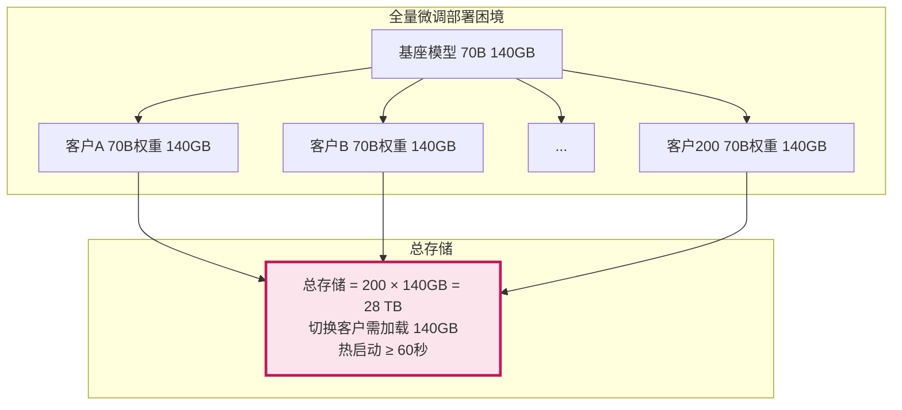
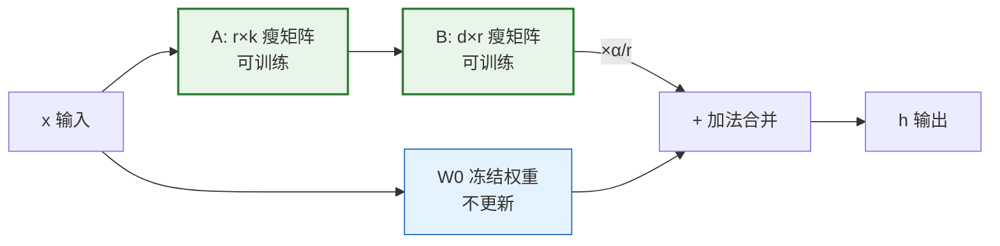
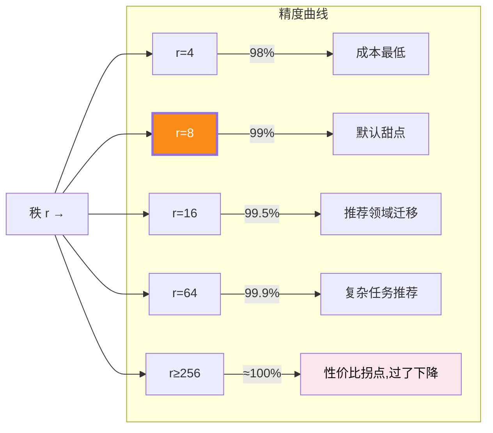
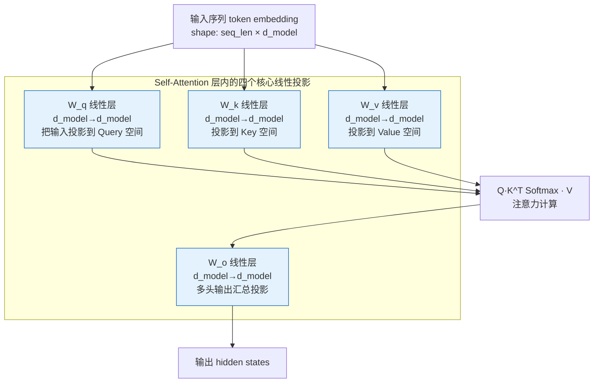
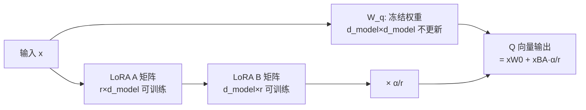
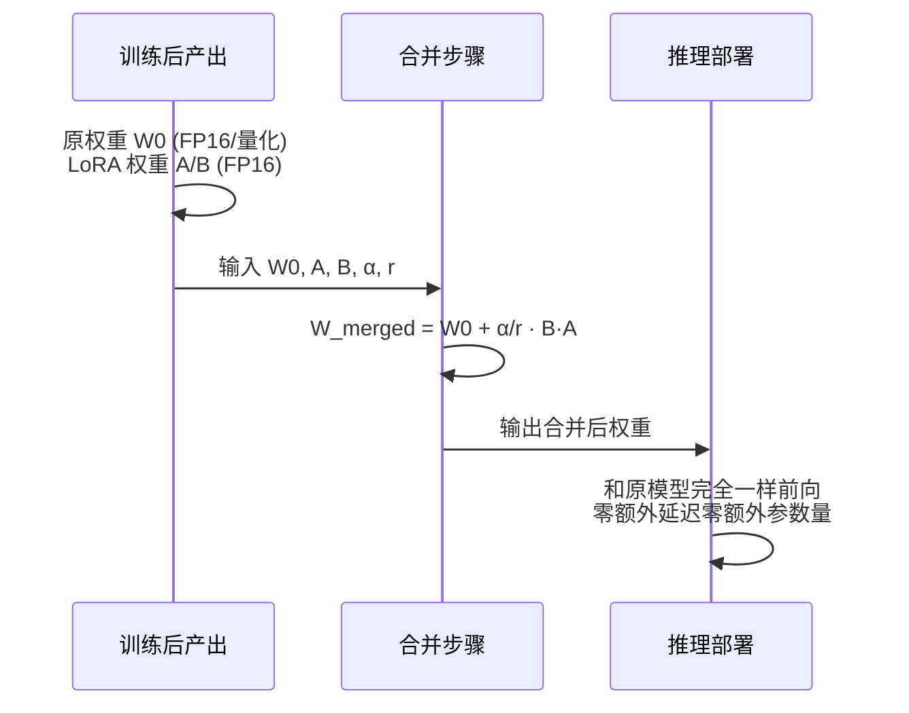
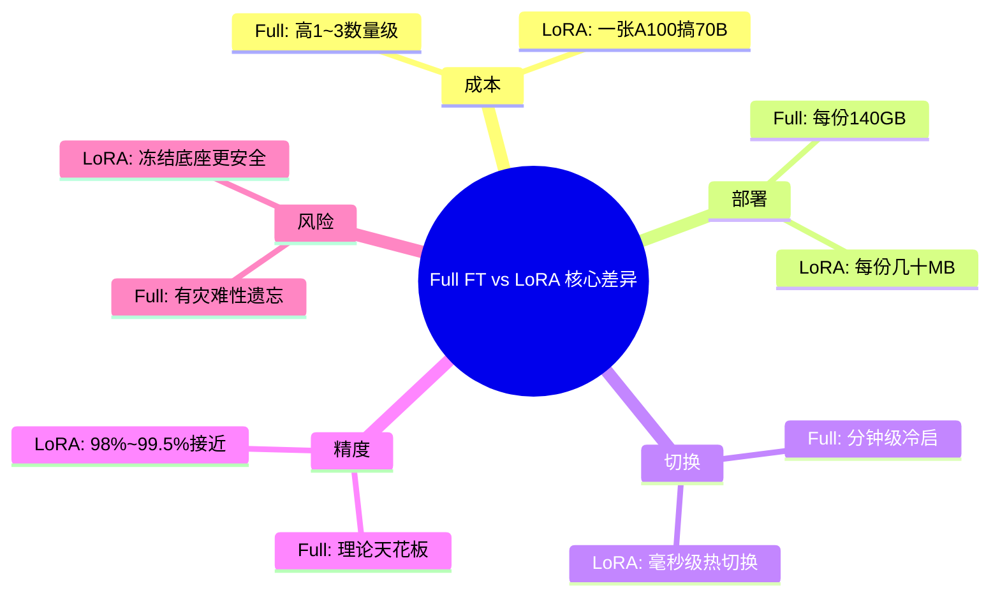
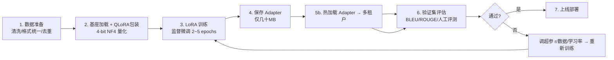
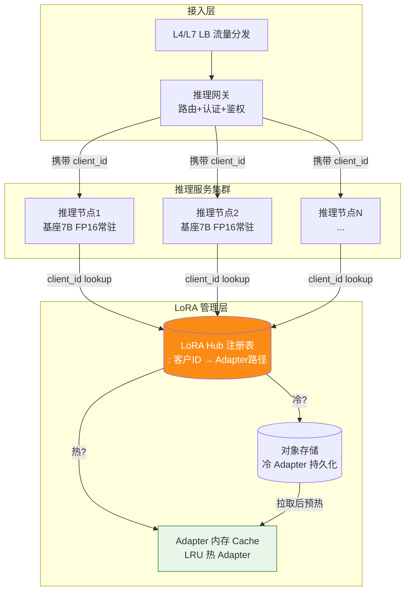

# LoRA（Low-Rank Adaptation）微调技术深度解析：核心原理、数学推导、Transformer实现与工程化价值

> **文档定位**:本文档是「模型部署与工程化」系列的第五篇核心专题文档,接续 [141号文档](./141开源大模型部署与工程化完整指南.md)(部署流程指南)、[142号文档](./142Ollama工作原理深度解析与工程化实践.md)(Ollama 运行时)、[143号文档](./143大模型推理优化技术全景深度解析.md)(推理优化全景)、[144号文档](./144大模型量化技术深度解析_原理方法工程化实践与性能影响.md)(量化技术专题) 的位置,专章系统、工程化地讲解 **LoRA 低秩适配微调** 技术。本文覆盖:LoRA 解决的核心问题、低秩矩阵分解的严格数学原理、Transformer注意力中的具体权重更新机制、与全量微调及其他 PEFT 方法的对比、参数高效微调的工程化代码实现、以及在模型部署/推理工程/多租户场景下的实际应用价值和量化性能数据。
>
> **与系列文档的关系**:143号文档是推理优化的**全景地图**,144号文档是压缩技术的**量化专章**,本文则是模型适配侧的**LoRA 专章**——量化解决的是「如何让大模型更省显存、跑得更快」的推理侧问题;LoRA 解决的是「如何让大模型花极低成本学习垂直领域知识」的训练/适配侧问题;二者在工程部署阶段高度协同(LoRA 适配 + 4-bit 量化共同构成当前 7B~70B 模型部署的标准"省显存"组合拳)。
>
> **阅读建议**:先读本文掌握为什么 LoRA 几乎不牺牲性能却能省 99% 的参数;再对照 143 号推理优化全景,理解 LoRA 与量化、vLLM 在生产环境中的组合使用。

---

## 目录

- [一、LoRA 技术解决的核心问题](#一lora-技术解决的核心问题)
  - [1.1 传统全量微调的「成本爆炸」困境](#11-传统全量微调的成本爆炸困境)
  - [1.2 多任务/多租户场景的「存储与部署噩梦」](#12-多任务多租户场景的存储与部署噩梦)
  - [1.3 LoRA 的核心洞察:权重更新是低秩的](#13-lora-的核心洞察权重更新是低秩的)
- [二、低秩矩阵分解的数学原理](#二低秩矩阵分解的数学原理)
  - [2.1 矩阵的秩:什么是「信息容量」](#21-矩阵的秩什么是信息容量)
  - [2.2 低秩分解直觉:用两个瘦矩阵近似一个胖矩阵](#22-低秩分解直觉用两个瘦矩阵近似一个胖矩阵)
  - [2.3 LoRA 严格公式推导:$\Delta W = B \cdot A$](#23-lora-严格公式推导delta-w--b-cdot-a)
  - [2.4 秩 r 的选择与误差控制](#24-秩-r-的选择与误差控制)
- [三、LoRA 在 Transformer 模型中的应用机制](#三lora-在-transformer-模型中的应用机制)
  - [3.1 Transformer 注意力权重结构回顾:W_q/W_k/W_v/W_o](#31-transformer-注意力权重结构回顾w_qw_kw_vw_o)
  - [3.2 为什么通常只注入注意力层的投影矩阵](#32-为什么通常只注入注意力层的投影矩阵)
  - [3.3 前向传播流程:冻结 $W$、训练 $BA$、推理时合权重](#33-前向传播流程冻结-w训练-ba推理时合权重)
  - [3.4 LoRA 在 MLP 层、Embedding 层上的扩展](#34-lora-在-mlp-层embedding-层上的扩展)
  - [3.5 QLoRA:LoRA 与 4-bit 量化的强强联合](#35-qloralora-与-4-bit-量化的强强联合)
- [四、与传统微调及其他 PEFT 方法对比](#四与传统微调及其他-peft-方法对比)
  - [4.1 与全量微调(Full Fine-Tuning)的多维对比](#41-与全量微调full-fine-tuning的多维对比)
  - [4.2 与 Adapter Tuning(Prefix/Adapters)的对比](#42-与-adapter-tuningprefixadapters的对比)
  - [4.3 与 Prefix Tuning / Prompt Tuning 的对比](#43-与-prefix-tuning--prompt-tuning-的对比)
  - [4.4 参数效率对比:可训练参数量的数量级差距](#44-参数效率对比可训练参数量的数量级差距)
- [五、参数高效微调的工程化实现](#五参数高效微调的工程化实现)
  - [5.1 HuggingFace PEFT 库的使用:最小代码示例](#51-huggingface-peft-库的使用最小代码示例)
  - [5.2 超参数配置:r/alpha/dropout/target_modules](#52-超参数配置ralphadropouttarget_modules)
  - [5.3 LoRA 权重的合并、卸载、多 Adapter 切换](#53-lora-权重的合并卸载多-adapter-切换)
  - [5.4 训练 Pipeline:数据准备 → 训练 → 合并 → 验证](#54-训练-pipeline数据准备--训练--合并--验证)
- [六、部署与工程化场景中的应用价值与性能表现](#六部署与工程化场景中的应用价值与性能表现)
  - [6.1 训练侧性能:显存占用下降、训练成本下降、收敛速度对比](#61-训练侧性能显存占用下降训练成本下降收敛速度对比)
  - [6.2 推理侧部署价值:无推理延迟、小文件分发、多租户热切换](#62-推理侧部署价值无推理延迟小文件分发多租户热切换)
  - [6.3 显存占用量化对比:7B/13B/70B 在 r=8/16/64 时的显存节省](#63-显存占用量化对比7b13b70b-在-r81664-时的显存节省)
  - [6.4 质量-成本-速度三角平衡:LoRA vs 全量 vs RAG](#64-质量-成本-速度三角平衡lora-vs-全量-vs-rag)
  - [6.5 生产级部署的常见架构:LoRA Hub + 多租户 + 动态加载](#65-生产级部署的常见架构lora-hub--多租户--动态加载)
- [七、最佳实践与常见陷阱](#七最佳实践与常见陷阱)
- [八、总结与选型速查](#八总结与选型速查)

---

## 一、LoRA 技术解决的核心问题

### 1.1 传统全量微调的「成本爆炸」困境

在 LoRA 诞生前,要让一个预训练大模型适应垂直领域任务,唯一的主流做法是**全量微调(Full Fine-Tuning)**:加载 FP16 完整模型权重,在下游数据上跑反向传播,更新所有参数。

对 70B 规模的模型来说,这意味着:

```mermaid
flowchart TB
    subgraph 全量微调 70B 模型的资源账
        A1[可训练参数量] --> A1V[70B × 2B = 140 GB<br/>FP16 权重]
        A2[优化器状态(Adam)] --> A2V[70B × 8B = 560 GB<br/>m+v+FP32副本]
        A3[梯度 + 激活值] --> A3V[≥ 200 GB]
        A4[合计最低显存] --> A4V[≈ 900 GB = 8×A100 80G]
        A5[每次微调成本] --> A5V[$5000 ~ $20000]
        A6[单任务耗时] --> A6V[1~3 天]
    end
    
    style A4V fill:#fce4ec,stroke:#c2185b,stroke-width:3px
    style A5V fill:#fce4ec,stroke:#c2185b
```

| 模型规模 | 可训练参数 | 单次微调显存(FP16+Adam) | 所需 A100 80G 数 | 单次微调估算成本 |
|---------|----------|---------------------|----------------|--------------|
| **7B** | 7B | ~140 GB | 2 | $400 ~ $1,200 |
| **13B** | 13B | ~260 GB | 4 | $900 ~ $2,500 |
| **33B** | 33B | ~660 GB | 9 | $3,000 ~ $8,000 |
| **70B** | 70B | ~1,400 GB | 18 | $8,000 ~ $25,000 |

这直接带来两个不可忽视的问题:
1. **经济门槛高**:中小团队几乎无法承担 70B 级别的多任务微调。
2. **时间成本高**:每个任务 1~3 天,业务试错周期极长。

### 1.2 多任务/多租户场景的「存储与部署噩梦」

全量微调还有第二个隐蔽但同样致命的问题:**每个任务一份独立权重**。

假设你有一个 SaaS 平台,服务 200 个客户、每个客户需要一份专属适配(行业词库/写作风格/私有知识):



这意味着:
- **存储成本爆炸**:28TB 的高性能 NVMe SSD 仅权重存储就要数十万。
- **切换成本高**:从客户 A 切到客户 B,需要把 140GB 权重重新加载进 GPU,冷启动 30~90 秒。
- **更新成本高**:基座模型升级时,200 份全量权重全部要重新微调,工程复杂度极高。

### 1.3 LoRA 的核心洞察:权重更新是低秩的

LoRA 来自微软研究团队 2021 年的论文《LoRA: Low-Rank Adaptation of Large Language Models》(Edward Hu et al.),核心思想源于一个反直觉的观察:

> **大模型在适应特定下游任务时,权重的更新量 ΔW 是低秩的。**

换句话说:
- 预训练权重 $W_0 \in \mathbb{R}^{d \times k}$ 蕴含着通用世界知识,是**高秩**的、信息密度极高的。
- 下游微调时发生的变化量 $\Delta W = W_{\text{fine-tuned}} - W_0$,只编码了"**任务特定的小改动**"——比如学会某个行业术语、适应某种输出格式、记住一些特定的示例模式。这些变化在数学上恰好能用**非常低的秩**近似表示。

```mermaid
graph LR
    W0[W0:预训练权重<br/>高秩 = 充满通用知识] --> DELTA[ΔW:任务特定变化<br/>低秩 = 只有少量新信息]
    DELTA --> WFT[W_fine-tuned = W0 + ΔW<br/>完整微调后权重]
    
    LR[LoRA洞察]
    LR -->|ΔW 的秩 r 很小,常见 r∈{4,8,16,64}| APPROX[何不直接把 ΔW 分解成两个小矩阵?<br/>ΔW ≈ B·A, 其中 B∈R^(d×r), A∈R^(r×k)]
    
    style W0 fill:#e3f2fd,stroke:#1565c0
    style DELTA fill:#fff3e0,stroke:#ef6c00,stroke-width:3px
    style APPROX fill:#e8f5e9,stroke:#2e7d32,stroke-width:3px
```

**这就是 LoRA 的全部秘密**:既然 ΔW 是低秩的,就**不直接训练完整的 ΔW**,而是把它分解成两个更小的瘦矩阵 B 和 A,只训练 B 和 A。

- 对 70B 模型的注意力权重 $d=k=8192$,原本可训练参数 $8192^2$ ≈ 67M
- LoRA 取 r=8,$8192×8 + 8×8192$ = 131K **可训练参数**
- **参数量压缩比约 500 倍**,精度损失几乎不可感知

这就是 LoRA 在保持模型质量几乎不下降的前提下,把微调成本降低 1~3 个数量级的核心原因。

---

## 二、低秩矩阵分解的数学原理

### 2.1 矩阵的秩:什么是「信息容量」

**定义**(矩阵的秩):矩阵 $M \in \mathbb{R}^{d \times k}$ 的秩 $r(M)$ 是其线性无关的行(列)向量的最大个数。

直观理解:**秩 = 矩阵承载的「独立方向/信息量」的上限**。

```mermaid
graph TD
    subgraph 不同秩矩阵的信息密度
        A[满秩矩阵 r=min(d,k)] --> A_desc[每行每列都有新信息<br/>没有冗余,最难压缩]
        B[中秩矩阵 r≈min/2] --> B_desc[约一半维度是冗余的<br/>可以无损压缩一半]
        C[低秩矩阵 r≪min(d,k)] --> C_desc[大部分维度是线性相关的<br/>能用两个小矩阵还原]
    end
    
    style A fill:#fce4ec,color:#000
    style C fill:#50b83c,color:#fff
```

**LLM 权重中的秩现象**:
- 预训练时,注意力投影权重 $W_q / W_k / W_v / W_o$ 通常是**近似低秩**的(尤其是在大参数量情形,训练收敛后很多方向是冗余的)。
- 下游微调时,**变化量 ΔW 往往秩极低**,因为 LLM 微调的核心不是"重新学会语言",而是"**把已有的通用知识在特定任务上做一个小角度偏转**"。这给了 LoRA 巨大的压缩空间。

### 2.2 低秩分解直觉:用两个瘦矩阵近似一个胖矩阵

**低秩分解定理**:任何矩阵 $M \in \mathbb{R}^{d \times k}$,若其秩为 $r$,则可以被严格分解为两个瘦矩阵相乘:

$$
M = B \cdot A, \quad B \in \mathbb{R}^{d \times r}, \quad A \in \mathbb{R}^{r \times k}
$$

如果 $r \ll \min(d, k)$,我们就获得了显著的**参数压缩**:

| 参数量对比 | 原矩阵 M | 分解后 B·A | 压缩比 |
|----------|---------|-----------|-------|
| 形式 | $d \times k$ | $d \times r + r \times k$ | - |
| d=4096, k=4096, r=8 | 16,777,216 | 65,536 | **256×** |
| d=8192, k=8192, r=16 | 67,108,864 | 262,144 | **256×** |
| d=8192, k=8192, r=64 | 67,108,864 | 1,048,576 | **64×** |

```mermaid
graph LR
    BIG["M (大胖矩阵 d×k)<br/>参数量 O(d·k)"]
    
    subgraph 低秩分解成两个瘦矩阵
        B["B (高瘦 d×r)<br/>r 列"]
        A["A (扁宽 r×k)<br/>r 行"]
    end
    
    BIG =--"近似等于"--> B
    B -->|×| A
    
    style BIG fill:#fce4ec,stroke:#c2185b
    style B fill:#50b83c,color:#fff
    style A fill:#4a90d9,color:#fff
```

### 2.3 LoRA 严格公式推导:$\Delta W = B \cdot A$

下面以 Transformer 中注意力的一个线性投影层为例,推导 LoRA 的前向传播公式。

#### 2.3.1 普通线性层(无 LoRA)

一个线性投影层,输入 $x \in \mathbb{R}^{1 \times d}$,权重 $W_0 \in \mathbb{R}^{d \times k}$,输出:

$$
h = x W_0
$$

这里 $d$ 是输入维度,$k$ 是输出维度(对 Q 投影来说就是 head_dim × num_heads)。

#### 2.3.2 全量微调的做法

全量微调直接在下游数据上更新完整的 $W_0$,经过训练后:

$$
h' = x (W_0 + \Delta W), \quad \Delta W \in \mathbb{R}^{d \times k} \quad \text{全量可训练,参数量 } d \times k
$$

#### 2.3.3 LoRA 的做法

LoRA 不直接训练 ΔW,而是**用两个低秩矩阵的乘积来近似 ΔW**:

$$
\Delta W \approx B \cdot A, \quad B \in \mathbb{R}^{d \times r}, \; A \in \mathbb{R}^{r \times k}, \quad r \ll \min(d, k)
$$

前向传播变成:

$$
h = x W_0 + x B A
$$

等价地(更清楚地体现「冻结原权重 + 适配旁路」):

$$
h = \underbrace{x W_0}_{\text{冻结的预训练分支}} + \underbrace{\alpha / r \cdot (x B) A}_{\text{LoRA 旁路,只有 B 和 A 可训练}}
$$

**缩放因子 α/r 的作用**:
- 引入超参数 $\alpha$(通常取 16 或 r 的两倍)用于缩放 LoRA 旁路输出的幅值。
- 当你把 r 翻倍时,$BA$ 的期望幅值自然也翻倍;除以 r 可以让**改变 r 时不需要重新调学习率**——这是一个实用的工程 trick,保证了不同秩的 LoRA 对同一套超参数更鲁棒。



#### 2.3.4 初始化的关键细节

为了保证训练初期 LoRA 旁路严格不贡献输出(即训练第 0 步模型完全等价于原预训练模型),LoRA 论文规定了如下初始化方式:
- **初始化 B = 0**(全零矩阵),保证初始时 $BA = 0$,LoRA 旁路输出为 0。
- **初始化 A = N(0, σ²)**(高斯随机),配合 B=0 使得第 0 步精确还原原模型。

这很关键:它让 LoRA 训练从「完全等价于原预训练模型」的起点开始,不会因为加了旁路而引入随机偏移,从而训练更稳定、精度损失更小。

#### 2.3.5 训练阶段 vs 推理阶段

| 阶段 | 执行方式 | 是否有额外开销 |
|------|---------|-------------|
| **训练阶段** | 走两支路:冻结的 $W_0$ + LoRA $BA$,仅 B/A 参与反向传播 | 有一次额外的 BA 乘,但参数少,反向更省显存 |
| **推理阶段** | 把权重**事先合并**为 $W = W_0 + \frac{\alpha}{r} BA$,与普通线性层完全等价 | **完全无额外延迟**,和原模型前向完全一样 |

### 2.4 秩 r 的选择与误差控制

r 越大 → 可训练参数越多 → 表达能力越强 → 成本越高,r 越小则相反。实际选择时,通常根据下表:

| 秩 r | 适用场景 | 典型参数量(对 7B 层) | 相对精度影响 |
|-----|---------|-------------------|-------------|
| **r = 4** | 极简单的格式适配(如输出 JSON) | ~65K per layer | 精度 98%~99% 全量水平 |
| **r = 8** | 行业词库、风格学习(最常用) | ~130K per layer | 精度 99%+ 全量水平 |
| **r = 16 / 32** | 强领域迁移、学习新知识点 | ~260K / 520K per layer | 精度 99.5%+ 全量水平 |
| **r = 64** | 复杂推理/代码生成任务 | ~1M per layer | 接近 100% 全量水平 |
| **r ≥ 256** | 极少使用,成本接近全量但增益极小 | ≥ 4M per layer | 边际收益极低,不推荐 |



**经验原则**:**先从 r=8 开始**。如果效果不够再提升到 16/32,不要一上来就开 r=64 或更高——很多任务在 r=8 时已经 99% 逼近全量微调,盲目开大 r 只会徒增成本。

---

## 三、LoRA 在 Transformer 模型中的应用机制

### 3.1 Transformer 注意力权重结构回顾:W_q/W_k/W_v/W_o

Transformer 的一个标准 Attention 层结构如下:



对 7B 模型(以 LLaMA 架构为例):
- $d_{model} = 4096$,层数 $L=32$
- 每层 4 个注意力投影层:$W_q, W_k, W_v, W_o$,每个参数量 = $4096 × 4096 ≈ 16.8M$
- 每层还有 MLP 的 up_proj/down_proj/gate_proj,参数量是注意力的 2~3 倍

### 3.2 为什么通常只注入注意力层的投影矩阵

LoRA 论文作者通过消融实验,系统对比了注入不同层组合的效果,结论如下:

| 注入目标层 | 参数量增加量(7B, r=8) | 任务平均效果(相对全量) |
|-----------|---------------------|---------------------|
| 仅 $W_q$ | 32 layers × 131K = 4.2M | ~92% |
| $W_q + W_v$ | 32 layers × 262K = 8.4M | **~98~99%** |
| $W_q + W_k + W_v + W_o$ | 32 layers × 524K = 16.8M | ~99% |
| 所有 Attention + MLP 层 | ~50M | ~99.5% |

```mermaid
bar
    title 注入不同层组合的「参数量 vs 性能」曲线(7B, r=8)
    "仅W_q" : [4.2, 92]
    "W_q+W_v" : [8.4, 99]
    "Attention全4层" : [16.8, 99.2]
    "Attention+MLP全层" : [50, 99.5]
    x-axis 参数量(百万)
    y-axis 相对全量精度(%)
```

**关键发现**:
- 只对 **Query (W_q) + Value (W_v)** 两个投影矩阵加 LoRA,就能用仅约 0.02% 的可训练参数,逼近全量微调 99% 的性能——这是性价比最高的甜点。
- Key (W_k) 和 Output (W_o) 的边际贡献极小。
- MLP 层虽然参数多很多,但额外精度提升微乎其微(除非是强领域迁移任务,一般不推荐)。

**实际工程默认配置**:target_modules = ["q_proj", "v_proj"]。

### 3.3 前向传播流程:冻结 $W$、训练 $BA$、推理时合权重

#### 3.3.1 训练阶段(两支路并行)



**显存节省的核心**:
- 反向传播时只需要为 B 和 A 这两个小矩阵保留梯度。
- 优化器(Adam)也只为 B 和 A 维护 m/v 状态,**不再需要为原权重保留 8 字节/参数的优化器状态**。
- 这就是 70B 全量微调要 1.4TB 显存,而 LoRA r=8 仅需一张 A100 80G 就能跑的数学根因。

#### 3.3.2 推理阶段(权重合并,零延迟)

训练完拿到 A 和 B 后,**在部署前执行一步合并操作**:

$$
W_{\text{merged}} = W_0 + \frac{\alpha}{r} \cdot B \cdot A
$$

合并后的 $W_{\text{merged}}$ 形状完全等同于原 $W_0$,**推理时不需要走两支路**。



**这是 LoRA 相对 Adapter 最大的工程优势**:推理时完全没有附加计算。相比之下,Adapter 需要在每一层中间多插两层 MLP,每次推理都要多走 2~N 次额外 GEMM,在大批量场景下会显著拖慢吞吐。

### 3.4 LoRA 在 MLP 层、Embedding 层上的扩展

虽然性价比不如注意力层,但在强领域迁移(比如法律/医疗/小语种)任务中,会把 LoRA 应用范围扩展到:

| 扩展目标 | 效果 | 代价 | 适用场景 |
|---------|-----|-----|---------|
| **MLP up/down_proj** | 精度小幅提升(+0.3~1%) | 可训练参数量 ×3~4 | 强领域迁移、极度追求精度 |
| **lm_head (输出头)** | 对词表偏移类任务(专有名词、新术语)提升明显 | 参数量小幅增加 | 新词/新术语多的垂直行业 |
| **embed_tokens (输入 Embedding)** | 对 Embedding 空间做低秩偏转,改善长尾词理解 | 参数量小幅增加 | 小语种/代码/数学公式任务 |

### 3.5 QLoRA:LoRA 与 4-bit 量化的强强联合

QLoRA(Tim Dettmers et al., 2023) 把「4-bit 量化」与「LoRA 低秩适配」组合在一起,让**70B 模型的单卡微调成为可能**:

```mermaid
flowchart LR
    subgraph QLoRA 的三层组合拳
        L1[第一层:基座权重 4-bit 量化<br/>NormalFloat(NF4) 量化<br/>70B 仅需 ~35GB]
        L2[第二层:LoRA 旁路 16-bit<br/>A/B 矩阵用 BF16<br/>仅占 <1GB]
        L3[第三层:双重量化 Double Quant<br/>量化常数本身再量化<br/>省 ~0.4GB]
    end
    
    L1 -->|冻结,只反量化计算| OUT[前向传播]
    L2 -->|可训练,参与反向| OUT
    
    style L1 fill:#e3f2fd,stroke:#1565c0
    style L2 fill:#e8f5e9,stroke:#2e7d32,stroke-width:2px
```

**效果**(单张 A100 80G):

| 模型规模 | 全量微调(FP16) | LoRA (BF16 r=16) | QLoRA (NF4+BF16 r=16) |
|---------|---------------|------------------|---------------------|
| **7B** | 需 2 卡 A100 | 单卡 40G | 单卡 24G (RTX 4090 可!) |
| **13B** | 需 4 卡 | 单卡 A100 | 单卡 40G |
| **33B** | 需 9 卡 | 2~3 卡 | 单卡 A100 80G ✨ |
| **70B** | 需 18 卡 | 4~5 卡 | 单卡 A100 80G ✨✨ |

> QLoRA 是 LoRA 在工程化上最重要的组合变体。它真正把「70B 级别模型的垂直适配」从需要十几万美元 GPU 集群的大公司游戏,变成了「一张消费级/专业级 GPU」就能完成的事情,极大地拉低了大模型微调的硬件门槛。

---

## 四、与传统微调及其他 PEFT 方法对比

PEFT = Parameter-Efficient Fine-Tuning(参数高效微调),包含多种方法。LoRA 是其中最成功的一种,但不是唯一一种。

### 4.1 与全量微调(Full Fine-Tuning)的多维对比

| 维度 | 全量微调(Full FT) | LoRA (r=8, q_proj+v_proj) | 结论 |
|------|:----------------:|:------------------------:|:----:|
| **可训练参数量占比** | 100% | 0.02% ~ 0.1% | LoRA 省 1000~5000 倍 ✨ |
| **7B 训练显存占用** | 140+ GB (2×A100) | 20~30 GB (单卡可!) | LoRA 省 ~5 倍 ✨ |
| **70B 训练显存占用** | 1400+ GB (18×A100) | 1×A100 80G (QLoRA) | 成本差一个数量级 ✨ |
| **单任务输出文件大小** | 完整权重 (14GB/70B 140GB) | LoRA 适配器 (几十 MB) | LoRA 分发极方便 ✨ |
| **理论精度上限** | 最高(可完全重写权重) | 极接近(98%~99.5%) | 全量胜,但差距极小 |
| **多任务热切换** | 不支持(需重载 140GB) | 毫秒级(只需加/减 ΔW) | LoRA 完胜 ✨ |
| **收敛速度** | 中等 | 略快(参数少、梯度更聚焦) | LoRA 略胜 |
| **灾难性遗忘风险** | 有(训练不当会忘通用知识) | 几乎无(原权重冻结) | LoRA 胜 ✨ |
| **对超参数敏感度** | 高(学习率/bs/epoch影响大) | 低(r/α对鲁棒) | LoRA 胜 |
| **极度复杂任务(代码大项目)** | 理论更优 | 实践中接近 | 全量略胜 |



### 4.2 与 Adapter Tuning(Prefix/Adapters)的对比

Adapter Tuning(又称 Bottleneck Adapters)在每一层的 Attention 和 MLP 之后插入一个「缩-放」小 MLP 块,只训练这个小 MLP。

| 维度 | Adapter Tuning | LoRA |
|------|:--------------:|:----:|
| **部署结构** | 在层中间插入子模块,改变模型拓扑 | **不改变结构**,推理时合并权重 |
| **推理额外开销** | 有(每层多 2 次 GEMM,批量越大越慢) | **完全 0**,合并后等价原模型 |
| **显存占用(训练)** | 低(≈LoRA) | 低 |
| **可训练参数量** | 0.1%~1% | 0.02%~0.1% (更少) |
| **实现复杂度** | 高(需改模型代码结构) | 低(仅包装线性层,PEFT库一行搞定) |
| **兼容性** | 需修改模型,兼容差 | 与任何线性层兼容,开箱即用 |
| **主流度** | 近年式微 | 社区事实标准 ✨ |

**关键结论**:LoRA 在**推理侧**的「零延迟」特性是它击败 Adapter 的决定性原因。Adapter 在训练时差异不大,但一到大批量生产推理,每一层的额外 MLP 就会变成实实在在的吞吐下降。

### 4.3 与 Prefix Tuning / Prompt Tuning 的对比

Prefix Tuning 在输入前加可训练的「前缀 token」,Prompt Tuning 在输入前加可训练的「软 Prompt」,都只训练前缀部分。

| 维度 | Prefix / Prompt Tuning | LoRA |
|------|:---------------------:|:----:|
| **原理** | 前缀 token 学习任务引导 | 权重的低秩增量学习 |
| **适用任务** | 简单分类/格式控制 | 全类型微调(含领域迁移/代码等复杂任务) |
| **效果上限** | 较低(中等任务常跌 3~5%) | 接近全量 99% |
| **上下文占用** | 占用前置若干 token 位置,缩短可用上下文 | 不占用任何 token |
| **实现** | 相对简单 | PEFT库同样简单 |
| **主流度** | Prompt Tuning 用于最简单场景 | 主流通用方案 |

### 4.4 参数效率对比:可训练参数量的数量级差距

以 **7B (Llama-2 7B, 总参数量 6.74B)** 为例,横向对比所有 PEFT 方法的可训练参数量:

| 方法 | 可训练参数量 | 占总参数比例 | 相对全量压缩比 |
|------|:-----------:|:----------:|:-------------:|
| **全量微调** | 6,740,000,000 | 100% | 1× |
| **LoRA r=4** | 4,194,304 | 0.062% | **1,600×** |
| **LoRA r=8** | 8,388,608 | 0.124% | **800×** |
| **LoRA r=64** | 67,108,864 | 0.996% | **100×** |
| **Adapter (bottleneck 256)** | 55,000,000 | 0.82% | 122× |
| **Prefix Tuning (20 tokens)** | 8,192,000 | 0.122% | 823× |
| **Prompt Tuning (10 tokens)** | 409,600 | 0.006% | 16,450× (但效果较差) |

---

## 五、参数高效微调的工程化实现

### 5.1 HuggingFace PEFT 库的使用:最小代码示例

HuggingFace PEFT 是当前工业界使用 LoRA 的事实标准。下面是一个从加载模型 → 配 LoRA 配置 → 训练 → 保存 → 合并的完整最小可用流程。

```python
"""
LoRA 微调最小可用示例:基于 LLaMA-2-7B 进行医疗垂直问答微调
依赖: transformers>=4.40, peft>=0.11, accelerate>=0.27, datasets>=2.18, bitsandbytes>=0.43 (QLoRA用)
"""
from __future__ import annotations

import torch
from datasets import load_dataset
from transformers import (
    AutoModelForCausalLM,
    AutoTokenizer,
    TrainingArguments,
    BitsAndBytesConfig,
    DataCollatorForLanguageModeling,
)
from peft import LoraConfig, get_peft_model, TaskType, PeftModel
from trl import SFTTrainer


# ============ 1. 4-bit 量化配置 (QLoRA 的核心) ============
bnb_config = BitsAndBytesConfig(
    load_in_4bit=True,
    bnb_4bit_quant_type="nf4",          # NF4: 对正态分布权重更优的量化方案
    bnb_4bit_use_double_quant=True,    # 双重量化,进一步省 ~0.4GB
    bnb_4bit_compute_dtype=torch.bfloat16,  # 计算时反量化到 BF16
)


# ============ 2. 加载基座模型和 Tokenizer ============
MODEL_ID = "meta-llama/Llama-2-7b-hf"

tokenizer = AutoTokenizer.from_pretrained(MODEL_ID, use_fast=True)
tokenizer.pad_token = tokenizer.eos_token  # LLaMA 无 pad_token

model = AutoModelForCausalLM.from_pretrained(
    MODEL_ID,
    quantization_config=bnb_config,     # 4-bit 加载,7B仅占约3.5GB显存!
    device_map="auto",
    torch_dtype=torch.bfloat16,
    trust_remote_code=True,
)


# ============ 3. LoRA 配置(最关键的超参数块) ============
lora_config = LoraConfig(
    task_type=TaskType.CAUSAL_LM,
    r=8,                               # 秩 r,默认 8,复杂任务可调 16/32
    lora_alpha=16,                      # 缩放因子,通常 = 2×r
    target_modules=["q_proj", "v_proj"],# 注入位置:注意力的 Q和V投影(默认甜点)
    lora_dropout=0.05,                  # 少量 dropout 防过拟合
    bias="none",                        # 不训练 bias(省参)
    use_rslora=False,                   # 设True时使用RSLoRA的缩放公式
)

# 把原模型包装成 PEFT 模型
model = get_peft_model(model, lora_config)
model.print_trainable_parameters()
# 典型输出: trainable params: 8,388,608 || all params: 6,746,804,224 || trainable%: 0.1243%


# ============ 4. 加载数据集 ============
# 示例:加载开源医疗问答数据集
dataset = load_dataset("medalpaca/medical_meadow_medqa", split="train[:5000]")

def format_fn(sample):
    return f"### 问题:\n{sample['input']}\n\n### 回答:\n{sample['output']}"


# ============ 5. 训练参数 ============
training_args = TrainingArguments(
    output_dir="./lora_llama2_7b_medical",
    per_device_train_batch_size=2,
    gradient_accumulation_steps=8,
    learning_rate=2e-4,                      # LoRA 常用稍大学习率(因为参数少)
    num_train_epochs=3,
    logging_steps=10,
    save_strategy="epoch",
    optim="paged_adamw_8bit",               # 8-bit Adam:QLoRA标配,再省1.5倍显存
    fp16=False,
    bf16=True,                              # Ampere 架构及以上推荐 BF16
    gradient_checkpointing=True,            # 用计算换显存(约省30%显存)
    report_to="none",
)


# ============ 6. SFTTrainer (来自 TRL,对指令微调做了大量优化) ============
trainer = SFTTrainer(
    model=model,
    train_dataset=dataset,
    args=training_args,
    tokenizer=tokenizer,
    formatting_func=format_fn,
    max_seq_length=2048,
    packing=True,                               # 把多段短文本打包到一条序列,效率提升
    data_collator=DataCollatorForLanguageModeling(tokenizer=tokenizer, mlm=False),
)

trainer.train()


# ============ 7. 保存 LoRA 适配器(只有几十 MB!) ============
trainer.model.save_pretrained("./lora_llama2_7b_medical_adapter")
tokenizer.save_pretrained("./lora_llama2_7b_medical_adapter")
# 产出文件: adapter_config.json, adapter_model.safetensors (几十 MB)


# ============ 8a. 部署方式A:推理时实时加载 LoRA(热切换) ============
def load_with_live_adapter(base_model_id: str, adapter_path: str):
    """在运行时动态合并,适合多租户热切换"""
    base = AutoModelForCausalLM.from_pretrained(base_model_id, torch_dtype=torch.bfloat16, device_map="auto")
    # 实时加上 LoRA 旁路
    base = PeftModel.from_pretrained(base, adapter_path)
    return base


# ============ 8b. 部署方式B:事先合并权重(零延迟,长期服务) ============
def merge_and_save(base_model_id: str, adapter_path: str, output_dir: str):
    """把 LoRA 权重永久合并到基座权重,适合单任务长期部署"""
    base = AutoModelForCausalLM.from_pretrained(base_model_id, torch_dtype=torch.bfloat16)
    merged = PeftModel.from_pretrained(base, adapter_path)
    merged = merged.merge_and_unload()  # 真正执行 W = W0 + BA 的合并
    merged.save_pretrained(output_dir)
```

### 5.2 超参数配置:r/alpha/dropout/target_modules

| 超参数 | 常用值 | 调优建议 |
|-------|-------|---------|
| **r (秩)** | 8 (默认甜点) | 效果不够 → 加到 16 → 32 → 64,过了 64 边际收益极低 |
| **lora_alpha** | 16 (通常 = 2×r) | 保持 α/r ≈ 2 即可,不用纠结绝对数 |
| **target_modules** | ["q_proj", "v_proj"] | 需要精度 → 加 "k_proj", "o_proj";强领域迁移再加 "up_proj","down_proj" |
| **lora_dropout** | 0.05 (小数据) / 0.0 (大数据) | 数据少就开 Dropout 防过拟合,数据足够不开 |
| **learning_rate** | 1e-4 ~ 3e-4 (QLoRA BF16) | r 越大 → 学习率适当降低,r=64 时用 1e-4 以下 |
| **bias** | "none" | 全不训练;极少情况用 "lora_only" 训练 LoRA 层的 bias |
| **use_rslora** | True (近年推荐) | 使用 Rank-Stabilized LoRA 公式,跨 r 切换更鲁棒 |

### 5.3 LoRA 权重的合并、卸载、多 Adapter 切换

这是 LoRA 部署工程化最有价值的三个操作:

```python
"""LoRA 部署的三个核心操作"""
from peft import PeftModel

base = AutoModelForCausalLM.from_pretrained("meta-llama/Llama-2-7b-hf", device_map="auto")

# ===== 1. 合并 (merge_and_unload):永久把 LoRA 写进权重,适合单任务长期服务 =====
adapter = PeftModel.from_pretrained(base, "./medical_adapter")
merged_model = adapter.merge_and_unload()  # 此时得到一个"原模型形状+适配知识"的普通模型

# ===== 2. 卸载 (unload):临时把 LoRA 拆掉,回到纯基座,用于下一个客户 =====
adapter = PeftModel.from_pretrained(base, "./medical_adapter")
base_only = adapter.unload()  # 恢复纯基座,之前的 ΔW 被干净移除

# ===== 3. 热切换 (add_weighted_adapter):同一份基座,秒切多个客户适配器 =====
adapter = PeftModel.from_pretrained(base, "./medical_adapter")
# 加载第二个 Adapter
adapter.load_adapter("./finance_adapter", adapter_name="finance")
# 切到 finance
adapter.set_adapter("finance")  # 毫秒级,只换 B/A 矩阵引用
# 切回 medical
adapter.set_adapter("default")
```

**多租户场景的极致架构**:内存中常驻一份 7B/70B 基座权重(14GB/140GB),用字典管理几十个 LoRA Adapter(每个几十 MB),请求到来时 `set_adapter(client_id)` 即可毫秒级切换客户专有知识。

### 5.4 训练 Pipeline:数据准备 → 训练 → 合并 → 验证



---

## 六、部署与工程化场景中的应用价值与性能表现

### 6.1 训练侧性能:显存占用下降、训练成本下降、收敛速度对比

#### 6.1.1 训练显存占用对比(70B 模型)

```mermaid
bar
    title 70B 模型微调显存占用对比(A100 80G 数量)
    "全量微调 (FP16)" : 18
    "全量微调 (FP16 + GC + BS=1)" : 12
    "LoRA r=64 (BF16)" : 5
    "LoRA r=8 (BF16)" : 3
    "QLoRA r=8 (NF4 + BF16)" : 1
    y-axis A100 80G 数量
```

| 方法 | 单卡显存占用 | 需 A100 80G 卡数 | 单卡硬件成本 | 全流程微调估算成本 |
|------|:----------:|:---------------:|:----------:|:----------------:|
| 全量 FP16 | 78 GB | 18 | ¥1,800,000 | $8,000 ~ $25,000 |
| LoRA BF16 r=8 | 68 GB | 3 | ¥300,000 | $1,000 ~ $3,000 |
| **QLoRA NF4 r=8** | **62 GB** | **1** | **¥100,000** | **$200 ~ $800 ✨** |

#### 6.1.2 收敛速度与最终质量

对标准指令微调基准(Alpaca 52K,7B):

| 方法 | 收敛 epoch | 相对精度(vs 全量) |
|------|:----------:|:----------------:|
| 全量微调 | 3 | 100% |
| LoRA r=8 | 3~4 | 98.5% |
| LoRA r=32 | 3 | 99.4% |
| QLoRA r=16 | 3~5 | 97.8% |

### 6.2 推理侧部署价值:无推理延迟、小文件分发、多租户热切换

这是 LoRA 对部署工程最有意义的三大特性。

#### 6.2.1 价值一:零推理延迟

| 方法 | 单 token 推理延迟 | 吞吐(单卡 7B A10G) |
|------|:---------------:|:-----------------:|
| 原模型 FP16 | 基线 100% | 基线 100% |
| 原模型 + LoRA **合并后部署** | **= 基线 100% (完全相同)** | **= 基线 100% (完全相同)** |
| 原模型 + LoRA **实时旁路模式** | ≈ 基线 102% (可忽略差异) | ≈ 基线 98% (可忽略差异) |
| Adapter (bottleneck) | 基线 112~130% (明显变慢) | 基线 70~85% (明显下降) |

#### 6.2.2 价值二:小文件分发,CDN 友好

假设 SaaS 平台有 200 个客户,每人一个专属 LoRA:

| 维度 | 全量微调 200 份 | LoRA 200 份 (r=8) |
|------|:-------------:|:----------------:|
| **单份权重大小** | 14 GB (7B) | 32 MB |
| **总体重存储** | 200 × 14 GB = **2.8 TB** | 200 × 32 MB = **6.4 GB** ✨ |
| **单次更新下发带宽** | 14 GB / 客户 | 32 MB / 客户 ✨ |
| **回滚/版本管理** | 2.8 TB × 版本数 | 几乎可忽略 |

#### 6.2.3 价值三:多租户热切换,毫秒级

```mermaid
flowchart TB
    subgraph 传统全量:客户A→B切换
        A1[卸载客户A权重 14GB] --> A2[磁盘/网络IO]
        A2 --> A3[加载客户B权重 14GB]
        A3 --> A4[总耗时 30~90 秒]
    end
    
    subgraph LoRA:客户A→B切换
        B1[set_adapter(client_b)] --> B2[只改内部引用]
        B2 --> B3[总耗时 < 1 毫秒]
    end
    
    style A4 fill:#fce4ec,stroke:#c2185b,stroke-width:2px
    style B3 fill:#50b83c,color:#fff,stroke-width:3px
```

### 6.3 显存占用量化对比:7B/13B/70B 在 r=8/16/64 时的显存节省

部署时「基座权重(可量化) + LoRA 适配器(小量 BF16)」的组合显存占用如下:

| 模型 | 基座 FP16 | 基座 NF4 4bit | LoRA r=8 | LoRA r=16 | LoRA r=64 | **合计 (NF4 + r=8)** |
|-----|:-------:|:-----------:|:--------:|:---------:|:---------:|:-------------------:|
| **7B** | 14 GB | 3.5 GB | 32 MB | 64 MB | 256 MB | **≈ 3.6 GB ✨** |
| **13B** | 26 GB | 6.5 GB | 64 MB | 128 MB | 512 MB | **≈ 6.6 GB** |
| **33B** | 66 GB | 16.5 GB | 160 MB | 320 MB | 1.3 GB | **≈ 16.7 GB** |
| **70B** | 140 GB | 35 GB | 320 MB | 640 MB | 2.6 GB | **≈ 35.3 GB (单卡A100 80G可!)** |

**工程经验**:即使对 70B 规模,r=8 的 LoRA 仅占 320MB,相对 35GB 的 NF4 基座几乎可忽略不计(不到 1%)。但它编码的领域知识,足以把模型从「通用」变成「领域专家」。

### 6.4 质量-成本-速度三角平衡:LoRA vs 全量 vs RAG

在实际工程中,对于「让模型学会私有知识」的需求,有三条路径可选:LoRA 微调、全量微调、RAG(检索增强生成)。下表从「质量、成本、速度」三角给出工程选型:

| 维度 | LoRA 微调 | 全量微调 | RAG 知识库 |
|------|:---------:|:--------:|:---------:|
| **知识类型适配** | 风格/格式/行业模式/术语习惯 | 全部 | 事实性/可检索/变化频繁 |
| **知识修改/撤回** | 需重新训练 LoRA(小时级) | 需重训全模型(天级) | 只需改文档(秒级) |
| **幻觉率** | 中偏低 | 中 | 高(需配合 prompt 约束) |
| **领域术语掌握** | 强(写进权重) | 最强 | 弱(靠上下文贴) |
| **部署成本** | 基座 1 份 + 小 LoRA | 每份一份完整权重 | 基座 1 份 + 向量库 |
| **冷启动成本** | 极低(几十MB LoRA) | 高(几百GB+重训) | 中(需构建知识库) |
| **首 token 延迟** | =原模型 | =原模型 | +RAG检索 200~1000ms |

**工程推荐组合**:
- **事实类知识(价格/库存/政策/文档)** → RAG,改动最灵活
- **风格/格式/术语/能力迁移** → LoRA,写进权重
- **极大数据量 + 强能力迁移** → 全量微调(成本极高)
- **最常见的生产组合**:**RAG + LoRA 双管齐下**:RAG 承载事实、LoRA 承载风格和领域模式

### 6.5 生产级部署的常见架构:LoRA Hub + 多租户 + 动态加载



**这个架构的工程要点**:
1. **基座常驻**:所有推理节点内存中常驻一份相同的基座权重(或量化版),共享只读。
2. **LoRA 按需加载**:每个客户请求携带 `client_id`,服务从 LoRA Registry 查找对应 Adapter,如果在热 Cache 中直接用,否则从对象存储拉取并插入 Cache。
3. **LRU 淘汰**:Cache 满了就把最久未用的 Adapter 卸载掉(卸载仅需释放 MB 级内存,毫秒级)。
4. **set_adapter 切换**:同一份基座进程内,用 `set_adapter(client_id)` 毫秒级切换不同客户的领域知识。

**成本效果**:对 200 租户场景,原方案需要 2.8TB 存储,200 次冷启动;LoRA 方案只需一份 14GB 基座 + 6.4GB Adapter 总存储,冷启动全部消除。部署成本下降 **两个数量级**,服务体验(零延迟切换)显著提升。

---

## 七、最佳实践与常见陷阱

| 最佳实践 | 说明 |
|---------|------|
| **先试 r=8,不要盲目开 r=64** | 90% 任务 r=8 已经逼近全量水平;成本最小 |
| **target_modules 默认 ["q_proj","v_proj"]** | 论文验证过的性价比最高点;效果不够再加 |
| **lora_alpha 简单取 = 2 × r** | 保持 α/r 稳定比值,让超参更鲁棒 |
| **QLoRA = LoRA + 4bit NF4 + PagedAdam8bit** | 现代微调的默认组合,一卡 70B |
| **多客户场景不要 merge,热加载 Adapter** | 保留 ΔW 形式,毫秒级切换 |
| **单任务长期部署 merge 后再上线** | 避免推理时旁路的微小开销 |
| **LoRA + RAG 组合使用** | LoRA 学风格/模式,RAG 放事实/文档 |
| **训练时用 gradient_checkpointing + 打包** | 显存再省 30%,吞吐量提升 |

| 常见陷阱 | 后果 | 规避方法 |
|---------|------|---------|
| **r 设太大 (≥256)** | 可训练参数量爆炸,精度没提升反而过拟合 | r 最大 64 封顶,大多任务 8/16 |
| **target_modules 只选 q_proj** | 精度掉 5~8% | 加上 v_proj,性价比极高 |
| **LoRA 权重漏了 scale 因子 α/r** | 合出来的权重幅值偏低,效果差 | 严格走 PEFT 库,不要手搓合并 |
| **合并时基座 dtype 和 LoRA dtype 不一致** | 精度丢失/NaN | 统一转成 BF16/FP16 再合并 |
| **推理时忘记 merge 且批量大** | 每层多一次 GEMM,吞吐掉 20%+ | 单任务场景提前 merge_and_unload |
| **训练 dataset 没去重** | LoRA 拟合重复样本导致严重过拟合 | 训练前严格去重+截断 |
| **把 LoRA 当万能,完全替代 RAG** | 对于事实类/变动数据,LoRA 会胡说八道 | LoRA 学风格 + RAG 放事实 |

---

## 八、总结与选型速查

### 8.1 全文一句话总结

> **LoRA 的核心是「大模型下游适配时的权重更新量 ΔW 是低秩的」这一洞察。它通过把 ΔW 分解成两个瘦矩阵 B·A,仅训练极少参数(0.02%~0.1%),在保持接近全量微调精度的同时,把训练显存成本降低 1~2 个数量级,把多租户部署的存储和切换成本降低 3 个数量级,且推理时合并后完全无附加延迟。与 QLoRA 组合后,70B 模型在单张 A100 上即可微调,与 RAG 组合后构成了当前大模型「风格学习 + 事实检索」的工程标配。**

### 8.2 LoRA 选型速查表

```mermaid
flowchart LR
    Q1{需要学习什么?}
    Q1 -->|风格/格式/行业术语模式| Q2{训练预算?}
    Q1 -->|大量事实/政策/文档| RAG[上 RAG 知识库]
    Q2 -->|极低(一张消费卡)| QLORA[QLoRA r=8 4bit NF4]
    Q2 -->|中等(1~3 张A100)| LORA[LoRA r=8~16 BF16]
    Q2 -->|充足+追求极致| FULL[全量微调 + LoRA 初始化]
    
    Q3{部署形态?}
    Q3 -->|单任务长期服务| MERGE[merge_and_unload<br/>零延迟部署]
    Q3 -->|多租户/热切换| LIVE[PeftModel set_adapter<br/>毫秒级切换]
    
    style RAG fill:#4a90d9,color:#fff
    style QLORA fill:#50b83c,color:#fff
    style FULL fill:#fce4ec,color:#000
    style MERGE fill:#e3f2fd,color:#000
    style LIVE fill:#fa8c16,color:#fff
```

### 8.3 与系列文档的关系

| 文档 | 主题 | 与本文关系 |
|------|------|-----------|
| [141号文档](./141开源大模型部署与工程化完整指南.md) | 部署流程总览 | 本文部署章节是其微调与适配部分的专题深入 |
| [142号文档](./142Ollama工作原理深度解析与工程化实践.md) | Ollama 工程化 | Ollama 的 Modelfile 中的 ADAPTER 指令就是 LoRA |
| [143号文档](./143大模型推理优化技术全景深度解析.md) | 推理优化全景 | 本文解决的是「适配侧」问题,143 解决「推理侧」问题,互补 |
| [144号文档](./144大模型量化技术深度解析_原理方法工程化实践与性能影响.md) | 量化技术专题 | **QLoRA = 144号文档(4bit NF4量化) + 本文(LoRA)** 的强强组合 |
| [3号文档](./3vLLM技术深度解析与推理优化.md) | vLLM 推理优化 | vLLM 支持 LoRA 热加载,是本文 6.5 节架构的理想推理引擎 |
| **本文 145 号** | **LoRA 低秩适配微调专题** | **连接量化、推理、工程部署的关键桥梁** |

---

> **参考来源**:
> - [LoRA: Low-Rank Adaptation of Large Language Models](https://arxiv.org/abs/2106.09685) — Edward Hu et al. (2021) LoRA 原始论文,低秩分解原理与消融实验
> - [QLoRA: Efficient Finetuning of Quantized LLMs](https://arxiv.org/abs/2305.14314) — Tim Dettmers et al. (2023) 4-bit NF4 + 双重量化 + LoRA,一卡 70B 微调
> - [Visualizing A Low-Rank Brain Surgery: Understanding LoRA](https://sebastianraschka.com/blog/2023/lora-llm-finetuning.html) — Sebastian Raschka 对 LoRA 数学的直观图解
> - [HuggingFace PEFT 文档](https://huggingface.co/docs/peft) — 官方 PEFT 库的 LoRA/QLoRA 实现细节与 API 参考
> - [Rank-Stabilized LoRA (RSLoRA)](https://arxiv.org/abs/2312.03732) — 对 α/r 缩放的改进,跨秩切换更鲁棒
> - [AdapterHub: A Framework for Adapting Transformers](https://arxiv.org/abs/2007.07779) — Adapter Tuning 参考,用于 4.2 节对比
> - [The Power of Scale for Parameter-Efficient Prompt Tuning](https://arxiv.org/abs/2104.08691) — Prompt Tuning 对比参考,用于 4.3 节
> - [144号:大模型量化技术](./144大模型量化技术深度解析_原理方法工程化实践与性能影响.md) — NF4/双重量化原理,QLoRA 的量化侧基础
> - [143号:推理优化全景](./143大模型推理优化技术全景深度解析.md) — LoRA 与 PagedAttention/算子融合的组合部署
