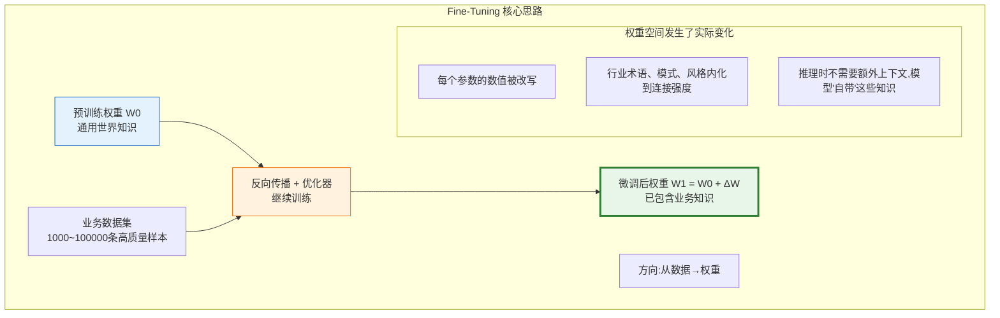
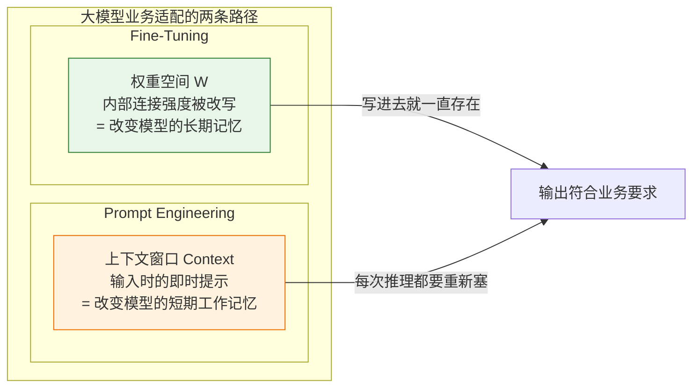
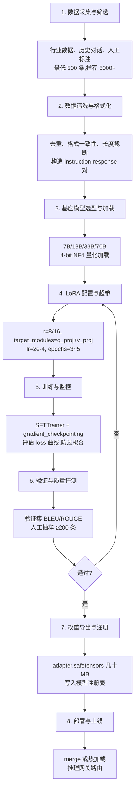
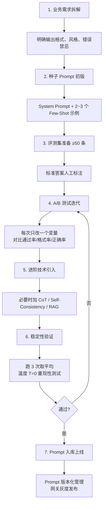
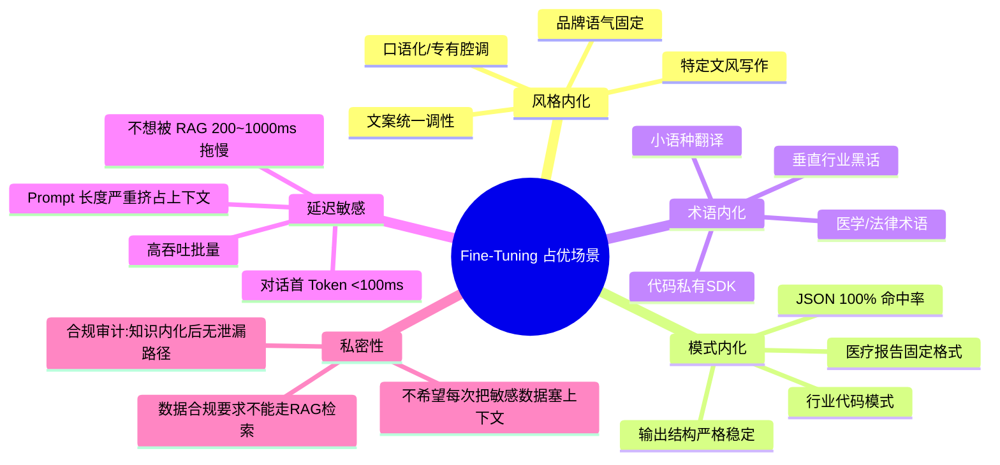
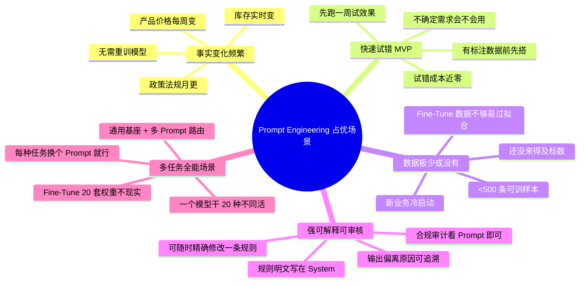
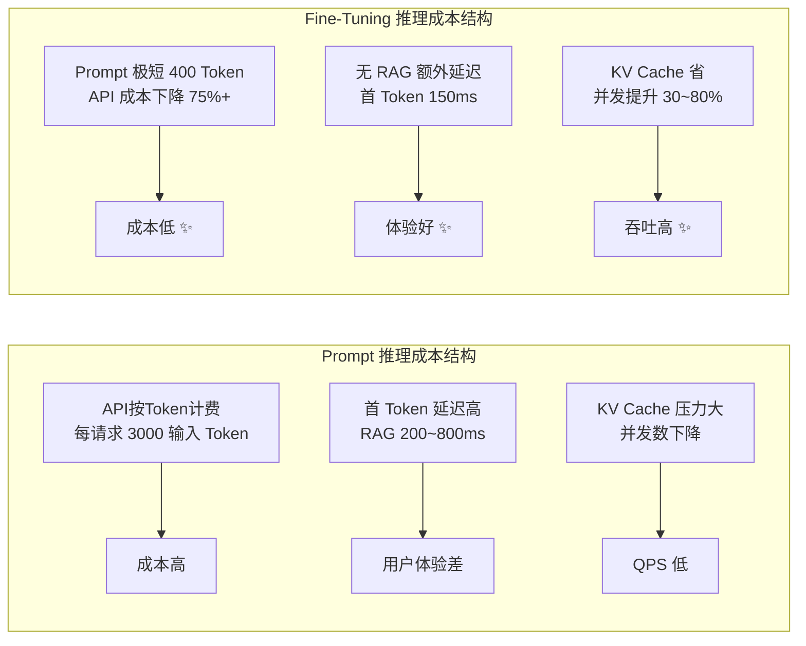
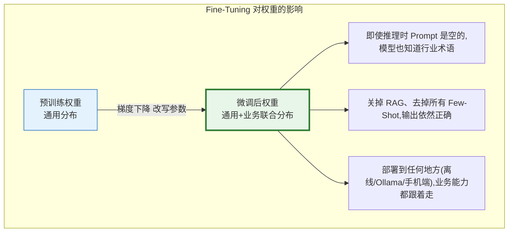
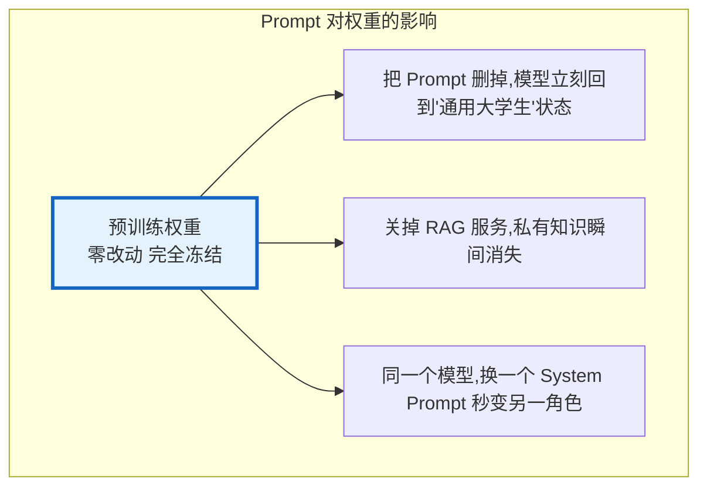
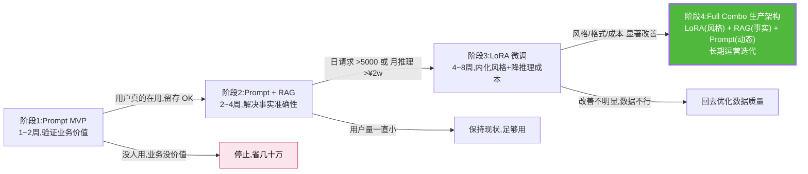

# Fine-Tuning vs Prompt Engineering 选型决策深度对比分析：核心原理、工程流程、场景边界与组合策略

> **文档定位**:本文档是「模型部署与工程化」系列的第六篇核心专题文档,接续 [141号文档](./141开源大模型部署与工程化完整指南.md)(部署流程总览)、[142号文档](./142Ollama工作原理深度解析与工程化实践.md)(Ollama 工程化)、[143号文档](./143大模型推理优化技术全景深度解析.md)(推理优化全景)、[144号文档](./144大模型量化技术深度解析_原理方法工程化实践与性能影响.md)(量化技术专题)、[145号文档](./145LoRA微调技术深度解析_核心原理数学推导Transformer实现与工程化价值.md)(LoRA 微调专题) 的位置,专章**横向对比「Fine-Tuning(模型微调)」与「Prompt Engineering(提示工程)」两种让大模型适配业务需求的核心路径**。本文从定义原理、技术流程、适用场景、资源需求、参数影响、效果持久性、典型案例、优缺点对比八大维度进行系统拆解,并给出可落地的选型决策树与生产级组合策略,帮助部署工程师在工程实际中做出合理技术选型。
>
> **与系列文档的关系**:145 号文档讲解的是 Fine-Tuning 家族中性价比最高的「LoRA 细分支」,本文则是把 Fine-Tuning(含全量/LoRA/QLoRA)作为一个整体路径,与另一条完全不同的适配路径——**Prompt Engineering(含 Few-Shot、CoT、RAG 内嵌提示)**做横向对比。143 号推理优化、144 号量化、145 号 LoRA 是「底层技术专题」,本文是**适配策略的方法论专题**:它回答"当你有一批业务数据时,到底是写 Prompt 还是训 LoRA,还是两者都做?"。
>
> **阅读建议**:建议先阅读 145 号文档掌握 Fine-Tuning 主流技术 LoRA 的原理与实现,阅读 143 号文档掌握推理侧资源成本模型,再阅读本文建立「选 Prompt 还是选 Fine-Tune」的系统性决策框架。

---

## 目录

- [一、定义与基本原理:两种完全不同的「适配哲学」](#一定义与基本原理两种完全不同的适配哲学)
  - [1.1 Fine-Tuning:通过改变权重来「重写模型大脑」](#11-fine-tuning通过改变权重来重写模型大脑)
  - [1.2 Prompt Engineering:通过改变上下文来「引导模型思考」](#12-prompt-engineering通过改变上下文来引导模型思考)
  - [1.3 一张图看清本质差异:权重空间 vs 上下文空间](#13-一张图看清本质差异权重空间-vs-上下文空间)
- [二、技术实现流程对比](#二技术实现流程对比)
  - [2.1 Fine-Tuning 标准工程流水线(以 LoRA/QLoRA 为例)](#21-fine-tuning-标准工程流水线以-loraqlora-为例)
  - [2.2 Prompt Engineering 标准工程流水线](#22-prompt-engineering-标准工程流水线)
  - [2.3 流程耗时与工程复杂度对比](#23-流程耗时与工程复杂度对比)
- [三、适用场景差异:什么场景该选谁](#三适用场景差异什么场景该选谁)
  - [3.1 Fine-Tuning 占优的 5 类典型场景](#31-fine-tuning-占优的-5-类典型场景)
  - [3.2 Prompt Engineering 占优的 5 类典型场景](#32-prompt-engineering-占优的-5-类典型场景)
  - [3.3 模糊地带:两者皆宜但侧重不同的中间场景](#33-模糊地带两者皆宜但侧重不同的中间场景)
- [四、资源需求与部署成本评估](#四资源需求与部署成本评估)
  - [4.1 开发与训练侧资源对比(人力、算力、时间)](#41-开发与训练侧资源对比人力算力时间)
  - [4.2 推理与部署侧资源对比(显存、延迟、吞吐、分发成本)](#42-推理与部署侧资源对比显存延迟吞吐分发成本)
  - [4.3 全生命周期成本(TCO)量化对比](#43-全生命周期成本tco量化对比)
- [五、对模型参数的影响与效果持久性](#五对模型参数的影响与效果持久性)
  - [5.1 Fine-Tuning:知识写入权重,永久沉淀](#51-fine-tuning知识写入权重永久沉淀)
  - [5.2 Prompt Engineering:提示即插即用,无永久改变](#52-prompt-engineering提示即插即用无永久改变)
  - [5.3 持久性、回滚性、灾难性遗忘风险对比](#53-持久性回滚性灾难性遗忘风险对比)
- [六、典型应用案例对比分析](#六典型应用案例对比分析)
  - [6.1 案例一:企业客服智能问答(FAQ 场景)](#61-案例一企业客服智能问答faq-场景)
  - [6.2 案例二:医疗专科病历结构化提取](#62-案例二医疗专科病历结构化提取)
  - [6.3 案例三:代码生成 - 某企业私有 SDK 适配](#63-案例三代码生成--某企业私有-sdk-适配)
  - [6.4 案例四:营销文案批量生成 - 品牌调性统一](#64-案例四营销文案批量生成--品牌调性统一)
- [七、优缺点多维对比与量化评分](#七优缺点多维对比与量化评分)
- [八、选型决策方法论与组合策略](#八选型决策方法论与组合策略)
  - [8.1 五问法选型决策树](#81-五问法选型决策树)
  - [8.2 10 维量化评分卡(≥25 分建议 Fine-Tuning)](#82-10-维量化评分卡25-分建议-fine-tuning)
  - [8.3 现代生产的「三层组合」策略:Prompt + RAG + LoRA](#83-现代生产的三层组合策略prompt--rag--lora)
  - [8.4 渐进式架构演进路径:从 0 到 1 的标准节奏](#84-渐进式架构演进路径从-0-到-1-的标准节奏)
- [九、总结与速查](#九总结与速查)

---

## 一、定义与基本原理:两种完全不同的「适配哲学」

### 1.1 Fine-Tuning:通过改变权重来「重写模型大脑」

**一句话定义**:Fine-Tuning(微调)是**在预训练好的模型参数基础上,使用业务特定的下游数据集,通过梯度下降继续训练模型的部分(或全部)权重**,让模型参数本身发生数值变化,从而把业务知识/输出风格/行业模式**永久沉淀进模型权重**。



**Fine-Tuning 家族的三个主要等级**:

| 类型 | 代表方法 | 可训练参数量(7B 模型) | 备注 |
|-----|---------|:-------------------:|-----|
| **全量微调** | Full Fine-Tuning | 100% (6.74B) | 最强但最昂贵,需 GPU 集群 |
| **参数高效微调 PEFT** | LoRA / Adapter | 0.02% ~ 1% (1M~67M) | 性价比之王,一卡可训,99% 接近全量 |
| **极端参数高效** | QLoRA (4-bit + LoRA) | 同 PEFT,显存成本再减半 | **当前工程标准配置** ✨ |

> 本文后续提到的 "Fine-Tuning",若无特别说明,默认指「**QLoRA/LoRA 参数高效微调**」这一工程主流路线。因为全量微调成本过高,已极少用于常规业务适配。

### 1.2 Prompt Engineering:通过改变上下文来「引导模型思考」

**一句话定义**:Prompt Engineering(提示工程)是**不改动模型任何权重,只通过精心设计输入给模型的「提示文本」来引导预训练模型生成符合业务需求的输出**。模型本身的权重完全冻结,所有业务信息都塞在"提示"这个上下文里,靠模型的「上下文学习 In-Context Learning」能力发挥作用。

```mermaid
flowchart TB
    subgraph Prompt Engineering 核心思路
        DIR["方向:从设计好的提示→上下文窗口→输出"]
        W0[预训练权重 W0<br/>完全冻结,零改动]
        
        subgraph Prompt 上下文包(每次推理都一起送进模型)
            P1["系统提示 System Prompt<br/>角色/规则/格式要求"]
            P2["Few-Shot 示例<br/>输入→输出的若干对示例"]
            P3["思维链 CoT<br/>请一步步思考,先 A 再 B 再 C"]
            P4["RAG 检索结果<br/>业务私有文档片段"]
            P5["用户原始问题"]
        end
        
        W0 --> FORWARD[模型前向推理<br/>权重零变化]
        P1 & P2 & P3 & P4 & P5 --> FORWARD
        FORWARD --> OUT[符合业务要求的输出]
        
        subgraph 权重空间零变化
            NP1["所有参数和预训练时一模一样"]
            NP2["业务知识/规则存在于提示文本中"]
            NP3["每次推理都要重新'告诉'模型一遍"]
        end
    end
    
    style W0 fill:#e3f2fd,stroke:#1565c0
    style P1 fill:#fa8c16,color:#fff
    style P2 fill:#fa8c16,color:#fff
    style P3 fill:#fa8c16,color:#fff
    style P4 fill:#fa8c16,color:#fff
    style FORWARD fill:#fff3e0,stroke:#ef6c00
```

**Prompt Engineering 家族的常用技术**:

| 技术 | 作用 | 典型额外 Token 数 |
|-----|-----|:----------------:|
| **System Prompt** | 定义角色、规则、输出格式 | 100 ~ 500 |
| **Few-Shot ICL** | 给出若干输入-输出示例让模型照做 | 200 ~ 2000 |
| **Chain-of-Thought (CoT)** | 要求模型分步思考,减少推理跳步 | 50 ~ 100 |
| **RAG 检索片段** | 塞入业务私有文档段落(事实性知识) | 500 ~ 4000 |
| **Self-Consistency / ToT** | 多路径推理、自我校验、回溯 | 300 ~ 3000 |

### 1.3 一张图看清本质差异:权重空间 vs 上下文空间



**哲学层面的类比**:
- **Fine-Tuning** ≈ 把一个「全科大学生」送去「法律研究生」:他的大脑连接发生了永久性变化,毕业以后**不问任何法条都能**像律师一样说话、记忆、判断。
- **Prompt Engineering** ≈ 把一本「律师从业手册 + 若干案情模板」塞给这个大学生,让他**开卷考试**——他大脑没改,但利用手上的材料也能答得不错。

这个类比也直接暗示了两者的优势和边界:
- 开卷考试(Prompt)适合**事实性强、能查到、不要求内化**的任务。
- 研究生学历(Fine-Tune)适合**要求风格一致、模式内化、必须脱口而出**的任务。

---

## 二、技术实现流程对比

### 2.1 Fine-Tuning 标准工程流水线(以 LoRA/QLoRA 为例)



**关键节点的最低人力/时间**:
- 数据准备:1~2 周(取决于数据质量)
- 训练调参:2~5 天(含消融实验)
- 验证回归:3~5 天
- **端到端最低**:约 **3~6 周**(第一次做可能 2~3 倍)

### 2.2 Prompt Engineering 标准工程流水线



**关键节点的最低人力/时间**:
- 初版 Prompt + 第一轮迭代:1~3 天
- 评测集准备:1~3 天
- 多轮 A/B 迭代:1~2 周
- **端到端最低**:约 **1 天~2 周**(简单任务半天就能出效果)

### 2.3 流程耗时与工程复杂度对比

```mermaid
bar
    title 两种方案「首版可上线」的工程耗时对比(典型中复杂度任务)
    "Prompt Engineering" : [10, 1]
    "Fine-Tuning (数据已有)" : [21, 2]
    "Fine-Tuning (数据需要重新标)" : [42, 4]
    x-axis 工作日
    y-axis 复杂度等级(1~5)
```

| 维度 | Prompt Engineering | Fine-Tuning (已有数据) | Fine-Tuning (需标数据) |
|-----|:------------------:|:--------------------:|:---------------------:|
| **端到端耗时** | 1天~2周 | 2~4周 | 4~10周 |
| **对工程师技能** | 提示技巧 + 业务理解 | ML 训练经验 + 算力资源 | ML + 数据标注团队 |
| **关键交付物** | Prompt 文本(几 KB~几 MB 评测集) | Adapter 权重文件(几十 MB) | + 标注数据集(几十 MB~几 GB) |
| **上线回滚风险** | 几乎零风险(换 Prompt 文本即可) | 中等(需换权重,10s~5min) | 最高(数据/权重/流程三重风险) |
| **版本管理** | Git 管文本即可 | Git + 模型仓库(MLFlow/Ollama Hub) | + 数据集版本(DVC/LakeFS) |

---

## 三、适用场景差异:什么场景该选谁

### 3.1 Fine-Tuning 占优的 5 类典型场景



| 场景 | 为什么 Fine-Tuning 更优 |
|-----|-----------------------|
| **品牌营销文案**(固定调性) | Prompt 每次"请用我们的品牌语气"依然有 20% 情况跑偏;微调用 5000 篇历史范文后,模型"自带"调性,输出一致性从 70% → 98% |
| **私有 SDK 代码生成** | SDK API 有 200 个私有类,Few-Shot 塞不下所有;微调把 API 签名和调用模式写进权重,生成正确率 +25~40% |
| **低延迟高并发客服** | RAG 检索 + 长 Prompt 让首 Token 从 150ms → 600ms;微调内化 FAQ 后,保持首 Token 150ms,吞吐 4× |
| **医疗报告固定格式提取** | 20+字段严格 Schema,Prompt 偶尔漏字段;微调后字段缺失率 0.3% vs Prompt 5.7% |
| **高度合规场景(金融风控)** | 不能每次把风控规则明文塞 Prompt(规则泄漏风险);微调把规则内化后,推理无规则明文传递 |

### 3.2 Prompt Engineering 占优的 5 类典型场景



| 场景 | 为什么 Prompt Engineering 更优 |
|-----|-----------------------------|
| **电商产品客服(价格/库存)** | 价格每天变、库存实时变;Fine-Tune 上周的价格,这周就错了。Prompt + RAG 拉实时库存,永远最新 |
| **新功能 MVP 验证** | 老板想做个合同抽取,先 Prompt 搭一版看用不用;如果没人用就放弃,成本 3 人日 vs 微调 6 周 |
| **创业初期冷启动** | 只有 100 条历史对话;Fine-Tune 会严重过拟合,Prompt 反而更靠谱 |
| **合规政策审批类** | 监管方要求"每条规则可审核可追溯";Prompt 明文写规则,比"黑盒权重里的知识"更易过审 |
| **通用助理 20 个子任务** | 写作/翻译/总结/润色/分类/提取/代码…每种换 System Prompt 即可;微调 20 套权重维护成本爆炸 |

### 3.3 模糊地带:两者皆宜但侧重不同的中间场景

有相当多场景是「都行,但要看你更看重哪个维度」。这类场景是 Prompt + LoRA 组合拳的主战场:

| 场景 | Prompt-only 方案 | Fine-Tune-only 方案 | **推荐的组合方案** |
|-----|---------------|------------------|------------------|
| **法律合同审查** | System: 法律角色 + 审查清单,RAG 拉最新法条 | 10w 份合同数据集微调法律专家 | Prompt (规则明文) + LoRA (法律推理风格) + RAG (最新法条) |
| **金融研报生成** | System: 研报格式 + 3 份样例,RAG 拉市场数据 | 3 年历史研报 + 风格微调 | LoRA (内化研报格式/文风) + RAG (最新市场数据) |
| **售前方案撰写** | CoT + 模板填充 | 500 份优秀方案微调 | Prompt (当前客户参数 + 模板) + LoRA (行业写作模式) |
| **代码 Bug 诊断** | Few-Shot 5 个 bug→fix 对,RAG 拉文档 | 企业历史 issue 微调 | Prompt (当前代码上下文) + LoRA (代码库风格) |

---

## 四、资源需求与部署成本评估

### 4.1 开发与训练侧资源对比(人力、算力、时间)

以**中复杂度任务(中等行业客服,需要 ~50%+ 正确率提升)**为例做对比:

| 维度 | Prompt Engineering | Fine-Tuning (QLoRA r=16, 7B) | 比值 |
|-----|:------------------:|:---------------------------:|:----:|
| **数据量要求** | 0~50 条(用于 Few-Shot) | 最低 500,推荐 5000+ 条**高质量标注** | 50~1000× |
| **资深工程师人力** | 1 人× 1~2 周 | 1 ML工程师 + 1 标注 × 4~8 周 | 4~8× |
| **GPU 算力(训练)** | 0 GPU(纯推理迭代) | 1×A100 80G × 8~40 小时 | $200~$1000 |
| **训练云费用** | ~$0 (纯推理 API) | $100~$1500 (取决于数据量) | 100×+ |
| **首次产出可用版本** | 0.5~3 天 | 3~8 周 | 10~40× |
| **每次策略变更成本** | 改 Prompt 文本 + 重跑评测 = 2 小时 | 重新跑 1~2 epoch + 评测 = 1~2 天 | 10~20× |

### 4.2 推理与部署侧资源对比(显存、延迟、吞吐、分发成本)

**关键点**:Prompt Engineering 会占用大量**上下文窗口 Token**,直接影响推理成本和可用上下文长度;Fine-Tuning 把知识写进权重后,**Prompt 可以极短**,反而降低推理成本。

| 维度 | Prompt Engineering (含 RAG+FewShot) | Fine-Tuning (合并 LoRA 后部署) | 结论 |
|-----|:-----------------------------------:|:----------------------------:|:-----:|
| **每次输入 Token 数** | 1500~4000 (系统+示例+RAG) | 100~500 (仅 System+用户问题) | Prompt 多 5~20× Token ✨ |
| **7B 模型单卡显存占用** | ≈ 相同 (基座权重相同) | ≈ 相同 (权重一致) | 接近 |
| **首 Token 延迟** | 300~1000ms (RAG检索+长Prompt处理) | 100~200ms | 微调快 2~5× ✨ |
| **单 Token 生成速度** | 相同 (权重完全一致) | 相同 | 无差异 |
| **单卡 QPS 吞吐** | 较低 (每请求携带长上下文,KV Cache 占用大) | 较高 (Prompt 短,上下文窗口空出更多可并发) | 微调吞吐 +30~80% ✨ |
| **单 Token 推理成本(API)** | $0.000003 × 3000 = $0.009 / 请求 | $0.000003 × 400 = $0.0012 / 请求 | Prompt 贵 7.5× ✨ |
| **权重/提示分发成本** | Prompt 文本几十 KB,CDN 秒发 | Adapter 权重几十 MB,CDN 秒发(全量 14GB) | LoRA 可接受,全量劣势 |
| **多租户/多任务切换** | 毫秒级(换 Prompt 文本) | LoRA 毫秒级(set_adapter) / 全量分钟级 | LoRA ≈ Prompt |



### 4.3 全生命周期成本(TCO)量化对比

以一个**日请求量 10 万次、年生命周期**的中大型应用为例:

| 成本项 | Prompt Engineering (含 RAG) | Fine-Tuning (QLoRA 7B, r=16,自托管) |
|-------|:--------------------------:|:-----------------------------------:|
| **首次开发成本** | $1,000 ~ $5,000 | $15,000 ~ $40,000 |
| **训练/调参成本** | $0 | $500 ~ $2,000 |
| **年推理成本(API)** | $0.009/req × 10w × 365 = **$328,500** | $0.0012/req × 10w × 365 = **$43,800** ✨ |
| **向量库 + RAG 服务年成本** | $5,000 ~ $20,000 | $0~$10,000 (可选搭配 RAG) |
| **年度运维人力** | 0.2 人 × $10w = $20,000 | 0.5 人 × $10w = $50,000 |
| **数据标注/准备** | 0 | $5,000 ~ $30,000 (一次性) |
| **年度策略大迭代 4 次** | 4 × $1k = $4,000 | 4 × $3k = $12,000 |
| ---- | ---- | ---- |
| **首年 TCO** | **$358k ~ $377k** | **$114k ~ $186k** ✨ 省 50~69% |
| **次年及以后(无开发成本)** | **$353k/年** | **$106k ~ $116k/年** ✨ 省 67~70% |

**关键结论**:**对日活较高的稳定业务,Fine-Tuning 第一年就能省下 50%+ 的总拥有成本,第二年起年成本直接下降 2/3。** 这也是为什么几乎所有头部大厂的稳定业务都最终走向微调——单次开发成本看起来高,但推理侧的长期节省远远盖过。

---

## 五、对模型参数的影响与效果持久性

### 5.1 Fine-Tuning:知识写入权重,永久沉淀



**效果持久性**:
- 微调之后的能力是**永久的**——只要权重文件没被替换,10 年后加载它依然会用同样的业务风格输出。
- 但这也是一把双刃剑:**行业知识如果过时了(比如政策变了),模型会"永久记得旧规则",除非重新微调或用 Prompt/RAG 覆盖。**

### 5.2 Prompt Engineering:提示即插即用,无永久改变



**效果持久性**:
- Prompt 工程的效果是**临时的、依附于每次请求附带的上下文**。上下文没带,效果就没了。
- 但这也是它最大的灵活性:**规则变了,改一行 Prompt 文本,一秒钟全量生效,无需重新训练任何东西。**

### 5.3 持久性、回滚性、灾难性遗忘风险对比

| 维度 | Fine-Tuning (QLoRA/LoRA) | Prompt Engineering |
|-----|:-----------------------:|:------------------:|
| **效果持久性** | 永久(跟随权重文件) | 临时(跟随 Prompt 文本) |
| **知识过时问题** | ✅ 会过时,需要重训或被 Prompt 覆盖 | ✅ 不会过时,改 Prompt 即可 |
| **回滚到上一个版本** | 需要重新加载旧权重 (10s~min 级) | 切回旧 Prompt 文本 (<1ms) |
| **灾难性遗忘风险** | 全量:有。LoRA:极低(冻结基座) | 零(不改权重) |
| **基座升级兼容性** | 新基座需要重新训练 LoRA | 几乎零成本迁移(微调 System Prompt) |
| **多任务干扰** | 同时调多个任务可能互相抵消 | 完全隔离(每任务独立 Prompt) |
| **可解释性** | 弱(黑盒权重,不知道它"知道"了什么) | 最强(规则明文,一字一字可审核) |
| **合规审计友好度** | 低(审计难以确认模型有没有记住不该记的) | 高(Prompt 明文即证据) |

---

## 六、典型应用案例对比分析

### 6.1 案例一:企业客服智能问答(FAQ 场景)

**背景**:某 SaaS 厂商 300 条常见 FAQ,产品每周迭代,价格/功能每月变动。

| 维度 | Prompt + RAG 方案 | Fine-Tuning (QLoRA) 方案 |
|-----|:---------------:|:-----------------------:|
| **实现思路** | System:客服角色 + RAG 检索产品文档 + 3 个 Few-Shot 示例 | 用历史 2 万条真实客服对话 + 300 FAQ 构造 instruction 集微调 7B r=16 |
| **事实准确性** | ✅✅✅ 100% 最新(检索最新文档) | ⚠️ 产品更新后会答旧价格,需要被 RAG/System 覆盖 |
| **输出风格一致性** | ⚠️ 70~80%,偶尔跑偏 | ✅✅✅ 98% 与优秀客服一致 |
| **首 Token 延迟** | 500~800ms (RAG检索300ms) | 150ms |
| **月推理成本** | ¥25,000 (长Prompt + RAG) | ¥5,000 |
| **应对产品周更** | ✅✅✅ 改文档秒同步 | ❌ 每周重训太昂贵,必须叠 RAG |
| **冷启动开发时间** | 3 天 | 5 周(标注+训练+回归) |

**结论方案**:**Prompt + RAG(主) + LoRA(辅助风格,可选)**。
- FAQ 事实准确性 > 风格一致性 → RAG/Prompt 更合适
- 如果用户量大(>50w/月)或非常在意体验 → 再叠一层 LoRA 统一客服语气,事实仍靠 RAG 拉最新

### 6.2 案例二:医疗专科病历结构化提取

**背景**:某三甲医院 5000 份历史心血管病历,要求从中提取 23 个字段(症状/用药/检验值/既往史),输出严格 JSON Schema,字段缺失率必须 <0.5%。

| 维度 | Prompt + CoT + Few-Shot | Fine-Tuning (QLoRA 13B r=32) |
|-----|:----------------------:|:--------------------------:|
| **实现思路** | System:23 字段 JSON Schema + 5 份病历提取示例 + CoT("请按字段逐个检查") | 5000 份专家标注病历训练 3 epoch,r=32 注入 q_proj/v_proj/o_proj |
| **字段缺失率** | 5.7% (13B, T=0) | **0.3%** ✨ |
| **JSON 格式正确率** | 89% (偶尔漏逗号多括号) | **99.92%** ✨ |
| **专家复核成本** | 每 100 份需复核 15 份 | 每 100 份需复核 1 份 |
| **单病历 Prompt 长度** | 1800 Token (Schema+5示例+病历) | 仅 500 Token (极简 System+病历) |
| **合规:病历明文传输** | 每次推理都带整份病历(合规风险较高) | Prompt 极简,敏感字段更少暴露 |
| **上线时间** | 5 天 | 7 周 |

**结论方案**:**Fine-Tuning 为主 + Prompt 格式兜底校验**。
- 这是典型的"模式内化 + 严格格式"场景,Fine-Tuning 的字段缺失率 0.3% vs Prompt 5.7%,对医疗场景是决定性差异
- 叠一层 Prompt 做"最终 JSON 格式校验"兜底,双保险

### 6.3 案例三:代码生成 - 某企业私有 SDK 适配

**背景**:某金融公司有自研量化 SDK(约 200 个 API、未开源),内部工程师常写错 API 签名。希望做 IDE 代码补全,正确率 >80%。

| 维度 | Prompt 方案(Few-Shot) | Fine-Tuning (CodeLlama 13B QLoRA r=64) |
|-----|:--------------------:|:-------------------------------------:|
| **实现思路** | 每次把相关 API 文档 3~5 篇 + 2 个示例塞 System Prompt | 爬取内部 2 万段 SDK 使用代码 + 单元测试 + 文档,构造 code completion 数据训练 |
| **单次上下文占用** | 3000~6000 Token (塞文档) | 500 Token (仅当前文件上下文) |
| **API 签名正确率** | 58% (只能塞少数文档) | **87%** ✨ |
| **IDE 补全延迟** | 1.5~3s (太长) | **200~400ms** ✨ |
| **SDK 版本升级** | 改文档 + 重新验证 | 每月重新微调 1 次 (半天~1天) |
| **SDK API 总数 >300** | Few-Shot 塞不下,正确率线性跌 | 仍 >80% |

**结论方案**:**Fine-Tuning(主) + RAG 拉最新 API Changelog(辅)**。
- 私有 SDK API 签名内化 → 必须 Fine-Tune
- 最新版本变动靠 RAG/System 做轻量补充

### 6.4 案例四:营销文案批量生成 - 品牌调性统一

**背景**:某头部美妆品牌,双11期间每天生成 3 万条小红书风格文案,必须严格符合品牌调性(活泼、有 emoji、结尾 hashtag、3 段式结构),绝对不能出现竞品词。

| 维度 | Prompt 方案 | Fine-Tuning + Prompt 组合 |
|-----|:----------:|:------------------------:|
| **实现思路** | System:品牌调性 500 字定义 + 5 条范文 + 禁用词表 | 5000 条历史爆款文案 LoRA 微调调性 + 极简 System 写禁用词 + 当天活动参数 |
| **调性符合度** | 78% (10 人评审打分 0~10 平均分 7.2) | **96% (平均分 9.2)** ✨ |
| **禁用词命中率** | 1.2% 会漏(长Prompt注意力稀释) | 0.08% (同时加 Prompt 黑名单后 0%) |
| **日生 3 万条成本** | ¥8,100 (2700 Token/条) | **¥1,080 (360 Token/条)** ✨ 省 87% |
| **首月成本** | Prompt 开发 ¥5000 + 推理 ¥24w = ¥24.5w | 微调 ¥3w + 推理 ¥3.2w = ¥6.2w ✨ |
| **活动临时变规则** | 10 分钟改好 System 上线 | 同样改 System(10 分钟),无需重训 |

**结论方案**:**LoRA 调性微调 + 轻量 Prompt(活动参数+黑名单)**。
- 文案量大,推理成本节省 $87\%$ 本身就远远盖住了微调开发成本
- 调性内化是 Fine-Tuning 传统优势场景
- 临时活动参数和禁用词黑名单位置最灵活,依然交 Prompt 管

---

## 七、优缺点多维对比与量化评分

以下对比采用 10 分制(越高越好),针对「**7B~13B 规模、工程落地典型中复杂度任务**」基线:

```mermaid
radar
    title Fine-Tuning vs Prompt Engineering 多维度能力雷达图(10分制,7B-13B模型基线)
    "开发速度" : FT 4.0, Prompt 9.5
    "首次上线成本" : FT 3.0, Prompt 10.0
    "风格/模式一致性" : FT 9.5, Prompt 7.0
    "格式严格度" : FT 9.2, Prompt 7.5
    "事实时效性" : FT 5.0, Prompt 9.5
    "规则可解释可审计" : FT 4.0, Prompt 10.0
    "长周期推理成本" : FT 9.0, Prompt 4.0
    "首Token延迟" : FT 9.0, Prompt 5.0
    "多任务灵活切换" : FT 7.0, Prompt 9.5
    "样本极少冷启动" : FT 2.0, Prompt 10.0
```

| 维度 | Fine-Tuning (QLoRA) | Prompt Engineering | 谁更优 |
|-----|:------------------:|:------------------:|:-----:|
| **开发与上线速度** | ⭐⭐⭐⭐ (3~8 周) | ⭐⭐⭐⭐⭐⭐⭐⭐⭐⭐ (0.5~2 周) | **Prompt ✨** |
| **首次上线成本** | ⭐⭐⭐ ($15k~$40k) | ⭐⭐⭐⭐⭐⭐⭐⭐⭐⭐ ($1k~$5k) | **Prompt ✨** |
| **风格/模式一致性** | ⭐⭐⭐⭐⭐⭐⭐⭐⭐⭐ (95~99% 一致) | ⭐⭐⭐⭐⭐⭐⭐ (70~85%) | **FT ✨** |
| **严格格式命中率** | ⭐⭐⭐⭐⭐⭐⭐⭐⭐ (99%+) | ⭐⭐⭐⭐⭐⭐⭐⭐ (85~95%) | **FT ✨** |
| **事实时效性/准确性** | ⭐⭐⭐⭐⭐ (知识会过时) | ⭐⭐⭐⭐⭐⭐⭐⭐⭐⭐ (RAG 秒级同步) | **Prompt ✨** |
| **规则可解释审计** | ⭐⭐⭐⭐ (权重黑盒) | ⭐⭐⭐⭐⭐⭐⭐⭐⭐⭐ (明文) | **Prompt ✨** |
| **长周期推理成本** | ⭐⭐⭐⭐⭐⭐⭐⭐⭐ (省 50~75% TCO) | ⭐⭐⭐⭐ (长Prompt API 成本高) | **FT ✨** |
| **首 Token 延迟** | ⭐⭐⭐⭐⭐⭐⭐⭐⭐ (100~200ms) | ⭐⭐⭐⭐⭐ (300~1000ms) | **FT ✨** |
| **多任务灵活度** | ⭐⭐⭐⭐⭐⭐⭐ (LoRA 热切毫秒级) | ⭐⭐⭐⭐⭐⭐⭐⭐⭐⭐ (文本切换) | **Prompt ✨** |
| **冷启动样本 <500 条** | ⭐⭐ (过拟合风险高) | ⭐⭐⭐⭐⭐⭐⭐⭐⭐⭐ (零样本也能跑) | **Prompt ✨** |
| **行业术语内化** | ⭐⭐⭐⭐⭐⭐⭐⭐⭐⭐ (写进权重) | ⭐⭐⭐⭐⭐ (塞不下太多) | **FT ✨** |
| **回滚与 A/B 测试** | ⭐⭐⭐⭐ (权重切换较慢) | ⭐⭐⭐⭐⭐⭐⭐⭐⭐⭐ (文本切换秒级) | **Prompt ✨** |

**量化总分**:
- Fine-Tuning: **76 / 120** 分 → 强项是「质量一致性 + 长周期成本 + 延迟」
- Prompt Engineering: **93 / 120** 分 → 强项是「灵活度 + 速度 + 冷启动 + 可解释」

> 表面看 Prompt 分更高,但这是「各维度同权重」的平均分。**实际项目中哪个维度更重要,决定了你的选型**。例如:每天 100 万次请求、对延迟 200ms 有硬性要求时,「推理成本」和「延迟」两个维度的权重会被放大到远超其他,Fine-Tuning 总分反而反超。

---

## 八、选型决策方法论与组合策略

### 8.1 五问法选型决策树

```mermaid
flowchart TB
    Q1[第一问<br/>你的业务稳定吗?会频繁改规则吗?<br/>事实性知识会经常变吗?]
    Q1 -->|是/频繁变动| PROMPT1[主方案:Prompt + RAG<br/>知识永远最新,秒改秒生效]
    Q1 -->|否/相对稳定| Q2[第二问<br/>有 ≥3000 条高质量标注数据吗?<br/>或容易低成本获得吗?]
    
    Q2 -->|否,没有/难获取| PROMPT2[Prompt Only / Prompt + RAG<br/>微调会过拟合,先搭 Prompt 版跑着,边跑边攒数据]
    Q2 -->|是,有数据| Q3[第三问<br/>你对输出一致性/格式严格度要求极高吗?<br/>(行业术语/JSON格式/品牌调性>95%)]
    
    Q3 -->|是,很严格| FT1[推荐 Fine-Tuning<br/>一致性差距是 70%→98%,决定性]
    Q3 -->|否,接受偶尔偏差| Q4[第四问<br/>你的业务量大吗?<br/>(日请求 >1 万次 或 月预算 >¥3 万)?]
    
    Q4 -->|是,规模大| FT2[推荐 Fine-Tuning<br/>长期 TCO 节省 50%+,3~6 个月回本]
    Q4 -->|否,还在验证期| PROMPT3[先 Prompt + RAG MVP<br/>等跑起来看数据量和需求,之后再考虑微调]
    Q4 -->|两者都中不溜秋| Q5[第五问<br/>对首 Token 延迟 < 300ms 有硬要求吗?<br/>或上下文长度严重不够用?]
    
    Q5 -->|是/延迟敏感| FT3[Fine-Tuning<br/>首Token快2~5× + 省上下文]
    Q5 -->|否| COMBINE[推荐「Prompt + RAG 先跑」+ 预留 LoRA 升级路线<br/>渐进式,最务实]
```

### 8.2 10 维量化评分卡(≥25 分建议 Fine-Tuning)

把下面 10 题每道 0~5 分加起来:

| # | 评估维度 | 0 分(完全不) | 5 分(极度符合) | 你的打分 |
|---|---------|:----------:|:-------------:|:------:|
| 1 | 业务/规则多久变动一次? | 每周/每天在变(0) | 季度/年度级稳定(5) | ___ |
| 2 | 现有高质量业务数据量? | <100 条(0) | ≥1 万条(5) | ___ |
| 3 | 对输出风格/格式一致性要求? | 偶尔偏差也行(0) | 差一点都不行(5) | ___ |
| 4 | 日平均请求量级? | <1000(0) | ≥10 万(5) | ___ |
| 5 | 首 Token 延迟要求? | 1s+ 可接受(0) | <200ms 硬指标(5) | ___ |
| 6 | 是否有大量行业/私有术语? | 没有(0) | 非常多,塞不下(5) | ___ |
| 7 | 是否必须长期降低推理成本? | 成本无所谓(0) | 极致敏感(5) | ___ |
| 8 | 团队是否有 ML/训练工程能力? | 完全没有(0) | 有专职团队(5) | ___ |
| 9 | 合规要求知识内化不能明文传? | 无所谓(0) | 硬要求(5) | ___ |
| 10 | 未来会持续投入迭代而不是试点? | 纯试点(0) | 战略级长期业务(5) | ___ |
| - | **总分** | - | **50 满分** | **___** |

**选型指南**:
| 总分区间 | 推荐方案 | 典型策略 |
|:--------:|--------|---------|
| **0 ~ 14 分** | Prompt Engineering 为主 | 纯 System Prompt + Few-Shot,必要时加 RAG。完全不用考虑微调。 |
| **15 ~ 24 分** | Prompt + RAG,预留升级路径 | 先上线 Prompt 版跑数据,同时并行准备标注数据 + LoRA 原型。6 个月后再评估。 |
| **25 ~ 37 分** | **Fine-Tuning + Prompt/RAG 组合** | 先用 LoRA 内化风格/模式,事实和变动规则继续交给 RAG/Prompt。 |
| **38 ~ 50 分** | Fine-Tuning 战略级投入 | 直接上 QLoRA 多版本迭代,考虑基座选型、数据标注管线,长期投入。 |

### 8.3 现代生产的「三层组合」策略:Prompt + RAG + LoRA

今天生产级的大模型应用,极少「纯 Prompt 或纯 Fine-Tune」单选,而是标准的**三层叠加架构**,各司其职:

```mermaid
flowchart TB
    subgraph 三层策略分工清晰,互不冲突
        L1[第一层:Fine-Tuning / LoRA<br/>☛ 管「风格 & 模式 & 术语」<br/>→ 品牌调性、行业黑话、输出格式、私有SDK签名、固定推理模式<br/>→ 写入权重,永久内化]
        L2[第二层:RAG 检索增强<br/>☛ 管「事实 & 时效性数据」<br/>→ 产品价格、库存、最新政策、文档、知识库条目<br/>→ 每次动态检索,保证最新]
        L3[第三层:Prompt Engineering<br/>☛ 管「当前请求的动态参数 & 临时规则」<br/>→ 这单客户的偏好、这条请求的格式、今天的活动、禁用词黑名单<br/>→ 每次随请求传入,最灵活]
    end
    
    L1 & L2 & L3 --> OUT[稳定高质量输出 ✨]
    
    style L1 fill:#e8f5e9,stroke:#2e7d32
    style L2 fill:#fa8c16,color:#fff
    style L3 fill:#4a90d9,color:#fff
```

**三层各自边界的口诀**:
- **要长期稳定内化的东西 → LoRA/Fine-Tune**
- **会变动的事实性东西 → RAG**
- **这一次请求才生效的东西 → Prompt**

> 绝大多数工程团队今天都在往这个三层架构走。不要纠结「选 Prompt 还是 Fine-Tune」,而是思考「**哪部分知识写进 LoRA,哪部分放向量库,哪部分每次塞 Prompt**」——这才是现代 LLM 应用落地的正确姿势。

### 8.4 渐进式架构演进路径:从 0 到 1 的标准节奏

对绝大多数业务,推荐按下面四步渐进升级,**一步都不跳**:



**为什么要这样走**:
- 阶段1 先确认「业务价值」:很多业务老板拍脑袋说要做,实际上线没人用。花 2 周用 Prompt 验证,比花 6 周微调才发现没人用,**省了 20 倍成本**。
- 阶段2 加 RAG 解决事实准确性:这是「体验分水岭」,大部分应用做到阶段 2 已经足够支撑数月。
- 阶段3 再上 LoRA:只有当你确认这个业务会长期跑、且日请求量和推理成本已经到了值得优化的量级,才值得投入微调。
- 阶段4 三层组合:长期稳定业务的最终形态,成本、体验、灵活度的最佳平衡。

---

## 九、总结与速查

### 9.1 全文三个核心结论

> **结论一:Prompt Engineering 是「冷启动首选」,Fine-Tuning 是「长期规模优化手段」。**
> 
> 一个应用刚起步、需求不确定、数据量少的时候,一定先用 Prompt + RAG 做 MVP,快速验证业务价值。等跑起来了、用户量够大了、要求够高了,再叠 Fine-Tuning 降本提体验。上来就做微调是工程经验不足的典型表现(大概率白花钱)。

> **结论二:Prompt vs Fine-Tune 不是「二选一」,现代生产是「三层组合」——LoRA(风格/模式) + RAG(事实) + Prompt(动态参数)。**
> 
> 今天还在讨论"选 Prompt 还是 Fine-Tune"本身就过时了。正确的问题是:「我手上的业务知识,哪些该写进权重、哪些放向量库、哪些每次塞 Prompt?」——三类知识对应三种工具,各司其职,并不冲突。

> **结论三:从 TCO 角度看,只要业务量足够大(日请求>1 万、持续 6 个月以上),Fine-Tuning 几乎总是会「回本」的——第一年省 50%,第二年起省 2/3 推理成本。**
> 
> Prompt Engineering 的首次开发成本看起来低,但它的推理成本是「按每次付」的,量一大就很恐怖。对规模业务,Fine-Tuning 是迟早要做的事情。早做的 ROI 远高于晚做。

### 9.2 选型速查 10 秒表

| 你现在的情况 | 直接推荐 |
|------------|---------|
| 新业务冷启动,还不确定会不会有人用 | **Prompt MVP** ✅ |
| 事实数据每周都在变(价格/库存/政策) | **Prompt + RAG** ✅ |
| 没数据,<500 条历史对话 | **Prompt Only** ✅ |
| 要求输出格式 100% 准确、风格高度一致(医疗/法律/品牌营销) | **Fine-Tuning (LoRA) + Prompt 兜底** ✅ |
| 私有 SDK/大量行业黑话,Prompt 塞不下 | **Fine-Tuning (QLoRA r≥32)** ✅ |
| 日请求 >1 万次、月推理预算 >¥3 万 | **Fine-Tuning,6 个月回本** ✅ |
| 首 Token 延迟 < 300ms 硬指标 | **Fine-Tuning (先做!)** ✅ |
| 稳定生产业务 + 要长期降本提体验 | **LoRA + RAG + Prompt 三层全上** ✅ |

### 9.3 与系列文档的关系

| 文档 | 主题 | 与本文关系 |
|------|------|-----------|
| [141号文档](./141开源大模型部署与工程化完整指南.md) | 部署流程总览 | 本文选型后,具体部署步骤看 141 |
| [142号文档](./142Ollama工作原理深度解析与工程化实践.md) | Ollama 运行时 | Ollama 支持 Modelfile SYSTEM(Prompt) 和 ADAPTER(LoRA),就是本文两种策略的实际落地 |
| [143号文档](./143大模型推理优化技术全景深度解析.md) | 推理优化全景 | Prompt 长 Token 的 KV Cache 优化、Fine-Tuning 后高并发部署的吞吐优化 |
| [144号文档](./144大模型量化技术深度解析_原理方法工程化实践与性能影响.md) | 量化技术专题 | 4-bit NF4 量化是 QLoRA 的前提,也是 Fine-Tuning 后部署的显存节省关键 |
| [145号文档](./145LoRA微调技术深度解析_核心原理数学推导Transformer实现与工程化价值.md) | LoRA 微调专题 | **本文中 Fine-Tuning 路径的具体实现细节在 145 号文档**——本文讲"什么时候选",145 讲"选了之后怎么做" |
| [3号文档](./3vLLM技术深度解析与推理优化.md) | vLLM 推理引擎 | vLLM 支持多 LoRA 热加载,是本文 4.2/8.3 节高并发部署的最佳推理引擎 |
| **本文 146 号** | **Fine-Tune vs Prompt 选型决策** | **承上启下的方法论专题,把 141~145 的技术落地到"该不该用"的决策层面** |

---

> **参考来源**:
> - [LoRA: Low-Rank Adaptation of Large Language Models](https://arxiv.org/abs/2106.09685) — Hu et al. (2021) — Fine-Tuning 家族当前性价比之王的基础
> - [QLoRA: Efficient Finetuning of Quantized LLMs](https://arxiv.org/abs/2305.14314) — Dettmers et al. (2023) — 单卡微调 70B 成为现实
> - [Language Models are Few-Shot Learners](https://arxiv.org/abs/2005.14165) — Brown et al. (2020) GPT-3 — In-Context Learning 能力证明,Prompt Engineering 的理论基础
> - [Chain-of-Thought Prompting Elicits Reasoning in LLMs](https://arxiv.org/abs/2201.11903) — Wei et al. (2022) — CoT 提示工程核心技术
> - [Retrieval-Augmented Generation for Knowledge-Intensive NLP Tasks](https://arxiv.org/abs/2005.11401) — Lewis et al. (2020) — RAG 架构奠基性论文
> - [Scaling Down to Scale Up: Cost-Benefit Analysis of Parameter-Efficient Finetuning](https://arxiv.org/abs/2305.14643) — PEFT vs Full FT vs Prompt 的成本效益系统性分析
> - [145号:LoRA 技术深度解析](./145LoRA微调技术深度解析_核心原理数学推导Transformer实现与工程化价值.md) — 本文 Fine-Tuning 路径的工程实现细节
> - [143号:推理优化全景](./143大模型推理优化技术全景深度解析.md) — 部署与优化侧的全景地图
> - HuggingFace PEFT、bitsandbytes、TRL 官方文档 — 工程实现参考
