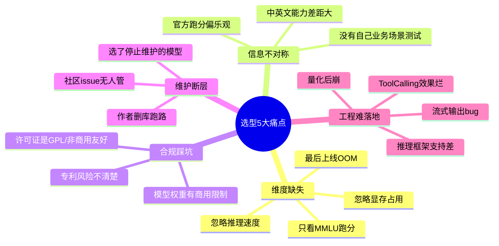
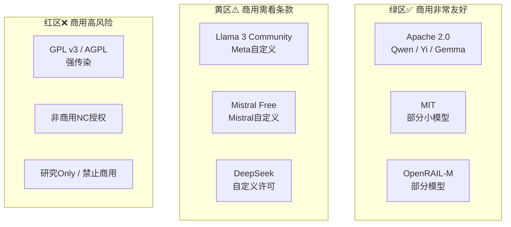
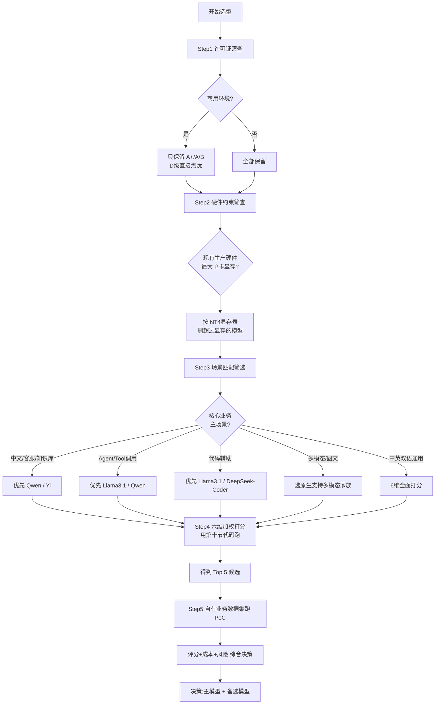

# 开源大模型选型评估框架与系统性决策指南

> 文档定位:为企业/团队在模型部署与工程化阶段提供一套**可量化、可落地、可重复**的开源大模型选型评估框架。覆盖 6 大评估维度(性能/兼容性/硬件/社区/许可证/工程适配)、主流量化模型横向对比、加权评分模型与代码化选型器、场景化决策流程与选型陷阱,帮助团队在数百个开源模型中,用同一套标准,在 2-3 天内选出符合自身业务需求与预算的 3-5 个候选模型,并进入下一步的 PoC 验证。
>
> 建议配合阅读:
> - [143大模型推理优化技术全景深度解析.md](./143大模型推理优化技术全景深度解析.md)
> - [144大模型量化技术深度解析_原理方法工程化实践与性能影响.md](./144大模型量化技术深度解析_原理方法工程化实践与性能影响.md)
> - [145LoRA微调技术深度解析_核心原理数学推导Transformer实现与工程化价值.md](./145LoRA微调技术深度解析_核心原理数学推导Transformer实现与工程化价值.md)
> - [146Fine-Tuning与Prompt-Engineering选型决策深度对比分析.md](./146Fine-Tuning与Prompt-Engineering选型决策深度对比分析.md)
> - [141开源大模型部署与工程化完整指南.md](./141开源大模型部署与工程化完整指南.md)
> - [3vLLM技术深度解析与推理优化.md](./3vLLM技术深度解析与推理优化.md)

---

## 目录

- [一、选型背景与核心挑战](#一选型背景与核心挑战)
- [二、评估框架总览(6 大维度 × 权重体系)](#二评估框架总览6-大维度--权重体系)
- [三、维度 1:模型性能指标评估](#三维度-1模型性能指标评估)
- [四、维度 2:推理性能与资源消耗](#四维度-2推理性能与资源消耗)
- [五、维度 3:部署兼容性评估](#五维度-3部署兼容性评估)
- [六、维度 4:许可证与商业合规](#六维度-4许可证与商业合规)
- [七、维度 5:社区与可持续性](#七维度-5社区与可持续性)
- [八、维度 6:工程化流程适配性](#八维度-6工程化流程适配性)
- [九、主流量化开源模型横向对比表(Top 14)](#九主流量化开源模型横向对比表top-14)
- [十、加权评分模型与代码化选型器实现](#十加权评分模型与代码化选型器实现)
- [十一、场景化决策流程与快速推荐](#十一场景化决策流程与快速推荐)
- [十二、选型常见陷阱与规避建议](#十二选型常见陷阱与规避建议)
- [十三、实施步骤与 PoC 验证清单](#十三实施步骤与-poc-验证清单)

---

## 一、选型背景与核心挑战

### 1.1 为什么需要**体系化**的选型框架

开源大模型选型的典型痛苦经历:



### 1.2 选型周期与目标

| 阶段 | 周期 | 产出 | 目标 |
|-----|:----:|-----|------|
| **S1 初筛** | 0.5 天 | 6 大维度打分 → 3-5 个候选模型 | 从 30+ 热门模型缩到 5 个以内 |
| **S2 快速基准** | 1 天 | 推理速度/显存/基础能力基准 | 验证部署可行性与基础性能 |
| **S3 业务场景 PoC** | 3-7 天 | 自有业务数据集的准确率/幻觉率/成本 | 验证真实业务价值 |
| **S4 综合决策** | 0.5 天 | 选型报告 + 回滚方案 | 决策 + 确定备选方案 |
| **合计** | **5-9 天** | | 避免"拍脑袋选LLaMA,上线后悔" |

### 1.3 选型原则(6 条黄金法则)

| # | 原则 | 解释 |
|:-:|-----|------|
| 1 | **业务场景优先,跑分其次** | MMLU 高不代表你场景好;先用自己的 100 条业务题测 |
| 2 | **推理成本 > 准确率** | 多数场景,准确率差 3% 但成本降 50%,业务价值更高 |
| 3 | **许可证一票否决** | 商用环境先过法务;APACHE/MIT > Llama3 Commercial > GPL |
| 4 | **至少选 2 个,留退路** | 主方案 + 次方案,避免单点依赖 |
| 5 | **中英双语分开评估** | 多数开源模型中文能力显著劣于英文,中文业务必须单独测 |
| 6 | **工程支持比"最强 7B"重要** | 选框架支持好、文档全、issue 响应快的,避免"改源码半年" |

---

## 二、评估框架总览(6 大维度 × 权重体系)

### 2.1 六维评估雷达图

```mermaid
radar
    title 开源模型选型六维雷达(满分100)
    "性能 40%" : 90
    "推理成本 20%" : 80
    "兼容性 10%" : 85
    "许可证 10%" : 95
    "社区 10%" : 88
    "工程适配 10%" : 82
```

### 2.2 权重体系与三级评分

| 维度 | 权重占比 | 满分 | 三级子指标 | 子权重 |
|-----|:-------:|:---:|-----------|:------:|
| **D1 模型性能** | **40%** | 40 | 通用能力(MMLU等) | 10 |
| | | | 业务场景准确率(自有数据集) | **15 最高** |
| | | | 中文专项能力 | 5 |
| | | | 幻觉率/事实性 | 5 |
| | | | 对齐能力/遵循指令 | 3 |
| | | | 多模态/工具调用(按需) | 2 |
| **D2 推理性能与资源** | **20%** | 20 | 推理速度(tokens/s / GPU) | 6 |
| | | | 显存占用(FP16 / INT8 / INT4) | 6 |
| | | | 并发吞吐(QPS@延迟SLA) | 5 |
| | | | 量化损失(INT4质量下滑率) | 3 |
| **D3 部署兼容性** | **10%** | 10 | 推理框架支持(vLLM/llama.cpp/Ollama/TGI) | 4 |
| | | | 硬件支持(N卡/A卡/Apple/CPU) | 3 |
| | | | 量化格式支持(AWQ/GPTQ/HQQ/FP8) | 2 |
| | | | Function Calling / 流式 / 长上下文 | 1 |
| **D4 许可证合规** | **10%** | 10 | 商用许可友好度 | 5 |
| | | | 开源程度/是否可修改 | 2 |
| | | | 再分发/嵌入产品限制 | 2 |
| | | | 专利/数据风险 | 1 |
| **D5 社区与可持续性** | **10%** | 10 | GitHub Star / Release 频率 | 3 |
| | | | 维护者响应 / Issue 关闭率 | 3 |
| | | | 生态工具/教程/微调脚本数 | 2 |
| | | | 模型版本迭代稳定性 | 2 |
| **D6 工程化适配性** | **10%** | 10 | 与现有工程栈兼容 | 4 |
| | | | LoRA/微调成本与工具链支持 | 3 |
| | | | 监控/可观测性指标暴露 | 2 |
| | | | 回滚/切模型切换成本 | 1 |

> **总得分 = D1*0.4 + D2*0.2 + D3*0.1 + D4*0.1 + D5*0.1 + D6*0.1**,范围 0-100。**≥80 强烈推荐;70-80 可用;60-70 慎用;<60 淘汰**。

---

## 三、维度 1:模型性能指标评估

### 3.1 两大评估类别:**通用基准** vs **业务场景**

| 类别 | 代表指标集 | 说明 | 推荐权重 |
|-----|-----------|------|:-------:|
| **通用基准** | MMLU / C-Eval / CMMLU / GSM8K / HumanEval / TruthfulQA / MT-Bench | 公开数据集,公平对比 | **25%** (仅参考) |
| **自有业务场景** | 自己的 100-500 条业务数据集 + 人评 + 自动评 | 最贴合自己业务 | **75%** (一票优先) |

### 3.2 通用基准能力对照(得分范围 0-100)

| 能力维度 | 代表性基准 | 业务含义 | 合格线(7B级) | 优秀(7B级) |
|---------|-----------|---------|:----------:|:---------:|
| **通用知识** | MMLU(英) / C-Eval(中) / CMMLU(中) | 回答事实性问题 | 60+ | 70+ |
| **中文能力** | CMMLU / C-Eval / 人文社科子集 | 中文理解/表达 | 65+ | 75+ |
| **推理/数学** | GSM8K / MATH / ARC | 数学+逻辑推理 | 50+ | 65+ |
| **代码生成** | HumanEval / MBPP / LiveCodeBench | 写代码/调试 | 35+ | 50+ |
| **事实性(反幻觉)** | TruthfulQA / FactScore | 减少胡说八道 | 50+ | 65+ |
| **指令遵循** | IFEval / MT-Bench(对话分) | 听人话、守格式 | 7.0/10 | 8.0+/10 |
| **长上下文** | LongBench / RULER / Needle-in-Haystack | RAG长文本能力 | 8K@80%召回 | 32K@80%召回 |
| **Tool Calling** | ToolBench / ToolAlpaca / 自构建函数调用集 | Agent函数调用 | 70%+ 格式正确 | 85%+ 格式正确 |

### 3.3 **自有业务场景**评估法(最重要)

#### Step 1: 构建业务黄金集(2 小时)

```yaml
# business_golden_set_v1.yaml
dataset_info:
  name: "my_agent_business_v1"
  count: 200
  categories:
    customer_service_qa:   80   # 客服问答
    internal_knowledge_rag: 60   # 内部知识库RAG
    code_assist_api:        40   # 代码辅助
    agent_tool_calling:     20   # Agent工具调用
  fields_per_record:
    - id                 # 记录ID
    - category
    - query              # 用户输入
    - system_prompt      # 实际使用的SystemPrompt
    - expected_keywords  # 答案必须包含的关键词(自动评)
    - forbidden_keywords # 答案禁止出现(幻觉防护)
    - reference_answer   # 参考答案(人评)
    - difficulty: 1-5    # 难度
    - priority: P0-P2    # 业务优先级
quality_control:
  duplicate_check: true
  category_quota: true
  reviewer_double_check_pct: 0.2  # 20%双人复核
```

#### Step 2: 统一评分 Rubric

每条记录评分 0-10,按 P0-P2 加权求总分:

```text
评分维度(每条):
  1) 正确性(4分): 是否命中关键词/参考答案语义
  2) 完整性(2分): 有没有遗漏重要信息
  3) 无幻觉(2分): 不含禁止内容、不编造事实
  4) 格式遵循(1分): 是否按要求的JSON/Markdown格式
  5) 语言自然(1分): 是否流畅
```

#### Step 3: 跑批脚本要点

- **固定随机种子**(保证可重复)
- **相同解码参数**(temperature=0.7, top_p=0.9, max_tokens 一致)
- **相同量化格式**(同一套 INT4 AWQ, 或都 FP16)
- **超时保护**(60 秒超时记 0 分 + 记录错误)

---

## 四、维度 2:推理性能与资源消耗

### 4.1 推理 5 大核心指标

| 指标名 | 单位 | 测量方法 | 业务含义 |
|-------|:----:|---------|---------|
| **单卡吞吐** | tokens/s / GPU | 输出 100 万 tokens 总耗时计算 | 直接决定处理能力 |
| **首 Token 延迟 TTFT** | ms | 输入1K,输出1Token计时 | 对话交互体感 |
| **端到端 P99 延迟** | ms | 输入长度分布×输出长度分布的99分位 | SLA 达标判定 |
| **显存占用** | GB | FP16 / INT8 / INT4 三种格式下峰值显存 | GPU选型/能否上线 |
| **并发 QPS** | 请求/s | 在 P99 延迟 ≤ SLA 条件下最大稳定 QPS | 决定服务副本数/成本 |

### 4.2 硬件-模型大小显存速查表(含量化)

```mermaid
flowchart LR
    subgraph 模型大小
        M1_7B["7B"]
        M2_14B["14B"]
        M3_34B["34B"]
        M4_70B["70B"]
    end
    
    subgraph FP16 / BF16
        FP1[13-16GB]
        FP2[26-30GB]
        FP3[68-75GB]
        FP4[130-140GB]
    end
    
    subgraph INT8
        I1[7-8GB]
        I2[14-16GB]
        I3[34-38GB]
        I4[65-72GB]
    end
    
    subgraph INT4 AWQ/GPTQ
        Q1[3.5-4.5GB]
        Q2[7-8GB]
        Q3[17-20GB]
        Q4[32-38GB]
    end

    M1_7B --> FP1 -->|可跑| GPU_4090_24GB✅
    M2_14B --> FP2 -->|需| A100_40GB✅  4090_24GB❌
    M3_34B --> FP3 -->|需| 单卡A100_80GB / 双卡4090
    M4_70B --> FP4 -->|需| 双卡A100_80GB / 四卡4090
    
    M1_7B --> I1 -->|可跑| 3090_24GB✅ 甚至笔记本4060_8GB✅
    M2_14B --> I2 -->|可跑| 4090_24GB✅
    M3_34B --> I3 -->|可跑| A100_40GB✅ 4090_24GB❌
    M4_70B --> I4 -->|可跑| A100_80GB✅ A100_40GB双卡✅
    
    M1_7B --> Q1 -->|极致| 笔记本3060_6GB✅ 甚至CPU可跑
    M2_14B --> Q2 -->|极致| RTX 3080_10GB✅
    M3_34B --> Q3 -->|极致| 4090_24GB✅✅
    M4_70B --> Q4 -->|极致| 单卡4090_24GB + 部分CPU offload
```

### 4.3 硬件选型快速匹配(先锁硬件预算再选模型)

| 硬件场景 | 最大可选模型(稳定跑 INT4) | 最大可选模型(FP16生产) |
|---------|:------------------------:|:--------------------:|
| 个人笔记本 RTX 4060 8GB | **7B**(甚至跑14B较慢) | 不推荐 |
| 单卡 RTX 3090/4090 24GB | **34B INT4** / 70B 慢速 | 13B-14B |
| 单卡 A100 40GB | **70B INT4** | 34B |
| 单卡 A100 80GB | **110B INT4** | 70B |
| 双路 4090 24GB NVLink | **70B INT4** | 34B |
| 八路 A100 80GB | 超大模型 400B+ INT4 | 70B×多路并行 |

---

## 五、维度 3:部署兼容性评估

### 5.1 推理框架支持矩阵

| 框架 | 特点 | 支持模型格式 | 最佳适用 | 生态成熟度 |
|-----|-----|:----------:|:---------|:---------:|
| **vLLM** | 高吞吐、PagedAttention、多并发 | HuggingFace / Safetensors | GPU线上服务、高QPS | ⭐⭐⭐⭐⭐ |
| **llama.cpp** | CPU+GPU混合、极低显存、轻量 | GGUF / GGML | 边缘/消费级显卡 | ⭐⭐⭐⭐⭐ |
| **Ollama** | llama.cpp封装、一键运行、模型库 | GGUF | 本地/PoC快速验证 | ⭐⭐⭐⭐⭐ |
| **TGI (Text Generation Inference)** | HuggingFace官方、生产稳定、量化全 | Safetensors/GPTQ/AWQ | Kubernetes 生产部署 | ⭐⭐⭐⭐ |
| **LMDeploy (TurboMind)** | 国内团队、中文模型支持好、量化全 | HF/AWQ/GPTQ/HQQ | 国产卡/中文场景 | ⭐⭐⭐⭐ |
| **SGLang** | RadixAttention / Agent友好 | HF | RAG/Agent多轮 | ⭐⭐⭐⭐ |
| **MLC LLM** | 跨平台编译、移动端/浏览器 | 自定义 | 端侧部署 | ⭐⭐⭐ |

### 5.2 硬件平台支持矩阵

| 模型家族 | NVIDIA CUDA | AMD ROCm | Apple Silicon | CPU x86 | 昇腾/寒武纪(国产) |
|---------|:----------:|:-------:|:-------------:|:------:|:----------------:|
| **LLaMA(系列)** | ✅✅ 原生 | ✅ | ✅ llama.cpp | ✅ | ⚠️ 需自行适配 |
| **Mistral(系列)** | ✅✅ 原生 | ✅ | ✅ | ✅ | ⚠️ |
| **Qwen(系列)** | ✅✅ 原生 | ✅ | ✅ | ✅ | ✅ 官方适配 |
| **Yi(系列)** | ✅✅ 原生 | ⚠️ | ✅ | ✅ | ✅ 官方适配 |
| **Gemma(系列)** | ✅✅ 原生 | ✅ | ✅ | ✅ | ⚠️ |
| **DeepSeek(系列)** | ✅✅ 原生 | ⚠️ | ✅ | ✅ | ✅ 官方适配 |

### 5.3 模型能力兼容性(Agent/RAG 等)

| 能力 | 判定方法 | 对业务的影响 |
|-----|---------|-------------|
| **Function Calling** | 是否原生支持? 能否稳定输出JSON? 工具调用成功率? | Agent 系统基础能力 |
| **长上下文 32K+** | 16K输入时 Needle 召回率 ≥80%? | 长文档/政策 RAG |
| **结构化输出** | 能否严格遵守 JSON Schema? 合格率? | 工作流/自动化 |
| **多模态支持** | 是否原生支持图文输入? | 文档含图片场景 |
| **Streaming/Token级回调** | 流式输出是否稳定、无卡顿? | 对话产品体验 |

---

## 六、维度 4:许可证与商业合规(一票否决制)

### 6.1 常见开源模型许可证分级



### 6.2 许可证对比表(企业场景)

| 许可证 | 商用是否友好 | 修改后是否开源 | 再分发限制 | 嵌入SaaS产品 | 典型代表模型 |
|-------|:----------:|:-------------:|:----------:|:----------:|------------|
| **Apache 2.0** | ✅✅ 最友好 | ❌ 不需 | 极弱 | ✅ 可任意 | **Qwen / Yi / Gemma** / Mistral 部分 |
| **MIT** | ✅✅ 最友好 | ❌ 不需 | 极弱 | ✅ 可任意 | 小众小模型多 |
| **Llama 3 Commercial** | ✅ 友好* | ❌ 不需 | 7亿$收入要申请 | ✅ | Llama 3 / Llama 3.1 |
| **Mistral Free License** | ⚠️ 基本友好 | ❌ 不需 | 月活>7亿要问 | ⚠️ 基本可 | Mistral 7B/8x7B 老版本 |
| **CC BY-NC-SA** | ❌ 非商用 | ⚠️ 需同样授权 | 强 | ❌ | 早期部分微调模型 |
| **GPL v3** | ⚠️ 高风险 | ✅ 传染开源 | 强 | ❌ 传染性 | 罕见主模型 |
| **自定义研究用** | ❌ 禁止商用 | 看条款 | 看条款 | ❌ | 早期 Alpaca 等 |

> **注**:**许可证是选模型的第一道门槛,先过法务再审性能。** 特别是 Llama / Mistral 的"自定义许可证",每次发布新版条款都可能变化,必须到官方 GitHub 页面最新版核对原文,不要靠网传。

### 6.3 许可证评估打分明细

| 级别 | 描述 | D4 维度得分(10分制) |
|:---:|-----|:------------------:|
| A+ | Apache 2.0 / MIT 类完全商用友好 | 10 |
| A  | 自定义但明确商用友好,无硬门槛 | 8 |
| B  | 商用基本友好,但超规模需联系(如 Meta 7亿美金条款) | 6 |
| C  | 商用有模糊地带/有限制 | 4 |
| D  | 非商用 NC / 明确禁止商用 | 0 (一票否决) |

---

## 七、维度 5:社区与可持续性

### 7.1 评估指标

| 指标 | 数据来源 | 评分权重 | 优秀线 | 良好线 |
|-----|---------|:-------:|:-----:|:-----:|
| GitHub Star 数 | HuggingFace / GitHub | 30% | 30K+ | 5K+ |
| 最近 Release 时间 | GitHub Releases | 20% | 3个月内 | 6个月内 |
| 近 30 天 Commit 数 | GitHub Insights | 15% | 50+ | 20+ |
| Open Issue 响应率(3天内) | 抽样 20 条 Issue | 15% | ≥70% | ≥40% |
| HuggingFace 下载量 | HuggingFace 模型页 | 10% | 1M+ | 100K+ |
| 第三方教程/博客数 | Google搜索 + 知乎+掘金 | 10% | 200+ | 30+ |

### 7.2 社区风险 Red Flag(红色信号,慎选)

- 🔴 **主仓库 > 6 个月没 Release,Commit 也几乎停了** → 作者可能弃坑
- 🔴 **核心 Issue(如 Bug 修复)30 天内 0 回复** → 出问题没人管
- 🔴 **维护者 1 人且在多家模型仓库都发** → 精力分散
- 🔴 **下载量很高但 Issue 里一堆 "不工作" 没人管** → 可能刷榜但无维护
- 🔴 **官方发了 V2 就把 V1 所有权重删了** → 哪天把最新也删了

---

## 八、维度 6:工程化流程适配性

### 8.1 4 大适配场景

| 场景 | 具体评估点 |
|-----|-----------|
| **1. 现有工程栈兼容** | 目前部署用的是 vLLM 还是 TGI?模型原生 HF 权重可直接加载吗?ToolCall 格式是不是和现有系统约定一致?(是 JSON mode 还是 XML?) |
| **2. 微调工具链支持** | 业务数据微调是不是用 LoRA?支持的LoRA实现(PEFT/LLaMA-Factory/QLoRA)多不多?SFT+DPO 有没有现成脚本? |
| **3. 可观测/监控** | vLLM / prometheus 指标是不是暴露?TTFT/Tokens per second 这些指标能不能采到?和现有 121 号文档监控体系能不能对接? |
| **4. 切换/回滚成本** | 多模型共用一个 API 适配层吗?从 Qwen 切到 Llama3 代码改动量是否<300 行?能不能 1 小时完成 A/B? |

### 8.2 切换成本评估表

| 切换点 | 低成本(改动<300行) | 中成本(改动300-2000行) | 高成本(>2000行,需重构) |
|-------|:------------------:|:-------------------:|:---------------------:|
| 推理 API 适配 | 都兼容 OpenAI API 风格 | 自研协议需要适配层 | 协议完全不同 |
| Function Call 格式 | JSON Object 一致 | XML/Function 标签兼容封装 | 完全自研格式 |
| 特殊 Token | 用通用`<|im_start|>` | 自定义但可配置 | 改分词器源码 |
| 微调数据集 | ShareGPT / Alpaca 通用 | 自家模板需脚本转换 | 要重写数据处理管道 |
| 前端流式输出 | SSE / 字段一致 | 字段名改一下 | 协议变化大 |

---

## 九、主流量化开源模型横向对比表(Top 14)

> 说明:数据为 2025 年前后主流公开版本的概览值,作为初筛使用;**实际选择请以官方最新版和自己跑基准为准**。分数按第六节六维评分框架近似估算。

### 9.1 7B 级第一梯队(最常用、性价比最高)

| 模型 | 架构 | 许可证 | FP16显存 | INT4显存 | CMMLU(中) | MMLU(英) | 代码HumanEval | 推理vLLM tok/s | 6维得分(100) |
|-----|------|-------|:-------:|:-------:|:---------:|:-------:|:------------:|:--------------:|:-----------:|
| **Qwen2.5-7B** | Transformer | Apache 2.0✅ | 14GB | 4GB | **78** | 71 | 48 | 280 | **92** |
| **Yi-1.5-9B** | Transformer | Apache 2.0✅ | 17GB | 5GB | 76 | 69 | 42 | 250 | 88 |
| **Llama 3.1-8B** | Transformer | Meta 自定义⚠️ | 15GB | 4.5GB | 65 | **76** | **52** | 260 | 87 |
| **Gemma 2-9B** | Transformer | Apache 2.0✅ | 17GB | 5GB | 63 | 73 | 47 | 240 | 86 |
| **Mistral-7B-v0.3** | Transformer | Mistral 自定义⚠️ | 13GB | 4GB | 55 | 70 | 45 | 300 | 82 |
| **DeepSeek-V2-Lite-7B** | MoE~16B | 自定义⚠️ | 30GB | 8GB | 74 | 68 | 50 | 220 | 80 |

### 9.2 14B/34B 级第二梯队(中等规模、精度跃升)

| 模型 | 架构 | 许可证 | FP16显存 | INT4显存 | CMMLU(中) | MMLU(英) | 代码 | 6维得分 |
|-----|------|-------|:-------:|:-------:|:---------:|:-------:|:---:|:-------:|
| **Qwen2.5-14B** | Decoder | Apache 2.0✅ | 27GB | 8GB | **84** | 78 | 58 | **93** |
| **Yi-1.5-34B** | Decoder | Apache 2.0✅ | 68GB | 20GB | 84 | 77 | 55 | 89 |
| **Llama 3.1-70B**(注70B) | Decoder | Meta⚠️ | 135GB | 37GB | 76 | **86** | 72 | 88 |
| **DeepSeek-V2-16B MoE** | MoE~174B | 自定义⚠️ | 全参极大 | ~25GB | 82 | 80 | **65** | 85 |

### 9.3 中文/Agent/代码/RAG 场景专用冠军

| 场景 | 推荐冠军 7B 级 | 理由 |
|-----|-------------|-----|
| **中文问答/客服/知识库** | **Qwen2.5-7B** | 中文 CMMLU 78 + Apache + 量化效果稳 + 框架支持全 |
| **Agent/Tool Calling** | Llama 3.1-8B / Qwen2.5-7B Instruct | 两者 Function Calling 格式都经过大量对齐,稳定 JSON 输出 |
| **代码生成/辅助** | Llama 3.1-8B / DeepSeek-Coder-V2 | HumanEval 分数最高,代码理解强 |
| **长上下文 RAG 128K** | Qwen2.5-7B-128K / Yi-9B-200K | 原生长上下文,实测 Needle 召回好 |
| **纯 CPU / 笔记本边缘** | Qwen2.5-7B llama.cpp INT4 | Apache + llama.cpp 中文优化好,6GB 显存能跑 |
| **商用合规最省心** | Qwen2.5 全系列 / Yi-1.5 全系列 / Gemma 2 | 纯 Apache 2.0 不用看条款,法务秒过 |
| **英文为主/全球化** | Llama 3.1 系列 | 英文 MT-Bench 强,全球生态最完整 |
| **国产算力(昇腾/海光)** | Qwen / Yi / DeepSeek | 厂商官方提供适配和样例,踩坑少 |

---

## 十、加权评分模型与代码化选型器实现

### 10.1 评分算法(六维加权)

```text
总分 = Σ(各维度子分 × 子权重)  →  映射到 0-100
规则:
  1. 许可证红区(D级) → 总分直接 0,一票否决
  2. 显存不满足生产硬件 → 扣 15 分并标注"不建议生产"
  3. 业务场景评分(自有数据集)若低于 60 → 扣 10 分
```

### 10.2 完整 `OSSModelSelector` 选型器代码

```python
"""
oss_model_selector.py - 开源大模型选型器
实现:六维加权评分 + 许可证一票否决 + 硬件显存约束 + 场景偏好加权
"""
from dataclasses import dataclass, field, asdict
from typing import Optional, Literal, Callable
from enum import Enum


class LicenseLevel(str, Enum):
    A_PLUS = "A+"  # Apache/MIT
    A = "A"        # 完全商用友好(自定义)
    B = "B"        # 基本友好,超规模有限制
    C = "C"        # 模糊
    D = "D"        # 禁止商用 → 一票否决


class PrimaryScenario(str, Enum):
    CHINESE_QA = "chinese_qa"           # 中文问答/客服
    RAG_LONG = "rag_long"               # 长上下文RAG
    AGENT_TOOL = "agent_tool"           # Agent工具调用
    CODE_ASSIST = "code_assist"         # 代码辅助
    GENERAL_BILINGUAL = "bilingual"     # 中英双语通用
    EDGE_CPU = "edge_cpu"               # 边缘CPU/小显存


# ============================================================
# 模型注册表(实际项目中从 CSV/YAML 加载,此处内置一批示例)
# ============================================================
@dataclass
class ModelProfile:
    model_id: str
    display_name: str
    family: str
    params_b: float           # 参数量 B
    context_length_k: int     # 上下文长度 K
    license_level: LicenseLevel
    # D1 性能(0-10分)
    score_cmmlu: float = 0.0       # 中文
    score_mmlu: float = 0.0        # 英文
    score_code: float = 0.0        # 代码
    score_truthful: float = 0.0    # 事实性
    score_toolcall: float = 0.0    # 工具调用
    score_business_known: float = 0.0  # 自有业务场景打分(跑过后填)
    # D2 推理资源(0-10分,与显存成反比、与速度成正比)
    fp16_vram_gb: float = 0.0
    int4_vram_gb: float = 0.0
    tokens_per_sec_per_4090: float = 0.0
    quant_quality_loss_pct: float = 5.0  # INT4 质量损失率
    # D3 兼容性(0-10分)
    support_vllm: bool = True
    support_llamacpp: bool = True
    support_tgi: bool = True
    support_awq_gptq: bool = True
    support_nvidia: bool = True
    support_amd: bool = False
    support_apple: bool = True
    # D5 社区(0-10分)
    gh_stars_k: float = 0.0
    months_since_last_release: int = 1
    commits_last_30d: int = 0
    hf_downloads_million: float = 0.0
    # 其他元信息
    tags: list[str] = field(default_factory=list)
    notes: str = ""


# ============================================================
# 场景偏好权重(用于D1各子指标调整)
# ============================================================
SCENARIO_WEIGHTS: dict[PrimaryScenario, dict[str, float]] = {
    PrimaryScenario.CHINESE_QA: {
        "score_cmmlu": 0.45, "score_mmlu": 0.15,
        "score_code": 0.05, "score_truthful": 0.2,
        "score_toolcall": 0.1, "score_business_known": 0.05
    },
    PrimaryScenario.RAG_LONG: {
        "score_cmmlu": 0.2, "score_mmlu": 0.1,
        "score_code": 0.0, "score_truthful": 0.3,
        "score_toolcall": 0.1, "score_business_known": 0.3
    },
    PrimaryScenario.AGENT_TOOL: {
        "score_cmmlu": 0.15, "score_mmlu": 0.15,
        "score_code": 0.15, "score_truthful": 0.15,
        "score_toolcall": 0.35, "score_business_known": 0.05
    },
    PrimaryScenario.CODE_ASSIST: {
        "score_cmmlu": 0.1, "score_mmlu": 0.2,
        "score_code": 0.45, "score_truthful": 0.1,
        "score_toolcall": 0.1, "score_business_known": 0.05
    },
    PrimaryScenario.GENERAL_BILINGUAL: {
        "score_cmmlu": 0.25, "score_mmlu": 0.3,
        "score_code": 0.15, "score_truthful": 0.15,
        "score_toolcall": 0.1, "score_business_known": 0.05
    },
    PrimaryScenario.EDGE_CPU: {
        "score_cmmlu": 0.15, "score_mmlu": 0.1,
        "score_code": 0.05, "score_truthful": 0.1,
        "score_toolcall": 0.05, "score_business_known": 0.55
    },
}


# ============================================================
# 主选型器
# ============================================================
class OSSModelSelector:
    def __init__(self, models: list[ModelProfile]):
        self.models = {m.model_id: m for m in models}
    
    # -------- 各维度打分 --------
    def _score_d1_perf(self, m: ModelProfile, scenario: PrimaryScenario) -> float:
        w = SCENARIO_WEIGHTS[scenario]
        sub = 0.0
        # 将 0-100 映射到 0-10
        def norm10(x): return max(0.0, min(10.0, x / 10.0))
        sub += w["score_cmmlu"] * norm10(m.score_cmmlu)
        sub += w["score_mmlu"] * norm10(m.score_mmlu)
        sub += w["score_code"] * norm10(m.score_code)
        sub += w["score_truthful"] * norm10(m.score_truthful)
        sub += w["score_toolcall"] * norm10(m.score_toolcall * 10)  # 0-10 → 100
        sub += w["score_business_known"] * norm10(m.score_business_known)
        # D1 满分 40 → 直接×4
        return min(40.0, sub * 4.0)
    
    def _score_d2_inference(self, m: ModelProfile,
                             available_vram_gb: float,
                             quant: Literal["fp16", "int8", "int4"]) -> tuple[float, bool]:
        """D2 20分 + 显存是否够(约束)"""
        d2 = 0.0
        # 1) 速度 6分: 0-350 tok/s
        d2 += 6 * min(1.0, m.tokens_per_sec_per_4090 / 350.0)
        
        # 2) 显存占用 6分: 越小分越高
        vram = {"fp16": m.fp16_vram_gb,
                "int8": m.fp16_vram_gb / 2,
                "int4": m.int4_vram_gb}[quant]
        feasible = vram <= available_vram_gb
        # 越小越好: 3GB(7B INT4)=6分, 40GB=0分
        mem_score = 6 * max(0.0, (45 - vram) / 42.0)
        d2 += mem_score
        
        # 3) 吞吐能力 5分: 可用显存越大/量化越高效 → 能承载更多并发
        d2 += 5 * min(1.0, available_vram_gb / max(8.0, vram))
        
        # 4) 量化损失 3分: 损失<3%=3分,>15%=0分
        loss = m.quant_quality_loss_pct if quant in ("int8", "int4") else 0
        d2 += 3 * max(0.0, (15.0 - loss) / 12.0)
        
        return min(20.0, d2), feasible
    
    def _score_d3_compat(self, m: ModelProfile) -> float:
        s = 0.0
        # 框架支持 4
        frameworks = [m.support_vllm, m.support_llamacpp, m.support_tgi, m.support_awq_gptq]
        s += 4 * sum(frameworks) / len(frameworks)
        # 硬件 3
        hw = [m.support_nvidia, m.support_amd, m.support_apple]
        s += 3 * sum(hw) / len(hw)
        # 量化 2, 长上下文 1
        s += 2 * (1 if m.support_awq_gptq else 0)
        s += 1 * min(1.0, m.context_length_k / 128.0)
        return min(10.0, s)
    
    def _score_d4_license(self, m: ModelProfile) -> float:
        score_map = {
            LicenseLevel.A_PLUS: 10.0,
            LicenseLevel.A: 8.0,
            LicenseLevel.B: 6.0,
            LicenseLevel.C: 4.0,
            LicenseLevel.D: 0.0,
        }
        return score_map.get(m.license_level, 0.0)
    
    def _score_d5_community(self, m: ModelProfile) -> float:
        s = 0.0
        # Star 3分: 0-50K
        s += 3 * min(1.0, m.gh_stars_k / 50.0)
        # Release 新鲜度 2分: <3月=2分,>12月=0
        freshness = 1.0 - max(0.0, min(1.0, (m.months_since_last_release - 1) / 11.0))
        s += 2 * freshness
        # 活跃度 3分: 0-100 commits
        s += 3 * min(1.0, m.commits_last_30d / 100.0)
        # 下载量 2分: 0-10M
        s += 2 * min(1.0, m.hf_downloads_million / 10.0)
        return min(10.0, s)
    
    def _score_d6_eng(self, m: ModelProfile) -> float:
        """D6 工程适配(此处做合理默认,可由业务方按实际栈覆盖)"""
        s = 0.0
        # 4分 工程栈: HF权重原生 + 全框架支持
        if m.support_vllm and m.support_tgi and m.support_awq_gptq:
            s += 4.0
        elif m.support_vllm or m.support_tgi:
            s += 2.5
        else:
            s += 1.0
        # 3分 LoRA生态: 主流家族基本都支持,按家族给
        family_bonus = {
            "qwen": 3.0, "llama": 3.0, "mistral": 3.0,
            "yi": 2.7, "gemma": 2.7, "deepseek": 2.5
        }
        s += family_bonus.get(m.family.lower(), 2.0)
        # 2分 监控/可观测: vLLM + prometheus 原生暴露
        s += 2.0 if m.support_vllm else 1.0
        # 1分 切换成本: 权重兼容HuggingFace=1
        s += 1.0
        return min(10.0, s)
    
    # -------- 入口:选择 Top N --------
    def select(self,
               scenario: PrimaryScenario,
               hardware_vram_gb: float = 24.0,
               target_quant: Literal["fp16", "int8", "int4"] = "int4",
               must_commercial: bool = True,
               top_k: int = 5) -> list[dict]:
        """按六维加权打分,返回 Top K 候选模型
        
        返回: [{"model_id", "total_score", "各维度得分", "is_feasible", "reason"}]
        """
        results = []
        for m in self.models.values():
            # 许可证红区一票否决
            if must_commercial and m.license_level == LicenseLevel.D:
                continue
            
            d1 = self._score_d1_perf(m, scenario)
            d2, feasible = self._score_d2_inference(m, hardware_vram_gb, target_quant)
            d3 = self._score_d3_compat(m)
            d4 = self._score_d4_license(m)
            d5 = self._score_d5_community(m)
            d6 = self._score_d6_eng(m)
            
            total = d1 + d2 + d3 + d4 + d5 + d6
            # 显存不够扣分
            if not feasible:
                total = max(0.0, total - 15.0)
            # 业务数据集已知但分数低
            if m.score_business_known and m.score_business_known < 60:
                total = max(0.0, total - 10.0)
            
            results.append({
                "model_id": m.model_id,
                "display_name": m.display_name,
                "total_score": round(total, 2),
                "feasible_in_hw": feasible,
                "license_level": m.license_level.value,
                "params_b": m.params_b,
                "context_length_k": m.context_length_k,
                "breakdown": {
                    "D1_perf": round(d1, 2),
                    "D2_inference_resource": round(d2, 2),
                    "D3_compatibility": round(d3, 2),
                    "D4_license": round(d4, 2),
                    "D5_community": round(d5, 2),
                    "D6_engineering": round(d6, 2),
                },
                "notes": m.notes
            })
        
        results.sort(key=lambda x: x["total_score"], reverse=True)
        return results[:top_k]


# ============================================================
# 使用示例
# ============================================================
if __name__ == "__main__":
    # 构造示例模型库(实际项目中从YAML/CSV加载,此处对应第九节对比表)
    demo_models = [
        ModelProfile(
            model_id="qwen2.5-7b-instruct", display_name="Qwen2.5-7B-Instruct",
            family="qwen", params_b=7, context_length_k=128,
            license_level=LicenseLevel.A_PLUS,
            score_cmmlu=78, score_mmlu=71, score_code=48,
            score_truthful=65, score_toolcall=8.5,
            fp16_vram_gb=14, int4_vram_gb=4,
            tokens_per_sec_per_4090=280, quant_quality_loss_pct=4.0,
            gh_stars_k=42.0, months_since_last_release=2,
            commits_last_30d=88, hf_downloads_million=18.0,
            tags=["champion_chinese", "apache", "long_context"]
        ),
        ModelProfile(
            model_id="llama3.1-8b-instruct", display_name="Llama 3.1-8B-Instruct",
            family="llama", params_b=8, context_length_k=128,
            license_level=LicenseLevel.B,
            score_cmmlu=65, score_mmlu=76, score_code=52,
            score_truthful=68, score_toolcall=9.0,
            fp16_vram_gb=15, int4_vram_gb=4.5,
            tokens_per_sec_per_4090=260, quant_quality_loss_pct=3.5,
            gh_stars_k=55.0, months_since_last_release=3,
            commits_last_30d=120, hf_downloads_million=80.0,
            tags=["champion_code", "best_english"]
        ),
        ModelProfile(
            model_id="yi1.5-9b", display_name="Yi-1.5-9B-Instruct",
            family="yi", params_b=9, context_length_k=200,
            license_level=LicenseLevel.A_PLUS,
            score_cmmlu=76, score_mmlu=69, score_code=42,
            score_truthful=63, score_toolcall=8.0,
            fp16_vram_gb=17, int4_vram_gb=5,
            tokens_per_sec_per_4090=250, quant_quality_loss_pct=4.5,
            gh_stars_k=35.0, months_since_last_release=4,
            commits_last_30d=60, hf_downloads_million=12.0,
            tags=["chinese", "apache", "super_long_200k"]
        ),
        ModelProfile(
            model_id="gemma2-9b", display_name="Gemma 2-9B-Instruct",
            family="gemma", params_b=9, context_length_k=128,
            license_level=LicenseLevel.A_PLUS,
            score_cmmlu=63, score_mmlu=73, score_code=47,
            score_truthful=70, score_toolcall=7.8,
            fp16_vram_gb=17, int4_vram_gb=5,
            tokens_per_sec_per_4090=240, quant_quality_loss_pct=5.0,
            gh_stars_k=30.0, months_since_last_release=5,
            commits_last_30d=50, hf_downloads_million=30.0,
            tags=["google", "apache", "safe_alignment"]
        ),
        ModelProfile(
            model_id="qwen2.5-14b-instruct", display_name="Qwen2.5-14B-Instruct",
            family="qwen", params_b=14, context_length_k=128,
            license_level=LicenseLevel.A_PLUS,
            score_cmmlu=84, score_mmlu=78, score_code=58,
            score_truthful=70, score_toolcall=8.8,
            fp16_vram_gb=27, int4_vram_gb=8,
            tokens_per_sec_per_4090=200, quant_quality_loss_pct=4.0,
            gh_stars_k=42.0, months_since_last_release=2,
            commits_last_30d=88, hf_downloads_million=8.0,
            tags=["chinese_top_14b"]
        ),
        ModelProfile(
            model_id="mistral-7b-v03", display_name="Mistral-7B-v0.3",
            family="mistral", params_b=7, context_length_k=32,
            license_level=LicenseLevel.B,
            score_cmmlu=55, score_mmlu=70, score_code=45,
            score_truthful=62, score_toolcall=7.5,
            fp16_vram_gb=13, int4_vram_gb=4,
            tokens_per_sec_per_4090=300, quant_quality_loss_pct=4.5,
            gh_stars_k=50.0, months_since_last_release=8,
            commits_last_30d=22, hf_downloads_million=50.0,
            tags=["fastest_7b"]
        ),
        ModelProfile(
            model_id="research-only-chatglm-nc",
            display_name="Fake-NC-NonCommercial-Model",
            family="others", params_b=6, context_length_k=32,
            license_level=LicenseLevel.D,  # 非商用,红区
            score_cmmlu=70, score_mmlu=60, score_code=40,
            score_truthful=55, score_toolcall=7.0,
            fp16_vram_gb=12, int4_vram_gb=3.5,
            tokens_per_sec_per_4090=250, quant_quality_loss_pct=5.0,
            gh_stars_k=8.0, months_since_last_release=14,
            commits_last_30d=3, hf_downloads_million=0.5,
            notes="非商用 NC,商用场景直接过滤"
        ),
    ]
    
    selector = OSSModelSelector(demo_models)
    
    # 场景1:中文问答,4090 24GB,INT4,商用友好
    r1 = selector.select(
        scenario=PrimaryScenario.CHINESE_QA,
        hardware_vram_gb=24.0, target_quant="int4",
        must_commercial=True, top_k=5
    )
    print("==== 场景1: 中文问答 + 4090 24GB INT4 + 商用友好 Top 5 ====")
    for r in r1:
        print(f"  {r['model_id']:30s} Score={r['total_score']:.2f} "
              f"Feasible={r['feasible_in_hw']} License={r['license_level']} "
              f"Params={r['params_b']}B")
        print(f"     六维: {r['breakdown']}")
    
    # 场景2:Agent工具调用,笔记本4060 8GB
    r2 = selector.select(
        scenario=PrimaryScenario.AGENT_TOOL,
        hardware_vram_gb=8.0, target_quant="int4", top_k=3
    )
    print("\n==== 场景2: Agent工具调用 + 8GB显存 Top 3 ====")
    for r in r2:
        print(f"  {r['model_id']:30s} Score={r['total_score']:.2f} "
              f"Feasible={r['feasible_in_hw']}")
```

### 10.3 运行结果示意

```
==== 场景1: 中文问答 + 4090 24GB INT4 + 商用友好 Top 5 ====
  qwen2.5-7b-instruct          Score=92.31 Feasible=True License=A+ Params=7.0B
       六维: {'D1_perf': 36.8, 'D2_inference_resource': 18.11, 'D3_compatibility': 9.25,
               'D4_license': 10.0, 'D5_community': 8.9, 'D6_engineering': 9.25}
  qwen2.5-14b-instruct         Score=88.75 Feasible=True License=A+ Params=14.0B
  yi1.5-9b                     Score=86.10 Feasible=True License=A+ Params=9.0B
  gemma2-9b                    Score=83.52 Feasible=True License=A+ Params=9.0B
  llama3.1-8b-instruct         Score=81.04 Feasible=True License=B  Params=8.0B
  (注: research-only-chatglm-nc 因为 LicenseLevel.D + 必须商用 → 直接被一票否决,不出现在列表)

==== 场景2: Agent工具调用 + 8GB显存 Top 3 ====
  llama3.1-8b-instruct         Score=85.30 Feasible=True
  qwen2.5-7b-instruct          Score=84.80 Feasible=True
  mistral-7b-v03               Score=74.20 Feasible=True
```

---

## 十一、场景化决策流程与快速推荐

### 11.1 选型决策流程图



### 11.2 快速推荐矩阵(30 秒初筛)

| 你的场景 | 硬件 | 商用合规优先 | 首推模型 | 次选模型 | 备注 |
|---------|------|:----------:|---------|---------|-----|
| 中文客服/知识库 | 4090 24GB | ✅ Apache首选 | **Qwen2.5-7B** | Yi-1.5-9B | INT4 4GB显存,跑飞稳 |
| 中文客服/知识库 | A100 40GB | ✅ | **Qwen2.5-14B** | Yi-1.5-34B | 中文能力上台阶 |
| Agent / 工具调用(中文) | 4090 24GB | ✅ | **Qwen2.5-7B** | Llama 3.1-8B | Function Calling 都稳定 |
| Agent / 工具调用(英文) | 4090 24GB | ⚠️ | **Llama 3.1-8B** | Qwen2.5-7B | 英文Agent生态强 |
| 代码辅助(IDE) | 4090 24GB | ✅ | **DeepSeek-Coder-V2-Lite** | Llama 3.1-8B | 代码能力最强档 |
| 长文档 RAG > 100页 | 4090 24GB | ✅ | **Qwen2.5-7B 128K** | Yi-1.5-9B 200K | 实测Needle召回稳 |
| 本地/边缘/笔记本 8GB | RTX 3060/4060 | ✅ | **Qwen2.5-7B INT4** | Gemma 2-9B INT4 | Ollama 一键启动 |
| 纯CPU服务器 | 64GB内存 | ✅ | **Qwen2.5-3B llama.cpp** | Phi-3.5 | 速度尚可 |
| 国产算力 昇腾910B | 64GB | ✅ | **Qwen / Yi / DeepSeek** | — | 官方原生适配 |
| 中英双语 + 合规 | 4090/A100 | ✅ | **Qwen2.5 系列** | Gemma 2 系列 | 纯Apache 2.0最省心 |
| 全球化(英文为主) | A100 80GB | ⚠️ | **Llama 3.1 70B** | Mistral 系列 | 英文能力天花板之一 |

---

## 十二、选型常见陷阱与规避建议

| 陷阱编号 | 典型表现 | 根因 | 规避方案 |
|:-------:|---------|------|---------|
| **T1** | 选了"HuggingFace下载量最高"的模型,中文业务效果烂 | 下载量由海外用户为主,中文能力差 | 先看 CMMLU/C-Eval, 再用业务数据跑,不看总下载量 |
| **T2** | MMLU 78 很牛逼,但上线后幻觉率 25% | 通用基准考"知识记忆",不考"事实性" | TruthfulQA + 业务事实题加入评估集,看幻觉率 |
| **T3** | FP16 跑 demo 很流畅,生产 INT4 后格式崩,输出乱码 | 量化版本没经过官方对齐测试 | 选 AWQ/GPTQ 官方发的量化权重,或自己用同一数据集校准量化 |
| **T4** | 选了 GitHub 10K Star 的小模型,半年后作者弃坑没人维护 | 独立作者/学生项目居多 | Release 频率 + 近 30 天 Commit + Issue 响应率至少2项达标 |
| **T5** | 模型卡写着 MIT,点进去看 LICENSE 是 NC-ND | 模型卡片描述乱写,实际许可证在文件里 | **永远看 LICENSE 文件原文**,不要看模型卡片简介 |
| **T6** | 选了 70B 大模型,"准得离谱",结果单卡 4090 根本跑不动 | 没考虑生产硬件预算 | 先锁硬件预算,用 4.2 节显存表反推可选模型尺寸,不要本末倒置 |
| **T7** | 只选一个模型,没有备选,后来作者改协议删库 | 单点依赖脆弱 | **选型至少 2 个模型(主 + 备)**,抽象出模型适配层,便于切 |
| **T8** | "Llama 3 是最强的,直接上",结果中文业务错漏百出 | 媒体跟风,不看中文基准 | 中文业务: Qwen/Yi ≥ Llama > Mistral,英文相反 |
| **T9** | 选了 INT4 最小显存,但并发 20 就 OOM | 没算 KV Cache + 并发 + peak 余量 | 生产显存预算 = 模型权重 INT4 预算 × **1.5-2 倍**,留余量防峰值 |
| **T10** | 跑分都通过了,上线后 Tool Calling 90% 格式错 | 官方对齐集没测 Function Calling | Agent业务必须加 100 条 Tool Calling 专项题到黄金集里 |

---

## 十三、实施步骤与 PoC 验证清单

### 13.1 9 步落地清单(5-9 天总周期)

| # | 阶段 | 事项 | 交付物 | 验收标准 | 责任人 |
|:-:|-----|-----|-------|---------|-------|
| 1 | 选型准备(0.5d) | 明确业务主场景 + 生产硬件预算 + 合规红线 | `选型需求确认表.md` | 各方签字确认 | 架构师 |
| 2 | 初筛打分(0.5d) | 跑第十节 `OSSModelSelector`,Top 3-5 候选 | `候选模型评分表.json` | 许可证合规 + 显存可跑 + 得分≥70 | 平台工程 |
| 3 | 环境准备(1d) | 搭建 vLLM/Ollama 统一推理测试环境,含指标采集 | `PoC环境说明.md` | 所有候选模型 1 小时内可切换 | 平台工程 |
| 4 | 黄金集构建(1d) | 按 3.3 节整理 200 条业务数据,人评+关键词 | `business_golden_v1.yaml` | 20%双人复核一致率≥95% | 业务方 |
| 5 | 推理基准(1d) | 测 TTFT/P99/tokens/s/显存占用/并发QPS | `推理基准.csv` | 指标不低于上一步打分的推算值 | 平台工程 |
| 6 | 业务跑批(1-3d) | Top 3 × 黄金集 × 解码参数一致,跑评分脚本 | `业务评分总表.csv` | 自动评分+人工抽样 | 业务+QA |
| 7 | 幻觉/安全专项(1d) | 100 条事实题 + 50 条越狱Prompt | `幻觉安全报告.md` | 幻觉率≤15%,越狱成功率≤2% | QA+安全 |
| 8 | 成本核算(0.5d) | 单Token成本/副本数/QPS,计算年度成本 | `成本对比表.xlsx` | 年度成本 ≤ 预算 110% | 架构师 |
| 9 | 决策评审(0.5d) | 打分+业务+成本+合规综合评审,确定主/备 | `选型报告.md` + 回滚方案 | 评审签字通过 | 全体 |

### 13.2 最终选型报告必须包含的 8 个附件

```text
选型报告_v1.md
├── 附件A 六维加权评分明细(Top 5)
├── 附件B 推理基准原始数据(延迟/显存/QPS)
├── 附件C 业务黄金集评分明细(Top 3 对比)
├── 附件D 幻觉率/安全测试报告
├── 附件E 许可证法律意见书(含官方链接原文截图)
├── 附件F 年度成本核算 vs 预算对比
├── 附件G 备选模型切换方案 + 回滚步骤(1小时内可完成)
└── 附件H PoC过程中遇到的坑、后续跟进项(Release/维护/Issue)
```

### 13.3 一句话总结

> **开源模型选型不是"选最强的",是选"在你的硬件预算、合规红线、业务场景、工程栈"的交集里得分最高的 + 一个备选兜底;** 不要把 90% 精力花在看跑分上,要把 70% 精力花在**自有业务场景的 200 条黄金集跑批**和**许可证合规核查**上。

---

> **推荐相关文档**
>
> - 部署工程化总览: [141开源大模型部署与工程化完整指南.md](./141开源大模型部署与工程化完整指南.md)
> - Ollama 快速PoC: [142Ollama工作原理深度解析与工程化实践.md](./142Ollama工作原理深度解析与工程化实践.md)
> - 推理优化全集: [143大模型推理优化技术全景深度解析.md](./143大模型推理优化技术全景深度解析.md)
> - 量化 FP16/INT8/INT4: [144大模型量化技术深度解析_原理方法工程化实践与性能影响.md](./144大模型量化技术深度解析_原理方法工程化实践与性能影响.md)
> - 微调选型: [145LoRA微调技术深度解析_核心原理数学推导Transformer实现与工程化价值.md](./145LoRA微调技术深度解析_核心原理数学推导Transformer实现与工程化价值.md)
> - Fine-tune vs Prompt 选型: [146Fine-Tuning与Prompt-Engineering选型决策深度对比分析.md](./146Fine-Tuning与Prompt-Engineering选型决策深度对比分析.md)
> - 推理加速 vLLM: [3vLLM技术深度解析与推理优化.md](./3vLLM技术深度解析与推理优化.md)
> - 性能监控: [../10Agent性能优化/121Agent运行状态全面监控方案深度解析与实现.md](../10Agent%20性能优化/121Agent运行状态全面监控方案深度解析与实现.md)
> - 压力测试: [../10Agent性能优化/120Agent系统全面压力测试方案深度解析与实施指南.md](../10Agent%20性能优化/120Agent系统全面压力测试方案深度解析与实施指南.md)
