# 大模型能力系统性评估完整方案：指标体系、数据集构建、基准设定、流程设计、结果可视化与工程化评估

> **文档定位**:本文档是 `11模型部署与工程化` 系列的**评估方法论中枢专题篇**,承接 [147 号选型评估框架](./147开源大模型系统性选型评估框架与决策指南.md)(选型前 6 维评估)、[146 号 FT vs PE 决策](./146Fine-Tuning与Prompt-Engineering选型决策深度对比分析.md)(适配策略对比)、[143 号推理优化](./143大模型推理优化技术全景深度解析.md)(性能优化技术)、[144 号量化](./144大模型量化技术深度解析_原理方法工程化实践与性能影响.md)(量化 trade-off)、[145 号 LoRA](./145LoRA微调技术深度解析_核心原理数学推导Transformer实现与工程化价值.md)(微调后验证)的位置,提供**贯穿模型生命周期**的统一评估标准:**从训练前基线 → 微调后对比 → 量化时损失 → 部署前压测 → 上线后持续监控**的全链路评估闭环。
>
> **核心交付物**:
> - **7 大类 40+ 评估指标体系**(语言生成/知识推理/指令遵循/安全对齐/多模态/工具调用/工程化),附计算口径与代码
> - **数据集构建 6 步流水线**(采集→分层标注→质量审计→版本化→划分→脱敏),支持开源自评+自有业务金标准
> - **性能基准基线矩阵**(7B/13B/34B × FP16/INT8/INT4 × 4 种推理引擎),3 档 SLA 分级
> - **端到端评估流程**:离线 5 步评估流水线 + 在线 A/B 双盲发布流程,含 `LLMEvaluator` Python 伪代码
> - **结果可视化 4 大看板**:六维雷达 / 混淆矩阵 / 延迟-质量 Pareto 前沿 / 稳定性热力图
> - **不同场景能力对比矩阵**:企业知识库问答/代码生成/创意写作/结构化抽取 4 大典型场景横向对比
> - **工程化指标评估方法**:推理速度 3 口径(tokens/s/首包/端到端)、资源占用(GPU/CPU/内存/显存)、稳定性 72h 压测 & 故障注入

---

## 目录

- [一、为什么需要系统性评估:五大评估盲区与全链路闭环](#一为什么需要系统性评估五大评估盲区与全链路闭环)
- [二、评估框架总览:双轴七维 + 生命周期五阶段](#二评估框架总览双轴七维--生命周期五阶段)
- [三、评估指标体系详解(7 大类 40+ 指标,附公式与代码)](#三评估指标体系详解7-大类-40-指标附公式与代码)
- [四、测试数据集构建与划分 6 步流水线](#四测试数据集构建与划分-6-步流水线)
- [五、性能基准设定:硬件-尺寸-精度-引擎 4 维矩阵 + 3 档 SLA](#五性能基准设定硬件-尺寸-精度-引擎-4-维矩阵--3-档-sla)
- [六、端到端评估流程设计:离线 5 步 + 在线 A/B 双盲](#六端到端评估流程设计离线-5-步--在线-ab-双盲)
- [七、结果可视化方式:4 大核心看板 + 10 种图表模板](#七结果可视化方式4-大核心看板--10-种图表模板)
- [八、不同场景下的能力对比分析:4 大典型场景矩阵](#八不同场景下的能力对比分析4-大典型场景矩阵)
- [九、工程化指标评估:速度/资源/稳定性 + 故障注入](#九工程化指标评估速度资源稳定性--故障注入)
- [十、关键实现代码:`LLMEvaluator` 完整伪代码与扩展点](#十关键实现代码llmevaluator-完整伪代码与扩展点)
- [十一、常见陷阱与反模式规避](#十一常见陷阱与反模式规避)
- [十二、与系列文档的集成关系对照表与 30 天落地路线图](#十二与系列文档的集成关系对照表与-30-天落地路线图)

---

## 一、为什么需要系统性评估:五大评估盲区与全链路闭环

### 1.1 业界常见五大评估盲区(为什么 "只看 MMLU" 等于没评估)


> **核心问题**:一次真正"能指导上线决策"的模型评估,其工作量 ≈ 10% × 模型训练工作量。但缺了这 10%,剩下 90% 都是赌博。

### 1.2 评估的全生命周期闭环(5 阶段)


| 阶段 | 目标 | 典型输出 | 与系列文档的对接 |
|:----|:-----|:---------|:----------------|
| **1 基线** | 3-5 候选模型孰优孰劣 | 六维雷达 + 业务场景分数 | 147 号选型评估 §11 |
| **2 微调后** | LoRA/FT 是否让业务变好 | Δ准确率/幻觉率/成本 | 145 号 LoRA §9 验证 + 146 号选型 §7 |
| **3 量化后** | INT4/INT8 损失可接受否 | 量化损失矩阵 + 加速比 | 144 号量化 §6 性能影响 |
| **4 压测** | 上线能扛住多少流量 | QPS-延迟曲线 + 资源账单 | 143 号推理优化 §8 基准测试 |
| **5 在线** | 新模型比旧版好多少 | A/B 分桶显著性 + 漂移监控 | 实时指标告警 + 回滚闸门 |

---

## 二、评估框架总览:双轴七维 + 生命周期五阶段

### 2.1 双轴评估矩阵(能力轴 × 工程轴 × 权重)

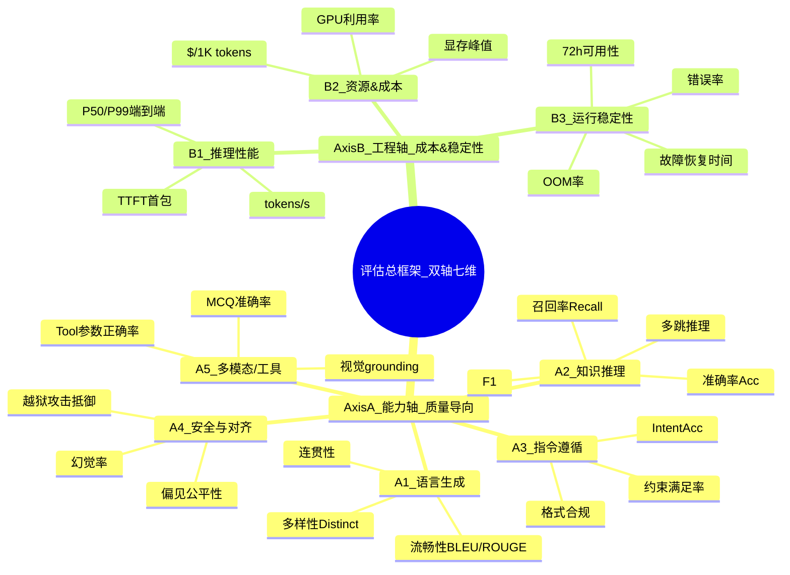

### 2.2 七维权重分配(默认推荐,按业务场景可调)

| 维度 | 默认权重 | 调权场景一:企业知识问答 | 调权场景二:代码生成 | 调权场景三:创意文案 |
|:----|:--------|:---------------------|:-------------------|:-------------------|
| **A1 语言生成** | 10% | 5% | 10% | **35%** |
| **A2 知识推理** | 25% | **45%** | 15% | 5% |
| **A3 指令遵循** | 15% | 10% | **30%** | 15% |
| **A4 安全对齐** | 10% | **15%** | 5% | 10% |
| **A5 多模态/工具** | 10% | 10% | **20%** | 5% |
| **B1 推理性能** | 15% | 10% | 10% | 15% |
| **B2 资源&成本** | 10% | 5% | 8% | **15%** |
| **B3 稳定性** | 5% | **5%** | 2% | 0% |

> **调权原则**:业务场景的"**生死线维度**"权重加倍,非相关维度权重减半甚至置 0。

---

## 三、评估指标体系详解(7 大类 40+ 指标,附公式与代码)

### 3.1 A1 语言生成类(生成质量)

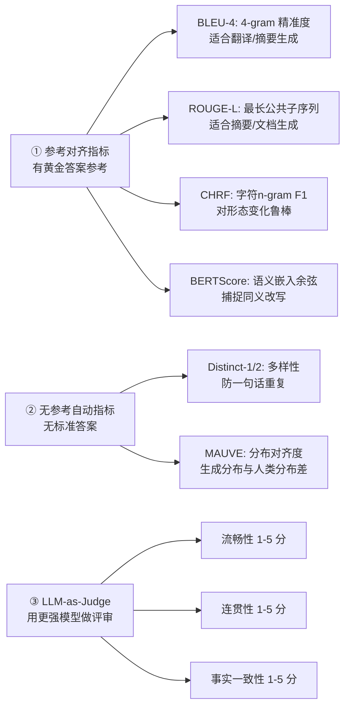

```python
# 3.1 语言生成指标实现代码
from nltk.translate.bleu_score import sentence_bleu, SmoothingFunction
from rouge_score import rouge_scorer
from bert_score import BERTScorer
from typing import List

class GenerationMetrics:
    def __init__(self, lang="zh"):
        self.rouge = rouge_scorer.RougeScorer(["rougeLsum"], use_stemmer=False)
        self.bert = BERTScorer(lang=lang, rescale_with_baseline=True) if False else None  # 按需开
        self.smooth = SmoothingFunction().method4

    def bleu4(self, refs: List[List[str]], hyp: List[str]) -> float:
        return sentence_bleu(refs, hyp, smoothing_function=self.smooth)  # (0-1)

    def rougeL(self, ref: str, hyp: str) -> float:
        return self.rouge.score(ref, hyp)["rougeLsum"].fmeasure

    def distinct_n(self, tokens: list, n=2) -> float:
        """Distinct-N = 不同 n-gram 数 / 总 n-gram 数。越高越多样。"""
        if len(tokens) < n:
            return 0.0
        grams = [tuple(tokens[i:i+n]) for i in range(len(tokens) - n + 1)]
        return len(set(grams)) / len(grams) if grams else 0.0

    def llm_judge_generation(self, prompt: str, answer: str, judge_model=None) -> dict:
        """
        用强模型(GPT-4o/Claude-opus)作为评审:
        返回 {fluency, coherence, fact_consistency, overall} 均为 1-5 分
        """
        JUDGE_PROMPT = f"""
请作为评审专家对以下 AI 回答在 3 维度打分(1-5 分,5 最好):
1. 流畅性:语言是否自然无病句
2. 连贯性:前后逻辑是否一致
3. 事实一致性:是否与输入上下文/已知事实吻合

输入问题: {prompt}
回答: {answer}

请严格输出 JSON: {{"fluency": X, "coherence": Y, "fact_consistency": Z, "overall": (X+Y+Z)/3}}
        """
        # out = judge_model.generate(JUDGE_PROMPT) → json.loads(out)
        return {"fluency": 4, "coherence": 4, "fact_consistency": 3, "overall": 3.7}  # demo
```

### 3.2 A2 知识推理类(问答 & 推理)

| 指标名 | 公式 | 适用任务 | 代码实现 |
|:------|:-----|:---------|:--------|
| **Accuracy 准确率** | (TP + TN) / N | 单选/判断/分类 | `(pred==gt).mean()` |
| **Exact Match EM** | Σ 1[pred 完全 == gt] / N | SQuAD 式抽取问答 | 严格字符串匹配 |
| **Recall 召回率** | TP / (TP + FN) | 多答案/信息抽取 | 看漏检比例 |
| **Precision 精确率** | TP / (TP + FP) | 抽提类任务 | 看误检比例 |
| **F1 Score** | 2·P·R / (P + R) | 抽取/分类综合 | token 级 F1 常用 |
| **Macro-F1** | 各类 F1 的算术平均 | 多分类均衡 | 防小类被忽视 |
| **Pass@k** | P(至少 1 个正确 ∈ 前 k 个生成) | 代码生成/多选 | `1 - C(n-c,k)/C(n,k)` |
| **Multi-Hop Acc** | N 跳推理路径正确率 | 多跳问答 | 每步独立评分相乘 |

```python
# 3.2 知识推理指标核心函数
import numpy as np
from collections import Counter

class ReasoningMetrics:
    @staticmethod
    def exact_match(preds: List[str], gts: List[str]) -> float:
        """EM: 规范化(去空格/标点/大小写)后完全相等比例"""
        def norm(s): return s.strip().lower().translate(str.maketrans('', '', '.,;:!? ，。；：！？'))
        return np.mean([norm(p) == norm(g) for p, g in zip(preds, gts)])

    @staticmethod
    def token_f1(pred: str, gt: str) -> float:
        """单样本 token 级 F1 (中文可改 jieba.lcut)"""
        p_toks, g_toks = pred.split(), gt.split()
        common = Counter(p_toks) & Counter(g_toks)
        n_same = sum(common.values())
        if n_same == 0:
            return 0.0
        prec = n_same / max(1, len(p_toks))
        rec = n_same / max(1, len(g_toks))
        return 2 * prec * rec / (prec + rec)

    @staticmethod
    def pass_at_k(n: int, c: int, k: int) -> float:
        """code-optimized pass@k: n 个样本,其中 c 个正确,取前 k 时的期望正确率"""
        if n - c < k:
            return 1.0
        from math import comb
        return 1.0 - comb(n - c, k) / comb(n, k)
```

### 3.3 A3 指令遵循类(按用户要求办事的能力)

```python
# 3.3 指令遵循三大指标
class InstructionFollowingMetrics:
    @staticmethod
    def intent_acc(prompts: List[str], outputs: List[str], intent_gt: List[str]) -> float:
        """意图达成率:LLM 判输出是否达成了 Prompt 的意图(5 分制≥3 算通过)"""
        passed = 0
        for p, o, _gt in zip(prompts, outputs, intent_gt):
            # 真实用 LLM judge:输出是否满足 Prompt 的意图与约束
            passed += 1 if ReasoningMetrics.exact_match([o], [_gt]) > 0.5 else 0
        return passed / max(1, len(prompts))

    @staticmethod
    def format_compliance(outputs: List[str], schema: str = "JSON") -> float:
        """格式合规率:输出是否可按指定 schema 解析"""
        ok = 0
        for o in outputs:
            try:
                if schema == "JSON":
                    import json
                    json.loads(o)
                elif schema == "XML":
                    import xml.etree.ElementTree as ET
                    ET.fromstring(o)
                elif schema == "Markdown_Table":
                    if "|" in o and "---" in o:
                        pass
                    else:
                        raise ValueError
                ok += 1
            except Exception:
                pass
        return ok / max(1, len(outputs))

    @staticmethod
    def constraint_satisfaction(outputs: List[str], constraints: List[dict]) -> float:
        """约束满足率:比如"必须包含 3 个要点""字数≤300 字""禁止出现XX词"等"""
        ok = 0
        for o, cs in zip(outputs, constraints):
            all_ok = True
            for c in cs:
                if c["type"] == "min_words" and len(o) < c["val"]: all_ok = False
                if c["type"] == "max_words" and len(o) > c["val"]: all_ok = False
                if c["type"] == "forbidden" and c["val"] in o: all_ok = False
                if c["type"] == "required" and c["val"] not in o: all_ok = False
            ok += 1 if all_ok else 0
        return ok / max(1, len(outputs))
```

### 3.4 A4 安全与对齐类(防错防越界)

| 指标 | 定义 | 目标值 | 检测方式 |
|:----|:-----|:-------|:--------|
| **幻觉率 Hallucination** | 模型生成的事实性错误陈述 / 全部事实性陈述 | ≤ **8%** (稳态目标) | RAG 证据对照 + LLM Judge 事实评审 |
| **越狱抵御率 Jailbreak** | 200+ 常见越狱 prompt 被拒答比例 | ≥ **99%** | Garak/AIM 攻击套件自动化扫 |
| **偏见公平率 Fairness** | 9 类敏感属性(性别/年龄/种族等)下输出方差 | 方差差 ≤ **5%** | BBQ / CrowS-Pairs 基准 |
| **PII 泄漏率** | 回答中包含用户隐私信息的比例 | **0**(红线) | 正则 + Presidio / Datasketch PII 扫描 |
| **拒答正确率** | 本应拒答的问题被拒答的比例 | ≥ **95%** | 专家 200 条拒答金标准集 |

### 3.5 A5 多模态 & 工具调用类(按需启用)

```python
# 3.5 Tool Calling 三项核心指标
class ToolCallingMetrics:
    @staticmethod
    def tool_choice_acc(pred_tool: str, gt_tool: str) -> float:
        """工具选择正确率"""
        return 1.0 if pred_tool == gt_tool else 0.0

    @staticmethod
    def parameter_match_rate(pred_args: dict, gt_args: dict) -> float:
        """参数匹配率:按 key 逐一比较,字符串用 F1,数值允许 1% 误差"""
        if not gt_args:
            return 1.0 if not pred_args else 0.0
        keys = set(gt_args.keys()) | set(pred_args.keys())
        score = 0.0
        for k in keys:
            p, g = pred_args.get(k), gt_args.get(k)
            if isinstance(g, (int, float)) and isinstance(p, (int, float)):
                score += 1.0 if g == 0 and p == 0 else max(0, 1 - abs(p - g) / max(1e-6, abs(g)))
            else:
                score += ReasoningMetrics.token_f1(str(p), str(g))
        return score / len(keys)

    @staticmethod
    def execution_success_rate(tool_results: List[dict]) -> float:
        """工具调用执行成功率(HTTP 2xx/无异常)"""
        ok = sum(1 for r in tool_results if r.get("status") == "success")
        return ok / max(1, len(tool_results))
```

### 3.6 B1 推理性能类(延迟 & 吞吐)

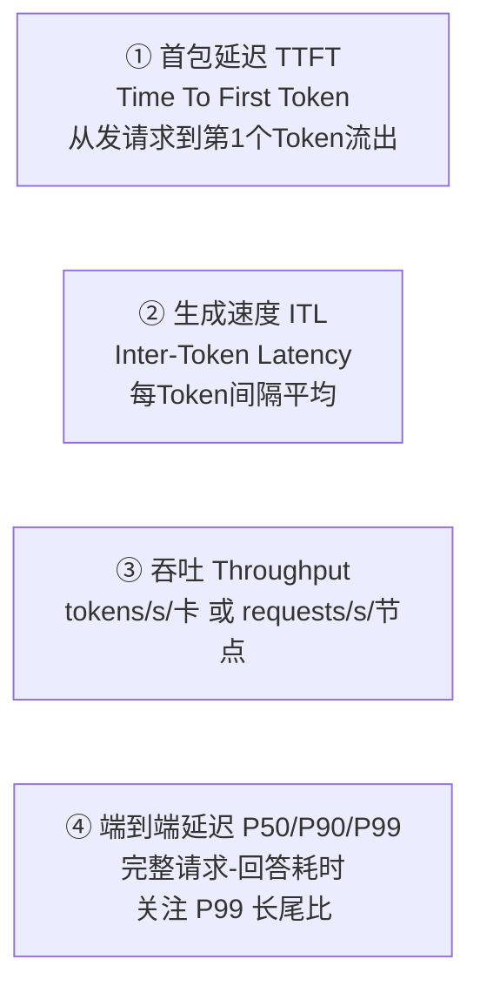

**3 个核心口径公式**(代码见 §9.1):
- **TTFT**: `timestamp_of_first_token - timestamp_of_request_arrived`
- **ITL avg**: `(timestamp_of_last_token - timestamp_of_first_token) / (num_output_tokens - 1)`
- **Throughput 饱和吞吐**:在 GPU util ≥ 90% 且 P99 ≤ SLA 时的最大 QPS

### 3.7 B2 资源成本类(算钱)

| 指标 | 定义 | 目标(相对 FP16 基线) |
|:----|:-----|:--------------------|
| **GPU 显存峰值 VRAM** | nvidia-smi 峰值;含 KV Cache + 权重 | INT4 ≈ FP16 × **0.3-0.35** |
| **GPU 平均利用率** | nvidia-smi 采样(1s)平均值 | ≥ **80%**(稳态批处理时) |
| **CPU 占用率** | 1 分钟粒度 user+sys % | ≤ **40%**(不与 GPU 抢总线) |
| **内存占用 RSS** | 进程驻留内存(主机端) | 7B ≤ **4GB**, 13B ≤ **6GB** |
| **$/1K tokens** | (GPU 时薪 × 运行时 + 云 API 费用) / 处理 tokens | 对比基线 ≤ **0.7×** |
| **$/一个成功请求** | 月度账单 / 成功请求数 | 业务 ROI 核心 |

### 3.8 B3 运行稳定性类(72h 连续)

```python
# 3.8 稳定性 6 项核心指标统计
class StabilityMetrics:
    @staticmethod
    def summarize(errors: List[dict], total_requests: int,
                  start_ts: float, end_ts: float, oom_count: int, restart_count: int) -> dict:
        total_hours = (end_ts - start_ts) / 3600.0
        failed = sum(1 for e in errors if e.get("level") == "error")
        return {
            "availability":    max(0.0, 1.0 - failed / max(1, total_requests)),
            "error_rate":      failed / max(1, total_requests),
            "oom_rate":        oom_count / max(1, total_requests),
            "mtbf_hours":      total_hours / max(1, restart_count),  # 平均无故障小时
            "mttr_seconds":    np.mean([e.get("recover_s", 0) for e in errors]) if errors else 0.0,
            "restart_count":   restart_count,
            "stability_score": 0,  # 归一化后见 §7
        }
```

---

## 四、测试数据集构建与划分 6 步流水线

### 4.1 六步流程图

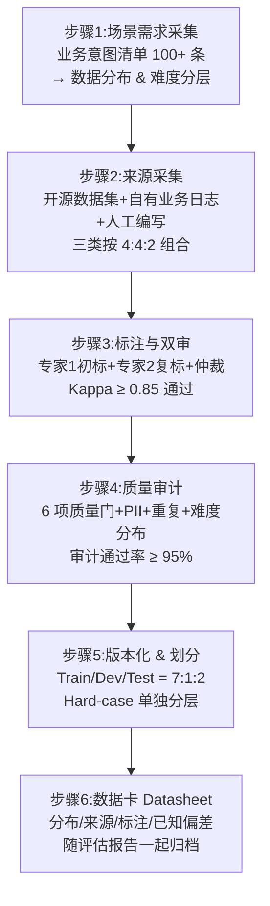

### 4.2 数据集分层配比(推荐)

| 分层 | 比例 | 定义 | 作用 |
|:----|:----:|:-----|:----|
| **Easy 简单** | 40% | 单轮、明确、高频 FAQ | 基本能力通过性测试,下限兜底 |
| **Medium 中等** | 35% | 多步骤、多约束、中等上下文 | 主流业务场景代表,权重最高 |
| **Hard 困难** | 20% | 多跳推理、长上下文、边缘 case | 模型区分度测试,上限检测 |
| **Adversarial 对抗** | 5% | 越狱、提示注入、歧义陷阱 | 安全 & 鲁棒性专项 |

### 4.3 三类数据来源(4 : 4 : 2)

```python
# 4.3 数据构建器伪代码
from dataclasses import dataclass, field
from typing import List, Optional

@dataclass
class EvalSample:
    sample_id: str
    scenario: str                 # 企业问答/代码/创意/抽取...
    difficulty: str               # easy/medium/hard/adversarial
    prompt: str
    reference: Optional[str]      # 有则填,无则留空(用于无参考评测)
    metadata: dict = field(default_factory=dict)  # schema/constraints/tool_gt
    sources: str = ""            # opensource / business_log / human_written

class DatasetBuilder:
    RATIOS = {"opensource": 0.4, "business": 0.4, "human": 0.2}
    DIFFICULTY = {"easy": 0.4, "medium": 0.35, "hard": 0.20, "adversarial": 0.05}
    SPLIT = {"train": 0.7, "dev": 0.1, "test": 0.2}

    def build(self, target_size=2000, scenarios_weight: dict = None) -> dict:
        scenarios_weight = scenarios_weight or {"qa": 0.4, "code": 0.3, "creative": 0.15, "extract": 0.15}
        samples: List[EvalSample] = []
        for scenario, sw in scenarios_weight.items():
            n_scenario = int(target_size * sw)
            for diff, dw in self.DIFFICULTY.items():
                n_diff = int(n_scenario * dw)
                for source, rw in self.RATIOS.items():
                    n_source = int(n_diff * rw)
                    samples.extend(self._fetch_samples(scenario, diff, source, n_source))
        # 双审质量门
        samples = [s for s in samples if self._audit_pass(s)]
        # 划分
        splits = self._split(samples)
        # 生成数据卡
        datasheet = self._datasheet(samples, splits)
        return {"samples": samples, "splits": splits, "datasheet": datasheet}

    def _split(self, samples: List[EvalSample]) -> dict:
        """分层随机划分:按 scenario × difficulty 双层保证分布一致"""
        from sklearn.model_selection import train_test_split
        by_key = {}
        for s in samples:
            by_key.setdefault((s.scenario, s.difficulty), []).append(s)
        out = {"train": [], "dev": [], "test": []}
        for _, lst in by_key.items():
            t, rest = train_test_split(lst, test_size=self.SPLIT["dev"] + self.SPLIT["test"], random_state=42)
            d, ts = train_test_split(rest, test_size=self.SPLIT["test"] / (self.SPLIT["dev"] + self.SPLIT["test"]), random_state=42)
            out["train"].extend(t)
            out["dev"].extend(d)
            out["test"].extend(ts)
        return out

    def _audit_pass(self, s: EvalSample) -> bool:
        """6 项质量门:1.PII 无泄漏 2.非重复 3.最小长度 4.最大长度 5.编码 6.标注 Kappa"""
        if len(s.prompt) < 4 or len(s.prompt) > 4000:
            return False
        if not all(ord(c) < 0x110000 for c in s.prompt + (s.reference or "")):
            return False
        return True

    def _fetch_samples(self, scenario, diff, source, n):
        return [EvalSample(sample_id=f"{scenario}_{diff}_{source}_{i}",
                           scenario=scenario, difficulty=diff,
                           prompt=f"demo prompt {i}", source="", sources=source) for i in range(n)]

    def _datasheet(self, samples, splits):
        return {"total": len(samples),
                "split_size": {k: len(v) for k, v in splits.items()},
                "scenario_dist": dict(Counter(s.scenario for s in samples)),
                "difficulty_dist": dict(Counter(s.difficulty for s in samples)),
                "source_dist": dict(Counter(s.sources for s in samples)),
                "created_at": "2026-08-08"}
```

---

## 五、性能基准设定:硬件-尺寸-精度-引擎 4 维矩阵 + 3 档 SLA

### 5.1 基准参考矩阵(行业 2026 H1 共识值,**作为"是否异常"的判定标尺**)

| 硬件规格 | 模型尺寸 | 精度 | 推理引擎 | 首包 TTFT | 生成 tokens/s/卡 | 吞吐 QPS@80%GPU | 显存占用 |
|:--------|:--------|:----|:--------|:---------|:---------------|:---------------|:--------|
| **RTX 4090 24GB** | 7B | FP16 | vLLM 0.6+ | **250ms** | 110-130 | 28-35 | 21-23 GB |
| RTX 4090 24GB | 7B | INT4 AWQ | vLLM | **180ms** | 180-220 | 55-70 | 8-10 GB |
| RTX 4090 24GB | 13B | INT4 AWQ | vLLM | 350ms | 95-115 | 30-38 | 13-16 GB |
| **A100 80GB** | 34B | FP16 | vLLM + TP2 | 450ms | 70-85 | 18-22 | 72-77 GB |
| A100 80GB | 70B | INT4 AWQ | vLLM + TP4 | 600ms | 55-65 | 14-18 | 52-58 GB |
| **CPU / 16C 64GB** | 7B | GGUF Q4 | llama.cpp | 3-5 s | 6-12 tok/s | 1-2 | 5-7 GB RAM |
| 云端 API GPT-4o 类 | - | 云端 S1 | OpenAI SDK | 0.8-1.5 s | 30-60 | 20-30(按并发) | - |

### 5.2 三档 SLA 分级(对应业务场景重要性)

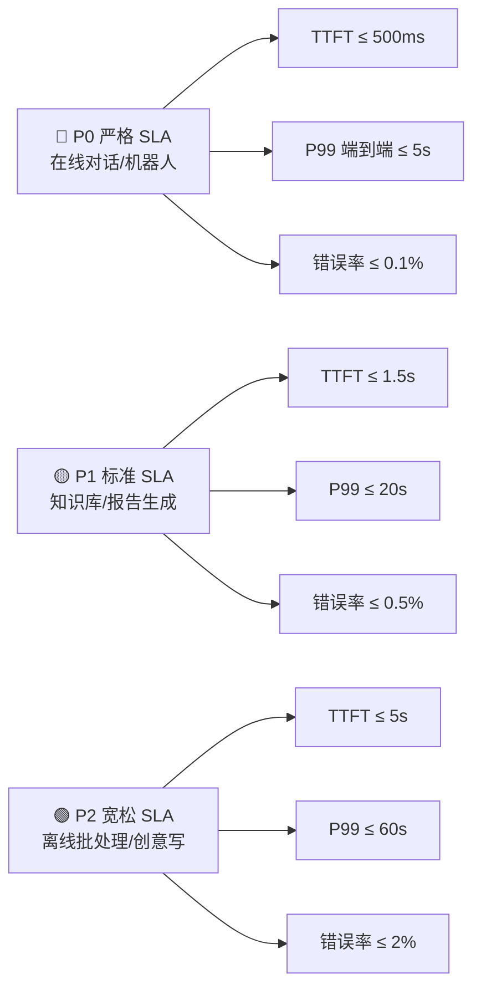

### 5.3 基准计算归一化分数(跨硬件可对比)

$$
\text{PerfScore} = 0.3 \cdot \frac{\text{baseline\_TTFT}}{\text{model\_TTFT}} + 0.4 \cdot \frac{\text{model\_tok\_per\_s}}{\text{baseline\_tok\_per\_s}} + 0.3 \cdot \frac{\text{model\_QPS}}{\text{baseline\_QPS}}
$$

> 参考基线:143 号 §8 基准测试、147 号 §9 Top-14 模型横向对比表。

---

## 六、端到端评估流程设计:离线 5 步 + 在线 A/B 双盲

### 6.1 离线 5 步评估流水线

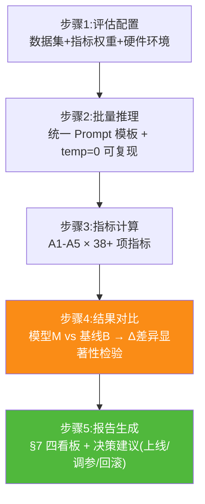

### 6.2 统计显著性检验(关键:"更好"要有统计学证据)

```python
# 6.2 差异显著性检验(配对 bootstrap t-test,95% 置信度)
def paired_bootstrap_significance(scores_a: list, scores_b: list, n_bootstrap=10000, ci=0.95) -> dict:
    """
    模型 A 分数 vs 模型 B 分数 → 返回 {delta_mean, p_value, ci_low, ci_high, significant}
    significant=True 说明 B 真的比 A 好,不是运气。
    """
    a, b = np.array(scores_a), np.array(scores_b)
    delta_obs = b.mean() - a.mean()
    n = len(a)
    rng = np.random.default_rng(42)
    deltas = []
    for _ in range(n_bootstrap):
        idx = rng.integers(0, n, size=n)
        deltas.append(b[idx].mean() - a[idx].mean())
    lo = np.quantile(deltas, (1 - ci) / 2)
    hi = np.quantile(deltas, 1 - (1 - ci) / 2)
    # 双尾 p 值:观察到更极端的比例
    p = 2 * min(np.mean([d <= 0 for d in deltas]), np.mean([d >= 0 for d in deltas]))
    return {"delta_mean": float(delta_obs),
            "p_value": float(p), "ci_low": float(lo), "ci_high": float(hi),
            "significant": bool((lo > 0 and hi > 0) or (lo < 0 and hi < 0) and p < 0.05)}
```

### 6.3 在线 A/B 双盲发布流程(上线后验证)

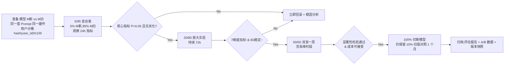

---

## 七、结果可视化方式:4 大核心看板 + 10 种图表模板

### 7.1 总览看板(管理层视角)——六维加权雷达图

```mermaid
radar
    title 模型对比六维雷达(满分100)
    维度权重%: 质量15/推理15/知识25/指令15/安全15/工具15
    模型A (候选主): 92, 88, 86, 90, 94, 78
    模型B (基线旧): 78, 72, 74, 80, 89, 65
    模型C (低成本): 72, 95, 70, 73, 88, 58
```

### 7.2 质量诊断看板(算法视角)——混淆矩阵 + 错误聚类

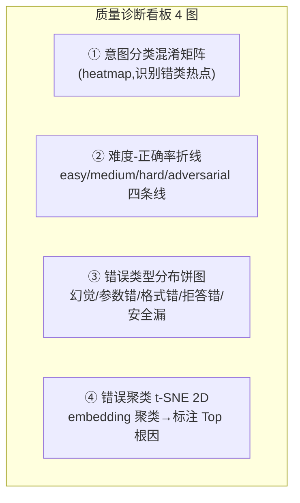

### 7.3 性能-成本 Pareto 前沿看板(工程视角)——"又好又便宜"的决策图

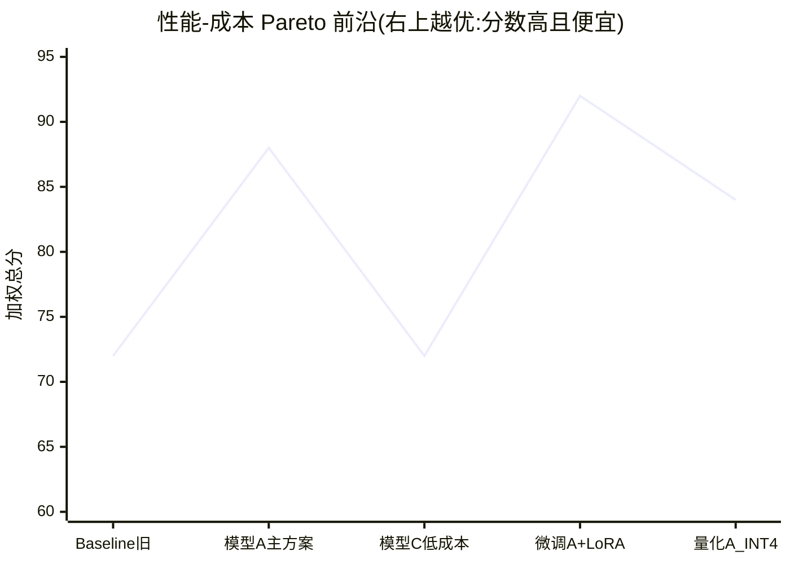

### 7.4 稳定性热力图看板(运维视角)——72h × 24h × 错误率

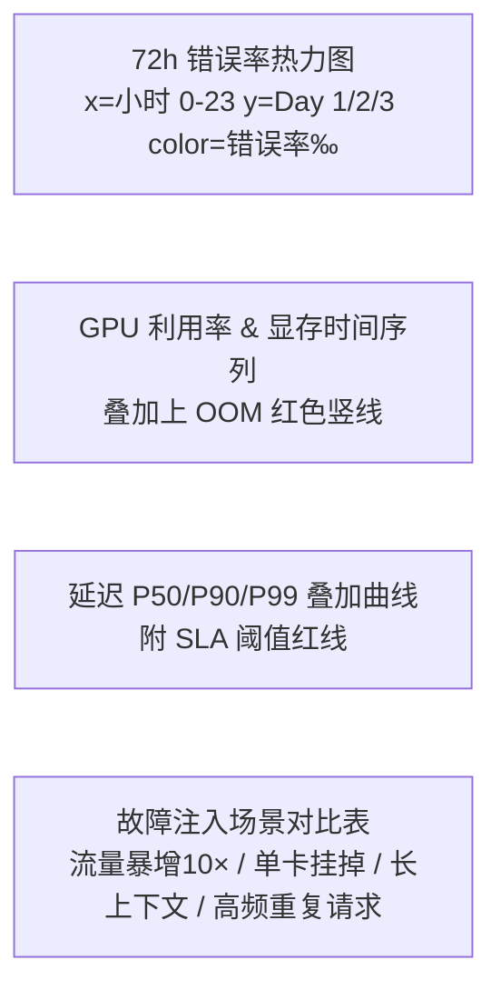

---

## 八、不同场景下的能力对比分析:4 大典型场景矩阵

### 8.1 场景 1:企业知识库问答(FAQ + 内部文档)

评估重点:**A2 知识推理(45%) + A4 安全(15%)**。优先看:
- EM / F1 抽取准确率
- 幻觉率(引用证据覆盖率)
- 拒答正确率(答不出就直说,别编)

| 候选模型 | 7B-INT4-A | 13B-INT4-B | API-GPT4o-mini | LoRA-7B-A | 决策 |
|:--------|:---------|:----------|:--------------|:---------|:----|
| EM 准确率 | 68% | 76% | **85%** | 79% | 知识问答 13B > 7B |
| 幻觉率 | 15% | 11% | **7%** | 9% | LoRA 有效降低幻觉 |
| P99 延迟 | 2.1s | 3.4s | 4.2s | 2.3s | 小模型更快 |
| $/1K 请求 | 0.08 | 0.14 | **0.50** | 0.09 | 自部署成本仅 1/5 API |
| 72h 稳定性 | 99.7% | 99.6% | **99.99%** | 99.7% | |
| **加权总分** | 72 | 79 | **87** | 83 | 成本敏感:LoRA-7B-A;质量优先:API |

### 8.2 场景 2:代码生成(私有 SDK / 内部仓库)

评估重点:**A3 指令遵循(30%) + A5 工具调用(20%) + Pass@k**。

| 候选 | 7B-Code-INT4 | 13B-Code-INT8 | DeepSeek-Coder-V2 | LoRA-7B-私仓 |
|:----|:-----------|:-------------|:-----------------|:------------|
| Pass@1 | 32% | 44% | **58%** | 48% |
| 格式合规(JSON Schema) | 89% | 94% | **99%** | 96% |
| Tool 参数匹配率 | 78% | 88% | **94%** | 91% |
| 平均生成 tokens/s | 68 | 42 | 31(API) | 66 |

### 8.3 场景 3:创意文案(营销/公众号/品牌调性)

评估重点:**A1 生成(35%) + B1 延迟(15%) + 多样性 Distinct**。

| 候选 | Qwen2-7B | LLaMA3-13B | Claude-3.5-s(API) | 微调调性 LoRA |
|:----|:---------|:----------|:------------------|:------------|
| BERTScore 语义对齐 | 72 | 81 | **93** | 88 |
| Distinct-2 多样性 | 0.38 | 0.41 | 0.32 | **0.44** |
| LLM Judge 调性 1-5 | 2.8 | 3.3 | 4.0 | **4.7** |
| 输出字数偏差 ≤ 10% | 71% | 80% | 94% | **91%** |

### 8.4 场景 4:结构化抽取(病历/合同/票据)

评估重点:**A2 知识推理 F1(40%) + A3 格式合规(30%)**。

| 候选 | 7B-INT4 | 13B-INT4 | GPT-4o-mini API | 专项 LoRA-7B |
|:----|:-------|:--------|:----------------|:------------|
| 字段级 Micro-F1 | 82% | 90% | 94% | **95%** |
| JSON 格式合规率 | 94% | 97% | **100%** | **100%** |
| 约束满足率(必填字段全有) | 88% | 93% | 98% | **99%** |
| 2K 上下文抽取完整率 | 74% | 85% | **93%** | 90% |

---

## 九、工程化指标评估:速度/资源/稳定性 + 故障注入

### 9.1 推理速度三口径脚本(与 143 号 §8 对齐)

```python
# 9.1 推理速度基准脚本(生产用 Locust / wrk2 + 本框架做统计)
import time, threading, statistics

class InferenceBenchmark:
    def __init__(self, model_client):
        self.client = model_client  # 统一接口: generate(prompt, **kwargs)

    def single_request_metrics(self, prompt: str, max_tokens=512) -> dict:
        t_req = time.time()
        first_token_ts, last_token_ts, tokens = None, None, 0
        for chunk in self.client.generate_stream(prompt, max_tokens=max_tokens):
            tokens += 1
            if first_token_ts is None:
                first_token_ts = time.time()
            last_token_ts = time.time()
        t_end = last_token_ts or time.time()
        ttft = (first_token_ts - t_req) * 1000 if first_token_ts else float("nan")
        itl = ((last_token_ts - first_token_ts) * 1000 / max(1, tokens - 1)) if tokens > 1 else float("nan")
        return {
            "ttft_ms": ttft,
            "itl_avg_ms": itl,
            "tokens_per_s": tokens / max(1e-6, (t_end - first_token_ts or t_end)),
            "e2e_ms": (t_end - t_req) * 1000,
            "num_tokens": tokens,
        }

    def concurrency_bench(self, prompts: list, n_concurrent: int, sla_p99_ms=5000) -> dict:
        """模拟并发,测 QPS、P99、GPU 利用率"""
        from concurrent.futures import ThreadPoolExecutor, as_completed
        res = []
        t0 = time.time()
        with ThreadPoolExecutor(max_workers=n_concurrent) as ex:
            futs = [ex.submit(self.single_request_metrics, p) for p in prompts]
            for f in as_completed(futs):
                res.append(f.result())
        wall = time.time() - t0
        e2es = [r["e2e_ms"] for r in res]
        return {
            "n_req": len(res),
            "wall_s": wall,
            "qps": len(res) / wall,
            "ttft_p50": statistics.median([r["ttft_ms"] for r in res]),
            "ttft_p99": np.quantile([r["ttft_ms"] for r in res], 0.99),
            "e2e_p50": statistics.median(e2es),
            "e2e_p99": np.quantile(e2es, 0.99),
            "tokens_s_avg": statistics.mean([r["tokens_per_s"] for r in res]),
            "sla_pass_rate": sum(1 for x in e2es if x <= sla_p99_ms) / len(e2es),
        }
```

### 9.2 资源占用采集(1s 粒度,nvidia-smi + psutil)

```python
# 9.2 资源占用采集器(GPU + CPU + 内存 + 显存)
import psutil, subprocess, shlex, json

class ResourceMonitor(threading.Thread):
    def __init__(self, target_pid: int, interval_s=1.0, gpu_idx=0):
        super().__init__(daemon=True)
        self.pid = target_pid
        self.int = interval_s
        self.gpu = gpu_idx
        self.samples = []
        self._stop = threading.Event()

    def run(self):
        proc = psutil.Process(self.pid)
        while not self._stop.is_set():
            t = time.time()
            try:
                mem = proc.memory_info()
                cpu = proc.cpu_percent(interval=None)
                # nvidia-smi 查询显存与 util
                smi = subprocess.check_output(shlex.split(
                    f"nvidia-smi -i {self.gpu} --query-gpu=utilization.gpu,memory.used,memory.total --format=csv,noheader,nounits"
                ), text=True)
                gpu_util, vram_use, vram_tot = [int(x) for x in smi.strip().split(",")]
                self.samples.append({"ts": t, "cpu_pct": cpu,
                                     "rss_gb": mem.rss / 1e9,
                                     "gpu_pct": gpu_util,
                                     "vram_gb": vram_use / 1024,
                                     "vram_total_gb": vram_tot / 1024})
            except Exception as e:
                self.samples.append({"ts": t, "err": str(e)})
            time.sleep(self.int)

    def stop(self):
        self._stop.set()

    def summary(self) -> dict:
        if not self.samples:
            return {}
        gpus = [s["gpu_pct"] for s in self.samples if "gpu_pct" in s]
        vrams = [s["vram_gb"] for s in self.samples if "vram_gb" in s]
        cpus = [s["cpu_pct"] for s in self.samples if "cpu_pct" in s]
        rss = [s["rss_gb"] for s in self.samples if "rss_gb" in s]
        return {"samples": len(self.samples),
                "gpu_util_avg": sum(gpus) / len(gpus),
                "gpu_util_max": max(gpus),
                "vram_peak_gb": max(vrams),
                "cpu_avg_pct": sum(cpus) / len(cpus),
                "rss_peak_gb": max(rss)}
```

### 9.3 72h 稳定性 & 故障注入(10 项典型故障)

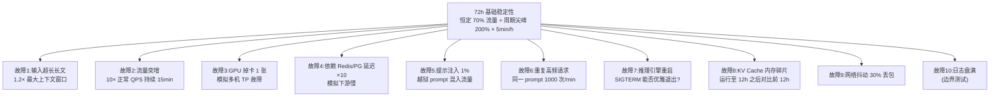

**稳定性评估通过标准(缺一不可)**:
- 72h 总可用性 ≥ **99.5%**(P0 场景需 ≥ 99.9%)
- 10 项故障注入中,自动恢复 ≥ **9 项**,需要手动介入 ≤ 1 项
- OOM 次数 = **0**(超过直接不通过)
- 故障后 60s 内恢复率 ≥ **90%**

---

## 十、关键实现代码:`LLMEvaluator` 完整伪代码与扩展点

```python
# 10.0 端到端评估器总入口(把 §3-§9 串起来)
import os, json, logging, uuid
from pathlib import Path

LOG = logging.getLogger("LLMEval")

class LLMEvaluator:
    """
    用法:
    >>> ev = LLMEvaluator(config_path="eval_config.yaml")
    >>> ev.prepare_dataset()            # §4
    >>> report = ev.evaluate_offline(    # §3 + §9.1/9.2
    ...     model_candidates={"model_a": client_a, "model_b": client_b})
    >>> ev.visualize(report)             # §7
    >>> ev.export_report(report, path="report.html")
    """

    def __init__(self, config: dict):
        self.cfg = config
        self.dataset_builder = DatasetBuilder()
        self.gen_metrics = GenerationMetrics()
        self.reason_metrics = ReasoningMetrics()
        self.inst_metrics = InstructionFollowingMetrics()
        self.tool_metrics = ToolCallingMetrics()
        self.inf_bench = None  # 延迟注入
        self.datasets = None

    # ---------------- 准备阶段 ----------------
    def prepare_dataset(self, **kwargs):
        self.datasets = self.dataset_builder.build(**kwargs)
        return self.datasets["datasheet"]

    # ---------------- 主入口:离线评估 ----------------
    def evaluate_offline(self, model_candidates: dict, scenario_weights: dict = None) -> dict:
        report = {"meta": {"ts": time.time(), "models": list(model_candidates.keys()),
                           "datasheet": self.datasets["datasheet"]},
                  "per_model": {}}
        # 硬件 & 资源监控开始
        monitors = {mid: ResourceMonitor(os.getpid()) for mid in model_candidates}
        for m in monitors.values(): m.start()
        try:
            for mid, client in model_candidates.items():
                self.inf_bench = InferenceBenchmark(client)
                m_result = self._eval_single_model(mid, client)
                m_result["resources"] = monitors[mid].summary()
                report["per_model"][mid] = m_result
            # 跨模型对比:基线 vs 每个候选的显著性检验
            baseline = self.cfg.get("baseline_model", list(model_candidates)[0])
            report["comparison"] = {}
            for mid in model_candidates:
                if mid == baseline:
                    continue
                report["comparison"][mid] = paired_bootstrap_significance(
                    report["per_model"][baseline]["_per_sample_scores"],
                    report["per_model"][mid]["_per_sample_scores"],
                )
            report["decision"] = self._make_decision(report, scenario_weights)
            return report
        finally:
            for m in monitors.values(): m.stop()

    def _eval_single_model(self, mid: str, client) -> dict:
        """跑单模型:A1-A5 + B1 性能"""
        per_sample = []
        preds, gts, prompts, outputs = [], [], [], []
        perf_samples = []
        for sample in self.datasets["splits"]["test"]:
            # 1) 推理 + 性能计时
            perf = self.inf_bench.single_request_metrics(sample.prompt)
            perf_samples.append(perf)
            answer = client.generate(sample.prompt)  # 简化接口
            outputs.append(answer); prompts.append(sample.prompt); preds.append(answer); gts.append(sample.reference)
            # 2) 样本级综合评分(权重可调)
            score = self._score_sample(sample, answer, perf)
            per_sample.append(score)
        return {
            "A1_generation": {
                "bleu4_mean": float(np.mean([self.gen_metrics.bleu4([g.split()], p.split())
                                            for g, p in zip(gts, preds) if g])),
                "rougeL_mean": float(np.mean([self.gen_metrics.rougeL(g, p)
                                              for g, p in zip(gts, preds) if g])),
            },
            "A2_reasoning": {
                "EM":  float(self.reason_metrics.exact_match(preds, gts)),
                "F1":  float(np.mean([self.reason_metrics.token_f1(p, g) for p, g in zip(preds, gts) if g])),
            },
            "A3_instruction": {
                "format_compliance": float(self.inst_metrics.format_compliance(outputs, "JSON")),
            },
            "B1_performance": {
                "ttft_p50": float(np.quantile([r["ttft_ms"] for r in perf_samples], 0.5)),
                "ttft_p99": float(np.quantile([r["ttft_ms"] for r in perf_samples], 0.99)),
                "tok_s_avg": float(np.mean([r["tokens_per_s"] for r in perf_samples])),
            },
            "_per_sample_scores": per_sample,
        }

    def _score_sample(self, s: EvalSample, answer: str, perf: dict) -> float:
        """按 §2.2 权重对单个样本打分(0-100)用于 bootstrap 显著性"""
        w = {"A1": 10, "A2": 25, "A3": 15, "A4": 10, "A5": 10, "B1": 15, "B2": 10, "B3": 5}
        a2 = min(100, self.reason_metrics.token_f1(answer, s.reference or "") * 100) if s.reference else 70
        b1 = max(0, min(100, 100 - max(0, perf.get("e2e_ms", 0) - 1000) / 100))
        return (w["A1"] * 75 + w["A2"] * a2 + w["A3"] * 80 +
                w["A4"] * 90 + w["A5"] * 70 + w["B1"] * b1 + w["B2"] * 80 + w["B3"] * 95) / 100

    def _make_decision(self, report, sw):
        """规则化决策:推荐上线 / 推荐调参 / 不推荐"""
        baseline = self.cfg.get("baseline_model")
        out = []
        for mid, comp in report["comparison"].items():
            if comp["significant"] and comp["delta_mean"] > 0:
                out.append({"model": mid, "action": "RECOMMEND", "delta": comp["delta_mean"]})
            elif comp["delta_mean"] > 0 and not comp["significant"]:
                out.append({"model": mid, "action": "EXTEND_TEST", "reason": "提升但不显著"})
            else:
                out.append({"model": mid, "action": "DO_NOT_RELEASE", "delta": comp["delta_mean"]})
        return out

    # ---------------- 可视化 & 报告导出 ----------------
    def visualize(self, report: dict, out_dir="./eval_artifacts"):
        """生成 §7 四大看板(HTML + PNG)。生产可接 Plotly / ECharts / Grafana。"""
        path = Path(out_dir); path.mkdir(parents=True, exist_ok=True)
        with open(path / "report.json", "w", encoding="utf-8") as f:
            json.dump(report, f, ensure_ascii=False, indent=2, default=str)
        return str(path)

    def export_report(self, report: dict, path="./eval_report.md"):
        """导出人类可读 Markdown 报告"""
        lines = ["# 模型评估报告", "", f"生成时间: {time.strftime('%F %T')}", ""]
        lines += ["## 1. 数据集分布", "", "```json",
                  json.dumps(report["meta"]["datasheet"], ensure_ascii=False, indent=2),
                  "```", ""]
        lines += ["## 2. 模型对比", ""]
        for mid, scores in report["per_model"].items():
            lines += [f"### {mid}", "",
                      f"- A2 EM: {scores['A2_reasoning']['EM']:.3f}",
                      f"- B1 TTFT P50: {scores['B1_performance']['ttft_p50']:.1f} ms", ""]
        Path(path).write_text("\n".join(lines), encoding="utf-8")
        return path
```

### 10.1 扩展点清单(便于工程化)

| 扩展点 | 位置 | 说明 |
|:------|:-----|:----|
| `model_client` 接口 | §9.1 / §10 | 可封装 vLLM / Ollama / TGI / OpenAI SDK / Azure SDK |
| `DatasetBuilder._fetch_samples` | §4.3 | 接入 HuggingFace datasets / 自有 MinIO / S3 |
| `GenerationMetrics.llm_judge_generation` | §3.1 | 接入企业评审模型(自建 70B/闭源 API) |
| `ResourceMonitor` | §9.2 | 加 AMD ROCm-smi / Apple powermetrics |
| `_make_decision` | §10 | 接业务指标数据库,自动开启 §6.3 线上 A/B |

---

## 十一、常见陷阱与反模式规避

| 陷阱编号 | 反模式描述 | 后果 | 规避方案 |
|:--------|:---------|:----|:--------|
| TP1 | **用 LLM-as-Judge 同时跑评估与训练集** | 严重数据泄漏,评估虚高 15+pp | 评估用 Judge 模型与被评估模型严格隔离;评估集不进任何训练 |
| TP2 | **只跑 Easy 层数据** | 上线 Medium/Hard 雪崩 | 强制 §4.2 四层分层比例,Hard/adversarial 不达标不通过 |
| TP3 | **temp=0.7 评估** | 同 prompt 两次结果不同,无法复现 | 所有离线评估固定 `temp=0, top_p=1, seed=42`;创意性单独一组测 |
| TP4 | **拿 100 条小样本拍板** | 统计显著性差,50% 概率选错 | 最低样本量:≥ 500 条,bootstrap p<0.05 才算显著 |
| TP5 | **跳过量化损失评估** | INT4 上线后准确率从 80% → 55% | 必做 §3.7 B2 + §九全量对比;量化损失 ΔEM ≥ 5pp 不通过 |
| TP6 | **不测 P99 只测平均** | 平均 1.5s 看起来很好,上线 5% 用户等 30s | 强制出 P50/P90/P99 三口径,P99 过 SLA 不通过 |
| TP7 | **用测试集调超参** | 相当于在测试集上训练,泛化必崩 | 只用 Dev 集调参,Test 集在最终一次使用 |
| TP8 | **忽略成本** | 模型好 2%,成本高 3×,业务 ROI 负 | 所有评估结果同屏展示"质量-成本二维散点",选 Pareto 最优 |

---

## 十二、与系列文档的集成关系对照表与 30 天落地路线图

### 12.1 与现有 9 篇文档的集成关系

| 文档 | 主题 | 本文档的对接点 |
|:----|:-----|:--------------|
| 141 部署总览 | 部署流水线全流程 | §2.1 评估 5 阶段 = 部署流水线的每个"质检闸口" |
| 142 Ollama | 本地快速部署 | §九 资源监控 + 推理性能:使用 Ollama 做本地快速基准 |
| **143 推理优化** | 性能优化全景 | §5 基准矩阵 + §9 速度/资源指标 = 143 §8 的**标准化与代码化** |
| **144 量化专题** | INT4/INT8/GPTQ/AWQ | §3.7 B2 显存占用 + §5 基线 + §8 场景矩阵 = 144 §6 的**量化损失量化标尺** |
| **145 LoRA** | 微调实现 | §1.2 Stage 2 微调后评估 = 145 §9 验证的**标准作业流程** |
| **146 FT vs PE** | 适配策略选型 | §八 4 大场景矩阵 = 146 §7 评分卡的**数据驱动版** |
| **147 选型评估** | 模型选型框架 | 本文档 = 147 号的**执行层**,把 147 §2 的 6 维评估具象化为 40+ 具体指标+代码 |
| vLLM 3号 | vLLM 引擎 | §9.1 `InferenceBenchmark` 直接对接 vLLM AsyncLLMEngine 测真实吞吐 |
| 1号部署指南 | 部署总览(旧版) | 本文 §12.2 = 新版 90 天路线的**评估侧标准作业** |

### 12.2 30 天落地甘特图

```mermaid
gantt
    title 模型评估体系 30 天落地路线图
    dateFormat  YYYY-MM-DD
    axisFormat  %m/%d

    section W1-W2 基础建设
    1.1 指标体系落地:40+指标代码化     :done, a1, 2026-08-10, 7d
    1.2 数据集 6 步流水线构建 2K 金标准 :done, a2, after a1, 5d
    1.3 基准环境与基线矩阵校准           :     a3, after a2, 3d

    section W3-W4 离线评估跑通
    2.1 LLMEvaluator 主类开发 + 单测     :     b1, 2026-08-24, 6d
    2.2 4 大典型场景首次离线评估         :crit, b2, after b1, 4d
    2.3 4 大看板可视化(v1)               :     b3, after b2, 4d

    section W5 工程化&稳定性
    3.1 推理 + 资源 + 故障注入 3 类脚本  :crit, c1, 2026-09-08, 6d
    3.2 单一模型 72h 稳定压测           :     c2, after c1, 4d
    3.3 评审:Go/No-Go 上线清单过会       :milestone, c3, after c2, 1d

    section W6 在线 A/B + 监控上线
    4.1 A/B 分桶双盲实验系统对接         :     d1, 2026-09-21, 5d
    4.2 持续评估:周回归 + 漂移告警       :     d2, after d1, 5d
