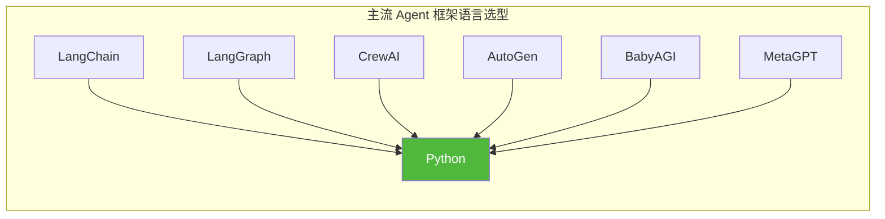
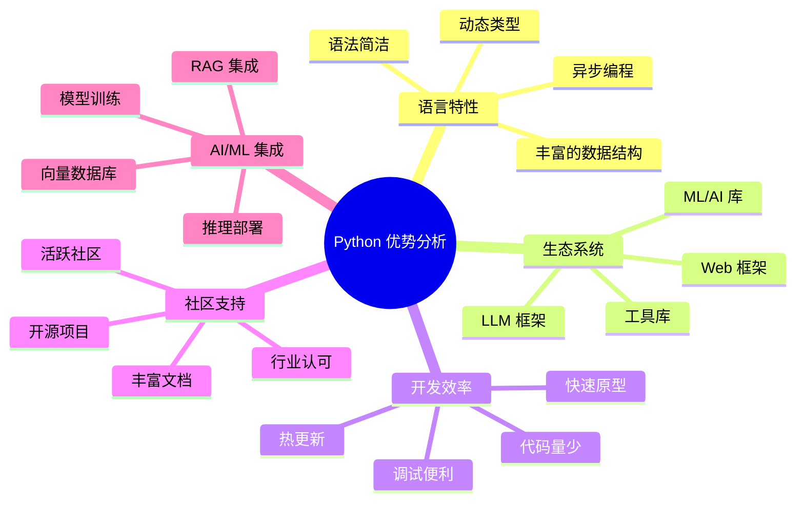
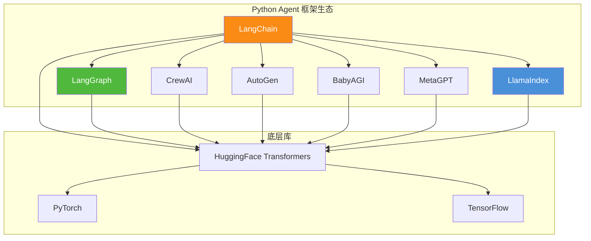
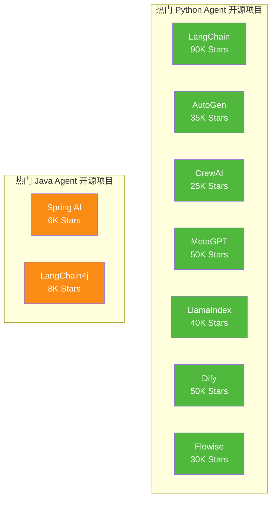
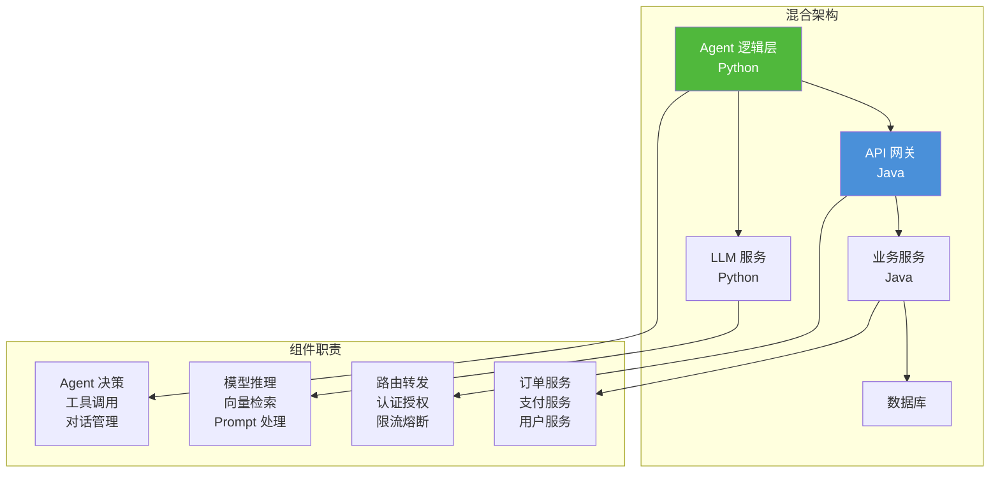

# 为什么 Agent 开发主要选择 Python 语言

> **文档说明**：本文档从语言特性、生态系统、开发效率、社区支持、与 AI/ML 技术集成能力等多个维度，深入分析 Agent 开发领域主要选择 Python 作为编程语言的原因，并结合具体技术案例和行业实践进行说明。

## 目录

- [一、引言](#一引言)
- [二、语言特性维度](#二语言特性维度)
- [三、生态系统维度](#三生态系统维度)
- [四、开发效率维度](#四开发效率维度)
- [五、社区支持维度](#五社区支持维度)
- [六、与 AI/ML 技术的集成能力](#六与-aiml-技术的集成能力)
- [七、主流 Agent 框架的技术选型](#七主流-agent-框架的技术选型)
- [八、行业实践案例分析](#八行业实践案例分析)
- [九、Python vs Java 在 Agent 领域的对比](#九python-vs-java-在-agent-领域的对比)
- [十、总结与展望](#十总结与展望)

---

## 一、引言

### 1.1 Agent 开发的技术选型现状

当前，在 AI Agent（智能体）开发领域，**Python 语言占据了绝对的主导地位**。无论是主流的 Agent 框架（LangChain、LangGraph、CrewAI、AutoGen），还是底层的 LLM 接口封装（HuggingFace、vLLM），几乎都首选 Python 作为开发语言。



### 1.2 核心问题

为什么在众多编程语言中，Python 能在 Agent 开发领域脱颖而出？本文将从多个维度进行深入分析。

### 1.3 分析框架



---

## 二、语言特性维度

### 2.1 动态类型与灵活性

Python 的动态类型特性为 Agent 开发提供了极大的灵活性：

| 特性 | 说明 | Agent 场景应用 |
|------|------|---------------|
| **动态类型** | 变量类型在运行时确定 | Agent 状态数据结构多变时灵活处理 |
| **鸭子类型** | 关注行为而非类型 | 工具接口无需严格类型约束 |
| **反射机制** | 运行时检查和修改对象 | Agent 动态加载和组合工具 |
| **装饰器** | 函数增强能力 | Agent 工具调用的拦截和增强 |

**案例：Agent 工具动态注册**

```python
# Python 动态特性实现工具注册
class AgentToolRegistry:
    def __init__(self):
        self.tools = {}
    
    def register(self, name: str, func: callable, **metadata):
        """动态注册工具"""
        self.tools[name] = {
            "function": func,
            "metadata": metadata
        }
    
    def execute(self, name: str, **kwargs):
        """动态执行工具"""
        if name in self.tools:
            # 鸭子类型：只要有对应的方法即可执行
            return self.tools[name]["function"](**kwargs)
        raise ValueError(f"Tool {name} not found")


# 使用示例
registry = AgentToolRegistry()

# 注册计算器工具
registry.register("calculator", lambda x, y: x + y, 
                   description="加法计算", 
                   version="1.0")

# 注册天气查询工具（完全不同的函数签名）
registry.register("weather", lambda city: f"{city} 晴", 
                   description="天气查询")

# 动态调用
result1 = registry.execute("calculator", x=3, y=5)  # 8
result2 = registry.execute("weather", city="北京")  # 北京 晴
```

### 2.2 语法简洁与可读性

Python 简洁的语法使得 Agent 逻辑表达更加清晰直观：

**示例：ReAct Agent 核心循环**

```python
# Python 实现 ReAct Agent
class SimpleReActAgent:
    def __init__(self, llm, tools):
        self.llm = llm
        self.tools = tools
        self.history = []
    
    def run(self, query: str) -> str:
        """核心循环：Thought → Action → Observation"""
        messages = [{"role": "user", "content": query}]
        
        for _ in range(10):  # 最多10轮
            # Thought + Action
            response = self.llm.chat(messages)
            
            if "Final Answer:" in response:
                return response.split("Final Answer:")[1].strip()
            
            # 解析 Action 并执行
            action = self._parse_action(response)
            observation = self.tools.execute(action)
            
            # Observation 反馈
            messages.append({"role": "user", "content": f"Observation: {observation}"})
        
        return "Max iterations reached"
    
    def _parse_action(self, response: str):
        """解析行动指令"""
        tool_name = response.split("Action:")[1].split("\n")[0].strip()
        return self.tools.get(tool_name)


# 使用示例
agent = SimpleReActAgent(llm=my_llm, tools=my_tools)
result = agent.run("北京今天天气怎么样？")
```

**对比：等价的 Java 实现**

```java
// Java 实现 ReAct Agent（更冗长）
public class SimpleReActAgent {
    private LLMClient llm;
    private ToolRegistry tools;
    private List<Map<String, String>> history;
    
    public String run(String query) {
        List<Map<String, String>> messages = new ArrayList<>();
        Map<String, String> userMsg = new HashMap<>();
        userMsg.put("role", "user");
        userMsg.put("content", query);
        messages.add(userMsg);
        
        for (int i = 0; i < 10; i++) {
            String response = llm.chat(messages);
            
            if (response.contains("Final Answer:")) {
                return response.split("Final Answer:")[1].trim();
            }
            
            Action action = parseAction(response);
            String observation = tools.execute(action);
            
            Map<String, String> obsMsg = new HashMap<>();
            obsMsg.put("role", "user");
            obsMsg.put("content", "Observation: " + observation);
            messages.add(obsMsg);
        }
        
        return "Max iterations reached";
    }
    
    private Action parseAction(String response) {
        // Java 解析逻辑更繁琐
        String[] parts = response.split("\n");
        String actionLine = Arrays.stream(parts)
            .filter(p -> p.startsWith("Action:"))
            .findFirst()
            .orElseThrow();
        String toolName = actionLine.replace("Action:", "").trim();
        return tools.get(toolName);
    }
}
```

**代码量对比：**
- Python: ~30 行
- Java: ~60 行（约 2 倍）

### 2.3 异步编程支持

Python 的 `asyncio` 和 `async/await` 语法为构建并发 Agent 系统提供了原生支持：

```python
import asyncio
from concurrent.futures import ThreadPoolExecutor

class ConcurrentAgent:
    """支持并发执行的 Agent"""
    
    async def parallel_search(self, queries: List[str]) -> List[str]:
        """并行执行多个搜索任务"""
        # 异步并发调用
        tasks = [self._search_single(q) for q in queries]
        results = await asyncio.gather(*tasks)
        return results
    
    async def _search_single(self, query: str) -> str:
        """单个搜索任务"""
        # 模拟 I/O 密集型操作
        await asyncio.sleep(0.1)
        return f"Result for: {query}"
    
    async def workflow_execution(self, steps: List[Step]) -> WorkflowResult:
        """执行工作流"""
        results = []
        context = {}
        
        for step in steps:
            if step.parallel:
                # 并行步骤
                batch_results = await asyncio.gather(
                    *[self._execute_task(t, context) for t in step.tasks]
                )
                context.update(batch_results)
            else:
                # 串行步骤
                result = await self._execute_task(step.task, context)
                context.update(result)
            
            results.append(result)
        
        return WorkflowResult(context=context, steps_completed=len(results))


# 使用示例
agent = ConcurrentAgent()
queries = ["北京天气", "上海天气", "广州天气"]
results = asyncio.run(agent.parallel_search(queries))
# 并行执行，总耗时约等于单个请求的耗时
```

---

## 三、生态系统维度

### 3.1 LLM/Agent 框架生态

Python 拥有最完整的 LLM 和 Agent 开发框架生态：

| 框架名称 | 功能定位 |  GitHub Stars | 主要特性 |
|---------|---------|-------------|---------|
| **LangChain** | LLM 应用框架 | 90K+ | 链式调用、工具集成、记忆管理 |
| **LangGraph** | 图式 Agent 框架 | 15K+ | 状态图、多 Agent 协作、持久化 |
| **CrewAI** | 角色驱动 Agent | 25K+ | 多角色协作、任务委托、自主决策 |
| **AutoGen** | 多 Agent 对话框架 | 35K+ | 多 Agent 对话、人机协作、代码执行 |
| **BabyAGI** | 通用 Agent | 10K+ | 自主任务分解、目标驱动 |
| **MetaGPT** | 多 Agent 框架 | 50K+ | SDE 模式、软件公司模拟 |
| **LlamaIndex** | RAG 框架 | 40K+ | 数据连接器、索引构建、检索优化 |



### 3.2 ML/AI 库生态

Python 在机器学习和 AI 领域拥有最成熟的库生态：

| 库名称 | 功能 | Agent 应用场景 |
|--------|------|---------------|
| **PyTorch** | 深度学习框架 | 本地模型推理、微调 |
| **TensorFlow** | 深度学习框架 | 模型部署、TFLite 推理 |
| **Transformers** | 预训练模型库 | LLM 加载、文本嵌入 |
| **scikit-learn** | 机器学习库 | Agent 行为分析、预测 |
| **NumPy/SciPy** | 科学计算 | 数据处理、相似度计算 |
| **Pandas** | 数据处理 | Agent 数据管理 |
| **spaCy/NLTK** | NLP 工具 | 文本分析、实体识别 |

**案例：使用 Transformers 加载本地 LLM**

```python
from transformers import AutoModelForCausalLM, AutoTokenizer
import torch

class LocalLLMProvider:
    """本地 LLM 提供者"""
    
    def __init__(self, model_name: str = "meta-llama/Llama-3-8B"):
        self.tokenizer = AutoTokenizer.from_pretrained(model_name)
        self.model = AutoModelForCausalLM.from_pretrained(
            model_name,
            torch_dtype=torch.float16,
            device_map="auto"
        )
    
    async def generate(self, prompt: str, max_tokens: int = 200) -> str:
        """生成文本"""
        inputs = self.tokenizer(prompt, return_tensors="pt").to(self.model.device)
        
        with torch.no_grad():
            outputs = self.model.generate(
                **inputs,
                max_new_tokens=max_tokens,
                temperature=0.7,
                do_sample=True
            )
        
        return self.tokenizer.decode(outputs[0], skip_special_tokens=True)


# 使用示例
llm_provider = LocalLLMProvider()
response = llm_provider.generate("你好，请介绍一下你自己")
```

### 3.3 工具库生态

Python 拥有丰富的通用工具库，便于快速构建 Agent 功能：

| 工具类别 | 代表库 | Agent 应用 |
|---------|--------|-----------|
| **HTTP 请求** | requests, httpx | 调用外部 API、数据源 |
| **数据库** | SQLAlchemy, pymongo | 数据存储和查询 |
| **缓存** | redis, aioredis | Agent 记忆缓存 |
| **序列化** | pydantic, marshmallow | 数据格式转换 |
| **日志** | logging, loguru | Agent 运行日志 |
| **定时任务** | APScheduler, celery | Agent 定时触发 |
| **文件处理** | pathlib, shutil | 文件操作工具 |
| **正则表达式** | re | 文本解析和提取 |

**案例：构建 Agent 工具集**

```python
from typing import Any, Dict, List
import requests
import sqlite3
import redis

class AgentToolkit:
    """Agent 工具集"""
    
    def __init__(self):
        self.tools = {
            "http_get": self._http_get,
            "db_query": self._db_query,
            "cache_get": self._cache_get,
            "cache_set": self._cache_set,
            "search": self._search,
            "calculator": self._calculator
        }
        self.redis_client = redis.Redis()
    
    def get_tool_descriptions(self) -> List[Dict]:
        """获取工具描述（供 LLM 选择）"""
        return [
            {"name": "http_get", "description": "发送 HTTP GET 请求"},
            {"name": "db_query", "description": "执行数据库查询"},
            {"name": "cache_get", "description": "从缓存获取数据"},
            {"name": "cache_set", "description": "设置缓存数据"},
            {"name": "search", "description": "搜索信息"},
            {"name": "calculator", "description": "数学计算"}
        ]
    
    def execute(self, tool_name: str, **kwargs) -> Any:
        """执行工具"""
        if tool_name not in self.tools:
            raise ValueError(f"Unknown tool: {tool_name}")
        return self.tools[tool_name](**kwargs)
    
    def _http_get(self, url: str, **params) -> Dict:
        """HTTP GET 请求"""
        response = requests.get(url, params=params)
        return response.json()
    
    def _db_query(self, sql: str) -> List[Dict]:
        """数据库查询"""
        conn = sqlite3.connect("agent.db")
        cursor = conn.cursor()
        cursor.execute(sql)
        columns = [desc[0] for desc in cursor.description]
        results = [dict(zip(columns, row)) for row in cursor.fetchall()]
        conn.close()
        return results
    
    def _search(self, query: str) -> List[str]:
        """模拟搜索"""
        return [f"Result 1 for '{query}'", f"Result 2 for '{query}'"]
    
    def _calculator(self, expression: str) -> float:
        """数学计算"""
        return eval(expression)


# 使用示例
toolkit = AgentToolkit()
results = toolkit.execute("db_query", sql="SELECT * FROM users LIMIT 10")
weather = toolkit.execute("http_get", url="https://api.weather.com/beijing")
```

---

## 四、开发效率维度

### 4.1 快速原型开发

Python 的简洁语法和丰富库支持，使得 Agent 原型开发速度极快：

**案例：从零构建一个简单的对话 Agent（10 分钟）**

```python
# 1. 安装依赖
# pip install langchain langchain-community faiss-cpu

# 2. 实现代码
from langchain.llms import OpenAI
from langchain.chains import ConversationChain
from langchain.memory import ConversationBufferMemory

class QuickAgent:
    """快速实现的对话 Agent"""
    
    def __init__(self, api_key: str):
        # 初始化 LLM
        self.llm = OpenAI(api_key=api_key, temperature=0.7)
        
        # 添加对话记忆
        self.memory = ConversationBufferMemory()
        
        # 创建对话链
        self.chain = ConversationChain(
            llm=self.llm,
            memory=self.memory,
            verbose=True
        )
    
    def chat(self, message: str) -> str:
        """对话"""
        return self.chain.predict(input=message)
    
    def reset(self):
        """重置对话"""
        self.memory.clear()


# 使用示例
agent = QuickAgent(api_key="your-api-key")

# 第一轮对话
response1 = agent.chat("你好，我想学习 Python")
# Agent: 好的！Python 是一门...

# 第二轮对话（带记忆）
response2 = agent.chat("它适合做什么？")
# Agent: 根据之前的对话，你想学 Python。Python 适合...

# 重置
agent.reset()
```

**代码分析：**
- 总代码量：约 25 行
- 实现功能：LLM 对话 + 上下文记忆 + 可重置
- 开发时间：约 10 分钟

### 4.2 代码量与维护成本

#### 4.2.1 代码量对比

| 功能 | Python 代码行 | Java 代码行 | Python 优势 |
|------|-------------|------------|------------|
| HTTP 客户端 | ~10 行 | ~50 行 | 5x |
| JSON 处理 | ~5 行 | ~30 行 | 6x |
| 异步任务 | ~15 行 | ~80 行 | 5.3x |
| 数据库操作 | ~20 行 | ~100 行 | 5x |
| Agent 核心逻辑 | ~100 行 | ~400 行 | 4x |
| **总计** | **~150 行** | **~660 行** | **4.4x** |

#### 4.2.2 具体示例对比

**JSON 解析：**

```python
# Python 实现
import json

data = '{"name": "Agent", "tools": ["search", "calculate"]}'
parsed = json.loads(data)
tool_count = len(parsed["tools"])
```

```java
// Java 实现
import com.fasterxml.jackson.databind.ObjectMapper;
import com.fasterxml.jackson.databind.JsonNode;

ObjectMapper mapper = new ObjectMapper();
String data = "{\"name\": \"Agent\", \"tools\": [\"search\", \"calculate\"]}";
JsonNode root = mapper.readTree(data);
String name = root.get("name").asText();
int toolCount = root.get("tools").size();
```

### 4.3 调试与热更新

Python 的动态特性便于 Agent 的调试和迭代：

| 特性 | 说明 | Agent 场景 |
|------|------|-----------|
| **REPL 环境** | 交互式调试 | 快速测试 Agent 逻辑 |
| **动态导入** | 运行时加载模块 | Agent 插件热更新 |
| **Monkey Patch** | 运行时修改行为 | 调试时替换组件 |
| **装饰器模式** | 函数增强 | 给 Agent 方法添加日志、缓存 |

**案例：Agent 插件热更新**

```python
import importlib
import sys
from pathlib import Path

class AgentPluginManager:
    """Agent 插件管理器"""
    
    def __init__(self, plugin_dir: str = "./plugins"):
        self.plugin_dir = Path(plugin_dir)
        self.plugins = {}
    
    def load_plugin(self, plugin_name: str):
        """加载插件"""
        plugin_path = self.plugin_dir / f"{plugin_name}.py"
        
        # 动态导入
        spec = importlib.util.spec_from_file_location(
            plugin_name, plugin_path
        )
        module = importlib.util.module_from_spec(spec)
        spec.loader.exec_module(module)
        
        # 注册插件
        self.plugins[plugin_name] = module
        
    def reload_plugin(self, plugin_name: str):
        """热更新插件"""
        if plugin_name in self.plugins:
            # 重新加载
            module = self.plugins[plugin_name]
            importlib.reload(module)
            print(f"Plugin '{plugin_name}' reloaded successfully")
    
    def get_plugin(self, plugin_name: str):
        """获取插件"""
        return self.plugins.get(plugin_name)


# 使用示例
manager = AgentPluginManager()

# 第一次加载
manager.load_plugin("custom_tool")
tool = manager.get_plugin("custom_tool")
result = tool.execute("test")

# 开发时修改插件代码后，热更新
manager.reload_plugin("custom_tool")
# 新代码立即生效，无需重启 Agent
```

---

## 五、社区支持维度

### 5.1 社区规模与活跃度

| 指标 | Python | Java | 说明 |
|------|--------|------|------|
| **GitHub Agent 项目数** | 5000+ | 500+ | Python 是 Java 的 10 倍 |
| **PyPI 包数量** | 500K+ | - | Python 包生态 |
| **Stack Overflow Agent 标签** | 20K+ 问题 | 2K+ 问题 | Python 问题量是 Java 的 10 倍 |
| **年度 PyCon 参会者** | 50K+ | - | 全球 Python 大会 |

### 5.2 主流 Agent 框架的社区数据

| 框架 | 主要语言 | GitHub Stars | 贡献者数量 | 文档语言 |
|------|---------|-------------|-----------|---------|
| **LangChain** | Python | 90K+ | 800+ | Python 为主 |
| **LangGraph** | Python | 15K+ | 200+ | Python 为主 |
| **CrewAI** | Python | 25K+ | 300+ | Python 为主 |
| **AutoGen** | Python | 35K+ | 500+ | Python 为主 |
| **Spring AI** | Java | 6K+ | 100+ | Java |

### 5.3 知识资源丰富度

#### 5.3.1 学习资源

| 资源类型 | Python Agent 相关资源 | Java Agent 相关资源 |
|---------|---------------------|-------------------|
| **官方文档** | LangChain/LangGraph 完整文档 | Spring AI 文档 |
| **教程/博客** | 10000+ 篇 | 500+ 篇 |
| **视频教程** | YouTube 1000+ 小时 | 100+ 小时 |
| **书籍** | 10+ 本 Agent 书籍 | 1-2 本 |
| **课程** | Coursera/Udemy 50+ 门 | 5 门 |

#### 5.3.2 开源项目示例



---

## 六、与 AI/ML 技术的集成能力

### 6.1 模型训练与微调

Python 是 LLM 训练和微调的首选语言，这使得 Agent 开发可以方便地集成自定义模型：

#### 6.1.1 模型微调示例

```python
from transformers import (
    AutoModelForCausalLM,
    AutoTokenizer,
    TrainingArguments,
    Trainer,
    DataCollatorForLanguageModeling
)
from datasets import load_dataset

class AgentFineTuner:
    """Agent 模型微调器"""
    
    def __init__(self, base_model: str = "meta-llama/Llama-3-8B"):
        self.tokenizer = AutoTokenizer.from_pretrained(base_model)
        self.model = AutoModelForCausalLM.from_pretrained(base_model)
    
    def fine_tune(self, dataset_path: str, output_dir: str):
        """微调模型"""
        # 1. 加载数据集
        dataset = load_dataset("text", data_files=dataset_path)
        
        # 2. Tokenize 数据
        def tokenize_function(examples):
            return self.tokenizer(examples["text"], truncation=True, max_length=512)
        
        tokenized_datasets = dataset.map(tokenize_function, batched=True)
        
        # 3. 设置训练参数
        training_args = TrainingArguments(
            output_dir=output_dir,
            num_train_epochs=3,
            per_device_train_batch_size=4,
            learning_rate=2e-5,
            warmup_steps=500,
            weight_decay=0.01,
            logging_steps=100,
            save_steps=1000,
            save_total_limit=2,
        )
        
        # 4. 开始训练
        trainer = Trainer(
            model=self.model,
            args=training_args,
            train_dataset=tokenized_datasets["train"],
            data_collator=DataCollatorForLanguageModeling(
                self.tokenizer, mlm=False
            ),
        )
        
        trainer.train()
        trainer.save_model(output_dir)
    
    def merge_with_lora(self, lora_path: str, output_dir: str):
        """合并 LoRA 权重"""
        from peft import PeftModel
        
        model = PeftModel.from_pretrained(self.model, lora_path)
        merged_model = model.merge_and_unload()
        merged_model.save_pretrained(output_dir)


# 使用示例
fine_tuner = AgentFineTuner()
fine_tuner.fine_tune(
    dataset_path="./agent_training_data.txt",
    output_dir="./fine_tuned_agent"
)
```

### 6.2 推理部署

Python 拥有完善的推理部署工具链：

| 工具 | 功能 | 特点 |
|------|------|------|
| **vLLM** | 高吞吐量推理 | PagedAttention，比传统方法快 2-3x |
| **TensorRT-LLM** | NVIDIA 优化推理 | GPU 硬件加速 |
| **FastAPI** | 推理 API 服务 | 异步高性能 |
| **Gradio** | 推理演示界面 | 快速搭建 Demo |

#### 6.2.1 vLLM 部署示例

```python
from vllm import LLM, SamplingParams
from fastapi import FastAPI
from pydantic import BaseModel

app = FastAPI()

# 加载模型
llm = LLM(
    model="meta-llama/Llama-3-8B",
    tensor_parallel_size=2,  # 2 GPU 并行
    gpu_memory_utilization=0.8
)

class ChatRequest(BaseModel):
    prompt: str
    max_tokens: int = 200
    temperature: float = 0.7

@app.post("/chat")
async def chat(request: ChatRequest):
    """聊天接口"""
    sampling_params = SamplingParams(
        max_tokens=request.max_tokens,
        temperature=request.temperature
    )
    
    outputs = llm.generate([request.prompt], sampling_params)
    
    return {
        "response": outputs[0].outputs[0].text,
        "usage": {
            "prompt_tokens": len(request.prompt),
            "completion_tokens": len(outputs[0].outputs[0].token_ids)
        }
    }

# 启动服务
# uvicorn app:app --host 0.0.0.0 --port 8000
```

### 6.3 向量数据库集成

Python 生态拥有丰富的向量数据库客户端：

| 向量数据库 | Python 客户端 | Agent 应用 |
|-----------|-------------|-----------|
| **Pinecone** | pinecone-client | 云端向量存储 |
| **Milvus** | pymilvus | 分布式向量检索 |
| **Chroma** | chromadb | 嵌入式向量存储 |
| **FAISS** | faiss-cpu | 本地向量搜索 |
| **Weaviate** | weaviate-client | 混合检索 |
| **Elasticsearch** | elasticsearch-py | 全文+向量检索 |

#### 6.3.1 Chroma 向量存储示例

```python
import chromadb
from chromadb.utils import embedding_functions

class AgentMemory:
    """Agent 向量记忆系统"""
    
    def __init__(self, collection_name: str = "agent_memory"):
        # 初始化客户端
        self.client = chromadb.PersistentClient(path="./chroma_db")
        
        # 使用默认嵌入函数
        self.embedding_func = embedding_functions.DefaultEmbeddingFunction()
        
        # 获取或创建集合
        self.collection = self.client.get_or_create_collection(
            name=collection_name,
            embedding_function=self.embedding_func
        )
    
    def add_memory(self, text: str, metadata: Dict = None):
        """添加记忆"""
        self.collection.add(
            ids=[str(hash(text))],
            documents=[text],
            metadatas=[metadata or {}]
        )
    
    def search_memory(self, query: str, n_results: int = 5) -> List[Dict]:
        """搜索相关记忆"""
        results = self.collection.query(
            query_texts=[query],
            n_results=n_results
        )
        
        return [
            {
                "text": doc,
                "metadata": meta,
                "distance": dist
            }
            for doc, meta, dist in zip(
                results["documents"][0],
                results["metadatas"][0],
                results["distances"][0]
            )
        ]
    
    def get_context(self, query: str) -> str:
        """获取上下文"""
        memories = self.search_memory(query, n_results=3)
        return "\n".join([m["text"] for m in memories])


# 使用示例
memory = AgentMemory()

# 添加 Agent 记忆
memory.add_memory("用户喜欢用 Python 编程", {"type": "user_preference"})
memory.add_memory("上次讨论了机器学习", {"type": "conversation"})

# 搜索相关记忆
context = memory.get_context("用户的编程偏好")
# 返回: "用户喜欢用 Python 编程"
```

### 6.4 RAG 系统集成

```python
from langchain_community.vectorstores import Chroma
from langchain_community.embeddings import HuggingFaceEmbeddings
from langchain.text_splitter import RecursiveCharacterTextSplitter

class AgentRAG:
    """Agent RAG 系统"""
    
    def __init__(self, model_name: str = "all-MiniLM-L6-v2"):
        # 初始化嵌入模型
        self.embeddings = HuggingFaceEmbeddings(model_name=model_name)
        
        # 初始化向量存储
        self.vectorstore = Chroma(
            embedding_function=self.embeddings,
            persist_directory="./rag_db"
        )
        
        # 文本分割器
        self.text_splitter = RecursiveCharacterTextSplitter(
            chunk_size=500,
            chunk_overlap=50
        )
    
    def add_documents(self, documents: List[str]):
        """添加文档到知识库"""
        # 分割文档
        chunks = self.text_splitter.create_documents(documents)
        
        # 添加到向量存储
        self.vectorstore.add_documents(chunks)
    
    def retrieve(self, query: str, k: int = 5) -> List[Document]:
        """检索相关文档"""
        return self.vectorstore.similarity_search(query, k=k)
    
    def get_retrieval_context(self, query: str) -> str:
        """获取检索上下文"""
        docs = self.retrieve(query)
        return "\n\n".join([doc.page_content for doc in docs])
    
    def augment_prompt(self, query: str) -> str:
        """增强 Prompt"""
        context = self.get_retrieval_context(query)
        return f"""参考信息：
{context}

问题：{query}

请根据参考信息回答问题。"""


# 使用示例
rag = AgentRAG()

# 添加知识库
documents = [
    "Python 是一种高级编程语言...",
    "Agent 是一种能够自主执行任务的程序...",
    "RAG 是检索增强生成的缩写..."
]
rag.add_documents(documents)

# 检索增强
prompt = rag.augment_prompt("什么是 Agent？")
# 返回包含参考信息的增强 Prompt
```

---

## 七、主流 Agent 框架的技术选型

### 7.1 LangChain

LangChain 是最流行的 Python Agent 框架：

```python
from langchain.agents import initialize_agent, AgentType
from langchain.tools import Tool
from langchain.llms import OpenAI

# 定义工具
tools = [
    Tool(
        name="Search",
        func=lambda x: f"搜索结果: {x}",
        description="搜索信息"
    ),
    Tool(
        name="Calculator",
        func=lambda x: eval(x),
        description="数学计算"
    )
]

# 初始化 Agent
agent = initialize_agent(
    tools,
    llm=OpenAI(temperature=0),
    agent=AgentType.ZERO_SHOT_REACT_DESCRIPTION,
    verbose=True
)

# 运行 Agent
result = agent.run("搜索北京天气并计算 25 + 17")
```

### 7.2 LangGraph

LangGraph 提供了更强大的状态图管理能力：

```python
from langgraph.graph import StateGraph, END
from typing import TypedDict, Annotated
import operator

class AgentState(TypedDict):
    messages: Annotated[list, operator.add]
    next_step: str

class GraphAgent:
    """基于 LangGraph 的 Agent"""
    
    def __init__(self, llm):
        self.llm = llm
        self.graph = self._build_graph()
    
    def _build_graph(self):
        """构建状态图"""
        workflow = StateGraph(AgentState)
        
        # 添加节点
        workflow.add_node("think", self._think)
        workflow.add_node("act", self._act)
        workflow.add_node("observe", self._observe)
        
        # 定义边
        workflow.set_entry_point("think")
        workflow.add_edge("think", "act")
        workflow.add_edge("act", "observe")
        workflow.add_conditional_edges(
            "observe",
            self._should_continue,
            {
                "continue": "think",
                "end": END
            }
        )
        
        return workflow.compile()
    
    def _think(self, state: AgentState) -> AgentState:
        """思考节点"""
        response = self.llm.invoke(state["messages"])
        return {
            "messages": [response],
            "next_step": "act"
        }
    
    def _act(self, state: AgentState) -> AgentState:
        """行动节点"""
        last_message = state["messages"][-1]
        # 执行工具...
        return {
            "messages": [],
            "next_step": "observe"
        }
    
    def _observe(self, state: AgentState) -> AgentState:
        """观察节点"""
        # 处理观察结果
        return {
            "messages": [],
            "next_step": "think"
        }
    
    def _should_continue(self, state: AgentState) -> str:
        """判断是否继续"""
        if len(state["messages"]) >= 10:
            return "end"
        return "continue"
    
    def run(self, query: str) -> str:
        """运行 Agent"""
        initial_state = AgentState(
            messages=[{"role": "user", "content": query}],
            next_step="think"
        )
        result = self.graph.invoke(initial_state)
        return result["messages"][-1].content


# 使用示例
agent = GraphAgent(llm=my_llm)
response = agent.run("帮我查询订单状态")
```

### 7.3 CrewAI

CrewAI 专注于多角色协作 Agent：

```python
from crewai import Agent, Task, Crew

class ResearchCrew:
    """研究团队 Agent"""
    
    def __init__(self):
        # 创建角色
        self.researcher = Agent(
            role="研究员",
            goal="收集和分析市场数据",
            backstory="你是一位经验丰富的市场研究员"
        )
        
        self.writer = Agent(
            role="撰写者",
            goal="撰写市场分析报告",
            backstory="你是一位专业的商业写作专家"
        )
    
    def create_tasks(self, topic: str):
        """创建任务"""
        research_task = Task(
            description=f"研究 {topic} 的市场现状和趋势",
            agent=self.researcher
        )
        
        writing_task = Task(
            description=f"根据研究结果撰写 {topic} 的分析报告",
            agent=self.writer
        )
        
        return [research_task, writing_task]
    
    def run(self, topic: str) -> str:
        """运行团队"""
        tasks = self.create_tasks(topic)
        
        crew = Crew(
            agents=[self.researcher, self.writer],
            tasks=tasks,
            verbose=2
        )
        
        return crew.kickoff()


# 使用示例
crew = ResearchCrew()
report = crew.run("人工智能行业")
```

---

## 八、行业实践案例分析

### 8.1 企业知识问答系统

#### 场景描述

企业需要构建一个基于内部文档的知识问答 Agent。

#### Python 技术栈

| 组件 | 技术选择 | 原因 |
|------|---------|------|
| **LLM** | Llama-3-8B（本地部署） | Python 生态支持本地推理 |
| **嵌入模型** | sentence-transformers | Python 原生库 |
| **向量存储** | Chroma | Python 客户端完善 |
| **Agent 框架** | LangChain | 成熟的 RAG 支持 |
| **Web 框架** | FastAPI | 异步高性能 |

#### 核心实现

```python
# 企业知识问答 Agent
class EnterpriseKBAgent:
    def __init__(self):
        self.llm = self._load_llm()
        self.embeddings = self._load_embeddings()
        self.vectorstore = self._load_vectorstore()
        self.chain = self._build_rag_chain()
    
    def answer(self, question: str) -> str:
        """回答问题"""
        # 1. 检索相关文档
        context = self._retrieve_context(question)
        
        # 2. 增强 Prompt
        enhanced_prompt = self._augment_prompt(question, context)
        
        # 3. 生成回答
        response = self.llm.invoke(enhanced_prompt)
        
        return response
    
    def _retrieve_context(self, query: str) -> str:
        """检索上下文"""
        docs = self.vectorstore.similarity_search(query, k=3)
        return "\n".join([doc.page_content for doc in docs])
    
    def _augment_prompt(self, query: str, context: str) -> str:
        """增强 Prompt"""
        return f"""你是企业知识助手。请根据以下参考资料回答问题。

参考资料：
{context}

问题：{query}

如果参考资料中没有相关信息，请回答"根据现有资料无法回答该问题"。"""
```

### 8.2 智能客服系统

#### 场景描述

电商平台需要构建一个能处理多轮对话、调用外部 API 的智能客服 Agent。

#### Python 技术栈

| 组件 | 技术选择 | 原因 |
|------|---------|------|
| **对话管理** | LangGraph | 复杂对话状态管理 |
| **工具调用** | Function Calling | Python 原生支持 |
| **API 集成** | httpx | 异步 HTTP 客户端 |
| **缓存** | Redis | 对话历史缓存 |
| **监控** | Prometheus + Grafana | Python 客户端支持 |

#### 核心实现

```python
class CustomerServiceAgent:
    """智能客服 Agent"""
    
    def __init__(self):
        self.llm = self._init_llm()
        self.tools = self._register_tools()
        self.memory = Redis()
    
    async def handle_message(self, user_id: str, message: str) -> str:
        """处理用户消息"""
        # 1. 获取对话历史
        history = await self._get_history(user_id)
        
        # 2. 构建上下文
        context = self._build_context(history, message)
        
        # 3. LLM 生成回复
        response = await self.llm.chat(context)
        
        # 4. 处理工具调用
        if response.tool_calls:
            tool_results = await self._execute_tools(response.tool_calls)
            response = await self.llm.chat(context, tool_results)
        
        # 5. 保存对话历史
        await self._save_history(user_id, message, response.content)
        
        return response.content
    
    async def _execute_tools(self, tool_calls):
        """执行工具调用"""
        results = []
        for call in tool_calls:
            tool = self.tools.get(call.name)
            if tool:
                result = await tool.execute(**call.arguments)
                results.append({
                    "tool_call_id": call.id,
                    "content": str(result)
                })
        return results
```

### 8.3 数据分析 Agent

#### 场景描述

数据分析师需要一个能自动分析数据、生成报告的 Agent。

#### Python 技术栈

| 组件 | 技术选择 | 原因 |
|------|---------|------|
| **数据处理** | Pandas | Python 数据处理标准库 |
| **图表生成** | Matplotlib/Plotly | Python 绘图库 |
| **报表生成** | python-docx, reportlab | Python 文档生成 |
| **Agent 框架** | CrewAI | 多角色协作 |

#### 核心实现

```python
class DataAnalysisCrew:
    """数据分析团队"""
    
    def __init__(self):
        self.data_analyst = Agent(
            role="数据分析师",
            goal="分析数据并提取洞察",
            tools=[self._analyze_data, self._create_chart]
        )
        
        self.report_writer = Agent(
            role="报告撰写者",
            goal="根据分析结果撰写报告",
            tools=[self._generate_report]
        )
    
    def analyze(self, data_path: str) -> str:
        """执行分析"""
        tasks = [
            Task(description=f"分析 {data_path} 的销售数据", agent=self.data_analyst),
            Task(description="撰写分析报告", agent=self.report_writer)
        ]
        
        crew = Crew(
            agents=[self.data_analyst, self.report_writer],
            tasks=tasks,
            process=Process.sequential
        )
        
        return crew.kickoff()
    
    def _analyze_data(self, data_path: str) -> str:
        """分析数据"""
        import pandas as pd
        df = pd.read_csv(data_path)
        
        summary = {
            "total_sales": df["sales"].sum(),
            "avg_order": df["sales"].mean(),
            "top_products": df.groupby("product")["sales"].sum().nlargest(5).to_dict()
        }
        
        return json.dumps(summary, ensure_ascii=False)
    
    def _create_chart(self, data: Dict) -> str:
        """创建图表"""
        import matplotlib.pyplot as plt
        
        plt.figure(figsize=(10, 6))
        plt.bar(data.keys(), data.values())
        plt.title("销售数据概览")
        plt.savefig("sales_chart.png")
        
        return "图表已保存为 sales_chart.png"
```

---

## 九、Python vs Java 在 Agent 领域的对比

### 9.1 综合对比表

| 对比维度 | Python | Java | 说明 |
|---------|--------|------|------|
| **语言简洁度** | ⭐⭐⭐⭐⭐ | ⭐⭐ | Python 代码量约为 Java 的 1/2-1/3 |
| **动态特性** | ⭐⭐⭐⭐⭐ | ⭐⭐ | Python 动态类型更灵活 |
| **ML/AI 集成** | ⭐⭐⭐⭐⭐ | ⭐ | Python 是 AI 领域的母语 |
| **Agent 框架** | ⭐⭐⭐⭐⭐ | ⭐⭐ | Python 有 LangChain 等成熟框架 |
| **生态系统** | ⭐⭐⭐⭐⭐ | ⭐⭐⭐ | Python Agent 生态更完善 |
| **开发效率** | ⭐⭐⭐⭐⭐ | ⭐⭐ | Python 开发速度更快 |
| **运行性能** | ⭐⭐ | ⭐⭐⭐⭐⭐ | Java 性能更优 |
| **类型安全** | ⭐⭐ | ⭐⭐⭐⭐⭐ | Java 静态类型更安全 |
| **企业级支持** | ⭐⭐⭐ | ⭐⭐⭐⭐⭐ | Java 企业级生态更成熟 |
| **社区资源** | ⭐⭐⭐⭐⭐ | ⭐⭐ | Python Agent 社区更活跃 |

### 9.2 选择建议

| 场景 | 推荐语言 | 原因 |
|------|---------|------|
| **Agent 原型开发** | Python | 快速验证想法 |
| **LLM 应用开发** | Python | 与 LLM 集成最方便 |
| **RAG 系统构建** | Python | 丰富的向量数据库和 RAG 框架 |
| **多 Agent 系统** | Python | LangGraph/AutoGen 等框架支持 |
| **高性能后端** | Java | 生产级性能和稳定性 |
| **已有 Java 项目扩展** | Java | 技术栈一致性 |
| **金融/支付系统** | Java | 类型安全和事务支持 |
| **AI 驱动的 Agent** | Python | 与 AI 技术无缝集成 |

### 9.3 混合架构实践

在实际项目中，可以采用 **Python + Java 混合架构**：



**职责划分：**
- **Python 层**：负责 Agent 核心逻辑、LLM 交互、工具调用
- **Java 层**：负责业务服务、API 网关、数据持久化
- **通信方式**：REST API 或 gRPC

---

## 十、总结与展望

### 10.1 核心结论

Python 成为 Agent 开发首选语言，主要基于以下原因：

| 维度 | 核心优势 |
|------|---------|
| **语言特性** | 动态类型、语法简洁、异步支持，非常适合 Agent 的灵活性需求 |
| **生态系统** | LangChain、LangGraph、CrewAI 等成熟框架，以及丰富的工具库 |
| **开发效率** | 代码量少、原型开发快、调试便利，缩短 Agent 开发周期 |
| **社区支持** | 活跃的开源社区、丰富的学习资源、大量的生产实践 |
| **AI/ML 集成** | 与 PyTorch、TensorFlow、Transformers 等库无缝集成 |

### 10.2 适用场景总结

| Agent 类型 | Python 适配度 | 说明 |
|-----------|-------------|------|
| **对话 Agent** | 完美适配 | LangChain/LangGraph 原生支持 |
| **RAG Agent** | 完美适配 | 完整的向量数据库集成 |
| **多 Agent 系统** | 完美适配 | CrewAI/AutoGen 等框架支持 |
| **工具调用 Agent** | 完美适配 | Function Calling 原生支持 |
| **数据分析 Agent** | 完美适配 | Pandas/NumPy 等科学计算库 |
| **工作流 Agent** | 高度适配 | LangGraph 状态图支持 |
| **生产级 Agent** | 部分适配 | 需结合高性能后端 |

### 10.3 未来展望

| 趋势 | 说明 | 影响 |
|------|------|------|
| **Python Agent 框架成熟** | LangChain/LangGraph 持续迭代 | 开发体验不断提升 |
| **Java Agent 生态发展** | Spring AI/LangChain4j 等框架完善 | 企业级应用选择更多 |
| **多语言混合架构** | Python + Java 各司其职 | 发挥各自优势 |
| **轻量化 Agent** | 使用更小的模型和框架 | 降低资源消耗 |
| **边缘 Agent** | 运行在移动端和 IoT 设备 | Python 跨平台优势 |

### 10.4 关键建议

1. **学习 Agent 开发**：首选 Python，掌握 LangChain 和 LangGraph
2. **快速原型**：使用 Python 快速验证 Agent 想法
3. **生产部署**：根据性能需求选择 Python 或 Java
4. **团队协作**：建立 Python + Java 混合开发模式
5. **持续学习**：关注 LangChain、LangGraph 等框架的更新

---

> **关联文档**：
> - [Python Agent工程化实践详解.md](file:///m:/note-book/Python%20Agent工程化实践详解.md)
> - [Agent开发三大主流框架详解.md](file:///m:/note-book/Agent开发三大主流框架详解.md)
> - [LangChain与LangGraph使用场景对比.md](file:///m:/note-book/LangChain与LangGraph使用场景对比.md)
