# RAG（检索增强生成）高级面试专项

> 本文档系统阐述 RAG（Retrieval-Augmented Generation，检索增强生成）的核心概念、运行流程、分片策略、索引构建、检索算法、重排技术、生成优化、架构选型及发展趋势，专为 AI 应用工程师与 Agent 相关岗位面试准备，兼顾理论深度与工程实践。

---

## 目录

- [1. RAG 核心概念与定位](#1-rag-核心概念与定位)
- [2. 典型使用场景分析](#2-典型使用场景分析)
- [3. RAG 基本运行流程详解](#3-rag-基本运行流程详解)
- [4. 文档分片策略与最佳实践](#4-文档分片策略与最佳实践)
- [5. 索引构建方法与优化](#5-索引构建方法与优化)
- [6. 检索算法原理与实现](#6-检索算法原理与实现)
- [7. 结果重排技术（Reranking）](#7-结果重排技术reranking)
- [8. 生成阶段的提示工程](#8-生成阶段的提示工程)
- [9. 检索优化策略与性能调优](#9-检索优化策略与性能调优)
- [10. RAG 架构设计与技术选型](#10-rag-架构设计与技术选型)
- [11. 常见问题与解决方案](#11-常见问题与解决方案)
- [12. 与传统问答系统的区别](#12-与传统问答系统的区别)
- [13. 最新发展趋势](#13-最新发展趋势)
- [14. 高频面试题与参考答案](#14-高频面试题与参考答案)
- [15. 总结与记忆口诀](#15-总结与记忆口诀)

---

## 1. RAG 核心概念与定位

### 1.1 什么是 RAG

**定义**：RAG（Retrieval-Augmented Generation，检索增强生成）是一种将**外部知识检索**与**大语言模型生成**相结合的技术范式，通过在生成前从外部知识库检索相关信息，将其作为上下文注入 Prompt，从而增强 LLM 回答的准确性、时效性与可溯源性。

**一句话定义**：RAG = "先检索相关知识，再用 LLM 基于检索结果生成答案"。

### 1.2 为什么需要 RAG

LLM 存在三大原生局限，RAG 正是针对性解法：

| LLM 局限 | 表现 | RAG 解法 |
|----------|------|----------|
| **知识截止** | 训练数据有截止日期，不知最新事件 | 检索外部实时知识库 |
| **幻觉问题** | 生成看似合理但错误的内容 | 用检索事实约束生成 |
| **领域知识不足** | 通用预训练缺乏垂直领域深度知识 | 接入企业私有知识库 |
| **无法溯源** | 输出无法追溯依据 | 引用检索来源 |
| **不可更新** | 知识更新需重新训练 | 更新知识库即可 |

### 1.3 RAG 与微调的定位差异

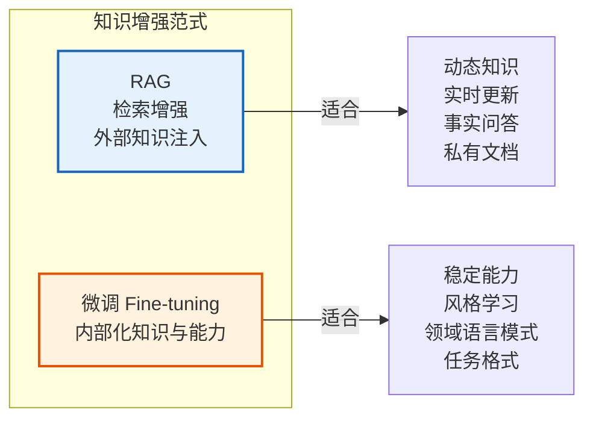

| 维度 | RAG | 微调 |
|------|-----|------|
| **知识更新** | 实时更新知识库即可 | 需重新训练 |
| **成本** | 低（无需训练） | 高（需标注数据+算力） |
| **可溯源性** | 强（可引用来源） | 弱 |
| **幻觉控制** | 强（事实约束） | 弱 |
| **能力内化** | 弱 | 强（风格/格式） |
| **延迟** | 较高（需检索） | 较低 |
| **最佳实践** | **RAG + 微调结合** | — |

---

## 2. 典型使用场景分析

### 2.1 场景矩阵

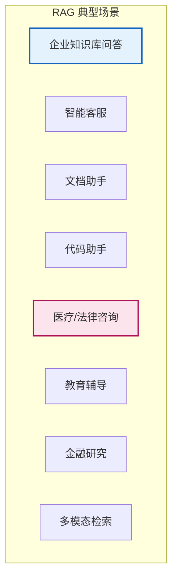

### 2.2 场景详解

| 场景 | 核心价值 | 关键挑战 | 典型实现 |
|------|----------|----------|----------|
| **企业知识库问答** | 让员工快速查询内部文档 | 权限控制、文档多样性 | Confluence/Notion + RAG |
| **智能客服** | 基于FAQ/工单自动应答 | 多轮对话、意图识别 | 向量检索 + 对话管理 |
| **文档助手** | 长文档智能问答与摘要 | 长文档分片、跨段推理 | PDF/Word 解析 + 分片 |
| **代码助手** | 基于代码库问答与生成 | 代码语义、依赖关系 | 代码专用 Embedding |
| **医疗/法律咨询** | 引用权威文献，可溯源 | 准确性要求极高 | 权威知识库 + 严格引用 |
| **教育辅导** | 个性化答疑 | 知识点关联 | 教材分片 + 知识图谱 |
| **金融研究** | 研报/财报问答与对比 | 表格/数据抽取 | 多模态 RAG |
| **多模态检索** | 图文混合检索 | 跨模态对齐 | CLIP + 向量库 |

### 2.3 不适合 RAG 的场景

- **纯创意生成**（写诗、小说）：无需事实约束。
- **稳定能力任务**（格式转换、翻译）：微调更高效。
- **实时性要求极高**（< 100ms）：检索延迟难满足。

---

## 3. RAG 基本运行流程详解

### 3.1 全流程总览

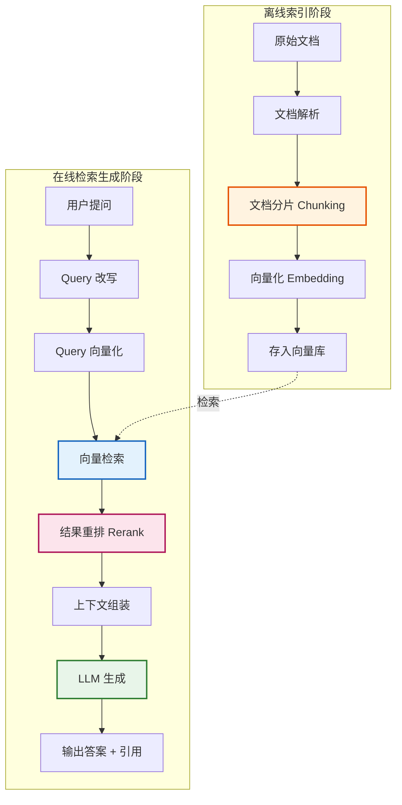

### 3.2 离线索引阶段

```
┌──────────────────────────────────────────────────────────────┐
│                   离线索引构建流程                             │
├──────────────────────────────────────────────────────────────┤
│                                                              │
│  Step 1: 文档加载                                            │
│  ├── 支持 PDF/Word/HTML/Markdown/Excel 等                    │
│  ├── 工具：LangChain Loader / LlamaHub / Unstructured        │
│  └── 输出：纯文本 + 元数据                                   │
│                                                              │
│  Step 2: 文档分片                                            │
│  ├── 按字符/Token/语义切分                                   │
│  ├── 设置 chunk_size 与 overlap                              │
│  └── 输出：chunk 列表                                        │
│                                                              │
│  Step 3: 向量化                                              │
│  ├── 调用 Embedding 模型                                     │
│  ├── 模型：text-embedding-3 / bge / e5                      │
│  └── 输出：每个 chunk 的向量                                 │
│                                                              │
│  Step 4: 存入向量库                                          │
│  ├── 工具：Faiss / Milvus / Pinecone / Chroma               │
│  ├── 同时存储：向量 + 原文 + 元数据                          │
│  └── 建立索引：HNSW / IVF                                    │
│                                                              │
└──────────────────────────────────────────────────────────────┘
```

### 3.3 在线检索生成阶段

```
┌──────────────────────────────────────────────────────────────┐
│                  在线检索生成流程                              │
├──────────────────────────────────────────────────────────────┤
│                                                              │
│  Step 1: Query 预处理                                        │
│  ├── Query 改写（扩展/分解/消除指代）                        │
│  ├── HyDE：生成假设性答案再检索                              │
│  └── 多 Query 生成：从多角度检索                              │
│                                                              │
│  Step 2: 向量检索                                            │
│  ├── Query 向量化                                            │
│  ├── Top-K 检索（K 通常 5-20）                               │
│  └── 混合检索：向量 + 关键词（BM25）                         │
│                                                              │
│  Step 3: 结果重排                                            │
│  ├── Cross-Encoder 重排（精度更高）                          │
│  ├── 模型：bge-reranker / Cohere Rerank                     │
│  └── 从 Top-K 中精选 Top-N（N 通常 3-5）                     │
│                                                              │
│  Step 4: 上下文组装                                          │
│  ├── 将检索 chunks 拼接为上下文                              │
│  ├── 控制总长度不超过上下文窗口                              │
│  └── 附加元数据（来源、页码）                                │
│                                                              │
│  Step 5: LLM 生成                                            │
│  ├── 构造 Prompt：系统指令 + 上下文 + 问题                   │
│  ├── 指令约束：仅基于上下文回答、标注引用                    │
│  └── 模型：GPT-4 / Claude / Qwen / DeepSeek                 │
│                                                              │
│  Step 6: 后处理                                              │
│  ├── 引用标注：为答案标注来源                                │
│  ├── 置信度评估                                              │
│  └── 答案校验：与上下文交叉验证                              │
│                                                              │
└──────────────────────────────────────────────────────────────┘
```

### 3.4 数据流示意（代码视角）

```python
# RAG 核心流程伪代码
def rag_pipeline(user_query: str, vector_store, llm, reranker):
    # 1. Query 改写
    rewritten_queries = query_rewrite(user_query, llm)
    
    # 2. 多路检索
    all_chunks = []
    for q in rewritten_queries:
        chunks = vector_store.similarity_search(q, k=10)
        all_chunks.extend(chunks)
    
    # 3. 去重 + 重排
    unique_chunks = deduplicate(all_chunks)
    reranked = reranker.rerank(user_query, unique_chunks, top_n=5)
    
    # 4. 组装上下文
    context = "\n\n".join([
        f"[来源{i+1}] {chunk.metadata['source']}\n{chunk.content}"
        for i, chunk in enumerate(reranked)
    ])
    
    # 5. 构造 Prompt
    prompt = f"""你是一个严谨的知识助手。请仅基于以下检索资料回答问题。
若资料不足以回答，请明确说明"根据现有资料无法回答"。
回答时请标注引用来源编号 [来源x]。

# 检索资料
{context}

# 用户问题
{user_query}
"""
    
    # 6. LLM 生成
    answer = llm.generate(prompt)
    
    return {"answer": answer, "sources": reranked}
```

---

## 4. 文档分片策略与最佳实践

### 4.1 为什么需要分片

- **Embedding 限制**：Embedding 模型有输入长度上限（通常 512 Token）。
- **检索精度**：小块文本语义更聚焦，检索更精准。
- **上下文控制**：避免单 chunk 过长，浪费 LLM 上下文窗口。
- **成本控制**：只检索相关片段，而非整篇文档。

### 4.2 分片策略全景

```
┌──────────────────────────────────────────────────────────────┐
│                    文档分片策略分类                            │
├──────────────────────────────────────────────────────────────┤
│                                                              │
│  ┌─ 固定长度分片 ─┐                                          │
│  │  字符/Token 固定长度，带 overlap                           │
│  └────────────────┘                                          │
│                                                              │
│  ┌─ 结构化分片 ───┐                                          │
│  │  按 Markdown 标题/段落/代码块切分                          │
│  └────────────────┘                                          │
│                                                              │
│  ┌─ 语义分片 ─────┐                                          │
│  │  按语义边界切分（句子/段落/主题）                          │
│  └────────────────┘                                          │
│                                                              │
│  ┌─ 递归分片 ─────┐                                          │
│  │  优先按结构切分，超长再按段落，再按句子                    │
│  └────────────────┘                                          │
│                                                              │
│  ┌─ 特殊分片 ─────┐                                          │
│  │  表格/代码/公式特殊处理                                    │
│  └────────────────┘                                          │
│                                                              │
└──────────────────────────────────────────────────────────────┘
```

### 4.3 分片策略详解

#### 4.3.1 固定长度分片

```python
from langchain.text_splitter import CharacterTextSplitter

splitter = CharacterTextSplitter(
    chunk_size=500,      # 每 chunk 500 字符
    chunk_overlap=50,    # 重叠 50 字符，避免语义断裂
    separator="\n\n",    # 优先在段落边界切分
)
```

**优缺点**：

| 优点 | 缺点 |
|------|------|
| 实现简单 | 可能切断语义 |
| 长度可控 | 忽略文档结构 |
| 速度快 | 上下文丢失 |

#### 4.3.2 递归字符分片（推荐）

```python
from langchain.text_splitter import RecursiveCharacterTextSplitter

splitter = RecursiveCharacterTextSplitter(
    chunk_size=500,
    chunk_overlap=50,
    separators=["\n\n", "\n", "。", "！", "？", "；", "，", " ", ""],
    # 优先级：段落 > 换行 > 句号 > 感叹 > 问号 > 分号 > 逗号 > 空格 > 字符
)
```

**原理**：按分隔符优先级递归尝试，优先在高级别分隔符切分，超长才降级。

#### 4.3.3 结构化分片

```python
from langchain.text_splitter import MarkdownHeaderTextSplitter

# 按 Markdown 标题层级切分
splitter = MarkdownHeaderTextSplitter(
    headers_to_split_on=[
        ("#", "Header 1"),
        ("##", "Header 2"),
        ("###", "Header 3"),
    ]
)
# 每个 chunk 保留其所属标题链作为元数据
```

#### 4.3.4 语义分片

```python
# 基于 Embedding 相似度的语义分片
from langchain.text_splitter import SemanticChunker
from langchain.embeddings import OpenAIEmbeddings

splitter = SemanticChunker(
    OpenAIEmbeddings(),
    breakpoint_threshold_type="percentile",  # 用百分位数确定断点
    breakpoint_threshold_amount=95,          # 相似度差异超过 95 分位才切分
)
```

### 4.4 分片参数调优

| 参数 | 推荐值 | 影响 |
|------|--------|------|
| **chunk_size** | 300-800 Token | 过小→上下文不足；过大→语义稀释 |
| **chunk_overlap** | chunk_size 的 10-20% | 避免边界语义断裂 |
| **分隔符优先级** | 段落>句子>逗号 | 保留语义完整性 |

**经验法则**：
- 问答场景：chunk_size 300-500 Token
- 摘要场景：chunk_size 800-1500 Token
- 代码场景：按函数/类切分

### 4.5 分片最佳实践

1. **保留元数据**：每个 chunk 携带来源、页码、标题链。
2. **处理表格**：表格转 Markdown 或行式存储。
3. **处理代码**：按函数/类边界切分，保留 import。
4. **父子分片**：小块检索，大块返回（Small-to-Big）。
5. **重叠避免断裂**：合理 overlap 避免关键信息被切分。

---

## 5. 索引构建方法与优化

### 5.1 索引类型

| 索引类型 | 原理 | 适用场景 | 代表工具 |
|----------|------|----------|----------|
| **Flat** | 暴力搜索，无索引 | 小数据集（< 10万） | Faiss Flat |
| **IVF** | 倒排+聚类 | 中等数据集 | Faiss IVF |
| **HNSW** | 层次化小世界图 | 大数据集，高召回 | Milvus/Faiss HNSW |
| **PQ** | 乘积量化压缩 | 内存受限场景 | Faiss IVFPQ |
| **SCANN** | 各向异性量化 | Google 生态 | ScaNN |

### 5.2 HNSW 索引原理

**HNSW（Hierarchical Navigable Small World）** 是最常用的近似最近邻（ANN）索引：

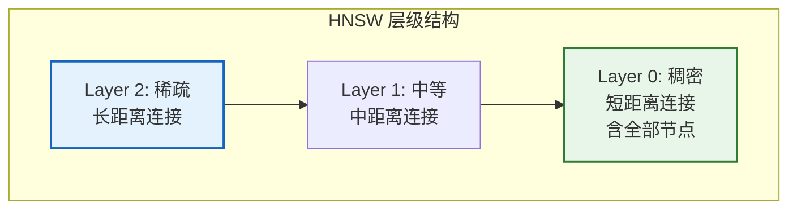

**查询流程**：
1. 从顶层入口点开始贪心搜索。
2. 逐层下沉，每层找到局部最近邻。
3. 在底层（L0）精细搜索，返回 Top-K。

**关键参数**：

| 参数 | 含义 | 推荐值 |
|------|------|--------|
| `M` | 每节点最大连接数 | 16-48 |
| `ef_construction` | 构建时搜索宽度 | 200-500 |
| `ef_search` | 查询时搜索宽度 | 50-200 |

### 5.3 向量库选型对比

| 向量库 | 类型 | 特点 | 适用场景 |
|--------|------|------|----------|
| **Faiss** | 库 | 速度快，无持久化 | 原型/嵌入式 |
| **Milvus** | 分布式 | 可扩展，云原生 | 大规模生产 |
| **Pinecone** | SaaS | 全托管，易用 | 快速上线 |
| **Chroma** | 嵌入式 | 轻量，Python 友好 | 中小型应用 |
| **Weaviate** | 服务 | 内置混合检索 | 多模态 |
| **Qdrant** | 服务 | Rust 实现，高性能 | 高并发 |
| **PGVector** | PG 插件 | 与业务库一体 | 已有 PG 环境 |

### 5.4 索引优化策略

1. **分片索引**：按文档类别/时间分片，缩小检索范围。
2. **元数据过滤**：检索前先按元数据（如部门、时间）过滤。
3. **量化压缩**：PQ/SQ 降低内存占用，轻微损失精度。
4. **多级索引**：粗筛（IVF）+ 精排（Flat）。
5. **增量更新**：支持动态插入，无需重建索引。

---

## 6. 检索算法原理与实现

### 6.1 检索算法分类

```
┌──────────────────────────────────────────────────────────────┐
│                     检索算法分类                              │
├──────────────────────────────────────────────────────────────┤
│                                                              │
│  ┌─ 稠密检索（Dense Retrieval）──────────────────┐           │
│  │  向量相似度：余弦/点积/欧氏                    │           │
│  │  模型：text-embedding-3 / bge / e5            │           │
│  │  优势：语义理解强                              │           │
│  └───────────────────────────────────────────────┘           │
│                                                              │
│  ┌─ 稀疏检索（Sparse Retrieval）──────────────────┐          │
│  │  关键词匹配：BM25 / TF-IDF                    │           │
│  │  优势：精确匹配强，可解释                      │           │
│  └───────────────────────────────────────────────┘           │
│                                                              │
│  ┌─ 混合检索（Hybrid Retrieval）──────────────────┐          │
│  │  稠密 + 稀疏融合                               │           │
│  │  融合：RRF（Reciprocal Rank Fusion）           │           │
│  │  优势：兼顾语义与精确                          │           │
│  └───────────────────────────────────────────────┘           │
│                                                              │
└──────────────────────────────────────────────────────────────┘
```

### 6.2 稠密检索

#### 6.2.1 相似度度量

| 度量 | 公式 | 特点 |
|------|------|------|
| **余弦相似度** | cos(A,B) = A·B / (\|A\|·\|B\|) | 最常用，归一化方向 |
| **点积** | A·B | 含幅度信息 |
| **欧氏距离** | √Σ(Aᵢ-Bᵢ)² | 几何距离 |

#### 6.2.2 Embedding 模型选型

| 模型 | 提供方 | 特点 | 适用 |
|------|--------|------|------|
| **text-embedding-3-large** | OpenAI | 通用强 | 英文/多语言 |
| **bge-large-zh-v1.5** | 智源 | 中文最优 | 中文场景 |
| **e5-mistral-7b** | MS | 高精度 | 学术/高要求 |
| **jina-embeddings-v3** | Jina | 多语言 | 跨语言 |
| **Cohere embed-v3** | Cohere | 商用强 | 企业级 |

**选型建议**：
- 中文优先：bge-large-zh
- 多语言：text-embedding-3 / jina
- 高精度：e5-mistral
- 成本优先：bge-small

### 6.3 稀疏检索（BM25）

**BM25 原理**：基于词频（TF）与逆文档频率（IDF）的改进版 TF-IDF，加入文档长度归一化。

```python
from rank_bm25 import BM25Okapi

# 分词后构建索引
tokenized_corpus = [doc.split() for doc in corpus]
bm25 = BM25Okapi(tokenized_corpus)

# 检索
scores = bm25.get_scores(query.split())
```

**优势**：精确匹配关键词，对专有名词、编号、代码等稠密检索易遗漏的内容表现好。

### 6.4 混合检索（Hybrid Retrieval）

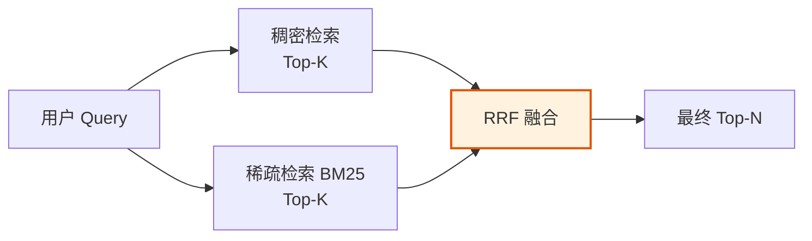

**RRF（Reciprocal Rank Fusion）公式**：

```
RRF_score(d) = Σ 1 / (k + rank_i(d))

其中：
- d: 文档
- k: 平滑常数（通常 60）
- rank_i(d): 文档 d 在第 i 路检索中的排名
```

```python
def rrf_fusion(dense_results, sparse_results, k=60):
    """RRF 融合两路检索结果"""
    scores = {}
    for rank, doc in enumerate(dense_results):
        scores[doc.id] = scores.get(doc.id, 0) + 1 / (k + rank + 1)
    for rank, doc in enumerate(sparse_results):
        scores[doc.id] = scores.get(doc.id, 0) + 1 / (k + rank + 1)
    return sorted(scores.items(), key=lambda x: -x[1])
```

**优势**：兼顾语义理解（稠密）与精确匹配（稀疏），显著提升召回率。

### 6.5 高级检索技术

#### 6.5.1 HyDE（Hypothetical Document Embeddings）

**原理**：先让 LLM 生成一个"假设性答案"，用该答案去检索，而非用原始问题。

```python
def hyde_retrieval(query, llm, vector_store):
    # 1. 生成假设性答案
    hyp_doc = llm.generate(f"请简要回答：{query}")
    
    # 2. 用假设答案检索（比问题语义更接近文档）
    chunks = vector_store.similarity_search(hyp_doc, k=5)
    
    # 3. 用原始问题 + 检索结果生成最终答案
    return generate_answer(query, chunks, llm)
```

**适用**：问题与答案表述差异大的场景（如"如何解决X"→文档讲"X的解决方案"）。

#### 6.5.2 Multi-Query 检索

Multi-Query 检索（多查询检索）通过让大模型将用户的原始问题从多个角度重写为若干个语义相近但表述不同的子问题，再对每个子问题分别执行向量检索，最后将所有检索结果去重融合，从而提升召回的覆盖率和准确性。

**核心思想**：单一查询的表述可能无法精准命中文档中的相关片段（用户问"如何提升系统性能"，文档可能写的是"性能优化方案"），通过多角度改写可以扩大检索语义空间，降低单一查询表述偏差带来的漏召回风险。

**适用场景**：问题表述模糊、文档语义多样、单一查询召回率不足的场景。

```python
def multi_query_retrieval(query, llm, vector_store):
    # 1. 让 LLM 从多角度重写问题
    queries = llm.generate(f"将以下问题改写为3个不同角度的问法：\n{query}")
    
    # 2. 多路检索
    all_chunks = []
    for q in queries:
        all_chunks.extend(vector_store.similarity_search(q, k=5))
    
    # 3. 去重 + 融合
    return deduplicate(all_chunks)
```

**优势**：多路并行检索扩大了语义匹配范围，能有效提升召回率；**权衡**：多次调用 LLM 重写和多次检索会增加延迟和 Token 成本。

#### 6.5.3 父子分片检索（Small-to-Big）

父子分片检索（又称 Small-to-Big 检索）是一种"小块匹配、大块返回"的检索策略。在索引阶段将文档切分为较小的子片段（如句子）用于精准匹配，同时在检索命中后返回该子片段所属的较大父片段（如段落或整篇文档）作为上下文，从而兼顾检索的精准度与上下文的完整性。

**核心思想**：检索精度与上下文完整性往往存在矛盾——小块文本向量匹配更精准（语义集中），但上下文不足；大块文本上下文完整，但语义稀释导致匹配不准。父子分片通过"检索用小块、返回用大块"解耦这一矛盾。

**适用场景**：法律条文、技术文档、长篇报告等需要精准定位关键信息点同时又需要完整上下文支撑理解的场景。

```text
检索：用小块（如句子）匹配
返回：将匹配块所在的父块（如段落）作为上下文

优势：检索精准 + 上下文完整
```

**优势**：兼顾检索精准度与上下文完整性，避免"命中片段过碎导致模型理解困难"的问题；**权衡**：返回的父块较长会增加 Token 消耗，且父子关系映射需要在索引阶段额外维护。

#### 6.5.4 RAG-Fusion：智能结果融合

RAG-Fusion（智能结果融合）是一种在 RAG 检索阶段将多源、多路检索结果进行智能融合与重排序的技术。它在 Multi-Query 检索的基础上进一步引入 RRF（Reciprocal Rank Fusion，倒数排名融合）等融合算法，将来自不同查询、不同检索策略（稠密向量、稀疏关键词、知识图谱等）的互补结果统一汇聚、加权排序，从而在保证召回覆盖率的同时显著提升 Top-N 结果的相关性精度。

**核心思想**：单一查询与单一检索策略都存在固有偏差——用户表述可能不精准、稠密检索易遗漏精确匹配、稀疏检索缺乏语义理解。RAG-Fusion 通过"多角度 Query 生成 + 多路并发检索 + 排名级融合"三段式架构，让多源结果相互补位：被多路检索共同命中的文档在融合后排名上升，单路噪声结果被稀释，最终输出兼具语义广度与匹配精度的融合排序。

**适用场景**：复杂多意图问题、跨领域知识问答、长尾问题召回不足、对召回率与精度同时要求较高的企业级知识库场景。

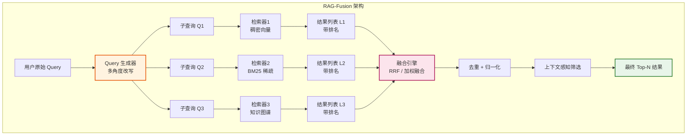

**关键算法详解**：

1. **RRF（Reciprocal Rank Fusion）倒数排名融合**：RAG-Fusion 的默认融合策略，仅依赖文档在各路检索中的排名（而非原始分数），对多路分数尺度不一致的问题具有天然鲁棒性。公式为 `RRF_score(d) = Σ 1 / (k + rank_i(d))`，其中 `k` 为平滑常数（通常取 60），`rank_i(d)` 为文档 d 在第 i 路结果中的排名。被多路共同命中的文档得分累加，自然提升排名。

2. **加权融合策略**：当不同检索源的可信度存在差异时，在 RRF 基础上引入源权重 `w_i`，公式扩展为 `Score(d) = Σ w_i × 1/(k + rank_i(d))`。例如对权威知识图谱检索结果赋予更高权重，对 BM25 结果在专有名词场景赋予更高权重。权重可通过验证集离线学习或在线反馈动态调整。

3. **相关性排序优化**：融合后可进一步叠加 Cross-Encoder 重排（如 bge-reranker），对 Top-K 候选进行 Query-Doc 联合编码精排，弥补排名级融合未考虑语义细粒度匹配的不足。形成"多路召回 → RRF 粗融合 → Cross-Encoder 精排"的三级漏斗。

4. **上下文感知融合机制**：在融合阶段引入上下文信号进行结果筛选与重排，包括：① **冗余去重**：基于语义相似度聚类，同类结果仅保留最优代表，避免上下文冗余；② **多样性保障**：通过 MMR（Maximal Marginal Relevance）在相关性与多样性间平衡，防止 Top-N 全部集中于同一子主题；③ **元数据感知**：结合来源权威性、时间新鲜度、文档层级等元数据调整最终排序。

```python
def rag_fusion(query, llm, retrievers, top_n=5, k=60, weights=None):
    """
    RAG-Fusion 核心实现：多 Query 生成 + 多路检索 + RRF 融合
    :param query: 用户原始查询
    :param llm: 大语言模型，用于 Query 改写
    :param retrievers: 多路检索器列表 [dense_retriever, bm25_retriever, ...]
    :param top_n: 最终返回结果数
    :param k: RRF 平滑常数
    :param weights: 各检索路权重，None 时等权
    """
    # 1. 多角度 Query 生成
    prompt = f"将以下问题改写为 3 个不同角度的子查询，每行一个：\n{query}"
    sub_queries = llm.generate(prompt).strip().split("\n")
    sub_queries.append(query)  # 保留原始查询

    # 2. 多路并发检索，收集每路结果的排名
    rank_map = {}  # doc_id -> {retriever_idx: rank}
    doc_store = {}  # doc_id -> doc
    if weights is None:
        weights = [1.0] * len(retrievers)

    for r_idx, retriever in enumerate(retrievers):
        for sq in sub_queries:
            results = retriever.search(sq, k=10)
            for rank, doc in enumerate(results, start=1):
                if doc.id not in rank_map:
                    rank_map[doc.id] = {}
                    doc_store[doc.id] = doc
                # 同一检索器对同一文档取最优排名
                if r_idx not in rank_map[doc.id] or rank < rank_map[doc.id][r_idx]:
                    rank_map[doc.id][r_idx] = rank

    # 3. RRF 加权融合打分
    fused_scores = {}
    for doc_id, ranks in rank_map.items():
        score = 0.0
        for r_idx, rank in ranks.items():
            score += weights[r_idx] * (1.0 / (k + rank))
        fused_scores[doc_id] = score

    # 4. 按融合分数排序，取 Top-N
    ranked_ids = sorted(fused_scores, key=lambda d: -fused_scores[d])
    return [doc_store[did] for did in ranked_ids[:top_n]]


# 典型调用示例
results = rag_fusion(
    query="如何提升 RAG 系统的召回率",
    llm=llm,
    retrievers=[dense_retriever, bm25_retriever, kg_retriever],
    top_n=5,
    weights=[1.0, 0.8, 1.2],  # 知识图谱权重略高
)
```

**与 Multi-Query 检索的关系**：RAG-Fusion 是 Multi-Query 检索的增强版。Multi-Query 仅做"多路检索 + 简单去重"，结果列表仍是各路结果的并集，未对跨路排名信息加以利用；RAG-Fusion 则进一步通过 RRF 等算法对多路排名进行融合打分，使被多路共同命中的文档获得更高排序权重，从而在召回率提升的基础上额外优化精度。

**与混合检索（Hybrid Retrieval）的区别**：混合检索通常指"稠密 + 稀疏"两路在同一 Query 上的融合；RAG-Fusion 则是"多 Query × 多检索器"的二维扩展，融合维度更广，适合更复杂的多意图问题。

**优势**：
- 显著提升召回覆盖率，多角度 Query + 多路检索降低单一表述偏差与单一策略盲区。
- 排名级融合对分数尺度不敏感，工程上易于跨检索器整合。
- 被多路共同命中的结果自然获得更高权重，精度提升明显。

**权衡**：
- 多 Query 生成 + 多路检索带来更高延迟与 Token 成本，需通过并发与缓存缓解。
- 融合参数（权重、k 值）需基于验证集调优，冷启动阶段表现可能不稳定。
- 多路结果去重与归一化增加工程复杂度，需维护统一的文档 ID 体系。

**工程实践建议**：
- 子查询数量控制在 3-5 个，避免成本失控。
- 多路检索并发执行，配合查询缓存降低重复 Query 开销。
- 融合后接入 Cross-Encoder 重排，形成"召回-融合-精排"三级漏斗。
- 对高频 Query 离线预计算融合结果并缓存，保障在线延迟。

---

## 7. 结果重排技术（Reranking）

### 7.1 为什么需要重排

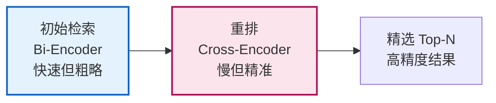

**两阶段原因**：
- **Bi-Encoder**（初始检索）：Query 和 Doc 独立编码，速度快，可预计算，但精度有限。
- **Cross-Encoder**（重排）：Query 和 Doc 拼接后联合编码，精度高但慢，无法预计算。

### 7.2 Bi-Encoder vs Cross-Encoder

| 维度 | Bi-Encoder | Cross-Encoder |
|------|------------|----------------|
| **输入** | Q 和 D 分别编码 | Q 和 D 拼接编码 |
| **速度** | 快（可预计算） | 慢（实时计算） |
| **精度** | 中 | 高 |
| **用途** | 初始检索 Top-K | 精排 Top-N |
| **模型** | bge-large / e5 | bge-reranker / Cohere Rerank |

### 7.3 重排模型选型

| 模型 | 类型 | 特点 |
|------|------|------|
| **bge-reranker-large** | 开源 Cross-Encoder | 中文最优，免费 |
| **Cohere Rerank** | API 服务 | 商用强，多语言 |
| **jina-reranker-v2** | 开源 | 多语言，轻量 |
| **Voyage Rerank** | API | 高精度 |

### 7.4 重排实现示例

```python
from FlagEmbedding import FlagReranker

# 加载重排模型
reranker = FlagReranker('BAAI/bge-reranker-large', use_fp16=True)

def rerank(query, chunks, top_n=5):
    # 构造 [query, chunk] 对
    pairs = [[query, chunk.content] for chunk in chunks]
    
    # 计算相关性分数
    scores = reranker.compute_score(pairs, normalize=True)
    
    # 按分数排序
    ranked = sorted(zip(chunks, scores), key=lambda x: -x[1])
    
    return [chunk for chunk, _ in ranked[:top_n]]
```

### 7.5 重排最佳实践

1. **初始检索多取**：Top-K = 20-50，给重排足够候选。
2. **重排精选**：Top-N = 3-5，控制上下文长度。
3. **分数阈值**：低于阈值的结果丢弃，避免噪声。
4. **异步重排**：重排较慢，可异步流式返回。

---

## 8. 生成阶段的提示工程

### 8.1 RAG Prompt 设计原则

| 原则 | 说明 |
|------|------|
| **事实约束** | 明确要求"仅基于检索资料回答" |
| **拒答机制** | 资料不足时明确说明，而非编造 |
| **引用标注** | 要求标注来源编号 |
| **结构化输出** | 答案 + 引用 + 置信度 |
| **防止注入** | 检索内容视为数据，而非指令 |

### 8.2 Prompt 模板

#### 8.2.1 标准 RAG Prompt

```text
你是一个严谨的知识助手。请严格遵循以下规则：

1. 仅基于下方"检索资料"回答问题，不得使用资料外的知识。
2. 若资料不足以回答，请明确说"根据现有资料无法回答"。
3. 回答中引用信息时，标注来源编号，如 [来源1]。
4. 保持客观准确，不添加推测性内容。

# 检索资料
[来源1] {source_1}
内容：{content_1}

[来源2] {source_2}
内容：{content_2}

[来源3] {source_3}
内容：{content_3}

# 用户问题
{user_question}

# 回答格式
答案：[你的回答]
引用：[使用的来源编号]
```

#### 8.2.2 多轮对话 RAG Prompt

```text
你是一个知识助手。请基于检索资料回答用户当前问题。

# 对话历史
用户：{history_question_1}
助手：{history_answer_1}

# 当前问题
用户：{current_question}

# 检索资料（针对当前问题）
{retrieved_context}

# 回答要求
1. 结合对话历史理解当前问题（可能含指代）
2. 仅基于检索资料回答
3. 标注来源
```

#### 8.2.3 表格/结构化数据 RAG Prompt

```text
请基于以下表格数据回答问题。

# 检索到的表格
表格1：{table_markdown_1}
表格2：{table_markdown_2}

# 问题
{question}

# 要求
1. 基于表格数据精确回答
2. 涉及数值时保留原文表述
3. 必要时以 Markdown 表格形式呈现答案
```

### 8.3 高级 Prompt 技巧

#### 8.3.1 思维链 + RAG

```text
请按以下步骤回答：

1. 分析问题：问题在问什么？需要哪些信息？
2. 检索资料审查：哪些资料与问题相关？
3. 信息提取：从相关资料中提取答案要素。
4. 综合推理：基于提取信息推理答案。
5. 输出答案：[答案] + [引用]

# 检索资料
{context}

# 问题
{question}
```

#### 8.3.2 自我验证（Self-Verification）

```text
# 第一步：生成初步答案
基于检索资料回答：{question}
答案：{initial_answer}

# 第二步：自我验证
请检查上述答案是否完全由检索资料支持：
- 每个论断是否有对应来源？
- 是否有编造内容？
- 若有问题，请修正。

# 检索资料
{context}

# 修正后答案
```

---

## 9. 检索优化策略与性能调优

### 9.1 检索质量优化

```
┌──────────────────────────────────────────────────────────────┐
│                  检索质量优化策略全景                          │
├──────────────────────────────────────────────────────────────┤
│                                                              │
│  ┌─ Query 优化 ──────────────────────────────────┐           │
│  │  Query 改写 / HyDE / Multi-Query / Step-Back  │           │
│  └───────────────────────────────────────────────┘           │
│                                                              │
│  ┌─ 检索策略优化 ────────────────────────────────┐           │
│  │  混合检索 / 多路召回 / 父子分片               │           │
│  └───────────────────────────────────────────────┘           │
│                                                              │
│  ┌─ 重排优化 ────────────────────────────────────┐           │
│  │  Cross-Encoder / 多模型集成 / 阈值过滤         │           │
│  └───────────────────────────────────────────────┘           │
│                                                              │
│  ┌─ 索引优化 ────────────────────────────────────┐           │
│  │  分片策略 / 元数据过滤 / 增量更新              │           │
│  └───────────────────────────────────────────────┘           │
│                                                              │
│  ┌─ Embedding 优化 ──────────────────────────────┐           │
│  │  模型微调 / 领域适配 / 指令化 Embedding        │           │
│  └───────────────────────────────────────────────┘           │
│                                                              │
└──────────────────────────────────────────────────────────────┘
```

### 9.2 性能调优

#### 9.2.1 延迟优化

| 阶段 | 优化手段 | 收益 |
|------|----------|------|
| **Embedding** | 缓存 Query 向量 | 重复 Query 0ms |
| **检索** | 调整 HNSW ef_search | 降低 50% 延迟 |
| **重排** | 批量并行 + 减少 Top-K | 降低重排耗时 |
| **生成** | 流式输出 + 轻量模型 | 首字延迟降低 |
| **全链路** | 异步流水线 | 端到端延迟优化 |

#### 9.2.2 召回率优化

| 问题 | 方案 |
|------|------|
| **召回不全** | 增大 Top-K、多路检索、混合检索 |
| **召回不准** | 重排、Embedding 微调、Query 改写 |
| **专有名词遗漏** | 加入 BM25 稀疏检索 |
| **长尾问题失败** | 扩充知识库、Query 扩展 |

#### 9.2.3 成本优化

| 优化项 | 方法 |
|--------|------|
| **Embedding 成本** | 开源模型（bge）替代商业 API |
| **LLM 成本** | 分级路由：简单问题用小模型，复杂用大模型 |
| **存储成本** | 量化压缩（PQ/SQ） |
| **检索成本** | 元数据预过滤，缩小检索范围 |

### 9.3 评估指标

#### 9.3.1 检索阶段评估

| 指标 | 含义 | 公式 |
|------|------|------|
| **Recall@K** | Top-K 中含正确文档的比例 | 命中数 / 总相关数 |
| **Precision@K** | Top-K 中相关文档占比 | 相关数 / K |
| **MRR** | 平均倒数排名 | 1 / 正确答案排名 |
| **NDCG** | 归一化折损累积增益 | 考虑排名位置的增益 |

#### 9.3.2 生成阶段评估

| 指标 | 含义 |
|------|------|
| **Faithfulness（忠实度）** | 答案是否完全由检索资料支持 |
| **Answer Relevancy** | 答案与问题的相关性 |
| **Context Precision** | 检索上下文的精度 |
| **Context Recall** | 检索上下文的召回 |
| **Human Eval** | 人工评估准确性、完整性 |

**评估工具**：RAGAS（RAG Assessment Framework）

```python
from ragas import evaluate
from ragas.metrics import faithfulness, answer_relevancy, context_precision

result = evaluate(
    dataset=test_dataset,
    metrics=[faithfulness, answer_relevancy, context_precision],
)
```

---

## 10. RAG 架构设计与技术选型

### 10.1 基础架构

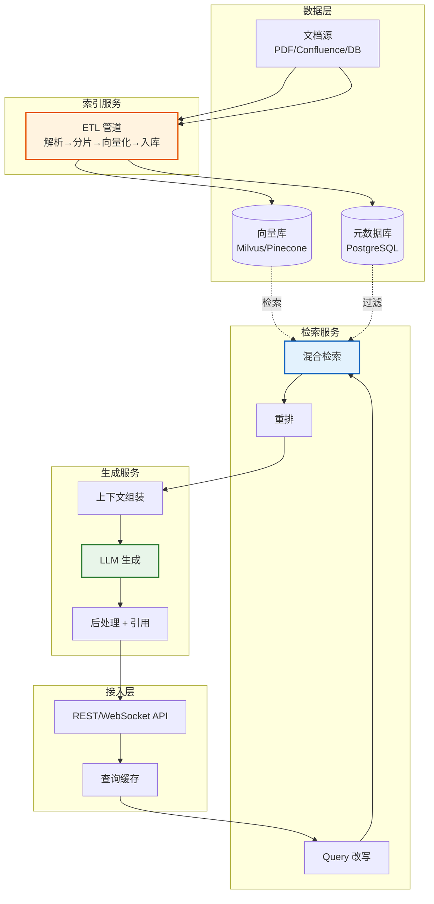

### 10.2 高级架构：GraphRAG

**GraphRAG** 将知识图谱与向量检索结合：

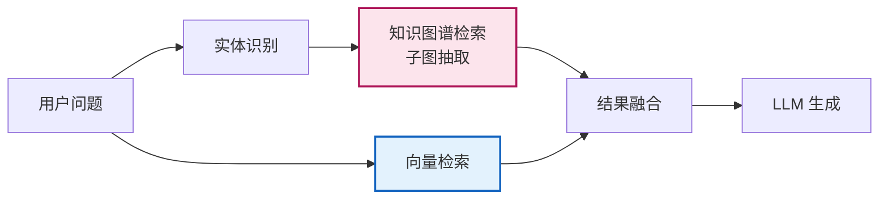

**优势**：
- 处理多跳推理（向量检索难处理）。
- 实体关系明确，可溯源。
- 结合结构化与非结构化知识。

### 10.3 技术选型清单

| 组件 | 推荐方案 | 备选 |
|------|----------|------|
| **文档解析** | Unstructured | LangChain Loaders |
| **分片** | RecursiveCharacterTextSplitter | 语义分片 |
| **Embedding** | bge-large-zh（中文） | text-embedding-3 |
| **向量库** | Milvus（生产） | Chroma（原型） |
| **稀疏检索** | BM25 (rank_bm25) | Elasticsearch |
| **重排** | bge-reranker-large | Cohere Rerank |
| **LLM** | GPT-4 / Qwen / DeepSeek | Claude |
| **框架** | LangChain / LlamaIndex | 自研 |
| **评估** | RAGAS | TruLens |

---

## 11. 常见问题与解决方案

### 11.1 问题排查矩阵

| 问题现象 | 可能原因 | 解决方案 |
|----------|----------|----------|
| **答案与文档不符** | 检索不到相关 chunk | 优化分片/Embedding/混合检索 |
| **答案编造（幻觉）** | LLM 忽略上下文 | 强化 Prompt 约束 + 自我验证 |
| **检索到但未引用** | Prompt 不够明确 | 显式要求标注引用 |
| **多跳推理失败** | 信息跨多个 chunk | GraphRAG / 父子分片 |
| **专有名词检索失败** | 稠密检索遗漏 | 加入 BM25 |
| **长文档摘要不全** | chunk 过细 | 增大 chunk_size / Map-Reduce |
| **响应延迟高** | 重排/生成慢 | 异步流水线 + 缓存 |
| **知识库更新滞后** | 索引未更新 | 增量索引 / 定时 ETL |

### 11.2 典型问题深度分析

#### 11.2.1 幻觉问题

```text
根因：LLM 倾向于"补全"而非"拒答"

解决：
1. Prompt 强化：明确"资料不足时必须说不知道"
2. 检索增强：确保检索到足够相关内容
3. 后置校验：用 NLI 模型检测答案与上下文是否矛盾
4. 置信度阈值：低于阈值的答案标记为"不确定"
```

#### 11.2.2 召回率不足

```text
排查步骤：
1. 检查问题与文档的表述差异 → Query 改写
2. 检查 Embedding 模型是否适合领域 → 微调/换模型
3. 检查分片是否切断了关键信息 → 调整分片策略
4. 检查是否只有稠密检索 → 加入 BM25
5. 检查 Top-K 是否过小 → 增大 K + 重排
```

---

## 12. 与传统问答系统的区别

### 12.1 对比矩阵

| 维度 | 传统 QA 系统 | RAG 系统 |
|------|-------------|----------|
| **知识来源** | 人工编写的 FAQ / 规则库 | 自动检索的文档库 |
| **维护成本** | 高（人工维护规则） | 低（更新文档即可） |
| **覆盖范围** | 有限（预定义问题） | 广（任意问题） |
| **理解能力** | 关键词匹配 | 语义理解 |
| **生成能力** | 模板填充 | 自由生成 |
| **可溯源性** | 弱 | 强（引用来源） |
| **多轮对话** | 难 | 原生支持 |
| **部署成本** | 中 | 较高（向量库+LLM） |

### 12.2 与知识图谱问答（KGQA）对比

| 维度 | KGQA | RAG |
|------|------|-----|
| **知识结构** | 结构化三元组 | 非结构化文本 |
| **查询方式** | 图遍历/SPARQL | 向量相似度 |
| **多跳推理** | 强 | 弱（GraphRAG 可弥补） |
| **知识构建** | 高（需实体抽取+关系标注） | 低（文档直接入库） |
| **最佳实践** | **RAG + KG 结合** | — |

---

## 13. 最新发展趋势

### 13.1 技术趋势

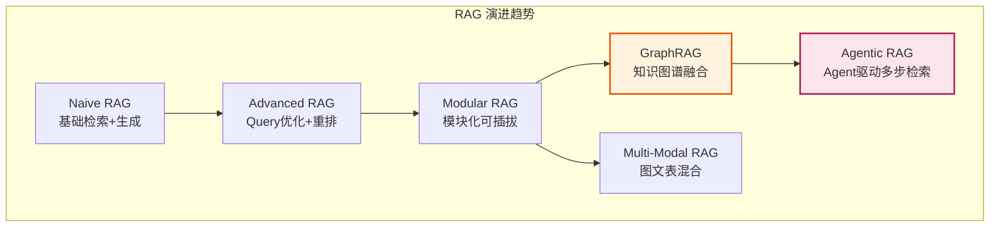

### 13.2 趋势详解

| 趋势 | 核心创新 | 价值 |
|------|----------|------|
| **Agentic RAG** | Agent 自主决策何时检索、检索什么、是否再检索 | 复杂任务自适应 |
| **GraphRAG** | 知识图谱 + 向量检索融合 | 多跳推理 |
| **Multi-Modal RAG** | 文本+图片+表格统一检索 | 处理多模态文档 |
| **Self-RAG** | LLM 自我判断是否需检索、检索结果是否相关 | 减少无效检索 |
| **Adaptive RAG** | 根据问题难度动态选择检索策略 | 成本与质量平衡 |
| **Long-Context RAG** | 利用长上下文模型（Gemini 2M Token）减少分片 | 上下文完整性 |
| **RAG + 微调** | Embedding 微调 + LLM 领域微调 | 双重优化 |

### 13.3 Self-RAG 原理

```text
Self-RAG 流程：
1. LLM 判断是否需要检索（Retrieve?）
   ├── 不需要 → 直接生成
   └── 需要 → 执行检索
2. 对每个检索结果，判断相关性（Relevant?）
   ├── 不相关 → 丢弃
   └── 相关 → 保留
3. 基于相关片段生成答案
4. 判断答案是否被支持（Supported?）
   ├── 是 → 输出
   └── 否 → 重新检索或拒答
```

---

## 14. 高频面试题与参考答案

### Q1：请简述 RAG 的完整流程。

**参考答案**：
RAG 分为离线索引和在线检索生成两阶段。
- **离线**：文档加载→分片→向量化→存入向量库。
- **在线**：用户提问→Query 改写→向量检索 Top-K→重排精选 Top-N→组装上下文→LLM 生成→输出答案+引用。
核心思想是用检索到的外部知识作为 LLM 的上下文，约束生成并减少幻觉。

### Q2：RAG 和微调该如何选择？

**参考答案**：
- **选 RAG**：知识需频繁更新、需可溯源、事实问答、私有文档场景。
- **选微调**：需内化稳定能力、学习领域语言风格、特定任务格式。
- **最佳实践**：两者结合。Embedding 微调适配领域语义，LLM 微调适配回答风格，RAG 提供实时知识。

### Q3：如何选择 chunk_size？过大或过小有什么问题？

**参考答案**：
- **过大**（> 1000 Token）：语义稀释，检索精度下降，浪费上下文窗口。
- **过小**（< 100 Token）：上下文不完整，可能丢失关键信息，检索碎片化。
- **推荐**：问答场景 300-500 Token，摘要场景 800-1500 Token。
- **进阶**：用父子分片（小块检索，大块返回）兼顾精度与完整。

### Q4：什么是混合检索？为什么需要它？

**参考答案**：
混合检索是稠密向量检索与稀疏关键词检索（BM25）的结合，用 RRF 等算法融合结果。
- **稠密检索**擅长语义理解，但对专有名词、编号、代码易遗漏。
- **稀疏检索**擅长精确匹配，但缺乏语义理解。
- **结合**后兼顾语义与精确，显著提升召回率。

### Q5：Reranking 的作用是什么？为什么不直接用 Cross-Encoder 检索？

**参考答案**：
重排用 Cross-Encoder 对初始检索的 Top-K 精排，提升精度。
不直接用 Cross-Encoder 检索的原因：Cross-Encoder 需将 Query 与每个文档拼接编码，计算量为 O(N)，无法预计算，对大规模库不可行。因此采用"Bi-Encoder 粗筛 + Cross-Encoder 精排"的两阶段策略。

### Q6：如何评估 RAG 系统的效果？

**参考答案**：
分检索与生成两阶段评估：
- **检索指标**：Recall@K、Precision@K、MRR、NDCG。
- **生成指标**：Faithfulness（忠实度）、Answer Relevancy（答案相关性）、Context Precision/Recall。
- **工具**：RAGAS 框架自动化评估 + 人工评估补充。
- **关键**：Faithfulness 是 RAG 最重要指标，衡量答案是否完全由检索资料支持。

### Q7：如何解决 RAG 的幻觉问题？

**参考答案**：
1. **Prompt 约束**：明确要求"仅基于资料回答，不足时拒答"。
2. **检索质量**：确保检索到足够相关内容。
3. **后置校验**：用 NLI 模型检测答案与上下文是否矛盾。
4. **自我验证**：让 LLM 自检答案是否有来源支持。
5. **置信度阈值**：低置信度答案标记"不确定"。

### Q8：什么是 HyDE？它解决了什么问题？

**参考答案**：
HyDE（Hypothetical Document Embeddings）先让 LLM 生成假设性答案，再用该答案去检索。
**解决的问题**：用户问题与文档表述差异大时，直接用问题检索召回率低（如问"如何解决X"，文档讲"X的解决方案"）。假设答案的表述更接近文档，检索更精准。

### Q9：GraphRAG 与传统 RAG 的区别？

**参考答案**：
- **传统 RAG**：基于向量相似度检索，擅长单跳事实问答，难处理多跳推理。
- **GraphRAG**：融合知识图谱，通过实体关系遍历实现多跳推理，适合"A的领导的毕业院校"这类链式问题。
- **结合**：GraphRAG 是传统 RAG 的补充，用图检索处理关系推理，用向量检索处理语义匹配。

### Q10：Agentic RAG 是什么？与普通 RAG 有何不同？

**参考答案**：
Agentic RAG 用 Agent 驱动检索过程，让 LLM 自主决策：
- **是否检索**：简单问题直接回答，复杂问题才检索。
- **检索什么**：动态生成 Query，可能多轮检索。
- **是否再检索**：评估检索结果是否足够，不足则补充。
- **普通 RAG**：固定流程"检索→生成"，无自主决策。
- **价值**：自适应复杂任务，减少无效检索，提升复杂问题解决率。

---

## 15. 总结与记忆口诀

### 15.1 核心要点速记

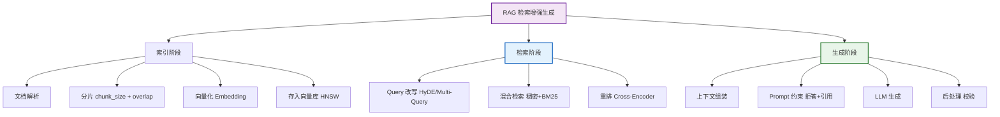

### 15.2 记忆口诀

> **"离线索引四步走，解析分片向量化；在线检索三阶段，改写混合加重排；生成约束拒幻觉，引用溯源保可信；评估要看四指标，召回忠实与相关。"**

### 15.3 一句话总结

**RAG 通过"离线建索引 + 在线检索生成"的两阶段架构，用外部知识约束 LLM 生成，是解决幻觉、知识时效与领域适配的性价比最高的方案；其核心优化在于检索质量（分片+混合检索+重排）与生成质量（Prompt 约束+自我验证），未来正向 GraphRAG、Agentic RAG、Multi-Modal RAG 方向演进。**

---

> **参考资料**：
> - Lewis et al., *Retrieval-Augmented Generation for Knowledge-Intensive NLP Tasks*, 2020
> - Gao et al., *Retrieval-Augmented Generation for Large Language Models: A Survey*, 2023
> - Edge et al., *From Local to Global: A GraphRAG Approach to Query-Focused Summarization*, 2024
> - Asai et al., *Self-RAG: Learning to Retrieve, Generate, and Critique through Self-Reflection*, 2023
> - RAGAS: https://github.com/explodinggradients/ragas
> - LangChain RAG: https://python.langchain.com/docs/use_cases/question_answering/
