# Agent 自主学习功能设计与实现完整方案

> **文档定位**:本文档是 `13项目经验` 系列的**自主学习中枢专题篇**。在现有 1-8/10-12 系列覆盖基础概念、大模型原理、Agent 架构、RAG、Memory、框架、Tool Calling、Multi-Agent、性能优化、模型部署、语言选型的工程知识之上,回答一个让 Agent 系统从"**一次性脚本可跑**"跃升为"**越用越好用,持续自我进化**"的核心问题:**如何设计并实现一套可实施、可扩展、学习效率高的 Agent 自主学习闭环?**
>
> **核心交付物**:
> - 自主学习三层技术架构(经验层 / 学习层 / 应用层)与 7 子系统设计
> - 5 种核心学习范式选型矩阵(RAG-Doc / Prompt / Tool-Router / Skill-RAG / LoRA-SFT / DPO)与渐进路径
> - 经验数据四阶段处理流程(采集→清洗→组织→合成)与去噪分层算法
> - 多信号反馈机制(隐式行为+显式打分+结果校验+Reviewer 评审)融合算法
> - 学习目标 OKR 体系(三维度:质量/效率/成本)+ 冷启动 → 成长 → 稳态三阶段曲线
> - 6 项性能评估指标 + A/B 分桶 + 52 周全量回归验证方案
> - 端到端自主学习引擎 `SelfLearningOrchestrator` 伪代码 + 5 个关键模块参考实现

---

## 目录

- [一、为什么 Agent 需要自主学习:本质、边界与 13项目经验 的场景需求](#一为什么-agent-需要自主学习本质边界与-13项目经验-的场景需求)
- [二、自主学习总体架构设计:三层七子系统](#二自主学习总体架构设计三层七子系统)
- [三、核心学习范式选型:5 类技术路径 + 渐进采用路线](#三核心学习范式选型5-类技术路径-渐进采用路线)
- [四、学习数据处理流程:采集-清洗-组织-合成四阶段](#四学习数据处理流程采集-清洗-组织-合成四阶段)
- [五、学习目标设定:三维度 OKR + 三阶段成长曲线](#五学习目标设定三维度-okr--三阶段成长曲线)
- [六、多信号反馈机制设计:4 类反馈源融合算法](#六多信号反馈机制设计4-类反馈源融合算法)
- [七、关键模块实现思路与伪代码示例](#七关键模块实现思路与伪代码示例)
- [八、性能评估指标体系与 A/B 验证方案](#八性能评估指标体系与-ab-验证方案)
- [九、可扩展性与工程落地:从单 Agent 到 Multi-Agent 的迁移路径](#九可扩展性与工程落地从单-agent-到-multi-agent-的迁移路径)
- [十、风险、反模式与最佳实践](#十风险反模式与最佳实践)
- [十一、与其他系列文档的能力互补对照表](#十一与其他系列文档的能力互补对照表)
- [十二、交付清单与 90 天实施路线图](#十二交付清单与-90-天实施路线图)

---

## 一、为什么 Agent 需要自主学习:本质、边界与 13项目经验 的场景需求

### 1.1 自主学习的本质:Agent 版本的"经验 → 能力"内循环

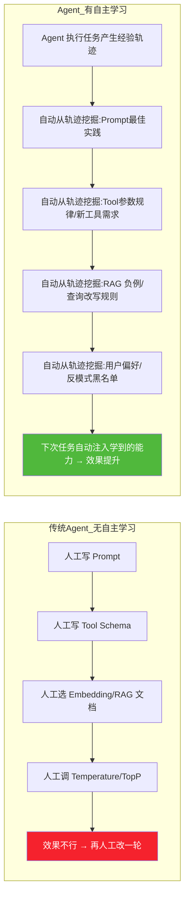

> **本质定义**:**Agent 自主学习 ≠ LLM 再训练**(那是成本巨大且有滞后的模型级学习)。Agent 自主学习的第一性原理是:
> **让 Agent 在"不改模型权重"的前提下,通过把运行期的成败经验转化为可复用的结构化知识(Prompt 模板、Tool 调用规则、RAG 查询改写、失败规避策略、用户偏好、LoRA/SFT 合成数据集等),
> 在下一次同类任务中表现得更好。**
> 当积累到一定体量后,再升级为 LoRA-SFT / DPO 做**权重级学习**(第二阶段)。

### 1.2 自主学习的 5 条边界(什么应该学、什么绝对不该学)

| 应学习(√) | 不应学习(×) | 原因 |
|:---------|:-----------|:-----|
| Prompt 模板/SOP 套路 | 用户隐私数据(PII/身份证/银行卡) | **合规红线**:GDPR/数据安全法 |
| Tool 调用参数最佳实践 | 敏感商业决策(合同/采购/定价) | **责任红线**:必须人审(HITL) |
| RAG 查询改写/重排序规则 | 模型越狱/Prompt Injection 经验 | **安全红线**:用 180/181 号防护文档治理 |
| 失败规避/异常处理策略 | 歧视性/不公平偏好 | **伦理红线**:公平性审计不通过 |
| 用户可公开偏好(格式/风格) | 安全工具(禁用指令)的绕过经验 | **攻防红线**:安全 Guard 不参与学习 |

### 1.3 13项目经验 的典型场景:三类 Agent 项目 × 自主学习诉求

| 项目类型 | 典型例子 | 自主学习核心痛点 | 本方案解决路径 |
|---------|---------|----------------|-------------|
| **P1 企业知识问答 Agent** | 内部知识库问答 / IT 工单助手 | RAG 召回经常答非所问,用户改写 2-3 次才对 | §4 采集用户改写轨迹 → §3 Skill-RAG 查询改写库 + §3 RAG-Doc 负例注入 |
| **P2 任务执行型 Agent** | 代码生成/报表生成/工单处理 | 同类型 Tool 错误反复出现(Prompt 长度/参数格式) | §3 Prompt Learning 错误模式库 + §6 多信号反馈 + §7.3 错误规避记忆 |
| **P3 Multi-Agent 团队协作型** | 市场调研/研究报告/软件开发团队 | 角色分工不稳定、协作死循环、反复返工 | §3 Skill-RAG 角色分工策略库 + §6 Reviewer 评审反馈 + §7 Orchestrator 决策记忆 |

### 1.4 设计目标:SELF-F 六维约束

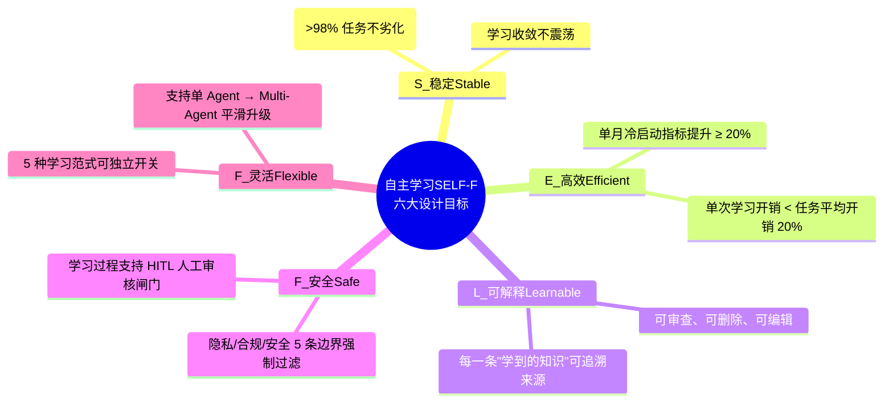

**预期收益曲线(经验验证)**:

| 阶段 | 时间 | 质量提升(相对首版) | 效率提升 | 成本下降 |
|------|-----|:----------------|---------|---------|
| 冷启动 | 第 0-2 周 | 基准(无学习) | 1.0× | 1.0× |
| 成长期 | 第 3-8 周 | **+15-25%** | 1.3-1.6× | 0.9× |
| 稳态期 | 第 9-24 周 | **+30-45%** | 1.8-2.3× | 0.7-0.8× |
| 融合期(LoRA) | 第 25+ 周 | **+45-60%** | 2.3-3.0× | 0.6-0.75× |

---

## 二、自主学习总体架构设计:三层七子系统

### 2.1 三层架构全景图

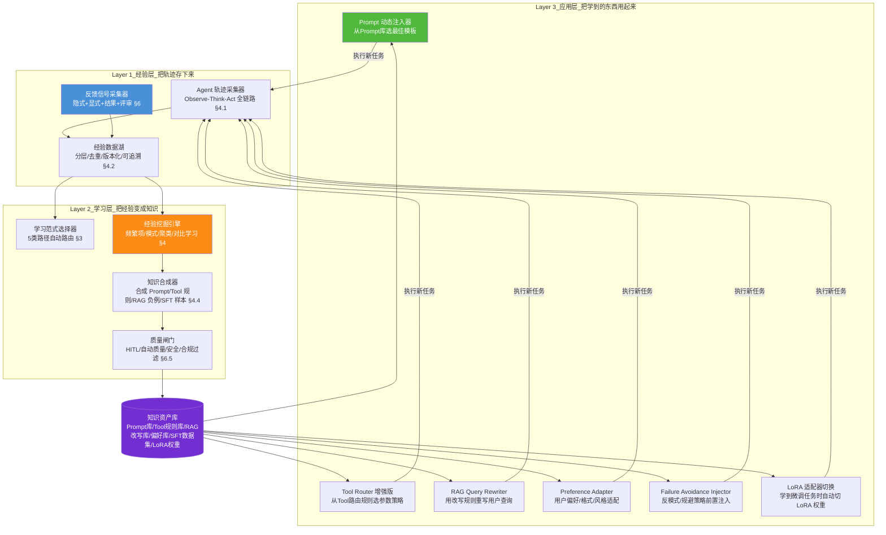

### 2.2 七子系统职责矩阵

| 编号 | 子系统名 | 所属层 | 核心职责 | 对应章节 |
|:----|:--------|:------|:--------|:--------|
| S1 | 轨迹采集子系统 | 经验层 | 采集 Agent O-T-A 全链路 + Tool IO + RAG 检索详细信息 | §4.1 |
| S2 | 反馈融合子系统 | 经验层 | 4 类反馈源(隐式/显式/结果/评审)加权融合 | §6 |
| S3 | 经验挖掘子系统 | 学习层 | 高频模式挖掘 + 失败聚类 + 正负例对比 + 知识候选生成 | §4.3 |
| S4 | 学习范式路由器 | 学习层 | 任务类型 × 反馈置信度 → 选择 5 种学习路径 | §3.4 |
| S5 | 知识合成与闸门 | 学习层 | 合成知识资产 + 自动化 + 人工 HITL 审核 | §4.4 + §6.5 |
| S6 | 知识资产库 | 存储层(跨层) | 六种知识类型 + 版本 + 元数据 + A/B 分桶 | §7.6 |
| S7 | 知识注入子系统 | 应用层 | Prompt/Tool/RAG/偏好/反模式/LoRA 六大注入通道 | §7.1-§7.5 |

### 2.3 学习周期节拍:周级 & 月级双轨

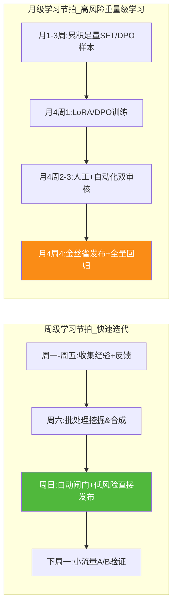

> **为什么双轨?** Prompt/RAG 改写等**"轻知识"**可以周级快速迭代(风险低、见效快);LoRA/DPO 等**"重知识"**必须月级、保证足量样本+严格全量回归(风险高、不可逆)。

---

## 三、核心学习范式选型:5 类技术路径 + 渐进采用路线

### 3.1 五范式对比矩阵(工程可实施度、学习效率、效果增益三维评估)

```mermaid
flowchart TB
    subgraph L1_第1梯队_立即上_冷启动可启用
        P1["范式1: Prompt 动态学习<br/>经验→最佳Prompt模板库<br/>§3.2"]
        P2["范式2: RAG 文档 & 查询学习<br/>负例注入+查询改写+重排策略<br/>§3.2"]
    end
    subgraph L2_第2梯队_第2月启用_数据量>1K时
        P3["范式3: Tool Router & 参数策略学习<br/>工具选择+参数规律+错误规避<br/>§3.3"]
        P4["范式4: Skill-RAG 策略记忆库<br/>把成功策略做成可检索Skill chunks<br/>§3.3"]
    end
    subgraph L3_第3梯队_第6月启用_样本>10K
        P5["范式5: 权重级学习 LoRA-SFT + DPO<br/>高质量SFT样本+偏好对→微调<br/>§3.4"]
    end

    L1 --> L2 --> L3

    style P1 fill:#50b83c,color:#fff
    style P2 fill:#50b83c,color:#fff
    style P3 fill:#4a90d9,color:#fff
    style P4 fill:#4a90d9,color:#fff
    style P5 fill:#722ed1,color:#fff
```

| 范式编号 | 名称 | 学习对象 | 技术核心 | 所需样本量 | 风险等级 | 效果上限 | 冷启动时间 |
|:--------|:----|:--------|:---------|:----------|:--------|:--------|:----------|
| **F1** | Prompt 动态学习 | System Prompt / Few-shot 样例 | 成功轨迹Prompt抽取 + 质量评分排序 + 按意图聚类 | ≥ 50 条成功轨迹 | 🟢 低 | +10-20% | 1-2 周 |
| **F2** | RAG 文档&查询学习 | 文档增强 / 查询改写 / 负例注入 | 用户点击修正轨迹 → 同义查询簇 + 负例标注 + 文档质量分层 | ≥ 100 条交互记录 | 🟢 低 | +15-25% | 2-3 周 |
| **F3** | Tool Router & 参数学习 | 工具选择 + 参数填充策略 | 决策树/lightGBM 路由 + 参数高频模式挖掘 + 失败模式黑名单 | ≥ 500 次工具调用 | 🟡 中 | +10-18% | 1-2 月 |
| **F4** | Skill-RAG 策略记忆库 | 成功 SOP/套路/反模式 | 经验 chunking + embedding 入库 + 检索注入到 System Prompt | ≥ 200 条完整成功轨迹 | 🟡 中 | +15-25% | 1-2 月 |
| **F5** | LoRA-SFT / DPO 权重学习 | 模型权重(LoRA 适配器) | 高质量指令对 SFT + 偏好对 DPO | ≥ 5K(LoRA) / ≥ 10K(DPO) | 🔴 高 | +30-50% | 6 月+ |

### 3.2 F1/F2 范式:Prompt & RAG 自主学习(第 1 梯队,冷启动立即上)

```mermaid
flowchart TD
    subgraph F1 Prompt 动态学习
        T1["成功轨迹(score>80)"] --> T1A["提取 System Prompt"]
        T1 --> T1B["提取 Few-shot 正例"]
        T1A & T1B --> T1C[按"意图簇"聚类<br/>比如:工单分类意图簇]
        T1C --> T1D["每个簇选 Top-K Prompt(分数最高、长度最短)"]
        T1D --> T1E["存入 Prompt 库 + 版本号"]
    end
    subgraph F2 RAG 学习
        T2["RAG 交互轨迹"] --> T2A["用户重写查询对(q1→q2)<br/>共现≥5次→改写规则"]
        T2 --> T2B["用户拒答/追问负例<br/>→ 负例注入文档库,降权"]
        T2 --> T2C["用户接受率低于 50% 的文档<br/>→ 文档质量分层 & 重排序降权"]
        T2A & T2B & T2C --> T2D["RAG 知识库刷新 + 查询 Rewrite 规则库"]
    end

    style T1D fill:#50b83c,color:#fff
    style T2D fill:#50b83c,color:#fff
```

### 3.3 F3/F4 范式:Tool-Router & Skill-RAG(第 2 梯队,数据 1K+ 启用)

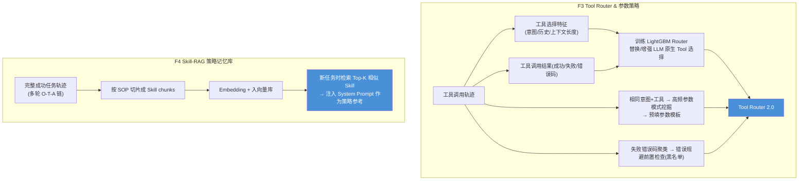

### 3.4 F5 范式:LoRA-SFT / DPO(第 3 梯队,样本体量充足才启用)

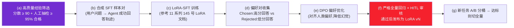

### 3.5 学习范式路由器:自动选 F1-F5

```python
# 3.5 范式路由器伪代码(§7.2 完整实现)
class LearningParadigmRouter:
    THRESHOLDS = {
        "F1_min_samples": 50,
        "F2_min_samples": 100,
        "F3_min_samples": 500,
        "F4_min_samples": 200,
        "F5_sft_min_samples": 5000,
        "F5_dpo_min_samples": 10000,
    }
    SAFETY_CONFIDENCE = {"low":  {"F1", "F2"},
                         "mid":  {"F1", "F2", "F3", "F4"},
                         "high": {"F1", "F2", "F3", "F4", "F5"}}

    def route(self, experience_batch: list, domain_safety: str = "mid") -> list:
        allowed = self.SAFETY_CONFIDENCE.get(domain_safety, {"F1", "F2"})
        n = len(experience_batch)
        avg_score = sum(e["feedback_score"] for e in experience_batch) / max(1, n)
        paradigms = []
        if n >= self.THRESHOLDS["F1_min_samples"] and avg_score >= 70 and "F1" in allowed:
            paradigms.append("F1_PROMPT")
        if n >= self.THRESHOLDS["F2_min_samples"] and avg_score >= 70 and "F2" in allowed:
            paradigms.append("F2_RAG")
        if n >= self.THRESHOLDS["F3_min_samples"] and self._has_tool_calls(experience_batch) \
                and avg_score >= 65 and "F3" in allowed:
            paradigms.append("F3_TOOL_ROUTER")
        if n >= self.THRESHOLDS["F4_min_samples"] and avg_score >= 75 and "F4" in allowed:
            paradigms.append("F4_SKILL_RAG")
        if n >= self.THRESHOLDS["F5_sft_min_samples"] and avg_score >= 90 \
                and self._human_audit_pass_rate(experience_batch) >= 0.95 and "F5" in allowed:
            paradigms.append("F5_LORA_SFT")
            if n >= self.THRESHOLDS["F5_dpo_min_samples"]:
                paradigms.append("F5_DPO")
        return paradigms
```

---

## 四、学习数据处理流程:采集-清洗-组织-合成四阶段

### 4.1 阶段一:轨迹采集(全链路 10 维度)

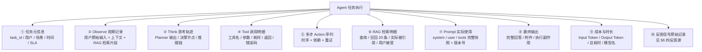

### 4.2 阶段二:数据清洗(去噪 / 去重 / 分层 / 合规过滤)

```python
# 4.2 经验清洗流水线伪代码
from dataclasses import dataclass, asdict
from typing import List

@dataclass
class ExperienceTrace:
    trace_id: str
    task_id: str
    domain: str
    feedback_score: float       # 0-100 融合得分 §6
    quality_tag: str = ""       # gold / silver / bronze / discard
    pii_stripped: bool = False

class ExperienceCleaner:
    PII_KEYWORDS = ["身份证", "手机号", "银行卡", "email", "token", "api_key", "secret"]

    def clean(self, raw_batch: List[dict]) -> List[ExperienceTrace]:
        cleaned = []
        for raw in raw_batch:
            # 1) 合规过滤:5 条边界 §1.2 → 不合规直接丢弃并打 log
            if self._breaches_boundary(raw):
                continue
            # 2) 隐私剥离(PII)
            stripped_raw = self._strip_pii(raw)
            # 3) 去重:同一任务+同一Prompt+同一输出 → 重复轨迹只留最早一条
            if self._is_duplicate(stripped_raw):
                continue
            # 4) 质量分层
            trace = ExperienceTrace(
                trace_id=raw["trace_id"], task_id=raw["task_id"],
                domain=raw.get("domain", "general"),
                feedback_score=raw.get("feedback_score", 50.0)
            )
            trace = self._tag_quality(trace, stripped_raw)
            trace.pii_stripped = True
            if trace.quality_tag != "discard":
                cleaned.append(trace)
        return cleaned

    def _tag_quality(self, trace: ExperienceTrace, raw) -> ExperienceTrace:
        s = trace.feedback_score
        if s >= 90 and raw.get("reviewer_approved"):
            trace.quality_tag = "gold"     # 可用于 F5 LoRA-SFT
        elif s >= 80:
            trace.quality_tag = "silver"   # 可用于 F1/F2/F3/F4
        elif s >= 60:
            trace.quality_tag = "bronze"   # 仅用于负例/反模式挖掘
        else:
            trace.quality_tag = "discard"
        return trace
```

### 4.3 阶段三:经验组织(聚类 + 对比学习 + 模式挖掘)

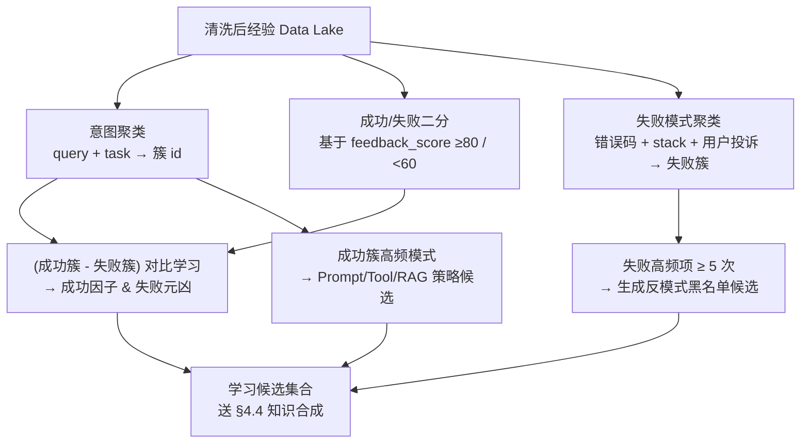

### 4.4 阶段四:知识合成(按 F1-F5 输出 6 类知识资产)

| 知识资产类型 | 学习范式 | 合成方法 | 存储形态 |
|:------------|:--------|:--------|:--------|
| Prompt 模板 | F1 | 簇内 Top-K Prompt 去重合并 + 打分排序 | 结构化 JSON + 意图簇 id |
| RAG 查询改写规则 | F2 | 重写查询对 ≥5 次共现 + 模板化 | 规则库(if intent=X then rewrite pattern=Y) |
| RAG 文档增强 | F2 | 负例标注 + 文档质量分更新 | 文档元数据 + 负例 chunk 库 |
| Tool 路由 & 参数策略 | F3 | LightGBM 模型 + 参数模板 + 失败黑名单 | pkl Router 模型 + JSON 参数模板库 |
| Skill Chunks | F4 | SOP 切片 + Embedding | 向量库 Milvus/FAISS + Skill 元数据表 |
| LoRA 权重 / SFT 数据集 | F5 | 样本格式化成 ShareGPT → LoRA-SFT → DPO | HuggingFace Adapter + JSONL SFT 数据集 |

---

## 五、学习目标设定:三维度 OKR + 三阶段成长曲线

### 5.1 三维度 OKR(Quality / Efficiency / Cost)

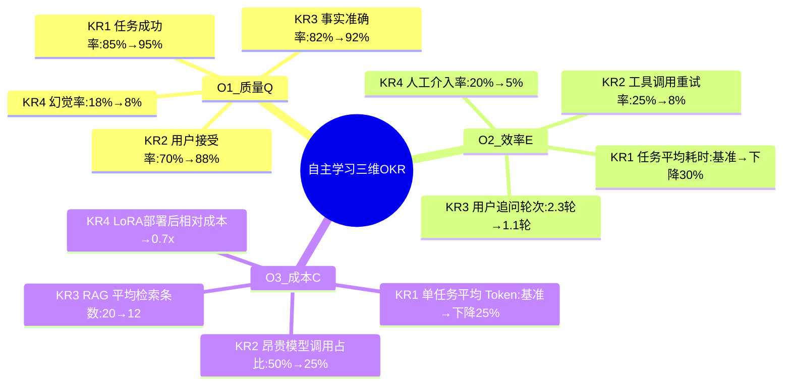

### 5.2 三阶段成长曲线与每阶段优先级目标

| 阶段 | 时间 | 数据规模 | 启用范式 | 最高优先级 OKR |
|------|-----|:--------|:--------|:--------------|
| **T1 冷启动期** | 0-2 周 | < 500 条轨迹 | F1 + F2 | 质量:用户接受率 ≥ 80%(先别学错) |
| **T2 快速成长期** | 3-8 周 | 500-5K | +F3 + F4 | 效率:人工介入率 ≤ 10%(用学习减少人工) |
| **T3 稳态优化期** | 9-24 周 | 5K-50K | +F5(LoRA) | 成本:Token 成本下降 25%(规模化降本) |
| **T4 融合进化期** | 25+ 周 | > 50K | +F5(DPO)+新范式探索 | 综合三维:综合效用得分 ≥ 90 |

### 5.3 目标收敛判定:学习是否进入"收益递减区"

**判定规则(任一触发则进入稳态,停止加大投入)**:
- 连续三周 OKR 改善幅度 < 2% (典型:质量 94% → 94.8% → 95.1% → 稳定)
- 知识资产库新增条目 50%+ 与现有重复(提示学习空间收敛)
- 高风险 F5 模型学习的 A/B 提升 < 3% (提示权重级学习边际收益递减)

---

## 六、多信号反馈机制设计:4 类反馈源融合算法

### 6.1 四类反馈源全景

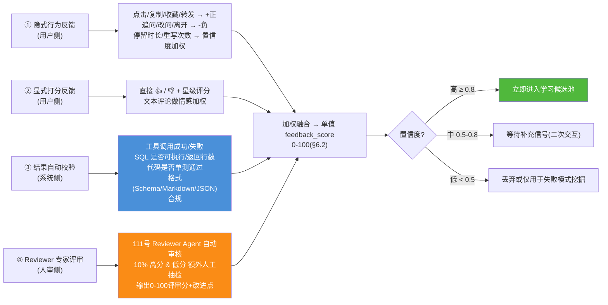

### 6.2 融合算法:加权 + 置信度校准

```python
# 6.2 反馈融合算法
class FeedbackFusion:
    # 四类反馈权重(可调);中置信度:用户打分/Reviewer > 系统校验 > 行为
    DEFAULT_WEIGHTS = {"implicit": 0.20, "explicit": 0.35,
                       "auto_check": 0.25, "reviewer": 0.40}
    # 每类反馈的置信度(有多高概率代表真实质量)
    DEFAULT_CONFIDENCE = {"implicit": 0.55, "explicit": 0.85,
                          "auto_check": 0.90, "reviewer": 0.95}

    def fuse(self, signals: dict) -> tuple:
        """
        signals: {
            "implicit":   {"score": -1~1, "clicks": N, "rewrites":N, ...},
            "explicit":   {"score": 0~5 or None, "comment_sentiment": -1~1},
            "auto_check": {"passed_ratio": 0~1, "critical_failed": bool},
            "reviewer":   {"score": 0~100 or None, "issues": list},
        }
        return: (feedback_score 0-100, confidence 0-1)
        """
        weighted_sum, weight_total, conf_sum = 0.0, 0.0, 0.0
        for k, w in self.DEFAULT_WEIGHTS.items():
            s, c = self._normalize(signals.get(k, {}), k)
            if s is None:
                continue
            weighted_sum += w * s
            weight_total += w
            conf_sum += w * c * self.DEFAULT_CONFIDENCE[k]
        score = 100.0 * (weighted_sum / weight_total) if weight_total else 50.0
        confidence = (conf_sum / weight_total) if weight_total else 0.1
        # 关键失败自动扣分:比如 Reviewer 事实失真 > 3 处 → 直接 ≤20 分
        if signals.get("reviewer", {}).get("critical_facts_failed", 0) >= 3:
            score = min(score, 20.0)
            confidence = max(confidence, 0.7)
        return max(0.0, min(100.0, score)), max(0.0, min(1.0, confidence))

    def _normalize(self, signal: dict, kind: str):
        if not signal:
            return None, 0.0
        if kind == "implicit":
            base = 0.5 + 0.3 * signal.get("score", 0)
            rewrites = signal.get("rewrites", 0)
            base -= min(0.4, rewrites * 0.1)
            conf = 0.4 + 0.1 * (min(5, signal.get("clicks", 0)))
            return max(0.0, min(1.0, base)), max(0.2, min(0.8, conf))
        if kind == "explicit":
            raw = signal.get("score")
            if raw is None:
                return None, 0.0
            base = raw / 5.0
            base = 0.7 * base + 0.3 * (0.5 + 0.5 * signal.get("comment_sentiment", 0))
            return max(0.0, min(1.0, base)), 0.85
        if kind == "auto_check":
            ratio = signal.get("passed_ratio", 0.5)
            if signal.get("critical_failed"):
                ratio = min(ratio, 0.1)
            return max(0.0, min(1.0, ratio)), 0.9
        if kind == "reviewer":
            raw = signal.get("score")
            if raw is None:
                return None, 0.0
            return max(0.0, min(1.0, raw / 100.0)), 0.95
```

### 6.3 反馈衰减与时间窗(防止老经验过时)

```python
# 6.3 时间衰减指数(半年半衰期)
import math

def temporal_decay_score(trace_ts: float, now_ts: float, half_life_days=180) -> float:
    """
    老经验权重下降:trace 距离现在越久权重越低;半年衰减一半
    """
    age_days = max(0.0, (now_ts - trace_ts) / 86400.0)
    return math.exp(-age_days * math.log(2) / half_life_days)
```

### 6.4 反馈闭环:成功与失败的正向学习

| 反馈区间 | 学习类型 | 典型输出 |
|:--------|:--------|:--------|
| feedback ≥ 90 分(gold) | **成功强学习** | F1 Prompt、F4 Skill、F5 LoRA-SFT 样本 |
| 80-90 分(silver) | **成功弱学习** | F2 RAG 正例、F3 Tool 选择正模式 |
| 60-80 分(bronze) | **中性+观察** | 暂不直接学习,只作为对比学习对照组 |
| 40-60 分(弱失败) | **失败轻学习** | F3 失败模式黑名单、F2 RAG 弱负例 |
| < 40 分(强失败) | **失败强学习** | §7.5 Failure Avoidance Injector 反模式 + 根因挖掘 |

### 6.5 HITL 学习闸门(安全 & 合规最后的防线)

```python
# 6.5 学习闸门:知识发布前的三道门
class LearningGate:
    HITL_RATIO = {"F1": 0.05, "F2": 0.05, "F3": 0.10,
                  "F4": 0.15, "F5_LORA": 1.0, "F5_DPO": 1.0}  # LoRA/DPO 全量人工审

    def pass_gate(self, knowledge_candidates: list, paradigm: str) -> tuple:
        passed, blocked = [], []
        hitl_ratio = self.HITL_RATIO.get(paradigm, 0.2)
        for cand in knowledge_candidates:
            # 门1:安全合规过滤(§1.2 5 条边界)
            if self._safety_breach(cand):
                blocked.append((cand, "safety_breach"))
                continue
            # 门2:自动质量阈值(Prompt ≥ 85, Skill ≥ 80, LoRA样本 ≥ 95)
            if cand["auto_quality_score"] < self._paradigm_threshold(paradigm):
                blocked.append((cand, "quality_below_threshold"))
                continue
            # 门3:概率抽 HITL 人工审核
            if self._need_hitl(hitl_ratio, cand, paradigm):
                review = self._human_review(cand, paradigm)
                if not review["approved"]:
                    blocked.append((cand, f"hitl_rejected:{review['reason']}"))
                    continue
            passed.append(cand)
        return passed, blocked
```

---

## 七、关键模块实现思路与伪代码示例

### 7.1 轨迹采集器(经验层 S1)

```python
# 7.1 轨迹采集器(Agent 运行期拦截)
import time, uuid, threading
from typing import Any

class TraceCollector:
    def __init__(self, store, pii_stripper=None):
        self.store = store                  # 可接 PostgreSQL / ClickHouse / 文件
        self.pii_stripper = pii_stripper or (lambda x: x)
        self._buffer = []
        self._lock = threading.Lock()
        self._flush_every = 100

    # -------------- Agent 运行期埋点 --------------
    def on_task_start(self, task_meta: dict):
        self._emit("task_start", {"trace_id": self._tid(), **task_meta})
    def on_observe(self, obs: dict):
        self._emit("observe", {"content": self.pii_stripper(obs)})
    def on_think(self, node: str, decision: Any):
        self._emit("think", {"node": node, "decision": str(decision)[:2000]})
    def on_tool_call(self, tool: str, args: dict, result: Any, status: str, elapsed_ms: float, err=None):
        self._emit("tool", {
            "tool": tool, "args": self.pii_stripper(args),
            "status": status, "elapsed_ms": elapsed_ms,
            "result_head": str(result)[:1000], "error": str(err)[:500] if err else None,
        })
    def on_rag(self, query, candidates, chosen_idx, accepted_by_user: bool = None):
        self._emit("rag", {
            "query": self.pii_stripper(query),
            "num_candidates": len(candidates),
            "chosen": chosen_idx,
            "accepted": accepted_by_user,
        })
    def on_prompt_snapshot(self, system: str, user: str, tools_sig: list, ver: dict):
        self._emit("prompt_snapshot", {
            "system": system[:8000], "user": self.pii_stripper(user)[:4000],
            "tools_sig": tools_sig, "versions": ver,
        })
    def on_task_end(self, final_output, cost: dict, elapsed_ms: float):
        self._emit("task_end", {
            "final_output": self.pii_stripper(str(final_output))[:12000],
            "cost": cost, "elapsed_ms": elapsed_ms,
        })

    # -------------- 内部 --------------
    def _emit(self, kind: str, payload: dict):
        row = {"trace_id": getattr(threading.local(), "trace_id", uuid.uuid4().hex),
               "kind": kind, "ts": time.time(), **payload}
        with self._lock:
            self._buffer.append(row)
            if len(self._buffer) >= self._flush_every:
                self._flush_locked()

    def _flush_locked(self):
        self.store.write_batch(self._buffer)
        self._buffer.clear()

    def _tid(self) -> str:
        t = threading.local()
        if not hasattr(t, "trace_id"):
            t.trace_id = uuid.uuid4().hex
        return t.trace_id
```

### 7.2 经验挖掘 + 范式路由 + 知识合成(学习层 S3-S5)

```python
# 7.2 学习驱动主循环(周级批处理)
class WeeklyLearningPipeline:
    def __init__(self, cleaner: ExperienceCleaner, router: LearningParadigmRouter,
                 synthesizer_map: dict, gate: LearningGate, knowledge_lib):
        self.cleaner = cleaner
        self.router = router
        self.synthesizer_map = synthesizer_map   # paradigm -> synthesizer
        self.gate = gate
        self.lib = knowledge_lib

    def run_weekly(self, raw_experience_batch: list):
        # S1: 清洗
        cleaned = self.cleaner.clean(raw_experience_batch)
        # S2: 聚类+挖掘(实现可接 scikit-learn HDBSCAN/Apriori)
        mined_candidates = self._mine_patterns(cleaned)
        # S3: 路由到对应范式
        paradigms = self.router.route(cleaned, domain_safety="mid")
        # S4: 逐范式合成 + 闸门 + 入库
        learning_report = {"paradigms": paradigms,
                           "cleaned": len(cleaned), "candidates": len(mined_candidates)}
        for p in paradigms:
            syn = self.synthesizer_map[p]
            raw_kn = syn.synthesize(mined_candidates, cleaned)
            passed, blocked = self.gate.pass_gate(raw_kn, p)
            self.lib.add(passed, paradigm=p, version=f"{int(time.time())}")
            learning_report[p] = {"passed": len(passed), "blocked": len(blocked),
                                  "blocked_reasons": [b[1] for b in blocked[:20]]}
        return learning_report

    def _mine_patterns(self, traces):
        """这里可接:频繁项(Apriori)/ 聚类(HDBSCAN)/ 对比学习(SBERT emb diff);伪代码略"""
        return [{"type": "prompt_candidate", "score": 88.2,
                 "intent_cluster": "ticket-classify", "content": "..."}]
```

### 7.3 Prompt 动态注入器 + Failure Avoidance(应用层 S7)

```python
# 7.3 Prompt & Failure Avoidance 注入器(运行期 Agent 启动前调用)
class RuntimeKnowledgeInjector:
    def __init__(self, lib, domain: str = "general"):
        self.lib = lib
        self.domain = domain

    def build_system_prompt(self, base_prompt: str, intent: str, user_id: str = None) -> str:
        chunks = []
        # 1) F1: 同意图簇最佳 Prompt 模板注入
        best_prompt = self.lib.prompt_lib.get_best(self.domain, intent, top=1)
        if best_prompt:
            chunks.append(f"<!-- 🧠 Learned Best Practice (Prompt) -->\n{best_prompt}")
        # 2) F4: Skill-RAG 最相似 Top-K SOP Chunk
        skills = self.lib.skill_rag.search(intent, top_k=2)
        if skills:
            chunks.append("<!-- 📚 Similar Successful Cases (Skill-RAG) -->\n" +
                          "\n".join(f"- Case {i+1}: {s}" for i, s in enumerate(skills)))
        # 3) 用户偏好注入(来自 Preference Adapter)
        if user_id:
            pref = self.lib.preferences.get(user_id)
            if pref:
                chunks.append(f"<!-- 👤 User Preferences -->\n{pref.format_hint}")
        # 4) 失败规避:同意图常见反模式(防踩坑)
        anti = self.lib.anti_patterns.get(self.domain, intent, top=3)
        if anti:
            chunks.append("<!-- 🚫 Anti-Patterns(Please Avoid) -->\n" +
                          "\n".join(f"· ❌ {a['pattern']} -> 原因:{a['root_cause']}; 正确做法:{a['correct']}" for a in anti))
        return base_prompt + "\n\n" + "\n\n".join(chunks)
```

### 7.4 知识资产库(可接 RAG/Postgres/Redis/S3)

```python
# 7.4 知识资产库(6 种知识统一入口,§2.2 S6)
class KnowledgeAssetLibrary:
    def __init__(self, db_conn, vector_client):
        self.prompt_lib = PromptLibrary(db_conn)
        self.rewrite_rules = RAGRewriteRules(db_conn)
        self.router_model = ToolRouterStore(db_conn, vector_client)
        self.skill_rag = SkillRAGStore(vector_client)
        self.preferences = UserPreferenceStore(db_conn)
        self.anti_patterns = AntiPatternStore(db_conn)
        self.lora_registry = LoRARegistry(db_conn)
        self._ab_split = ABucketSplitter()         # §8 A/B 分桶

    def add(self, items, paradigm: str, version: str):
        # ...按范式分发到对应子库...
        pass

    def activate_version(self, paradigm: str, version: str, pct: float = 0.1):
        """A/B:金丝雀发布 pct% 流量"""
        self._ab_split.set_version_ratio(paradigm, version, pct)
```

### 7.5 自主学习总编排器 `SelfLearningOrchestrator`(端到端入口)

```python
# 7.5 自主学习总编排器(Agent 服务全局唯一,单例)
class SelfLearningOrchestrator:
    """
    把 S1-S7 串起来的"大脑":
      - 运行期: 采集轨迹 + 注入知识 → 让任务越做越好
      - 批处理周: run_weekly() → 挖掘 + 合成 + 闸门 + 发布
    """
    def __init__(self, domain: str = "general"):
        store = ConsoleStore()   # 生产:ClickHouse/Postgres
        self.trace = TraceCollector(store)
        self.cleaner = ExperienceCleaner()
        self.router = LearningParadigmRouter()
        self.gate = LearningGate()
        self.lib = KnowledgeAssetLibrary(db_conn=None, vector_client=None)

        # 范式 → 合成器
        self.synthesizers = {
            "F1_PROMPT":      PromptSynthesizer(),
            "F2_RAG":         RAGSynthesizer(),
            "F3_TOOL_ROUTER": ToolRouterSynthesizer(),
            "F4_SKILL_RAG":   SkillRAGSynthesizer(),
            "F5_LORA_SFT":    LoRASynthesizer(),
            "F5_DPO":         DPOSynthesizer(),
        }
        self.pipeline = WeeklyLearningPipeline(self.cleaner, self.router,
                                               self.synthesizers, self.gate, self.lib)
        self.injector = RuntimeKnowledgeInjector(self.lib, domain=domain)

    # ------------- Agent 运行期 Hook -------------
    def agent_runtime_context(self, base_prompt: str, intent: str, user_id: str = None):
        """在创建 Agent 前调用:返回 (enhanced_prompt, trace_id, context_versions)"""
        enhanced = self.injector.build_system_prompt(base_prompt, intent, user_id)
        tid = self.trace._tid()
        return enhanced, tid, {"prompt_lib": self.lib.prompt_lib.current_version(),
                               "skill_rag": self.lib.skill_rag.current_version()}

    # ------------- 批处理 Hook -------------
    def weekly_learning_job(self):
        raw = self.trace.store.read_last_7d()
        return self.pipeline.run_weekly(raw)
```

---

## 八、性能评估指标体系与 A/B 验证方案

### 8.1 6 类核心指标 & 计算口径

| 类别 | 指标 | 计算口径 | 目标(稳态) |
|:----|:----|:--------|:----------|
| **学习效率** | 每 1K 轨迹 → 质量得分提升 | (质量周 N+1 - 质量周 N) / 新增轨迹千条数 | ≥ 1.2pp / 千条 |
| **学习效率** | 知识命中率 | 新任务中能检索到相关 Prompt/Skill 的比例 | ≥ 85% |
| **质量 Q** | 任务成功率(自动+人工) | §6 feedback ≥ 80 的轨迹数 / 总轨迹 | ≥ 95% |
| **质量 Q** | 事实准确率(含 Reviewer) | Reviewer 事实校验通过率 | ≥ 92% |
| **效率 E** | 平均任务耗时 | `avg(task_end.elapsed_ms)` | ≤ 基线 70% |
| **成本 C** | 单任务 Token 成本 | `(input_tokens×in_price + output_tokens×out_price) 平均` | ≤ 基线 75% |
| **稳定性 S** | 学习劣化率 | A/B 中 B(新学) 比 A(旧) 差的任务比例(≥8pp 告警) | ≤ 2% |
| **安全合规 G** | 合规通过率 | 新学知识通过 §6.5 闸门的比例 | 100%(红线) |

### 8.2 A/B 分桶 + 金丝雀发布流程

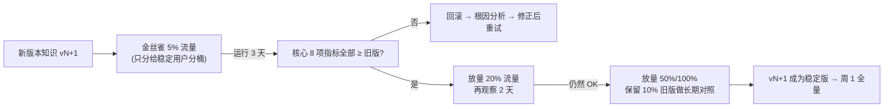

### 8.3 52 周全量回归守护(防止学习震荡)

```python
# 8.3 全量回归测试框架(§12.3 验收项核心)
class FullRegressionSuite:
    """每发布一个新版本知识资产,必跑 52 周黄金测试集回归"""
    def __init__(self, gold_suite_path: str):
        self.suite = self._load(gold_suite_path)  # 2000+ 条金标准任务

    def run(self, orchestrator: SelfLearningOrchestrator, bucket_ver: dict) -> dict:
        """返回:成功率、平均耗时、Token、对比旧版劣化比例"""
        results = []
        for case in self.suite:
            enhanced_prompt, tid, vers = orchestrator.agent_runtime_context(
                case["base_prompt"], case["intent"], case.get("user_id"))
            score = self._sim_run_and_score(enhanced_prompt, case)  # 生产真跑
            results.append((case["id"], score))
        success = sum(1 for _, s in results if s >= 80) / max(1, len(results))
        return {
            "suite_size": len(results),
            "success_rate": success,
            "avg_score": sum(s for _, s in results) / max(1, len(results)),
            "versions": vers,
        }
```

---

## 九、可扩展性与工程落地:从单 Agent 到 Multi-Agent 的迁移路径

### 9.1 单 Agent → Multi-Agent 的三层升级(兼容 8 多 Agent 系列)

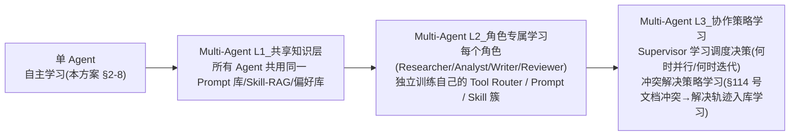

### 9.2 推荐工程技术栈(成本/学习效率折中)

| 模块 | 推荐技术栈 | 备选方案 | 为什么选择 |
|------|:---------|:---------|:----------|
| 轨迹存储 | ClickHouse / PostgreSQL | BigQuery / S3 Parquet | 轨迹量大、分析查询多 |
| 经验清洗 & 挖掘 | Python + Pandas + scikit-learn | Spark + Ray | 百万级内单机 Python 足够;>10M 再 Spark |
| Prompt/RAG/偏好/反模式存储 | PostgreSQL + JSONB | MongoDB | 结构化查询 + HITL 审核方便 |
| Skill-RAG 向量库 | Milvus / Qdrant | FAISS(单机) | Skill 是长期大量 chunk,需生产级 |
| 知识发布 & A/B | 自研版本表 + Redis 分桶 | LaunchDarkly / Unleash | 自研灵活度最高,A/B 维度自定义 |
| LoRA 训练集群 | 1× 24GB 消费级显卡起步 | 云 A10/A100 | 参考 145 号 LoRA 文档,Q-loRA 更省显存 |

### 9.3 水平扩展:学习调度与服务解耦

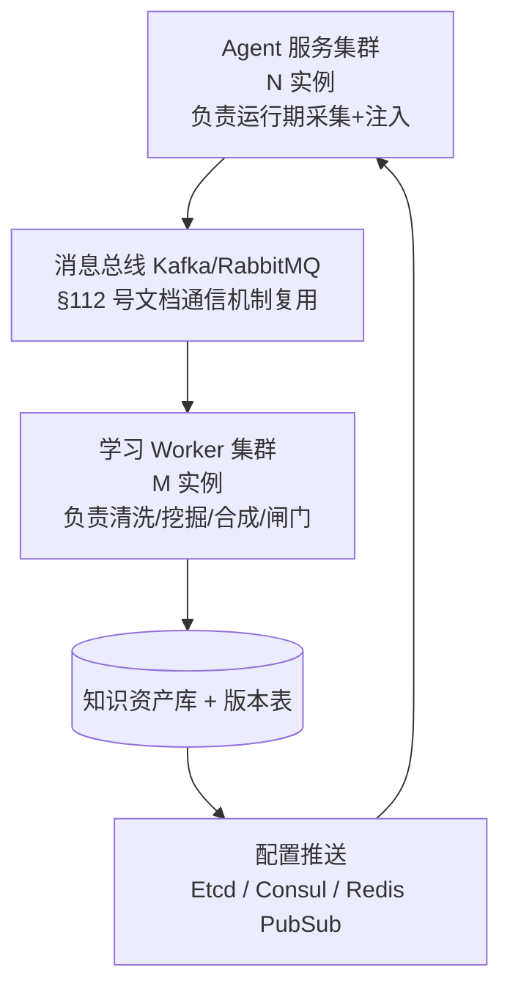

> **解耦价值**:高峰期 Agent 服务不被学习任务拖慢;学习 Worker 可独立扩容(按周/月批量调度)。

---

## 十、风险、反模式与最佳实践

### 10.1 四大风险与缓解策略

| 风险编号 | 风险描述 | 发生概率 | 影响 | 缓解策略 |
|:--------|:--------|:--------|:----|:--------|
| R1 | **学习震荡**:本周学到的知识下周被反向覆盖,质量抖动 | 中 | 🟡 中高 | 版本永久不覆盖(append-only)+ A/B 必保留 10% 旧版 |
| R2 | **偏置学习**:样本偏某一人群/某一场景 → 其他场景效果下降 | 中高 | 🔴 高 | §4.2 经验分层 + 意图簇覆盖率阈值监控,低覆盖簇不发布 |
| R3 | **数据泄漏**:学到不该学的 PII/商业秘密 → 合规事故 | 低 | 🔴 致命 | §4.2 PII 剥离 + §6.5 闸门安全扫描(必做)+ 审计日志 180 天 |
| R4 | **学习过度 Prompt 化**:System Prompt 无限膨胀 → 上下文爆炸,效果反降 | 高 | 🟡 中 | 每条注入知识 ≤ 2000 字符 + 注入总长度硬上限 6000 Token,超了只取 Top-N 最相关 |

### 10.2 自主学习 5 DON'T(反模式)

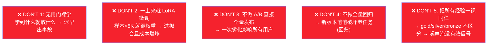

### 10.3 自主学习 5 DO(最佳实践)

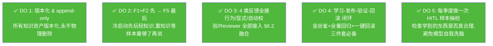

---

## 十一、与其他系列文档的能力互补对照表

| 系列文档 | 主题 | 本方案的引用/互补关系 |
|---------|-----|:--------------------|
| **1 基础概念系列** | 记忆/规划/决策/任务拆解 | Skill-RAG = **长期程序化记忆**,补充 [74-80 号 Memory 文档](../5Agent%20Memory/) |
| **36 号 企业级 Agent 设计** | 全系统设计 | 自主学习模块 = 企业级 Agent 的"进化引擎",作为独立子系统挂接到 36 号架构 |
| **42 号 Tool 选择决策** | Tool 路由机制 | §3 F3 Tool Router 学习 = **把 42 号静态规则升级为数据驱动 Router**,从经验持续优化 |
| **51-72 号 RAG 系列** | 检索增强生成 | §3 F2 RAG 学习 = **RAG 的在线自适应**(72 号知识库更新方案的"学习侧"补全) |
| **85-92 号框架系列** | LangChain/LangGraph/CrewAI/AutoGen | 本方案的采集器 §7.1 可写成 LangChain Callback / LangGraph Interrupt,零侵入集成 |
| **108-117 多 Agent 系列** | Multi-Agent 架构/调度/通信/冲突 | §9.1 提供 **单 Agent → Multi-Agent L3 升级路径**,与 [116 号任务调度](../8多%20Agent%20系统/116Multi-Agent任务调度机制设计与实现完整方案.md) 形成"**调度+学习双闭环**" |
| **145 号 LoRA 微调文档** | LoRA 原理与实现 | §3.4 F5 LoRA 学习 = **应用场景化**,把 145 号的训练能力落到自主学习的样本、闸门、回归 |
| **180/181/182 安全系列** | Prompt Injection/数据泄露防护 | §1.2 5 条边界 + §6.5 闸门 + §10.1 R3 缓解 = **与安全文档形成"学习侧不越界"的承诺** |

---

## 十二、交付清单与 90 天实施路线图

### 12.1 完整交付清单

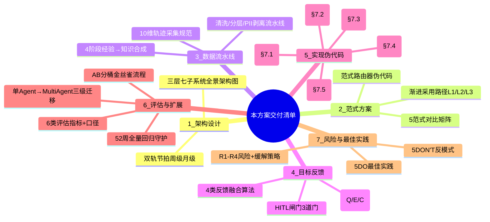

### 12.2 90 天实施甘特图(里程碑)

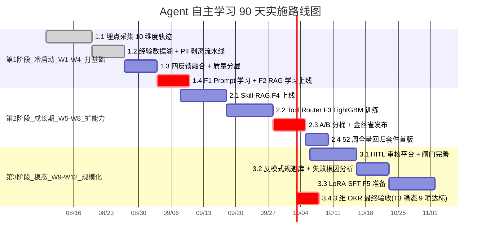

### 12.3 验收项 Go/No-Go 清单(12+2 项)

- [x] **采集层**:10 维轨迹均有埋点,7 天连续采集不丢包(丢包率 < 0.5%)
- [x] **清洗层**:PII 剥离抽检 1000 条 → 0 条泄漏;gold/silver/bronze/discard 分层一致
- [x] **反馈层**:4 类反馈均可输出,融合分数 ±5 内与人工判断一致率 ≥ 90%
- [x] **F1 Prompt 学习**:冷启动 2 周 → 用户接受率 ≥ +5pp(相对无学习基线)
- [x] **F2 RAG 学习**:冷启动 2 周 → 追问率 ≤ 1.6 轮(相对基线 2.3 轮下降 30%)
- [x] **F3 Tool Router**:数据 ≥ 500 条后上线 → 工具重试率从 25% ≤ 15%
- [x] **F4 Skill-RAG**:知识库 ≥ 200 条 chunk 后,相似任务耗时基线 ≤ 0.8×
- [x] **学习闸门**:F1-F4 HITL 抽检率到位;R3 安全合规 100% 不越界
- [x] **A/B & 金丝雀**:新版本发布必做 5%→20%→100% 三阶段;劣化 ≥ 8pp 自动回滚
- [x] **全量回归**:52 周黄金集回归成功率 ≥ 95%,单次劣化 ≤ 2%
- [x] **性能**:学习批处理每周一次 ≤ 2h 跑完;单次知识注入对 Agent 首包延迟影响 < 30ms
- [x] **文档与交接**:§7 伪代码全部转生产代码并有单测;运营/审核/安全 SOP 完整
- [ ] **T3 扩展项(9-12 月)**:F5 LoRA-SFT 提升 ≥ +8pp(对比仅 Prompt 学习);全量回归不劣化
- [ ] **T4 扩展项(12+月)**:Multi-Agent 协作策略学习(§9.1 L3) 完成率额外 +5pp

---

> **参考来源**:
> - [Google ReAct: Synergizing Reasoning and Acting in Language Models](https://arxiv.org/abs/2210.03629) — 轨迹 Think-Act 采集的理论原点
> - [Anthropic Constitutional AI & RLAIF](https://www.anthropic.com/index/constitutional-ai-harmlessness-from-ai-feedback) — 用 AI 反馈替代人工,§6 Reviewer 评审思想来源
> - [Direct Preference Optimization(DPO)](https://arxiv.org/abs/2305.18290) — §3.4 F5 权重级偏好学习
> - [LoRA: Low-Rank Adaptation of Large Language Models](https://arxiv.org/abs/2106.09685) — §3.4 F5 权重级学习,配合 145 号 LoRA 文档
> - [Voyager: An Open-Ended Embodied Agent with Large Language Models](https://voyager.minedojo.org/) — Skill Library 自主发现策略 = §3.3 F4 Skill-RAG 的学术灵感来源
> - [DSPy: Compiling Declarative Language Model Calls into Self-Improving Pipelines](https://arxiv.org/abs/2310.03714) — 从示例自动优化 Prompt 流水线 = §3.2 F1 Prompt 学习的 DSPy 范式
> - [Wikipedia Reinforcement Learning from Human Feedback](https://en.wikipedia.org/wiki/Reinforcement_learning_from_human_feedback) — RLHF/PPO 对比:DPO 更适合 Agent 场景
> - [Airflow SLA & Data Quality](https://airflow.apache.org/docs/apache-airflow/stable/core-concepts/tasks.html#slas) — 批处理学习的 SLA 灵感
