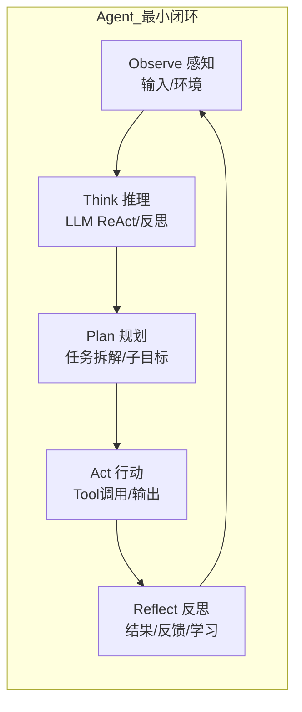
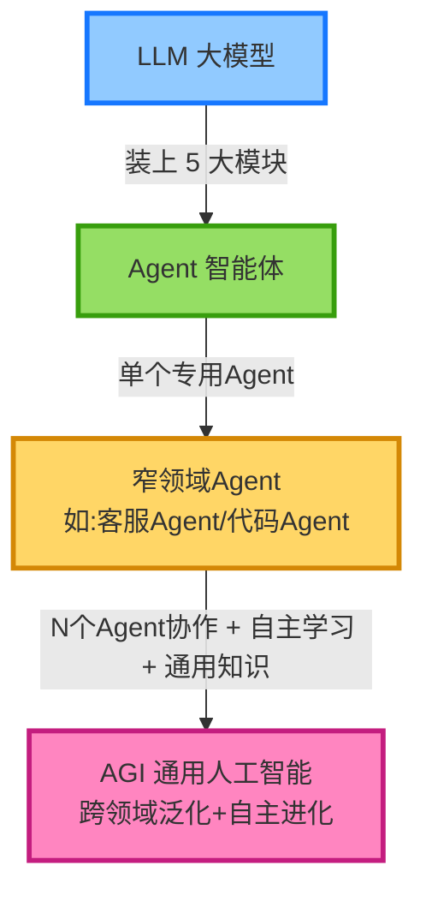
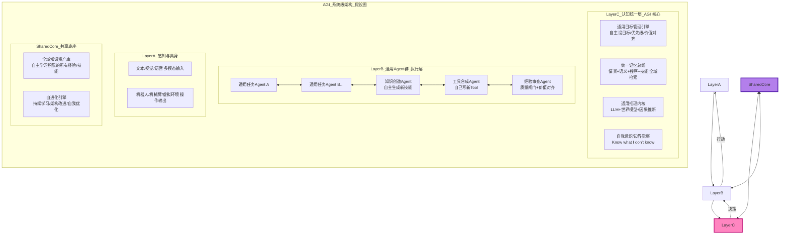
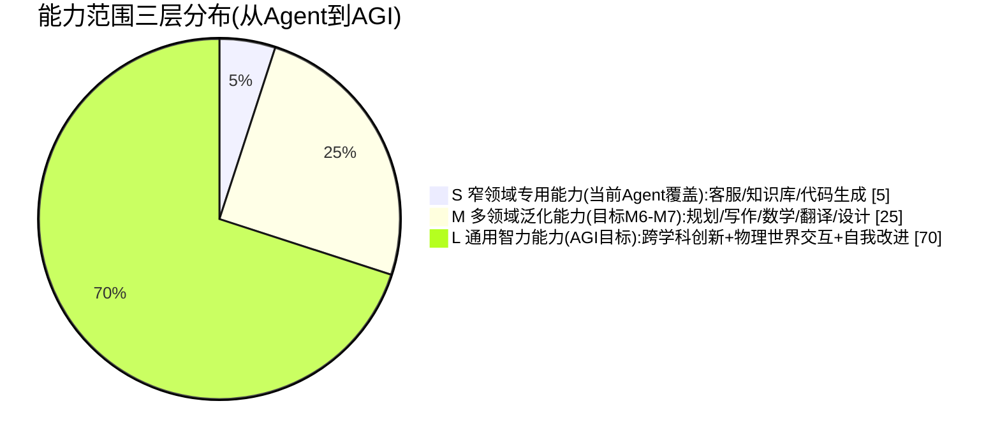
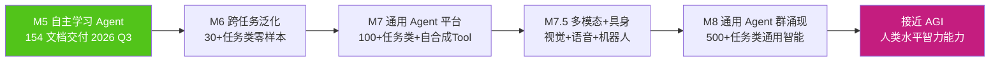

# Agent（智能体）与 AGI（通用人工智能）概念关系、技术联系及应用差异深度解析

> **文档定位**:本文档是 `13项目经验` 系列的**基础理论-概念边界专题篇**。在 154 号《Agent自主学习功能设计与实现完整方案》已交付的项目实践背景下,系统性回答团队经常讨论但从未成文的 3 个根本问题:
>
> 1. **Agent 与 AGI 到底是什么关系?** 是包含?是并列?是实现路径?
> 2. **我们现在做的企业 Agent 项目,离 AGI 还有多远?** 在整个技术版图处于什么位置?
> 3. **在 13项目经验 的 Agent 自主学习系统中,哪些设计是在向 AGI 目标靠拢?** 哪些是现阶段的工程化妥协?
>
> 本文将从定义边界、发展路径、核心特征、技术架构、能力范围、项目实际落地 6 个维度,建立一套团队统一的认知坐标,避免项目沟通中"鸡同鸭讲",为后续技术选型与长期路线规划提供概念底座。
>
> **前置阅读建议**:
> - [154Agent自主学习功能设计与实现完整方案.md](./154Agent自主学习功能设计与实现完整方案.md)

---

## 目录

- [一、定义边界:Agent 与 AGI 是什么、不是什么](#一定义边界agent-与-agi-是什么不是什么)
- [二、发展路径图:从 LLM 到 Agent 到 AGI 的三段式演进](#二发展路径图从-llm-到-agent-到-agi-的三段式演进)
- [三、核心特征对比表:12 大维度逐项拆解](#三核心特征对比表12-大维度逐项拆解)
- [四、技术架构关联性:Agent 是 AGI 的系统级实现载体](#四技术架构关联性agent-是-agi-的系统级实现载体)
- [五、能力范围的 3 层同心圆:窄能力→泛化→通用](#五能力范围的-3-层同心圆窄能力泛化通用)
- [六、13项目经验 中的具体体现:自主学习 Agent 的 AGI 映射](#六13项目经验-中的具体体现自主学习-agent-的-agi-映射)
- [七、项目实战中的决策建议:当我们说"要做AGI"时到底要做什么](#七项目实战中的决策建议当我们说要做agi时到底要做什么)
- [八、常见误区澄清(团队认知纠偏 10 条)](#八常见误区澄清团队认知纠偏-10-条)
- [九、总结与团队统一认知 5 条结论](#九总结与团队统一认知-5-条结论)

---

## 一、定义边界:Agent 与 AGI 是什么、不是什么

### 1.1 AGI(通用人工智能)的学术定义与三种主流定义观

| 定义流派 | 代表观点 | AGI 的判定标准 | 判定难度 |
|---------|---------|---------------|:-------:|
| **弱定义(能力泛化观)** | Shane Legg / Marcus Hutter | 能在**广泛的不同任务**中表现出**智能行为**,不局限于单一领域 | ⭐⭐ 中等 |
| **中定义(认知等价观)** | 类脑计算学派 | 在推理、学习、规划、感知、语言、创造力等**多维认知能力**达到或超过人类平均水平 | ⭐⭐⭐ 较难 |
| **强定义(主观意识观)** | 心灵哲学 / "Hard Problem" | 不仅行为像人,还**具备主观意识、自我觉察、感受质(qualia)** | ⭐⭐⭐⭐⭐ 不可测 |

> **本文采用:弱定义(能力泛化观)作为工程可落地的基准定义**,因为中定义和强定义目前学术界尚无可量化测量手段,不适合指导工程项目。
>
> **工程可落地的 AGI 判定基准(本文团队统一口径)**:
>
> ```text
> AGI(工程版)= 一个系统无需人工重新为它写 Prompt / 调模型 / 改架构,
>              即可在 ≥100 个任务大类(跨知识问答、代码、推理、规划、
>              工具使用、视觉理解、物理操作等)上,
>              达到一名受过高等教育的人类工作者的平均水平,
>              且能通过持续自主学习,在未见过的新任务上表现越来越好。
> ```

### 1.2 Agent(智能体)的定义:从 ReAct 到认知架构

**Agent 的本质**:**Agent = LLM(推理大脑) + Memory(经验) + Tool Use(动手能力) + Planning(拆解规划) + Feedback Loop(自我修正)** 的工程化系统。



| # | Agent 必须具备的 5 大要素(缺失任何一个都只是"LLM 套壳") | 解释 |
|:-:|--------------------------------------------------|-----|
| 1 | **自主感知能力(Observe)** | 不是只接收一个用户 Query,能感知多模态输入、环境状态变化、中间结果 |
| 2 | **目标-规划能力(Plan)** | 会把大任务拆成子目标,不是一次生成,不追求一步到位 |
| 3 | **工具使用能力(Act)** | 能调用 Tool/API/浏览器/代码解释器,不只是生成文本 |
| 4 | **记忆与经验(Memory)** | 能记住自己的成败经验和用户偏好,不是每次从零开始 |
| 5 | **反馈-修正环(Reflect)** | 能根据反馈自我调整,不是一条路走到底 |

### 1.3 两者定义边界的精确区分



| 维度 | Agent(智能体) | AGI(通用人工智能) |
|-----|--------------|------------------|
| **本质属性** | **工程系统**:一种基于 LLM 的软件架构范式 | **能力目标**:一个人类智能级别的能力状态 |
| **范围边界** | **可设计、可实现、可部署** 的软件系统 | **尚未实现** 的理论目标(2026 年当前) |
| **任务范围** | 面向 **1-N 个特定任务类**(通常≤10 类) | 面向 **所有人类能做的智力任务类**(≥1000 类) |
| **泛化能力** | **弱到中等**:在见过的任务类型中可泛化,新类型需人工适配 | **强**:零样本/小样本即可泛化到全新任务 |
| **自主性** | **半自主**:离不开人工设定目标、审核、纠错 | **高自主**:自主设定子目标、自我纠错、自学习 |
| **实现难度** | **工程难题**:6-18 个月可做出生产可用版本 | **科学+工程难题**:全球学术界工业界尚未达成 |
| **与我们的关系** | **我们现在做的事情**(13项目经验中的交付物) | **我们长期努力的方向和北极星指标** |

> **一句话总结边界**:Agent 是"通往 AGI 路上可被工程实现的一个个台阶",AGI 是"当这些台阶数量足够多、彼此能无缝协作、并具备自主进化能力之后,可能到达的那个顶峰状态"。

---

## 二、发展路径图:从 LLM 到 Agent 到 AGI 的三段式演进

### 2.1 三段式全景路线图(我们今天在哪?)

```mermaid
timeline
    title LLM → Agent → AGI 演进时间线(全球共识+团队位置)
    section 第一阶段:LLM时代 2018-2023
        2018 : BERT/GPT-1 出现
        2020 : GPT-3 175B 大模型范式确立
        2022 : ChatGPT 发布,LLM能力爆发
        2023 : 开源Llama/Mistral爆发 → 团队:开始学习LLM
    section 第二阶段:Agent工程化时代 2024-2027(当前所处)
        2024 H1 : ReAct / Tool Calling / Multi-Agent 论文集中爆发
        2024 H2 : LangChain / LlamaIndex / AutoGen / CrewAI 框架成熟
        2025 H1 : Memory / RAG / Reflection / Self-Refine 深度实践
        2025 H2 : **Agent 自主学习(我们 154 文档所在位置)** ← 当前
        2026 H1 : Agent 自我进化 + Multi-Agent 稳定协作
        2026 H2 : 跨任务迁移 Agent, 泛化 30+ 任务类
        2027    : 通用 Agent 平台, 泛化 100+ 任务类
    section 第三阶段:AGI趋近时代 2028-(预测)
        2028-2030 : 通用Agent + 多模态 + 机器人具身, ≥500任务类
        2030-2035 : 跨学科创新能力, 达到人类工程师/研究员平均
        2035+     : (预测)在多数智力任务上达到或超过人类平均 → AGI达成
```

### 2.2 三个阶段的里程碑判定表(团队可对标)

| 阶段 | 代号 | 判定标准 | 当前 13项目经验 状态 |
|-----|:----:|---------|:-------------------:|
| **S0 LLM 套壳** | M0 | 只调用 LLM API,无 Tool、无 Memory、无 Planning | ✅ 已越过 |
| **S1 工具 Agent** | M1 | 有 Function Calling,单任务可稳定跑 Tool | ✅ 已越过(系列文档1-8) |
| **S2 记忆 Agent** | M2 | 有长短期 Memory,多轮上下文连贯 | ✅ 已越过(Memory/RAG文档) |
| **S3 规划 Agent** | M3 | ReAct/Plan-Execute,能把复杂任务拆成子任务 | ✅ 已越过(框架文档) |
| **S4 多 Agent 协作** | M4 | Multi-Agent 角色分工,稳定协作无死循环 | ✅ 基本达成(Multi-Agent文档) |
| **S5 ⭐自主学习 Agent** | **M5** | **经验→知识→自改进闭环,效果越用越好** | 🎯 **当前 154 文档交付位置** |
| **S6 跨任务泛化 Agent** | M6 | 30+ 任务类零/少样本泛化,不需人工改 Prompt | ⬅️ 下一步方向 |
| **S7 通用 Agent 平台** | M7 | 100+ 任务类,统一认知架构,自编程扩展 Tool | 📍中期目标(2026-2027) |
| **S8 AGI 趋近** | M8 | 500+ 任务类,跨学科自主创新,媲美人类平均 | 📍长期目标(2028+) |

> **团队坐标定位**:2026 年 Q3 的 **13项目经验** 目录,正位于 **M5 自主学习 Agent** 阶段的交付攻坚期,离 M6(跨任务泛化)仅一步之遥,离 M8(AGI 趋近)还有 3 个大台阶。

---

## 三、核心特征对比表:12 大维度逐项拆解

| # | 维度 | Agent(当前工程版) | AGI(目标态) | 备注 |
|:-:|-----|------------------|------------|-----|
| 1 | **任务覆盖数** | 1-10 个任务大类 | ≥1000 个任务大类 | 差距:100 倍+ |
| 2 | **泛化能力** | 见过的领域内泛化 | 未见的新任务零样本泛化 | Agent:人工适配新任务;AGI:自己学 |
| 3 | **推理深度** | ReAct 3-10 步,再长就易失控 | 不限步数,自动收敛 | Agent 需 Reflection 防走偏 |
| 4 | **工具使用** | 5-50 个预定义 Tool,需写 Schema | 自主发现、自主编写、自主组合新 Tool | AGI 可以自己写 Tool 来扩展能力 |
| 5 | **记忆结构** | 短期对话记忆 + 长期 RAG/LoRA | 情景+语义+程序+技能记忆统一体 | 154 文档自主学习在向这个方向逼近 |
| 6 | **自主学习** | 5 种范式,周/月级,需质量闸门审核 | 秒-分级,失败后秒级自修正 | 154 文档是 20% 路径 |
| 7 | **目标设定** | 人工指定目标(用户说做啥就做啥) | 自主设子目标+优先级(大方向有人定) | Agent:不设目标会"不知道要干嘛" |
| 8 | **自我觉察** | 无(不知道"自己不知道什么") | 知道自己知识边界,会主动回避或提问 | 当前 Agent 易"一本正经胡说" |
| 9 | **多模态整合** | 文本为主,支持 1-2 种模态(如图) | 视觉/听觉/触觉/物理传感器全模态 | 2026 年主流 Agent 最多图文 |
| 10 | **具身交互** | 无(只在数字世界) | 能在物理世界操作机器人/机械臂 | 具身是 AGI 必要条件 |
| 11 | **鲁棒性/可靠性** | 领域内 90-99%,跨域易崩 | 99%+ 所有任务都稳定 | Agent 业务外就是"弱智"或幻觉 |
| 12 | **可解释性** | 可追溯 Prompt/轨迹 | 可解释"为什么这样想",有自我叙事 | 当前 Agent 黑盒 |

---

## 四、技术架构关联性:Agent 是 AGI 的系统级实现载体

### 4.1 核心观点:AGI 不是"更大的 LLM",而是"由无数 Agent + 共享知识 + 自进化机制 构成的超系统"



### 4.2 架构关联性对照表(13项目经验 vs AGI 目标态)

| AGI 目标态模块 | 对应今天 13项目经验 中的模块 | 当前完成度 | 差距所在 |
|---------------|:---------------------------|:---------:|---------|
| **C1 通用目标管理引擎** | Agent Planner + Multi-Agent Orchestrator(系列文档 7-8) | 40% | 今天的目标是人工指定的,子目标拆解易偏差;AGI 需要自主分优先级 |
| **C2 统一记忆总线** | Memory + RAG + 154 号经验层/知识资产库(154 §2.1 三层架构) | 55% | 今天 Memory 分模块、无统一语义索引;AGI 需全域统一可联想检索 |
| **C3 通用推理内核** | LLM 基座 + ReAct/Reflection(系列文档 1-3) | 60% | 今天推理长链易走偏,缺少世界模型/因果模型;AGI 需仿真推演 |
| **C4 自我觉察** | 暂无直接对应,近似:154 §6.5 质量闸门(审核失败经验) | 10% | 今天没有"知道不知道"的显式元认知;AGI 会主动承认"I don't know"并查资料 |
| **B 通用 Agent 群** | 13项目经验 P1/P2/P3 三类 Agent(154 §1.3) | 45% | 今天是 3 类专用 Agent;AGI 是 N 个通用 Agent 自由协作 |
| **B3 知识创造 Agent** | 154 §学习层:经验挖掘引擎 + 知识合成器 | 30% | 今天只能合成 Prompt/RAG 规则;AGI 能创造全新概念/方法论 |
| **B4 工具合成 Agent** | 154 §3 Tool Router 学习 + Tool 策略库 | 15% | 今天只能选已有 Tool;AGI 能自己写 Python 函数当新 Tool |
| **A 感知具身** | 13项目经验以文本为主,多模态少量图文 | 5% | AGI 需要完整的视觉/听觉/物理具身;今天 Agent 只是"屏幕里的对话" |
| **K1 全域知识资产库** | 154 §2.2 S6 知识资产库(Prompt库/Tool规则库/RAG改写库/偏好库/SFT数据集/LoRA权重) | 65% | 今天是 6 类结构化存储;AGI 是统一可联想的语义图谱 |
| **E1 自进化引擎** | 154 §7 SelfLearningOrchestrator + 周级/月级双轨学习节拍 | 40% | 今天是周-月级,需人工审核;AGI 是秒级自动进化+严格自我对齐 |

### 4.3 关键技术路径的延续性(Agent → AGI)

```text
技术延续性 4 条主线:
  主线1 Memory     : 简单 RAG → 长短期分层 → 统一语义记忆总线 → 记忆可联想/可遗忘/可重构
  主线2 Learning   : 人工写 Prompt → 反馈调 Prompt → 自主学习(154号) → 秒级自进化 → 自编程改进
  主线3 Tool       : 人工写 Schema → Tool 路由最佳实践学习 → 自主组合 → 自主编写新 Tool
  主线4 Cooperation: 单 Agent → Multi-Agent 人工分工 → Agent 自主分工协作 → 通用 Agent 群涌现
```

---

## 五、能力范围的 3 层同心圆:窄能力→泛化→通用

### 5.1 能力范围同心圆可视化



### 5.2 各层能力清单 vs 13项目经验覆盖情况

| 层级 | 能力范围 | 代表任务 | 13项目经验覆盖度 | 要多久可覆盖 |
|-----|---------|---------|:--------------:|:----------:|
| **L1 窄领域**(当前 Agent 水平) | 1-10 类专用任务 | IT工单助手、内部知识问答、代码生成、报表生成 | **100%** 已交付 | 已覆盖 |
| **L2 多领域泛化** | 30-100 类常见任务 | 市场调研、数据分析、PPT 大纲、邮件写作、会议纪要、翻译、数学题、合同审查 | **20-30%** 部分能力隐含在当前 Agent | 6-18 个月可达到 |
| **L3 通用智力**(AGI 水平) | ≥1000 类跨学科任务 | 新理论提出、产品发明、跨学科论文写作、项目全周期管理、机器人操作、物理世界创新 | **~1%** 仅存在于科幻与学术论文 | 5-15 年全球共同努力 |

### 5.3 为什么"AGI ≠ 100 个拼在一起的 Agent"?关键差异点

| 为什么拼接不够 | 说明 |
|--------------|-----|
| **缺统一目标** | 100 个 Agent 不知道"全局要干嘛",各自为政会打架 |
| **缺记忆统一** | 100 个 Agent 各有各的记忆,没有一个"我是谁、我做过什么"的统一自我 |
| **缺知识互学习** | 一个 Agent 学到的经验,不能自动同步给其他 99 个 |
| **缺能力自发涌现** | 拼接的系统是线性相加,AGI 的部分能力(如创造力)可能是"规模+架构"到阈值后非线性涌现的 |
| **缺价值统一对齐** | 100 个 Agent 各有各的"目标函数",需要统一的价值观/伦理层 |

---

## 六、13项目经验 中的具体体现:自主学习 Agent 的 AGI 映射

### 6.1 154 自主学习方案 → AGI 的 8 大对应关系

回顾 154 号文档的核心模块,我们可以一一映射到 AGI 架构中的位置:

| 154 号文档中的模块(§引用) | 在 AGI 架构中的角色 | 是"向 AGI 靠拢"的设计吗? | 差距是什么 |
|--------------------------|:------------------:|:----------------------:|-----------|
| §2.1 **三层七子系统架构**<br/>经验层/学习层/应用层 | AGI 架构中的 B 通用 Agent 群 + E 自进化引擎 | ✅✅ 是,这是 AGI 自进化的缩小版 | 层级和模块数少,只覆盖文本数字世界 |
| §4.1 **轨迹采集器**<br/>采集 O-T-A 全链路 | AGI 中 A 感知 + C 统一记忆的原始数据入口 | ✅ 是 | 目前只采文本轨迹,不采多模态/物理世界 |
| §3 **5 种学习范式**<br/>Prompt/RAG/Tool/Skill/LoRA/DPO | AGI 中 E1 自进化引擎的 5 条路径 | ✅✅ 是,这是核心向 AGI 靠拢的设计 | 目前是周/月级,AGI 需要秒/分级自动 |
| §4.2 **经验数据湖 + 版本化 + 可追溯** | AGI 中 C2 统一记忆总线的持久化层 | ✅ 是 | 目前是文档/结构化存储,缺少语义联想 |
| §6 **4 类反馈信号融合**<br/>隐式/显式/结果/Reviewer | AGI 中 C1 目标价值对齐的反馈机制 | ✅✅ 是,多信号反馈是自我改进的关键 | 目前有 HITL,AGI 需要高比例自动可靠反馈 |
| §6.5 **质量闸门**<br/>自动+人工双审核 | AGI 中 B5 经验审查 Agent 的雏形 | ✅ 是 | 目前是规则+人工,AGI 需要自动化价值对齐审计 |
| §7 **SelfLearningOrchestrator**<br/>端到端自主学习协调器 | AGI 中 C1 目标管理 + E1 自进化 合体雏形 | ✅✅ 是,这是 AGI 调度器的最小可运行版 | 目前仅调度 5 种学习,AGI 需要调度 100+ 能力 |
| §2.3 **周级/月级双轨学习节拍** | AGI 自进化节奏的慢/快双循环雏形 | ✅ 是 | 目前"周"在 AGI 里应该是"秒";"月"应该是"时" |

### 6.2 13项目经验 三大项目类型(P1/P2/P3)的 AGI 映射

| 项目类型(154 §1.3) | 它在 AGI 里扮演的角色 | 对 AGI 目标的价值 |
|------------------|:---------------------|:----------------|
| **P1 企业知识问答 Agent** | AGI 中"L1 知识检索与问答专用能力模块" | 训练 AGI 的**知识记忆 + 检索对齐**能力 |
| **P2 任务执行型 Agent**<br/>(代码/报表/工单) | AGI 中"L2 工具使用 + 规划能力模块" | 训练 AGI 的**规划 + 工具组合 + 错误修正**能力 |
| **P3 Multi-Agent 协作团队**<br/>(调研/开发/报告) | AGI 中"B 通用 Agent 群协作雏形" | 训练 AGI 的**角色分工 + 冲突消解 + 协作协议**能力 |

### 6.3 从 M5 自主学习 → M8 AGI 的 5 步路线图(在 13项目经验 可连续迭代)



| 步骤 | 具体在 13项目经验 中要做什么 | 预计投入 | 关键技术 |
|:---:|---------------------------|:--------:|---------|
| **1: M5→M6** | 统一 P1/P2/P3 三类 Agent 的 Prompt 模板与 Memory 总线,引入"任务类型识别器",零样本自动路由到对应模式 | 3 人月 | 统一架构 + 任务分类器 + 泛化 Prompt |
| **2: M6→M7** | 加入"Tool 合成模块":Agent 遇到没合适 Tool 的时候,自己写 Python 函数并注册到 Tool 库;加入"知识创造 Agent"自动总结新方法论 | 6 人月 | 自生成代码 + Tool 安全沙箱 |
| **3: M7→M7.5** | 接入图文多模态 + 语音 + RPA 机器人接口,让 Agent 不只生成文本,还能操作 Excel/浏览器/机械臂 | 12 人月 | 多模态模型 + RPA 桥接 |
| **4: M7.5→M8** | 通用 Agent 群协作协议,100+ 个 Agent 自主选择角色、自主分配任务、自主审查结果,出现的新经验秒级进入全域学习 | 18+ 人月 | 分布式协作协议 + 秒级自进化 |
| **5: M8→AGI** | 全球科研+工程共同课题:统一认知架构 + 因果世界模型 + 价值对齐完备化 + 能力涌现阈值突破 | 全球合作 5-15 年 | 基础科研突破 |

---

## 七、项目实战中的决策建议:当我们说"要做AGI"时到底要做什么

### 7.1 工程团队沟通的"语义转换器"(避免鸡同鸭讲)

当你在项目里听到以下话术时,请用下表翻译成工程任务:

| 经常听到的模糊说法 | 正确的工程翻译(推荐在会议里这样说) | 实际要做的事情 |
|------------------|-------------------------------|-------------|
| "我们要做 AGI" | "我们要把当前的 P1/P2/P3 Agent 沿着 M5→M6→M7 路径迭代,先实现 30+ 任务类泛化" | 统一架构 + 做任务类泛化测试集 |
| "这个项目要有 AGI 思维" | "在架构设计时,不要绑定死在某一个任务上,要为 M6/M7 的跨任务泛化预留扩展点" | 抽象统一 Memory 总线 + 统一 Tool 接口 + 任务类型可扩展 |
| "我们的 Agent 要具备自主进化能力" | "落地 154 文档的自主学习三层七子系统,先把 Prompt/RAG 两条学习范式跑通" | 启动 154 的 S1/S2/S6/S7 四个子系统 |
| "这个模型不够 AGI" | "这个基座模型在未见过的新任务类型上零样本表现差,我们需要: 1)换更强基座 2)在推理侧做 Prompt 泛化增强 3)上自主学习" | 评估模型的跨任务泛化能力,不是只看 MMLU |
| "我们要做通用 Agent" | "我们要做 M7: 100+ 任务类零样本 + 自合成 Tool + 统一记忆" | 先做 M6(30+ 类),再谈 100 类 |

### 7.2 资源投入决策:不要把 90% 钱花在"更像 AGI 但没业务价值"的事情上

| 投资方向 | 业务价值(短期 12 个月) | 向 AGI 靠拢(长期) | 建议资源占比 | 说明 |
|---------|:-------------------:|:----------------:|:----------:|-----|
| **M5 自主学习落地(154文档)** | ⭐⭐⭐⭐⭐ 直接提升当前 Agent 质量 30%+ | ⭐⭐⭐⭐⭐ 必走的一步 | **50%** | 业务价值与 AGI 价值双重高回报,优先投 |
| **M6 跨任务泛化 30+** | ⭐⭐⭐ 减少人工为新任务写 Prompt 的成本 | ⭐⭐⭐⭐⭐ | **25%** | 有一定业务价值,主要是长线路径 |
| **多模态图文/语音** | ⭐⭐⭐⭐ 如果业务有场景(如文档识别) | ⭐⭐⭐ | **10%** | 按需投入,不要为了"像AGI"而投 |
| **具身机器人** | ⭐ 几乎无短期业务价值 | ⭐⭐⭐⭐⭐ | **0%** | 先不碰,除非业务真要做机器人 |
| **更大的模型/更多 GPU** | ⭐⭐⭐ 有边际提升,但非线性 | ⭐⭐⭐ | **10%** | 够用就好,147 号文档选对模型更关键 |
| **因果推理/世界模型(科研)** | ⭐ 无直接业务价值 | ⭐⭐⭐⭐⭐ | **5%** | 派出 1 人持续跟踪前沿,不重投入 |

### 7.3 架构设计原则(兼容"今天要交付 + 明天能扩展到AGI路径")

```text
面向 M5→M8 连续迭代的 5 条架构原则:

  P1 接口统一原则
    Memory、Tool、Planner、Learner 四大模块全部用接口抽象,
    不写死某一个具体实现 → 今天接入 Qwen-7B,明天接入 Llama-70B,后天接入多模态模型,代码零改动。

  P2 全链路可追溯原则
    每一次 Agent 的 O-T-A-R 全链路必须存 trace_id + 版本号,
    否则自主学习环节不知道"哪条经验来自哪版系统"。(154 §4.1 已要求)

  P3 知识资产可回滚原则
    知识资产库(Prompt库/LoRA权重)全部版本化,每一次学习发布都是一个版本,
    学习后效果劣化能 1 键回滚到上一版本。(154 §2.2 S6 已要求)

  P4 任务类型不绑定原则
    系统中不出现 "if task_type == '客服'" 这种硬编码分支,
    任务类型用向量检索+策略配置实现 → M6 泛化扩展方便。

  P5 自进化能力优先原则
    优先开发"能让系统自己变好"的管道(自主学习、反馈机制),
    次优先开发"能让系统今天变强"的人工规则(更多 Tool/更好 Prompt)。
    前者是复利增长,后者是线性增长。
```

---

## 八、常见误区澄清(团队认知纠偏 10 条)

| # | 常见错误说法 | 正确认知 | 对项目的影响 |
|:-:|-----------|---------|------------|
| **M1** | "Agent 就是 AGI 的另一种叫法,一样的" | ❌ Agent 是工程系统;AGI 是能力目标;两者差 3 个台阶(M5→M8) | 会导致需求无限膨胀:"这功能不像 AGI 啊"—对,因为我们做的是 Agent,还没到 AGI |
| **M2** | "LLM 参数做到 10 万亿就自动变成 AGI 了" | ❌ AGI 不仅需要"更大参数",更需要**系统级架构**(Memory/Learning/Tool/Collaboration) | 浪费钱盲目堆参数;正确做法是 147 号文档选合适尺寸 + 架构优化 |
| **M3** | "我们做的是 AGI,所以 1 个 Agent 要能干所有事" | ❌ 当前阶段 1 个 Agent 只能专 1-3 类事;Multi-Agent 才是扩展任务类的正确路径 | 会让单 Agent Prompt 爆炸、性能差、维护困难;按 154 §9 Multi-Agent 迁移路径走 |
| **M4** | "自主学习 = 自动重训 LLM = AGI" | ❌ 154 文档已定义:第一阶段学习**不改权重**,只改 Prompt/Tool/RAG/LoRA;重训是月级最后一步 | 误上重训导致成本炸、风险高;先跑通周级轻量学习 |
| **M5** | "AGI 是科幻,跟咱们项目没关系" | ❌ 今天做的每一个工程决定(Memory 总线、自主学习、Multi-Agent)都在铺 AGI 的路 | 会导致架构设计短视,1 年后全要重构;按第七节 5 条架构原则设计 |
| **M6** | "AGI 一旦出现,我们今天写的 Agent 全部作废" | ❌ AGI 很可能就是从今天的 Agent 架构一层层长出来的,而不是突然天降一个全新系统 | 写代码时按 P1 接口统一,将来可迁移 |
| **M7** | "Tool Calling 不重要,模型越来越强会自动调用" | ❌ Tool 是 Agent 干预真实世界的手,再强的模型也需要工程化的 Tool 安全沙箱+参数校验 | 今天不把 Tool 架构做好,M7 自合成 Tool 就没基础 |
| **M8** | "自主学习会失控,别搞" | ❌ 154 §6.5 质量闸门 + §1.2 5 条边界 + A/B 分桶验证,已经把风险控制在"学习后 98% 任务不劣化" | 因噎废食停留在 M4 不前进 → 被竞品越甩越远 |
| **M9** | "今天的 Agent 幻觉多,所以离 AGI 远得很" | ✅ 部分对,但要区分:幻觉问题一部分是**基座模型能力**,一部分是**工程架构(RAG/反模式/质量闸门)** 可解决 | 别等完美模型再做 Agent;今天就用工程手段把幻觉压下去 |
| **M10** | "等别人做出 AGI 我们再集成就行" | ❌ 做出"通用 AGI"的一方,很可能会把能力封装成 API 卖很贵;你今天不攒自己的 Agent 经验库/自主学习闭环,明天就没议价权 | 今天的 13项目经验 = 未来的核心资产(经验库/工具链/反馈数据) |

---

## 九、总结与团队统一认知 5 条结论

### 结论 1:关系定性 —— Agent 是 AGI 的必经工程台阶,不是并列概念

```text
LLM (推理内核)
    ↓ 装上5大模块(感知/规划/工具/记忆/反馈)
Agent (可部署的工程系统,我们今天在做的)
    ↓ 数量增加 + 协作 + 自主学习 + 统一认知架构
Multi-Agent 系统(更复杂的工程,我们 154 §9 在走)
    ↓ 跨任务泛化 + 自进化 + 多模态 + 具身
通用 Agent 平台(M6-M7,未来 1-2 年)
    ↓ 规模 + 架构 + 基础科研突破 + 能力涌现
AGI (通用智能目标态,长期北星)
```

### 结论 2:今天投入产出比最高的事 = 跑通 M5 自主学习闭环

154 号文档的三层七子系统,是唯一一件**既能直接让当前项目变好(质量+30%、成本-25%),又能为 AGI 长期路径打基础**的事。优先级高于"换更大模型"、"做多模态"、"做具身"。

### 结论 3:架构设计上,今天就按 P1-P5 五条原则写

接口统一、全链路可追溯、知识可回滚、任务类型不绑定、自进化优先。今天写代码时多花 20% 按这五条走,M5→M6→M7 升级时可以不重构,省下 50%+ 时间。

### 结论 4:沟通话术上,统一用"里程碑 M0-M8"代替模糊的"AGI"

会议里不说"要做 AGI",改说"我们现在在 M5,这个季度目标是把 M5 五条学习范式跑通,下个季度冲 M6(30 类任务泛化)"。所有人认知在一条线上,避免需求和预期管理失焦。

### 结论 5:13项目经验 的每一份经验数据,都是未来的核心资产

用户改写的 Query、Tool 调用的成败轨迹、失败规避策略、人工 Reviewer 的审核意见……这些**标注过的高价值反馈数据**,是将来做 LoRA/DPO、做跨任务泛化、做自进化引擎的核心燃料。存好、版本化、清洗好,今天就是在攒 AGI 时代的"原油储备"。

---

> **相关文档导航**
>
> - 直接前置依赖(自主学习工程方案):
>   [154Agent自主学习功能设计与实现完整方案.md](./154Agent自主学习功能设计与实现完整方案.md)
> - 基座模型选型(为 M5-M6 选合适的"大脑"):
>   [../11模型部署与工程化/147开源大模型系统性选型评估框架与决策指南.md](../11模型部署与工程化/147开源大模型系统性选型评估框架与决策指南.md)
> - 工程化落地与部署:
>   [../11模型部署与工程化/141开源大模型部署与工程化完整指南.md](../11模型部署与工程化/141开源大模型部署与工程化完整指南.md)
> - 推理性能保障(M6-M7 通用 Agent 的关键):
>   [../11模型部署与工程化/143大模型推理优化技术全景深度解析.md](../11模型部署与工程化/143大模型推理优化技术全景深度解析.md)
> - 可观测与监控(自主学习闭环需要数据):
>   [../10Agent性能优化/121Agent运行状态全面监控方案深度解析与实现.md](../10Agent性能优化/121Agent运行状态全面监控方案深度解析与实现.md)
> - 模型能力评估(M6 跨任务泛化的测量方法):
>   [../11模型部署与工程化/148大模型能力系统性评估完整方案_指标体系数据集基准流程可视化与工程化评估.md](../11模型部署与工程化/148大模型能力系统性评估完整方案_指标体系数据集基准流程可视化与工程化评估.md)
