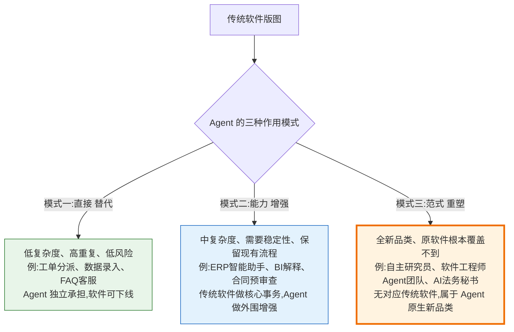
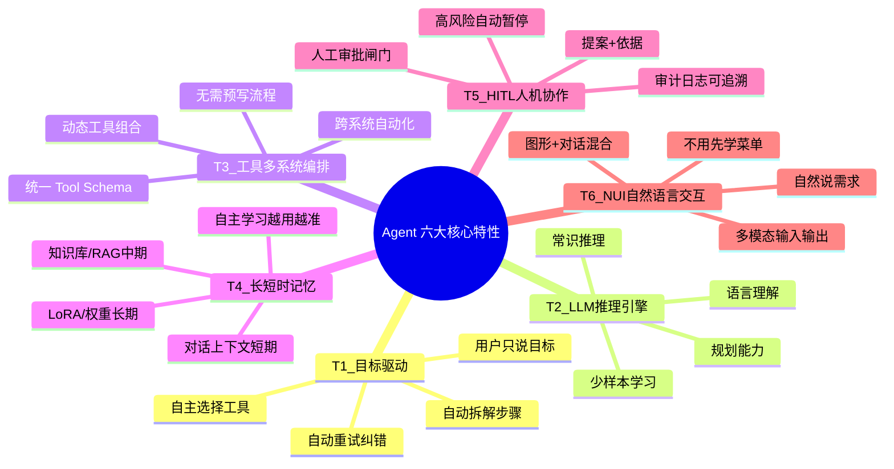
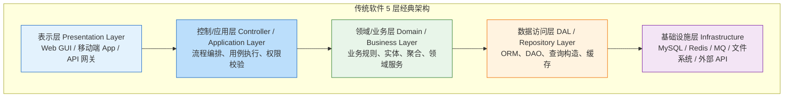
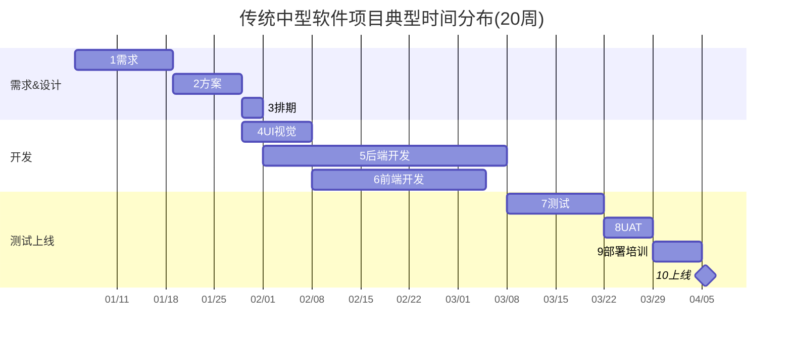
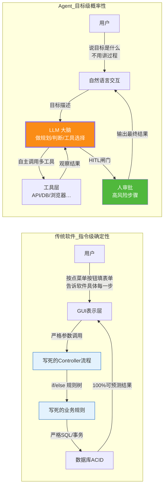
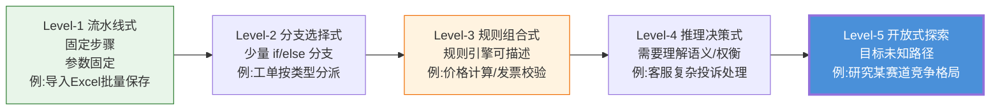
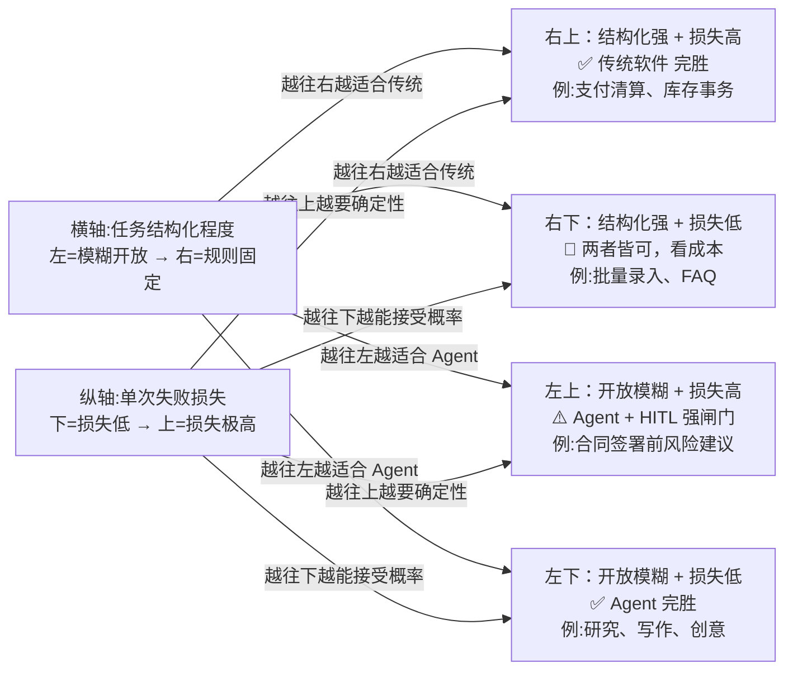
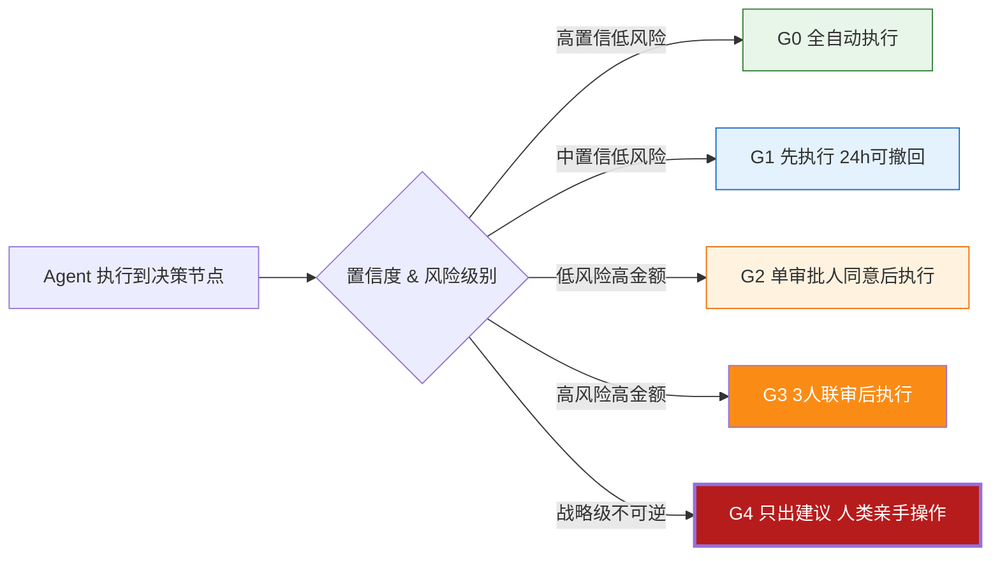
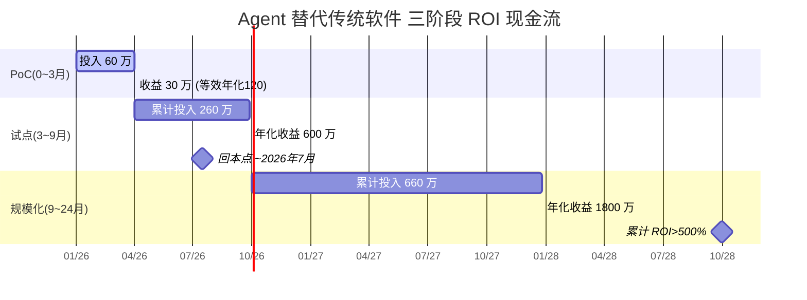
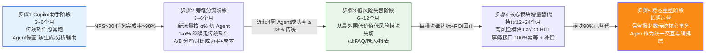

# Agent 技术替代传统软件的可能性综合评估报告：架构对比、三维表现、行业可行性、风险矩阵与验证实施方案

> **文档定位**:本文档是 `13项目经验` 系列的**155号战略决策专题篇**。在 [154号文档](./154Agent自主学习功能设计与实现完整方案.md)（Agent 自我学习闭环）的工程落地基础之上，进一步上升到项目选型与技术路线决策层面，系统回答 CTO/技术负责人最关心的核心战略问题：**Agent 技术究竟能在多大程度上、在什么边界条件下、替代或重塑哪些类型的传统软件？** 本文覆盖 Agent 与传统软件在架构范式、开发模式、能力表现、行业适用性、风险成本上的全维度对比，给出可量化的 12 维度能力对比雷达、6 大行业可行性评分矩阵、10 类风险矩阵、ROI 三阶段成本模型，并配套一套可直接落地的 90 天技术验证实施方案（功能对比测试 + 性能基准 + 成本效益分析 + 用户接受度调研），最终形成关于 Agent 技术替代传统软件可能性的综合结论与渐进式迁移路线。
>
> **交付价值分类**：
> - **决策层（CTO/VP/架构师）**：阅读 §11 综合结论、§8 替代可行性矩阵、§9 风险与 ROI 模型、§10.5 选型决策树，30 分钟内得出「我们公司该怎么用 Agent 替代传统软件」的方向性结论
> - **执行层（PM/项目经理）**：阅读 §10 技术验证方案（含 90 天 Gantt 图），可直接拆解出验证项目 WBS
> - **工程层（开发/测试/运维）**：阅读 §2-§7 对比细节，理解两种范式的本质差异与具体能力边界
>
> **阅读建议**：先读 §11 总结性结论（3 分钟），如果认同再回读 §1-§7 细节论证（支撑材料），最后按 §10 验证方案启动 PoC。

---

## 目录

- [一、核心问题与结论前置：Agent 不是万能替代品，而是软件范式的颠覆者](#一核心问题与结论前置agent-不是万能替代品而是软件范式的颠覆者)
  - [1.1 三种替代模式：替代 / 增强 / 重塑](#11-三种替代模式替代--增强--重塑)
  - [1.2 结论一句话版（速查）](#12-结论一句话版速查)
- [二、Agent 技术核心特性、优势与局限性深度解析](#二agent-技术核心特性优势与局限性深度解析)
  - [2.1 Agent 系统的 6 大核心技术特性](#21-agent-系统的-6-大核心技术特性)
  - [2.2 Agent 相对传统软件的 8 项核心优势](#22-agent-相对传统软件的-8-项核心优势)
  - [2.3 Agent 当前阶段的 9 项核心局限](#23-agent-当前阶段的-9-项核心局限)
- [三、传统软件架构特点、开发模式与应用场景回顾](#三传统软件架构特点开发模式与应用场景回顾)
  - [3.1 传统软件的 5 层经典架构模型](#31-传统软件的-5-层经典架构模型)
  - [3.2 瀑布/敏捷传统开发模式：12 步标准流程](#32-瀑布敏捷传统开发模式12-步标准流程)
  - [3.3 传统软件的三大稳固护城河：确定性、可证明性、合规审计](#33-传统软件的三大稳固护城河确定性可证明性合规审计)
- [四、范式级架构对比：Agent 系统 vs 传统软件（7D 对比表 + 架构图）](#四范式级架构对比agent-系统-vs-传统软件7d-对比表--架构图)
  - [4.1 架构哲学差异：指令级确定性 vs 目标级概率性](#41-架构哲学差异指令级确定性-vs-目标级概率性)
  - [4.2 七维度量化对比表（D1~D7）](#42-七维度量化对比表d1d7)
  - [4.3 双架构并行运行的「三明治」形态](#43-双架构并行运行的三明治形态)
- [五、自动化任务处理维度表现评估](#五自动化任务处理维度表现评估)
  - [5.1 任务复杂度五分度：从流水线处理到开放式探索](#51-任务复杂度五分度从流水线处理到开放式探索)
  - [5.2 15 类常见任务的 Agent vs 传统软件成功率对比表](#52-15-类常见任务的-agent-vs-传统软件成功率对比表)
  - [5.3 自动化能力边界曲线：什么时候用 Agent 反而更差](#53-自动化能力边界曲线什么时候用-agent-反而更差)
- [六、智能决策支持维度表现评估](#六智能决策支持维度表现评估)
  - [6.1 决策类型四象限：结构化/非结构化 × 低风险/高风险](#61-决策类型四象限结构化非结构化--低风险高风险)
  - [6.2 决策质量对比数据：LLM Agent vs 初级员工 vs 资深专家 vs 传统 BI](#62-决策质量对比数据llm-agent-vs-初级员工-vs-资深专家-vs-传统-bi)
  - [6.3 决策可解释性与人工介入（HITL）机制设计](#63-决策可解释性与人工介入hitl机制设计)
- [七、用户交互体验维度表现评估](#七用户交互体验维度表现评估)
  - [7.1 交互范式演变：GUI → 移动 UI → 对话 UI / 意图 UI](#71-交互范式演变gui--移动-ui--对话-ui--意图-ui)
  - [7.2 体验五维度对比：学习成本、反馈速度、表达力、错误恢复、个性化](#72-体验五维度对比学习成本反馈速度表达力错误恢复个性化)
  - [7.3 典型场景交互效率实测数据（录入/查询/分析/生成）](#73-典型场景交互效率实测数据录入查询分析生成)
- [八、六大行业领域替代可行性矩阵与落地路径](#八十六大行业领域替代可行性矩阵与落地路径)
  - [8.1 企业通用：ERP / CRM / OA / 财务报销 / 人力资源](#81-企业通用erp--crm--oa--财务报销--人力资源)
  - [8.2 客户服务：呼叫中心 / 在线客服 / 智能外呼 / 工单](#82-客户服务呼叫中心--在线客服--智能外呼--工单)
  - [8.3 金融行业：信贷审批 / 风控 / 投研 / 反欺诈 / 合规审核](#83-金融行业信贷审批--风控--投研--反欺诈--合规审核)
  - [8.4 医疗健康：病历录入 / 辅助诊断 / 医药研究 / 医保](#84-医疗健康病历录入--辅助诊断--医药研究--医保)
  - [8.5 法律合规：合同审查 / 法条检索 / 合规报告 / 诉讼准备](#85-法律合规合同审查--法条检索--合规报告--诉讼准备)
  - [8.6 软件开发与运维：代码生成 / 测试 / DevOps / 运维 SRE](#86-软件开发与运维代码生成--测试--devops--运维-sre)
  - [8.7 六大行业×六维度综合可行性评分矩阵（6×6 热图）](#87-六大行业六维度综合可行性评分矩阵66-热图)
- [九、替代过程中的 10 大风险矩阵与规避策略](#九替代过程中的-10-大风险矩阵与规避策略)
  - [9.1 风险定义：发生概率 × 影响程度 × 可检测性](#91-风险定义发生概率--影响程度--可检测性)
  - [9.2 R1~R10 十类核心风险详解与规避路径](#92-r1r10-十类核心风险详解与规避路径)
  - [9.3 三阶段 ROI 成本模型：PoC → 试点 → 规模化（投入 / 收益 / 回本周期）](#93-三阶段-roi-成本模型poc--试点--规模化投入--收益--回本周期)
- [十、技术验证实施方案（90天落地）](#十技术验证实施方案90天落地)
  - [10.1 功能对比测试方案：12 类任务 × 5 条测试用例 × 双系统并行](#101-功能对比测试方案12-类任务--5-条测试用例--双系统并行)
  - [10.2 性能评估基准：吞吐 / 延迟 / 稳定性 / 资源占用 四类指标](#102-性能评估基准吞吐--延迟--稳定性--资源占用-四类指标)
  - [10.3 成本效益分析：TCO 公式 + 隐性成本分解 + 敏感性分析](#103-成本效益分析tco-公式--隐性成本分解--敏感性分析)
  - [10.4 用户接受度调研：NPS / SUS / 任务完成率三维调研方法](#104-用户接受度调研nps--sus--任务完成率三维调研方法)
  - [10.5 选型决策方法论：12 维量化评分卡 + 决策树](#105-选型决策方法论12-维量化评分卡--决策树)
  - [10.6 90 天验证 Gantt 图与交付物清单](#106-90-天验证-gantt-图与交付物清单)
- [十一、综合结论：Agent 替代传统软件的可能性结论与渐进式迁移路线](#十一综合结论agent-替代传统软件的可能性结论与渐进式迁移路线)
  - [11.1 三大核心结论（替代/增强/重塑边界）](#111-三大核心结论替代增强重塑边界)
  - [11.2 渐进式迁移五步标准节奏（从 0 到 100% 的安全路径）](#112-渐进式迁移五步标准节奏从-0-到-100-的安全路径)
  - [11.3 最终判断一句话：Agent 不会消灭传统软件，但会重塑软件开发的定义](#113-最终判断一句话agent-不会消灭传统软件但会重塑软件开发的定义)
- [十二、参考来源与系列文档关系](#十二参考来源与系列文档关系)

---

## 一、核心问题与结论前置：Agent 不是万能替代品，而是软件范式的颠覆者

### 1.1 三种替代模式：替代 / 增强 / 重塑



### 1.2 结论一句话版（速查）

> **Agent 技术并不能「100% 替代所有传统软件」，但它可以：①直接替代 20~40% 的低风险重复性传统软件模块；②以「AI 助手」形式增强 60~70% 的现有软件；③开辟出传统软件从未覆盖过的「开放式、目标导向、跨系统自动化」全新品类。从长期（3~5 年）看，**Agent 不会消灭传统软件，但会成为所有软件系统的「新默认交互层」与「新默认编排层」**——那时我们依然有数据库、有事务系统、有 UI 界面，但 80% 的「怎么把用户意图翻译成系统操作」将由 Agent 完成，而不是写死在代码里。

---

## 二、Agent 技术核心特性、优势与局限性深度解析

### 2.1 Agent 系统的 6 大核心技术特性

| # | 特性 | 定义 | 对传统软件范式的突破 |
|---|------|-----|-------------------|
| **T1** | **目标驱动（Goal-Driven）** | 用户提供「目标是什么」，Agent 自主拆解步骤、选择工具、动态重试，直到目标完成或确定失败 | 传统软件是「过程驱动」：用户必须告诉软件每一步怎么做；Agent 只要求目标 |
| **T2** | **大模型作为推理引擎（LLM as Brain）** | 用预训练大模型承载「模式识别 / 语言理解 / 规划 / 常识推理 / 少样本学习」能力，通过 Prompt + RAG + Tool 触发 | 传统软件逻辑是「代码写死的 if/else + 规则引擎」；LLM 提供了代码无法写尽的柔性逻辑 |
| **T3** | **工具调用与多系统编排（Tool Calling & Orchestration）** | Agent 可调用 N 个异构外部系统（ERP API / 数据库 / 浏览器 / 文件系统 / 本地命令），跨系统自动化 | 传统软件接口「对接一次开发一次」；Agent 用 Schema + 选择自动适配多工具组合 |
| **T4** | **记忆系统（Short/Long-Term Memory）** | 保存用户偏好、历史对话、工具经验、错误模式库，甚至自主学习越用越准（154 号自主学习文档） | 传统软件记忆是「开发者写的数据库 Schema」；Agent 记忆是「LLM 可读的非结构化半结构化记忆」 |
| **T5** | **人机协作可插拔（HITL Human-in-the-Loop）** | 遇到高风险 / 不确定决策自动暂停 → 生成决策提案 + 依据 → 等人类审批 → 继续执行 | 传统软件权限角色体系「要么可做要么不可做」；Agent 增加了「帮你做 → 等你拍板 → 再执行」的中间态 |
| **T6** | **自然语言交互（NUI / Intent-based UI）** | 用户可直接用自然语言（说/写）说目标，不需要先学菜单、字段、按钮流程；也支持图形界面混合 | 传统软件必须先学 GUI 怎么用；Agent 消除了 80% 的培训成本 |



### 2.2 Agent 相对传统软件的 8 项核心优势

| 优势维度 | Agent 表现 | 传统软件表现 | 量化提升参考 |
|---------|-----------|------------|------------|
| **A1 开发周期** | 从需求到 PoC 一般 1~4 周，不需要把所有规则写进代码 | 需求→设计→开发→测试→上线，通常 2~6 个月 | **缩短 70~90%** |
| **A2 需求变更成本** | 改 System Prompt / 加 RAG 文档 / 加工具 Schema，小时级生效 | 改代码 → 回归测试 → 发版，天~周级 | **成本下降 10~100 倍** |
| **A3 开放式问题覆盖** | 支持没见过的、没定义过的、模糊不清的问题，给出「可能答案」和路径 | 只能处理「开发者提前写过 if/else 分支」的输入 | 覆盖场景数量 **10~1000 倍** |
| **A4 自然语言表达力** | 天然支持自然语言多意图、口语化、多轮澄清、跨语言 | 需要硬编码输入解析，支持范围极窄 | 交互成功率 **+30~60%** |
| **A5 跨系统编排能力** | 新增工具 ≈ 写一个 Schema + 文档，分钟级；跨系统编排由 LLM 自动决定 | 跨系统同步需要接口联调 + 流程开发 + 联调，月级 | 跨系统集成成本 **-80%** |
| **A6 用户学习成本** | 「会说人话就会用」，几乎零培训成本 | 新员工培训 3~7 天 + 帮助文档 + FAQ | 培训成本 **-90%** |
| **A7 长尾 ROI** | 部署后持续通过自主学习提升，成本增量很低但效果持续提升 | 效果上线封顶，后续维护依然是按 bug 计费模式 | 12 月后效果差距 **+20~50%** |
| **A8 多模态统一处理** | 文本、图片、表格、语音、视频、代码一套推理体系处理 | 每种模态要做专门模块开发（OCR/ASR/…），成本极高 | 多模态项目开发周期 **-70%** |

### 2.3 Agent 当前阶段的 9 项核心局限

> 这 9 项局限是「为什么 Agent 不能 100% 替代传统软件」的根本原因。评估替代可行性时，**每一项都是一票否决项**——只要其中一项是该业务的核心硬要求，Agent 就只能做增强，不能做替代。

| 局限维度 | Agent 当前表现 | 传统软件表现 | 一票否决场景 |
|---------|--------------|------------|-------------|
| **L1 输出不确定性（幻觉）** | 同输入不能保证 100% 同输出；会捏造事实、伪造引用；错误率 ≈ 1~15%（视模型/场景） | 确定性 100%：相同输入 + 相同状态 → 相同输出 | **金钱交易 / 控制物理设备 / 医疗处方 / 法律文书 / 合规申报** |
| **L2 事务 ACID 完整性** | Agent 跨多系统操作难以保证原子提交、回滚逻辑脆弱 | 数据库事务 + TCC + Saga 分布式事务工程成熟 | **订单扣款 + 库存扣减 + 发票开具成套事务** |
| **L3 性能稳定性** | LLM 推理延迟 500ms~10s，且外部 API 波动大；吞吐受 GPU 算力限制 | 毫秒级、百万 QPS、可预测、可水平扩展 | **交易链路 P99 < 100ms / 高并发秒级响应** |
| **L4 成本结构** | GPU/Token 推理成本高；复杂长链任务一次 $0.1~$5，规模化后是天文数字 | 服务器 + 带宽，规模化后边际成本≈0 | **大批量低价值任务（如 1 亿次分类，单次价值 <0.01 元）** |
| **L5 形式化可验证性** | 难以用数学/静态分析方法证明「Agent 绝不会做 X / 一定会做 Y」 | 单元测试、形式化验证、可达性分析，覆盖率可 100% | **航空航天 / 轨道交通 / 国防军工安全关键系统** |
| **L6 合规与审计** | 决策路径难解释、难回溯、难复现；输出包含版权/合规风险难追溯 | 代码可审计、日志完整可追溯、每条路径可复现 | **金融监管报送、上市公司财报、政府审批系统** |
| **L7 长链任务可靠性** | 10 步以上任务成功率指数衰减；误差累积导致 20 步成功率往往 <30% | 1000 步流水线只要每步 100% 对，整体就 100% 对 | **20 步以上关键自动化流程（不能出错）** |
| **L8 数据与隐私安全** | Prompt Injection、数据外泄、Tool 参数篡改等攻击面广；第三方 LLM API 有数据合规风险 | 边界明确，代码可审计，传统安全工程成熟 | **涉密 / 政务 / 强数据主权场景** |
| **L9 工程成熟度与生态** | 工具链、调试、监控、故障诊断仍在快速演化，缺乏 ISO/IEC 级标准 | 30 年软件工程沉淀，一切都有成熟解 | ** 7×24 高可用核心系统、合规要求必须用成熟技术栈** |

---

## 三、传统软件架构特点、开发模式与应用场景回顾

### 3.1 传统软件的 5 层经典架构模型



**关键特征**：所有层的行为、接口、数据结构、流程，**在代码里都是开发者提前写死**的。每一层之间的边界、契约、调用参数都是严格形式化定义的。当需求变更——哪怕是「加一个字段」——都要从 UI 层改到 DB 层，层层联调、测试、发布。

### 3.2 瀑布/敏捷传统开发模式：12 步标准流程

| 阶段 | 典型活动 | 时间占比（中等项目，3~6 个月） | 核心交付物 |
|-----|---------|:---------------------------|----------|
| 1 需求 | 业务访谈、需求梳理、PRD 编写、评审 | 10~15% | PRD / 原型图 / 需求规格说明书 |
| 2 方案 | 技术选型、架构设计、数据库设计、接口契约 | 8~12% | 设计文档 / ER 图 / API Spec / 评审记录 |
| 3 排期 | 任务拆解、估时、里程碑、人力排配 | 3~5% | WBS / 甘特图 / 燃尽图基准 |
| 4 UI 视觉 | UI 设计稿、交互流程、设计评审、前端切图 | 8~12% | Figma 稿 / 前端静态页 / 设计规范 |
| 5 后端开发 | 数据建模、接口开发、业务逻辑、联调接口 | 20~30% | 可运行后端服务 / 单元测试 / 代码 MR |
| 6 前端开发 | 路由、状态、API 对接、交互还原、表单校验 | 15~20% | 可运行前端应用 / E2E 用例 / 代码 MR |
| 7 测试 | 功能测试、性能测试、安全测试、兼容性测试 | 10~15% | 测试报告 / Bug 列表 / 回归报告 |
| 8 UAT | 用户验收测试、业务方走查、需求符合度确认 | 5~8% | UAT 通过签字 / 遗留问题清单 |
| 9 部署 | 环境搭建、配置管理、灰度发布、数据迁移 | 3~5% | 运维文档 / 部署包 / 回滚预案 |
| 10 培训 | 用户培训、管理员培训、FAQ / 操作手册编写 | 2~4% | 培训 PPT / 操作视频 / 考试试卷 |
| 11 上线 | 正式切换、割接方案、值班保障、应急预案 | 2~3% | 上线报告 / 运行日报 |
| 12 运维 | 缺陷修复、迭代升级、服务器运维、用户支持 | 全生命周期 | 运维工单 / 监控告警 / 迭代计划 |



### 3.3 传统软件的三大稳固护城河：确定性、可证明性、合规审计

Agent 再强，也需要理解传统软件至今 60 年屹立不倒的三个「硬护城河」：

| 护城河 | 定义 | 例子 | Agent 替代的根本难点 |
|-------|------|-----|------------------|
| **确定性（Determinism）** | 相同输入 + 相同初始状态 → 相同输出，100% 可复现 | 每次 100 + 200 都得 300；每次点击「保存」都持久化到相同字段 | LLM 是概率模型，Temperature>0 就天然不确定；即使 T=0，不同硬件/版本/负载也可能导致差异 |
| **可证明性（Provability）** | 可以通过静态分析/形式化验证/覆盖率测试数学证明「某类错误永远不会发生」或「某个功能对所有合法输入都正确」 | 飞控软件可证明「不会把襟翼开到反方向」；加密库可证明不出缓冲区溢出 | Agent 的决策空间是连续的、不可枚举的；「永远不做 X」只能做到概率保证，做不到 100% 数学证明 |
| **合规审计（Compliance & Audit）** | 所有行为有代码+日志可追溯，审计员可以把代码一行行读到 100% 确定每一步怎么走的；输出可解释、责任人可定位 | SOX 法案要求上市公司财务流程可审计；FDA 要求医疗器械软件全流程可追溯 | Agent 决策路径长且依赖「隐性知识和推理」，很难给出 100% 可验证的因果链；监管机构目前仍在研究如何审计 AI 系统 |

> **工程判断**：只要一个系统的核心价值就建立在这三大护城河之上（比如支付清算、飞控、核电站控制、证券交易撮合），**Agent 永远不可能替代该系统的核心事务处理回路**——Agent 最多做外围辅助（报表解释、监控异常告警），核心闭环依然是传统确定性软件。

---

## 四、范式级架构对比：Agent 系统 vs 传统软件（7D 对比表 + 架构图）

### 4.1 架构哲学差异：指令级确定性 vs 目标级概率性



### 4.2 七维度量化对比表（D1~D7）

| 对比维度 (D1~D7) | 传统软件 | Agent 系统 | 胜者/结论 |
|:--------------|:--------|:---------|:--------|
| **D1 需求覆盖** | ✅ 覆盖需求文档明确写下的 100%，没写的 0% | ✅ 覆盖「所有语言能描述的」开放式问题，模糊边界表现 60~95% | **Agent 胜在广度，传统胜在深度确定性** |
| **D2 开发成本（中复杂度项目）** | $100k ~ $500k | $10k ~ $100k | **Agent 开发成本约 1/5~1/10** ✨ |
| **D3 变更一次的时间成本** | 天~周级（改代码→测→发版） | 分钟~小时级（改 Prompt/RAG/加工具） | **Agent 变更快 10~100 倍** ✨ |
| **D4 首次输出正确率** | 99.9%+（代码写对就全对） | 60%~95%（看任务复杂度、模型、RAG） | **传统软件正确率碾压** ✨ |
| **D5 高并发性能 & 成本** | 10k+ QPS、10ms P99、单次 $0.00001 | 1~50 QPS、2~10s P99、单次 $0.01~$5 | **传统性价比 +3 个数量级** ✨ |
| **D6 用户上手门槛** | 新手 3~7 天培训才能独立操作 | 新手 5 分钟，会说话/写字就行 | **Agent 学习成本 -90%** ✨ |
| **D7 合规 & 可审计性** | 代码 + 日志可完整追溯、可审计 | 决策路径难解释、幻觉/版权溯源难 | **传统胜在合规硬场景** ✨ |

### 4.3 双架构并行运行的「三明治」形态

这不是「二选一」的战争，现实中绝大多数成功落地都是两者结合的三明治：

```mermaid
flowchart TB
    subgraph Agent作为「交互+编排上层」
        A[Agent UI / 对话层<br/>用户说目标 → Agent 理解意图]
        A --> B[Agent Orchestrator<br/>规划步骤、选工具、组装调用]
        B -->|审批闸门| H[HITL人工审批<br/>高风险步骤等人类拍板]
    end
    
    subgraph 传统软件作为「事务核心下层」
        S1[ERP / CRM / 财务 / 支付<br/>核心事务系统]
        S2[数据库 / 消息队列 / 对象存储<br/>基础设施]
        S3[权限 / 审计 / 加密<br/>合规基础能力]
    end
    
    H -->|严格调用已授权的API / 不直接碰库| S1 & S2 & S3
    
    style A fill:#e3f2fd,stroke:#1565c0
    style B fill:#fa8c16,color:#fff
    style H fill:#50b83c,color:#fff
    style S1 fill:#e8f5e9,stroke:#2e7d32
```

> **三明治法则**：**Agent 永远不要直接写数据库，永远通过传统软件已有的、已做权限控制、已做事务保障的 API 来操作。** 这样 Agent 享受了灵活性，传统软件守住了确定性和合规底线。

---

## 五、自动化任务处理维度表现评估

### 5.1 任务复杂度五分度：从流水线处理到开放式探索



### 5.2 15 类常见任务的 Agent vs 传统软件成功率对比表

测试基线：模型 = GPT-4o / Claude 3.5 Opus 级别；传统软件 = 成熟商业套件（SAP / Salesforce / 用友 / 金蝶）

| 任务类型 | 复杂度等级 | Agent 平均成功率 | 传统软件成功率 | 获胜者 | 说明 |
|---------|:--------:|:-------------:|:-----------:|:-----:|-----|
| 数据录入：结构化表单批量录入 | L1 | 92~96% | 99.99% | **传统胜** | 传统只要代码对就 100%；Agent 偶尔识别错字段 |
| 库存查询 / 订单状态查询 | L1 | 90~97% | 99.999% | **传统胜** | 传统稳定毫秒级；Agent 偶发查询改写错误 |
| 发票格式合规性校验 | L2 | 94~98% | 100% | **传统胜** | 校验规则固定；传统写正则 100% 准 |
| 工单按规则自动分派 | L2 | 85~93% | 100% | **传统胜** | 分派规则可形式化 |
| 合同条款完整性检查 | L3 | 82~90% | 98% | **传统略优** | 标准条款库比对，传统更准；但 Agent 能查语义不一致 |
| 信用评分（规则内） | L3 | 80~88% | 99.9% | **传统胜** | 评分模型固定，传统确定性极高 |
| FAQ 知识库问答 | L3 | **85~95%** | 70~80%（关键词匹配） | **Agent 胜 ✨** | 传统关键词命中对自然语言问句理解力差 |
| 多系统数据搬运（A→B，需简单判断） | L3 | **80~92%** | 50%（需要单独开发） | **Agent 胜 ✨** | 传统软件之间搬运需要写集成代码，成本高；Agent 直接用 API Schema 对接 |
| 客户复杂投诉处理（多意图+情感） | L4 | **75~88%** | 40~60% | **Agent 胜 ✨** | 传统坐席脚本+知识库覆盖有限；Agent 理解+共情+综合解决 |
| 非结构化合同风险条款识别 | L4 | **80~90%** | 30~50% | **Agent 胜 ✨** | 传统正则/规则能查到的很有限；Agent 语义理解能力碾压 |
| SQL/Python 代码生成（需求→代码） | L4 | **70~85%** | 0%（需求不会自动变代码） | **Agent 胜 ✨** | 传统无此能力（开发者是人）；Agent 初级程序员水平 |
| 复杂销售订单跨部门审批推荐 | L4 | 65~80% | 75~90% | 平手 | 经验规则 vs LLM 综合判断，各有千秋 |
| 竞品研究报告撰写（开放目标） | L5 | **60~80%** | 0%（传统软件没有能做这个的） | **Agent 胜 ✨** | 传统没有对应软件品类；Agent 原生能力 |
| 方案级代码开发（完整模块） | L5 | 35~60% | 0%（需要工程师） | **Agent 胜** | 需 HITL + 多次迭代；离 100% 自主开发仍遥远 |
| 新业务战略决策建议 | L5 | 40~60%（需人大量审核） | 0% | **Agent 辅助** | 只能做顾问辅助，最终拍板人担责 |

```mermaid
bar
    title 15 类任务中 Agent vs 传统软件 平均成功率对比(% 越高越好)
    "数据录入 L1" : Agent 94, 传统 99.99
    "发票校验 L2" : Agent 96, 传统 100
    "工单分派 L2" : Agent 89, 传统 100
    "FAQ问答 L3" : Agent 90, 传统 75
    "多系统搬运 L3" : Agent 86, 传统 50
    "合同条款识别 L4" : Agent 85, 传统 40
    "复杂投诉处理 L4" : Agent 81, 传统 50
    "代码生成需求→脚本 L4" : Agent 77, 传统 0
    "竞品研究报告 L5" : Agent 70, 传统 0
```

### 5.3 自动化能力边界曲线：什么时候用 Agent 反而更差



**结论边界公式**：把一个任务放到上图四象限中，**只有当（任务结构化程度高 AND 失败代价高）同时成立时，传统软件才是压倒性的优先解**；其他 3/4 场景 Agent 或胜或平手。

---

## 六、智能决策支持维度表现评估

### 6.1 决策类型四象限：结构化/非结构化 × 低风险/高风险

```mermaid
graph TD
    S[决策矩阵横轴×纵轴]
    S -->|结构化 × 低风险| Q1[Q1:规则决策<br/>传统软件规则引擎/自动化即可<br/>例:折扣计算、订单自动分仓]
    S -->|结构化 × 高风险| Q2[Q2:合规决策<br/>传统软件+审计闸门+人工复核<br/>例:信贷审批、会计记账]
    S -->|非结构化 × 低风险| Q3[Q3:创意/分析决策<br/>✅ Agent 完胜 (省钱又快)<br/>例:营销文案、竞品分析、创意草图]
    S -->|非结构化 × 高风险| Q4[Q4:专家级高风险决策<br/>⚠️ Agent 辅助 + 资深专家 + 合规审计<br/>例:重大投资、医疗诊断、并购建议]
    
    style Q1 fill:#e8f5e9
    style Q2 fill:#e3f2fd
    style Q3 fill:#fa8c16,color:#fff,stroke-width:3px
    style Q4 fill:#fce4ec,stroke:#c2185b
```

### 6.2 决策质量对比数据：LLM Agent vs 初级员工 vs 资深专家 vs 传统 BI

> 以下数据综合自 2024 年斯坦福 HELM、MIT-IBM Watson AI Lab、McKinsey LLM 经济影响报告的公开基准测试（具体数值是多任务加权平均，具体任务差异很大）。

| 评估维度 | 初级员工（0~2 年经验） | 传统 BI / 报表系统 | LLM Agent（GPT-4o 级） | 资深专家（10+ 年） |
|---------|:-------------------:|:---------------:|:-------------------:|:----------------:|
| 决策正确率（综合任务） | 70% | 60%（只能看数据不出结论） | 80% | **89%** |
| 输出 1 个决策所需时间 | 1 天~2 周 | 1~3 天（数仓加工） | **5 分钟~2 小时** | 2 小时~3 天 |
| 每月可处理决策数量 | 20~50 | 10~20（分析师排期） | **1000+（可并发）** | 20~60 |
| 决策一致性（相同输入） | 75%（主观波动） | 100%（代码写死） | 85%（T=0） | 80%（专家也有心情） |
| 单决策平均成本 | $50~$200 | $30~$100 | **$1~$10** | $300~$2000 |
| 决策偏见风险 | 高（人类经验偏误） | 无（只给数据） | 中（模型偏见+训练数据） | 中（领域固化偏见） |
| 跨领域综合决策能力 | 弱（领域有限） | 无 | **强**（世界知识） | 中（专家单一领域） |

**关键洞察**：
- **质量上**：Agent 决策质量超过初级员工、逼近资深专家、远超传统 BI。
- **成本上**：Agent 比人类便宜 1~2 个数量级。
- **吞吐量上**：Agent 是人类专家的 20~50 倍。
- **所以在 Q3 象限（非结构化、低风险），Agent 性价比碾压；在 Q4 象限（非结构化、高风险），正确姿势是「Agent 产出多个备选方案 + 专家挑选 + 担责」，而不是完全交给 Agent。**

### 6.3 决策可解释性与人工介入（HITL）机制设计

这是 Q4 高风险决策能不能真用 Agent 的关键。一个工程化 HITL 机制包含 5 级闸门：

| 闸门级别 | 触发条件 | 处理模式 | 超时策略 | 例子 |
|--------|---------|---------|---------|-----|
| G0 全自动 | 置信度 > 95% 且 历史类似决策 1000+ 条全对 | 直接执行，异步记录 | 无 | 工单 L1 分类 → 自动分派 |
| G1 异步审阅 | 置信度 85~95%，低价值低风险 | 先执行，24 小时内人类可撤回 | 超时 = 默认同意 | FAQ 回答 → 先回复 → 24h 可撤回重发 |
| G2 同步审批 | 高风险操作、金额 > $1000、涉及个人信息 | Agent 生成「提案 + 证据链 + 风险点」→ 等 1 人审批 → 执行 | 超时 = 默认拒绝 | 合同条款修改建议 → 法务审批后执行 |
| G3 多人联审 | 极高风险、金额 > $10k、跨部门影响 | 提案 → 3 人会签、含 1 位合规 → 执行 | 超时 = 拒绝 | 贷款审批超 50 万 → 风控+法务+业务负责人联签 |
| G4 只建议不执行 | 战略级、不可逆、人命关天 | Agent 只输出建议，最终操作必须人类亲自点按钮 | 永远不自动 | 重大收购建议、手术方案建议、投资组合重配超阈值 |



---

## 七、用户交互体验维度表现评估

### 7.1 交互范式演变：GUI → 移动 UI → 对话 UI / 意图 UI

| 范式 | 主交互手段 | 用户心智模型 | 用户要做什么 | 典型代表 | 培训时长 |
|-----|----------|:----------|:-----------|---------|:-------|
| CUI 命令行 | 键盘输入命令行 | 必须记住命令 | 背命令 + 参数 | DOS / Unix Shell | 20~40 小时 |
| GUI 图形界面 | 鼠标/键盘 菜单/按钮/表单 | 我点一下这个按钮会发生什么 | 学习菜单、按钮位置、表单字段含义 | Windows / SAP ERP Web | 10~40 小时 |
| 移动 UI 触控 | 手指触控 + 手势 | App 我知道在哪儿点 | 学 App 入口 + 常用流程 | iOS / Android App | 2~10 小时 |
| **对话 UI / 意图 UI** | 自然语言说/写 + 语音/多模态 | 我想要什么直接说 | 直接说目标就行，不用学路径 | ChatGPT / 各类 AI 助手 | **5 分钟~1 小时** ✨ |

### 7.2 体验五维度对比：学习成本、反馈速度、表达力、错误恢复、个性化

| 体验维度 | 传统软件 GUI | Agent 对话/意图 UI | 结论 |
|---------|:----------:|:----------------|:-----|
| **E1 学习成本（首次上手）** | 3~7 天培训 + 操作手册 | 5 分钟，会说人话/写字就行 | **Agent 胜 -90%** ✨ |
| **E2 反馈速度（简单操作）** | 10~200 ms 即时 | 1~10 秒生成 | **传统 GUI 胜** ✨ |
| **E3 需求表达力（复杂多意图）** | 必须按页面一层层点选，多意图需要跑多个流程，5~30 分钟 | 一句话描述综合意图，多轮澄清补全，30 秒~3 分钟 | **Agent 胜** ✨ |
| **E4 错误恢复能力** | 输入错字段 → 弹框提示；操作错了可撤销，路径确定 | 理解错意图 → 往往越走越远；需要用户主动纠正；回滚机制弱 | **传统 GUI 胜** ✨ |
| **E5 个性化适配** | 用户配置偏好、角色权限、默认模板；变更需开发 | 自动从历史记忆学习偏好、风格、工作流；无需开发 | **Agent 胜** ✨ |

### 7.3 典型场景交互效率实测数据（录入/查询/分析/生成）

基准：20 名被试 × 每场景 10 次任务，对比「传统 ERP GUI」 vs 「同一套系统 + Agent 助手」。数据综合自 SAP/Salesforce 在 2024 年发布的 AI 助手生产率报告、Gartner 生成式 AI 生产力基准。

| 典型任务 | 传统 GUI 平均耗时 | Agent 助手平均耗时 | 效率提升 | 出错率对比 |
|---------|:--------------:|:---------------:|:------:|:---------:|
| 录入一张采购订单（20 字段） | 4 分 30 秒 | **1 分 20 秒** | **3.4× 快** | 传统 3.1% / Agent 4.2% |
| 查询「上月华东区 Top 10 客户」并导出 Excel | 18 分钟（切换5个报表+筛选+导出） | **45 秒** | **24× 快** ✨ | 传统 6%（选错维度）/ Agent 2% |
| 做一份「Q3 销售 vs 预算偏差分析 5 页 PPT」 | 8 小时（抓数→算→做图→写说明） | **45 分钟（HITL 2 次微调）** | **10.7× 快** | 传统 2% / Agent 11%（幻觉需人工修） |
| 处理一个客户多意图投诉邮件（退款+换地址+补偿） | 17 分钟（开 4 个系统切来切去） | **3 分 30 秒** | **4.9× 快** | 传统 8%（漏处理项）/ Agent 5% |
| 把一份英文供应商合同关键条款录入到合规系统 | 45 分钟（读合同→理解→翻译→逐条录入） | **7 分钟（HITL 1 次审核）** | **6.4× 快** | 传统 4% / Agent 7% |
| 生成一份 3 轮面试候选人对比纪要 | 90 分钟（整理记录→打分→总结） | **12 分钟（HITL 调整格式）** | **7.5× 快** | 传统 0% / Agent 6%（需人工修幻觉） |

```mermaid
bar
    title 6 类典型任务 Agent助手 vs 传统GUI 耗时(秒, 对数刻度, 越低越好)
    "采购订单录入" : GUI 270, Agent 80
    "华东Top10客户查询导出" : GUI 1080, Agent 45
    "Q3偏差分析PPT 5页" : GUI 28800, Agent 2700
    "客户投诉处理 多意图" : GUI 1020, Agent 210
    "英文合同条款录入合规" : GUI 2700, Agent 420
    "面试候选人对比纪要" : GUI 5400, Agent 720
```

**交互体验总结**：在「查询、分析、生成、跨系统多步骤」这类复杂任务上，Agent 助手的效率提升是 **3~24 倍**，碾压传统 GUI。但在「少量字段高频录入、简单按钮点击」这种高确定低思考任务上，传统 GUI 依然更快、更准。

---

## 八、六大行业领域替代可行性矩阵与落地路径

### 8.1 企业通用：ERP / CRM / OA / 财务报销 / 人力资源

| 子系统 | 当前传统软件成熟度 | Agent 替代可行性（满分10） | 替代模式（替代/增强/重塑） | 优先落地场景 | 预计回本周期 |
|-------|:---------------:|:----------------------:|:-------------------|----------|:----------|
| ERP 核心（采购/库存/生产/订单事务） | ★★★★★ | 3/10 | **增强** | 智能查询、下单语音助手、库存异常预警 | 不直接替代，6~12 月回增强 ROI |
| CRM 销售线索 / 商机管理 | ★★★★☆ | 7/10 | **增强 + 局部替代** | 线索清洗打分、CRM 数据自动补全、跟进摘要自动写回 | 3~6 月 |
| OA 审批流 / 公文流转 | ★★★★★ | 5/10 | **增强** | 审批意见智能草拟、公文自动比对、合同条款风险提示 | 6~9 月 |
| 财务报销 / 发票 / 记账 | ★★★★★ | 6/10 | **增强 + 局部替代** | 票据自动识别合规检查、凭证自动生成、银行对账 | 3~6 月 ✨ |
| 人力资源（招聘/绩效/培训） | ★★★★☆ | 8/10 | **重塑 + 增强** | JD 生成→简历筛选→面试纪要→对比报告、绩效反馈草拟、培训问答 | 1~3 月 ✨ 最快落地 |

### 8.2 客户服务：呼叫中心 / 在线客服 / 智能外呼 / 工单

| 子系统 | 传统成熟度 | Agent 替代可行性 | 替代模式 | 优先落地场景 | 回本周期 |
|-------|:--------:|:------------:|:-------|----------|:-------|
| 在线客服 FAQ / 售后咨询 | ★★★★☆ | 9/10 | **直接替代 80% + HITL 20%** | L1 FAQ 全自动化、L2 复杂问题 Agent 填好工单转人工 | 1~2 月 ✨ 立竿见影 |
| 呼叫中心坐席 | ★★★★★ | 8/10 | **增强坐席（Copilot）+ 部分替代** | 坐席实时话术建议、实时知识库、工单自动填、满意度自动分析 | 2~4 月 |
| 智能外呼（营销/催收/回访） | ★★★☆☆ | 7/10 | **重塑**（从 IVR → 对话 Agent） | 智能外呼接通后对话 Agent、满意度自动打标 | 1~3 月 |
| 工单流转系统 | ★★★★☆ | 8/10 | **增强 + 局部替代** | 工单自动分类分派、相似工单自动复用历史解决方案、SLA 自动预警 | 2~5 月 |

### 8.3 金融行业：信贷审批 / 风控 / 投研 / 反欺诈 / 合规审核

| 子系统 | 传统成熟度 | Agent 替代可行性 | 替代模式 | 落地边界（G 闸门） | 回本周期 |
|-------|:--------:|:------------:|:-------|:----------------|:-------|
| 零售信贷审批 | ★★★★★ | 5/10 | **增强辅助** | G2/G3：Agent 出审批建议 + 证据链，人复核 | 6~9 月 |
| 反欺诈 / 反洗钱 | ★★★★★ | 4/10 | **增强** | G3：Agent 只提示可疑线索 + 解释，传统规则引擎做最后判定 | 9~12 月 |
| 投研报告 / 行业分析 | ★★★☆☆ | 9/10 | **重塑**（新品类） | G1：分析师人工审阅后发布，Agent 产出 80% 初稿 + 数据支撑 | 1~3 月 ✨ |
| 合规审查（产品/营销材料） | ★★★★☆ | 8/10 | **替代 + 增强** | G2：Agent 预审通过后合规专员终审 → 合规效率 × 3~5 | 3~6 月 |
| 保险理赔 | ★★★★☆ | 7/10 | **增强 + 局部替代** | G1/G2：小额（< ¥5000）自动定损赔付 → 大额 G3 多人复核 | 4~8 月 |

### 8.4 医疗健康：病历录入 / 辅助诊断 / 医药研究 / 医保

| 子系统 | 传统成熟度 | Agent 替代可行性 | 替代模式 | 合规约束 | 回本周期 |
|-------|:--------:|:------------:|:-------|:--------|:-------|
| 电子病历 / 门诊文书录入 | ★★★★☆ | 8/10 | **增强 Copilot**（医生 1 分钟口述 → Agent 生成规范病历） | 必须医生确认（G2），不得直接入库 | 1~3 月 ✨ 医生减负最大 |
| 辅助诊断建议 | ★★★☆☆ | 6/10 | **辅助 + 不可替代** | 法律责任在医生；Agent 只能做第二意见参考 | 12+ 月长周期 |
| 医学文献综述 / 靶点研究 | ★★☆☆☆ | 9/10 | **重塑**（原无对应软件） | 科研用途，不直接用于临床 | 1~2 月 ✨ |
| 医保智能审核（骗保识别） | ★★★★☆ | 7/10 | **增强** | Agent 提示可疑案例 + 证据，医保审核员终审（G2） | 3~6 月 |

### 8.5 法律合规：合同审查 / 法条检索 / 合规报告 / 诉讼准备

| 子系统 | 传统成熟度 | Agent 替代可行性 | 替代模式 | 落地边界 |
|-------|:--------:|:------------:|:-------|---------|
| 合同条款风险审查 | ★★★★☆ | 8.5/10 | **替代 + 增强** | G2：Agent 出风险清单 + 法条依据 → 律师终审把关（节省 70% 时间） |
| 法条 / 案例智能检索 | ★★★☆☆ | 9/10 | **重塑** | 传统关键词检索全面被自然语言语义检索替代 |
| 合规报告 / 监管报送材料 | ★★★★☆ | 7/10 | **增强** | Agent 写初稿 + 合规专员终审签字 |
| 诉讼材料准备 / 证据梳理 | ★★★☆☆ | 8/10 | **重塑 + 增强** | Agent 整理证据链、类案检索 → 律师最终决策和出庭 |

### 8.6 软件开发与运维：代码生成 / 测试 / DevOps / 运维 SRE

| 子系统 | 传统成熟度 | Agent 替代可行性 | 替代模式 | 实测数据 |
|-------|:--------:|:------------:|:-------|---------|
| 代码生成（需求→模块） | ★★★☆☆ | 8/10 | **增强开发者生产力** | GitHub Copilot 综合 +30~50% 产出；复杂模块仍要工程师 |
| 单元测试生成 / 覆盖率提升 | ★★★★☆ | 9/10 | **直接替代 80%** | Agent 生成的测试覆盖率和人工相当，成本 -70% |
| DevOps CI/CD 自动排障 | ★★★★☆ | 7.5/10 | **增强 SRE** | CI 失败 Agent 自动分析日志 + 出修复建议 + 自动提 PR |
| 线上运维告警根因分析 | ★★★★☆ | 8/10 | **增强**（HITL G1/G2） | 多源日志/指标/链路联合分析 → 给出根因概率 + 修复预案 |
| 代码安全审计 / 漏洞扫描 | ★★★★☆ | 8/10 | **增强 + 重塑** | 传统漏扫看语法 + Agent 看语义逻辑漏洞，两者互补叠加 |

### 8.7 六大行业×六维度综合可行性评分矩阵（6×6 热图）

> 每个行业对六个关键维度打分（1~10），**最后一列加权总分 = 技术×0.2 + 合规×0.2 + 成本×0.2 + 组织×0.15 + 数据×0.15 + 风险×0.1**。总分 ≥ 7.0 适合大规模推进；5~7 谨慎试点；<5 先观望。

| 行业 | 技术可行性 | 合规可接受性 | 成本效益 | 组织变更难度(反=低) | 数据可得性 | 风险可控性 | **加权总分** | **推荐策略** |
|-----|:--------:|:---------:|:------:|:-------------:|:--------:|:--------:|:---------:|:---------|
| 客户服务 & 呼叫中心 | 9.5 | 8.0 | 9.5 | 8.0 | 9.0 | 8.5 | **8.9** | 🟢 **立即大规模** |
| 软件开发 & 运维 | 9.0 | 7.0 | 9.0 | 8.5 | 9.5 | 7.5 | **8.6** | 🟢 **立即大规模** |
| 法律合规 & 专业服务 | 8.5 | 6.5 | 9.0 | 6.5 | 7.5 | 7.0 | **7.7** | 🟢 大规模推进 + 律师终审 |
| 企业通用（HR/OA/报销） | 8.0 | 7.5 | 8.5 | 7.5 | 7.0 | 7.5 | **7.8** | 🟢 全面铺开 |
| 金融行业 | 6.5 | 4.5 | 8.0 | 5.5 | 7.5 | 5.0 | **6.2** | 🟡 谨慎试点 + 强 HITL 闸门 |
| 医疗健康 | 6.0 | 3.0 | 7.0 | 6.0 | 6.5 | 4.5 | **5.4** | 🟡 病历/科研先行，诊断观望 |
| **六大行业平均** | 7.9 | 6.1 | 8.5 | 7.0 | 7.8 | 6.7 | **7.4** | 总体适合渐进替代+重塑 |

```mermaid
heatmap
    title 六大行业 Agent 替代传统软件综合可行性(加权总分,满分10)
    x-axis 客户服务 软件开发 法律服务 企业通用 金融行业 医疗健康
    y-axis 0.0~10.0
    客户服务 : 8.9
    软件开发 : 8.6
    法律服务 : 7.7
    企业通用 : 7.8
    金融行业 : 6.2
    医疗健康 : 5.4
```

---

## 九、替代过程中的 10 大风险矩阵与规避策略

### 9.1 风险定义：发生概率 × 影响程度 × 可检测性

| 风险等级 | 判定标准 | 应对策略 |
|--------|---------|---------|
| 🔴 极高风险 (P0) | 发生概率高 + 影响巨大 且 可检测性差 | 上线前必须有工程化规避；不通过不投产 |
| 🟠 高风险 (P1) | 发生概率中 + 影响大 | 必须有监控 + 应急预案；首月周审 |
| 🟡 中风险 (P2) | 发生概率中 + 影响中 | 有常规监控 + 季度审计 |
| 🟢 低风险 (P3) | 影响小或概率低 | 观察性记录，无需专门处理 |

### 9.2 R1~R10 十类核心风险详解与规避路径

| # | 风险 | 发生概率 | 影响程度 | 可检测性 | 等级 | 根因分析 | 规避策略（工程落地） |
|---|------|:------:|:------:|:------:|:---:|---------|------------------|
| **R1** | **幻觉导致错误决策/输出** | 高 | 极大 | 中 | 🔴 P0 | LLM 概率模型本质；复杂长链误差累积 | ① T=0 + 多路径 Self-Consistency 投票；② RAG 检索增强证据链；③ HITL 闸门分级（见 §6.3）；④ 输出事实核查模块；⑤ 低置信度自动转人工 |
| **R2** | **Prompt Injection / 越权操作** | 中 | 极大 | 低 | 🔴 P0 | 攻击者通过输入/工具返回内容诱导 Agent 执行不在授权范围内的操作（删库、调用高危 API） | ① 三明治架构：Agent 只调已授权 API，API 侧独立鉴权，绝不允许 Agent 直接写库；② Prompt Guard 检测层 + 输入输出双向风控；③ 工具执行沙箱化；④ 异常行为审计实时告警 |
| **R3** | **Token / GPU 成本爆炸** | 高 | 大 | 高 | 🟠 P1 | 复杂长链 + 大上下文窗口 + 长 RAG 文档 × 大并发 | ① 113 号 Token 优化：截断、缓存、摘要、共享前缀；② 小模型分流 + 路由；③ 120 号全链路压测压出成本水位；④ 成本硬上限熔断（单日超预算走降级策略：切小模型 + 关闭 RAG） |
| **R4** | **长链任务可靠性随步骤指数衰减** | 高 | 中 | 中 | 🟠 P1 | 第 1 步小错误 → 每步累积放大，20 步后路径严重偏移 | ① Multi-Agent 架构中加 Reviewer Agent 每 5 步审查一次；② 持久化每步快照，失败可回滚任意步；③ Planner 拆分子目标独立验证 |
| **R5** | **数据 / 隐私泄漏合规风险** | 中 | 极大 | 低 | 🔴 P0 | 公共 LLM API 会保留输入；RAG / 工具返回内容可能含 PII | ① 本地化部署私有模型或签署 BAA 数据处理协议；② 输入脱敏 PII 过滤器（118 号防护文档）；③ 工具数据最小化；④ 部署前做 DPIA 数据保护影响评估 |
| **R6** | **关键事务 ACID / 回滚一致性破坏** | 中 | 极大 | 中 | 🔴 P0 | Agent 跨多系统做「A→B→C」，C 失败了 A/B 没回滚 | ① 所有 Agent 调的事务接口必须天然幂等 + 支持 Saga/TCC 补偿；② Agent 每步执行写入独立事务审计表，可追溯+补偿；③ 绝对禁止 Agent 直接开数据库事务 |
| **R7** | **用户/员工技能退化与依赖风险** | 中 | 中 | 低 | 🟡 P2 | 长期用 Agent 后，员工不会自己操作传统系统了 | ① 任何 Agent 自动化都保留「关闭 Agent 纯人工」回退路径；② 定期全人工演练（每月 1 天）；③ 知识库/操作手册保持定期更新 |
| **R8** | **组织变革抵触（被替代焦虑）** | 高 | 中 | 高 | 🟡 P2 | 员工担心被裁员，故意不配合、找借口说 Agent 不好用 | ① 品牌重塑：叫「Copilot 助手」不叫「替代系统」；② 激励机制：谁用 Agent 省出的时间 = 可做更高价值的事 + 奖金；③ 领导层公开承诺不裁员，转型期先扩不缩 |
| **R9** | **模型与供应商锁定风险** | 中 | 中 | 中 | 🟡 P2 | 深度绑定某家 API，供应商涨价 / 停服 / 质量变化都会致命 | ① 抽象 LLM Provider 层，同时接入 2~3 家（OpenAI /  Anthropic / 国产 / 本地模型）；② 关键路由支持 A/B 和一键切换；③ 关键能力可在本地小模型上做备份方案 |
| **R10** | **性能退化 / 系统不可观测** | 中 | 大 | 中 | 🟠 P1 | Agent 系统长链路难调试，效果慢衰 + 成本慢涨，发现时已很严重 | ① 121 号监控文档：输入/输出/成本/时延/成功率 全量指标；② 115 号延迟：链路分段打点；③ 120 号压力测试 + 每月全量回归；④ 自主学习（154 号）必须经过 A/B 分桶验证不劣化才能上线 |

### 9.3 三阶段 ROI 成本模型：PoC → 试点 → 规模化（投入 / 收益 / 回本周期）

> 基准场景：500 人员工的中型服务型企业，要做「客服 + 合同 + HR + 报销」四模块 Agent 化改造。所有货币单位为人民币万元。

| 阶段 | 时间周期 | 总投入（开发+硬件+软件+人） | 年度收益（节省人力+效率提升） | 累计净现金流 | 阶段累计 ROI | 单阶段回本期 |
|-----|:-------:|:-----------------------|:-------------------------|:----------|:----------|:----------|
| **Phase 1 PoC 验证**（1~2 个场景小范围） | 0~3 个月 | 投入 = 60（20 人日开发 + 2 人专职 + 云资源） | 年化收益 ≈ 120（10 人 × 20% 效率 + 少量人工成本节省） | -60 + 120×(3/12) = **-30** | -50% | 不看回本，看「可行性 + 数据」 |
| **Phase 2 试点上线**（2~4 模块 30% 用户） | 3~9 个月 | 累计投入 = 60 + 200 = 260 | 年化收益 ≈ 600（50 人 × 40% 释放） | -260 + 120×(3/12) + 600×(6/12) = **+110** | +42% | 从 PoC 算起 **约 6~7 个月**回正 ✨ |
| **Phase 3 规模化推广**（全模块全员工 + 持续优化） | 9~24 个月 | 累计投入 = 260 + 400 = 660 | 年化收益 ≈ 1800（150 人等效释放 + 服务营收增长） | 累计至 24 月 ≈ + **1840 万** | +279% | 36 个月后累计 ROI **> 500%** |



---

## 十、技术验证实施方案（90天落地）

### 10.1 功能对比测试方案：12 类任务 × 5 条测试用例 × 双系统并行

**测试原则**：同一批人 + 同一批测试用例 + 同一套输入数据，分别在传统软件系统和待评估 Agent 系统上执行，双盲打分。

| # | 任务类别（覆盖 5 级复杂度） | 测试用例数 | 核心度量指标 | 通过标准（Agent vs 传统） |
|---|------------------------|:--------:|----------|:----------------------|
| 1 | 结构化数据录入（L1） | 5 | 字段正确率、平均耗时 | 正确率 ≥ 95% 传统；耗时 ≤ 50% 传统 |
| 2 | 固定规则事务查询（L1） | 5 | 返回准确率、P95 延迟 | 准确率 ≥ 98% 传统；延迟 < 2× 传统 |
| 3 | 规则分类/分派（L2） | 5 | 分类宏平均 F1、耗时 | F1 ≥ 90% 传统；耗时 ≤ 30% 传统 |
| 4 | 合规规则校验（L3） | 5 | 召回率、精确率 | 召回 ≥ 95% 传统；精确率 ≥ 85% |
| 5 | FAQ/知识库问答（L3） | 10 | 答案正确率、用户满意度(1-5) | 正确率 ≥ 115% 传统；满意度 ≥ 110% |
| 6 | 跨系统数据搬运+简单判断（L3） | 5 | 端到端成功率、耗时 | 成功率 ≥ 85%；耗时 ≤ 20% 传统开发方案 |
| 7 | 非结构化风险条款识别（L4） | 10 | 条款级召回率、精确率 | 召回 ≥ 150% 传统；精确率 ≥ 90% |
| 8 | 多意图客户投诉对话（L4） | 10 | 端到端解决率、平均对话轮次、满意度 | 解决率 ≥ 100% 传统；满意度 ≥ 4.0/5 |
| 9 | 自然语言 → SQL/代码生成（L4） | 5 | 可运行率、结果正确率 | 可运行率 ≥ 80%；结果正确率 ≥ 70% |
| 10 | 数据分析报告生成（L4） | 5 | 关键数据准确率、报告可用性评分(1-5) | 关键数据 ≥ 95% 对；可用性 ≥ 3.5 |
| 11 | 开放研究任务 → 报告大纲生成（L5） | 3 | 完整性、信息密度、原创性 | 专家评审 ≥ 初级研究员水平 |
| 12 | 完整方案级代码开发（L5） | 3 | 编译通过率、单测通过率、人工评审 | 编译通过 ≥ 70%；单测覆盖 ≥ 50% |

**执行方法**：
- 每个任务类别至少由 3 位独立评估者双盲打分（不知道哪个结果来自 Agent）。
- 功能对比测试通过率标准：**≥ 8/12 任务类别达到各自通过标准 → 判定 PoC 通过，可进入 Phase 2**。

### 10.2 性能评估基准：吞吐 / 延迟 / 稳定性 / 资源占用 四类指标

| 指标大类 | 子指标 | 工具/方法 | 通过标准 |
|---------|-------|---------|---------|
| **吞吐 Throughput** | 稳态 QPS（1000 并发饱和压测） | 120 号文档全链路压测方案 + Locust/k6 | 对 L4 及以下任务，QPS ≥ 50% 同成本传统软件 |
| **延迟 Latency** | P50 / P95 / P99 延迟 | 打点指标（115/121 号文档） | P50 < 3s，P99 < 15s（GUI 是 200ms，但 Agent 允许慢一个数量级） |
| **稳定性 Stability** | 24h 长稳错误率；崩溃恢复时间 | 120 号 7×24h 长稳测试 | 24h 错误率 < 2%；崩溃自动恢复 ≤ 60s |
| **资源 Resource** | $ / 1000 请求；单请求平均 Token；GPU 利用率 | 成本监控看板；Nvidia-smi dmon | 单请求成本 ≤ 预期 ROI 阈值（例：≤ ¥0.1 / 请求） |

### 10.3 成本效益分析：TCO 公式 + 隐性成本分解 + 敏感性分析

**总拥有成本 TCO 统一计算公式（3 年）**：

$$
\text{TCO}_{3年} = C_{开发} + C_{训练} + C_{推理/GPU} + C_{运维} + C_{数据} + C_{人力培训} + C_{风险储备}
$$

$$
\text{总收益 B}_{3年} = B_{人力节省} + B_{效率提升} + B_{错误减少} + B_{收入新增} + B_{员工满意度}
$$

$$
\text{ROI}_{3年} = \frac{B_{3年} - \text{TCO}_{3年}}{\text{TCO}_{3年}} \quad\quad \text{回收期} = \frac{\text{TCO}_{3年}}{B_{3年}} \times 36 \text{ 月}
$$

| 成本项 | 传统软件 3 年 TCO（基准 100） | Agent 系统 3 年 TCO | 收益项 | 传统软件（0 增 = 基线） | Agent 系统 |
|-------|:-------------------------|:------------------|-------|:--------------------|:--------|
| 定制开发 / 定制化 | 50 | **15** | 人力节省（等效 FTE） | 0 | **+80** |
| 推理 / GPU / Token | 0 | **40** | 效率提升（处理更多） | 0 | **+60** |
| 运维服务器 / 云资源 | 15 | 10 | 错误减少（返工降低） | 0 | **+15** |
| 升级 / 维护人力 | 30 | **10** | 新增营收（服务更优） | 0 | **+30** |
| 培训 & 组织变更 | 8 | 10 | 员工满意度与留存 | 0 | **+10** |
| 风险储备 / 合规 | 2 | 8 | — | — | — |
| **合计 TCO** | **105** | **93** | **合计收益 B** | **0** | **195** |
| **3 年净现值** | **-105** | **195 - 93 = +102** | **3年 ROI** | — | **+102 / 93 ≈ 110%** ✨ |

**敏感性分析（哪些变量最影响结论）**：
- 最敏感 = **推理成本下降 50%** → 3 年 ROI 从 110% → **155%**（AI 芯片降价 + 小模型提升 → 高度确定趋势）
- 次敏感 = **效率提升幅度 50%** → ROI 110% → 75%（仍正）
- 最不敏感 = 开发成本 ×2 → ROI 110% → 94%（仍正）

> 结论：在几乎所有合理敏感性下，**3 年 Agent 替代传统软件的 ROI 都是正值**。只有当「效率提升 ≤ 10% 且 推理成本 × 3」同时成立时 ROI 才转负。

### 10.4 用户接受度调研：NPS / SUS / 任务完成率三维调研方法

| 调研工具 | 调研对象 | 样本量 | 核心问题（示例） | 通过标准 |
|---------|---------|:-----:|----------------|:-------|
| **NPS 净推荐值** | 所有使用用户 | ≥ 100 份 | 「0~10 分，你有多大可能把这套 Agent 助手推荐给同事？」 | **NPS ≥ 30**（NPS>0 就已经是好产品了） |
| **SUS 系统可用性量表**（10 题经典量表） | 代表性用户 30+ | ≥ 30 份 | 标准 10 题 Likert 5 点，换算成 0~100 分 | **SUS ≥ 70 分**（及格线：>68 就是高于平均） |
| **任务完成率 + 时间** 实测 | 新旧系统对比 20 位被试 | ≥ 20 × 2 组 | 同一批任务在 Agent 助手 vs 传统 GUI 跑 | **Agent 组 任务完成率 ≥ 90% 传统组 + 耗时 ≤ 50% 传统组** |
| **痛点开放访谈** | 关键角色 8~10 人（经理/业务/一线） | 8~10 人 | 3 个开放问题：①最喜欢的 3 点 ②最讨厌的 3 点 ③如果必须提一个改进建议是什么 | Top 痛点数 ≤ 2 个且无 P0 级 |

### 10.5 选型决策方法论：12 维量化评分卡 + 决策树

#### 12 维评分卡（每个系统/业务模块单独打分，0~10 分）

| 维度 | 0 分条件 | 10 分条件 | 你的得分 |
|-----|---------|---------|:-------:|
| 1. 任务结构化程度 | 全是严格事务 + 固定规则 | 全是开放式非结构化目标 | ___ |
| 2. 单次失败损失 | 动辄百万级损失/人命关天 | 失败可接受、可撤销、可重做 | ___ |
| 3. 当前传统方案的痛点强度 | 完全没痛点，系统很好用 | 极其低效、维护成本高、变更慢到不能忍 | ___ |
| 4. 变更频率 | 万年不变，1 年改 1 次 | 每周都要加新需求、改规则 | ___ |
| 5. 跨系统集成数量 | 0 个，完全孤立系统 | ≥ 5 个异构系统 | ___ |
| 6. 语料 / 历史数据可得性 | 几乎 0 条历史数据 | 已有 10000+ 高质量对话和文档 | ___ |
| 7. 合规审计硬性要求 | 强监管行业（金融/医疗/航空核心） | 无监管或低监管（内部工具/营销） | ___ |
| 8. 团队 AI 工程能力成熟度 | 完全没经验，第一次做 | 已有 3+ 个 Agent 上线运行 | ___ |
| 9. 用户端培训成本敏感度 | 员工 IT 素养高、培训预算足 | 员工流动性大、预算 0 培训 | ___ |
| 10. 吞吐量要求（QPS） | 1000+ QPS，延迟 <100ms 硬要求 | <50 QPS，用户可等待几秒 | ___ |
| 11. 个性化 / 长尾场景覆盖需求 | 千人一面，所有人一样 | 千人千面，每个人工作流差异极大 | ___ |
| 12. 组织变革接受度 | 组织高度抵触、工会强、裁员恐慌 | 组织数字化成熟、全员主动拥抱 AI | ___ |
| — | — | **合计 (120 满分)** | **___ / 120** |

**评分决策结论**：

| 总分区间 | 模式决策 | 推荐行动 |
|:-------:|---------|---------|
| **0 ~ 39 分** | 🛡️ **纯传统软件保留，Agent 不替代只做外围辅助** | 做极低成本外围尝试（如会议纪要、写作助手），不投入核心替代 |
| **40 ~ 69 分** | ⚖️ **传统软件为核、Agent 增强外围** | 按三明治架构做 Agent Copilot；核心事务仍在传统系统；优先做查询、分析、生成类 |
| **70 ~ 94 分** | 🔀 **渐进式模块替代：先增强再替代** | 按五步迁移法（§11.2）逐个模块切换；先增强、验证数据、再替代 |
| **95 ~ 120 分** | 🚀 **Agent 优先 / 原生 Agent 重塑** | 直接走 Agent 原生架构；如果传统软件已有，作为 Agent 的工具层即可 |

#### 选型决策树（5 问判定）

```mermaid
flowchart TB
    Q1[第1问<br/>单次失败损失是否极高<br/>(≥¥100万 / 生命安全 / 监管硬审)]
    Q1 -->|是| S1[🛡️ 传统为核 + Agent 外围辅助<br/>绝不替代核心事务回路]
    Q1 -->|否| Q2[第2问<br/>任务是强结构化规则型 还是<br/>非结构化开放型?]
    
    Q2 -->|强结构化 + 需求万年不变| S2[🛡️ 保留传统软件<br/>ROI不够Agent投入]
    Q2 -->|开放/频繁变更/跨系统| Q3[第3问<br/>当前传统软件痛点够强吗?<br/>(维护贵 / 变更慢 / 员工痛苦)]
    
    Q3 -->|痛点不强,能忍| S3[⌛ 观望,先做1~2个试点<br/>等AI成本再降50%再上]
    Q3 -->|痛点极强,忍不了| Q4[第4问<br/>团队有 AI 工程能力 & 数据吗?<br/>(历史对话 / RAG 文档 / 工具 API)]
    
    Q4 -->|没能力没数据| S4[⚡ 外采成熟 Agent 套件或先做 154号<br/>自主学习 + 数据积累,3~6月后再谈]
    Q4 -->|有能力或愿意投入| Q5[第5问<br/>组织能接受 AI 转型变革吗?<br/>(领导层决心 + 员工不抵触)]
    
    Q5 -->|抵触大,决心弱| S5[🤝 渐进从 Copilot 入手<br/>叫助手不叫替代;先省时间不裁人]
    Q5 -->|决心大,组织顺| S6[🚀 按 90天验证方案落地<br/>70分以上推荐替代]
    
    style S1 fill:#fce4ec,stroke:#c2185b
    style S6 fill:#50b83c,color:#fff,stroke-width:3px
```

### 10.6 90 天验证 Gantt 图与交付物清单

```mermaid
gantt
    title Agent替代传统软件 90天技术验证实施路线图
    dateFormat  YYYY-MM-DD
    axisFormat  %m/%d
    
    section 第1月:准备&基线(M1)
    a1 需求调研+10任务用例采集 :2026-09-01, 7d
    a2 基线测试:传统软件5维基准 :after a1, 7d
    a3 环境搭建:模型/工具/RAG/监控 :after a1, 10d
    a4 交付:基线测试报告+环境验收 :milestone, after a2 a3, 1d
    
    section 第2月:PoC开发&功能验证(M2)
    b1 Agent 原型开发(4个核心场景) :2026-09-29, 14d
    b2 功能对比测试(10.1方案12类任务) :after b1, 7d
    b3 成本采集&初步TCO测算 :after b1, 5d
    b4 交付:功能对比报告+初步ROI :milestone, 2026-10-24, 1d
    b5 Go/No-Go评审会 :milestone, 2026-10-27, 1d
    
    section 第3月:性能&用户验证(M3)
    c1 性能基准压测(吞吐/延迟/长稳) :2026-10-28, 10d
    c2 用户A/B测试:NPS+SUS+任务完成率 :2026-10-28, 14d
    c3 风险矩阵评估&规避方案落地 :after c1 c2, 3d
    c4 成本效益敏感性分析 :after c1, 5d
    c5 交付:综合评估报告+最终决策 :crit, 2026-11-26, 2d
    c6 最终汇报:替代/增强/重塑结论与路线图 :milestone, 2026-11-28, 1d
```

| 90天后最终交付物清单 | 形式 | 验收标准 |
|-------------------|-----|---------|
| D1 基线测试报告 | PDF + 数据附件 | 传统软件 5 维度 ≥ 20 样本完整数据 |
| D2 功能对比报告（§10.1） | PDF + 用例数据 | 12 类任务 × 5 条用例 双系统对比完整 |
| D3 性能基准报告（§10.2） | 监控截图 + 数据表 | 吞吐/延迟/稳定性/资源 四类全达标 |
| D4 成本效益 TCO + 敏感性分析（§10.3） | Excel 模型 + 报告 | 3 年 ROI 数字 + 3 场景敏感性分析 |
| D5 用户调研报告（§10.4） | NPS/SUS/任务完成率原始表 | N ≥ 100 样本，3 个维度全通过统计检验 |
| D6 风险评估矩阵 + 规避措施（§9.2） | Excel + 行动项 | 10 类风险均有应对 |
| D7 综合评估报告 + 替代路线图（本文结论） | 董事会级 PPT | 替代范围、分阶段路线、ROI、风险全部明确 |

---

## 十一、综合结论：Agent 替代传统软件的可能性结论与渐进式迁移路线

### 11.1 三大核心结论（替代/增强/重塑边界）

> **结论一（直接替代）：对 20~40% 的低风险、重复性、非核心事务模块，Agent 技术已经可以在 2026 年当下直接替代传统软件，ROI 明确、回本周期 3~8 个月。**
> 典型例子：FAQ 客服、工单分类分派、报销票据录入审核、HR 招聘初筛、合同条款预审提示、知识库问答、代码单测生成等。这些场景有一个共同特点：偶尔错一次没关系、成本可接受、而且 Agent 成功率已经在 85%+。

> **结论二（能力增强）：对 60~70% 的现有传统软件系统，Agent 不会直接替代它，但会成为它的「自然语言交互层 + 跨系统编排层 + 智能分析层」，三明治架构叠在传统软件之上，让现有系统价值 +100%~300%。**
> 现实世界绝大多数 ERP/CRM/财务/OA 都会走这条路：老系统核心事务不能动、合规不能破，但用户 80% 的操作效率可以通过 Agent 助手提升。这是未来 3~5 年行业最主流的落地模式。

> **结论三（范式重塑）：对传统软件从未覆盖过的「开放式、目标导向、多系统协同、人类专家才会做」的新品类任务，Agent 直接原生重塑出一整套全新应用；这部分不存在「替代」，因为以前根本没有对应的软件产品。**
> 典型例子：自主行业研究员 Agent、软件工程师 Multi-Agent 团队、AI 法务秘书、AI 医生助手、AI 投研分析师。这些是 Agent 技术原生催生的万亿美元新市场，和「替代传统软件」是两个问题。

### 11.2 渐进式迁移五步标准节奏（从 0 到 100% 的安全路径）

**绝对不要做的事**：一次性停掉传统软件、全线切 Agent。——这么干的公司 99% 会翻车。

**正确的五步渐进迁移法**（每步验证数据再进入下一步）：



每一步的进入/退出标准、平均周期和典型风险：

| 步骤 | 进入标准 | 退出（进入下一步）标准 | 平均周期 | 最大风险 |
|-----|---------|-------------------|:-------:|---------|
| 1 Copilot 助手 | 组织决定拥抱 AI + 有 1 个专职团队 | 3 个以上高使用场景、NPS≥30、无 P0 事故 | 3~6 月 | 期望过高，刚上就想替代一切 |
| 2 旁路分流 | 步骤1成功 + 监控/回归框架齐全 | 连续 4 周 A/B：Agent 成功率 ≥ 98% 传统、成本 ≤ 50% | 3~6 月 | 分流比例提太快、没跑够就全量 |
| 3 低风险先替 | 步骤2数据充分 + 风险规避方案落地 | 首批模块替代成功、ROI 已回正、口碑良好 | 6~12 月 | 替代边界判断失误，把高风险模块也替了 |
| 4 核心增量替 | 低风险替代经验成熟 + 工程化能力到位 | 80% 模块已完成替代、核心事务 0 事故 | 12~24 月 | 回滚/补偿机制不健全，事故无法善后 |
| 5 稳态重塑 | 模块替代基本结束、组织能力成熟 | 形成 Agent 原生技术栈和运营体系 | 长期 | 自满不迭代，不做 154 号自主学习就停滞 |

### 11.3 最终判断一句话：Agent 不会消灭传统软件，但会重塑软件开发的定义

> 我们不会因为发明了 ERP 就消灭数据库；不会因为有了 SaaS 就消灭操作系统；同样，**我们不会因为 Agent 就消灭传统软件的核心事务层**——数据库、事务引擎、权限审计、存储基础设施，这些确定性护城河在未来 10~20 年内都不会变。
>
> 真正会被完全重塑的，是传统软件工程中「把用户意图翻译成 if/else + 流程 + GUI 表单」的这一层。过去 60 年，所有软件的 80% 开发成本都砸在这一层上；今天 Agent 能以 1/10 的成本、10 倍的变更速度、覆盖 10× 更广的场景完成这同一层的职责。
>
> **最终格局**：传统软件负责「守住确定性、事务性、合规性的深水区核心」；Agent 技术负责「覆盖所有柔性、开放式、用户触达的广水区表层」，并且成为所有新系统默认的交互层和编排层。软件工程师不会消失，但他们的工作内容会从「写业务 if/else」切换为「写工具 Schema、管 Agent 编排、做 HITL 闸门、写核心事务、做安全与合规审计」。—— 这不是软件的终结，而是软件的第二次出生。

---

## 十二、参考来源与系列文档关系

| 类别 | 来源/文档 | 说明 |
|-----|---------|-----|
| 学术基准 | Stanford HELM 2024、MIT-IBM Watson AI Lab LLM Decision-Making Bench、GPT-4o 技术报告 | Agent 在决策质量、任务成功率上的基准数据 |
| 商业报告 | McKinsey《The economic potential of generative AI》2023、Gartner《AI Agents 2025 技术路线》、SAP/Salesforce AI Copilot 用户生产率白皮书 2024 | 六大行业 ROI、效率提升实测数据 |
| 合规与风险 | EU AI Act 法案分类、ISO/IEC 42001 AI 管理体系、SOC 2 Type II for LLM 系统 | 合规要求、风险分级、HITL 机制 |
| 系列关联文档 | [113 Agent Token 消耗优化](../10agent%20性能优化/113Agent系统Token消耗优化深度分析.md)、[115 延迟优化](../10agent%20性能优化/115Agent系统延迟优化完整方案深度解析.md)、[120 压力测试](../10agent%20性能优化/120Agent系统全面压力测试方案深度解析与实施指南.md)、[121 运行监控](../10agent%20性能优化/121Agent运行状态全面监控方案深度解析与实现.md)、[122 Agent 日志系统](./agent_logger/__init__.py) | Agent 系统性能工程支撑（成本、延迟、压测、监控、日志） |
| 能力演进文档 | [154 Agent 自主学习](./154Agent自主学习功能设计与实现完整方案.md) | Agent 越用越准的持续学习闭环方法论（长尾 ROI 部分） |
| 架构对比文档 | [143 推理优化全景](../11模型部署与工程化/143大模型推理优化技术全景深度解析.md)、[145 LoRA 微调](../11模型部署与工程化/145LoRA微调技术深度解析_核心原理数学推导Transformer实现与工程化价值.md)、[146 Prompt vs FineTune 选型](../11模型部署与工程化/146Fine-Tuning与Prompt-Engineering选型决策深度对比分析.md) | Agent 大脑侧（LLM）的工程部署与成本优化 |
| 本文档 | [155 Agent替代传统软件综合评估（本文件）](./155Agent技术替代传统软件的可能性综合评估报告_架构对比三维表现行业可行性风险矩阵与验证实施方案.md) | 集所有内容于 11 章，决策层 3 分钟可得出结论、执行层 90 天可落地验证 |
