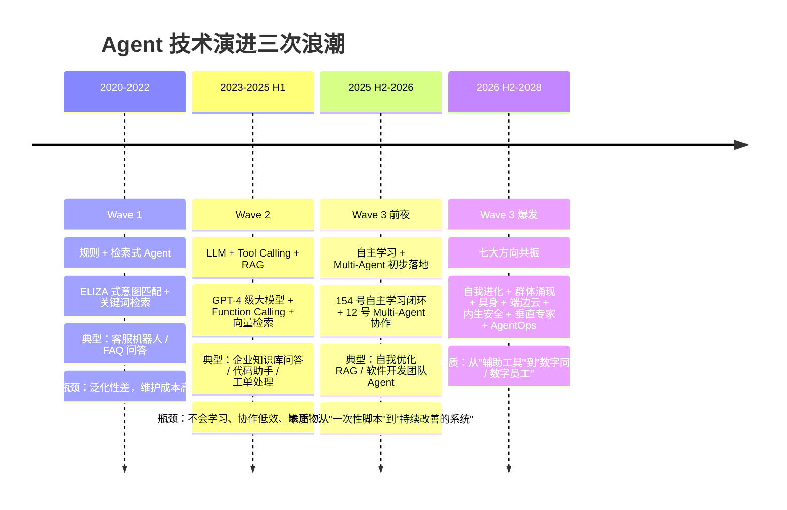
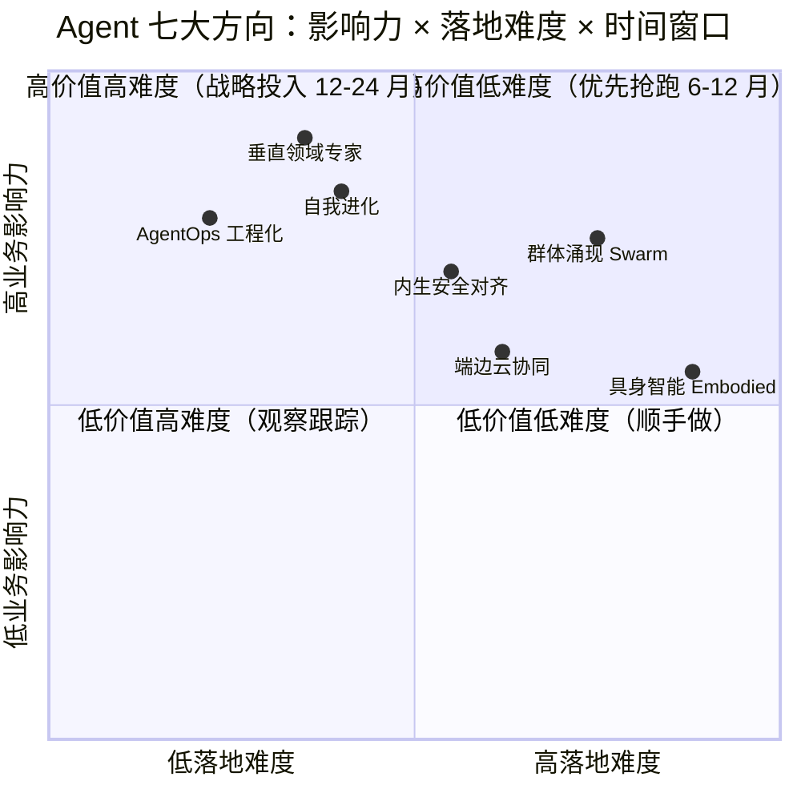
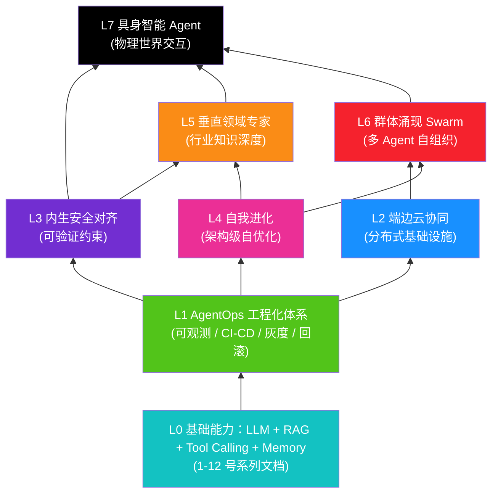
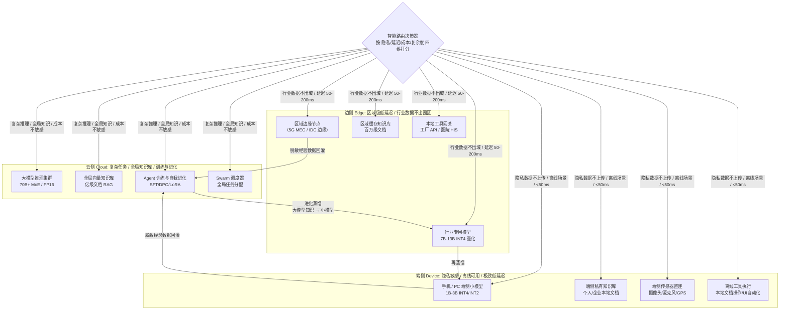
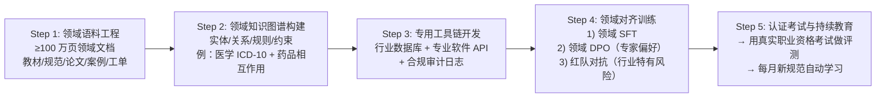
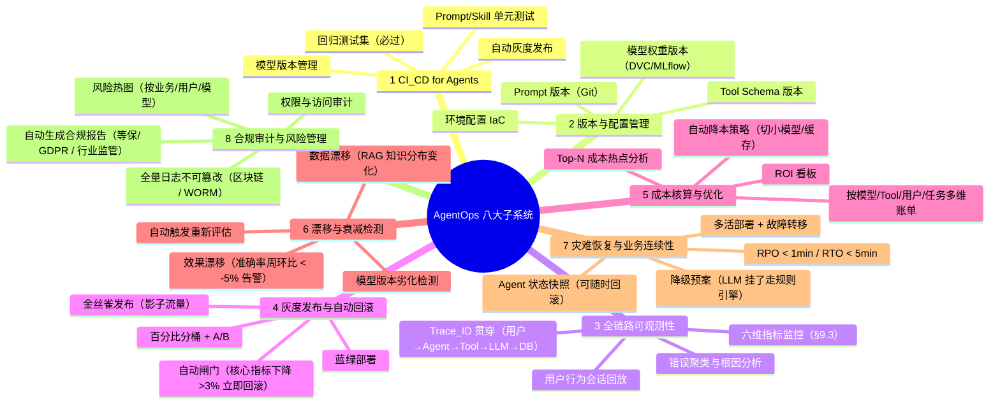
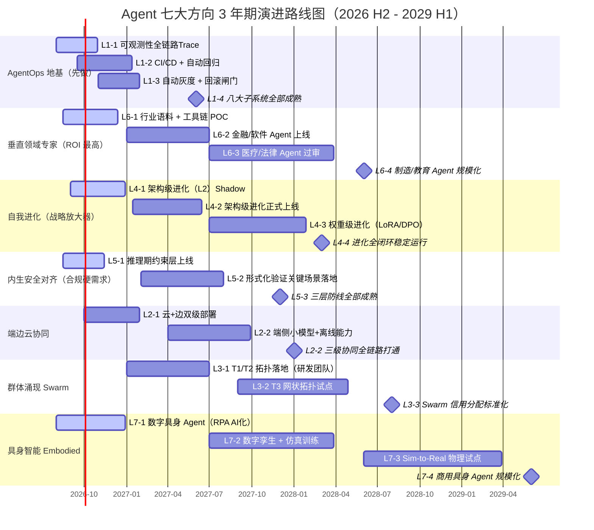

# Agent 未来发展方向全景解析：技术演进、架构趋势与落地路径

> **文档定位**:本文档是 `13项目经验` 系列的**未来展望与战略规划专题篇**。承接 [154 号自主学习功能设计](./154Agent自主学习功能设计与实现完整方案.md)（从"能用"到"越用越好用"），进一步回答：**Agent 技术在未来 6 个月 / 18 个月 / 36 个月将走向何方？哪些方向是确定性趋势、哪些是需要提前布局的高潜力赛道？企业 Agent 系统的技术栈应该如何演进才能避免 1-2 年后的架构性重构？**
>
> **核心交付物**:
> - **Agent 发展三阶段回溯 + 未来拐点判断**（为什么 2026 H2 是"从工具到同事"的质变点）
> - **七大确定性发展方向全景雷达**：自我进化 / 群体涌现 / 具身多模态 / 端边云协同 / 内生安全 / 垂直专家 / AgentOps，每方向含技术路径、挑战与落地优先级
> - **Self-Evolving 三级进化架构**：Prompt/Skill 级 → 架构级 → 权重级，附 `EvolutionOrchestrator` 伪代码
> - **Multi-Agent Swarm 群体智能 4 种拓扑**：流水线 / 层级 / 网状 / 生态型，含任务分配与信用分配算法
> - **具身 Agent 感知-决策-执行闭环架构**：多模态融合 + 世界模型 + 运动控制 + 数字孪生验证
> - **端-边-云三级分布式协同架构**：端侧隐私计算 / 边侧低延迟推理 / 云侧复杂任务调度，含路由决策算法
> - **可验证对齐（Verifiable Alignment）三层防线**：训练期对齐 → 推理期约束 → 运行期形式化验证
> - **垂直领域专家 Agent 构建 5 步法**：领域语料 → 专家知识图谱 → 专用工具链 → SFT/DPO → 认证考试
> - **AgentOps 全生命周期 8 个子系统**：CI/CD + 版本管理 + 可观测性 + 灰度发布 + 成本核算 + 漂移检测 + 灾难恢复 + 合规审计
> - **3 年期技术演进路线图**：6 月 / 18 月 / 36 月里程碑 × 资源投入 × 预期 ROI
> - **落地优先级矩阵**：价值 × 成熟度四象限 + 27 项行动清单

---

## 目录

- [一、Agent 发展三阶段回溯：为什么 2026 H2 是质变拐点](#一agent-发展三阶段回溯为什么-2026-h2-是质变拐点)
- [二、七大发展方向全景雷达：总览与优先级矩阵](#二七大发展方向全景雷达总览与优先级矩阵)
- [三、方向一：从"自主学习"到"自我进化"（Self-Evolving Agents）](#三方向一从自主学习到自我进化self-evolving-agents)
- [四、方向二：从"协作"到"群体涌现"（Multi-Agent Swarm Intelligence）](#四方向二从协作到群体涌现multi-agent-swarm-intelligence)
- [五、方向三：从"数字 Agent"到"具身多模态 Agent"（Embodied AI）](#五方向三从数字-agent到具身多模态agentembodied-ai)
- [六、方向四：从"中心化部署"到"端-边-云协同"（Distributed Hybrid Agents）](#六方向四从中化部署到端-边-云协同distributed-hybrid-agents)
- [七、方向五：从"事后防护"到"内生安全与可验证对齐"（Verifiable Alignment）](#七方向五从事后防护到内生安全与可验证对齐verifiable-alignment)
- [八、方向六：从"通用 Agent"到"垂直领域专家 Agent"（Domain Expert Agents）](#八方向六从通用-agent到垂直领域专家-agentdomain-expert-agents)
- [九、方向七：从"手工运维"到"AgentOps 全生命周期工程化"（Full Lifecycle Automation）](#九方向七从手工运维到agentops-全生命周期工程化full-lifecycle-automation)
- [十、3 年期技术演进路线图：6 月 / 18 月 / 36 月里程碑](#十3-年期技术演进路线图6-月--18-月--36-月里程碑)
- [十一、落地优先级矩阵：价值 × 成熟度四象限决策](#十一落地优先级矩阵价值--成熟度四象限决策)
- [十二、与 `13项目经验` 系列文档的集成关系对照表](#十二与-13项目经验-系列文档的集成关系对照表)
- [十三、交付清单与行动指南](#十三交付清单与行动指南)

---

## 一、Agent 发展三阶段回溯：为什么 2026 H2 是质变拐点

### 1.1 Agent 发展的三次浪潮（技术史视角）



### 1.2 为什么 2026 H2 是质变拐点（五大驱动因素同时达阈值）

| 驱动因素 | 2025 年现状 | 2026 H2 预期阈值 | 质变含义 |
|:--------|:-----------|:----------------|:--------|
| **模型能力** | 开源 70B 接近 GPT-4 80% | 开源 MoE 141B 接近 GPT-4 Turbo 95%，推理成本下降 70% | **通用智能足够便宜**：复杂推理任务不再必须调用闭源 API |
| **自主学习闭环** | 5% 头部企业在试点（154 号方案处于成长期） | 30% 中型企业部署自主学习，平均 +25% 效果提升 | **学习收益正循环**：越用越好用 → 更多数据 → 更好用 |
| **Multi-Agent 稳定性** | 协作成功率 ~65%，易死循环 | 协作成功率 >85%，内置防死循环、信用分配机制 | **团队协作可靠**：Agent Team 可承担端到端业务流程 |
| **工程化体系（AgentOps）** | 可观测性缺口大，靠人工排查 | 全链路 Trace + 自动回归 + 灰度回滚标准化 | **运维不再是瓶颈**：Agent 系统可用性达 99.9% |
| **合规与安全框架** | 监管框架出台中，企业内控混乱 | 《生成式 AI 服务管理办法》细则落地，行业合规标准明确 | **风险可量化可控**：金融/医疗 Agent 可过审上线 |

> **核心结论**：五个驱动因素从"单点突破"进入**"叠加共振"**阶段。Agent 系统将从「成本中心（试点投入）」转变为「利润中心（独立创造价值）」，从「辅助工具」转变为「数字同事」。企业此时不布局，18 个月后面临**技术栈代际差**——类似 2015 年没上云、2020 年没做大模型。

### 1.3 七大方向的相对位置（影响力 × 落地难度 × 时间窗口）



---

## 二、七大发展方向全景雷达：总览与优先级矩阵

### 2.1 七大方向总览表（含技术成熟度、ROI、风险级别）

| # | 发展方向 | 核心定义 | 技术成熟度（TRL 1-9） | 预期 ROI 周期 | 落地优先级 | 关键风险 |
|:-:|:--------|:--------|:--------------------|:------------|:----------|:--------|
| 1 | **自我进化 Self-Evolving** | Agent 不仅学习经验，还能**自主修改自身架构**（增删工具、调整记忆结构、切换模型、甚至重写 Prompt 策略） | TRL 5（实验室验证完成，进入工程化） | 6-12 个月 | ★★★★★ P0 | 进化失控（效果震荡）、可解释性下降 |
| 2 | **群体涌现 Swarm** | Multi-Agent 从"有脚本协作"进化到"无脚本自组织协作"，产生 1+1>2 的群体智能 | TRL 4（实验室原型） | 12-18 个月 | ★★★★ P1 | 协作死循环、信用分配不公、沟通成本爆炸 |
| 3 | **具身多模态 Embodied** | Agent 从纯数字世界延伸到物理世界：视觉/听觉/触觉感知 + 机械臂/机器人/自动驾驶执行 | TRL 3（实验验证阶段） | 24-36 个月 | ★★★ P1-P2 | 硬件成本高、安全责任、仿真→实装 Gap |
| 4 | **端边云协同 Distributed** | Agent 推理与执行不依赖单一云端，而是按隐私/延迟/成本动态路由到端侧/边缘/云端 | TRL 6（试点部署中） | 9-15 个月 | ★★★★ P1 | 一致性保障、跨节点状态同步、隐私泄露 |
| 5 | **内生安全与可验证对齐** | 安全不做外围补丁，而是**内嵌到 Agent 决策回路**：每步动作都通过形式化验证 + 合规约束 | TRL 4-5（理论验证+试点） | 12-18 个月 | ★★★★★ P0（合规强需求） | 过度约束降低能力、规则冲突、对抗样本 |
| 6 | **垂直领域专家 Agent** | 从"什么都懂一点"的通用 Agent，进化为"某个行业比 90% 人类专家强"的垂直专家（医疗/法律/金融/制造） | TRL 5-6（头部行业试点中） | 6-12 个月 | ★★★★★ P0（ROI 最明确） | 领域数据获取难、专家标注贵、责任归属 |
| 7 | **AgentOps 全生命周期工程化** | 把 Agent 系统从"手工搭建的脚本"变成"像数据库/微服务一样标准化运维的基础设施" | TRL 5（工具链快速成熟） | 3-9 个月 | ★★★★★ P0（基础工程能力） | 过度工程化、工具链碎片化、人才缺口 |

### 2.2 七大方向之间的依赖关系（技术栈堆叠顺序）



> **关键启示**：
> 1. **L1 AgentOps 是地基**：没有标准化工程体系，上层所有能力都会"建在沙滩上"——一旦出问题无法排查、无法回滚、无法追责。
> 2. **L4 自我进化是放大器**：它本身不直接产生业务价值，但能让 L2/L3/L5/L6 的学习速度提升 2-5 倍。
> 3. **L7 具身智能是皇冠**：需要下面 6 层全部成熟才能可靠落地，预计 2028 年进入规模化商用。

---

## 三、方向一：从"自主学习"到"自我进化"（Self-Evolving Agents）

> **承接 154 号文档**：154 号实现的是「学习」——Agent 从经验中提取知识（Prompt、Skill、负例）。**自我进化**在此基础上再跨一步：Agent 能够**自主修改自身的架构和运行策略**。

### 3.1 三级进化金字塔（从浅到深）

```mermaid
flowchart TB
    subgraph Level 3: 权重级进化（最激进，月度/季度）
        W1["DPO 偏好对齐训练<br/>用成功轨迹做偏好学习"]
        W2["LoRA-SFT 小样本微调<br/>用合成数据微调领域能力"]
        W3["架构搜索 NAS-for-Agent<br/>自动搜索最优记忆层数/注意力头数"]
    end
    subgraph Level 2: 架构级进化（周度）
        A1["工具链自增删：<br/>发现重复手动操作 → 自动封装新 Tool"]
        A2["记忆结构自适应：<br/>长对话增多 → 自动升级分层记忆"]
        A3["模型动态切换：<br/>简单任务用小模型，复杂任务切大模型"]
        A4["Prompt 策略重写：<br/>自动 A/B 测试 N 种策略，选最优"]
    end
    subgraph Level 1: 知识级进化（日度/实时）—— 154 号已覆盖
        K1["Prompt 模板优化库"]
        K2["Skill-RAG 查询改写/路由"]
        K3["错误模式库 + 规避策略"]
        K4["用户偏好画像更新"]
    end

    Level1 -- 日度积累，触发条件达成 --> Level2
    Level2 -- 周度验证，数据量达阈值 --> Level3
    Level3 -- 权重升级回灌 --> Level1 & Level2

    style Level1 fill:#52c41a
    style Level2 fill:#1890ff
    style Level3 fill:#722ed1
```

### 3.2 架构级进化的 4 个触发条件（防失控闸门）

| 进化类型 | 触发条件（必须同时满足） | 回滚闸门 |
|:--------|:------------------------|:--------|
| **新增工具** | ① 同类型手动操作 ≥20 次 ② 封装后预估成功率 ≥85% ③ 人工审核闸门通过（HITL） | 新工具前 100 次调用走 Shadow Mode（只记录不执行），失败率 >5% 立即下线 |
| **记忆结构升级** | ① 当前记忆命中率下降 >15% ② 新结构离线仿真测试召回提升 ≥10% | 新旧结构 A/B 分桶 7 天，任何指标劣化 >3% 回滚 |
| **模型动态切换** | ① 小模型在相似任务上准确率与大模型差距 <5% ② 成本下降 >30% ③ 延迟 P99 不劣化 | 切换后 24h 全量回归，任何核心指标下降立即回切 |
| **Prompt 策略重写** | ① 策略池 ≥5 种 ② A/B 测试样本量 ≥1000 ③ 新策略显著性 p<0.01 | 每小时抽样 1% 流量回灌基线策略，效果下降立即触发回滚 |

### 3.3 核心实现：`EvolutionOrchestrator` 伪代码（扩展 154 号 `SelfLearningOrchestrator`）

```python
from typing import Dict, List, Optional
from dataclasses import dataclass
from enum import Enum
import hashlib, json, logging

LOG = logging.getLogger("EvoOrch")

class EvolutionLevel(Enum):
    KNOWLEDGE = 1   # L1 知识级（154号已覆盖）
    ARCHITECTURE = 2  # L2 架构级
    WEIGHT = 3        # L3 权重级

@dataclass
class EvolutionTrigger:
    level: EvolutionLevel
    metric: str           # "tool_repeat_count" "memory_hit_rate" ...
    current_value: float
    threshold: float
    evidence: dict        # 触发的原始证据（可追溯）

@dataclass
class EvolutionProposal:
    id: str
    level: EvolutionLevel
    change_type: str      # "add_tool" "switch_model" "lora_sft" ...
    change_spec: dict     # 具体变更内容
    expected_impact: dict  # 预期：{acc: +x%, cost: -y%, latency: +z ms}
    risk_score: float     # 0-10
    requires_human_audit: bool

class EvolutionOrchestrator:
    """
    在 154 号 SelfLearningOrchestrator 基础上，增加 L2/L3 进化能力。
    
    用法:
    >>> orch = EvolutionOrchestrator(base_agent, audit_callback=human_audit_gate)
    >>> orch.run_evolution_cycle()  # 每小时跑一次
    """

    def __init__(self, base_agent, audit_callback=None):
        self.agent = base_agent
        self.audit = audit_callback or (lambda prop: True)  # 默认过审，生产必须替换
        self.proposal_history: List[EvolutionProposal] = []
        self.shadow_mode = set()  # 正在 Shadow Mode 观察的变更

    # ---------------- 主循环 ----------------
    def run_evolution_cycle(self):
        # Step 1: 检测触发信号（从指标库/日志中拉取）
        triggers = self._detect_triggers()
        if not triggers:
            LOG.info("No evolution triggers this cycle.")
            return

        # Step 2: 为每个触发生成进化提案
        for t in triggers:
            proposal = self._generate_proposal(t)
            if not proposal:
                continue
            # Step 3: 风险评估 + 人工闸门
            if proposal.requires_human_audit and not self.audit(proposal):
                LOG.warning(f"Proposal {proposal.id} rejected by human audit.")
                continue
            # Step 4: 低风险先走 Shadow Mode，高风险直接 A/B
            if proposal.risk_score >= 7:
                self._deploy_ab_test(proposal, bucket_pct=1, duration_days=7)
            else:
                self._deploy_shadow_mode(proposal, observation_count=100)

    # ---------------- L2 架构级：工具自动封装示例 ----------------
    def _propose_add_tool(self, trigger: EvolutionTrigger) -> Optional[EvolutionProposal]:
        """
        发现用户或 Agent 反复执行同一序列操作 → 自动封装成新 Tool。
        例：反复调用「查订单 → 调退款 API → 发通知邮件」→ 封装成 `fast_refund(order_id)`
        """
        repeated_seq = trigger.evidence["top_repeated_sequence"]
        # 用 LLM 自动生成 Tool Schema + 实现代码（走 Sandbox 沙箱验证）
        tool_code, tool_schema = self._llm_generate_tool(repeated_seq)
        if not self._sandbox_validate(tool_code, tool_schema):
            return None
        return EvolutionProposal(
            id=hashlib.md5(json.dumps(repeated_seq).encode()).hexdigest()[:12],
            level=EvolutionLevel.ARCHITECTURE,
            change_type="add_tool",
            change_spec={"schema": tool_schema, "code": tool_code, "source_seq": repeated_seq},
            expected_impact={"latency_ms": -200, "success_rate": +0.05, "cost_per_call": -0.03},
            risk_score=5,
            requires_human_audit=True,  # 新增代码必须人审
        )

    # ---------------- 进化安全：Shadow Mode + A/B 双验证 ----------------
    def _deploy_shadow_mode(self, proposal, observation_count=100):
        """变更只记录不生效，观察 N 次后决定是否真正启用。"""
        self.shadow_mode.add(proposal.id)
        LOG.info(f"Shadow mode start for {proposal.id}, target {observation_count} observations.")
        # 真实执行流程中，每遇到匹配场景就跑一次变更逻辑，对比与旧逻辑的 Diff

    def _deploy_ab_test(self, proposal, bucket_pct=1, duration_days=7):
        """真正生效 1% 流量，7 天后用 148 号 §6.2 的显著性检验判断是否全量。"""
        from stats_tests import paired_bootstrap_significance  # 148号方案
        # A/B 分桶逻辑（略）
```

### 3.4 落地风险与反模式

| 反模式 | 现象 | 规避方案 |
|:------|:-----|:--------|
| **进化震荡** | Agent 反复在两种架构间切换（今天加工具明天删） | 引入「进化冷却期」：同一维度进化后 7 天内不再反向进化 |
| **过度复杂化** | Agent 工具数量爆炸，从 10 个涨到 200 个，路由混乱 | 工具生命周期管理：90 天未调用的工具自动归档 + 工具聚类合并 |
| **黑盒化失控** | 进化后效果提升但没人知道为什么，出问题无法定位 | 强制「进化可追溯」：每次进化的提案 ID → 证据 → 审核人 → 观察数据 → 效果，全部写入不可篡改的进化日志 |
| **人类被边缘化** | 进化闸门形同虚设，Agent 越来越"任性" | 三重权限控制：① 关键进化必须 HITL ② 进化速率上限（每月架构变更 ≤3 次）③ 紧急一键回退到「进化冻结模式」 |

---

## 四、方向二：从"协作"到"群体涌现"（Multi-Agent Swarm Intelligence）

> **承接 12 号 Multi-Agent 文档**：现有 Multi-Agent 是「**导演模式**」——人写好角色、协作流程、调度规则，Agent 按剧本走。**Swarm 群体智能**是「**生态模式**」——只定义目标和规则，Agent 自组织分工、协商、协作，产生超出预设的涌现行为。

### 4.1 Swarm 四种协作拓扑（从简单到复杂）

```mermaid
flowchart LR
    subgraph T1 流水线型 Pipeline Swarm
        A1["研究员 Agent"] --> A2["分析师 Agent"]
        A2 --> A3["写作 Agent"]
        A3 --> A4["审校 Agent"]
    end
    subgraph T2 层级型 Hierarchical Swarm
        PM["项目经理 Agent"] --> Dev1["前端 Agent"]
        PM --> Dev2["后端 Agent"]
        PM --> QA["测试 Agent"]
        Dev1 --> QA
        Dev2 --> QA
    end
    subgraph T3 网状型 Mesh Swarm
        X1["Agent A"] <--> X2["Agent B"]
        X1 <--> X3["Agent C"]
        X2 <--> X3
        X2 <--> X4["Agent D"]
        X3 <--> X4
    end
    subgraph T4 生态型 Ecosystem Swarm（终极形态）
        ENV["共享环境 + 资源池<br/>(Memory/Tool/Dataset/算力)"]
        E1["自由 Agent 1<br/>可繁殖/可消亡"]
        E2["自由 Agent 2"]
        E3["自由 Agent 3"]
        En["..."]
        E1 --> ENV
        E2 --> ENV
        E3 --> ENV
        En --> ENV
    end
```

| 拓扑类型 | 适用场景 | 涌现强度 | 可控性 | 落地时间窗 |
|:--------|:---------|:--------|:-------|:----------|
| T1 流水线型 | 标准化业务流程（报销/工单/报告） | ★☆☆ | ★★★★★ | 现在即可 |
| T2 层级型 | 软件开发/项目型任务 | ★★☆ | ★★★★ | 2026 H2 |
| T3 网状型 | 开放式创新/头脑风暴/复杂问题求解 | ★★★★ | ★★☆ | 2027 H1 |
| T4 生态型 | 科学发现/元学习/全自动运营 | ★★★★★ | ★☆☆ | 2028+ |

### 4.2 Swarm 三大核心算法（避免协作死循环的关键）

#### 算法 1：任务动态分配（Contract Net Protocol 升级版）

```python
from typing import List, Dict
import numpy as np

class TaskAllocator:
    """基于「能力匹配度 + 当前负载 + 历史信用」三维打分的任务招标算法。"""

    def allocate(self, task_desc: str, agents: List[dict]) -> str:
        """
        agents[i] = {"id": str, "skills": List[str], "current_load": float 0-1,
                     "credit_score": float 0-1, "history_success": Dict[task_type, float]}
        返回：中标的 agent_id
        """
        scores = {}
        for a in agents:
            # 维度1：能力语义匹配度（用 Embedding 余弦相似度）
            skill_match = self._embedding_similarity(task_desc, " ".join(a["skills"]))
            # 维度2：负载惩罚（负载越高越不接新任务）
            load_penalty = 1.0 - a["current_load"]
            # 维度3：历史信用（做过类似任务且成功的优先）
            credit = a.get("credit_score", 0.5)
            # 加权求和（权重可配置）
            scores[a["id"]] = (0.45 * skill_match
                               + 0.25 * load_penalty
                               + 0.30 * credit)
        # 返回最高分，但要确保 > 阈值 0.5，否则退回人工分配
        best = max(scores, key=scores.get)
        return best if scores[best] >= 0.5 else "__human_allocation__"
```

#### 算法 2：信用分配（解决「谁贡献大、谁背锅」问题）

```python
class CreditAssigner:
    """
    多 Agent 完成一个任务后，把最终的「任务成败分数」反分到每个参与 Agent。
    核心思想：Shapley Value（合作博弈论）—— 逐个去掉一个 Agent，看分数下降多少就是它的边际贡献。
    """

    def shapley_credit(self, task_result: float, agent_contributions: Dict[str, List[float]]) -> Dict[str, float]:
        """
        agent_contributions: {"agent_a": [0.8, 0.7, ...], "agent_b": [...]}
          每个值是「去掉该 Agent 后任务成功率的蒙特卡洛模拟结果」
        返回：每个 Agent 的信用分 0-1，加和 ≈ task_result
        """
        credits = {}
        baseline = task_result
        for aid, sim_results in agent_contributions.items():
            # Shapley 近似：baseline - 去掉该 Agent 后的平均成功率
            marginal = baseline - np.mean(sim_results)
            credits[aid] = max(0.0, marginal)
        # 归一化
        total = sum(credits.values()) or 1e-9
        return {k: v / total for k, v in credits.items()}
```

#### 算法 3：死循环检测与破局

```python
class DeadLoopBreaker:
    """
    检测 Swarm 中的死循环模式：
      - 同一条消息在 2 个 Agent 间来回转发 ≥3 次
      - 同一任务状态 30 分钟未推进
      - 计划 → 评审 → 推翻 → 再计划 循环 ≥3 轮
    """

    def detect_and_break(self, conversation_history, task_state_timeline, timeout_min=30):
        # 模式1: 乒乓转发
        pairs = {}
        for msg in conversation_history[-50:]:
            pair = tuple(sorted([msg["from"], msg["to"]]))
            pairs[pair] = pairs.get(pair, 0) + 1
        for pair, cnt in pairs.items():
            if cnt >= 3 and pair[0] != pair[1]:
                return {"break_type": "pingpong", "involved": pair,
                        "action": "引入第三方裁判 Agent 做决策"}
        # 模式2: 状态超时
        if len(task_state_timeline) >= 2:
            last_change = task_state_timeline[-1]["ts"]
            if (time.time() - last_change) / 60 >= timeout_min:
                return {"break_type": "timeout",
                        "action": "升级到监督者 Agent / 人工介入"}
        return {"break_type": "none"}
```

### 4.3 群体涌现的典型场景（2026-2027 年落地）

| 场景 | 描述 | 预期收益 | 技术路线 |
|:----|:-----|:---------|:---------|
| **全自动软件开发团队 Swarm** | PM + Frontend + Backend + QA + DevOps 5 类 Agent 自组织完成一个完整微服务 | 开发周期从 4 周 → 1 周，人力成本 -70% | T2 层级型 + 信用分配 + 148 号离线/在线评估 |
| **开放式科研探索 Swarm** | 20-50 个领域 Agent 自主查论文、提假设、设计实验、写代码验证 | 新假设产出速度 5-10 倍于人类团队 | T3 网状型 + 文献检索工具 + 实验沙箱 |
| **实时内容运营 Swarm** | 100+ 垂直内容 Agent（体育/财经/娱乐）根据热点自动生成、分发、A/B 优化内容 | 内容产出 +200%，点击率 +30% | T1 + T2 混合 + 自我进化（Prompt/模型自动切换） |

---

## 五、方向三：从"数字 Agent"到"具身多模态 Agent"（Embodied AI）

> **定义**：具身 Agent = **多模态感知（视觉/听觉/触觉/激光雷达）** + **物理世界理解（世界模型）** + **决策规划** + **运动控制执行（机械臂/机器人/无人机/自动驾驶车）**。

### 5.1 具身 Agent 闭环架构

```mermaid
flowchart LR
    subgraph 感知层 Perception
        CAM["视觉摄像头×3<br/>RGB + 深度"]
        MIC["麦克风阵列<br/>3D 空间音频"]
        TAC["触觉传感器阵列<br/>指尖/关节"]
        LIDAR["激光雷达<br/>3D 点云"]
    end
    subgraph 融合与理解层 Fusion + World Model
        MF["多模态时序融合<br/>Transformer × 时序 Attention"]
        WM["世界模型 World Model<br/>预测未来 N 步的状态"]
        SC["场景理解<br/>物体检测/分割/关系/可交互性"]
    end
    subgraph 决策与规划层 Decision
        TASK["任务级规划<br/>LLM + 任务树分解"]
        MOTION["运动级规划<br/>MPC / 扩散策略 / RL"]
        SAFE["安全约束层<br/>实时碰撞检测 + 急停"]
    end
    subgraph 执行层 Actuation
        ARM["6 轴机械臂 / 灵巧手"]
        MOB["移动底盘<br/>轮式 / 四足 / 无人机"]
        IO["数字 I/O<br/>开关/按钮/屏幕触控"]
    end
    subgraph 数字孪生验证层 Digital Twin（必加安全层）
        SIM["Gazebo / Isaac Sim / MuJoCo<br/>物理仿真环境"]
        VAL["虚实一致性验证<br/>SIM 与真实误差 ≤ 阈值才执行"]
    end

    CAM & MIC & TAC & LIDAR --> MF
    MF --> SC & WM
    SC & WM --> TASK
    TASK --> MOTION --> SAFE
    SAFE --> SIM  --> VAL --> ARM & MOB & IO
    ARM & MOB & IO -->|真实反馈| CAM & MIC & TAC & LIDAR
```

### 5.2 落地的三条渐进路径（避免一上来就做硬件）

| 路径 | 说明 | 时间窗 | 投入成本 | 代表案例 |
|:----|:-----|:-------|:---------|:---------|
| **路径 1：数字具身（纯软件）** | Agent 在「数字世界」具备「具身感知力」：能看截图操作 UI、能操作 Excel/PPT、能控制浏览器/桌面，本质是「软件机器人 RPA 的 AI 化」 | **现在即可落地** | 低（纯软件） | UiPath AI Agent / 自动化测试 Agent / 运营自动化 |
| **路径 2：虚实结合 + 数字孪生先行** | 先在仿真环境中训练 100 万小时，再 Sim-to-Real 迁移到真实机器人；真实环境每步操作都先在孪生环境中验证 | 2026 H2 - 2027 | 中（仿真许可 + 中低档机器人） | 工厂巡检 Agent / 仓储拣货 Agent |
| **路径 3：全物理具身** | 高端人形机器人 / 自动驾驶 / 医疗手术机器人，具备完整的多模态感知与高精度执行 | 2028+ | 极高（硬件 + 算法 + 合规） | Tesla Optimus / Figure / 达芬奇手术 Agent |

### 5.3 路径 1「数字具身 Agent」工程化实现要点（最具现实价值，立即可以做）

```python
class DigitalEmbodiedAgent:
    """
    数字具身 Agent = 「眼睛（截图OCR+UI理解）+ 手（键鼠/API操作）+ 大脑（LLM规划）」。
    这是未来 12 个月 ROI 最高的具身落地形式。
    """

    def __init__(self, llm_client, screenshot_tool, input_controller):
        self.llm = llm_client
        self.eye = screenshot_tool      # 定时截图 + OCR + UI 元素检测（按钮/输入框/菜单）
        self.hand = input_controller    # 鼠标点击/键盘输入/拖拽
        self.state_history = []

    def run_task(self, goal: str, max_steps=20):
        """例：goal = "把这份 Excel 的第 3 列乘以 1.2 后生成柱状图，保存到桌面" """
        for step in range(max_steps):
            # 1. 感知当前数字世界状态
            screenshot, ui_elements = self.eye.capture()
            # 2. 让 LLM 决策下一个动作（点击/输入/快捷键/等待）
            action = self.llm.decide_next_action(
                goal=goal, history=self.state_history[-5:],
                current_screen=ui_elements,
                action_schema=[
                    {"type": "click", "target": "按钮/坐标", "reason": "..."},
                    {"type": "type", "text": "...", "target": "输入框"},
                    {"type": "hotkey", "key": "Ctrl+S"},
                    {"type": "wait", "seconds": 2},
                    {"type": "done", "summary": "任务完成说明"}
                ]
            )
            # 3. 安全检查：是否点到了危险区域（删除按钮/转账确认）
            if not self._safety_check(action):
                return {"status": "blocked", "reason": "安全拦截"}
            # 4. 执行动作 → 记录状态
            obs = self.hand.execute(action)
            self.state_history.append({"step": step, "action": action, "obs": obs})
            if action["type"] == "done":
                return {"status": "success", "steps": step + 1, "summary": action["summary"]}
        return {"status": "timeout", "history": self.state_history}
```

> **与 RPA 的本质区别**：传统 RPA 是「死脚本」，页面改一点就崩；数字具身 Agent 是「理解意图 + 自适应操作」，页面改版、流程变化都能自主适应。

---

## 六、方向四：从"中心化部署"到"端-边-云协同"（Distributed Hybrid Agents）

> **驱动因素**：① 隐私合规（医疗/金融数据不能出域）② 低延迟场景（自动驾驶/AR/VR 需要 <50ms）③ 成本（端侧推理比云端便宜 90%）④ 可靠性（断网时端侧也能工作）。

### 6.1 三级协同架构全景



### 6.2 四维路由决策算法（核心是 6 个阈值判断 + 兜底）

```python
from enum import Enum
from dataclasses import dataclass

class DeployTier(Enum):
    DEVICE = "device"
    EDGE = "edge"
    CLOUD = "cloud"

@dataclass
class RoutingPolicy:
    # 四维阈值，可按业务场景配置
    privacy_required: bool = False       # 包含 PII/PHI → 强制端侧
    max_latency_ms: int = 1000           # 端 <50, 边 <200, 云 <1000
    max_cost_per_1k_tokens: float = 0.05 # 端≈0, 边≈0.01, 云≈0.03
    min_model_capability: float = 0.7    # 任务复杂度评分 0-1，>0.8 必须云

class HybridRouter:
    def __init__(self, policy: RoutingPolicy, tier_capabilities: dict):
        self.p = policy
        self.tier_cap = tier_capabilities  # {"device": 0.5, "edge": 0.75, "cloud": 0.95}

    def route(self, task_desc: str, task_meta: dict) -> DeployTier:
        """返回应该在哪一层执行任务。"""
        # 规则 1：隐私硬约束（最高优先级）
        if self.p.privacy_required or task_meta.get("contains_pii"):
            return DeployTier.DEVICE
        # 规则 2：极短延迟硬约束
        latency_req = task_meta.get("max_latency_ms", self.p.max_latency_ms)
        if latency_req <= 50:
            return DeployTier.DEVICE
        if latency_req <= 200:
            # 端侧能力够就端侧，否则边侧
            if self._estimate_capability(task_desc) <= self.tier_cap["device"]:
                return DeployTier.DEVICE
            return DeployTier.EDGE
        # 规则 3：任务复杂度判断
        complexity = self._estimate_capability(task_desc)
        if complexity >= self.p.min_model_capability or complexity >= self.tier_cap["cloud"]:
            return DeployTier.CLOUD
        if complexity >= self.tier_cap["edge"]:
            return DeployTier.EDGE
        # 规则 4：成本兜底 → 端侧优先
        return DeployTier.DEVICE

    def _estimate_capability(self, task_desc: str) -> float:
        """用小分类模型预估任务需要的能力门槛 0-1。"""
        # 简单实现：关键词打分（生产用微调分类器）
        hard_keywords = ["推理", "证明", "代码生成", "SQL", "复杂分析", "跨文档综合"]
        score = 0.3 + 0.1 * sum(1 for kw in hard_keywords if kw in task_desc)
        return min(0.98, score)
```

### 6.3 关键技术挑战与应对

| 挑战 | 核心问题 | 应对方案 |
|:----|:---------|:---------|
| **跨层状态一致性** | 端侧改了记忆，云端/边侧如何同步？ | 事件溯源（Event Sourcing）+ CRDT 无冲突数据类型 + 最终一致性（SLA < 1s） |
| **知识蒸馏链损失** | 云→边→端三次蒸馏，能力损失严重 | 增量蒸馏 + 动态路由 + 按需回源（端侧答不出自动跳边/云） |
| **隐私泄露风险** | 脱敏后的经验数据回灌时泄露 | 差分隐私加噪 + 联邦学习 + 同态加密（3 层安全按敏感度选） |
| **离线-在线切换** | 断网时端侧工作，联网后如何合并冲突 | 操作日志自动 merge + 业务规则冲突检测 + 人工审核队列 |

---

## 七、方向五：从"事后防护"到"内生安全与可验证对齐"（Verifiable Alignment）

> **背景**：现有 Agent 安全是「创可贴模式」——外面套一层 Guardrails、加一层敏感词过滤。问题是：① 绕过成本极低（Prompt Injection）② 检测是事后的（已经泄露了才发现）③ 与能力冲突（加安全 → 能力下降 10-20%）。
>
> **内生安全的核心**：**安全不是外挂，而是 Agent 决策回路的一部分。每一步决策都通过约束验证，输出的每一个动作都是可证明安全合规的。**

### 7.1 三层可验证对齐防线

```mermaid
flowchart TD
    subgraph Layer 3 运行期形式化验证 Runtime Formal Verification（秒级）
        R1["每步动作生成前<br/>用一阶逻辑 + 业务规则验证"]
        R2["动作执行前<br/>沙箱模拟 + 后果预测"]
        R3["输出内容<br/>差分隐私/脱敏自动注入"]
        R4["异常行为<br/>实时熔断 + 审计事件"]
    end
    subgraph Layer 2 推理期约束对齐 Inference-time Constrained Decoding（毫秒级）
        I1["Constrained Beam Search<br/>只在合法 Token 空间中采样"]
        I2["CFG / Regex 约束解码<br/>输出格式必然合规"]
        I3["LLM-as-a-Judge 实时评审<br/>每段生成内容自动打分"]
        I4["反射式安全自检<br/>生成 → 自检 → 修改 → 再输出"]
    end
    subgraph Layer 1 训练期权重级对齐 Weight-level Alignment（离线）
        T1["SFT 安全指令微调<br/>（学习"应该怎么做"）"]
        T2["DPO/PPO 偏好对齐<br/>（学习"什么是好答案"）"]
        T3["红队对抗训练<br/>（学习"如何拒绝恶意请求"）"]
        T4["宪法 AI Constitutional AI<br/>（学习高阶伦理原则）"]
    end

    T1 & T2 & T3 & T4 -->|训练出"安全基础模型"| I1 & I2 & I3 & I4
    I1 & I2 & I3 & I4 -->|输出候选动作| R1 & R2 & R3 & R4
    R1 & R2 & R3 & R4 -->|仅安全合规模的动作| EXE["外部执行 / 用户可见输出"]
```

### 7.2 Layer 2 关键：约束解码 + 反射自检的工程化代码

```python
class InferenceSafetyLayer:
    """
    推理期安全层：
    1) 用 CFG/Regex 强制输出格式合规（不会输出非法 JSON/XML）
    2) 输出必经 LLM-Judge 安全评审，不合规就重写（最多 3 次）
    """

    def __init__(self, llm_client, safety_judge, max_rewrite=3):
        self.llm = llm_client
        self.judge = safety_judge
        self.max_r = max_rewrite

    def safe_generate(self, prompt: str, output_schema: dict, safety_policy: dict) -> dict:
        for attempt in range(self.max_r):
            # Step 1: 带格式约束的生成（用 outlines / lm-format-enforcer / JSON mode）
            raw = self.llm.generate_constrained(prompt, schema=output_schema)
            # Step 2: 安全评审（Judge LLM 返回 0-1，0.7 以下不安全）
            safety_score, reasons = self.judge.evaluate(raw, policy=safety_policy)
            if safety_score >= 0.7:
                return {"status": "safe", "output": raw,
                        "safety_score": safety_score, "attempts": attempt + 1}
            # Step 3: 不安全，给修改建议让它重写
            revise_prompt = f"原始输出:\n{raw}\n安全问题:{reasons}\n请重写以符合安全规范。"
            prompt = revise_prompt
        # 超过重试次数 → 拒答 + 审计
        return {"status": "blocked", "reason": "safety_rewrite_exhausted", "audit": True}
```

### 7.3 Layer 3 关键：运行期形式化验证（金融/医疗 Agent 必备）

```python
from pysmt.shortcuts import Symbol, And, Or, Not, LE, GE, Int, REAL, is_sat
from typing import List

class RuntimeVerifier:
    """
    用 SMT（可满足性模理论）形式化验证 Agent 动作是否违反业务规则。
    例：金融 Agent「转账」动作必须满足：
      - 金额 <= 余额
      - 金额 <= 单笔限额
      - 收款人不在黑名单
      - 24h 累计 <= 日限额
    """

    def verify_transfer_action(self, action: dict, context: dict) -> dict:
        amount = Symbol("amount", REAL)
        balance = Symbol("balance", REAL)
        limit_once = Symbol("limit_once", REAL)
        limit_daily = Symbol("limit_daily", REAL)
        daily_sum = Symbol("daily_sum", REAL)
        receiver_blacklisted = Symbol("receiver_blacklisted")

        # 业务规则（硬编码或从合规系统加载）
        rules = And(
            LE(amount, balance),                     # 余额够
            LE(amount, limit_once),                  # 单笔限额
            LE(amount + daily_sum, limit_daily),     # 日限额
            Not(receiver_blacklisted)                # 非黑名单
        )
        # 把当前动作的值代入
        model = {
            amount: float(action["amount"]),
            balance: float(context["user_balance"]),
            limit_once: 50000.0,
            limit_daily: 200000.0,
            daily_sum: float(context.get("today_sum", 0)),
            receiver_blacklisted: action["receiver"] in context["blacklist"]
        }
        # 验证是否满足所有规则
        violation = []
        for v, val in model.items():
            if not is_sat(And(rules, v.Equals(val))):
                violation.append(f"规则违反: {v.symbol_name()} = {val}")
        return {"passed": len(violation) == 0, "violations": violation}
```

---

## 八、方向六：从"通用 Agent"到"垂直领域专家 Agent"（Domain Expert Agents）

> **核心观点**：通用 Agent 是「瑞士军刀」——什么都能做一点，但做外科手术、打官司、算模型、开药方它不行。未来 18 个月 ROI 最高的方向就是**把通用 Agent 改造为某个垂直领域的专家级 Agent**，做到「领域内 PK 掉 90% 的人类初级/中级专家」。

### 8.1 垂直专家 Agent 构建 5 步法（落地路径）



### 8.2 六大垂直领域的能力矩阵与落地优先级

| 垂直领域 | 行业痛点 | 专家 Agent 核心价值 | 领域特有评测标准 | 落地优先级 | 预计 2027 渗透率 |
|:--------|:---------|:------------------|:----------------|:----------|:----------------|
| **医疗健康** | 医生缺口大、基层误诊率高、病例整理耗时 | 辅助诊断 + 病历撰写 + 用药审查 + 患者随访 | 国家医师资格考试通过率 ≥85% / 诊断准确率 vs 三甲主治 ≥90% / 用药冲突漏检率 0% | ★★★★★ P0（强需求 + 高价值） | 25-30% |
| **金融服务** | 合规要求高、研报生产慢、风控审核繁琐 | 智能投研 + 合规审查 + 风控模型 + 理赔审核 | 证券/基金从业考试 ≥90% / 合规漏检率 <0.1% / 研报准确度 vs 分析师 | ★★★★★ P0 | 30-40% |
| **法律法务** | 律师成本高、合同审查漏项、判例检索耗时 | 合同审查 + 法律检索 + 诉状生成 + 合规建议 | 司法考试通过率 ≥80% / 合同风险漏检率 <1% / 判例相关度 P@5 ≥90% | ★★★★ P1 | 20-25% |
| **制造业** | 工艺经验靠老师傅传承、排产效率低、设备故障诊断慢 | 工艺专家 + 排产优化 + 设备诊断 + 质量检测 | 工艺参数推荐准确率 ≥95% / 排产效率 +15% / 故障漏报率 <0.5% | ★★★★ P1 | 15-20% |
| **教育培训** | 个性化辅导缺师资、批改作业耗时、因材施教难 | 一对一私教 + 作业自动批改 + 学习路径规划 | 学科考试得分率 ≥90% / 学生提分幅度 vs 人类老师 +20% / 幻觉率 <1% | ★★★ P1-P2 | 30-40% |
| **软件工程** | 代码 Review 人手不足、Bug 定位慢、技术选型难 | Code Review Agent + 故障排查专家 + 架构师顾问 | 代码 Bug 检出率 ≥70% / 平均修复时间 -40% / 架构建议采纳率 ≥60% | ★★★★ P1 | 35-45% |

### 8.3 医疗专家 Agent 最小实现示例（体现垂直化差异）

```python
class MedicalExpertAgent:
    """垂直化差异点：通用 Agent 没有的三层强约束。"""

    def __init__(self, llm, rag_medical, drug_interaction_db, icd10_kg, auditor):
        self.llm = llm
        self.rag = rag_medical              # Step 1: 医学文献 RAG（≥500 万篇）
        self.drug_db = drug_interaction_db  # Step 2: 药品相互作用知识图谱
        self.icd10 = icd10_kg               # ICD-10 诊断编码与鉴别诊断树
        self.audit = auditor                # Step 3: 合规审计（每步不可篡改日志）

    def diagnose_and_prescribe(self, patient_case: dict) -> dict:
        # 垂直差异 1: 鉴别诊断流程（必须按医学 SOP 枚举 ≥3 个可能诊断 + 排除依据）
        diagnoses = self._differential_diagnosis(patient_case)
        # 垂直差异 2: 用药方案必须经过药品相互作用检查（PIM + CYP450 酶代谢）
        prescriptions = []
        for d in diagnoses:
            rx = self._generate_prescription(d, patient_case)
            rx_check = self.drug_db.check_interactions(rx, patient_case["current_meds"])
            if rx_check["severity"] != "none":
                rx = self._adjust_prescription(rx, rx_check)
            prescriptions.append(rx)
        # 垂直差异 3: 必须输出 ICD-10 编码 + 证据引用 + 风险提示 + 建议复诊
        result = {
            "diagnoses": [{"icd10": d["code"], "name": d["name"],
                           "evidence": d["evidence_refs"],  # 必须指向具体文献/指南
                           "confidence": d["conf"]} for d in diagnoses],
            "prescriptions": prescriptions,
            "warnings": self._generate_warnings(patient_case),
            "follow_up": self._follow_up_plan(patient_case),
            "disclaimer": "本建议为辅助参考，最终诊疗决策须由执业医师确认。",
        }
        # 垂直差异 4: 全链路不可篡改审计日志（合规要求）
        self.audit.log("medical_advice", patient_id=patient_case["id"], result_hash=hash(result))
        return result
```

---

## 九、方向七：从"手工运维"到"AgentOps 全生命周期工程化"（Full Lifecycle Automation）

> **本质**：把 Agent 系统的运维做到和今天的「微服务」「数据库」一样成熟和标准化。现在的 Agent 运维水平 ≈ 2010 年的互联网后端（靠 SSH 登机器改代码、靠人肉看日志排查问题）。AgentOps 就是把 DevOps/MLOps 的方法论**针对 Agent 的特点**重构一遍。

### 9.1 AgentOps 八大子系统全景（覆盖从开发到退役的全生命周期）



### 9.2 子系统 3：全链路 Trace 的标准 Schema（Agent 特有 7 个 Span）

```json
{
  "trace_id": "agt_abc123xyz",
  "spans": [
    {"span_id": "s1", "name": "user_request",      "ts": "...", "attrs": {"user_id": "U123", "session_id": "S456", "input": "...", "channel": "web"}},
    {"span_id": "s2", "name": "intent_decompose",  "ts": "...", "parent": "s1", "attrs": {"task_tree": ["子任务A", "子任务B"], "llm_model": "qwen2.5-72b", "prompt_tokens": 800, "latency_ms": 120}},
    {"span_id": "s3", "name": "rag_retrieval",     "ts": "...", "parent": "s2", "attrs": {"query": "...", "top_k": 5, "recall_docs": ["d1","d2","d3"], "retrieval_latency_ms": 35, "embedding_model": "bge-m3"}},
    {"span_id": "s4", "name": "tool_call",         "ts": "...", "parent": "s2", "attrs": {"tool_name": "query_sales_db", "params": {...}, "tool_latency_ms": 480, "success": true, "result_rows": 12}},
    {"span_id": "s5", "name": "llm_reasoning",     "ts": "...", "parent": "s2", "attrs": {"model": "qwen2.5-72b", "input_tokens": 3500, "output_tokens": 450, "ttft_ms": 280, "itl_ms": 14, "temperature": 0.2}},
    {"span_id": "s6", "name": "safety_guard",      "ts": "...", "parent": "s5", "attrs": {"pii_detected": [], "toxicity_score": 0.02, "jurassic_judge_score": 0.96, "passed": true}},
    {"span_id": "s7", "name": "response_to_user",  "ts": "...", "parent": "s1", "attrs": {"output": "...", "total_latency_ms": 1350, "user_feedback": null, "ab_bucket": "B"}}
  ]
}
```

> **关键**：这 7 个 Span 必须全部打通，**缺一个就等于可观测性残疾**。生产环境中 80% 的 Agent 问题靠这个链路就能直接定位根因。

### 9.3 子系统 3：六维监控指标体系（每家 AgentOps 产品必会覆盖）

| 维度 | 核心指标（P0 必须监控） | 告警阈值示例 |
|:----|:----------------------|:------------|
| **质量维度** | 任务成功率、准确率、幻觉率、RAG 召回率、格式合规率、用户满意度 | 成功率周环比下降 >5% / 幻觉率 >8% |
| **性能维度** | 总延迟 P50/P95/P99、TTFT、ITL、Throughput、Tool 调用延迟 | 总延迟 P99 > 3×SLA / TTFT > 1s |
| **成本维度** | 单次请求成本、日/周成本、Token 用量（输入/输出）、Top-N 成本热点用户 | 日成本 > 预算 120% / 单用户异常高消费 |
| **资源维度** | GPU 利用率、VRAM 占用、CPU 占用、内存 RSS、磁盘 IO、网络带宽 | GPU 利用率持续 >95% 10min / OOM 事件 |
| **安全维度** | 安全拦截次数、PII 泄露尝试、越狱攻击检测数、合规审计通过率 | 越狱成功率 >0.1% / 合规通过率 <99.9% |
| **稳定性维度** | Crash 率、错误码分布、超时率、重试率、MTBF、故障恢复时间 | Crash 率 >1% / 超时率 >3% |

### 9.4 子系统 4：自动灰度与闸门代码示例

```python
class GraduatedRelease:
    """
    自动灰度发布 5 阶段：1% → 5% → 20% → 50% → 100%
    每阶段观察 24h，核心指标不劣化才进入下一阶段；否则自动回滚到上一稳定版本。
    """
    STAGES = [0.01, 0.05, 0.20, 0.50, 1.00]
    OBSERVATION_HOURS = 24
    QUALITY_GATE_THRESHOLD = -0.03  # 质量下降不超过 3%
    COST_GATE_THRESHOLD = 0.15       # 成本上升不超过 15%

    def __init__(self, version_manager, metrics_client, rollback_engine):
        self.vm = version_manager
        self.metrics = metrics_client
        self.rollback = rollback_engine

    def promote_or_rollback(self, current_stage_idx: int, new_version: str) -> dict:
        # 1. 拉取观察期指标（相对 baseline 版本）
        quality_delta = self.metrics.get_relative("task_success_rate",
                                                  new_version, self.vm.baseline_version(),
                                                  hours=self.OBSERVATION_HOURS)
        cost_delta = self.metrics.get_relative("cost_per_request",
                                               new_version, self.vm.baseline_version(),
                                               hours=self.OBSERVATION_HOURS)
        # 2. 闸门判断
        gate_pass = (quality_delta >= self.QUALITY_GATE_THRESHOLD
                     and cost_delta <= self.COST_GATE_THRESHOLD)
        if gate_pass:
            if current_stage_idx + 1 < len(self.STAGES):
                self.vm.set_traffic(new_version, pct=self.STAGES[current_stage_idx + 1])
                return {"action": "promoted", "next_stage_pct": self.STAGES[current_stage_idx + 1]}
            else:
                self.vm.set_baseline(new_version)  # 100% 完成，设为新基线
                return {"action": "full_rollout", "new_baseline": new_version}
        else:
            # 闸门未过 → 自动回滚 + 生成劣化报告
            self.rollback.to_version(self.vm.baseline_version())
            return {"action": "rolled_back",
                    "reasons": {"quality_delta": quality_delta, "cost_delta": cost_delta}}
```

---

## 十、3 年期技术演进路线图：6 月 / 18 月 / 36 月里程碑



### 10.1 里程碑预期 ROI 汇总

| 时间节点 | 核心能力组合 | 预期业务价值（相对 2026 H1 基线） | 工程投入（人月） |
|:--------|:------------|:-------------------------------|:----------------|
| **6 个月后（2027 H1）** | AgentOps 8 子系统 70% + 1-2 个垂直专家 Agent + 数字具身 + 推理期安全 | 人效 +40%、运营成本 -25%、Agent 可用性 99.9% | 20-30 人月 |
| **18 个月后（2027 H2 - 2028 H1）** | + 架构级自我进化 + 端边云三级协同 + T1/T2 Swarm + 形式化验证 | 人效 +80-120%、运营成本 -45%、可独立承担 2-3 个核心业务流程 | 60-90 人月 |
| **36 个月后（2029 H1）** | + 权重级自我进化 + T3 Swarm 涌现 + 具身物理 Agent 试点 + 全行业专家矩阵 | 部分业务完全自治（无人化）、整体效率 3-5 倍、成本降至 1/3 | 150-220 人月 |

---

## 十一、落地优先级矩阵：价值 × 成熟度四象限决策

### 11.1 四象限总览（给 CTO / 技术负责人的拍板图）

```mermaid
flowchart LR
    subgraph Q1 明星象限：高价值 + 高成熟度 <br/>【立即开干，6 个月内必须见效】
        Q1_1["① AgentOps 全链路可观测性 + 灰度发布<br/>ROI ≈ 投入 5 倍（减事故 + 加速迭代）"]
        Q1_2["② 1-2 个垂直领域专家 Agent<br/>（选自己公司最核心的行业）"]
        Q1_3["③ 数字具身 Agent（RPA 智能化）<br/>把运营/测试/行政的重复活干掉"]
    end
    subgraph Q2 战略象限：高价值 + 低成熟度 <br/>【现在预研 + 小团队试点，18 月后收割】
        Q2_1["④ 架构级自我进化（L2）<br/>从 154 号自主学习升级上来"]
        Q2_2["⑤ Multi-Agent Swarm T1/T2 拓扑<br/>（先从软件开发团队 Agent 开始）"]
        Q2_3["⑥ 内生安全三层防线中的<br/>推理期约束 + 形式化验证（金融/医疗必做）"]
    end
    subgraph Q3 观望象限：低价值 + 低成熟度 <br/>【保持跟踪，等行业成熟再入场】
        Q3_1["⑦ T3 网状型 + T4 生态型 Swarm"]
        Q3_2["⑧ 全物理具身人形机器人"]
    end
    subgraph Q4 顺手象限：低价值 + 高成熟度 <br/>【项目附带做，不单独立项】
        Q4_1["⑨ 端侧小模型 1-3B 离线推理<br/>（私有化部署项目顺带支持）"]
        Q4_2["⑩ Prompt/Skill 版本管理 Git 化"]
    end
```

### 11.2 27 项行动清单（按优先级排序，前 9 项 P0）

#### ★★★★★ P0（未来 3 个月必须启动，缺一不可）
1. **AgentOps 基础**：在现有 Agent 系统上加全链路 Trace（7 个 Span）+ 六维监控看板
2. **CI/CD 建立**：每版 Prompt/Skill/模型必须跑 ≥500 条回归用例，不过不允许上线
3. **自动灰度闸门**：上线走 1%→5%→20%→50%→100%，质量降 >3% 自动回滚
4. **选 1 个垂直领域**（金融/医疗/法律/制造/软件选一个和业务最相关的），开始领域语料收集 + 专家知识图谱构建
5. **垂直专家 Agent POC**：选 1 个具体业务流程（如合同审查、代码 Review、辅助诊断）做 3 个月 POC
6. **数字具身 Agent**：把 3 个以上重复率最高的运营/测试/行政流程用「截图理解 + 键鼠操作」模式自动化
7. **推理期安全层**：部署 Constrained 解码 + LLM Judge 安全自检，不合规输出最多重写 3 次
8. **自主学习闭环（154 号）**：至少启用 3 种学习范式（Prompt + Skill-RAG + 错误模式库）
9. **合规审计日志**：Agent 全量请求/响应/工具调用不可变存储，支持一键导出合规报告

#### ★★★★ P1（6-12 个月，战略投入）
10. **架构级自我进化**：新增工具 / 模型切换 / 记忆升级三个维度的进化提案 + 人工审核闸门
11. **Multi-Agent T1/T2 拓扑**：软件开发团队 Agent（PM + Dev + QA）承担 20% 以上的内部研发任务
12. **端边云双级部署**：私有化项目支持云侧大模型 + 边侧 13B INT4 的动态路由
13. **形式化验证**：金融/医疗等强监管场景的关键动作（转账/诊断）走 SMT 规则验证
14. **漂移检测系统**：每周自动跑回归测试，准确率周环比降 >5% 自动告警 + 触发重评估
15. **成本核算看板**：按模型/Tool/用户/任务四维出日账单，Top 10 成本热点有自动降本策略
16. **灾难恢复预案**：多活部署 + RPO<1min / RTO<5min，每年至少 2 次消防演练
17. **权重级自我进化预研**：用积累的成功轨迹做小规模 LoRA SFT，验证 +3-5% 效果提升

#### ★★★ P2（12-24 个月，看业务和行业情况定）
18. **T3 网状 Swarm 试点**：开放式创新/科研场景验证自组织协作的价值
19. **端侧 1B-3B 小模型蒸馏**：从云/边模型蒸馏，支持离线场景和隐私强需求场景
20. **数字孪生 + 具身仿真**：制造业场景在 Isaac Sim/Gazebo 中训练机器人操作
21. **领域专家 Agent 认证**：用真实职业资格考卷做 Pass/Fail 门槛，达不到不允许上线
22. **Swarm 信用分配**：Shapley Value 做公平的贡献评估，解决「谁功劳大谁背锅」
23. **宪法 AI 高阶对齐**：引入企业级伦理/合规原则，Agent 遇到复杂冲突能自主推理

#### ★★ 长期储备（24 个月以后）
24. **T4 生态型 Swarm**：Agent 可自主繁殖/消亡/招募的数字生态系统
25. **Sim-to-Real 迁移**：仿真训练的具身 Agent 迁移到物理硬件，虚实误差 <5%
26. **Agent 自主组织治理**：Agent 团队自主制定协作规则、冲突解决机制
27. **通用具身 Agent**：单一具身 Agent 可胜任 80% 以上常见物理操作任务

---

## 十二、与 `13项目经验` 系列文档的集成关系对照表

| 本方案方向 | 依赖的前置文档 | 输出的反哺内容 | 对接章节 |
|:----------|:--------------|:--------------|:---------|
| **方向 1 自我进化** | [154 号 Agent 自主学习功能](./154Agent自主学习功能设计与实现完整方案.md) §3 学习范式 / §7 实现 | L2 架构级进化、L3 权重级进化的扩展实现 | 本文 §3.3 `EvolutionOrchestrator` 接 154 号 §7.1 `SelfLearningOrchestrator` |
| **方向 2 群体涌现** | 12 号 Multi-Agent 协作架构文档 | T1-T4 四种拓扑、信用分配、死循环破局 | 本文 §4.2 三大算法接 12 号 §6 任务分配 |
| **方向 3 具身智能** | 5 号多模态 RAG / 10 号 Tool Calling / 154 号 §3 Skill-RAG | 数字具身路径、虚实结合、世界模型 | 本文 §5.3 `DigitalEmbodiedAgent` 接 10 号 §4 UI 自动化工具 |
| **方向 4 端边云协同** | 11 号模型部署与工程化（143 推理优化/144 量化） | 三级路由、蒸馏链、一致性方案 | 本文 §6.2 `HybridRouter` 接 143 号 §6 推理路由 / 144 号 §5 INT4 部署 |
| **方向 5 内生安全对齐** | 180/181 号安全防护（如有）、148 号 §3.4 安全指标 | 三层防线、约束解码、形式化验证 | 本文 §7 接 148 号 §3.4 A4 安全与对齐类指标 |
| **方向 6 垂直专家** | 145 号 LoRA / 146 号 FT vs PE / 147 号选型评估 | 5 步构建法、六大行业落地矩阵 | 本文 §8.1 5 步法接 145 号 §5 LoRA 领域微调 / 147 号 §7 场景化选型 |
| **方向 7 AgentOps** | 148 号评估方案 §6 流程 / §9 工程化指标 / §10 LLMEvaluator | 八大子系统、Trace Schema、灰度闸门 | 本文 §9.3 六维指标接 148 号 §9 工程化评估 / §6 A/B 流程 |

---

## 十三、交付清单与行动指南

### 13.1 文档核心交付清单（10 大项）

| # | 交付项 | 对应章节 | 落地形式 |
|:-:|:------|:--------|:---------|
| 1 | **Agent 三阶段回溯 + 2026 H2 拐点判断** | §1 | 战略汇报 PPT 第 1-3 页 |
| 2 | **七大发展方向全景雷达 + 依赖金字塔** | §2 | 技术规划文档 §2 |
| 3 | **三级进化架构 + `EvolutionOrchestrator` 实现** | §3 | 扩展 154 号 `SelfLearningOrchestrator` 代码 |
| 4 | **Swarm 四种拓扑 + 三大算法（分配/信用/破局）** | §4 | Multi-Agent 调度器升级方案 |
| 5 | **具身 Agent 闭环架构 + 数字具身实现** | §5 | 运营/测试自动化工具链升级 |
| 6 | **端边云三级协同架构 + 四维路由算法** | §6 | 私有化部署架构升级方案 |
| 7 | **可验证对齐三层防线 + 约束解码/SMT 代码** | §7 | 安全架构升级（金融/医疗必做） |
| 8 | **垂直专家 5 步法 + 六大行业矩阵** | §8 | 行业 Agent 项目立项说明书模板 |
| 9 | **AgentOps 八大子系统 + Trace Schema + 灰度闸门** | §9 | 运维体系建设路线图 |
| 10 | **3 年路线图 + 四象限决策 + 27 项行动清单** | §10 - §12 | CTO / 技术委员会决策备忘录 |

### 13.2 下一步行动建议（看完本文档立即做的 3 件事）

1. **开一个 2 小时的技术战略会**：把 §11.1 四象限图投屏，让团队投票确认本公司未来 12 个月聚焦 Q1 哪三项 + Q2 哪两项。**切忌 7 个方向同时发力**——资源有限，聚焦才能见效。
2. **盘点现状 Gap**：用 §11.2 27 项清单做一个 RAG 评分表（0=没做，1=部分做，2=成熟），得分 <10 说明 AgentOps 地基严重不足，优先补 L1。
3. **锁定第一个「垂直专家 Agent」项目**：80% 的情况下，第一个项目的成败决定了公司未来 2 年对 Agent 投入的信心。选一个**痛点最痛 + 数据最全 + 效果最可量化**的流程做 3 个月 POC，目标是 POC 结束时做到「该流程的人效 +30% 以上」。

> **最后一句战略忠告**：
> Agent 技术的未来 3 年，将重演「过去 15 年云计算 + 过去 8 年大模型」的叠加级变革。
> 今天在 AgentOps、垂直专家、自我进化上的每一分投入，都会在 18 个月后以 5-10 倍的效率杠杆回报。
> 最危险的选择不是做错方向，而是**站在原地观望**。
