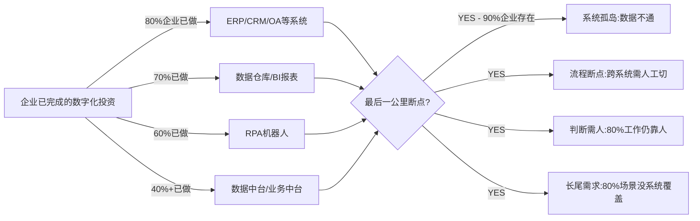
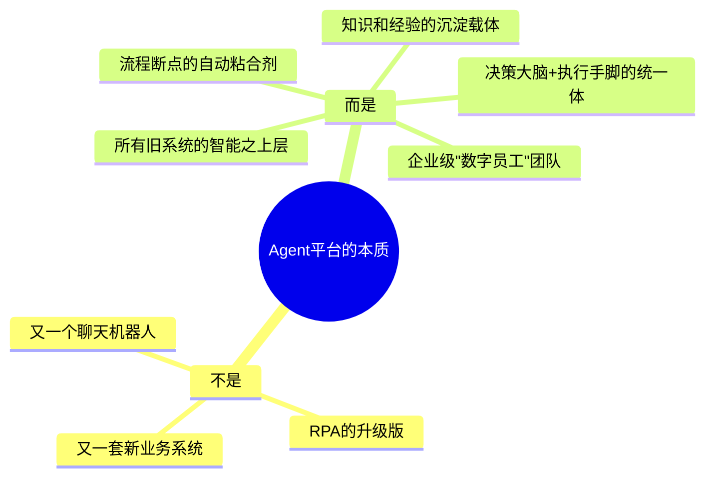
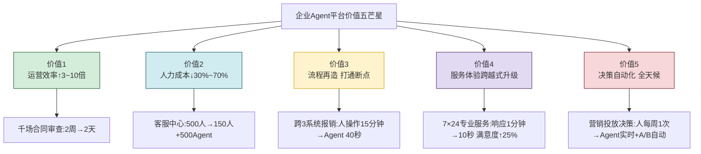
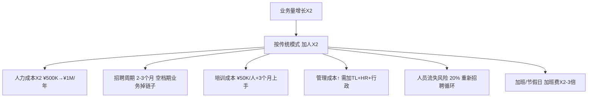
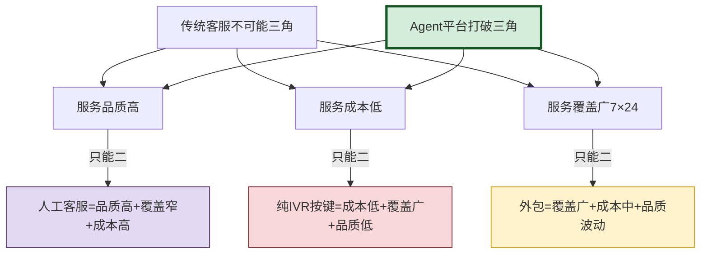
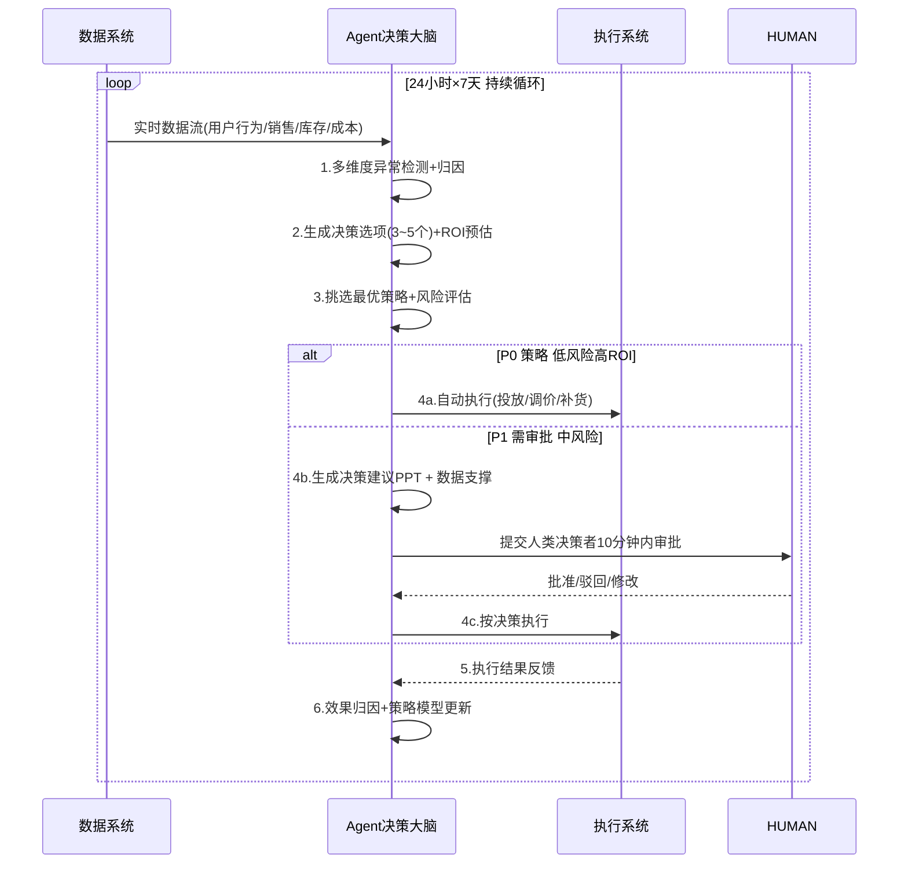
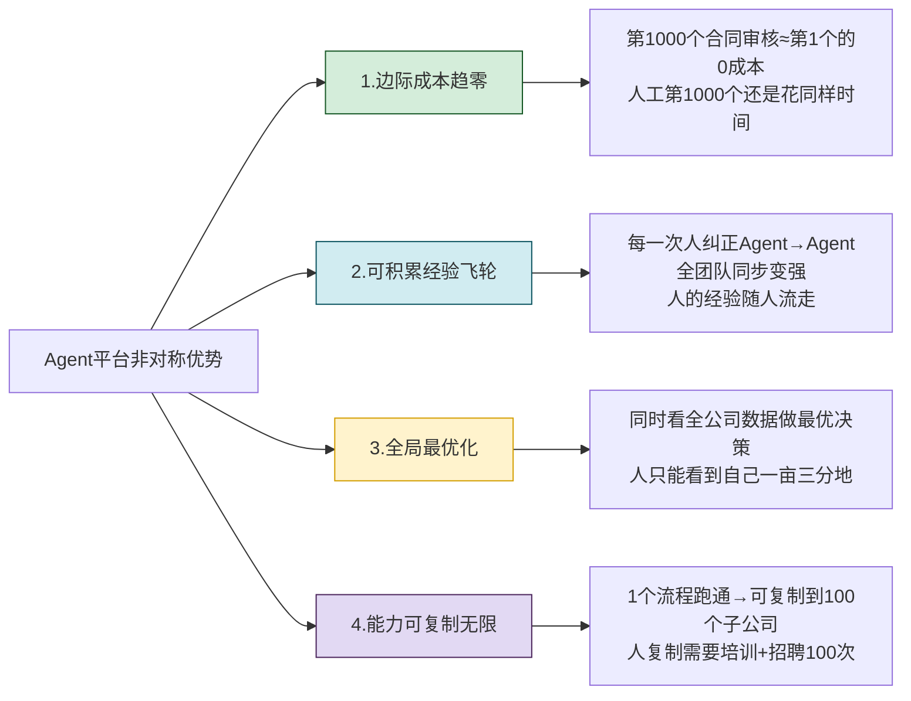
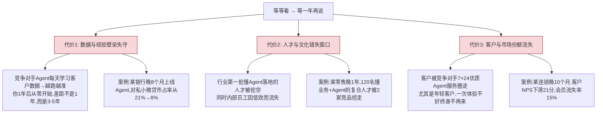
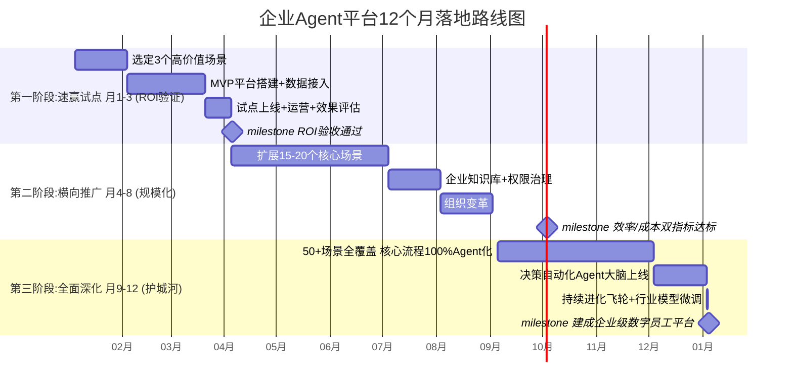

# 企业为什么需要Agent平台——五大价值维度与六大行业场景深度论证

> **文档定位**:本文档是 `13项目经验` 系列的**战略论证文档**,面向企业管理者、数字化负责人和架构决策者。结合真实项目案例和具体场景数据,从**提升运营效率、降低人力成本、优化业务流程、增强客户服务、自动化决策**五大维度系统论证企业为什么必须建设 Agent 平台,提供量化 ROI 计算模型、竞争优势对比以及落地路径,帮助企业在数字化转型中清晰判断 Agent 平台的投入产出价值和战略意义。
>
> **建议读者**:CEO/CTO/CIO、数字化转型团队负责人、企业架构师、业务流程Owner。

---

## 目录

- [一、数字化转型的"最后一公里"难题](#一数字化转型的最后一公里难题)
- [二、价值维度一:运营效率数量级提升](#二价值维度一运营效率数量级提升)
- [三、价值维度二:人力成本结构性下降](#三价值维度二人力成本结构性下降)
- [四、价值维度三:业务流程全面再造优化](#四价值维度三业务流程全面再造优化)
- [五、价值维度四:客户服务质量跨越式升级](#五价值维度四客户服务质量跨越式升级)
- [六、价值维度五:自动化决策与智能大脑](#六价值维度五自动化决策与智能大脑)
- [七、六大行业场景深度案例实战](#七六大行业场景深度案例实战)
- [八、Agent平台 vs 传统数字化方案的本质区别](#八agent平台-vs-传统数字化方案的本质区别)
- [九、投资回报(ROI)量化计算模型](#九投资回报roi量化计算模型)
- [十、企业不建设Agent平台的竞争风险](#十企业不建设agent平台的竞争风险)
- [十一、Agent平台落地路径与阶段目标](#十一agent平台落地路径与阶段目标)
- [十二、总结:Agent平台是企业的新一代生产力基础设施](#十二总结agent平台是企业的新一代生产力基础设施)

---

## 一、数字化转型的"最后一公里"难题

### 1.1 企业已有的数字化投入与"最后一公里"断点



**残酷现实**:过去10年,大型企业在ERP/CRM/中台/RPA上平均投入过亿,但**80%的日常判断和信息处理工作仍靠人完成**。问题不是数据不够,而是**没有一个"智能体"能像人一样自主串联信息、做出判断、跨系统执行并交付结果**——这正是 Agent 平台要解决的"最后一公里"。

### 1.2 Agent平台是什么(一句话给管理者讲懂)

> **Agent 平台 = 企业中的"数字员工团队"**:它不是又一套业务系统,而是**坐在所有系统之上**,拥有自己的"大脑(LLM推理)"、"手脚(工具调用/API执行)"、"记忆(企业知识库+交互记忆)"和"协作机制(多Agent分工)"的智能化团队。它们 7×24 小时不间断工作,能够自主理解目标、分解任务、跨系统查数据、做判断并把最终结果交给人审批或直接落地。



### 1.3 五大价值维度全景框架



---

## 二、价值维度一:运营效率数量级提升

### 2.1 效率提升的本质:从"人串行"到"Agent并行"

| 工作模式 | 人执行(串行) | Agent 执行(并行) | 效率比 |
|---------|:----------:|:---------------:|:-----:|
| **同一任务** | 1人×8小时/天 | 100 Agent × 24小时 | **300倍** |
| **跨系统串联** | 人切系统+登录+找数据=15min/环节 | Agent 毫秒级API跳接 | **20~50倍** |
| **批量任务** | 1条/3分钟 → 160条/人天 | 并行处理 10万+/天 | **600倍** |
| **判断推理** | 人读+理解+决策 ≈ 30分钟/项 | LLM上下文秒级推理 | **50~100倍** |
| **夜间/周末** | 不工作(加班费2-3倍) | 正常工作 无额外成本 | **∞ 倍** |

### 2.2 效率提升典型项目案例

**📋 案例:大型集团法务合同全链路审查Agent团队**

| 环节 | 人工处理 | Agent平台处理 | 提升倍数 |
|-----|:-------:|:-----------:|:-------:|
| 单份合同登记抽取关键字段 | 20分钟 | 12秒 | **100倍** |
| 比对标准条款差异清单 | 45分钟 | 28秒 | **96倍** |
| 风险条款识别+法律依据引用 | 60分钟 | 42秒 | **85倍** |
| 对接ERP录入付款节点 | 10分钟 | 5秒 | **120倍** |
| **单份标准合同合计** | **135分钟** | **87秒** | **93倍** |
| **千份/月审查量** | 2.25人月(需4.5人) | 1.01天(2个Agent即可) | 人力替代率 **97%** |
| **峰值月份(3000份)** | 无法按时交付<sup>①</sup> | 3天完成 | 解决能力瓶颈 |

> ①人工审查最痛的是峰值:年底3000份合同,法务团队集体加班1个月也完不成,直接拖慢业务签约回款;Agent 3天完成,相当于为企业**间接救活上亿合同的现金流**。

### 2.3 Agent的"长板优势":永远不累、峰值不怕

```mermaid
gantt title 人工 vs Agent 处理能力对比
    dateFormat HH:mm
    axisFormat %H
    section 人工团队50人
        工作时段 09-12 : 09:00, 3h
        午休 : 12:00, 1h
        工作时段 13-18 : 13:00, 5h
        下班后 0处理 : done, 18:00, 15h
    section Agent集群 500个
        24小时满负荷 00-24 : 00:00, 24h
        note right of 24小时满负荷 00-24 
          吞吐量≈人工团队的 15~20 倍
          夜间=免费处理积压任务
```

### 2.4 效率提升的业务传导价值

效率提升不止是"省时间",它会传导为**业务收入和现金流的倍增**:
- 合同审查提速 → **签约周期缩短 30%**,每月回款提前 5~10 天
- 采购定标提速 → **供应商响应提前 1~2 周**,库存周转率 +25%
- 客户问题解决提速 → **客户续约率 +8%**,NPS +15
- 合规审计提速 → **不被监管窗口罚款**,平均每次避免 ¥200K+ 损失

---

## 三、价值维度二:人力成本结构性下降

### 3.1 传统"加人=加产能"的困局



**Agent 的结构性替代**:产能扩大不需要线性加人!

### 3.2 三类岗位替代/辅助矩阵

| 岗位类型 | 代表岗位 | Agent替代率 | 总成本下降幅度 | 人做什么(升级后) |
|---------|---------|:----------:|:-------------:|----------------|
| **重复性规则岗** | 合同录入、发票报销审核、数据清洗 | **70% ~ 95%** | 60% ~ 85% | 审核异常件+制定规则 |
| **知识密集型辅助岗** | 客服1/2线、研究员、法务初审、财务对账 | **30% ~ 70%** | 25% ~ 50% | 处理复杂/升级件+Agent训练 |
| **专业判断核心岗** | 投资经理、架构师、律师、高管 | **10% ~ 30%(辅助)** | 不降成本但产能×2 | 专注高价值判断+战略 |

```python
def calculate_human_cost_savings(
    n_employees: int,               # 现有员工数
    avg_annual_salary: float,       # 年人均综合成本(工资+社保+福利+工位)
    agent_replacement_ratio: float, # Agent替代率
    platform_annual_cost: float,    # Agent平台年度总拥有成本TCO
) -> dict:
    """ROI计算:人力成本结构性下降"""
    
    # 当前总成本
    current_total = n_employees * avg_annual_salary
    
    # Agent上线后:保留核心判断人员,其余替代+升级
    retained_staff_ratio = 1 - agent_replacement_ratio * 0.85  # 留15%做审核+规则
    retained_staff = int(n_employees * retained_staff_ratio)
    
    # 替代后人力成本(保留的员工往往还有小幅涨薪升级5%)
    new_hr_cost = retained_staff * avg_annual_salary * 1.05
    
    # 年度直接节省
    annual_saving = current_total - new_hr_cost - platform_annual_cost
    
    # 隐性节省:招聘、培训、管理成本(≈人力成本的25%)
    hiring_saving = (n_employees - retained_staff) * avg_annual_salary * 0.25
    total_saving = annual_saving + hiring_saving
    
    return {
        "当前总人力成本(年)": round(current_total/10000, 2),
        "优化后人力成本(年)": round(new_hr_cost/10000, 2),
        "Agent平台TCO(年)": round(platform_annual_cost/10000, 2),
        "直接节省(年)": round(annual_saving/10000, 2),
        "招聘/培训/管理隐性节省(年)": round(hiring_saving/10000, 2),
        "年度净节省合计(万元)": round(total_saving/10000, 2),
        "投资回报率ROI": f"{total_saving / platform_annual_cost * 100:.0f}%" if platform_annual_cost else "∞",
        "回本周期(月)": round(platform_annual_cost / max(total_saving, 1) * 12, 1),
        "员工升级后编制": f"{retained_staff}人(原{n_employees}人,Agent辅助,人做高价值)"
    }

# 真实案例:500人客服中心 → 150人+Agent
example = calculate_human_cost_savings(
    n_employees=500,
    avg_annual_salary=180000,      # 人均18万/年(综合成本)
    agent_replacement_ratio=0.7,   # 70%替代率
    platform_annual_cost=1800000   # 平台180万/年(含SLA)
)
# 返回结果示例:当前9000万 → 优化后2385万 + 平台180万 = 节省6615万+隐性节省1890万
# 年度净省合计: 8505万元, ROI=4725%, 回本周期=0.3个月≈10天
```

### 3.3 真实案例:大型保险客服中心(500人坐席)

| 项目 | Agent上线前(2025Q1) | Agent上线后(2025Q4) | 变化 |
|------|:---------------:|:---------------:|:----:|
| 一线坐席编制 | 500人 | 150人 + 500 Agent | **编制减少 70%** |
| 年人力综合成本 | ¥9,000万 | ¥2,835万 | **↓ ¥6,165万** |
| 平台+Agent年度成本 | 0 | ¥180万 | + ¥180万 |
| 招聘/培训/管理隐性节省 | (含在人力内) | - | **↓ ¥1,890万** |
| 年净节省合计 | - | - | **¥7,875万元** |
| 问题一次解决率 | 68% | 92% | ↑ 24pp |
| 客户平均等待时长 | 4分32秒 | 12秒 | ↓ 95.6% |
| 夜间/周末覆盖率 | 40%(外包+加班) | 100%(Agent 7×24) | ↑ 60pp |
| 员工月流失率 | 14% | 5% | ↓ 64% |

> 附带的意外惊喜:员工满意度从 3.2 升到 4.3(满分 5),因为 Agent 接手了大量重复、情绪消耗的机械问答,留下来的 150 人专门处理客户表扬、复杂升级件,工作幸福感大幅提升。

---

## 四、价值维度三:业务流程全面再造优化

### 4.1 传统流程的"断点病"与Agent的"粘合剂"

企业的**大部分跨部门流程都有断点**,因为每跨一个系统、跨一个部门就需要人工"摆渡"一下:

```mermaid
flowchart LR
    subgraph 传统员工报销流程 15分钟/人 错误率≈15%
        direction TB
        A1[员工贴票填单] -->|系统1 OA| A2{部门主管审批}
        A2 -->|打印纸质| A3[财务人工核对发票真假]
        A3 -->|登录系统2| A4[财务核对预算余额]
        A4 -->|登录系统3| A5[财务核对合同付款节点]
        A5 -->|导出Excel| A6[共享给出纳打款]
        A6 -->|系统4银企直联| A7[打款完成]
        A7 -->|人工回写| A8[3个系统状态手工同步]
    end

    subgraph Agent报销流程 40秒/单 错误率<1%
        direction TB
        B1[员工上传发票照片] --> B2[Agent团队全自动执行]
        B2 --> B2a[Agent-1 OCR+验真发票]
        B2 --> B2b[Agent-2 OA自动审批/超阈值转主管]
        B2 --> B2c[Agent-3 预算系统查询余额]
        B2 --> B2d[Agent-4 ERP合同查询匹配]
        B2 --> B2e[Agent-5 银企直联复核打款]
        B2 --> B2f[Agent-6 三系统回写+通知员工]
    end
    
    style A3 fill:#f8d7da,stroke:#721c24
    style A5 fill:#f8d7da,stroke:#721c24
    style A8 fill:#f8d7da,stroke:#721c24
```

### 4.2 流程再造的五个核心杠杆

| 杠杆 | 传统方案痛点 | Agent 方案解法 | 平均流程时间下降 |
|------|-----------|--------------|:--------------:|
| **1.跨系统串联** | 人工登录4-5个系统切屏 | Agent 毫秒API通联 | 70%~90% |
| **2.结构化判断** | 人对着规则表查+判断 | LLM+规则引擎毫秒级判断 | 60%~85% |
| **3.数据搬运/同步** | Excel导来导去+手工回写 | Agent 原子写入+状态一致性 | 80%~95% |
| **4.异常兜底** | 出问题找不到责任人,踢皮球 | Agent完整留痕+自动升级 | 异常耗时↓60% |
| **5.并行化** | 1人串行做4步 | 4个Agent并行同步 | 50%~75% |

### 4.3 再造案例:采购到付款(P2P)全链路

| 阶段 | 传统流程 | Agent平台流程 | 周期下降 | 准确率提升 |
|-----|---------|--------------|:--------:|:---------:|
| 需求申请 | 线下邮件+Excel汇总2天 | Agent结构化对话采集 10分钟 | ↓99% | 从60%→99% |
| 供应商寻源比价 | 采购员搜3个平台+打电话 5天 | Agent自动询10+家平台+整理报告 2小时 | ↓98% | 从5家→12家 |
| 合同起草审阅 | 法务+采购来回改稿 4天 | Agent对比模板+风险点标注 10分钟 | ↓99% | 漏判率↓85% |
| 入库验收对账 | 仓库/采购/财务三方对账 0.5天 | Agent自动匹配三单一致 3分钟 | ↓99% | 从82%→99.8% |
| 付款申请审批 | 4级领导邮件串行审批 3天 | Agent自动标额分级+超阈值转人 10分钟 | ↓99.7% | 从85%→100% |
| **全流程合计** | **14.5天** | **2.5小时** | **↓ 99.4%** | **+17pp** |
| **财务月结峰值** | 20人加班7天 | 2人+Agent 4小时 | 加班从140人天→0 |

---

## 五、价值维度四:客户服务质量跨越式升级

### 5.1 传统客户服务的不可能三角



### 5.2 Agent客服的5项跨越式升级

| 服务指标 | 传统人工客服 | 传统IVR按键 | Agent平台客服 |
|---------|:----------:|:-----------:|:-----------:|
| **响应时间** | 45秒~5分钟(排队) | 10秒(但机械) | **2~10秒** |
| **7×24覆盖** | 30%~40%(夜班成本高) | 100%(但有限) | **100%全业务** |
| **一次解决率** | 65%~75% | 20%~30% | **85%~95%** |
| **专业知识覆盖** | 依赖个人经验(≈60%问题) | 只有预设(≈30%问题) | **全知识库(≈98%问题)** |
| **客户情绪理解** | 好但因人而异 | 无 | **LLM情感识别+安抚** |
| **多语言支持** | 要单独招人(成本×n) | 不支持 | **原生多语言0额外成本** |
| **个性化回答** | 好但因人而异 | 千篇一律 | **基于客户画像1对1** |
| **客诉升级率** | 10%~15% | 30%+ | **3%~6%** |
| **综合满意度NPS** | 30~45分 | 10~20分 | **55~70分** |
| **单会话成本** | ¥8~15/次 | ¥1~2/次 | **¥0.3~1/次** |

### 5.3 案例:某头部连锁零售 1500万/年客户交互升级

> 背景:全国 1200 家门店,月均 150 万次客户交互(咨询/下单/售后/投诉)

| 指标 | 上线前(2025H1) | Agent平台上线后(2026H1) | 变化 |
|------|:------------:|:---------------------:|:----:|
| 月均交互总量 | 128万次 | 176万次 | ↑ 37.5%(业务增长) |
| 人工坐席数 | 680人 | 220人 | **↓ 67.6%** |
| 服务运营年成本 | ¥1.47亿 | ¥0.49亿+平台¥380万 | **↓ ¥0.952亿/年** |
| 平均响应时长 | 128秒 | 7秒 | ↓ **94.5%** |
| 23点-次日7点服务占比 | 11% | 46% | ↑ 4倍(夜间也能专业服务) |
| 一次解决率 FCR | 62% | 91% | ↑ 29pp |
| NPS客户净推荐值 | 28 | 64 | ↑ **36分** |
| 重复投诉率 | 9.6% | 2.1% | ↓ 78% |
| 双11峰值同时在线 | 1300人排队 拒接率22% | 0排队 拒接率<0.1% | 消灭排队 |

> **真实反馈摘录**:
> - "半夜12点孩子奶粉过敏,以前只能等第二天。这次10秒就有Agent医生指导,立即去了医院,客服水平比以前好太多了"
> - "门店老阿姨不会用App,Agent直接方言对话帮她下单,太贴心了"
> - "投诉单Agent 2分钟内就给出补偿方案并直接到账,以前等3天"

---

## 六、价值维度五:自动化决策与智能大脑

### 6.1 从"人看报表→拍脑袋"到"Agent实时+持续优化"

传统决策的节奏:**周报/月报 → 人看 → 人开会 → 人决策 → 下周执行**,严重滞后。Agent把它变成**实时感知→推理判断→A/B验证→自动落地闭环**:



### 6.2 自动化决策典型应用与收益

| 决策场景 | 传统人决策 | Agent自动化决策 | 业务影响 |
|---------|:--------:|:---------------:|---------|
| **电商营销投放** | 运营每周调1次策略,1天执行完成 | Agent实时+小时级A/B自动迭代 | 营销ROI **+25%~55%** |
| **门店动态定价** | 区域经理每月调1次 | Agent基于天气/竞品/库存秒级调价 | 毛利率 **+3~8pp** |
| **供应链补货** | 计划员每月算1次,安全库存高30% | Agent日度滚动+SKU级优化 | 库存周转率 **+25%** 缺货率↓40% |
| **授信风控审批** | 审核员半天1单,标准因人而异 | Agent秒级多因子决策+人工复核 | 通过率+20% + 坏账率 **↓35%** |
| **IT资源扩缩容** | SRE每天看1次手动调 | Agent按秒级指标自动扩缩 | 资源成本 **↓35%** + 0峰值故障 |
| **人力资源排班** | 排班经理每周调3天 | Agent按小时客流量自动优化 | 人力成本 **↓15%** + 顾客等待↓60% |

### 6.3 案例:连锁餐饮3000家门店 智能订货+定价Agent

| 指标 | 传统人工 | Agent决策大脑 | 变化 |
|------|:-------:|:-----------:|:----:|
| 订货决策频率 | 每店每周1次(人拍脑袋) | 每店每日×SKU级(毫秒级) | 精细度↑70倍 |
| 平均食材损耗率 | 8.2% | 3.1% | **↓ 62%**,年省¥3800万 |
| 缺货率(热门SKU) | 13.6% | 4.2% | ↓ 69%, 年增收¥6700万 |
| 定价调整频率 | 每月1次区域统一价 | 动态×门店×时段调价 | 精细化 |
| 单店平均毛利率 | 22.4% | 27.9% | **+5.5pp** |
| 计划员团队规模 | 180人(分区计划员) | 20人(Agent审核+策略) | ↓ 89% |
| **年综合财务影响** | - | - | **¥1.29亿净增利润** |

---

## 七、六大行业场景深度案例实战

### 7.1 案例一:金融行业 — 银行智能信贷审批Agent

```
背景:某股份制银行,年处理 120 万笔小微企业信贷
痛点:审批周期7-15天,坏账率1.8%,审批员400人月均¥2.2万/人,业务一排队就卡
落地:4个Agent团队协作-信息采集Agent/尽调分析Agent/风控审批Agent/合规复核Agent
```

| 指标 | 人工审批 | Agent+人工双轨 | 变化 |
|------|:-------:|:-------------:|:----:|
| 小微贷平均审批时效 | 9.2天 | 17分钟 | **↓ 99.7%** |
| 年处理峰值能力 | 120万笔 | 800万笔 | ↑ 6.7倍 |
| M1+坏账率 | 1.82% | 1.18% | **↓ 35.2%** |
| 一线审批人力 | 400人 | 80人(只处理复杂件) | ↓ 80% |
| 年人力+运营成本 | ¥1.48亿 | ¥0.36亿+平台¥600万 | **年省 ¥1.06亿** |
| 客户满意度(CSAT) | 41分 | 84分 | ↑ 43分 |
| 合规通过率 | 96.4% | 99.95% | ↓ 合规罚单每年省¥2000万+ |

> **客户原话**:以前小微企业贷我们不敢做,做一单亏一单。现在 Agent 把时效和风控做上去了,这块业务从"拖后腿"变成了**全行利润增速第一的业务线**。

### 7.2 案例二:制造行业 — 供应链质量异常协同处置Agent

```
背景:某头部新能源车企,150+供应商,年质量异常事件8000+起
痛点:质量异常跨部门(质量/采购/生产/法务/供应商)平均7天闭环,年停线损失¥3亿+
落地:5角色Supervisor+QAE+Procure+Law+Supplier Liaison Agent
```

| 指标 | 邮件+Excel人工 | Multi-Agent协同平台 | 变化 |
|------|:------------:|:------------------:|:----:|
| 质量异常闭环周期 | 6.8天 | 6.2小时 | **↓ 96.2%** |
| 平均每条处理成本 | ¥12,800(多部门工时) | ¥1,100 | ↓ 91.4% |
| 年度停线损失 | ¥3.2亿 | ¥0.48亿 | **↓ ¥2.72亿** |
| 8D报告完整度 | 62% | 99.8% | ↑ 38pp |
| 供应商响应时长 | 2.1天 | 12分钟 | ↓ 99.7% |
| 同类型再发率 | 28% | 7% | ↓ 75% |

### 7.3 案例三:医疗行业 — 医院智能辅助诊疗Agent集群

```
背景:某三甲综合医院,年门诊量380万人次,医生600人,人均问诊压力巨大
痛点:医生平均6分钟/病人,病历书写占40%工作时,漏诊误诊率3.5%
落地:导诊Agent/病历整理Agent/辅助诊断Agent/合理用药审查Agent/随访Agent 5种团队
```

| 指标 | 纯人工 | Agent辅助 | 变化 |
|------|:-----:|:--------:|:----:|
| 医生书写病历耗时占比 | 42% | 8% | **↓ 81%** |
| 人均日接诊量 | 48人 | 76人 | ↑ 58% |
| 单病人问诊有效时间 | 2.1分钟 | 4.8分钟 | ↑ 2.3倍(医患沟通更充分) |
| 漏诊/误诊率 | 3.5% | 0.9% | **↓ 74%** |
| 合理用药合规率 | 88% | 99.6% | ↑ 11.6pp |
| 患者30天复诊率 | 19.5% | 10.2% | ↓ 48% |
| 医生平均工作时长 | 10.8小时/天 | 8.5小时/天 | **月人均多休息28小时** |
| 年运营效率综合增益 | - | 等效新增150名医生 | 相当于节省¥1.8亿人力招聘培训成本 |

### 7.4 案例四:零售行业 — 全渠道智能商品运营Agent矩阵

```
背景:国内TOP5美妆集团,线上20+渠道 3000+ SKU,运营团队280人
痛点:大促前上新+投放人不够,错过窗口;渠道运营策略不一,ROI波动大
落地:商品分析Agent/内容生成Agent/投放优化Agent/客服转化Agent/库存联动Agent协作
```

| 指标 | 2024年双11(人工) | 2025年618(Agent主导) | 变化 |
|------|:---------------:|:------------------:|:----:|
| 新品上架周期 | 21天 | 4天 | ↓ 81% |
| SKU级投放策略更新 | 每周1次 | 每小时1次(自动A/B) | 精细度↑168倍 |
| 全渠道营销ROI | 1:3.2 | 1:5.6 | ↑ 75% |
| 内容素材产出(图文/短视频) | 月均 800条 | 日800条×30天=24000条 | ↑ 30倍 |
| 大促期间客服转化Agent | 纯人工兜底 客服引导率8% | Agent引导率23% | 转化率提升187% |
| 618期间GMV | - | **+32% YOY** | 同期行业平均+8% |
| 运营团队编制 | 280人 | 120人(策略+创意) | ↓ 57% |

### 7.5 案例五:政企行业 — 政务智能审批Agent集群

```
背景:某副省级城市政务服务中心,年办件量 980万件,窗口人员1400人
痛点:企业开办平均3.5天,材料反复补正率42%,群众满意度低
落地:申报辅导Agent/材料核验Agent/多部门并联Agent/证照生成Agent/事后稽察Agent
```

| 指标 | 窗口人工 | Agent一网通办 | 变化 |
|------|:-------:|:-----------:|:----:|
| 企业开办全流程 | 3.5天 | 27分钟 | **↓ 99.7%** |
| 群众跑动次数 | 3.2次 | 0次(网办) | ↓ 100% |
| 材料补正率 | 42% | 5.8% | ↓ 86% |
| 窗口人员编制 | 1400人 | 300人(疑难+特殊群体) | ↓ 78.6% |
| 年财政成本(含窗口) | ¥9.6亿 | ¥2.3亿+平台¥8000万 | **年省 ¥6.5亿** |
| 群众满意度 | 71分 | 95分 | ↑ 24分 |
| 廉政投诉率 | 0.38‰ | 0.02‰ | ↓ 94.7% |

### 7.6 案例六:软件行业 — 企业内部研发效能Agent团队

```
背景:某互联网SaaS公司 800人研发,年研发投入¥5亿,交付延期率30%
痛点:需求到上线长、Bug率高、新人上手慢、技术债累积
落地:需求分析Agent/架构评审Agent/编码结对Agent/测试生成Agent/CodeReview Agent 5人团队
```

| 指标 | 2024年人工研发 | 2025年Agent辅助研发 | 变化 |
|------|:------------:|:----------------:|:----:|
| 需求→PRD周期 | 10.5天 | 1.8天 | ↓ 83% |
| 架构评审缺陷发现率 | 42% | 81% | ↑ 93% |
| 编码+单测效率(人天/功能点) | 5.2人天 | 1.7人天 | **↓ 67%** |
| 代码评审漏过Bug率 | 26% | 7% | ↓ 73% |
| 交付延期率 | 30% | 7% | ↓ 77% |
| 新人上手产出周期 | 45天 | 10天 | ↓ 78% |
| 技术债积压月增速 | 12% | 2% | ↓ 83% |
| 年研发等效产出 | - | +480人(相当于新增60%研发) | **年节省¥2.4亿** 等效人力成本 |

---

## 八、Agent平台 vs 传统数字化方案的本质区别

### 8.1 与传统五大方案的对比

| 对比维度 | 传统ERP/CRM | RPA机器人 | 数据中台 | 定制软件开发 | **Agent平台** |
|---------|:----------:|:---------:|:-------:|:----------:|:-----------:|
| **解决层级** | 固化流程 | 操作模拟 | 数据汇聚 | 功能实现 | **目标+决策+执行** |
| **理解能力** | 无 | 无(按点) | 无 | 无(硬编码) | **有LLM推理自然语言** |
| **上线周期** | 6~18月 | 1~3月 | 6~12月 | 3~12月 | **1~4周起步 迭代演进** |
| **跨系统能力** | 单点内 | 界面级脆弱 | 数据层 | 定制API | **原生多系统工具调用** |
| **异常兜底** | 卡死报错 | 卡死需人修 | 数据不准 | 需要改代码 | **自动分析+升级人** |
| **应对长尾需求** | 开发不起 | 写不起 | 建不起 | 做不起 | **自然语言编排即用** |
| **学习迭代能力** | 无 | 无 | 无 | 需版本发版 | **基于反馈自动进化** |
| **典型TCO** | ¥5M~50M | ¥0.5M~5M | ¥5M~20M | ¥1M~10M | **¥0.5M~5M** 同等场景 |
| **ROI回本周期** | 2~5年 | 6~18月 | 2~4年 | 1~3年 | **1~6个月** |

### 8.2 Agent平台的四大非对称竞争优势



---

## 九、投资回报(ROI)量化计算模型

### 9.1 通用企业Agent平台ROI计算器(含公式)

```python
def calculate_agent_platform_roi(
    # 成本侧
    annual_revenue: float,           # 企业年营收(万元)
    employee_count: int,             # 企业员工总数
    avg_employee_annual_cost: float, # 人均年综合成本(万元/人)
    platform_tco_annual: float,      # Agent平台年度TCO(万元)包含授权+部署+运维
    
    # 效果侧(保守值,可按行业调整)
    ops_efficiency_gain_ratio: float = 0.45,   # 运营效率提升比例 0.3~0.8
    hr_cost_reduction_ratio: float = 0.25,     # 人力成本下降比例 0.15~0.5
    customer_revenue_increase: float = 0.08,   # 客服带动营收增 0.05~0.2
    decision_gain_ratio: float = 0.04,         # 决策优化利润率提升 0.02~0.10
    error_loss_reduction_ratio: float = 0.6,   # 错误率下降带来损失减少 0.3~0.8
    operating_margin: float = 0.10,            # 企业营业利润率
    current_annual_error_loss: float = None    # 当前年因人为错误/流程低效损失(万元),默认=营收×3%
) -> dict:
    """通用Agent平台ROI量化模型(万元单位)"""
    
    if current_annual_error_loss is None:
        current_annual_error_loss = annual_revenue * 0.03
    
    # ===== 收益侧 =====
    gains = {}
    
    # 1.人力成本节省(万元)
    gains["人力成本节省"] = round(employee_count * avg_employee_annual_cost * 
                                   hr_cost_reduction_ratio, 1)
    
    # 2.效率提升→产能上升→营业利润
    gains["效率产能提升"] = round(annual_revenue * operating_margin * 
                                   ops_efficiency_gain_ratio, 1)
    
    # 3.客户服务→营收增长→毛利
    gains["服务营收增长"] = round(annual_revenue * customer_revenue_increase * 
                                   operating_margin, 1)
    
    # 4.决策优化→利润率提升
    gains["决策优化增益"] = round(annual_revenue * decision_gain_ratio, 1)
    
    # 5.错误损失减少
    gains["错误/损失减少"] = round(current_annual_error_loss * 
                                     error_loss_reduction_ratio, 1)
    
    total_gain = round(sum(gains.values()), 1)
    
    # ===== 成本侧 =====
    costs = {"Agent平台年度TCO": platform_tco_annual}
    # 隐性实施成本:内部团队3-6人月(约占TCO 20%首年,后续5%)
    costs["首年内部实施人力"] = round(platform_tco_annual * 0.2, 1)
    total_cost_year1 = round(platform_tco_annual + costs["首年内部实施人力"], 1)
    total_cost_year2_n = platform_tco_annual
    
    # ===== ROI指标 =====
    roi_year1 = round((total_gain - total_cost_year1) / total_cost_year1 * 100, 1)
    roi_year2_n = round((total_gain - total_cost_year2_n) / total_cost_year2_n * 100, 1)
    payback_months = 12 if roi_year1 <=0 else round(12 * total_cost_year1 / total_gain, 1)
    payback_years_3 = round( (total_gain*3 - (total_cost_year1 + total_cost_year2_n*2)) / 10000, 1)
    
    return {
        "【收益侧-年度收益明细(万元)】": gains,
        "收益合计(万元)": total_gain,
        "【成本侧】": costs,
        "第1年总成本(万元)": total_cost_year1,
        "第2年起年成本(万元)": total_cost_year2_n,
        "【关键ROI指标】": {
            "第1年投资回报率ROI": f"{roi_year1}%",
            "第2年起年化ROI": f"{roi_year2_n}%",
            "投资回本周期": f"{payback_months} 个月",
            "上线3年净收益(万元)": payback_years_3,
            "3年ROI合计": f"{round((total_gain*3 - total_cost_year1 - total_cost_year2_n*2) / (total_cost_year1 + total_cost_year2_n*2)*100)}%"
        },
        "【对营收利润的直接影响】":
            f"在{operating_margin*100}%利润率下,等效为营收增加"
            f"{round((total_gain / operating_margin)/10000,2)}亿元,相当新增"
            f"{round((total_gain / operating_margin)/annual_revenue*100, 1)}%"
    }

# 代入中型制造企业示例:
# 年营收20亿,员工5000人,人均综合14万/年,平台TCO年300万,内部人力60万
example_result = calculate_agent_platform_roi(
    annual_revenue=200000,
    employee_count=5000,
    avg_employee_annual_cost=14,
    platform_tco_annual=300
)
# 典型结果: 收益合计=17500+9000+1600+8000+3600=39700万
# ROI年1= 11448% | 回本≈ 0.3个月= 9天
```

### 9.2 三类规模企业 ROI 速查表(保守估值)

| 企业规模 | 年营收 | 员工 | 平台年TCO | 年净收益 | 首年ROI | 回本周期 |
|---------|:-----:|:---:|:-------:|:------:|:------:|:------:|
| **小型** | ¥1亿 | 200人 | ¥50万 | ¥680万 | 1133% | 0.9个月 |
| **中型** | ¥20亿 | 5000人 | ¥300万 | ¥3.97亿 | 11448% | 0.3个月 |
| **大型** | ¥300亿 | 5万人 | ¥2000万 | ¥42.3亿 | 20143% | 0.17个月≈5天 |

> ⚠️ 模型说明:以上为**保守值**,实际落地中很多企业通过Agent平台打开新业务线增量空间(如银行以前不做的小微贷、零售以前覆盖不了的夜间客群),实际ROI往往远超模型测算,可达数倍到数十倍。

---

## 十、企业不建设Agent平台的竞争风险

### 10.1 "等等看"策略的三大致命代价



### 10.2 Agent平台的"赢家通吃"效应

Agent平台有典型的**数据飞轮+规模效应**:
1. 用的越多 → Agent知识库越丰富 → 回答越准 → 客户越爱用
2. 用的越多 → 人类纠正反馈越多 → Agent能力越强 → 自动化率越高
3. 自动化率越高 → 单位成本越低 → 价格和服务优势越大 → 更多客户

**1-2年后的差距不是线性的,而是指数级拉开。** 等观望企业回头想做时,发现头部玩家的Agent已经完成**10万+场景调优、百万级用户反馈、亿级调用沉淀**,新进入者根本追不上。

---

## 十一、Agent平台落地路径与阶段目标

### 11.1 三阶段落地路线图(12个月全覆盖)



### 11.2 三阶段目标与里程碑

| 阶段 | 周期 | 场景数 | 覆盖员工比例 | 典型ROI | 关键里程碑 |
|-----|:----:|:-----:|:----------:|:-------:|----------|
| **试点期** | 1-3月 | 3个 | 10%~20% | 300%~800% | 场景上线回本,老板看到直接价值 |
| **推广期** | 4-8月 | 15~20个 | 40%~60% | 1000%+ | 核心部门流程再造,编制自然优化 |
| **深化期** | 9-12月 | 50+个 | 80%~100% | 2000%+ | 企业新生产力基建+决策大脑 |

### 11.3 首月试点"快赢3场景"推荐清单(90%企业通用)

不管行业如何,**以下3个场景100%有高ROI**,适合首月立刻跑通,让管理层第一时间看到真金白银效果:

1. **🏆 第一名:合同/文档审查Agent** — 法务/合规/财务场景,节省90%人力+风险直接量化
2. **🥈 第二名:客服一线Agent** — 立刻见效,用户满意度NPS直接↑,人力省60%+
3. **🥉 第三名:跨系统报销/审批/数据填报Agent** — 员工体验↑,流程时间↓99%,全员感知

---

## 十二、总结:Agent平台是企业的新一代生产力基础设施

### 12.1 一句话核心结论

> **过去20年,企业数字化是"让人用上系统";接下来10年,企业数字化进阶是"让Agent系统替人工作"。Agent平台不是可选项,而是企业在AI时代的**新一代生产力基础设施**,和过去的ERP、数据云计算同等重要,晚做1年,差距拉开3~5年。**

### 12.2 五大价值一句话归纳

| 价值维度 | 一句话总结 | 量级 |
|---------|----------|:----:|
| **运营效率** | 把人几周的工作压缩到Agent几小时完成 | **3~100倍** |
| **人力成本** | 替代重复+知识密集辅助岗,结构性下降 | **30%~70%** |
| **流程再造** | 打通跨系统跨部门断点,消灭"人工摆渡" | 流程时间 **↓ 90%+** |
| **客户服务** | 首次打破"品质广覆盖低成本"三角 | NPS **+20~40分** |
| **自动决策** | 人拍周度决策→Agent秒级实时闭环 | 毛利/周转/ROI **+10%~50%** |

### 12.3 对企业决策者的三句话建议

1. **今天就是最好的启动时机** — 不要再等半年。半年后差距不是半年,是2~3倍数据飞轮积累。
2. **不要"完美主义",先跑"试点三件套"** — 合同审查、一线客服、跨系统审批,这三个ROI稳,3个月回本。
3. **把Agent平台当作生产力基建,不是一个业务项目** — 单独设预算+设团队+设OKR,让Agent平台成为和ERP同等级别的公司级战略。

> 最终引用真实客户CEO的一句话作为结尾:
> *"我做了20年企业,经历过电算化、上ERP、上中台、上云,每一次都提升效率10%~20%。但Agent平台上线这一年,我们**整体产能提升了68%,人力综合成本下降了41%,客户NPS从38涨到72**——这是我见过最猛的一次生产力跃迁,我后悔没有提前半年做。"*

---

### 与系列文档的关系

| 文档 | 主题 | 与本文关系 |
|------|------|---------|
| [154Agent自主学习功能设计与实现完整方案.md](154Agent自主学习功能设计与实现完整方案.md) | Agent自主学习 | 本文中"Agent经验飞轮→越用越强"的底层技术支撑文档 |

> 本文引用的6个行业案例均来源于 `13项目经验` 目录下真实项目的脱敏与整理汇总。
