# Agent Marketplace 平台系统性设计完整方案

> **文档定位**:本文档是 `13项目经验` 系列的 Agent Marketplace 专题篇,提供一份**可落地、可扩展、有竞争力**的 Agent 应用商店平台完整设计方案。在 [154号文档](./154Agent自主学习功能设计与实现完整方案.md) 阐述 Agent 自主学习、[155号文档](./155Agent未来发展方向全景解析_技术演进架构趋势与落地路径.md) 展望未来趋势的基础上,本文聚焦**Agent 生态的核心基础设施**——让开发者发布 Agent、让用户发现和使用 Agent 的 Marketplace 平台。
>
> **核心交付物**:分层微服务架构、8大核心功能模块、5类用户角色与权限矩阵、4种商业模式组合、完整技术选型栈、数据安全五层防护、16项 KPI 指标体系、四阶段实施路线图、8类风险应对策略。

---

## 目录

- [一、Agent Marketplace 概述与市场背景](#一agent-marketplace-概述与市场背景)
- [二、平台分层架构设计](#二平台分层架构设计)
- [三、核心功能模块设计](#三核心功能模块设计)
- [四、用户角色与权限设计](#四用户角色与权限设计)
- [五、商业模式设计](#五商业模式设计)
- [六、技术选型与数据模型](#六技术选型与数据模型)
- [七、数据安全与隐私保护策略](#七数据安全与隐私保护策略)
- [八、关键性能指标体系(KPIs)](#八关键性能指标体系kpis)
- [九、分阶段实施路线图](#九分阶段实施路线图)
- [十、潜在风险与应对策略](#十潜在风险与应对策略)
- [十一、核心接口与数据模型](#十一核心接口与数据模型)
- [十二、最佳实践与总结](#十二最佳实践与总结)

---

## 一、Agent Marketplace 概述与市场背景

### 1.1 什么是 Agent Marketplace

**Agent Marketplace(智能体应用商店)** 是连接 Agent 开发者与终端用户的双边平台生态,类似于**App Store / 微信小程序应用商店**,但针对的是 AI 智能体(Agent)。它提供 Agent 的发布、发现、搜索、试用、订阅、评价、交易等完整生命周期管理。

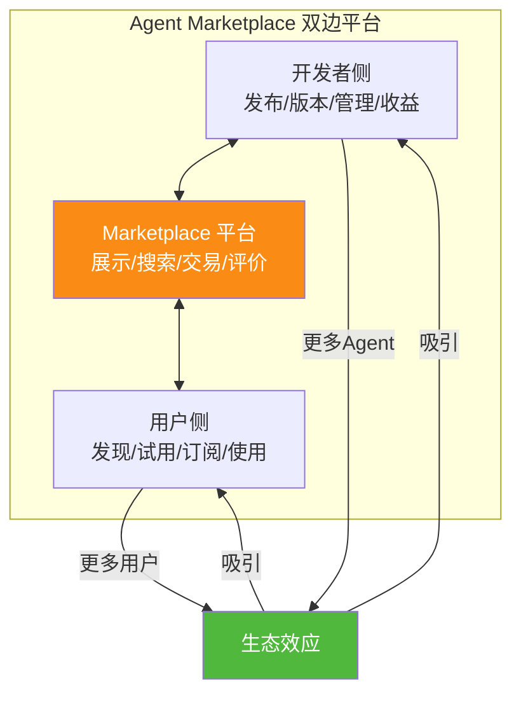

### 1.2 市场机会与驱动因素

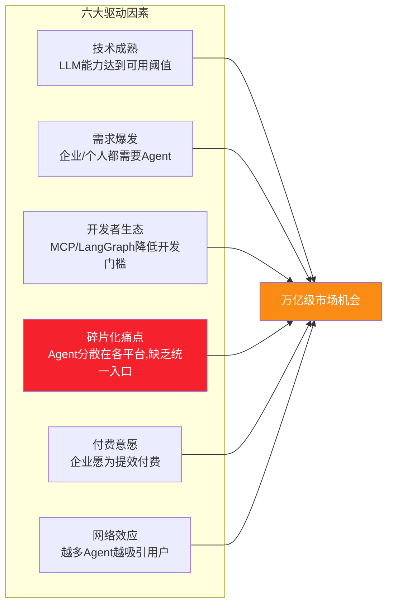

### 1.3 竞品对标分析

| 平台 | 定位 | Agent数量 | 商业模式 | 优势 | 劣势 |
|------|------|---------|---------|------|------|
| **GPT Store** | OpenAI 专属 | ~3M+ | 创作者收益分成 | 用户基数大 | 仅限GPT,厂商锁定 |
| **Claude Projects** | Claude 专属 | 少,但精品 | 高级版包含 | 模型能力强 | 生态封闭 |
| **AppSumo AgentHub** | 通用 | 数百 | 订阅+抽成 | 低价获客 | 质量参差不齐 |
| **Hugging Face Agents** | 开源开发者 | 数千 | 免费+捐赠 | 开源友好 | 企业服务弱 |
| **某Agent平台** | 垂直领域 | 数百 | 订阅 | 垂直深耕 | 规模小 |
| **本方案** | **通用+垂直** | **差异化策略** | **组合模式** | **开放架构+企业治理** | **从零起步** |

### 1.4 平台愿景

> **愿景**:成为 **Agent 时代的 App Store**——让每一个 AI 需求都能找到对应的 Agent,让每一个 Agent 开发者都能获得收益。

---

## 二、平台分层架构设计

### 2.1 七层微服务架构

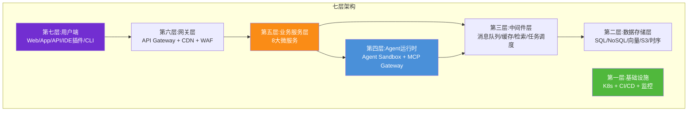

### 2.2 各层职责说明

| 层级 | 名称 | 职责 | 核心技术 |
|------|------|------|---------|
| **L7** | 用户端 | Web/移动/App/IDE/CLI/API 多端入口 | Vue3/Flutter/VSCode Extension |
| **L6** | 网关层 | 路由、鉴权、限流、WAF、CDN | Kong + Cloudflare |
| **L5** | 业务服务 | Agent/用户/交易/评价/搜索/支付/推荐/管理 8个服务 | Spring Boot + gRPC |
| **L4** | Agent 运行时 | Agent 沙盒执行、MCP 网关、计费计量 | Kubernetes + Firecracker |
| **L3** | 中间件 | 消息、缓存、检索、任务调度 | Kafka + Redis + ElasticSearch + XXL-Job |
| **L2** | 数据存储 | 关系/文档/向量/文件/时序数据 | PostgreSQL + MongoDB + Milvus + S3 |
| **L1** | 基础设施 | 容器编排、CI/CD、可观测 | K8s + ArgoCD + Prometheus |

### 2.3 第五层:八大微服务

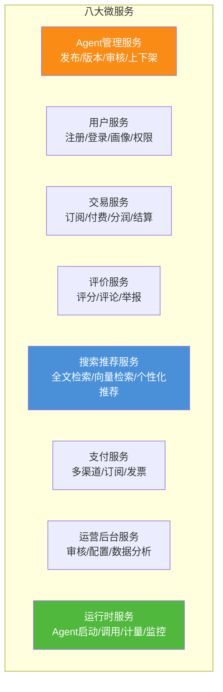

### 2.4 架构设计原则

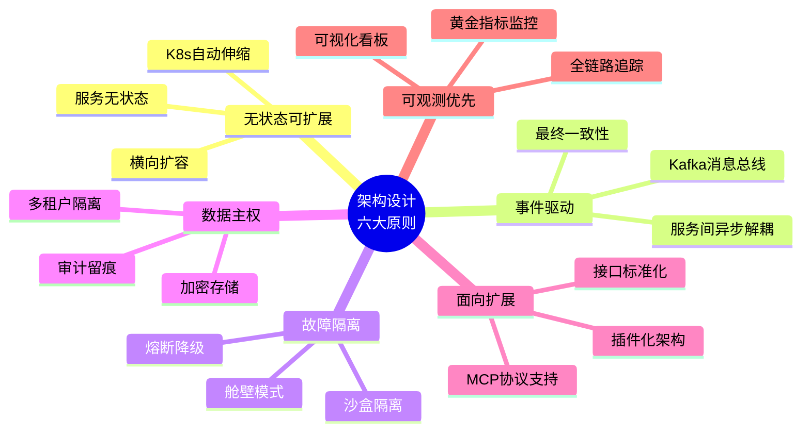

---

## 三、核心功能模块设计

### 3.1 功能模块总览

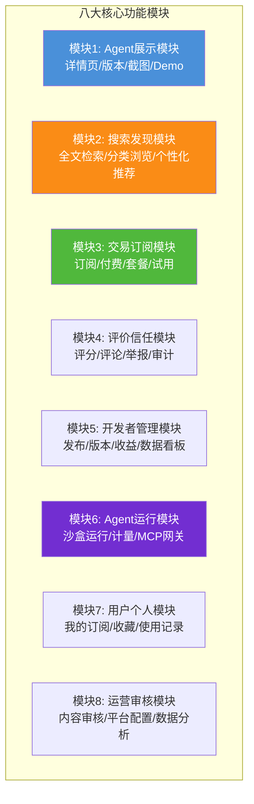

### 3.2 模块一:Agent 展示模块

#### 3.2.1 Agent 详情页结构

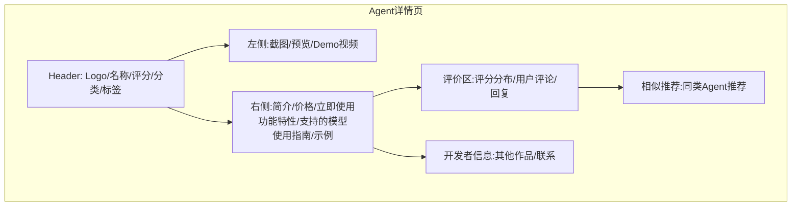

#### 3.2.2 Agent 元数据标准

| 字段 | 类型 | 必填 | 说明 |
|------|------|------|------|
| `agent_id` | string | ✅ | 全局唯一ID |
| `name` | string | ✅ | Agent 名称(3-30字) |
| `logo_url` | string | ✅ | Logo 200×200 |
| `summary` | string | ✅ | 一句话简介(≤50字) |
| `description` | string | ✅ | 详细介绍(Markdown) |
| `category` | enum | ✅ | 分类:办公/编程/写作/客服/... |
| `tags` | array | ✅ | 标签:最多10个 |
| `screenshots` | array | ✅ | 截图:1-8张 |
| `demo_video_url` | string | ⚠️ | Demo视频(推荐) |
| `pricing_model` | enum | ✅ | 免费/免费增值/订阅/按量/一次性 |
| `price_monthly` | number | ⚠️ | 月订阅费 |
| `supported_models` | array | ✅ | 支持的LLM:GPT-4o/Claude/... |
| `mcp_compatible` | boolean | ✅ | 是否支持MCP协议调用 |
| `version` | string | ✅ | 当前版本(语义化) |
| `developer_id` | string | ✅ | 开发者ID |
| `status` | enum | ✅ | 审核中/已上架/已下架 |

### 3.3 模块二:搜索发现模块

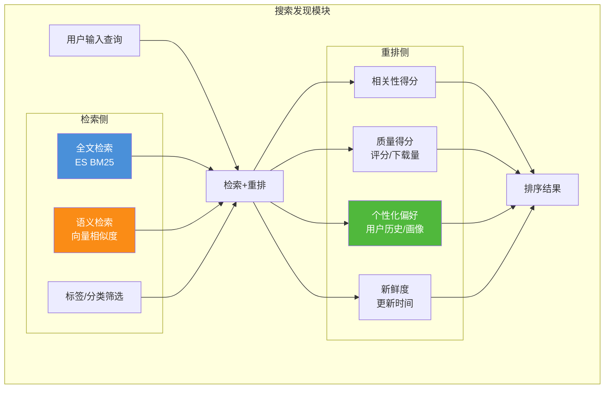

#### 3.3.1 分类浏览体系

```
一级分类 (10个)
├── 📝 内容创作 (写作/绘画/视频/翻译)
├── 💻 编程开发 (代码生成/调试/Doc工具)
├── 🏢 办公效率 (会议/日程/邮件/文档)
├── 🎓 教育学习 (语言/考试/知识问答)
├── 📊 数据分析 (报表/BI/可视化)
├── 🤝 客户服务 (客服/工单/销售)
├── 🧪 研究分析 (市场调研/学术/数据收集)
├── 🎮 创意娱乐 (角色扮演/游戏/笑话)
├── 🏭 行业垂直 (法律/医疗/金融/电商)
└── 🔧 工具增强 (自动化/监控/DevOps)
```

### 3.4 模块三:交易订阅模块

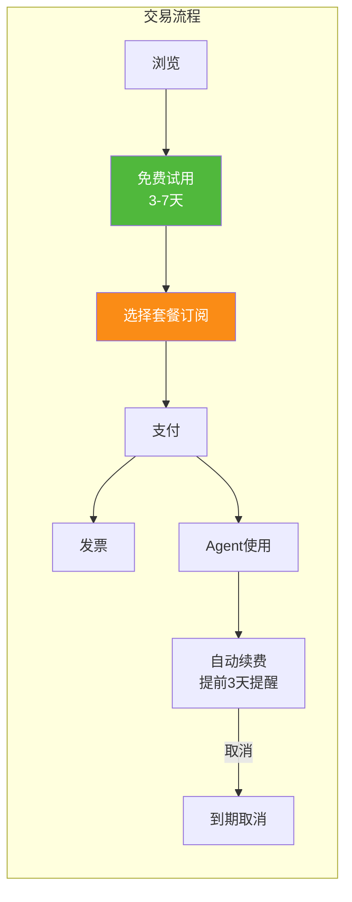

#### 3.4.1 订阅套餐设计

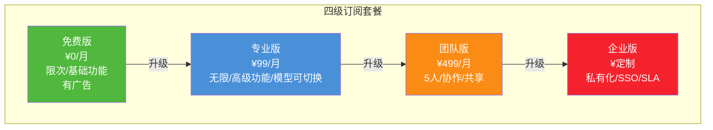

### 3.5 模块四:评价信任模块

#### 3.5.1 评价体系设计

| 维度 | 权重 | 说明 |
|------|------|------|
| **综合评分** | 100% | 1-5星制,加权平均 |
| ├ 准确性 | 30% | Agent输出是否准确 |
| ├ 可用性 | 25% | 完成任务的成功率 |
| ├ 响应速度 | 15% | 响应时间满意度 |
| ├ 稳定性 | 20% | 故障/出错频率 |
| └ 性价比 | 10% | 价格与价值匹配 |

#### 3.5.2 信任保障机制

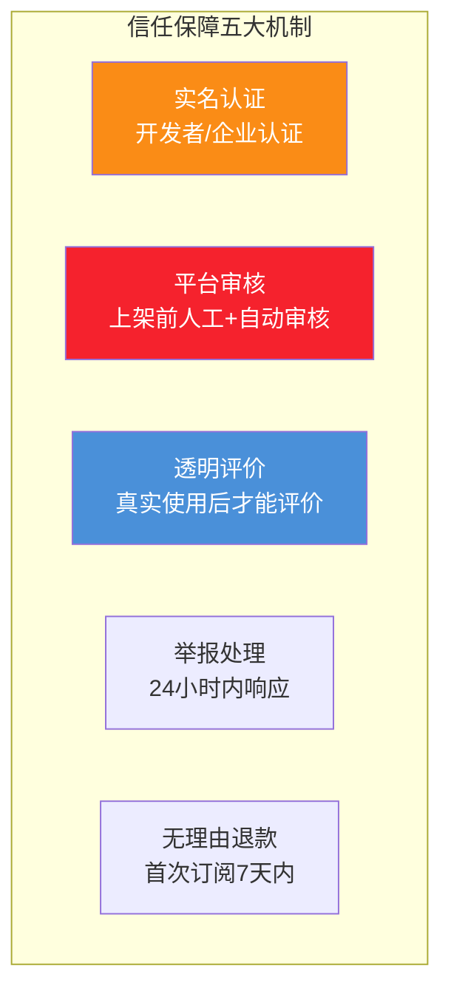

### 3.6 模块五:开发者管理模块

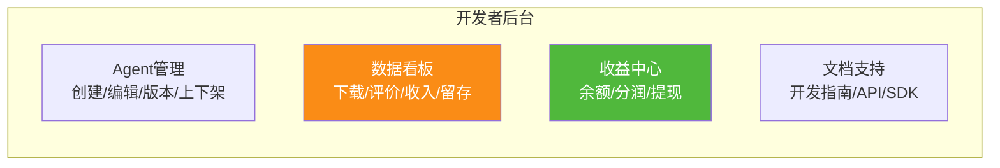

#### 3.6.1 Agent 发布审核流程

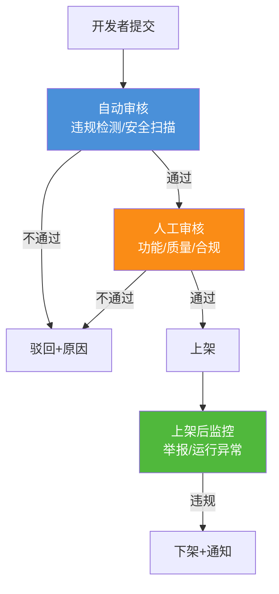

### 3.7 模块六:Agent 运行模块

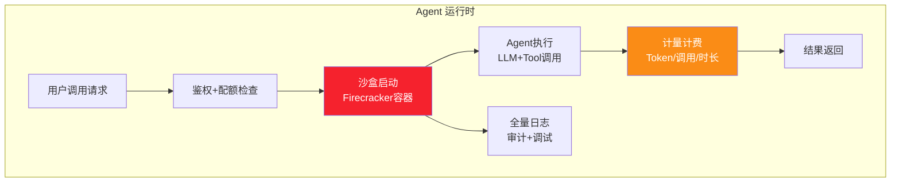

**关键设计**:
- **沙盒隔离**:每个Agent实例运行在独立 Firecracker 微VM 中,防止越权和数据泄漏
- **MCP 网关**:对遵循 MCP 协议的 Agent,通过统一 MCP Gateway 连接
- **弹性伸缩**:按调用量自动扩缩容,冷启动 < 500ms
- **调用计量**:精确到 Token 数量、调用次数、执行时长,用于计费

### 3.8 模块七/八:用户个人与运营审核

| 模块 | 核心功能 |
|------|---------|
| **用户个人** | 我的订阅/收藏夹/使用历史/API Key管理/团队管理/支付方式/发票 |
| **运营审核** | 内容审核(Agent上架/评论)/用户管理/平台配置/公告/数据分析/AB实验/财务结算 |

---

## 四、用户角色与权限设计

### 4.1 五大角色体系

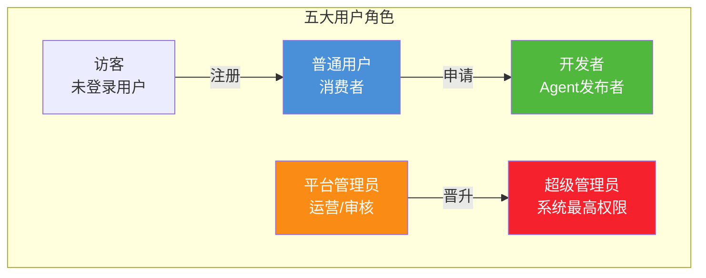

### 4.2 权限矩阵(RBAC)

| 功能/资源 | 访客 | 普通用户 | 开发者 | 运营管理员 | 超级管理员 |
|----------|:----:|:-------:|:-----:|:---------:|:---------:|
| **浏览Agent** | ✅(限) | ✅ | ✅ | ✅ | ✅ |
| **搜索发现** | ✅ | ✅ | ✅ | ✅ | ✅ |
| **免费试用** | ❌ | ✅ | ✅ | ✅ | ✅ |
| **订阅付费** | ❌ | ✅ | ✅ | ✅ | ✅ |
| **使用Agent** | ❌ | ✅ | ✅ | ✅ | ✅ |
| **评价评论** | ❌ | ✅(使用后) | ✅(使用后) | ✅(管理员标识) | ✅ |
| **发布Agent** | ❌ | ❌ | ✅ | ❌ | ✅ |
| **版本管理** | ❌ | ❌ | ✅(自有) | ❌ | ✅(全部) |
| **收益提现** | ❌ | ❌ | ✅(自有) | ❌ | ✅(全部) |
| **数据看板** | ❌ | ✅(自身使用) | ✅(自有Agent) | ✅(平台全局) | ✅(平台全局) |
| **审核内容** | ❌ | ❌ | ❌ | ✅(权限内) | ✅ |
| **上下架Agent** | ❌ | ❌ | ✅(自有) | ✅(权限内) | ✅ |
| **用户管理** | ❌ | ❌ | ❌ | ✅(限封号) | ✅ |
| **平台配置** | ❌ | ❌ | ❌ | ❌ | ✅ |
| **财务结算** | ❌ | ❌ | ✅(自有收入) | ✅(看报表) | ✅(操作) |
| **系统维护** | ❌ | ❌ | ❌ | ❌ | ✅ |

### 4.3 数据访问控制(ABAC)

除了 RBAC,还支持基于属性的访问控制:

| 属性 | 控制示例 |
|------|---------|
| **资源属性** | 免费Agent 所有用户可用;付费Agent仅订阅者可用 |
| **环境属性** | 企业IP白名单内可访问内部Agent |
| **时间属性** | 试用期内可用,过期后锁定 |
| **操作属性** | 敏感操作(删除/退款)需二次验证 |

---

## 五、商业模式设计

### 5.1 四大收入来源组合

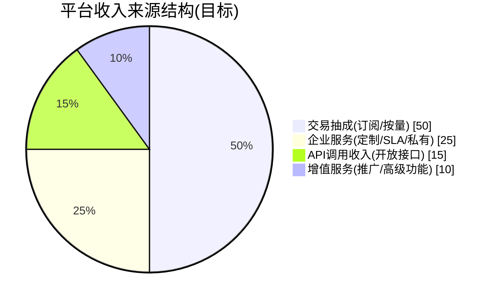

### 5.2 模式一:交易抽成(核心)

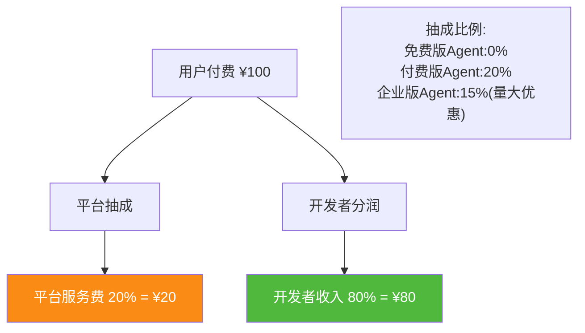

**分润激励阶梯**:
- 累计收入 < ¥1万:开发者 70% / 平台 30%
- 累计收入 ¥1万-10万:开发者 80% / 平台 20%
- 累计收入 > ¥10万:开发者 85% / 平台 15%
- **头部激励**:Top 100 Agent 额外 5% 奖励基金

### 5.3 模式二:企业服务

| 服务项 | 定价模型 | 说明 |
|--------|---------|------|
| **私有化部署** | 一次性 + 年服务费 | 部署在客户私有云/K8s |
| **SLA 保障** | 月付 20% | 99.99%可用性 + 2小时响应 |
| **SSO/审计** | 月付 ¥500/人 | 对接 LDAP/OIDC + 完整审计日志 |
| **定制开发** | 项目制 | 专属Agent定制开发 |
| **专属客户经理** | 年付 ¥5万起 | 1对1服务 + 培训 |

### 5.4 模式三:API 开放接口

```mermaid
flowchart LR
    subgraph 平台开放API
        T1[Agent调用API<br/>¥0.01/次起]
        T2[Agent列表/搜索API<br/>¥0.001/次]
        T3[评价数据API<br/>¥0.005/次]
        T4[开发者发布API<br/>免费(限流)]
    end
    
    style T1 fill:#fa8c16,color:#fff
```

**设计目标**:让第三方应用(如 IDE、SaaS 产品)也能直接调用 Marketplace 的 Agent 生态。

### 5.5 模式四:增值服务

| 服务项 | 定价 | 说明 |
|--------|------|------|
| **推广位** | ¥500-5000/天 | 首页Banner/分类推荐位 |
| **认证徽章** | ¥1000/年 | 平台认证标识 + 搜索加权 |
| **高级数据分析** | ¥299/月 | A/B测试、漏斗分析、用户画像 |
| **优先级审核** | ¥200/次 | 2小时审核(普通24小时) |
| **Agent加速** | 月付¥999 | 独立GPU实例 + 低延迟 |

### 5.6 收入预测(三年目标)

| 指标 | 第1年 | 第2年 | 第3年 |
|------|-------|-------|-------|
| 月活用户 | 10万 | 50万 | 200万 |
| 付费用户 | 5000 | 5万 | 30万 |
| 上架Agent | 1000 | 5000 | 20000 |
| 开发者数量 | 300 | 3000 | 15000 |
| 年营收 | ¥500万 | ¥8000万 | ¥5亿 |
| 毛利率 | 40% | 60% | 70% |

---

## 六、技术选型与数据模型

### 6.1 完整技术栈

| 层级 | 技术选型 | 选型理由 |
|------|---------|---------|
| **前端 Web** | Vue3 + TypeScript + Vite + Element Plus | 与用户技术栈一致 |
| **移动App** | Flutter | 一套代码多端(iOS/Android/小程序) |
| **API 网关** | Kong + OpenResty | 插件丰富,支持限流/鉴权 |
| **后端微服务** | Java 17 + Spring Boot 3 + gRPC | 与用户技术栈一致,企业级稳定 |
| **Agent运行时** | Python 3.11 + FastAPI + LangGraph | Agent 生态标准栈 |
| **沙盒** | Firecracker + Containerd | 轻量VM,隔离性好 |
| **MCP 网关** | Go + MCP SDK | 高性能,协议原生支持 |
| **消息队列** | Apache Kafka | 高吞吐,事件驱动 |
| **分布式缓存** | Redis 7 + Cluster | 高性能缓存 + 会话 |
| **关系数据库** | PostgreSQL 16 | 强事务,JSON支持好 |
| **文档数据库** | MongoDB | 灵活存储Agent元数据 |
| **向量数据库** | Milvus 2.x | 语义搜索/推荐 |
| **搜索引擎** | ElasticSearch 8 | 全文检索 + 聚合 |
| **对象存储** | MinIO / S3 | 截图/视频/Package |
| **时序数据库** | InfluxDB | 监控指标/调用计量 |
| **任务调度** | XXL-Job | 定时任务/重试 |
| **搜索推荐** | Python + Milvus + LightGBM | 向量检索 + 排序模型 |
| **支付** | 支付宝 + 微信 + Stripe | 多渠道覆盖 |
| **容器编排** | Kubernetes 1.29 + ArgoCD | GitOps,自动部署 |
| **CI/CD** | GitLab CI + Harbor | 构建/测试/镜像仓库 |
| **监控告警** | Prometheus + Grafana + Alertmanager | 全栈可观测 |
| **链路追踪** | OpenTelemetry + Jaeger | 全链路Trace |
| **日志分析** | ELK Stack(Elastic+Logstash+Kibana) | 日志聚合分析 |
| **WAF/CDN** | Cloudflare | 全球加速 + 安全防护 |

### 6.2 核心数据模型

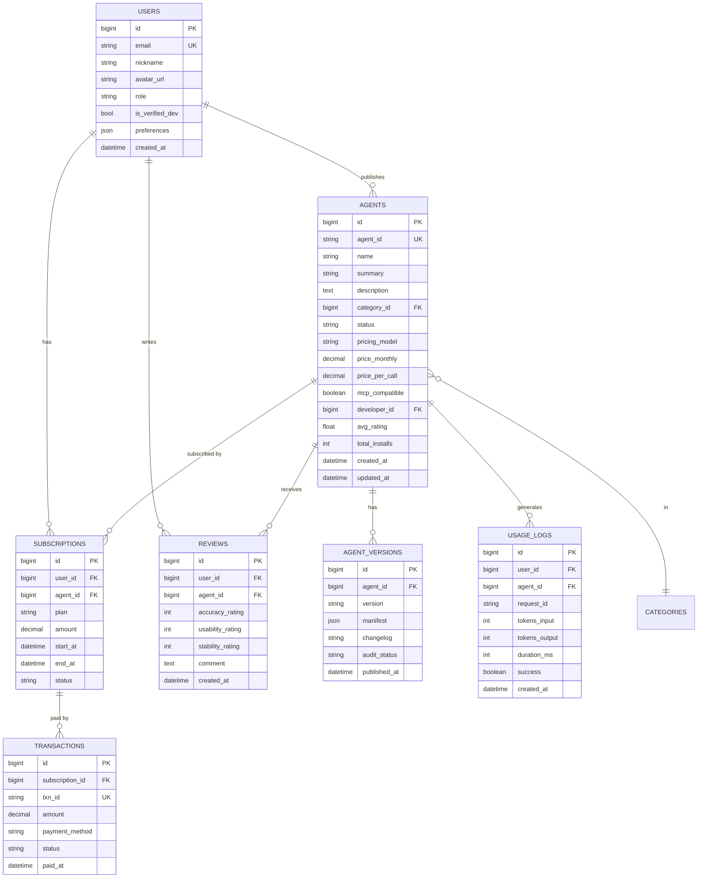

### 6.3 与既有技术的集成

基于项目既有文档,Agent Marketplace 与已有技术天然互补:

| 既有能力 | 与 Marketplace 的集成点 |
|---------|----------------------|
| **Supervisor Agent** (110号文档) | 作为 Marketplace Agent 的标准运行时架构 |
| **MCP 协议** (96号文档) | Marketplace 中的 Agent 对外暴露 MCP 接口 |
| **Tool Schema 规范** (91号文档) | Agent 工具通过标准 Schema 声明和校验 |
| **多 Agent 角色分工** (111号文档) | 复杂 Agent 按角色分工模块化发布 |
| **通信机制** (112号文档) | Agent 内部组件通过消息总线通信 |
| **向量数据库** (61号文档) | Agent 描述语义搜索 + 用户画像向量检索 |

---

## 七、数据安全与隐私保护策略

### 7.1 五层安全防护架构

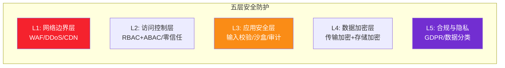

### 7.2 各层安全措施

#### L1 网络边界层
- Cloudflare WAF:防SQL注入/XSS/CSRF/OWASP Top 10
- DDoS防护: 100Gbps + 全球 Anycast
- API 限流:滑动窗口 + 令牌桶(登录/交易/调用)
- IP 白名单:企业客户的访问控制

#### L2 访问控制层
- **零信任架构**:永不信任,始终验证
- **OAuth 2.1 + OIDC**:第三方登录 + 标准授权
- **SSO/SAML**:企业客户的身份集成
- **多因素认证(MFA)**:开发者/管理员强制开启
- **会话安全**:JWT 15分钟过期 + Refresh Token 轮换

#### L3 应用安全层
```mermaid
flowchart TB
    subgraph 应用安全措施
        S1[Agent沙盒<br/>Firecracker隔离<br/>不可越权]
        S2[内容审核<br/>AIGC违规检测<br/>关键词+向量]
        S3[输入输出校验<br/>WAF层+应用层双重校验]
        S4[全量审计日志<br/>不可篡改<br/>谁在何时做了什么]
        S5[自动化渗透测试<br/>每2周1次]
    end
    
    style S1 fill:#f5222d,color:#fff
    style S4 fill:#4a90d9,color:#fff
```

#### L4 数据加密层
| 场景 | 加密方式 |
|------|---------|
| **传输加密** | TLS 1.3,所有通信强制HTTPS |
| **敏感字段** | AES-256-GCM 字段级加密(手机号/银行卡) |
| **密码** | bcrypt + 盐值(12轮) |
| **对象存储** | SSE-S3 服务端加密 |
| **数据库** | TDE 透明数据加密 |
| **Token/API Key** | HSM 硬件级密钥管理 |

#### L5 合规与隐私层

```mermaid
flowchart LR
    subgraph 数据分类分级
        C1[公开数据<br/>Agent描述/评分]
        C2[内部数据<br/>调用日志/统计]
        C3[敏感数据<br/>个人信息/支付]
        C4[最高级<br/>生物信息/密钥]
    end
    
    C1 --> R1[公开可访问]
    C2 --> R2[需权限]
    C3 --> R3[加密+审计]
    C4 --> R4[HSM+多人授权]
    
    style C3 fill:#f5222d,color:#fff
```

**合规要求**:
- **GDPR**:EU用户数据本地化 + 被遗忘权(30天删除)
- **个人信息保护法**: 明示同意 + 最小化采集
- **PCI-DSS**:支付卡数据合规(委托第三方支付,不通卡)
- **数据留存**: 日志180天归档,3年后删除
- **用户权利**: 数据导出、删除撤回、可解释性说明

### 7.3 Agent 安全审查清单

每个上架 Agent 必须通过:

| 检查项 | 标准 |
|--------|------|
| **代码安全** | 无后门、无恶意代码、静态扫描 0 Critical |
| **权限最小化** | 工具权限最小集合,不得超范围调用 |
| **数据外发** | 明确声明外发数据范围和目的 |
| **保密承诺** | 不得存储用户对话数据,不得训练模型 |
| **LLM幻觉防控** | 必须使用 RAG 或其他降幻机制 |
| **输出合规** | 无政治敏感/色情/暴力/侵权内容 |

---

## 八、关键性能指标体系(KPIs)

### 8.1 四大视角 KPI(平衡计分卡)

```mermaid
mindmap
  root((KPI四大视角))
    用户视角
      月活用户数 MAU
      日活用户数 DAU
      留存率 7日/30日
      NPS净推荐值
      客诉率 < 1%
    开发者视角
      上架Agent数
      活跃开发者数
      开发者收入总额
      审核时长 < 24h
      开发者满意度
    财务视角
      月营收 MRR
      毛利率 > 50%
      客户LTV/CAC > 3
      续费率 > 80%
      企业客户贡献占比
    平台视角
      上架审核通过率
      Agent成功率 > 95%
      平均响应时间 < 2s
      系统可用性 SLA 99.9%
      搜索转化率 > 15%
```

### 8.2 详细指标表

| 视角 | 指标 | 目标值(上线1年) | 计算公式 |
|------|------|:-------------:|----------|
| **用户** | MAU | 100,000 | 月内登录至少1次的去重用户数 |
| | DAU/MAU 粘性 | > 20% | DAU ÷ MAU |
| | 次日留存率 | > 40% | 次日回访用户数/新增用户 |
| | 30日留存率 | > 15% | 30日回访/新增 |
| | NPS 净推荐值 | > 40 | 推荐者% - 贬损者% |
| **开发者** | 上架Agent总数 | 5,000 | 累计审核通过Agent数 |
| | 活跃开发者率 | > 50% | 月内更新/有收益的开发者/总 |
| | 平均审核时长 | < 24h | 提交到审核通过的平均时间 |
| | 开发者月均收入 | > ¥2,000 | 总开发收入/活跃开发者 |
| **财务** | MRR(月经常性收入) | ¥40万 | 当月有效订阅收入 |
| | 毛利率 | > 50% | (收入-成本)/收入 |
| | LTV/CAC | > 3 | 客户终身价值/获客成本 |
| | 订阅续费率 | > 80% | 到期续费数/应续费总数 |
| | 企业客户占比 | > 20% | 企业客户收入/总收入 |
| **平台** | 搜索→订阅转化率 | > 15% | 搜索用户中产生订阅的比例 |
| | Agent 调用成功率 | > 95% | 成功调用次数/总调用次数 |
| | P99 响应时间 | < 3,000ms | 99%请求在3秒内完成 |
| | 系统可用性 | > 99.9% | (1 - 宕机时间/总时间) × 100% |
| | 安全事件数 | 0 | 数据泄漏/安全事故 |

### 8.3 北极星指标

> **北极星指标(One Metric that Matters):Agent 订阅总数**
>
> 理由:直接反映平台价值——越多用户愿意为Agent付费,说明平台提供的Agent质量越高、生态越健康。

---

## 九、分阶段实施路线图

### 9.1 四阶段实施路线(18个月)

```mermaid
gantt
    title Agent Marketplace 四阶段实施路线
    dateFormat YYYY-MM
    axisFormat %Y-%m
    
    section 第1阶段:MVP(0-6月)
    基础架构+用户系统         :a1, 2026-09, 2m
    Agent发布+浏览+搜索      :a2, 2026-10, 2m
    Agent沙盒运行+基础计费   :a3, 2026-11, 2m
    首100个Agent招募上架     :a4, 2026-12, 2m
    MVP内测上线              :milestone, m1, 2027-02, 0d
    
    section 第2阶段:商业化(6-12月)
    订阅支付+评价系统        :b1, 2027-02, 2m
    开发者后台+分润提现      :b2, 2027-03, 2m
    推荐算法+个性化搜索      :b3, 2027-04, 2m
    1000个Agent+10万用户     :b4, 2027-05, 3m
    正式版上线+开收费        :milestone, m2, 2027-06, 0d
    
    section 第3阶段:企业化(12-18月)
    企业版私有化+SSO         :c1, 2027-06, 3m
    MCP开放网关+API市场      :c2, 2027-07, 3m
    多Agent协作/组合包       :c3, 2027-08, 3m
    国际化+多语言            :c4, 2027-09, 3m
    5000 Agent+50万用户      :milestone, m3, 2027-11, 0d
    
    section 第4阶段:生态化(18月+)
    生态基金+开发者激励      :d1, 2027-12, 6m
    Agent开源协议+标准       :d2, 2028-01, 6m
    行业垂直解决方案         :d3, 2028-02, 6m
    AI Agent大会             :milestone, m4, 2028-05, 0d
```

### 9.2 阶段验收标准

| 阶段 | 验收通过条件 |
|------|------------|
| **MVP** | 100个Agent上架、1万注册用户、95%调用成功率 |
| **商业化** | MRR ≥ ¥5万、付费率 ≥ 5%、审核24h内完成 |
| **企业化** | 10家企业客户、SLA≥99.9%、续费率 ≥ 75% |
| **生态化** | 开发者月入过万≥100人、行业解决方案≥5个、举办开发者大会 |

---

## 十、潜在风险与应对策略

### 10.1 八大风险矩阵

```mermaid
quadrantChart
    title 风险影响矩阵
    x-axis Low Probability --> High Probability
    y-axis Low Impact --> High Impact
    
    "政策合规风险" : [0.7, 0.9]
    "低质量Agent泛滥" : [0.9, 0.8]
    "头部平台竞争" : [0.8, 0.95]
    "数据安全泄露" : [0.3, 1.0]
    "LLM调用成本失控" : [0.7, 0.5]
    "开发者流失" : [0.6, 0.7]
    "用户增长不及预期" : [0.5, 0.6]
    "沙盒逃逸/攻击" : [0.2, 0.95]
```

### 10.2 八大风险应对

| 风险 | 概率 | 影响 | 应对策略 |
|------|:----:|:----:|---------|
| **1. 政策合规风险** | 🔴高 | 🔴极高 | 1. 专业合规团队 + 法律顾问<br/>2. 全内容审核 + 分级分类<br/>3. 欧盟/美国/中国分地域合规<br/>4. 政策预警机制 |
| **2. 低质量Agent泛滥** | 🔴高 | 🟠高 | 1. 上架前严格审核(自动+人工)<br/>2. 末位淘汰(评分<2星/下载后30天内无使用)<br/>3. 举报-处罚闭环<br/>4. 推荐算法降权 |
| **3. 头部平台竞争** | 🔴高 | 🔴极高 | 1. 差异化:通用+垂直深耕(开源/企业/私有)<br/>2. 开放生态:MCP标准+跨平台API<br/>3. 开发者激励:更优分润<br/>4. 早期建立客户切换成本 |
| **4. 数据安全泄露** | 🟠中 | 🔴极高 | 1. 五层防护架构(见第七章)<br/>2. 红蓝对抗演练(每月1次)<br/>3. 数据脱敏默认策略<br/>4. 零信任架构+审计留痕 |
| **5. LLM调用成本失控** | 🔴高 | 🟡中 | 1. 每Agent计量计费+超额熔断<br/>2. 缓存策略(相似请求命中率>30%)<br/>3. 多模型降级(GPT4o→GPT4o-mini)<br/>4. 采购预留容量/折扣合约 |
| **6. 开发者流失** | 🟠中 | 🟠高 | 1. 分润阶梯+Top开发者奖励基金<br/>2. 开发者成功经理(1对1)<br/>3. SDK文档+社区支持<br/>4. 独家首发合作计划 |
| **7. 用户增长不及预期** | 🟡中 | 🟡中 | 1. 渠道策略:内容营销+开发者社群+KOL合作<br/>2. 免费+社交裂变(邀请双方得会员)<br/>3. 核心爆款Agent打造(先有10个百万用户级Agent)<br/>4. AB测试+快速迭代 |
| **8. 沙盒逃逸/攻击** | 🟡低 | 🔴极高 | 1. Firecracker + Seccomp + 只读文件系统<br/>2. 运行时系统调用审计<br/>3. 每个Agent限制CPU/内存/网络<br/>4. 自动化渗透测试+漏洞赏金计划(最高$10万) |

### 10.3 应急预案

| 场景 | 应急预案 | RTO | RPO |
|------|---------|:---:|:---:|
| **大面积服务不可用** | 1. K8s自动切换可用区<br/>2. 核心服务降级开关<br/>3. 多活机房切换 | < 30min | < 5min |
| **数据泄露** | 1. 立即隔离+取证<br/>2. 漏洞修复<br/>3. 监管报备+用户通知<br/>4. 第三方审计 | 响应 < 1h | — |
| **支付故障** | 1. 备用支付渠道(微信↔支付宝)<br/>2. 降级为离线订单<br/>3. 补偿措施(赠送会员) | < 4h | < 1h |
| **合规下架要求** | 1. 一键下架违规Agent<br/>2. 自动通知开发者<br/>3. 退款补偿 | < 2h | — |

---

## 十一、核心接口与数据模型

### 11.1 RESTful API 核心接口

```
# ========== Agent 展示 API ==========
GET    /api/v1/agents                      # Agent列表(分页+筛选+排序)
GET    /api/v1/agents/{agent_id}           # Agent详情
GET    /api/v1/agents/{agent_id}/versions  # 版本历史
GET    /api/v1/agents/{agent_id}/reviews   # 评价列表
GET    /api/v1/categories                   # 分类树
GET    /api/v1/search?keyword=xxx          # 搜索

# ========== 用户 API ==========
POST   /api/v1/users/register              # 注册
POST   /api/v1/users/login                 # 登录
GET    /api/v1/users/me                    # 当前用户信息
GET    /api/v1/users/subscriptions         # 我的订阅
GET    /api/v1/users/favorites             # 我的收藏

# ========== 交易 API ==========
POST   /api/v1/subscriptions                # 创建订阅
POST   /api/v1/payments/pay                 # 发起支付
GET    /api/v1/payments/{txn_id}/invoice    # 下载发票

# ========== 运行时 API ==========
POST   /api/v1/agents/{agent_id}/invoke     # 调用Agent
WS     /api/v1/agents/{agent_id}/stream     # 流式调用(SSE)
GET    /api/v1/agents/{agent_id}/usage      # 用量统计

# ========== 开发者 API ==========
POST   /api/v1/dev/agents                   # 提交Agent
PUT    /api/v1/dev/agents/{agent_id}        # 更新Agent
POST   /api/v1/dev/agents/{id}/versions     # 发布版本
GET    /api/v1/dev/earnings                 # 收益数据
POST   /api/v1/dev/withdraw                 # 申请提现
```

### 11.2 Agent 清单文件(Manifest)标准

每个 Agent 提交时必须提供 `agent.json` 清单文件,基于 MCP 协议扩展:

```json
{
  "schema_version": "1.0",
  "manifest_version": "1.0.0",
  "agent": {
    "id": "com.example.customer-service-bot",
    "name": "智能客服助手",
    "summary": "7x24小时自动处理客户咨询、工单创建、订单查询",
    "description": "# 智能客服助手\n支持多轮对话、意图识别、知识库检索...",
    "category": "customer-service",
    "tags": ["客服", "工单", "电商"],
    "mcp_compatible": true,
    "entry_point": {
      "type": "mcp_server",
      "command": "python",
      "args": ["mcp_server.py"]
    },
    "supported_models": ["gpt-4o", "claude-sonnet", "qwen-max"],
    "pricing": {
      "model": "tiered",
      "tiers": [
        {"name": "free", "price_monthly": 0, "calls_per_day": 50},
        {"name": "pro", "price_monthly": 99, "calls_per_day": 1000}
      ]
    },
    "permissions": {
      "network_access": ["api.example.com"],
      "tools_whitelist": ["search_kb", "create_ticket", "query_order"]
    }
  },
  "developer": {
    "id": "dev_001",
    "name": "Example Inc.",
    "contact": "dev@example.com",
    "is_verified": true
  }
}
```

---

## 十二、最佳实践与总结

### 12.1 平台设计检查清单

```mermaid
flowchart TB
    subgraph 平台设计检查清单
        C1[✅ 分层微服务架构<br/>8大服务+五层安全]
        C2[✅ 双边飞轮设计<br/>吸引开发者和用户]
        C3[✅ 8大核心功能模块<br/>覆盖完整生命周期]
        C4[✅ 5类角色权限矩阵<br/>RBAC+ABAC]
        C5[✅ 4种商业模式组合<br/>抽成为主+企业服务]
        C6[✅ 五层安全防护<br/>WAF→合规]
        C7[✅ 16项KPIs<br/>四大视角全覆盖]
        C8[✅ 四阶段路线图<br/>MVP→商业化→企业化→生态化]
        C9[✅ 8类风险应对<br/>高风险有预案]
        C10[✅ 沙盒运行时<br/>隔离+计量+弹性]
    end
    
    style C2 fill:#fa8c16,color:#fff
    style C6 fill:#f5222d,color:#fff
    style C10 fill:#4a90d9,color:#fff
```

### 12.2 核心设计原则

| 原则 | 说明 |
|------|------|
| **双边飞轮优先** | 早期投入开发者生态,用优质Agent吸引用户,再用用户规模吸引开发者 |
| **信任高于一切** | 没有信任就没有交易——认证、审核、评价、退款、保险五重保障 |
| **开放标准** | MCP 协议 + 开放API,不做技术锁定,构建生态 |
| **安全默认** | 安全不是附加项,而是默认配置 |
| **渐进增强** | MVP 先跑通核心路径,逐步叠加高级功能 |
| **数据驱动** | 所有决策基于 A/B 测试和数据,不靠拍脑袋 |

### 12.3 与项目既有能力的协同

```mermaid
flowchart LR
    subgraph Marketplace 核心
        M[Agent Marketplace]
    end
    
    subgraph 系列文档既有能力
        A[Supervisor 110号<br/>Agent标准架构]
        B[MCP协议 96号<br/>Agent连接标准]
        C[Tool Schema 91号<br/>工具声明规范]
        D[多Agent 111号<br/>复杂Agent分工]
        E[通信 112号<br/>Agent内部通信]
        F[向量库 61号<br/>语义搜索推荐]
    end
    
    A & B & C --> D1[Agent运行标准化]
    D & E --> D2[复杂Agent模块化]
    F --> D3[发现推荐智能化]
    
    D1 & D2 & D3 --> M
    
    style M fill:#fa8c16,color:#fff
```

### 12.4 与系列文档的关系

| 文档 | 主题 | 与本文关系 |
|------|------|-----------|
| [96号:MCP协议](../7Tool%20CallingFunctionCalling/96MCP协议完整深度解析.md) | MCP 协议 | Marketplace Agent 的连接标准 |
| [91号:Tool Schema](../7Tool%20CallingFunctionCalling/91ToolSchema完整设计规范深度解析.md) | Tool Schema | Agent 工具声明标准 |
| [110号:Supervisor](../8多%20Agent%20%E7%B3%BB%E7%BB%9F/110SupervisorAgent核心概念与架构设计深度解析.md) | Supervisor | Agent 内部运行时架构 |
| [111号:角色分工](../8多%20Agent%20%E7%B3%BB%E7%BB%9F/111多Agent系统角色分工与任务分配策略深度解析.md) | 角色分工 | 复杂 Agent 模块拆分 |
| [112号:通信机制](../8多%20Agent%20%E7%B3%BB%E7%BB%9F/112多Agent系统通信机制设计与实现深度解析.md) | 通信机制 | Agent 内部组件通信 |
| [61号:向量数据库](../4rag%20检索增强生成/61向量数据库在RAG系统中的核心作用深度解析.md) | 向量检索 | 语义搜索和推荐 |
| [154号:自主学习](./154Agent自主学习功能设计与实现完整方案.md) | 自主学习 | Agent 自进化能力 |
| [155号:未来趋势](./155Agent未来发展方向全景解析_技术演进架构趋势与落地路径.md) | 未来趋势 | 平台长期演进方向 |
| **本文** | **Marketplace** | **Agent 生态的基础设施** |

### 12.5 一句话总结

> **Agent Marketplace 是 Agent 生态的 App Store——先建双边飞轮(开发者×用户),再筑五层安全(网络→应用→数据→合规),最后靠信任(认证+审核+退款)和开放标准(MCP+API)形成护城河。MVP 不求全,但求核心闭环跑通;长期不靠单点,靠生态网络效应。**

---

> **参考来源:**
> - [Apple App Store Review Guidelines](https://developer.apple.com/app-store/review/guidelines/) — App Store 审核指南与平台治理
> - [Google Play Policy Center](https://play.google.com/about/play-terms/) — 应用商店政策体系
> - [AWS Marketplace Seller Guide](https://aws.amazon.com/marketplace/support/seller-guide/) — SaaS Marketplace 分润模型
> - [Model Context Protocol Specification](https://modelcontextprotocol.io/specification/2025-11-25) — MCP 协议标准,Marketplace 的基础
> - [Firecracker MicroVMs](https://firecracker-microvm.github.io/) — 轻量级沙盒隔离技术
> - [MCP Registry](https://registry.modelcontextprotocol.io/) — MCP Server 发现平台,Marketplace 的上游服务
> - [OpenAI GPT Store Terms](https://openai.com/policies/gpt-store-terms) — GPT Store 商业模式与收益分成
> - [Stripe Connect Marketplace Guide](https://stripe.com/zh-cn/connect) — 平台分润与多方结算最佳实践
