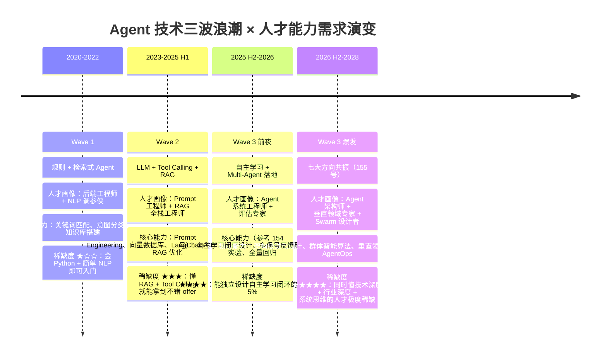
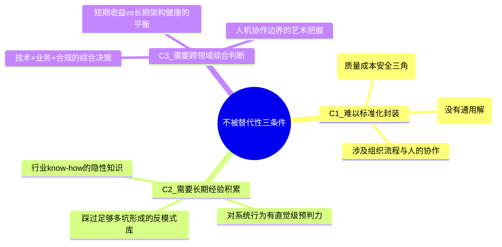
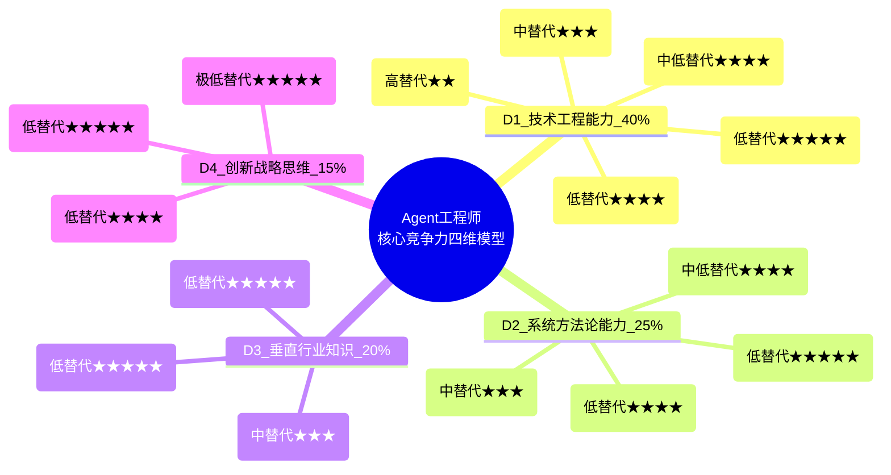
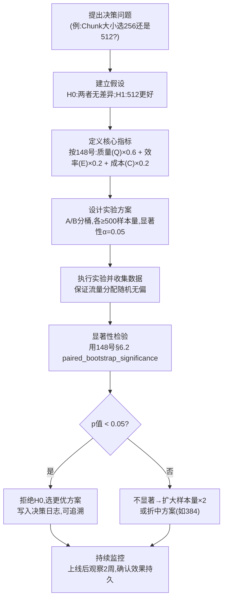
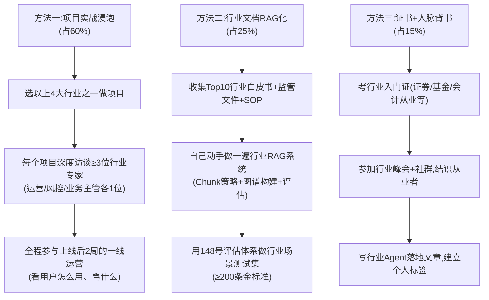
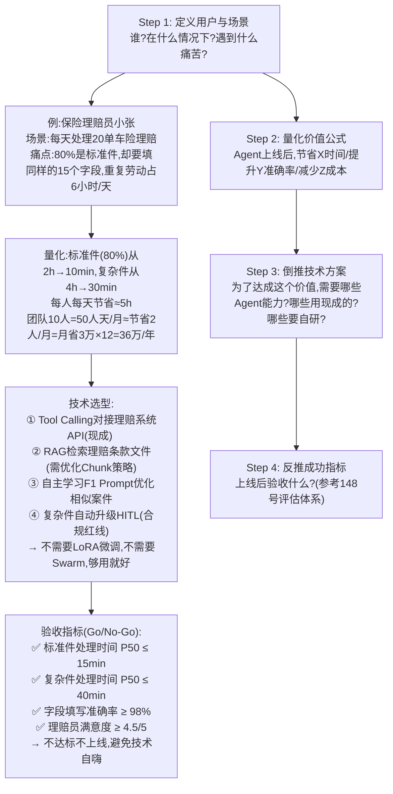
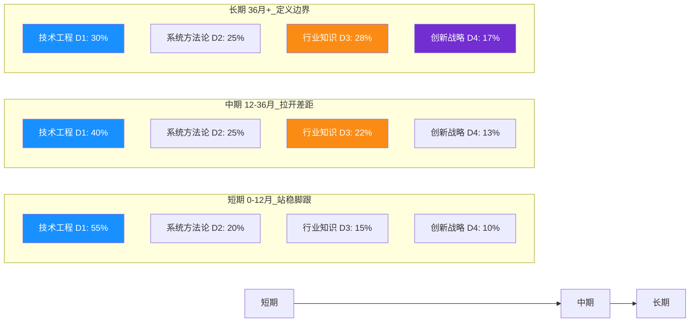
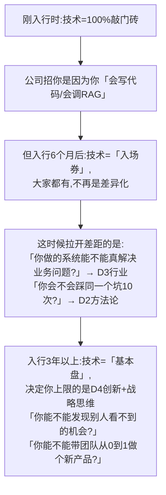
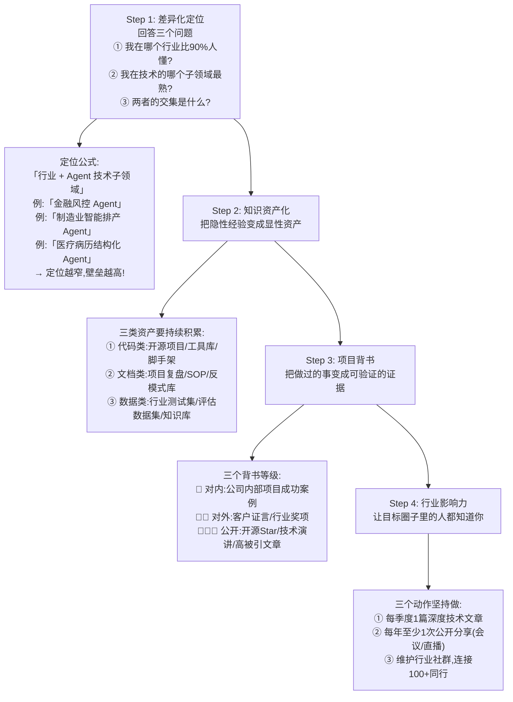

# Agent 工程师未来核心竞争力构成要素系统分析

> **文档定位**:本文档是 `13项目经验` 系列的**职业能力战略规划专题篇**。承接 [154 号自主学习功能设计](./154Agent自主学习功能设计与实现完整方案.md)（工程实现路径）与 [155 号未来发展方向全景解析](./155Agent未来发展方向全景解析_技术演进架构趋势与落地路径.md)（技术趋势预判），站在「从业者职业发展」的视角，系统回答：**未来 3-5 年，Agent 工程师的核心竞争力由哪些要素构成？技术、方法论、行业知识、创新思维各维度应如何分配精力投入？如何在技术快速迭代的浪潮中构建可持续的个人护城河？**
>
> **核心交付物**:
> - **四维十二能力全景模型**：技术工程（40%）× 系统方法论（25%）× 垂直行业知识（20%）× 创新战略思维（15%），含能力细分与可验证成长路径
> - **三阶段权重动态演进**：短期（0-12月）工程为王 / 中期（12-36月）行业+方法论崛起 / 长期（36月+）创新决胜
> - **七大技术方向能力映射矩阵**：自我进化 / 群体涌现 / 具身多模态 / 端边云协同 / 内生安全 / 垂直专家 / AgentOps，对应工程师的技能储备清单
> - **三级成长阶梯**：入门工程师 → 高级工程师 → 架构专家，每级核心里程碑与 90 天实操建议
> - **个人护城河构建四步法**：差异化定位 → 知识资产化 → 项目背书 → 行业影响力
> - **反模式清单**：10 大职业发展陷阱与规避策略

---

## 目录

- [一、时代背景：从「脚本写手」到「系统架构师」的角色跃迁](#一时代背景从脚本写手到系统架构师的角色跃迁)
- [二、核心竞争力全景框架：四维十二能力模型](#二核心竞争力全景框架四维十二能力模型)
- [三、维度一：技术工程能力（基础底座，权重 40%）](#三维度一技术工程能力基础底座权重-40)
- [四、维度二：系统方法论能力（效率倍增器，权重 25%）](#四维度二系统方法论能力效率倍增器权重-25)
- [五、维度三：垂直行业知识（价值放大器，权重 20%）](#五维度三垂直行业知识价值放大器权重-20)
- [六、维度四：创新与战略思维（未来护城河，权重 15%）](#六维度四创新与战略思维未来护城河权重-15)
- [七、能力权重的时间动态：三阶段演进曲线](#七能力权重的时间动态三阶段演进曲线)
- [八、七大技术方向的个人能力映射矩阵](#八七大技术方向的个人能力映射矩阵)
- [九、三级成长阶梯与 90 天实操路线图](#九三级成长阶梯与-90-天实操路线图)
- [十、个人护城河构建四步法](#十个人护城河构建四步法)
- [十一、职业发展 10 大反模式与规避策略](#十一职业发展-10-大反模式与规避策略)
- [十二、与 13项目经验 系列文档的能力对接表](#十二与-13项目经验-系列文档的能力对接表)
- [十三、总结与行动清单](#十三总结与行动清单)

---

## 一、时代背景：从「脚本写手」到「系统架构师」的角色跃迁

### 1.1 Agent 技术演进的三波浪潮与对应人才需求



### 1.2 为什么 2026 H2 是 Agent 工程师能力重构的临界点

承接 155 号文档 §1.2 的五大驱动因素，对应到**人才能力维度**的质变：

| 技术驱动因素（155 号 §1.2） | 对人才能力的反向要求 | 能力跃迁的本质 |
|:--------------------------|:-------------------|:-------------|
| **模型能力**：开源 MoE 推理成本下降 70% | 不再需要「会调用昂贵闭源 API」，而是需要**能在成本约束下做模型路由与量化优化**（143/144/148 号能力） | 从「API 调用者」→「算力资源优化师」 |
| **自主学习闭环**：30% 中型企业部署，平均 +25% 效果 | 需要能设计「经验 → 知识 → 注入 → 验证」全闭环（154 号全文档能力） | 从「静态系统搭建者」→「动态进化系统设计者」 |
| **Multi-Agent 稳定性**：协作成功率 >85% | 需要掌握 Swarm 拓扑设计、信用分配算法、死循环破局机制（155 号 §4） | 从「单 Agent 脚本写手」→「多智能体系统架构师」 |
| **AgentOps 工程化**：可用性达 99.9% | 需要掌握全链路 Trace、灰度发布、漂移检测、灾难恢复（155 号 §9） | 从「功能实现者」→「可观测性与可靠性工程师」 |
| **合规与安全框架**：行业标准明确 | 需要理解可验证对齐三层防线、数据合规边界（155 号 §7） | 从「技术优先」→「安全合规前置的平衡决策者」 |

> **核心洞察**：Wave 1-2 的核心能力（Prompt 技巧、基础 RAG、框架 API 调用）正在**快速商品化**——框架越来越傻瓜、RAG 越来越标准化。如果只停留在 Wave 2 能力，2027 年后将面临「 junior 化」风险。真正的稀缺性将向**「系统架构能力 + 行业落地深度 + 进化系统设计」**迁移。

### 1.3 核心竞争力的「不被替代性」判定标准

什么能力最难被「AI 自己 + 初级工程师 + 开源框架」替代？满足以下 3 个条件的能力，才能构成真正的个人护城河：



---

## 二、核心竞争力全景框架：四维十二能力模型

### 2.1 四维十二能力总览（含推荐权重与替代风险等级）



| 维度 | 推荐权重 | 核心逻辑 | 「不被替代性」平均星级 |
|:----|:--------|:--------|:--------------------|
| **D1 技术工程能力** | **40%** | 基础底座——没有技术深度，上层能力都是空谈。但纯技术深度边际收益递减快。 | ★★★★ |
| **D2 系统方法论能力** | **25%** | 效率倍增器——同样的技术投入，方法论对的人产出是方法论错的人的 3-5 倍。 | ★★★★☆ |
| **D3 垂直行业知识** | **20%** | 价值放大器——技术 + 行业 = 解决方案，纯技术 = 工具。行业知识是最难跨域迁移的壁垒。 | ★★★★★ |
| **D4 创新与战略思维** | **15%** | 未来护城河——决定了你是「跟随者」还是「定义者」。在技术拐点期，权重应临时上调。 | ★★★★★ |

### 2.2 四维能力间的依赖与协同关系（不是孤立，而是共生）

```mermaid
flowchart TB
    subgraph 协同效应 1+1>2
        T["技术工程 D1"] --- M["系统方法论 D2"]
            :::产出 工程化落地效率 +50%
        M --- I["行业知识 D3"]
            :::产出 业务场景命中率 +80%
        I --- S["创新战略 D4"]
            :::产出 差异化竞争力 10×
        S --- T
            :::产出 前瞻性技术选型 ROI 3×
    end

    T -->|没有方法论约束| T1["反模式：过度工程化<br/>做了很酷但没人用的系统"]
    M -->|没有行业锚点| M1["反模式：纸上谈兵<br/>方法论完美但不解决实际问题"]
    I -->|没有技术支撑| I1["反模式：行业专家不会落地<br/>只能做PPT讲方案"]
    S -->|没有执行能力| S1["反模式：空想家<br/>方向对了但永远做不出来"]

    style T fill:#1890ff,color:#fff
    style M fill:#52c41a,color:#fff
    style I fill:#fa8c16,color:#fff
    style S fill:#722ed1,color:#fff
```

> **关键启示**：
> 1. **偏科的代价**：纯技术强（D1=90, D2-4=50）→ 高级工程师但做不了架构；纯行业强（D3=90, 其他=50）→ 产品/咨询，不是工程师；纯创新强（D4=90, 其他=50）→ 技术布道者，但工程落地没人信。
> 2. **黄金配比（高级工程师水平线）**：D1≥80, D2≥75, D3≥60, D4≥50。只要达到这个配比，就进入市场前 20%。
> 3. **专家级配比（架构师水平线）**：D1≥85, D2≥85, D3≥80, D4≥70。这个级别人才，年薪百万是起步价。

---

## 三、维度一：技术工程能力（基础底座，权重 40%）

> 承接 154 号（自主学习）、155 号（七大方向）、148 号（评估体系）三大文档的工程化要求。

### 3.1 子能力拆解与五等级评估标准

| 子能力编号 | 子能力名称 | 权重（占 D1 内部） | L1 入门（0-6 月） | L2 熟练（6-18 月） | L3 精通（18-36 月） | L4 专家（36-60 月） | L5 权威（60 月+） |
|:---------|:--------|:----------------|:----------------|:-----------------|:-----------------|:-----------------|:----------------|
| **1.1** | **LLM + RAG 核心技术栈** | 20% | 会调 LangChain + 基础向量库 | 掌握 Chunk 策略优化 + 混合检索 + Rerank（参考 51-72 号 RAG 系列） | 能设计多粒度索引 + 两级检索（Top-50→Cross-Encoder） + 缓存体系 | 能从 0 构建 RAG 引擎，做向量量化 + HNSW 索引调优 | 发表 RAG 优化论文 / 主导开源 RAG 框架 |
| **1.2** | **Agent 框架工程化实施** | 15% | 会用 CrewAI/AutoGen/LangGraph 跑 Demo | 能设计 Production-ready Agent 服务（异常处理、超时、重试） | 能做非侵入式埋点 + 框架扩展（自定义 Callback/Interrupt） | 能自研 Agent 框架或给主流框架贡献核心代码 | 定义 Agent 框架标准（如 OpenAI Function Calling 级贡献） |
| **1.3** | **自主学习 + 自我进化系统** | **25%（D1 内部最高权重）** | 理解 154 号三层七子架构概念 | 能独立实现 F1 Prompt 学习 + F2 RAG 学习 + 四反馈融合 | 能实现完整 5 范式路由器 + HITL 闸门 + A/B 分桶 + 52 周回归 | 能设计 155 号 L2 架构级进化（工具自动封装/记忆自适应/模型切换） | 研究 L3 权重级进化 + NAS-for-Agent，发表技术体系 |
| **1.4** | **Multi-Agent 架构设计** | 20% | 能实现 3 角色以下流水线型协作 | 能设计层级型 Swarm + 信用分配基础版（155 号 §4.2 算法 2） | 能做网状型 Swarm + 死循环破局 + 动态任务招标（算法 1+3） | 能设计生态型 Swarm + Agent 繁殖/消亡机制 | 定义 Multi-Agent 通信协议 + 协作标准 |
| **1.5** | **评估体系 + 性能优化** | 20% | 会跑公开基准 MMLU/C-Eval | 能按 148 号构建 7 类 40+ 指标体系 + 业务金标准数据集 | 能设计离线 5 步流水线 + 在线 A/B 双盲 + 显著性检验（148 号 §6） | 能做 72h 压测 + 故障注入 + 漂移检测 + 量化损失评估全链路 | 主导行业级 Agent 评估标准制定 |

### 3.2 子能力 1.3「自主学习系统」深度解析（D1 最值得投入的技术方向）

为什么这项权重最高？因为 155 号明确指出「2026 H2 自主学习从试点进入 30% 中型企业部署」——**会自主学习设计的工程师，将直接跳过「会调 RAG 框架」的内卷红海，进入稀缺供给区**。

| 具体能力点 | 对应 154 号文档章节 | 工程可验证的产出物 |
|:---------|:------------------|:-----------------|
| 轨迹采集 10 维度埋点 | §4.1 + §7.1 TraceCollector | 线上 Agent 7 天连续采集，丢包率 < 0.5% |
| 经验清洗 + PII 剥离 + 质量分层 | §4.2 ExperienceCleaner | 抽检 1000 条，PII 泄漏 = 0；分层一致率 ≥ 90% |
| 四反馈融合算法（隐式+显式+自动+Reviewer） | §6.2 FeedbackFusion | 融合分数与人工判断一致率 ≥ 90%（±5 分误差内） |
| 五范式路由（F1-F5 渐进启用） | §3.5 + §7.2 LearningParadigmRouter | 冷启动 2 周 F1+F2 上线，用户接受率 ≥ +5pp |
| HITL 学习闸门（三道门） | §6.5 LearningGate | 低风险范式抽检 5-15%，LoRA 全量审核，合规通过率 = 100% |
| 金丝雀发布 + A/B 分桶 + 回滚 | §8.2 | 新版本金丝雀 5% → 20% → 50% → 100%，任何时间 ≤1min 一键回滚 |
| 52 周全量回归守护 | §8.3 FullRegressionSuite | 每次知识发布必跑 ≥2000 条黄金测试集，劣化率 ≤ 2% |

### 3.3 技术深度 vs 技术广度的分配策略

```mermaid
quadrantChart
    title 技术投入 ROI 四象限（投入时间 vs 职业收益）
    x-axis 低学习成本 --> 高学习成本
    y-axis 低职业收益 --> 高职业收益
    quadrant-1 高收益低成本（必学，投入 30% 时间）
    quadrant-2 高收益高成本（核心壁垒，投入 50% 时间）
    quadrant-3 低收益高成本（按需学习，<10% 时间）
    quadrant-4 低收益低成本（了解即可，<10% 时间）
    "自主学习闭环(154号全)": [0.55, 0.90]
    "评估体系(148号全)": [0.40, 0.85]
    "Multi-Agent Swarm算法": [0.60, 0.80]
    "RAG深度优化(51-72号)": [0.45, 0.75]
    "AgentOps工程化(155§9)": [0.35, 0.70]
    "LangChain/CrewAI基础API": [0.10, 0.40]
    "Prompt Engineering技巧": [0.08, 0.35]
    "基础向量库CRUD操作": [0.12, 0.30]
    "LoRA微调底层数学推导": [0.85, 0.55]
    "具身智能硬件驱动开发": [0.90, 0.45]
    "手写Transformer反向传播": [0.92, 0.25]
```

> **投入原则（721 黄金比例）**：
> - **70% 时间砸向 Q1+Q2**（自主学习、评估体系、Multi-Agent、RAG 深度优化、AgentOps）——这些构成技术护城河。
> - **20% 时间分配给 Q4**（基础框架 API、Prompt 技巧）——够用就行，不追求成为 Prompt 艺术家。
> - **10% 时间用于 Q3 探索**（LoRA 数学、具身硬件）——保持技术敏感度，但不做主业投入。

---

## 四、维度二：系统方法论能力（效率倍增器，权重 25%）

> 方法论的本质是「把踩过的坑抽象成可复用的决策框架」。同样的技术投入，方法论对的工程师**能用 1/3 的时间产出 2 倍的效果**。

### 4.1 子能力拆解与成熟度标准

| 子能力编号 | 子能力名称 | 权重（占 D2 内部） | 核心内涵（承接系列文档方法论） | 成熟度 3 级标准 |
|:---------|:--------|:----------------|:---------------------------|:--------------|
| **2.1** | **问题拆解 + 任务编排** | 30% | 把模糊业务需求（「做一个智能客服」）拆成可执行的 Agent 子任务：RAG 检索什么？Tool 调哪些？Planner 怎么设？HITL 介入点在哪？ | **L1 可执行**：能按时交付，但拆解依赖上级指导<br/>**L2 可复用**：能沉淀 SOP 模板，同类需求 2 小时内出方案<br/>**L3 可教授**：能教 junior，并形成团队级拆解规范文档 |
| **2.2** | **数据驱动决策法** | 25% | 不拍脑袋、不靠感觉——所有决策（Chunk 大小选 256 还是 512？Temperature 设 0.3 还是 0.7？）都用 A/B 数据说话。承接 148 号 §6 显著性检验、154 号 §8 A/B 分桶。 | **L1 事后分析**：上线后看数据复盘<br/>**L2 实验前置**：上线前设计 A/B 方案，用显著性检验决策<br/>**L3 机制化**：建立团队实验文化，每周至少 2 组对照实验，决策无数据不拍板 |
| **2.3** | **风险控制 + 反模式规避** | **30%（D2 内部最高权重）** | 对「什么绝对不能做」有肌肉记忆——154 号 §10 自主学习 5 DON'T、155 号 §3.4 进化反模式、148 号 §11 评估盲区。本质是「不犯别人已经犯过的错误」。 | **L1 不出大错**：已知 Top-10 反模式能规避<br/>**L2 预判风险**：做方案时能列出 Top-5 风险点 + 缓解策略<br/>**L3 反向指导**：能写出团队级「Agent 项目 50 大反模式手册」，用于新人培训 |
| **2.4** | **全生命周期工程化思维** | 15% | 不只关心「功能跑通」，而是关心从需求→设计→开发→测试→上线→监控→迭代→下线的全链路。承接 155 号 §9 AgentOps 8 子系统。 | **L1 关注上线**：交付后能保证基本可用<br/>**L2 关注指标**：上线后能持续看数据、发现问题、主动迭代<br/>**L3 关注体系**：能搭建团队级 CI/CD + 可观测性 + 灰度 + 回滚 + 成本核算全体系 |

### 4.2 子能力 2.3「反模式规避」深度案例库（方法论的核心是「避坑」）

以下是从 154/155/148 三大文档提炼的**高频坑**，如果能在做方案时就提前规避，效率直接翻倍：

| 反模式编号 | 反模式描述 | 源自文档 | 典型后果 | 提前规避的检查清单 |
|:---------|:---------|:--------|:--------|:----------------|
| **AM-01** | RAG Chunk < 128 tokens，导致信息碎片化 + 高幻觉 | Project Memory（项目记忆） | 召回率 -15%，幻觉率 +8% | 上线前跑 Chunk 大小 A/B：128/256/512/768 四组，选质量最优 |
| **AM-02** | 自主学习无闸门裸学，学到啥放啥 | 154 §10.2 DON'T 1 | 1 个月后系统学到 Prompt Injection 技巧，直接合规事故 | §6.5 三道门必须全上：安全合规 → 质量阈值 → HITL 抽检 |
| **AM-03** | 样本 <5K 就上 LoRA 微调 | 154 §10.2 DON'T 2 | 过拟合 + 成本爆炸，单任务成本 ×5，效果反而 -10% | 严格按 154 §3.1 阈值：F1/F2 冷启动 → F3/F4 1K+ → F5 5K+ 渐进 |
| **AM-04** | 不做 A/B 直接全量发布新知识 | 154 §10.2 DON'T 3 | 一次劣化影响所有用户，回滚要 2 小时，用户投诉飙升 | 金丝雀 5% → 20% → 50% → 100%，四步放量 + 每步 ≥24h 观察 |
| **AM-05** | 评估只看 MMLU，不做业务金标准 | 148 §1.1 盲区 1 | 公开基准高 5%，但自有业务场景相关性 <30%，上线翻车 | 按 148 §4 构建 6 步流水线：采集→分层标注→质量审计→版本化→划分→脱敏 |
| **AM-06** | 只测质量，不测成本（准确率 +2%，成本 ×3） | 148 §1.1 盲区 2 | 月度 AI 账单从 5 万涨到 15 万，老板叫停项目 | 148 §2.2 七维权重：B2 资源成本至少占 10%，做成本-质量 Pareto 前沿 |
| **AM-07** | Multi-Agent 一开始就上网状型 Swarm | 155 §4.1 拓扑演进 | 协作死循环，30 分钟没推进，调试成本 ×10 | 严格按 T1 流水线 → T2 层级 → T3 网状 → T4 生态渐进，不要跳级 |
| **AM-08** | 架构级进化不设冷却期 | 155 §3.4 进化震荡 | Agent 反复在两种架构间切换（今天加工具明天删），效果震荡 | 同一维度进化后 7 天内不再反向进化；每月架构变更 ≤3 次上限 |
| **AM-09** | System Prompt 无限膨胀，注入知识 >8000 Token | 154 §10.1 R4 | 上下文爆炸，推理延迟 P99 ×2，效果反降 5-10% | 注入总长度硬上限 6000 Token；每条 ≤2000 字符；超了只取 Top-N 最相关 |
| **AM-10** | Agent 系统无全链路 Trace，出问题靠猜 | 155 §9 AgentOps 要求 | 线上故障平均排查时间 >4h，可用性 <99% | 按 154 §7.1 TraceCollector 做 10 维度埋点 + 统一 Trace ID 跨指标/日志/链路 |

> **一个经验公式**：你能提前规避的反模式数量 × 每个反模式的平均节省时间 = 你的方法论价值。能熟练规避以上 10 条，单项目至少节省 **3-6 周返工时间**。

### 4.3 数据驱动决策的标准流程（2.2 子能力可复用 SOP）



---

## 五、维度三：垂直行业知识（价值放大器，权重 20%）

> 「AI + 行业」的价值 = AI 技术价值 × 行业系数。纯 AI 技术价值的上限是一个「工具」，但乘上行业系数后，才是「能卖钱的解决方案」。行业知识是 Agent 工程师最宽、最深、最持久的护城河——因为**技术可以学，但行业 Know-how 必须用项目和时间去磨**。

### 5.1 子能力拆解与三档行业深度标准

| 子能力编号 | 子能力名称 | 权重（占 D3 内部） | L1「懂术语」（能和行业专家对话） | L2「懂业务」（能独立做行业 Agent 方案） | L3「懂痛点」（能定义行业 Agent 产品） |
|:---------|:--------|:----------------|:------------------------------|:----------------------------------|:--------------------------------|
| **3.1** | **领域知识图谱构建** | 30% | 能列出行业 Top-20 核心实体 + 关系（如金融：客户/账户/交易/产品） | 能按 155 号 §8 五步法：语料 → 图谱 → 工具链 → SFT → 认证，完成前两步 | 能识别行业知识的「稀疏区」与「矛盾区」，设计数据采集与校验策略 |
| **3.2** | **业务流程建模 + 自动化** | **40%（D3 内部最高权重）** | 能画出行业 Top-5 核心业务流程图（如制造：订单→排产→质检→发货） | 能识别流程中哪 20% 环节用 Agent 替代能产生 80% 价值（如自动排产、异常告警） | 能设计「人机协作边界」——哪些 100% 自动化、哪些必须 HITL、哪些升级审批，落地后 ROI ≥ 300% |
| **3.3** | **合规 + 安全边界把控** | 30% | 知道行业 Top-10 合规红线（如医疗：HIPAA / 金融：数据不出域） | 能按 155 号 §7 三层防线设计：训练期对齐 → 推理期约束 → 运行期验证，全链路合规 | 能参与行业合规标准制定，做的方案能通过行业最严审计（如金融等保三级、医疗三甲） |

### 5.2 四大高价值垂直行业的 Agent 工程师能力重点

以下行业是未来 3 年 Agent 落地 ROI 最高的赛道，选准一个深挖，比泛泛了解 5 个行业价值大 10 倍：

| 行业赛道 | 落地优先级（155 号 §11） | 核心价值场景 | Agent 工程师的行业知识重点 | 3 年预期薪资溢价 |
|:--------|:----------------------|:----------|:------------------------|:--------------|
| **金融（银行/保险/证券）** | ★★★★★ P0 | 智能投顾、理赔自动处理、风控反洗钱、合规审查 | ① 金融产品分类体系 ② 风控规则引擎 ③ 监管红线（反洗钱/客户适当性） ④ 审计留痕要求 | +50-80% |
| **医疗（医院/药企/医保）** | ★★★★☆ P0-P1 | 辅助诊断、病历结构化、新药发现、医保审核 | ① ICD-10 疾病编码 ② 合理用药规则 ③ HIPAA/数据安全法 ④ 临床试验流程 | +40-70% |
| **制造（汽车/电子/重工）** | ★★★★☆ P0-P1 | 智能排产、设备预测性维护、工艺优化、质量检测 | ① MES/ERP 系统接口 ② 工艺参数 Know-how ③ 安全 SOP ④ 供应链协作流程 | +35-65% |
| **政企（政务/法务/教育）** | ★★★★ P1 | 政务热线智能应答、合同审查、智能教育助手 | ① 政务服务事项清单 ② 法律法规知识库 ③ 等保合规 ④ 政府采购流程 | +30-55% |

### 5.3 行业知识的获取路径（不靠纯读书，靠「三位一体」法）

行业知识的获取不能靠读《XX 行业概论》，那样只能到 L1「懂术语」。要到 L2/L3，必须用以下方法论：



---

## 六、维度四：创新与战略思维（未来护城河，权重 15%）

> 技术深度决定了你的**下限**，创新思维决定了你的**上限**。当所有人都在学同一套技术栈时，能看到别人看不到的机会、能组合别人想不到的跨界方案，就是你从「高级工程师」跃迁到「行业专家/技术负责人」的关键。

### 6.1 子能力拆解与表现标准

| 子能力编号 | 子能力名称 | 权重（占 D4 内部） | 核心内涵 | 「有这个能力」vs「没这个能力」的典型差异 |
|:---------|:--------|:----------------|:--------|:------------------------------------|
| **4.1** | **技术趋势预判 + 前瞻性布局** | 35% | 参考 155 号七大方向的判断逻辑——能区分「炒作热点」与「确定性趋势」，提前 6-12 个月布局真正有价值的方向 | ❌ 没能力：什么火追什么（今天追 Sora，明天追 Gemini，后天追 Grok），样样懂点皮毛<br/>✅ 有能力：按 155 §11 四象限法，重点投入「高价值低难度」（AgentOps/垂直专家/自我进化），跟踪「高价值高难度」做技术储备 |
| **4.2** | **跨学科融合创新** | **35%（D4 内部最高权重）** | 把 A 领域的成熟方法迁移到 B 领域解决新问题。例：把运筹学的「任务调度算法」用到 Multi-Agent 分配；把生物学的「进化算法」用到 Agent 架构优化；把金融的「风险量化模型」用到 Agent 安全 | ❌ 没能力：遇到问题只会搜「Agent + 问题关键词」，找不到现有方案就卡住<br/>✅ 有能力：能从其他学科借方法——154 号的反馈融合用了信号处理的加权+置信度校准；155 号的信用分配用了博弈论的 Shapley Value |
| **4.3** | **产品思维 + 用户价值导向** | 30% | 不做「技术很酷但没人用」的东西，而是从用户痛点反推技术选型——**这个 Agent 给谁用？解决了他什么具体问题？他愿意为此付多少钱？** | ❌ 没能力：「我做了一个 Agent 系统，支持 5 种模型、10 个框架、20 种工具！」但没人知道用来干嘛<br/>✅ 有能力：「我做了一个保险理赔 Agent，原来理赔员 2 小时/单，现在 Agent 处理标准件 10 分钟/单，复杂件 30 分钟，ROI 400%。」 |

### 6.2 技术趋势判断的「三维验证法」（4.1 子能力实操工具）

当你看到一个新技术概念（比如 2026 年可能出现的「Agent + XX」），不要马上 All in，用以下三个维度交叉验证：

| 验证维度 | 验证方法 | 通过标准（确定性趋势 ≥ 2/3 通过） | 没通过的典型（炒作热点） |
|:--------|:--------|:-------------------------------|:----------------------|
| **维度 1：技术成熟度** | 看 155 §2.1 的 TRL 等级（1-9） | TRL ≥ 5（实验室验证完成，进入工程化）+ 有 ≥2 个开源项目 GitHub Star ≥ 5K | TRL ≤ 3，只有 PPT 和 Demo 视频，连可复现代码都没有 |
| **维度 2：真实需求强度** | 去和 3 个以上行业客户聊：「你愿意为这个功能付多少钱？」 | ≥2 个客户表示「上线后半年内能回本」，愿意做付费试点 | 客户都说「听起来不错，但我现在的方案也还行」（不痛不痒的需求） |
| **维度 3：落地 ROI 周期** | 按 155 §2.1 的 ROI 周期预估 | ROI 周期 ≤ 18 个月（团队能等到那时候） | ROI 周期 > 36 个月（公司/你都耗不起，中间可能就换方向了） |

> **案例（2026 年视角）**：
> - ✅ **自我进化（155 §3）**：TRL 5（F1/F2 已落地），多个客户表示「越用越好用 = 省人工」，ROI 6-12 月 → **确定性趋势，All in**
> - ✅ **AgentOps（155 §9）**：TRL 5，客户说「现在出问题查 4 小时，这系统能省 3 小时/天」，ROI 3-9 月 → **确定性趋势，优先级最高**
> - ⚠️ **具身智能（155 §5）**：TRL 3，客户说「想试试但硬件成本 50 万/台」，ROI 24-36 月 → **跟踪储备，不做主业**
> - ❌ **某热门新概念**（只有 PPT）：TRL 2，客户说「很酷但不知道怎么用」，ROI 不明 → **忽略，等 TRL 升上来再说**

### 6.3 产品思维的「用户价值倒推法」（4.3 子能力实操 SOP）

做任何 Agent 项目，**先做产品后做技术**，按以下 4 步倒推：



> **反常识洞察**：最优秀的 Agent 工程师，不是会用最多最酷技术的人，而是**能用最简单技术达成最清晰业务价值**的人。产品思维让你做的每一行代码都有价值，不做无用功。

---

## 七、能力权重的时间动态：三阶段演进曲线

### 7.1 三阶段权重分配表（同一能力，不同时期投入重点完全不同）



### 7.2 各阶段的核心任务与里程碑

| 阶段 | 时间窗 | 核心任务 | 阶段里程碑（没达到要复盘） | 典型岗位水平 |
|:----|:------|:--------|:------------------------|:-----------|
| **短期 0-12 月** | 入行 → 能独立交付 | **补技术短板**：把 D1 的 1.1-1.5 全部做到 L2 熟练；重点突破 1.3 自主学习（154 号全文档落地一次） | ① 独立交付 ≥2 个生产级 Agent 项目<br/>② RAG 系统经 148 号评估，召回率 ≥ 85%，事实准确率 ≥ 88%<br/>③ 自主学习 F1+F2 上线，用户接受率 +8pp<br/>④ 能列出 Top-10 反模式并规避 | 高级 Agent 工程师<br/>薪资:行业 P50-P70 |
| **中期 12-36 月** | 能独立交付 → 能带团队/做架构 | **补行业+方法论**：选定 1 个垂直行业（金融/医疗/制造三选一）深耕到 L2；方法论 D2 全部到 L2，反模式库扩展到 ≥30 条 | ① 在 ≥1 个行业有 ≥3 个落地项目，行业 Agent 方案 ROI ≥ 300%<br/>② 主导设计 1 次 Multi-Agent 系统（T2 层级型以上），协作成功率 ≥ 85%<br/>③ 搭建团队级 AgentOps 体系（155 §9 的 8 子系统中 ≥5 个上线）<br/>④ 培养 ≥2 名 junior 工程师到独立交付水平 | Agent 技术负责人 / 架构师<br/>薪资:行业 P75-P90 |
| **长期 36 月+** | 架构师 → 行业专家/CTO 级 | **补创新+行业深度**：行业知识到 L3（能定义行业 Agent 产品）；创新 D4 全部到 L2-L3；开始做行业级技术输出 | ① 主导 ≥1 个行业级 Agent 产品，服务客户 ≥ 50 家，年营收 ≥ 1000 万<br/>② 在公开场合（会议/公众号/开源项目）输出行业 Agent 方法论，形成影响力<br/>③ 能独立判断 155 号七大方向的企业级落地路线图，给 CEO/CTO 做 3 年战略规划<br/>④ 主导/深度参与 ≥1 个开源 Agent 项目（Star ≥ 1K） | Agent 行业专家 / 技术总监 / CTO<br/>薪资:行业 P90+ / 期权 |

### 7.3 为什么技术权重随时间下降？（一个重要的职业发展认知）



> **用一个比喻理解**：
> - **技术能力 D1 = 驾照**：没有驾照不能开车；但开了 5 年车的人，不会因为「驾照考了 100 分」就比别人开得好。
> - **方法论 D2 = 驾驶经验**：知道什么路况容易出事、什么操作是反模式、长途怎么规划路线。老司机和新司机的核心差异在这里。
> - **行业知识 D3 = 路线图 + 目的地认知**：你不仅会开车，还知道「去北京最快的路线是哪条」「哪个时间段不堵车」「客户在哪个航站楼」——这些决定了你能不能把乘客（客户）送到他真正想去的地方，而不是瞎转。
> - **创新思维 D4 = 导航系统设计能力**：别人还在用地图找路时，你已经能设计更优的导航算法，或者发现一条没人走过的捷径。

---

## 八、七大技术方向的个人能力映射矩阵

承接 155 号文档 §2 的七大发展方向，对应到 Agent 工程师个人应该准备的**具体能力清单**与**投入优先级**：

| 155 号技术方向 | 落地优先级 | Agent 工程师的对应能力储备 | 建议启动时间 | 学习资源对接（系列文档） |
|:-------------|:----------|:------------------------|:-----------|:----------------------|
| **1. AgentOps 全生命周期工程化** | ★★★★★ P0 | ① 全链路 Trace 埋点设计 ② CI/CD for Agent（Prompt/RAG/Tool 版本化） ③ 灰度发布 + 一键回滚 ④ 成本核算体系 + 漂移检测 ⑤ 灾难恢复预案 | **现在立即启动** | 155 §9 AgentOps 8 子系统 + 154 §7.1 轨迹采集 + 154 §8 A/B + 148 §6 评估流程 |
| **2. 垂直领域专家 Agent** | ★★★★★ P0 | ① 行业 RAG + 知识图谱构建 ② 行业专用 Tool 链封装（金融=风控API/医疗=ICD编码/制造=MES接口） ③ 行业合规边界把控 ④ 垂直 SFT/DPO 数据集合成 ⑤ 行业认证考试通过率评估 | **现在立即启动，选 1 个行业深挖** | 155 §8 垂直专家 5 步法 + 154 §3.5 F5 LoRA 阈值 + 148 §8 场景能力对比矩阵 |
| **3. 自我进化 Self-Evolving** | ★★★★★ P0 | ① 154 号全自主学习闭环（3 层 7 子系统） ② 架构级进化触发条件设计（工具增删/记忆自适应/模型切换） ③ 进化冷却期 + Shadow Mode 机制 ④ 进化可追溯审计日志 ⑤ 进化速率上限控制 | **6 个月内 F1-F4 落地，12 个月架构级进化** | 154 号全文（L1 知识级）+ 155 §3（L2/L3 架构级+权重级） |
| **4. 内生安全与可验证对齐** | ★★★★★ P0（合规强需求） | ① 训练期对齐（SFT/DPO 数据合规筛选） ② 推理期约束（Guardrails/宪法 AI/输出过滤） ③ 运行期形式化验证（动作合规校验引擎） ④ 对抗样本测试集 ⑤ 数据泄露防护（PII 剥离） | **合规红线，项目第一个迭代就上** | 155 §7 三层防线 + 154 §1.2 5 条边界 + 154 §6.5 HITL 闸门 + 154 §10.1 R3 缓解 |
| **5. 端-边-云协同 Distributed** | ★★★★ P1 | ① 路由决策算法（隐私/延迟/成本三维打分） ② 端侧隐私计算基础（联邦学习概念） ③ 跨节点状态同步策略 ④ 一致性保障机制 ⑤ 降级预案（网络中断时边端自治） | **9-15 个月内做预研试点** | 155 §6 三级分布式架构 + 144 号量化（端侧小模型优化）+ 143 号推理优化 |
| **6. 群体涌现 Swarm** | ★★★★ P1 | ① T1 流水线型 → T2 层级型 Swarm 设计 ② 动态任务招标算法（155 §4.2 算法 1） ③ 信用分配 Shapley Value（算法 2） ④ 死循环检测与破局（算法 3） ⑤ T3 网状型探索 | **12-18 个月内从 T1/T2 开始** | 155 §4 四种拓扑 + 三大核心算法 + 154 §9 单→Multi-Agent 迁移路径 |
| **7. 具身多模态 Embodied** | ★★★ P1-P2 | ① 多模态 RAG（图像/音频/文本联合检索） ② 视觉 Grounding 基础 ③ 数字孪生验证概念 ④ 运动控制接口对接（可选） ⑤ 物理安全约束机制 | **24-36 个月做技术储备，不急落地** | 155 §5 感知-决策-执行闭环 + 148 §3 A5 多模态评估指标 |

---

## 九、三级成长阶梯与 90 天实操路线图

### 9.1 阶梯定义与核心能力阈值对应表

| 成长阶梯 | 对应四维能力最低分（满分 100） | 可独立承担的工作范围 | 平均对应市场薪资范围（中国一二线城市，2026 年） |
|:--------|:---------------------------|:-----------------|:-------------------------------------------|
| **L3 入门 Agent 工程师** | D1≥60, D2≥40, D3≥30, D4≥20 | 在 senior 指导下完成 RAG 系统搭建、Prompt 优化、单一 Agent 服务开发 | 15-25K/月 |
| **L2 高级 Agent 工程师** | D1≥80, D2≥75, D3≥60, D4≥50 | 独立负责端到端 Agent 项目（含自主学习 F1-F4）；能带 1-2 名 junior | 30-50K/月 |
| **L1 Agent 架构专家** | D1≥85, D2≥85, D3≥80, D4≥70 | 主导 Multi-Agent 系统设计；给 50 人以上团队做技术选型；负责行业级产品架构 | 60K-120K/月 + 期权 |

### 9.2 从 L3 到 L2 的第一个 90 天实操路线图（最关键的第一步）

> 这个 90 天计划的核心原则是：**以战代练，做完一个完整项目，胜过读 10 本书**。

```mermaid
gantt
    title L3→L2 首个90天成长路线图（以战代练）
    dateFormat YYYY-MM-DD
    axisFormat %m/%d

    section 第1月_W1-W4_完成技术打底
    1.1 RAG深度优化实操(51-72号文档) :crit, w1, 2026-08-10, 15d
    1.2 吃透148号评估体系,做≥200条金标准测试集 :crit, w2, after w1, 10d
    1.3 吃透154号自主学习,独立实现F1+F2 :crit, w3, after w2, 5d

    section 第2月_W5-W8_完成一个端到端生产级项目
    2.0 选定一个行业场景(选推荐4大行业之一) :milestone, m0, 2026-09-07, 1d
    2.1 用6.3节用户价值倒推法,定义项目目标+验收指标 :crit, m1, after m0, 4d
    2.2 项目开发:RAG + Tool Calling + 自主学习F1+F2 :crit, m2, after m1, 15d
    2.3 按148号跑完评估+A/B验证+金丝雀发布 :crit, m3, after m2, 8d

    section 第3月_W9-W12_复盘沉淀+方法论输出
    3.1 项目复盘:记录Top-5踩坑经验+反模式入库 :done, r1, 2026-10-05, 5d
    3.2 方法论沉淀:写出《XX行业Agent项目落地SOP》 :crit, r2, after r1, 10d
    3.3 技术输出:写1篇项目复盘文章(可发公众号/知乎/掘金) :crit, r3, after r2, 10d
    3.4 四维能力自测评分+下90天规划 :milestone, r4, after r3, 2d
```

### 9.3 从 L2 到 L1 的第 2-3 个 90 天进阶重点

| 90 天周期 | 核心突破点 | 里程碑产出 |
|:--------|:---------|:---------|
| **第 2 个 90 天** | 补 Multi-Agent + AgentOps 能力 | ① 设计实现 T2 层级型 Swarm（≥4 个角色协作），协作成功率 ≥ 85%<br/>② 搭建团队级 AgentOps 体系（≥5 个子系统上线）<br/>③ 方法论反模式库扩展至 ≥30 条 |
| **第 3 个 90 天** | 补行业深度 L2 + 创新思维 | ① 行业项目 ≥3 个，产出《XX 行业 Agent 白皮书》级别的行业方法论<br/>② 主导一次 155 §3 L2 架构级进化试点（工具自动封装/记忆自适应二选一）<br/>③ 带教 ≥2 名 junior 到 L3 独立水平 |

---

## 十、个人护城河构建四步法

> 「核心竞争力」的终极检验标准是：**如果现在让你跳槽/涨薪/创业，你有什么是别人替代不了的？** 护城河不是一天建成的，要按以下四步系统构建：

### 10.1 四步法全景流程图



### 10.2 每一步的具体操作清单（可落地、可检查）

| 步骤 | 关键动作（Checklist） | 完成标准（没做到不算数） |
|:----|:--------------------|:----------------------|
| **Step 1 定位** | [ ] 从 §5.2 推荐的 4 大行业中选 1 个（金融/医疗/制造/政企）<br/>[ ] 从 D1 的 5 个子能力选 1-2 个做突破口（1.3 自主学习、1.5 评估优先推荐）<br/>[ ] 写出一句个人定位：「我是做 XX 行业 Agent 的 YY 技术专家」 | 你的定位能在 30 秒讲清楚，别人听完能马上想到「下次有相关项目找你」 |
| **Step 2 资产化** | [ ] GitHub 建立一个行业 Agent 脚手架仓库（≥50 commits）<br/>[ ] 建立个人反模式库（≥20 条，含案例+规避）<br/>[ ] 构建行业金标准测试集（≥500 条，带标注+版本号） | 以上三类资产至少完成 2 类；资产在需要时能 1 小时内拿出用，不是脑中记忆 |
| **Step 3 背书** | [ ] 最近一年有 ≥2 个生产级 Agent 项目上线的完整文档（需求→架构→评估→效果）<br/>[ ] 至少 1 个项目有可量化的 ROI 数据（节省 X 人天/提升 Y% 准确率/降低 Z% 成本）<br/>[ ] 至少有 1 份客户/上级的书面好评/推荐信 | 面试时拿出来的不是「我做过 XX」，而是「我做的 XX 项目有 YY 数据证明，你可以找 ZZ 背书」 |
| **Step 4 影响力** | [ ] 技术博客/公众号/掘金累计发文 ≥10 篇<br/>[ ] 至少 1 篇文章阅读量 ≥1 万（或业内大号转载）<br/>[ ] 加入 ≥3 个高质量行业社群，并在里面做过 ≥1 次主题分享 | 当有猎头/同行找 Agent 专家时，≥2 个人会推荐你的名字 |

---

## 十一、职业发展 10 大反模式与规避策略

> 这些反模式是从大量工程师职业路径中提炼的「高频踩坑点」，每一条都能让你浪费 6-24 个月时间。强烈建议打印出来贴在工位，每月对照一次。

| 反模式编号 | 反模式描述 | 典型后果 | 规避策略 |
|:---------|:---------|:--------|:--------|
| **CP-01** | **框架追逐症**：每出一个新框架都学一遍（CrewAI→AutoGen→LangGraph→Dify→...），每个都懂点皮毛，但底层原理没搞透 | 2 年后，所有框架都过时了，你没有任何沉淀下来的核心能力 | 选 1 个主流框架深入到源码级，其他框架懂 API 即可；框架的本质（Planner/Memory/Tool/Router）是相通的 |
| **CP-02** | **Prompt 艺术家陷阱**：沉迷于各种「神级 Prompt 技巧」「万能 Prompt 模板」，把 80% 时间花在 Prompt 措辞上 | Prompt 技巧的边际收益递减极快，投入产出比 < 0.2，别人用自主学习 F1（154 号）用数据自动优化，碾压手工 Prompt | 把 80% 时间投入到 1.3 自主学习系统，让 F1 自动从数据中提取最优 Prompt |
| **CP-03** | **论文党 + 数学党**：把大量时间花在 Transformer 反向传播推导、LoRA 数学公式、最前沿论文上，但生产项目一个没落地 | 面试时能聊 2 小时数学，一做项目就卡住；3 年后别人有 5 个上线项目，你只有 5 篇读书笔记 | 按 §3.3 四象限：底层数学投入 <10% 时间保持敏感度即可，70% 投工程落地 |
| **CP-04** | **通用派，拒绝选行业**：「我做通用 Agent，什么行业都能做」，不肯花时间深耕一个行业 | 每个行业你都是「门外汉」，做出来的方案只能解决表层问题，最后变成「高级外包」——谁便宜谁上 | 按 §5.2 四选一，用 §5.3 三位一体法，12 个月内深耕到 L2 水平 |
| **CP-05** | **只做技术，不碰业务**：需求来了就做，不问用户是谁、解决什么问题、ROI 多少 | 做了 3 年 Agent，讲不清任何一个项目的业务价值，面试时只能说「用了 XX 技术」，老板问「这个系统赚了多少钱」你答不上来 | 每个项目启动前强制按 §6.3 产品倒推法写一页纸的「用户价值定义书」，找业务方签字确认 |
| **CP-06** | **拒绝做知识沉淀**：「太忙了没时间写文档」「复盘太麻烦先做下一个项目」 | 踩过的坑 6 个月后再踩一遍；带团队时 junior 从零开始踩你踩过的坑，效率 -50% | 每个项目结束强制写 2 页复盘：1 页「Top-3 成功经验」+ 1 页「Top-3 踩坑 + 规避方案」；坚持一年，反模式库自动 ≥30 条 |
| **CP-07** | **闭门造车型**：只在公司写代码，不参加社群、不看开源项目、不写文章 | 3 年后你以为自己做的东西很先进，其实社区 2 年前就有更好的方案；你的视野 = 公司内部视野 | 每周投入 ≥2 小时看行业动态（GitHub Trending/HuggingFace/技术博客），每月参加 ≥1 次线下或线上技术交流 |
| **CP-08** | **一个公司待到死**：在同一个公司、同一个业务线做了 5 年以上，没换过行业/业务场景 | 你对 Agent 的认知 = 这个公司的业务需求宽度，出去面试发现外面的世界已经变了 | 至少每 3 年换一个项目/业务线（不一定跳槽，内部转岗也行），确保你的技术认知和市场同步 |
| **CP-09** | **焦虑驱动学习**：看到别人学 XX 自己就慌，跟着学；看到招聘要求有 YY 又慌，又去学 YY | 学习计划完全被外部焦虑驱动，没有主线；3 个月后回头看，什么都学了点，什么都没学透 | 按本文的四维模型 + 三阶段权重，给自己做一份 12 个月学习计划，每季度只调整 ≤20% 的内容 |
| **CP-10** | **忽视健康 + 无长期主义**：996 熬夜、不运动、没爱好、靠咖啡续命，把 10 年目标压在 1 年完成 | 3-5 年后身体垮掉，精力断崖式下跌；行业一旦有波动，第一个被优化 | 每天 30 分钟运动（跑步/游泳/骑车三选一），每周 1 天完全不碰工作；记住：Agent 行业的红利期至少还有 10 年，比的是谁跑得久，不是谁跑得快 |

---

## 十二、与 13项目经验 系列文档的能力对接表

> 本分析不是空中楼阁，每一项能力要求都有系列文档做落地支撑。以下是从「能力要求」到「文档学习路径」的精确映射：

| 本文的能力项 | 对应系列文档 | 学习优先级 | 建议学习顺序 |
|:-----------|:------------|:----------|:-----------|
| **D1-1.1 LLM + RAG 核心技术栈** | 51-72 号 RAG 系列（Chunk 策略/混合检索/重排/缓存/向量数据库优化） | P0 | 通读 → 选 2 个优化点做实操 → 用 148 号评估验证效果 |
| **D1-1.2 Agent 框架工程化** | 85-92 号框架系列（LangChain/LangGraph/CrewAI/AutoGen） | P1 | 选 1 个框架深入源码 → 自定义 Callback/Interrupt 扩展 |
| **D1-1.3 自主学习 + 自我进化** | 154 号自主学习全文（F1-F5 / 三层七子 / 反馈融合 / 闸门 + A/B）+ 155 §3 L2/L3 架构级进化 | **P0 最高优先级** | 按 154 号 §12 90 天路线图完整落地一遍 |
| **D1-1.4 Multi-Agent 架构设计** | 108-117 号 Multi-Agent 系列 + 155 §4 Swarm 四种拓扑 + 三大算法 | P1 | 先做 T1 流水线 → T2 层级 → 再研究 T3 网状拓扑 |
| **D1-1.5 评估体系 + 性能优化** | 148 号评估全文（7 类 40+ 指标/6 步数据集/离线 5 步/在线 A/B）+ 143 推理优化/144 量化 | **P0 最高优先级** | 按 148 号 §12 30 天落地路线图跑一遍评估 |
| **D2-2.1 问题拆解 + 任务编排** | 36 号企业级 Agent 设计（全系统设计方法论） | P1 | 每个项目写拆解文档，找 senior 评审 |
| **D2-2.2 数据驱动决策** | 148 §6 A/B 双盲 + 显著性检验 + 154 §8 A/B 分桶金丝雀 | P0 | 每个技术决策强制用 A/B + 显著性检验 |
| **D2-2.3 反模式规避** | 154 §10 风险与反模式 + 155 §3.4 进化反模式 + 148 §1.1 五大盲区 + Project Memory（项目历史教训） | **P0 最高优先级** | 建立个人反模式库，每新增 1 条反模式都要有自己踩坑的真实案例 |
| **D2-2.4 全生命周期工程化** | 155 §9 AgentOps 8 子系统 | P1 | 先做 Trace + 灰度回滚 → 再做 CI/CD + 成本核算 |
| **D3 垂直行业知识** | 155 §8 垂直领域专家 5 步法 | P0 | 按 §5.3 三位一体法执行，项目浸泡优先 |
| **D4-4.1 趋势预判** | 155 号全文（七大方向全景 + §11 优先级矩阵） | P1 | 每季度重读一次 155 §11，对照自己的投入计划调整 |
| **D4-4.3 产品思维** | 本文 §6.3 用户价值倒推法 + 154 §1.3 P1/P2/P3 三类项目典型场景分析 | P0 | 每个项目强制按 §6.3 四步写一页纸价值定义 |

---

## 十三、总结与行动清单

### 13.1 全文核心观点五句话总结

1. **四维模型定框架**：技术工程（40%）是基础底座，系统方法论（25%）是效率倍增器，垂直行业知识（20%）是价值放大器，创新战略思维（15%）是未来护城河——四维缺一不可，偏科会严重限制职业天花板。
2. **时间动态调权重**：短期（0-12 月）砸技术（D1=55%）站稳脚跟，中期（12-36 月）补行业+方法论拉开差距，长期（36 月+）拼创新+行业深度定义边界——不要在 3 年后还用入行时的能力模型要求自己。
3. **技术投入抓重点**：把 70% 技术时间砸向「自主学习闭环 + 评估体系 + AgentOps + 垂直领域专家」四个 P0 方向，基础框架 API 和 Prompt 技巧占 20% 够用就行，不要陷入框架追逐和 Prompt 艺术家陷阱。
4. **行业知识做壁垒**：Agent 技术 + 行业深度 = 解决方案，纯技术 = 工具。从金融/医疗/制造/政企四大高 ROI 赛道选一个，用「项目浸泡 60% + RAG 化 25% + 证书人脉 15%」的三位一体法深耕 12 个月到 L2 水平——这是别人跨不过去的护城河。
5. **个人护城河系统构建**：按「差异化定位 → 知识资产化 → 项目背书 → 行业影响力」四步法，每月对照 10 大职业反模式自省一次——别人替代不了的，才是你的核心竞争力。

### 13.2 读完本文后 72 小时内必做的 5 件事（行动清单）

- [ ] **第一件事（2 小时）**：按 §2.1 四维十二能力模型，给自己做一次客观打分（每子能力 1-100 分），算出当前四维的实际权重分布，和推荐权重对比，找出 Top-3 最大差距项。
- [ ] **第二件事（2 小时）**：按 §5.2 四大行业 + 个人兴趣，选定一个未来 12 个月要深耕的垂直行业，写一句话定位（例：「我是专注金融风控场景的 Agent 工程师」）。
- [ ] **第三件事（4 小时）**：按 §9.2 的 90 天路线图，结合自己的实际项目情况，定制一份「个人版 90 天成长计划」，明确每一周的可验证交付物（不是「学习 XX」，而是「完成 XX 项目并拿到 YY 数据」）。
- [ ] **第四件事（1 小时）**：建立自己的「反模式库」文档，把本文 §4.2 的 10 条 AM 反模式 + §11 的 10 条 CP 反模式复制进去，后面每踩一个新坑就新增一条。
- [ ] **第五件事（1 小时）**：建一个 GitHub 仓库或本地文档库，命名为「个人知识资产库」，初始化 3 个目录：代码类/文档类/数据类，把现有的代码脚本、项目复盘、测试集整理进去——从今天开始，每做一个项目都要沉淀资产，不留经验在脑子里。

> **最后一句共勉**：
> Agent 行业的红利期才刚刚开始（2026 H2 才是 Wave 3 爆发起点）。未来 5-10 年，这个行业会诞生一批年薪百万、甚至千万级的工程师/架构师/创业者。但能吃到这波红利的，不是最聪明的人，也不是最勤奋的人——而是**最懂系统规划、能在正确的时间做正确的事、持续积累个人护城河的人**。
>
> 从今天开始行动，90 天后你会感谢现在的自己。

---

**文档版本**：v1.0（2026-08-08）
**所属系列**：`13项目经验` 专题 #156
**推荐配套阅读**：
- [154 号 Agent 自主学习功能设计与实现完整方案](./154Agent自主学习功能设计与实现完整方案.md)（工程落地路径）
- [155 号 Agent 未来发展方向全景解析](./155Agent未来发展方向全景解析_技术演进架构趋势与落地路径.md)（技术趋势全景）
- [148 号大模型能力系统性评估完整方案](../11模型部署与工程化/148大模型能力系统性评估完整方案_指标体系数据集基准流程可视化与工程化评估.md)（评估方法论）
