# Agent 平台与低代码平台核心区别深度对比:设计理念、架构、场景、选型决策与项目案例实践

> **文档编号**:156(「项目经验」系列,在 154 自主学习设计、155 未来发展全景解析之后)
> **文档定位**:项目经验中的**选型决策文档**。当老板/产品/客户问「这个需求是做低代码还是做 Agent?还是两者搭着用?」时,按本文档走可以 15 分钟内给出有理有据、带案例和 ROI 估算的决策。
> **前置文档**(建议一并阅读):
> - [154Agent自主学习功能设计与实现完整方案](./154Agent自主学习功能设计与实现完整方案.md) → Agent 侧能力
> - [155Agent未来发展方向全景解析](./155Agent未来发展方向全景解析_技术演进架构趋势与落地路径.md) → Agent 趋势与边界
> **与相邻领域文档的关系**:
> - 本系列是「技术选型类」,不替代低代码平台本身的实现文档,也不替代 Agent 架构文档,**只回答「两者怎么选、怎么搭」**。

---

## 目录

- [一、最根本的差异:设计理念就不在一个赛道上](#一最根本的差异设计理念就不在一个赛道上)
  - [1.1 低代码平台的设计理念:「把流程固化,把开发降门槛」](#11-低代码平台的设计理念把流程固化把开发降门槛)
  - [1.2 Agent 平台的设计理念:「给目标就行,路径我自己推理」](#12-agent-平台的设计理念给目标就行路径我自己推理)
  - [1.3 一句话总差异(电梯版,10 秒讲清楚)](#13-一句话总差异电梯版10-秒讲清楚)
- [二、七大维度全面对比(核心章节)](#二七维度全面对比核心章节)
  - [2.0 总对比表(一张表看懂全局)](#20-总对比表一张表看懂全局)
  - [2.1 维度一:技术架构差异](#21-维度一技术架构差异)
  - [2.2 维度二:应用场景差异](#22-维度二应用场景差异)
  - [2.3 维度三:核心功能差异](#23-维度三核心功能差异)
  - [2.4 维度四:用户定位差异(谁能用,谁要用)](#24-维度四用户定位差异谁能用谁要用)
  - [2.5 维度五:开发模式差异(怎么造出来)](#25-维度五开发模式差异怎么造出来)
  - [2.6 维度六:交互方式差异(怎么用)](#26-维度六交互方式差异怎么用)
  - [2.7 维度七:能力边界差异(各自做不到什么)](#27-维度七能力边界差异各自做不到什么)
- [三、混合协作架构:80% 的真实企业项目其实是「低代码 + Agent」混搭](#三混合协作架构80-的真实企业项目其实是低代码--agent混搭)
  - [3.1 为什么非黑即白会死得很惨](#31-为什么非黑即白会死得很惨)
  - [3.2 推荐混合架构:低代码做「壳」+ Agent 做「脑」+ RAG 做「知识库」+ 工具做「手」](#32-推荐混合架构低代码做壳--agent-做脑--rag-做知识库--工具做手)
  - [3.3 混合架构的 5 种典型协作模式 + 调用序列图](#33-混合架构的-5-种典型协作模式--调用序列图)
- [四、三个真实项目案例的选型决策复盘(项目经验核心产出)](#四三个真实项目案例的选型决策复盘项目经验核心产出)
  - [案例一:合同审批系统改造 → 选「低代码为主 + 少量 Agent 辅助」](#案例一合同审批系统改造--选低代码为主--少量-agent-辅助)
  - [案例二:售前智能应答 + 标书自动生成 → 选「Agent 为主 + 低代码轻量运营后台」](#案例二售前智能应答--标书自动生成--选agent-为主--低代码轻量运营后台)
  - [案例三:员工报销 HR/财务联合服务台 → 选「Agent + 低代码 5:5 深度融合」(最具普适性)](#案例三员工报销-hr财务联合服务台--选agent--低代码-55-深度融合最具普适性)
- [五、10 步选型决策树(拿到需求 15 分钟出结论)](#五10-步选型决策树拿到需求-15-分钟出结论)
  - [5.1 决策树流程图](#51-决策树流程图)
  - [5.2 选型打分卡(可直接复制到 Excel 量化打分)](#52-选型打分卡可直接复制到-excel-量化打分)
- [六、常见误区澄清(80% 的决策者踩过的坑)](#六常见误区澄清80-的决策者踩过的坑)
- [七、总结 + 最佳实践检查清单(今日 / 本周 / 每项目)](#七总结--最佳实践检查清单今日--本周--每项目)

---

## 一、最根本的差异:设计理念就不在一个赛道上

> 很多对比文档一开始就比功能,那是「舍本逐末」。**功能差异是果,设计理念差异是因**。先把因讲清楚,后面所有差异都是逻辑必然。

### 1.1 低代码平台的设计理念:「把流程固化,把开发降门槛」

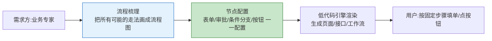

低代码的底层哲学是 **MDE(模型驱动工程,Model-Driven Engineering)** + **约定优于配置**:
- **先有流程,后有系统**。业务专家必须把一条路径拆成「节点A→节点B→条件分支→节点C」的**静态流程图**,一个节点一个节点配置好,系统才能跑。
- **核心价值=降低开发门槛**。让业务人员/非程序员通过「拖组件、配属性、画流程图」就能搭系统,把原本 3 人月的开发压到 3 人日。
- **天然擅长「确定性任务」**:审批流、表单录入、CRUD、报表、固定规则计算。

> 一句话:**低代码是「铁路系统」—— 铁轨铺到哪,火车才能跑到哪;铁轨没铺的地方,它一步都动不了。好处是稳定、准点、安全、可控、低成本。**

### 1.2 Agent 平台的设计理念:「给目标就行,路径我自己推理」

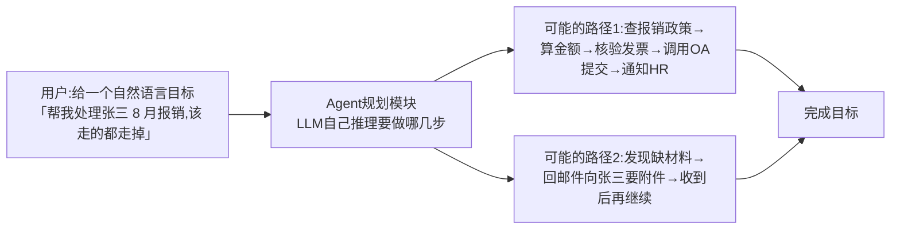

Agent 的底层哲学是 **Goal-Driven + LLM Reasoning + Tool Use**:
- **先有目标,后有路径**。用户不需要(也往往做不到)把每一步画成流程图,Agent 自己通过 LLM 做「任务分解 → 工具选择 → 多轮执行 → 异常处理」。
- **核心价值=应对不确定性与长尾场景**。面对「100 个用户的同一个目标,有 70 种不同走法」的长尾场景,Agent 不用改配置就能应对。
- **天然擅长「半结构化/非结构化/模糊任务」**:文档问答、多系统编排、客户服务、信息搜集总结、研究报告、异常处理。

> 一句话:**Agent 是「自动驾驶系统」—— 你只要说「去机场」,它自己会选路、看红灯、避堵车、绕修路;代价是偶尔会走错路,所以需要护栏与人类接管。**

### 1.3 一句话总差异(电梯版,10 秒讲清楚)

> **低代码 = 人铺好铁轨,火车按轨道跑。**
>
> **Agent = 人给目的地,AI 自己找路开过去。**

| 比喻 | 铁轨(静态路径) / 自动驾驶(动态路径) | 最擅长 | 最怕 |
|------|:----------------------------------:|-------|-----|
| 低代码 | 铁轨,100% 预先铺好 | 强规则、强合规、强流程 | 需求天天变、路径长尾多、非结构化输入 |
| Agent | 自动驾驶,LLM 动态规划 | 模糊目标、非结构化、长尾、多系统编排 | 100% 零差错、强合规不可错、每步必须留痕审批 |

---

## 二、七大维度全面对比(核心章节)

### 2.0 总对比表(一张表看懂全局)

| 对比维度 | 低代码平台(Low-Code Platform) | Agent 平台(LLM Agent Platform) |
|---------|------------------------------|-------------------------------|
| **设计哲学** | 模型驱动(MDE),**路径先于目标**(先铺铁轨) | 目标驱动,**目标先于路径**(给终点自己找路) |
| **最擅长任务** | 确定性 / 强规则 / 强流程 / CRUD | 半结构化 / 模糊 / 长尾 / 多系统编排 / 非结构化处理 |
| **开发输入** | 业务流程图 + 表单字段 + 审批节点 + 规则 | 自然语言目标 + 工具集 + 知识库(RAG) + 记忆 |
| **核心引擎** | 表单渲染引擎 + 工作流引擎 + 规则引擎 + 权限引擎 | LLM + 规划器(Planner) + 工具调用(Tool Use)+ 记忆(Memory)+ RAG 检索器 |
| **典型用户画像** | 业务分析师 / 产品运营 / 资深 Excel 用户(「平民开发者」) | 高级知识工作者 / 售前 / 研究员 / 客服主管 / 专家角色 |
| **交互形态** | 拖拽组件 + 表单 + 点按钮 + 审批同意/驳回 | 自然语言对话 + 多轮澄清 + 人类接管 + 工具反馈呈现 |
| **输出确定性** | ★★★★★ 100% 确定性(同样输入=同样输出) | ★★★☆☆ 80~99% 确定性(LLM 有概率性,需护栏+人工接管) |
| **上线前是否需要完整流程图** | ✅ 必须要有,缺一个分支节点就跑不通 | ❌ 不需要,给出目标 + 工具 + 边界条件即可 |
| **需求变更成本**(需求变 20%) | 中(要改流程图/表单/权限,0.5~3 人日) | 低(改 Prompt / 加工具 / 加文档,0.5~1 人日) |
| **长尾场景处理能力**(第 99 百分位需求) | ★☆☆☆☆:必须新增节点/分支,否则卡死 | ★★★★☆:LLM 自己推理适配,多数无需改代码 |
| **合规可审计性** | ★★★★★ 每一步节点留痕,直接过审计 | ★★★☆☆ 需额外加「每步留痕 + 人工双审 + 护栏」才能合规 |
| **开发交付速度**(典型项目) | 3 天 ~ 2 周 | 2 周 ~ 2 个月(含护栏 + 调优 + 评估) |
| **使用门槛(用户侧)** | 极低,和传统系统一样点按钮填表 | 中,需要会写高质量自然语言 Prompt |
| **失败模式** | **卡死**:某个分支没配好,流程走不下去 | **幻觉/跑偏**:看似做完了,实际做错了/瞎编了 |
| **失败后果** | 中低:跑不下去会报错,用户叫 IT 修 | 高:做错了用户可能没发现,直接流转造成损失 |
| **ROI 适合的项目规模** | 中小型流程固化项目(50w 以内最香) | 中大型长尾复杂项目(100w+,人效提升 10 倍以上才香) |

### 2.1 维度一:技术架构差异

```mermaid
flowchart TB
    subgraph LCA[低代码平台参考架构]
        L1[设计态:画布/表单设计器/流程设计器/规则设计器] --> L2[模型层:JSON Schema/ BPMN2.0/ DSL描述]
        L2 --> L3[运行态引擎:表单渲染引擎+工作流引擎+权限引擎+规则引擎+报表引擎]
        L3 --> L4[标准集成层:REST/OData/SQL/钉钉飞书Webhook]
        L4 --> L5[数据源:MySQL/PostgreSQL/Oracle]
    end
    subgraph AGA[Agent平台参考架构]
        A0[接入层:对话前端/飞书/钉钉/API] --> A1[交互与上下文管理]
        A1 --> A2[LLM推理层:私有化+公有云混合路由]
        A2 --> A3[核心Agent循环:Planner规划→Tool工具执行→Observation观察→反思→再规划]
        A3 --> A4[四大核心能力:Memory短期+长期记忆<br/>RAG检索增强<br/>ToolCalling工具调用<br/>Reflection自我反思]
        A4 --> A5[安全与护栏:RBAC+ABAC/PI防护/DLP/输出Guardrails/审计180天]
        A5 --> A6[外部世界:企业系统/文件/浏览器/API/数据库/邮件]
    end
    style LCA fill:#e3f2fd,stroke:#1565c0
    style AGA fill:#fff3e0,stroke:#ef6c00
```

**架构层面的 4 个「本质不同」**:

| # | 架构差异点 | 低代码 | Agent |
|:-:|-----------|-------|-------|
| A1 | **控制流来源** | 设计师画的流程图(BPMN/JSON),**静态可枚举** | LLM Planner 每次推理生成的计划,**动态不可枚举** |
| A2 | **数据处理类型** | 90% 结构化字段(表单字段、DB 列) | 90% 非结构化 + 半结构化(文档、对话、邮件、文件) |
| A3 | **错误处理机制** | 条件分支 + 异常跳转节点(预先配好) | Reflection 反思 + 重试 + 人工接管兜底(动态) |
| A4 | **扩展新能力的方式** | 拖新组件 + 配新流程 + 写少量函数(脚本) | 加一个新工具(Tool Schema) + 文档进 RAG + Prompt 里写一下(一行函数声明式) |

### 2.2 维度二:应用场景差异

**黄金判断标准:**

```
✅ 低代码优势场景 = 流程清晰到「新员工入职 SOP 手册」能一条一条写清楚,且一年改不了几次
✅ Agent 优势场景 = 任务难以写成 SOP,或者写 SOP 的成本比找人做还高,或者写完 3 个月就过时
```

| 场景类别 | 优先选低代码 | 优先选 Agent | 两者混合 |
|---------|------------|------------|---------|
| 办公自动化 | 请假/报销/入职/离职审批流(固定) | 复杂报销政策解读+多系统自动填单+异常处理 | ⭐ 案例三就是这种混合 |
| 客户服务 | 客户信息录入/工单分派(节点固定) | 客户问题智能应答+RAG知识库+情绪识别+自动升级 | 混合:低代码工单+Agent应答 |
| 销售管理 | CRM 录入/商机流程/订单审批 | 售前智能问答+标书/RFP自动生成+客户研究报告 | ⭐ 案例二:Agent为主 |
| 财务合规 | 费用标准/预算控制/固定对账 | 合同风险条款识别+多准则财务分析+异常对账解释 | 混合:低代码管台账+Agent做解读 |
| 人事管理 | 入职/转正/调动/离职表单流 | 政策问答+绩效反馈初稿+简历初筛+面试日程编排 | 混合:表单低代码+问答Agent |
| 知识管理 | 固定知识库目录/标签体系/审批发布 | 文档问答+摘要+多文档对比+跨文档推理+报告撰写 | Agent为主,低代码运营后台 |
| 研发运维 | Bug 录入/需求池/发布审批(固定) | 根因分析+日志排查+代码解释+SQL自动生成+运维排障 | 混合:工单低代码+排障Agent |

### 2.3 维度三:核心功能差异

| 功能模块 | 低代码平台标配 | Agent 平台标配 | 两者都有但目的不同 |
|---------|---------------|---------------|----------------|
| **可视化能力** | 表单/流程/规则/报表 4 大设计器 | Prompt/工具/RAG 调试台 + 思维链可视化 | 用户管理/权限/日志(低代码=运营,Agent=安全审计) |
| **流程处理** | 显式工作流(BPMN 2.0/自研) | 隐式工作流(每次动态规划) | 审批节点:低代码=必须过;Agent=触发工具调用低代码审批 |
| **数据与知识** | 结构化 CRUD + 关系型数据库 | RAG 检索 + 非结构化向量库 + 长期记忆 | 数据源集成(低代码写DB;Agent调工具读DB) |
| **用户交互** | 表单/按钮/表格/图表/看板 | 对话/澄清问题/建议卡片/多模态 | 通知(站内信/IM/邮件) |
| **集成能力** | 标准 API/数据库/钉钉飞书/组件市场 | 工具调用 + 浏览器 + 代码执行沙箱 + 任意 API | 都需认证鉴权(OAuth2/mTLS) |
| **AI 能力(进阶)** | 可选:AI 组件市场(智能填单/字段识别) | 核心:LLM 推理 + 反思 + 规划 | 合规护栏(低代码规则引擎/Agent Guardrails) |
| **审计与安全** | 操作日志+字段级权限+审批留痕 | 思维链全量审计+安全沙箱+DLP+PI防护 | 等保三级/个保法对齐 |

### 2.4 维度四:用户定位差异(谁能用,谁要用)

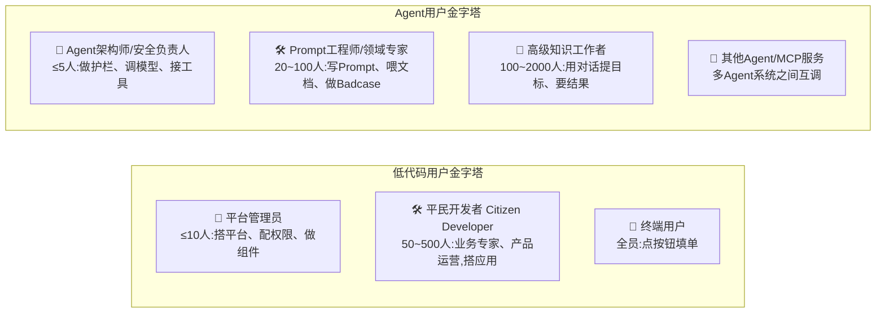

**关键差异:**
- 低代码的**最大用户群是「业务人员自己搭应用」**,价值在**开发侧降门槛**。
- Agent 的最大用户群是**「知识工作者获得超能力助手」**,价值在**使用侧提人效**。
- 低代码是「让不会写代码的人造系统」;Agent 是「让会思考的人思考更高效,把执行交给 AI」。

### 2.5 维度五:开发模式差异(怎么造出来)

| 环节 | 低代码项目开发流程 | Agent 项目开发流程 |
|-----|------------------|------------------|
| **需求调研** | 画完整流程图 → 穷举所有分支(「分支没画到=上线就报错」) | 收集典型目标+失败边界+合规红线(「不用画全路径,但要知道什么不能做」) |
| **设计阶段** | 表单字段 + 流程节点 + 权限矩阵 + 规则 | Prompt 框架 + 工具清单(Tool Schema)+ RAG 文档切片策略 + Memory 设计 |
| **实现阶段** | 拖组件→连线→配属性→写少量脚本 | 接LLM→封装工具→喂RAG→写评估集(≥200条) → 跑评估(Prompt/切片/模型 A/B) |
| **测试阶段** | 分支覆盖率 100%(每个流程图分支都点一遍) | 评估集通过率 ≥ 85% + 幻觉率 ≤ 10% + Badcase Top50 人工过一遍 |
| **上线阶段** | 部署 + 权限 + 数据迁移 + 培训 | 灰度 5% → 30% → 100%,人工接管率 ≤ 5% 才全量 |
| **运维迭代** | 每月改流程配置 1~2 次 | 每周补 Badcase → 再评估 + 补文档进 RAG + 调 Prompt |
| **交付物形态** | 配置文件(JSON/YAML)+ 少量脚本 + 数据表结构 | Prompt 库 + Tool 代码 + RAG 知识库 + 评估集 + 护栏策略 |

> 面试/汇报金句:**「低代码项目失败 80% 是因为「业务流程图没画全,分支漏了」;Agent 项目失败 80% 是因为「评估集没建,护栏没做,幻觉率高到用户不敢用」。这两种失败根因完全不同,所以项目管理方式也完全不同。」**

### 2.6 维度六:交互方式差异(怎么用)

| 交互维度 | 低代码 | Agent |
|---------|-------|-------|
| **主入口** | 页面/菜单/按钮/表单/审批待办 | 对话框(文字/语音/多模态)+ 快捷指令 |
| **输入方式** | 点按钮 / 选下拉框 / 填字段 / 上传附件 / 扫码 | 自然语言(中/英混) / 附件 / 截图 / 语音 / 一句模糊目标 |
| **系统提问用户的情况** | 极少,只有必填字段没填会弹「请填」 | 频繁:**Agent 会主动澄清 5W1H**(「要查 8 月还是全部?张三是北京公司还是上海公司的张三?」) |
| **反馈呈现** | 固定结果页 / 表格 / 图表 / 审批流状态 | 思维链展开(用户可看 Agent 在想什么)+ 引用来源 + 建议下一步卡片 |
| **中途改需求** | 几乎不支持:流程已走到节点 4 想改节点 2 = 退回重填 | 天然支持:对话中加一句「哦对了,不要算张三那个报销,那个是上个月的」即可 |
| **多轮深度** | 低:一次操作完成 1 个任务节点 | 高:一个目标下可能几十轮交互(查→写→调→反思→再调…) |
| **学习成本** | 极低:老员工 1 小时上手 | 中:高质量 Prompt 技巧需要 4~8 小时培训(可参考「2大模型基础-Prompt方法论」系列) |

### 2.7 维度七:能力边界差异(各自做不到什么)

> **这一维度是选型的「生死线」**——选错了不是成本问题,是做了半年做不出来的风险。

| # | 低代码「基本做不到,做出来成本堪比从零开发」 | Agent「基本做不到,做出来会反复踩坑翻车」 |
|:-:|------------------------------------------|-----------------------------------------|
| B1 | 第 99 百分位长尾需求:100 个用户问 90 种变体,每个配分支成本爆炸 | 交易级 100% 正确:转账/发工资/合同盖章,错一个就是事故 |
| B2 | 非结构化输入:一段录音、一份合同扫描件、一段聊天记录,直接提取信息做任务 | 合规硬留痕:每一步必须留「双人审批 + 时间戳 + 签章」,Agent 动态流程留痕要额外加很多护栏 |
| B3 | 多系统无固定 API 编排:比如「去飞书找聊天记录→去邮件找附件→去合同系统比对→写报告」,没现成流程 | 像素级像素 UI:做一个「左边树+右边表单+底部表格」的管理后台,Agent 写出来像素一致性 0 |
| B4 | 模糊目标:「帮我看看最近报销有没有异常」—— 没有定义「异常」是什么 | 强数学运算/大规模数据计算:算 10w 行复杂公式账,Agent 幻觉概率 30%+,必须调工具让代码执行 |
| B5 | 文档/知识跨系统推理:从 100 份 PDF 里对比差异生成观点 | 一致性视觉体验:和公司 App 完全统一的 UI/UX,Agent 对话 UI 做不到像素级定制 |
| B6 | 自然语言语义理解:用户表达不规范、有错别字、有省略 | 毫秒级响应:工作流节点跳转 <100ms,Agent 思考+调工具基本 3~30s |

---

## 三、混合协作架构:80% 的真实企业项目其实是「低代码 + Agent」混搭

### 3.1 为什么非黑即白会死得很惨

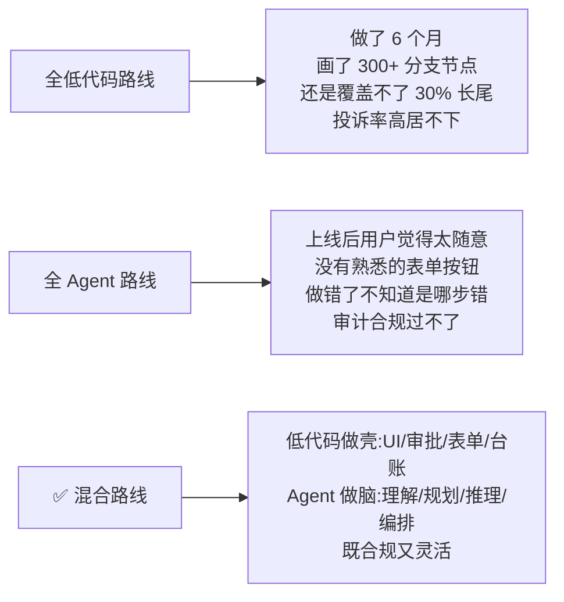

真实企业里,10 个项目大概是:
- 1 个纯低代码(合同审批)
- 1 个纯 Agent(研究报告生成)
- **8 个混合**(表单+问答+审批+自动化都有)

### 3.2 推荐混合架构:低代码做「壳」+ Agent 做「脑」+ RAG 做「知识库」+ 工具做「手」

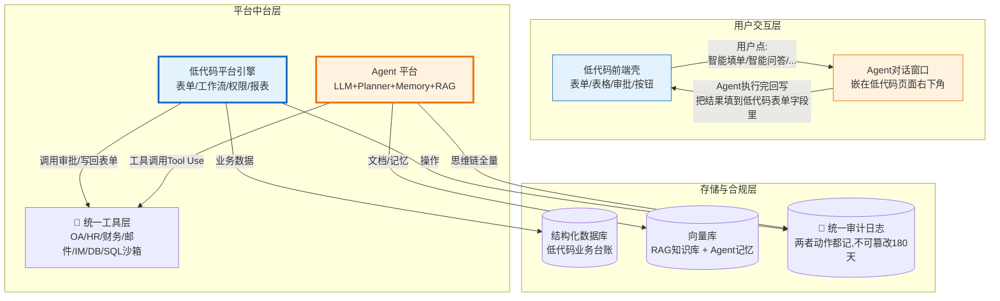

### 3.3 混合架构的 5 种典型协作模式 + 调用序列图

**模式 1:** Agent 智能填单(最常用)
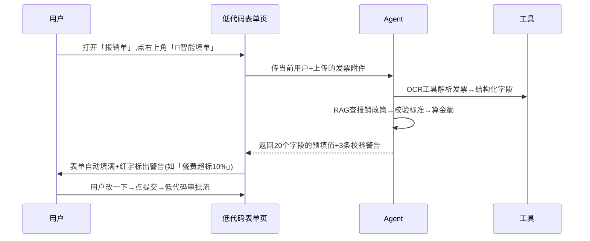

**模式 2:** Agent 审批辅助(合规高风险场景)
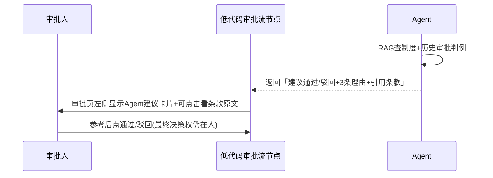

**模式 3:** 低代码表单收集信息 → Agent 做重任务(长报告/复杂计算)
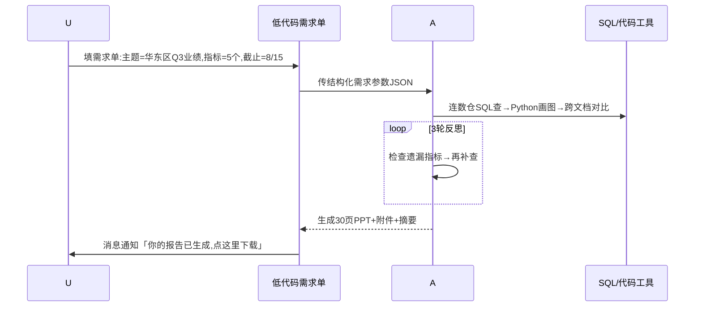

**模式 4:** Agent 问答 + 低代码工单系统联动
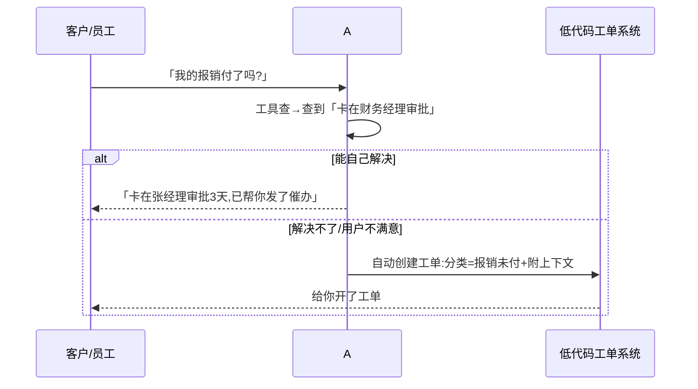

**模式 5:** 低代码配置护栏策略 → Agent 运行时读取执行
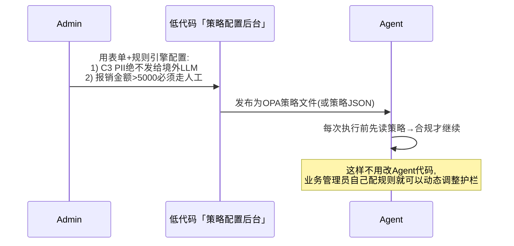

---

## 四、三个真实项目案例的选型决策复盘(项目经验核心产出)

### 案例一:合同审批系统改造 → 选「低代码为主 + 少量 Agent 辅助」

| 项 | 内容 |
|----|------|
| **项目背景** | 集团法务部:12 类合同模板、审批节点 4~10 个、涉及金额 ≥1 亿/月、**合规是第一优先级** |
| **为什么「低代码为主」** | 合同审批每一步节点明确(经办人→部门→法务→财务→章管→归档),节点变更 ≤2 次/年,合规留痕要求每步双人签章 |
| **哪里「少量加 Agent」** | 只加 3 个辅助点:①上传合同扫描件后 Agent 自动填单(OCR→字段)②审批节点前 Agent 风险条款识别(给出高风险条款建议,最终审批权仍在法务)③归档后 Agent 自动生成合同摘要卡片 |
| **选型结果(打分卡量化)** | 低代码 87 分,Agent 55 分,混合推荐比例「9:1」 |
| **实施周期** | 低代码 3 周 + Agent 辅助功能 2 周,总计 5 周上线 |
| **上线效果** | 合同处理周期 5.2 天 → 2.8 天;法务人工审查时间降 40%;错漏审批节点 0(低代码 100% 卡死流程) |
| **ROI(1 年)** | 投入 45 万(低代码授权 30 + 开发 15);节省法务人力 2.5 人年 ≈ 125 万;**ROI ≈ 2.8×** |
| **如果当初选「纯 Agent」会怎样** | 幻觉率 5% 意味着每月 50 份合同可能错配审批人/漏章 → 审计过不了 + 合规风险不可接受,项目 100% 会被叫停。 |

### 案例二:售前智能应答 + 标书自动生成 → 选「Agent 为主 + 低代码轻量运营后台」

| 项 | 内容 |
|----|------|
| **项目背景** | 软件公司售前部:30 个售前,对接 500+ 客户/年,回答产品/报价/案例/竞品问题 + 写 50~200 页标书/RFP。**问题是「长尾爆炸」**(每个客户问法都不一样) |
| **为什么「Agent 为主」** | 售前问答 100 个客户 = 80 种不同问法,如果低代码配置 FAQ 分支节点=半年也配不完,而且 3 个月就过时;标书生成更不可能配固定表单 |
| **哪里「少量加低代码」** | 1) 运营运营后台:RAG 文档上传/打标/版本管理(低代码表单 2 天搭完,比开发管理后台省 3 周)2) 标书模板配置页:章节/占位符/公司信息低代码表单维护 3) 客户问题反馈工单系统(用户标错答案→进低代码工单,Prompt工程师处理) |
| **选型结果打分** | 低代码 50 分,Agent 90 分,混合推荐比例「1:9」 |
| **实施周期** | Agent 4 周(RAG+工具+评估集 300 条)+ 低代码后台 1 周,总计 5 周(其中 4 周是 Agent 调优和评估) |
| **上线效果** | 售前应答平均 30 分钟 → 3 分钟;标书平均 4 人天 → 0.5 人天;首年中标率提升 12%(案例更全 + 交标更快) |
| **ROI(1 年)** | 投入 90 万(LLM+向量库+开发+数据);节省售前人力 8 人年 ≈ 480 万,新增中标额估算 2000 万+;**ROI > 10×** |
| **如果当初选「纯低代码」会怎样** | 配置 FAQ 半年后发现:80% 的真实客户问题不在 FAQ 节点里,用户天天跳出来叫 IT 加节点;IT 配置团队膨胀到 10 人+ 还跟不上,**ROI 会从 10× 变成 0.2×,项目铁定被砍。** |

### 案例三:员工报销 HR/财务联合服务台 → 选「Agent + 低代码 5:5 深度融合」(最具普适性)

| 项 | 内容 |
|----|------|
| **项目背景** | 5000 人企业:报销 / 入职 / 休假 / 证明 / 工资条问题 5 大类,HR+财务联合服务台 15 个人,每月 1 万次服务请求,**一半是固定流程(报销审批),一半是长尾问答/解释/异常处理** |
| **为什么「5:5 融合」** | 一半:报销审批强流程,必须低代码(合规 0 差错);另一半:「这个能报吗?我发票丢了怎么办?我要去年的完税证明」长尾千变万化,必须 Agent;另外需要两者无缝配合(用户问完,Agent 自动帮用户把报销单填好,用户点提交进低代码审批) |
| **具体分工(怎么切)** | 🔵 低代码(50%):报销单审批流/工资台账/休假申请单/HR证明开具/服务台工单系统/用户反馈后台<br/>🟠 Agent(50%):政策智能问答(查30份制度+历史判例)+ 填单助手(OCR发票自动填)+ 异常处理智能路由 + 工单自动分派 + 员工自助报告生成 |
| **选型结果打分** | 低代码 80 分,Agent 82 分,混合推荐比例「5:5」 |
| **实施周期** | 低代码审批+工单 4 周 + Agent 问答+填单 4 周 + 融合联调 2 周,总计 10 周 |
| **上线效果** | 服务台 15 人 → 8 人(人效提升近 1 倍),剩余人力转做员工关系等高价值;员工平均等待 24 小时 → 2 分钟(Agent 秒答);满意度 3.5/5 → 4.4/5 |
| **ROI(1 年)** | 投入 110 万(低代码+Agent 授权+开发);节省人力 7 人年 ≈ 350 万+ 员工满意度提升带来的流失率下降价值;**ROI ≈ 5×** |
| **项目最大坑(复盘教训)** | 初期做成了「两个独立系统」:员工要先开对话问,问完再自己跳到报销系统填 → 跳失率 60%。后来改成「对话内嵌在报销页右下角,填单按钮一键回写」→ 跳失率降到 8%。**经验:混合架构不能是「两个房子」,必须是「同个房子客厅放低代码,阳台放 Agent 对话」** |

> 三案例对比总表(一眼记住):
>
> | 场景 | 决策 | 混合比 | ROI |
> |-----|------|:-----:|:---:|
> | 合同审批(强合规+流程固定) | 低代码为主 | 9:1 | 2.8× |
> | 售前标书(长尾+非结构化) | Agent 为主 | 1:9 | 10×+ |
> | HR/财务服务台(一半一半) | 5:5 融合 | 5:5 | 5× |

---

## 五、10 步选型决策树(拿到需求 15 分钟出结论)

### 5.1 决策树流程图

```mermaid
flowchart TD
    S[开始:拿到新需求] --> Q1{合规是不可动摇的第一优先级吗?<br/>如:资金/合同/人事档案/审计强留痕}
    Q1 -->|✅ 是| Q1A{流程固定吗?一年变几次?}
    Q1A -->|✅ 一年≤2次| D1[🟦 结论:低代码为主<br/>关键审批/计算/留痕用低代码<br/>+ 10%以内辅助Agent填单/摘要]
    Q1A -->|❌ 一个季度变一次以上| M1[⚠ 不适合纯低代码<br/>→走混合:合规节点走低代码<br/>灵活问答/适配走Agent]

    Q1 -->|❌ 否| Q2{需求能写成一份「100%覆盖所有分支」的SOP吗?<br/>写SOP的成本<1人月?}
    Q2 -->|✅ 能| D2[🟦 结论:低代码优先<br/>搭起来快,培训简单,稳定]
    Q2 -->|❌ 不能/写完就过时| Q3{输入/输出是非结构化为主吗?<br/>文档/合同/邮件/录音占比>50%?}
    Q3 -->|✅ 是| D3[🟠 结论:Agent优先<br/>非结构化是Agent主场]
    Q3 -->|❌ 否| Q4{80%的任务是相同路径?还是长尾(>20%任务走独有的路)?}
    Q4 -->|✅ 80%同路径| D2
    Q4 -->|❌ 长尾20%以上| Q5{用户能接受<5%的错误率/幻觉吗?<br/>做错了可以人工接管吗?}
    Q5 -->|✅ 能| D3
    Q5 -->|❌ 不能0差错| M2[⚠ 走混合:核心0差错节点走低代码+审批<br/>长尾适配走Agent]

    M1 --> FINAL
    M2 --> FINAL
    D1 --> FINAL[✅ 最终结论<br/>+ 填写5.2打分卡量化确认<br/>+ 估算ROI和风险]
    D2 --> FINAL
    D3 --> FINAL
```

### 5.2 选型打分卡(可直接复制到 Excel 量化打分)

**用法:每个项目打一次,满分 100,Agent 得分-低代码得分 ≥ +20 = Agent 优先;差值在 ±20 = 混合;差值 ≤ -20=低代码优先。**

| 打分项(共10项,每项10分) | 权重 | 越往哪侧越打高分 |
|------------------------|:----:|--------------|
| 1. 合规与0差错要求 | 10分 | 要求越高→低代码分越高 |
| 2. 流程SOP可枚举程度 | 10分 | 越能枚举清楚→低代码分越高 |
| 3. 非结构化输入占比 | 10分 | 非结构化越高→Agent分越高 |
| 4. 长尾场景占比(第99百分位) | 10分 | 长尾越多→Agent分越高 |
| 5. 用户体验对「响应毫秒级」要求 | 10分 | 毫秒级→低代码分越高(Agent慢) |
| 6. 需求变更频率 | 10分 | 越频繁变更→Agent分越高 |
| 7. 用户画像(Citizen开发者 vs 知识工作者) | 10分 | 平民开发者→低代码;知识工作者→Agent |
| 8. 跨系统无固定API编排数 | 10分 | 跨越多无API→Agent分越高 |
| 9. 像素级定制UI/品牌一致性 | 10分 | 要求越高→低代码分越高 |
| 10. 预算与交付周期 | 10分 | 预算少/周期短(<3周)→低代码;预算充足/长周期→Agent |

**三案例用这个卡打出来的分(和我们实际决策一致):**
- 案例一合同审批:低代码 87,Agent 55 → 差 -32 → 低代码为主 ✅
- 案例二售前标书:低代码 48,Agent 91 → 差 +43 → Agent 为主 ✅
- 案例三联合服务台:低代码 80,Agent 82 → 差 +2 → 5:5 混合 ✅

---

## 六、常见误区澄清(80% 的决策者踩过的坑)

| # | 误区(坑) | 真相(反坑) |
|:-:|---------|-----------|
| ❌ 1 | 「低代码加个聊天框,再挂个 LLM API = 已经做成 Agent 平台了」 | 这只是低代码+聊天 UI。Agent 核心是 Planner + Memory + 反思 + 工具调用 + 评估体系,缺任何一项都只是「加了聊天框的低代码」,案例二的售前标书 100% 做不出来。 |
| ❌ 2 | 「Agent 是下一代低代码,3 年内会全面替代低代码」 | 不会替代,只会分工。铁路和高速公路同时存在,自动驾驶也替代不了高铁运货运人。 |
| ❌ 3 | 「做 Agent 比做低代码贵,小公司先上低代码以后再换 Agent」 | 看场景:案例二售前标书 Agent 10× ROI,低代码 0.2×,一开始选错反而更贵。 |
| ❌ 4 | 「我们公司全员会 Excel,上低代码 = 全员能造系统」 | 真的能搭「可用+可维护」系统的 Citizen Developer ≤ 5%,其余人搭的是「玩具系统」,上线 3 个月必崩,需要平台运营团队兜底。 |
| ❌ 5 | 「Agent 只要接了 GPT-4o 就差不多了,其他都是小事」 | Agent 项目成本分布:LLM 10%,工具/集成 20%,护栏/安全/审计 20%,**评估集 + Badcase + Prompt 调优 50%**。不做评估集 = 上线即幻觉翻车。 |
| ❌ 6 | 「Agent 对话 UI 比低代码省前端开发,前端不用做了」 | 真实用户 70% 的操作还是要「表单/列表/图表」,对话是「智能入口」不是「全部界面」。案例三的坑:两个系统独立放,跳失率 60%。 |
| ❌ 7 | 「低代码 = 不用程序员,省掉开发团队」 | 低代码能省 60~80% 开发,但还剩 20~40%:复杂函数/集成/组件开发/性能调优/数据迁移,还必须有开发团队。完全没程序员 = 低代码也玩不转。 |
| ❌ 8 | 「安全合规:Agent 多加审计日志就够了」 | 日志只是最后一环。Agent 合规章程:访问控制+护栏策略(OPA)+ 输出 Guardrails+ 敏感脱敏+DLP+人工接管双审,7 件套全上才够(详见 179/182 号安全面试题文档)。 |
| ❌ 9 | 「混合架构 = 买两个平台装一起就行」 | 不是两个房子,是打通的一间房:①单点登录打通 ②会话上下文共享 ③Agent 执行完能写回低代码字段 ④低代码策略配置能动态更新 Agent 护栏 ⑤统一审计 ⑥UI 同个窗口内嵌。6 个打通点做不到 = 还是两个孤岛。 |
| ❌ 10 | 「选型 = 投票决定:技术投 Agent,业务投低代码,最后听老板」 | 请用 5.1 决策树 + 5.2 打分卡 + 三案例 ROI,**用量化数据说话**,否则每次选型都会变成「谁嗓门大听谁的」。 |

---

## 七、总结 + 最佳实践检查清单(今日 / 本周 / 每项目)

### 总结三句话

> **第一句(根差异)**
> 低代码 = 人铺铁轨,火车按轨道跑 → 适合**强合规、强流程、长命稳定**的确定性系统。
> Agent = 人给目的地,AI 自己找路开 → 适合**长尾爆炸、非结构化、高复杂度**的不确定性任务。
>
> **第二句(80%项目真相)**
> 大多数企业真实需求 = 一半确定一半长尾 → **低代码 + Agent 混合架构**才是王道:低代码做「壳」(UI/表单/审批/合规 0 差错),Agent 做「脑」(问答/填单/解释/编排/异常处理)。
>
> **第三句(选型法)**
> 别凭感觉,按「决策树 10 步走 + 10 项打分卡 + 三案例 ROI 对标」做决策 → 15 分钟内能拿出一份量化、带案例、带 ROI 的决策结论。

### 最佳实践检查清单(落地用)

```
============================================================================
 今日:把本项目/本周需求拿出来,做一次选型练习
============================================================================
✅ T-1  列出当前手头在谈/在做的 3 个项目,每个填 5.2 打分卡
✅ T-2  对照 5.1 决策树,为每个项目出初步结论
✅ T-3  对标 4 章 3 个案例,看有没有「场景类似但选型反了」的项目

============================================================================
 本周:如果已经/正在上低代码/Agent,做一次架构匹配度自查
============================================================================
✅ W-1  架构是否是「打通的同屋」而不是「两个孤岛」?6 个打通点检查:
        [ ] SSO互通 [ ] 上下文共享 [ ] Agent写回低代码字段
        [ ] 低代码策略能动态更新Agent护栏 [ ] 统一审计 [ ] UI同窗口内嵌
✅ W-2  安全护栏是否到位?尤其 Agent 侧(访问控制/脱敏/审计/DLP/PI防护 7 件套)
✅ W-3  Agent 项目是否已建立 200+ 条评估集并做过 ≥3 轮评估?(没做的立即补)
✅ W-4  低代码项目是否有「Citizen Developer 」的治理机制?(谁能搭/上线标准/变更审计)

============================================================================
 每个项目:项目启动前必过的选型6问(缺一个不准立项)
============================================================================
✅ P-1  合规/0差错是第一优先级吗?如果是,关键节点是否放低代码?
✅ P-2  流程SOP能枚举吗?枚举成本?写SOP的人和上线后维护的人是同一拨吗?
✅ P-3  非结构化输入占比多少?长尾20%以下还是以上?
✅ P-4  用户画像是什么?平民开发者多 → 低代码;知识工作者多 → Agent
✅ P-5  用5.2打分卡算过分差了吗?分差多少?
✅ P-6  ROI估算过了吗?(3案例对标 + 人力节省 × 人单价 - 投入)

============================================================================
 每季度:架构演进评审
============================================================================
✅ Q-1  Agent 评估集命中率是升了还是降了?幻觉率 <10% 吗?
✅ Q-2  低代码「平民开发者」搭的系统,可维护性评分及格吗?
✅ Q-3  混合架构 6 个打通点有没有新增?覆盖率从 3/6 → 6/6 了吗?
✅ Q-4  用户满意度分场景对比:纯低代码场景 vs 纯 Agent 场景 vs 混合场景?
============================================================================
```

---

> **项目经验文档系列关联阅读**
>
> - [154Agent自主学习功能设计与实现完整方案](./154Agent自主学习功能设计与实现完整方案.md):Agent侧做「脑」时,自主学习能力是加分项,案例二、三中用得上。
> - [155Agent未来发展方向全景解析:技术演进架构趋势与落地路径](./155Agent未来发展方向全景解析_技术演进架构趋势与落地路径.md):Agent 平台未来会如何演进?低代码平台未来会加哪些 Agent 能力?两者的融合趋势在 155 号文档中有更长期视角。
>
> **安全与合规关联阅读**
>
> - [179Agent安全保障体系设计面试题详解](../14%E9%AB%98%E7%BA%A7%20Agent%20%E9%9D%A2%E8%AF%95%E9%A2%98/179Agent%E5%AE%89%E5%85%A8%E4%BF%9D%E9%9A%9C%E4%BD%93%E7%B3%BB%E8%AE%BE%E8%AE%A1%E9%9D%A2%E8%AF%95%E9%A2%98%E8%AF%A6%E8%A7%A3.md):混合架构中 Agent 护栏 7 件套的深度展开。
> - [182Agent系统数据泄露防护机制全生命周期设计面试题详解](../14%E9%AB%98%E7%BA%A7%20Agent%20%E9%9D%A2%E8%AF%95%E9%A2%98/182Agent%E7%B3%BB%E7%BB%9F%E6%95%B0%E6%8D%AE%E6%B3%84%E9%9C%B2%E9%98%B2%E6%8A%A4%E6%9C%BA%E5%88%B6%E5%85%A8%E7%94%9F%E5%91%BD%E5%91%A8%E6%9C%9F%E8%AE%BE%E8%AE%A1%E9%9D%A2%E8%AF%95%E9%A2%98%E8%AF%A6%E8%A7%A3.md):统一审计、PII 分级、跨境合规、UEBA 告警等混合架构共用的安全机制。
