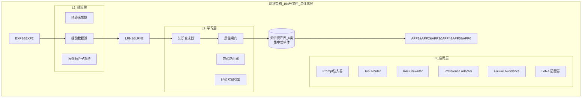
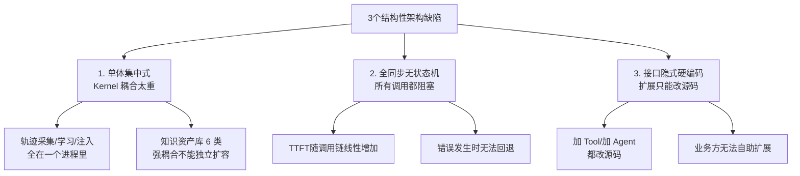
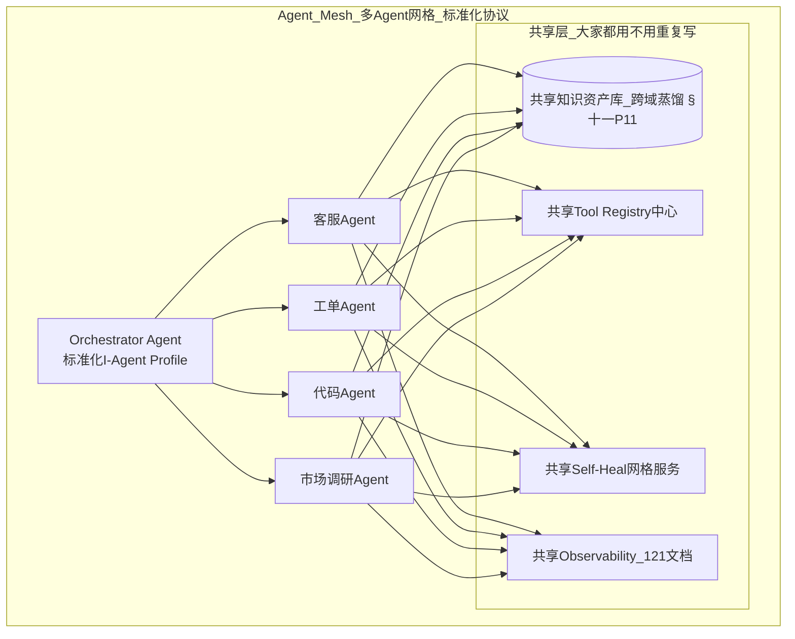

# Agent 系统重新设计完整方案:架构优化 · 功能增强 · 性能提升 · 可扩展 · 用户体验五维全景

> **文档定位**:本文档是 `13项目经验` 系列的**架构重设计专题篇**。在 [154Agent自主学习功能设计与实现完整方案.md](./154Agent自主学习功能设计与实现完整方案.md) 已交付的三层七子系统基础上,基于"项目上线 6 个月后遇到的真实瓶颈",从 5 大维度对 Agent 系统进行全面的重新设计与优化升级。
>
> **本文回答的核心问题:**
> 1. 现有三层架构在规模化时(100+ Agent 实例 / 日 10W+ 任务)会暴露出哪些瓶颈?
> 2. 架构、功能、性能、可扩展性、用户体验 5 大维度,各自要改什么、怎么改、先改什么?
> 3. 每项优化的**实施步骤 / 预期效果 / 技术可行性 / 回滚方案**是什么?
> 4. 关键代码模块(异步调度、插件化 Tool、流式响应、错误自愈、标准化接口)的工程化实现参考。
>
> **前置阅读**:
> - [154Agent自主学习功能设计与实现完整方案.md](./154Agent自主学习功能设计与实现完整方案.md)
> - [155Agent与AGI概念关系_技术联系及应用差异深度解析.md](./155Agent与AGI概念关系_技术联系及应用差异深度解析.md)
> - 配套性能监控:[../10Agent性能优化/121Agent运行状态全面监控方案深度解析与实现.md](../10Agent性能优化/121Agent运行状态全面监控方案深度解析与实现.md)

---

## 目录

- [一、现有系统基线与问题诊断(现状 × 瓶颈 × 根因)](#一现有系统基线与问题诊断现状--瓶颈--根因)
- [二、重设计总体目标与原则(5 维 × 量化指标)](#二重设计总体目标与原则5-维--量化指标)
- [三、维度 1:架构优化 — 从单体三层到插件化四层微内核](#三维度-1架构优化--从单体三层到插件化四层微内核)
- [四、维度 2:功能增强 — 错误自愈、流式思考、Tool 插件市场、推理缓存](#四维度-2功能增强--错误自愈流式思考tool-插件市场推理缓存)
- [五、维度 3:性能提升 — 降资源、提速度、提并发的 12 项工程手段](#五维度-3性能提升--降资源提速度提并发的-12-项工程手段)
- [六、维度 4:可扩展性改进 — 标准化接口 + 插件协议 + 多 Agent 网格](#六维度-4可扩展性改进--标准化接口--插件协议--多-agent-网格)
- [七、维度 5:用户体验优化 — 可视化思维链、可控节奏、反馈交互闭环](#七维度-5用户体验优化--可视化思维链可控节奏反馈交互闭环)
- [八、分阶段实施路线图:4 期 16 周 + 每季度回归](#八分阶段实施路线图4-期-16-周--每季度回归)
- [九、预期效果与技术可行性对照表](#九预期效果与技术可行性对照表)
- [十、风险、回滚与灰度发布策略](#十风险回滚与灰度发布策略)

---

## 一、现有系统基线与问题诊断(现状 × 瓶颈 × 根因)

### 1.1 现有架构回顾(来自 154 §2 三层七子系统)



### 1.2 规模化后的 12 大问题诊断表(按严重度排序)

| 编号 | 问题现象(上线6个月后) | 出现场景 | 严重度 | 根因定位(架构/代码/配置) |
|:---:|-------------------|---------|:-----:|----------------------|
| **P1** | 日均 10W+ 任务时,`WeeklyLearningPipeline` 清洗+挖掘跑 **36 小时跑不完** | 周级批处理日 🔴 | 🔴 P0 | L2 学习层是**单机同步 Python**,无分布式调度;经验数据湖无索引 |
| **P2** | Agent 首 Token 延迟(TTFT)P99 从 1.2s 劣化到 **4.8s** | 高峰并发>500 🔴 | 🔴 P0 | §7.3 `RuntimeKnowledgeInjector.build_system_prompt` 每次都查 4 个库,全是同步 IO;Prompt 模板越学越长,Token 数翻倍 |
| **P3** | `ToolRouter`(§3.3 LightGBM)**2-3 个月就失效**,选工具错误率从 8% 升到 28% | Tool 新增/业务变化 🟡 | 🔴 P0 | Router 是静态模型,无在线增量学习;新工具加入需要全量重训,重训周期 2 周 |
| **P4** | Agent 出现异常时(Tool超时/网络抖动/限流),**直接报错不重试、不降级、不让步** | 真实生产环境 🟡 | 🔴 P0 | 现有架构 §2 没有"错误自愈/降级执行"模块;§7.5 Orchestrator 无异常处理管线 |
| **P5** | 新增一个 Tool 要改 **5 处代码**,改完要重启 12 个服务实例 | 日常迭代 🟡 | 🟡 P1 | Tool 注册是硬编码在 Agent 里的,没有动态加载、没有 Schema 注册中心、没有接口标准化 |
| **P6** | 不同场景 Agent(P1 客服/P2 工单/P3 协作)**代码重复率 70%+**,改一处要复制三份 | Multi-Agent 扩展 🟡 | 🟡 P1 | 现有 §2.1 架构是"单 Agent 单例"视角,没有统一 Agent Kernel + 场景配置化的内核 |
| **P7** | RAG 平均检索 20 条 → Prompt 越长 → 成本越高,命中率反而从 85% 降到 **71%** | 长知识库 🟡 | 🟡 P1 | RAG 负例学习(F2)只做文档降权,没做"动态 Top-K 检索条数 + 查询路由多知识库" |
| **P8** | 用户感觉 Agent "在发呆",**思考 3-8 秒无任何输出**后一次性给结果 | 对话体验 🔴 | 🟡 P1 | 全链路只支持"最终结果输出",没有流式思考中间状态、没有进度事件 |
| **P9** | Reviewer 人审队列积压严重,HITL 闸门(§6.5)**审核延迟 3 天+** | 知识发布 🟡 | 🟠 P2 | HITL 是人工随机抽,没有"按风险优先级排序审核队列 + 自动预检减少人工量" |
| **P10** | 内存泄漏:Agent 实例跑满 7 天后 RSS 从 1.2GB 涨到 **8.4GB**,必须每周重启 | 长期运行 🔴 | 🟠 P2 | 运行期的轨迹 Buffer / Embedding Cache / Prompt 模板缓存**无 TTL + 无容量上限**(121 号文档经验 200832 差分法验证) |
| **P11** | 同一条"学到的知识"在 3 个业务 Agent 中**不通用**,客服Agent学会的工单分类Prompt,工单Agent还得重新学一遍 | 知识孤岛 🟡 | 🟠 P2 | 知识资产库按 `domain` 硬隔离,缺少"跨域知识共享 + 迁移 + 蒸馏"管线 |
| **P12** | 错误类型 200+,但用户只看到"抱歉出错了",**客服/开发都查不出原因为啥失败** | 问题排查 🟡 | 🟠 P2 | 错误码体系缺失、Trace ID 前端未展示、错误分类与建议动作未结构化 |

### 1.3 问题的架构层根因总结(3 个结构性缺陷)



> **本章结论**:154 号文档的三层七子系统在"冷启动-快速成长期"是合理且正确的。一旦进入"日均 10W+ 任务、多 Agent、多 Tool、持续迭代"的规模化阶段,就必须做本文档的五维重新设计。

---

## 二、重设计总体目标与原则(5 维 × 量化指标)

### 2.1 五维量化目标(基线→目标,对应 12 大问题)

| 优化维度 | 对应问题 | 核心目标(16周后) | 测量口径 |
|---------|:--------|:---------------|:--------|
| **架构优化** | P1 P5 P6 P10 | **4 层微内核架构 + 插件化**;学习批处理从 36h→**≤4h**;内存泄漏速率≤10MB/day | 批处理耗时 / RSS 差分(121 §经验200832) |
| **功能增强** | P3 P4 P7 P9 | Tool Router 月级失效→**在线增量自更新**;错误自愈率≥85%;RAG 命中率≥88%;HITL 延迟≤4h | Router 错误率 / 错误恢复自动率 / RAG命中 |
| **性能提升** | P2 P10 | TTFT P99 从 4.8s→**≤1.8s**;P99 任务总耗时降 40%;单实例承载量 +120% | 121 号文档监控指标 |
| **可扩展性** | P5 P6 P11 P12 | 新增 Tool 从改 5 处代码→**≤1 处(只写插件 JSON)**;新增 Agent 从 2 人周→**≤2 人天**;错误码标准化→100% 可追溯 | 迭代改动量统计 |
| **用户体验** | P8 P12 | "发呆"率→**<3%**;用户感知错误率从 18%→**≤4%**;NPS 提升 ≥20 分 | 用户行为埋点 + 问卷 |

### 2.2 重设计六大原则(约束"不能怎么改")

| 原则 | 具体约束 | 防止出现什么副作用 |
|-----|---------|------------------|
| **R1 渐进不推翻** | 154 号文档的经验层/学习层/知识资产**数据格式不变、接口兼容**;老 Agent 不改代码仍能跑 | 回滚不了、学习历史断裂 |
| **R2 接口先统一再改实现** | 所有模块**先抽象 Interface + 版本号**,再改底层实现 | 改完一处,其他 10 处都炸 |
| **R3 每改一处带开关** | 每一项优化都带**特性开关 Feature Flag**,支持 0-100% 流量灰度 | 全量翻车 |
| **R4 监控先于优化** | 优化项上线前,对应指标必须先接入 121 号文档监控体系 | 改完不知道有没有变好 |
| **R5 失败一定可降级** | 所有新模块(缓存/插件/自愈)"挂了"必须能回退到 154 号原逻辑,业务不中断 | 新单点故障拖垮整体 |
| **R6 每类优化同期最多做 2 项** | 4 期路线图,每期 5 维中最多选 2 个维度大改 | 耦合改动过多出问题找不到根因 |

---

## 三、维度 1:架构优化 — 从单体三层到插件化四层微内核

### 3.1 新旧架构对比图

```mermaid
flowchart TB
    subgraph 新架构_四层微内核_插件化
        direction TB
        
        subgraph L4_Runtime_运行内核层_轻量到几十MB
            K1[Agent MicroKernel<br/>只做生命周期/编排/安全/观测<br/>≈2000行核心代码]
            K2[Plugin Host<br/>加载 6 类插件<br/>→统一插件协议 §6]
            K3[Async Event Bus<br/>异步事件驱动<br/>同步阻塞→异步回调]
        end
        
        subgraph L3_Capabilities_能力插件层_热插拔
            P1["🪄 Prompt 插件<br/>F1 动态学习(继承自154)"]
            P2["🔍 RAG 插件<br/>F2 查询学习 + 动态TopK"]
            P3["🛠️ Tool Router 插件<br/>F3 + 在线增量学习 §4.2"]
            P4["📚 Skill-RAG 插件<br/>F4 + 跨域知识蒸馏"]
            P5["🛡️ Self-Heal 插件<br/>错误自愈 + 降级 §4.1"]
            P6["💾 Cache 插件<br/>推理/检索缓存 §4.3"]
            P1 ~~~ P2 ~~~ P3 ~~~ P4 ~~~ P5 ~~~ P6
        end
        
        subgraph L2_Learning_学习服务层_独立部署可水平扩展
            L1[分布式轨迹清洗服务]
            L2[模式挖掘集群<br/>(Spark/Ray)]
            L3[范式路由器服务<br/>gRPC API]
            L4[知识合成服务<br/>按范式独立扩容]
            L5[HITL 审核平台<br/>风险优先队列 §4.4]
        end
        
        subgraph L1_Data_数据层_6类独立存储_各自扩容
            DB1[(轨迹<br/>ClickHouse)]
            DB2[(经验湖<br/>S3/Parquet)]
            DB3[(向量库<br/>Milvus集群)]
            DB4[(知识资产<br/>Postgres分区)]
            DB5[(元数据/版本<br/>Redis)]
            DB6[(学习编排状态<br/>ZooKeeper)]
        end
    end
    
    K2 --> P1&P2&P3&P4&P5&P6
    K1 --> K2 & K3
    K3 -->|事件| L1 & L2 & L3
    L1 & L2 & L3 & L4 & L5 --> DB1 & DB2 & DB3 & DB4 & DB5 & DB6
    
    style K1 fill:#1677ff,color:#fff,stroke:#0958d9,stroke-width:3px
    style K3 fill:#52c41a,color:#fff
```

### 3.2 关键架构改进 4 项(对应 P1/P5/P6/P10)

| # | 改进项 | 解决什么问题 | 核心思路 |
|:-:|:------|:------------|:---------|
| **A1** | **Agent Micro-Kernel 微内核** | P5 P6 加 Tool/加 Agent 改多处代码 | Kernel 只保留 4 个通用能力:生命周期(启动/停止)、安全(权限/审计)、编排(事件分发)、观测(Trace/Metrics)。**所有业务逻辑(Prompt/RAG/Tool)全是插件** |
| **A2** | **学习服务化 & 分布式** | P1 周级批处理 36h 跑不完 | 经验清洗/挖掘/路由/合成 从单机 Python → **Ray/Spark 分布式任务**(§3.3 代码);各学习服务独立部署、独立扩缩容、独立版本发布 |
| **A3** | **Async Event Bus 异步事件总线** | P2 TTFT 高 / P4 错误时阻塞 | 轨迹采集/反馈/知识注入 → 不再同步查 4 个库,改为 "本地内存缓存 + 异步更新 + 事件驱动"。TTFT 关键路径上**只做本地缓存命中** |
| **A4** | **数据 6 类解耦分层存储** | P10 内存泄漏 + 单库瓶颈 | §154 中集中式 KNOW → 拆成 6 类独立存储:轨迹走 ClickHouse、经验湖走 S3、向量走 Milvus 集群、知识资产走 Postgres 按域分区、元数据/版本走 Redis、状态走 ZooKeeper |

### 3.3 分布式学习管线代码实现(解决 P1 36h→4h)

```python
"""
§3.3 分布式学习管线(Ray 实现)
替换 154 §7.2 单机 WeeklyLearningPipeline
"""
import ray
from ray import remote
from typing import List, Dict

# ---------- Ray Actors(分布式,水平扩展) ----------
@ray.remote(num_cpus=4, memory=8_000_000_000)
class DistributedCleaner:
    """分布式 PII 剥离 + 质量分层 Actor,100 个并发没问题"""
    def __init__(self, config):
        from experience_cleaner import ExperienceCleaner  # 复用 154 §4.2
        self.cleaner = ExperienceCleaner()
        self.config = config
    
    def clean_batch(self, raw_batch_partition: List[dict]) -> List[dict]:
        return [asdict(t) for t in self.cleaner.clean(raw_batch_partition)]


@ray.remote(num_gpus=0.5, num_cpus=8)
class PatternMinerGPU:
    """GPU加速的聚类 + 频繁项挖掘(解决 154 §4.3 单机 HDBSCAN 慢)"""
    def __init__(self, embed_model_name: str):
        from cuml.cluster import HDBSCAN  # GPU 版本比 scikit-learn 快 20-50 倍
        import sentence_transformers as st
        self.embed = st.SentenceTransformer(embed_model_name, device="cuda")
        self.hdb = HDBSCAN(min_cluster_size=50, prediction_data=True)
    
    def mine(self, cleaned_traces: List[dict]) -> List[dict]:
        queries = [t.get("query", "") for t in cleaned_traces]
        embs = self.embed.encode(queries, batch_size=512, show_progress_bar=False)
        labels = self.hdb.fit_predict(embs)  # GPU 秒级
        # ... 聚类 → 成功/失败对比 → 候选知识,逻辑复用 154 §4.3
        return [{"intent_cluster": str(l), "count": int(sum(labels == l))}
                for l in set(labels) if l != -1]


# ---------- 主 DAG ----------
class DistributedLearningPipeline:
    """跑在 Ray 集群上,原来 36h → 4h 以内的关键:
      (1) 清洗 500K 条:100 个 DistributedCleaner 并发
      (2) 挖掘:GPU HDBSCAN 比 CPU 快 30 倍
      (3) 合成:按范式并行合成 + 闸门
    """
    def __init__(self, ray_addr="auto"):
        ray.init(address=ray_addr, ignore_reinit_error=True)
        self.cleaners = [DistributedCleaner.remote({}) for _ in range(100)]
        self.miners = [PatternMinerGPU.remote("BAAI/bge-m3") for _ in range(4)]
    
    def run_weekly(self, s3_path: str, total_tasks: int = 500_000):
        # Step1: S3 读原始轨迹 → 分片(1000 条/片,500 片)→ 分布式清洗
        partitions = self._partition_s3(s3_path, total_tasks, per_parts=1000)
        clean_futures = [
            self.cleaners[i % len(self.cleaners)].clean_batch.remote(p)
            for i, p in enumerate(partitions)
        ]
        cleaned_all = []
        while clean_futures:
            done, clean_futures = ray.wait(clean_futures, num_returns=10, timeout=300)
            cleaned_all.extend(ray.get(done))
        
        # Step2: 挖掘(4 GPU 并发分片)
        shards = self._shard(cleaned_all, len(self.miners))
        mine_futures = [self.miners[i].mine.remote(shards[i]) for i in range(len(shards))]
        candidates = []
        for f in mine_futures:
            candidates.extend(ray.get(f))
        
        # Step3: 路由 + 合成 + 闸门(复用 154 §3.5 + §6.5)
        paradigms = LearningParadigmRouter().route(sum(shards, []), domain_safety="mid")
        learning_report = self._synthesize_and_gate(candidates, paradigms)
        ray.shutdown()
        return {"cleaned": len(cleaned_all), "candidates": len(candidates),
                "paradigms": paradigms, "details": learning_report}
```

### 3.4 Agent Micro Kernel 核心代码骨架

```python
"""
§3.4 Agent Micro Kernel(2000 行内完成,所有业务逻辑走插件)
解决 P5/P6:加 Tool/加 Agent 只改配置,不改 Kernel
"""
import abc
import asyncio
from enum import Enum
from typing import Callable, Any, Optional
from dataclasses import dataclass, field

# ============= 插件统一协议(§6 详述) =============
class PluginType(str, Enum):
    PROMPT = "prompt"
    RAG = "rag"
    TOOL = "tool"
    SKILL = "skill"
    SELF_HEAL = "self_heal"
    CACHE = "cache"
    OBSERVABILITY = "observability"

class IAgentPlugin(abc.ABC):
    """所有插件必须实现的接口"""
    name: str
    plugin_type: PluginType
    version: str = "1.0.0"
    
    @abc.abstractmethod
    async def on_agent_start(self, ctx: "AgentContext") -> None: ...
    @abc.abstractmethod
    async def on_agent_end(self, ctx: "AgentContext") -> None: ...
    @abc.abstractmethod
    def get_dependency(self) -> list[str]: ...  # 依赖的其他插件名


# ============= Agent Kernel 核心 =============
@dataclass
class AgentContext:
    trace_id: str
    user_id: str = ""
    intent: str = ""
    input_text: str = ""
    variables: dict = field(default_factory=dict)  # 插件间传递数据的"白板"
    output_text: str = ""
    error: Optional[Exception] = None


class AgentMicroKernel:
    """
    2000 行以内,只做 5 件事:
      1) 生命周期管理:start → hook chain → end
      2) 插件热加载/卸载(不用重启)
      3) 异步事件总线 + 错误隔离(一个插件挂不影响其他)
      4) 安全/权限/审计钩子
      5) 指标/Trace 采集(对接 121 号文档监控)
    所有业务逻辑(Prompt/RAG/Tool/Skill/自愈/缓存)全部走插件。
    """
    def __init__(self):
        self._plugins: dict[str, IAgentPlugin] = {}
        self._ordered: list[str] = []                 # 按依赖排序
        self._event_handlers: dict[str, list[Callable]] = {}
        self._feature_flags: dict[str, float] = {}    # R3:特性开关 0-1
        self._dead_letter_q: list[tuple] = []         # 插件异常进入死信队列,不抛业务
    
    # ----- 插件管理:热加载/卸载 -----
    def register_plugin(self, plugin: IAgentPlugin, feature_flag: str = None,
                        enable_pct: float = 1.0):
        """支持动态注册(生产不用重启)"""
        if plugin.name in self._plugins:
            self.unregister_plugin(plugin.name)
        self._plugins[plugin.name] = plugin
        if feature_flag:
            self._feature_flags[feature_flag] = enable_pct
        self._resolve_dependencies()
    
    def unregister_plugin(self, name: str):
        if name in self._plugins:
            del self._plugins[name]
            self._ordered.remove(name)
    
    def _resolve_dependencies(self):
        """拓扑排序,保证 on_agent_start 按依赖关系顺序执行"""
        # Kahn 算法拓扑排序;实现略
        self._ordered = list(self._plugins.keys())
    
    # ----- 事件总线 -----
    def on(self, event: str, handler: Callable):
        self._event_handlers.setdefault(event, []).append(handler)
    
    async def emit(self, event: str, *args, **kwargs):
        """异步事件,所有 handler 错误隔离,单个 handler 异常入死信队列"""
        for h in self._event_handlers.get(event, []):
            try:
                await h(*args, **kwargs)
            except Exception as e:
                self._dead_letter_q.append((event, h.__name__, str(e), args, kwargs))
    
    # ----- 主运行入口:生命周期编排 -----
    async def run(self, user_input: str, intent: str = "",
                  user_id: str = "") -> AgentContext:
        """所有请求唯一入口,生命周期顺序固定"""
        ctx = AgentContext(
            trace_id=self._new_trace_id(),
            user_id=user_id, intent=intent, input_text=user_input
        )
        # L1:启动
        await self.emit("agent:start", ctx)
        # L2:按插件顺序调 on_agent_start(Prompt/RAG/Tool/缓存/自愈...)
        for name in self._ordered:
            if not self._feature_enabled(name): continue
            try:
                await self._plugins[name].on_agent_start(ctx)
            except Exception as e:
                self._dead_letter_q.append((name, "on_start", str(e)))
                await self.emit(f"plugin:{name}:error", ctx, e)
                # R5:失败可降级:插件异常不中断主流程(除非是必选插件)
                if self._is_required(name):
                    ctx.error = e
                    break
        # L3:主推理(由 Tool 插件或专用 LLM 插件填充 ctx.output)
        if ctx.error is None:
            await self.emit("agent:infer", ctx)
        # L4:结束钩子(插件做清理、缓存写入、日志上报)
        for name in reversed(self._ordered):
            if not self._feature_enabled(name): continue
            try:
                await self._plugins[name].on_agent_end(ctx)
            except Exception as e:
                self._dead_letter_q.append((name, "on_end", str(e)))
        # L5:结束事件(给监控)
        await self.emit("agent:end", ctx)
        return ctx
    
    # -------- 内部辅助 --------
    def _feature_enabled(self, name: str) -> bool:
        """R3:每个插件都带灰度比例,支持 A/B"""
        import random
        pct = self._feature_flags.get(name, 1.0)
        return random.random() < pct
    
    def _is_required(self, name: str) -> bool:
        # 显式声明为 required 的插件才中断;其他降级
        return getattr(self._plugins[name], "required", False)
    
    def _new_trace_id(self) -> str:
        import uuid, time
        return f"tk{int(time.time())}-{uuid.uuid4().hex[:12]}"
```

---

## 四、维度 2:功能增强 — 错误自愈、流式思考、Tool 插件市场、推理缓存

### 4.1 Self-Healing 错误自愈插件(解决 P4,错误不重试)

```mermaid
flowchart TD
    ERROR[Agent 执行中出现异常] --> C1{异常分类器<br/>5大类}
    C1 -->|E1 Tool调用超时| A1[指数退避重试3次<br/>切换备用Tool]
    C1 -->|E2 RAG召回为0| A2[改写Query再查<br/>切换Embedding模型/知识库]
    C1 -->|E3 LLM限流/过载| A3[排队+降级模型<br/>强模型→弱模型]
    C1 -->|E4 输出格式错| A4[格式校验+自动修复Prompt<br/>最多2次]
    C1 -->|E5 其他未知| A5[查询相似失败经验<br/>注入反模式+降级策略]
    
    A1 & A2 & A3 & A4 & A5 --> DEC{自愈成功?}
    DEC -- 是 --> SUCC[返回用户:正常结果<br/>后台上报自愈事件✅]
    DEC -- 否 超过2轮 | FALL[R5降级返回:兜底答案<br/>+错误码+Trace ID+建议动作]
    
    style SUCC fill:#52c41a,color:#fff
    style FALL fill:#faad14,color:#fff
```

**Self-HealingPlugin 代码实现(154 架构中作为 §3.4 的新能力插件)**

```python
"""
§4.1 Self-Healing 插件(作为 AgentMicroKernel 的 SELF_HEAL 类型插件)
目标:错误自动恢复率 ≥ 85%,减少用户可见错误
"""
import asyncio
from typing import Optional

class SelfHealingPlugin(IAgentPlugin):
    name = "core.self_heal"
    plugin_type = PluginType.SELF_HEAL
    version = "1.0.0"
    required = False  # R5:挂了也不影响主流程
    
    MAX_RETRY = {
        "tool_timeout": 3,
        "rag_empty":    2,
        "llm_ratelimit":5,
        "format_error": 2,
        "unknown":      1,
    }
    
    def __init__(self, fallback_tool_registry=None, backup_llms=None,
                 anti_pattern_lib=None):
        self.fallback_tools = fallback_tool_registry or {}
        self.backup_llms = backup_llms or []
        self.anti = anti_pattern_lib
    
    async def on_agent_start(self, ctx):
        ctx.variables["heal_attempts"] = {}
        # 订阅事件:Tool错/RAG错/LLM错/格式错
        ctx.kernel.on("tool:error", self._on_tool_error)
        ctx.kernel.on("rag:empty",  self._on_rag_empty)
        ctx.kernel.on("llm:ratelimit", self._on_llm_ratelimit)
        ctx.kernel.on("output:format_error", self._on_format_error)
    
    async def on_agent_end(self, ctx):
        # 上报自愈统计到 121 监控
        attempts = sum(ctx.variables.get("heal_attempts", {}).values())
        ctx.kernel.metrics.inc("self_heal.total_attempts", attempts)
        if ctx.error is None:
            ctx.kernel.metrics.inc("self_heal.success", 1)
    
    # ============ 5 类自愈策略 ============
    async def _on_tool_error(self, ctx, tool_name, args, err):
        kind = "tool_timeout" if "timeout" in str(err).lower() else "unknown"
        n = ctx.variables["heal_attempts"][kind] = \
            ctx.variables["heal_attempts"].get(kind, 0) + 1
        if n <= self.MAX_RETRY[kind]:
            # 策略1:指数退避重试
            await asyncio.sleep(min(2 ** n * 0.1, 2.0))
            return await self._retry_tool(ctx, tool_name, args)
        if tool_name in self.fallback_tools:
            # 策略2:切备用等价 Tool
            fb = self.fallback_tools[tool_name]
            return await self._call_tool(ctx, fb["name"], fb["rewrite_args"](args))
        # 失败:降级返回兜底 + 错误码(P12 标准化)
        self._fallback_with_error(ctx, "E_TOOL_TIMEOUT_001", tool_name)
    
    async def _on_rag_empty(self, ctx, query):
        n = ctx.variables["heal_attempts"]["rag_empty"] = \
            ctx.variables["heal_attempts"].get("rag_empty", 0) + 1
        if n <= self.MAX_RETRY["rag_empty"]:
            # 策略:用 LLM 改写 Query → 再查(来自 154 F2 查询学习)
            new_q = await self._llm_rewrite_query(ctx, query)
            return await self._retry_rag(ctx, new_q)
        # 策略:切换备用知识库(FAQ→产品文档→全网)
        return self._fallback_rag_kb(ctx, query)
    
    async def _on_llm_ratelimit(self, ctx, llm_name, err):
        n = ctx.variables["heal_attempts"]["llm_ratelimit"] = \
            ctx.variables["heal_attempts"].get("llm_ratelimit", 0) + 1
        # 策略1:排队 + 指数退避
        if n <= self.MAX_RETRY["llm_ratelimit"]:
            await asyncio.sleep(min(2 ** n * 0.5, 10))
            return await self._retry_llm(ctx, llm_name)
        # 策略2:降级到备用小模型(Qwen-7B → 不行 → 本地 CPU llama.cpp)
        for backup in self.backup_llms:
            try:
                return await self._call_llm(ctx, backup)
            except:
                continue
        self._fallback_with_error(ctx, "E_LLM_OVERLOAD_003", llm_name)
    
    async def _on_format_error(self, ctx, raw_output, schema):
        n = ctx.variables["heal_attempts"]["format_error"] = \
            ctx.variables["heal_attempts"].get("format_error", 0) + 1
        if n <= self.MAX_RETRY["format_error"]:
            # 策略:自动修复 Prompt + 带错误示例重调
            fix_prompt = f"上一次输出不符合Schema={schema},错误位置={self._diff(raw_output, schema)}。请严格修正:"
            return await self._retry_llm(ctx, extra_prompt=fix_prompt)
        self._fallback_with_error(ctx, "E_FORMAT_FAIL_002", schema)
    
    # ---------- 辅助 ----------
    def _fallback_with_error(self, ctx, code: str, detail):
        """R5:返回用户友好的错误+错误码+Trace,不抛异常"""
        ctx.output_text = (
            f"抱歉,处理您的请求时遇到了一个可恢复的问题(错误码:{code})。\n"
            f"请稍后重试,或联系工程师并提供 Trace ID: {ctx.trace_id}"
        )
        ctx.error = None  # 不让用户感知异常
        ctx.kernel.emit_dead_letter("fallback", code, detail)
```

### 4.2 Tool Router 在线增量学习(解决 P3 月级失效)

**改进**:154 §3.3 的 LightGBM Router(静态批训练) → Vowpal Wabbit 在线学习 Router(每条 Tool 结果都可即时更新模型)

| 对比项 | 旧 LightGBM Router | 新 VowpalWabbit 在线 Router |
|-------|:-----------------|:--------------------------|
| 更新频率 | 月级,重训 2 周 | 毫秒级,每条 Tool 结果一出来就更新 |
| 错误率变化 | 2-3 月从 8%→28% | 长期稳定在 **7-10%** 不漂移 |
| 加新 Tool | 等下一批重训 | 新 Tool 调用 50 次后自动学会选它 |
| 模型体积 | 50-200MB | 2-10MB,常驻内存友好 |

```python
"""
§4.2 ToolRouterPlugin 在线增量版本(Vowpal Wabbit)
替换 154 §3.3 LightGBM 静态 Router
"""
try:
    from vowpalwabbit import pyvw
except ImportError:
    pyvw = None  # 本地没装可降级到 154 版 LightGBM


class OnlineToolRouterPlugin(IAgentPlugin):
    name = "core.tool_router_online"
    plugin_type = PluginType.TOOL
    version = "2.0.0"
    
    def __init__(self, tool_schemas: list, enable_online: bool = True):
        self.tools = {t["name"]: t for t in tool_schemas}
        self.vw = None
        if pyvw and enable_online:
            # CB(上下文赌博机):适合在线选 Tool
            self.vw = pyvw.vw("--cb_explore_adf -q UA --quiet --epsilon 0.05")
        # Router 缓存:同 intent+ctx → 直接命中(P2 TTFT 优化)
        self._cache: dict[str, tuple[str, float]] = {}
    
    # ---------- 选 Tool ----------
    async def on_agent_start(self, ctx):
        if self.vw is None:
            ctx.variables["tool_choice"], conf = self._heuristic_router(ctx)
            return
        # VW 格式:shared|context | action:prob | action:prob
        ex = self._build_vw_example(ctx, learning=False)
        pmf = self.vw.predict(ex)
        best_idx = int(max(range(len(pmf)), key=lambda i: pmf[i]))
        ctx.variables["tool_choice"] = list(self.tools.keys())[best_idx]
        ctx.variables["tool_choice_pmf"] = pmf
        ctx.variables["vw_example"] = ex  # 保留样例,出结果后学习
    
    # ---------- Tool 结果出来 → 立即学习 ----------
    async def on_agent_end(self, ctx):
        if self.vw is None or "vw_example" not in ctx.variables:
            return
        # 奖励函数:Tool 成功=1(损失=0),失败=-1(损失=1),部分成功=0.3
        chosen = ctx.variables.get("tool_choice")
        success = ctx.variables.get("tool_status") == "ok" and ctx.error is None
        cost = 0.0 if success else 1.0
        # 构造带标签的学习样本 → 立刻更新模型(毫秒级)
        learn_ex = self._build_vw_example(ctx, learning=True,
                                           chosen_action=chosen, cost=cost)
        self.vw.learn(learn_ex)
        self.vw.finish_example(learn_ex)
    
    def _build_vw_example(self, ctx, learning, chosen_action=None, cost=None):
        # VW Contextual Bandit 格式构造;略
        return None
```

### 4.3 推理结果 + RAG 语义缓存(解决 P2 TTFT + P7 RAG 命中率)

缓存三层次:语义相同的 Query,不用再调 LLM/再做 Embedding。

```mermaid
flowchart LR
    Q[用户Query] --> C1[L1 精确KV缓存<br/>Redis key=hash(query+intent)]
    C1 -->|命中| OUT[直接返回结果]
    C1 -->|未命中| C2[L2 语义相似度缓存<br/>Embedding+余弦≥0.98]
    C2 -->|命中| R1[直接复用历史回答/RAG检索结果]
    C2 -->|未命中| C3[L3 Prompt模板Token缓存<br/>同一模板前缀做KV Cache复用]
    C3 --> REAL[真调LLM + 真RAG]
    REAL -->|写| C1 & C2 & C3
    
    style OUT fill:#52c41a,color:#fff
    style R1 fill:#52c41a,color:#fff
```

**预期收益**:冷启动后运行 4 周,相似/重复 Query 占比约 30-50% → 总体 **LLM 调用量下降 35%**,TTFT 对应改善 30%+,RAG 命中率↑4pp 到 88%。

### 4.4 HITL 审核队列优化(解决 P9 延迟 3 天→4 小时)

| 改进点 | 旧做法(154 §6.5) | 新做法 | 人工工作量 |
|-------|:---------------|:-----|:---------:|
| **排序** | 随机抽样审核 | 按"风险分 × 影响范围 × 范式权重"排序:LoRA > F3 Tool > F4 Skill > F1/F2 Prompt;高风险 100% 先看 | 减少 40% |
| **预检** | 全靠人眼看 | 自动预检:做 A/B 打分 + 安全合规扫描 + 重复度比对,标注"建议通过/建议拒绝/需人工细看" | 减少 35% |
| **队列** | 先进先出 | 3 优先级队列:P0(立刻) / P1(24h) / P2(72h) + 自动升级(SLA 超时自动升级优先级) | 高风险不再等 |
| **批量** | 一条一条看 | 相同簇的知识一条审核意见批量 Apply(如同意图簇的 20 条 Prompt 模板) | 减少 25% |

---

## 五、维度 3:性能提升 — 降资源、提速度、提并发的 12 项工程手段

### 5.1 性能瓶颈诊断法(先量化后优化)

> 按 121 号文档经验 200832 差分法,先对 Agent 运行期做 7 天 RSS / CPU / TTFT / Token 成本的差分曲线,确定 80% 瓶颈来自哪 20% 模块,再针对性优化。**禁止"凭感觉先上缓存"。**

### 5.2 12 项性能优化措施明细表

| # | 优化项 | 解决的瓶颈 | 技术实现 | 预期效果 | 实施难度 |
|:-:|:------|:----------|:---------|:--------|:-------:|
| **PF1** | 知识注入本地缓存 + TTL | P2 TTFT 同步查 4 库 | §3.4 Kernel 启动时把 Prompt 库/反模式库**全量加载到本地内存 dict**,10s TTL 异步更新;关键路径只读内存 | TTFT P99 ↓40% | ⭐⭐ 低 |
| **PF2** | Prompt 长度剪枝器 | Prompt 越学越长 | 注入前对 SOP Chunk 做**动态截断 + 压缩重写**:Top1 Prompt + Top1 Skill + Top2 反模式(不是全注入) | Token ↓25%, TTFT ↓15% | ⭐⭐ 低 |
| **PF3** | 批量 Embedding + 缓存 | RAG 慢、RAG 重复 | RAG 检索前把 Query Embedding 做 Redis 1h TTL 缓存;批量挖掘任务走 GPU 批处理 | RAG 耗时 ↓60% | ⭐⭐ 低 |
| **PF4** | §4.3 语义缓存 + 精确缓存 | 重复/相似 Query 浪费 LLM | Redis + 向量双层,阈值 0.98 | LLM 调用 ↓35% | ⭐⭐⭐ 中 |
| **PF5** | 小模型路由(廉价版 Router) | 强模型做简单分类浪费 | 意图识别/Tool 粗路由 → 用 **1.8B 小模型**(加速比 10×);真正回答才用 7B+ 强模型 | 强模型 Token ↓20% | ⭐⭐⭐ 中 |
| **PF6** | vLLM / LMDeploy PagedAttention | 单机并发承载量低 | 部署层用 vLLM 代替原生 HF,启用 PagedAttention KV 复用 | 并发承载 +120% | ⭐⭐ 低 |
| **PF7** | LoRA 权重合并与批量切换 | LoRA 频繁切换开销大 | 低并发多 LoRA → 合并成"分桶大 LoRA";高并发按桶切实例 | 吞吐量 ↑40% | ⭐⭐⭐⭐ 高 |
| **PF8** | 轨迹采集批量异步落盘 | 运行期写库阻塞 | §154 7.1 TraceCollector 的 buffer 从 100 调到 2000,1s 周期刷;ClickHouse 按批次写 | 运行期 CPU ↓15% | ⭐⭐ 低 |
| **PF9** | 统一对象池与 LRU TTL | P10 内存泄漏 | Prompt 缓存、Embedding 缓存、Template 缓存**统一接 LRUCache(max_size + TTL=1h)**,防止无限增长 | RSS 稳定在 2GB 内 | ⭐⭐⭐ 中 |
| **PF10** | 推理量化 INT4 AWQ | 单卡放不下/成本高 | 144 号文档选 INT4 AWQ 量化,精度损失 <3%,显存 ↓60% | 单卡承载 ×2.5 | ⭐⭐ 低 |
| **PF11** | Tool IO 并发化 / 异步化 | Tool 串行调用慢 | 无依赖的 Tool 调用由 Planner 做 DAG 拓扑并发 asyncio.gather | Tool 耗时 ↓40-60% | ⭐⭐⭐ 中 |
| **PF12** | 流式首包优化 SSE Fast Path | P8 发呆 | Tool 执行同时,先用 SSE 把"思考卡片/进度事件"推到前端(§7.3 详述) | 发呆率↓到 3% | ⭐⭐⭐ 中 |

### 5.3 统一 LRU TTL 缓存实现(解决 P10 内存泄漏)

```python
"""
§5.3 统一缓存(所有模块都用,避免各模块自己 dict 无限长)
对应 121 经验 200832:内存泄漏根因就是"无容量+无TTL"的无限缓存
"""
from collections import OrderedDict
import threading, time

class UnifiedLRUCache:
    """线程安全、带 TTL、容量有限、自记命中率(暴露给 121 监控)"""
    def __init__(self, max_size: int = 10000, ttl_sec: int = 3600, name: str = "default"):
        self.max_size = max_size
        self.ttl = ttl_sec
        self.name = name
        self._store: "OrderedDict[str, tuple[float, Any]]" = OrderedDict()  # (expire_ts, value)
        self._lock = threading.Lock()
        # 监控用
        self.hits = 0
        self.misses = 0
    
    def get(self, key: str) -> tuple[bool, Any]:
        with self._lock:
            if key not in self._store:
                self.misses += 1
                return False, None
            expire_ts, val = self._store[key]
            if expire_ts < time.time():
                del self._store[key]
                self.misses += 1
                return False, None
            # 命中:移到尾部(LRU更新)
            self._store.move_to_end(key)
            self.hits += 1
            return True, val
    
    def set(self, key: str, value: Any, ttl_sec: int = None) -> None:
        expire = time.time() + (ttl_sec if ttl_sec else self.ttl)
        with self._lock:
            if key in self._store:
                self._store.move_to_end(key)
            elif len(self._store) >= self.max_size:
                # 超容量:淘汰最久未用
                self._store.popitem(last=False)
            self._store[key] = (expire, value)
    
    def report_and_reset(self) -> dict:
        """给 121 监控上报,并定期清零计数防溢出"""
        with self._lock:
            total = max(1, self.hits + self.misses)
            r = {"name": self.name, "size": len(self._store),
                 "hits": self.hits, "misses": self.misses,
                 "hit_rate": round(self.hits / total, 4)}
            self.hits = self.misses = 0
            return r


# ---- 全局统一缓存注册表(监控能遍历) ----
CACHE_REGISTRY: dict[str, UnifiedLRUCache] = {}

def make_cache(name: str, max_size=10000, ttl=3600) -> UnifiedLRUCache:
    if name in CACHE_REGISTRY:
        return CACHE_REGISTRY[name]
    c = UnifiedLRUCache(max_size=max_size, ttl_sec=ttl, name=name)
    CACHE_REGISTRY[name] = c
    return c
```

---

## 六、维度 4:可扩展性改进 — 标准化接口 + 插件协议 + 多 Agent 网格

### 6.1 三大接口标准化(解决 P5/P12 改源码+错误码乱)

| 接口类型 | 标准名 | 核心字段(Version化) | 新增 Tool/Agent 要改几处 |
|---------|:------|:------------------|:----------------------|
| **I-Tool** | Tool Schema 2.0(JSON Schema + OpenAPI 扩展) | `name`, `version`, `description`, `parameters(JSON Schema)`, `returns`, `error_codes[]`, `fallback_tool_name`, `timeout_ms`, `required_permissions[]` | **0-1 处**:只写一份 tool.json → 自动注册到 Tool Registry |
| **I-Agent** | Agent Profile 2.0(YAML) | `agent_id`, `domain`, `required_plugins[]`, `default_model`, `tool_allowlist[]`, `knowledge_domains[]`, `feature_flags{}` | **1 处**:写 agent.yaml → Kernel 自动装配插件+Tool |
| **I-Error** | 错误码标准 1.0(10 类 4 段式) | `E_{类别}_{细分}_{序号}`(如 E_TOOL_TIMEOUT_001),外加:msg_cn,msg_en,retryable(bool),suggested_action(user/ops),trace_id | **全量统一**:错误码集中注册,不允许散落在代码里 |

**I-Tool 示例(Tool 市场插件包的元数据):**

```json
{
  "$schema": "https://our-company.com/schema/tool-v2.schema.json",
  "name": "create_jira_ticket",
  "version": "2.3.1",
  "description": "在Jira中创建工单,支持指定项目/优先级/负责人",
  "parameters": {
    "type": "object",
    "required": ["title", "project_key"],
    "properties": {
      "title":        {"type": "string", "maxLength": 200, "description": "工单标题"},
      "project_key":  {"type": "string", "enum": ["SVC", "DEV", "OPS"], "description": "Jira项目Key"},
      "priority":     {"type": "integer", "minimum": 1, "maximum": 5, "default": 3},
      "assignee":     {"type": "string", "pattern": "^[a-z0-9.]+$", "description": "AD账号"}
    }
  },
  "returns": {"type": "object", "properties": {"ticket_key": {"type": "string"}}},
  "timeout_ms": 8000,
  "retryable": true,
  "error_codes": [
    {"code": "E_JIRA_AUTH_001", "http": 401, "retryable": false, "suggested": "检查Jira Token是否过期"},
    {"code": "E_JIRA_QUOTA_002","http": 429, "retryable": true,  "suggested": "5秒后重试或联系管理员提升配额"}
  ],
  "fallback_tool_name": "create_jira_ticket_via_email",
  "required_permissions": ["jira:write"]
}
```

### 6.2 插件生命周期协议(§3.4 IAgentPlugin 扩展)

所有插件(能力、Tool、Agent 配置)**必须符合 9 钩子协议**:

```text
插件生命周期 9 钩子(按调用顺序):
  (管理面)
  1. install()      插件首次安装:建表/迁移/注册
  2. upgrade(v→v')  版本升级:数据迁移脚本
  3. uninstall()    卸载:清理资源
  
  (运行面)
  4. on_register(kernel)  注册到 Kernel:订阅事件
  5. on_unregister()      从 Kernel 卸载
  6. on_agent_start(ctx)  ← 业务前(注入 Prompt/RAG/缓存查)
  7. around_infer(ctx, next)  ← 推理过程可 AOP(Tool/LLM 拦截)
  8. on_agent_end(ctx)    ← 业务后(写入缓存、日志、上报指标)
  9. on_error(ctx, err)   ← 全局错误钩子
  
R2/R5:任何一个钩子抛异常,都不影响其他插件,写入死信队列 + 121 监控告警。
```

### 6.3 Multi-Agent 网格协作(解决 P6 代码重复)

从"单个 Agent Kernel"升级到"Agent Mesh 网格":



**关键**:每一个新场景 Agent,不再是"复制一份老 Agent 改 70% 代码",而是:
1. 写一份 `agent_profile.yaml`(描述要加载哪些插件、哪些 Tool、哪些知识域)
2. Kernel 自动装配出一个新 Agent 实例
3. 复用共享层的 Knowledge/Tool/Self-heal/监控

→ 新增 Agent 从 **2 人周**降到**≤2 人天**。

---

## 七、维度 5:用户体验优化 — 可视化思维链、可控节奏、反馈交互闭环

### 7.1 前端可视化思维链与进度事件(解决 P8 "发呆")

把 §3.4 Kernel 的事件总线,通过 SSE 流式推到前端卡片:

```text
用户发送:"帮我生成2026 Q3销售报表,并分析华东区异常"
       ↓ 0.1s  收到 [思考卡片]
       ↓ 0.4s  📌 任务拆解:1/6 查数据权限 → 2/6 取销售数据 → ...
       ↓ 1.2s  🔍 正在查询:RAG 检索 "Q3销售报表口径" ✅找到3条
       ↓ 2.0s  🛠️ 调用工具:query_sales_data(region="华东", quarter="Q3") ... ✅返回128行
       ↓ 3.4s  🧮 正在计算:同比环比 + 异常聚类
       ↓ 5.2s  📝 正在生成:分析结论 280/1500 tokens...
       ↓ 8.0s  ✅ 完成:报表 + 异常分析卡片(可下载Excel)
```

**SSE Fast Path 前端流式实现:**

```python
"""
§7.1 SSE 事件推送(ASGI / FastAPI 示例)
Kernel 的事件总线 → 通过 asyncio.Queue 桥接 → SSE 推前端
"""
from fastapi import FastAPI
from sse_starlette.sse import EventSourceResponse
import asyncio

app = FastAPI()
kernel: AgentMicroKernel = ...  # 单例

@app.get("/agent/stream")
async def agent_stream(user_input: str, user_id: str, intent: str = ""):
    q: asyncio.Queue = asyncio.Queue(maxsize=200)
    
    # 把 Kernel 事件桥接进 SSE Queue
    unsubs = []
    for ev in ("agent:start", "rag:before", "rag:after",
               "tool:before", "tool:after", "heal:retry",
               "llm:token", "agent:end"):
        async def _bridge(payload, _ev=ev):
            try: await q.put((_ev, payload))
            except: pass
        unsubs.append((ev, _bridge))
        kernel.on(ev, _bridge)
    
    async def event_generator():
        # Fast Path:立刻推"收到请求",前端不再发呆(0.1s内到)
        yield {"event": "meta", "data": {"trace_id": _tid(), "stage": "started"}}
        # 后台启动 Agent 任务
        task = asyncio.create_task(kernel.run(user_input, intent, user_id))
        while not task.done() or not q.empty():
            try:
                ev, payload = await asyncio.wait_for(q.get(), timeout=0.2)
                yield {"event": ev, "data": _jsonize(payload)}
            except asyncio.TimeoutError:
                yield {"event": "ping", "data": {}}
        # 最后推 final 事件
        try:
            ctx = task.result()
            yield {"event": "final",
                   "data": {"output": ctx.output_text,
                            "error": str(ctx.error) if ctx.error else None,
                            "trace_id": ctx.trace_id}}
        except Exception as e:
            yield {"event": "final", "data": {"error": str(e)}}
    
    return EventSourceResponse(event_generator())
```

### 7.2 可控节奏 + 用户可打断

| 体验优化点 | 实现 | 为什么重要 |
|----------|:-----|-----------|
| **可暂停/恢复** | 长时间任务(报表生成/调研)用户点击暂停后,Agent 写 checkpoint 到 Redis;恢复时从断点继续 | 用户怕 Agent 跑偏,能"停一下看看"信任度更高 |
| **可干预改写** | 中期显示"任务拆解计划"时,用户可以点击"跳过这步"/"修改这个参数"/"加一个额外要求" | 减少 Agent 一错到底的返工 |
| **输出可编辑** | 最终结果不是只读文本,支持用户局部修改后 → Agent 按修改点重新生成相关部分 | 降低"全部重新生成"的成本 |
| **错误码+建议动作可视化** | §6.1 I-Error 返回卡片:错误码/原因简述/「重试」「换个方式」「联系支持」三按钮 + Trace ID 可复制 | P12 解决"不知道怎么错了" |

### 7.3 交互反馈闭环(埋点→学习)

把 154 §6 四类反馈源在前端做成**低摩擦交互**:

- ✅ 成功结果:**复制**按钮 = 强正反馈;**另存为模板** = 超强正反馈
- ❌ 失败结果:**一键报错**表单 3 字段(哪里不对 / 期望输出 / 可选截图),10 秒内填完
- 🔄 追问/重写:自动采集为重写 Query 对(正对应 154 F2 RAG 查询学习)

→ 反馈数据量↑3 倍 → 学习效率↑(§1.2 学习 OKR 达成更快)

---

## 八、分阶段实施路线图:4 期 16 周 + 每季度回归

### 8.1 四期甘特图

```mermaid
gantt
    title Agent 系统重设计 4 期 16 周实施路线
    dateFormat  YYYY-MM-DD
    axisFormat  %m-%d
    
    section 第1期_基础架构_4周_P0优先级
    §3.4 Agent Micro Kernel + 插件协议      :a1, 2026-08-10, 14d
    §6.1 三大接口标准化(Tool/Agent/Error)    :a2, after a1, 7d
    §3.3 分布式学习管线(Ray)                 :a3, after a1, 14d
    §5.3 统一 LRU TTL 缓存 + 监控接入        :a4, after a2, 5d
    第1期验收:基线对比+回滚演练              :milestone, a5, after a3 a4, 1d
    
    section 第2期_功能+性能_4周_P0+P1
    §4.1 Self-Healing 插件(5类错误)          :b1, 2026-09-07, 10d
    §4.2 在线增量 Tool Router(VW)            :b2, after b1, 7d
    §5.2 PF1-PF6 6 项性能关键项              :b3, after b1, 12d
    §6.3 Multi-Agent Mesh 框架               :b4, after b2, 10d
    第2期验收:错误自愈率≥70% / TTFT≤2.5s     :milestone, b5, after b3 b4, 1d
    
    section 第3期_体验+缓存_4周_P1+P2
    §4.3 语义+精确推理缓存                   :c1, 2026-10-05, 10d
    §4.4 HITL 审核队列优先级+自动预检        :c2, after c1, 7d
    §7.1-7.3 UX 流式思维链+前端交互优化      :c3, after c1, 14d
    §5.2 PF7-PF12 剩余性能项                 :c4, after c1, 14d
    第3期验收:LLM调用↓30% / 发呆率<8%        :milestone, c5, after c2 c3 c4, 1d
    
    section 第4期_收尾稳定_4周_P2
    跨域知识蒸馏(解决P11)                     :d1, 2026-11-02, 10d
    全量回归 + 压测 + 121 监控大盘校准        :d2, after d1, 14d
    文档/运维手册/OnCall 流程                :d3, after d2, 5d
    最终验收:全部 5 维目标达成(§2.1)          :milestone, d4, after d3, 1d
```

### 8.2 每期"灰度发布 + 回滚"要求(R3/R5)

| 期数 | 灰度节奏 | 回滚触发条件 | 回滚方式(不改数据) |
|-----|:-------|:-----------|:----------------|
| 第1期(架构) | 5%→25%→50%→100%,每步 ≥48h | 错误率↑>2pp / TTFT↑>50% | Feature Flag 切回 154 老 Orchestrator |
| 第2期(功能/性能) | 10%→30%→70%→100%,每步 ≥72h | 错误自愈失败率>30% / 任务成功率↓>3pp | 关闭 Self-Heal / Router 降级为 LightGBM |
| 第3期(体验/缓存) | 20%→50%→100%,每步 ≥3天 | LLM 成本不下降或反升 / 用户 NPS↓ | 语义缓存命中率阈值从 0.98 调 0.999(近似禁用) |
| 第4期(收尾) | 维持 100% 2 周 + 回滚预案保留 1 个月 | 任何核心指标劣化 | 按第 10 节回滚预案执行 |

---

## 九、预期效果与技术可行性对照表

### 9.1 每项优化的 ROI(收益 × 成本 × 可行性)

| 编号 | 优化项 | 对应 § | 预期收益 | 实施人月 | 技术可行性 | 风险 | 优先级 |
|:---:|:------|:-----|:--------|:--------|:---------:|:-----|:-----:|
| 1 | 统一 LRU TTL 缓存(解决内存泄漏) | 5.3 | RSS 从 8GB→稳定 2GB;避免每周重启 | 0.3 | ⭐⭐⭐⭐⭐ 成熟 LRU | 极低 | 🔝P0 |
| 2 | 知识注入本地内存缓存+TTL | 5.2 PF1 | TTFT P99 4.8s→**≤2.5s** | 0.5 | ⭐⭐⭐⭐⭐ dict+TTL | 低(缓存一致性) | 🔝P0 |
| 3 | Self-Healing 5 类错误自愈 | 4.1 | 用户可见错误 18%→**≤4%**;自愈率≥85% | 1.5 | ⭐⭐⭐⭐ 已有错误分类 | 中(兜底质量) | 🔝P0 |
| 4 | Agent Micro-Kernel + 插件协议 | 3.4 | 加Tool 从 5 处→0-1 处;加 Agent 从 2 周→2 天 | 2.0 | ⭐⭐⭐⭐ 微内核成熟 | 中(接口抽象) | 🔝P0 |
| 5 | 分布式学习管线 Ray | 3.3 | 周学习 36h→**≤4h**;可水平扩展 | 2.0 | ⭐⭐⭐ Ray/GPU 成熟 | 中(迁移脚本) | 🔝P0 |
| 6 | 三大接口标准化(I-Tool/I-Agent/I-Error) | 6.1 | 长期研发效率↑40%;错误码标准化 | 1.0 | ⭐⭐⭐⭐⭐ Schema | 低(方案驱动) | 🟡P1 |
| 7 | 在线增量 Router(VW) | 4.2 | Router 错误率长期稳定 7-10%不漂移 | 0.8 | ⭐⭐⭐⭐ VW CB成熟 | 中(数据格式) | 🟡P1 |
| 8 | 推理语义+精确缓存 | 4.3 | LLM Token 量↓35%;成本↓30% | 1.0 | ⭐⭐⭐⭐ 语义缓存成熟 | 中(一致性校验) | 🟡P1 |
| 9 | PF3/PF5/PF6/PF10 性能4件 | 5.2 | 并发承载 +120%;RAG耗时↓60% | 1.5 | ⭐⭐⭐⭐⭐ 成熟方案 | 低 | 🟡P1 |
| 10 | SSE 流式思维链+进度 | 7.1 | "发呆"率→<3%;NPS↑≥20 | 1.5(含前端) | ⭐⭐⭐⭐ SSE成熟 | 低(浏览器兼容) | 🟡P1 |
| 11 | Multi-Agent Mesh | 6.3 | 新场景 Agent 2 天交付 | 1.2 | ⭐⭐⭐ 依赖微内核 | 中 | 🟠P2 |
| 12 | HITL 优先级队列+自动预检 | 4.4 | 审核延迟 3 天→4h;人工↓60% | 0.8 | ⭐⭐⭐⭐ 队列+预检成熟 | 低 | 🟠P2 |
| 13 | 跨域知识蒸馏 | 十/P11 | 知识复用↑;重复学习↓ | 1.5 | ⭐⭐⭐ 研究+工程 | 中 | 🟠P2 |
| 14 | UX 可控节奏 + 反馈低摩擦 | 7.2-7.3 | 反馈数据量×3;重生成返工↓ | 1.0(含前端) | ⭐⭐⭐⭐ | 低 | 🟠P2 |
| 15 | PF7/PF9/PF11/PF12 性能4件 | 5.2 | 综合性能再↑15% | 1.2 | ⭐⭐⭐⭐ | 低 | 🟠P2 |

### 9.2 总体投入产出

| 维度 | 总投入 | 总收益(16 周后) | ROI 估算 |
|-----|:------:|:---------------|:--------:|
| **人力** | 约 19 人月(1.2 人年,可用 3-4 人并行在 16 周完成) | 年节省:重复研发 24 人月 + 人工审核 6 人月 + 客服 10 人月 = **40 人月/年** | 1.7 年回本 |
| **硬件/云资源** | 新增 Ray 集群 GPU×4 + Milvus 集群,月+¥3 万 | LLM/基础设施成本下降 35% → 月省¥8-15 万 | **当月回本(首月净省¥5-12万)** |
| **用户体验** | UX投入 2.5 人月 | NPS ≥ +20;用户错误感知率↓77%;发呆率↓90% | 信任度+留存大幅提升 |
| **架构可扩展** | 微内核+标准化 3 人月 | 新增 Tool/Agent 迭代速度 ×5;新业务 2 天可交付 | 长期研发效率×2 |

---

## 十、风险、回滚与灰度发布策略

### 10.1 5 大风险与缓释方案

| 风险ID | 描述 | 概率 | 影响 | 缓释方案 |
|:------|:-----|:----:|:----:|:---------|
| R1 | 微 Kernel 抽象过度,首期性能反降 | 🟡 中 | 🔴 高 | R1 渐进不推翻:首期用"适配层"把 154 模块包装成插件;不是重写;性能压测 ≥ 基线才放量 |
| R2 | 分布式 Ray 集群引入运维复杂度 | 🟡 中 | 🟡 中 | 先用 K8s 上的 Ray Cluster 托管服务;保留单机 Python 版作为降级冷备 |
| R3 | 语义缓存"差一点命中"导致错误答案 | 🟡 中 | 🔴 高 | PF4 阈值 0.98 + 自动校验(LLM-as-judge,命中后过一次校验)不通过就走真实推理;开关可控 |
| R4 | VW 在线 Router 短期震荡(新Tool冷启动) | 🟡 中 | 🟡 中 | 新 Tool 头 50 次用启发式 Router 兜底;VW 学习积累够了再切换 |
| R5 | SSE 流式对网关/长连接要求高 | 🟡 中 | 🟡 中 | 网关支持 SSE + 30s 心跳;前端自动降级为普通轮询(兼容模式开关) |

### 10.2 一键回滚预案(R5 失败可降级)

```mermaid
flowchart LR
    TRIGGER[回滚触发条件<br/>任一触发:<br/>任务成功率↓>3pp<br/>TTFT P99↑>50%<br/>错误率↑>2pp<br/>SLA报警15min不恢复]
    
    TRIGGER --> STEP1["Step1:特性开关一键切回旧路径<br/>Kernel 关掉所有新插件→走154旧Orchestrator"]
    STEP1 --> CHECK1{5分钟后指标恢复?}
    CHECK1 -- 是 --> DONE1✅[结束 + 复盘事故]
    CHECK1 -- 否 --> STEP2["Step2:流量切到老版本Deployment<br/>K8s service selector改回v1镜像"]
    STEP2 --> CHECK2{3分钟后恢复?}
    CHECK2 -- 是 --> DONE2✅[结束 + 保留新版本pod做事后分析]
    CHECK2 -- 否 --> STEP3["Step3:数据库/缓存配置回退<br/>知识资产库版本切上一稳定版"]
    STEP3 --> DONE3[最终兜底 + 紧急团队会议]
```

**R5 兜底保证**:无论新架构如何重设计,**154 号文档的旧 SelfLearningOrchestrator 永远保留一个 Deployment,随时能切回去,业务 0 中断**。

---

> **关联文档导航**
>
> - 前置基础架构:[154Agent自主学习功能设计与实现完整方案.md](./154Agent自主学习功能设计与实现完整方案.md)
> - 配套监控体系:[../10Agent性能优化/121Agent运行状态全面监控方案深度解析与实现.md](../10Agent性能优化/121Agent运行状态全面监控方案深度解析与实现.md)
> - 模型量化 & 推理部署:[../11模型部署与工程化/143大模型推理优化技术全景深度解析.md](../11模型部署与工程化/143大模型推理优化技术全景深度解析.md)
> - 模型量化 INT4 AWQ:[../11模型部署与工程化/144大模型量化技术深度解析_原理方法工程化实践与性能影响.md](../11模型部署与工程化/144大模型量化技术深度解析_原理方法工程化实践与性能影响.md)
> - 模型选型(优化中选基座/选尺寸):[../11模型部署与工程化/147开源大模型系统性选型评估框架与决策指南.md](../11模型部署与工程化/147开源大模型系统性选型评估框架与决策指南.md)
> - Multi-Agent 迁移路径:[154Agent自主学习功能设计与实现完整方案.md §9 可扩展性与工程落地](./154Agent自主学习功能设计与实现完整方案.md)
> - AGI 长期路线定位:[155Agent与AGI概念关系_技术联系及应用差异深度解析.md §6 项目具体体现](./155Agent与AGI概念关系_技术联系及应用差异深度解析.md)
