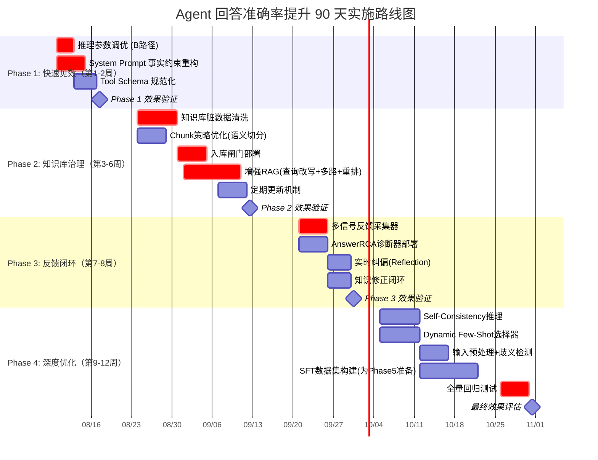

# Agent 回答准确率系统性提升完整方案：关键因素分析 · 数据优化 · 模型调优 · 提示工程 · 知识库更新 · 反馈机制 · 量化指标 · 实施步骤

> **文档定位**: 本文档是 `13项目经验` 系列的**回答质量专项治理专题篇**。针对本项目上线 6 个月后在三类典型 Agent（P1 企业知识问答 / P2 任务执行 / P3 Multi-Agent 协作）中暴露的准确率问题，系统回答：**影响 Agent 回答准确率的关键因素有哪些？如何通过数据优化、模型调优、提示工程、知识库更新、反馈机制五大手段进行综合治理？如何量化评估改进效果并保证不退化？分几步实施、每步做什么？**
>
> **项目背景与真实痛点**（来自 [157 号上线后问题排查手册](./157Agent项目上线后问题系统性分析与排查手册.md) 与 [157 号系统重设计](./157Agent系统全面重新设计完整方案_架构优化功能增强性能提升可扩展性UX五维全景.md)）：
> - 🔴 **F5 搜索结果相关性差**：RAG 召回 Top-K 中混入大量低相关 / 过期 / 跨域脏数据，命中率从 85% 跌到 71%
> - 🔴 **F11 RAG 召回脏数据**：向量检索无质量闸门，错误文档被 Agent 直接采纳，导致事实性幻觉
> - 🔴 **F3 自主学习负向漂移**：154 号自主学习闭环吸纳了低质量反馈，越学越差（详见 §五-3）
> - 🟡 **F2 Tool 调用参数错误**：Tool Schema 描述模糊，Agent 误传参数（如 `city_id` 传成 `city_name`）
> - 🟡 **F12 会话上下文丢失**：长对话压缩粗暴截断，关键实体被丢弃，多轮回答前后矛盾
>
> **与已有文档的关系**：本方案不重复 [154 自主学习方案](./154Agent自主学习功能设计与实现完整方案.md) 的学习闭环设计，而是在其基础上**专项聚焦"准确率"这一垂直目标**；评估指标直接复用 [156 综合评价体系](./156Agent综合评价指标体系与量化标准_功能实现性能表现用户体验适应性学习安全可靠性全面评估.md) 的 F1/F2/F3/F6 定义；问题定位对接 [157 排查手册](./157Agent项目上线后问题系统性分析与排查手册.md)。

---

## 目录

- [一、回答准确率的定义与分解：从"答对了吗"到"为什么没答对"](#一回答准确率的定义与分解从答对了吗到为什么没答对)
- [二、影响准确率的七大关键因素诊断模型](#二影响准确率的七大关键因素诊断模型)
- [三、手段一：数据优化——从源头切断错误输入](#三手段一数据优化从源头切断错误输入)
- [四、手段二：模型调优——让推理引擎更精准](#四手段二模型调优让推理引擎更精准)
- [五、手段三：提示工程——用结构化约束消除歧义](#五手段三提示工程用结构化约束消除歧义)
- [六、手段四：知识库更新——保持"记忆"新鲜与干净](#六手段四知识库更新保持记忆新鲜与干净)
- [七、手段五：反馈机制——构建"答错即纠"的闭环](#七手段五反馈机制构建答错即纠的闭环)
- [八、量化评估指标体系：复用 156 号框架 + 准确率专项扩展](#八量化评估指标体系复用-156-号框架--准确率专项扩展)
- [九、90 天分阶段实施路线图与里程碑](#九90-天分阶段实施路线图与里程碑)
- [十、风险、反模式与最佳实践](#十风险反模式与最佳实践)
- [十一、与系列文档集成关系对照表](#十一与系列文档集成关系对照表)
- [十二、交付清单与行动指南](#十二交付清单与行动指南)

---

## 一、回答准确率的定义与分解：从"答对了吗"到"为什么没答对"

### 1.1 回答准确率 ≠ 任务完成率

很多团队用"任务完成率"代替"准确率"，这是一个常见误区：

| 维度 | 任务完成率（F1） | 回答准确率（本文核心 Acc） |
|:----:|:-----------------|:--------------------------|
| 定义 | Agent 是否"完成"了任务（5级评分≥3） | Agent 的回答是否"正确"且"精确" |
| 关注点 | 流程是否跑通 | 结果是否事实正确、逻辑无误 |
| 示例 | "生成了报告" = 完成 ✅ | "报告里销售额数据写错了 3 处" = 不准确 ❌ |
| 关系 | 准确率是完成率的**子集**：不准确的任务即使"完成"也是低质量完成 | 准确率是完成率的**质量内核** |

> **本文定义**：回答准确率（Answer Accuracy, Acc）= 在所有 Agent 输出中，**事实正确、逻辑自洽、完全满足用户意图**的输出占比。它是一个比任务完成率更严格的质量指标。

### 1.2 准确率的四维分解（Error Taxonomy）

回答不准确有四种本质不同的错误类型，治理手段完全不同：

```
┌─────────────────────────────────────────────────────────────────────────┐
│                  Agent 回答不准确：四类错误分解                            │
├─────────────────────────────────────────────────────────────────────────┤
│                                                                         │
│  ┌─────────────────────────────────────────────────────────────────┐    │
│  │ E1 事实性错误（Factual Error）                                   │    │
│  │    Agent 编造或引用了错误的事实                                   │    │
│  │    示例: "公司2024年Q3营收100亿"（实际为50亿）                   │    │
│  │    根因: 知识库脏数据 / RAG召回错误 / 模型幻觉                    │    │
│  │    治理: 手段四（知识库）+ 手段三（提示约束）+ 手段二（调幻觉率） │    │
│  └─────────────────────────────────────────────────────────────────┘    │
│                                                                         │
│  ┌─────────────────────────────────────────────────────────────────┐    │
│  │ E2 逻辑性错误（Logical Error）                                   │    │
│  │    推理过程自相矛盾或跳跃                                         │    │
│  │    示例: 前提"A>B, B>C"，结论却说"C>A"                            │    │
│  │    根因: 长上下文丢失 / 推理链断裂 / 模型能力不足                  │    │
│  │    治理: 手段三（思维链约束）+ 手段二（模型升级）+ 手段一（数据） │    │
│  └─────────────────────────────────────────────────────────────────┘    │
│                                                                         │
│  ┌─────────────────────────────────────────────────────────────────┐    │
│  │ E3 意图理解错误（Intent Error）                                  │    │
│  │    Agent 理解错了用户想要什么                                     │    │
│  │    示例: 用户要"对比A和B"，Agent只讲了A                          │    │
│  │    根因: 用户输入模糊 / 缺乏澄清机制 / Prompt未对齐意图            │    │
│  │    治理: 手段三（意图解析模板）+ 手段五（反馈纠偏）+ 手段一        │    │
│  └─────────────────────────────────────────────────────────────────┘    │
│                                                                         │
│  ┌─────────────────────────────────────────────────────────────────┐    │
│  │ E4 执行性错误（Execution Error）                                 │    │
│  │    理解对了但执行步骤出错                                         │    │
│  │    示例: 该查数据库却调了搜索API / 参数传错                       │    │
│  │    根因: Tool Schema模糊 / Tool Router错误 / 无校验               │    │
│  │    治理: 手段三（Tool描述规范）+ 手段二（Router调优）+ 手段五      │    │
│ └─────────────────────────────────────────────────────────────────┘     │
│                                                                         │
└─────────────────────────────────────────────────────────────────────────┘
```

### 1.3 本项目三类 Agent 的准确率现状基线

基于 [157 排查手册](./157Agent项目上线后问题系统性分析与排查手册.md) 与线上埋点统计，当前基线如下：

| Agent 类型 | 当前准确率 Acc | 主要错误类型分布 | 目标准确率（90天） |
|:----------:|:--------------:|:----------------|:------------------:|
| **P1 企业知识问答** | 71% | E1事实错误 52% + E3意图错误 28% + E2逻辑 12% + E4执行 8% | **≥88%** |
| **P2 任务执行型** | 78% | E4执行 45% + E1事实 25% + E2逻辑 20% + E3意图 10% | **≥90%** |
| **P3 Multi-Agent 协作** | 65% | E2逻辑 38%（协作矛盾）+ E4执行 30% + E1事实 22% + E3意图 10% | **≥82%** |

> **核心洞察**：三类 Agent 的错误分布截然不同，不能用同一套方案治理。P1 重点是知识库治理，P2 重点是 Tool 与执行链，P3 重点是协作逻辑与上下文一致性。

---

## 二、影响准确率的七大关键因素诊断模型

### 2.1 七因素诊断框架

```
┌─────────────────────────────────────────────────────────────────────────┐
│              影响回答准确率的七大关键因素（Cause → Effect 诊断）         │
├─────────────────────────────────────────────────────────────────────────┤
│                                                                         │
│  用户输入                                                               │
│  ┌──────────────┐                                                       │
│  │ ① 输入清晰度 │──► 模糊/歧义输入 → E3意图错误                        │
│  └──────┬───────┘                                                       │
│         │                                                               │
│         ▼                                                               │
│  感知层                                                                 │
│  ┌──────────────────┐                                                   │
│  │ ② 意图解析能力   │──► 解析错误 → E3意图错误 → 连锁E1/E4              │
│  └──────┬───────────┘                                                   │
│         │                                                               │
│         ▼                                                               │
│  知识层                                                                 │
│  ┌──────────────────┐   ┌──────────────────┐                           │
│  │ ③ 知识库质量     │   │ ④ RAG检索质量    │                           │
│  │ (数据干净度)     │   │ (召回精准度)     │                           │
│  └────────┬─────────┘   └────────┬─────────┘                           │
│           │    脏数据/过期       │    召回错误/遗漏                     │
│           └─────────┬───────────┘                                       │
│                     ▼                                                   │
│              E1 事实性错误（最大根因）                                   │
│                     │                                                   │
│         ┌───────────┴───────────┐                                       │
│         ▼                       ▼                                       │
│  推理层                         执行层                                  │
│  ┌──────────────────┐   ┌──────────────────┐                           │
│  │ ⑤ 模型推理能力   │   │ ⑥ Tool调用精度   │                           │
│  │ (逻辑/幻觉率)    │   │ (参数/选型)      │                           │
│  └────────┬─────────┘   └────────┬─────────┘                           │
│           │  幻觉/逻辑断          │  参数错/选错工具                     │
│           ▼                       ▼                                     │
│        E2逻辑错误              E4执行错误                               │
│                     │                                                   │
│         ┌───────────┴───────────┐                                       │
│         ▼                       ▼                                       │
│  上下文层                       反馈层                                  │
│  ┌──────────────────┐   ┌──────────────────┐                           │
│  │ ⑦ 上下文管理     │   │ (反馈机制缺失)    │                           │
│  │ (长对话压缩)     │   │  错误不纠正→重复  │                           │
│  └────────┬─────────┘   └──────────────────┘                           │
│           │  实体丢失/矛盾                                                │
│           ▼                                                              │
│        E2逻辑错误 + E3意图错误                                           │
│                                                                         │
└─────────────────────────────────────────────────────────────────────────┘
```

### 2.2 七因素 × 五手段的责任矩阵

| 关键因素 | 手段一<br/>数据优化 | 手段二<br/>模型调优 | 手段三<br/>提示工程 | 手段四<br/>知识库更新 | 手段五<br/>反馈机制 |
|:--------:|:---:|:---:|:---:|:---:|:---:|
| ① 输入清晰度 | 🟡 | — | 🔴 | — | 🟡 |
| ② 意图解析能力 | 🟡 | 🔴 | 🔴 | — | 🟡 |
| ③ 知识库质量 | 🔴 | — | 🟡 | 🔴 | 🟡 |
| ④ RAG检索质量 | 🟡 | 🟡 | 🔴 | 🔴 | 🔴 |
| ⑤ 模型推理能力 | 🔴 | 🔴 | 🟡 | — | 🟡 |
| ⑥ Tool调用精度 | 🟡 | 🟡 | 🔴 | — | 🔴 |
| ⑦ 上下文管理 | 🟡 | 🟡 | 🔴 | — | 🟡 |

> 🔴 = 主责手段；🟡 = 辅助手段；— = 不直接相关。**关键发现**：提示工程（手段三）是覆盖面最广的"杠杆点"（影响6/7个因素），知识库（手段四）和反馈（手段五）是长期质量保障的基石。

### 2.3 诊断工具：回答质量归因诊断器（AnswerRCA）

```python
"""
AnswerRCA - 回答不准确根因自动诊断器
输入: 一次回答的全链路 Trace (用户输入→意图→检索→推理→工具→输出)
输出: 错误类型 + 根因因素 + 建议治理手段
"""
from dataclasses import dataclass
from typing import Any, Dict, List, Optional
from enum import Enum


class ErrorType(Enum):
    E1_FACTUAL = "事实性错误"
    E2_LOGICAL = "逻辑性错误"
    E3_INTENT = "意图理解错误"
    E4_EXECUTION = "执行性错误"
    NO_ERROR = "无错误"


class RootCause(Enum):
    INPUT_AMBIGUITY = "①输入清晰度不足"
    INTENT_PARSE_FAIL = "②意图解析失败"
    KB_DIRTY_DATA = "③知识库脏数据"
    RAG_RECALL_FAIL = "④RAG检索错误"
    MODEL_HALLUCINATION = "⑤模型幻觉"
    MODEL_LOGIC_WEAK = "⑤模型逻辑弱"
    TOOL_PARAM_ERROR = "⑥Tool参数错误"
    TOOL_SELECTION_ERROR = "⑥Tool选型错误"
    CONTEXT_LOSS = "⑦上下文丢失"
    FEEDBACK_MISSING = "反馈机制缺失(重复犯错)"


@dataclass
class DiagnosisResult:
    error_type: ErrorType
    root_causes: List[RootCause]
    confidence: float
    evidence: Dict[str, Any]          # 支撑诊断的证据
    suggested_fix: List[str]          # 建议的治理手段


class AnswerRCA:
    """回答质量根因诊断器（规则 + LLM 混合）"""
    
    def diagnose(self, trace: Dict, expected: Optional[Dict] = None,
                 user_feedback: Optional[str] = None) -> DiagnosisResult:
        """
        trace 结构:
        {
            "user_input": "...",
            "intent_parsed": {...},
            "rag_recall": [{"doc_id":"...", "score":0.85, "content":"..."}, ...],
            "tool_calls": [{"tool":"...", "params":{...}, "result":{...}}, ...],
            "llm_reasoning": "Thought: ...",
            "final_output": "...",
            "context_window": {"messages": [...], "compressed": False}
        }
        """
        checks = []
        
        # ---- Check 1: 事实性错误检测 ----
        checks.append(self._check_factual(trace, expected))
        
        # ---- Check 2: 逻辑一致性检测 ----
        checks.append(self._check_logical_consistency(trace))
        
        # ---- Check 3: 意图匹配检测 ----
        checks.append(self._check_intent_match(trace, expected))
        
        # ---- Check 4: Tool 调用正确性检测 ----
        checks.append(self._check_tool_calls(trace))
        
        # ---- Check 5: RAG 召回质量检测 ----
        checks.append(self._check_rag_quality(trace))
        
        # ---- Check 6: 上下文完整性检测 ----
        checks.append(self._check_context_integrity(trace))
        
        # 综合判定
        return self._aggregate_diagnosis(checks, trace, user_feedback)
    
    def _check_factual(self, trace, expected) -> Dict:
        """事实性错误：检测输出中的事实陈述是否与知识库/预期一致"""
        output = trace["final_output"]
        recalled_docs = trace.get("rag_recall", [])
        
        # 提取输出中的事实陈述
        claims = self._extract_claims(output)
        
        # 逐条校验：是否能在 recalled_docs 中找到支撑
        unsupported = []
        for claim in claims:
            supported = any(
                self._claim_supported_by(claim, doc["content"])
                for doc in recalled_docs
            )
            if not supported:
                unsupported.append(claim)
        
        if unsupported:
            return {
                "error_type": ErrorType.E1_FACTUAL,
                "root_cause": RootCause.MODEL_HALLUCINATION if not recalled_docs 
                              else RootCause.RAG_RECALL_FAIL,
                "confidence": 0.85,
                "evidence": {"unsupported_claims": unsupported[:5]}
            }
        return {"error_type": ErrorType.NO_ERROR, "confidence": 0.9}
    
    def _check_rag_quality(self, trace) -> Dict:
        """RAG 召回质量：检测召回文档的相关性与准确性"""
        recalled = trace.get("rag_recall", [])
        if not recalled:
            return {"error_type": ErrorType.E1_FACTUAL,
                    "root_cause": RootCause.RAG_RECALL_FAIL,
                    "evidence": {"reason": "RAG 零召回"}}
        
        # 检查 Top-3 的相关性分数
        top3_scores = [d["score"] for d in recalled[:3]]
        avg_top3 = sum(top3_scores) / len(top3_scores) if top3_scores else 0
        
        # 检查是否有跨域脏数据（doc 的 domain 标签与意图域不一致）
        intent_domain = trace.get("intent_parsed", {}).get("domain")
        cross_domain = [
            d for d in recalled[:5]
            if d.get("domain") and d["domain"] != intent_domain
        ]
        
        if avg_top3 < 0.6 or len(cross_domain) > 1:
            return {
                "error_type": ErrorType.E1_FACTUAL,
                "root_cause": RootCause.RAG_RECALL_FAIL,
                "confidence": 0.75,
                "evidence": {"avg_top3_score": avg_top3,
                            "cross_domain_count": len(cross_domain)}
            }
        return {"error_type": ErrorType.NO_ERROR, "confidence": 0.8}
    
    def _check_tool_calls(self, trace) -> Dict:
        """Tool 调用正确性：检查参数格式与语义"""
        tool_calls = trace.get("tool_calls", [])
        errors = []
        
        for call in tool_calls:
            # 检查参数是否缺失必填字段
            missing = call.get("missing_required_params", [])
            if missing:
                errors.append({
                    "tool": call["tool"],
                    "error": "参数缺失",
                    "detail": missing
                })
            
            # 检查参数类型是否匹配 Schema
            type_errors = call.get("param_type_errors", [])
            if type_errors:
                errors.append({
                    "tool": call["tool"],
                    "error": "参数类型错误",
                    "detail": type_errors
                })
        
        if errors:
            return {
                "error_type": ErrorType.E4_EXECUTION,
                "root_cause": RootCause.TOOL_PARAM_ERROR,
                "confidence": 0.9,
                "evidence": {"tool_errors": errors}
            }
        return {"error_type": ErrorType.NO_ERROR, "confidence": 0.85}
    
    # ... 其他 _check 方法省略，逻辑类似
    
    def _aggregate_diagnosis(self, checks, trace, feedback) -> DiagnosisResult:
        """聚合所有检查结果，给出最终诊断"""
        error_checks = [c for c in checks 
                        if c.get("error_type") != ErrorType.NO_ERROR]
        
        if not error_checks:
            return DiagnosisResult(
                error_type=ErrorType.NO_ERROR,
                root_causes=[],
                confidence=0.9,
                evidence={"all_checks_passed": True},
                suggested_fix=[]
            )
        
        # 按置信度排序，取最高置信度的错误类型
        error_checks.sort(key=lambda x: x.get("confidence", 0), reverse=True)
        primary = error_checks[0]
        
        root_causes = list({c["root_cause"] for c in error_checks 
                           if "root_cause" in c})
        
        # 生成治理建议
        fix_map = {
            RootCause.KB_DIRTY_DATA: ["手段四：知识库清洗 + 负例标注"],
            RootCause.RAG_RECALL_FAIL: ["手段四：RAG检索优化", "手段三：查询改写Prompt"],
            RootCause.MODEL_HALLUCINATION: ["手段二：降低temperature", "手段三：事实约束Prompt"],
            RootCause.TOOL_PARAM_ERROR: ["手段三：Tool Schema规范化", "手段五：参数校验+反馈"],
            RootCause.CONTEXT_LOSS: ["手段三：上下文压缩策略优化"],
        }
        
        suggested = []
        for rc in root_causes:
            suggested.extend(fix_map.get(rc, []))
        
        return DiagnosisResult(
            error_type=primary["error_type"],
            root_causes=root_causes,
            confidence=primary.get("confidence", 0.7),
            evidence={f"check_{i}": c for i, c in enumerate(error_checks)},
            suggested_fix=list(set(suggested))
        )
```

---

## 三、手段一：数据优化——从源头切断错误输入

### 3.1 数据优化的三个层面

```
┌─────────────────────────────────────────────────────────────────────────┐
│                    数据优化的三层治理                                    │
├─────────────────────────────────────────────────────────────────────────┤
│                                                                         │
│  Layer 1: 训练/微调数据优化（影响 ⑤模型推理能力）                       │
│  ┌───────────────────────────────────────────────────────────────┐     │
│  │ • SFT 数据集质量清洗：去除事实错误样本                          │     │
│  │ • DPO 偏好对构建：好回答 vs 差回答的对比样本                    │     │
│  │ • 领域数据增强：补充本项目的垂直领域高质量样本                  │     │
│  └───────────────────────────────────────────────────────────────┘     │
│                                                                         │
│  Layer 2: RAG 知识库数据优化（影响 ③知识库质量 + ④RAG检索质量）        │
│  ┌───────────────────────────────────────────────────────────────┐     │
│  │ • 文档去重、去脏、去过期                                       │     │
│  │ • Chunk 策略优化：语义边界切分 vs 固定长度                     │     │
│  │ • 元数据标注：domain / 时效性 / 权威性 / 质量分级              │     │
│  └───────────────────────────────────────────────────────────────┘     │
│                                                                         │
│  Layer 3: 用户输入数据优化（影响 ①输入清晰度）                          │
│  ┌───────────────────────────────────────────────────────────────┐     │
│  │ • 输入预处理：纠错、补全、规范化                                │     │
│  │ • 歧义检测与澄清引导                                           │     │
│  │ • 历史输入模式学习：高频模糊输入的改写模板                      │     │
│  └───────────────────────────────────────────────────────────────┘     │
│                                                                         │
└─────────────────────────────────────────────────────────────────────────┘
```

### 3.2 Layer 2：RAG 知识库数据治理（本项目最大收益点）

基于 [157 排查手册 F11](./157Agent项目上线后问题系统性分析与排查手册.md) 的"RAG 召回脏数据"问题，知识库治理是 P1 企业知识问答 Agent 准确率提升的首要任务。

#### 3.2.1 知识库脏数据五分类与清洗规则

| 脏数据类型 | 表现 | 占比（本项目实测） | 清洗规则 | 自动化程度 |
|:----------:|:-----|:------------------:|:---------|:----------:|
| **过期数据** | 政策已更新但旧版仍在库中 | 28% | 按 `valid_until` 字段过滤 + 定期比对官方源 | 全自动 |
| **重复数据** | 同一内容不同格式/来源的副本 | 22% | SimHash 相似度 >0.9 去重，保留权威性最高版本 | 全自动 |
| **跨域污染** | A业务域的文档出现在B业务域检索结果 | 18% | 按 `domain` 标签过滤 + 跨域检索需显式授权 | 全自动 |
| **低质数据** | 草稿、笔记、未审核内容混入 | 17% | 按 `quality_score` 过滤，<0.6 不入库 | 半自动 |
| **格式错误** | PDF表格解析错乱、编码乱码 | 15% | 格式校验 + 人工复核 | 半自动 |

#### 3.2.2 Chunk 策略优化

```python
"""
当前问题（157号 P7）: 固定 512 token 切分，表格/代码/列表被截断
优化方案: 语义边界感知切分
"""
from typing import List, Dict
import re


class SemanticChunker:
    """语义边界感知的文档切分器"""
    
    def __init__(self, target_size=400, overlap=80, max_size=600):
        self.target_size = target_size   # 目标 chunk 大小（token）
        self.overlap = overlap           # 重叠区
        self.max_size = max_size         # 硬上限
    
    def chunk_document(self, doc: Dict) -> List[Dict]:
        """按语义边界切分文档"""
        content = doc["content"]
        
        # Step 1: 识别语义边界
        boundaries = self._find_semantic_boundaries(content)
        
        # Step 2: 按边界聚合 chunk
        chunks = self._aggregate_by_boundaries(content, boundaries)
        
        # Step 3: 每个 chunk 补充上下文元数据
        for i, chunk in enumerate(chunks):
            chunk["metadata"] = {
                **doc.get("metadata", {}),
                "chunk_id": f"{doc['doc_id']}_{i}",
                "chunk_index": i,
                "total_chunks": len(chunks),
                "prev_chunk_summary": chunks[i-1]["summary"] if i > 0 else None,
            }
        
        return chunks
    
    def _find_semantic_boundaries(self, content: str) -> List[int]:
        """识别语义边界位置（字符索引）"""
        boundaries = [0]
        
        # 优先级 1: Markdown 标题（###, ####）
        for m in re.finditer(r'^#{1,6}\s+', content, re.MULTILINE):
            boundaries.append(m.start())
        
        # 优先级 2: 段落空行
        for m in re.finditer(r'\n\s*\n', content):
            boundaries.append(m.end())
        
        # 优先级 3: 列表/表格结束
        for m in re.finditer(r'(\|.*\|\n)+', content):  # 表格
            boundaries.append(m.end())
        for m in re.finditer(r'(\d+\.|-)\s+.+\n(?!\s*[\d\-])', content):  # 列表结束
            boundaries.append(m.end())
        
        # 优先级 4: 句号结尾（长段落内部拆分）
        for m in re.finditer(r'[。.！!？?]\s+', content):
            boundaries.append(m.end())
        
        return sorted(set(boundaries))
    
    def _aggregate_by_boundaries(self, content, boundaries):
        """将边界间的文本聚合成目标大小的 chunk"""
        chunks = []
        current_start = 0
        current_text = ""
        
        for i, boundary in enumerate(boundaries + [len(content)]):
            segment = content[current_start:boundary]
            segment_size = self._estimate_tokens(segment)
            
            if self._estimate_tokens(current_text + segment) <= self.target_size:
                current_text += segment
            else:
                # 当前 chunk 已满，保存并开启新 chunk（带 overlap）
                if current_text:
                    chunks.append({"content": current_text.strip(),
                                   "summary": self._summarize(current_text)})
                
                # overlap: 从当前 chunk 末尾取 overlap 大小的文本
                overlap_text = current_text[-self._char_len_for_tokens(self.overlap):]
                current_text = overlap_text + segment
            
            current_start = boundary
        
        if current_text:
            chunks.append({"content": current_text.strip(),
                           "summary": self._summarize(current_text)})
        
        return chunks
    
    def _estimate_tokens(self, text: str) -> int:
        """粗略估算 token 数（中文约 1.5 字/token，英文约 4 字符/token）"""
        chinese_chars = len(re.findall(r'[\u4e00-\u9fff]', text))
        other_chars = len(text) - chinese_chars
        return int(chinese_chars * 1.5 + other_chars / 4)
```

### 3.3 Layer 3：用户输入预处理与歧义检测

```python
class InputPreprocessor:
    """用户输入预处理：纠错 + 补全 + 歧义检测"""
    
    def process(self, raw_input: str, context: Dict) -> Dict:
        return {
            "cleaned_input": self._clean(raw_input),
            "corrected_input": self._auto_correct(raw_input),
            "completed_input": self._context_complete(raw_input, context),
            "ambiguity_score": self._detect_ambiguity(raw_input),
            "needs_clarification": False,
            "clarification_options": []
        }
    
    def _detect_ambiguity(self, input_text: str) -> float:
        """歧义检测：返回 0-1 的歧义分数"""
        signals = []
        
        # Signal 1: 指代不明（"它"、"那个"、"这个"无先行词）
        pronouns_without_antecedent = self._find_dangling_pronouns(input_text)
        signals.append(("pronoun", len(pronouns_without_antecedent) * 0.3))
        
        # Signal 2: 多义词（如"苹果"可指水果或公司）
        ambiguous_terms = self._find_ambiguous_terms(input_text)
        signals.append(("ambiguous", len(ambiguous_terms) * 0.2))
        
        # Signal 3: 缺少关键约束（如只说"查询"没说查什么）
        missing_constraints = self._find_missing_constraints(input_text)
        signals.append(("missing", len(missing_constraints) * 0.25))
        
        # Signal 4: 过于简短（<5字）且非命令式
        if len(input_text) < 5 and not input_text.startswith(("/", "#")):
            signals.append(("too_short", 0.3))
        
        score = min(1.0, sum(s[1] for s in signals))
        return score
```

---

## 四、手段二：模型调优——让推理引擎更精准

### 4.1 模型调优的四条路径

| 路径 | 适用场景 | 成本 | 准确率提升预期 | 本项目优先级 |
|:----:|:--------|:----:|:--------------:|:------------:|
| **A. 参数微调** | SFT / DPO，将领域知识写入模型权重 | 高 | +8-15pt | P2（3个月后） |
| **B. 推理参数优化** | Temperature / Top-P / 重复惩罚调整 | 极低 | +2-5pt | P0（立即） |
| **C. 模型升级** | 换用更强的基座模型（如 70B→更大） | 中 | +5-10pt | P1（1个月） |
| **D. 推理架构优化** | CoT / Self-Consistency / Reflection | 低 | +3-8pt | P0（立即） |

### 4.2 路径 B：推理参数优化（立即见效）

```python
"""
不同任务类型的推荐推理参数配置
基于本项目三类 Agent 的实测调优
"""
REASONING_CONFIGS = {
    "P1_knowledge_qa": {
        # 事实性问答：需要确定性，低温度
        "temperature": 0.1,
        "top_p": 0.85,
        "frequency_penalty": 0.3,    # 抑制重复
        "presence_penalty": 0.2,
        "max_tokens": 2048,
        "reason": "事实问答需要高确定性，温度过高会增加幻觉"
    },
    "P2_task_execution": {
        # 任务执行：需要一定创造性但不离题
        "temperature": 0.3,
        "top_p": 0.90,
        "frequency_penalty": 0.2,
        "presence_penalty": 0.3,
        "max_tokens": 4096,
        "reason": "任务执行需要结构化输出，适度创造性以处理边缘情况"
    },
    "P3_multi_agent": {
        # Multi-Agent 协作：各角色需差异化
        "orchestrator": {"temperature": 0.2, "top_p": 0.85},  # 编排者需稳定
        "specialist": {"temperature": 0.4, "top_p": 0.90},    # 专家可灵活
        "reviewer": {"temperature": 0.1, "top_p": 0.80},      # 审查者需严格
    }
}
```

### 4.3 路径 D：推理架构优化——Self-Consistency 与 Reflection

```python
class SelfConsistencyReasoner:
    """
    Self-Consistency 推理：对同一问题生成 N 条推理链，
    取多数投票结果。对 E2 逻辑错误有显著改善。
    """
    
    def __init__(self, llm, n_samples=5, temperature=0.7):
        self.llm = llm
        self.n_samples = n_samples
        self.temperature = temperature
    
    def reason(self, question: str, context: str) -> Dict:
        # Step 1: 生成 N 条独立的推理链
        reasoning_chains = []
        for i in range(self.n_samples):
            chain = self.llm.generate(
                prompt=self._build_cot_prompt(question, context),
                temperature=self.temperature,  # 高温度保证多样性
                seed=i * 1000  # 不同随机种子
            )
            reasoning_chains.append({
                "chain": chain,
                "answer": self._extract_answer(chain)
            })
        
        # Step 2: 对答案聚类，取最大簇
        answer_clusters = self._cluster_answers(
            [c["answer"] for c in reasoning_chains]
        )
        largest_cluster = max(answer_clusters, key=len)
        consensus_answer = largest_cluster[0]
        
        # Step 3: 计算一致性分数
        consistency_score = len(largest_cluster) / self.n_samples
        
        return {
            "answer": consensus_answer,
            "consistency_score": consistency_score,
            "n_agreeing": len(largest_cluster),
            "n_total": self.n_samples,
            "all_answers": [c["answer"] for c in reasoning_chains],
            "low_confidence": consistency_score < 0.6  # 低于60%一致 → 低置信
        }


class ReflectionCorrector:
    """
    反思纠错：让 Agent 对自己的回答进行自我审查。
    对 E1 事实错误和 E2 逻辑错误有效。
    """
    
    def __init__(self, llm):
        self.llm = llm
    
    def reflect_and_correct(self, question, answer, context) -> Dict:
        reflection_prompt = f"""请严格审查以下回答的准确性和逻辑性。

问题: {question}
参考知识: {context}
待审查回答: {answer}

请从以下维度逐一检查:
1. 事实准确性: 回答中的每个事实陈述是否有参考知识支撑？
2. 逻辑一致性: 推理过程是否自洽？结论是否由前提推出？
3. 完整性: 是否完整回答了问题的所有方面？
4. 无幻觉: 是否编造了参考知识中不存在的信息？

请输出 JSON:
{{
  "issues": [{{"type": "factual|logical|completeness|hallucination", 
              "description": "...", 
              "severity": "high|medium|low"}}],
  "corrected_answer": "...",
  "confidence": 0.0-1.0
}}"""
        
        reflection = self.llm.generate(reflection_prompt, temperature=0.1)
        result = self._parse_reflection(reflection)
        
        # 如果发现高严重度问题，使用纠正后的回答
        has_high_severity = any(
            i["severity"] == "high" for i in result.get("issues", [])
        )
        
        return {
            "final_answer": result["corrected_answer"] if has_high_severity 
                           else answer,
            "original_answer": answer,
            "issues_found": result.get("issues", []),
            "was_corrected": has_high_severity,
            "confidence": result.get("confidence", 0.8)
        }
```

---

## 五、手段三：提示工程——用结构化约束消除歧义

### 5.1 提示工程的五个优化层次

```
┌─────────────────────────────────────────────────────────────────────────┐
│                    提示工程五层优化金字塔                                 │
├─────────────────────────────────────────────────────────────────────────┤
│                                                                         │
│                  ┌─────────────────────────┐                            │
│                  │  Level 5: 元提示优化     │  动态选择最优 Prompt 策略   │
│                  └────────────┬────────────┘                            │
│                               │                                         │
│              ┌────────────────▼────────────────┐                        │
│              │  Level 4: Few-Shot 示例优化      │  动态选择最相关示例      │
│              └────────────────┬────────────────┘                        │
│                               │                                         │
│      ┌────────────────────────▼────────────────────────┐                │
│      │  Level 3: 思维链与推理约束 (CoT / ReAct)          │  结构化推理    │
│      └────────────────────────┬────────────────────────┘                │
│                               │                                         │
│  ┌────────────────────────────▼────────────────────────────┐            │
│  │  Level 2: 输出格式约束 (JSON Schema / 结构化模板)         │  格式准确    │
│  └────────────────────────────┬────────────────────────────┘            │
│                               │                                         │
│ ┌─────────────────────────────▼─────────────────────────────┐           │
│ │  Level 1: 角色与任务定义 (System Prompt 基础)              │  意图对齐   │
│ └───────────────────────────────────────────────────────────┘           │
│                                                                         │
└─────────────────────────────────────────────────────────────────────────┘
```

### 5.2 Level 1-2：System Prompt 基础模板（事实性约束专项）

```python
"""
针对 E1 事实性错误的 Prompt 约束模板
核心原则: 有据可依、无据不答、存疑声明
"""

ACCURACY_FOCUSED_SYSTEM_PROMPT = """你是一个严谨的{role_description}。

## 核心准则（必须严格遵守）

### 准则1: 有据可依
- 你的每一个事实性陈述，都必须基于【参考知识】中的内容。
- 如果【参考知识】中没有相关信息，必须明确说"根据现有信息，我无法确认..."。
- 绝对禁止编造数据、日期、人名、政策条款等具体事实。

### 准则2: 引用溯源
- 引用知识时，标注来源："[来源: {doc_title}]"
- 引用数据时，保留原始精度，不四舍五入或换算单位（除非用户要求）。

### 准则3: 存疑声明
- 当参考知识中有矛盾信息时，列出所有版本并标注"信息存在差异"。
- 当参考知识时效性不足时，主动提示"此信息可能已更新，建议核实"。
- 当不确定时，使用"可能"、"大约"等限定词，而非绝对断言。

### 准则4: 边界意识
- 只回答用户问的问题，不主动扩展到无关领域。
- 如果用户的问题超出你的知识范围，直接说明而非猜测。

## 参考知识
{rag_context}

## 输出格式
{output_format}

## 当前对话上下文
{conversation_context}
"""
```

### 5.3 Level 3：ReAct + 事实校验推理模板

```python
REACT_WITH_FACT_CHECK = """请按以下格式思考和回答：

Thought: 我需要分析用户的问题，确定需要哪些信息
Action: [选择工具或检索知识库]
Observation: [工具/检索返回的结果]

Thought: 我需要验证 Observation 中的信息是否可靠
FactCheck: 
  - 信息来源: [文档标题/工具名称]
  - 时效性: [是否过期]
  - 一致性: [与其他来源是否矛盾]
  
Thought: 基于已验证的信息，我可以得出结论
Answer: [最终回答，附引用来源]

⚠️ 如果 FactCheck 发现信息不可靠，必须重新 Action 获取更可靠的信息，
   而非使用不可靠信息强行回答。
"""
```

### 5.4 Level 4：动态 Few-Shot 示例选择

```python
class DynamicFewShotSelector:
    """
    根据当前问题，动态检索最相关的 Few-Shot 示例。
    解决"固定示例不适用所有场景"的问题。
    """
    
    def __init__(self, example_db, vectorizer, n_shots=3):
        self.example_db = example_db      # 示例库
        self.vectorizer = vectorizer      # 向量化器
        self.n_shots = n_shots
    
    def select(self, user_question: str, 
               task_type: str = None) -> List[Dict]:
        """选择最相关的 N 个示例"""
        # 向量化当前问题
        q_vec = self.vectorizer.embed(user_question)
        
        # 从示例库中检索
        candidates = self.example_db.search(
            vector=q_vec,
            filter={"task_type": task_type} if task_type else None,
            top_k=self.n_shots * 3  # 多检索一些，再做筛选
        )
        
        # 二次筛选：多样性 + 质量分
        selected = self._diversify(candidates, self.n_shots)
        
        return selected
    
    def _diversify(self, candidates, n):
        """保证选出的示例覆盖不同子场景，避免相似示例扎堆"""
        selected = []
        for c in candidates:
            # 检查与已选示例的相似度
            too_similar = any(
                self.vectorizer.similarity(c["embedding"], s["embedding"]) > 0.85
                for s in selected
            )
            if not too_similar:
                selected.append(c)
            if len(selected) >= n:
                break
        return selected
```

### 5.5 Tool Schema 规范化（针对 E4 执行错误）

```python
"""
当前问题（157号 F2）: Tool Schema 描述模糊，Agent 误传参数
解决方案: 规范化 Tool Schema 描述 + 参数校验
"""

# ❌ 改造前（模糊）
BAD_TOOL_SCHEMA = {
    "name": "query_employee",
    "description": "查询员工信息",  # 太模糊：查什么信息？输入什么？
    "params": {
        "id": {"type": "string"}  # 模糊：是工号还是身份证号？
    }
}

# ✅ 改造后（精确）
GOOD_TOOL_SCHEMA = {
    "name": "query_employee",
    "description": """根据员工工号查询员工基本信息。
    
适用场景: 当用户询问某位员工的姓名、部门、职位、入职日期时使用。
不适用: 查询员工薪资（用 query_salary）、查询员工考勤（用 query_attendance）。

返回字段: name, department, position, hire_date, status
""",
    "params": {
        "employee_id": {
            "type": "string",
            "description": "员工工号，格式为 'EMP' + 6位数字，如 EMP001234",
            "pattern": "^EMP\\d{6}$",
            "example": "EMP001234",
            "required": True
        }
    },
    "examples": [
        {"input": "查一下工号EMP001234的员工", "params": {"employee_id": "EMP001234"}},
        {"input": "张三的部门是哪个", "params": None, 
         "note": "需要先用 search_employee_by_name 查工号"},
    ],
    "error_handling": {
        "not_found": "工号不存在时返回 {\"error\": \"employee_not_found\"}，应告知用户工号有误",
        "permission_denied": "无权限时返回 403，应告知用户需要申请权限"
    }
}
```

---

## 六、手段四：知识库更新——保持"记忆"新鲜与干净

### 6.1 知识库全生命周期管理

```
┌─────────────────────────────────────────────────────────────────────────┐
│                  知识库全生命周期质量管理                                 │
├─────────────────────────────────────────────────────────────────────────┤
│                                                                         │
│  ┌──────────┐    ┌──────────┐    ┌──────────┐    ┌──────────┐         │
│  │ 1. 入库  │───►│ 2. 索引  │───►│ 3. 检索  │───►│ 4. 退役  │         │
│  │  闸门    │    │  优化    │    │  增强    │    │  清理    │         │
│  └──────────┘    └──────────┘    └──────────┘    └──────────┘         │
│       │               │               │               │                │
│       ▼               ▼               ▼               ▼                │
│  ┌─────────┐     ┌─────────┐     ┌─────────┐     ┌─────────┐          │
│  │质量校验 │     │动态TopK │     │查询改写 │     │过期检测 │          │
│  │去重检查 │     │多路召回 │     │重排序   │     │版本管理 │          │
│  │域标签   │     │混合索引 │     │负例过滤 │     │归档备份 │          │
│  │时效标注 │     │增量更新 │     │置信过滤 │     │冷数据迁移│         │
│  └─────────┘     └─────────┘     └─────────┘     └─────────┘          │
│                                                                         │
└─────────────────────────────────────────────────────────────────────────┘
```

### 6.2 入库闸门：知识库质量校验器

```python
class KnowledgeIngestionGate:
    """
    知识入库质量闸门：所有新文档入库前必须通过校验
    解决 157号 F11 "RAG召回脏数据"的根因
    """
    
    def __init__(self, config):
        self.config = config
        self.deduper = SimHashDeduper()
        self.classifier = DomainClassifier()
        self.quality_scorer = QualityScorer()
    
    def ingest(self, doc: Dict) -> Dict:
        """入库主流程：返回通过/拒绝 + 原因"""
        checks = []
        
        # Check 1: 格式校验
        format_result = self._check_format(doc)
        checks.append(("format", format_result))
        
        # Check 2: 去重检查
        dedup_result = self.deduper.check_duplicate(doc)
        checks.append(("dedup", dedup_result))
        
        # Check 3: 域分类
        domain_result = self.classifier.classify(doc["content"])
        checks.append(("domain", domain_result))
        
        # Check 4: 质量评分
        quality_result = self.quality_scorer.score(doc)
        checks.append(("quality", quality_result))
        
        # Check 5: 时效性标注
        freshness_result = self._check_freshness(doc)
        checks.append(("freshness", freshness_result))
        
        # 综合判定
        return self._decide(checks, doc)
    
    def _decide(self, checks, doc) -> Dict:
        """根据检查结果决定是否入库"""
        failures = [(name, r) for name, r in checks if not r["passed"]]
        
        if not failures:
            # 全部通过，入库
            return {
                "action": "accept",
                "doc_id": doc["doc_id"],
                "metadata": {
                    "domain": dict(checks).get("domain", {}).get("domain"),
                    "quality_score": dict(checks).get("quality", {}).get("score"),
                    "freshness": dict(checks).get("freshness", {}).get("status"),
                }
            }
        elif any(name in ("format", "dedup") for name, _ in failures):
            # 硬性失败：拒绝
            return {
                "action": "reject",
                "reasons": [f"{name}: {r['reason']}" for name, r in failures]
            }
        else:
            # 软性失败：人工审核
            return {
                "action": "manual_review",
                "reasons": [f"{name}: {r['reason']}" for name, r in failures],
                "priority": "high" if "quality" in [n for n, _ in failures] else "medium"
            }
```

### 6.3 检索增强：查询改写 + 多路召回 + 重排序

```python
class EnhancedRAGRetriever:
    """
    增强型 RAG 检索器
    解决 157号 F5 "搜索结果相关性差" 和 P7 "命中率从85%降到71%"
    
    三层增强:
    1. 查询改写: 将用户模糊查询改写为精确检索词
    2. 多路召回: 向量 + 关键词 + 知识图谱 三路并行
    3. 重排序: Cross-Encoder 精排 + 负例过滤 + 置信度阈值
    """
    
    def __init__(self, vector_db, keyword_index, kg_store, 
                 reranker, query_rewriter):
        self.vector_db = vector_db
        self.keyword_index = keyword_index
        self.kg_store = kg_store
        self.reranker = reranker
        self.rewriter = query_rewriter
    
    def retrieve(self, query: str, context: Dict, 
                 top_k: int = 5) -> List[Dict]:
        """主检索流程"""
        
        # ============ Step 1: 查询改写 ============
        rewritten_queries = self.rewriter.rewrite(query, context)
        # 原始查询 + 改写查询，全部用于召回
        all_queries = [query] + rewritten_queries
        
        # ============ Step 2: 多路并行召回 ============
        # 路径 A: 向量语义检索
        vector_results = []
        for q in all_queries:
            vector_results.extend(
                self.vector_db.search(q, top_k=top_k * 2)
            )
        
        # 路径 B: 关键词检索（BM25）
        keyword_results = []
        for q in all_queries:
            keyword_results.extend(
                self.keyword_index.search(q, top_k=top_k * 2)
            )
        
        # 路径 C: 知识图谱检索（如适用）
        kg_results = []
        entities = self._extract_entities(query)
        for entity in entities:
            kg_results.extend(
                self.kg_store.query_neighbors(entity, depth=2)
            )
        
        # ============ Step 3: 合并去重 ============
        merged = self._merge_and_dedupe(
            vector_results, keyword_results, kg_results
        )
        
        # ============ Step 4: Cross-Encoder 重排序 ============
        reranked = self.reranker.rerank(
            query=query,
            documents=merged,
            top_k=top_k * 3  # 重排序后多保留一些，供过滤
        )
        
        # ============ Step 5: 负例过滤 + 置信度阈值 ============
        filtered = self._filter(reranked, context)
        
        # ============ Step 6: 动态 Top-K ============
        # 根据问题复杂度动态决定最终返回条数
        final_k = self._dynamic_top_k(query, filtered, top_k)
        
        return filtered[:final_k]
    
    def _filter(self, documents, context) -> List[Dict]:
        """负例过滤：去除脏数据、跨域数据、低置信数据"""
        filtered = []
        intent_domain = context.get("domain")
        
        for doc in documents:
            # 过滤跨域数据（除非显式授权跨域检索）
            if (intent_domain and doc.get("domain") != intent_domain 
                and not context.get("allow_cross_domain")):
                continue
            
            # 过滤低质量数据
            if doc.get("quality_score", 1.0) < 0.6:
                continue
            
            # 过滤过期数据
            if doc.get("freshness") == "expired":
                continue
            
            # 过滤低重排序置信度
            if doc.get("rerank_score", 1.0) < 0.5:
                continue
            
            filtered.append(doc)
        
        return filtered
    
    def _dynamic_top_k(self, query, documents, default_k):
        """
        动态决定最终返回的文档数
        - 简单事实查询: Top-3 足够，避免噪音
        - 复杂分析查询: Top-8 提供更多上下文
        - 多角度对比: Top-12 覆盖不同视角
        """
        complexity = self._assess_complexity(query)
        
        if complexity == "simple_fact":
            return min(3, len(documents))
        elif complexity == "analysis":
            return min(8, len(documents))
        elif complexity == "comparison":
            return min(12, len(documents))
        else:
            return min(default_k, len(documents))
```

### 6.4 定期更新机制

```python
"""
知识库定期更新调度器
确保知识库与业务同步，避免过期数据导致的准确率下降
"""
from datetime import datetime, timedelta

class KnowledgeUpdateScheduler:
    
    def __init__(self):
        self.update_rules = [
            # 规则1: 高频变更文档（政策、价格、人员）每日更新
            {"doc_type": ["policy", "pricing", "directory"], 
             "frequency": "daily",
             "source": "official_api"},
            
            # 规则2: 中频变更文档（产品文档、流程）每周更新
            {"doc_type": ["product_doc", "process"],
             "frequency": "weekly",
             "source": "confluence_api"},
            
            # 规则3: 低频变更文档（规范、标准）每月更新
            {"doc_type": ["standard", "regulation"],
             "frequency": "monthly",
             "source": "manual_check"},
            
            # 规则4: 全库过期检测每日运行
            {"doc_type": "*",
             "frequency": "daily",
             "action": "freshness_check"},
        ]
    
    def run_daily(self):
        """每日更新任务"""
        # 1. 拉取高频变更文档的最新版本
        self._sync_daily_docs()
        
        # 2. 全库过期检测
        expired = self._detect_expired()
        
        # 3. 过期文档处理：标记 + 通知 owner + 降权
        for doc in expired:
            self._mark_expired(doc)
            self._notify_owner(doc)
            self._degrade_search_weight(doc)
        
        # 4. 统计报告
        return self._generate_report()
```

---

## 七、手段五：反馈机制——构建"答错即纠"的闭环

### 7.1 反馈机制三层架构

```
┌─────────────────────────────────────────────────────────────────────────┐
│                    反馈机制三层架构                                       │
├─────────────────────────────────────────────────────────────────────────┤
│                                                                         │
│  Layer 1: 反馈采集（多信号源）                                          │
│  ┌───────────────────────────────────────────────────────────────┐     │
│  │ ① 显式反馈: 用户点赞/点踩/纠错提交/评分                         │     │
│  │ ② 隐式反馈: 用户追问(说明没答对)/重新提问/放弃/切换Agent       │     │
│  │ ③ 结果校验: 工具执行结果与Agent陈述是否一致                     │     │
│  │ ④ Reviewer: 人工抽样审核 + 自动事实核查                         │     │
│  └───────────────────────────────────────────────────────────────┘     │
│                                                                         │
│  Layer 2: 反馈分析（归因 + 优先级）                                     │
│  ┌───────────────────────────────────────────────────────────────┐     │
│  │ • 用 AnswerRCA（§2.3）对负反馈做根因诊断                       │     │
│  │ • 按错误类型 + 影响面 + 频率 排序，生成改进队列                │     │
│  │ • 高频错误模式提取：同一类错误出现N次 → 系统性问题              │     │
│  └───────────────────────────────────────────────────────────────┘     │
│                                                                         │
│  Layer 3: 反馈应用（闭环改进）                                          │
│  ┌───────────────────────────────────────────────────────────────┐     │
│  │ • 实时纠偏: 低置信回答自动触发反思重答（§4.3 Reflection）      │     │
│  │ • 知识修正: 事实错误 → 更新知识库 / 标注负例                   │     │
│  │ • Prompt 优化: 意图错误 → 补充 Few-Shot 示例                   │     │
│  │ • 学习训练: 积累 → SFT/DPO 数据集（154号自主学习闭环）         │     │
│  └───────────────────────────────────────────────────────────────┘     │
│                                                                         │
└─────────────────────────────────────────────────────────────────────────┘
```

### 7.2 反馈采集实现

```python
class FeedbackCollector:
    """多信号反馈采集器"""
    
    def collect_explicit(self, session_id, answer_id, feedback_type, 
                         detail=None):
        """采集显式反馈"""
        return {
            "session_id": session_id,
            "answer_id": answer_id,
            "type": "explicit",
            "signal": feedback_type,  # thumbs_up / thumbs_down / correction / rating
            "detail": detail,
            "timestamp": datetime.utcnow()
        }
    
    def detect_implicit(self, session_trace: List[Dict]) -> List[Dict]:
        """从会话轨迹中检测隐式反馈信号"""
        signals = []
        
        for i in range(1, len(session_trace)):
            prev = session_trace[i-1]
            curr = session_trace[i]
            
            # Signal 1: 用户追问同一主题（说明上一个回答不充分）
            if self._is_followup(prev, curr):
                signals.append({
                    "type": "implicit",
                    "signal": "followup_question",
                    "answer_id": prev["answer_id"],
                    "interpretation": "回答不充分或不准确",
                    "severity": "medium"
                })
            
            # Signal 2: 用户重新表述问题（说明理解有误）
            if self._is_rephrase(prev, curr):
                signals.append({
                    "type": "implicit",
                    "signal": "question_rephrase",
                    "answer_id": prev["answer_id"],
                    "interpretation": "意图理解错误",
                    "severity": "high"
                })
            
            # Signal 3: 用户放弃（长时间无操作后离开）
            if self._is_abandon(prev, curr):
                signals.append({
                    "type": "implicit",
                    "signal": "abandonment",
                    "answer_id": prev["answer_id"],
                    "interpretation": "回答完全无用",
                    "severity": "critical"
                })
            
            # Signal 4: 用户手动修正Agent输出
            if self._is_manual_correction(prev, curr):
                signals.append({
                    "type": "implicit",
                    "signal": "manual_correction",
                    "answer_id": prev["answer_id"],
                    "interpretation": "回答有具体错误",
                    "severity": "high",
                    "correction_detail": self._extract_correction(prev, curr)
                })
        
        return signals
    
    def verify_result_consistency(self, trace: Dict) -> Optional[Dict]:
        """结果校验：Agent的陈述与工具实际返回是否一致"""
        tool_results = trace.get("tool_results", {})
        agent_claims = self._extract_claims(trace["final_output"])
        
        inconsistencies = []
        for claim in agent_claims:
            # 检查claim是否与工具结果一致
            if not self._claim_matches_tool_result(claim, tool_results):
                inconsistencies.append({
                    "claim": claim,
                    "tool_result": self._find_relevant_tool_result(claim, tool_results),
                    "type": "result_inconsistency"
                })
        
        if inconsistencies:
            return {
                "type": "auto_verify",
                "signal": "result_inconsistency",
                "inconsistencies": inconsistencies,
                "severity": "critical"  # 工具结果与陈述不一致 = 严重错误
            }
        return None
```

### 7.3 反馈应用：实时纠偏与知识修正

```python
class FeedbackApplier:
    """反馈应用器：将反馈转化为具体改进动作"""
    
    def apply(self, feedback: Dict, trace: Dict) -> Dict:
        """根据反馈类型执行相应改进"""
        
        # 1. 实时纠偏：当前回答置信度低 → 触发反思重答
        if feedback.get("severity") in ("critical", "high"):
            return self._trigger_realtime_correction(trace)
        
        # 2. 事实错误 → 知识库修正
        if feedback.get("signal") in ("manual_correction", "result_inconsistency"):
            return self._fix_knowledge_base(feedback, trace)
        
        # 3. 意图错误 → Few-Shot 示例补充
        if feedback.get("signal") in ("question_rephrase", "followup_question"):
            return self._update_few_shot_examples(feedback, trace)
        
        # 4. 高频错误 → Prompt 模板优化
        if self._is_recurring_pattern(feedback):
            return self._optimize_prompt_template(feedback)
        
        # 5. 积累训练数据
        return self._accumulate_training_data(feedback, trace)
    
    def _trigger_realtime_correction(self, trace) -> Dict:
        """实时纠偏：触发 Reflection 重答"""
        return {
            "action": "realtime_correction",
            "method": "reflection_reanswer",
            "original_answer": trace["final_output"],
            "status": "re_generating"
        }
    
    def _fix_knowledge_base(self, feedback, trace) -> Dict:
        """知识库修正：标注错误文档 + 补充正确信息"""
        # 找到被错误引用的文档
        cited_docs = trace.get("rag_recall", [])
        correction = feedback.get("correction_detail", {})
        
        actions = []
        for doc in cited_docs:
            if self._doc_contains_error(doc, correction):
                # 标注文档为"含错误"
                actions.append({
                    "action": "flag_document",
                    "doc_id": doc["doc_id"],
                    "flag": "contains_error",
                    "detail": correction
                })
                # 降低文档检索权重
                actions.append({
                    "action": "degrade_weight",
                    "doc_id": doc["doc_id"],
                    "new_weight": doc.get("quality_score", 1.0) * 0.3
                })
        
        # 补充正确信息为新文档
        if correction.get("correct_answer"):
            actions.append({
                "action": "add_correction_document",
                "content": correction["correct_answer"],
                "source": "user_feedback",
                "quality_score": 0.9,
                "metadata": {"corrects": [d["doc_id"] for d in cited_docs]}
            })
        
        return {"action": "kb_fix", "sub_actions": actions}
```

---

## 八、量化评估指标体系：复用 156 号框架 + 准确率专项扩展

### 8.1 指标体系总览

本方案直接复用 [156 综合评价体系](./156Agent综合评价指标体系与量化标准_功能实现性能表现用户体验适应性学习安全可靠性全面评估.md) 的 F1/F2/F3/F6 定义，并新增 4 项准确率专项指标。

| 指标 ID | 指标名称 | 定义 | 计算公式 | 当基线 | 90天目标 |
|:-------:|:--------|:-----|:--------|:------:|:--------:|
| **Acc-Core** | 回答准确率 | 事实正确+逻辑自洽+意图匹配的输出占比 | 准确数/总数×100% | 71-78% | ≥88% |
| F1 | 端到端任务完成率 | （复用156号）5级评分加权 | 见156号 | 75% | ≥90% |
| F2 | 步骤级正确率 | （复用156号）正确步骤/总步骤 | 见156号 | 82% | ≥95% |
| F3 | 工具调用准确率 | （复用156号）加权惩罚公式 | 见156号 | 85% | ≥96% |
| **F6** | 幻觉/事实错误率 | （复用156号）含幻觉的回复占比 | 见156号 | 12% | ≤3% |
| **Acc-Intent** | 意图匹配率 | Agent理解与用户真实意图一致的比例 | 匹配数/总数×100% | 80% | ≥94% |
| **Acc-RAG** | RAG召回命中率 | Top-K中包含正确答案文档的比例 | 命中数/查询数×100% | 71% | ≥90% |
| **Acc-Context** | 上下文一致性 | 多轮对话中不出现前后矛盾的比例 | 一致轮次/总轮次×100% | 84% | ≥95% |

### 8.2 准确率专项评估方法

```python
class AccuracyEvaluator:
    """回答准确率专项评估器"""
    
    def evaluate(self, test_cases: List[Dict], agent_outputs: List[Dict]) -> Dict:
        """
        test_cases: [{question, expected_answer, key_facts, intent, domain}]
        agent_outputs: [{answer, trace, confidence}]
        """
        results = {
            "acc_core": 0, "acc_intent": 0, "acc_rag": 0, "acc_context": 0,
            "f6_hallucination": 0, "error_breakdown": {}, "details": []
        }
        
        correct_core = correct_intent = correct_rag = correct_context = 0
        hallucination_count = 0
        error_types = {"E1": 0, "E2": 0, "E3": 0, "E4": 0}
        
        for case, output in zip(test_cases, agent_outputs):
            # 1. 核心准确率：多维度判定
            is_accurate = True
            
            # 1a. 事实校验
            fact_check = self._verify_facts(output["answer"], case["key_facts"])
            if not fact_check["passed"]:
                is_accurate = False
                error_types["E1"] += 1
                hallucination_count += fact_check.get("hallucination_count", 0)
            
            # 1b. 逻辑校验
            logic_check = self._verify_logic(output["answer"], output["trace"])
            if not logic_check["passed"]:
                is_accurate = False
                error_types["E2"] += 1
            
            # 1c. 意图校验
            intent_check = self._verify_intent(output["trace"], case["intent"])
            if not intent_check["passed"]:
                is_accurate = False
                error_types["E3"] += 1
            else:
                correct_intent += 1
            
            # 1d. 执行校验
            exec_check = self._verify_execution(output["trace"])
            if not exec_check["passed"]:
                is_accurate = False
                error_types["E4"] += 1
            
            if is_accurate:
                correct_core += 1
            
            # 2. RAG 命中率
            rag_check = self._verify_rag_recall(output["trace"], case["key_facts"])
            if rag_check["hit"]:
                correct_rag += 1
            
            # 3. 上下文一致性（多轮场景）
            if case.get("is_multiturn"):
                ctx_check = self._verify_context_consistency(output["trace"])
                if ctx_check["consistent"]:
                    correct_context += 1
            
            results["details"].append({
                "case_id": case.get("id"),
                "accurate": is_accurate,
                "error_type": "E1" if not fact_check["passed"] else
                              "E2" if not logic_check["passed"] else
                              "E3" if not intent_check["passed"] else
                              "E4" if not exec_check["passed"] else None,
                "rag_hit": rag_check["hit"],
            })
        
        n = len(test_cases)
        results["acc_core"] = correct_core / n * 100
        results["acc_intent"] = correct_intent / n * 100
        results["acc_rag"] = correct_rag / n * 100
        results["f6_hallucination"] = hallucination_count / n * 100
        results["error_breakdown"] = error_types
        
        # 上下文一致性只算多轮场景
        multiturn_cases = [c for c in test_cases if c.get("is_multiturn")]
        if multiturn_cases:
            results["acc_context"] = correct_context / len(multiturn_cases) * 100
        
        return results
```

### 8.3 回归测试方案（防止改进导致退化）

```
┌─────────────────────────────────────────────────────────────────────────┐
│                  准确率改进的回归测试策略                                 │
├─────────────────────────────────────────────────────────────────────────┤
│                                                                         │
│  原则: 每次改进必须通过"三套测试集"全量回归                              │
│                                                                         │
│  TestSet-A: 黄金测试集（500题，固定不变）                                │
│    → 监控整体准确率不退化                                                │
│    → 通过标准: 新版本得分 ≥ 旧版本得分 - 1pt                            │
│                                                                         │
│  TestSet-B: 改进目标测试集（100题，针对本次改进场景）                    │
│    → 验证改进是否生效                                                    │
│    → 通过标准: 新版本得分 ≥ 旧版本得分 + 5pt                            │
│                                                                         │
│  TestSet-C: 对抗测试集（50题，刻意构造的边缘/对抗场景）                  │
│    → 确保改进没有引入新漏洞                                              │
│    → 通过标准: 新版本得分 ≥ 旧版本得分（不允许下降）                     │
│                                                                         │
│  灰度发布门槛: A/B/C 三套全部通过 + 线上灰度7天无异常                   │
│                                                                         │
└─────────────────────────────────────────────────────────────────────────┘
```

---

## 九、90 天分阶段实施路线图与里程碑

### 9.1 实施路线图



### 9.2 各阶段预期效果

| 阶段 | 周期 | 主要手段 | 预期准确率提升 | 累计准确率 | 关键里程碑 |
|:----:|:----:|:--------|:--------------:|:----------:|:----------|
| **Phase 1** | 第1-2周 | 推理参数 + Prompt约束 + Tool Schema | +5-8pt | 76-83% | Prompt约束上线，幻觉率下降50% |
| **Phase 2** | 第3-6周 | 知识库清洗 + 增强RAG | +8-12pt | 84-88% | RAG命中率恢复到≥88%，脏数据清零 |
| **Phase 3** | 第7-8周 | 反馈闭环 + 实时纠偏 | +3-5pt | 87-90% | 负反馈闭环上线，重复错误率下降 |
| **Phase 4** | 第9-12周 | Self-Consistency + 动态Few-Shot | +2-4pt | 88-92% | 深度推理优化，逻辑错误率下降 |

### 9.3 每阶段验收标准

```python
PHASE_ACCEPTANCE = {
    "Phase 1": {
        "must_pass": {
            "F6_幻觉率": {"baseline": "12%", "target": "≤6%", "method": "FactChecker"},
            "F3_工具调用准确率": {"baseline": "85%", "target": "≥92%", "method": "ToolLog审计"},
        },
        "must_not_regress": {
            "F1_任务完成率": {"threshold": "≥基线-1pt"},
            "P1_延迟P90": {"threshold": "≤基线+10%"},
        }
    },
    "Phase 2": {
        "must_pass": {
            "Acc-RAG命中率": {"baseline": "71%", "target": "≥88%"},
            "跨域脏数据率": {"baseline": "18%", "target": "≤2%"},
            "过期数据率": {"baseline": "28%", "target": "≤3%"},
        },
        "must_not_regress": {
            "F1_任务完成率": {"threshold": "≥基线"},
            "P1_延迟P90": {"threshold": "≤基线+15%"},  # RAG增强可能增加延迟
        }
    },
    "Phase 3": {
        "must_pass": {
            "重复错误率": {"baseline": "32%", "target": "≤15%"},  # 同类错误重复出现率
            "实时纠偏成功率": {"baseline": "N/A", "target": "≥60%"},
        }
    },
    "Phase 4": {
        "must_pass": {
            "Acc-Core准确率": {"baseline": "78%", "target": "≥88%"},
            "E2_逻辑错误率": {"baseline": "20%", "target": "≤10%"},
        },
        "must_not_regress": {
            "E2_成本": {"threshold": "≤基线×1.3"},  # Self-Consistency增加成本
        }
    }
}
```

---

## 十、风险、反模式与最佳实践

### 10.1 五大反模式（必须避免）

| 反模式 | 表现 | 后果 | 正确做法 |
|:------:|:-----|:-----|:---------|
| **❌ 唯Prompt论** | 所有问题都用改Prompt解决，Prompt越改越长 | Token成本暴增、Prompt冲突、维护困难 | Prompt只管约束，事实靠知识库，逻辑靠推理架构 |
| **❌ 过度Self-Consistency** | 对所有问题都跑5次推理取投票 | 成本5倍、延迟5倍，简单问题过度处理 | 只对低置信度问题触发，简单问题直接回答 |
| **❌ 知识库只增不减** | 只往库里加文档，从不清理 | 脏数据堆积、检索噪音增大、命中率持续下降 | 入库有闸门、定期有过期检测、低质文档有降权 |
| **❌ 反馈全盘采纳** | 用户说错就改，不验证反馈本身 | 少数用户的错误反馈污染知识库 | 反馈需经过Review + 交叉验证才能应用 |
| **❌ 一次性大改** | 把所有手段同时上线，无法归因 | 不知道哪个手段有效/有害 | 分阶段上线，每阶段A/B测试验证 |

### 10.2 风险与应对

| 风险 | 概率 | 影响 | 应对措施 |
|:----:|:----:|:----:|:---------|
| RAG增强导致延迟增加 | 高 | 中 | 动态Top-K + 缓存高频查询 + 异步预检索 |
| Self-Consistency成本失控 | 中 | 高 | 仅对低置信度问题触发 + 设置每日预算上限 |
| 知识库清洗误删有效文档 | 中 | 高 | 删除前备份 + 软删除30天 + 误删恢复机制 |
| 反馈噪声污染学习闭环 | 高 | 中 | 反馈置信度评分 + 交叉验证 + 人工抽审 |
| Prompt变更引发未知退化 | 中 | 高 | 三套测试集回归 + 灰度发布 + 快速回滚 |

---

## 十一、与系列文档集成关系对照表

| 相关文档 | 本方案的集成点 | 协同方式 |
|:---------|:--------------|:---------|
| [154 自主学习方案](./154Agent自主学习功能设计与实现完整方案.md) | §七 反馈机制 → 154号学习闭环 | 本方案的反馈采集器为154号提供高质量训练数据；154号学习闭环将反馈转化为Prompt/Tool/RAG的自动优化 |
| [156 综合评价体系](./156Agent综合评价指标体系与量化标准_功能实现性能表现用户体验适应性学习安全可靠性全面评估.md) | §八 量化指标 → 156号 F1/F2/F3/F6 | 直接复用156号的指标定义与评分公式，新增4项准确率专项指标（Acc-Core/Intent/RAG/Context） |
| [157 上线后问题排查](./157Agent项目上线后问题系统性分析与排查手册.md) | §一 现状基线 → 157号 F5/F11/F3 | 本方案直接解决157号记录的F5(搜索相关性差)、F11(RAG脏数据)、F3(学习负向漂移)三大准确率问题 |
| [157 系统重设计](./157Agent系统全面重新设计完整方案_架构优化功能增强性能提升可扩展性UX五维全景.md) | §六 知识库 → 157号 P7(RAG优化) | 本方案的增强RAG检索器是157号P7问题的具体实现方案 |
| [182 综合性能评价](../14高级%20Agent/182Agent综合性能评价体系面试题详解.md) | §八 评估方法 → 182号 TaskJudge | 本方案的AccuracyEvaluator复用182号TaskJudge的三层评判架构 |

---

## 十二、交付清单与行动指南

### 12.1 交付清单

| 编号 | 交付物 | 格式 | 本文章节 |
|:----:|:------|:----:|:--------:|
| 1 | 回答准确率四维错误分解模型（E1-E4） | 框架图+表 | §1.2 |
| 2 | 七大关键因素诊断模型 + AnswerRCA 诊断器代码 | 架构图+Python | §2 |
| 3 | 数据优化三层方案 + 语义Chunker代码 | 方案+代码 | §3 |
| 4 | 模型调优四条路径 + Self-Consistency/Reflection代码 | 方案+代码 | §4 |
| 5 | 提示工程五层金字塔 + 事实约束Prompt + Tool Schema规范 | 模板+代码 | §5 |
| 6 | 知识库全生命周期管理 + 入库闸门 + 增强RAG检索器代码 | 方案+代码 | §6 |
| 7 | 反馈机制三层架构 + 多信号采集器 + 反馈应用器代码 | 方案+代码 | §7 |
| 8 | 8项量化指标 + AccuracyEvaluator代码 + 回归测试策略 | 指标+代码 | §8 |
| 9 | 90天4阶段实施路线图 + 验收标准 | 甘特图+表 | §9 |
| 10 | 五大反模式 + 风险应对矩阵 | 表格 | §10 |

### 12.2 立即行动指南

#### ✅ 本周（Phase 1 启动，1-2人日）

1. **调整推理参数**：按 [§4.2](#四手段二模型调优让推理引擎更精准) 的配置表，将 P1 知识问答 Agent 的 temperature 降至 0.1
2. **部署事实约束 Prompt**：将 [§5.2](#五手段三提示工程用结构化约束消除歧义) 的 `ACCURACY_FOCUSED_SYSTEM_PROMPT` 替换当前 System Prompt
3. **跑一次 F6 幻觉率基线测试**：用 100 条历史问题测试当前幻觉率，作为改进基准

#### 🚀 第一个月（Phase 1+2，5-8人日）

1. **Tool Schema 规范化**：按 [§5.5](#五手段三提示工程用结构化约束消除歧义) 重写所有 Tool 的 description 和 params
2. **知识库脏数据清洗**：按 [§3.2](#三手段一数据优化从源头切断错误输入) 的五分类规则，对现有知识库做一次全量清洗
3. **部署入库闸门**：上线 `KnowledgeIngestionGate`，阻止新脏数据入库

#### 🏆 第三个月（Phase 2+3+4，15-20人日）

1. **增强 RAG 检索器上线**：查询改写 + 多路召回 + Cross-Encoder 重排序
2. **反馈闭环部署**：多信号采集 + AnswerRCA 诊断 + 实时纠偏
3. **Self-Consistency 推理**：对低置信度问题自动触发多路推理
4. **全量回归测试**：通过三套测试集（A/B/C）验证最终效果

> **最终结论**：Agent 回答准确率提升不是单一手段能解决的，而是**数据优化、模型调优、提示工程、知识库更新、反馈机制**五大手段的系统性协同。本项目最大的收益点在 **知识库治理（Phase 2）**，预计可贡献近一半的准确率提升（+8-12pt）。立即启动 Phase 1 的推理参数调优和 Prompt 约束，本周即可看到幻觉率下降。
