# Agent实际运行效果评估实施手册:从数据采集到持续优化的完整闭环

> **文档定位**:本文档是 `13项目经验` 系列的**运行效果评估实施专题篇**。与同系列的 [156号综合评价体系](./156Agent综合评价指标体系与量化标准_功能实现性能表现用户体验适应性学习安全可靠性全面评估.md)(回答"评估体系怎么设计")、[157号上线问题排查手册](./157Agent项目上线后问题系统性分析与排查手册.md)(回答"出问题怎么诊断")形成三角互补,本文聚焦回答**最核心的工程问题:Agent 上线之后,如何科学、系统地持续评估其真实运行效果,并把评估结论转化为下一轮迭代的明确改进方向?**
>
> **核心交付物**:
> - **四阶段评估实施闭环**(规划→采集→分析→优化)与 PDCA 模型
> - **三层评估指标体系**(基础指标 / 业务指标 / 体验指标)共 32 项可计算指标
> - **五类评估方法**(离线基准 / 在线灰度 / A/B / 人工专家 / 用户反馈)选型矩阵
> - **五层数据收集管道**(埋点 / 日志 / 反馈 / 实验 / 外部)与字段规范
> - **结果分析四维框架**(横向对比 / 纵向回归 / 场景下钻 / 根因归因)
> - **六类典型场景的差异化评估策略**(客服/编程/分析/创作/多Agent/学习型)
> - **持续优化机制**:评估驱动的双周迭代节奏 + OKR 联动 + 改进项追踪表
> - **评估平台工程架构**(数据采集→指标计算→可视化→告警→决策)与参考实现

---

## 目录

- [一、为什么需要"运行效果评估"而非仅"评价体系"](#一为什么需要运行效果评估而非仅评价体系)
- [二、评估实施总体框架:PDCA 四阶段闭环](#二评估实施总体框架pdca-四阶段闭环)
- [三、评估指标体系:三层 32 项指标](#三评估指标体系三层-32-项指标)
- [四、场景化指标权重配置](#四场景化指标权重配置)
- [五、评估方法选型:五类方法矩阵](#五评估方法选型五类方法矩阵)
- [六、数据收集管道:五层数据源](#六数据收集管道五层数据源)
- [七、结果分析框架:四维分析方法](#七结果分析框架四维分析方法)
- [八、持续优化机制:评估驱动迭代](#八持续优化机制评估驱动迭代)
- [九、六类典型场景的差异化评估策略](#九六类典型场景的差异化评估策略)
- [十、评估平台工程架构与实现](#十评估平台工程架构与实现)
- [十一、评估治理与组织保障](#十一评估治理与组织保障)
- [十二、交付清单与行动指南](#十二交付清单与行动指南)

---

## 一、为什么需要"运行效果评估"而非仅"评价体系"

### 1.1 评价体系 vs 运行效果评估:关键区别

> [156号评价体系文档](./156Agent综合评价指标体系与量化标准_功能实现性能表现用户体验适应性学习安全可靠性全面评估.md) 回答的是 **"应该看哪些指标、怎么算分"**;本文回答的是 **"线上跑起来之后,这些分数怎么持续采集、怎么分析、怎么转化成改进动作"**。前者是地图,后者是行车路线。

| 维度 | 156号评价体系(设计视角) | 158号运行效果评估(实施视角) |
|------|:-----------------------:|:--------------------------:|
| **回答问题** | 评什么?怎么算? | 怎么采?怎么分析?怎么改? |
| **所处阶段** | 立项/上线前/选型时 | 上线后持续运行期 |
| **数据来源** | 离线基准测试集 | 线上真实流量 + 基准回归 |
| **执行频率** | 一次性/版本切换时 | 日/周/月持续滚动 |
| **驱动动作** | 上线准入判定 | 迭代优先级 + 紧急回滚 |
| **关注焦点** | Agent 综合能力画像 | Agent 真实业务表现 + 趋势 |
| **责任角色** | 算法/产品(评估负责人) | SRE + 算法 + 产品 + 运营 |
| **失败信号** | 评分不达标 → 不上线 | 指标退化 → 紧急回滚/热修 |

### 1.2 上线后评估的五大典型痛点

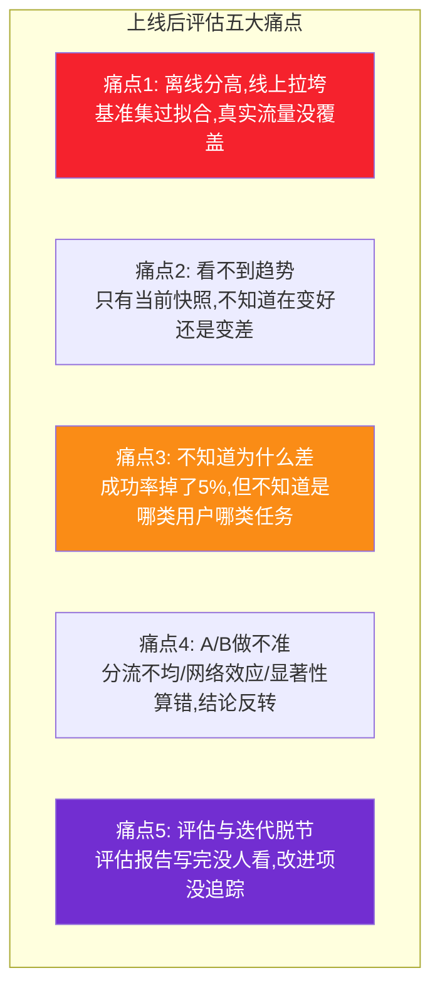

### 1.3 本文的设计目标:EARTH 五维

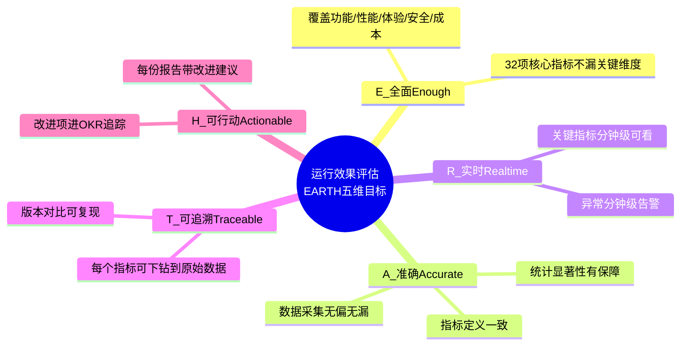

---

## 二、评估实施总体框架:PDCA 四阶段闭环

### 2.1 PDCA 评估闭环模型

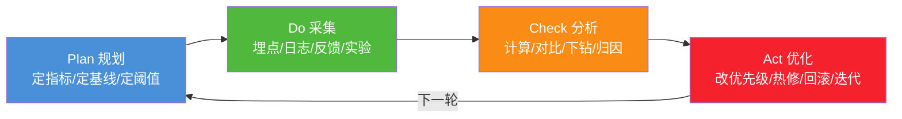

### 2.2 四阶段详细任务

| 阶段 | 关键任务 | 产出物 | 频率 | 责任人 |
|------|---------|--------|:----:|-------|
| **P 规划** | 1. 确认本期评估目标<br/>2. 选定指标集与权重<br/>3. 设定基线与告警阈值<br/>4. 设计 A/B 实验方案 | 《评估计划书》《指标字典》《实验设计》 | 每版本/每月 | 评估负责人 |
| **D 采集** | 1. 校验埋点完整性<br/>2. 监控数据管道质量<br/>3. 收集用户反馈<br/>4. 跑离线基准回归 | 原始数据集 | 实时/每日 | SRE + 数据工程 |
| **C 分析** | 1. 计算指标并对比基线<br/>2. 多维下钻定位退化<br/>3. A/B 显著性检验<br/>4. 输出分析报告 | 《评估周报》《下钻分析》《A/B 结论》 | 每周/每版本 | 评估分析师 |
| **A 优化** | 1. 改进项优先级排序<br/>2. 紧急问题热修/回滚<br/>3. 改进项进 OKR 追踪<br/>4. 验证改进效果 | 《改进项清单》《迭代规划》 | 双周迭代 | 产品 + 算法 |

### 2.3 评估节奏建议

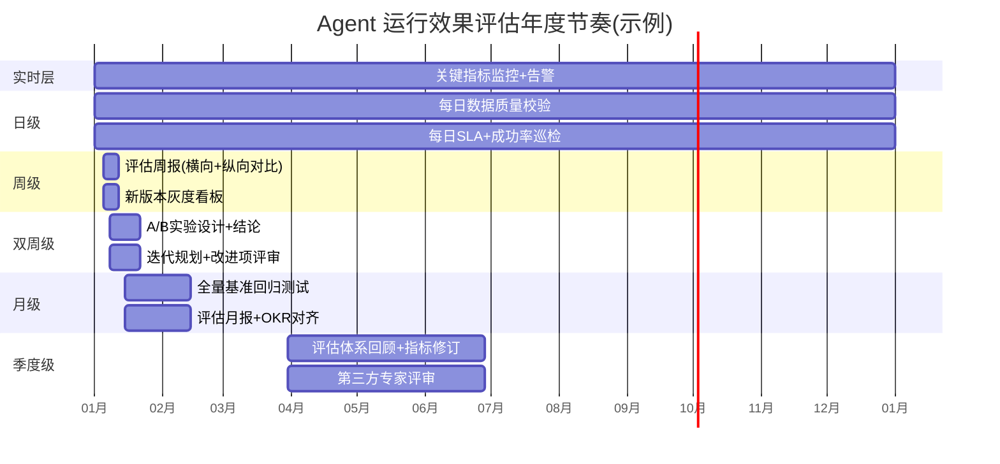

---

## 三、评估指标体系:三层 32 项指标

### 3.1 三层指标金字塔

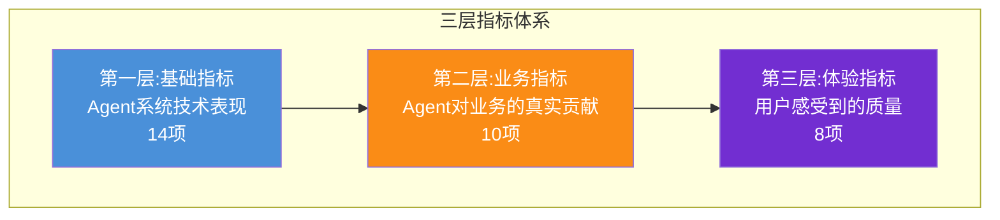

**层次解读**:
- **基础指标**(技术层):机器视角,工程师最关注,可全自动化采集
- **业务指标**(价值层):业务视角,产品/运营关注,需结合业务上下文
- **体验指标**(感知层):用户视角,设计与客服关注,需人工+用户反馈补充

### 3.2 第一层:基础指标(14项,技术表现)

| 编号 | 指标名 | 计算公式 | 优秀/合格/不合格 | 采集方式 |
|:----:|-------|---------|:--------------:|---------|
| B01 | 任务完成率 | 成功任务数/总任务数 | ≥95% / ≥85% / <85% | 日志 |
| B02 | 步骤正确率 | 正确步骤数/总步骤数 | ≥95% / ≥85% / <85% | Trace日志 |
| B03 | 工具调用准确率 | 正确工具调用/总调用 | ≥98% / ≥90% / <90% | Tool日志 |
| B04 | 端到端延迟P50 | 任务提交到结果返回中位数 | ≤3s / ≤8s / >8s | 链路追踪 |
| B05 | 端到端延迟P99 | 99分位延迟 | ≤10s / ≤30s / >30s | 链路追踪 |
| B06 | 首Token延迟(TTFT) | 流式首个Token输出耗时 | ≤1s / ≤3s / >3s | SSE日志 |
| B07 | 系统可用性 | (1-宕机时长/总时长)×100% | ≥99.9% / ≥99% / <99% | 监控 |
| B08 | 错误率 | 5xx+业务错误/总请求 | ≤0.5% / ≤2% / >2% | 网关日志 |
| B09 | 重试率 | 重试任务数/总任务数 | ≤5% / ≤15% / >15% | 调用日志 |
| B10 | Token消耗/任务 | 单任务平均Token数 | ≤基线 / ≤1.3×基线 / >1.3×基线 | LLM账单 |
| B11 | 单任务成本 | 单任务平均费用(¥) | ≤基线 / ≤1.3×基线 / >1.3×基线 | 财务 |
| B12 | 缓存命中率 | 缓存命中/总查询 | ≥80% / ≥60% / <60% | Redis |
| B13 | 沙盒启动耗时 | Firecracker冷启动时长 | ≤500ms / ≤2s / >2s | K8s日志 |
| B14 | 并发承载能力 | 峰值QPS无降级 | ≥目标 / ≥80%目标 / <80%目标 | 压测 |

### 3.3 第二层:业务指标(10项,业务贡献)

| 编号 | 指标名 | 计算公式 | 优秀/合格/不合格 | 采集方式 |
|:----:|-------|---------|:--------------:|---------|
| S01 | 任务解决率(用户视角) | 用户标记"已解决"/总任务 | ≥80% / ≥60% / <60% | 用户反馈 |
| S02 | 人工接管率 | 转人工任务/总任务 | ≤10% / ≤25% / >25% | 客服系统 |
| S03 | 首次响应解决率(FCR) | 首轮即解决/总任务 | ≥60% / ≥40% / <40% | 会话日志 |
| S04 | 平均交互轮数 | 完成任务平均对话轮数 | ≤3 / ≤5 / >5 | 会话日志 |
| S05 | 知识引用准确率 | RAG引用正确文档比例 | ≥95% / ≥85% / <85% | 抽样标注 |
| S06 | 工具调用有效率 | 工具返回被采用/总调用 | ≥90% / ≥75% / <75% | Tool日志 |
| S07 | 输出采纳率 | 用户采纳输出/总输出 | ≥70% / ≥50% / <50% | 行为埋点 |
| S08 | 业务转化贡献 | Agent驱动的转化/总转化 | ≥目标 / ≥80%目标 / <80%目标 | 业务埋点 |
| S09 | 重复调用率 | 同用户同问题重复调用比 | ≤10% / ≤25% / >25% | 行为日志 |
| S10 | 知识覆盖率 | Agent能答问题/应答问题 | ≥90% / ≥75% / <75% | 测试集 |

### 3.4 第三层:体验指标(8项,用户感知)

| 编号 | 指标名 | 计算公式 | 优秀/合格/不合格 | 采集方式 |
|:----:|-------|---------|:--------------:|---------|
| U01 | 用户满意度CSAT | 满意评分/总评分 | ≥4.5/5 / ≥4.0/5 / <4.0/5 | 评分组件 |
| U02 | NPS净推荐值 | 推荐者%-贬损者% | ≥40 / ≥20 / <20 | 问卷 |
| U03 | 评分分布偏度 | 1星比例 | ≤5% / ≤15% / >15% | 评分组件 |
| U04 | 负向反馈率 | 投诉+差评/总交互 | ≤3% / ≤8% / >8% | 反馈系统 |
| U05 | 7日留存率 | 7日后回访/首日新增 | ≥40% / ≥25% / <25% | 行为日志 |
| U06 | 任务放弃率 | 中途退出/启动任务 | ≤15% / ≤30% / >30% | 行为埋点 |
| U07 | 重复修改率 | 用户改写Agent输出比 | ≤20% / ≤40% / >40% | 行为埋点 |
| U08 | 主观质量评分 | 专家盲评1-5分 | ≥4.5 / ≥4.0 / <4.0 | 人工评估 |

### 3.5 指标卡示例:每日健康度仪表盘

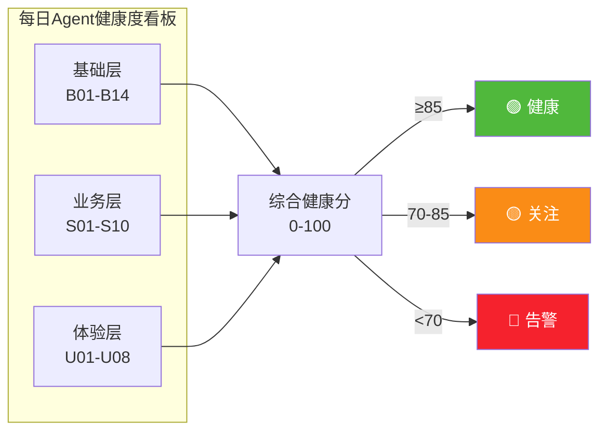

**综合健康分计算公式**:

$$
\text{Health Score} = w_1 \cdot \overline{B_{01\text{-}14}} + w_2 \cdot \overline{S_{01\text{-}10}} + w_3 \cdot \overline{U_{01\text{-}08}}
$$

通用权重: $w_1=0.3, w_2=0.4, w_3=0.3$ (业务贡献最重,第四章给出场景化调整)

---

## 四、场景化指标权重配置

### 4.1 不同场景的权重差异

> 同一套指标,不同场景下权重天差地别。客服 Agent 看解决率,编程助手看采纳率,创作 Agent 看满意度。一刀切的权重会导致"为了刷分而优化错的方向"。

| 场景 | 基础层 | 业务层 | 体验层 | 关键指标(权重Top3) |
|------|:-----:|:-----:|:-----:|-------------------|
| **客服助理** | 25% | 45% | 30% | S01解决率、S02人工接管率、S03首次响应解决率 |
| **编程助手** | 20% | 50% | 30% | S07输出采纳率、B03工具调用准确率、U07重复修改率 |
| **数据分析** | 30% | 45% | 25% | S05知识引用准确率、S06工具调用有效率、B10 Token消耗 |
| **内容创作** | 15% | 30% | 55% | U01 CSAT、U08专家评分、S07采纳率 |
| **多Agent协作** | 35% | 40% | 25% | B01完成率、B09重试率、S04交互轮数 |
| **学习型Agent** | 25% | 35% | 40% | U05留存、S09重复调用率、U04负向反馈率 |

### 4.2 场景化权重的设定方法

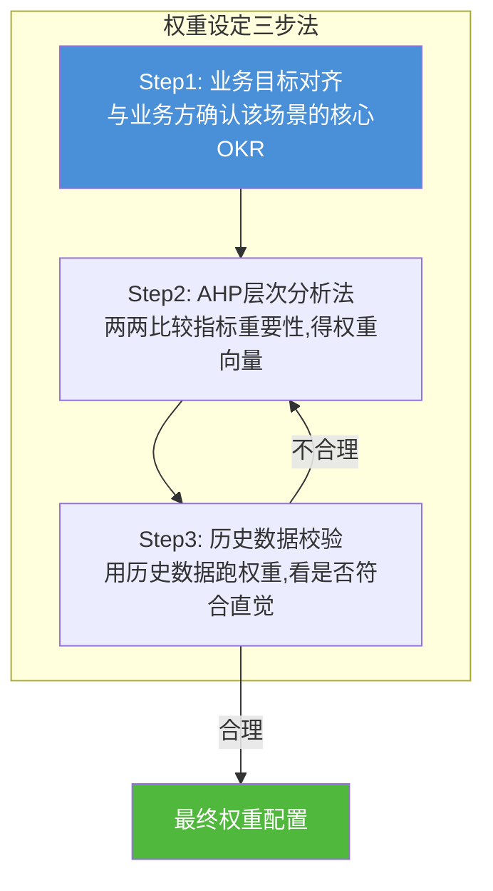

### 4.3 权重配置示例(以客服助理为例)

```yaml
# 客服助理Agent权重配置示例
scenario: customer_service
weights:
  basic_layer: 0.25
  business_layer: 0.45
  experience_layer: 0.30

# 业务层内部细分权重
business_layer_detail:
  S01_任务解决率: 0.30   # 最关键
  S02_人工接管率: 0.25   # 反映自服务能力
  S03_首次响应解决率: 0.20
  S04_平均交互轮数: 0.10
  S05_知识引用准确率: 0.10
  S06_工具调用有效率: 0.05

# 告警阈值(基于权重的综合分)
alert_thresholds:
  green: 85    # ≥85 健康
  yellow: 70   # 70-85 关注
  red: 70      # <70 告警,触发复盘
```

---

## 五、评估方法选型:五类方法矩阵

### 5.1 五类评估方法对比

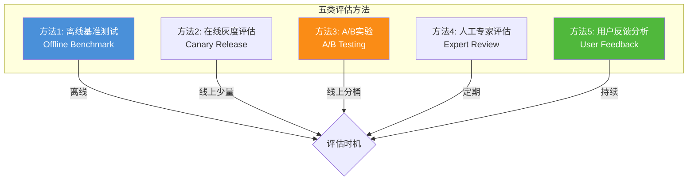

### 5.2 五类方法详细对比矩阵

| 维度 | 离线基准 | 在线灰度 | A/B实验 | 人工专家 | 用户反馈 |
|------|:-------:|:-------:|:------:|:-------:|:-------:|
| **数据来源** | 标准测试集 | 线上5-10%流量 | 线上分桶对照 | 专家盲评 | 真实用户反馈 |
| **执行频率** | 每版本 | 每次发布 | 每个改进项 | 每月/季度 | 持续 |
| **覆盖度** | 取决于测试集 | 真实流量子集 | 真实流量全集 | 抽样100-500条 | 全量但低反馈率 |
| **客观性** | ★★★★★ | ★★★★ | ★★★★★ | ★★★ | ★★ |
| **成本** | 中(维护测试集) | 低 | 中(实验平台) | 高(专家时间) | 低 |
| **时效性** | 滞后(测试集维护) | 实时 | 准实时 | 滞后 | 实时 |
| **能发现的问题** | 已知模式退化 | 严重故障 | 增量效果 | 主观质量/边界case | 用户真实痛点 |
| **不能发现的问题** | 长尾/新场景 | 细微退化 | 长期效应 | 客观指标 | 沉默用户 |

### 5.3 方法一:离线基准测试

#### 5.3.1 测试集分层架构

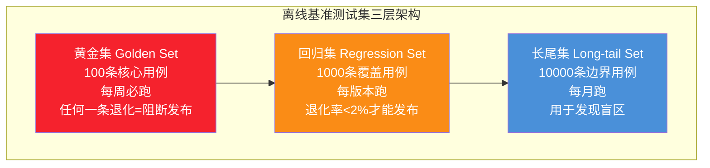

#### 5.3.2 测试集维护机制

| 维护动作 | 频率 | 责任人 | 触发条件 |
|---------|:----:|-------|---------|
| 新增用例 | 每周 | 评估分析师 | 线上发现新case模式 |
| 删除用例 | 每月 | 评估负责人 | 用例过时(业务下线) |
| 标注更新 | 每月 | 标注团队 | 业务规则变化 |
| 难度分级 | 每季度 | 算法+产品 | 重新评估用例难度 |
| 防过拟合审计 | 每季度 | 第三方 | 检查测试集是否被模型训练过 |

### 5.4 方法二:在线灰度评估

#### 5.4.1 灰度发布评估流程

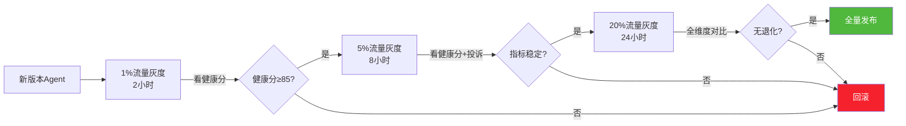

#### 5.4.2 灰度看板核心指标

| 指标类别 | 看板指标 | 告警阈值 |
|---------|---------|---------|
| **健康度** | 综合健康分 | <85 立即告警 |
| **业务** | 任务完成率 | 环比-3% 告警 |
| **性能** | P99延迟 | 环比+20% 告警 |
| **稳定性** | 错误率 | >1% 告警 |
| **用户** | 负向反馈率 | 环比+50% 告警 |

### 5.5 方法三:A/B实验(最科学的增量评估)

#### 5.5.1 A/B实验设计标准流程

```mermaid
flowchart TB
    H0[提出假设<br/>例: 改写Prompt能提升完成率3%] --> DESIGN[实验设计<br/>确定主指标/辅指标/护栏指标]
    DESIGN --> SIZE[样本量计算<br/>MDE=1%, α=0.05, power=0.8]
    SIZE --> DIVERT[分流设计<br/>按user_id哈希分桶,确保均衡]
    DIVERT --> RUN[运行实验<br/>最小周期7天(覆盖周内周期效应)]
    RUN --> CHECK[均衡性检查<br/>SRM检验, p<0.001则实验无效]
    CHECK -->|均衡| ANALYZE[显著性分析<br/>主指标p值+置信区间+效应量]
    CHECK -->|不均衡| DEBUG[排查分流Bug]
    ANALYZE --> DECISION{决策}
    DECISION -->|显著正向| SHIP[全量发布]
    DECISION -->|显著负向| DROP[放弃]
    DECISION -->|不显著| EXTEND[延长实验或放弃]
    
    style H0 fill:#4a90d9,color:#fff
    style SIZE fill:#fa8c16,color:#fff
    style SHIP fill:#50b83c,color:#fff
```

#### 5.5.2 A/B实验常见陷阱与防范

| 陷阱 | 表现 | 防范方法 |
|------|------|---------|
| **样本比例失衡(SRM)** | 实验组实际占比≠设计占比 | 上线后第1小时跑卡方检验,p<0.001立即排查 |
| **网络效应** | 用户A在实验组影响了对照组用户B | 按社交关系聚类分桶,而非按个人 |
| **新奇效应** | 短期提升但长期消失 | 至少跑2周,看趋势是否平稳 |
| **多重比较问题** | 同时看20个指标,总有1个p<0.05 | Bonferroni校正或控制FDR |
| **辛普森悖论** | 整体正向但分层看是负向 | 必做分层分析,不能只看整体 |
| **提前 peeking** | 每天看p值,提前决策 | 用序贯检验或固定停止时间 |

#### 5.5.3 样本量计算公式

$$
n = \frac{(z_{\alpha/2} + z_{\beta})^2 \cdot 2\sigma^2}{\Delta^2}
$$

- $z_{\alpha/2}=1.96$ (α=0.05 双侧)
- $z_{\beta}=0.84$ (power=0.8)
- $\sigma$: 指标标准差(历史数据估)
- $\Delta$: 最小可检测效应(MDE)

**示例**:任务完成率基线85%,希望检测±2%差异,σ=0.36
$$n = \frac{(1.96+0.84)^2 \cdot 2 \cdot 0.36^2}{0.02^2} \approx 1016 \text{ (每组)}$$

### 5.6 方法四:人工专家评估

#### 5.6.1 专家评估流程

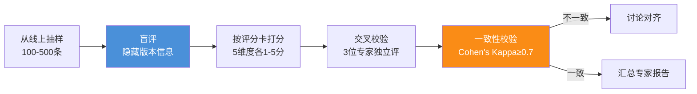

#### 5.6.2 专家评分卡(以客服Agent为例)

| 评分维度 | 5分(优秀) | 3分(合格) | 1分(差) |
|---------|----------|----------|--------|
| **准确性** | 完全正确,无任何事实错误 | 主要正确,有轻微瑕疵 | 有关键事实错误 |
| **完整性** | 全面覆盖用户问题 | 覆盖主要点,有遗漏 | 遗漏关键信息 |
| **清晰度** | 表达清晰,易于理解 | 基本清晰,有冗余 | 晦涩难懂/混乱 |
| **相关性** | 完全切题,无离题 | 基本切题,偶有跑题 | 大量离题内容 |
| **语气得体** | 专业友好,符合品牌 | 中规中矩 | 不礼貌/冷漠 |

### 5.7 方法五:用户反馈分析

#### 5.7.1 多渠道反馈采集

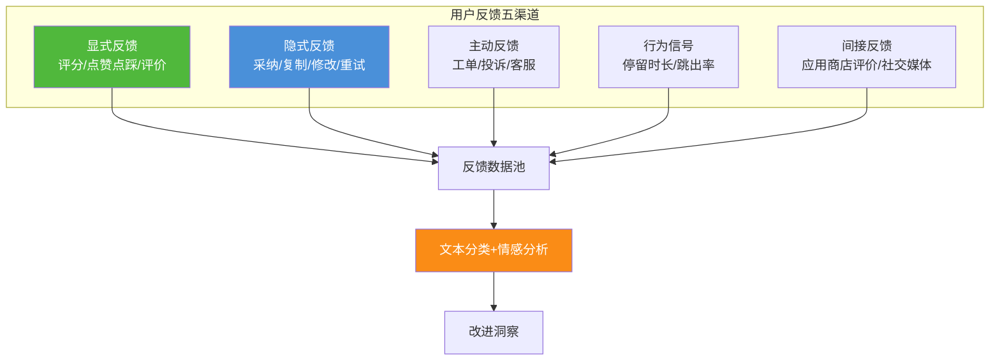

#### 5.7.2 隐式反馈信号解读表

| 用户行为 | 解读信号 | 权重 |
|---------|---------|:----:|
| 直接采纳输出 | 强正向 | +1.0 |
| 复制输出内容 | 中正向 | +0.5 |
| 修改后使用 | 弱正向(基本可用) | +0.2 |
| 重新提问(换说法) | 弱负向(没理解) | -0.3 |
| 删除输出 | 中负向 | -0.5 |
| 关闭会话不采纳 | 强负向 | -1.0 |
| 投诉/点踩 | 强负向 | -1.0 |

### 5.8 五类方法的组合使用建议

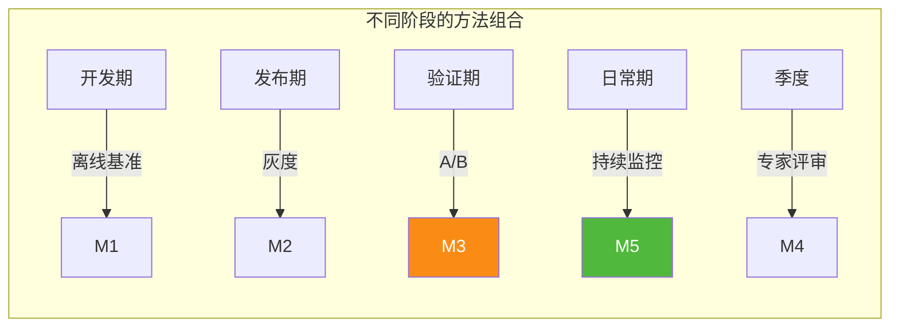

---

## 六、数据收集管道:五层数据源

### 6.1 五层数据管道架构

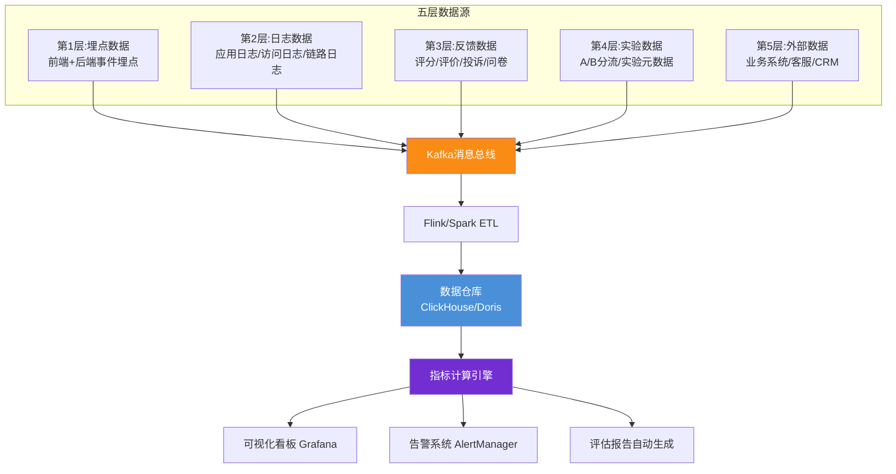

### 6.2 第1层:埋点数据规范

#### 6.2.1 核心埋点事件清单

| 事件名 | 触发时机 | 关键字段 | 用途 |
|--------|---------|---------|------|
| `agent_invoke_start` | Agent调用开始 | user_id, agent_id, version, session_id, input_hash | 计算调用量/延迟 |
| `agent_invoke_end` | Agent调用结束 | duration_ms, success, error_code, tokens | 完成率/延迟/成本 |
| `tool_call_start` | Tool调用开始 | tool_name, params_hash | 工具调用准确率 |
| `tool_call_end` | Tool调用结束 | success, result_hash, duration | 工具有效率 |
| `llm_call` | LLM调用 | model, prompt_tokens, completion_tokens | Token消耗 |
| `user_feedback` | 用户反馈 | rating, comment, feedback_type | CSAT/NPS |
| `user_action` | 用户行为 | action_type(adopt/copy/modify/delete) | 隐式反馈 |
| `session_start` | 会话开始 | user_id, scenario, entry_point | 留存分析 |
| `session_end` | 会话结束 | duration, turn_count, resolved | 解决率 |
| `error_occurred` | 错误发生 | error_type, error_msg, stack_hash | 错误率分析 |

#### 6.6.2 埋点字段规范(JSON Schema示例)

```json
{
  "event_id": "evt_abc123",
  "event_name": "agent_invoke_end",
  "event_time": "2026-08-08T10:30:00.123Z",
  "user_id": "u_001",
  "session_id": "s_xyz789",
  "agent_id": "a_customer_service",
  "agent_version": "v2.3.1",
  "properties": {
    "duration_ms": 3500,
    "success": true,
    "error_code": null,
    "tokens_input": 1200,
    "tokens_output": 350,
    "turn_count": 3,
    "tools_called": ["search_kb", "create_ticket"],
    "scenario": "billing_inquiry",
    "ab_experiment": "exp_123_group_A"
  },
  "context": {
    "app_version": "1.5.0",
    "platform": "web",
    "user_agent": "Mozilla/5.0...",
    "ip_hash": "a1b2c3",
    "locale": "zh-CN"
  }
}
```

### 6.3 第2层:日志数据规范

| 日志类型 | 格式 | 留存期 | 关键字段 |
|---------|------|:------:|---------|
| **应用日志** | JSON结构化 | 30天热+180天冷 | timestamp, level, service, trace_id, msg |
| **访问日志** | Nginx标准 | 90天 | method, path, status, latency, user_id |
| **链路日志** | OpenTelemetry | 7天 | trace_id, span_id, service, operation, duration |
| **审计日志** | 不可篡改WORM | 3年(合规) | who, when, what, before, after |
| **安全日志** | 加密存储 | 1年 | event_type, severity, src_ip, action |

### 6.4 第3层:反馈数据采集规范

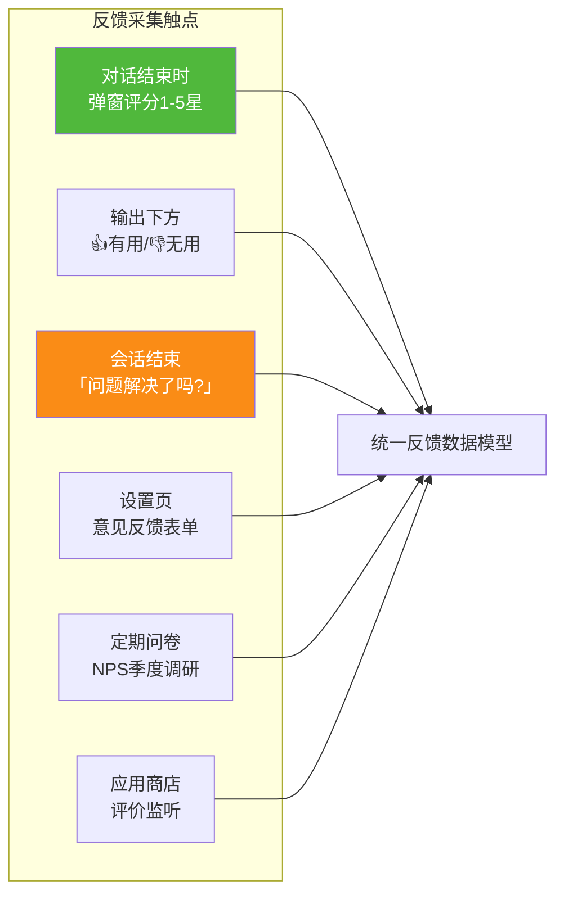

### 6.5 第4层:实验数据规范

| 数据类型 | 字段 | 用途 |
|---------|------|------|
| **实验定义** | exp_id, hypothesis, variants, metrics, start/end_time | 实验元数据 |
| **分流日志** | user_id, exp_id, variant, diversion_time | 用户分桶 |
| **曝光日志** | user_id, exp_id, variant, exposure_time | 实际曝光 |
| **结果日志** | user_id, exp_id, metric_values | 指标计算 |

### 6.6 数据质量保障机制

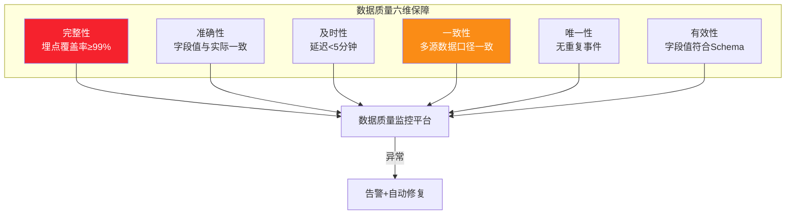

**数据质量校验规则示例**:

```python
# 每日数据质量校验任务
def daily_data_quality_check():
    checks = [
        # 1. 完整性:关键事件埋点覆盖率
        Check("event_coverage", 
              rule="agent_invoke_end的user_id非空率",
              threshold=">=99%",
              query="SELECT count(*) FILTER (WHERE user_id IS NULL) / count(*) FROM events WHERE event_name='agent_invoke_end' AND dt=yesterday()"),
        
        # 2. 及时性:数据延迟
        Check("data_freshness",
              rule="今日数据到达延迟",
              threshold="<=5min",
              query="SELECT now() - max(event_time) FROM events WHERE dt=today()"),
        
        # 3. 一致性:多源对账
        Check("cross_source_consistency",
              rule="调用日志 vs 计费日志",
              threshold="差异<=0.1%",
              query="对比events表invocation数 vs billing表计费数"),
        
        # 4. 唯一性:重复事件
        Check("event_uniqueness",
              rule="event_id去重率",
              threshold=">=99.99%",
              query="SELECT 1 - count_duplicate_event_id / count_total FROM events"),
    ]
    
    for check in checks:
        result = run_check(check)
        if not result.passed:
            send_alert(check, result)
```

---

## 七、结果分析框架:四维分析方法

### 7.1 四维分析框架

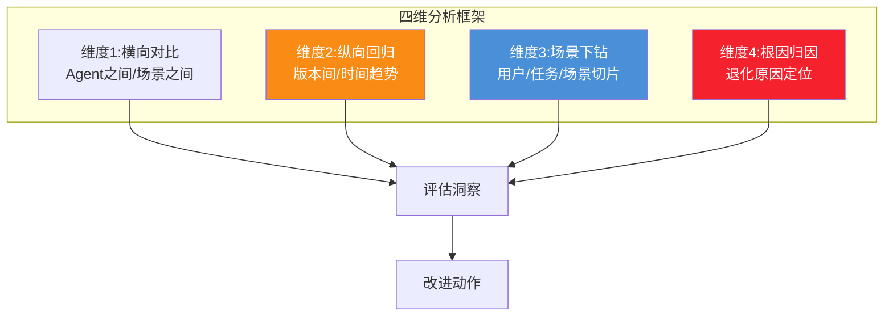

### 7.2 维度一:横向对比分析

> 把多个Agent放一起比,或同一Agent在不同场景下比,识别"哪些Agent/场景表现差"。

| 对比维度 | 示例 | 用途 |
|---------|------|------|
| **Agent之间** | 客服Agent vs 编程Agent的健康分 | 资源倾斜决策 |
| **场景之间** | 退款场景 vs 咨询场景的解决率 | 识别弱场景 |
| **用户群之间** | 企业用户 vs 个人用户的CSAT | 客群差异化 |
| **渠道之间** | Web vs App vs API的延迟 | 渠道优化 |
| **时段之间** | 工作日 vs 周末的完成率 | 容量规划 |

### 7.3 维度二:纵向回归分析(最关键)

#### 7.3.1 版本回归对比

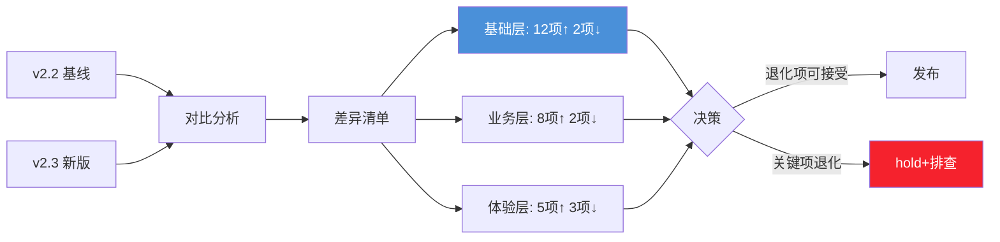

#### 7.3.2 时间趋势分析

| 趋势模式 | 含义 | 应对动作 |
|---------|------|---------|
| **持续上升** | 改进有效 | 总结经验,继续迭代 |
| **持续下降** | 系统性退化 | 紧急排查根因 |
| **突然下跌** | 单次事故 | 定位事故时间点,回滚 |
| **周期波动** | 流量/数据周期 | 识别周期,调整基线 |
| **阶梯式跳变** | 版本切换 | 评估版本效果 |

### 7.4 维度三:场景下钻分析

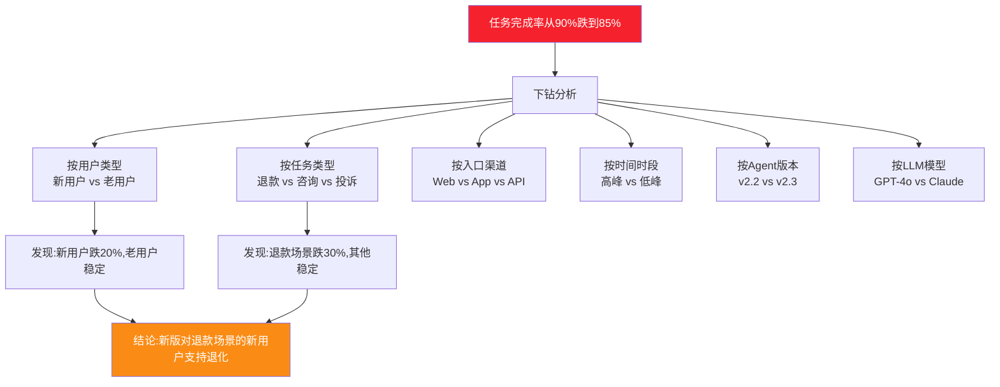

### 7.5 维度四:根因归因分析

#### 7.5.1 根因分析五步法

```mermaid
flowchart TB
    S1[Step1: 现象定义<br/>什么指标在什么维度退化] --> S2[Step2: 时间定位<br/>退化开始时间点]
    S2 --> S3[Step3: 变更关联<br/>时间点前后的变更清单]
    S3 --> S4[Step4: 假设验证<br/>逐个验证假设]
    S4 --> S5[Step5: 根因确认<br/>+预防措施]
    
    style S3 fill:#fa8c16,color:#fff
    style S4 fill:#4a90d9,color:#fff
```

#### 7.5.2 变更关联分析表

| 变更类型 | 示例 | 排查方法 |
|---------|------|---------|
| **代码变更** | Agent Prompt修改 | Git log对比退化时间点 |
| **配置变更** | LLM Temperature从0.3改0.7 | 配置中心审计日志 |
| **数据变更** | RAG知识库更新 | 数据版本对比 |
| **依赖变更** | LLM模型从GPT-4切GPT-4o | 模型路由日志 |
| **流量变更** | 用户量突增3倍 | 流量监控对比 |
| **外部变更** | 第三方API限流 | 外部依赖监控 |

#### 7.5.3 归因分析案例

```markdown
## 案例任务完成率退化归因

**现象**: 客服Agent任务完成率从92%跌到84%(8月5日-8月7日)

**Step1 时间定位**: 退化始于8月5日14:00

**Step2 变更关联**: 
- 8月5日13:30 发布v2.3(改了退款流程的Prompt)
- 8月5日12:00 RAG知识库新增200条退款政策文档
- 8月5日10:00 LLM模型从GPT-4o切到GPT-4o-mini(降本)

**Step3 假设验证**:
- 假设1: Prompt改动导致 → A/B回滚Prompt,完成率回升到91% → 部分原因
- 假设2: 知识库污染 → 下钻发现新文档中30条互相矛盾 → 部分原因
- 假设3: 模型降级 → 单独切回GPT-4o测试,完成率92% → 主要原因

**Step4 根因**: 模型降级(GPT-4o→GPT-4o-mini)是主因(贡献60%),知识库文档冲突是次因(贡献25%),Prompt改动是诱因(贡献15%)

**Step5 预防**:
- 模型切换必须先跑黄金集回归
- 知识库新增必须经过冲突检测
- Prompt改动必须A/B验证
```

---

## 八、持续优化机制:评估驱动迭代

### 8.1 评估驱动的双周迭代闭环

```mermaid
flowchart LR
    EVAL[双周评估报告] --> PRIORITIZE[改进项优先级排序]
    PRIORITIZE --> PLAN[迭代规划会<br/>选Top5改进项]
    PLAN --> DEV[双周开发]
    DEV --> AB[A/B验证效果]
    AB -->|显著正向| SHIP[发布]
    AB -->|不显著/负向| DROP[放弃或重做]
    SHIP --> EVAL2[下一轮评估]
    DROP --> EVAL2
    EVAL2 --> EVAL
    
    style PRIORITIZE fill:#fa8c16,color:#fff
    style AB fill:#4a90d9,color:#fff
    style SHIP fill:#50b83c,color:#fff
```

### 8.2 改进项优先级排序矩阵

```mermaid
quadrantChart
    title 改进项优先级矩阵
    x-axis Low Impact --> High Impact
    y-axis Low Effort --> High Effort
    
    "Prompt微调" : [0.7, 0.2]
    "Bug修复" : [0.6, 0.3]
    "RAG文档补充" : [0.5, 0.4]
    "工具增加" : [0.8, 0.7]
    "模型升级" : [0.9, 0.8]
    "架构重构" : [0.6, 0.9]
```

**四象限决策**:
- **高影响+低努力**(快赢):立即做,如Prompt微调
- **高影响+高努力**(战略):规划做,如模型升级
- **低影响+低努力**(填缝):有空做,如UI优化
- **低影响+高努力**(避免):不做,如无业务价值的重构

### 8.3 改进项追踪表模板

| 改进项ID | 来源 | 描述 | 优先级 | 负责人 | 状态 | 验证方式 | 效果 |
|---------|------|------|:------:|-------|:----:|---------|------|
| IMP-2026-001 | 周报#32 | 客服Agent退款场景Prompt优化 | P1 | 张三 | 进行中 | A/B实验 | 待验证 |
| IMP-2026-002 | 用户反馈 | 编程Agent对TypeScript支持差 | P1 | 李四 | 已发布 | 黄金集回归 | +8% |
| IMP-2026-003 | 专家评审 | 数据分析Agent图表标注缺失 | P2 | 王五 | 待启动 | 专家盲评 | - |
| IMP-2026-004 | A/B结论 | 创作AgentTemperature=0.7优于0.5 | P2 | 赵六 | 已发布 | A/B显著 | +12% CSAT |

### 8.4 评估与OKR联动

```mermaid
flowchart TB
    subgraph OKR与评估联动
        O[Objective<br/>提升客服Agent自服务能力]
        O --> KR1[KR1: 任务完成率85%→92%<br/>来源:B01指标]
        O --> KR2[KR2: 人工接管率25%→15%<br/>来源:S02指标]
        O --> KR3[KR3: CSAT 4.2→4.5<br/>来源:U01指标]
    end
    
    KR1 & KR2 & KR3 --> TRACK[双周进度追踪]
    TRACK --> RISK[风险预警<br/>进度滞后→调整策略]
    
    style O fill:#4a90d9,color:#fff
    style KR1 fill:#fa8c16,color:#fff
```

### 8.5 评估报告自动化

#### 8.5.1 评估报告模板结构

```markdown
# Agent运行效果评估周报 W32

## 一、执行摘要
- 综合健康分: 87/100 (🟢健康,环比+2)
- 关键事件: 8月7日发布v2.3,完成率+3%
- 风险提示: 编程Agent P99延迟环比+15%,需关注

## 二、核心指标趋势
[图表: 健康分30天趋势]
[图表: 三层指标雷达图]

## 三、横向对比
[表格: 6个Agent健康分排名]

## 四、纵向回归
[表格: v2.3 vs v2.2 指标对比]
[结论: 32项中28项↑,4项↓]

## 五、场景下钻
[图表: 各场景完成率分布]
[发现: 退款场景退化,新用户退化更明显]

## 六、A/B实验进展
| 实验ID | 假设 | 状态 | 结论 |
|--------|------|------|------|
| exp_123 | 新Prompt提升完成率 | 已结束 | 显著正向+3.2%,已发布 |

## 七、用户反馈Top问题
1. "Agent总是忘了前面的对话" (47条)
2. "退款流程太复杂" (32条)
3. "响应慢" (28条)

## 八、本期改进项
| ID | 改进项 | 优先级 | 状态 |
|----|--------|:------:|:----:|
| IMP-032 | 上下文摘要压缩 | P1 | 已发布 |
| IMP-033 | 退款Prompt重写 | P1 | 进行中 |

## 九、下期计划
- 重点: 退款场景优化(预期+5%完成率)
- 实验: 多模型路由策略A/B
```

#### 8.5.2 报告自动化生成管道

```mermaid
flowchart LR
    SQL[预定义SQL查询集] --> CALC[指标计算引擎]
    CALC --> FORMAT[报告模板渲染]
    FORMAT --> REVIEW[评估分析师审核]
    REVIEW --> DISTRIBUTE[分发<br/>邮件+钉钉+Confluence]
    
    style SQL fill:#4a90d9,color:#fff
    style REVIEW fill:#fa8c16,color:#fff
```

---

## 九、六类典型场景的差异化评估策略

### 9.1 场景化评估策略总览

```mermaid
flowchart TB
    subgraph 六类场景差异化评估
        SC1[客服助理<br/>关注解决率与接管率]
        SC2[编程助手<br/>关注采纳率与正确性]
        SC3[数据分析<br/>关注准确性与效率]
        SC4[内容创作<br/>关注满意度与创新性]
        SC5[多Agent协作<br/>关注协作效率与死锁]
        SC6[学习型Agent<br/>关注长期进步趋势]
    end
    
    style SC1 fill:#fa8c16,color:#fff
    style SC6 fill:#722ed1,color:#fff
```

### 9.2 场景一:客服助理评估策略

| 评估维度 | 重点指标 | 评估方法 | 特殊考虑 |
|---------|---------|---------|---------|
| **核心** | S01解决率、S02人工接管率、S03首次响应解决率 | 在线灰度+A/B | 必须区分"真解决"vs"用户放弃" |
| **质量** | S05知识引用准确率、U08专家评分 | 专家盲评 | 抽样客服对话,每周100条 |
| **效率** | S04交互轮数、B04延迟 | 日志自动 | 关注P99而非均值 |
| **体验** | U01 CSAT、U04负向反馈率 | 用户反馈 | 关注1星评价的具体原因 |
| **特殊** | 转人工原因分类 | 客服系统 | 识别Agent能力边界 |

### 9.3 场景二:编程助手评估策略

| 评估维度 | 重点指标 | 评估方法 | 特殊考虑 |
|---------|---------|---------|---------|
| **核心** | S07输出采纳率、B03工具调用准确率 | 行为埋点 | 采纳=直接复制/应用 |
| **质量** | 代码正确率、U07重复修改率 | 自动化测试+专家 | HumanEval基准+真实PR |
| **效率** | 代码生成速度、B10 Token消耗 | 日志 | 关注代码行数/Token比 |
| **体验** | IDE内使用留存、U05 7日留存 | 行为日志 | 留存比单次满意度更重要 |
| **特殊** | 代码执行成功率 | 沙盒执行 | 自动跑生成的代码 |

### 9.4 场景三:数据分析评估策略

| 评估维度 | 重点指标 | 评估方法 | 特殊考虑 |
|---------|---------|---------|---------|
| **核心** | S05引用准确率、S06工具有效率 | 专家+自动 | 数据源准确性是底线 |
| **质量** | 分析结论正确性、图表准确性 | 专家盲评 | 抽样核对数据真实性 |
| **效率** | 分析耗时、B11单任务成本 | 日志 | 关注复杂查询的成本 |
| **体验** | 输出可读性、U07修改率 | 用户反馈 | 关注"看不懂"类反馈 |
| **特殊** | SQL正确率 | 自动执行 | 跑生成的SQL看结果 |

### 9.5 场景四:内容创作评估策略

| 评估维度 | 重点指标 | 评估方法 | 特殊考虑 |
|---------|---------|---------|---------|
| **核心** | U01 CSAT、U08专家评分、S07采纳率 | 问卷+专家 | 主观性强,需多人评分 |
| **质量** | 创新性、连贯性、风格一致性 | 专家盲评 | 5维度评分卡 |
| **效率** | 生成速度、B10 Token消耗 | 日志 | 关注长文成本 |
| **体验** | 修改率、U05留存 | 行为埋点 | 关注"再生成"率 |
| **特殊** | 抄袭/重复检测 | 第三方工具 | Turnitin类工具 |

### 9.6 场景五:多Agent协作评估策略

| 评估维度 | 重点指标 | 评估方法 | 特殊考虑 |
|---------|---------|---------|---------|
| **核心** | B01完成率、B09重试率、S04交互轮数 | 日志+Trace | 关注协作轮次 |
| **质量** | 角色分工合理性、协作死锁率 | Trace分析 | 识别死循环模式 |
| **效率** | 协作耗时、Token总消耗 | 日志 | 关注冗余通信 |
| **体验** | 最终输出质量、U06放弃率 | 用户反馈 | 关注中途放弃 |
| **特殊** | Supervisor决策准确率 | 专家分析 | 评估任务分配是否合理 |

### 9.7 场景六:学习型Agent评估策略

```mermaid
flowchart LR
    subgraph 学习型Agent特殊评估
        L1[短期评估<br/>单次任务表现]
        L2[中期评估<br/>2-4周趋势]
        L3[长期评估<br/>季度对比]
    end
    
    L1 --> M1[与基线Agent对比<br/>单次任务完成率]
    L2 --> M2[学习曲线分析<br/>同类型任务随时间的进步]
    L3 --> M3[能力扩展评估<br/>能否处理初始不能的任务]
    
    style L2 fill:#fa8c16,color:#fff
    style L3 fill:#722ed1,color:#fff
```

| 评估维度 | 重点指标 | 评估方法 | 特殊考虑 |
|---------|---------|---------|---------|
| **核心** | 学习非负率、U05长期留存 | 长期A/B | 必须有对照组(不学习版本) |
| **质量** | 学习后效果提升幅度、退化率 | 52周回归集 | 防止"学坏" |
| **效率** | 学习开销占比、U04负向反馈趋势 | 日志 | 学习成本 vs 收益 |
| **体验** | 用户感知进步、长期CSAT趋势 | 长期问卷 | 用户主观感受进步 |
| **特殊** | 学到的知识可解释性 | 知识审计 | 每条学习内容可追溯 |

---

## 十、评估平台工程架构与实现

### 10.1 评估平台总体架构

```mermaid
flowchart TB
    subgraph 评估平台五层架构
        L5[第五层:应用层<br/>报告/看板/告警/实验平台]
        L4[第四层:计算层<br/>指标计算/统计分析/ML模型]
        L3[第三层:存储层<br/>数据仓库/指标库/实验库]
        L2[第二层:管道层<br/>ETL/流处理/质量校验]
        L1[第一层:采集层<br/>埋点SDK/日志收集/反馈API]
    end
    
    L1 --> L2 --> L3 --> L4 --> L5
    
    style L1 fill:#4a90d9,color:#fff
    L3 fill:#fa8c16,color:#fff
    L4 fill:#722ed1,color:#fff
```

### 10.2 技术选型建议

| 层级 | 组件 | 推荐技术 | 选型理由 |
|------|------|---------|---------|
| **采集** | 埋点SDK | Sensors Analytics / 自研SDK | 多端覆盖,字段灵活 |
| **采集** | 日志收集 | Filebeat + Kafka | 主流稳定 |
| **管道** | 流处理 | Flink | 实时计算+窗口聚合 |
| **管道** | 批处理 | Spark | 大规模离线计算 |
| **存储** | 数据仓库 | ClickHouse / Apache Doris | OLAP查询快 |
| **存储** | 指标库 | Prometheus + Thanos | 时序指标标准 |
| **计算** | 指标引擎 | dbt + SQL | 指标定义版本化 |
| **计算** | 统计分析 | Python + SciPy / R | A/B显著性检验 |
| **应用** | 看板 | Grafana + Apache Superset | 通用+灵活 |
| **应用** | 实验平台 | GrowthBook / 自研 | A/B实验管理 |
| **应用** | 告警 | AlertManager + 钉钉 | 标准方案 |
| **应用** | 报告 | Jupyter + Papermill | 报告自动化 |

### 10.3 指标计算引擎参考实现

```python
"""
Agent评估指标计算引擎
基于dbt模型定义,自动化计算所有指标
"""
from dataclasses import dataclass
from typing import List, Dict
from datetime import datetime, timedelta

@dataclass
class MetricDefinition:
    """指标定义"""
    metric_id: str           # B01, S01, U01...
    metric_name: str
    layer: str               # basic/business/experience
    sql_template: str        # 计算SQL
    baseline: float          # 基线值
    thresholds: Dict[str, float]  # {green: 95, yellow: 85, red: 85}
    weight: float            # 权重
    scenario_overrides: Dict[str, float]  # 场景化权重覆盖


class AgentMetricEngine:
    """Agent评估指标计算引擎"""
    
    # 预定义指标集
    METRICS = [
        MetricDefinition(
            metric_id="B01",
            metric_name="任务完成率",
            layer="basic",
            sql_template="""
                SELECT 
                    agent_id,
                    COUNTIf(success=true) / COUNT(*) as value
                FROM agent_invocations
                WHERE dt BETWEEN '{start}' AND '{end}'
                GROUP BY agent_id
            """,
            baseline=0.92,
            thresholds={"green": 0.95, "yellow": 0.85, "red": 0.85},
            weight=0.05,
            scenario_overrides={"customer_service": 0.08}
        ),
        MetricDefinition(
            metric_id="S01",
            metric_name="任务解决率(用户视角)",
            layer="business",
            sql_template="""
                SELECT 
                    agent_id,
                    COUNTIf(resolved=true) / COUNT(*) as value
                FROM user_feedback
                WHERE dt BETWEEN '{start}' AND '{end}'
                  AND feedback_type='resolution'
                GROUP BY agent_id
            """,
            baseline=0.75,
            thresholds={"green": 0.80, "yellow": 0.60, "red": 0.60},
            weight=0.08,
            scenario_overrides={"customer_service": 0.15}
        ),
        MetricDefinition(
            metric_id="U01",
            metric_name="用户满意度CSAT",
            layer="experience",
            sql_template="""
                SELECT 
                    agent_id,
                    AVG(rating) / 5.0 as value
                FROM user_ratings
                WHERE dt BETWEEN '{start}' AND '{end}'
                GROUP BY agent_id
            """,
            baseline=0.85,
            thresholds={"green": 0.90, "yellow": 0.80, "red": 0.80},
            weight=0.06,
            scenario_overrides={"content_creation": 0.15}
        ),
        # ... 其余29项指标
    ]
    
    def compute_health_score(self, agent_id: str, 
                              start: datetime, end: datetime,
                              scenario: str = "default") -> Dict:
        """计算综合健康分"""
        results = []
        for metric in self.METRICS:
            # 1. 执行SQL获取指标值
            value = self._execute_sql(metric.sql_template, 
                                       agent_id, start, end)
            
            # 2. 根据阈值打分
            score = self._score(value, metric.thresholds)
            
            # 3. 获取场景化权重
            weight = metric.scenario_overrides.get(scenario, metric.weight)
            
            results.append({
                "metric_id": metric.metric_id,
                "metric_name": metric.metric_name,
                "value": value,
                "score": score,
                "weight": weight,
                "layer": metric.layer
            })
        
        # 4. 计算加权综合分
        total_weight = sum(r["weight"] for r in results)
        health_score = sum(r["score"] * r["weight"] for r in results) / total_weight
        
        # 5. 分层汇总
        layer_scores = {}
        for layer in ["basic", "business", "experience"]:
            layer_results = [r for r in results if r["layer"] == layer]
            if layer_results:
                layer_weight = sum(r["weight"] for r in layer_results)
                layer_scores[layer] = sum(r["score"] * r["weight"] for r in layer_results) / layer_weight
        
        return {
            "agent_id": agent_id,
            "period": f"{start.date()} ~ {end.date()}",
            "health_score": round(health_score, 2),
            "layer_scores": layer_scores,
            "metrics": results,
            "status": self._status(health_score)
        }
    
    def _score(self, value: float, thresholds: Dict) -> float:
        """根据阈值打分(0-100)"""
        if value >= thresholds["green"]:
            return 90 + (value - thresholds["green"]) / (1 - thresholds["green"]) * 10
        elif value >= thresholds["yellow"]:
            return 60 + (value - thresholds["yellow"]) / (thresholds["green"] - thresholds["yellow"]) * 30
        else:
            return max(0, value / thresholds["yellow"] * 60)
    
    def _status(self, score: float) -> str:
        if score >= 85: return "🟢 健康"
        elif score >= 70: return "🟡 关注"
        else: return "🔴 告警"


# 使用示例
engine = AgentMetricEngine()
report = engine.compute_health_score(
    agent_id="customer_service_bot",
    start=datetime(2026, 8, 1),
    end=datetime(2026, 8, 7),
    scenario="customer_service"
)
print(f"健康分: {report['health_score']} ({report['status']})")
```

### 10.4 A/B实验平台核心逻辑

```python
"""
A/B实验显著性分析
"""
from scipy import stats
import numpy as np

class ABTestAnalyzer:
    
    def analyze(self, control: np.array, treatment: np.array,
                metric_name: str, mde: float) -> Dict:
        """
        control: 对照组指标值数组
        treatment: 实验组指标值数组
        mde: 最小可检测效应
        """
        # 1. 描述性统计
        c_mean, t_mean = np.mean(control), np.mean(treatment)
        c_std, t_std = np.std(control), np.std(treatment)
        c_n, t_n = len(control), len(treatment)
        
        # 2. 显著性检验(比例用Z检验,连续值用T检验)
        if metric_name in ["task_completion_rate", "retention_rate"]:
            # 比例Z检验
            pooled_p = (c_mean * c_n + t_mean * t_n) / (c_n + t_n)
            se = np.sqrt(pooled_p * (1 - pooled_p) * (1/c_n + 1/t_n))
            z_score = (t_mean - c_mean) / se
            p_value = 2 * (1 - stats.norm.cdf(abs(z_score)))
        else:
            # 连续值T检验
            t_stat, p_value = stats.ttest_ind(treatment, control)
        
        # 3. 效应量
        lift = (t_mean - c_mean) / c_mean
        absolute_lift = t_mean - c_mean
        
        # 4. 置信区间
        se_diff = np.sqrt(c_std**2/c_n + t_std**2/t_n)
        ci_lower = absolute_lift - 1.96 * se_diff
        ci_upper = absolute_lift + 1.96 * se_diff
        
        # 5. 决策建议
        significant = p_value < 0.05
        practical = abs(absolute_lift) >= mde
        
        if significant and absolute_lift > 0 and practical:
            recommendation = "✅ 显著正向,建议发布"
        elif significant and absolute_lift < 0:
            recommendation = "❌ 显著负向,建议放弃"
        elif not significant:
            recommendation = "⚠️ 不显著,建议延长实验或放弃"
        else:
            recommendation = "⚠️ 显著但效应量小,权衡成本后决策"
        
        return {
            "metric": metric_name,
            "control_mean": round(c_mean, 4),
            "treatment_mean": round(t_mean, 4),
            "absolute_lift": round(absolute_lift, 4),
            "relative_lift": f"{lift*100:.2f}%",
            "p_value": round(p_value, 4),
            "ci_95": [round(ci_lower, 4), round(ci_upper, 4)],
            "significant": significant,
            "recommendation": recommendation
        }
```

---

## 十一、评估治理与组织保障

### 11.1 评估角色与职责

```mermaid
flowchart TB
    subgraph 评估治理角色
        R1[评估负责人<br/>评估体系Owner]
        R2[评估分析师<br/>日常分析]
        R3[SRE<br/>数据管道+监控]
        R4[算法工程师<br/>改进项执行]
        R5[产品经理<br/>需求+优先级]
        R6[业务方<br/>目标对齐]
    end
    
    R1 -->|设计体系| R2
    R2 -->|分析报告| R5
    R3 -->|数据保障| R2
    R4 -->|改进验证| R2
    R5 -->|迭代规划| R4
    R6 -->|业务反馈| R1
    
    style R1 fill:#fa8c16,color:#fff
    style R2 fill:#4a90d9,color:#fff
```

### 11.2 评估治理机制

| 机制 | 频率 | 参与者 | 议题 |
|------|:----:|-------|------|
| **每日站会** | 日 | SRE+评估分析师 | 看告警,处理紧急问题 |
| **评估周会** | 周 | 全角色 | 周报评审,识别风险 |
| **迭代规划会** | 双周 | 产品+算法 | 改进项优先级排序 |
| **A/B评审会** | 实验 | 评估负责人+分析师 | 实验设计+结论评审 |
| **月度复盘** | 月 | 全角色+管理层 | 月度趋势+OKR进度 |
| **季度回顾** | 季 | 全角色+第三方 | 体系有效性回顾+指标修订 |

### 11.3 评估成熟度模型

```mermaid
flowchart LR
    L1[L1 起步级<br/>手工跑测试<br/>无持续监控] --> L2[L2 规范级<br/>有指标字典<br/>周报自动化]
    L2 --> L3[L3 量化级<br/>A/B实验平台<br/>根因分析标准化]
    L3 --> L4[L4 优化级<br/>评估驱动迭代<br/>改进闭环成熟]
    L4 --> L5[L5 卓越级<br/>自动化决策<br/>自 healing]
    
    style L1 fill:#f5222d,color:#fff
    style L3 fill:#fa8c16,color:#fff
    style L5 fill:#50b83c,color:#fff
```

| 等级 | 特征 | 关键标志 |
|:----:|------|---------|
| **L1 起步** | 上线前手工跑测试,无持续评估 | 有测试集但无监控 |
| **L2 规范** | 有指标字典,周报自动化 | Grafana看板+周报 |
| **L3 量化** | A/B实验平台,根因分析标准化 | 实验平台+归因手册 |
| **L4 优化** | 评估驱动迭代,改进闭环成熟 | 改进项进OKR+追踪 |
| **L5 卓越** | 自动化决策,自healing | 异常自动回滚+自动调优 |

---

## 十二、交付清单与行动指南

### 12.1 交付物清单

```mermaid
mindmap
  root((本文交付物))
    评估框架
      PDCA四阶段闭环
      EARTH五维目标
    指标体系
      三层32项指标
      场景化权重配置
      综合健康分公式
    评估方法
      五类方法对比矩阵
      离线基准三层测试集
      A/B实验六陷阱防范
      专家评分卡
      隐式反馈信号表
    数据管道
      五层数据源架构
      埋点事件清单
      数据质量六维保障
    分析框架
      四维分析方法
      根因归因五步法
      变更关联分析表
    优化机制
      双周迭代闭环
      改进项优先级矩阵
      评估OKR联动
      报告自动化模板
    场景策略
      六类场景差异化评估
      学习型Agent特殊评估
    工程实现
      评估平台五层架构
      指标计算引擎代码
      A/B分析器代码
    组织治理
      评估角色职责
      治理机制六会议
      成熟度五级模型
```

### 12.2 落地行动指南(90天)

```mermaid
gantt
    title 评估体系90天落地路线
    dateFormat YYYY-MM-DD
    axisFormat %d
    
    section 第1月:基础建设
    指标字典定义+埋点规范       :a1, 2026-08-08, 15d
    数据管道搭建               :a2, 2026-08-08, 20d
    黄金集测试集构建            :a3, 2026-08-15, 15d
    
    section 第2月:体系运行
    看板搭建+周报自动化         :b1, 2026-09-07, 15d
    灰度发布评估流程跑通        :b2, 2026-09-07, 15d
    首个A/B实验                :b3, 2026-09-15, 15d
    
    section 第3月:优化闭环
    改进项追踪机制上线          :c1, 2026-10-07, 15d
    根因分析标准化              :c2, 2026-10-07, 15d
    月度复盘+成熟度评估         :c3, 2026-10-22, 10d
```

### 12.3 与系列文档的关系

| 文档 | 主题 | 与本文关系 |
|------|------|-----------|
| [156号评价体系](./156Agent综合评价指标体系与量化标准_功能实现性能表现用户体验适应性学习安全可靠性全面评估.md) | 评价体系设计 | **设计 ↔ 实施**:156号定义指标,本文落地采集分析 |
| [157号问题排查](./157Agent项目上线后问题系统性分析与排查手册.md) | 上线问题诊断 | **评估 ↔ 诊断**:本文发现问题信号,157号提供排查方法 |
| [154号自主学习](./154Agent自主学习功能设计与实现完整方案.md) | 自主学习 | 学习型Agent评估策略(第九章)直接对接 |
| [156号Marketplace](./156AgentMarketplace平台系统性设计完整方案.md) | 平台架构 | 评估数据来自平台的8大微服务 |
| [155号未来趋势](./155Agent未来发展方向全景解析_技术演进架构趋势与落地路径.md) | 未来方向 | 评估成熟度L5对应未来自healing方向 |

### 12.4 一句话总结

> **Agent 运行效果评估 = 用 PDCA 闭环把 156 号的"指标体系"变成持续行动:每日看健康分、每周做对比下钻、每版本跑 A/B 验证、每双周把改进项排进 OKR——评估不是终点报告,而是驱动 Agent 越用越好的引擎。**

---

> **参考来源:**
> - [Google SRE Book - Monitoring Distributed Systems](https://sre.google/sre-book/monitoring-distributed-systems/) — 黄金信号与告警分级
> - [Trustworthy Online Controlled Experiments](https://www.amazon.com/Trustworthy-Online-Controlled-Experiments-Practical/dp/1108724264) — A/B实验权威指南,SRM/网络效应/peeking
> - [GrowthBook Documentation](https://docs.growthbook.io/) — 开源A/B实验平台
> - [dbt Metrics Layer](https://docs.getdbt.com/docs/build/metrics-overview) — 指标定义版本化
> - [Apache Doris](https://doris.apache.org/) — 实时OLAP数据仓库
> - [156号综合评价体系](./156Agent综合评价指标体系与量化标准_功能实现性能表现用户体验适应性学习安全可靠性全面评估.md) — 指标体系设计参考
> - [157号上线问题排查手册](./157Agent项目上线后问题系统性分析与排查手册.md) — 问题诊断方法
> - [154号自主学习](./154Agent自主学习功能设计与实现完整方案.md) §8 评估指标体系 — 学习型Agent评估基础
