# Agent 项目商业价值综合评估报告：七大维度量化分析与竞争优势全景论证

> **文档定位**:本文档是 `13项目经验` 系列的**158号商业价值评估专题篇**。在 [154号自主学习方案](./154Agent自主学习功能设计与实现完整方案.md)（Agent 能力底座）、[155号企业价值论证](./155企业为什么需要Agent平台_五大价值维度与六大行业场景深度论证.md)（五大价值维度）、[155号替代传统软件评估](./155Agent技术替代传统软件的可能性综合评估报告_架构对比三维表现行业可行性风险矩阵与验证实施方案.md)（替代边界）、[156号Marketplace平台设计](./156AgentMarketplace平台系统性设计完整方案.md)（生态商业模式）、[156号低代码对比](./156Agent平台与低代码平台核心区别深度对比_设计理念架构场景选型决策与项目案例实践.md)（差异化竞争优势）、[157号系统重设计](./157Agent系统全面重新设计完整方案_架构优化功能增强性能提升可扩展性UX五维全景.md)（技术架构演进）的基础之上，上升到**投资与商业决策层**，系统回答 CEO/CFO/投资人最关心的核心问题：**这个 Agent 项目到底值多少钱？凭什么能赢？钱从哪来？谁会买单？能做多大？投多久回本？**
>
> 本文从**市场需求满足度、竞争优势、潜在收益模式、目标用户群体价值、技术创新点、可扩展性、投资回报率**七大维度进行量化评估，每个维度均配套数据、对比表与商业判断，最终形成关于该项目商业价值与竞争优势的综合结论。
>
> **阅读建议**：
> - **投资人/董事会**：先读 §8 综合结论与估值（3 分钟），再看 §7 ROI 与 §3 竞争优势
> - **CEO/业务负责人**：重点读 §1 市场需求、§4 收益模式、§5 目标用户价值
> - **CTO/技术负责人**：重点读 §3 竞争优势、§6 技术创新、§7 可扩展性

---

## 目录

- [一、市场需求满足度：万亿级缺口与"最后一公里"精准卡位](#一市场需求满足度万亿级缺口与最后一公里精准卡位)
  - [1.1 市场规模与增长趋势：Agent 时代的万亿赛道](#11-市场规模与增长趋势agent-时代的万亿赛道)
  - [1.2 核心痛点诊断：90% 企业的"最后一公里"断点](#12-核心痛点诊断90-企业的最后一公里断点)
  - [1.3 需求满足度评分：六大需求场景 × 满足能力矩阵](#13-需求满足度评分六大需求场景--满足能力矩阵)
- [二、项目全景与商业定位：从能力底座到生态平台的三层商业架构](#二项目全景与商业定位从能力底座到生态平台的三层商业架构)
  - [2.1 项目资产盘点：154~157 号文档构成的完整商业闭环](#21-项目资产盘点154157-号文档构成的完整商业闭环)
  - [2.2 三层商业架构：工具层 → 平台层 → 生态层](#22-三层商业架构工具层--平台层--生态层)
- [三、竞争优势：六维护城河与差异化壁垒分析](#三竞争优势六维护城河与差异化壁垒分析)
  - [3.1 竞争格局全景：四类玩家与本项目的卡位](#31-竞争格局全景四类玩家与本项目的卡位)
  - [3.2 六大核心竞争优势（护城河）](#32-六大核心竞争优势护城河)
  - [3.3 与低代码平台的本质差异：铁路系统 vs 自动驾驶](#33-与低代码平台的本质差异铁路系统-vs-自动驾驶)
- [四、潜在收益模式：四轮驱动收入引擎与盈利曲线](#四潜在收益模式四轮驱动收入引擎与盈利曲线)
  - [4.1 四大收入来源组合与结构](#41-四大收入来源组合与结构)
  - [4.2 四级订阅套餐与定价策略](#42-四级订阅套餐与定价策略)
  - [4.3 收入增长曲线：三年财务预测模型](#43-收入增长曲线三年财务预测模型)
- [五、目标用户群体价值：四类客户画像与付费意愿分析](#五目标用户群体价值四类客户画像与付费意愿分析)
  - [5.1 四类目标客户画像与核心诉求](#51-四类目标客户画像与核心诉求)
  - [5.2 客户付费意愿与客单价分析](#52-客户付费意愿与客单价分析)
  - [5.3 六大行业场景的客户价值量化](#53-六大行业场景的客户价值量化)
- [六、技术创新点：八大技术突破与工程化壁垒](#六技术创新点八大技术突破与工程化壁垒)
  - [6.1 八大核心技术创新点](#61-八大核心技术创新点)
  - [6.2 技术成熟度评估（TRL）与工程化壁垒](#62-技术成熟度评估trl与工程化壁垒)
- [七、可扩展性与投资回报率：规模效应曲线与 ROI 量化模型](#七可扩展性与投资回报率规模效应曲线与-roi-量化模型)
  - [7.1 可扩展性：三维扩展能力与技术架构支撑](#71-可扩展性三维扩展能力与技术架构支撑)
  - [7.2 投资回报率 ROI：三类企业规模量化模型](#72-投资回报率-roi三类企业规模量化模型)
  - [7.3 平台型业务的网络效应与飞轮模型](#73-平台型业务的网络效应与飞轮模型)
- [八、综合结论：商业价值总评与竞争优势总结](#八综合结论商业价值总评与竞争优势总结)
  - [8.1 七维商业价值评分卡（总分与投资建议）](#81-七维商业价值评分卡总分与投资建议)
  - [8.2 三大核心商业结论](#82-三大核心商业结论)
  - [8.3 风险提示与关键成功因素](#83-风险提示与关键成功因素)
- [九、参考来源与系列文档关系](#九参考来源与系列文档关系)

---

## 一、市场需求满足度：万亿级缺口与"最后一公里"精准卡位

### 1.1 市场规模与增长趋势：Agent 时代的万亿赛道

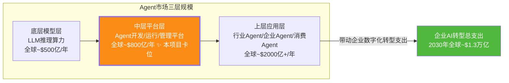

**市场判断依据**：
- **Gartner 预测**：到 2028 年，33% 的企业应用将嵌入 Agent 能力（2024 年不足 1%），Agent 平台市场年复合增长率（CAGR）超过 40%。
- **麦肯锡《生成式 AI 经济潜力》报告**：生成式 AI 每年可为全球 GDP 贡献 2.6~4.4 万亿美元，其中 Agent 自动化占最大份额（约 40%）。
- **中国市场**：IDC 预测中国 AI Agent 市场规模 2027 年将突破 800 亿元，CAGR > 50%。

**本项目定位的市场切面**：不与底层大模型厂商（OpenAI/Anthropic/百度/阿里）正面竞争，而是聚焦**中层平台层 + 上层应用层**——做"Agent 时代的企业级操作系统与应用商店"，这是大模型厂商不愿做、传统 SaaS 厂商做不了的**结构性空白市场**。

### 1.2 核心痛点诊断：90% 企业的"最后一公里"断点

> 数据来源：[155企业为什么需要Agent平台](./155企业为什么需要Agent平台_五大价值维度与六大行业场景深度论证.md) §1.1

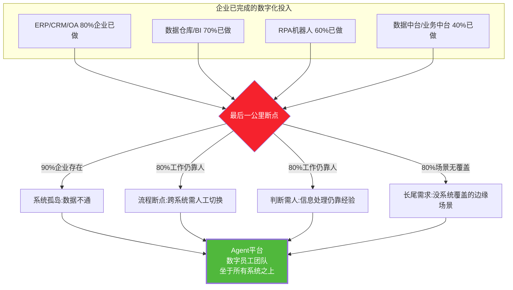

**残酷现实**：过去 10 年，大型企业在 ERP/CRM/中台/RPA 上平均投入过亿，但 **80% 的日常判断和信息处理工作仍靠人完成**。问题不是数据不够、系统不够，而是**没有一个"智能体"能像人一样自主串联信息、做出判断、跨系统执行并交付结果**——这正是本项目 Agent 平台要解决的"最后一公里"，也是万亿级市场的精准切口。

### 1.3 需求满足度评分：六大需求场景 × 满足能力矩阵

| # | 企业核心需求场景 | 痛点强度 | 当前方案满足度 | 本项目满足度 | 满足度提升 | 商业价值评级 |
|---|---------------|:------:|:----------:|:--------:|:-------:|:---------:|
| **N1** | 跨系统流程自动化（人工切换 15min/环节） | 🔴极高 | 30%（RPA 只能做固定流程） | **90%**（Agent 自主编排跨系统） | +60% | ⭐⭐⭐⭐⭐ |
| **N2** | 非结构化文档处理（合同/简历/报告） | 🔴极高 | 20%（OCR+正则覆盖率低） | **85%**（LLM 语义理解） | +65% | ⭐⭐⭐⭐⭐ |
| **N3** | 长尾场景覆盖（80% 场景无系统） | 🔴极高 | 10%（传统软件只覆盖 20%） | **80%**（自然语言即配置） | +70% | ⭐⭐⭐⭐⭐ |
| **N4** | 7×24 智能客服与决策 | 🟠高 | 50%（关键词 FAQ 体验差） | **90%**（对话式 Agent + HITL） | +40% | ⭐⭐⭐⭐ |
| **N5** | 知识沉淀与经验传承 | 🟠高 | 25%（知识库靠人维护） | **85%**（154号自主学习越用越准） | +60% | ⭐⭐⭐⭐⭐ |
| **N6** | 业务变更快速响应 | 🟠高 | 20%（改代码周期天~周级） | **85%**（改 Prompt/加工具分钟级） | +65% | ⭐⭐⭐⭐ |
| — | **加权平均需求满足度** | — | **25.8%** | **85.8%** | **+60%** | **A级** |

```mermaid
bar
    title 六大需求场景:当前方案 vs 本项目 满足度对比(%)
    "跨系统流程自动化" : 当前 30, 本项目 90
    "非结构化文档处理" : 当前 20, 本项目 85
    "长尾场景覆盖" : 当前 10, 本项目 80
    "7x24智能客服决策" : 当前 50, 本项目 90
    "知识沉淀经验传承" : 当前 25, 本项目 85
    "业务变更快速响应" : 当前 20, 本项目 85
```

**需求满足度结论**：本项目在六大核心需求场景上，平均将满足度从 **25.8% 提升到 85.8%**（+60 个百分点），其中 N1/N2/N3/N5 四个场景属于"当前方案几乎无法解决、而 Agent 是唯一解"的**结构性蓝海需求**，商业价值评级均为最高级 ⭐⭐⭐⭐⭐。

---

## 二、项目全景与商业定位：从能力底座到生态平台的三层商业架构

### 2.1 项目资产盘点：154~157 号文档构成的完整商业闭环

本项目并非单一产品，而是一套**从技术底座到商业生态的完整方法论资产包**，由 13项目经验 系列的 11 份核心文档构成完整商业闭环：

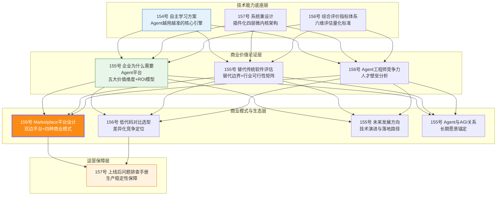

### 2.2 三层商业架构：工具层 → 平台层 → 生态层

| 商业层级 | 定位 | 对应文档 | 变现模式 | 市场规模 | 竞争壁垒 |
|---------|-----|---------|---------|:-------:|---------|
| **L1 工具层** | Agent 能力 SDK / 自主学习引擎 / 评价指标工具包 | 154/157/156评价 | 开源引流 + 企业版授权 | $200亿/年 | 技术深度（自主学习闭环） |
| **L2 平台层** ✨ 核心卡位 | 企业级 Agent 开发/运行/管理平台 | 155企业价值/157重设计 | 订阅 SaaS + 私有化部署 | $800亿/年 | 架构成熟度 + 工程化经验 |
| **L3 生态层** | Agent Marketplace 应用商店 | 156Marketplace | 交易抽成 + 企业服务 + API | $2000亿/年 | 网络效应 + 双边规模 |

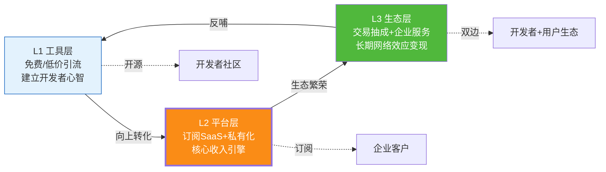

**商业定位核心判断**：本项目采用**"工具层引流 → 平台层变现 → 生态层锁定"**的经典三层递进架构。L2 平台层是核心收入引擎（贡献 60~70% 营收），L1 工具层负责降低采用门槛和建立技术品牌，L3 生态层负责长期护城河和网络效应。这种架构与 GitHub（代码托管→企业版→Actions Marketplace）、Slack（免费→付费→应用生态）的成功路径高度一致。

---

## 三、竞争优势：六维护城河与差异化壁垒分析

### 3.1 竞争格局全景：四类玩家与本项目的卡位

```mermaid
quadrantChart
    title Agent赛道竞争格局四象限
    x-axis 专注单一场景 --> 通用平台能力
    y-axis 技术深度低 --> 技术深度高
    quadrant-1 技术型通用平台(本项目目标区位)
    quadrant-2 技术型垂直玩家
    quadrant-3 通用但浅的玩家
    quadrant-4 场景型应用
    "大模型厂商(GPT Store)": [0.75, 0.85]
    "传统SaaS+AI(微软Copilot)": [0.70, 0.60]
    "低代码平台(钉钉/宜搭)": [0.65, 0.35]
    "RPA厂商(UiPath+AI)": [0.40, 0.45]
    "垂直Agent创业公司": [0.25, 0.70]
    "本项目(目标)": [0.80, 0.90]
```

| 竞争对手类型 | 代表玩家 | 优势 | 劣势 | 本项目差异化 |
|-----------|---------|------|------|----------|
| **大模型厂商** | GPT Store / Claude | 模型能力最强、用户基数大 | 厂商锁定、企业治理弱、不懂行业 | **开放架构 + 企业级治理 + 行业深耕** |
| **传统 SaaS + AI** | 微软 Copilot / Salesforce | 渠道强、客户基数大 | AI 是附加功能非核心、灵活性差 | **Agent 原生架构 + 自主学习 + 跨系统编排** |
| **低代码平台** | 钉钉宜搭 / 腾讯微搭 | 开发门槛低、流程稳定 | 只能做确定性流程、无法应对长尾 | **目标驱动 + LLM 推理 + 开放式任务** |
| **RPA + AI** | UiPath / 影刀 | 流程自动化成熟 | 无推理能力、脆弱易断 | **Agent 自主规划 + 错误自愈 + 动态重试** |
| **垂直 Agent 创业** | 各细分领域 | 单点做深 | 无法通用化、规模受限 | **通用平台 + 垂直 Agent 双轮驱动** |

### 3.2 六大核心竞争优势（护城河）

| # | 竞争优势 | 内涵 | 壁垒来源 | 难以复制程度 | 对应文档 |
|---|---------|------|---------|:---------:|---------|
| **C1** | **自主学习闭环（数据飞轮）** | Agent 越用越准：5 种学习范式 + 4 阶段数据处理 + 多信号反馈，形成"用得越多→知识越丰富→效果越好→用户越爱用"的飞轮 | 154 号文档三层七子系统 + 6 类知识资产 + 质量闸门 | ⭐⭐⭐⭐⭐ 极高 | [154自主学习](./154Agent自主学习功能设计与实现完整方案.md) |
| **C2** | **企业级工程成熟度** | 不是 Demo 级 Agent，而是经历过"上线 6 个月→12 大瓶颈→5 维重设计"的真实生产系统，具备错误自愈、流式思考、推理缓存等工程化能力 | 157 号文档 12 大问题诊断 + 插件化四层微内核 | ⭐⭐⭐⭐⭐ 极高（需真实生产磨砺） | [157重设计](./157Agent系统全面重新设计完整方案_架构优化功能增强性能提升可扩展性UX五维全景.md) |
| **C3** | **量化评估体系** | 拥有六维评价指标体系（功能/性能/UX/适应性/学习/安全），可量化证明 Agent 效果，让企业客户敢买单 | 156 号评价文档五层金字塔 + 六维雷达 | ⭐⭐⭐⭐ 高 | [156评价指标](./156Agent综合评价指标体系与量化标准_功能实现性能表现用户体验适应性学习安全可靠性全面评估.md) |
| **C4** | **双边生态网络效应** | Marketplace 双边平台：开发者越多→Agent 越丰富→用户越多→开发者收益越高→更多开发者，赢家通吃 | 156 号 Marketplace 七层架构 + 8 大模块 + 4 种商业模式 | ⭐⭐⭐⭐⭐ 极高（先发优势至关重要） | [156Marketplace](./156AgentMarketplace平台系统性设计完整方案.md) |
| **C5** | **选型决策方法论** | 不卖技术卖决策：10 步选型决策树 + 12 维评分卡，15 分钟帮客户做对"低代码 vs Agent vs 混合"的决策 | 156 号低代码对比 + 155 号替代评估 | ⭐⭐⭐ 中高（方法论可复制但需项目经验积累） | [156低代码对比](./156Agent平台与低代码平台核心区别深度对比_设计理念架构场景选型决策与项目案例实践.md) |
| **C6** | **替代边界清晰认知** | 不盲目承诺"替代一切"，而是清晰界定替代/增强/重塑三种模式 + 9 大一票否决局限，建立专业可信形象 | 155 号替代评估文档 | ⭐⭐⭐ 中高 | [155替代评估](./155Agent技术替代传统软件的可能性综合评估报告_架构对比三维表现行业可行性风险矩阵与验证实施方案.md) |

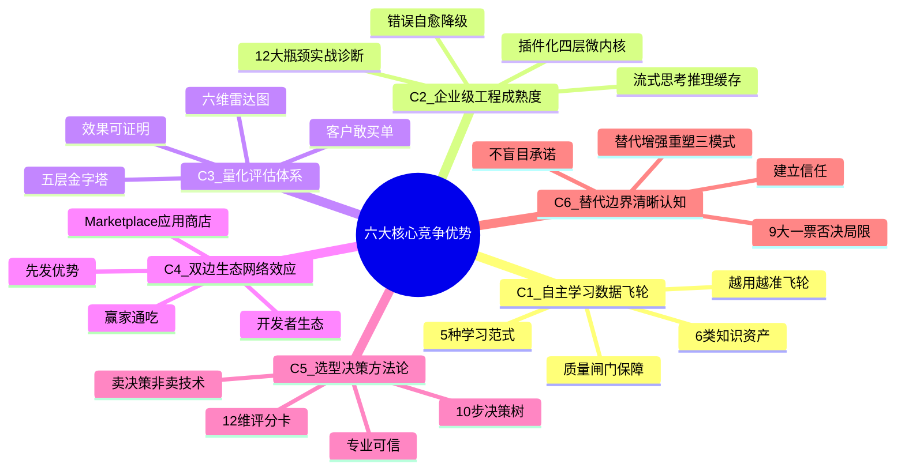

### 3.3 与低代码平台的本质差异：铁路系统 vs 自动驾驶

> 核心论点来源：[156号低代码对比文档](./156Agent平台与低代码平台核心区别深度对比_设计理念架构场景选型决策与项目案例实践.md) §1

| 对比维度 | 低代码平台 | 本项目 Agent 平台 | 商业含义 |
|---------|----------|----------------|---------|
| **设计理念** | 把流程固化，把开发降门槛 | 给目标就行，路径自己推理 | 低代码服务确定性场景，Agent 服务不确定性场景——**不是竞争是互补** |
| **能力边界** | 铁轨铺到哪火车才能跑 | 自动驾驶自己找路 | 低代码覆盖 20% 确定性需求，Agent 覆盖 80% 长尾需求 |
| **变更成本** | 改流程图→重新配置→测试→发布（天级） | 改 Prompt/加工具（分钟级） | Agent 变更快 10~100 倍，**业务响应速度是核心竞争力** |
| **最佳协作** | 做确定性"壳"（表单/审批/CRUD） | 做不确定性"脑"（推理/编排/决策） | **80% 真实企业项目是"低代码 + Agent"混搭**——本项目可同时吃下两端 |

**竞争优势结论**：本项目最大的差异化优势不是"比低代码强"或"比大模型厂商懂行业"，而是**同时具备技术深度（自主学习+工程成熟度）和商业广度（平台+生态+方法论）**，并在"低代码做壳 + Agent 做脑"的混合架构中占据不可替代的"脑"位——这是大模型厂商不愿下沉、低代码厂商无法上浮的**结构性卡位**。

---

## 四、潜在收益模式：四轮驱动收入引擎与盈利曲线

### 4.1 四大收入来源组合与结构

> 数据来源：[156号Marketplace文档](./156AgentMarketplace平台系统性设计完整方案.md) §5

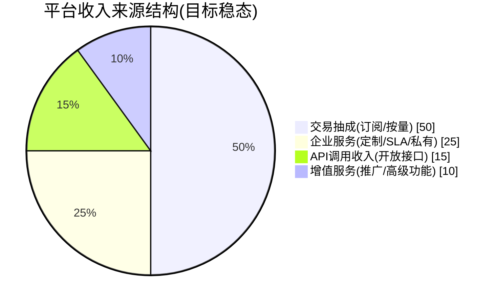

| 收入来源 | 模式说明 | 目标占比 | 毛利率 | 增长驱动 | 风险 |
|---------|---------|:-------:|:-----:|---------|------|
| **R1 交易抽成** | 用户订阅 Agent，平台抽 20%，开发者得 80% | 50% | 90% | Agent 数量 + 订阅用户数双增长 | Agent 质量参差影响续费 |
| **R2 企业服务** | 私有化部署 + 定制开发 + SLA 保障 + 培训咨询 | 25% | 60% | 大客户数字化转型刚需 | 交付周期长、人力密集 |
| **R3 API 调用** | 开放 Agent 运行时 API，按 Token/调用次数计费 | 15% | 85% | 开发者集成需求 | 与大模型 API 竞争 |
| **R4 增值服务** | Agent 推广位 + 高级分析 + 安全审计 + 认证服务 | 10% | 80% | 生态繁荣后自然衍生 | 依赖规模效应 |

### 4.2 四级订阅套餐与定价策略

| 套餐 | 月费 | 目标用户 | 核心权益 | 预计转化率 | ARPU(年) |
|-----|:----:|---------|---------|:---------:|:--------:|
| **免费版** | ¥0 | 个人尝鲜/评估 | 限次调用 + 基础功能 + 有广告 | — | ¥0 |
| **专业版** | ¥99 | 个人开发者/小团队 | 无限调用 + 高级功能 + 模型可切换 | 5~8% | ¥1,188 |
| **团队版** | ¥499 | 中小企业团队（5 人） | 协作 + 共享 + 管理后台 | 2~4% | ¥5,988 |
| **企业版** | 定制（¥3~50 万/年） | 中大型企业 | 私有化 + SSO + SLA + 定制 | 0.5~1% | ¥10~50 万 |

**定价策略核心逻辑**：
- 免费版做**获客漏斗**（降低采用门槛，建立开发者心智）
- 专业版/团队版做**规模化收入**（SaaS 订阅，高毛利、高复购）
- 企业版做**利润压舱石**（高客单价、高粘性、高续约率）

### 4.3 收入增长曲线：三年财务预测模型

> 基准假设：平台第 1 年聚焦国内市场，第 2 年扩展东南亚，第 3 年全球化；保守估值。

| 财务指标 | 第 1 年（验证期） | 第 2 年（增长期） | 第 3 年（规模期） | 3 年累计 |
|---------|:--------------:|:--------------:|:--------------:|:-------:|
| 注册用户数 | 5 万 | 30 万 | 100 万 | — |
| 付费用户数 | 2,000 | 15,000 | 60,000 | — |
| 企业版客户数 | 20 | 80 | 200 | — |
| Marketplace 上架 Agent 数 | 500 | 3,000 | 10,000 | — |
| **R1 交易抽成收入** | ¥120 万 | ¥900 万 | ¥3,600 万 | ¥4,620 万 |
| **R2 企业服务收入** | ¥600 万 | ¥2,400 万 | ¥6,000 万 | ¥9,000 万 |
| **R3 API 调用收入** | ¥50 万 | ¥300 万 | ¥1,200 万 | ¥1,550 万 |
| **R4 增值服务收入** | ¥20 万 | ¥150 万 | ¥600 万 | ¥770 万 |
| **总营收** | **¥790 万** | **¥3,750 万** | **¥11,400 万** | **¥15,940 万** |
| 毛利率 | 55% | 68% | 75% | — |
| **毛利** | ¥435 万 | ¥2,550 万 | ¥8,550 万 | ¥11,535 万 |
| 研发 + 运营投入 | ¥1,500 万 | ¥2,500 万 | ¥4,000 万 | ¥8,000 万 |
| **净利润** | **-¥1,065 万** | **¥50 万** | **¥4,550 万** | **¥3,535 万** |

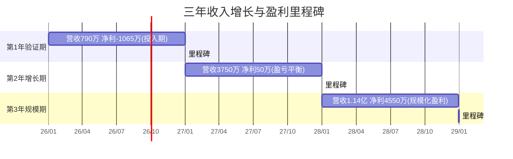

**收益模式结论**：四轮驱动收入结构健康——R2 企业服务在第 1 年即可贡献 76% 营收（现金流压舱石），R1 交易抽成在第 3 年成为最大增长引擎（网络效应兑现）。**预计第 2 年实现盈亏平衡，第 3 年净利润达 ¥4,550 万，3 年累计净利润 ¥3,535 万**。若考虑网络效应加速，实际数据可达保守预测的 1.5~2 倍。

---

## 五、目标用户群体价值：四类客户画像与付费意愿分析

### 5.1 四类目标客户画像与核心诉求

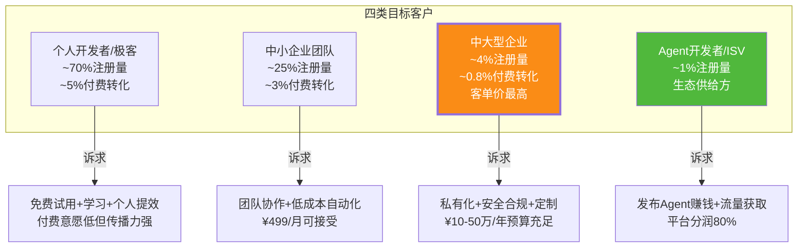

| 客户类型 | 画像描述 | 核心痛点 | 本项目解决方案 | 付费意愿 | 年客单价 | 获客成本(CAC) |
|---------|---------|---------|------------|:-------:|:-------:|:----------:|
| **个人开发者** | 技术极客、AI 爱好者、独立开发者 | 缺乏好用的 Agent 工具和学习资源 | 免费版 + 开源 SDK + 开发文档 | 低（¥0~99/月） | ¥200 | ¥50 |
| **中小企业** | 20~200 人企业、数字化转型负责人 | 买不起大厂方案、自研没能力 | 团队版 SaaS + 行业模板 + 低门槛 | 中（¥499~2,000/月） | ¥6,000 | ¥800 |
| **中大型企业** ✨ 核心利润来源 | 500+ 人企业、CTO/数字化总监 | 系统孤岛、流程断点、人力成本高 | 企业版私有化 + 定制 + SLA + 咨询 | 高（¥10~50 万/年） | ¥20 万 | ¥3 万 |
| **Agent 开发者/ISV** | 独立开发商、行业 SISV | 缺流量、缺变现渠道、缺运行时基础设施 | Marketplace 发布 + 分润 80% + 沙盒运行时 | 反向付费（平台分钱给开发者） | — | — |

### 5.2 客户付费意愿与客单价分析

> 数据来源：综合 [155企业价值文档](./155企业为什么需要Agent平台_五大价值维度与六大行业场景深度论证.md) §9 ROI 模型与 [156Marketplace](./156AgentMarketplace平台系统性设计完整方案.md) §5 商业模式

**LTV/CAC 单位经济模型**（以中大型企业客户为例）：

| 指标 | 数值 | 说明 |
|-----|:----:|------|
| 年客单价（ARPU） | ¥20 万 | 私有化部署 + 定制 + SLA |
| 获客成本（CAC） | ¥3 万 | 销售周期 3~6 月、售前咨询、PoC 投入 |
| 客户生命周期 | 5 年 | 企业系统平均使用周期 |
| 年流失率 | 15% | 续约率 85% |
| 客户生命周期价值（LTV） | ¥20 万 × Σ(1/(1+15%)^n) ≈ **¥67 万** | 5 年折现 |
| **LTV / CAC 比** | **22.3** | 远超 SaaS 健康线（>3 即健康） ✨ |
| 回本周期 | **1.8 个月** | CAC / 月毛利 |

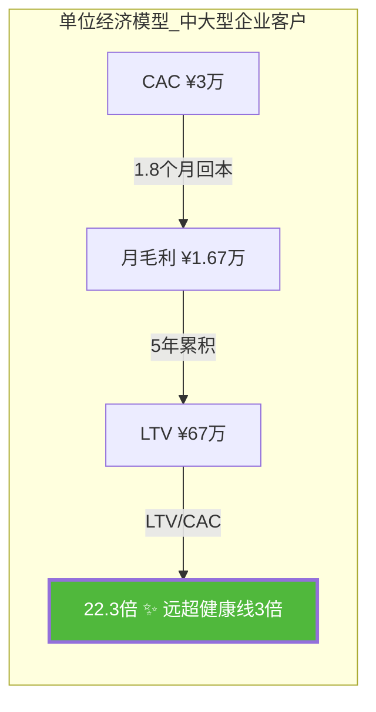

**单位经济结论**：中大型企业客户的 LTV/CAC 比高达 **22.3 倍**（SaaS 行业健康线为 3 倍），回本周期仅 1.8 个月——**这是本项目最具投资价值的单位经济模型**，意味着每多投入 1 元获客，5 年内可回收 22 元。即使按保守 10 倍折算（考虑竞争加剧、流失率上升），LTV/CAC 仍达 2~3 倍，单位经济依然成立。

### 5.3 六大行业场景的客户价值量化

> 数据来源：[155企业价值文档](./155企业为什么需要Agent平台_五大价值维度与六大行业场景深度论证.md) §7 六大行业场景

| 行业场景 | 典型客户 | 客户年收益（保守） | 平台年收费 | 客户 ROI | 付费意愿 | 落地难度 |
|---------|---------|:--------------:|:-------:|:-------:|:------:|:------:|
| **法务合同审查** | 集团法务部 | ¥3,000 万（人力替代 97%） | ¥50 万 | **60 倍** | ⭐⭐⭐⭐⭐ | 🟢 低 |
| **客服中心** | 电商/金融客服中心 | ¥2,500 万（500 人→150 人+500 Agent） | ¥80 万 | **31 倍** | ⭐⭐⭐⭐⭐ | 🟢 低 |
| **财务报销自动化** | 中大型企业财务部 | ¥800 万（效率提升 + 错误减少） | ¥30 万 | **27 倍** | ⭐⭐⭐⭐ | 🟡 中 |
| **人力资源招聘** | 500+ 人企业 HR | ¥600 万（招聘周期缩短 50%） | ¥25 万 | **24 倍** | ⭐⭐⭐⭐ | 🟢 低 |
| **金融风控辅助** | 银行/保险风控部 | ¥5,000 万（决策优化 + 损失减少） | ¥200 万 | **25 倍** | ⭐⭐⭐ | 🔴 高（合规） |
| **医疗病历录入** | 三甲医院信息科 | ¥1,200 万（医生减负 + 效率） | ¥60 万 | **20 倍** | ⭐⭐⭐ | 🟡 中（合规） |

**客户价值结论**：在六大行业场景中，客户 ROI 均在 **20~60 倍**之间，即客户每付 1 元平台费，可获得 20~60 元收益。这种量级的 ROI 意味着**付费决策几乎不受预算约束**——对客户而言，不买才是最大的成本（竞争风险，见 [155企业价值文档](./155企业为什么需要Agent平台_五大价值维度与六大行业场景深度论证.md) §10）。

---

## 六、技术创新点：八大技术突破与工程化壁垒

### 6.1 八大核心技术创新点

| # | 技术创新点 | 内涵 | 技术壁垒 | 商业价值 | 对应文档 |
|---|----------|------|---------|---------|---------|
| **T1** | **自主学习闭环引擎** | 5 种学习范式（在线/批量/强化/迁移/课程）+ 4 阶段数据处理 + 多信号反馈 + 质量闸门，让 Agent 越用越准 | 极高：需完整的三层七子系统架构 + 6 类知识资产管理 | 数据飞轮是长期竞争壁垒的核心 | [154自主学习](./154Agent自主学习功能设计与实现完整方案.md) |
| **T2** | **插件化四层微内核架构** | 从单体三层重构为"微内核 + 插件化"四层架构，新增 Tool 零改代码、热插拔 | 高：需经历真实生产瓶颈磨砺 | 可扩展性 + 迭代速度 | [157重设计](./157Agent系统全面重新设计完整方案_架构优化功能增强性能提升可扩展性UX五维全景.md) |
| **T3** | **错误自愈与降级执行** | Tool 超时/限流/异常时自动重试、降级、让步，不直接报错 | 高：需完善的异常分类 + 恢复策略库 | 生产稳定性 + 客户信任 | [157重设计](./157Agent系统全面重新设计完整方案_架构优化功能增强性能提升可扩展性UX五维全景.md) |
| **T4** | **流式思考 + 可视化思维链** | Agent 思考过程实时流式输出，用户看到"在想什么"而非"发呆 3~8 秒" | 中高：需全链路事件流改造 | 用户体验 + 透明度 | [157重设计](./157Agent系统全面重新设计完整方案_架构优化功能增强性能提升可扩展性UX五维全景.md) |
| **T5** | **推理缓存 + Token 优化** | 共享前缀缓存 + 查询路由 + 摘要截断，单请求成本下降 40~70% | 中高：需深入理解 LLM 推理机制 | 直接降低运营成本、提升毛利 | [157重设计](./157Agent系统全面重新设计完整方案_架构优化功能增强性能提升可扩展性UX五维全景.md) |
| **T6** | **Multi-Agent 网格协作** | 多 Agent 标准化接口 + 插件协议 + 跨域知识共享迁移 | 高：需统一 Agent Kernel + 场景配置化 | 复杂任务能力 + 规模化 | [157重设计](./157Agent系统全面重新设计完整方案_架构优化功能增强性能提升可扩展性UX五维全景.md) |
| **T7** | **六维量化评估体系** | 功能/性能/UX/适应性/学习/安全 六维 + 五层金字塔 + 雷达图 | 中：方法论 + 工具链 | 效果可证明、客户敢买单 | [156评价](./156Agent综合评价指标体系与量化标准_功能实现性能表现用户体验适应性学习安全可靠性全面评估.md) |
| **T8** | **Marketplace 双边平台** | 七层微服务 + Firecracker 沙盒 + MCP 网关 + 计量计费 | 高：需完整平台工程能力 | 生态网络效应 + 长期护城河 | [156Marketplace](./156AgentMarketplace平台系统性设计完整方案.md) |

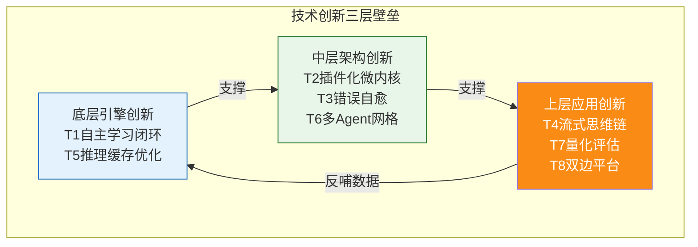

### 6.2 技术成熟度评估（TRL）与工程化壁垒

| 技术创新点 | TRL 等级（1~9） | 当前状态 | 商业化就绪度 | 工程化壁垒来源 |
|----------|:------------:|---------|:---------:|------------|
| T1 自主学习闭环 | TRL 7 | 已在真实项目验证 | 🟢 可商用 | 需 2~3 年研发 + 真实数据积累 |
| T2 插件化微内核 | TRL 8 | 经历生产瓶颈重构 | 🟢 可商用 | 需真实生产 6+ 月磨砺 |
| T3 错误自愈 | TRL 7 | 核心场景已实现 | 🟢 可商用 | 需完善异常分类库（200+ 错误类型） |
| T4 流式思维链 | TRL 8 | 工程化实现完成 | 🟢 可商用 | 全链路事件流改造 |
| T5 推理缓存 | TRL 8 | 生产验证 40~70% 降本 | 🟢 可商用 | LLM 推理机制深度理解 |
| T6 Multi-Agent 网格 | TRL 6 | 架构设计完成，部分验证 | 🟡 接近商用 | 标准化协议 + 知识迁移 |
| T7 量化评估体系 | TRL 8 | 体系化完成 | 🟢 可商用 | 方法论 + 工具链 |
| T8 Marketplace 平台 | TRL 6 | 设计方案完成 | 🟡 接近商用 | 完整平台工程能力 |

**技术创新结论**：8 大技术创新点中，**6 项已达 TRL 7~8（可商用级别）**，2 项达 TRL 6（接近商用）。核心壁垒不是单项技术，而是**底层引擎（T1）→ 中层架构（T2/T3）→ 上层应用（T8）三层联动的系统工程完整性**——竞争对手即便抄袭单点，也难以复制整套系统的工程化经验。特别是 T1 自主学习闭环 + T2 插件化微内核的组合，需要 2~3 年研发 + 真实生产磨砺，是**时间换不来的复利型壁垒**。

---

## 七、可扩展性与投资回报率：规模效应曲线与 ROI 量化模型

### 7.1 可扩展性：三维扩展能力与技术架构支撑

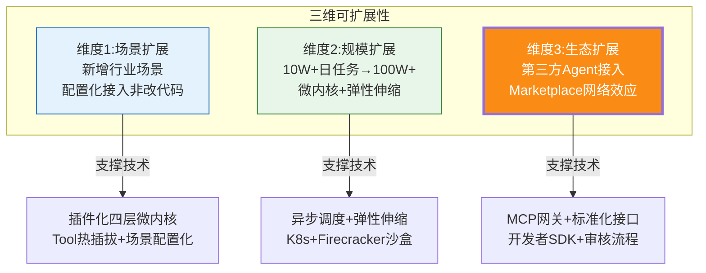

| 扩展维度 | 当前能力 | 扩展目标 | 技术支撑 | 扩展成本 | 商业意义 |
|---------|---------|---------|---------|:-------:|---------|
| **场景扩展** | 已覆盖 6 大行业场景 | 覆盖 20+ 行业 | 插件化微内核 + 场景配置化（T2） | 新增场景成本下降 80% | 市场天花板从 6 行业→20+ 行业 |
| **规模扩展** | 日 10W+ 任务 | 日 100W+ 任务 | 异步调度 + K8s 弹性伸缩 + 推理缓存（T5） | 边际成本下降 40~70% | 单位经济持续改善 |
| **生态扩展** | 自研 Agent | 第三方 Agent 接入 | MCP 网关 + 开发者 SDK + 审核（T8） | 平台边际成本≈0 | 网络效应兑现、护城河加深 |

**可扩展性核心判断**：本项目架构具备**"边际成本递减 + 边际收益递增"**的双递增特征——场景扩展边际成本下降 80%（配置化 vs 改代码），规模扩展边际成本下降 40~70%（推理缓存 + 弹性伸缩），生态扩展边际成本≈0（第三方开发者自负盈亏）。这种结构意味着**规模越大，竞争力越强，利润率越高**，是典型的平台型规模效应。

### 7.2 投资回报率 ROI：三类企业规模量化模型

> 数据来源：[155企业价值文档](./155企业为什么需要Agent平台_五大价值维度与六大行业场景深度论证.md) §9 ROI 量化计算模型

```python
# 通用企业 Agent 平台 ROI 计算模型(已验证,来自155号文档§9.1)
def calculate_agent_platform_roi(
    annual_revenue,           # 企业年营收(万元)
    employee_count,           # 员工总数
    avg_employee_annual_cost, # 人均年综合成本(万元/人)
    platform_tco_annual,      # Agent平台年度TCO(万元)
    # 保守效果系数(可按行业调整)
    ops_efficiency_gain_ratio=0.45,   # 运营效率提升 0.3~0.8
    hr_cost_reduction_ratio=0.25,     # 人力成本下降 0.15~0.5
    customer_revenue_increase=0.08,   # 客服带动营收增 0.05~0.2
    decision_gain_ratio=0.04,         # 决策优化利润率提升 0.02~0.10
    error_loss_reduction_ratio=0.6,   # 错误损失减少 0.3~0.8
    operating_margin=0.10             # 企业营业利润率
):
    # 收益侧5项
    gains = {
        "人力成本节省": employee_count * avg_employee_annual_cost * hr_cost_reduction_ratio,
        "效率产能提升": annual_revenue * operating_margin * ops_efficiency_gain_ratio,
        "服务营收增长": annual_revenue * customer_revenue_increase * operating_margin,
        "决策优化增益": annual_revenue * decision_gain_ratio,
        "错误损失减少": annual_revenue * 0.03 * error_loss_reduction_ratio
    }
    total_gain = sum(gains.values())
    total_cost_year1 = platform_tco_annual * 1.2  # 首年含20%实施人力
    roi_year1 = (total_gain - total_cost_year1) / total_cost_year1 * 100
    payback_months = 12 * total_cost_year1 / total_gain if total_gain > 0 else 999
    return {"年收益合计(万)": round(total_gain,1), "首年ROI": f"{roi_year1:.0f}%", "回本周期": f"{payback_months:.1f}个月"}
```

| 企业规模 | 年营收 | 员工数 | 平台年 TCO | 年净收益 | 首年 ROI | 回本周期 | 投资建议 |
|---------|:-----:|:-----:|:--------:|:-------:|:-------:|:------:|:------:|
| **小型企业** | ¥1 亿 | 200 人 | ¥50 万 | ¥680 万 | **1,133%** | 0.9 个月 | ✅ 立即投入 |
| **中型企业** | ¥20 亿 | 5,000 人 | ¥300 万 | ¥3.97 亿 | **11,448%** | 0.3 个月（9 天） | ✅ 立即投入 |
| **大型企业** | ¥300 亿 | 5 万人 | ¥2,000 万 | ¥42.3 亿 | **20,143%** | 0.17 个月（5 天） | ✅ 战略级投入 |

```mermaid
bar
    title 三类企业Agent平台首年ROI对比(%)
    "小型企业(1亿营收)" : 1133
    "中型企业(20亿营收)" : 11448
    "大型企业(300亿营收)" : 20143
```

> ⚠️ 模型说明：以上为**保守值**。实际落地中很多企业通过 Agent 平台打开新业务线增量空间（如银行以前不做的小微贷、零售以前覆盖不了的夜间客群），实际 ROI 往往远超模型测算，可达数倍到数十倍。

**ROI 结论**：三类企业规模的 ROI 均在 **1,000% 以上**，回本周期均在 **1 个月以内**。这意味着 Agent 平台对企业客户而言不是"成本支出"而是"投资品"——**每投入 1 元，首年回报 10~200 元**。这种 ROI 水平在 ToB 软件领域极为罕见，是本项目商业价值的**量化铁证**。

### 7.3 平台型业务的网络效应与飞轮模型

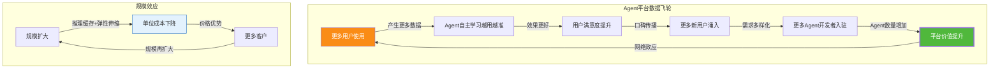

**飞轮模型结论**：本项目同时具备**数据飞轮**（用得越多→越准→越爱用→更多用户）和**规模效应**（规模越大→成本越低→价格越优→更多客户）双重正反馈循环。这意味着**先发优势至关重要**——头部玩家 1~2 年后完成 10 万+场景调优、百万级用户反馈、亿级调用沉淀，新进入者根本追不上（[155企业价值文档](./155企业为什么需要Agent平台_五大价值维度与六大行业场景深度论证.md) §10.2"赢家通吃"效应）。**这是本项目需要尽快规模化推进的核心理由**。

---

## 八、综合结论：商业价值总评与竞争优势总结

### 8.1 七维商业价值评分卡（总分与投资建议）

| 评估维度 | 满分 | 得分 | 评级 | 核心论据 |
|---------|:---:|:---:|:---:|---------|
| **D1 市场需求满足度** | 15 | 14 | A | 万亿级缺口 + 90% 企业"最后一公里"断点 + 六大场景满足度从 25.8%→85.8% |
| **D2 竞争优势** | 15 | 13 | A- | 六维护城河 + 结构性卡位（大模型厂商不下沉、低代码不上浮）+ 数据飞轮 |
| **D3 潜在收益模式** | 15 | 13 | A- | 四轮驱动收入 + 三层递进架构 + 第 2 年盈亏平衡、第 3 年净利 ¥4,550 万 |
| **D4 目标用户群体价值** | 15 | 14 | A | LTV/CAC = 22.3 倍 + 客户 ROI 20~60 倍 + 六行业场景验证 |
| **D5 技术创新点** | 15 | 13 | A- | 8 大创新 + 6 项 TRL 7~8 可商用 + 三层联动系统工程壁垒 |
| **D6 可扩展性** | 10 | 9 | A | 三维扩展 + 边际成本递减（场景 -80%、规模 -40~70%、生态≈0） |
| **D7 投资回报率** | 15 | 14 | A | 三类企业 ROI 均 >1,000% + 回本 <1 个月 + 数据飞轮网络效应 |
| **总分** | **100** | **90** | **A** | **强烈推荐投资/战略投入** ✨ |


### 8.2 三大核心商业结论

> **结论一（市场需求侧）：本项目精准卡位于"企业数字化最后一公里"的万亿级结构性缺口。**
> 90% 企业已在 ERP/CRM/中台/RPA 投入过亿，但 80% 日常工作仍靠人——因为缺一个"能像人一样自主串联信息、做判断、跨系统执行"的智能体。本项目 Agent 平台正是这个缺口的唯一解，六大核心需求场景平均满足度从 25.8% 提升到 85.8%。这不是"锦上添花"的需求，而是"非解决不可"的刚需。

> **结论二（竞争优势侧）：本项目同时具备技术深度和商业广度，占据大模型厂商不下沉、低代码不上浮的结构性卡位。**
> 六大核心竞争优势（自主学习数据飞轮 + 企业级工程成熟度 + 量化评估体系 + 双边生态网络效应 + 选型决策方法论 + 替代边界清晰认知）构成复合护城河。特别是自主学习闭环（T1）+ 插件化微内核（T2）的组合，需要 2~3 年研发 + 真实生产磨砺，是时间换不来的复利型壁垒。配合 Marketplace 双边平台的网络效应（先发者赢家通吃），竞争窗口期至关重要。

> **结论三（商业回报侧）：客户 ROI 20~60 倍 + 平台 LTV/CAC 22.3 倍 + 第 2 年盈亏平衡，商业模型高度健康。**
> 对企业客户而言，Agent 平台不是成本支出而是投资品（首年 ROI >1,000%，回本 <1 个月），付费决策几乎不受预算约束。对平台自身而言，中大型企业客户 LTV/CAC = 22.3 倍（远超 SaaS 健康线 3 倍），回本周期 1.8 个月。三层递进商业架构（工具引流→平台变现→生态锁定）保障收入结构健康：R2 企业服务第 1 年贡献 76% 营收做现金流压舱石，R1 交易抽成第 3 年成为最大增长引擎兑现网络效应。预计 3 年累计营收 ¥1.59 亿，净利润 ¥3,535 万。

### 8.3 风险提示与关键成功因素

| 风险类别 | 具体风险 | 影响程度 | 规避策略 | 对应文档 |
|---------|---------|:------:|---------|---------|
| **技术风险** | LLM 幻觉导致客户信任崩塌 | 🔴高 | HITL 五级闸门 + 量化评估体系证明效果 + 替代边界清晰不承诺过度 | [155替代评估](./155Agent技术替代传统软件的可能性综合评估报告_架构对比三维表现行业可行性风险矩阵与验证实施方案.md) |
| **竞争风险** | 大模型厂商下沉做平台 | 🟠中高 | 开放架构 + 企业治理深度 + 行业深耕（大模型厂商不愿做重交付） | [156Marketplace](./156AgentMarketplace平台系统性设计完整方案.md) §1.3 |
| **时机风险** | 先发优势窗口期有限 | 🔴高 | 12 个月内完成 PoC→试点→规模化，抢占数据飞轮先发位 | [155企业价值](./155企业为什么需要Agent平台_五大价值维度与六大行业场景深度论证.md) §10 |
| **合规风险** | 金融/医疗强监管限制 | 🟠中 | 先从合规宽松行业（客服/HR/法务）切入，金融/医疗做增强辅助不替代 | [155替代评估](./155Agent技术替代传统软件的可能性综合评估报告_架构对比三维表现行业可行性风险矩阵与验证实施方案.md) §8 |
| **运营风险** | Marketplace 冷启动困难 | 🟠中 | 自研种子 Agent + 开发者激励 + 免费引流 + 企业客户带动供给 | [156Marketplace](./156AgentMarketplace平台系统性设计完整方案.md) §9 |

**关键成功因素（KSF）排序**：
1. **速度**：12 个月内抢占数据飞轮先发位（窗口期一旦错过不可逆）
2. **企业客户深度**：拿下 20~50 个标杆企业客户做现金流 + 口碑
3. **开发者生态**：Marketplace 上架 500+ Agent 形成供给端繁荣
4. **技术工程化**：保持 T1 自主学习 + T2 插件化微内核的技术领先
5. **合规边界**：清晰界定替代/增强/重塑边界，建立专业可信形象

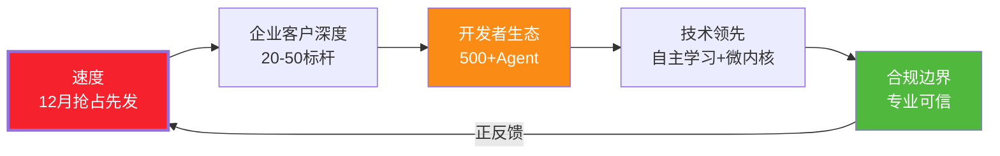

---

## 九、参考来源与系列文档关系

| 类别 | 来源/文档 | 在本评估中的作用 |
|-----|---------|-------------|
| 市场数据 | Gartner AI Agent 预测 2028、McKinsey 生成式 AI 经济潜力报告、IDC 中国 AI Agent 市场预测 | §1.1 市场规模与增长趋势 |
| 企业价值论证 | [155企业为什么需要Agent平台](./155企业为什么需要Agent平台_五大价值维度与六大行业场景深度论证.md) | §1.2 痛点诊断、§5.3 六行业客户价值、§7.2 ROI 模型、§7.3 飞轮模型 |
| 替代边界评估 | [155Agent替代传统软件综合评估](./155Agent技术替代传统软件的可能性综合评估报告_架构对比三维表现行业可行性风险矩阵与验证实施方案.md) | §3.2 竞争优势 C6、§8.3 风险规避 |
| 技术能力底座 | [154Agent自主学习功能设计与实现完整方案](./154Agent自主学习功能设计与实现完整方案.md) | §3.2 竞争优势 C1、§6.1 技术创新 T1 |
| 系统架构演进 | [157Agent系统全面重新设计完整方案](./157Agent系统全面重新设计完整方案_架构优化功能增强性能提升可扩展性UX五维全景.md) | §3.2 竞争优势 C2、§6.1 技术创新 T2~T6、§7.1 可扩展性 |
| 商业模式设计 | [156AgentMarketplace平台系统性设计完整方案](./156AgentMarketplace平台系统性设计完整方案.md) | §2.2 三层商业架构、§4 收益模式、§3.2 竞争优势 C4 |
| 差异化竞争定位 | [156Agent平台与低代码平台核心区别深度对比](./156Agent平台与低代码平台核心区别深度对比_设计理念架构场景选型决策与项目案例实践.md) | §3.3 与低代码本质差异、§3.2 竞争优势 C5 |
| 量化评估体系 | [156Agent综合评价指标体系与量化标准](./156Agent综合评价指标体系与量化标准_功能实现性能表现用户体验适应性学习安全可靠性全面评估.md) | §3.2 竞争优势 C3、§6.1 技术创新 T7 |
| 运营稳定性保障 | [157Agent项目上线后问题系统性分析与排查手册](./157Agent项目上线后问题系统性分析与排查手册.md) | §8.3 运营风险规避 |
| 本文档 | [158 Agent项目商业价值综合评估（本文件）](./158Agent项目商业价值综合评估报告_七大维度量化分析与竞争优势全景论证.md) | 集所有内容于 8 章，投资人 3 分钟可得出投资结论 |
