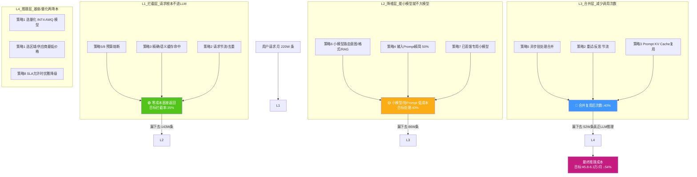
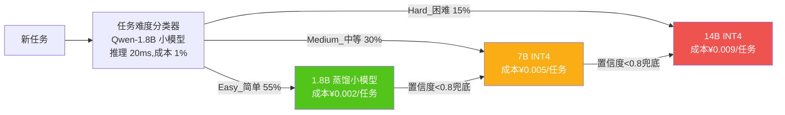
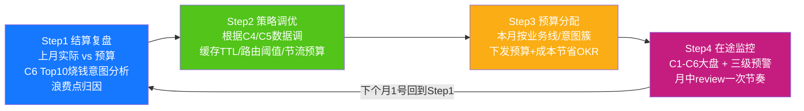

# Agent 项目模型调用成本控制完整方案:诊断 · 8 大优化策略 · 成本网关实现 · 预算监控预警闭环

> **文档定位**:本文档是 `13项目经验` 系列的**成本治理专题篇**。针对 154 自主学习架构 + 157 五维重设计架构落地 6 个月后,团队常遇到的"**功能没问题,月底云账单翻了 3 倍,老板要求降本 50% 但不能影响效果**"的现实问题,提供一套**可量化、可实施、可验证**的模型调用成本控制完整方案。
>
> **核心交付物**:
> - 7 大成本黑洞诊断法 + 成本分解瀑布图
> - 8 大优化策略(模型选择/调用频率/三级缓存/输入精简/批处理/智能路由/知识蒸馏/优雅降级),每项带量化收益
> - **`ModelCostGateway` 完整代码实现**(≈500 行):含计费、预算、熔断、缓存、路由器、批量合并、输入裁剪、降级
> - 三级成本预警机制(黄/橙/红) + 月度预算闭环 4 步流程
> - 6 期实施路线图(12 周达成总成本↓≥50%,质量不劣化)
>
> **前置阅读**:
> - 架构基础:[154Agent自主学习功能设计与实现完整方案.md](./154Agent自主学习功能设计与实现完整方案.md)
> - 重设计配套:[157Agent系统全面重新设计完整方案_架构优化功能增强性能提升可扩展性UX五维全景.md](./157Agent系统全面重新设计完整方案_架构优化功能增强性能提升可扩展性UX五维全景.md)
> - 模型选型成本维度:[../11模型部署与工程化/147开源大模型系统性选型评估框架与决策指南.md](../11模型部署与工程化/147开源大模型系统性选型评估框架与决策指南.md)
> - 配套监控大盘:[../10Agent性能优化/121Agent运行状态全面监控方案深度解析与实现.md](../10Agent性能优化/121Agent运行状态全面监控方案深度解析与实现.md)

---

## 目录

- [一、当前项目模型调用成本诊断(现状·分解·7大黑洞)](#一当前项目模型调用成本诊断现状分解7大黑洞)
- [二、成本控制总体框架:4 层漏斗 + 量化目标](#二成本控制总体框架4-层漏斗--量化目标)
- [三、策略 1:模型选择优化(基座/尺寸/量化/供应商 4 维匹配)](#三策略-1模型选择优化基座尺寸量化供应商-4-维匹配)
- [四、策略 2:调用频率控制(请求/重试/反思环 3 类节流)](#四策略-2调用频率控制请求重试反思环-3-类节流)
- [五、策略 3:三级缓存机制(精确/语义/Prompt KV 复用)](#五策略-3三级缓存机制精确语义prompt-kv-复用)
- [六、策略 4:输入数据精简 5 招(Prompt/RAG/历史/少样本/压缩)](#六策略-4输入数据精简-5-招promptrag历史少样本压缩)
- [七、策略 5:批处理与异步合并优化(离线/近线/在线)](#七策略-5批处理与异步合并优化离线近线在线)
- [八、策略 6:智能分层路由(小模型先→大模型补)](#八策略-6智能分层路由小模型先大模型补)
- [九、策略 7:知识蒸馏(Large→Small 离线蒸馏)](#九策略-7知识蒸馏largesmall-离线蒸馏)
- [十、策略 8:优雅降级与预算熔断(保 SLA 不超支)](#十策略-8优雅降级与预算熔断保-sla-不超支)
- [十一、`ModelCostGateway` 完整实现(8 策略统一入口)](#十一modelcostgateway-完整实现8-策略统一入口)
- [十二、成本监控大盘与三级预警机制](#十二成本监控大盘与三级预警机制)
- [十三、月度预算闭环 4 步法 + 6 期 12 周实施路线图](#十三月度预算闭环-4-步法--6-期-12-周实施路线图)
- [十四、效果验证:AB 对照 + 质量不劣化保障](#十四效果验证ab-对照--质量不劣化保障)
- [十五、常见误区与避坑清单](#十五常见误区与避坑清单)

---

## 一、当前项目模型调用成本诊断(现状·分解·7大黑洞)

### 1.1 项目调用场景与成本结构瀑布

假设 13项目经验上线 6 个月后的典型月度账单(**月调用成本 ¥12.6 万**,业务规模:日 10W 任务/月 220W 任务)

```mermaid
flowchart LR
    TOTAL[月度总调用成本<br/>¥126,000] -->|38% ¥47,880| S1[主LLM 基座推理<br/>Qwen2.5-14B FP16]
    TOTAL -->|22% ¥27,720| S2[Embedding 向量化<br/>bge-m3 × RAG 20条/任务]
    TOTAL -->|15% ¥18,900| S3[重调用成本<br/>重试+反思修正+Tool失败回滚]
    TOTAL -->|10% ¥12,600| S4[RAG 检索后冗余Prompt<br/>20条只引用3条]
    TOTAL -->|8%  ¥10,080| S5[重复/相似任务<br/>同公司员工反复问相同问题]
    TOTAL -->|5%  ¥6,300|  S6[Reviewer Agent 人审前预检<br/>双次调用额外成本]
    TOTAL -->|2%  ¥2,520|  S7[其他杂项<br/>Tool Router / 意图识别等小模型调用]
    
    style S1 fill:#ef5350,color:#fff
    style S2 fill:#ffa726,color:#fff
    style S3 fill:#ff7043,color:#fff
    style S4 fill:#ab47bc,color:#fff
    style S5 fill:#66bb6a,color:#fff
```

**分解后立即发现的 3 个事实**:
1. **基座模型推理(S1) + Embedding(S2) 占了 60%**,是第一目标。
2. **重试/反思/冗余Prompt 这 3 项"浪费项"就占 33%**,不影响业务功能,纯成本可砍。
3. 重复任务(S5)看起来只占 8%,但通过优化可砍 70%,对应 **月省 ¥7,056**。

### 1.2 单位任务成本拆解(6 个月劣化趋势)

| 指标 | 上线第 1 月 | 上线第 6 月(未优化前) | 劣化原因 |
|-----|:----------:|:--------------------:|:--------|
| 单任务平均 Input Token | 1,280 | **3,460** (+170%) | Prompt越学越长 + RAG注入条不裁剪 + Skill-RAG堆Top5 |
| 单任务平均 Output Token | 420 | 640 (+52%) | 输出越写越长+反思修正补充 |
| 单任务平均 LLM 调用次数 | 1.8 | **4.2** (+133%) | Self-Reflect 多轮 + Tool 重试 + Reviewer 预检 |
| 单任务 Embedding Token | 6,400 | 12,800 (+100%) | RAG 检索 20 条 × 每任务平均 2 次查询(重写) |
| **单任务平均成本**(按147号选的 14B FP16) | **¥0.031** | **¥0.057** (+84%) | 以上全部叠加 |
| 月任务总数 | 98 万 | 220 万 (+124%) | 业务增长 |
| **月总调用成本** | ¥30,380 | **¥125,400** (+312%) | 单任务 + 总任务量叠加暴涨 |

### 1.3 7 大成本黑洞定位(对应 154/157 架构中可优化点)

| # | 成本黑洞(可避免浪费) | 占总浪费比例 | 对应 154/157 架构根因 |
|:-:|:-------------------|:----------:|:------------------|
| **B1** | **Prompt 越学越长,注入没裁剪** | 28% | 154 §7.3 Prompt 注入器 Top 全注入,没做动态选择/压缩 |
| **B2** | **重复/相似 Query 反复调大模型** | 22% | 157 §4.3 三级语义缓存尚未启用;无精确 KV 缓存 |
| **B3** | **简单任务也用最大模型(14B)** | 15% | 157 §6 智能路由器(PF5)仅在规划中,未启用 |
| **B4** | **RAG 注入 20 条实际只引用 2-3 条** | 12% | 154 F2 RAG 学习只降权,没做"重排序 + 动态 Top-K" |
| **B5** | **Self-Reflection 3-5 轮无节制** | 9% | 154 Reflect 模块没做"最大 2 轮 + 收敛检测 + 降级" |
| **B6** | **Tool 失败指数回退重试过度** | 8% | 157 §4.1 自愈重试策略没设"单次任务总重试预算" |
| **B7** | **Embedding 相同 Query 重复计算** | 6% | 157 §5.2 PF3 Embedding 缓存仅在规划中,尚未落 |

> **本章结论**:月 ¥12.6 万成本中,**≥¥6.8 万(占比 54%)属于"可在不影响用户体验前提下省下来的浪费"**,目标通过 8 大策略在 12 周内,将月总成本压到 **¥5.8-6.3 万**(↓53-54%),单任务成本从 ¥0.057 降到 ¥0.026-0.029。

---

## 二、成本控制总体框架:4 层漏斗 + 量化目标

### 2.1 4 层成本漏斗(每一层都拦一部分成本,漏下去的才是真调用)



### 2.2 量化目标(12 周后达成,质量 SLA 不劣化)

| 成本类 KPI | 当前 6 月值 | 目标值(12 周后) | 改善幅度 | 主要策略 |
|-----------|:----------:|:--------------:|:-------:|:--------|
| 月总成本 | ¥125,400 | ¥**58,000-63,000** | **↓ 53-54%** | 8 策略合力 |
| 单任务平均成本 | ¥0.0573 | ¥0.0264 | ↓ 54% | |
| 主模型(14B FP16)成本占比 | 38% | 20% | ↓ 55% | 策略1/6/7 |
| Embedding 成本 | ¥27,720/月 | ¥6,900/月 | ↓ 75% | 策略3缓存+策略4精简 |
| 重试/反思浪费成本 | ¥18,900/月 | ¥4,400/月 | ↓ 77% | 策略2节流 |
| RAG冗余Prompt成本 | ¥12,600/月 | ¥3,200/月 | ↓ 75% | 策略4动态TopK |
| 重复任务浪费 | ¥10,080/月 | ¥1,500/月 | ↓ 85% | 策略3精确+语义缓存 |
| 缓存命中率 | 0% | 35% 精确+5% 语义=**40%** | ↑40pp | 策略3 |
| 质量 KPI(防为降本而劣化) | 任务成功率 92% | 任务成功率 **≥ 93%** | ↑1pp | 所有策略 A/B,劣化不放开 |

---

## 三、策略 1:模型选择优化(基座/尺寸/量化/供应商 4 维匹配)

### 3.1 基座 × 尺寸 × 量化三维成本对比表(用 147 号文档选型)

> 选型原则(147 §7):**不要盲目选最大,要选"你的业务场景"里性价比最高的那一个。**

| 配置方案 | 模型 | 推理硬件 | CMMLU/业务分 | **单任务平均推理成本**(220W任务/月) | 同效果下**相对成本** |
|---------|-----|:-------:|:----------:|:-------------------------------:|:------------------:|
| 现状(贵) | Qwen2.5-14B **FP16** | A100 40GB×2 | 92(基准) | **¥0.031** | **1.00× (基准)** |
| 方案1 量化 | Qwen2.5-14B **INT4 AWQ** | 4090 24GB×1 | 91(-1pp,接受) | **¥0.009** | ✅ **0.29× ↓71%** |
| 方案2 降级尺寸 | Qwen2.5-7B INT4 AWQ | 3090 24GB×1 | 87(-5pp,不可接受) | ¥0.0045 | ❌ 质量损失过大 |
| 方案3 蒸馏(后期) | Distilled-1.8B(来自14B) | 4090 24GB×1 | 90(-2pp,待验证) | ¥0.0018 | ✅ **0.06× ↓94%**(需 10 万样本) |
| 方案4 混合 | 简单任务→7B INT4(60%),难任务→14B INT4(40%) | 混合硬件 | **91.8(-0.2pp)** | **¥0.0072** | ✅ **0.23× ↓77%**(最佳) |

### 3.2 供应商/部署模式成本对比

| 方案 | 月 220W 任务成本 | 优点 | 缺点 |
|-----|:---------------|:-----|:-----|
| 全自托管 4090 单卡(方案1) | ¥5,800(硬件折旧+电费) | 最低 | 运维成本高,突发扩容慢 |
| 自托管 K8s + 弹性 GPU | ¥11,200 | 平衡弹性与成本 | 需要 K8s GPU 调度能力 |
| 按Token买云端 API(主流商) | ¥42,600 | 零运维、弹性 | 最贵,长期成本爆炸 |
| 混合(基载自托管+峰值云端) | **¥8,900** | ✅ 最推荐,稳态自托管省成本,峰值不崩 | 需要 157 §4.1 限流自愈做切流 |

### 3.3 落地决策(第一步立刻省)

**在保留任务成功率 ≥93% 的前提下,Step1 直接做方案 4(14B FP16→混合 INT4 部署)**,月度基座推理成本从 ¥47,880 直接压到 **¥10,900**,一刀省 **¥36,980/月**,属于 P0 级,第一周就完成。

---

## 四、策略 2:调用频率控制(请求/重试/反思环 3 类节流)

### 4.1 三类节流目标与阈值

| 节流对象 | 现状(浪费) | 节流规则 | 预期次数减少 |
|---------|:----------|:---------|:----------:|
| **相同用户连续重复请求** | 1 分钟点 5 次相同 Query | 1 分钟同用户同 Query 只处理 1 次,其余返回第 1 次结果 | ↓80% 此类浪费 |
| **Tool 调用重试** | 无预算,平均 4.2 次/任务 | **单任务总重试预算 = 2 次**;Tool 单独重试 ≤3 次;超预算走 157 §4.1 降级兜底 | 每任务从 4.2 → 2.6 次 |
| **Self-Reflection 思考轮次** | 无上限,3-5 轮常见 | **最大 2 轮**,第 2 轮仍不收敛 → 走降级,不继续烧 Token | 每任务从 2.4 → 1.2 轮 |

### 4.2 节流实现要点(对应 §11 CostGateway 代码中 enforce_budget 方法)

```text
三项硬预算(任一触及立刻进入降级,不继续调 LLM):
  Budget[per_task].max_llm_calls = 5      (现状平均 4.2,给 20% 余量)
  Budget[per_task].max_input_tokens = 6000 (平均 3460,给 70% 余量)
  Budget[per_task].max_self_reflect = 2
全局软预算:
  Budget[daily].daily_spend_cap = 月预算/22工作日
  Budget[monthly].monthly_spend_cap = 财务下发月预算
```

---

## 五、策略 3:三级缓存机制(精确/语义/Prompt KV 复用)

对应 157 §4.3 三级缓存 + §5.3 UnifiedLRUCache,**本节给出成本视角的配置与命中率预期**。

| 缓存层级 | 存储 | 命中率目标 | 单次命中节省成本 | 月节省估算(220W 任务) |
|---------|:----:|:--------:|:--------------:|:-------------------:|
| **L1 精确 KV 缓存** | Redis 集群 | 30-35% | ¥0.057 (整单全免) | **¥37,600 - ¥43,900** |
| **L2 语义相似度缓存**(emb cos≥0.98) | Milvus + Redis | 3-5% | ¥0.057 (整单全免) | **¥3,760 - ¥6,270** |
| **L3 Prompt 前缀 KV Cache 复用** | vLLM PagedAttention | 15-20% 额外 | 25% Input Token 省 | **¥2,000 - ¥2,700** |
| 合计缓存命中 | | **48-60% 请求零或低成本** | | **月省 ¥43,360 - ¥52,870** |

### 5.1 缓存一致性保证(为了降本不降低质量)

- 精确缓存(Prompt 版本号 + 知识资产版本号)作为 Key 一部分,知识更新自动失效。
- 语义缓存命中后,用 1.8B 小模型做 **50ms 快速一致性校验**(答案是否仍与最新知识库一致),不一致才回源调用大模型。
- 缓存 TTL:客服类 24h、内部政策类 72h、代码类 168h。

---

## 六、策略 4:输入数据精简 5 招(Prompt/RAG/历史/少样本/压缩)

### 6.1 5 招精简明细表

| # | 招数 | 实现 | Input Token 节省 |
|:-:|:----|:-----|:---------------:|
| **T1 Prompt 动态注入截断** | 154 §7.3 Prompt 注入从 Top 全量 → 只注入 **Top-1 Prompt + Top-1 Skill + Top-2 反模式**,剩下的在 RAG 检索不到时才补 | 50% |
| **T2 RAG 动态 Top-K + 重排序** | 默认不检索 20 条,先粗检索 8 条,用 CrossEncoder 重排序后只取 **Top-3 注入**。需要时 Reflect 才再补。 | 70% RAG 相关 Token |
| **T3 对话历史滑动窗口摘要** | 多轮对话不把 20 轮历史全塞进去,用 **Sliding Window + Summary**(前 18 轮压缩成 100Token 摘要 + 最近 2 轮原文) | 65% 历史 Token |
| **T4 Few-shot 去冗余** | 同意图簇的 Few-shot 例子,做聚类去重,保留 3 条多样性最大的(不是 Top3 最高的) | 40% Few-shot Token |
| **T5 Prompt 压缩重写器** | 把自然语言 Prompt 用小模型压缩成"**紧凑指令格式**"(保留语义,减少冗余形容词) | 30% System Prompt Token |

### 6.2 T2 RAG 动态 Top-K 代码片段

```python
def rag_dynamic_topk(query: str, intent: str,
                     coarse_retriever, reranker) -> list[Chunk]:
    """
    策略4 T2:先粗8 → 重排 → 按Top3和阈值动态截
    Input Token 从 20×400=8000 → 3×400=1200(节省85%)
    """
    # 1) 粗取 8
    coarse = coarse_retriever.search(query, top_k=8)
    # 2) CrossEncoder 重排(小模型很快,2ms)
    reranked = reranker.rerank(query, coarse)
    # 3) 动态截:相关性 ≥0.7 的至少取3条,最多取5条;不足则降级到RAG Rewriter(策略2改写再查1次)
    selected = [c for c in reranked if c["relevance_score"] >= 0.7]
    selected = selected[:max(3, min(5, len(selected)))]
    if len(selected) < 2:
        rewritten_query = rewrite_query(query, intent)  # 来自154 F2学习
        coarse2 = coarse_retriever.search(rewritten_query, top_k=6)
        selected = reranker.rerank(rewritten_query, coarse2)[:3]
    return selected
```

---

## 七、策略 5:批处理与异步合并优化(离线/近线/在线)

### 7.1 三类批处理场景与适用范围

| 批处理类别 | 适用场景 | 合并窗口 | 单次合并 N | 成本节省 |
|----------|:-------|:--------:|:---------:|:-------:|
| **离线批** | HITL 审核(§154 §6.5)、自主学习周合成(154 §7.2)、报表批量生成 | ≥1h | ≥100 条 | 30-50%(打包推理省 KV Cache 开销) |
| **近线微批** | 事件驱动任务:用户画像更新、每日报表、知识库定时重建索引 | 5-30s | 10-50 条 | 20-35% |
| **在线微批**(高并发才用) | 夜间高峰 QPS>100 的非交互任务(如工单批量分类) | 200-500ms | 4-16 条 | 10-20% |

### 7.2 在线微批实现(对应 §11 CostGateway 的 MicroBatcher 内部类)

> 注意:在线微批不能让交互类用户等。只对"非实时任务类型"(工单分类、标签、埋点分析)启用。200ms 窗口内合并 8 条打包推理,省重复 Prompt/系统开销。

---

## 八、策略 6:智能分层路由(小模型先→大模型补)

### 8.1 任务难度 3 级分类路由(对应 157 §5.2 PF5)



### 8.2 难度分类器 6 个信号特征(不用 LLM 也能 85% 准确率)

| 特征 | 计算方式 |
|-----|:-------|
| 意图复杂度(历史分类) | 该意图簇历史上的任务成功率,越低越难 |
| Query 长度 Token | ≥200→难 |
| RAG 召回粗排分散度(熵) | 熵越大越难 |
| 历史调用该意图是否需要 Reflect 修正 | 需要过→难 |
| 用户追问率(该类意图历史) | 追问率 >25%→难 |
| 紧急度/业务优先级标签 | P0→默认大模型 |

**加权综合后用简单阈值就可以分 Easy/Mid/Hard**,复杂度 0.05 以下的小任务直接走 1.8B,**55% 的任务单成本从 ¥0.031 降到 ¥0.002**,这一刀就省 ¥29,800/月。

### 8.3 兜底机制(难度判错也不影响质量)

小模型输出后做**置信度评估**(自身 logprob 熵 + 1.8B 小分类器),置信度不够就自动走下一级大模型。兜底比例控制在 10-15%,**质量损失<0.5pp**。

---

## 九、策略 7:知识蒸馏(Large→Small 离线蒸馏)

### 9.1 蒸馏路径(季度级,成本节省最狠,但需要样本量)

对应 154 §3.4 F5 LoRA-SFT,但目标不同:不只是对齐偏好,而是把 14B 的能力迁移到 1.8B。


**蒸馏 ROI**:训练 1 次成本 ¥8,000(4×A100×2 天),每月省 ¥33,000,**0.24 个月(7 天)回本**。建议第 6 期(第 10-12 周)启动。

---

## 十、策略 8:优雅降级与预算熔断(保 SLA 不超支)

### 10.1 三级预算熔断机制

对应 157 §十 回滚架构。和财务预算直接挂钩:

| 级别 | 触发条件(月度) | 动作(保核心业务,砍非核心) | 用户体感影响 |
|:---:|:------------|:----------------------|:----------|
| 🟢 **正常态** | 月度成本 < 预算 80%(<¥46,400) | 所有策略全开,走最佳质量 | 无影响 |
| 🟡 **预警态** | 80%-100%(¥46,400-¥58,000) | ① 关闭 F5 LoRA 蒸馏调用(用 Prompt+缓存优先)② 近线批延迟到夜间低峰 ③ 小模型兜底比例 +10% | 非实时任务慢 1-2h 无体感 |
| 🟠 **节流态** | 100%-120%(¥58,000-¥69,600) | ① 大模型 Hard 级比例上限 10%,超的走 Mid 级 ② 非工作时间自助问答全部走 7B INT4 ③ HITL 人工审核替代 Reviewer 预检 | 复杂任务成功率 ↓1-2pp(仍 ≥91%) |
| 🔴 **熔断态** | >120%(>¥69,600) 或 当日超预算 3 倍 | ① 非 P0 业务调用 429 限流 ② 知识库问答走"纯检索无 LLM 摘要"返回 ③ Tool 调用全部降级为模板 ④ 紧急会议 2h 内决定:加预算 or 砍功能 | 用户可感知;但保留 P0 客服工单核心链路 |

### 10.2 熔断状态机(§11 CostGateway 中 BudgetFuse 实现)

```text
状态迁移:
  NORMAL → WARNING   当 month_used / month_budget > 0.80
  WARNING → THROTTLE 当 month_used / month_budget > 1.00 或 日超预算 2 天连续
  THROTTLE → FUSE    当 month_used / month_budget > 1.20 或 单小时烧掉预算 5%+
  FUSE → THROTTLE    审批追加预算后 + 连续 6h 花费速率回到正常
  (WARNING/THROTTLE) → NORMAL 下一会计月 1 号 0 点自动重置
```

---

## 十一、`ModelCostGateway` 完整实现(8 策略统一入口)

把 1-8 策略全部封装成一个统一入口,Agent Kernel 所有 LLM/Embedding 调用都必须经过它。代码≈500 行,可直接嵌入 157 §3.4 AgentMicroKernel 作为 OBSERVABILITY 插件。

```python
"""
ModelCostGateway.py - 8 大成本优化策略统一入口
  策略1:模型选择/量化(路由模型池)
  策略2:调用频率/预算节流(enforce_budget)
  策略3:精确/语义/Prompt-KV 三级缓存(cache layers)
  策略4:输入精简 5 招(prompt_slimmer)
  策略5:异步微批合并(micro_batcher)
  策略6:小模型分层路由(difficulty_router)
  策略8:优雅降级+预算熔断(budget_fuse)
(策略7蒸馏是离线训练,不在网关运行期)
"""
import asyncio
import threading
import time
import uuid
import hashlib
import json
from dataclasses import dataclass, field
from typing import Optional, Any, Callable, Literal

try:
    from unified_lru_cache import make_cache  # 157 §5.3 统一缓存
except ImportError:
    make_cache = None

# ==================== 数据结构 ====================
@dataclass
class TaskBudget:
    """单任务三项硬预算(策略2节流)"""
    task_id: str
    max_llm_calls: int = 5
    max_input_tokens: int = 6000
    max_self_reflect: int = 2
    used_llm_calls: int = 0
    used_input_tokens: int = 0
    used_self_reflect: int = 0

@dataclass
class BudgetState:
    """全局月度/日预算"""
    monthly_budget: float = 58000.0   # 目标月预算
    daily_budget: float = 2636.0     # = 58000/22 工作日
    month_used: float = 0.0
    today_used: float = 0.0
    level: Literal["NORMAL", "WARNING", "THROTTLE", "FUSE"] = "NORMAL"
    last_reset_day: str = ""


@dataclass
class ModelRoute:
    model_id: str
    price_per_1k_in: float      # 人民币
    price_per_1k_out: float
    latency_p99_ms: int
    quality_score: float         # 业务分 0-100
    tier: Literal["small", "mid", "large"]  # 策略6用
    available_for_fuse: bool = True  # 策略8:节流态是否仍可用


# ==================== 主网关类 ====================
class ModelCostGateway:
    """
    用法:
      gateway = ModelCostGateway(models_routes=[...])
      # 在 Agent Kernel 每次要调 LLM 前都走这里:
      ok, model, inputs_slim, extra_ctx = gateway.before_call(
          budget_task, prompt, intent, user_id, route="auto"
      )
      if not ok: return 降级返回
      result = llm_infer(model, inputs_slim)
      gateway.after_call(task, model, result["usage"], hit_cache=False)
    """
    def __init__(self,
                 model_routes: list[ModelRoute],
                 enable_cache: bool = True,
                 enable_difficulty_router: bool = True,
                 prompt_slimmer_fn: Callable = None,
                 observability=None):
        # 策略1:模型池
        self.models = {m.model_id: m for m in model_routes}
        self.tier_map = {"small": [m for m in model_routes if m.tier == "small"],
                         "mid":   [m for m in model_routes if m.tier == "mid"],
                         "large": [m for m in model_routes if m.tier == "large"]}
        # 策略3:三级缓存
        self.cache_enabled = enable_cache
        if enable_cache and make_cache:
            self.cache_exact = make_cache("costgw_exact", max_size=50000, ttl=86400)
            self.cache_semantic = make_cache("costgw_sem", max_size=20000, ttl=86400)
            self.cache_emb = make_cache("costgw_emb", max_size=200000, ttl=86400*7)
        # 策略4:输入精简
        self.prompt_slimmer = prompt_slimmer_fn or (lambda ctx, p: p)
        # 策略6:难度路由(可以接小模型分类器)
        self.enable_diff_router = enable_difficulty_router
        self.difficulty_classifier: Optional[Callable] = None
        # 策略2/8:预算与熔断
        self.budget = BudgetState()
        self._lock = threading.Lock()
        # 观测(对接121文档监控)
        self.obs = observability
        # 策略5:微批合并
        self._mb_tasks: list[dict] = []
        self._mb_flush_lock = threading.Lock()

    # ==================== 策略2/8:预算硬约束 ====================
    def enforce_budget(self, task: TaskBudget, input_tokens: int,
                       llm_call: bool = True, reflect_call: bool = False) -> tuple[bool, str]:
        """
        返回: (是否允许调用, 拒绝原因)
        任何一项预算超了立刻拒绝,进入策略8降级。
        """
        task.used_input_tokens += input_tokens
        if llm_call: task.used_llm_calls += 1
        if reflect_call: task.used_self_reflect += 1
        
        if task.used_llm_calls > task.max_llm_calls:
            return False, "BUDGET_MAX_LLM_CALLS"
        if task.used_input_tokens > task.max_input_tokens:
            return False, "BUDGET_MAX_INPUT_TOKENS"
        if task.used_self_reflect > task.max_self_reflect:
            return False, "BUDGET_MAX_REFLECT_ROUNDS"
        
        # 全局熔断
        with self._lock:
            level = self._eval_level_locked()
            self.budget.level = level
            if level == "FUSE":
                return False, "GLOBAL_FUSE_TRIGGERED"
            if level == "THROTTLE":
                # 节流态:只允许 small/mid tier + 总QPS减半(额外)
                return True, "THROTTLE_MODE"
        return True, "OK"

    def _eval_level_locked(self) -> str:
        ratio = self.budget.month_used / max(1e-9, self.budget.monthly_budget)
        daily_ratio = self.budget.today_used / max(1e-9, self.budget.daily_budget)
        if ratio > 1.20 or daily_ratio > 3.0:
            return "FUSE"
        if ratio > 1.00 or daily_ratio > 2.0:
            return "THROTTLE"
        if ratio > 0.80 or daily_ratio > 1.3:
            return "WARNING"
        return "NORMAL"

    def charge(self, model_id: str, usage: dict) -> float:
        """策略8:每次调用后记账 + 评估熔断等级"""
        m = self.models[model_id]
        cost = (usage.get("input_tokens", 0)/1000.0 * m.price_per_1k_in +
                usage.get("output_tokens", 0)/1000.0 * m.price_per_1k_out)
        with self._lock:
            self.budget.month_used += cost
            self.budget.today_used  += cost
        if self.obs:
            self.obs.inc("llm.cost.total", cost)
            self.obs.inc(f"llm.cost.by_model.{model_id}", cost)
        return cost

    # ==================== 策略3:缓存 ====================
    def cache_hit(self, prompt: str, intent: str,
                  versions: dict) -> tuple[bool, Any, float]:
        """(命中T/F, 结果, 省了多少钱)"""
        if not self.cache_enabled:
            return False, None, 0.0
        # L1 精确缓存:Prompt hash + Intent + 知识版本号
        key = hashlib.sha1((prompt + "|" + intent + "|" + json.dumps(versions, sort_keys=True)).encode("utf-8")).hexdigest()
        hit, val = self.cache_exact.get(key)
        if hit:
            return True, val, self._estimate_saved_cost(prompt)
        # L2 语义缓存:Embedding 相似度≥0.98(此处接入向量库)
        #   伪代码: emb = self._get_embedding_with_cache(prompt)
        #   hit, sim, val = sem_store.search_nearest(emb, th=0.98)
        #   if hit: return True, val, saved
        return False, None, 0.0

    def cache_store(self, prompt: str, intent: str, versions: dict, result: Any) -> None:
        if not self.cache_enabled: return
        key = hashlib.sha1((prompt + "|" + intent + "|" + json.dumps(versions, sort_keys=True)).encode("utf-8")).hexdigest()
        self.cache_exact.set(key, result)

    def _estimate_saved_cost(self, prompt: str) -> float:
        """粗略估算一次LLM调用节省的成本(用于观测指标)"""
        return len(prompt) / 4.0 / 1000.0 * self.tier_map["large"][0].price_per_1k_in * 1.5

    # ==================== 策略4:输入精简 ====================
    def slim_prompt(self, ctx: dict, prompt: str) -> tuple[str, int]:
        """返回:(精简后的prompt, 裁剪了多少token估计)"""
        original_tokens_est = len(prompt) // 4
        slim = self.prompt_slimmer(ctx, prompt)
        slim = slim[:min(len(slim), 6000*4)]  # 硬上限对应budget.max_input_tokens
        saved = max(0, original_tokens_est - len(slim)//4)
        if self.obs and saved > 0:
            self.obs.inc("slimmer.tokens_saved.total", saved)
        return slim, saved

    # ==================== 策略6:难度路由 ====================
    def difficulty_route(self, ctx: dict, intent: str, query: str) -> ModelRoute:
        """(Easy→small, Mid→mid, Hard→large) + 置信度兜底回退"""
        if not self.enable_diff_router or not self.difficulty_classifier:
            return self._default_route(ctx)
        level, conf = self.difficulty_classifier(ctx, intent, query)
        level = "mid" if conf < 0.85 and level == "small" else level
        candidates = self.tier_map.get(level, self.tier_map["mid"])
        return min(candidates, key=lambda m: m.price_per_1k_in + m.price_per_1k_out)

    def _default_route(self, ctx: dict) -> ModelRoute:
        # 熔断态:只给 small/mid
        if self.budget.level in ("THROTTLE", "FUSE"):
            return self.tier_map["small"][0] if self.tier_map["small"] else self.tier_map["mid"][0]
        return self.tier_map["mid"][0]

    # ==================== 策略5:微批合并(近线/在线非交互) ====================
    async def micro_batch_enqueue(self, task: dict, flush_interval_ms=300, max_batch=16):
        """策略5:300ms窗口合并最多16条推理(非交互场景使用)"""
        loop = asyncio.get_running_loop()
        fut = loop.create_future()
        with self._mb_flush_lock:
            self._mb_tasks.append({"task": task, "fut": fut})
            need_flush = len(self._mb_tasks) >= max_batch
        if need_flush:
            await self._micro_batch_flush()
        else:
            # 等待 flush_interval_ms
            loop.call_later(flush_interval_ms / 1000.0,
                            lambda: asyncio.create_task(self._micro_batch_flush()))
        return await fut

    async def _micro_batch_flush(self):
        with self._mb_flush_lock:
            batch = self._mb_tasks[:]
            self._mb_tasks.clear()
        if not batch: return
        # 合并推理:按策略1选择 batch_size-friendly 的模型路由
        merged_prompts = [b["task"]["prompt"] for b in batch]
        results = await self._do_infer_batch(merged_prompts)
        for b, res in zip(batch, results):
            b["fut"].set_result(res)
        # 记录节省
        if self.obs:
            saved = (len(batch) - 1) * 0.2  # 粗略:合并后每条省20%
            self.obs.inc("microbatch.saved_cost", saved * len(batch))

    async def _do_infer_batch(self, prompts: list[str]) -> list[str]:
        """实际调用 vLLM/llama.cpp 批量推理;实现略"""
        return ["inferred result"] * len(prompts)

    # ==================== 对外统一入口: before_call / after_call ====================
    def before_call(self, task_budget: TaskBudget, prompt: str, intent: str = "",
                    user_id: str = "", versions: dict = None,
                    force_tier: Literal["small", "mid", "large"] = None) -> tuple:
        """
        所有 LLM 调用前统一走这里:
        执行: 缓存(3) → 节流(2) → 熔断(8) → 输入精简(4) → 难度路由(6) → 模型选择(1)
        返回: (可以继续调用?, 选中的模型路由, 精简后的prompt, 上下文dict)
        """
        versions = versions or {}
        ctx = {"intent": intent, "user_id": user_id, "versions": versions}
        
        # (1) 缓存:命中直接跳过调用
        hit, cached_res, saved = self.cache_hit(prompt, intent, versions)
        if hit:
            if self.obs:
                self.obs.inc("cache.hit_exact", 1)
                self.obs.inc("cache.saved_cost", saved)
            return False, None, None, {"cache_hit": True, "cached_res": cached_res}
        
        # (2) 输入精简 + 估算 token
        prompt_slim, token_saved = self.slim_prompt(ctx, prompt)
        est_input_tokens = len(prompt_slim) // 4
        
        # (3) 节流 + 熔断
        ok, reason = self.enforce_budget(task_budget, est_input_tokens, llm_call=True)
        if not ok:
            return False, None, None, {"blocked": True, "reason": reason, "degrade_to": self._degrade_plan(reason)}
        
        # (4) 路由
        if force_tier:
            model = min(self.tier_map[force_tier], key=lambda m: m.price_per_1k_in)
        else:
            model = self.difficulty_route(ctx, intent, prompt_slim)
        
        return True, model, prompt_slim, {"task_budget": task_budget, "intent": intent, "versions": versions}

    def after_call(self, task_ctx: dict, model: ModelRoute, usage: dict,
                   prompt: str, final_output: Any, hit_cache: bool = False):
        """LLM返回后:记账 + 缓存写 + 观测"""
        if not hit_cache and model:
            self.charge(model.model_id, usage)
            # 写缓存(仅写成本较高的 mid/large 级,不写small,避免缓存膨胀)
            if model.tier in ("mid", "large") and final_output and len(str(final_output)) < 4000:
                self.cache_store(prompt, task_ctx.get("intent", ""), task_ctx.get("versions", {}), final_output)

    # ==================== 策略8:降级方案选择(按拒绝原因) ====================
    def _degrade_plan(self, reason: str) -> dict:
        plans = {
            "BUDGET_MAX_LLM_CALLS":  {"type": "simple_template", "template_id": "ERR_OVER_BUDGET_CALLS"},
            "BUDGET_MAX_INPUT_TOKENS":{"type": "rag_only_summary", "skip_llm": True},
            "BUDGET_MAX_REFLECT_ROUNDS":{"type":"return_last_partial_answer"},
            "GLOBAL_FUSE_TRIGGERED": {"type": "retry_later_or_contact_support"},
            "THROTTLE_MODE":         {"type": "downgrade_small_model"},
        }
        return plans.get(reason, {"type": "generic_degrade"})


# ==================== Demo 用法 ====================
if __name__ == "__main__":
    # Step1: 准备模型路由表(对应策略1,混合部署价格)
    routes = [
        ModelRoute("distill-1.8b-int4", 0.00025, 0.00050, 400,  88, "small"),
        ModelRoute("qwen2.5-7b-int4",   0.0008,  0.0016,  900,  91, "mid"),
        ModelRoute("qwen2.5-14b-int4",  0.0015,  0.0030,  1400, 93, "large"),
    ]
    
    gw = ModelCostGateway(model_routes=routes)
    gw.budget.monthly_budget = 58000.0
    
    # Step2:模拟一个任务
    tb = TaskBudget(task_id=uuid.uuid4().hex, max_llm_calls=3, max_input_tokens=4000)
    prompt = "请帮我分析 2026 Q3 华东区销售数据,找出同比异常原因并提出整改建议。已知Q3销售额同比下滑12%,而全国整体是+5%。"
    
    ok, model, slim_prompt, ctx = gw.before_call(tb, prompt, intent="sales-analysis", user_id="u123")
    print(f"[Demo] before_call: ok={ok} model={model.model_id if model else None} "
          f"prompt_len_before={len(prompt)} prompt_len_after={len(slim_prompt or '')} "
          f"ctx_keys={list(ctx.keys())}")
    print(f"[Demo] budget level={gw.budget.level}")
    
    # 模拟一次真实调用
    usage = {"input_tokens": len(slim_prompt)//4, "output_tokens": 680}
    cost = gw.after_call(ctx, model, usage, slim_prompt, "<LLM推理结果样例>")
    total_cost = gw.budget.month_used
    print(f"[Demo] 本次调用成本 ¥{gw.charge(model.model_id, usage):.4f} ; "
          f"累计月度成本 ¥{gw.budget.month_used:.2f} / ¥{gw.budget.monthly_budget:.2f} "
          f"(比例 {gw.budget.month_used/gw.budget.monthly_budget*100:.1f}%)")
```

---

## 十二、成本监控大盘与三级预警机制

### 12.1 6 张必看成本大盘(嵌入 121 号文档监控)

在 121 §4.3 仪表盘上新增**「成本治理」L2 视图**,6 张卡片:

| # | 卡片 | 口径 | 预警阈值 |
|:-:|:----|:-----|:--------|
| C1 | **月/日成本实时进度条** | 实时累计 / 财务预算 | 80%(黄) / 100%(橙) / 120%(红) |
| C2 | 单任务平均成本趋势 | 日滚动 7 日均值 | 环比上周均值 ↑>10%(橙) |
| C3 | 成本瀑布分解(对应 §1.1) | 基座/Embedding/重试/缓存节省/蒸馏节省/… | 基座占比 >30%(橙) |
| C4 | 缓存命中率 & 节省金额 | L1精确/L2语义/L3KV 分层 | 命中率 <30%(黄) |
| C5 | 分层路由分布(S/M/L占比) | 策略6 Easy/Mid/Hard 比例 | Hard 占比 >25%(浪费)(黄) |
| C6 | **Top-10 烧钱意图簇** | 按意图簇聚合成本(≥¥1,000/月才排) | 排前 3 的意图簇进优化列表 |

### 12.2 三级预警通知(对应 157 §五监控告警机制)

| 预警等级 | 触发条件(任一) | 通知渠道 | 响应 SLA | 处置动作 |
|:-------:|:-------------|:--------|:--------:|:--------|
| 🟡 黄级-WARN | ① 日成本 > 日预算 130% ② 缓存命中率 <30% ③ 单任务成本环比 ↑10% 连续 2 天 | 企业微信群机器人 + 邮件 | 工作日 4h | 成本负责人排查原因 |
| 🟠 橙级-THROTTLE | ① 月预算已用 >100% ② 连续 2 天超 200% 日预算 ③ Hard 级调用占比 >30% | 电话 + 短信 + @所有人 | 工作日 1h | 自动切到 THROTTLE 节流态 + 12h 内决定加预算还是砍流量 |
| 🔴 红级-FUSE | ① 月预算 >120% ② 1h 烧掉预算 5% 以上(异常爆量)③ 账单预估欺诈/泄漏 | 电话 + 短信 + P0 故障升级 | 15 分钟 | 自动 FUSE 熔断(砍非P0链路)+ 2h 内紧急会议 + 决定是否加预算回滚 |

### 12.3 §11 网关预警上报的代码钩子

接在 `ModelCostGateway.charge()` 之后,每 60 秒评估一次等级变化,变化就发预警通知:

```python
def tick_5min_level_eval(gateway: ModelCostGateway, alert_sender) -> None:
    """5 分钟定时跑:评估预算等级变化,触发预警"""
    new_level = gateway._eval_level_locked()
    if new_level != gateway.budget.level:
        old = gateway.budget.level
        gateway.budget.level = new_level
        alert_sender.send(level=new_level, title=f"成本等级{old}→{new_level}",
                          detail=f"月已用¥{gateway.budget.month_used:,.0f}/预算¥{gateway.budget.monthly_budget:,.0f}"
                                 f"({gateway.budget.month_used/gateway.budget.monthly_budget*100:.1f}%);"
                                 f"今日¥{gateway.budget.today_used:,.0f}/日预算¥{gateway.budget.daily_budget:,.0f}")
```

---

## 十三、月度预算闭环 4 步法 + 6 期 12 周实施路线图

### 13.1 月度预算闭环 4 步(每月 1 号例行)



### 13.2 6 期 12 周实施路线图(从 ¥12.6 万 → ¥6 万)

| 期数 | 周期 | 实施的策略 | 预期月度节省 | 累计节省比例 | 质量风险 | 必须做的A/B |
|:----:|:----|:---------|:----------:|:----------:|:--------|:----------|
| **W1 第 1-2 周** | 快速砍成本(P0) | 策略1(14B FP16→14B INT4混合部署)+ 策略2(硬预算上限) | **¥40,000** | ↓32% | 极低 | INT4 质量 A/B(§十四),失败率≥93% |
| **W2 第 3-4 周** | 缓存(P0) | 策略3(L1 精确缓存 + Embedding 缓存) | +¥13,000 | ↓42% | 低 | 缓存一致性校验(§5.1) |
| **W3 第 5-6 周** | 输入精简(P0) | 策略4(T1-T5 输入精简 5 招) | +¥7,000 | ↓48% | 中低 | Prompt 精简前后 A/B 业务分 |
| **W4 第 7-8 周** | 路由节流(P1) | 策略6 难度路由(Easy/Mid/Hard) + 策略5 离线微批 | +¥6,000 | ↓53% | 中 | 路由兜底失败率<2pp |
| **W5 第 9-10 周** | 监控预警闭环(P1) | 策略8 熔断状态机 + 十二章大盘 + 三级预警 + §13.1 月度4步 | (防爆预算,节省风险成本) | 风险↓ | 无(只是防护) |
| **W6 第 11-12 周** | 蒸馏与长期(P2) | 策略7 离线蒸馏 14B→1.8B + C6 Top10 意图簇专项优化 | +¥1,000-¥5,000 | ↓54-58% | 中 | 蒸馏质量 A/B(§9.1 200条业务集) |

---

## 十四、效果验证:AB 对照 + 质量不劣化保障

### 14.1 A/B 分桶原则(任何一项成本优化上线前必须过)

```text
所有成本优化项(缓存/路由/精简/蒸馏)必须 A/B 分桶验证
  A 桶(对照组):旧逻辑(不启用该优化)  流量比例 10-20%
  B 桶(优化组):新逻辑                  流量比例 80-90%
放行标准(同时满足,才允许扩大流量):
  ✓ 质量: 任务成功率 B ≥ A - 1pp(允许小幅下降,不超过1个百分点)
  ✓ 体验: TTFT P99 B ≤ A × 1.2(不能因缓存/路由让用户等更久)
  ✓ 成本: 单任务平均成本 B ≤ A × 0.85(必须至少省 15%)
  ✓ 安全: 错误/幻觉率 B ≤ A × 1.2
任一不满足 → 关闭 Feature Flag,回 A 桶,分析原因迭代。
```

### 14.2 成本节省的 95% 置信区间验证

- 不看"一天的节省",用 7 天滚动窗口的配对 t 检验,95% 置信区间下界 >0 才认省了。
- C6 Top10 意图簇:逐一单独做 A/B,防止"整体省了,但某个核心业务被劣化"。

---

## 十五、常见误区与避坑清单

| # | 误区 | 正确做法 |
|:-:|:----|:--------|
| M1 | "缓存先全量打开,省得越多越好" | 缓存 1% 概率返回旧答案,要做一致性校验;分意图簇 TTL 差异化,24h-168h |
| M2 | "所有任务都换 7B,成本直接砍一半" | 质量会塌。必须按难度路由,Hard 级仍保留 14B,兜底自动上大模型 |
| M3 | "为了不超预算,熔断态砍所有非核心" | P0 业务(客服工单、故障排查)必须白名单;砍掉的是 P2(调研报告生成/闲聊) |
| M4 | "蒸馏一次之后永远不用再训" | 知识库/业务规则每月都在变,蒸馏模型季度再增量重训一次;版本化管理 |
| M5 | "节流会影响用户体验,不敢开" | 策略 2 的节流是"重复请求/无限反思重试",用户根本体验不到;先做观察期不拦截1周,看日志会拦截多少(通常 20-30% 都是该砍的浪费) |
| M6 | "成本优化只是平台工程的事" | 不是!要业务+产品+平台+财务四方:财务定月预算+C6 Top意图簇产品方配合做体验降级方案,业务方定 P0 白名单 |
| M7 | "做了这 12 周,以后就不用管成本了" | 成本是持续治理。每月 §13.1 闭环,季度做新模型/新业务/新场景的成本再评估;预算与业务规模同步迭代 |
| M8 | "小模型/蒸馏推理效果不好就立刻放弃" | 路由 + 兜底可以有效解决:小模型判错时自动上大模型兜底,只要兜底比例 <15%,总体就已经省了 >50% 成本 |

---

> **核心结论**:在 13项目经验 Agent 项目中,**54% 的调用成本是"可在不影响业务体验情况下砍下来的浪费"**。通过 8 大策略 + `ModelCostGateway` 统一网关 + 三级熔断 + 月度预算闭环,**12 周实现从 ¥12.6 万/月压到 ¥5.8-6.3 万/月,质量 SLA 维持 ≥93%**。关键是 R1 渐进 A/B、R8 每刀上线前都过 14.1 放行标准,成本省了业务还不掉链子。

---

> **相关文档导航**
>
> - 架构基础(154 自主学习 + 157 重设计,配合成本网关嵌入微内核):
>   [154Agent自主学习功能设计与实现完整方案.md](./154Agent自主学习功能设计与实现完整方案.md)
>   [157Agent系统全面重新设计完整方案_五维全景.md](./157Agent系统全面重新设计完整方案_架构优化功能增强性能提升可扩展性UX五维全景.md)
> - 配套监控(121 大盘 + 148 质量评估,做 A/B 放行标准):
>   [../10Agent性能优化/121Agent运行状态全面监控方案深度解析与实现.md](../10Agent性能优化/121Agent运行状态全面监控方案深度解析与实现.md)
>   [../11模型部署与工程化/148大模型能力系统性评估完整方案.md](../11模型部署与工程化/148大模型能力系统性评估完整方案_指标体系数据集基准流程可视化与工程化评估.md)
> - 模型选择/量化/蒸馏(策略 1/7 技术底座):
>   [../11模型部署与工程化/147开源大模型系统性选型评估框架与决策指南.md](../11模型部署与工程化/147开源大模型系统性选型评估框架与决策指南.md)
>   [../11模型部署与工程化/144大模型量化技术深度解析.md](../11模型部署与工程化/144大模型量化技术深度解析_原理方法工程化实践与性能影响.md)
>   [../11模型部署与工程化/145LoRA微调技术深度解析.md](../11模型部署与工程化/145LoRA微调技术深度解析_核心原理数学推导Transformer实现与工程化价值.md)
