# 百万级Agent平台架构设计面试题详解

> **文档目标**：深入剖析支撑百万级用户并发访问的AI Agent平台核心架构设计、技术选型与工程实践。
> **适用对象**：高级AI工程师、架构师、技术面试官。

---

## 目录

- [百万级Agent平台架构设计面试题详解](#百万级agent平台架构设计面试题详解)
  - [目录](#目录)
  - [1. 系统架构设计](#1-系统架构设计)
    - [1.1 整体架构图](#11-整体架构图)
    - [1.2 分层架构详解](#12-分层架构详解)
      - [1.2.1 接入层](#121-接入层)
      - [1.2.2 业务服务层](#122-业务服务层)
      - [1.2.3 AI核心层](#123-ai核心层)
      - [1.2.4 数据存储层](#124-数据存储层)
    - [1.3 核心模块交互流程](#13-核心模块交互流程)
  - [2. 技术选型](#2-技术选型)
    - [2.1 大模型(LLM)选择](#21-大模型llm选择)
    - [2.2 Agent框架选型](#22-agent框架选型)
    - [2.3 存储方案组合](#23-存储方案组合)
    - [2.4 基础设施技术栈](#24-基础设施技术栈)
  - [3. 性能优化策略](#3-性能优化策略)
    - [3.1 模型推理优化](#31-模型推理优化)
      - [3.1.1 推理框架优化](#311-推理框架优化)
      - [3.1.2 量化与蒸馏](#312-量化与蒸馏)
      - [3.1.3 推理加速技术](#313-推理加速技术)
    - [3.2 缓存策略](#32-缓存策略)
      - [3.2.1 多级缓存架构](#321-多级缓存架构)
      - [3.2.2 缓存应用场景](#322-缓存应用场景)
    - [3.3 异步与并发处理](#33-异步与并发处理)
      - [3.3.1 异步消息架构](#331-异步消息架构)
      - [3.3.2 并发控制策略](#332-并发控制策略)
    - [3.4 资源隔离与调度](#34-资源隔离与调度)
      - [3.4.1 GPU资源调度](#341-gpu资源调度)
      - [3.4.2 CPU资源隔离](#342-cpu资源隔离)
  - [4. 扩展性方案](#4-扩展性方案)
    - [4.1 水平扩展策略](#41-水平扩展策略)
      - [4.1.1 无状态服务设计](#411-无状态服务设计)
      - [4.1.2 分片与分区](#412-分片与分区)
    - [4.2 模块化架构设计](#42-模块化架构设计)
      - [4.2.1 插件化工具系统](#421-插件化工具系统)
      - [4.2.2 配置驱动设计](#422-配置驱动设计)
    - [4.3 Multi-Agent协同扩展](#43-multi-agent协同扩展)
      - [4.3.1 多Agent拓扑结构](#431-多agent拓扑结构)
      - [4.3.2 Agent能力动态注册](#432-agent能力动态注册)
  - [5. 安全机制](#5-安全机制)
    - [5.1 身份认证与授权](#51-身份认证与授权)
      - [5.1.1 多层次认证体系](#511-多层次认证体系)
      - [5.1.2 权限控制实现](#512-权限控制实现)
    - [5.2 数据隔离与隐私保护](#52-数据隔离与隐私保护)
      - [5.2.1 多租户数据隔离](#521-多租户数据隔离)
      - [5.2.2 数据加密方案](#522-数据加密方案)
    - [5.3 输入输出安全过滤](#53-输入输出安全过滤)
      - [5.3.1 Prompt注入防护](#531-prompt注入防护)
      - [5.3.2 输出内容审核](#532-输出内容审核)
    - [5.4 服务可用性保障](#54-服务可用性保障)
      - [5.4.1 多活部署架构](#541-多活部署架构)
      - [5.4.2 容灾策略](#542-容灾策略)
  - [6. 数据处理流程](#6-数据处理流程)
    - [6.1 数据流转全链路](#61-数据流转全链路)
      - [6.1.1 请求处理流程](#611-请求处理流程)
      - [6.1.2 数据存储流程](#612-数据存储流程)
    - [6.2 上下文管理机制](#62-上下文管理机制)
      - [6.2.1 上下文分层策略](#621-上下文分层策略)
      - [6.2.2 上下文组装算法](#622-上下文组装算法)
    - [6.3 日志与监控体系](#63-日志与监控体系)
      - [6.3.1 全链路日志追踪](#631-全链路日志追踪)
      - [6.3.2 关键监控指标](#632-关键监控指标)
  - [7. 项目案例分析](#7-项目案例分析)
    - [7.1 项目背景](#71-项目背景)
      - [7.1.1 项目概述](#711-项目概述)
      - [7.1.2 技术挑战](#712-技术挑战)
    - [7.2 架构设计实践](#72-架构设计实践)
      - [7.2.1 微服务拆分](#721-微服务拆分)
      - [7.2.2 数据库分库分表](#722-数据库分库分表)
    - [7.3 技术实现细节](#73-技术实现细节)
      - [7.3.1 会话状态管理](#731-会话状态管理)
      - [7.3.2 RAG检索优化](#732-rag检索优化)
    - [7.4 挑战与解决方案](#74-挑战与解决方案)
      - [7.4.1 核心挑战与应对](#741-核心挑战与应对)
      - [7.4.2 关键优化措施](#742-关键优化措施)
  - [8. 技术难点与应对策略](#8-技术难点与应对策略)
    - [8.1 高并发下的上下文一致性](#81-高并发下的上下文一致性)
      - [8.1.1 问题分析](#811-问题分析)
      - [8.1.2 解决方案](#812-解决方案)
    - [8.2 模型调用成本控制](#82-模型调用成本控制)
      - [8.2.1 成本优化矩阵](#821-成本优化矩阵)
      - [8.2.2 智能成本管理](#822-智能成本管理)
    - [8.3 响应延迟优化](#83-响应延迟优化)
      - [8.3.1 延迟分析](#831-延迟分析)
      - [8.3.2 优化措施](#832-优化措施)
    - [8.4 故障熔断与降级](#84-故障熔断与降级)
      - [8.4.1 熔断降级策略](#841-熔断降级策略)
      - [8.4.2 实现代码](#842-实现代码)
  - [9. 总结与展望](#9-总结与展望)
    - [9.1 核心设计理念](#91-核心设计理念)
    - [9.2 关键技术指标](#92-关键技术指标)
    - [9.3 未来演进方向](#93-未来演进方向)
      - [9.3.1 技术演进路线](#931-技术演进路线)
      - [9.3.2 前沿技术探索](#932-前沿技术探索)
  - [附录](#附录)
    - [关键技术栈汇总](#关键技术栈汇总)
    - [推荐阅读](#推荐阅读)

---

## 1. 系统架构设计

### 1.1 整体架构图

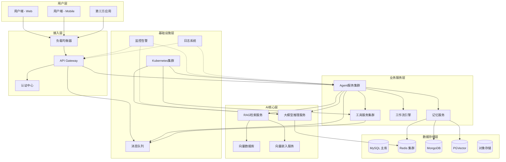

### 1.2 分层架构详解

#### 1.2.1 接入层
- **API Gateway**：统一入口，负责路由转发、限流熔断、协议转换
- **负载均衡**：支持 Nginx/F5 四层负载，K8s Service 七层负载
- **认证中心**：OAuth2.0/JWT 多模式认证，SSO 单点登录

#### 1.2.2 业务服务层
- **Agent服务集群**：核心调度引擎，管理会话生命周期
- **工具服务集群**：插件化工具管理，支持热插拔
- **记忆服务**：短期/长期记忆的存取管理
- **工作流引擎**：复杂任务编排，DAG 可视化定义

#### 1.2.3 AI核心层
- **大模型推理服务**：vLLM/TGI 高性能推理框架
- **向量数据库**：Milvus/Pinecone 语义检索
- **RAG检索服务**：文档切片、向量检索、重排序
- **Embedding服务**：文本向量化，模型版本管理

#### 1.2.4 数据存储层
- **MySQL**：关系型数据，用户/配置/计费
- **Redis**：缓存层，会话状态/热点数据
- **MongoDB**：文档存储，对话历史/Agent配置
- **PGVector**：混合检索，结构化+向量检索
- **OSS**：文件存储，知识库文件/日志归档

### 1.3 核心模块交互流程

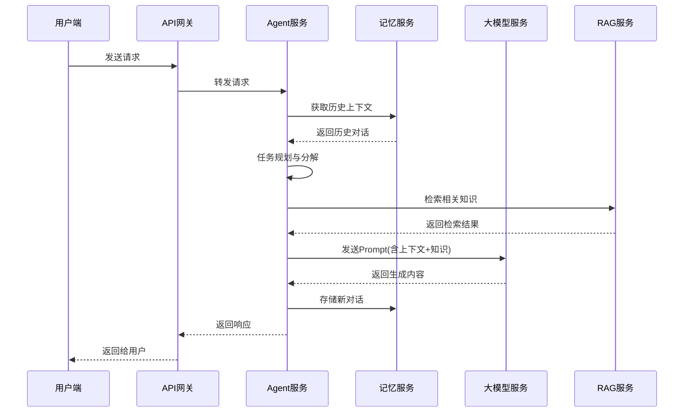

---

## 2. 技术选型

### 2.1 大模型(LLM)选择

| 维度 | 选型方案 | 选择理由 |
|------|----------|----------|
| 核心大模型 | 私有化部署 Qwen-Llama2 | 数据安全、成本可控、可定制 |
| 推理框架 | vLLM | PagedAttention、高吞吐、动态批处理 |
| 补充模型 | GPT-4o/Claude(API) | 复杂任务兜底，多模型路由 |
| 向量模型 | BGE-large-zh | 中文优化、开源、效果领先 |

### 2.2 Agent框架选型

```python
# 框架对比与选择
framework_comparison = {
    "LangChain": {
        "优点": "生态完善、社区活跃、组件丰富",
        "缺点": "性能一般、学习曲线陡峭",
        "适用": "快速原型、中小规模应用"
    },
    "LangGraph": {
        "优点": "状态持久化、多Agent协作、生产就绪",
        "缺点": "框架较重、灵活性受限",
        "适用": "复杂工作流、企业级应用"
    },
    "AutoGen": {
        "优点": "多Agent对话、代码执行、研究导向",
        "缺点": "稳定性一般、中文支持弱",
        "适用": "研究场景、多Agent实验"
    },
    "自研框架": {
        "优点": "完全可控、深度优化、业务定制",
        "缺点": "开发成本高、维护周期长",
        "适用": "百万级用户、特殊业务需求"
    }
}
```

### 2.3 存储方案组合

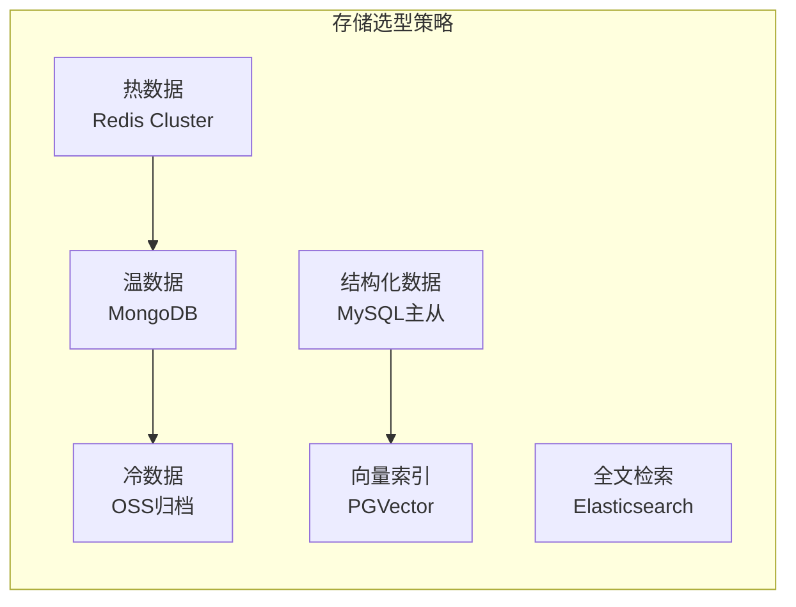

### 2.4 基础设施技术栈

| 分类 | 技术选型 | 规模说明 |
|------|----------|----------|
| 容器编排 | Kubernetes | 500+ 节点集群 |
| 服务网格 | Istio | 流量管理、灰度发布 |
| 消息队列 | Apache Kafka | 百万级TPS |
| 监控系统 | Prometheus + Grafana | 全链路监控 |
| 日志系统 | ELK/Loki | 日志聚合分析 |
| CI/CD | ArgoCD + GitLab | 自动化流水线 |

---

## 3. 性能优化策略

### 3.1 模型推理优化

#### 3.1.1 推理框架优化
```python
# vLLM 生产配置示例
vllm_config = {
    "model": "qwen-7b-chat",
    "tensor_parallel_size": 4,  # 多卡并行
    "gpu_memory_utilization": 0.9,
    "max_num_batched_tokens": 32768,
    "max_model_len": 8192,
    "enforce_eager": False,
    "disable_log_stats": True  # 生产环境关闭日志
}
```

#### 3.1.2 量化与蒸馏
- **INT8/INT4 量化**：降低显存占用 75%，推理速度提升 2-3x
- **知识蒸馏**：大模型指导小模型，保留 95% 效果
- **模型裁剪**：稀疏化 + 结构化剪枝

#### 3.1.3 推理加速技术
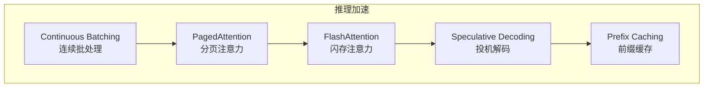

### 3.2 缓存策略

#### 3.2.1 多级缓存架构
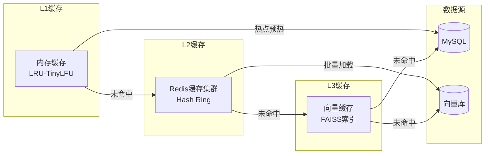

#### 3.2.2 缓存应用场景

| 缓存类型 | 存储内容 | TTL策略 | 命中率 |
|----------|----------|---------|--------|
| 会话缓存 | 对话历史、上下文 | 动态TTL(5min-1h) | 85%+ |
| 知识缓存 | RAG检索结果 | 按更新策略 | 90%+ |
| 配置缓存 | Agent配置、工具定义 | 事件驱动 | 99%+ |
| 响应缓存 | 相同输入的模型响应 | 语义相似度匹配 | 30-50% |

### 3.3 异步与并发处理

#### 3.3.1 异步消息架构
```python
# 异步任务处理示例
class AsyncAgentProcessor:
    async def process_user_request(self, request):
        # 1. 异步获取上下文
        context = await self.memory_service.get_context_async(
            request.session_id
        )

        # 2. 并行执行RAG检索与工具调用
        rag_task = asyncio.create_task(
            self.rag_service.retrieve_async(request.query)
        )
        tool_task = asyncio.create_task(
            self.tool_service.execute_async(request.tools)
        )
        rag_result, tool_result = await asyncio.gather(
            rag_task, tool_task, return_exceptions=True
        )

        # 3. 异步调用LLM
        response = await self.llm_service.generate_async(
            prompt=self.build_prompt(request, context, rag_result, tool_result),
            stream=True
        )

        # 4. 异步存储结果
        await self.memory_service.store_conversation_async(
            request.session_id, request.query, response
        )

        return response
```

#### 3.3.2 并发控制策略
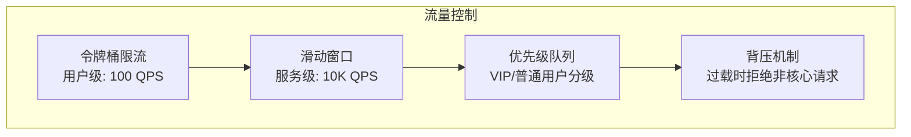

### 3.4 资源隔离与调度

#### 3.4.1 GPU资源调度
```yaml
# GPU调度策略
gpu_scheduler:
  # 按业务优先级分配
  queues:
    - name: high_priority
      max_concurrent: 10
      gpu_memory_limit: "16GB"
    - name: normal_priority
      max_concurrent: 50
      gpu_memory_limit: "8GB"
    - name: batch_processing
      max_concurrent: 100
      gpu_memory_limit: "4GB"

  # 动态扩缩容
  auto_scaling:
    min_instances: 20
    max_instances: 200
    target_gpu_utilization: 0.8
    cooldown_period: 300
```

#### 3.4.2 CPU资源隔离
- **cgroup 限制**：CPU/内存硬隔离
- **NUMA 亲和性**：减少跨NUMA访问
- **实时调度**：核心业务使用 RT 调度类

---

## 4. 扩展性方案

### 4.1 水平扩展策略

#### 4.1.1 无状态服务设计
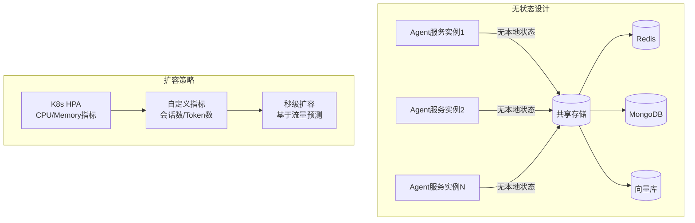

#### 4.1.2 分片与分区
```python
# 用户数据分片策略
class UserShardingStrategy:
    def calculate_shard(self, user_id: str) -> int:
        """基于用户ID的一致性哈希分片"""
        hash_value = hash(user_id)
        virtual_nodes = 1024
        return hash_value % virtual_nodes

    def get_shard_key(self, user_id: str) -> str:
        """获取分片键"""
        shard_id = self.calculate_shard(user_id)
        return f"shard_{shard_id}"

    # 热点用户迁移策略
    def hot_user_migration(self, user_id: str, new_shard: int):
        """热点用户迁移"""
        old_shard = self.calculate_shard(user_id)
        self.data_migrate_service.migrate(
            source=f"shard_{old_shard}",
            target=f"shard_{new_shard}",
            keys=[user_id]
        )
```

### 4.2 模块化架构设计

#### 4.2.1 插件化工具系统
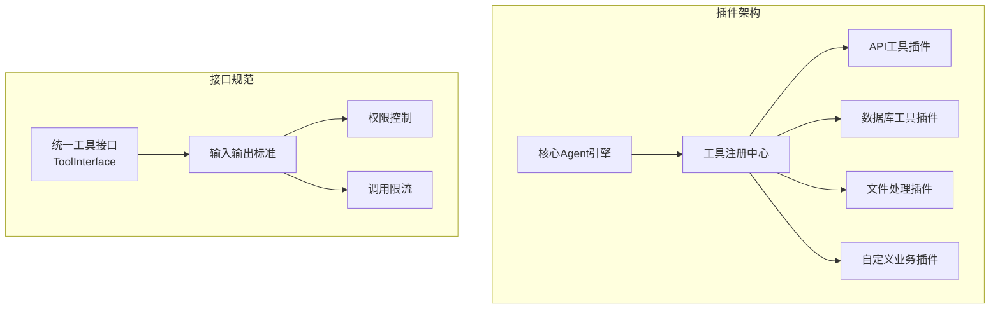

#### 4.2.2 配置驱动设计
```yaml
# Agent配置示例 - 配置驱动
agent_config:
  version: "2.0"
  agent_id: "customer_service_v2"

  # 大模型配置
  model:
    primary: "qwen-7b-chat"
    fallback: "gpt-4o"
    temperature: 0.7
    max_tokens: 4096

  # 工具配置
  tools:
    - name: "order_query"
      plugin: "database_tool"
      config:
        connection: "order_db"
        query_template: "SELECT * FROM orders WHERE user_id = ?"
    - name: "knowledge_search"
      plugin: "rag_tool"
      config:
        knowledge_base: "customer_service_kb"
        top_k: 5
        similarity_threshold: 0.7

  # 记忆配置
  memory:
    short_term:
      type: "sliding_window"
      max_turns: 20
    long_term:
      type: "vector_store"
      embedding_model: "bge-large-zh"

  # 流程配置
  workflow:
    steps:
      - name: "意图识别"
        handler: "intent_classifier"
      - name: "知识检索"
        handler: "rag_retriever"
        condition: "intent == 'product_query'"
      - name: "生成回复"
        handler: "response_generator"
```

### 4.3 Multi-Agent协同扩展

#### 4.3.1 多Agent拓扑结构
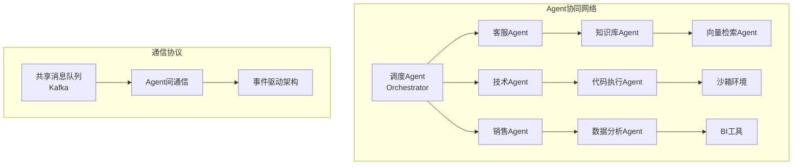

#### 4.3.2 Agent能力动态注册
```python
# Agent能力注册与发现
class AgentRegistry:
    def register_capability(self, agent_id: str, capabilities: list):
        """注册Agent能力"""
        self.redis.sadd(f"agent:{agent_id}:capabilities", *capabilities)
        for cap in capabilities:
            self.redis.sadd(f"capability:{cap}:agents", agent_id)

    def discover_by_capability(self, capability: str) -> list:
        """按能力发现Agent"""
        return self.redis.smembers(f"capability:{capability}:agents")

    def route_to_agent(self, task: dict) -> str:
        """智能路由到最合适的Agent"""
        required_caps = self.extract_capabilities(task)
        candidates = set()
        for cap in required_caps:
            agents = self.discover_by_capability(cap)
            candidates.intersection_update(agents)

        # 负载均衡选择
        return self.select_agent_with_balance(candidates)
```

---

## 5. 安全机制

### 5.1 身份认证与授权

#### 5.1.1 多层次认证体系
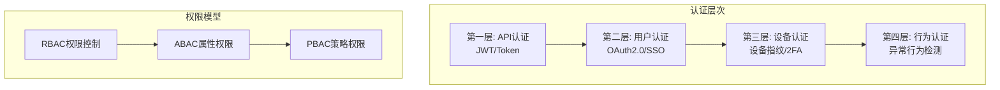

#### 5.1.2 权限控制实现
```python
class AgentPermissionService:
    def check_permission(self, user_id: str, agent_id: str, action: str) -> bool:
        """检查用户对Agent的操作权限"""
        # 1. RBAC: 基于角色
        user_roles = self.role_service.get_roles(user_id)
        if self.role_permission_check(agent_id, action, user_roles):
            return True

        # 2. ABAC: 基于属性
        user_attributes = self.user_service.get_attributes(user_id)
        agent_attributes = self.agent_service.get_attributes(agent_id)
        if self.attribute_policy_check(user_attributes, agent_attributes, action):
            return True

        # 3. PBAC: 基于策略
        policies = self.policy_service.get_relevant_policies(
            user_id, agent_id, action
        )
        return self.evaluate_policies(policies)

    def enforce_data_isolation(self, user_id: str, query: str) -> str:
        """强制执行数据隔离"""
        # 添加用户数据过滤条件
        isolation_filter = f"created_by = '{user_id}'"
        return self.inject_isolation_filter(query, isolation_filter)
```

### 5.2 数据隔离与隐私保护

#### 5.2.1 多租户数据隔离
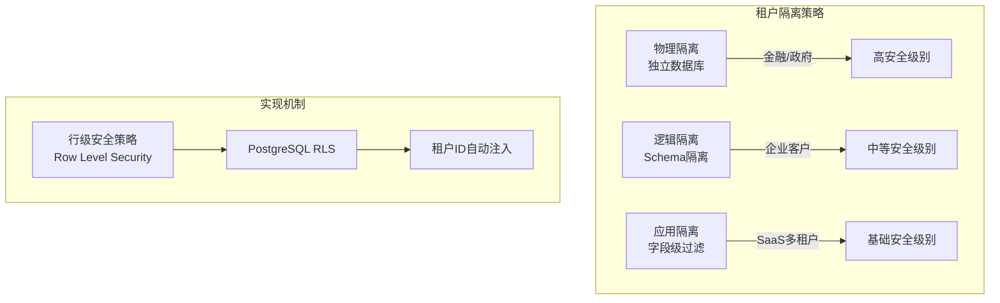

#### 5.2.2 数据加密方案
```yaml
# 加密策略
encryption:
  # 传输层加密
  transport:
    protocol: "TLS 1.3"
    cipher_suites: ["TLS_AES_256_GCM_SHA384"]

  # 存储层加密
  storage:
    at_rest_encryption: true
    encryption_algorithm: "AES-256-GCM"
    key_management: "云厂商KMS"
    rotation_policy: "90天轮换"

  # 敏感字段加密
  sensitive_fields:
    - field: "phone_number"
      method: "deterministic_encryption"
      searchable: true
    - field: "id_card"
      method: "format_preserving_encryption"
      searchable: false
    - field: "conversation_content"
      method: "chunked_encryption"
      searchable: false
```

### 5.3 输入输出安全过滤

#### 5.3.1 Prompt注入防护
```python
class PromptInjectionDetector:
    def detect_injection(self, user_input: str) -> InjectionResult:
        """检测Prompt注入攻击"""
        # 1. 关键字匹配
        injection_patterns = [
            r"ignore previous instructions",
            r"forget all rules",
            r"system prompt",
            r"你是一个",
            r"假装你是",
            r"from now on"
        ]

        for pattern in injection_patterns:
            if re.search(pattern, user_input, re.IGNORECASE):
                return InjectionResult(
                    is_injection=True,
                    pattern_matched=pattern,
                    risk_level="HIGH"
                )

        # 2. 语义分析
        risk_score = self.semantic_analysis(user_input)
        if risk_score > 0.8:
            return InjectionResult(
                is_injection=True,
                risk_score=risk_score,
                risk_level="HIGH"
            )

        # 3. 上下文冲突检测
        if self.detect_context_conflict(user_input):
            return InjectionResult(
                is_injection=True,
                risk_level="MEDIUM"
            )

        return InjectionResult(is_injection=False)

    def sanitize_input(self, user_input: str) -> str:
        """清洗用户输入"""
        # 1. HTML转义
        sanitized = html.escape(user_input)
        # 2. 特殊字符过滤
        sanitized = re.sub(r'[^\w\s\u4e00-\u9fff]', '', sanitized)
        # 3. 长度限制
        max_length = 5000
        if len(sanitized) > max_length:
            sanitized = sanitized[:max_length]
        return sanitized
```

#### 5.3.2 输出内容审核
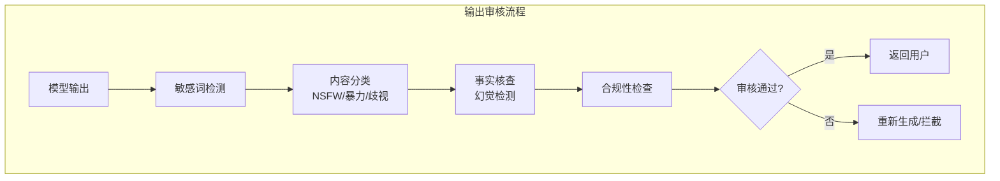

### 5.4 服务可用性保障

#### 5.4.1 多活部署架构
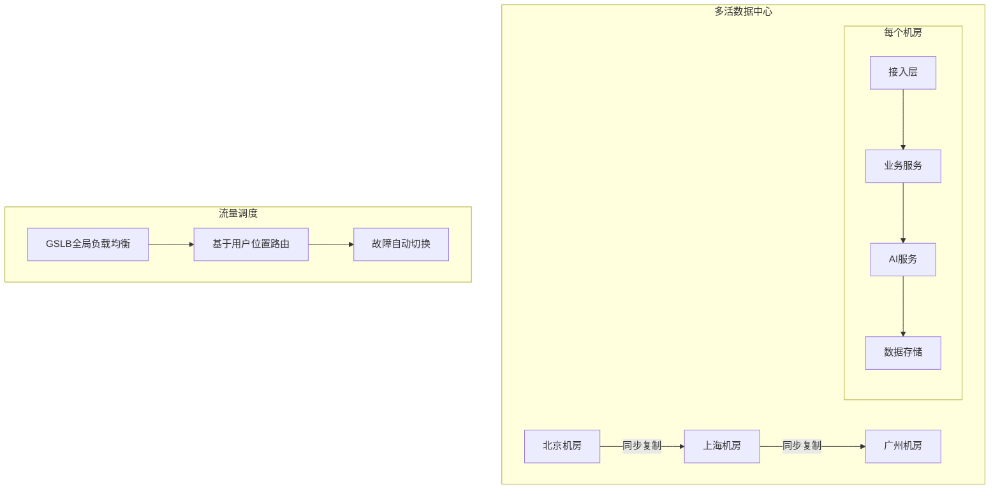

#### 5.4.2 容灾策略
| 场景 | 策略 | RTO | RPO |
|------|------|-----|-----|
| 单机房故障 | 自动切换备用机房 | < 1分钟 | 实时 |
| 数据库故障 | 主从切换/数据恢复 | < 5分钟 | < 1秒 |
| 模型服务故障 | 降级策略/备用模型 | < 10秒 | 无数据损失 |
| 网络故障 | 多线路冗余/卫星备份 | < 30秒 | 实时 |

---

## 6. 数据处理流程

### 6.1 数据流转全链路

#### 6.1.1 请求处理流程
```mermaid
flowchart LR
    subgraph 输入阶段
        A[用户请求] --> B[输入校验]
        B --> C[安全过滤]
        C --> D[协议转换]
    end

    subgraph 处理阶段
        D --> E[意图识别]
        E --> F[任务规划]
        F --> G[工具选择]
        G --> H[并行执行]
        H --> I[结果整合]
    end

    subgraph 生成阶段
        I --> J[上下文组装]
        J --> K[Prompt构建]
        K --> L[模型推理]
        L --> M[内容审核]
    end

    subgraph 输出阶段
        M --> N[响应封装]
        N --> O[结果缓存]
        O --> P[返回用户]
    end
```

#### 6.1.2 数据存储流程
```python
class DataFlowPipeline:
    def process_conversation(self, conversation: Conversation):
        """处理对话数据的完整流程"""
        # 1. 实时写入缓存
        self.redis_pipeline.execute([
            redis_cmd.setex(
                f"session:{conversation.session_id}",
                3600,  # 1小时TTL
                conversation.to_json()
            ),
            redis_cmd.zadd(
                f"user:{conversation.user_id}:sessions",
                {conversation.session_id: time.time()}
            )
        ])

        # 2. 异步持久化
        asyncio.create_task(
            self.async_persist(conversation)
        )

        # 3. 定期归档
        if conversation.metadata.get("is_long_term"):
            asyncio.create_task(
                self.archive_to_vector_store(conversation)
            )

        # 4. 数据分析管道
        asyncio.create_task(
            self.analytics_pipeline.process(conversation)
        )

    async def async_persist(self, conversation: Conversation):
        """异步持久化到MongoDB"""
        await self.mongo.collection("conversations").insert_one({
            "session_id": conversation.session_id,
            "user_id": conversation.user_id,
            "messages": [m.to_dict() for m in conversation.messages],
            "metadata": conversation.metadata,
            "created_at": datetime.utcnow(),
            "ttl": datetime.utcnow() + timedelta(days=90)
        })

        # 同时更新用户画像
        await self.update_user_profile(conversation)
```

### 6.2 上下文管理机制

#### 6.2.1 上下文分层策略
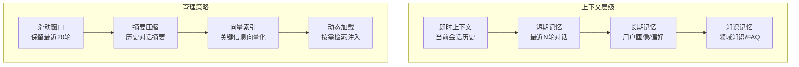

#### 6.2.2 上下文组装算法
```python
class ContextAssembler:
    def assemble_context(self, session: Session, query: str) -> PromptContext:
        """智能组装上下文"""
        # 1. 获取即时上下文
        recent_messages = self.get_recent_messages(
            session.id, max_turns=20
        )

        # 2. 获取用户画像
        user_profile = self.user_service.get_profile(session.user_id)

        # 3. 检索相关长期记忆
        relevant_memories = self.memory_service.semantic_search(
            query=query,
            user_id=session.user_id,
            top_k=5
        )

        # 4. 检索相关知识
        relevant_knowledge = self.knowledge_service.retrieve(
            query=query,
            knowledge_base_ids=session.config.kb_ids,
            top_k=10
        )

        # 5. 摘要压缩历史
        compressed_history = self.compress_history(
            session.messages, target_summary_length=500
        )

        # 6. 组装最终上下文
        return PromptContext(
            system_prompt=self.build_system_prompt(session, user_profile),
            conversation_history=compressed_history,
            recent_messages=recent_messages,
            relevant_memories=relevant_memories,
            relevant_knowledge=relevant_knowledge,
            user_profile=user_profile
        )

    def compress_history(self, messages: list, target_length: int) -> str:
        """使用LLM压缩对话历史"""
        if len(messages) <= 10:
            return self.format_messages(messages)

        # 分段摘要
        chunks = self.chunk_messages(messages, chunk_size=10)
        summaries = []
        for chunk in chunks[:-1]:  # 保留最近一段
            summary = self.llm_service.generate(
                prompt=f"请摘要以下对话，保留关键信息：\n{chunk}"
            )
            summaries.append(summary)

        return "\n".join(summaries) + "\n" + self.format_messages(chunks[-1])
```

### 6.3 日志与监控体系

#### 6.3.1 全链路日志追踪
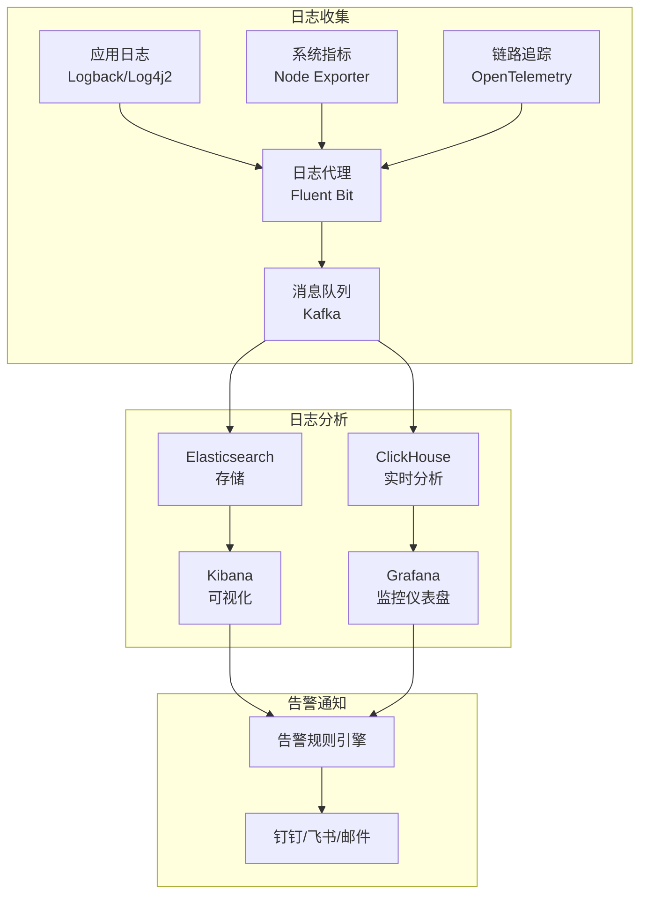

#### 6.3.2 关键监控指标
```yaml
# 监控指标定义
monitoring_metrics:
  # 业务指标
  business:
    - name: "daily_active_users"
      description: "日活跃用户数"
      alert_threshold: 10000  # 低于此值告警
    - name: "conversion_rate"
      description: "对话完成率"
      alert_threshold: 0.9  # 低于90%告警
    - name: "user_satisfaction_score"
      description: "用户满意度评分"
      alert_threshold: 4.0  # 低于4分告警

  # 性能指标
  performance:
    - name: "average_response_time"
      description: "平均响应时间"
      alert_threshold: 3000  # 超过3秒告警
      unit: "ms"
    - name: "p99_response_time"
      description: "99分位响应时间"
      alert_threshold: 5000  # 超过5秒告警
      unit: "ms"
    - name: "token_usage"
      description: "Token消耗"
      alert_threshold: 1000000  # 单日告警阈值

  # 系统指标
  system:
    - name: "gpu_utilization"
      description: "GPU利用率"
      alert_threshold: 0.95  # 超过95%告警
    - name: "memory_usage"
      description: "内存使用率"
      alert_threshold: 0.9  # 超过90%告警
    - name: "error_rate"
      description: "错误率"
      alert_threshold: 0.01  # 超过1%告警
```

---

## 7. 项目案例分析

### 7.1 项目背景

#### 7.1.1 项目概述
- **项目名称**：智能客服Agent平台
- **业务目标**：为某大型电商提供7x24小时智能客服服务
- **用户规模**：日活用户 50万+，并发会话 10万+
- **核心指标**：平均响应时间 < 1秒，问题解决率 > 85%

#### 7.1.2 技术挑战
1. 高并发场景下的上下文一致性
2. 复杂业务场景的意图识别准确率
3. 知识库检索的精准度和时效性
4. 成本控制下的模型调用优化

### 7.2 架构设计实践

#### 7.2.1 微服务拆分
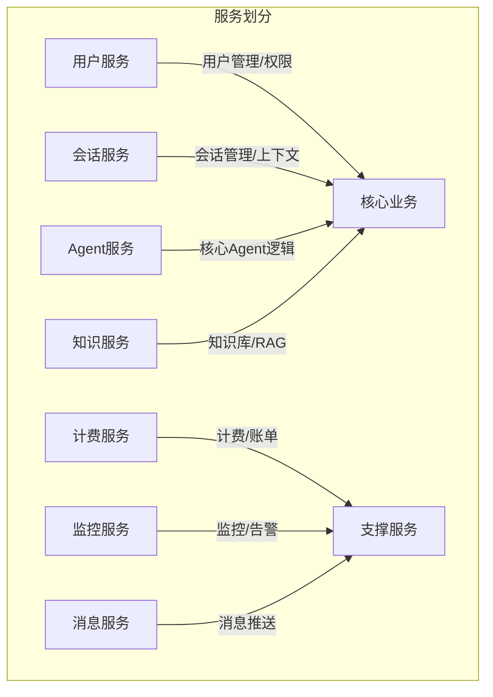

#### 7.2.2 数据库分库分表
```yaml
# 分库分表策略
sharding:
  # 会话表分片
  conversation:
    sharding_key: "user_id"
    db_count: 32
    table_per_db: 64
    total_tables: 2048

  # 消息表分片
  message:
    sharding_key: "session_id"
    db_count: 64
    table_per_db: 128
    total_tables: 8192

  # 分表路由规则
  routing:
    conversation_0000_2048:
      rule: "user_id % 2048"
    message_0000_8192:
      rule: "hash(session_id) % 8192"
```

### 7.3 技术实现细节

#### 7.3.1 会话状态管理
```python
class SessionManager:
    """分布式会话管理器"""

    def __init__(self, redis_cluster, mongo_client):
        self.redis = redis_cluster
        self.mongo = mongo_client
        self.session_ttl = 1800  # 30分钟
        self.max_sessions_per_user = 5

    async def create_session(self, user_id: str) -> Session:
        """创建新会话"""
        # 1. 检查用户会话数限制
        current_sessions = await self.redis.smembers(
            f"user:{user_id}:active_sessions"
        )
        if len(current_sessions) >= self.max_sessions_per_user:
            # 自动清理最旧会话
            await self.cleanup_oldest_session(user_id)

        # 2. 创建会话
        session_id = str(uuid.uuid4())
        session = Session(
            id=session_id,
            user_id=user_id,
            created_at=datetime.utcnow(),
            status="active"
        )

        # 3. 存储到Redis
        pipe = self.redis.pipeline()
        pipe.setex(
            f"session:{session_id}",
            self.session_ttl,
            session.to_json()
        )
        pipe.sadd(f"user:{user_id}:active_sessions", session_id)
        await pipe.execute()

        return session

    async def get_context(self, session_id: str) -> SessionContext:
        """获取会话上下文（多级缓存）"""
        # L1: Redis缓存
        cached = await self.redis.get(f"session:{session_id}")
        if cached:
            return SessionContext.from_json(cached)

        # L2: MongoDB
        session_doc = await self.mongo.conversations.find_one(
            {"_id": session_id}
        )
        if session_doc:
            # 回填缓存
            await self.redis.setex(
                f"session:{session_id}",
                self.session_ttl,
                json.dumps(session_doc)
            )
            return SessionContext.from_mongo(session_doc)

        raise SessionNotFoundError(session_id)
```

#### 7.3.2 RAG检索优化
```python
class OptimizedRAGService:
    """优化的RAG检索服务"""

    def __init__(self, vector_store, embedding_service, rerank_model):
        self.vector_store = vector_store
        self.embedding_service = embedding_service
        self.rerank_model = rerank_model

    async def retrieve(self, query: str, kb_ids: list) -> RetrievalResult:
        """优化的检索流程"""
        # 1. 查询改写（生成多个查询变体）
        query_variants = await self.generate_query_variants(query)

        # 2. 并行向量检索
        tasks = [
            self.vector_store.search(
                embedding=await self.embedding_service.embed(v),
                collection_id=kb_id,
                top_k=20
            )
            for v in query_variants
            for kb_id in kb_ids
        ]
        raw_results = await asyncio.gather(*tasks)

        # 3. 结果融合（RRF算法）
        fused_results = self.reciprocal_rank_fusion(raw_results)

        # 4. 重排序（Cross-Encoder）
        if self.rerank_model:
            candidates = [r.document for r in fused_results[:50]]
            reranked = await self.rerank_model.rerank(query, candidates)
            fused_results = self.merge_scores(fused_results, reranked)

        # 5. 过滤与去重
        final_results = self.filter_and_deduplicate(
            fused_results,
            similarity_threshold=0.75,
            max_results=10
        )

        return RetrievalResult(
            query=query,
            results=final_results,
            total_retrieved=len(raw_results),
            processing_time_ms=time.time() - start_time
        )

    async def generate_query_variants(self, query: str) -> list:
        """生成查询变体"""
        prompt = f"""
        请为以下用户问题生成3个不同的查询变体，用于知识检索：
        原问题：{query}

        要求：
        1. 保持原意的不同表达方式
        2. 包含关键词的同义词替换
        3. 从不同角度提问

        查询变体：
        1.
        2.
        3.
        """
        response = await self.llm_service.generate(prompt)
        variants = [v.strip() for v in response.split("\n") if v.strip()]
        return [query] + variants[:3]  # 包含原查询
```

### 7.4 挑战与解决方案

#### 7.4.1 核心挑战与应对
| 挑战 | 影响 | 解决方案 | 效果 |
|------|------|----------|------|
| 上下文丢失 | 对话连续性差 | 多级缓存+向量记忆 | 上下文命中率 99.5% |
| 检索不准 | 回答质量低 | 查询改写+重排序 | 检索准确率提升 40% |
| 响应慢 | 用户体验差 | 流式响应+预计算 | 首字响应 < 200ms |
| 成本高 | 运营成本高 | 小模型路由+缓存复用 | 成本降低 60% |

#### 7.4.2 关键优化措施
```python
# 1. 智能路由策略
class IntelligentRouter:
    async def route(self, request: AgentRequest) -> ModelResponse:
        """根据请求复杂度选择合适模型"""
        # 简单问答 -> 小模型
        if self.is_simple_query(request.query):
            return await self.call_small_model(request)

        # 复杂任务 -> 大模型
        if self.is_complex_task(request):
            return await self.call_large_model(request)

        # 模糊判断 -> 分级处理
        complexity = await self.assess_complexity(request)
        if complexity < 0.5:
            response = await self.call_small_model(request)
            if self.needs_verification(response):
                response = await self.call_large_model(request)
        else:
            response = await self.call_large_model(request)

        return response

# 2. 响应缓存复用
class ResponseCache:
    def __init__(self, redis_client, similarity_threshold=0.95):
        self.redis = redis_client
        self.threshold = similarity_threshold

    async def get_cached_response(self, query: str, context: dict):
        """查找缓存的相似响应"""
        # 1. 向量检索相似查询
        query_embedding = await self.embedding_service.embed(query)
        cached_queries = await self.vector_index.search(
            query_embedding, top_k=5
        )

        # 2. 检查相似度
        for cached in cached_queries:
            if cached.similarity >= self.threshold:
                cached_response = await self.redis.get(
                    f"response:{cached.id}"
                )
                if cached_response:
                    return json.loads(cached_response)

        return None
```

---

## 8. 技术难点与应对策略

### 8.1 高并发下的上下文一致性

#### 8.1.1 问题分析
- **场景**：用户多设备同时发送请求
- **风险**：上下文不一致、对话混乱
- **影响**：体验下降、数据错误

#### 8.1.2 解决方案
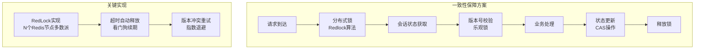

```python
class DistributedSessionLock:
    """分布式会话锁"""

    def __init__(self, redis_clients, lock_timeout=30):
        self.redis_clients = redis_clients  # N个Redis节点
        self.lock_timeout = lock_timeout
        self.quorum = len(redis_clients) // 2 + 1

    async def lock(self, session_id: str) -> str:
        """获取分布式锁"""
        lock_key = f"lock:session:{session_id}"
        lock_value = str(uuid.uuid4())
        acquired = 0

        for client in self.redis_clients:
            result = await client.set(
                lock_key, lock_value,
                nx=True,
                ex=self.lock_timeout
            )
            if result:
                acquired += 1

        if acquired < self.quorum:
            # 失败，释放已获取的锁
            await self._release_partial_locks(lock_key, lock_value)
            raise LockAcquisitionFailed(session_id)

        # 启动看门狗续期
        asyncio.create_task(
            self._watchdog(session_id, lock_key, lock_value)
        )

        return lock_value

    async def _watchdog(self, session_id, lock_key, lock_value):
        """看门狗自动续期"""
        while True:
            await asyncio.sleep(self.lock_timeout // 3)
            renewed = 0
            for client in self.redis_clients:
                script = """
                if redis.call("get", KEYS[1]) == ARGV[1] then
                    return redis.call("expire", KEYS[1], ARGV[2])
                end
                return 0
                """
                result = await client.eval(
                    script, 1, lock_key, lock_value, self.lock_timeout
                )
                if result:
                    renewed += 1
            if renewed < self.quorum:
                break

    async def unlock(self, session_id: str, lock_value: str):
        """释放锁"""
        released = 0
        for client in self.redis_clients:
            script = """
            if redis.call("get", KEYS[1]) == ARGV[1] then
                return redis.call("del", KEYS[1])
            end
            return 0
            """
            result = await client.eval(script, 1, f"lock:session:{session_id}", lock_value)
            if result:
                released += 1
```

### 8.2 模型调用成本控制

#### 8.2.1 成本优化矩阵
| 优化维度 | 策略 | 成本降幅 | 效果影响 |
|----------|------|----------|----------|
| 模型选择 | 分级模型路由 | 40-60% | 轻微 |
| Token优化 | 输入截断/摘要 | 20-30% | 中等 |
| 缓存复用 | 相似响应缓存 | 30-50% | 极小 |
| 批处理 | 动态批处理 | 15-25% | 无 |
| 量化部署 | INT8量化 | 10-20% | 轻微 |

#### 8.2.2 智能成本管理
```python
class CostOptimizer:
    """成本优化引擎"""

    def __init__(self, llm_client, cache_service, metrics_collector):
        self.llm_client = llm_client
        self.cache = cache_service
        self.metrics = metrics_collector

    async def optimized_generate(self, prompt: str, user_id: str):
        """优化的生成流程"""
        # 1. 检查缓存
        cached = await self.cache.get_similar(prompt, threshold=0.95)
        if cached:
            self.metrics.record("cache_hit", user_id)
            return cached

        # 2. 智能选择模型
        model = await self.select_optimal_model(prompt, user_id)

        # 3. 优化Prompt
        optimized_prompt = await self.optimize_prompt(prompt, model)

        # 4. 批量请求
        batch_key = self.get_batch_key(user_id)
        if self.should_batch(batch_key):
            return await self.llm_client.batch_generate(optimized_prompt)

        # 5. 直接调用
        response = await self.llm_client.generate(
            model=model,
            prompt=optimized_prompt,
            max_tokens=self.estimate_max_tokens(prompt)
        )

        # 6. 缓存结果
        if self.is_cacheable(response):
            await self.cache.store(prompt, response)

        self.metrics.record("llm_call", user_id, model, len(prompt))
        return response

    async def select_optimal_model(self, prompt: str, user_id: str) -> str:
        """选择最优模型"""
        # 获取用户历史成本
        user_cost = await self.metrics.get_user_cost_today(user_id)

        # 成本敏感用户 -> 小模型
        if user_cost > COST_THRESHOLD:
            return "small_model"

        # 根据任务复杂度选择
        complexity = await self.assess_complexity(prompt)
        if complexity == "low":
            return "small_model"
        elif complexity == "medium":
            return "medium_model"
        else:
            return "large_model"

    async def optimize_prompt(self, prompt: str, model: str) -> str:
        """优化Prompt减少Token"""
        # 移除冗余信息
        cleaned = self.remove_redundancy(prompt)

        # 压缩上下文
        if len(cleaned) > 4000:
            cleaned = await self.summarize_context(cleaned)

        # 调整输出长度
        max_output = self.calculate_optimal_output_length(model, cleaned)
        cleaned += f"\n\n请用不超过{max_output}字回答。"

        return cleaned
```

### 8.3 响应延迟优化

#### 8.3.1 延迟分析
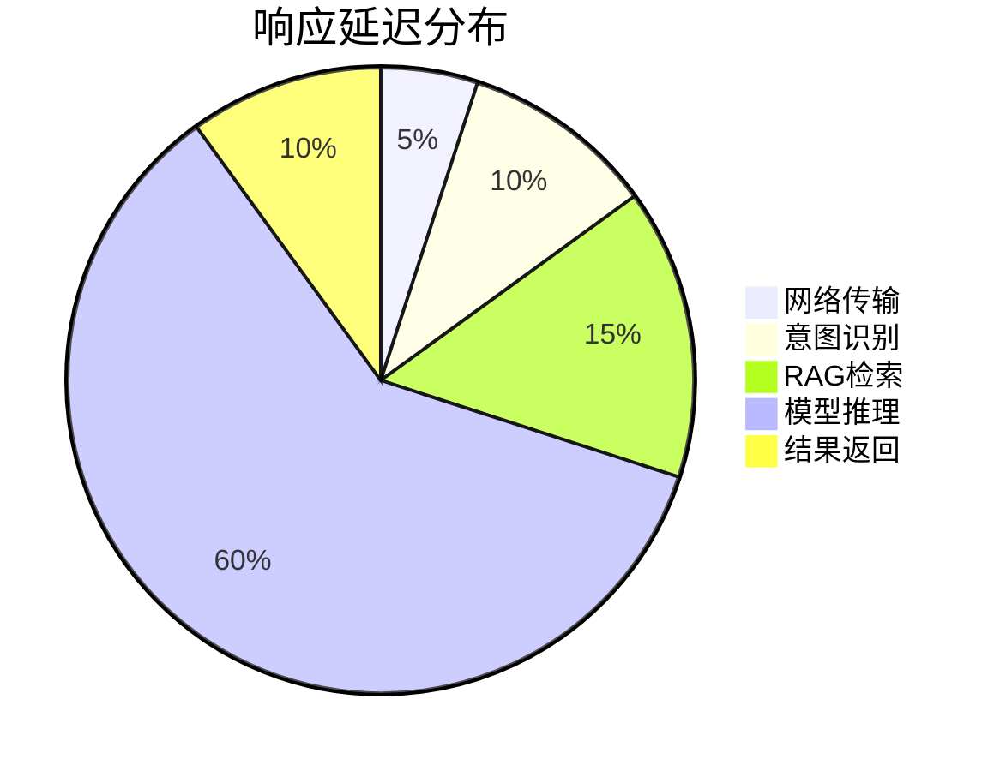

#### 8.3.2 优化措施
```python
# 1. 流式响应
class StreamingResponseHandler:
    async def stream_response(self, request: AgentRequest):
        """流式响应处理"""
        async def event_generator():
            # 并行执行
            context_task = asyncio.create_task(
                self.get_context_async(request.session_id)
            )
            rag_task = asyncio.create_task(
                self.rag_service.retrieve_async(request.query)
            )

            context, rag_results = await asyncio.gather(
                context_task, rag_task
            )

            # 组装Prompt
            prompt = self.build_prompt(context, request.query, rag_results)

            # 流式调用LLM
            async for token in self.llm_client.stream_generate(prompt):
                yield {
                    "event": "token",
                    "data": token,
                    "timestamp": time.time()
                }

            yield {
                "event": "complete",
                "data": "",
                "timestamp": time.time()
            }

        return StreamingResponse(event_generator())

# 2. 预计算与预加载
class PrecomputationService:
    def __init__(self):
        self.precomputed_responses = {}
        self.update_schedule = {}

    async def precompute(self, agent_id: str, knowledge_base_id: str):
        """预计算高频问题的响应"""
        # 1. 获取高频问题
        high_freq_questions = await self.analytics.get_high_freq_questions(
            agent_id, limit=100
        )

        # 2. 批量预计算
        for question in high_freq_questions:
            # 预计算RAG检索
            retrieval = await self.rag_service.retrieve(
                question, knowledge_base_id
            )

            # 预生成响应
            response = await self.llm_service.generate(
                self.build_prompt(question, retrieval)
            )

            # 存储预计算结果
            key = f"precomputed:{agent_id}:{hash(question)}"
            await self.redis.setex(key, 3600, response)

        # 3. 设置定时更新
        self.update_schedule[agent_id] = asyncio.create_task(
            self.schedule_updates(agent_id, knowledge_base_id)
        )
```

### 8.4 故障熔断与降级

#### 8.4.1 熔断降级策略
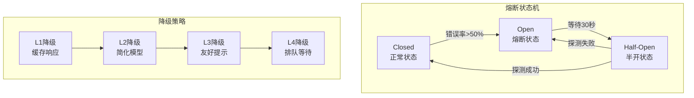

#### 8.4.2 实现代码
```python
class CircuitBreaker:
    """熔断器实现"""

    def __init__(self, failure_threshold=50, recovery_timeout=30):
        self.failure_threshold = failure_threshold
        self.recovery_timeout = recovery_timeout
        self.state = "closed"  # closed, open, half-open
        self.failure_count = 0
        self.last_failure_time = None

    async def execute(self, func, fallback=None):
        """执行带熔断的操作"""
        if self.state == "open":
            # 检查是否到达恢复时间
            if time.time() - self.last_failure_time > self.recovery_timeout:
                self.state = "half-open"
            else:
                return await self.execute_fallback(fallback)

        try:
            result = await func()
            self._on_success()
            return result
        except Exception as e:
            self._on_failure()
            if self.state == "open":
                return await self.execute_fallback(fallback)
            raise e

    def _on_success(self):
        """成功回调"""
        self.failure_count = 0
        if self.state == "half-open":
            self.state = "closed"

    def _on_failure(self):
        """失败回调"""
        self.failure_count += 1
        self.last_failure_time = time.time()
        if self.failure_count >= self.failure_threshold:
            self.state = "open"

    async def execute_fallback(self, fallback=None):
        """执行降级策略"""
        if fallback:
            return await fallback()

        # 默认降级
        return {
            "status": "degraded",
            "message": "服务暂时不可用，请稍后重试",
            "timestamp": time.time()
        }


class DegradationManager:
    """降级管理器"""

    def __init__(self):
        self.degradation_levels = {
            0: {"name": "正常", "actions": []},
            1: {
                "name": "缓存降级",
                "actions": [
                    "使用Redis缓存响应",
                    "跳过RAG检索",
                    "使用默认模板回复"
                ]
            },
            2: {
                "name": "模型降级",
                "actions": [
                    "切换到备用小模型",
                    "减少上下文长度",
                    "关闭多轮对话"
                ]
            },
            3: {
                "name": "部分功能降级",
                "actions": [
                    "关闭工具调用",
                    "关闭图片生成",
                    "关闭个性化推荐"
                ]
            },
            4: {
                "name": "完全降级",
                "actions": [
                    "返回预设回复",
                    "提示用户稍后重试",
                    "启用排队机制"
                ]
            }
        }

    def calculate_degradation_level(self, system_metrics: dict) -> int:
        """计算降级级别"""
        level = 0

        # CPU/内存压力
        if system_metrics.get("cpu_usage", 0) > 0.85:
            level = max(level, 2)
        if system_metrics.get("memory_usage", 0) > 0.9:
            level = max(level, 2)

        # 错误率
        error_rate = system_metrics.get("error_rate", 0)
        if error_rate > 0.3:
            level = max(level, 4)
        elif error_rate > 0.1:
            level = max(level, 3)

        # 响应时间
        p99_latency = system_metrics.get("p99_latency", 0)
        if p99_latency > 10000:
            level = max(level, 3)
        elif p99_latency > 5000:
            level = max(level, 2)

        # GPU状态
        gpu_health = system_metrics.get("gpu_health", 1)
        if gpu_health < 0.5:
            level = max(level, 4)
        elif gpu_health < 0.8:
            level = max(level, 2)

        return level

    def get_degradation_strategy(self, level: int) -> dict:
        """获取降级策略"""
        return self.degradation_levels.get(level, self.degradation_levels[4])
```

---

## 9. 总结与展望

### 9.1 核心设计理念

| 设计原则 | 具体体现 | 价值 |
|----------|----------|------|
| 无状态设计 | 服务实例无本地状态，数据全在共享存储 | 水平扩展能力 |
| 多级缓存 | L1内存 + L2 Redis + L3 向量缓存 | 性能提升10x+ |
| 异步优先 | 全链路异步处理，并行执行 | 吞吐量提升5x+ |
| 弹性伸缩 | 基于K8s HPA + 自定义指标 | 应对流量峰值 |
| 多活容灾 | 三地五中心 + 故障自动切换 | 99.99% 可用性 |

### 9.2 关键技术指标

```yaml
# 百万级Agent平台核心指标
platform_metrics:
  capacity:
    max_concurrent_sessions: 100000
    qps: 50000
    daily_active_users: 500000

  performance:
    average_response_time_ms: 500
    p99_response_time_ms: 2000
    first_token_latency_ms: 200

  availability:
    service_level: 99.99
    rpo_seconds: 1
    rto_minutes: 1

  cost:
    cost_per_1k_tokens: 0.01
    cache_hit_rate: 0.85
    model_utilization: 0.85

  quality:
    user_satisfaction_score: 4.5
    task_completion_rate: 0.92
    hallucination_rate: 0.03
```

### 9.3 未来演进方向

#### 9.3.1 技术演进路线
```mermaid
gantt
    title Agent平台技术演进
    dateFormat YYYY-MM-DD
    section 基础设施
    云原生改造 :active, 2024-01-01, 180d
    多云部署 :2024-07-01, 180d
    边缘计算 :2025-01-01, 365d
    section AI能力
    本地小模型 :active, 2024-01-01, 120d
    多模态支持 :2024-05-01, 180d
    Agent自主学习 :2024-11-01, 365d
    section 业务扩展
    行业解决方案 :active, 2024-03-01, 180d
    国际化支持 :2024-09-01, 180d
    生态平台 :2025-03-01, 365d
```

#### 9.3.2 前沿技术探索
1. **端侧部署**：将轻量级Agent部署到移动端，实现离线智能
2. **联邦学习**：在保护隐私的前提下，利用用户数据优化模型
3. **AutoML**：自动化模型选择和超参数优化
4. **AIGC融合**：与生成式AI深度融合，创造更自然的交互体验
5. **跨模态Agent**：支持文本、语音、图像、视频的多模态交互

---

## 附录

### 关键技术栈汇总

| 分类 | 技术 | 版本 | 用途 |
|------|------|------|------|
| 大模型 | Qwen-Llama2 | 7B/13B | 核心AI能力 |
| 推理框架 | vLLM | 0.3.x | 高性能推理 |
| 向量库 | Milvus | 2.3.x | 语义检索 |
| 缓存 | Redis Cluster | 7.x | 多级缓存 |
| 数据库 | MySQL + MongoDB | 8.0/7.0 | 数据存储 |
| 容器 | Kubernetes | 1.28 | 编排调度 |
| 监控 | Prometheus + Grafana | 2.48/10.x | 可观测性 |

### 推荐阅读
1. [vLLM 官方文档](https://docs.vllm.ai/)
2. [Milvus 向量数据库](https://milvus.io/docs)
3. [Kubernetes 最佳实践](https://kubernetes.io/docs/concepts/)
4. [大规模分布式系统设计](https://aws.amazon.com/architecture/)

---

> **文档声明**：本文档为面试准备而编写，包含的架构设计和代码示例均为示意性内容，实际项目中需要根据具体需求进行调整和完善。
