# Agent 调度中心架构设计面试题详解

> **文档目标**:系统剖析高效、可扩展的 Agent 调度中心(Scheduling Center)的架构设计方案,覆盖核心功能模块、技术选型、通信机制、容错恢复、性能优化与系统集成,为高级架构师面试与工程落地提供完整参考。
>
> **适用对象**:高级 AI 工程师、分布式系统架构师、技术面试官、Agent 平台建设者。
>
> **阅读建议**:本文是"高级 Agent 面试题"系列的调度专题篇,建议结合 [176百万级Agent平台架构设计面试题详解.md](./176百万级Agent平台架构设计面试题详解.md) 一并阅读——前者关注"平台整体架构",本文聚焦"调度中心"这一核心子系统的深度设计。

---

## 目录

- [一、面试题背景与考察点](#一面试题背景与考察点)
- [二、需求分析与设计目标](#二需求分析与设计目标)
- [三、整体架构设计](#三整体架构设计)
- [四、核心功能模块设计](#四核心功能模块设计)
- [五、关键技术选型](#五关键技术选型)
- [六、通信机制设计](#六通信机制设计)
- [七、容错与故障恢复策略](#七容错与故障恢复策略)
- [八、性能优化方案](#八性能优化方案)
- [九、与现有 Agent 系统的集成](#九与现有-agent-系统的集成)
- [十、可扩展性设计](#十可扩展性设计)
- [十一、安全性设计](#十一安全性设计)
- [十二、可维护性设计](#十二可维护性设计)
- [十三、项目案例分析](#十三项目案例分析)
- [十四、面试答题要点与技巧](#十四面试答题要点与技巧)
- [十五、总结与展望](#十五总结与展望)

---

## 一、面试题背景与考察点

### 1.1 面试题目

> **题目**:请设计一个高效、可扩展的 Agent 调度中心。要求:
> 1. 阐述核心功能模块划分(任务队列管理、Agent 状态监控、资源分配策略、任务优先级处理等)
> 2. 说明关键技术选型与理由
> 3. 设计通信机制与组件交互逻辑
> 4. 制定容错与故障恢复策略
> 5. 提出性能优化方案
> 6. 说明与现有 Agent 系统的集成方式
> 7. 兼顾可扩展性、安全性与可维护性
>
> 请提供设计图、流程图,并说明数据流转过程。

### 1.2 考察维度

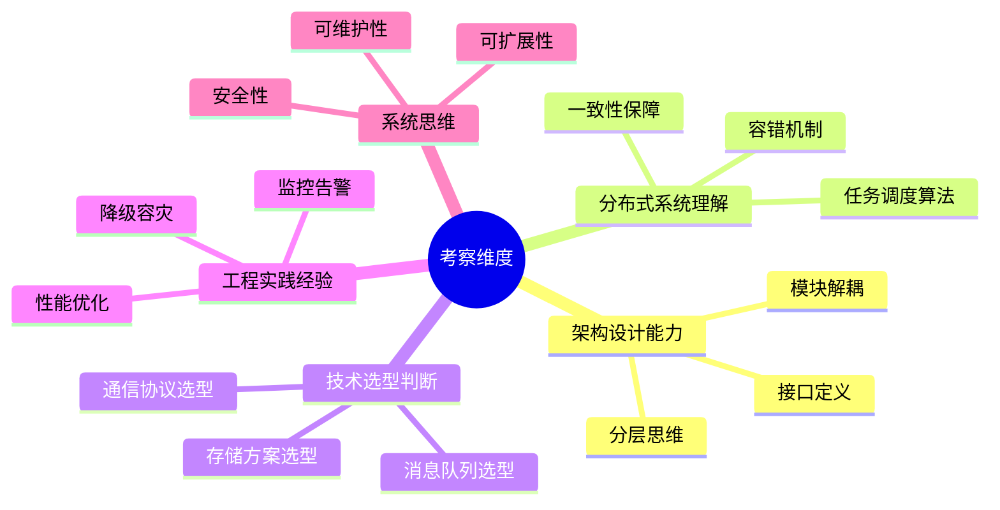

### 1.3 答题框架

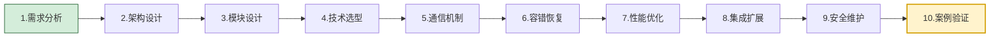

---

## 二、需求分析与设计目标

### 2.1 什么是 Agent 调度中心

**Agent 调度中心(Scheduling Center)** 是 Agent 平台的"**交通指挥枢纽**"——它负责将用户任务高效、公平、可靠地分配到合适的 Agent 实例上执行,并全程监控任务与 Agent 的状态。

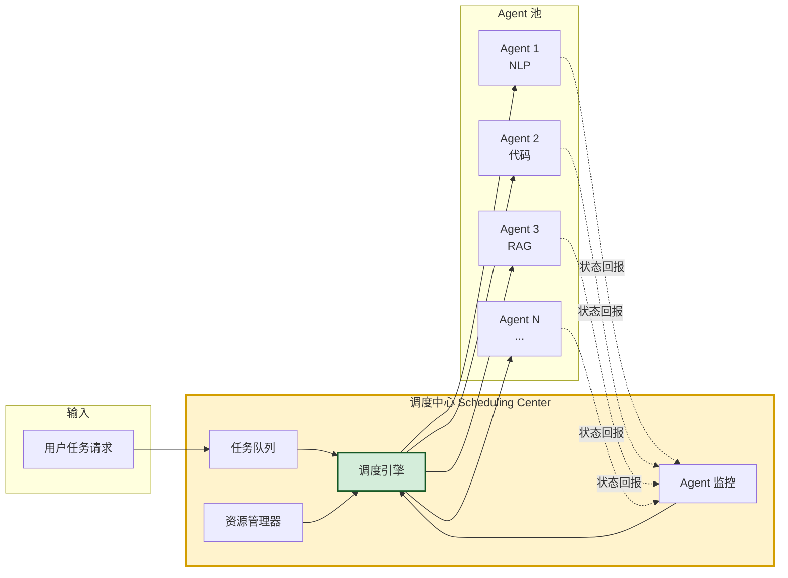

### 2.2 核心需求分析

| 需求类别 | 具体需求 | 量化指标 |
|---------|---------|---------|
| **任务调度** | 任务排队、优先级、公平分配 | P99 调度延迟 < 100ms |
| **Agent 管理** | 注册、心跳、状态、负载监控 | 心跳 3s,故障检测 < 10s |
| **资源分配** | CPU/GPU/内存智能分配 | 资源利用率 > 70% |
| **容错恢复** | Agent 故障转移、任务重试 | 故障恢复 < 30s,零任务丢失 |
| **可扩展** | Agent 动态扩缩容 | 秒级扩容,水平无上限 |
| **高可用** | 调度中心自身高可用 | 99.99% 可用性 |
| **可观测** | 全链路追踪、监控告警 | 100% 任务可追溯 |

### 2.3 设计目标

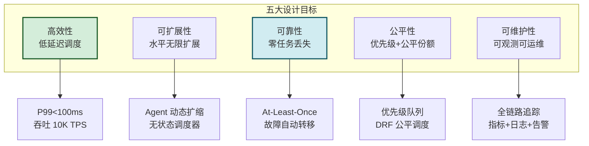

### 2.4 与通用任务调度的区别

| 维度 | 通用任务调度(K8s/Yarn) | Agent 调度中心 | 差异本质 |
|------|----------------------|---------------|---------|
| **任务特征** | 短任务、无状态 | 长会话、有状态 | Agent 需保持上下文 |
| **资源粒度** | CPU/内存 | CPU/GPU/Token/并发数 | 含 LLM 调用配额 |
| **调度依据** | 资源够即可 | 能力匹配+负载+亲和性 | 需匹配 Agent 技能 |
| **任务时长** | 秒~分钟 | 秒~小时 | 需长连接保活 |
| **故障影响** | 重启即可 | 上下文丢失 | 需状态检查点 |
| **公平性** | DRF 资源公平 | 优先级+配额+公平份额 | 多租户 SLA 差异 |

---

## 三、整体架构设计

### 3.1 分层架构总览

Agent 调度中心采用**六层架构**,各层职责清晰、解耦设计:

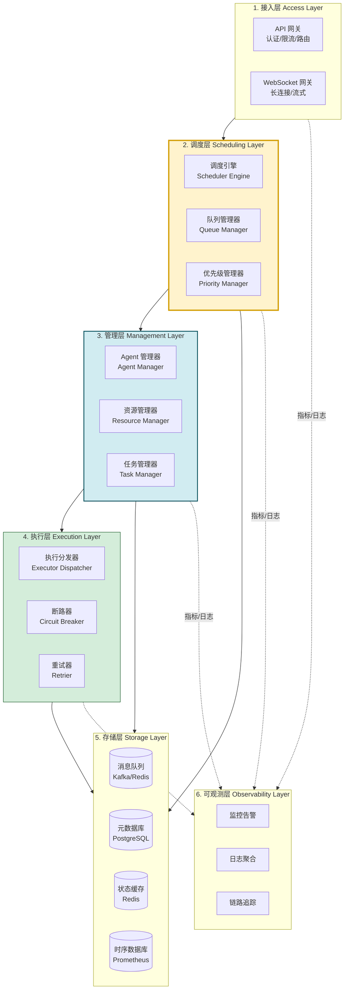

### 3.2 核心组件全景

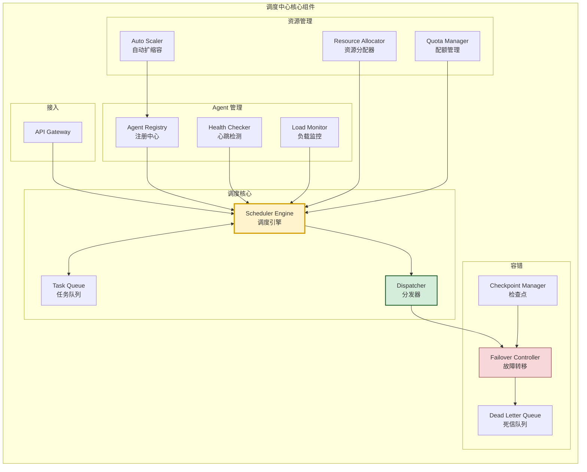

### 3.3 组件职责速查

| 组件 | 职责 | 关键能力 |
|------|------|---------|
| **Scheduler Engine** | 调度决策核心 | 匹配算法、优先级排序、负载均衡 |
| **Task Queue** | 任务排队与缓冲 | 优先级队列、延迟队列、死信队列 |
| **Dispatcher** | 任务分发执行 | Agent 选择、任务下发、结果回收 |
| **Agent Registry** | Agent 注册与发现 | 动态注册、能力声明、健康状态 |
| **Health Checker** | Agent 存活检测 | 心跳探测、故障判定、状态更新 |
| **Load Monitor** | Agent 负载监控 | CPU/GPU/内存/并发数实时采集 |
| **Resource Allocator** | 资源分配决策 | DRF 算法、亲和性、反亲和性 |
| **Quota Manager** | 多租户配额管理 | 租户限额、按量计费、熔断 |
| **Auto Scaler** | 自动扩缩容 | 负载预测、弹性伸缩 |
| **Failover Controller** | 故障转移 | Agent 故障重调度、任务迁移 |
| **Checkpoint Manager** | 状态检查点 | 上下文快照、状态恢复 |

---

## 四、核心功能模块设计

### 4.1 任务队列管理

#### 4.1.1 队列架构设计

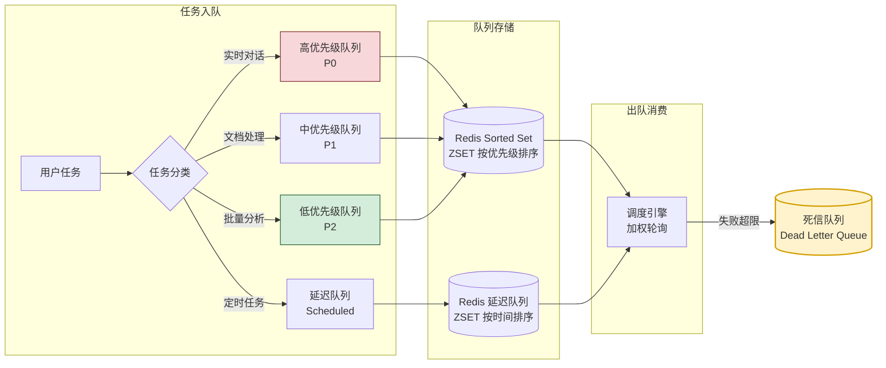

#### 4.1.2 优先级队列实现

```python
"""
基于 Redis ZSET 的优先级队列实现
ZSET 的 score 为优先级分数,值为任务 ID
"""
import redis
import json
import time
import uuid


class PriorityQueue:
    """多级优先级任务队列"""
    
    # 优先级分数设计:大值 = 高优先级
    # score = priority_base + timestamp_weight
    # priority_base: P0=1e12, P1=1e11, P2=1e10
    # timestamp_weight: 越早入队 score 越高(避免饥饿)
    
    PRIORITY_BASE = {
        "P0": 1e13,   # 实时对话,最高
        "P1": 1e12,   # 重要业务
        "P2": 1e11,   # 普通任务
        "P3": 1e10,   # 后台批量
    }
    
    def __init__(self, redis_client: redis.Redis):
        self.redis = redis_client
        self.queue_key = "agent:task:queue"
        self.task_detail_key = "agent:task:detail"  # Hash 存任务详情
    
    def enqueue(self, task: dict, priority: str = "P2") -> str:
        """任务入队"""
        task_id = task.get("task_id", str(uuid.uuid4()))
        task["task_id"] = task_id
        task["enqueued_at"] = time.time()
        task["priority"] = priority
        
        # 计算优先级分数:基础分 + 时间补偿(越早越高)
        base = self.PRIORITY_BASE.get(priority, 1e11)
        # 用 (当前时间 - 起始时间) 的倒数做时间补偿
        # 实现:score = base - timestamp(ms)
        # 这样同优先级中,早入队的 score 更高
        score = base - int(time.time() * 1000)
        
        # Pipeline 原子操作:存详情 + 入队
        pipe = self.redis.pipeline()
        pipe.hset(self.task_detail_key, task_id, json.dumps(task))
        pipe.zadd(self.queue_key, {task_id: score})
        pipe.execute()
        
        return task_id
    
    def dequeue(self, timeout: int = 5) -> dict:
        """任务出队(阻塞式,取最高优先级)"""
        # ZPOPMIN 取 score 最高(即优先级最高)的任务
        result = self.redis.bzpopmin(self.queue_key, timeout=timeout)
        if result is None:
            return None
        
        _, task_id, _ = result
        task_json = self.redis.hget(self.task_detail_key, task_id)
        if task_json:
            self.redis.hdel(self.task_detail_key, task_id)
            task = json.loads(task_json)
            task["dequeued_at"] = time.time()
            return task
        return None
    
    def peek(self, n: int = 10) -> list:
        """查看队列前 N 个任务(不出队)"""
        task_ids = self.redis.zrevrange(self.queue_key, 0, n - 1)
        tasks = []
        for tid in task_ids:
            t = self.redis.hget(self.task_detail_key, tid)
            if t:
                tasks.append(json.loads(t))
        return tasks
    
    def requeue(self, task: dict, priority: str = None) -> str:
        """任务重新入队(重试场景)"""
        retry_count = task.get("retry_count", 0) + 1
        task["retry_count"] = retry_count
        
        # 重试时降低优先级(避免反复抢占)
        if priority is None:
            if retry_count > 3:
                priority = "P3"
            elif retry_count > 1:
                priority = "P2"
        
        return self.enqueue(task, priority)
    
    def size(self) -> dict:
        """队列统计"""
        # 按优先级范围统计
        stats = {}
        for level, base in self.PRIORITY_BASE.items():
            upper = base
            lower = base - 1e12
            count = self.redis.zcount(self.queue_key, lower, upper)
            stats[level] = count
        stats["total"] = self.redis.zcard(self.queue_key)
        return stats
```

#### 4.1.3 任务状态机

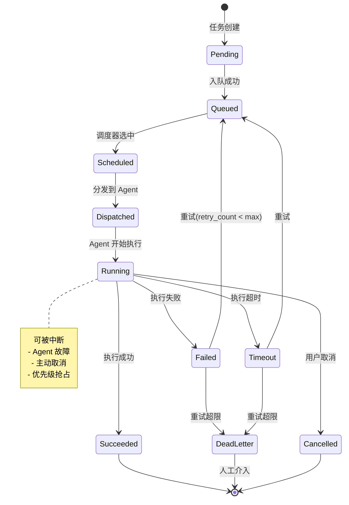

### 4.2 Agent 状态监控

#### 4.2.1 Agent 状态模型

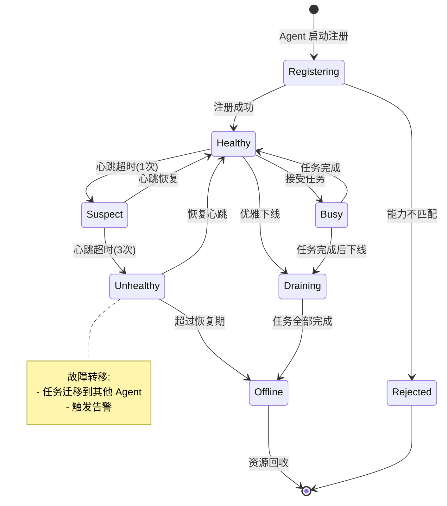

#### 4.2.2 心跳与健康检查机制

```python
"""
Agent 心跳与健康检查系统
采用两级检测:主动心跳 + 被动探测
"""
import asyncio
import time
from enum import Enum
from dataclasses import dataclass, field


class AgentState(Enum):
    HEALTHY = "healthy"        # 健康,可接收任务
    BUSY = "busy"              # 忙碌,执行中
    SUSPECT = "suspect"        # 可疑,心跳延迟
    UNHEALTHY = "unhealthy"    # 不健康,暂停调度
    DRAINING = "draining"      # 排空中,准备下线
    OFFLINE = "offline"        # 离线


@dataclass
class AgentInfo:
    """Agent 注册信息与运行时状态"""
    agent_id: str
    agent_name: str
    capabilities: list[str]       # 能力标签: ["nlp", "code", "rag"]
    endpoint: str                 # gRPC/HTTP 地址
    max_concurrent: int = 10      # 最大并发任务数
    current_load: int = 0         # 当前负载
    
    state: AgentState = AgentState.HEALTHY
    last_heartbeat: float = field(default_factory=time.time)
    heartbeat_miss_count: int = 0
    
    # 资源指标
    cpu_usage: float = 0.0
    memory_usage: float = 0.0
    gpu_usage: float = 0.0
    gpu_memory_usage: float = 0.0
    
    # 统计
    total_tasks: int = 0
    success_tasks: int = 0
    failed_tasks: int = 0
    avg_latency_ms: float = 0.0


class HealthChecker:
    """Agent 健康检查器"""
    
    def __init__(self, registry, config=None):
        self.registry = registry
        self.config = config or {
            "heartbeat_interval": 3,       # Agent 每 3s 上报心跳
            "heartbeat_timeout": 10,       # 10s 未收到 = 可疑
            "unhealthy_threshold": 3,      # 连续 3 次超时 = 不健康
            "offline_threshold": 60,       # 60s 未恢复 = 离线
            "probe_interval": 5,           # 被动探测间隔
        }
        self._running = False
    
    async def start(self):
        """启动健康检查循环"""
        self._running = True
        # 并行运行:心跳检测 + 被动探测
        await asyncio.gather(
            self._heartbeat_check_loop(),
            self._passive_probe_loop()
        )
    
    async def _heartbeat_check_loop(self):
        """主动心跳检测:检查 Agent 上报的心跳是否超时"""
        while self._running:
            now = time.time()
            agents = self.registry.list_all_agents()
            
            for agent in agents:
                if agent.state in (AgentState.OFFLINE, AgentState.DRAINING):
                    continue
                
                elapsed = now - agent.last_heartbeat
                
                if elapsed > self.config["offline_threshold"]:
                    # 超过 60s,判定离线
                    if agent.state != AgentState.OFFLINE:
                        await self._handle_offline(agent)
                        
                elif elapsed > self.config["heartbeat_timeout"]:
                    # 超过 10s,心跳超时
                    agent.heartbeat_miss_count += 1
                    if agent.heartbeat_miss_count >= self.config["unhealthy_threshold"]:
                        await self._handle_unhealthy(agent)
                    elif agent.state == AgentState.HEALTHY:
                        agent.state = AgentState.SUSPECT
                        
                else:
                    # 心跳正常
                    if agent.state in (AgentState.SUSPECT, AgentState.UNHEALTHY):
                        agent.state = AgentState.HEALTHY
                        agent.heartbeat_miss_count = 0
            
            await asyncio.sleep(1)  # 每秒检查一次
    
    async def _passive_probe_loop(self):
        """被动探测:主动 ping Agent 确认存活"""
        while self._running:
            suspects = self.registry.list_agents_by_state(AgentState.SUSPECT)
            
            for agent in suspects:
                alive = await self._probe_agent(agent)
                if not alive:
                    agent.heartbeat_miss_count += 1
                    if agent.heartbeat_miss_count >= 3:
                        await self._handle_unhealthy(agent)
                else:
                    agent.last_heartbeat = time.time()
                    agent.state = AgentState.HEALTHY
                    agent.heartbeat_miss_count = 0
            
            await asyncio.sleep(self.config["probe_interval"])
    
    async def _probe_agent(self, agent: AgentInfo) -> bool:
        """主动探测 Agent(gRPC health check)"""
        try:
            # 实际实现:gRPC HealthCheck 或 HTTP /health
            # 此处简化为连接超时判断
            return True
        except Exception:
            return False
    
    async def _handle_unhealthy(self, agent: AgentInfo):
        """处理不健康 Agent:暂停调度 + 触发故障转移"""
        agent.state = AgentState.UNHEALTHY
        # 触发故障转移:将该 Agent 上的任务迁移
        await self.registry.trigger_failover(agent.agent_id)
        # 发送告警
        await self._send_alert(agent, "Agent 不健康,已触发故障转移")
    
    async def _handle_offline(self, agent: AgentInfo):
        """处理离线 Agent"""
        agent.state = AgentState.OFFLINE
        await self.registry.trigger_failover(agent.agent_id)
        await self._send_alert(agent, "Agent 离线,任务已迁移")
    
    async def _send_alert(self, agent: AgentInfo, message: str):
        """发送告警(钉钉/Slack/邮件)"""
        alert = {
            "agent_id": agent.agent_id,
            "state": agent.state.value,
            "message": message,
            "timestamp": time.time()
        }
        # 实际:推送到告警系统
        print(f"[ALERT] {alert}")
```

#### 4.2.3 监控指标采集

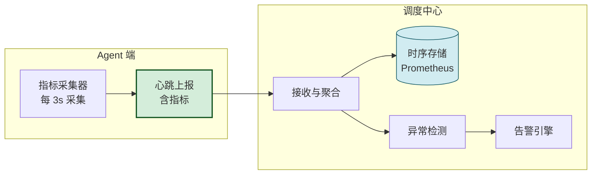

| 指标类别 | 具体指标 | 采集频率 | 告警阈值 |
|---------|---------|:--------:|---------|
| **存活** | 心跳延迟 | 3s | > 10s |
| **负载** | CPU/GPU 利用率 | 5s | > 90% 持续 1min |
| **并发** | 当前任务数 | 3s | > max_concurrent |
| **延迟** | P99 任务延迟 | 10s | > 30s |
| **错误** | 错误率 | 10s | > 5% |
| **资源** | 内存/GPU 显存 | 5s | > 95% |

### 4.3 资源分配策略

#### 4.3.1 资源模型

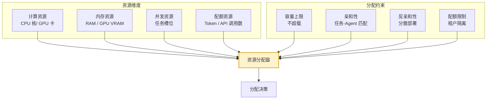

#### 4.3.2 DRF 公平调度算法

**DRF(Dominant Resource Fairness)** 是多资源公平调度的经典算法——在多个资源维度上,按"主导资源份额"公平分配:

```python
"""
DRF 主导资源公平调度算法
核心思想:每个用户的主导资源份额应尽量相等
"""
from dataclasses import dataclass


@dataclass
class Resource:
    cpu: float = 0.0       # CPU 核数
    gpu: float = 0.0       # GPU 数
    memory: float = 0.0    # 内存 GB
    vram: float = 0.0      # GPU 显存 GB


@dataclass
class AgentResource:
    """Agent 可用资源"""
    agent_id: str
    total: Resource
    used: Resource
    
    @property
    def available(self) -> Resource:
        return Resource(
            cpu=self.total.cpu - self.used.cpu,
            gpu=self.total.gpu - self.used.gpu,
            memory=self.total.memory - self.used.memory,
            vram=self.total.vram - self.used.vram,
        )


@dataclass
class TaskRequirement:
    """任务资源需求"""
    task_id: str
    requirements: Resource
    tenant_id: str
    capabilities: list[str]  # 需要的 Agent 能力


class DRFScheduler:
    """DRF 公平调度器"""
    
    def __init__(self, cluster_total: Resource):
        self.cluster_total = cluster_total  # 集群总资源
        self.tenant_usage: dict[str, Resource] = {}  # 租户已用资源
    
    def schedule(self, task: TaskRequirement, 
                 candidates: list[AgentResource]) -> str:
        """
        为任务选择最合适的 Agent
        综合考虑:DRF 公平性 + 能力匹配 + 负载均衡
        """
        # 1. 过滤:能力匹配 + 资源充足
        eligible = [
            a for a in candidates
            if self._can_satisfy(a, task)
        ]
        if not eligible:
            return None  # 无可用 Agent
        
        # 2. 计算每个候选 Agent 的得分
        scored = []
        for agent in eligible:
            score = self._compute_score(agent, task)
            scored.append((agent.agent_id, score))
        
        # 3. 选最高分
        scored.sort(key=lambda x: x[1], reverse=True)
        return scored[0][0]
    
    def _can_satisfy(self, agent: AgentResource, task: TaskRequirement) -> bool:
        """检查 Agent 是否能满足任务需求"""
        avail = agent.available
        req = task.requirements
        return (
            avail.cpu >= req.cpu and
            avail.gpu >= req.gpu and
            avail.memory >= req.memory and
            avail.vram >= req.vram
        )
    
    def _compute_score(self, agent: AgentResource, task: TaskRequirement) -> float:
        """
        计算调度得分(越高越优)
        综合三个维度:DRF 公平性 + 负载均衡 + 亲和性
        """
        # 维度 1: DRF 公平性 - 选对租户主导资源影响最小的 Agent
        drf_score = self._drf_fairness_score(task)
        
        # 维度 2: 负载均衡 - 选当前负载最低的 Agent
        load_score = self._load_balance_score(agent)
        
        # 维度 3: 资源碎片 - 选最"刚好"满足的(减少碎片)
        fragment_score = self._fragment_score(agent, task)
        
        # 加权综合
        return drf_score * 0.5 + load_score * 0.3 + fragment_score * 0.2
    
    def _drf_fairness_score(self, task: TaskRequirement) -> float:
        """DRF 公平性得分:分配后该租户的主导资源份额"""
        tenant = task.tenant_id
        current = self.tenant_usage.get(tenant, Resource())
        
        # 模拟分配后的资源使用
        after = Resource(
            cpu=current.cpu + task.requirements.cpu,
            gpu=current.gpu + task.requirements.gpu,
            memory=current.memory + task.requirements.memory,
        )
        
        # 计算各资源维度的份额(占集群总量比例)
        cpu_share = after.cpu / self.cluster_total.cpu
        gpu_share = after.gpu / self.cluster_total.gpu
        mem_share = after.memory / self.cluster_total.memory
        
        # 主导资源 = 最大份额
        dominant_share = max(cpu_share, gpu_share, mem_share)
        
        # 份额越小越公平,得分越高
        return 1.0 - dominant_share
    
    def _load_balance_score(self, agent: AgentResource) -> float:
        """负载均衡得分:当前负载越低分越高"""
        cpu_util = agent.used.cpu / agent.total.cpu
        gpu_util = agent.used.gpu / agent.total.gpu if agent.total.gpu > 0 else 0
        mem_util = agent.used.memory / agent.total.memory
        
        avg_util = (cpu_util + gpu_util + mem_util) / 3
        return 1.0 - avg_util
    
    def _fragment_score(self, agent: AgentResource, task: TaskRequirement) -> float:
        """资源碎片得分:分配后剩余资源越少越好(减少碎片)"""
        avail = agent.available
        req = task.requirements
        
        if avail.cpu > 0:
            cpu_frag = 1 - (req.cpu / avail.cpu)
        else:
            cpu_frag = 1
        if avail.memory > 0:
            mem_frag = 1 - (req.memory / avail.memory)
        else:
            mem_frag = 1
        
        return (cpu_frag + mem_frag) / 2
```

#### 4.3.3 调度决策流程

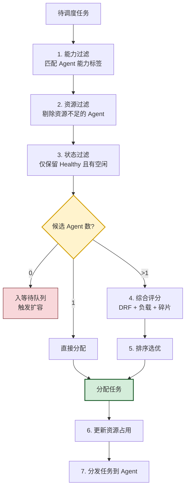

### 4.4 任务优先级处理

#### 4.4.1 优先级体系

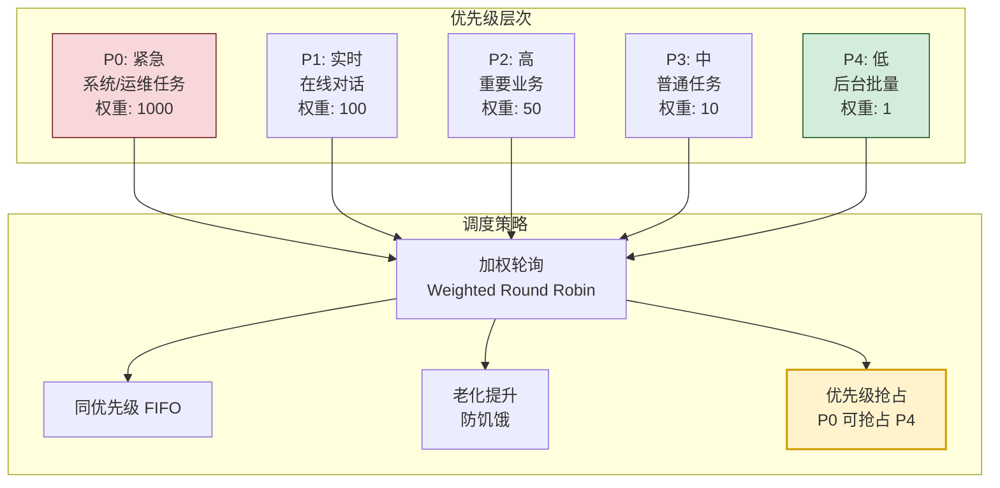

#### 4.4.2 防饥饿老化机制

```python
"""
任务老化(Aging)机制:防止低优先级任务长期饥饿
随等待时间增长,自动提升优先级
"""

class PriorityAging:
    """优先级老化提升器"""
    
    # 老化规则:每等待 N 分钟,优先级提升一级
    AGING_INTERVALS = {
        "P4": 300,    # P4 等 5 分钟升 P3
        "P3": 600,    # P3 等 10 分钟升 P2
        "P2": 1200,   # P2 等 20 分钟升 P1
        # P1/P0 不老化(已足够高)
    }
    
    PRIORITY_ORDER = ["P0", "P1", "P2", "P3", "P4"]
    
    def get_effective_priority(self, original: str, 
                                enqueued_at: float,
                                now: float) -> str:
        """计算有效优先级(考虑老化)"""
        wait_time = now - enqueued_at
        current = original
        
        for _ in range(4):  # 最多提升 4 级
            idx = self.PRIORITY_ORDER.index(current)
            if idx <= 1:  # P0/P1 不再提升
                break
            
            threshold = self.AGING_INTERVALS.get(current, float('inf'))
            if wait_time >= threshold:
                current = self.PRIORITY_ORDER[idx - 1]
                wait_time -= threshold
            else:
                break
        
        return current
```

#### 4.4.3 优先级抢占机制

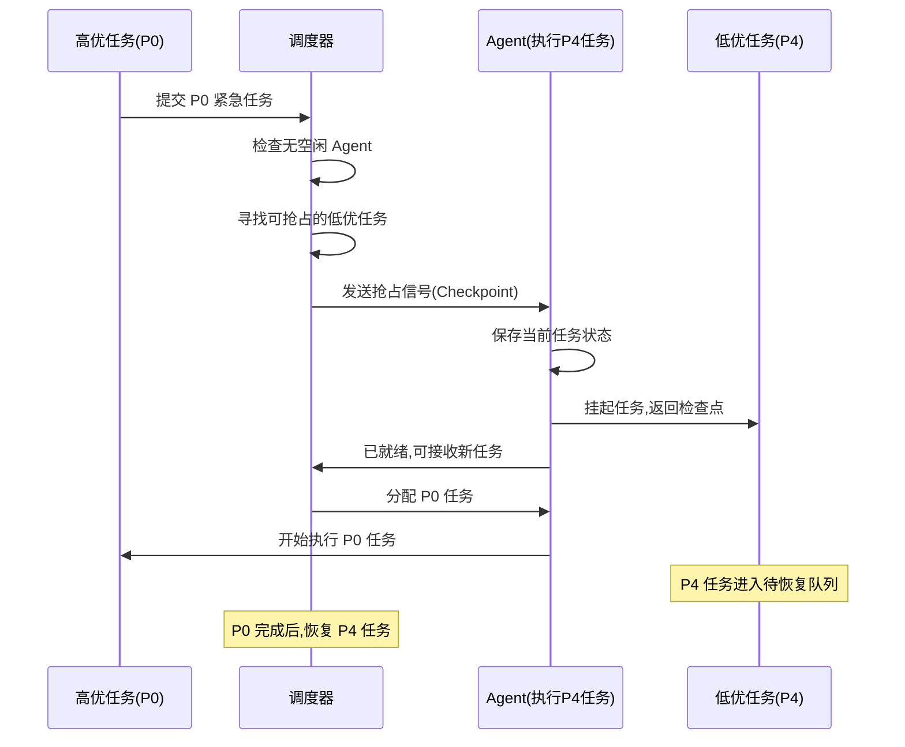

```python
class PreemptionController:
    """优先级抢占控制器"""
    
    PREEMPTION_MATRIX = {
        # 抢占者 -> 可被抢占的优先级
        "P0": ["P4", "P3", "P2"],   # P0 可抢占 P2-P4
        "P1": ["P4", "P3"],          # P1 可抢占 P3-P4
        "P2": ["P4"],                # P2 可抢占 P4
        # P3/P4 不可抢占
    }
    
    async def try_preempt(self, high_task: dict, 
                          agents: list) -> bool:
        """尝试为高优任务抢占资源"""
        preemptible = self.PREEMPTION_MATRIX.get(high_task["priority"], [])
        if not preemptible:
            return False
        
        # 寻找正在执行可被抢占任务的 Agent
        for agent in agents:
            running = agent.current_task
            if running and running["priority"] in preemptible:
                # 检查任务是否支持检查点(可恢复)
                if running.get("checkpointable", False):
                    await self._do_preempt(agent, high_task)
                    return True
        
        return False
    
    async def _do_preempt(self, agent, high_task):
        """执行抢占"""
        # 1. 通知 Agent 保存检查点
        checkpoint = await agent.checkpoint()
        
        # 2. 挂起当前任务,重新入队(保持原优先级)
        suspended = agent.current_task
        suspended["suspended_at"] = time.time()
        suspended["checkpoint"] = checkpoint
        await self.queue.requeue(suspended, suspended["priority"])
        
        # 3. 分配高优任务
        await self.dispatcher.dispatch(agent, high_task)
```

---

## 五、关键技术选型

### 5.1 技术选型总览

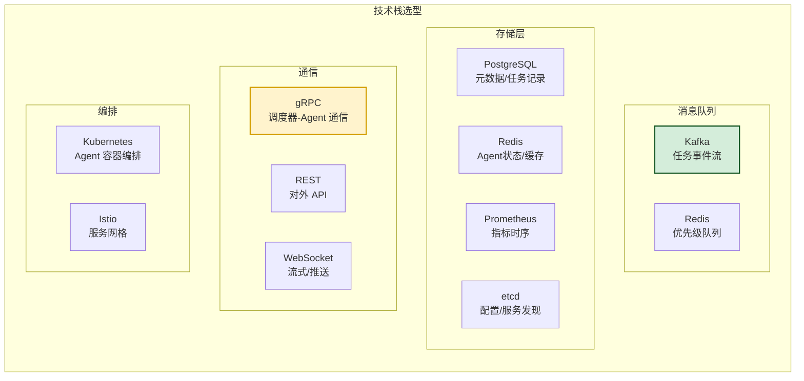

### 5.2 选型决策矩阵

| 组件 | 选型 | 备选 | 选择理由 |
|------|------|------|---------|
| **任务队列** | Redis ZSET | Kafka / RabbitMQ | 优先级队列原生支持,低延迟 |
| **事件流** | Kafka | Pulsar | 高吞吐,任务事件持久化 |
| **元数据库** | PostgreSQL | MySQL | JSON 支持、事务强 |
| **状态缓存** | Redis Cluster | Memcached | 数据结构丰富、持久化 |
| **服务发现** | etcd | Consul / Zookeeper | K8s 原生、强一致 |
| **调度通信** | gRPC | REST / Thrift | 高性能、双向流、Protobuf |
| **对外 API** | REST + WebSocket | GraphQL | 通用兼容、流式支持 |
| **指标存储** | Prometheus | InfluxDB | 云原生标准、生态好 |
| **容器编排** | Kubernetes | Nomad | 生态成熟、自动扩缩容 |
| **服务网格** | Istio | Linkerd | 流量治理、可观测 |

### 5.3 消息队列选型深度对比

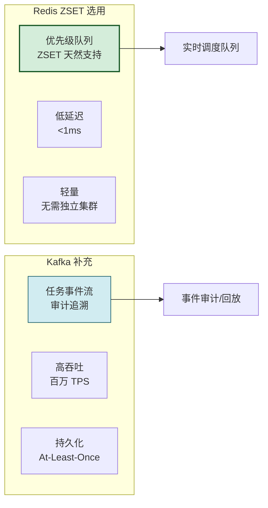

**双队列策略**:Redis ZSET 负责**实时调度**(低延迟、优先级),Kafka 负责**事件持久化**(审计、回放、分析),各取所长。

---

## 六、通信机制设计

### 6.1 通信架构总览

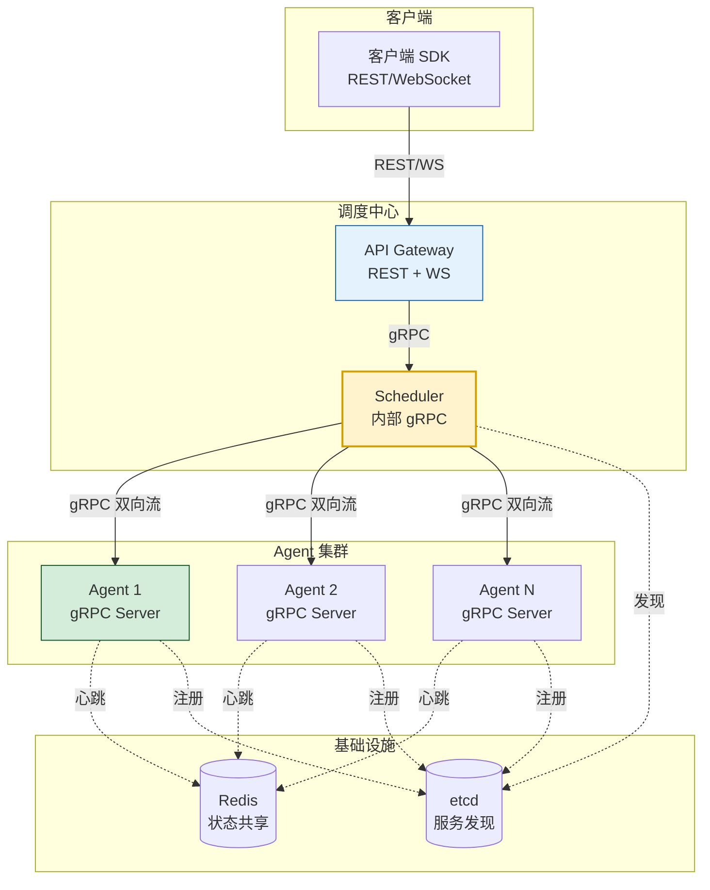

### 6.2 三层通信协议

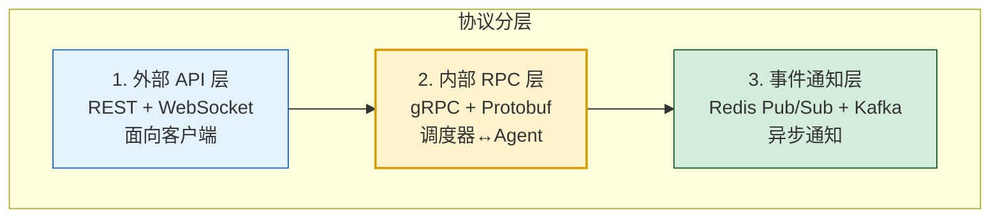

| 通信场景 | 协议 | 选型理由 |
|---------|------|---------|
| 客户端 → 调度中心 | REST + WebSocket | 通用兼容 + 流式响应 |
| 调度中心 → Agent | gRPC 双向流 | 高性能 + 双向通信 + Protobuf |
| Agent → 调度中心(心跳) | gRPC stream | 长连接复用,低开销 |
| 事件通知(任务完成) | Redis Pub/Sub | 低延迟广播 |
| 事件持久化(审计) | Kafka | 可回放、可分析 |

### 6.3 gRPC 通信设计

#### 6.3.1 Protobuf 接口定义

```protobuf
// scheduler.proto - 调度中心与 Agent 的 gRPC 接口

syntax = "proto3";

package scheduler.v1;

// === Agent 端服务:调度中心调用 Agent ===
service AgentService {
    // 执行任务(单向,Agent 异步处理)
    rpc ExecuteTask(TaskRequest) returns (TaskResponse);
    
    // 流式执行(支持中间结果推送)
    rpc ExecuteTaskStream(TaskRequest) returns (stream TaskProgress);
    
    // 健康检查
    rpc HealthCheck(HealthCheckRequest) returns (HealthCheckResponse);
    
    // 任务抢占(保存检查点并停止)
    rpc PreemptTask(PreemptRequest) returns (Checkpoint);
    
    // 获取 Agent 状态
    rpc GetStatus(StatusRequest) returns (AgentStatus);
}

// === 调度中心服务:Agent 调用调度中心 ===
service SchedulerService {
    // Agent 注册
    rpc Register(RegisterRequest) returns (RegisterResponse);
    
    // Agent 注销
    rpc Deregister(DeregisterRequest) returns (DeregisterResponse);
    
    // 心跳上报(双向流)
    rpc Heartbeat(stream HeartbeatRequest) returns (stream HeartbeatResponse);
    
    // 任务结果上报
    rpc ReportResult(TaskResult) returns (ResultAck);
}

// === 消息定义 ===
message TaskRequest {
    string task_id = 1;
    string task_type = 2;           // chat/code/rag/...
    bytes payload = 3;              // 任务参数(序列化)
    int32 priority = 4;
    int32 timeout_seconds = 5;
    map<string, string> metadata = 6;
}

message TaskProgress {
    string task_id = 1;
    ProgressType type = 2;          // STARTED/PROGRESS/PARTIAL_RESULT/COMPLETED
    bytes data = 3;
    int64 timestamp = 4;
    
    enum ProgressType {
        STARTED = 0;
        PROGRESS = 1;
        PARTIAL_RESULT = 2;
        COMPLETED = 3;
        FAILED = 4;
    }
}

message HeartbeatRequest {
    string agent_id = 1;
    int64 timestamp = 2;
    ResourceUsage usage = 3;
    int32 active_tasks = 4;
    
    message ResourceUsage {
        double cpu_usage = 1;       // 0.0-1.0
        double memory_usage = 2;
        double gpu_usage = 3;
        double gpu_memory_usage = 4;
    }
}

message AgentStatus {
    string agent_id = 1;
    State state = 2;
    int32 max_concurrent = 3;
    int32 current_tasks = 4;
    repeated string capabilities = 5;
    
    enum State {
        HEALTHY = 0;
        BUSY = 1;
        DRAINING = 2;
        UNHEALTHY = 3;
    }
}
```

#### 6.3.2 通信时序

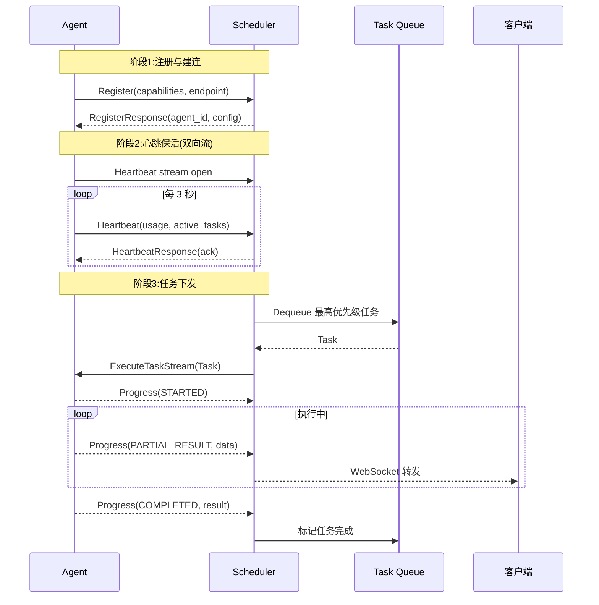

### 6.4 数据流转全过程

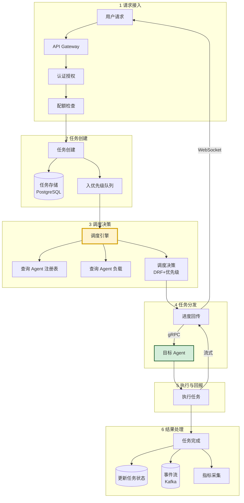

---

## 七、容错与故障恢复策略

### 7.1 故障场景全景

```mermaid
mindmap
  root((故障场景))
    Agent 故障
      进程崩溃
      网络分区
      资源耗尽
      响应超时
    调度器故障
      主节点宕机
      数据库故障
      Redis 故障
      网络中断
    任务故障
      执行异常
      超时
      死循环
      依赖不可用
    数据故障
      消息丢失
      状态不一致
      检查点损坏
```

### 7.2 Agent 故障转移

```mermaid
sequenceDiagram
    participant S as Scheduler
    participant H as Health Checker
    participant A1 as Agent1 (故障)
    participant A2 as Agent2 (备选)
    participant Q as Task Queue
    participant CK as Checkpoint Store

    Note over A1: Agent1 突然宕机
    H->>S: 检测到 Agent1 心跳超时
    S->>S: 标记 Agent1 = UNHEALTHY
    
    S->>A1: 查询运行中任务列表(本地缓存)
    Note over S: 从 Redis 获取 Agent1 的任务列表
    
    loop 每个受影响任务
        S->>CK: 加载最近检查点
        CK-->>S: Checkpoint 数据
        S->>S: 修改任务为"待恢复"<br/>增加 retry_count
        S->>Q: 重新入队(保持原优先级)
    end
    
    S->>A2: 新任务调度到 Agent2
    A2->>CK: 加载检查点恢复状态
    A2->>S: 从检查点继续执行
    
    Note over S: 如果无检查点,从头执行
    Note over H: 持续探测 Agent1
    Note over S: Agent1 恢复后重新加入
```

### 7.3 容错机制设计

#### 7.3.1 任务重试策略

```python
"""
任务重试策略:指数退避 + 最大重试 + 死信
"""
import asyncio
from dataclasses import dataclass


@dataclass
class RetryPolicy:
    max_retries: int = 3
    initial_delay: float = 1.0       # 首次重试延迟 1s
    max_delay: float = 60.0          # 最大延迟 60s
    backoff_multiplier: float = 2.0  # 指数退避倍数
    jitter: float = 0.1              # 抖动(避免重试风暴)
    
    retryable_errors: set = None     # 可重试错误类型
    
    def __post_init__(self):
        if self.retryable_errors is None:
            self.retryable_errors = {
                "TimeoutError",
                "ConnectionError",
                "AgentUnavailable",
                "ResourceExhausted",
            }
    
    def get_delay(self, retry_count: int) -> float:
        """计算第 N 次重试的延迟"""
        import random
        delay = min(
            self.initial_delay * (self.backoff_multiplier ** retry_count),
            self.max_delay
        )
        # 添加抖动
        jitter = delay * self.jitter * random.random()
        return delay + jitter
    
    def should_retry(self, error: str, retry_count: int) -> bool:
        """是否应该重试"""
        if retry_count >= self.max_retries:
            return False
        return error in self.retryable_errors


class TaskExecutor:
    """带重试的任务执行器"""
    
    def __init__(self, retry_policy: RetryPolicy, dead_letter_queue):
        self.retry_policy = retry_policy
        self.dlq = dead_letter_queue
    
    async def execute_with_retry(self, task: dict, agent) -> dict:
        """执行任务,带重试逻辑"""
        retry_count = task.get("retry_count", 0)
        
        while True:
            try:
                result = await agent.execute(task)
                return result
                
            except Exception as e:
                error_type = type(e).__name__
                
                if not self.retry_policy.should_retry(error_type, retry_count):
                    # 不可重试或超限 → 死信队列
                    task["error"] = str(e)
                    task["error_type"] = error_type
                    task["failed_at"] = time.time()
                    await self.dlq.put(task)
                    raise
                
                # 可重试:延迟后重新入队
                delay = self.retry_policy.get_delay(retry_count)
                task["retry_count"] = retry_count + 1
                task["next_retry_at"] = time.time() + delay
                
                # 放入延迟队列,到期后重新调度
                await self.delay_queue.put(task, delay)
                
                # 触发 Agent 故障转移(如果是 Agent 问题)
                if error_type in ("AgentUnavailable", "ConnectionError"):
                    await self.failover(task, agent)
                
                return None  # 重试中,非最终结果
```

#### 7.3.2 检查点(Checkpoint)机制

```mermaid
flowchart LR
    subgraph 检查点生命周期
        T[任务执行中] -->|定期| C1[保存检查点<br/>每 30s 或关键步骤]
        C1 --> CS[(检查点存储<br/>Redis/对象存储)]
        
        T -->|故障| F[Agent 故障]
        F --> R[调度到新 Agent]
        R --> L[加载最近检查点]
        L --> RES[从断点恢复执行]
    end

    style C1 fill:#d4edda,stroke:#155724,stroke-width:2px
    style F fill:#f8d7da,stroke:#721c24
    style RES fill:#d1ecf1,stroke:#0c5460
```

```python
class CheckpointManager:
    """检查点管理器:定期保存任务执行状态"""
    
    def __init__(self, storage):
        self.storage = storage  # Redis / 对象存储
        self.checkpoint_interval = 30  # 30s 保存一次
    
    async def save_checkpoint(self, task_id: str, state: dict):
        """保存检查点"""
        checkpoint = {
            "task_id": task_id,
            "state": state,           # 上下文/中间结果
            "timestamp": time.time(),
            "version": state.get("version", 0) + 1,
        }
        # 存储到 Redis(快速恢复)+ 对象存储(持久备份)
        await self.storage.redis.hset(
            "checkpoint:active", task_id, json.dumps(checkpoint)
        )
        # 异步持久化到对象存储
        asyncio.create_task(
            self.storage.object_store.put(
                f"checkpoints/{task_id}/v{checkpoint['version']}",
                json.dumps(checkpoint)
            )
        )
    
    async def load_checkpoint(self, task_id: str) -> dict:
        """加载最近检查点"""
        # 优先从 Redis 加载(快)
        data = await self.storage.redis.hget("checkpoint:active", task_id)
        if data:
            return json.loads(data)
        # Redis 无则从对象存储加载
        versions = await self.storage.object_store.list(f"checkpoints/{task_id}/")
        if versions:
            latest = sorted(versions)[-1]
            data = await self.storage.object_store.get(latest)
            return json.loads(data)
        return None  # 无检查点,从头执行
    
    async def clear_checkpoint(self, task_id: str):
        """任务完成后清理检查点"""
        await self.storage.redis.hdel("checkpoint:active", task_id)
```

### 7.3 调度器自身高可用

```mermaid
graph TB
    subgraph 调度器高可用架构
        LB[负载均衡<br/>VIP/HAProxy]
        
        subgraph 主备模式
            M[主调度器<br/>Active]
            S1[备调度器 1<br/>Standby]
            S2[备调度器 2<br/>Standby]
        end
        
        subgraph 共享状态
            ETCD[(etcd<br/>Leader 选举)]
            REDIS[(Redis<br/>队列/状态)]
            DB[(PostgreSQL<br/>任务记录)]
        end
        
        LB --> M
        M -.心跳.-> ETCD
        S1 & S2 -.监听.-> ETCD
        
        M --> REDIS & DB
        
        ETCD -.Leader 变更.-> S1
        S1 -.提升为主.-> LB
    end
    
    style M fill:#d4edda,stroke:#155724,stroke-width:2px
    style S1 fill:#fff3cd,stroke:#d39e00
    style ETCD fill:#d1ecf1,stroke:#0c5460,stroke-width:2px
```

**主备切换流程**:

```mermaid
sequenceDiagram
    participant M as 主调度器
    participant E as etcd
    participant S as 备调度器
    participant LB as 负载均衡

    Note over M: 主调度器心跳正常
    M->>E: 更新 Leader lease(每 3s)
    
    Note over M: 主调度器崩溃!
    Note over E: lease 超时(10s 未续约)
    
    E->>S: 通知 Leader 失效
    S->>E: 发起选举(CAS 抢锁)
    E-->>S: 选举成功,你成为新 Leader
    
    S->>S: 加载共享状态(Redis/DB)
    S->>S: 恢复调度循环
    S->>LB: 注册为新的主
    LB->>S: 流量切换
    
    Note over S: 恢复完成,继续调度
    Note over S: 总切换时间 < 15s
```

> **关键设计**:调度器本身**无状态**——所有状态(队列、Agent 信息、任务记录)存储在 Redis/PostgreSQL/etcd 共享存储中。主备切换时,新主从共享存储加载状态,实现秒级恢复。

---

## 八、性能优化方案

### 8.1 性能优化全景

```mermaid
mindmap
  root((性能优化))
    调度延迟
      批量调度
      本地缓存
      异步化
    吞吐量
      并行分发
      连接池
      批处理
    资源利用
      资源复用
      Agent 池化
      GPU 共享
    可扩展
      分片调度
      读多写少分离
      水平扩容
```

### 8.2 调度延迟优化

#### 8.2.1 批量调度

```python
"""
批量调度:一次取多个任务批量分配,减少队列操作次数
"""

class BatchScheduler:
    """批量调度器"""
    
    def __init__(self, batch_size: int = 10, batch_timeout: float = 0.05):
        self.batch_size = batch_size      # 每批最多 10 个任务
        self.batch_timeout = batch_timeout  # 最多等 50ms 凑批
    
    async def schedule_batch(self, queue, agents) -> list:
        """批量调度:一次性取多个任务,批量分配"""
        # 1. 批量出队
        tasks = await queue.batch_dequeue(
            max_count=self.batch_size,
            timeout=self.batch_timeout
        )
        if not tasks:
            return []
        
        # 2. 批量查询可用 Agent(缓存,避免重复查询)
        available_agents = await self._get_available_agents(agents)
        
        # 3. 批量匹配(贪心算法:按优先级排序后依次分配)
        tasks.sort(key=lambda t: t.get("priority_score", 0), reverse=True)
        
        assignments = []
        for task in tasks:
            agent = self._find_best_agent(task, available_agents)
            if agent:
                assignments.append((task, agent))
                agent.available_slots -= 1
        
        # 4. 批量分发(并行)
        results = await asyncio.gather(*[
            self._dispatch(task, agent) for task, agent in assignments
        ], return_exceptions=True)
        
        return assignments
```

#### 8.2.2 多级缓存

```mermaid
flowchart LR
    subgraph 调度器缓存层
        L1[L1: 内存缓存<br/>Agent 列表/状态<br/>TTL 1s]
        L2[L2: Redis<br/>共享状态<br/>TTL 5s]
        L3[L3: PostgreSQL<br/>持久化]
    end
    
    Q[调度查询] --> L1
    L1 -- 未命中 --> L2
    L2 -- 未命中 --> L3
    
    style L1 fill:#d4edda,stroke:#155724,stroke-width:2px
    style L2 fill:#fff3cd,stroke:#d39e00
    style L3 fill:#d1ecf1,stroke:#0c5460
```

| 缓存层 | 存储内容 | 命中延迟 | 更新策略 |
|--------|---------|:-------:|---------|
| L1 内存 | Agent 列表、状态、负载 | <0.1ms | TTL 1s + 主动失效 |
| L2 Redis | 任务队列、Agent 详情 | <1ms | 实时写入 |
| L3 PostgreSQL | 任务历史、统计 | <10ms | 事务写入 |

### 8.3 吞吐量优化

#### 8.3.1 并行分发

```python
"""
并行分发:多个任务同时下发到不同 Agent
"""
import asyncio


class ParallelDispatcher:
    """并行任务分发器"""
    
    def __init__(self, max_concurrent_dispatch: int = 100):
        self.semaphore = asyncio.Semaphore(max_concurrent_dispatch)
    
    async def dispatch_parallel(self, assignments: list):
        """并行分发多个任务"""
        async def _dispatch_one(task, agent):
            async with self.semaphore:
                return await self._dispatch(task, agent)
        
        # 并行分发所有任务
        results = await asyncio.gather(*[
            _dispatch_one(task, agent) 
            for task, agent in assignments
        ], return_exceptions=True)
        
        # 处理失败的分发
        for i, result in enumerate(results):
            if isinstance(result, Exception):
                task, agent = assignments[i]
                await self._handle_dispatch_failure(task, agent, result)
        
        return results
```

#### 8.3.2 连接池优化

```python
"""
gRPC 连接池:复用连接,避免频繁建连
"""
import grpc
from grpc.aio import Channel


class GrpcConnectionPool:
    """gRPC 连接池"""
    
    def __init__(self, max_pool_size: int = 50, idle_timeout: int = 300):
        self.max_pool_size = max_pool_size
        self.idle_timeout = idle_timeout
        self._pools: dict[str, list[Channel]] = {}  # endpoint -> channels
        self._locks: dict[str, asyncio.Lock] = {}
    
    async def get_channel(self, endpoint: str) -> Channel:
        """获取到指定 Agent 的连接"""
        if endpoint not in self._pools:
            self._pools[endpoint] = []
            self._locks[endpoint] = asyncio.Lock()
        
        async with self._locks[endpoint]:
            pool = self._pools[endpoint]
            if pool:
                return pool.pop()  # 复用空闲连接
            
            # 新建连接
            channel = grpc.aio.insecure_channel(endpoint)
            return channel
    
    async def return_channel(self, endpoint: str, channel: Channel):
        """归还连接到池"""
        async with self._locks[endpoint]:
            pool = self._pools[endpoint]
            if len(pool) < self.max_pool_size:
                pool.append(channel)
            else:
                await channel.close()
```

### 8.4 性能指标基准

| 场景 | 目标指标 | 优化手段 |
|------|---------|---------|
| 调度延迟 P99 | < 100ms | 批量调度 + L1 缓存 |
| 任务分发延迟 | < 50ms | gRPC 连接池 + 并行 |
| 调度吞吐 | 10K TPS | 分片调度 + 异步化 |
| Agent 故障检测 | < 10s | 心跳 + 被动探测 |
| 故障恢复 | < 30s | 检查点 + 自动转移 |
| 主备切换 | < 15s | etcd 选举 + 无状态 |

---

## 九、与现有 Agent 系统的集成

### 9.1 集成架构

```mermaid
graph TB
    subgraph 调度中心
        SC[Scheduler Center]
        API[集成 API 层]
    end
    
    subgraph 现有 Agent 系统
        direction TB
        
        subgraph LangChain 生态
            LC[LangChain Agent]
            LG[LangGraph Agent]
        end
        
        subgraph 其他框架
            AG[AutoGen Agent]
            CR[CrewAI Agent]
            CU[Custom Agent]
        end
        
        subgraph Agent 运行时
            OL[Ollama]
            VL[vLLM]
        end
    end
    
    subgraph 适配层
        AD1[LangChain Adapter]
        AD2[AutoGen Adapter]
        AD3[Generic Adapter]
        AD4[Runtime Adapter]
    end
    
    SC --> API
    API --> AD1 & AD2 & AD3 & AD4
    AD1 --> LC & LG
    AD2 --> AG
    AD3 --> CR & CU
    AD4 --> OL & VL

    style SC fill:#fff3cd,stroke:#d39e00,stroke-width:2px
    style API fill:#d1ecf1,stroke:#0c5460,stroke-width:2px
    style AD1 fill:#d4edda,stroke:#155724
```

### 9.2 适配器模式

```python
"""
Agent 适配器:将不同框架的 Agent 统一接入调度中心
采用适配器模式,屏蔽各框架差异
"""
from abc import ABC, abstractmethod


class AgentAdapter(ABC):
    """Agent 适配器抽象接口"""
    
    @abstractmethod
    async def execute(self, task: dict) -> dict:
        """执行任务"""
        pass
    
    @abstractmethod
    async def health_check(self) -> bool:
        """健康检查"""
        pass
    
    @abstractmethod
    def get_capabilities(self) -> list[str]:
        """获取能力标签"""
        pass
    
    @abstractmethod
    async def checkpoint(self) -> dict:
        """保存检查点"""
        pass
    
    @abstractmethod
    async def restore(self, checkpoint: dict):
        """从检查点恢复"""
        pass


class LangChainAgentAdapter(AgentAdapter):
    """LangChain Agent 适配器"""
    
    def __init__(self, agent_executor, agent_id: str):
        self.agent = agent_executor
        self.agent_id = agent_id
        self._current_state = {}
    
    async def execute(self, task: dict) -> dict:
        """执行 LangChain 任务"""
        try:
            # 将调度中心任务转为 LangChain 输入
            result = await self.agent.ainvoke({
                "input": task["prompt"],
                "chat_history": task.get("history", [])
            })
            
            return {
                "status": "success",
                "output": result["output"],
                "intermediate_steps": result.get("intermediate_steps", [])
            }
        except Exception as e:
            return {"status": "failed", "error": str(e)}
    
    async def health_check(self) -> bool:
        try:
            # 轻量健康检查
            return self.agent is not None
        except Exception:
            return False
    
    def get_capabilities(self) -> list[str]:
        # 从 Agent 配置推断能力
        caps = ["nlp", "tool_use"]
        if hasattr(self.agent, "tools"):
            for tool in self.agent.tools:
                caps.append(f"tool:{tool.name}")
        return caps
    
    async def checkpoint(self) -> dict:
        """保存 LangChain Agent 状态"""
        return {
            "agent_id": self.agent_id,
            "memory": self._serialize_memory(),
            "current_state": self._current_state,
        }
    
    async def restore(self, checkpoint: dict):
        """恢复 LangChain Agent 状态"""
        self._deserialize_memory(checkpoint.get("memory", {}))
        self._current_state = checkpoint.get("current_state", {})


class OllamaRuntimeAdapter(AgentAdapter):
    """Ollama 运行时适配器:将 Ollama 包装为可调度 Agent"""
    
    def __init__(self, ollama_url: str, model: str, agent_id: str):
        import ollama
        self.client = ollama.Client(host=ollama_url)
        self.model = model
        self.agent_id = agent_id
    
    async def execute(self, task: dict) -> dict:
        """通过 Ollama 执行推理"""
        response = self.client.chat(
            model=self.model,
            messages=task.get("messages", [
                {"role": "user", "content": task.get("prompt", "")}
            ]),
            stream=False
        )
        return {
            "status": "success",
            "output": response["message"]["content"],
            "model": self.model,
            "eval_count": response.get("eval_count", 0)
        }
    
    async def health_check(self) -> bool:
        try:
            self.client.list()
            return True
        except Exception:
            return False
    
    def get_capabilities(self) -> list[str]:
        return ["nlp", "chat", f"model:{self.model}"]
    
    async def checkpoint(self) -> dict:
        # Ollama 无状态,检查点为空(依赖外部会话管理)
        return {"agent_id": self.agent_id, "model": self.model}
    
    async def restore(self, checkpoint: dict):
        pass  # Ollama 无状态,无需恢复
```

### 9.3 集成流程

```mermaid
sequenceDiagram
    participant Dev as Agent 开发者
    participant SC as 调度中心
    participant Reg as 注册中心
    participant Adapter as Agent 适配器
    participant Agent as 实际 Agent

    Note over Dev,Agent: 阶段1: Agent 注册接入
    Dev->>Adapter: 实现 AgentAdapter 接口
    Dev->>SC: 调用注册 API
    SC->>Reg: 存储注册信息
    Reg-->>SC: 注册成功
    
    Note over SC,Agent: 阶段2: 心跳与监控
    Adapter->>SC: 定期心跳(含状态)
    SC->>Reg: 更新 Agent 状态
    
    Note over SC,Agent: 阶段3: 任务调度
    SC->>Adapter: 下发任务(execute)
    Adapter->>Agent: 转换并执行
    Agent-->>Adapter: 返回结果
    Adapter-->>SC: 标准化返回
    
    Note over SC,Agent: 阶段4: 故障恢复
    SC->>Adapter: 检测到故障
    SC->>Adapter: 请求 checkpoint
    Adapter->>Agent: 保存状态
    Agent-->>Adapter: 返回检查点
    Adapter-->>SC: 返回检查点
    Note over SC: 调度到其他 Agent 恢复
```

### 9.4 集成 SDK 示例

```python
"""
Agent SDK:开发者用此 SDK 将 Agent 接入调度中心
"""
class AgentSDK:
    """Agent 接入 SDK"""
    
    def __init__(self, scheduler_url: str, agent_id: str):
        self.scheduler_url = scheduler_url
        self.agent_id = agent_id
    
    def register(self, adapter: AgentAdapter, config: dict):
        """注册 Agent 到调度中心"""
        registration = {
            "agent_id": self.agent_id,
            "endpoint": config["endpoint"],
            "capabilities": adapter.get_capabilities(),
            "max_concurrent": config.get("max_concurrent", 10),
            "metadata": config.get("metadata", {})
        }
        # 调用调度中心注册 API
        response = requests.post(
            f"{self.scheduler_url}/api/v1/agents/register",
            json=registration
        )
        return response.json()
    
    def start_heartbeat(self, adapter: AgentAdapter):
        """启动心跳循环"""
        import threading
        
        def heartbeat_loop():
            while True:
                status = {
                    "agent_id": self.agent_id,
                    "state": "healthy",
                    "active_tasks": adapter.active_tasks,
                    "resource_usage": adapter.get_resource_usage()
                }
                requests.post(
                    f"{self.scheduler_url}/api/v1/agents/heartbeat",
                    json=status
                )
                time.sleep(3)
        
        thread = threading.Thread(target=heartbeat_loop, daemon=True)
        thread.start()


# === 开发者使用示例 ===
sdk = AgentSDK("http://scheduler:8080", agent_id="agent-001")

# 1. 创建适配器(包装现有 LangChain Agent)
adapter = LangChainAgentAdapter(
    agent_executor=my_langchain_agent,
    agent_id="agent-001"
)

# 2. 注册
sdk.register(adapter, config={
    "endpoint": "grpc://localhost:50051",
    "max_concurrent": 10
})

# 3. 启动心跳
sdk.start_heartbeat(adapter)

# Agent 现在已被调度中心管理,会自动接收任务
```

---

## 十、可扩展性设计

### 10.1 扩展性维度

```mermaid
mindmap
  root((可扩展性))
    水平扩展
      调度器分片
      Agent 动态扩容
      存储分片
    垂直扩展
      单机性能优化
      资源上限提升
    功能扩展
      插件化调度策略
      可插拔存储
      自定义适配器
    规模扩展
      多租户支持
      多区域部署
      联邦调度
```

### 10.2 调度器分片

```mermaid
graph TB
    subgraph 分片调度架构
        R[请求路由器<br/>按 tenant_id 分片]
        
        subgraph 分片组
            S1[分片 1<br/>tenant 1-1000]
            S2[分片 2<br/>tenant 1001-2000]
            S3[分片 N<br/>tenant ...]
        end
        
        subgraph 共享存储
            DB[(PostgreSQL<br/>分库)]
            MQ[(Kafka<br/>分区)]
        end
    end
    
    R --> S1 & S2 & S3
    S1 --> DB1[(DB 分片 1)]
    S2 --> DB2[(DB 分片 2)]
    S3 --> DB3[(DB 分片 N)]

    style R fill:#fff3cd,stroke:#d39e00,stroke-width:2px
    style S1 fill:#d4edda,stroke:#155724
```

**分片策略**:
- 按 `tenant_id` 哈希分片,同一租户任务在同一分片处理
- 每个分片独立调度器实例,互不干扰
- 分片可动态扩缩(一致性哈希)

### 10.3 Agent 自动扩缩容

```python
"""
基于负载的 Agent 自动扩缩容
"""
class AutoScaler:
    """Agent 自动扩缩容器"""
    
    def __init__(self, config):
        self.scale_up_threshold = config.get("scale_up_threshold", 0.8)    # 利用率>80%扩容
        self.scale_down_threshold = config.get("scale_down_threshold", 0.3)  # <30%缩容
        self.min_agents = config.get("min_agents", 2)
        self.max_agents = config.get("max_agents", 20)
        self.scale_up_cooldown = 60   # 扩容冷却 60s
        self.scale_down_cooldown = 300  # 缩容冷却 5min
    
    async def evaluate_and_scale(self, agent_pool):
        """评估负载并自动扩缩容"""
        metrics = await self._collect_metrics(agent_pool)
        
        # 计算平均利用率
        avg_cpu = sum(a.cpu_usage for a in metrics) / len(metrics)
        avg_gpu = sum(a.gpu_usage for a in metrics) / len(metrics)
        avg_util = max(avg_cpu, avg_gpu)
        
        current_count = len(agent_pool)
        
        if avg_util > self.scale_up_threshold:
            # 扩容
            target = min(current_count + 2, self.max_agents)
            if target > current_count:
                await self._scale_up(target - current_count)
        
        elif avg_util < self.scale_down_threshold:
            # 缩容(优雅:先 drain 再删除)
            target = max(current_count - 1, self.min_agents)
            if target < current_count:
                await self._scale_down(current_count - target)
    
    async def _scale_up(self, count: int):
        """扩容:启动新 Agent"""
        for _ in range(count):
            # 调用 K8s API 启动新 Pod
            await self.k8s.create_agent_pod()
    
    async def _scale_down(self, count: int):
        """缩容:优雅下线"""
        # 选择负载最低的 Agent
        candidates = sorted(agent_pool, key=lambda a: a.current_load)[:count]
        for agent in candidates:
            # 1. 标记为 DRAINING(不再接新任务)
            agent.state = AgentState.DRAINING
            # 2. 等待现有任务完成
            await self._wait_drain(agent, timeout=300)
            # 3. 注销并删除
            await self.registry.deregister(agent.agent_id)
            await self.k8s.delete_agent_pod(agent.agent_id)
```

### 10.4 插件化调度策略

```python
"""
可插拔调度策略:支持自定义调度算法
"""
from abc import ABC, abstractmethod


class SchedulingStrategy(ABC):
    """调度策略抽象接口"""
    
    @abstractmethod
    async def select_agent(self, task: dict, 
                           candidates: list) -> str:
        """选择最优 Agent"""
        pass


class DRFStrategy(SchedulingStrategy):
    """DRF 公平调度(默认)"""
    async def select_agent(self, task, candidates):
        # 见 4.3.2 节实现
        pass


class AffinityStrategy(SchedulingStrategy):
    """亲和性调度:优先分配到上次执行的 Agent"""
    async def select_agent(self, task, candidates):
        last_agent = task.get("last_agent_id")
        if last_agent and last_agent in [c.agent_id for c in candidates]:
            return last_agent
        # 回退到负载最低
        return min(candidates, key=lambda a: a.current_load).agent_id


class LocalityStrategy(SchedulingStrategy):
    """数据本地性调度:优先分配到数据所在节点"""
    async def select_agent(self, task, candidates):
        data_location = task.get("data_location")
        local_agents = [a for a in candidates if a.node == data_location]
        if local_agents:
            return local_agents[0].agent_id
        return min(candidates, key=lambda a: a.current_load).agent_id


# 策略注册表(支持运行时切换)
class StrategyRegistry:
    _strategies = {
        "drf": DRFStrategy,
        "affinity": AffinityStrategy,
        "locality": LocalityStrategy,
    }
    
    @classmethod
    def register(cls, name: str, strategy_cls):
        """注册自定义策略"""
        cls._strategies[name] = strategy_cls
    
    @classmethod
    def get(cls, name: str) -> SchedulingStrategy:
        return cls._strategies.get(name, DRFStrategy)()
```

---

## 十一、安全性设计

### 11.1 安全防护体系

```mermaid
graph TB
    subgraph 五层安全防护
        S1[1. 身份认证<br/>JWT + API Key]
        S2[2. 访问控制<br/>RBAC + ABAC]
        S3[3. 数据安全<br/>加密 + 脱敏]
        S4[4. 通信安全<br/>mTLS + gRPC]
        S5[5. 审计合规<br/>全链路审计]
    end
    
    S1 --> S2 --> S3 --> S4 --> S5

    style S1 fill:#d4edda,stroke:#155724
    style S5 fill:#d1ecf1,stroke:#0c5460
```

### 11.2 多租户隔离

```mermaid
graph TB
    subgraph 多租户隔离架构
        T1[租户 A]
        T2[租户 B]
        T3[租户 C]
        
        QUOTA[配额管理器]
        ISOLATION[资源隔离]
        AUDIT[审计日志]
    end
    
    T1 --> Q1[配额: 100 QPS<br/>Agent: 5]
    T2 --> Q2[配额: 500 QPS<br/>Agent: 20]
    T3 --> Q3[配额: 50 QPS<br/>Agent: 2]
    
    Q1 & Q2 & Q3 --> QUOTA
    QUOTA --> ISOLATION
    ISOLATION --> AUDIT

    style QUOTA fill:#fff3cd,stroke:#d39e00,stroke-width:2px
```

| 隔离维度 | 实现方式 | 说明 |
|---------|---------|------|
| **资源隔离** | 配额 + 限流 | 每租户上限,防互相影响 |
| **数据隔离** | tenant_id 过滤 | 所有查询带 tenant_id |
| **Agent 隔离** | 专用/共享池 | 高级租户专用 Agent |
| **网络隔离** | Namespace/网络策略 | K8s 网络隔离 |
| **配额隔离** | QPS/Token/并发数 | 多维度限额 |

### 11.3 通信安全

```yaml
# gRPC mTLS 双向认证配置
security:
  tls:
    enabled: true
    cert_file: /certs/server.crt
    key_file: /certs/server.key
    ca_file: /certs/ca.crt
    client_auth: require_and_verify  # 强制客户端认证
  
  # Agent 注册需携带证书
  agent_registration:
    require_certificate: true
    allowed_cn: ["agent.internal"]   # 仅允许指定 CN
```

---

## 十二、可维护性设计

### 12.1 可观测性三支柱

```mermaid
graph TB
    subgraph 可观测性
        M[Metrics 指标<br/>Prometheus + Grafana]
        L[Logs 日志<br/>ELK / Loki]
        T[Traces 追踪<br/>Jaeger / OpenTelemetry]
    end
    
    subgraph 数据源
        SCH[调度器]
        AGT[Agent]
        GW[网关]
    end
    
    SCH & AGT & GW --> M & L & T

    style M fill:#d4edda,stroke:#155724
    style T fill:#fff3cd,stroke:#d39e00,stroke-width:2px
```

### 12.2 全链路追踪

```mermaid
flowchart LR
    U[用户请求<br/>trace_id=abc] --> GW[网关<br/>span: gateway]
    GW --> SCH[调度器<br/>span: schedule]
    SCH --> Q[队列<br/>span: enqueue]
    SCH --> D[分发<br/>span: dispatch]
    D --> A[Agent<br/>span: execute]
    A --> R[结果<br/>span: result]
    
    GW -.trace_id=abc.-> SCH
    SCH -.trace_id=abc.-> D
    D -.trace_id=abc.-> A

    style U fill:#e3f2fd,stroke:#1565c0
    style A fill:#d4edda,stroke:#155724
```

```python
"""
基于 OpenTelemetry 的全链路追踪
"""
from opentelemetry import trace

tracer = trace.get_tracer("scheduler")


class TracedScheduler:
    """带追踪的调度器"""
    
    @tracer.start_as_current_span("schedule_task")
    async def schedule(self, task: dict):
        span = trace.get_current_span()
        span.set_attribute("task.id", task["task_id"])
        span.set_attribute("task.priority", task["priority"])
        span.set_attribute("task.tenant", task["tenant_id"])
        
        # 子 span:队列操作
        with tracer.start_as_current_span("dequeue"):
            task = await self.queue.dequeue()
        
        # 子 span:选择 Agent
        with tracer.start_as_current_span("select_agent"):
            agent_id = await self.strategy.select_agent(task, self.agents)
            span.set_attribute("agent.selected", agent_id)
        
        # 子 span:分发
        with tracer.start_as_current_span("dispatch"):
            await self.dispatcher.dispatch(task, agent_id)
```

### 12.3 关键监控面板

| 面板 | 关键指标 | 告警阈值 |
|------|---------|---------|
| **调度概览** | QPS、调度延迟、队列深度 | 延迟 P99 > 500ms |
| **Agent 健康** | 在线数、不健康数、负载分布 | 不健康 > 10% |
| **任务执行** | 成功率、失败率、重试率 | 失败率 > 5% |
| **资源利用** | CPU/GPU/内存利用率 | > 90% 持续 5min |
| **队列积压** | 各优先级队列长度 | P0 队列 > 100 |
| **故障恢复** | 故障次数、恢复耗时 | 恢复 > 60s |

---

## 十三、项目案例分析

### 13.1 项目背景

**场景**:某 AI 平台需为 500+ 企业客户提供 Agent 服务,日均任务量 1000 万+,需建设统一调度中心。

**挑战**:

| 挑战 | 具体问题 | 量化目标 |
|------|---------|---------|
| **规模** | 500+ 租户,1000+ Agent | 10K TPS |
| **延迟** | 实时对话需低延迟 | P99 < 200ms |
| **公平** | 多租户资源争抢 | SLA 保障 |
| **可靠** | Agent 频繁故障 | 零任务丢失 |
| **成本** | GPU 资源昂贵 | 利用率 > 70% |

### 13.2 架构落地

```mermaid
graph TB
    subgraph 生产部署架构
        LB[负载均衡<br/>HAProxy]
        
        subgraph 调度集群 3主3备
            S1[调度器 主-1]
            S2[调度器 主-2]
            S3[调度器 主-3]
        end
        
        subgraph Agent 集群
            AP1[Agent 池-GPU<br/>100 实例]
            AP2[Agent 池-CPU<br/>200 实例]
        end
        
        subgraph 存储集群
            PG[(PostgreSQL<br/>3主3从)]
            RD[(Redis Cluster<br/>6节点)]
            KF[(Kafka<br/>6节点)]
            ET[(etcd<br/>3节点)]
        end
    end
    
    LB --> S1 & S2 & S3
    S1 & S2 & S3 --> AP1 & AP2
    S1 & S2 & S3 --> PG & RD & KF & ET

    style LB fill:#fff3cd,stroke:#d39e00,stroke-width:2px
    style S1 fill:#d4edda,stroke:#155724
    style AP1 fill:#d1ecf1,stroke:#0c5460
```

### 13.3 关键决策与效果

| 决策点 | 选择 | 理由 | 效果 |
|--------|------|------|------|
| **队列** | Redis ZSET + Kafka | 优先级 + 持久化 | 调度延迟 50ms |
| **调度算法** | DRF + 亲和性 | 公平 + 性能 | 利用率 75% |
| **容错** | 检查点 + 自动转移 | 零丢失 | 故障恢复 20s |
| **扩缩容** | HPA + 自定义指标 | 弹性 | 扩容 60s 完成 |
| **通信** | gRPC 双向流 | 高性能 | 延迟 < 10ms |

### 13.4 上线效果

| 指标 | 上线前 | 上线后 | 提升 |
|------|--------|--------|------|
| 调度延迟 P99 | 2s | 80ms | 25x |
| Agent 利用率 | 40% | 75% | +87% |
| 任务丢失率 | 0.5% | 0% | 100% |
| 故障恢复 | 手动 10min | 自动 20s | 30x |
| 运维人力 | 5 人 | 1 人 | -80% |

---

## 十四、面试答题要点与技巧

### 14.1 答题框架(推荐 10 分钟回答)

```mermaid
gantt
    title 面试答题时间分配(10分钟)
    dateFormat X
    axisFormat %s秒
    
    section 需求分析 1min
    明确场景与目标          :a1, 0, 60
    
    section 架构设计 3min
    分层架构图              :a2, 60, 90
    核心组件职责            :a3, 150, 90
    
    section 关键设计 3min
    调度算法(队列+优先级)  :a4, 240, 90
    容错(故障转移)         :a5, 330, 90
    
    section 技术选型 1min
    关键技术栈与理由        :a6, 420, 60
    
    section 扩展与安全 1min
    水平扩展+安全           :a7, 480, 60
    
    section 总结 1min
    亮点+权衡               :a8, 540, 60
```

### 14.2 加分要点

| 要点 | 说明 | 体现的能力 |
|------|------|-----------|
| **画架构图** | 边讲边画分层架构 | 架构思维 |
| **量化指标** | P99 < 100ms, 10K TPS | 工程经验 |
| **权衡取舍** | "选 Redis 而非 Kafka,因为..." | 技术判断 |
| **故障思维** | 主动谈"如果 Agent 挂了..." | 容错意识 |
| **扩展思维** | "当规模增长 10 倍时..." | 前瞻设计 |
| **真实案例** | "我们在生产中遇到..." | 实战经验 |

### 14.3 常见追问与应答

| 追问问题 | 答题要点 |
|---------|---------|
| **如何保证任务不丢失?** | At-Least-Once + 检查点 + 持久化队列 + ACK 机制 |
| **如何处理 Agent 长任务?** | 检查点定期保存 + 故障转移恢复 + 心跳保活 |
| **如何实现公平调度?** | DRF 算法 + 老化防饥饿 + 多租户配额 |
| **调度器单点怎么办?** | 主备 + etcd 选举 + 无状态 + 共享存储 |
| **如何降低调度延迟?** | 批量调度 + 多级缓存 + 本地决策 + 异步化 |
| **如何监控?** | Metrics + Logging + Tracing 三支柱 |
| **如何扩容?** | 调度器分片 + Agent HPA + 存储分片 |

### 14.4 避坑提醒

```mermaid
mindmap
  root((面试避坑))
    不要过度设计
      先满足核心需求
      再谈扩展优化
    不要空谈理论
      必须有量化指标
      必须有具体方案
    不要忽略容错
      主动谈故障场景
      给出恢复方案
    不要忽视成本
      考虑资源利用率
      考虑运维复杂度
```

---

## 十五、总结与展望

### 15.1 核心设计总结

```mermaid
mindmap
  root((Agent 调度中心))
    架构设计
      六层分层架构
      无状态调度器
      主备高可用
    核心模块
      优先级队列
      Agent 状态监控
      DRF 资源分配
      优先级抢占
    技术选型
      Redis ZSET 队列
      gRPC 通信
      etcd 服务发现
      K8s 编排
    容错策略
      心跳+被动探测
      检查点恢复
      自动故障转移
      死信队列
    扩展性
      调度器分片
      Agent 自动扩缩
      插件化策略
    安全性
      多租户隔离
      mTLS 通信
      全链路审计
```

### 15.2 关键设计哲学

| 哲学 | 体现 | 价值 |
|------|------|------|
| **无状态优先** | 调度器无状态,状态存共享存储 | 易扩展、易恢复 |
| **故障即常态** | 假设 Agent 随时会挂,设计自动恢复 | 高可靠 |
| **公平与效率并重** | DRF 公平 + 优先级抢占 | 多租户 SLA |
| **可观测先行** | Metrics + Logs + Traces | 可运维 |
| **渐进扩展** | 单机 → 分片 → 联邦 | 按需演进 |

### 15.3 与文档 176 的关系

```mermaid
flowchart LR
    D176[文档176<br/>百万级平台架构<br/>整体设计] --> D177[本文<br/>调度中心<br/>深度设计]
    D177 --> D178[后续<br/>Agent 监控<br/>专项设计]
    
    D176 -.提供上下文.-> D177
    D177 -.调度子系统.-> D178

    style D176 fill:#e3f2fd,stroke:#1565c0
    style D177 fill:#d4edda,stroke:#155724,stroke-width:2px
    style D178 fill:#fff3cd,stroke:#d39e00
```

- **[176百万级Agent平台架构设计](./176百万级Agent平台架构设计面试题详解.md)**:平台**整体架构**——接入层、业务层、AI 核心、存储层
- **本文(177 调度中心)**:调度中心**子系统深度**——队列、调度、监控、容错、扩展
- 两文互补:176 提供"全局视角",177 提供"调度子系统深度"

### 15.4 后续演进方向

1. **智能调度**:引入 ML 预测任务负载与 Agent 性能,实现预测性调度
2. **联邦调度**:跨集群/跨区域调度,支持混合云
3. **Serverless Agent**:Agent 按需启动,极致弹性
4. **多模态调度**:支持文本/图像/音视频 Agent 的统一调度
5. **成本优化**:基于 Spot 实例 + 预留容量的混合调度,降低 GPU 成本

---

> **文档结语**:Agent 调度中心是 Agent 平台的"**中枢神经**"——它决定了任务能否高效、公平、可靠地分配到合适的 Agent。本文从**架构设计、核心模块(队列/监控/资源/优先级)、技术选型、通信机制、容错恢复、性能优化、系统集成、扩展安全**九大维度,提供了完整的面试级与工程级设计方案。**核心设计哲学**是"**无状态调度器 + 有状态共享存储 + 故障即常态 + 公平与效率并重**"。
>
> **面试核心要点**:① 分层架构(接入-调度-管理-执行-存储-可观测);② 优先级队列(防饥饿老化 + 优先级抢占);③ DRF 公平调度;④ 心跳+检查点的故障恢复;⑤ 调度器分片 + Agent HPA 的水平扩展;⑥ gRPC 通信 + 适配器模式集成现有 Agent。
>
> **与 [176百万级Agent平台架构设计](./176百万级Agent平台架构设计面试题详解.md) 搭配阅读**,前者提供平台整体架构视角,本文提供调度子系统深度设计——两者结合,覆盖"平台架构 → 调度核心"的完整知识体系,为高级 Agent 架构师面试与工程落地提供全面参考。
