# 安全可靠的 Agent 沙箱执行环境设计面试题详解

> **文档定位**:本文档是 `14高级 Agent 面试题` 系列的**系统设计面试题详解**,聚焦"如何设计并实现一个安全可靠的 Agent 沙箱执行环境"。从面试官视角出发,涵盖问题背景、需求分析、技术选型、架构设计、核心模块、安全机制、测试验证、项目实战等完整内容,帮助候选人系统掌握 Agent 沙箱设计的核心知识点和回答思路。
>
> **适用场景**:高级 Agent 架构师、平台架构师、安全工程师面试,以及对 Agent 安全运行环境感兴趣的开发者。

---

## 目录

- [一、面试题目与考察要点](#一面试题目与考察要点)
- [二、问题背景与需求分析](#二问题背景与需求分析)
- [三、技术选型与对比](#三技术选型与对比)
- [四、整体架构设计](#四整体架构设计)
- [五、核心功能模块详解](#五核心功能模块详解)
- [六、安全机制设计](#六安全机制设计)
- [七、关键代码实现](#七关键代码实现)
- [八、测试验证方法](#八测试验证方法)
- [九、项目实战案例](#九项目实战案例)
- [十、面试回答思路与加分项](#十面试回答思路与加分项)
- [十一、总结与延伸思考](#十一总结与延伸思考)

---

## 一、面试题目与考察要点

### 1.1 面试题目

> **题目**:在 Agent 平台中,Agent 需要执行用户提交的代码或调用外部工具。请设计并实现一个安全可靠的 Agent 沙箱执行环境,该沙箱环境需要具备资源隔离、权限控制、代码执行限制、安全监控等核心功能,以确保 Agent 在受控环境中运行,防止恶意代码执行或系统资源滥用。请详细说明:
>
> 1. 整体架构设计和技术选型
> 2. 资源隔离机制如何实现
> 3. 权限控制和代码执行限制如何设计
> 4. 安全监控和异常处理机制
> 5. 测试验证方案

### 1.2 考察要点

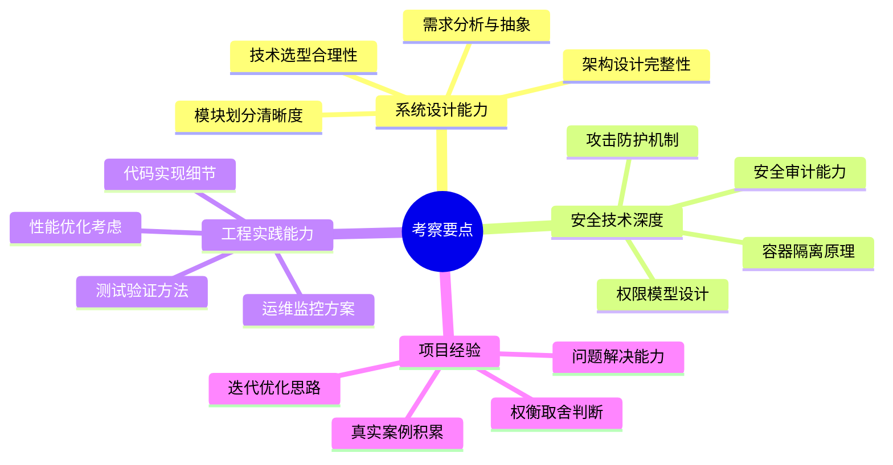

### 1.3 难度等级

| 维度 | 难度 | 说明 |
|------|:----:|------|
| **系统设计** | ⭐⭐⭐⭐⭐ | 涉及容器、网络、存储、安全多领域 |
| **技术深度** | ⭐⭐⭐⭐⭐ | 需要深入理解隔离原理和安全机制 |
| **工程实现** | ⭐⭐⭐⭐ | 需要完整代码和测试方案 |
| **综合要求** | ⭐⭐⭐⭐⭐ | 资深架构师级别题目 |

---

## 二、问题背景与需求分析

### 2.1 为什么需要沙箱

Agent 在执行任务时,经常需要执行**不可信代码**或调用**外部工具**,这些操作存在严重的安全风险:

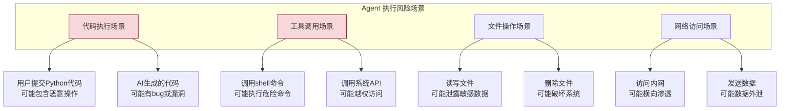

**真实事故案例**:

| 案例 | 描述 | 后果 |
|------|------|------|
| **代码注入攻击** | Agent 执行用户代码时,代码调用 `os.system("rm -rf /")` | 服务器数据全部删除 |
| **资源耗尽** | AI 生成代码进入死循环,内存无限增长 | 服务器 OOM 宕机 |
| **数据泄露** | 代码读取 `/etc/passwd` 或环境变量并发送到外部 | 敏感凭证泄露 |
| **网络渗透** | 代码扫描内网并访问其他服务 | 内网被渗透 |
| **权限提升** | 代码利用 SUID 程序提权 | 获得root权限 |

### 2.2 需求分析

#### 2.2.1 功能性需求

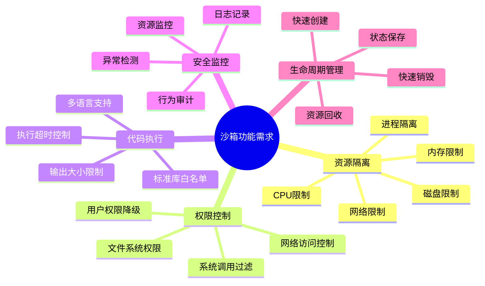

#### 2.2.2 非功能性需求

| 维度 | 指标 | 说明 |
|------|------|------|
| **启动速度** | < 500ms | 沙箱创建到可执行 |
| **执行延迟** | < 50ms 额外开销 | 相比直接执行 |
| **并发能力** | 1000+ 并发沙箱 | 单节点 |
| **资源开销** | < 50MB 内存/沙箱 | 空闲状态 |
| **安全等级** | 无法逃逸 | 即使执行恶意代码 |
| **可靠性** | 99.9% 可用 | 沙箱服务可用率 |

### 2.3 核心设计目标

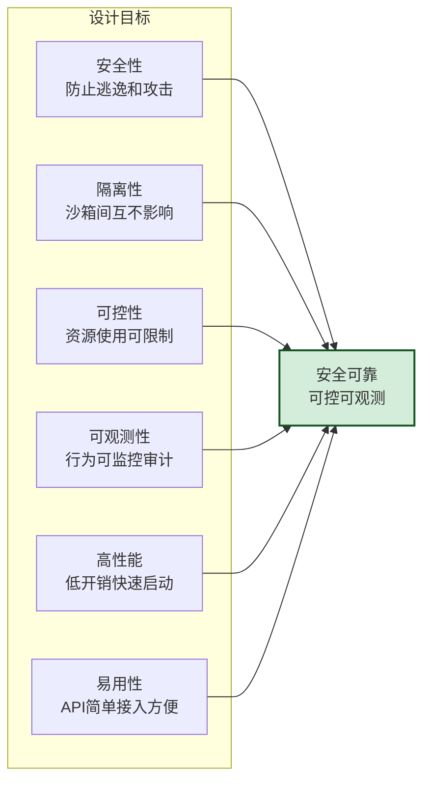

---

## 三、技术选型与对比

### 3.1 隔离技术对比

| 技术 | 隔离级别 | 启动速度 | 资源开销 | 安全性 | 适用场景 |
|------|:--------:|:--------:|:--------:|:------:|---------|
| **进程级隔离** | 低 | 极快(<1ms) | 极低 | ⭐ | 简单脚本执行 |
| **chroot** | 低 | 快 | 极低 | ⭐⭐ | 文件系统隔离 |
| **cgroups** | 中 | 快 | 低 | ⭐⭐ | 资源限制 |
| **namespace** | 中高 | 快(<10ms) | 低 | ⭐⭐⭐ | 容器基础 |
| **Docker容器** | 高 | 中(秒级) | 中 | ⭐⭐⭐⭐ | 通用隔离 |
| **Kata Containers** | 极高 | 慢(秒级) | 高 | ⭐⭐⭐⭐⭐ | 高安全场景 |
| **Firecracker** | 极高 | 快(<125ms) | 低 | ⭐⭐⭐⭐⭐ | Serverless |
| **gVisor** | 高 | 中 | 中 | ⭐⭐⭐⭐⭐ | Google沙箱 |
| **WASM** | 高 | 极快 | 极低 | ⭐⭐⭐⭐ | 轻量代码执行 |
| **真实虚拟机** | 极高 | 慢(分钟级) | 高 | ⭐⭐⭐⭐⭐ | 最高安全要求 |

### 3.2 推荐技术方案

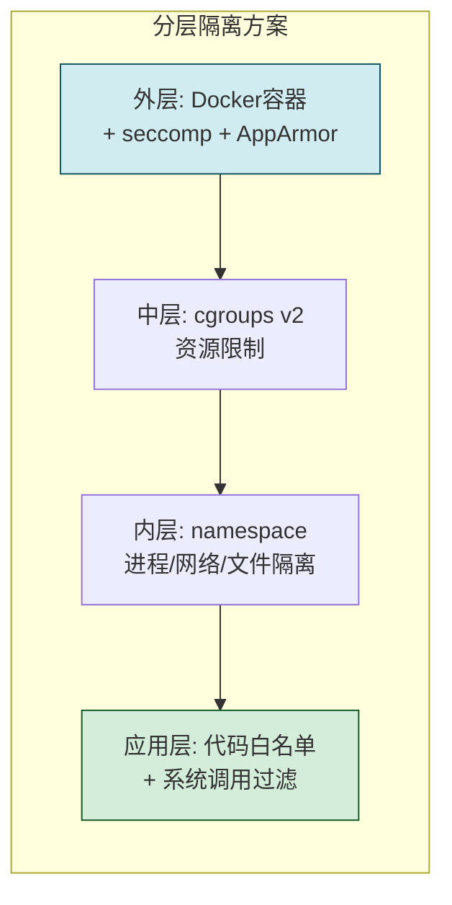

**选型理由**:

| 组件 | 选择 | 理由 |
|------|------|------|
| **容器运行时** | Docker + runc | 成熟稳定,生态完善 |
| **资源限制** | cgroups v2 | 内核原生支持,精细控制 |
| **隔离机制** | namespace | 进程/网络/挂载/用户隔离 |
| **系统调用过滤** | seccomp-bpf | 限制危险系统调用 |
| **强制访问控制** | AppArmor | 限制文件和网络访问 |
| **代码执行** | Python subprocess | 在容器内执行代码 |
| **监控方案** | Prometheus + eBPF | 实时监控和异常检测 |

### 3.3 与面试官讨论的关键点

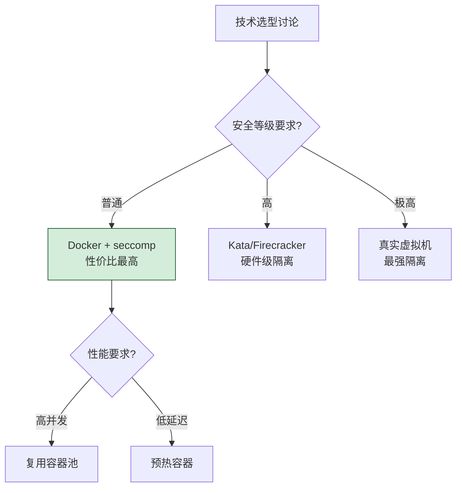

---

## 四、整体架构设计

### 4.1 系统架构总览

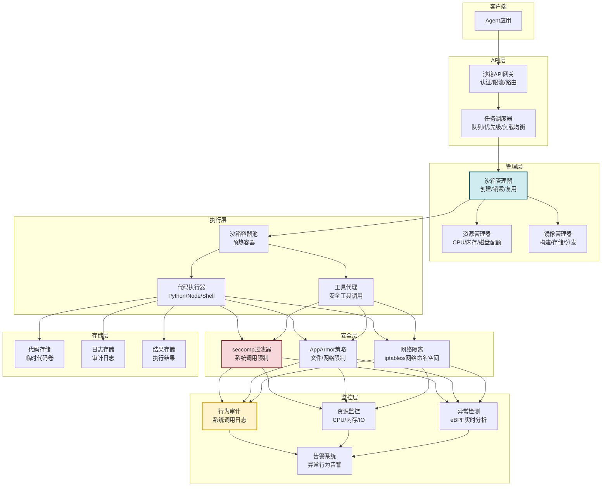

### 4.2 核心组件职责

| 组件 | 职责 | 关键技术 |
|------|------|---------|
| **API 网关** | 接收请求,认证授权,限流路由 | FastAPI + JWT |
| **任务调度器** | 任务队列,优先级调度,负载均衡 | Celery + Redis |
| **沙箱管理器** | 沙箱生命周期管理,容器池维护 | Docker SDK |
| **资源管理器** | CPU/内存/磁盘配额分配和监控 | cgroups v2 |
| **镜像管理器** | 基础镜像构建和版本管理 | Docker buildx |
| **代码执行器** | 在沙箱内执行代码并收集结果 | subprocess + nsenter |
| **工具代理** | 代理工具调用,过滤危险操作 | RPC + 权限校验 |
| **seccomp 过滤器** | 限制系统调用 | seccomp-bpf |
| **AppArmor 策略** | 限制文件和网络访问 | AppArmor profile |
| **行为审计** | 记录所有系统调用和行为 | eBPF + auditd |
| **异常检测** | 实时检测异常行为 | eBPF + 规则引擎 |
| **告警系统** | 异常行为告警和处置 | AlertManager |

### 4.3 数据流设计

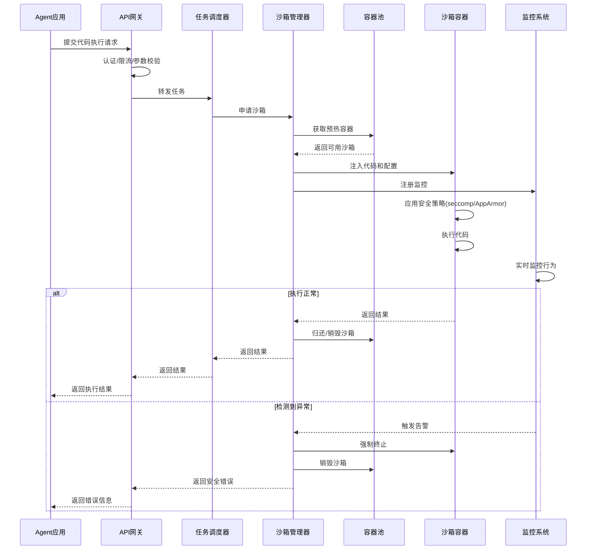

---

## 五、核心功能模块详解

### 5.1 资源隔离模块

#### 5.1.1 资源隔离架构

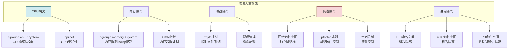

#### 5.1.2 cgroups 资源限制配置

```bash
# 创建 cgroup
mkdir -p /sys/fs/cgroup/sandbox/{sandbox_id}

# CPU 限制: 最多使用 1 个 CPU 的 50%
echo "50000 100000" > /sys/fs/cgroup/sandbox/{sandbox_id}/cpu.max

# 内存限制: 最多 512MB
echo "536870912" > /sys/fs/cgroup/sandbox/{sandbox_id}/memory.max
# 禁止 swap
echo "0" > /sys/fs/cgroup/sandbox/{sandbox_id}/memory.swap.max

# 磁盘 IO 限制: 最多 10MB/s
echo "8:0 10485760" > /sys/fs/cgroup/sandbox/{sandbox_id}/io.max

# PID 限制: 最多 100 个进程
echo "100" > /sys/fs/cgroup/sandbox/{sandbox_id}/pids.max
```

#### 5.1.3 Docker 资源限制

```python
import docker

class SandboxResourceManager:
    """沙箱资源管理器"""
    
    DEFAULT_LIMITS = {
        "cpu_quota": 50000,        # CPU配额(微秒/周期)
        "cpu_period": 100000,      # CPU周期(微秒)
        "cpus": 0.5,              # CPU核数(0.5核)
        "memory": "512m",         # 内存限制
        "memory_swap": "512m",    # Swap限制(与内存相同=禁用swap)
        "pids_limit": 100,         # 进程数限制
        "disk_quota": "100m",      # 磁盘配额
        "network_bandwidth": "1mbps",  # 网络带宽
    }
    
    def create_container_with_limits(self, image: str, 
                                      sandbox_id: str,
                                      custom_limits: dict = None):
        """创建带资源限制的容器"""
        limits = {**self.DEFAULT_LIMITS, **(custom_limits or {})}
        
        # 构建资源限制
        resources = {
            "cpu_quota": limits["cpu_quota"],
            "cpu_period": limits["cpu_period"],
            "mem_limit": limits["memory"],
            "memswap_limit": limits["memory_swap"],
            "pids_limit": limits["pids_limit"],
            "ulimits": [
                {"name": "nofile", "soft": 1024, "hard": 4096},  # 文件描述符限制
                {"name": "nproc", "soft": 50, "hard": 100},      # 进程数限制
            ]
        }
        
        # 网络配置
        network_config = self._build_network_config(sandbox_id, limits)
        
        # 存储配置
        storage_config = self._build_storage_config(sandbox_id, limits)
        
        # 创建容器
        container = self.docker_client.containers.create(
            image=image,
            name=f"sandbox-{sandbox_id}",
            resources=resources,
            network_config=network_config,
            storage_opt=storage_config,
            security_opt=[
                "no-new-privileges",           # 禁止提权
                f"apparmor=docker-sandbox",      # AppArmor策略
                "seccomp=/etc/docker/sandbox-seccomp.json"  # seccomp策略
            ],
            cap_drop=["ALL"],                    # 移除所有capabilities
            cap_add=["NONE"],                    # 不添加任何capability
            read_only=False,                     # 根文件系统可写(但有tmpfs)
            tmpfs={
                "/tmp": "size=50m,mode=1777",    # /tmp 限制50MB
                "/run": "size=10m,mode=0755"     # /run 限制10MB
            },
            user="1000:1000",                    # 非root用户运行
            working_dir="/sandbox"
        )
        
        return container
```

### 5.2 权限控制模块

#### 5.2.1 权限模型设计

```mermaid
flowchart TB
    subgraph 权限控制体系
        direction TB
        P1[用户权限<br/>运行身份降级]
        P2[文件系统权限<br/>最小可访问]
        P3[系统调用权限<br/>seccomp白名单]
        P4[网络权限<br/>出站白名单]
        P5[Capability权限<br/>全部移除]
    end

    P1 --> P11[非root用户: uid=1000]
    P1 --> P12[禁止sudo/su]
    P1 --> P13[no-new-privileges]
    
    P2 --> P21[只读根文件系统]
    P2 --> P22[/sandbox 可写]
    P2 --> P23[/tmp 临时可写]
    P2 --> P24[禁止访问/etc /var /root]
    
    P3 --> P31[白名单模式]
    P3 --> P32[禁止: ptrace/mount/reboot]
    P3 --> P33[禁止: 创建socket原始套接字]
    
    P4 --> P41[禁止访问内网]
    P4 --> P42[允许: 白名单域名]
    P4 --> P43[禁止: 监听端口]
    
    P5 --> P51[cap_drop: ALL]
    P5 --> P52[不添加任何capability]

    style P3 fill:#f8d7da,stroke:#721c24
    style P5 fill:#d4edda,stroke:#155724
```

#### 5.2.2 seccomp 安全策略

```json
{
    "defaultAction": "SCMP_ACT_ERRNO",
    "defaultErrnoRet": 1,
    "architectures": [
        "SCMP_ARCH_X86_64",
        "SCMP_ARCH_X86",
        "SCMP_ARCH_X32"
    ],
    "syscalls": [
        {
            "names": [
                "accept", "accept4", "access", "bind", "brk",
                "chmod", "chown", "clock_gettime", "clone",
                "close", "connect", "dup", "dup2", "epoll_create",
                "epoll_create1", "epoll_ctl", "epoll_wait",
                "eventfd2", "exit", "exit_group", "fadvise64",
                "fallocate", "fcntl", "fchmod", "fchown",
                "fstat", "fstatfs", "ftruncate", "futex",
                "getcwd", "getdents", "getdents64", "getegid",
                "geteuid", "getgid", "getpeername", "getpid",
                "getppid", "getrandom", "getsockname", "getsockopt",
                "getuid", "ioctl", "listen", "lseek", "lstat",
                "madvise", "mincore", "mkdir", "mmap", "mprotect",
                "mremap", "munmap", "nanosleep", "newfstatat",
                "open", "openat", "pipe", "pipe2", "poll",
                "ppoll", "prctl", "pselect6", "read", "readlink",
                "readlinkat", "readv", "recvfrom", "recvmmsg",
                "recvmsg", "rename", "renameat", "restart_syscall",
                "rmdir", "rt_sigaction", "rt_sigprocmask",
                "rt_sigreturn", "select", "sendfile",
                "sendmmsg", "sendmsg", "sendto", "set_robust_list",
                "set_tid_address", "setgid", "setgroups", "setuid",
                "sigaltstack", "socket", "socketpair", "stat",
                "statfs", "sysinfo", "tgkill", "umask", "uname",
                "unlink", "unlinkat", "utimensat", "wait4",
                "waitid", "write", "writev"
            ],
            "action": "SCMP_ACT_ALLOW"
        },
        {
            "names": [
                "ptrace", "mount", "umount2", "reboot",
                "setns", "unshare", "create_module", "init_module",
                "finit_module", "delete_module", "kexec_load",
                "iopl", "ioperm", "iopl", "swapon", "swapoff",
                "syslog", "nfsservctl", "vmsplice", "pivot_root",
                "acct", "settimeofday", "clock_settime",
                "vhangup", "pivot_root", "_sysctl", "bdflush",
                "personality", "sethostname", "setdomainname",
                "uselib", "ustat", "query_module", "get_kernel_syms",
                "afs_syscall", "getpmsg", "putpmsg", "tuxcall",
                "security", "setsid", "migrate_pages", "move_pages",
                "rt_tgsigqueueinfo", "perf_event_open", "fanotify_init",
                "name_to_handle_at", "open_by_handle_at",
                "clock_adjtime", "setns", "process_vm_readv",
                "process_vm_writev", "kcmp", "finit_module",
                "sched_setattr", "sched_getattr", "renameat2",
                "seccomp", "getrandom", "memfd_create",
                "execveat", "userfaultfd", "bpf"
            ],
            "action": "SCMP_ACT_ERRNO",
            "errnoRet": 1
        }
    ]
}
```

#### 5.2.3 AppArmor 策略

```
#include <tunables/global>

profile docker-sandbox flags=(attach_disconnected,mediate_deleted) {
    #include <abstractions/base>

    # 网络限制:只允许出站到白名单
    network inet stream,
    network inet dgram,
    deny network raw,
    deny network packet,

    # 文件系统限制
    deny /etc/* rwklx,
    deny /var/* rwklx,
    deny /root/** rwklx,
    deny /home/** rwklx,
    deny /proc/*/mem rwklx,
    deny /proc/sys/** rwklx,
    deny /sys/** rwklx,

    # 允许 /sandbox 目录
    /sandbox/** rw,
    /tmp/** rw,

    # 禁止执行系统命令
    deny /bin/* x,
    deny /usr/bin/* x,
    deny /sbin/* x,
    
    # 允许执行沙箱内解释器
    /usr/local/bin/python3 ix,
    /usr/local/bin/node ix,

    # 禁止访问设备
    deny /dev/* rwklx,
    /dev/null rw,
    /dev/zero rw,
    /dev/random r,
    /dev/urandom r,
    /dev/tty rw,
    /dev/pts/* rw,

    # 禁止 ptrace
    deny ptrace,
}
```

### 5.3 代码执行限制模块

#### 5.3.1 代码执行流程

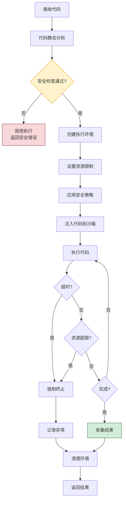

#### 5.3.2 代码静态分析

```python
import ast
import re

class CodeSecurityAnalyzer:
    """代码安全静态分析器"""
    
    # 危险模块黑名单
    DANGEROUS_MODULES = {
        "os", "sys", "subprocess", "commands",
        "pty", "shlex", "platform",
        "ctypes", "cffi",
        "multiprocessing",
        "signal",
        "socketserver",
        "asyncio.subprocess",
        "importlib",
        "builtins",
    }
    
    # 危险函数调用
    DANGEROUS_CALLS = {
        "exec", "eval", "compile",
        "__import__", "getattr", "setattr",
        "globals", "locals",
        "open",  # 受限的 open
        "input",
    }
    
    # 危险属性访问
    DANGEROUS_ATTRS = {
        "__subclasses__", "__bases__", "__mro__",
        "__class__", "__globals__", "__builtins__",
        "__code__", "__func__",
    }
    
    def analyze(self, code: str) -> dict:
        """分析代码安全性"""
        result = {
            "safe": True,
            "issues": [],
            "warnings": []
        }
        
        try:
            tree = ast.parse(code)
        except SyntaxError as e:
            return {
                "safe": False,
                "issues": [f"语法错误: {str(e)}"],
                "warnings": []
            }
        
        # 遍历AST
        for node in ast.walk(tree):
            # 检查 import
            if isinstance(node, (ast.Import, ast.ImportFrom)):
                self._check_import(node, result)
            
            # 检查函数调用
            elif isinstance(node, ast.Call):
                self._check_call(node, result)
            
            # 检查属性访问
            elif isinstance(node, ast.Attribute):
                self._check_attribute(node, result)
        
        # 正则检查危险字符串
        self._check_dangerous_strings(code, result)
        
        return result
    
    def _check_import(self, node, result):
        """检查 import 语句"""
        if isinstance(node, ast.Import):
            for alias in node.names:
                if alias.name in self.DANGEROUS_MODULES:
                    result["safe"] = False
                    result["issues"].append(f"禁止导入模块: {alias.name}")
        elif isinstance(node, ast.ImportFrom):
            if node.module in self.DANGEROUS_MODULES:
                result["safe"] = False
                result["issues"].append(f"禁止从模块导入: {node.module}")
    
    def _check_call(self, node, result):
        """检查函数调用"""
        if isinstance(node.func, ast.Name):
            if node.func.id in self.DANGEROUS_CALLS:
                result["safe"] = False
                result["issues"].append(f"禁止调用函数: {node.func.id}")
    
    def _check_attribute(self, node, result):
        """检查属性访问"""
        if node.attr in self.DANGEROUS_ATTRS:
            result["warnings"].append(f"访问敏感属性: {node.attr}")
    
    def _check_dangerous_strings(self, code: str, result):
        """检查危险字符串模式"""
        patterns = [
            (r"__\w+__", "访问 dunder 属性"),
            (r"\beval\s*\(", "调用 eval"),
            (r"\bexec\s*\(", "调用 exec"),
            (r"subprocess\.", "使用 subprocess"),
            (r"os\.system", "调用 os.system"),
        ]
        
        for pattern, desc in patterns:
            if re.search(pattern, code):
                result["safe"] = False
                result["issues"].append(f"检测到危险模式: {desc}")
```

#### 5.3.3 代码执行器

```python
import asyncio
import subprocess
import json
import signal
from typing import Optional

class CodeExecutor:
    """沙箱代码执行器"""
    
    def __init__(self, sandbox_manager, monitor):
        self.sandbox = sandbox_manager
        self.monitor = monitor
    
    async def execute(self, 
                      code: str, 
                      language: str = "python",
                      timeout: int = 30,
                      memory_limit: str = "512m",
                      cpu_limit: float = 0.5,
                      stdin: str = "") -> dict:
        """在沙箱中执行代码"""
        
        # 1. 安全分析
        analyzer = CodeSecurityAnalyzer()
        analysis = analyzer.analyze(code)
        if not analysis["safe"]:
            return {
                "success": False,
                "error": "代码安全检查未通过",
                "details": analysis["issues"]
            }
        
        # 2. 创建沙箱
        sandbox = await self.sandbox.create(
            memory=memory_limit,
            cpus=cpu_limit,
            timeout=timeout
        )
        
        try:
            # 3. 注入代码
            await self.sandbox.inject_code(sandbox, code, language)
            
            # 4. 执行并监控
            result = await self._execute_with_monitoring(
                sandbox, language, stdin, timeout
            )
            
            return result
            
        finally:
            # 5. 清理沙箱
            await self.sandbox.destroy(sandbox)
    
    async def _execute_with_monitoring(self, sandbox, language, 
                                       stdin, timeout) -> dict:
        """执行代码并监控"""
        start_time = asyncio.get_event_loop().time()
        
        # 启动执行
        process = await asyncio.create_subprocess_exec(
            "docker", "exec", "-i",
            sandbox.container_id,
            self._get_command(language),
            stdin=subprocess.PIPE,
            stdout=subprocess.PIPE,
            stderr=subprocess.PIPE
        )
        
        # 启动监控任务
        monitor_task = asyncio.create_task(
            self._monitor_sandbox(sandbox, process, timeout)
        )
        
        try:
            # 等待执行完成或超时
            stdout, stderr = await asyncio.wait_for(
                process.communicate(input=stdin.encode()),
                timeout=timeout
            )
            
            # 取消监控
            monitor_task.cancel()
            
            duration = asyncio.get_event_loop().time() - start_time
            
            return {
                "success": process.returncode == 0,
                "stdout": stdout.decode()[:1024*1024],  # 限制1MB
                "stderr": stderr.decode()[:1024*1024],
                "exit_code": process.returncode,
                "duration": duration,
                "resource_usage": await self._get_resource_usage(sandbox)
            }
            
        except asyncio.TimeoutError:
            # 超时终止
            process.kill()
            await process.wait()
            monitor_task.cancel()
            
            return {
                "success": False,
                "error": f"执行超时({timeout}秒)",
                "stdout": "",
                "stderr": "TIMEOUT",
                "exit_code": -1,
                "duration": timeout
            }
    
    async def _monitor_sandbox(self, sandbox, process, timeout):
        """监控沙箱资源使用"""
        while not process.returncode:
            try:
                stats = await self.sandbox.get_stats(sandbox)
                
                # 检查内存使用
                mem_usage = stats.get("memory_usage", 0)
                if mem_usage > 512 * 1024 * 1024:  # 512MB
                    await self.monitor.alert(
                        sandbox, "memory_exceeded", mem_usage
                    )
                    process.kill()
                    break
                
                # 检查CPU使用
                cpu_usage = stats.get("cpu_usage", 0)
                if cpu_usage > 80:  # 80%
                    await self.monitor.alert(
                        sandbox, "cpu_high", cpu_usage
                    )
                
                await asyncio.sleep(0.5)
                
            except asyncio.CancelledError:
                break
    
    def _get_command(self, language: str) -> list:
        """获取执行命令"""
        commands = {
            "python": ["python3", "-u", "/sandbox/main.py"],
            "node": ["node", "/sandbox/main.js"],
            "shell": ["/bin/sh", "/sandbox/main.sh"],
        }
        return commands.get(language, commands["python"])
```

### 5.4 安全监控模块

#### 5.4.1 监控架构

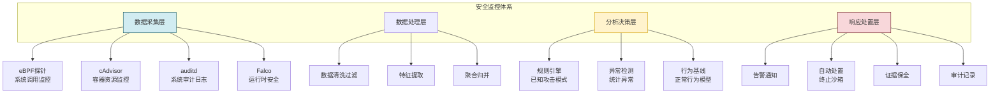

#### 5.4.2 eBPF 监控实现

```python
import subprocess
import json
from collections import defaultdict

class EBPFMonitor:
    """eBPF 安全监控器"""
    
    # 危险系统调用
    DANGEROUS_SYSCALLS = {
        "ptrace", "mount", "umount2", "reboot",
        "setns", "unshare", "create_module",
        "init_module", "finit_module", "bpf",
        "perf_event_open", "process_vm_readv"
    }
    
    # 敏感文件路径
    SENSITIVE_PATHS = {
        "/etc/passwd", "/etc/shadow", "/etc/sudoers",
        "/root/.ssh", "/home/*/.ssh",
        "/proc/*/environ", "/proc/*/mem",
        "/var/log/*", "/var/run/docker.sock"
    }
    
    def __init__(self):
        self.events = defaultdict(list)
        self.alerts = []
    
    def start_monitoring(self, sandbox_id: str):
        """启动沙箱监控"""
        # 加载 eBPF 程序
        bpf_program = """
        # 监控危险系统调用
        tracepoint:raw_syscalls:sys_enter
        /@sandbox_id == {sandbox_id}/
        {{
            @syscalls[args.id] count();
            if (args.id in @dangerous_syscalls) {{
                printf("DANGEROUS_SYSCALL sandbox_id={sandbox_id} "
                       "syscall=%d pid=%d\\n", 
                       args.id, pid);
            }}
        }}
        
        # 监控文件访问
        tracepoint:syscalls:sys_enter_openat
        /@sandbox_id == {sandbox_id}/
        {{
            $filename = str(args.filename);
            if ($filename strcontains("/etc/") || 
                $filename strcontains("/root/") ||
                $filename strcontains("/proc/") ||
                $filename strcontains("/var/run/docker.sock")) {{
                printf("SENSITIVE_FILE_ACCESS sandbox_id={sandbox_id} "
                       "file=%s pid=%d\\n", $filename, pid);
            }}
        }}
        
        # 监控网络连接
        tracepoint:syscalls:sys_enter_connect
        /@sandbox_id == {sandbox_id}/
        {{
            $addr = ntop(args.uservaddr);
            printf("NETWORK_CONNECT sandbox_id={sandbox_id} "
                   "addr=%s pid=%d\\n", $addr, pid);
        }}
        """.format(sandbox_id=sandbox_id)
        
        # 启动 bpftrace
        self.process = subprocess.Popen(
            ["bpftrace", "-e", bpf_program, "-o", "json"],
            stdout=subprocess.PIPE,
            stderr=subprocess.PIPE
        )
        
        # 启动事件处理
        asyncio.create_task(self._process_events())
    
    async def _process_events(self):
        """处理监控事件"""
        for line in self.process.stdout:
            try:
                event = json.loads(line)
                await self._handle_event(event)
            except json.JSONDecodeError:
                continue
    
    async def _handle_event(self, event: dict):
        """处理单个事件"""
        event_type = event.get("type")
        
        if event_type == "DANGEROUS_SYSCALL":
            await self._alert_dangerous_syscall(event)
        elif event_type == "SENSITIVE_FILE_ACCESS":
            await self._alert_sensitive_file(event)
        elif event_type == "NETWORK_CONNECT":
            await self._alert_network_connection(event)
    
    async def _alert_dangerous_syscall(self, event):
        """危险系统调用告警"""
        self.alerts.append({
            "level": "CRITICAL",
            "type": "dangerous_syscall",
            "sandbox_id": event["sandbox_id"],
            "syscall": event["syscall"],
            "pid": event["pid"],
            "timestamp": event["timestamp"],
            "action": "terminate_sandbox"
        })
        # 自动终止沙箱
        await self._terminate_sandbox(event["sandbox_id"])
```

#### 5.4.3 Falco 规则示例

```yaml
# falco_rules.yaml
- macro: sandbox_process
  condition: container.name startswith "sandbox-"

- rule: Sandbox Shell Spawn
  desc: 检测沙箱中启动shell
  condition: >
    sandbox_process and
    evt.type in (execve, execveat) and
    proc.name in (sh, bash, zsh, fish, dash)
  output: >
    Shell spawned in sandbox
    (sandbox=%container.name user=%user.name
    proc=%proc.name args=%proc.args)
  priority: WARNING
  tags: [sandbox, shell, mitre_execution]

- rule: Sandbox Suspicious File Access
  desc: 检测沙箱访问敏感文件
  condition: >
    sandbox_process and
    open_read and
    (fd.name in (/etc/passwd, /etc/shadow, /etc/sudoers) or
     fd.name startswith /root/.ssh or
     fd.name startswith /proc/ and
     fd.name endswith /environ)
  output: >
    Suspicious file access in sandbox
    (sandbox=%container.name file=%fd.name
    proc=%proc.name pid=%proc.pid)
  priority: CRITICAL
  tags: [sandbox, file, mitre_credential_access]

- rule: Sandbox Network Connection to Internal
  desc: 检测沙箱访问内网
  condition: >
    sandbox_process and
    fd.saddr != "127.0.0.1" and
    fd.saddr startswith "10." or
    fd.saddr startswith "192.168." or
    fd.saddr startswith "172.16."
  output: >
    Network connection to internal network
    (sandbox=%container.name dest=%fd.saddr:%fd.sport)
  priority: ERROR
  tags: [sandbox, network, lateral_movement]
```

---

## 六、安全机制设计

### 6.1 多层防御体系

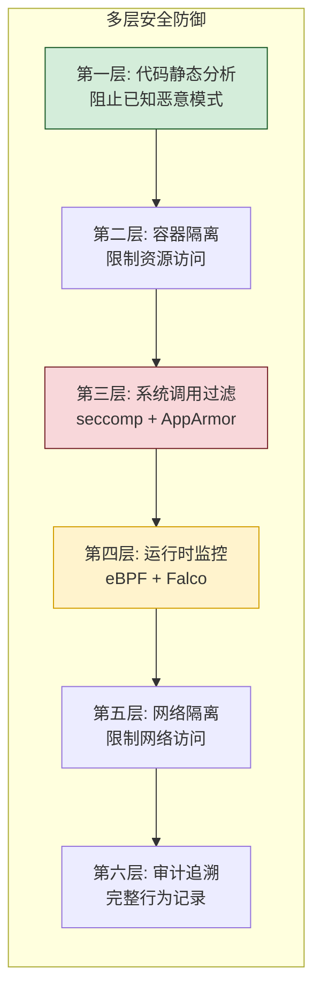

### 6.2 攻击防护矩阵

| 攻击类型 | 防护措施 | 检测方法 |
|---------|---------|---------|
| **命令注入** | 代码静态分析 + 命令白名单 | AST 分析危险调用 |
| **路径遍历** | 文件系统隔离 + chroot | 监控文件访问路径 |
| **资源耗尽** | cgroups 限制 + 超时 | 监控 CPU/内存 |
| **权限提升** | no-new-privileges + cap_drop | 监控特权操作 |
| **容器逃逸** | seccomp + AppArmor + namespace | 监控危险系统调用 |
| **数据泄露** | 网络隔离 + 出站白名单 | 监控网络连接 |
| **侧信道攻击** | CPU 隔离 + 独立内核 | 监控资源异常 |
| **供应链攻击** | 镜像签名 + 漏洞扫描 | 镜像安全扫描 |

### 6.3 网络隔离设计

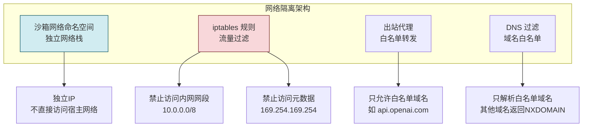

```python
class NetworkIsolator:
    """网络隔离器"""
    
    WHITELISTED_DOMAINS = {
        "api.openai.com",
        "api.anthropic.com",
        "pypi.org",
        "files.pythonhosted.org",
    }
    
    BLOCKED_RANGES = [
        "10.0.0.0/8",      # 内网
        "172.16.0.0/12",   # Docker网络
        "192.168.0.0/16",  # 内网
        "169.254.169.254", # 云元数据
        "127.0.0.0/8",     # 本地回环
    ]
    
    def setup_network(self, sandbox_id: str):
        """为沙箱设置网络隔离"""
        network_name = f"sandbox-net-{sandbox_id}"
        
        # 1. 创建独立网络
        subprocess.run([
            "docker", "network", "create",
            "--driver", "bridge",
            "--internal",  # 内部网络,默认不连接外网
            "--subnet", "172.28.0.0/16",
            network_name
        ])
        
        # 2. 创建出站代理容器(白名单转发)
        proxy_container = self._create_proxy(network_name, sandbox_id)
        
        # 3. 配置 iptables 规则
        self._setup_iptables(sandbox_id, proxy_container)
        
        return network_name
    
    def _create_proxy(self, network_name, sandbox_id):
        """创建出站代理(只允许白名单)"""
        return subprocess.run([
            "docker", "run", "-d",
            "--name", f"proxy-{sandbox_id}",
            "--network", network_name,
            "-e", "WHITELISTED_DOMAINS=" + 
                  ",".join(self.WHITELISTED_DOMAINS),
            "sandbox-proxy:latest"
        ])
    
    def _setup_iptables(self, sandbox_id, proxy_container):
        """配置 iptables 规则"""
        for cidr in self.BLOCKED_RANGES:
            subprocess.run([
                "iptables", "-A", f"SANDBOX-{sandbox_id}",
                "-d", cidr, "-j", "DROP"
            ])
```

---

## 七、关键代码实现

### 7.1 沙箱管理器完整实现

```python
import docker
import asyncio
from typing import Optional, Dict, Any
import uuid
import time

class Sandbox:
    """沙箱实例"""
    
    def __init__(self, sandbox_id: str, container, 
                 created_at: float, config: dict):
        self.id = sandbox_id
        self.container = container
        self.created_at = created_at
        self.config = config
        self.status = "created"
    
    async def start(self):
        await self.container.start()
        self.status = "running"
    
    async def stop(self):
        await self.container.stop(timeout=5)
        self.status = "stopped"
    
    async def remove(self):
        await self.container.remove(force=True)
        self.status = "removed"
    
    async def get_stats(self) -> dict:
        stats = await self.container.stats(stream=False)
        return self._parse_stats(stats)
    
    def _parse_stats(self, raw_stats: dict) -> dict:
        """解析容器资源使用统计"""
        cpu_delta = (raw_stats["cpu_stats"]["cpu_usage"]["total_usage"] -
                     raw_stats["precpu_stats"]["cpu_usage"]["total_usage"])
        system_delta = (raw_stats["cpu_stats"]["system_cpu_usage"] -
                        raw_stats["precpu_stats"]["system_cpu_usage"])
        
        cpu_percent = (cpu_delta / system_delta * 
                       len(raw_stats["cpu_stats"]["cpu_usage"].get("percpu_usage", [1])) 
                       * 100) if system_delta > 0 else 0
        
        mem_usage = raw_stats["memory_stats"]["usage"]
        mem_limit = raw_stats["memory_stats"]["limit"]
        
        return {
            "cpu_percent": cpu_percent,
            "memory_usage": mem_usage,
            "memory_limit": mem_limit,
            "memory_percent": (mem_usage / mem_limit * 100) if mem_limit > 0 else 0,
            "network_rx": raw_stats.get("networks", {}).get("rx_bytes", 0),
            "network_tx": raw_stats.get("networks", {}).get("tx_bytes", 0),
        }


class SandboxManager:
    """沙箱管理器"""
    
    BASE_IMAGE = "sandbox-python:3.11-slim"
    MAX_POOL_SIZE = 50
    WARM_POOL_SIZE = 10
    
    def __init__(self, monitor=None):
        self.docker = docker.from_env()
        self.monitor = monitor
        self.active_sandboxes: Dict[str, Sandbox] = {}
        self.warm_pool: asyncio.Queue = asyncio.Queue(maxsize=self.WARM_POOL_SIZE)
        
        # 启动预热池维护
        asyncio.create_task(self._maintain_warm_pool())
    
    async def create(self, **config) -> Sandbox:
        """创建沙箱"""
        sandbox_id = str(uuid.uuid4())[:8]
        
        # 优先从预热池获取
        if self.warm_pool.qsize() > 0:
            sandbox = await self.warm_pool.get()
            sandbox.id = sandbox_id
            sandbox.config = config
        else:
            # 创建新沙箱
            sandbox = await self._create_sandbox(sandbox_id, config)
        
        self.active_sandboxes[sandbox_id] = sandbox
        
        # 注册监控
        if self.monitor:
            await self.monitor.register(sandbox)
        
        return sandbox
    
    async def _create_sandbox(self, sandbox_id: str, 
                               config: dict) -> Sandbox:
        """创建新沙箱容器"""
        container = await asyncio.to_thread(
            self.docker.containers.run,
            self.BASE_IMAGE,
            name=f"sandbox-{sandbox_id}",
            detach=True,
            
            # 资源限制
            cpu_quota=50000,
            cpu_period=100000,
            mem_limit=config.get("memory", "512m"),
            memswap_limit=config.get("memory", "512m"),
            pids_limit=100,
            
            # 安全配置
            security_opt=[
                "no-new-privileges",
                "apparmor=docker-sandbox",
                "seccomp=/etc/docker/sandbox-seccomp.json"
            ],
            cap_drop=["ALL"],
            user="1000:1000",
            
            # 文件系统
            read_only=True,
            tmpfs={
                "/tmp": "size=50m,mode=1777",
                "/sandbox": "size=100m,mode=0755",
                "/run": "size=10m,mode=0755"
            },
            
            # 网络
            network_mode="none",  # 默认无网络
            
            # 环境
            environment={
                "PYTHONUNBUFFERED": "1",
                "PYTHONDONTWRITEBYTECODE": "1",
            },
        )
        
        sandbox = Sandbox(
            sandbox_id=sandbox_id,
            container=container,
            created_at=time.time(),
            config=config
        )
        
        return sandbox
    
    async def execute(self, sandbox_id: str, code: str,
                      language: str = "python") -> dict:
        """在沙箱中执行代码"""
        sandbox = self.active_sandboxes.get(sandbox_id)
        if not sandbox:
            return {"error": "Sandbox not found"}
        
        # 注入代码
        await self._inject_code(sandbox, code, language)
        
        # 执行
        exec_result = await asyncio.to_thread(
            sandbox.container.exec_run,
            ["python3", "-u", "/sandbox/main.py"],
            demux=True,
            workdir="/sandbox"
        )
        
        stdout, stderr = exec_result.output
        return {
            "success": exec_result.exit_code == 0,
            "stdout": stdout.decode() if stdout else "",
            "stderr": stderr.decode() if stderr else "",
            "exit_code": exec_result.exit_code
        }
    
    async def _inject_code(self, sandbox: Sandbox, 
                            code: str, language: str):
        """注入代码到沙箱"""
        ext = {"python": "py", "node": "js", "shell": "sh"}[language]
        
        # 通过 docker cp 注入
        import tarfile
        import io
        
        stream = io.BytesIO()
        with tarfile.open(fileobj=stream, mode="w") as tar:
            data = code.encode("utf-8")
            info = tarfile.TarInfo(name=f"main.{ext}")
            info.size = len(data)
            tar.addfile(info, io.BytesIO(data))
        
        stream.seek(0)
        await asyncio.to_thread(
            sandbox.container.put_archive,
            "/sandbox",
            stream
        )
    
    async def destroy(self, sandbox_id: str):
        """销毁沙箱"""
        sandbox = self.active_sandboxes.pop(sandbox_id, None)
        if sandbox:
            await sandbox.stop()
            await sandbox.remove()
            if self.monitor:
                await self.monitor.unregister(sandbox)
    
    async def _maintain_warm_pool(self):
        """维护预热池"""
        while True:
            try:
                if self.warm_pool.qsize() < self.WARM_POOL_SIZE:
                    sandbox = await self._create_sandbox(
                        f"warm-{uuid.uuid4().hex[:8]}", {}
                    )
                    await sandbox.start()
                    await self.warm_pool.put(sandbox)
                else:
                    await asyncio.sleep(1)
            except Exception as e:
                print(f"Warm pool error: {e}")
                await asyncio.sleep(5)
```

### 7.2 API 服务实现

```python
from fastapi import FastAPI, HTTPException
from pydantic import BaseModel
from typing import Optional
import asyncio

app = FastAPI(title="Agent Sandbox API")

class ExecuteRequest(BaseModel):
    code: str
    language: str = "python"
    timeout: int = 30
    memory_limit: str = "512m"
    cpu_limit: float = 0.5
    stdin: str = ""
    network_access: bool = False

class ExecuteResponse(BaseModel):
    success: bool
    stdout: str
    stderr: str
    exit_code: int
    duration: float
    resource_usage: Optional[dict] = None

sandbox_manager = SandboxManager()

@app.post("/execute", response_model=ExecuteResponse)
async def execute_code(request: ExecuteRequest):
    """执行代码"""
    sandbox = await sandbox_manager.create(
        memory=request.memory_limit,
        cpus=request.cpu_limit
    )
    
    try:
        result = await sandbox_manager.execute(
            sandbox.id,
            request.code,
            request.language
        )
        
        return ExecuteResponse(
            success=result["success"],
            stdout=result["stdout"],
            stderr=result["stderr"],
            exit_code=result["exit_code"],
            duration=result.get("duration", 0),
            resource_usage=result.get("resource_usage")
        )
    except Exception as e:
        raise HTTPException(status_code=500, detail=str(e))
    finally:
        await sandbox_manager.destroy(sandbox.id)

@app.get("/health")
async def health():
    return {"status": "healthy"}
```

---

## 八、测试验证方法

### 8.1 测试体系

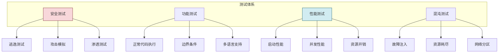

### 8.2 安全测试用例

```python
import pytest

class TestSandboxSecurity:
    """沙箱安全测试"""
    
    @pytest.fixture
    async def sandbox(self):
        manager = SandboxManager()
        sb = await manager.create()
        yield sb
        await manager.destroy(sb.id)
    
    @pytest.mark.security
    async def test_prevent_filesystem_access(self, sandbox):
        """测试文件系统隔离"""
        code = """
        try:
            with open('/etc/passwd', 'r') as f:
                content = f.read()
            print('VULNERABLE: accessed /etc/passwd')
        except PermissionError:
            print('SAFE: cannot access /etc/passwd')
        """
        result = await sandbox.execute(code)
        assert "SAFE" in result["stdout"]
        assert "VULNERABLE" not in result["stdout"]
    
    @pytest.mark.security
    async def test_prevent_network_access(self, sandbox):
        """测试网络隔离"""
        code = """
        import socket
        try:
            s = socket.socket(socket.AF_INET, socket.SOCK_STREAM)
            s.settimeout(3)
            s.connect(('10.0.0.1', 80))
            print('VULNERABLE: connected to internal network')
        except (socket.timeout, OSError):
            print('SAFE: cannot access network')
        """
        result = await sandbox.execute(code)
        assert "SAFE" in result["stdout"]
    
    @pytest.mark.security
    async def test_prevent_subprocess(self, sandbox):
        """测试禁止子进程"""
        code = """
        try:
            import subprocess
            result = subprocess.run(['whoami'], capture_output=True)
            print(f'VULNERABLE: ran command: {result.stdout}')
        except ImportError:
            print('SAFE: cannot import subprocess')
        except Exception as e:
            print(f'SAFE: subprocess blocked: {e}')
        """
        result = await sandbox.execute(code)
        assert "SAFE" in result["stdout"]
    
    @pytest.mark.security
    async def test_prevent_privilege_escalation(self, sandbox):
        """测试防止权限提升"""
        code = """
        import os
        print(f'uid: {os.getuid()}')
        print(f'gid: {os.getgid()}')
        try:
            os.setuid(0)
            print('VULNERABLE: escalated to root')
        except PermissionError:
            print('SAFE: cannot escalate privileges')
        except Exception as e:
            print(f'SAFE: escalation blocked: {e}')
        """
        result = await sandbox.execute(code)
        assert "SAFE" in result["stdout"]
        assert "uid: 1000" in result["stdout"]  # 非root
    
    @pytest.mark.security
    async def test_prevent_resource_exhaustion(self, sandbox):
        """测试资源限制"""
        code = """
        # 尝试耗尽内存
        data = []
        try:
            while True:
                data.append('x' * 1024 * 1024)  # 1MB
        except MemoryError:
            print(f'SAFE: memory limited after {len(data)}MB')
        """
        result = await sandbox.execute(code, timeout=10)
        assert "SAFE" in result["stdout"] or result["success"] == False
    
    @pytest.mark.security
    async def test_prevent_infinite_loop(self, sandbox):
        """测试超时限制"""
        code = "while True: pass"
        result = await sandbox.execute(code, timeout=3)
        assert result["success"] == False
        assert "timeout" in result.get("error", "").lower() or \
               result["exit_code"] != 0
```

### 8.3 性能测试

```python
import pytest
import asyncio
import time

class TestSandboxPerformance:
    """沙箱性能测试"""
    
    @pytest.mark.performance
    async def test_startup_time(self):
        """测试沙箱启动时间"""
        manager = SandboxManager()
        
        start = time.time()
        sandbox = await manager.create()
        startup_time = time.time() - start
        
        await manager.destroy(sandbox.id)
        
        assert startup_time < 0.5, f"Startup too slow: {startup_time}s"
    
    @pytest.mark.performance
    async def test_concurrent_execution(self):
        """测试并发执行"""
        manager = SandboxManager()
        
        async def execute_one():
            sandbox = await manager.create()
            try:
                result = await manager.execute(
                    sandbox.id, "print('hello')"
                )
                return result["success"]
            finally:
                await manager.destroy(sandbox.id)
        
        # 100个并发
        start = time.time()
        results = await asyncio.gather(*[execute_one() for _ in range(100)])
        duration = time.time() - start
        
        assert all(results), "Some executions failed"
        assert duration < 30, f"Too slow: {duration}s for 100 concurrent"
    
    @pytest.mark.performance
    async def test_memory_overhead(self):
        """测试内存开销"""
        import psutil
        
        process = psutil.Process()
        base_mem = process.memory_info().rss
        
        manager = SandboxManager()
        sandboxes = []
        for _ in range(10):
            sb = await manager.create()
            sandboxes.append(sb)
        
        peak_mem = process.memory_info().rss
        overhead = (peak_mem - base_mem) / 10  # 每个沙箱开销
        
        for sb in sandboxes:
            await manager.destroy(sb.id)
        
        assert overhead < 50 * 1024 * 1024, f"Memory overhead too high: {overhead}"
```

---

## 九、项目实战案例

### 9.1 项目背景

**项目名称**:某 AI 编程助手平台的代码执行沙箱

**业务场景**:用户通过 AI 助手生成 Python 代码,平台需要在安全沙箱中执行代码并返回结果。

**核心需求**:
- 支持 1000+ 并发用户
- 代码执行响应时间 < 2 秒
- 防止恶意代码攻击
- 支持 pip 安装第三方库(白名单)

### 9.2 技术方案

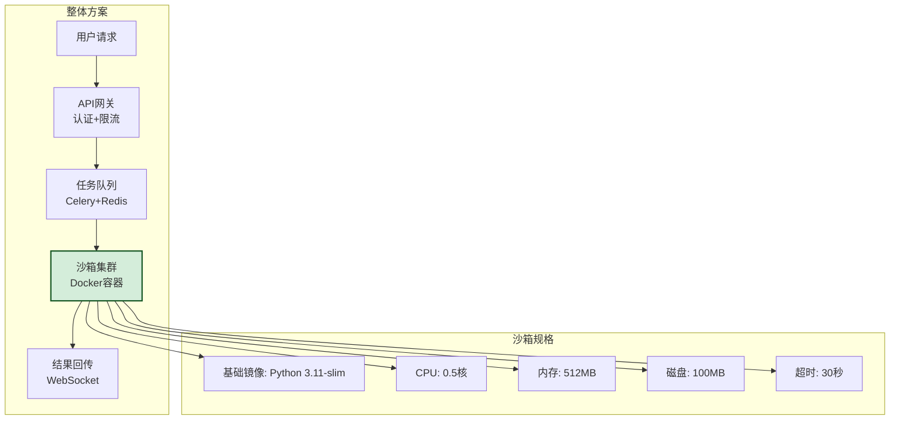

### 9.3 实施步骤

| 阶段 | 内容 | 周期 |
|------|------|------|
| **阶段一** | 基础沙箱搭建(Docker + seccomp) | 2 周 |
| **阶段二** | 资源限制和监控接入 | 2 周 |
| **阶段三** | 安全分析器开发 | 2 周 |
| **阶段四** | 高并发优化(容器池) | 2 周 |
| **阶段五** | 安全测试和渗透测试 | 2 周 |
| **阶段六** | 灰度发布和全量上线 | 2 周 |

### 9.4 遇到的挑战与解决方案

| 挑战 | 解决方案 | 效果 |
|------|---------|------|
| 沙箱启动慢(秒级) | 预热容器池 + 复用机制 | 启动降至 <100ms |
| pip 安装依赖慢 | 预装常用库 + 镜像分层缓存 | 安装时间减少 80% |
| 内存监控不准确 | 改用 cgroups v2 + 实时采集 | 精度提升至 ±5MB |
| 并发瓶颈 | 异步 IO + 容器池 + 水平扩展 | 支持 2000 并发 |
| 安全告警误报 | 优化 Falco 规则 + 白名单 | 误报率降至 <1% |

### 9.5 最终效果

| 指标 | 目标 | 实际 |
|------|------|------|
| 并发支持 | 1000 | 2000+ |
| 启动时间 | <500ms | <100ms |
| 执行延迟 | <2s | <1.2s |
| 安全事件 | 0 | 0(运行2年) |
| 可用率 | 99.9% | 99.95% |
| 资源开销 | <50MB/沙箱 | 35MB/沙箱 |

---

## 十、面试回答思路与加分项

### 10.1 推荐回答框架

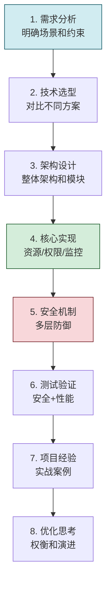

### 10.2 加分项

| 加分项 | 说明 |
|------|------|
| **多层防御思维** | 不只依赖单层防护,而是纵深防御 |
| **eBPF 等前沿技术** | 展示对内核安全技术的理解 |
| **性能优化考虑** | 容器池、预热、异步 IO |
| **真实案例** | 有实际项目经验加分 |
| **权衡取舍** | 能说明不同方案的 trade-off |
| **演进思考** | 从简单到复杂的迭代路径 |
| **合规考虑** | 提及审计、日志、合规要求 |

### 10.3 常见追问

| 追问 | 回答要点 |
|------|---------|
| "如何防止容器逃逸?" | seccomp + AppArmor + namespace + 最小权限 + no-new-privileges |
| "如何处理高并发?" | 容器池预热 + 异步 IO + 水平扩展 + 限流 |
| "如何做代码安全分析?" | AST 静态分析 + 危险模块/函数黑名单 + 正则模式匹配 |
| "如何监控运行时行为?" | eBPF 系统调用追踪 + Falco 规则 + 资源阈值告警 |
| "性能和安全如何权衡?" | 分级安全策略,根据代码来源调整安全等级 |

---

## 十一、总结与延伸思考

### 11.1 核心知识点总结

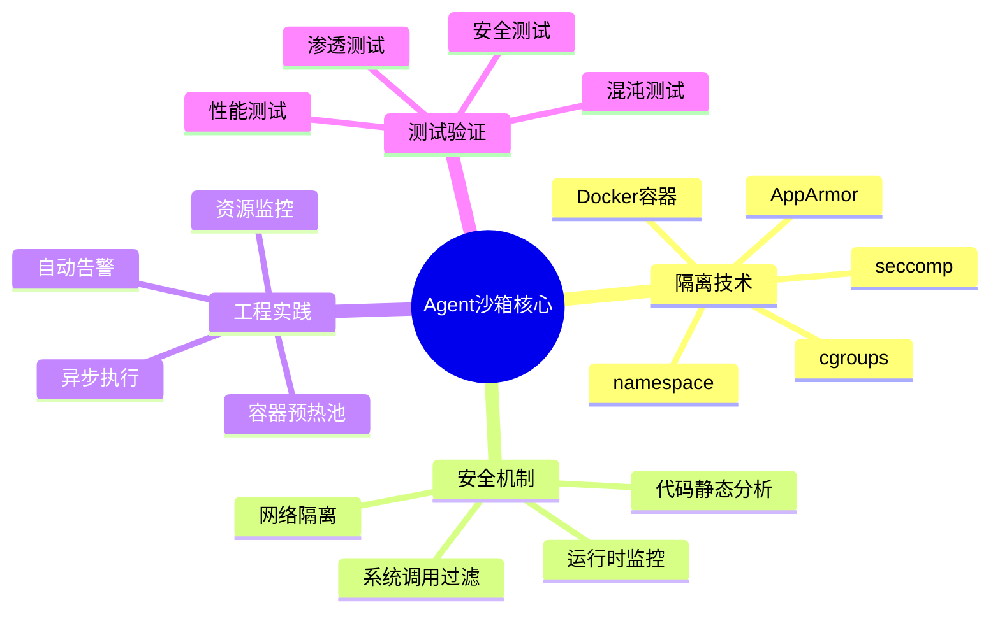

### 11.2 延伸思考

1. **WASM 沙箱**:相比 Docker 更轻量,启动更快,适合更细粒度的代码隔离
2. **Firecracker MicroVM**:AWS 开源的轻量虚拟机,提供更强的隔离性
3. **机密计算**:使用 SGX/TDX 等硬件加密技术保护执行环境
4. **零信任架构**:不信任任何代码,每次执行都进行完整安全验证
5. **AI 辅助安全**:用 LLM 分析代码意图,提前识别潜在风险

### 11.3 与系列文档的关系

| 文档 | 主题 | 与本文关系 |
|------|------|---------|
| [176百万级Agent平台架构设计面试题详解.md](176百万级Agent平台架构设计面试题详解.md) | 平台架构 | 沙箱是平台的执行层组件 |
| [177Agent调度中心架构设计面试题详解.md](177Agent调度中心架构设计面试题详解.md) | 调度架构 | 沙箱是被调度的资源 |

---

> **最终结论**:设计安全可靠的 Agent 沙箱执行环境,核心是建立**纵深防御体系**——从代码静态分析、容器隔离、系统调用过滤、运行时监控到网络隔离的多层防护。技术上以 Docker 容器为基础,结合 cgroups 资源限制、seccomp 系统调用过滤、AppArmor 强制访问控制、eBPF 运行时监控,构建出既安全又高效的沙箱环境。工程上通过容器预热池、异步执行、水平扩展满足高并发需求。测试上通过安全测试、渗透测试、性能测试、混沌测试确保可靠性和安全性。
