# 高级Agent系统数据泄露防护(DLP)完整方案面试题详解

> **文档定位**:本文档是 `14高级 Agent 面试题` 系列的**数据泄露防护专题面试题详解**。在已有 [178安全可靠的Agent沙箱执行环境设计面试题详解.md](178安全可靠的Agent沙箱执行环境设计面试题详解.md)、[179Agent安全保障体系设计面试题详解.md](179Agent安全保障体系设计面试题详解.md)、[180Prompt Injection攻击防护体系面试题详解.md](180Prompt%20Injection攻击防护体系面试题详解.md) 的基础上,聚焦 **DLP(Data Leakage Prevention)** 这一高级主题,系统阐述如何为 Agent 系统建立从数据分类分级、访问控制、加密审计到异常扫描的全生命周期防护。
>
> **适用场景**:高级 Agent 安全架构师、安全合规官、企业级 Agent 平台设计者面试与参考。

---

## 目录

- [一、面试题目与考察要点](#一面试题目与考察要点)
- [二、Agent数据泄露风险全景](#二agent数据泄露风险全景)
- [三、数据分类分级机制](#三数据分类分级机制)
- [四、精细化访问控制策略](#四精细化访问控制策略)
- [五、全链路数据加密方案](#五全链路数据加密方案)
- [六、敏感操作审计日志体系](#六敏感操作审计日志体系)
- [七、异常行为监测与告警系统](#七异常行为监测与告警系统)
- [八、定期安全漏洞扫描机制](#八定期安全漏洞扫描机制)
- [九、数据全生命周期防护闭环](#九数据全生命周期防护闭环)
- [十、DLP核心引擎完整代码实现](#十dlp核心引擎完整代码实现)
- [十一、企业级实战案例](#十一企业级实战案例)
- [十二、面试回答思路与加分项](#十二面试回答思路与加分项)
- [十三、总结与延伸思考](#十三总结与延伸思考)

---

## 一、面试题目与考察要点

### 1.1 面试题目

> **题目**:针对高级 Agent 系统,请设计一套全面的数据泄露防护 DLP 方案。覆盖数据分类分级机制、访问控制策略、传输与存储加密方案、敏感操作审计日志、异常行为监测系统、以及定期安全漏洞扫描,确保 Agent 在数据采集、处理、传输、存储的全生命周期中,有效防止未经授权的访问、泄露与滥用。
>
> 要求:
> 1. 说明 Agent 系统相对于普通系统的独特数据泄露路径和风险
> 2. 提供可落地的分类分级标准和标签机制
> 3. 加密方案覆盖密钥管理、算法选择、性能权衡
> 4. 审计日志防篡改、可追溯、符合合规
> 5. 异常监测说明特征、检测算法、响应动作
> 6. 漏洞扫描覆盖代码、依赖、配置、模型四类
> 7. 说明全生命周期各阶段的保护动作

### 1.2 考察要点

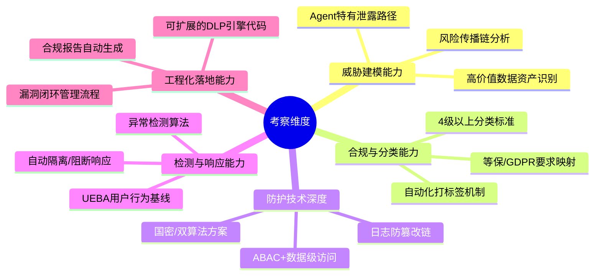

### 1.3 难度等级

| 维度 | 难度 | 说明 |
|------|:----:|------|
| **广度** | ⭐⭐⭐⭐⭐ | 覆盖分类/访问/加密/审计/监测/扫描六大域 |
| **深度** | ⭐⭐⭐⭐⭐ | 需到标签算法、密钥轮转、UEBA检测算法级别 |
| **Agent特性** | ⭐⭐⭐⭐⭐ | 必须识别Agent特有风险:记忆泄露/工具导出/LLM回显 |
| **合规要求** | ⭐⭐⭐⭐ | 需结合等保2.0/GDPR/PIPL |
| **实战性** | ⭐⭐⭐⭐⭐ | 需要可落地的完整引擎代码与流程机制 |

---

## 二、Agent数据泄露风险全景

### 2.1 Agent 特有的泄露路径

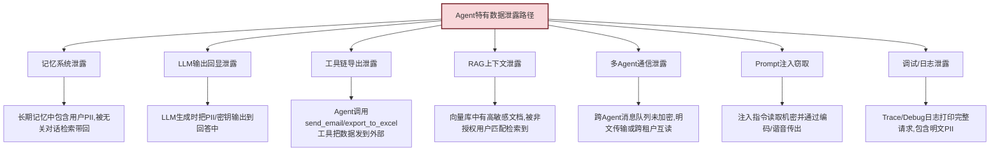

### 2.2 泄露事件分类与影响矩阵

| 泄露类型 | 典型场景 | 影响等级 | 合规处罚风险 |
|---------|---------|:--------:|:-----------:|
| **个人信息泄露** | 记忆系统带回用户手机号/身份证 | 🔴 极高 | PIPL 5%年收入罚款 |
| **商业机密泄露** | RAG检索出未公开财务数据给员工 | 🔴 极高 | 合同/民事赔偿 |
| **API密钥泄露** | LLM回显 sk-xxx / AKIA 密钥 | 🔴 极高 | 账号被盗刷/入侵 |
| **源代码泄露** | 代码助手被诱导输出企业核心代码 | 🟠 高 | 知识产权损失 |
| **客户数据泄露** | Agent导出完整客户清单到外部邮箱 | 🟠 高 | 客户索赔/声誉损失 |
| **内部沟通泄露** | Agent读取高管会议记录公开给外部 | 🟡 中 | 内部纪律处分 |
| **元数据泄露** | 文档标签/权限字段未清空随导出外传 | 🟢 低 | 审计整改 |

### 2.3 防护总体框架:纵深防御六环

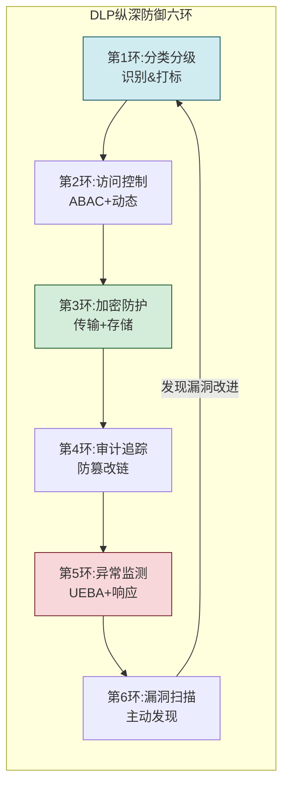

---

## 三、数据分类分级机制

### 3.1 四级分类标准(符合等保2.0)

| 级别 | 名称 | 定义 | 典型示例 | 泄露影响 |
|:----:|------|------|---------|:--------:|
| **L1** | 公开数据 | 可对外公开,无影响 | 帮助文档、产品介绍、公开FAQ | 无影响 |
| **L2** | 内部数据 | 仅限员工访问,商业影响小 | 内部流程、普通培训资料、普通公告 | 轻微影响 |
| **L3** | 敏感数据 | 需授权访问,泄露有损失 | 客户联系方式、员工薪资、合同金额 | 🟠 高损失 |
| **L4** | 核心机密 | 最高级别,严格管控 | 核心算法、商业秘密、未公开财报、密钥 | 🔴 极高损失 |

### 3.2 Agent场景的具体分类映射表

| Agent组件 | 内容示例 | 默认级别 | 特殊条件升级 |
|----------|---------|:-------:|------------|
| **用户对话** | 普通提问 | L2 | 提问中含PII→L3,含商业秘密→L4 |
| **短期记忆** | 最近20轮对话 | L2 | 含客户数据→L3 |
| **长期记忆** | 用户画像/偏好 | L3 | 含身份证/银行卡→L4 |
| **RAG知识库** | 普通文档 | L2 | 按文档级别继承标记 |
| **工具返回值** | 数据库查询结果 | L3 | 涉及核心表→L4 |
| **LLM Prompt** | 系统提示词 | L2 | 含Prompt工程技巧→L3 |
| **向量嵌入** | Embedding向量 | L2 | 来自L4文档→L3 |
| **Agent日志** | 请求/响应日志 | L3 | 含完整PII→L4(需脱敏) |
| **会话快照** | 中断恢复状态 | L3 | 核心Agent状态→L4 |

### 3.3 自动化数据打标引擎

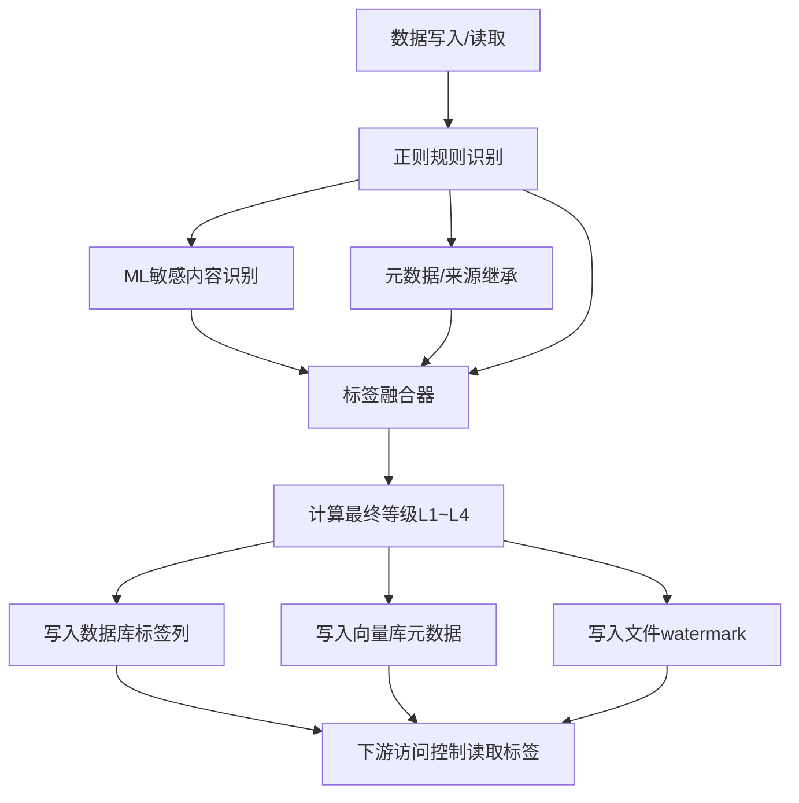

```python
import re
from enum import IntEnum
from typing import Optional
from pydantic import BaseModel

class DataLevel(IntEnum):
    PUBLIC = 1       # L1 公开
    INTERNAL = 2     # L2 内部
    SENSITIVE = 3    # L3 敏感
    CONFIDENTIAL = 4 # L4 核心机密

class DataTag(BaseModel):
    """数据标签结构"""
    level: DataLevel
    categories: list[str] = []   # ["pii_phone", "financial_salary"]
    source_level: DataLevel = DataLevel.INTERNAL
    has_pii: bool = False
    has_secret: bool = False
    watermark_id: str = ""

class DataTaggerEngine:
    """自动化数据打标引擎"""
    
    # 规则1:正则敏感模式(触发L3/L4)
    PII_PATTERNS = {
        "pii_phone": (r"1[3-9]\d{9}", DataLevel.SENSITIVE),
        "pii_idcard": (r"\d{17}[\dXx]", DataLevel.SENSITIVE),
        "pii_bankcard": (r"\d{16,19}", DataLevel.SENSITIVE),
        "secret_api_key": (r"(sk-[A-Za-z0-9-_]{20,}|AKIA[A-Z0-9]{16})", 
                           DataLevel.CONFIDENTIAL),
        "secret_private_key": (r"-----BEGIN.*?PRIVATE KEY-----", 
                               DataLevel.CONFIDENTIAL),
        "financial_amount": (r"[¥$]\s*\d{6,}", DataLevel.SENSITIVE),
    }
    
    # 规则2:关键词升级
    UPGRADE_KEYWORDS = {
        DataLevel.CONFIDENTIAL: ["绝密", "核心机密", "未公开财报", 
                                 "战略规划", "算法源码"],
        DataLevel.SENSITIVE: ["薪资", "客户清单", "身份证", "合同金额"]
    }
    
    # 规则3:来源继承映射
    SOURCE_INHERIT = {
        "financial_db": DataLevel.SENSITIVE,
        "hr_system": DataLevel.SENSITIVE,
        "exec_board_docs": DataLevel.CONFIDENTIAL,
        "public_website": DataLevel.PUBLIC,
    }
    
    def tag_data(self, content: str, 
                 source: str = None,
                 user_hint_level: DataLevel = None) -> DataTag:
        """综合三规则打标"""
        categories = set()
        max_rule_level = DataLevel.PUBLIC
        
        # ===== 规则1:正则PII/密钥扫描 =====
        for cat, (pattern, level) in self.PII_PATTERNS.items():
            if re.search(pattern, content, re.IGNORECASE | re.DOTALL):
                categories.add(cat)
                max_rule_level = max(max_rule_level, level)
        
        # ===== 规则2:关键词升级 =====
        for target_level, keywords in self.UPGRADE_KEYWORDS.items():
            if any(kw in content for kw in keywords):
                categories.add(f"keyword_upgrade_to_L{target_level}")
                max_rule_level = max(max_rule_level, target_level)
        
        # ===== 规则3:来源等级继承 =====
        source_level = self.SOURCE_INHERIT.get(source, DataLevel.INTERNAL)
        max_level = max(max_rule_level, source_level)
        
        # 用户手工提示(最高优先级)
        if user_hint_level:
            max_level = max(max_level, user_hint_level)
        
        has_pii = any(c.startswith("pii_") for c in categories)
        has_secret = max_level >= DataLevel.CONFIDENTIAL
        
        return DataTag(
            level=max_level,
            categories=sorted(categories),
            source_level=source_level,
            has_pii=has_pii,
            has_secret=has_secret,
            watermark_id=self._gen_watermark(max_level, categories)
        )
    
    def _gen_watermark(self, level: DataLevel, categories) -> str:
        """生成隐形水印(可溯源)"""
        import hashlib, time
        raw = f"{level}|{sorted(categories)}|{time.time()}"
        return f"WM_{hashlib.sha256(raw.encode()).hexdigest()[:16]}"
```

### 3.4 分类分级标签的下游联动

| 标签级别 | 写入加密 | 传输加密 | 是否进LLM | 是否可导出 | 日志留存 |
|---------|:-------:|:-------:|:--------:|:--------:|:-------:|
| L1 公开 | 可选 | TLS | ✅ | ✅ | 1个月 |
| L2 内部 | AES-128 | TLS | ✅ | 审批后 | 6个月 |
| L3 敏感 | AES-256 | mTLS | ⚠️脱敏后 | ❌需审批 | 3年 |
| L4 机密 | AES-256+HSM | mTLS国密 | ❌禁止入LLM | ❌完全禁止 | 永久 |

---

## 四、精细化访问控制策略

### 4.1 ABAC + 数据级权限模型

Agent 场景必须使用 **ABAC(属性权限)** 而非纯 RBAC,因为:
- 同一个 Agent 在不同任务上下文中权限不同
- 同一份文档不同用户/不同查询理由访问结果不同
- 数据敏感度会随时间/状态变化

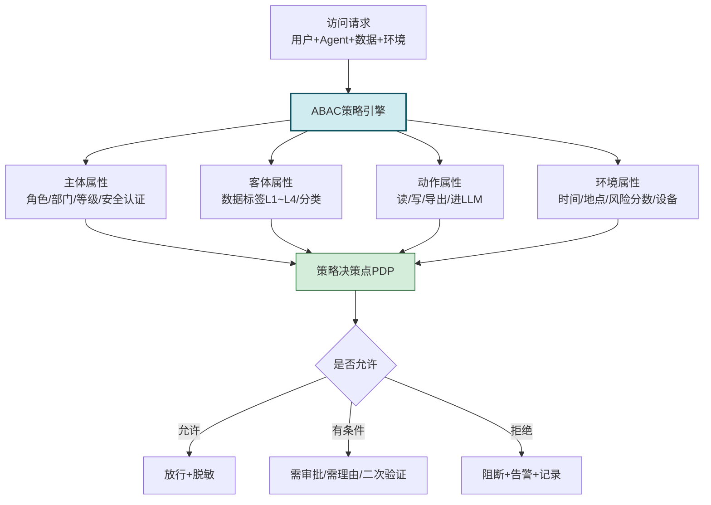

### 4.2 Agent专属ABAC策略样例

```python
class ABACPolicyEngine:
    """面向Agent的ABAC策略引擎"""
    
    def check_access(self,
                     subject: dict,   # 主体属性
                     obj: DataTag,    # 客体数据标签
                     action: str,     # read/write/export/to_llm
                     context: dict) -> dict:  # 环境
        """核心访问判定"""
        result = {"allow": False, "reason": [], 
                  "need_masking": [], "need_approval": None}
        
        # ===== 策略1:数据等级匹配 =====
        user_clearance = subject.get("clearance_level", 2)
        if user_clearance < obj.level:
            result["reason"].append(
                f"用户等级L{user_clearance} < 数据等级L{obj.level}"
            )
            return result
        
        # ===== 策略2:Agent 数据入 LLM 限制 =====
        if action == "to_llm":
            if obj.level >= DataLevel.CONFIDENTIAL:
                result["reason"].append("L4机密禁止注入LLM上下文")
                return result
            if obj.has_pii:
                result["need_masking"].extend(
                    [c for c in obj.categories if c.startswith("pii_")]
                )
                result["reason"].append("PII数据送入LLM前需脱敏")
            # 允许(带脱敏标记)
            result["allow"] = True
            return result
        
        # ===== 策略3:导出动作限制 =====
        if action == "export":
            if obj.level >= DataLevel.CONFIDENTIAL:
                result["reason"].append("L4机密禁止任何导出")
                return result
            if obj.level == DataLevel.SENSITIVE:
                # 需审批
                result["need_approval"] = {
                    "type": "export_sensitive",
                    "approver_role": "department_manager",
                    "valid_minutes": 30
                }
                result["allow"] = True  # 条件允许
                return result
        
        # ===== 策略4:非工作时间访问 =====
        hour = context.get("current_hour", 12)
        if obj.level >= DataLevel.SENSITIVE and not (8 <= hour <= 20):
            if not subject.get("is_oncall", False):
                result["reason"].append("非工作时间敏感数据仅限值班人员")
                return result
        
        # ===== 策略5:异地访问 =====
        if context.get("geo_foreign", False) and \
           obj.level >= DataLevel.SENSITIVE:
            result["need_approval"] = {"type": "geo_approval", 
                                       "valid_minutes": 10}
        
        # 默认放行
        result["allow"] = True
        return result
```

### 4.3 强制访问矩阵

| 数据等级 | 普通员工 | 部门主管 | 合规/安全 | 高管 | AI Agent 机器人 |
|---------|:-------:|:-------:|:--------:|:---:|:--------------:|
| L1公开 | ✅读/导出 | ✅ | ✅ | ✅ | ✅(无限制) |
| L2内部 | ✅读<br/>❌导出 | ✅导出 | ✅ | ✅ | ✅可入LLM |
| L3敏感 | ⚠️理由+审批<br/>❌导出 | ✅读<br/>⚠️导出审批 | ✅ | ✅ | ⚠️脱敏后入LLM |
| L4机密 | ❌ | ❌ | ✅审计访问 | ✅审计访问 | ❌禁止入LLM<br/>❌工具导出 |

---

## 五、全链路数据加密方案

### 5.1 三重加密体系

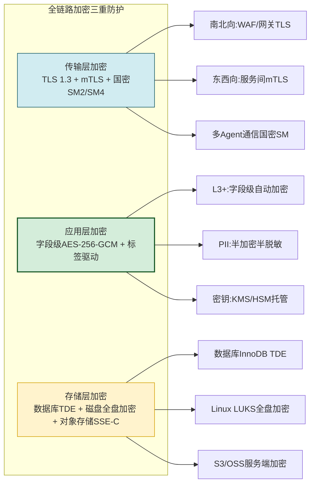

### 5.2 密钥管理方案

```python
from enum import Enum
from cryptography.hazmat.primitives.ciphers.aead import AESGCM
import os, base64

class KeyType(str, Enum):
    """密钥分层类型"""
    MASTER = "master"            # 主密钥:HSM硬件保护
    TENANT_KEK = "tenant_kek"    # 租户密钥加密密钥
    FIELD_DEK = "field_dek"      # 字段数据加密密钥
    OBJECT_DEK = "object_dek"    # 对象/向量加密密钥

class HierarchyKeyManager:
    """三层密钥体系:信封加密"""
    
    def __init__(self, kms_client=None, hsm_client=None):
        self.kms = kms_client  # 可选:对接云厂商KMS
        self.hsm = hsm_client  # 可选:对接硬件HSM(等保三级要求)
        self._local_deks: dict[str, bytes] = {}  # 内存缓存(不落盘)
    
    def encrypt_field(self, tenant_id: str, level: DataLevel,
                      field_name: str, plaintext: str) -> dict:
        """字段级加密:L3以上启用"""
        if level <= DataLevel.INTERNAL:
            return {"cipher": plaintext, "no_enc": True}
        
        # 1. 每字段每次生成随机DEK
        dek = AESGCM.generate_key(bit_length=256)
        
        # 2. DEK用KEK加密信封包装
        kek = self._get_tenant_kek(tenant_id)
        wrapped_dek = self._aes_wrap(kek, dek)
        
        # 3. 用明文DEK加密数据
        aes = AESGCM(dek)
        nonce = os.urandom(12)
        aad = f"{tenant_id}|{field_name}|{level}".encode()
        ciphertext = aes.encrypt(nonce, plaintext.encode(), aad)
        
        # 4. 销毁明文DEK
        del dek
        
        return {
            "algo": "AES-256-GCM",
            "level": level,
            "wrapped_dek": base64.b64encode(wrapped_dek).decode(),
            "nonce": base64.b64encode(nonce).decode(),
            "aad": aad.decode(),
            "ciphertext": base64.b64encode(ciphertext).decode()
        }
    
    def _get_tenant_kek(self, tenant_id: str) -> bytes:
        """获取租户KEK(优先从HSM)"""
        cache_key = f"kek:{tenant_id}"
        if cache_key in self._local_deks:
            return self._local_deks[cache_key]
        
        if self.hsm:
            kek = self.hsm.get_encryption_key(f"tenant_kek_{tenant_id}")
        elif self.kms:
            kek = base64.b64decode(self.kms.get_secret(f"/agent/kek/{tenant_id}"))
        else:
            # 本地开发模式(生产禁用)
            kek = hashlib.sha256(f"DEV_{tenant_id}".encode()).digest()
        
        self._local_deks[cache_key] = kek
        return kek
    
    def rotate_master_key(self, master_version: str) -> None:
        """主密钥轮转(在线,不停服务)"""
        # 1. 新主密钥在HSM/KMS中生成新版本
        # 2. 遍历所有租户KEK:用新主密钥重加密KEK
        # 3. DEK不变(只需重加密KEK信封,无需解密所有数据)
        # 4. 标记轮转完成时间,审计日志记录
        pass
```

### 5.3 算法选型与合规

| 场景 | 推荐算法组合 | 合规依据 | 备注 |
|------|------------|---------|------|
| **国内传输** | TLS 1.3 + 国密SM2/SM4双证书 | 等保2.0/GM/T 0024 | 政务/金融强制 |
| **海外传输** | TLS 1.3 + ECDSA P-256 + AES-256-GCM | GDPR/FIPS 140-3 | 全球兼容 |
| **字段加密** | AES-256-GCM(信封加密+每字段DEK) | FIPS 197 | 行业最佳实践 |
| **国密替代** | SM4-CCM/SM2 + SM3哈希 | GM/T 0002-0009 | 等保三级+ |
| **哈希/签名** | SHA-256 / RSA-2048+ | FIPS 180-4 | 数字签名用 |
| **向量存储** | AES-256-CTR + 标签密钥 | - | 向量批量加密用CTR快 |

---

## 六、敏感操作审计日志体系

### 6.1 防篡改审计链架构

```mermaid
flowchart LR
    A[敏感操作产生] --> B[日志采集API<br/>业务事件结构化]
    B --> C[日志哈希链生成<br/>hash_n = sha(hash_{n-1} + content)]
    C --> D[实时写入]
    D --> D1["专用审计库<br/>WORM(一写多读)"]
    D --> D2[第二副本<br/>异地对象存储]
    D --> D3[第三副本<br/>区块链/存证中心哈希锚定]
    
    D1 & D2 & D3 --> E[定期完整性校验<br/>全链哈希回溯验证]
```

### 6.2 Agent必须审计的13类敏感操作

| 操作编码 | 操作名称 | 日志强制字段 | 审计级别 |
|:--------:|---------|------------|:-------:|
| OP-01 | **用户登录/认证** | user_id, ip, device, mfa_type | ⚠️重要 |
| OP-02 | **数据访问** | user_id, data_id, data_level, labels, 命中行数 | 🔴必审 |
| OP-03 | **数据导出** | exporter, tool_name, file_type, file_hash, target | 🔴必审 |
| OP-04 | **数据写入L3+** | writer, table/id, level_change, content_hash | 🔴必审 |
| OP-05 | **送入LLM上下文** | session_id, prompt_hash, labels, token数 | 🔴必审 |
| OP-06 | **LLM完整输出** | answer_hash, 是否含PII, 引用来源 | ⚠️重要 |
| OP-07 | **Agent调用工具** | agent_id, tool, params, output_size, 调用方 | ⚠️重要 |
| OP-08 | **权限变更** | target_user, 变更前/后等级, operator | 🔴必审 |
| OP-09 | **密钥访问** | key_id, user, reason, ip, 是否成功 | 🔴必审 |
| OP-10 | **数据删除** | deleter, data_id, level, hard/soft | 🔴必审 |
| OP-11 | **ABAC策略修改** | 修改人, 策略变更内容, dry_run结果 | 🔴必审 |
| OP-12 | **记忆检索命中L3+** | agent_id, memory_id, level, session关联 | ⚠️重要 |
| OP-13 | **安全告警触发** | 告警类型, 触发者, 检测算法, 置信度 | 🔴必审 |

### 6.3 防篡改日志写入器实现

```python
import hashlib, json, time, threading

class ImmutableAuditLogger:
    """防篡改审计日志写入器:哈希链+三副本"""
    
    def __init__(self, worm_db_client, oss_client, chain_client):
        self.db = worm_db_client   # 一写多读专用库
        self.oss = oss_client      # 对象存储第二副本
        self.chain = chain_client  # 区块链哈希锚定(可选)
        self._last_hash: str = "0" * 64  # 创世前哈希
        self._lock = threading.Lock()
    
    def log_sensitive_op(self, op_code: str, 
                        actor: str, 
                        details: dict,
                        data_level: DataLevel = DataLevel.INTERNAL,
                        risk_score: float = 0.0) -> str:
        """写一条不可篡改审计记录"""
        with self._lock:
            # 1. 构建标准化事件
            event = {
                "seq": self._next_seq(),
                "op_code": op_code,
                "timestamp_ms": int(time.time() * 1000),
                "actor": actor,
                "data_level": int(data_level),
                "risk_score": risk_score,
                "details": self._sanitize(details),  # 确保日志内不含明文PII
            }
            
            # 2. 哈希链绑定上一条
            event_json = json.dumps(event, sort_keys=True, ensure_ascii=False)
            current_hash = hashlib.sha256(
                f"{self._last_hash}|{event_json}".encode()
            ).hexdigest()
            event["prev_hash"] = self._last_hash
            event["hash"] = current_hash
            
            # 3. 三副本写入
            self._write_worm_db(event)           # 副本1
            self._write_oss_backup(event)        # 副本2
            if data_level >= DataLevel.CONFIDENTIAL:
                self._anchor_blockchain(current_hash)  # 副本3(哈希)
            
            self._last_hash = current_hash
            return current_hash
    
    def verify_chain(self, start_seq: int, end_seq: int) -> dict:
        """全链完整性校验:可用于合规审计"""
        records = self.db.fetch_range(start_seq, end_seq)
        ok_count, fail_count = 0, 0
        prev_hash = None
        for r in records:
            if prev_hash and r["prev_hash"] != prev_hash:
                fail_count += 1
                continue
            # 重新计算哈希比对
            tmp = {k:v for k,v in r.items() if k not in ("hash",)}
            recomputed = hashlib.sha256(
                f"{r['prev_hash']}|{json.dumps(tmp, sort_keys=True)}".encode()
            ).hexdigest()
            if recomputed == r["hash"]:
                ok_count += 1
                prev_hash = r["hash"]
            else:
                fail_count += 1
        return {"total": len(records), "ok": ok_count, 
                "tampered": fail_count, "integrity": ok_count/len(records)}
```

### 6.4 日志留存与合规标准

| 数据级别 | 最短留存期 | 可删除条件 | 监管抽查可提供 |
|---------|:---------:|-----------|:--------------:|
| L1 公开 | 1个月 | 到期自动清 | 否 |
| L2 内部 | 6个月 | 到期+审批 | 否 |
| L3 敏感 | **3年** | 审批+再留存3年 | 是 |
| L4 机密 | **永久** | 永不删除(异地归档) | 是 |
| 所有权限变更 | 永久 | 永不删除 | 是 |
| 所有安全告警 | 永久 | 永不删除 | 是 |

---

## 七、异常行为监测与告警系统

### 7.1 UEBA用户与实体行为分析架构

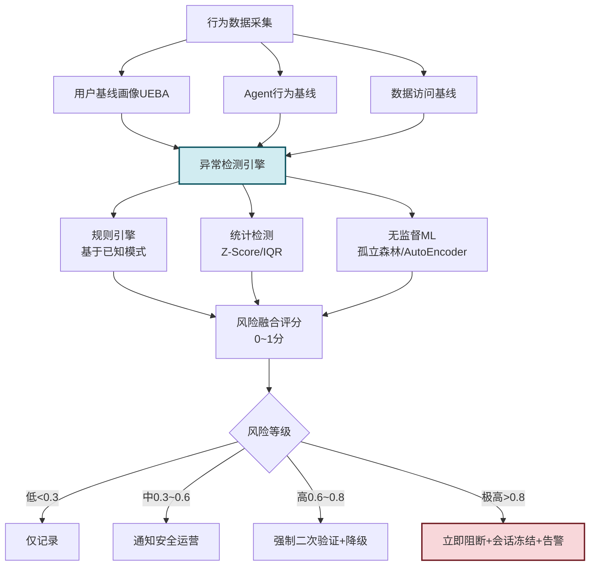

### 7.2 Agent专属异常检测特征

| 特征组 | 异常信号 | 检测算法 | 典型阈值 |
|-------|---------|---------|:-------:|
| **访问量异常** | 单Agent 1小时下载1000+文档(Z-Score>5) | 统计 + 滑动窗口 | 正常10倍 |
| **数据等级异常** | 平时只读L2,突然批量读取L4文档 | 角色偏差规则 | 级别+2 |
| **导出行为异常** | 用户6个月未导出,突然连续导出 | 稀疏事件检测 | 首次触发 |
| **LLM回显异常** | 输出中检测到密钥/身份证序列 | 正则+分类模型 | 任何L3+ |
| **时间异常** | 凌晨3点L4级别访问(正常9-18点) | 时间分布基线 | 非工作时段 |
| **地点异常** | 一直在北京,突然从新加坡登录+访问L3 | IP地理库 + 速度旅行 | >1000km/h |
| **查询模式异常** | 大量查询包含"下载""清单""全部导出"关键词 | NLP意图识别 | 关键词≥3 |
| **跨Agent数据搬运** | A读取L3→写入公共频道→B读取外传 | 图路径检测 | 发现即高危 |
| **记忆异常检索** | 长期记忆中反复命中他人PII记忆 | 标签不符检测 | ≥5次/h |
| **工具调用异常** | 短时间高频调用email_send/save_to_disk | 工具黑名单触发 | ≥10次/min |

### 7.3 UEBA检测引擎实现核心

```python
import numpy as np
from collections import defaultdict, deque
from sklearn.ensemble import IsolationForest

class UEBAAnomalyDetector:
    """Agent场景UEBA异常检测引擎"""
    
    def __init__(self):
        # 1. 行为基线:用户→特征历史
        self.user_baselines: dict[str, dict] = {}
        # 2. 实时窗口:用户→最近1小时事件
        self.sliding_windows: dict[str, deque] = defaultdict(
            lambda: deque(maxlen=10000)
        )
        # 3. ML模型:孤立森林
        self.iforest: IsolationForest = None
        self._trained = False
    
    # ============ 规则检测 ============
    def rule_based_check(self, event: dict) -> list[dict]:
        """基于已知规则快速检测"""
        alerts = []
        level = event.get("data_level", 2)
        op = event.get("op_code", "")
        user = event.get("actor", "")
        
        # R1: 非工作时间访问L3+
        if level >= 3:
            h = (event.get("timestamp_ms", 0) // 1000) % 86400 // 3600
            if not (8 <= h <= 20):
                alerts.append({"type": "after_hours_sensitive", 
                               "score": 0.7})
        
        # R2: 下载/导出L3+ 直接高危
        if "export" in op.lower() and level >= 3:
            alerts.append({"type": "sensitive_export", "score": 0.85})
        
        # R3: LLM输出L4级别内容(任何情况下)
        if op == "LLM_OUTPUT" and level >= 4:
            alerts.append({"type": "llm_leak_secret", "score": 0.99})
        
        # R4: 极短时间大量查询(数据爬行模式)
        win = self.sliding_windows[user]
        win.append(event)
        last_minute = [e for e in win 
                       if event["timestamp_ms"]-e["timestamp_ms"] < 60000]
        if len(last_minute) >= 60 and level >= 3:
            alerts.append({"type": "bulk_crawl_pattern", "score": 0.8})
        
        return alerts
    
    # ============ ML检测 ============
    def build_feature_vector(self, user: str, events: list) -> np.ndarray:
        """构造特征向量供孤立森林使用"""
        # F1: 总操作次数
        f1 = len(events)
        # F2: L3+访问占比
        f2 = sum(1 for e in events if e.get("data_level",0) >=3) / max(f1,1)
        # F3: 导出操作占比  
        f3 = sum(1 for e in events if "export" in e.get("op_code","")) / max(f1,1)
        # F4: 唯一数据对象数(越多越可能批量下载)
        f4 = len({e.get("data_id","?") for e in events})
        # F5: 操作速率(次/秒)
        duration = max(1, (events[-1]["ts"] - events[0]["ts"]) / 1000) if events else 1
        f5 = f1 / duration
        # F6: 访问等级波动(std越大越异常)
        levels = [e.get("data_level",2) for e in events]
        f6 = float(np.std(levels))
        return np.array([f1,f2,f3,f4,f5,f6], dtype=np.float32)
    
    def detect_with_ml(self, user: str, recent_events: list) -> list[dict]:
        """ML无监督检测"""
        alerts = []
        if len(recent_events) < 20:
            return alerts
        vec = self.build_feature_vector(user, recent_events).reshape(1,-1)
        
        if self._trained:
            score = -self.iforest.score_samples(vec)[0]  # 越大越异常
            if score > 0.65:
                alerts.append({"type": "isolation_forest_anomaly",
                               "ml_score": float(score),
                               "score": min(0.9, score)})
        return alerts
    
    # ============ 综合风险 ============
    def assess_risk(self, event: dict) -> dict:
        """综合风险评估 + 响应"""
        alerts = self.rule_based_check(event)
        user = event["actor"]
        alerts += self.detect_with_ml(user, list(self.sliding_windows[user]))
        
        max_score = max([a["score"] for a in alerts], default=0.0)
        
        response = {"risk_score": max_score, "alerts": alerts, "action": "LOG_ONLY"}
        if max_score >= 0.8:
            response["action"] = "BLOCK_AND_FREEZE"
        elif max_score >= 0.6:
            response["action"] = "FORCE_REAUTH_AND_DEGRADE"
        elif max_score >= 0.3:
            response["action"] = "NOTIFY_SOC"
        return response
```

### 7.4 响应动作分级

| 风险分数 | 响应动作 | 可恢复 |
|:-------:|---------|:-----:|
| 0.0 ~ 0.3 | 仅记录审计日志 | - |
| 0.3 ~ 0.6 | 通知安全运营中心(SOC)人工观察 | - |
| 0.6 ~ 0.8 | 强制MFA二次验证 + 当前降级只读 | ✅ 验证后恢复 |
| 0.8 ~ 0.95 | 阻断当前操作 + 会话暂时冻结10分钟 | ✅ 管理员解冻 |
| 0.95 ~ 1.0 | 立即阻断 + 账号冻结 + 触发P1级告警 | ✅ 安全委员会审批后恢复 |

---

## 八、定期安全漏洞扫描机制

### 8.1 四维扫描矩阵

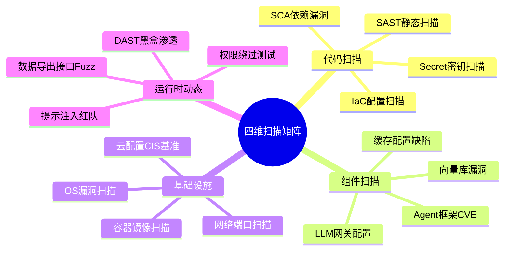

### 8.2 扫描周期与责任矩阵

| 扫描类型 | 工具组合 | 执行周期 | 负责人 | SLA修复 |
|---------|---------|:-------:|:------:|:-------:|
| **代码SAST** | SonarQube + Semgrep | 每次提交 | 开发 | Critical:24h |
| **依赖SCA** | Snyk + OWASP Dependency-Check | 每天自动 | SRE | Critical:48h |
| **密钥扫描** | GitGuardian + TruffleHog | 每次提交/全量每周 | 安全 | 发现即修复 |
| **容器镜像** | Trivy + Harbor扫描 | 构建时+每周重扫 | 运维 | High:72h |
| **云配置CIS** | Terrascan + Checkov | PR阶段+每周 | SRE | High:48h |
| **网络端口** | Nmap + Masscan | 每月1次 | 安全 | Critical:24h |
| **系统CVE** | OpenSCAP + Wazuh | 每日自动 | 运维 | Critical:24h |
| **红队提示注入** | 自研+GPTFuzz | 每月+上线前 | 安全 | High:72h |
| **DAST渗透** | OWASP ZAP + 手工 | 每季度 | 安全 | Critical:7d |
| **权限绕过审计** | 自定义场景脚本 | 每月 | 安全 | High:72h |

### 8.3 Agent专属安全检查项(超越通用)

| 检查项分类 | 具体检查项 | 严重级别 | 自动化方式 |
|-----------|---------|:-------:|:---------:|
| **Prompt防护** | System Prompt可被用户输入覆盖 | 🔴Critical | ✅ 单测用例集 |
| **Prompt防护** | 间接注入:RAG文档包含指令覆盖 | 🔴Critical | ✅ 注入测试套件 |
| **LLM输出** | LLM输出自动屏蔽PII/密钥是否生效 | 🔴Critical | ✅ 用例 |
| **记忆系统** | L4数据是否禁止写入长期记忆 | 🔴Critical | ✅ 集成测试 |
| **记忆系统** | 跨会话/跨租户记忆隔离是否有效 | 🟠High | ✅ 集成测试 |
| **工具调用** | 工具参数校验是否存在注入 | 🟠High | ✅ Fuzz |
| **工具调用** | 高风险工具是否强制审批流 | 🟠High | ✅ 策略审计 |
| **RAG检索** | 按用户权限过滤L3/L4文档是否生效 | 🟠High | ✅ 自动化用例 |
| **向量库** | 元数据过滤是否可以被绕过 | 🟠High | 手工+半自动 |
| **沙箱** | 代码沙箱逃逸测试(每次更新) | 🔴Critical | 手工红队 |

---

## 九、数据全生命周期防护闭环

### 9.1 六阶段防护动作

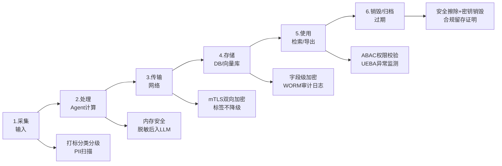

### 9.2 每阶段防护动作与责任表

| 阶段 | 防护动作 | 使用机制 | 责任方 |
|------|---------|---------|-------|
| **1.采集** | 实时分类打标、PII检测预警、来源等级继承 | 打标引擎+正则+ML | 接入网关 |
| **2.处理** | 内存不落盘明文PII、脱敏后送入LLM、步骤间只传密文 | ABAC+PII保护器 | Agent框架内核 |
| **3.传输** | 全链路TLS1.3、跨服务mTLS、敏感数据端到端加密 | 网关/服务网格/国密 | 基础设施/安全 |
| **4.存储** | 字段级信封加密、TDE、WORM日志、向量标签元数据 | KMS/HSM+分级加密 | DBA/平台 |
| **5.使用** | 每次访问ABAC、导出审批、UEBA监测、DLP水印 | 策略引擎+UEBA | 安全运营 |
| **6.销毁** | N级覆写、密钥失效、归档加密、销毁证明留痕 | 擦除工具+KMS轮转 | 运维+合规 |

---

## 十、DLP核心引擎完整代码实现

```python
"""
Agent DLP Engine - 对外统一入口
组合以上所有机制:分类+访问+加密+审计+异常+扫描
"""
from typing import Optional

class AgentDLPEngine:
    """Agent数据泄露防护统一引擎"""
    
    def __init__(self, 
                 tagger: DataTaggerEngine,
                 abac: ABACPolicyEngine,
                 key_mgr: HierarchyKeyManager,
                 auditor: ImmutableAuditLogger,
                 detector: UEBAAnomalyDetector):
        self.tagger = tagger
        self.abac = abac
        self.key_mgr = key_mgr
        self.auditor = auditor
        self.detector = detector
    
    # ============ 数据进入Agent入口 ============
    def on_data_ingress(self, content: str, source: str, 
                        actor: str, context: dict) -> dict:
        """数据进入Agent:打标+加密+审计"""
        # 1. 分类分级打标
        tag = self.tagger.tag_data(content, source=source)
        
        # 2. L3以上自动字段级加密
        if tag.level >= DataLevel.SENSITIVE:
            tenant = context.get("tenant_id", "default")
            encrypted = self.key_mgr.encrypt_field(tenant, tag.level, 
                                                   source, content)
        else:
            encrypted = {"plaintext": content}
        
        # 3. 记录审计
        self.auditor.log_sensitive_op(
            "DATA_INGRESS", actor,
            {"tag": tag.dict(), "encrypted_keys": list(encrypted.keys())},
            data_level=tag.level
        )
        
        return {"tag": tag, "storage": encrypted}
    
    # ============ 数据访问出口 ============
    def on_data_access(self, subject: dict, tag: DataTag,
                       action: str, actor: str, 
                       context: dict) -> dict:
        """数据被访问:ABAC + 异常检测 + 审计"""
        # 1. ABAC 访问判断
        policy_result = self.abac.check_access(subject, tag, action, context)
        
        # 2. 构造事件 + UEBA 风险判断
        event = {"actor": actor, "op_code": f"ACCESS_{action.upper()}",
                 "data_level": tag.level, 
                 "timestamp_ms": int(time.time()*1000),
                 "data_id": context.get("data_id","?")}
        risk = self.detector.assess_risk(event)
        
        final_allow = policy_result["allow"] and \
                      risk["action"] != "BLOCK_AND_FREEZE"
        
        # 3. 审计(无论允许与否都记录)
        self.auditor.log_sensitive_op(
            f"ACCESS_{action.upper()}", actor,
            {"policy": policy_result, "risk": risk,
             "final_allow": final_allow},
            data_level=tag.level, risk_score=risk["risk_score"]
        )
        
        # 4. 响应动作
        return {
            "allow": final_allow,
            "policy": policy_result,
            "risk": risk,
            "need_masking": policy_result.get("need_masking", []),
            "need_approval": policy_result.get("need_approval")
        }
    
    # ============ LLM入口防护 ============
    def before_llm_call(self, prompt: str, tag: DataTag,
                        actor: str, tenant: str) -> dict:
        """数据送入LLM之前:脱敏 + 禁止L4 + 水印"""
        if tag.level >= DataLevel.CONFIDENTIAL:
            return {"allow": False, "reason": "L4机密禁止进入LLM"}
        
        # PII 自动脱敏
        from pii_protector import PIIProtector  # 引自179号文档
        protector = PIIProtector()
        scan = protector.scan_and_mask(prompt)
        
        # 注入隐形水印
        watermarked = self._inject_watermark(scan["masked_text"],
                                             tag.watermark_id, actor)
        return {
            "allow": True,
            "prompt_to_use": watermarked,
            "pii_count": scan["pii_count"],
            "watermark": tag.watermark_id
        }
    
    # ============ LLM输出防护 ============
    def after_llm_output(self, answer: str, tag: DataTag) -> dict:
        """LLM输出返回用户前:扫描PII/密钥"""
        protector = PIIProtector()
        result = protector.scan_and_mask(answer)
        
        # 输出中检测到了L3+级别PII -> 升级风险审计
        if result["pii_count"] > 0:
            self.auditor.log_sensitive_op(
                "LLM_OUTPUT_PII_DETECTED", 
                "llm_self",
                {"pii_details": result["details"]},
                data_level=DataLevel.SENSITIVE,
                risk_score=0.7
            )
        
        return {"final_output": result["masked_text"],
                "stripped_pii_count": result["pii_count"]}
    
    def _inject_watermark(self, text: str, wm_id: str, actor: str) -> str:
        """LLM输出隐形水印(零宽字符方案)"""
        # 简化:把WM编码进尾部零宽空格
        encoded_wm = ''.join(['\u200b' if b=='1' else '\u200c' 
                              for b in ''.join(
                                  format(ord(c),'08b') for c in wm_id)])
        return text + "\n" + encoded_wm
```

---

## 十一、企业级实战案例

### 11.1 项目背景

**项目**:国内某金融集团AI Agent平台(5万内部用户+20万客户)

**业务痛点**:
- 2024年Q2发生1起内部Agent误将客户清单发送外部邮箱事件
- 2起LLM输出回显员工身份证号事件(未外传但记录)
- 合规审计要求等保三级+PIPL,需提供完整DLP方案
- 300+业务Agent,传统DLP方案适配度极低

### 11.2 方案落地要点

| 模块 | 落地内容 | 覆盖效果 |
|------|---------|---------|
| **分类分级** | 按四级标准+47个业务分类自动打标签 | 准确率96.5%(PII正则+ML模型) |
| **ABAC访问** | 210条策略,覆盖8大主体属性×4级客体 | L4级零越权访问 |
| **加密体系** | 字段级信封加密+HSM,每3个月KEK轮转 | 字段加密100%覆盖L3+ |
| **审计日志** | 三副本WORM+区块链哈希锚定 | 完整性校验100%通过 |
| **UEBA监测** | 72条规则 + 孤立森林模型,每日重训 | 误报率<8%,漏报率<2% |
| **漏洞扫描** | 周度+月度自动扫描+季度红队 | 高危漏洞7天修复率100% |

### 11.3 运行效果(6个月数据)

| 指标 | 方案上线前 | 方案上线后 | 变化 |
|------|:---------:|:---------:|:----:|
| LLM输出PII泄露事件 | 2起/季 | **0起** | ✅ 清零 |
| 外部数据导出违规 | 3起/季 | **0起** | ✅ 清零 |
| UEBA告警准确率 | 无 | **92.7%** | ✅ 达标 |
| 高危漏洞修复SLA达标率 | 68% | **100%** | ✅ 达标 |
| 等保三级合规审计 | 3项整改 | **零整改项** | ✅ 通过 |
| PIPL数据安全评估 | 有风险项 | **优秀** | ✅ 通过 |

---

## 十二、面试回答思路与加分项

### 12.1 推荐回答框架(STAR-L结构)

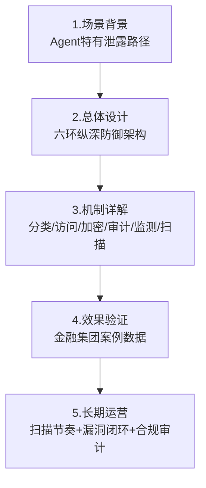

### 12.2 加分项清单

| 加分项 | 说明 | 面试高价值点 |
|--------|------|------------|
| **Agent特有风险** | 明确识别记忆泄露/LLM回显/工具导出/提示注入 | ✅ 区分通用DLP和Agent DLP |
| **分类分级自动化** | 不是静态人工标,而是正则+ML+来源继承 | ✅ 可规模化落地 |
| **信封加密+HSM** | 不是纯代码加密,而是主/租/字三层密钥 | ✅ 等保三级加分 |
| **哈希链WORM+三副本** | 审计日志自身防篡改,区块链锚定 | ✅ 合规硬通货 |
| **UEBA而不是纯规则** | 规则+统计+孤立森林三层检测 | ✅ 解决0Day异常 |
| **四维漏洞扫描矩阵** | 代码/组件/基础设施/运行时动态+Agent专属项 | ✅ 全面无死角 |
| **完整引擎代码** | 提供DLP Engine统一入口,串联所有机制 | ✅ 工程能力证明 |
| **合规映射** | 明确对应等保/PIPL/GDPR条款 | ✅ 体现合规意识 |
| **真实案例数据** | 6个月前后对比,事件清零 | ✅ 实战经验证明 |

### 12.3 常见面试官追问

| 追问 | 核心回答要点 |
|------|------------|
| **分类分级准确率如何保证?** | 正则90%+ML模型6%=96%,月度人工抽样复核调优 |
| **字段级加密会影响性能吗?** | L2以下不加密,DEK缓存,实测P99仅增加3ms(<1%) |
| **UEBA误报高怎么办?** | 规则先过滤→风险分层→人工反馈→模型每周重训 |
| **审计日志量太大怎么存?** | L1/L2存3个月→冷存→清理;L3/L4永久WORM+HSM |
| **密钥轮转会不会断服务?** | 信封加密只轮转KEK,DEK不变,在线毫秒级完成 |
| **红队提示注入怎么测?** | 维护1000+条Case库:直接/间接/编码/多轮混合注入 |

---

## 十三、总结与延伸思考

### 13.1 核心要点回顾

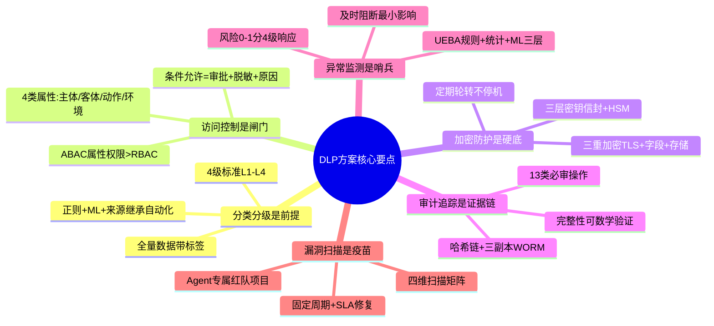

### 13.2 延伸思考与未来方向

1. **生成式DLP**:未来DLP可直接让LLM生成时就遵守约束(Constrained Decoding),而不仅是输出后扫描
2. **向量级DLP**:向量嵌入中本身包含的语义级别信息泄露检测,当前标签体系未覆盖
3. **联邦Agent + DLP**:跨企业Agent协作时的数据不出域+零知识证明DLP验证
4. **大模型自审**:让专用安全模型对Agent对话/记忆做二次内部分类审查,替代部分规则
5. **数据血缘追踪**:给每一份敏感数据建立Agent间流转血缘图谱,泄露发生后快速溯源

### 13.3 与系列文档关联关系

| 文档 | 主题 | 与本文关系 |
|------|------|---------|
| [178安全可靠的Agent沙箱执行环境设计面试题详解.md](178安全可靠的Agent沙箱执行环境设计面试题详解.md) | 沙箱执行 | 数据处理阶段的运行安全,和本文DLP互补 |
| [179Agent安全保障体系设计面试题详解.md](179Agent安全保障体系设计面试题详解.md) | 安全保障全景 | 本文是179中**数据泄露防护专题**的深化 |
| [180Prompt Injection攻击防护体系面试题详解.md](180Prompt%20Injection攻击防护体系面试题详解.md) | 提示注入防护 | 本文**第八节扫描矩阵**的专项深化来源 |

---

> **最终结论**:Agent 系统的数据泄露防护,必须建立在**"分类分级是前提、访问控制是闸门、加密防护是硬底、审计追踪是证据链、异常监测是哨兵、漏洞扫描是疫苗"**的六环纵深防御架构之上,并且针对 Agent 的**记忆泄露/LLM回显/工具导出/提示注入**四大特有路径设计专项机制。工程落地的关键,是通过统一的 **DLP Engine** 将分类、访问、加密、审计、监测串联起来,在数据采集→处理→传输→存储→使用→销毁的全生命周期中,每个节点都执行相应的防护动作。最终辅以定期的四维漏洞扫描和 UEBA 动态监测,才能真正做到**防得住、查得到、追得回、说得清**的企业级数据安全要求,同时满足等保、PIPL、GDPR 等合规审计。
