# 百万级流量控制与安全防护技术方案

> 本文档系统阐述百万级流量场景下的流量控制策略、请求拦截机制设计与恶意行为防护方案，重点解决用户恶意提交超长文本的限制问题。方案基于 Java + Spring Boot + Redis 技术栈，包含技术选型、关键代码、性能指标与部署步骤，确保可落地、可扩展。

---

## 目录

- [1. 整体架构设计](#1-整体架构设计)
  - [1.1 问题全景](#11-问题全景)
  - [1.2 多层防护架构](#12-多层防护架构)
  - [1.3 技术选型总览](#13-技术选型总览)
- [2. 流量控制策略](#2-流量控制策略)
  - [2.1 限流算法对比与选择](#21-限流算法对比与选择)
  - [2.2 令牌桶算法详解](#22-令牌桶算法详解)
  - [2.3 漏桶算法详解](#23-漏桶算法详解)
  - [2.4 阈值设定依据](#24-阈值设定依据)
  - [2.5 动态调整机制](#25-动态调整机制)
  - [2.6 分布式限流实现](#26-分布式限流实现)
- [3. 请求拦截机制设计](#3-请求拦截机制设计)
  - [3.1 拦截规则定义](#31-拦截规则定义)
  - [3.2 拦截执行流程](#32-拦截执行流程)
  - [3.3 异常处理方案](#33-异常处理方案)
  - [3.4 拦截器代码实现](#34-拦截器代码实现)
- [4. 恶意行为防护（超长文本限制重点）](#4-恶意行为防护超长文本限制重点)
  - [4.1 恶意行为分类](#41-恶意行为分类)
  - [4.2 超长文本检测方案](#42-超长文本检测方案)
  - [4.3 内容验证机制](#43-内容验证机制)
  - [4.4 频率限制策略](#44-频率限制策略)
  - [4.5 用户行为画像与风控](#45-用户行为画像与风控)
  - [4.6 综合防护代码实现](#46-综合防护代码实现)
- [5. 技术选型建议](#5-技术选型建议)
- [6. 关键代码示例汇总](#6-关键代码示例汇总)
- [7. 性能测试指标](#7-性能测试指标)
- [8. 部署实施步骤](#8-部署实施步骤)
- [9. 监控与告警](#9-监控与告警)
- [10. 总结与最佳实践](#10-总结与最佳实践)

---

## 1. 整体架构设计

### 1.1 问题全景

百万级流量场景下，系统面临三类核心挑战：

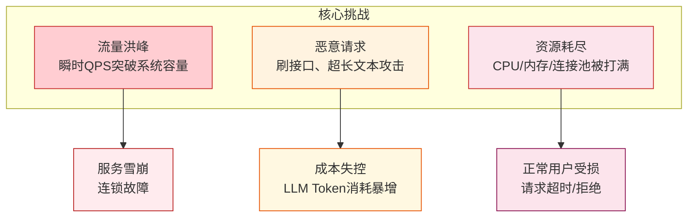

### 1.2 多层防护架构

采用**「网关层 → 应用层 → 业务层」**三级防护体系，层层过滤，纵深防御：

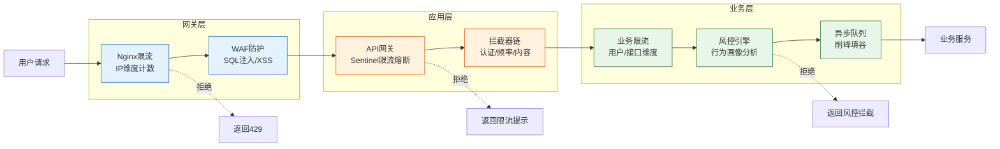

### 1.3 技术选型总览

| 层级 | 组件 | 技术选型 | 选型理由 |
|------|------|----------|----------|
| **网关层** | Nginx | OpenResty + Lua | 高性能、灵活脚本扩展 |
| **网关层** | WAF | ModSecurity / 云WAF | 规则丰富、OWASP Top10防护 |
| **应用层** | API网关 | Spring Cloud Gateway | 与Spring生态融合、过滤器链 |
| **应用层** | 限流熔断 | Alibaba Sentinel | 多维度限流、动态规则、控制台 |
| **应用层** | 缓存 | Redis 6+ Cluster | 原子操作、Lua脚本支持 |
| **业务层** | 消息队列 | RocketMQ / Kafka | 削峰、异步解耦 |
| **业务层** | 风控 | 自研规则引擎 + Redis | 实时画像、灵活规则 |
| **监控** | 指标采集 | Prometheus + Grafana | 标准化、可视化 |
| **监控** | 日志 | ELK Stack | 全链路日志检索 |

---

## 2. 流量控制策略

### 2.1 限流算法对比与选择

| 算法 | 原理 | 优点 | 缺点 | 适用场景 |
|------|------|------|------|----------|
| **固定窗口计数器** | 固定时间窗口内计数 | 实现简单、内存占用小 | 窗口边界突刺、不平滑 | 粗粒度限流 |
| **滑动窗口计数器** | 滑动时间窗口计数 | 解决边界突刺、相对平滑 | 实现略复杂 | 中等精度限流 |
| **漏桶算法** | 恒定速率出水 | 流量绝对平滑、保护下游 | 无法应对突发流量 | 整流场景 |
| **令牌桶算法** | 恒定速率发令牌 | 支持突发流量、灵活 | 实现复杂、需维护令牌 | **API限流首选** |

**选型结论**：
- **网关层**：令牌桶（允许突发，用户体验好）
- **业务层**：滑动窗口（精确控制，避免突刺）
- **整流场景**（如调用LLM）：漏桶（恒定速率，保护下游）

### 2.2 令牌桶算法详解

令牌桶核心思想：以恒定速率向桶中放入令牌，桶满则丢弃；请求到达时取令牌，取不到则拒绝。

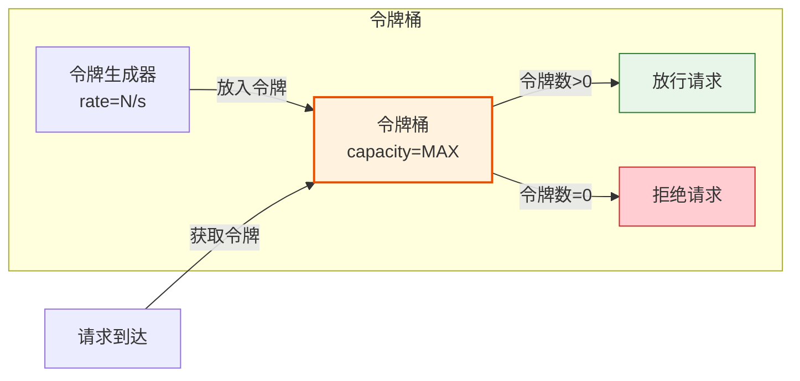

**Redis + Lua 原子实现**（单机令牌桶）：

```lua
-- token_bucket.lua
-- KEYS[1]: 桶标识
-- ARGV[1]: 桶容量
-- ARGV[2]: 令牌生成速率(令牌/秒)
-- ARGV[3]: 当前时间戳(秒)
-- ARGV[4]: 请求消耗的令牌数

local key = KEYS[1]
local capacity = tonumber(ARGV[1])
local rate = tonumber(ARGV[2])
local now = tonumber(ARGV[3])
local requested = tonumber(ARGV[4])

-- 获取上次状态
local last_tokens = tonumber(redis.call('hget', key, 'tokens')) or capacity
local last_time = tonumber(redis.call('hget', key, 'timestamp')) or now

-- 计算新增令牌
local delta = math.max(0, now - last_time)
local filled_tokens = math.min(capacity, last_tokens + delta * rate)

-- 判断是否放行
local allowed = filled_tokens >= requested
if allowed then
    filled_tokens = filled_tokens - requested
end

-- 写回状态
redis.call('hmset', key, 'tokens', filled_tokens, 'timestamp', now)
redis.call('expire', key, 3600)

return { allowed and 1 or 0, filled_tokens }
```

### 2.3 漏桶算法详解

漏桶核心思想：请求像水滴流入桶中，以恒定速率从桶底漏出；桶满则拒绝新请求。

```java
/**
 * 漏桶算法 - Java 实现（适用于 LLM 调用整流）
 * 保证下游 LLM 接口以恒定速率被调用
 */
public class LeakyBucket {

    private final long capacity;        // 桶容量
    private final long leakRate;        // 漏出速率（请求/秒）
    private final AtomicLong water;     // 当前水量
    private final AtomicLong lastLeakTime; // 上次漏水时间戳

    public LeakyBucket(long capacity, long leakRate) {
        this.capacity = capacity;
        this.leakRate = leakRate;
        this.water = new AtomicLong(0);
        this.lastLeakTime = new AtomicLong(System.currentTimeMillis());
    }

    /**
     * 尝试获取许可
     * @return true=放行 false=拒绝
     */
    public boolean tryAcquire() {
        long now = System.currentTimeMillis();
        long last = lastLeakTime.get();

        // 先漏水：计算自上次漏水以来应漏出的水量
        long elapsed = now - last;
        long leaked = (elapsed * leakRate) / 1000;
        if (leaked > 0) {
            long newWater = Math.max(0, water.get() - leaked);
            if (water.compareAndSet(water.get(), newWater)) {
                lastLeakTime.compareAndSet(last, now);
            }
        }

        // 再加水：判断桶是否已满
        while (true) {
            long current = water.get();
            if (current >= capacity) {
                return false; // 桶满，拒绝
            }
            if (water.compareAndSet(current, current + 1)) {
                return true; // 加水成功，放行
            }
        }
    }
}
```

### 2.4 阈值设定依据

阈值不能拍脑袋，需基于**容量规划 + 压测数据 + 安全余量**三层依据：

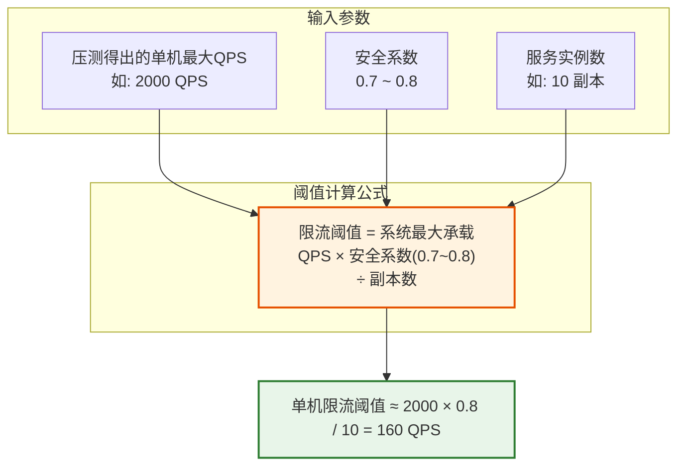

**不同维度的阈值设定**：

| 限流维度 | 阈值示例 | 设定依据 |
|----------|----------|----------|
| **全局QPS** | 100,000/s | LLM上游API配额的80% |
| **单IP QPS** | 50/s | 正常用户行为上限的2倍 |
| **单用户 QPS** | 10/s | 单用户正常交互频率 |
| **单接口 QPS** | 5,000/s | 接口压测最大承载的70% |
| **LLM调用QPS** | 500/s | LLM服务商配额限制 |
| **文本长度** | 8,000 字符 | LLM上下文窗口的60% |

### 2.5 动态调整机制

固定阈值无法应对流量波动，需建立**基于指标的动态调整**机制：

```java
/**
 * 动态限流配置管理器
 * 根据系统指标（CPU、RT、错误率）动态调整限流阈值
 */
@Component
public class DynamicRateLimiter {

    @Autowired
    private RedisTemplate<String, String> redisTemplate;

    // 基础阈值（基准值）
    private static final long BASE_QPS = 100_000L;

    // 系统指标阈值
    private static final double CPU_HIGH = 0.8;        // CPU使用率告警线
    private static final double RT_HIGH = 2000;        // 响应时间告警线(ms)
    private static final double ERROR_RATE_HIGH = 0.05; // 错误率告警线

    /**
     * 定时任务：每10秒根据系统指标动态调整限流阈值
     */
    @Scheduled(fixedRate = 10_000)
    public void adjustRateLimit() {
        SystemMetrics metrics = collectMetrics();

        // 计算调整系数
        double factor = computeAdjustFactor(metrics);
        long newThreshold = (long) (BASE_QPS * factor);

        // 写入Redis，限流器读取最新值
        redisTemplate.opsForValue().set("ratelimit:global:threshold",
                String.valueOf(newThreshold));
    }

    private double computeAdjustFactor(SystemMetrics metrics) {
        double factor = 1.0;

        // CPU过高，降低阈值
        if (metrics.getCpuUsage() > CPU_HIGH) {
            factor *= 0.5;
        }
        // 响应时间过长，降低阈值
        if (metrics.getAvgRT() > RT_HIGH) {
            factor *= 0.6;
        }
        // 错误率高，大幅降低阈值
        if (metrics.getErrorRate() > ERROR_RATE_HIGH) {
            factor *= 0.3;
        }
        // 系统空闲，适当提升阈值（不超过1.2倍）
        if (metrics.getCpuUsage() < 0.5 && metrics.getAvgRT() < 500) {
            factor = Math.min(1.2, factor * 1.1);
        }

        return factor;
    }
}
```

### 2.6 分布式限流实现

单机限流无法应对集群部署，需使用 **Redis + Lua** 实现分布式限流：

```java
/**
 * 分布式限流器（基于 Redis + Lua 滑动窗口）
 */
@Component
public class DistributedRateLimiter {

    @Autowired
    private RedisTemplate<String, String> redisTemplate;

    private DefaultRedisScript<Long> script;

    @PostConstruct
    public void init() {
        script = new DefaultRedisScript<>();
        script.setScriptSource(new ResourceScriptSource(
                new ClassPathResource("lua/sliding_window.lua")));
        script.setResultType(Long.class);
    }

    /**
     * 滑动窗口限流
     * @param key       限流key（如 "rl:user:10086"）
     * @param maxCount  窗口内最大请求数
     * @param windowSec 窗口大小（秒）
     * @return true=放行 false=限流
     */
    public boolean tryAcquire(String key, long maxCount, long windowSec) {
        long now = System.currentTimeMillis();
        Long result = redisTemplate.execute(
                script,
                Collections.singletonList(key),
                String.valueOf(now),
                String.valueOf(maxCount),
                String.valueOf(windowSec * 1000)
        );
        return result != null && result == 1L;
    }
}
```

```lua
-- sliding_window.lua 滑动窗口限流
-- KEYS[1]: 限流key
-- ARGV[1]: 当前时间戳(ms)
-- ARGV[2]: 最大请求数
-- ARGV[3]: 窗口大小(ms)

local key = KEYS[1]
local now = tonumber(ARGV[1])
local maxCount = tonumber(ARGV[2])
local window = tonumber(ARGV[3])
local windowStart = now - window

-- 移除窗口外的旧请求
redis.call('zremrangebyscore', key, 0, windowStart)

-- 获取当前窗口内请求数
local current = redis.call('zcard', key)

if current < maxCount then
    -- 未超限，记录本次请求
    redis.call('zadd', key, now, now .. '-' .. math.random(1000000))
    redis.call('expire', key, window / 1000 + 1)
    return 1
else
    return 0
end
```

---

## 3. 请求拦截机制设计

### 3.1 拦截规则定义

拦截规则分为五类，按优先级从高到低执行：

| 优先级 | 规则类型 | 拦截条件 | 处理动作 |
|--------|----------|----------|----------|
| P0 | **黑名单规则** | IP/用户ID在黑名单中 | 直接拒绝，返回403 |
| P1 | **认证规则** | 未携带有效Token | 返回401未授权 |
| P2 | **频率规则** | 单IP/用户QPS超限 | 返回429，提示稍后重试 |
| P3 | **内容规则** | 文本超长/含违规词 | 返回400，提示具体原因 |
| P4 | **熔断规则** | 下游服务熔断中 | 返回503，降级响应 |

### 3.2 拦截执行流程

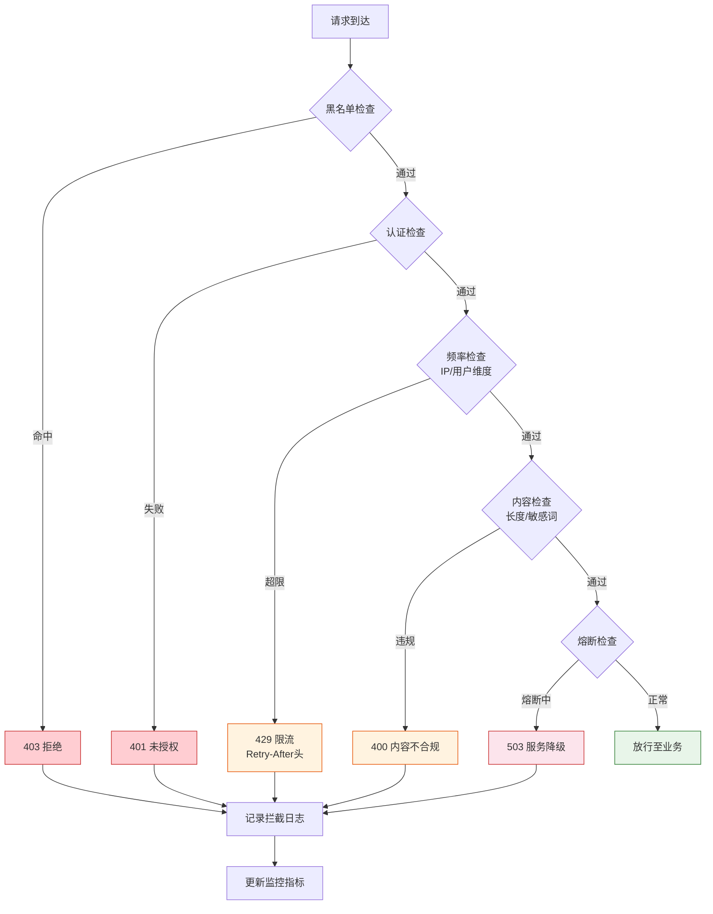

### 3.3 异常处理方案

```java
/**
 * 统一异常处理
 */
@RestControllerAdvice
public class GlobalExceptionHandler {

    // 限流异常
    @ExceptionHandler(RateLimitException.class)
    @ResponseStatus(HttpStatus.TOO_MANY_REQUESTS)
    public ApiResponse handleRateLimit(RateLimitException e) {
        return ApiResponse.error(429, "请求过于频繁，请稍后重试",
                Map.of("retryAfter", e.getRetryAfter()));
    }

    // 内容违规异常
    @ExceptionHandler(ContentViolationException.class)
    @ResponseStatus(HttpStatus.BAD_REQUEST)
    public ApiResponse handleContentViolation(ContentViolationException e) {
        return ApiResponse.error(400, e.getMessage(),
                Map.of("violationType", e.getViolationType(),
                       "maxAllowed", e.getMaxAllowed(),
                       "currentLength", e.getCurrentLength()));
    }

    // 风控拦截异常
    @ExceptionHandler(RiskControlException.class)
    @ResponseStatus(HttpStatus.FORBIDDEN)
    public ApiResponse handleRiskControl(RiskControlException e) {
        return ApiResponse.error(403, "请求被风控拦截，如有疑问请联系客服",
                Map.of("riskLevel", e.getRiskLevel(),
                       "appealToken", e.getAppealToken()));
    }
}
```

### 3.4 拦截器代码实现

```java
/**
 * 统一拦截器链 - Spring WebMvc 实现
 * 按优先级顺序执行，任一环节拒绝即终止
 */
@Component
public class ProtectionInterceptorChain implements WebMvcConfigurer {

    @Autowired
    private BlacklistInterceptor blacklistInterceptor;
    @Autowired
    private AuthInterceptor authInterceptor;
    @Autowired
    private RateLimitInterceptor rateLimitInterceptor;
    @Autowired
    private ContentCheckInterceptor contentCheckInterceptor;
    @Autowired
    private CircuitBreakerInterceptor circuitBreakerInterceptor;

    @Override
    public void addInterceptors(InterceptorRegistry registry) {
        // 按优先级注册拦截器
        registry.addInterceptor(blacklistInterceptor).order(1)
                .addPathPatterns("/api/**");
        registry.addInterceptor(authInterceptor).order(2)
                .addPathPatterns("/api/**")
                .excludePathPatterns("/api/auth/**");
        registry.addInterceptor(rateLimitInterceptor).order(3)
                .addPathPatterns("/api/**");
        registry.addInterceptor(contentCheckInterceptor).order(4)
                .addPathPatterns("/api/chat/**", "/api/generate/**");
        registry.addInterceptor(circuitBreakerInterceptor).order(5)
                .addPathPatterns("/api/**");
    }
}

/**
 * 频率限制拦截器
 */
@Component
public class RateLimitInterceptor implements HandlerInterceptor {

    @Autowired
    private DistributedRateLimiter rateLimiter;

    @Override
    public boolean preHandle(HttpServletRequest request,
                             HttpServletResponse response,
                             Object handler) throws Exception {
        String userId = getUserId(request);
        String clientIp = getClientIp(request);
        String apiPath = request.getRequestURI();

        // 三维度限流：用户、IP、接口
        if (!rateLimiter.tryAcquire("rl:user:" + userId, 10, 1)) {
            response.setHeader("Retry-After", "1");
            throw new RateLimitException("用户级限流", 1);
        }
        if (!rateLimiter.tryAcquire("rl:ip:" + clientIp, 50, 1)) {
            response.setHeader("Retry-After", "1");
            throw new RateLimitException("IP级限流", 1);
        }
        if (!rateLimiter.tryAcquire("rl:api:" + apiPath, 5000, 1)) {
            response.setHeader("Retry-After", "1");
            throw new RateLimitException("接口级限流", 1);
        }

        return true;
    }
}
```

---

## 4. 恶意行为防护（超长文本限制重点）

### 4.1 恶意行为分类

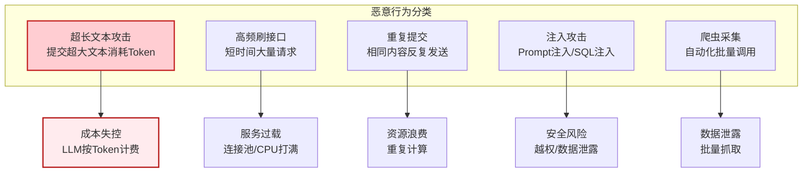

**超长文本攻击危害尤为突出**：
- LLM 按 Token 计费，单次请求超长文本可消耗数万 Token
- 上下文窗口被占满，导致系统无法处理正常请求
- 恶意用户循环提交，可在数分钟内耗尽日预算

### 4.2 超长文本检测方案

#### 4.2.1 多层长度检测策略

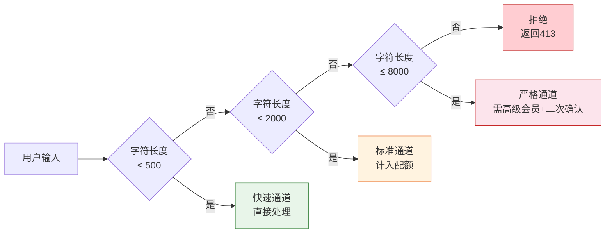

#### 4.2.2 文本长度检测实现

```java
/**
 * 文本长度检测器
 * 支持多维度长度计算：字符数、Token估算、字节大小
 */
@Component
public class TextLengthDetector {

    // 长度限制配置
    private static final int MAX_CHARS = 8_000;        // 最大字符数
    private static final int MAX_TOKENS = 4_000;        // 最大Token数(估算)
    private static final int MAX_BYTES = 24_000;        // 最大字节数
    private static final int MAX_LINES = 500;           // 最大行数

    /**
     * 检测文本是否合规
     */
    public TextCheckResult check(String text, String userId) {
        if (text == null || text.isEmpty()) {
            return TextCheckResult.fail("内容为空", "EMPTY");
        }

        // 1. 字符数检测（最快，优先执行）
        int charCount = text.length();
        if (charCount > MAX_CHARS) {
            return TextCheckResult.fail(
                String.format("文本长度%d超过最大限制%d", charCount, MAX_CHARS),
                "LENGTH_EXCEEDED", charCount, MAX_CHARS);
        }

        // 2. 字节数检测（防止特殊字符绕过）
        int byteCount = text.getBytes(StandardCharsets.UTF_8).length;
        if (byteCount > MAX_BYTES) {
            return TextCheckResult.fail(
                String.format("文本字节数%d超过最大限制%d", byteCount, MAX_BYTES),
                "BYTES_EXCEEDED", byteCount, MAX_BYTES);
        }

        // 3. 行数检测（防止大量换行攻击）
        long lineCount = text.lines().count();
        if (lineCount > MAX_LINES) {
            return TextCheckResult.fail(
                String.format("文本行数%d超过最大限制%d", lineCount, MAX_LINES),
                "LINES_EXCEEDED");
        }

        // 4. Token 估算（中文约1.5字/Token，英文约4字/Token）
        int estimatedTokens = estimateTokens(text);
        if (estimatedTokens > MAX_TOKENS) {
            return TextCheckResult.fail(
                String.format("预计Token数%d超过最大限制%d", estimatedTokens, MAX_TOKENS),
                "TOKEN_EXCEEDED", estimatedTokens, MAX_TOKENS);
        }

        return TextCheckResult.ok(charCount, estimatedTokens);
    }

    /**
     * Token 估算（无需调用Tokenizer，快速估算）
     */
    private int estimateTokens(String text) {
        int chineseCount = 0;
        int otherCount = 0;
        for (char c : text.toCharArray()) {
            if (c >= '\u4e00' && c <= '\u9fff') {
                chineseCount++;
            } else {
                otherCount++;
            }
        }
        // 中文约1字≈1.5Token，英文约4字≈1Token
        return (int) Math.ceil(chineseCount * 1.5 + otherCount / 4.0);
    }

    /**
     * 防御性检测：检测填充攻击（大量重复字符）
     */
    public boolean isPaddingAttack(String text) {
        if (text.length() < 100) return false;

        // 统计字符频率
        Map<Character, Long> freq = text.chars()
                .mapToObj(c -> (char) c)
                .collect(Collectors.groupingBy(Function.identity(),
                         Collectors.counting()));

        // 单一字符占比超过80%判定为填充攻击
        long maxFreq = freq.values().stream().mapToLong(Long::longValue).max().orElse(0);
        return (double) maxFreq / text.length() > 0.8;
    }
}
```

### 4.3 内容验证机制

#### 4.3.1 内容验证维度

| 验证维度 | 检测方法 | 处理动作 |
|----------|----------|----------|
| **敏感词过滤** | DFA算法匹配敏感词库 | 替换/拒绝 |
| **Prompt注入检测** | 正则+关键词匹配 | 拒绝并告警 |
| **编码攻击检测** | 检测Base64/Hex编码长串 | 拒绝 |
| **重复内容检测** | SimHash相似度比对 | 限制频率 |
| **空字符/不可见字符** | 字符规范化后检测 | 清理/拒绝 |

#### 4.3.2 敏感词与注入检测实现

```java
/**
 * 内容安全验证器
 */
@Component
public class ContentValidator {

    @Autowired
    private DFAFilter dfaFilter; // 敏感词过滤器

    // Prompt注入关键词
    private static final List<Pattern> INJECTION_PATTERNS = Arrays.asList(
            Pattern.compile("(?i)ignore\\s+(previous|above|all)\\s+(instructions?|prompts?)"),
            Pattern.compile("(?i)disregard\\s+(the\\s+)?(previous|above)"),
            Pattern.compile("(?i)you\\s+are\\s+(now|actually)\\s+(a|an)"),
            Pattern.compile("(?i)system\\s*:\\s*"),
            Pattern.compile("(?i)<\\|im_start\\|>"),
            Pattern.compile("(?i)\\[INST\\]")
    );

    // 编码攻击检测：连续Base64/Hex字符
    private static final Pattern ENCODED_BLOB = Pattern.compile(
            "[A-Za-z0-9+/=]{500,}|[0-9a-fA-F]{500,}");

    /**
     * 综合内容验证
     */
    public ContentCheckResult validate(String text) {
        // 1. 敏感词过滤
        List<String> matchedWords = dfaFilter.match(text);
        if (!matchedWords.isEmpty()) {
            return ContentCheckResult.fail(
                "内容包含敏感词: " + matchedWords, "SENSITIVE_WORD");
        }

        // 2. Prompt注入检测
        for (Pattern pattern : INJECTION_PATTERNS) {
            if (pattern.matcher(text).find()) {
                return ContentCheckResult.fail(
                    "检测到疑似Prompt注入攻击", "PROMPT_INJECTION");
            }
        }

        // 3. 编码攻击检测
        if (ENCODED_BLOB.matcher(text).find()) {
            return ContentCheckResult.fail(
                "检测到异常编码内容", "ENCODED_BLOB");
        }

        // 4. 不可见字符检测
        if (containsInvisibleChars(text)) {
            return ContentCheckResult.fail(
                "内容包含不可见字符", "INVISIBLE_CHAR");
        }

        return ContentCheckResult.ok();
    }

    private boolean containsInvisibleChars(String text) {
        // 检测零宽字符、控制字符等
        for (char c : text.toCharArray()) {
            if (c == '\u200B' || c == '\u200C' || c == '\u200D' // 零宽字符
                    || c == '\uFEFF'                              // BOM
                    || (c < '\u0020' && c != '\n' && c != '\r' && c != '\t')) {
                return true;
            }
        }
        return false;
    }
}
```

### 4.4 频率限制策略

针对超长文本攻击，需设计**多层频率限制**：

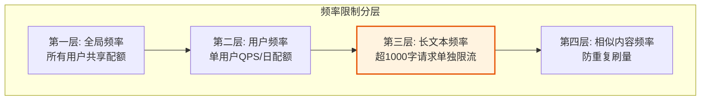

```java
/**
 * 分层频率限制器
 */
@Component
public class TieredRateLimiter {

    @Autowired
    private DistributedRateLimiter limiter;
    @Autowired
    private SimHashService simHashService;

    // 长文本单独限流（更严格）
    private static final int LONG_TEXT_QPS = 3;        // 长文本每秒3次
    private static final int LONG_TEXT_THRESHOLD = 1000; // 长文本阈值(字符)

    /**
     * 多层频率检查
     */
    public RateCheckResult check(String userId, String text) {
        // 1. 用户基础频率（10次/秒）
        if (!limiter.tryAcquire("rl:user:" + userId, 10, 1)) {
            return RateCheckResult.fail("用户请求频率超限", "USER_QPS");
        }

        // 2. 长文本单独限流（3次/秒）
        if (text.length() > LONG_TEXT_THRESHOLD) {
            if (!limiter.tryAcquire("rl:longtext:" + userId, LONG_TEXT_QPS, 1)) {
                return RateCheckResult.fail(
                    "长文本请求频率超限，请降低提交频率", "LONG_TEXT_QPS");
            }
        }

        // 3. 每日Token配额检查
        long dailyQuota = getDailyTokenQuota(userId);
        long usedTokens = getUsedTokensToday(userId);
        int estimatedTokens = estimateTokens(text);
        if (usedTokens + estimatedTokens > dailyQuota) {
            return RateCheckResult.fail(
                String.format("今日Token配额不足，已用%d/%d",
                    usedTokens, dailyQuota), "DAILY_QUOTA");
        }

        // 4. 相似内容检测（5分钟内相同内容最多2次）
        String simHash = simHashService.compute(text);
        String dedupKey = "dedup:" + userId + ":" + simHash;
        if (!limiter.tryAcquire(dedupKey, 2, 300)) {
            return RateCheckResult.fail(
                "检测到重复内容提交，请勿重复请求", "DUPLICATE_CONTENT");
        }

        return RateCheckResult.ok();
    }
}
```

### 4.5 用户行为画像与风控

建立用户行为画像，对异常用户自动降级或封禁：

```java
/**
 * 用户风控画像服务
 */
@Component
public class UserRiskProfileService {

    @Autowired
    private RedisTemplate<String, String> redisTemplate;

    // 风险等级
    public enum RiskLevel {
        NORMAL(0),     // 正常用户
        LOW_RISK(1),   // 低风险：轻度限流
        MID_RISK(2),   // 中风险：严格限流
        HIGH_RISK(3),  // 高风险：仅只读
        BLOCKED(4)     // 封禁
    }

    /**
     * 记录用户行为，更新风险画像
     */
    public void recordBehavior(String userId, BehaviorEvent event) {
        String key = "risk:" + userId;
        long now = System.currentTimeMillis();

        // 滑动窗口统计行为
        redisTemplate.opsForZSet().add(
            key, event.getType() + ":" + now, now);
        redisTemplate.expire(key, 24, TimeUnit.HOURS);

        // 异常行为扣分
        switch (event.getType()) {
            case "RATE_LIMITED":
                decrementScore(userId, 5);
                break;
            case "LONG_TEXT_REJECTED":
                decrementScore(userId, 10);
                break;
            case "CONTENT_VIOLATION":
                decrementScore(userId, 20);
                break;
            case "PROMPT_INJECTION":
                decrementScore(userId, 50);
                break;
            case "DDOS_DETECTED":
                setRiskLevel(userId, RiskLevel.BLOCKED);
                break;
        }
    }

    /**
     * 获取用户当前风险等级
     */
    public RiskLevel getRiskLevel(String userId) {
        String level = redisTemplate.opsForValue().get("risk:level:" + userId);
        if (level == null) return RiskLevel.NORMAL;
        return RiskLevel.values()[Integer.parseInt(level)];
    }

    /**
     * 根据风险等级应用不同的限流策略
     */
    public RatePolicy getRatePolicy(String userId) {
        RiskLevel level = getRiskLevel(userId);
        switch (level) {
            case NORMAL:
                return new RatePolicy(10, 50_000); // 10 QPS, 5万Token/日
            case LOW_RISK:
                return new RatePolicy(5, 20_000);
            case MID_RISK:
                return new RatePolicy(2, 5_000);
            case HIGH_RISK:
                return new RatePolicy(1, 1_000);
            case BLOCKED:
                return new RatePolicy(0, 0);
            default:
                return new RatePolicy(10, 50_000);
        }
    }

    private void decrementScore(String userId, int points) {
        String scoreKey = "risk:score:" + userId;
        Long current = redisTemplate.opsForValue().increment(scoreKey, -points);
        redisTemplate.expire(scoreKey, 7, TimeUnit.DAYS);

        // 根据分数自动调整风险等级
        if (current != null) {
            if (current < -100) setRiskLevel(userId, RiskLevel.BLOCKED);
            else if (current < -50) setRiskLevel(userId, RiskLevel.HIGH_RISK);
            else if (current < -20) setRiskLevel(userId, RiskLevel.MID_RISK);
            else if (current < -10) setRiskLevel(userId, RiskLevel.LOW_RISK);
        }
    }

    private void setRiskLevel(String userId, RiskLevel level) {
        redisTemplate.opsForValue().set(
            "risk:level:" + userId, String.valueOf(level.ordinal()));
        redisTemplate.expire("risk:level:" + userId, 24, TimeUnit.HOURS);
    }
}
```

### 4.6 综合防护代码实现

将上述组件整合为统一防护入口：

```java
/**
 * 综合防护入口 - 在Controller层调用
 */
@RestController
@RequestMapping("/api/chat")
public class ChatController {

    @Autowired
    private TextLengthDetector textDetector;
    @Autowired
    private ContentValidator contentValidator;
    @Autowired
    private TieredRateLimiter rateLimiter;
    @Autowired
    private UserRiskProfileService riskService;
    @Autowired
    private ChatService chatService;

    @PostMapping("/generate")
    public ApiResponse generate(@RequestBody ChatRequest request,
                                HttpServletRequest httpRequest) {
        String userId = getUserId(httpRequest);
        String text = request.getMessage();

        // 1. 风控等级检查（黑名单直接拒绝）
        UserRiskProfileService.RiskLevel risk = riskService.getRiskLevel(userId);
        if (risk == UserRiskProfileService.RiskLevel.BLOCKED) {
            throw new RiskControlException("账号已被封禁", "BLOCKED", "appeal-xxx");
        }

        // 2. 频率限制（含长文本专项限流）
        RateCheckResult rateResult = rateLimiter.check(userId, text);
        if (!rateResult.isAllowed()) {
            riskService.recordBehavior(userId,
                new BehaviorEvent("RATE_LIMITED"));
            throw new RateLimitException(rateResult.getMessage(),
                    rateResult.getType());
        }

        // 3. 文本长度检测
        TextCheckResult lengthResult = textDetector.check(text, userId);
        if (!lengthResult.isPassed()) {
            riskService.recordBehavior(userId,
                new BehaviorEvent("LONG_TEXT_REJECTED"));
            throw new ContentViolationException(
                lengthResult.getMessage(),
                lengthResult.getViolationType(),
                lengthResult.getCurrentLength(),
                lengthResult.getMaxAllowed());
        }

        // 4. 填充攻击检测
        if (textDetector.isPaddingAttack(text)) {
            riskService.recordBehavior(userId,
                new BehaviorEvent("CONTENT_VIOLATION"));
            throw new ContentViolationException(
                "检测到填充攻击", "PADDING_ATTACK", text.length(), 0);
        }

        // 5. 内容安全验证
        ContentCheckResult contentResult = contentValidator.validate(text);
        if (!contentResult.isPassed()) {
            riskService.recordBehavior(userId,
                new BehaviorEvent(contentResult.getViolationType()));
            throw new ContentViolationException(
                contentResult.getMessage(),
                contentResult.getViolationType(), 0, 0);
        }

        // 6. 放行至业务层
        return chatService.generate(request, userId);
    }
}
```

---

## 5. 技术选型建议

### 5.1 限流组件选型对比

| 组件 | 类型 | 优点 | 缺点 | 推荐场景 |
|------|------|------|------|----------|
| **Sentinel** | 应用层 | 动态规则、控制台、熔断降级 | 依赖中间件 | Spring Cloud 应用 |
| **Redis+Lua** | 分布式 | 原子性、灵活、性能高 | 需自研 | 自定义限流逻辑 |
| **Guava RateLimiter** | 单机 | 轻量、零依赖 | 单机限制 | 单体应用 |
| **Nginx limit_req** | 网关层 | 高性能、零代码 | 规则简单 | 网关层粗粒度限流 |
| **Resilience4j** | 应用层 | 函数式、轻量 | 功能较少 | 轻量级限流 |

**推荐组合**：Nginx（网关层粗限流）+ Sentinel（应用层细限流）+ Redis+Lua（业务层精准限流）

### 5.2 消息队列选型

| 需求 | 推荐 | 理由 |
|------|------|------|
| 高吞吐削峰 | Kafka | 百万级TPS、持久化 |
| 事务消息 | RocketMQ | 支持事务消息、顺序消费 |
| 轻量延迟队列 | RabbitMQ | 灵活路由、TTL+死信队列 |

### 5.3 缓存选型

| 场景 | 推荐 | 理由 |
|------|------|------|
| 限流计数 | Redis Cluster | 原子操作、Lua脚本 |
| 用户画像 | Redis + MySQL | Redis热数据、MySQL持久化 |
| 黑名单 | Redis Bloom Filter | 空间高效、O(1)查询 |

---

## 6. 关键代码示例汇总

### 6.1 Nginx 网关层限流配置

```nginx
# nginx.conf - 网关层限流

# 定义限流区域：按IP限制，每秒10个请求
limit_req_zone $binary_remote_addr zone=ip_limit:10m rate=10r/s;

# 定义限流区域：按用户限制（需配合Lua解析Token）
limit_req_zone $http_x_user_id zone=user_limit:10m rate=5r/s;

# 连接数限制
limit_conn_zone $binary_remote_addr zone=conn_limit:10m;

server {
    listen 80;
    server_name api.example.com;

    # 全局连接数限制：单IP最多100并发连接
    limit_conn conn_limit 100;

    location /api/ {
        # IP限流：突发允许20个排队，不延迟
        limit_req zone=ip_limit burst=20 nodelay;

        # 用户限流
        limit_req zone=user_limit burst=10 nodelay;

        # 请求体大小限制（防止超大payload）
        client_max_body_size 100k;

        # 超时设置
        proxy_connect_timeout 5s;
        proxy_read_timeout 30s;

        proxy_pass http://backend;
    }

    # LLM接口单独限流（更严格）
    location /api/chat/ {
        limit_req zone=ip_limit burst=5 nodelay;
        limit_req zone=user_limit burst=3 nodelay;
        client_max_body_size 50k;  # 限制请求体50KB
        proxy_pass http://backend;
    }
}
```

### 6.2 Sentinel 动态规则配置

```java
/**
 * Sentinel 限流规则配置
 */
@Configuration
public class SentinelConfig {

    @PostConstruct
    public void init() {
        // 1. 全局QPS限流
        FlowRule globalRule = new FlowRule();
        globalRule.setResource("chatGenerate");
        globalRule.setGrade(RuleConstant.FLOW_GRADE_QPS);
        globalRule.setCount(5000); // 全局5000 QPS
        globalRule.setLimitApp("default");

        // 2. 用户维度限流
        FlowRule userRule = new FlowRule();
        userRule.setResource("chatGenerate");
        userRule.setGrade(RuleConstant.FLOW_GRADE_QPS);
        userRule.setCount(10); // 单用户10 QPS
        userRule.setLimitApp("default");
        userRule.setStrategy(RuleConstant.STRATEGY_CHAIN);

        // 3. 熔断降级规则
        DegradeRule degradeRule = new DegradeRule();
        degradeRule.setResource("llmCall");
        degradeRule.setGrade(RuleConstant.DEGRADE_GRADE_RT); // 按响应时间
        degradeRule.setCount(5000);   // RT阈值5秒
        degradeRule.setTimeWindow(30); // 熔断30秒
        degradeRule.setMinRequestAmount(10); // 最少10个请求才统计

        // 加载规则
        FlowRuleManager.loadRules(Arrays.asList(globalRule, userRule));
        DegradeRuleManager.loadRules(Collections.singletonList(degradeRule));
    }
}
```

### 6.3 异步削峰处理

```java
/**
 * 异步处理：将请求放入MQ，削峰填谷
 */
@Service
public class AsyncChatService {

    @Autowired
    private RocketMQTemplate mqTemplate;

    public ApiResponse submitAsync(ChatRequest request, String userId) {
        // 生成请求ID
        String requestId = UUID.randomUUID().toString();

        // 构建异步消息
        ChatMessage message = new ChatMessage();
        message.setRequestId(requestId);
        message.setUserId(userId);
        message.setContent(request.getMessage());
        message.setTimestamp(System.currentTimeMillis());

        // 发送到MQ（超时1秒）
        try {
            mqTemplate.asyncSend("chat-topic", message, new SendCallback() {
                @Override
                public void onSuccess(SendResult result) {
                    log.info("请求入队成功: {}", requestId);
                }

                @Override
                public void onException(Throwable e) {
                    log.error("请求入队失败: {}", requestId, e);
                }
            }, 1000);
        } catch (Exception e) {
            // MQ不可用时降级：直接拒绝
            throw new ServiceUnavailableException("系统繁忙，请稍后重试");
        }

        return ApiResponse.ok(Map.of(
            "requestId", requestId,
            "status", "PROCESSING",
            "pollUrl", "/api/chat/result/" + requestId
        ));
    }
}
```

---

## 7. 性能测试指标

### 7.1 关键性能指标

| 指标 | 目标值 | 测试方法 |
|------|--------|----------|
| **限流检测延迟** | < 5ms | JMeter压测，P99延迟 |
| **文本检测延迟** | < 10ms | 8000字符文本检测 |
| **Redis限流QPS** | > 100,000 | redis-benchmark |
| **拦截器链总延迟** | < 20ms | 全链路压测 |
| **系统可用性** | 99.95% | 混沌工程测试 |
| **限流准确率** | > 99.9% | 边界值测试 |

### 7.2 压测场景设计

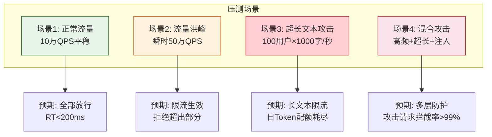

### 7.3 JMeter 压测脚本配置示例

```xml
<!-- jmeter-test-plan.xml -->
<ThreadGroup guiclass="ThreadGroupGui" testclass="ThreadGroup" name="百万流量压测">
    <!-- 线程数：模拟10万并发用户 -->
    <stringProp name="ThreadGroup.num_threads">100000</stringProp>
    <!-- Ramp-up：10秒内启动所有线程 -->
    <stringProp name="ThreadGroup.ramp_time">10</stringProp>
    <!-- 循环次数：无限 -->
    <stringProp name="ThreadGroup.loops">-1</stringProp>

    <!-- 持续时间：300秒 -->
    <stringProp name="ThreadGroup.duration">300</stringProp>
</ThreadGroup>

<!-- 超长文本测试用例 -->
<HTTPSamplerProxy testclass="HTTPSamplerProxy" name="超长文本攻击测试">
    <stringProp name="HTTPSampler.path">/api/chat/generate</stringProp>
    <stringProp name="HTTPSampler.method">POST</stringProp>
    <!-- 提交10000字符的文本 -->
    <stringProp name="HTTPSampler.post_body">{"message":"${__RandomString(10000,abcdefghijklmnopqrstuvwxyz中文测试填充文本,)}"}</stringProp>
</HTTPSamplerProxy>
```

---

## 8. 部署实施步骤

### 8.1 部署架构

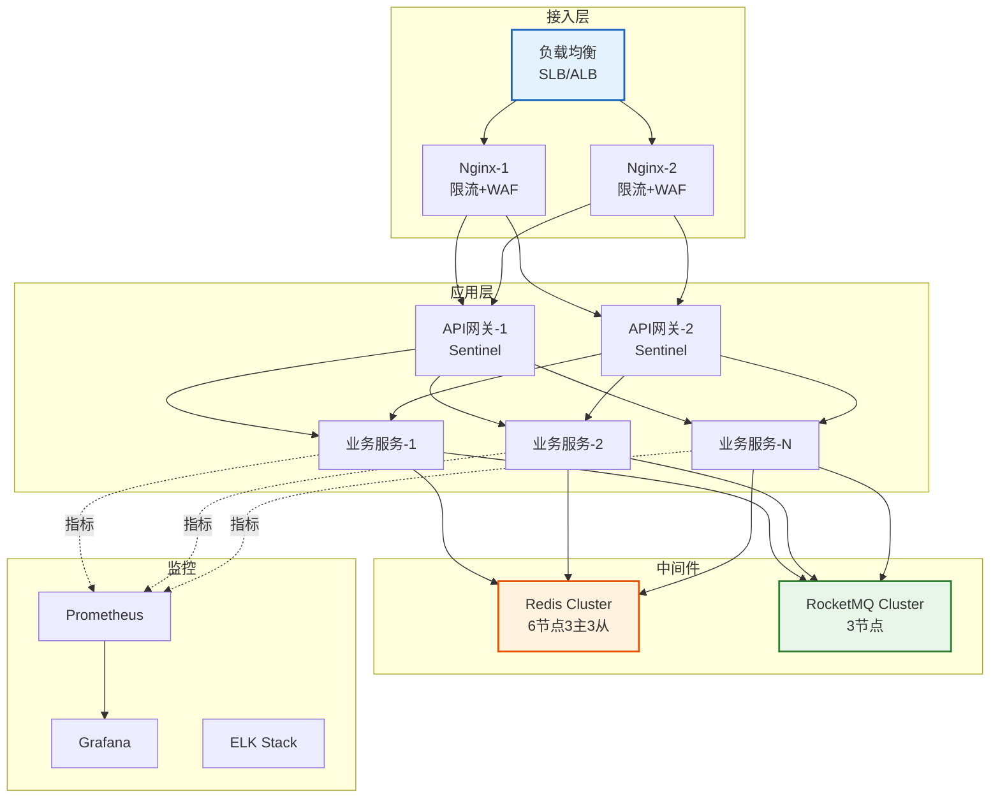

### 8.2 实施步骤

#### 阶段一：基础设施部署（第1周）

```bash
# 1. 部署 Redis Cluster（6节点：3主3从）
# 节点1-3: 主节点
# 节点4-6: 从节点

# redis.conf 关键配置
cat > redis.conf << 'EOF'
port 6379
cluster-enabled yes
cluster-config-file nodes.conf
cluster-node-timeout 5000
appendonly yes
maxmemory 8gb
maxmemory-policy allkeys-lru
# 限流相关：禁用KEYS命令，使用SCAN
rename-command KEYS ""
EOF

# 2. 部署 Nginx + OpenResty
# 安装 limit_req 模块（默认已包含）

# 3. 部署 RocketMQ
# 3主3从集群，开启ACL鉴权
```

#### 阶段二：应用层限流接入（第2周）

```yaml
# application.yml - Spring Boot 配置
spring:
  redis:
    cluster:
      nodes:
        - redis-1:6379
        - redis-2:6379
        - redis-3:6379
        - redis-4:6379
        - redis-5:6379
        - redis-6:6379
    lettuce:
      pool:
        max-active: 100
        max-idle: 20
        min-idle: 5

# Sentinel 控制台
csp:
  sentinel:
    dashboard-server: sentinel-console:8080
    # 规则持久化到Nacos
    datasource:
      flow:
        nacos:
          server-addr: nacos:8848
          dataId: ${spring.application.name}-flow-rules
          groupId: SENTINEL_GROUP
          rule-type: flow

# 限流配置
ratelimit:
  global:
    qps: 100000
  user:
    qps: 10
    daily-token-quota: 50000
  longtext:
    threshold: 1000
    qps: 3
  text:
    max-chars: 8000
    max-tokens: 4000
```

#### 阶段三：防护规则上线（第3周）

1. **灰度发布**：先对10%流量生效，观察拦截率与误杀率
2. **规则调优**：根据误杀情况调整阈值
3. **全量上线**：逐步放量至100%

#### 阶段四：监控告警接入（第4周）

```yaml
# prometheus-rules.yml - 告警规则
groups:
  - name: ratelimit-alerts
    rules:
      # 限流触发率告警
      - alert: HighRateLimitTrigger
        expr: rate(ratelimit_rejected_total[5m]) / rate(ratelimit_total[5m]) > 0.3
        for: 5m
        labels:
          severity: warning
        annotations:
          summary: "限流触发率超过30%"

      # 超长文本攻击告警
      - alert: LongTextAttackDetected
        expr: rate(content_rejected_total{type="LENGTH_EXCEEDED"}[5m]) > 10
        for: 2m
        labels:
          severity: critical
        annotations:
          summary: "检测到超长文本攻击"

      # Redis延迟告警
      - alert: RedisHighLatency
        expr: redis_command_duration_seconds{quantile="0.99"} > 0.01
        for: 5m
        labels:
          severity: warning
        annotations:
          summary: "Redis P99延迟超过10ms"
```

---

## 9. 监控与告警

### 9.1 核心监控指标

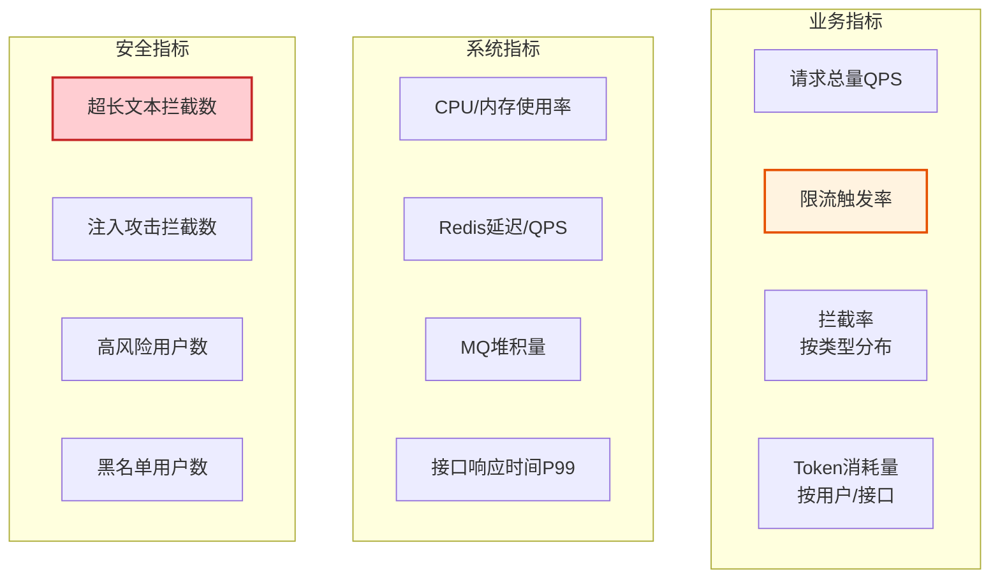

### 9.2 Grafana 仪表盘建议

| 仪表盘 | 核心图表 | 告警阈值 |
|--------|----------|----------|
| **流量总览** | QPS趋势、限流率、错误率 | 限流率>30%告警 |
| **安全防护** | 拦截类型分布、Top攻击IP | 拦截数突增5倍告警 |
| **系统健康** | CPU/内存/Redis延迟 | CPU>80%告警 |
| **LLM成本** | Token消耗趋势、Top用户 | 日消耗超预算80%告警 |

### 9.3 自定义监控埋点

```java
/**
 * 监控埋点工具
 */
@Component
public class MetricsRecorder {

    private final MeterRegistry registry;

    public MetricsRecorder(MeterRegistry registry) {
        this.registry = registry;
    }

    public void recordRequest(String apiPath, String userId, boolean allowed) {
        // 请求总量计数
        registry.counter("ratelimit.total",
                "api", apiPath,
                "result", allowed ? "allowed" : "rejected").increment();

        if (!allowed) {
            // 拦截计数
            registry.counter("ratelimit.rejected",
                    "api", apiPath).increment();
        }
    }

    public void recordContentViolation(String violationType, int textLength) {
        registry.counter("content.violation",
                "type", violationType).increment();
        // 记录被拦截文本长度分布
        registry.summary("content.violation.length",
                "type", violationType).record(textLength);
    }

    public void recordTokenUsage(String userId, int tokens) {
        registry.counter("llm.tokens",
                "user", userId).increment(tokens);
    }
}
```

---

## 10. 总结与最佳实践

### 10.1 方案要点速查

| 防护层级 | 核心措施 | 关键技术 |
|----------|----------|----------|
| **网关层** | IP限流、请求体大小限制 | Nginx limit_req、client_max_body_size |
| **应用层** | 用户/接口限流、熔断降级 | Sentinel、Spring Cloud Gateway |
| **业务层** | 长文本检测、内容验证、频率分层 | Redis+Lua、DFA、SimHash |
| **风控层** | 行为画像、动态降级 | Redis ZSet、风险评分模型 |

### 10.2 超长文本防护核心要点

1. **多层长度检测**：字符数 → 字节数 → 行数 → Token估算，逐层过滤
2. **长文本专项限流**：超阈值文本单独限流，比普通请求更严格
3. **填充攻击检测**：单字符占比>80%判定为攻击
4. **Token配额管理**：按用户/按日分配Token预算，防止成本失控
5. **相似内容去重**：SimHash算法检测5分钟内重复内容

### 10.3 最佳实践清单

- ✅ **限流阈值基于压测数据**，不拍脑袋；预留20%~30%安全余量
- ✅ **动态调整限流阈值**，根据CPU/RT/错误率实时调整
- ✅ **限流要分层**：网关粗限流 → 应用细限流 → 业务精准限流
- ✅ **限流要降级**：Redis不可用时降级为本地限流，保证可用性
- ✅ **返回友好的限流响应**：携带 `Retry-After` 头，引导用户重试
- ✅ **记录拦截日志**：用于风控分析与规则调优
- ✅ **灰度上线**：先10%流量验证，再全量推开
- ✅ **监控全覆盖**：业务、系统、安全三维监控，关键指标告警

### 10.4 常见陷阱与规避

| 陷阱 | 规避方法 |
|------|----------|
| ❌ 限流阈值设太低，误杀正常用户 | 基于压测+灰度调优，预留余量 |
| ❌ Redis单点故障导致限流失效 | Redis Cluster + 本地限流降级 |
| ❌ 仅按字符数限制，被Unicode绕过 | 增加字节数、Token数多维度检测 |
| ❌ 限流逻辑阻塞业务线程 | 异步检测、Redis Pipeline优化 |
| ❌ 黑名单无过期机制，误封永久 | 设置TTL，提供申诉解封通道 |
| ❌ 规则硬编码，调整需重启 | 规则配置化，接入Nacos动态推送 |

---

> **文档版本**：v1.0
> **适用场景**：百万级QPS的高并发AI Agent系统
> **技术栈**：Java 17 + Spring Boot 3 + Redis 6 + RocketMQ + Sentinel + Nginx
> **维护建议**：每季度复评限流阈值，结合业务增长动态调整
