# Agent 会话冲突解决方案面试专项

> 本文档系统阐述 AI Agent 在多会话、多智能体场景下的四类典型会话冲突（并发会话冲突、上下文窗口冲突、记忆状态冲突、多 Agent 协作冲突）及其解决方案，专为 Agent 相关岗位面试准备。

---

## 目录

- [1. 总览：会话冲突全景图](#1-总览会话冲突全景图)
  - [1.1 为什么 Agent 会出现会话冲突](#11-为什么-agent-会出现会话冲突)
  - [1.2 四类会话冲突速查表](#12-四类会话冲突速查表)
- [2. 并发会话冲突](#2-并发会话冲突)
  - [2.1 冲突场景](#21-冲突场景)
  - [2.2 解决方案：会话隔离 + 锁机制](#22-解决方案会话隔离--锁机制)
  - [2.3 代码实现](#23-代码实现)
- [3. 上下文窗口冲突](#3-上下文窗口冲突)
  - [3.1 冲突场景](#31-冲突场景)
  - [3.2 解决方案：分层管理 + 摘要压缩](#32-解决方案分层管理--摘要压缩)
  - [3.3 代码实现](#33-代码实现)
- [4. 记忆状态冲突](#4-记忆状态冲突)
  - [4.1 冲突场景](#41-冲突场景)
  - [4.2 解决方案：乐观锁 + 冲突检测](#42-解决方案乐观锁--冲突检测)
  - [4.3 代码实现](#43-代码实现)
- [5. 多 Agent 协作冲突](#5-多-agent-协作冲突)
  - [5.1 冲突场景](#51-冲突场景)
  - [5.2 解决方案：协调器 + 任务互斥锁](#52-解决方案协调器--任务互斥锁)
  - [5.3 代码实现](#53-代码实现)
- [6. 综合架构设计](#6-综合架构设计)
- [7. 高频面试题与参考答案](#7-高频面试题与参考答案)
- [8. 总结与记忆口诀](#8-总结与记忆口诀)

---

## 1. 总览：会话冲突全景图

### 1.1 为什么 Agent 会出现会话冲突

Agent 在实际生产环境中，会面临多用户并发访问、长会话持续累积、多智能体协作共享资源等复杂场景。传统的单线程、单会话、单 Agent 假设在规模化落地时必然失效。

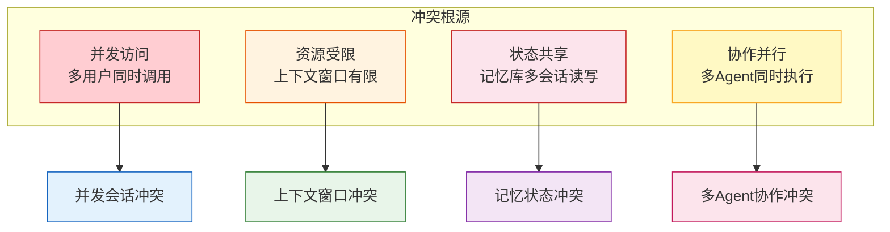

### 1.2 四类会话冲突速查表

| 维度 | 并发会话冲突 | 上下文窗口冲突 | 记忆状态冲突 | 多Agent协作冲突 |
|------|------------|--------------|------------|---------------|
| **触发原因** | 多用户并发访问 | 会话历史超长 | 记忆库并发写入 | 多智能体任务重叠 |
| **典型表现** | 会话ID混乱、数据串话 | Token超限、关键信息丢失 | 记忆覆盖、版本不一致 | 任务重复执行、状态竞争 |
| **影响范围** | 单用户隔离层 | 单会话上下文 | 跨会话共享数据 | 多智能体协作 |
| **核心解法** | 会话隔离+锁机制 | 分层管理+摘要压缩 | 乐观锁+冲突检测 | 协调器+任务互斥锁 |
| **关键指标** | 会话隔离度、QPS | Token利用率、召回率 | 冲突率、一致性和延迟 | 任务吞吐量、协作效率 |
| **面试频率** | ⭐⭐⭐⭐ | ⭐⭐⭐⭐⭐ | ⭐⭐⭐⭐ | ⭐⭐⭐ |

---

## 2. 并发会话冲突

### 2.1 冲突场景

当多个用户同时与 Agent 交互时，若未做会话隔离，会出现：

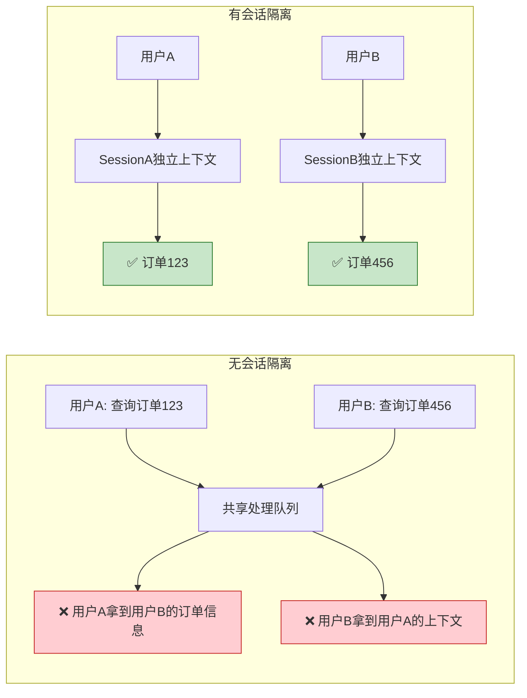

#### 典型表现

| 问题 | 描述 | 后果 |
|------|------|------|
| 会话ID混乱 | 共享会话池未做用户维度隔离 | 用户A拿到用户B的回答 |
| 上下文串话 | LLM 上下文模板中混入他人历史 | 隐私泄露、答非所问 |
| 工具调用竞争 | 多会话同时写同一文件/数据库行 | 数据损坏、覆盖丢失 |
| 资源耗尽 | 单实例被多会话占用导致响应延迟 | 系统雪崩 |

### 2.2 解决方案：会话隔离 + 锁机制

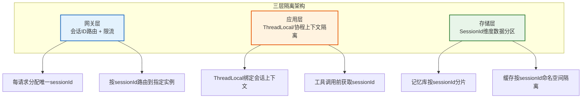

#### 关键策略对比

| 策略 | 实现复杂度 | 隔离强度 | 适用场景 |
|------|----------|---------|---------|
| **SessionId 路由** | 低 | 中 | 单实例多会话 |
| **ThreadLocal 绑定** | 中 | 高 | 单实例多线程 |
| **Redis 分布式锁** | 高 | 极高 | 多实例共享资源 |
| **独立执行器池** | 高 | 极高 | 强隔离生产环境 |

### 2.3 代码实现

```java
/**
 * 会话隔离管理器：基于 ThreadLocal + Redis 分布式锁
 * 保证单会话内状态独立，跨会话资源互斥
 */
public class SessionIsolationManager {

    private static final ThreadLocal<SessionContext> SESSION_HOLDER = new ThreadLocal<>();
    private final RedisTemplate<String, String> redisTemplate;
    private final AgentMemoryStore memoryStore;

    /**
     * 1. 会话上下文绑定：每请求进入时调用
     */
    public void bindSession(String sessionId, String userId) {
        // 加载该会话的历史上下文
        SessionContext ctx = memoryStore.loadSession(sessionId, userId);
        SESSION_HOLDER.set(ctx);

        // 设置MDC，便于日志追踪
        MDC.put("sessionId", sessionId);
        MDC.put("userId", userId);
    }

    /**
     * 2. 工具调用时的会话校验：防止跨会话污染
     */
    public <T> T executeInSession(String sessionId, Callable<T> task) {
        SessionContext ctx = SESSION_HOLDER.get();
        if (ctx == null || !sessionId.equals(ctx.getSessionId())) {
            throw new SessionMismatchException(
                "会话ID不匹配，期望: " + sessionId + "，实际: " + (ctx != null ? ctx.getSessionId() : "null"));
        }
        try {
            return task.call();
        } catch (Exception e) {
            throw new RuntimeException("会话内执行失败", e);
        }
    }

    /**
     * 3. 共享资源互斥锁：防止多会话并发写入同一资源
     */
    public boolean acquireResourceLock(String sessionId, String resourceId, Duration timeout) {
        String lockKey = "agent:lock:" + resourceId;
        String lockValue = sessionId + ":" + System.nanoTime();

        // Redis 分布式锁：SETNX + 过期时间
        Boolean acquired = redisTemplate.opsForValue()
            .setIfAbsent(lockKey, lockValue, timeout);

        if (Boolean.TRUE.equals(acquired)) {
            // 记录锁持有者，便于排查死锁
            SESSION_HOLDER.get().addHeldLock(lockKey, lockValue);
            return true;
        }
        return false;
    }

    /**
     * 4. 安全释放锁：使用 Lua 脚本保证原子性，避免误删他人锁
     */
    public void releaseResourceLock(String sessionId, String resourceId) {
        String lockKey = "agent:lock:" + resourceId;
        String expectedValue = sessionId + ":" + System.nanoTime();

        // Lua 脚本：先比较 value，匹配才删除
        String luaScript =
            "if redis.call('get', KEYS[1]) == ARGV[1] then " +
            "  return redis.call('del', KEYS[1]) " +
            "else return 0 end";

        redisTemplate.execute(
            (RedisCallback<Long>) connection -> connection.eval(
                luaScript.getBytes(), ReturnType.INTEGER, 1,
                lockKey.getBytes(), expectedValue.getBytes())
        );
    }

    public void unbindSession() {
        SessionContext ctx = SESSION_HOLDER.get();
        if (ctx != null) {
            // 持久化会话状态
            memoryStore.saveSession(ctx);
            // 释放所有持有的锁
            ctx.getHeldLocks().forEach((k, v) -> redisTemplate.delete(k));
        }
        SESSION_HOLDER.remove();
        MDC.clear();
    }
}
```

#### 会话上下文与隔离示例

```java
/**
 * 会话上下文：每个会话独立的状态容器
 */
public class SessionContext {
    private String sessionId;
    private String userId;
    private Deque<Message> messageHistory;        // 消息历史
    private Map<String, Object> scratchpad;       // 工具临时数据
    private List<String> activeTools;             // 已调用工具
    private Map<String, String> heldLocks;        // 持有的资源锁

    /**
     * 工具调用前校验：防止工具被其他会话抢占
     */
    public synchronized void useTool(String toolName, Map<String, Object> params) {
        if (!activeTools.contains(toolName)) {
            activeTools.add(toolName);
        }
        // 工具执行结果写入当前会话 scratchpad，不会污染其他会话
        scratchpad.put(toolName + ":lastParams", params);
    }
}
```

---

## 3. 上下文窗口冲突

### 3.1 冲突场景

LLM 上下文窗口有限（如 GPT-4o 为 128K、Claude 3.5 为 200K），长会话累积会导致：

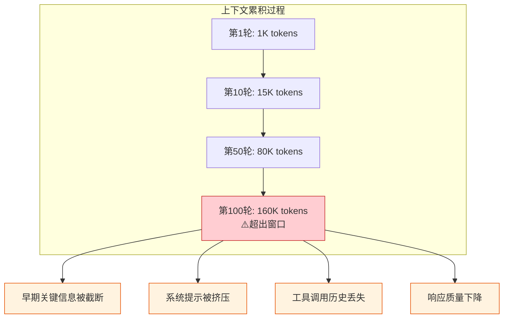

#### 典型表现

| 问题 | 描述 | 影响 |
|------|------|------|
| Token 超限 | 累计消息超过模型窗口 | API 报错、调用失败 |
| 关键信息截断 | 早期用户偏好被丢弃 | 个性化失效 |
| 系统提示被稀释 | 工具说明、角色设定被历史挤压 | Agent 行为漂移 |
| 成本失控 | 长会话每轮都重复发送全量历史 | Token 成本线性增长 |

### 3.2 解决方案：分层管理 + 摘要压缩

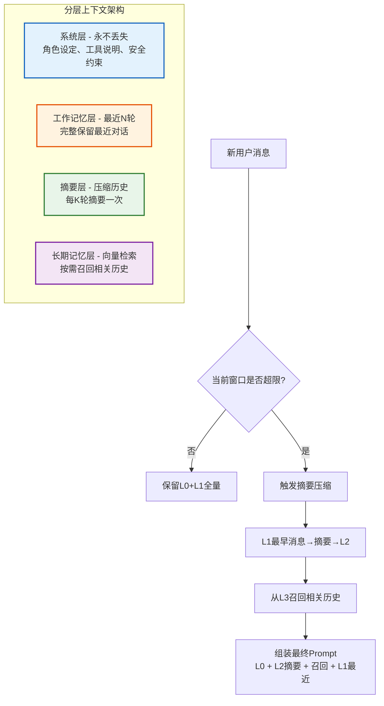

#### 压缩策略对比

| 策略 | 实现方式 | 信息损失 | 适用场景 |
|------|---------|---------|---------|
| **滑动窗口** | 只保留最近 N 轮 | 高（早期全丢） | 简单问答 |
| **摘要压缩** | 每 K 轮调用 LLM 总结 | 中（细节丢失，语义保留） | 长对话 |
| **分层检索** | 摘要 + 向量召回原始片段 | 低（按需召回） | 需精确回溯 |
| **重要性筛选** | 按消息重要性打分保留 | 中（按策略保留） | 混合场景 |

### 3.3 代码实现

```java
/**
 * 上下文窗口管理器：分层管理 + 摘要压缩
 * 保证单会话上下文不超窗口上限
 */
public class ContextWindowManager {

    private final ChatLanguageModel llm;
    private final VectorMemoryStore longTermMemory;

    private static final int MAX_TOKENS = 120_000;       // 窗口上限（预留 buffer）
    private static final int RESERVE_FOR_RESPONSE = 4_000; // 为回复预留
    private static final int RECENT_ROUNDS = 6;           // 工作记忆保留轮数
    private static final int SUMMARY_THRESHOLD = 10;      // 触发摘要的轮数

    /**
     * 组装最终发送给 LLM 的消息列表
     */
    public List<Message> assembleContext(SessionContext session, String userInput) {
        List<Message> allHistory = session.getMessageHistory();
        int estimatedTokens = estimateTokens(allHistory) + estimateTokens(userInput);

        // 1. 未超限：直接返回
        if (estimatedTokens <= MAX_TOKENS - RESERVE_FOR_RESPONSE) {
            return buildMessages(allHistory, userInput);
        }

        // 2. 超限：触发摘要压缩
        summarizeOldMessages(session);

        // 3. 从长期记忆召回与当前输入相关的历史
        List<Message> recalled = recallRelevantHistory(userInput, session.getSessionId());

        // 4. 重新组装
        List<Message> summary = session.getSummaryMessages();
        List<Message> recent = getRecentMessages(session, RECENT_ROUNDS);

        return buildLayeredMessages(summary, recalled, recent, userInput);
    }

    /**
     * 摘要压缩：将最早的消息压缩为摘要
     */
    private void summarizeOldMessages(SessionContext session) {
        List<Message> history = session.getMessageHistory();
        if (history.size() < SUMMARY_THRESHOLD) return;

        // 取出最早的需要压缩的消息
        int compressCount = history.size() - RECENT_ROUNDS * 2; // 每轮2条消息
        List<Message> toCompress = history.subList(0, compressCount);

        // 调用 LLM 生成摘要
        String summaryPrompt = buildSummaryPrompt(toCompress);
        String summary = llm.generate(summaryPrompt);

        // 存储摘要 + 原文进入长期记忆
        session.addSummaryMessage("## 历史摘要\n" + summary);
        toCompress.forEach(msg -> longTermMemory.remember(
            msg.text(),
            Map.of("sessionId", session.getSessionId(),
                   "type", "history",
                   "timestamp", String.valueOf(System.currentTimeMillis()))
        ));

        // 从工作记忆中移除已压缩的消息
        session.removeMessages(0, compressCount);
    }

    /**
     * 从长期记忆召回相关历史
     */
    private List<Message> recallRelevantHistory(String query, String sessionId) {
        List<TextSegment> segments = longTermMemory.recall(
            query, sessionId, 3, 0.75);
        return segments.stream()
            .map(seg -> UserMessage.from("[历史相关] " + seg.text()))
            .toList();
    }

    private List<Message> buildLayeredMessages(
            List<Message> summary,
            List<Message> recalled,
            List<Message> recent,
            String userInput) {
        List<Message> result = new ArrayList<>();
        // L0: 系统提示（始终在最前）
        // L2: 历史摘要
        result.addAll(summary);
        // L3: 召回的相关历史
        result.addAll(recalled);
        // L1: 工作记忆（最近几轮）
        result.addAll(recent);
        // 当前用户输入
        result.add(UserMessage.from(userInput));
        return result;
    }

    /**
     * Token 估算：简化实现，实际可用 tiktoken 库
     */
    private int estimateTokens(List<Message> messages) {
        return messages.stream()
            .mapToInt(m -> m.text().length() / 3) // 中英文混合粗略估算
            .sum();
    }

    private int estimateTokens(String text) {
        return text.length() / 3;
    }
}
```

---

## 4. 记忆状态冲突

### 4.1 冲突场景

多个会话或多个 Agent 实例同时读写同一长期记忆条目时，会出现：

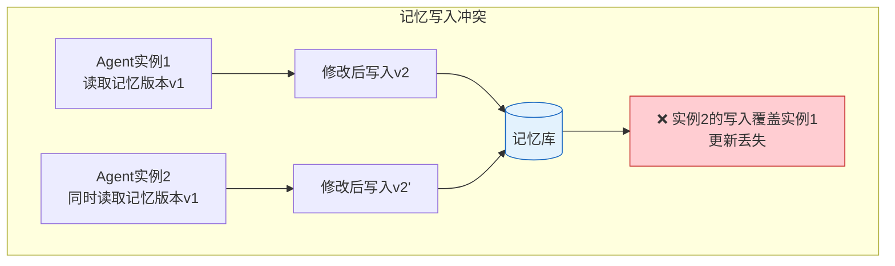

#### 典型表现

| 问题 | 描述 | 后果 |
|------|------|------|
| 更新丢失 | 后写覆盖先写 | 记忆内容错误 |
| 版本不一致 | 多实例读取到旧版本 | 行为不一致 |
| 脏读 | 读到未提交的中间状态 | 推理基于错误数据 |
| 幽灵记忆 | 已删除记忆被其他实例缓存 | 引用不存在信息 |

### 4.2 解决方案：乐观锁 + 冲突检测

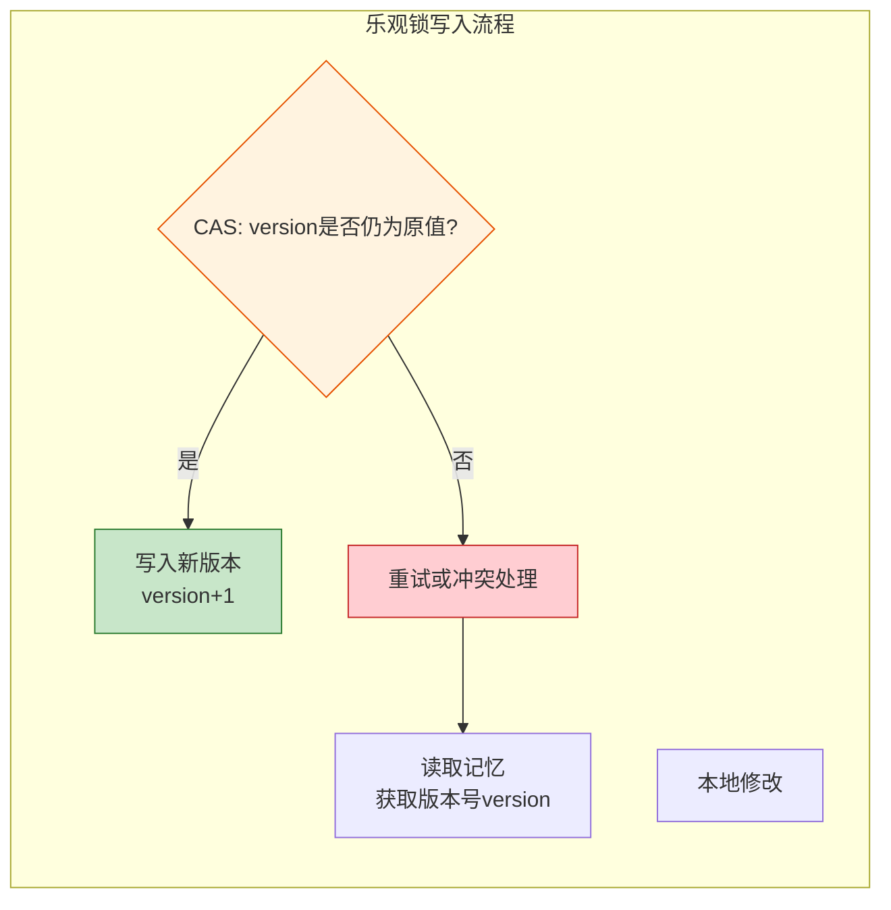

#### 锁策略对比

| 策略 | 实现复杂度 | 并发度 | 适用场景 |
|------|----------|--------|---------|
| **悲观锁** | 低 | 低 | 写多读少、冲突频繁 |
| **乐观锁(CAS)** | 中 | 高 | 读多写少、冲突偶发 |
| **MVCC 多版本** | 高 | 高 | 需要历史版本回溯 |
| **CRDT 合并** | 极高 | 极高 | 分布式最终一致 |

### 4.3 代码实现

```java
/**
 * 记忆状态管理器：基于乐观锁(CAS)防止并发写入冲突
 */
public class MemoryStateManager {

    private final MemoryRepository memoryRepo;

    /**
     * 带版本校验的记忆更新
     */
    public boolean updateMemory(String memoryId, String sessionId,
                                  Function<String, String> updater, int maxRetries) {
        int retry = 0;
        while (retry < maxRetries) {
            // 1. 读取当前版本
            MemoryEntry current = memoryRepo.findById(memoryId);
            long expectedVersion = current.getVersion();

            // 2. 应用业务修改
            String newContent = updater.apply(current.getContent());
            if (newContent.equals(current.getContent())) {
                return true; // 无变更，无需写入
            }

            // 3. CAS 写入：仅当版本号匹配时才更新
            boolean success = memoryRepo.compareAndSet(
                memoryId, expectedVersion, newContent, sessionId);

            if (success) return true;

            // 4. 冲突：等待短暂时间后重试
            retry++;
            try {
                Thread.sleep(50L * retry); // 退避等待
            } catch (InterruptedException e) {
                Thread.currentThread().interrupt();
                throw new RuntimeException("记忆更新被中断", e);
            }
        }
        throw new MemoryConflictException(
            "记忆更新失败，超过最大重试次数: " + maxRetries + ", memoryId=" + memoryId);
    }

    /**
     * 多字段记忆合并：基于 CRDT 思想的字段级合并
     * 适用于结构化记忆（如用户画像）
     */
    public MemoryEntry mergeMemories(MemoryEntry base, MemoryEntry local, MemoryEntry remote) {
        MemoryEntry merged = MemoryEntry.copyOf(base);

        // 标量字段：取时间戳较新的
        if (remote.getUpdatedAt().isAfter(local.getUpdatedAt())) {
            merged.setScalarFields(remote.getScalarFields());
        } else {
            merged.setScalarFields(local.getScalarFields());
        }

        // 集合字段：取并集
        Set<String> tags = new HashSet<>();
        tags.addAll(base.getTags());
        tags.addAll(local.getTags());
        tags.addAll(remote.getTags());
        merged.setTags(tags);

        // 冲突字段：记录冲突，由业务层决定
        Map<String, Conflict> conflicts = detectConflicts(base, local, remote);
        merged.setConflicts(conflicts);

        return merged;
    }
}

/**
 * 记忆仓库接口：CAS 原子操作
 */
public interface MemoryRepository {
    MemoryEntry findById(String memoryId);
    boolean compareAndSet(String memoryId, long expectedVersion,
                         String newContent, String sessionId);
}
```

#### Redis 实现乐观锁示例

```java
/**
 * 基于 Redis WATCH/MULTI 的乐观锁实现
 */
public class RedisMemoryRepository implements MemoryRepository {

    private final RedisTemplate<String, String> redis;

    @Override
    public boolean compareAndSet(String memoryId, long expectedVersion,
                                 String newContent, String sessionId) {
        String key = "memory:" + memoryId;
        String versionKey = "memory:version:" + memoryId;

        // 开启事务监听
        redis.execute((RedisCallback<Boolean>) connection -> {
            connection.watch(versionKey.getBytes());

            // 校验版本号
            String currentVersion = redis.opsForValue().get(versionKey);
            if (currentVersion == null || Long.parseLong(currentVersion) != expectedVersion) {
                connection.unwatch();
                return false; // 版本不匹配，CAS 失败
            }

            // 开启事务
            connection.multi();
            connection.set(key.getBytes(), newContent.getBytes());
            connection.incr(versionKey.getBytes());

            // 执行事务
            return connection.exec() != null; // 若 key 被修改，exec 返回 null
        });
    }
}
```

---

## 5. 多 Agent 协作冲突

### 5.1 冲突场景

多智能体并行协作时，会出现任务重叠、资源竞争、消息死锁：

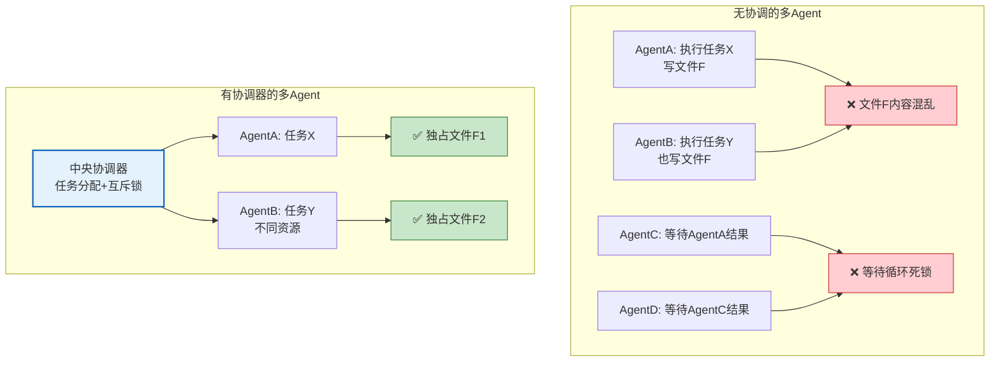

#### 典型表现

| 问题 | 描述 | 后果 |
|------|------|------|
| 任务重复执行 | 两个Agent都接同一任务 | 资源浪费、结果冲突 |
| 资源竞争 | 多Agent同时写同一资源 | 数据损坏 |
| 等待死锁 | AgentA等B，B等A | 系统卡死 |
| 消息风暴 | Agent间大量重复消息 | 通信成本爆炸 |

### 5.2 解决方案：协调器 + 任务互斥锁

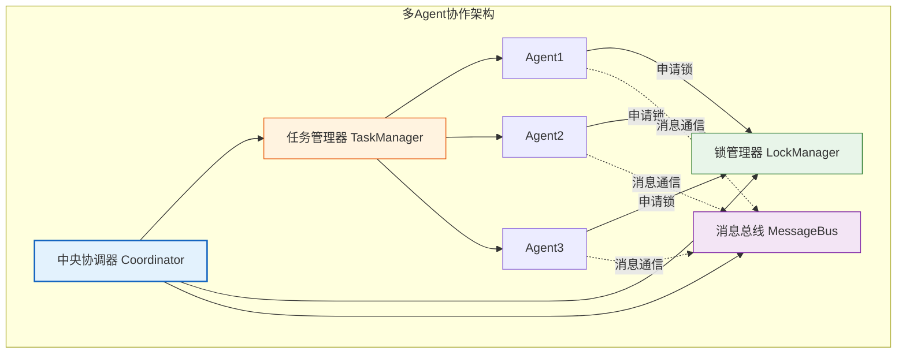

#### 协调模式对比

| 模式 | 描述 | 优点 | 缺点 |
|------|------|------|------|
| **中央协调器** | 一个协调器统一分配 | 简单、无死锁 | 单点故障、性能瓶颈 |
| **去中心化协商** | Agent 间 P2P 协商 | 去中心化、高可用 | 协议复杂、可能死锁 |
| **层级协调** | 多级协调器分治 | 可扩展 | 层间一致性难保证 |
| **市场机制** | Agent 竞价获取任务 | 自适应 | 难以保证公平性 |

### 5.3 代码实现

```java
/**
 * 多 Agent 协调器：任务分配 + 互斥锁 + 死锁检测
 */
public class MultiAgentCoordinator {

    private final TaskManager taskManager;
    private final DistributedLockManager lockManager;
    private final MessageBus messageBus;

    /**
     * 1. 任务分配：保证同一任务只被一个 Agent 执行
     */
    public TaskAssignment assignTask(String agentId, String taskType,
                                      Map<String, Object> params) {
        // 生成任务唯一ID
        String taskId = UUID.randomUUID().toString();
        String taskKey = "task:" + taskType + ":" + params.hashCode();

        // 抢占任务：基于 Redis SETNX
        boolean acquired = taskManager.tryAcquire(taskKey, agentId, Duration.ofMinutes(30));
        if (!acquired) {
            // 任务已被其他 Agent 占用
            return TaskAssignment.skipped("任务已在执行中: " + taskKey);
        }

        // 分配任务
        Task task = new Task(taskId, taskType, params, agentId);
        taskManager.record(task);
        return TaskAssignment.assigned(task);
    }

    /**
     * 2. 资源互斥锁：Agent 执行前申请资源锁
     */
    public boolean acquireResource(String agentId, String resourceId,
                                    Duration timeout, boolean wait) {
        long deadline = System.currentTimeMillis() + timeout.toMillis();

        while (true) {
            boolean acquired = lockManager.tryLock(
                "agent:resource:" + resourceId, agentId, Duration.ofMinutes(5));

            if (acquired) return true;
            if (!wait) return false;
            if (System.currentTimeMillis() > deadline) {
                throw new ResourceBusyException("获取资源锁超时: " + resourceId);
            }

            // 等待重试
            try { Thread.sleep(100); } catch (InterruptedException e) {
                Thread.currentThread().interrupt();
                return false;
            }
        }
    }

    /**
     * 3. 死锁检测：基于等待图检测循环依赖
     */
    @Scheduled(fixedRate = 10_000) // 每10秒检测一次
    public void detectDeadlock() {
        // 构建等待图：Agent A 等 Agent B 持有的资源
        Map<String, String> waitGraph = lockManager.getWaitGraph();

        // 检测环
        List<String> cycle = findCycle(waitGraph);
        if (!cycle.isEmpty()) {
            // 找到死锁，选择牺牲者（持有最多锁的 Agent）
            String victim = selectVictim(cycle);
            log.warn("检测到死锁环: {}, 选择牺牲者: {}", cycle, victim);

            // 强制释放牺牲者的所有锁
            lockManager.forceReleaseAll(victim);
            messageBus.notify(victim, "你因死锁被回滚，请重试任务");
        }
    }

    /**
     * 4. Agent 间通信：通过消息总线，避免直接调用造成耦合
     */
    public void sendMessage(String fromAgent, String toAgent, AgentMessage message) {
        message.setMessageId(UUID.randomUUID().toString());
        message.setFrom(fromAgent);
        message.setTo(toAgent);
        message.setTimestamp(Instant.now());
        messageBus.publish(toAgent, message);
    }

    /**
     * 基于 DFS 的环检测
     */
    private List<String> findCycle(Map<String, String> graph) {
        Set<String> visited = new HashSet<>();
        Set<String> inStack = new HashSet<>();
        List<String> path = new ArrayList<>();

        for (String node : graph.keySet()) {
            if (dfs(node, graph, visited, inStack, path)) {
                return path;
            }
        }
        return Collections.emptyList();
    }

    private boolean dfs(String node, Map<String, String> graph,
                         Set<String> visited, Set<String> inStack, List<String> path) {
        if (inStack.contains(node)) {
            path.add(node);
            return true; // 找到环
        }
        if (visited.contains(node)) return false;

        visited.add(node);
        inStack.add(node);
        path.add(node);

        String next = graph.get(node);
        if (next != null && dfs(next, graph, visited, inStack, path)) {
            return true;
        }

        inStack.remove(node);
        path.remove(path.size() - 1);
        return false;
    }
}
```

#### 任务互斥示例

```java
/**
 * 任务管理器：基于 Redis 的任务抢占
 */
public class TaskManager {

    private final RedisTemplate<String, String> redis;

    public boolean tryAcquire(String taskKey, String agentId, Duration ttl) {
        // SETNX + TTL：原子抢占
        return Boolean.TRUE.equals(
            redis.opsForValue().setIfAbsent(taskKey, agentId, ttl)
        );
    }

    public void complete(String taskKey, String agentId) {
        // 校验持有者身份
        String holder = redis.opsForValue().get(taskKey);
        if (!agentId.equals(holder)) {
            throw new IllegalStateException("非任务持有者，无法完成: " + taskKey);
        }
        redis.delete(taskKey);
    }

    public void heartbeat(String taskKey, String agentId) {
        // 续期，防止长任务因 TTL 过期被抢占
        String holder = redis.opsForValue().get(taskKey);
        if (agentId.equals(holder)) {
            redis.expire(taskKey, Duration.ofMinutes(30));
        }
    }
}
```

---

## 6. 综合架构设计

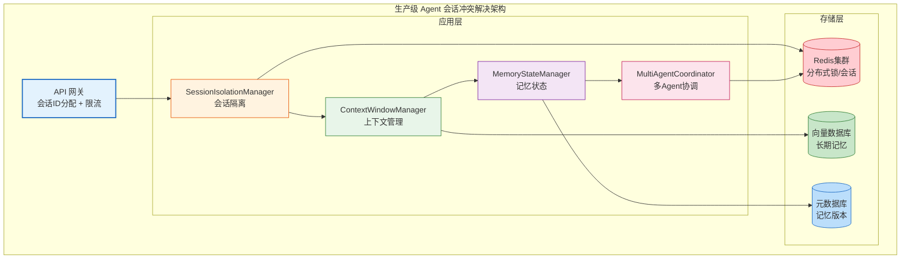

### 综合架构设计要点

| 设计原则 | 落地措施 | 解决的冲突类型 |
|---------|---------|--------------|
| **会话维度隔离** | sessionId 全链路传递 + ThreadLocal 绑定 | 并发会话冲突 |
| **分层上下文** | 系统/工作/摘要/长期 四层管理 | 上下文窗口冲突 |
| **乐观锁优先** | CAS + 重试 + 冲突检测 | 记忆状态冲突 |
| **中央协调** | 任务互斥锁 + 死锁检测 | 多Agent协作冲突 |
| **幂等设计** | 任务ID + 去重 | 所有冲突的兜底 |
| **可观测性** | sessionId 日志 + 锁持有追踪 | 排障利器 |

---

## 7. 高频面试题与参考答案

### Q1：什么是 Agent 会话冲突？你在项目中遇到过哪些类型？

**参考答案**：

Agent 会话冲突是指在多用户、多智能体、长会话等复杂场景下，因资源竞争、状态共享、上下文受限等导致的系统行为异常。我遇到过的四类典型冲突：

1. **并发会话冲突**：多用户同时调用 Agent，因未做会话隔离导致用户A拿到用户B的上下文。曾发生过线上事故——共享 ThreadLocal 未清理，导致订单信息串话。
2. **上下文窗口冲突**：长对话累计超过 128K，早期用户偏好被截断，个性化失效。通过分层管理 + 摘要压缩解决。
3. **记忆状态冲突**：多实例并发写同一记忆条目，后写覆盖先写。引入乐观锁 CAS 解决。
4. **多Agent协作冲突**：两个Agent都接同一任务，资源竞争。引入中央协调器 + 任务互斥锁。

### Q2：如何设计一个支持 10 万并发的 Agent 会话隔离方案？

**参考答案**：

设计要点：

1. **会话ID设计**：雪花算法生成全局唯一 sessionId，嵌入到请求头 `X-Session-Id` 中。
2. **三层隔离架构**：
   - 网关层：按 sessionId 一致性哈希路由到固定实例，减少跨实例状态同步
   - 应用层：ThreadLocal 绑定会话上下文，请求结束清理；用协程（如 Kotlin）进一步提升并发
   - 存储层：Redis 按 sessionId 分片，每个会话独立 key namespace
3. **资源锁策略**：
   - 单实例：JVM 内 ReentrantLock
   - 多实例：Redis Redlock（多数节点获取成功才算获取）
   - 锁粒度：按 resourceId 而非全局锁，提升并发度
4. **水平扩展**：会话无状态化，状态全部下沉到 Redis + 向量库，实例可水平扩容
5. **限流降级**：单 sessionId 限流（防止单用户刷接口）+ 全局限流（防止系统过载）

### Q3：长会话上下文超限，如何平衡信息保留和 Token 成本？

**参考答案**：

我会采用**分层管理 + 摘要压缩 + 按需召回**的组合策略：

1. **分层架构**：
   - L0 系统层：角色设定、工具说明、安全约束，永不丢失
   - L1 工作记忆：最近 6 轮完整保留
   - L2 摘要层：每 10 轮压缩为摘要
   - L3 长期记忆：原文进入向量库，按需召回

2. **触发时机**：估算 Token 超过窗口 80% 时触发压缩，预留 buffer 防止边界问题。

3. **摘要质量保证**：
   - 摘要 prompt 强调保留：用户偏好、关键决策、未完成任务、工具调用结果
   - 多次摘要时采用"递进摘要"：新摘要基于旧摘要，避免信息指数级丢失

4. **按需召回**：当前用户输入向量化，从 L3 召回 Top-3 相关历史片段，拼接到 L1 之前。

5. **成本对比**：以 GPT-4o 100 轮对话为例：
   - 无压缩：每轮发送全量 ~80K tokens，累计成本高
   - 有压缩：每轮发送 ~15K tokens（摘要+最近+召回），成本降低约 80%

### Q4：多 Agent 并发写同一记忆，如何保证一致性？

**参考答案**：

根据冲突频率选择不同策略：

1. **乐观锁（CAS）**——首选方案：
   - 读时不加锁，写时校验版本号
   - 冲突时退避重试（指数退避：50ms、100ms、200ms）
   - 适合读多写少、冲突偶发场景

2. **悲观锁**——冲突频繁时：
   - 读取时即加锁，阻塞其他写入
   - 适合写多读少、冲突率高（>30%）场景

3. **MVCC 多版本**——需历史回溯时：
   - 每次写入保留版本，读取指定版本
   - 适合需要审计或回滚的场景

4. **CRDT 合并**——分布式最终一致：
   - 字段级合并：标量取时间戳新者，集合取并集
   - 适合用户画像等可合并结构

实际项目中，我采用 **CAS + 重试** 解决 95% 的冲突，对高冲突热点 key 切换到 **悲观锁**，对用户画像采用 **CRDT 合并**。

### Q5：如何检测和解决多 Agent 死锁？

**参考答案**：

**检测**：基于**等待图（Wait-For Graph）**的环检测：
1. 协调器维护每个 Agent 当前等待的资源及其持有者
2. 每 10 秒遍历等待图，DFS 检测环
3. 找到环即判定为死锁

**解决**：选择牺牲者回滚：
1. **牺牲者选择策略**：优先选择持有锁最少的 Agent（回滚成本最低）或最年轻的事务
2. **强制释放**：协调器强制释放牺牲者的所有资源锁
3. **通知重试**：通过消息总线通知牺牲者，让其重新申请资源

**预防**：
- **资源有序申请**：所有 Agent 按统一顺序申请资源（如按 resourceId 字典序），破坏循环等待
- **超时机制**：每个锁设置 TTL，超时自动释放
- **一次性申请**：Agent 开始时一次性申请所有需要的资源，要么全得要么全不得

### Q6：会话隔离中，如何避免 ThreadLocal 内存泄漏？

**参考答案**：

ThreadLocal 内存泄漏的根因是：线程池中的线程复用，但 ThreadLocal 未清理，导致 SessionContext 对象无法回收。

解决措施：

1. **try-finally 清理**：
   ```java
   try {
       sessionManager.bindSession(sessionId, userId);
       // 业务逻辑
   } finally {
       sessionManager.unbindSession(); // 必须 remove
   }
   ```

2. **过滤器统一清理**：在 Spring 的 OncePerRequestFilter 中统一处理，避免业务代码遗漏：
   ```java
   public class SessionFilter extends OncePerRequestFilter {
       protected void doFilterInternal(req, resp, chain) {
           try {
               bindSession(req);
               chain.doFilter(req, resp);
           } finally {
               unbindSession(); // 兜底
           }
       }
   }
   ```

3. **避免存大对象**：ThreadLocal 只存 sessionId 等 ID，实际数据走 Redis 按需加载。

4. **使用 InheritableThreadLocal 的替代方案**：用阿里 TransmittableThreadLocal（TTL）解决线程池场景下的传递问题。

### Q7：设计一个支持多租户的 Agent 系统会话隔离方案

**参考答案**：

多租户隔离的核心是**数据隔离 + 资源配额 + 故障隔离**：

1. **数据隔离层级**：
   - **逻辑隔离**（共享库）：每行加 `tenant_id`，所有查询带租户过滤
   - **Schema 隔离**（共享实例）：每租户独立 schema
   - **物理隔离**（独立实例）：大客户独立部署

2. **会话 ID 设计**：`tenantId:userId:sessionId` 三段式，从网关到存储全链路携带。

3. **资源配额**：
   - 每租户 QPS 限流：基于 Redis 滑动窗口
   - 每租户 Token 配额：月度上限，超限降级到小模型
   - 每租户向量库容量上限

4. **记忆隔离**：
   - 向量库 metadata 加 `tenant_id` 字段，查询时强制过滤
   - Redis key namespace 按 `tenant:` 前缀隔离

5. **故障隔离**：大租户独立实例，避免一个租户的高负载影响其他租户。

### Q8：如何保证 Agent 会话在服务重启后可恢复？

**参考答案**：

核心是**会话状态外置 + 检查点机制**：

1. **状态外置**：
   - 会话上下文存 Redis（TTL 24 小时）
   - 长期记忆存向量库
   - 任务状态存数据库

2. **检查点机制**：
   - 每轮对话后异步持久化 SessionContext 到 Redis
   - 长任务执行前打检查点，记录当前步骤
   - 工具调用前记录"调用意图"，便于幂等重试

3. **恢复流程**：
   - 服务重启后，从 Redis 加载未过期的 SessionContext
   - 长任务从检查点恢复，已完成的步骤跳过
   - 未完成的工具调用，基于"调用意图"幂等重试

4. **幂等保证**：
   - 工具调用带 idempotency_key，重复调用返回相同结果
   - 数据库写入采用 `INSERT ... ON DUPLICATE KEY UPDATE`

---

## 8. 总结与记忆口诀

### 四类冲突速记口诀

> **并发隔离上下文压，**
> **记忆锁版本防冲突，**
> **协作协调锁任务，**
> **四层架构稳如山。**

### 解决方案速查图

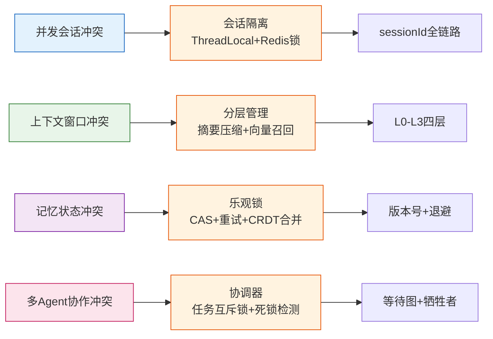

### 面试加分项

| 加分点 | 说明 |
|--------|------|
| **结合线上事故** | 描述真实冲突案例和解决过程 |
| **量化指标** | 给出冲突率、QPS、Token节省等数据 |
| **权衡取舍** | 说明为何选 CAS 而非悲观锁，成本与收益 |
| **可观测性** | 强调 sessionId 日志、锁追踪、监控告警 |
| **兜底方案** | 幂等设计、超时降级、人工介入机制 |
```
