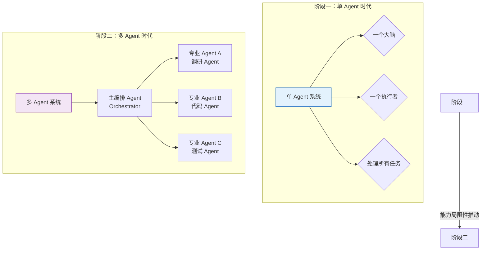
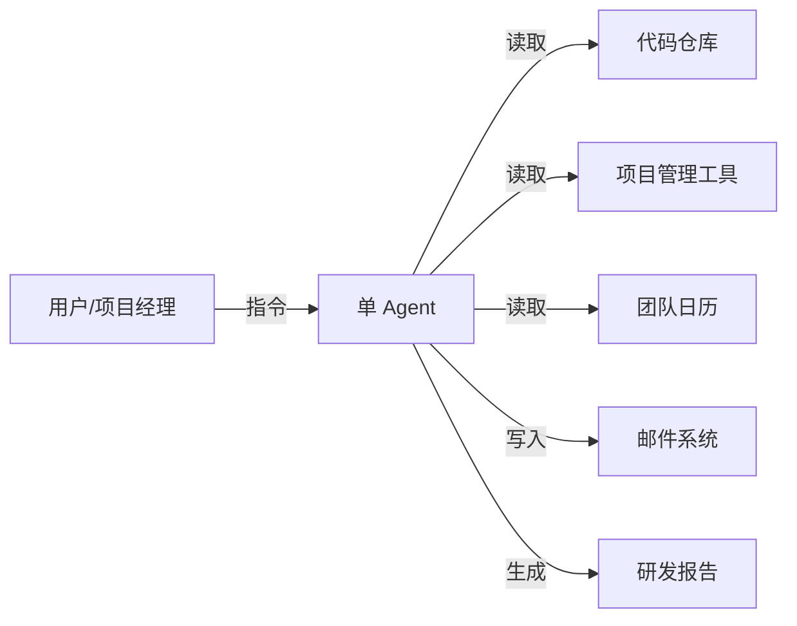
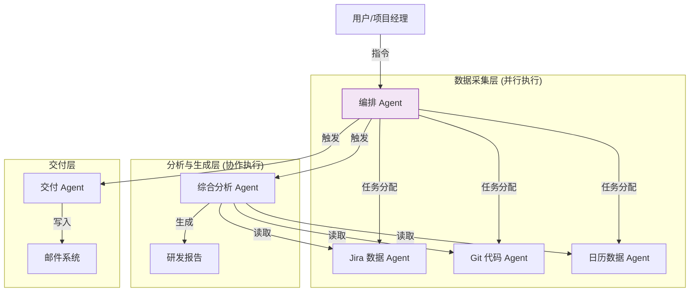
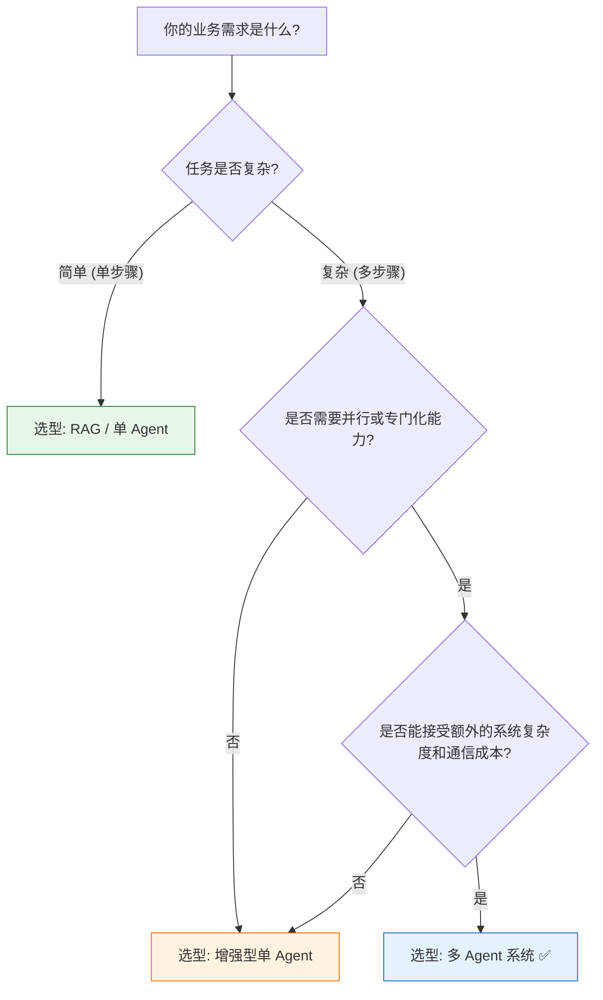

# 多 Agent 系统 vs. 单 Agent 系统：核心优势深度解析

> **文档说明**：本文档旨在系统阐述多 Agent（Multi-Agent）系统相较于单 Agent（Single-Agent）系统的核心优势。内容将从任务处理效率、功能扩展性、容错能力、环境适应性及资源优化配置五个维度进行深入分析，并通过具体应用场景的对比，直观展示两种架构的差异与优劣。本文将交叉引用 `10Agent技术挑战与未来展望.md` 中关于多 Agent 协作挑战的讨论，形成全面的认知闭环。

## 目录

- [一、引言：从单体到集群的进化](#一引言从单体到集群的进化)
- [二、核心优势维度对比分析](#二核心优势维度对比分析)
  - [2.1 任务处理效率：并行与协作](#21任务处理效率并行与协作)
  - [2.2 功能扩展性：模块化与专业化](#22功能扩展性模块化与专业化)
  - [2.3 容错能力：冗余与自愈](#23容错能力冗余与自愈)
  - [2.4 环境适应性：多样性与专业性](#24环境适应性多样性与专业性)
  - [2.5 资源优化配置：按需分配与负载均衡](#25资源优化配置按需分配与负载均衡)
- [三、典型应用场景对比](#三典型应用场景对比)
- [四、多 Agent 架构的工程启示](#四多-agent-架构的工程启示)
- [五、总结与选型建议](#五总结与选型建议)

---

## 一、引言：从单体到集群的进化

在 AI Agent 的发展历程中，架构演进遵循着与软件工程类似的规律：从简单的单体应用，逐步演变为复杂的分布式系统。

**单 Agent 系统**就像一个**“万金油”员工**，一个人要承担从需求分析、编码、测试到部署的所有工作。虽然灵活，但在复杂任务、高并发或需要特定专业知识的场景下，往往捉襟见肘。

**多 Agent 系统**则像一支**“专业团队”**，由一个项目经理（编排 Agent）协调多个专家（专业 Agent），每个专家专注于自己擅长的领域，协同完成复杂任务。

本文将深入剖析这种“团队协作”模式相对于“单兵作战”模式的五大核心优势。

---

## 二、核心优势维度对比分析

### 2.1 任务处理效率：并行与协作

**核心优势**：多 Agent 能够将复杂任务**分解并并行执行**，显著缩短整体任务的完成时间。

#### 2.1.1 具体分析

*   **单 Agent 的串行处理瓶颈**：单 Agent 在处理复杂任务时，只能采取串行的方式执行步骤。当任务涉及多个独立的子任务时，这种“排队式”处理会导致大量等待时间。
*   **多 Agent 的并行处理优势**：多 Agent 可以识别任务之间的依赖关系，将**无依赖关系的子任务分配给不同的 Agent 同时执行**，实现真正的并行计算。

#### 2.1.2 场景对比

**场景**：开发一个新功能模块。

| 维度 | 单 Agent 系统 | 多 Agent 系统 | 效率提升 |
|------|-------------|-------------|---------|
| **执行流程** | 串行执行:  1. 分析需求 2. 编写前端代码 3. 编写后端代码 4. 编写测试 5. 代码审查 6. 集成 | 并行执行:  1. 主编排 Agent 分析需求 2. **前端 Agent 与后端 Agent 同时编码** 3. **测试 Agent 同步编写测试** 4. 代码审查 Agent 审查代码 5. 集成 Agent 完成集成 | 约 40-50% |
| **时间预估** | 10 个时间单位 | 5-6 个时间单位 | - |
| **资源利用** | LLM 调用单一，但持续占用 | 多个 LLM 调用，时间上重叠 | - |

**关键洞察**：在上述场景中，前端、后端和测试的编码工作是相互独立的。单 Agent 必须依次完成，而多 Agent 可以同时进行，这带来了显著的时间节约。

#### 2.1.3 流程图解

```mermaid
gantt
    title 单 Agent 串行执行
    dateFormat  X
    axisFormat %s
    section 单 Agent
    需求分析         :0, 1
    编写前端代码     :1, 3
    编写后端代码     :3, 5
    编写单元测试     :5, 7
    代码审查         :7, 8
    集成与部署       :8, 10

    title 多 Agent 并行执行
    dateFormat  X
    axisFormat %s
    section 编排 Agent
    需求分析         :0, 1
    代码审查         :5, 6
    集成与部署       :6, 7
    section 前端 Agent
    编写前端代码     :1, 3
    section 后端 Agent
    编写后端代码     :1, 3
    section 测试 Agent
    编写单元测试     :1, 4
```

### 2.2 功能扩展性：模块化与专业化

**核心优势**：多 Agent 系统可以通过**增加新的专业 Agent**来扩展能力，具有天然的模块化优势。

#### 2.2.1 具体分析

*   **单 Agent 的能力边界**：单 Agent 的能力受限于其本身的 Prompt 和工具集。当需要增加新的专业能力（如财务分析、法务审查）时，必须对单 Agent 进行“再训练”或大幅修改其 Prompt 和配置，扩展成本高且风险大。
*   **多 Agent 的模块化扩展**：多 Agent 系统采用“插拔式”架构。当需要新能力时，只需创建一个具备该专业知识和工具的新 Agent，并将其注册到系统中。这种方式**对现有系统的干扰最小**，扩展效率高。

#### 2.2.2 场景对比

**场景**：为系统增加一个“合同审查”功能。

| 维度 | 单 Agent 系统 | 多 Agent 系统 |
|------|-------------|-------------|
| **实现方式** | 1. 重写主 Agent 的 Prompt，加入合同审查的角色设定和知识库 2. 为其注册法务相关工具 3. 测试整个 Agent 的行为是否符合预期 | 1. 创建一个专门的**法务 Agent** 2. 为其配置合同审查知识库和工具 3. 在主编排 Agent 的路由逻辑中增加对法务 Agent 的调用路径 4. 测试新 Agent 的独立行为以及与编排 Agent 的协作 |
| **扩展成本** | 高：需要修改主 Agent 的核心逻辑，可能影响其处理其他任务的能力 | 低：只需增加一个新的组件，不影响现有 Agent 的功能 |
| **能力聚焦** | 弱：主 Agent 尝试“样样精通”，可能导致每方面都不够深入 | 强：法务 Agent 可以被精细地调优，在合同审查领域达到专家级水平 |

**关键洞察**：多 Agent 的模块化特性使其非常适合构建**业务边界清晰、专业知识独立**的复杂应用。每增加一个业务领域，只需增加一个对应的专业 Agent。

### 2.3 容错能力：冗余与自愈

**核心优势**：多 Agent 系统通过**引入冗余和角色备份**，具备更强的容错和自愈能力。

#### 2.3.1 具体分析

*   **单 Agent 的“单点故障”风险**：单 Agent 是任务执行的唯一入口和决策者。一旦它在处理某个任务时“思考”受阻（如陷入死循环、做出错误决策），整个任务链路就会中断。缺乏有效的备份和恢复机制。
*   **多 Agent 的“分散式”容错**：
    *   **角色备份**：可以设置多个 Agent 具备相同的能力（如两个代码 Agent），当一个失败时，编排 Agent 可以将任务转移给另一个。
    *   **职责分离**：不同的 Agent 负责不同的阶段。如果某个 Agent 失败，其影响被限制在特定阶段，其他阶段的 Agent 仍可正常工作，整体系统可以部分降级或重启失败的阶段。
    *   **交叉验证**：多个 Agent 可以相互审查工作成果（如代码审查 Agent 审查编码 Agent 的代码），从而发现单个 Agent 难以察觉的错误。

#### 2.3.2 场景对比

**场景**：执行一个复杂的数据分析任务。

| 维度 | 单 Agent 系统 | 多 Agent 系统 |
|------|-------------|-------------|
| **故障场景** | 单 Agent 在进行复杂统计分析时，LLM 推理出现错误，陷入死循环 | 数据分析 Agent 出现相同错误 |
| **故障影响** | 整个任务 100% 失败 | 仅数据分析环节失败，其他已完成的环节（如数据清洗）不受影响 |
| **恢复机制** | 需人工介入，停止任务并重新运行 | 1. 编排 Agent 检测到数据分析 Agent 超时/错误 2. 自动终止该 Agent，启动备用的数据分析 Agent 3. 从失败点继续执行，整体任务恢复 |
| **自愈能力** | 低：依赖人工干预 | 高：具备故障检测、隔离和自动恢复能力 |

**关键洞察**：多 Agent 系统的容错能力类似于微服务架构。通过将系统分解为多个独立的、可替换的组件，将“单点故障”风险降为“局部故障”风险，并通过编排机制实现故障的自动转移和恢复。

### 2.4 环境适应性：多样性与专业性

**核心优势**：不同的 Agent 可以被设计为适应**不同的工作环境和交互模式**，从而提升系统对复杂、多变环境的整体适应能力。

#### 2.4.1 具体分析

*   **单 Agent 的“通用但不精通”**：单 Agent 通常被设计为一个通用的助手，试图应对所有类型的问题。这种“万金油”设计使得它在面对特定领域的专业问题时，往往缺乏足够的深度和针对性。
*   **多 Agent 的“专业且精通”**：每个专业 Agent 都可以针对其特定的工作环境和任务进行深度优化。例如：
    *   **代码 Agent**：专注于与代码库、开发工具链交互。
    *   **对话 Agent**：专注于自然语言理解和情感交互。
    *   **数据 Agent**：专注于与数据库、数据分析工具交互。

#### 2.4.2 场景对比

**场景**：一个综合电商平台的智能客服系统。

| 维度 | 单 Agent 系统 | 多 Agent 系统 |
|------|-------------|-------------|
| **处理模式** | 一个 Agent 处理所有用户问题 | 根据问题类型，路由到不同的专业 Agent |
| **典型问题** | 1. 商品咨询 2. 订单查询 3. 退换货流程 4. 优惠券使用 | 1. 商品 Agent 处理商品咨询 2. 订单 Agent 查询订单 3. 售后 Agent 处理退换货 4. 营销 Agent 解释优惠券 |
| **专业度** | 低：对每个问题都“一知半解”，可能给出不准确的细节（如错误的库存信息） | 高：每个 Agent 都精通其领域，能给出精确、专业的回答 |
| **环境交互** | 困难：一个 Agent 需要与所有后端系统（商品库、订单库、库存库）交互，管理复杂 | 简单：每个 Agent 只与自己负责的后端系统交互，逻辑清晰 |

**关键洞察**：多 Agent 架构能够实现“在其位，谋其政”。每个 Agent 都在自己最擅长的环境中工作，这种专业化分工极大地提升了系统对不同业务环境的适应性。

### 2.5 资源优化配置：按需分配与负载均衡

**核心优势**：多 Agent 系统可以根据任务需求，**动态分配和优化计算资源**，实现更高效的资源利用。

#### 2.5.1 具体分析

*   **单 Agent 的资源绑定**：单 Agent 通常绑定到固定的 LLM 模型和计算资源。无论任务简单还是复杂，都使用同一套资源，造成资源的浪费或不足。
*   **多 Agent 的动态调度**：
    *   **模型分级**：可以为不同的 Agent 分配不同规格的 LLM 模型。例如，简单的客服 Agent 使用快速、便宜的小模型，而复杂的代码 Agent 使用能力强的大模型。
    *   **动态负载均衡**：当多个任务并发请求时，编排 Agent 可以将任务分配给负载较轻的 Agent 实例，避免个别 Agent 过载。
    *   **资源隔离与配额**：可以为每个 Agent 设置独立的资源配额，防止单个 Agent 消耗过多资源影响系统稳定性。

#### 2.5.2 场景对比

**场景**：同时处理多个用户请求（高并发场景）。

| 维度 | 单 Agent 系统 | 多 Agent 系统 |
|------|-------------|-------------|
| **资源分配** | 所有请求共用单 Agent 的计算资源 | 根据请求类型，路由到不同的 Agent 集群 |
| **并发处理** | 低：单 Agent 需排队处理请求，响应时间随并发数增加而线性增长 | 高：请求可被分发到多个 Agent 实例并行处理，响应时间稳定 |
| **成本优化** | 差：为应对峰值并发，需为单 Agent 预留大量资源，造成平时资源闲置 | 好：可根据不同 Agent 的负载弹性伸缩，实现资源的精细化利用 |
| **故障隔离** | 差：一个慢请求或出错请求可能阻塞所有请求的处理 | 好：单个 Agent 的慢请求或错误不影响其他 Agent 的正常工作 |

**关键洞察**：多 Agent 架构在资源利用上更接近云原生的“弹性计算”理念。它允许系统根据实际负载动态调整资源分配，实现成本与性能的最优平衡。

---

## 三、典型应用场景对比

为了更直观地展示差异，我们选取一个综合性的应用场景进行对比。

**应用场景**：构建一个智能的**产品研发助理**，能够自动跟踪项目进度、协调团队成员并生成报告。

### 单 Agent 实现方案

**工作流程**：
1.  用户：“帮我看看当前研发项目的进度，并生成一份周报。”
2.  单 Agent 依次：
    *   调用 Jira API 读取任务状态
    *   调用 Git API 检查代码提交
    *   调用 Calendar API 检查会议记录
    *   LLM 综合所有信息，撰写周报
    *   调用 Email API 发送报告

**局限性**：
*   **效率低**：所有数据读取都是串行的。
*   **容易出错**：一个 Agent 处理所有信息，可能遗漏或错误解读细节。
*   **扩展困难**：想增加一个新的数据源（如 CI/CD 日志），需要重新改造这个单 Agent。

### 多 Agent 实现方案

**工作流程**：
1.  用户下达指令给编排 Agent。
2.  编排 Agent **并行**启动三个数据采集 Agent，同时从不同数据源获取信息。
3.  数据采集 Agent 完成后，将结构化的信息反馈给编排 Agent。
4.  编排 Agent 将所有信息交付给**综合分析 Agent**。
5.  综合分析 Agent 专注于信息整合和报告撰写。
6.  最后，编排 Agent 指示**交付 Agent**发送报告。

**优势体现**：
*   **效率高**：三个数据采集 Agent 并行工作，耗时更短。
*   **准确性高**：每个 Agent 专注于特定数据源，信息提取更准确。分析 Agent 专注于逻辑推理和内容生成。
*   **扩展性强**：未来增加“CI/CD 数据”，只需新增一个 `CICDAgent`，并修改编排 Agent 的任务分配逻辑即可。
*   **容错性强**：如果 JiraAgent 失败，不影响 GitAgent 和 CalAgent 的工作，编排 Agent 可以重试 JiraAgent，或降级使用其他数据源。

---

## 四、多 Agent 架构的工程启示

多 Agent 系统虽然优势明显，但其架构复杂度也远超单 Agent。在工程实践中，需要注意以下几点（与 `10Agent技术挑战与未来展望.md` 中的挑战分析互补）：

1.  **不是所有场景都需要多 Agent**：
    *   对于简单的问答、单步骤操作，单 Agent 或甚至 RAG 方案就足够了。
    *   **过度设计**是引入多 Agent 时最常见的陷阱。

2.  **通信成本不可忽视**：
    *   多 Agent 间的通信涉及 Token 消耗和延迟。高效的通信协议和信息压缩策略至关重要。
    *   参考 `10Agent技术挑战与未来展望.md` 中的“多 Agent 协作挑战”章节。

3.  **编排逻辑是核心**：
    *   一个优秀的多 Agent 系统，其编排 Agent 的设计是重中之重。它需要具备清晰的路由逻辑、任务分配策略和冲突解决机制。

4.  **从“中心化”开始**：
    *   在实践中，推荐从“中心化编排”（有一个主 Agent 调度所有子 Agent）开始，而非一开始就追求“去中心化自治”。中心化模式更易于调试和管理。

---

## 五、总结与选型建议

**核心结论**：多 Agent 系统相对于单 Agent 系统，在**效率、扩展性、容错性、适应性和资源优化**方面具有显著优势，但也伴随着架构复杂度和通信成本的上升。

### 选型决策框架

### 关键建议

1.  **拥抱“团队协作”思维**：从软件工程的单体思维转向分布式系统思维。
2.  **渐进式演进**：从单 Agent 开始，在遇到瓶颈（如效率、扩展性）时，再逐步演化为多 Agent 架构。
3.  **关注“人”的模式**：将人类团队的协作模式（项目经理、专家、审查员）作为设计多 Agent 系统的灵感源泉。
4.  **正视挑战**：在享受多 Agent 优势的同时，必须正视其带来的通信开销、协调复杂性等挑战，参考 `10Agent技术挑战与未来展望.md` 中的相关分析。

通过合理的架构选型和工程实践，多 Agent 系统有望成为构建下一代复杂、智能应用的核心范式。
