# AI Agent 任务完成判断机制深度解析

> 文档定位：系统阐述 AI Agent 如何判断任务是否完成的核心机制、评估标准与工程实现，为 Agent 开发者提供可落地的判断框架与实践指导。
>
> 阅读建议：本文是 Agent 自主决策系列的延伸篇，建议结合 [12Agent自主决策机制深度解析.md](./12Agent自主决策机制深度解析.md)、[13Agent避免无限循环机制详解.md](./13Agent避免无限循环机制详解.md) 一并阅读，以形成完整的决策与终止认知。

---

## 目录

- [一、任务完成判断的核心概念与价值](#一任务完成判断的核心概念与价值)
- [二、任务完成判断的核心原则](#二任务完成判断的核心原则)
- [三、关键指标与评估标准体系](#三关键指标与评估标准体系)
- [四、任务相关数据的收集与分析机制](#四任务相关数据的收集与分析机制)
- [五、不同类型任务的完成判断逻辑](#五不同类型任务的完成判断逻辑)
- [六、模糊场景的识别与处理策略](#六模糊场景的识别与处理策略)
- [七、任务完成度的量化评估方法](#七任务完成度的量化评估方法)
- [八、实践指导与最佳实践](#八实践指导与最佳实践)
- [九、总结与展望](#九总结与展望)

---

## 一、任务完成判断的核心概念与价值

### 1.1 什么是任务完成判断

**任务完成判断（Task Completion Judgment）** 是指 Agent 在任务执行过程中或执行结束后，依据预定义的目标、约束与可观测证据，对"任务是否已经达到预期终态"进行判定，并据此决定是终止执行、继续迭代还是回退调整的认知过程。

它本质上是 Agent 决策回路中的**终止性决策环节**，与"下一步做什么"的选择性决策共同构成完整的自主决策闭环。

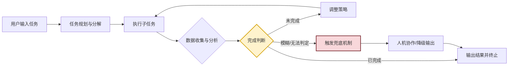

### 1.2 任务完成判断的核心价值

任务完成判断并非一个"可选优化"，而是 Agent 系统能否真正落地的关键能力。其价值体现在以下五个维度：

| 价值维度 | 缺失时的典型问题 | 具备后的价值体现 |
|---------|----------------|----------------|
| **终止控制** | Agent 无限循环、过度消耗 token 与算力 | 在合适时机优雅停止，控制成本 |
| **质量保障** | 未达目标即输出，结果不完整或错误 | 在达成质量阈值后才输出，保证交付质量 |
| **用户体验** | 用户无法判断何时该接管、何时该等待 | 提供明确的进度与完成信号，降低用户焦虑 |
| **资源效率** | 重复执行已完成步骤、无效推理 | 避免冗余动作，提升执行效率 |
| **可解释性** | 黑盒决策，难以追溯为何终止 | 提供完成判据与证据链，增强可审计性 |

### 1.3 与 Agent 其他能力的协同关系

任务完成判断不是孤立的模块，它深度依赖 Agent 的其他核心能力：

- **规划能力**：提供可分解的子目标与验收标准，是判断的依据来源。
- **记忆能力**：提供历史执行轨迹与上下文，用于证据累积与状态对比。
- **工具调用能力**：提供外部世界状态的观测手段（如运行测试、查询数据库、获取用户反馈）。
- **推理能力**：在证据不充分时进行不确定性推断，处理模糊场景。

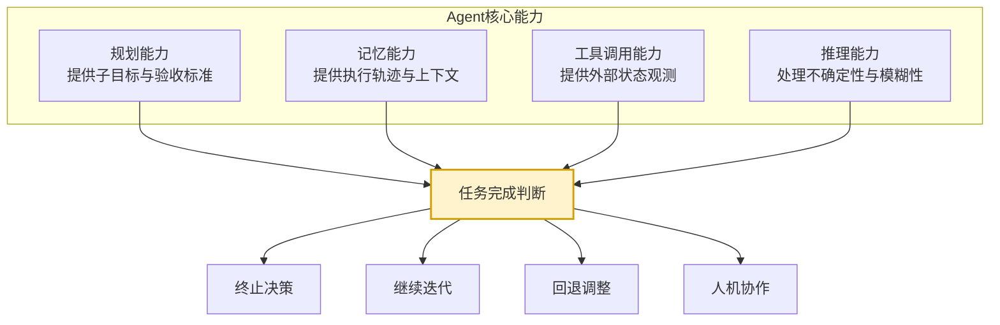

---

## 二、任务完成判断的核心原则

任务完成判断的设计必须遵循一组核心原则，这些原则是评估一个判断机制是否健壮的标尺。

### 2.1 目标对齐原则

**核心思想**：判断标准必须严格对齐用户原始意图与任务目标，而非 Agent 自身设定的中间目标。

这是最根本也最容易被违反的原则。Agent 在执行过程中常常出现"目标漂移"——将中间手段误认为最终目标。例如，用户要求"调研某技术的落地可行性"，Agent 可能将"生成一份调研报告"误判为完成，却忽略了"可行性结论"这一真正目标。

**实践要点**：
- 在任务开始时，显式记录用户的**原始意图**与**成功标准**。
- 在每次完成判断时，回溯校验当前结果是否回答了原始问题。
- 区分"任务目标"与"执行手段"——生成文档是手段，得出结论是目标。

### 2.2 可验证性原则

**核心思想**：完成判断必须基于可观测、可验证的证据，而非 Agent 的主观声称。

Agent 常见的失败模式是"自我宣称完成"——生成一句"任务已完成"即终止，而缺乏任何客观验证。可验证性原则要求每一个完成判断都必须有外部证据支撑：

- 代码任务：测试通过率、编译结果、类型检查输出。
- 信息检索：信息源的可信度、信息的交叉验证。
- 问题解决：答案可被独立检验或被用户确认。

### 2.3 渐进式确认原则

**核心思想**：完成判断应贯穿任务执行全过程，而非仅在末端做一次性判定。

复杂的任务应在多个层级设置检查点：

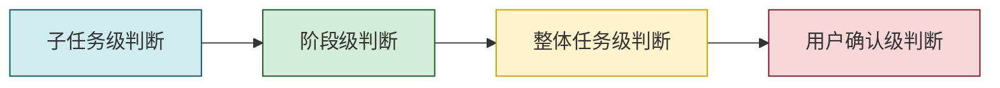

每一层级的判断标准不同：子任务级关注"这一步是否做完"，整体级关注"目标是否达成"，用户确认级关注"用户是否满意"。

### 2.4 多维度评估原则

**核心思想**：完成判断不应只依赖单一指标，而应从目标达成度、质量、约束满足等多个维度综合评估。

单一指标容易被"刷分"——例如只看代码能否运行，Agent 可能产出能跑但完全错误的代码。多维度评估能形成相互制约，提升判断的鲁棒性。

### 2.5 不确定性兜底原则

**核心思想**：当判断结果处于模糊区域时，必须有明确的兜底策略，而非强行二分。

真实世界中，很多任务无法用"完成/未完成"二值化判定。兜底策略包括：
- **降级输出**：明确标注"部分完成"并说明未完成部分。
- **人机协作**：将模糊判断移交用户决策。
- **置信度标注**：输出结果时附带完成置信度，供下游处理。

---

## 三、关键指标与评估标准体系

### 3.1 指标体系架构

一个完整的任务完成判断指标体系应由三层构成：

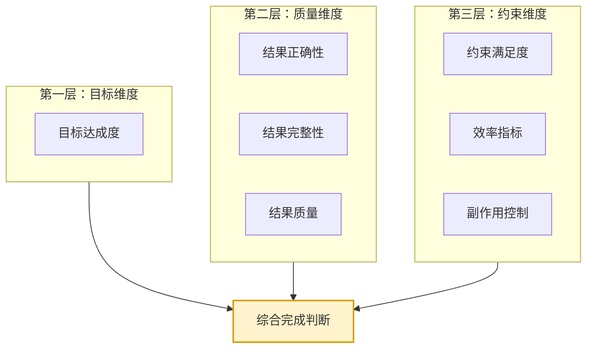

### 3.2 核心指标分类详解

#### 3.2.1 目标达成度指标

衡量任务结果与原始目标的吻合程度，是最重要的指标类别。

| 指标名称 | 含义 | 度量方式 |
|---------|------|---------|
| 目标覆盖率 | 已达成的子目标占总子目标的比例 | 已完成子目标数 / 总子目标数 |
| 意图匹配度 | 结果与用户原始意图的语义匹配程度 | LLM 评分 / 用户反馈 |
| 关键诉求满足率 | 用户明确提出的硬性诉求被满足的比例 | 已满足硬性需求数 / 总硬性需求数 |

#### 3.2.2 质量维度指标

衡量结果本身的质量水平，防止"达成目标但质量低劣"。

| 指标名称 | 含义 | 度量方式 |
|---------|------|---------|
| 结果正确性 | 结果在事实与逻辑上的正确程度 | 测试通过率 / 交叉验证 / 事实核查 |
| 结果完整性 | 结果是否覆盖了应有的所有方面 | 缺失项检查清单 |
| 结果深度 | 结果的详尽程度与专业程度 | LLM 评分 / 专家评审 |
| 一致性 | 结果内部各部分之间是否自洽 | 一致性检查工具 |

#### 3.2.3 约束与效率指标

衡量任务执行过程中的约束遵守情况与资源消耗。

| 指标名称 | 含义 | 度量方式 |
|---------|------|---------|
| 步数预算 | 已用步数与预算上限的比值 | 当前步数 / 步数上限 |
| Token 消耗 | 已消耗 token 与预算上限的比值 | 已用 token / token 上限 |
| 时间消耗 | 已用时间与时间预算的比值 | 已用时间 / 时间上限 |
| 工具调用次数 | 工具调用次数与预算的比值 | 已调用次数 / 调用上限 |
| 副作用指标 | 是否产生非预期副作用 | 行为审计 |

### 3.3 评估标准的设计原则

设计评估标准时，应遵循以下原则：

1. **可计算性**：指标必须能够被程序化或半程序化计算，避免纯主观。
2. **分层权重**：不同指标应有不同权重，目标维度权重最高。
3. **任务相关**：指标应根据任务类型定制，而非一刀切。
4. **可解释**：每个指标的取值应能追溯到具体证据。

---

## 四、任务相关数据的收集与分析机制

完成判断的质量直接取决于 Agent 能收集到多少、多准的证据。本节阐述数据收集与分析的工程化机制。

### 4.1 数据收集的四大渠道

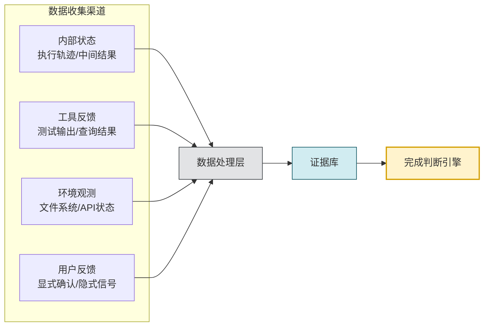

#### 4.1.1 内部状态数据

Agent 在执行过程中产生的内部数据，是最直接的判断依据：

- **执行轨迹**：已执行的步骤序列、每步的输入输出。
- **中间结果**：子任务的产出物。
- **规划状态**：原始计划、已修改的计划、剩余待办。
- **推理过程**：每一步的思考链（Chain of Thought）。

#### 4.1.2 工具反馈数据

外部工具的反馈是最客观的验证证据：

- **代码任务**：编译器输出、测试框架结果、类型检查报告、Linter 输出。
- **信息检索**：检索结果数量、来源可信度、信息新鲜度。
- **数据处理**：SQL 查询结果、数据校验输出、统计指标。

#### 4.1.3 环境观测数据

通过对执行环境的观测获取的状态信息：

- 文件系统的变化（新增、修改、删除的文件）。
- API 调用前后的系统状态对比。
- 日志系统的输出。
- 监控指标的变化。

#### 4.1.4 用户反馈数据

用户反馈是判断"是否真正满足用户意图"的终极依据：

- 显式反馈：用户的明确确认或否定。
- 隐式反馈：用户后续行为（如复制结果、追问细节、关闭会话）。
- 修正行为：用户对 Agent 结果的修改程度。

### 4.2 数据分析框架

收集到的原始数据需经过分析才能成为判断证据。分析框架包含三层：

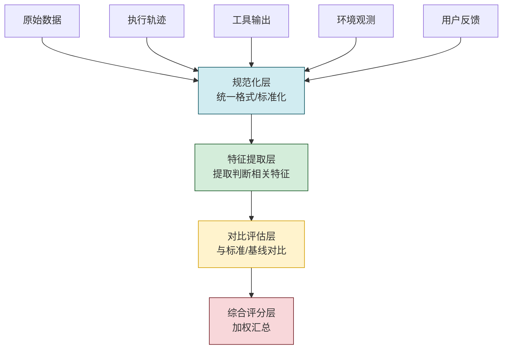

### 4.3 状态追踪机制

Agent 需要维护一份任务状态结构，记录各子目标的完成情况：

```python
# 任务状态追踪结构示例
from dataclasses import dataclass, field
from enum import Enum
from typing import Optional


class SubGoalStatus(Enum):
    PENDING = "pending"        # 待执行
    IN_PROGRESS = "in_progress" # 执行中
    COMPLETED = "completed"    # 已完成
    FAILED = "failed"          # 失败
    BLOCKED = "blocked"        # 阻塞中


@dataclass
class Evidence:
    """单条证据"""
    source: str          # 来源：tool / observation / user / inference
    content: str          # 证据内容
    confidence: float    # 置信度 0-1
    timestamp: float      # 时间戳


@dataclass
class SubGoal:
    """子目标"""
    id: str
    description: str
    acceptance_criteria: list[str]       # 验收标准
    status: SubGoalStatus = SubGoalStatus.PENDING
    evidence: list[Evidence] = field(default_factory=list)
    completion_score: Optional[float] = None  # 0-1 完成度评分

    def evaluate(self) -> float:
        """基于证据计算完成度评分"""
        if not self.acceptance_criteria:
            return 1.0
        satisfied = 0
        for criterion in self.acceptance_criteria:
            # 检查是否有证据支持该验收标准
            if self._criterion_satisfied(criterion):
                satisfied += 1
        self.completion_score = satisfied / len(self.acceptance_criteria)
        return self.completion_score

    def _criterion_satisfied(self, criterion: str) -> bool:
        """检查某条验收标准是否被证据支持"""
        return any(
            ev.confidence > 0.6 and criterion in ev.content
            for ev in self.evidence
        )


@dataclass
class TaskState:
    """完整任务状态"""
    original_intent: str                       # 用户原始意图
    success_criteria: list[str]                # 整体成功标准
    sub_goals: list[SubGoal]                   # 子目标列表
    step_count: int = 0                        # 已执行步数
    step_budget: int = 20                      # 步数预算
    token_used: int = 0                        # 已用token
    token_budget: int = 50000                  # token预算

    @property
    def overall_completion(self) -> float:
        """整体完成度（子目标加权平均）"""
        if not self.sub_goals:
            return 0.0
        scores = [sg.evaluate() for sg in self.sub_goals]
        return sum(scores) / len(scores)

    @property
    def budget_exhausted(self) -> bool:
        """预算是否耗尽"""
        return self.step_count >= self.step_budget or self.token_used >= self.token_budget
```

### 4.4 证据累积与置信度评估

单条证据往往不足以做出判断，需要通过证据累积机制提升判断的可靠性：

**证据累积的三种模式**：

1. **互补累积**：不同来源的证据从不同角度验证同一结论，提升覆盖度。
2. **冗余累积**：多个证据独立验证同一结论，提升可信度。
3. **矛盾检测**：当证据之间存在矛盾时，降低置信度并触发进一步验证。

**置信度计算示例**：

```python
import math


def compute_confidence(evidences: list[Evidence]) -> float:
    """
    基于Dempster-Shafer证据理论的简化置信度计算
    将多条证据融合为综合置信度
    """
    if not evidences:
        return 0.0

    # 基础置信度：取所有证据置信度的加权平均
    total_weight = sum(ev.confidence for ev in evidences)
    if total_weight == 0:
        return 0.0

    weighted_avg = total_weight / len(evidences)

    # 一致性奖励：证据越多且方向一致，置信度越高
    consistency_bonus = min(0.2, math.log1p(len(evidences)) * 0.05)

    # 矛盾惩罚：若证据间存在矛盾，降低置信度
    contradiction_penalty = detect_contradiction(evidences) * 0.3

    final_confidence = max(0.0, min(1.0,
        weighted_avg + consistency_bonus - contradiction_penalty
    ))
    return final_confidence


def detect_contradiction(evidences: list[Evidence]) -> float:
    """检测证据间的矛盾程度，返回0-1的矛盾分数"""
    # 简化实现：实际中可通过LLM或语义对比检测矛盾
    return 0.0  # 占位实现
```

---

## 五、不同类型任务的完成判断逻辑

不同类型的任务，其完成判断的逻辑差异巨大。本节针对常见任务类型给出针对性的判断框架。

### 5.1 信息检索类任务

**任务特征**：从海量信息中找到用户所需答案，如"查找某公司的最新财报数据"。

**判断逻辑**：

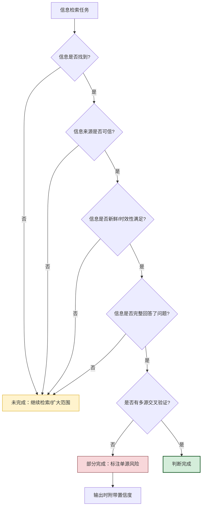

**核心指标**：
- 信息命中率：是否找到了直接回答问题的信息。
- 来源可信度：信息来源的权威程度。
- 时效性：信息的时间戳是否符合要求。
- 交叉验证度：是否有多个独立来源支持同一结论。
- 完整性：是否覆盖了问题的所有方面。

**实例**：用户询问"2026年某新能源汽车的销量"。
- 完成判断需检查：是否找到具体数字、来源是否为官方或权威机构、数据是否为最新月份、是否有多方数据一致。

### 5.2 代码生成类任务

**任务特征**：生成满足特定功能需求的代码，如"实现一个用户登录接口"。

**判断逻辑**：代码任务的完成判断是最可量化的，因为有丰富的自动化验证手段。

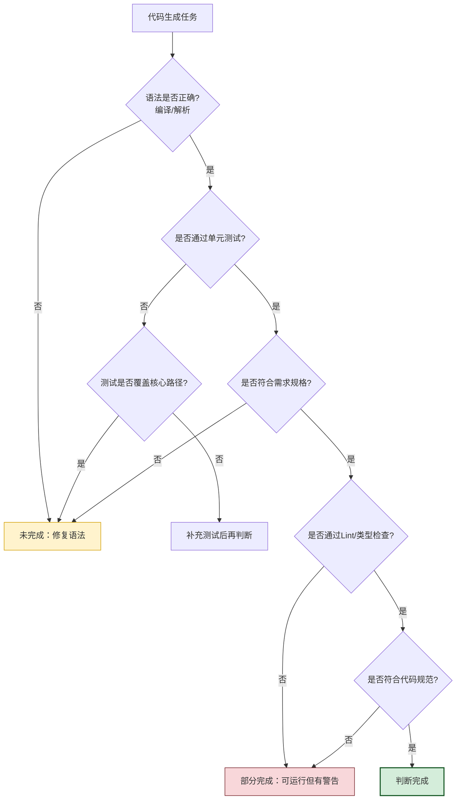

**核心指标与验证手段**：

| 指标 | 验证手段 | 完成标准示例 |
|-----|---------|-------------|
| 语法正确性 | 编译器 / 解释器解析 | 编译无错误 |
| 功能正确性 | 单元测试运行 | 测试通过率 ≥ 95% |
| 需求符合度 | 需求清单逐项核对 | 所有硬性需求 100% 满足 |
| 代码质量 | Lint / 类型检查 / 复杂度分析 | 无 Error，Warning 可接受 |
| 边界处理 | 边界用例测试 | 关键边界用例全部通过 |
| 安全性 | 静态安全扫描 | 无高危漏洞 |

**代码示例**：代码任务的自动化完成判断器

```python
import subprocess
import json
from dataclasses import dataclass


@dataclass
class CodeTaskJudgeResult:
    is_complete: bool
    completion_score: float
    failed_checks: list[str]
    evidence: dict


class CodeTaskCompletionJudge:
    """代码任务完成判断器"""

    def __init__(self, config: dict):
        self.test_command = config["test_command"]
        self.lint_command = config.get("lint_command")
        self.type_check_command = config.get("type_check_command")
        self.min_test_pass_rate = config.get("min_test_pass_rate", 0.95)

    def judge(self, code_path: str) -> CodeTaskJudgeResult:
        evidence = {}
        failed_checks = []

        # 1. 运行测试
        test_result = self._run_command(self.test_command, cwd=code_path)
        evidence["test_output"] = test_result.stdout
        test_pass_rate = self._parse_test_pass_rate(test_result.stdout)
        evidence["test_pass_rate"] = test_pass_rate

        if test_pass_rate < self.min_test_pass_rate:
            failed_checks.append(
                f"测试通过率 {test_pass_rate:.0%} 低于阈值 {self.min_test_pass_rate:.0%}"
            )

        # 2. 类型检查
        if self.type_check_command:
            type_result = self._run_command(self.type_check_command, cwd=code_path)
            evidence["type_check_output"] = type_result.stdout
            if type_result.returncode != 0:
                failed_checks.append("类型检查未通过")

        # 3. Lint检查
        if self.lint_command:
            lint_result = self._run_command(self.lint_command, cwd=code_path)
            evidence["lint_output"] = lint_result.stdout
            error_count = self._count_lint_errors(lint_result.stdout)
            if error_count > 0:
                failed_checks.append(f"Lint存在 {error_count} 个错误")

        # 综合判断
        is_complete = len(failed_checks) == 0
        completion_score = max(0.0, 1.0 - len(failed_checks) * 0.2)

        return CodeTaskJudgeResult(
            is_complete=is_complete,
            completion_score=completion_score,
            failed_checks=failed_checks,
            evidence=evidence,
        )

    def _run_command(self, command: str, cwd: str) -> subprocess.CompletedProcess:
        return subprocess.run(
            command, shell=True, cwd=cwd,
            capture_output=True, text=True, timeout=120
        )

    def _parse_test_pass_rate(self, output: str) -> float:
        """从测试输出中解析通过率（简化实现）"""
        # 实际实现需根据测试框架（pytest/jest等）的输出格式解析
        return 1.0  # 占位

    def _count_lint_errors(self, output: str) -> int:
        """统计Lint错误数"""
        return output.lower().count("error")
```

### 5.3 问题解决类任务

**任务特征**：针对开放性问题给出解决方案，如"分析某系统性能下降的原因"。

**判断逻辑**：问题解决类任务的完成判断最为复杂，因为没有完全自动化的验证手段，常需要 LLM 评分 + 用户确认的组合。

**核心判断维度**：

1. **根因识别度**：是否真正找到了问题的根本原因而非表面现象。
2. **方案可操作性**：提出的解决方案是否具体可执行。
3. **方案完备性**：是否考虑了副作用、边界情况、回滚方案。
4. **证据充分性**：结论是否有充分的数据/日志支撑。
5. **用户认可度**：用户是否接受该解决方案。

**判断框架**：

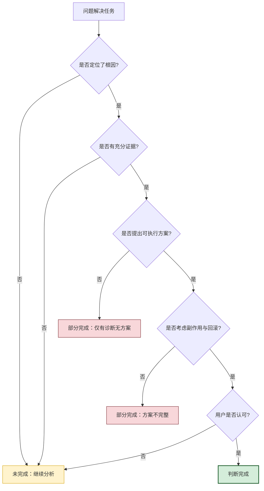

### 5.4 内容创作类任务

**任务特征**：生成文本、图像、报告等创作性内容，如"撰写一份技术方案文档"。

**判断逻辑**：内容创作任务难以完全客观验证，常采用"硬约束检查 + LLM 质量评分 + 用户确认"的三层机制。

**核心判断维度**：

| 维度 | 判断方式 | 示例标准 |
|-----|---------|---------|
| 结构完整性 | 程序化检查大纲 | 必须包含的章节齐全 |
| 内容覆盖度 | 需求清单逐项核对 | 用户要求的所有要点覆盖 |
| 字数/篇幅 | 程序化统计 | 满足字数范围要求 |
| 逻辑连贯性 | LLM 评分 | 评分 ≥ 4/5 |
| 专业准确性 | LLM 评分 / 事实核查 | 无明显事实错误 |
| 格式规范 | 程序化检查 | 符合 Markdown 格式规范 |

### 5.5 多步骤复合任务

**任务特征**：包含多个子任务、跨越多种类型的复杂任务，如"重构某模块并完成测试与文档"。

**判断逻辑**：多步骤复合任务需要分层判断——先判断每个子任务，再汇总判断整体。

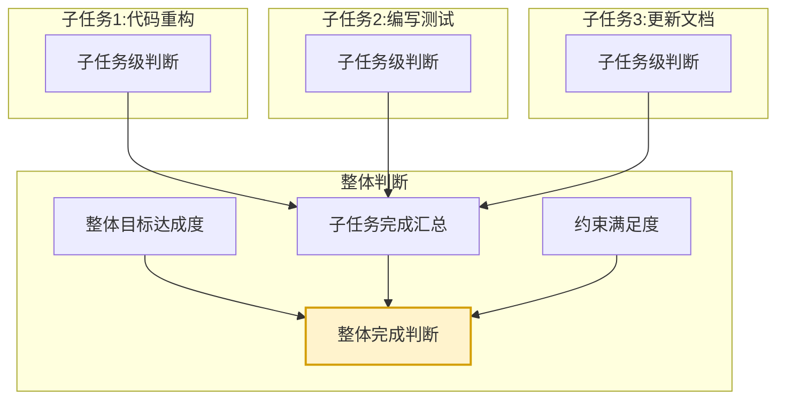

**关键点**：
- 子任务之间存在依赖关系，前置任务未完成时不能启动后续任务。
- 整体完成度 = Σ(子任务完成度 × 子任务权重)。
- 某些"关键子任务"未完成时，整体不可判定为完成。

---

## 六、模糊场景的识别与处理策略

### 6.1 常见模糊场景

真实任务中，Agent 经常遇到无法明确判定"完成/未完成"的模糊场景，主要有以下五类：

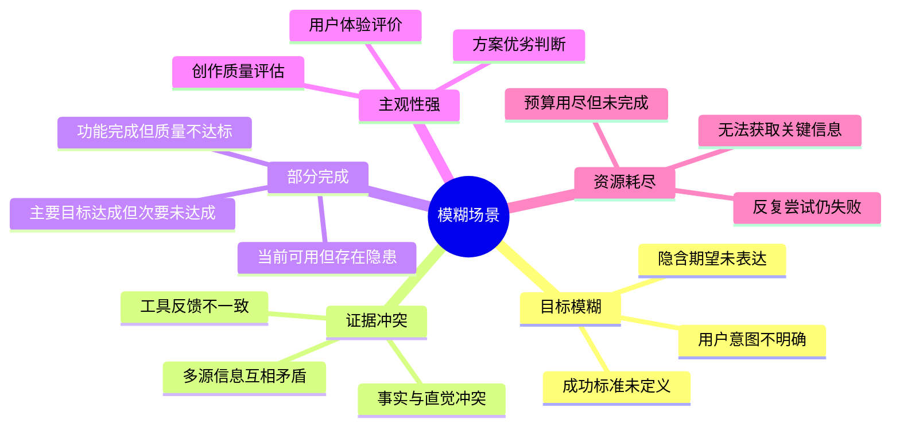

#### 6.1.1 目标模糊场景

用户的需求本身不明确，导致无法定义清晰的完成标准。例如用户说"帮我看看这个方案行不行"，"行不行"的标准完全主观。

#### 6.1.2 证据冲突场景

不同来源的信息互相矛盾。例如两个数据源给出不同的数值，或测试通过但实际运行异常。

#### 6.1.3 部分完成场景

任务达成了主要目标，但存在次要缺失或质量瑕疵。例如代码功能正确但有性能问题。

#### 6.1.4 主观性强的场景

涉及审美、体验、创意的判断难以客观化。例如评估一篇文章写得好不好。

#### 6.1.5 资源耗尽场景

预算或步数耗尽但任务未完成，需要在"未完成但已有部分成果"的情况下做出决策。

### 6.2 处理策略

针对不同模糊场景，应采用差异化的处理策略：

#### 6.2.1 目标模糊的处理

**策略：澄清优先，降级兜底**

1. **主动澄清**：在任务开始时，Agent 主动询问用户以明确成功标准。
2. **标准推断**：基于任务类型与上下文，推断合理的默认成功标准。
3. **降级输出**：无法澄清时，输出结果并明确标注"基于推断标准"。

```python
def handle_vague_goal(user_input: str, context: dict) -> dict:
    """处理目标模糊场景"""
    # 1. 尝试从上下文推断成功标准
    inferred_criteria = infer_success_criteria(user_input, context)

    if not inferred_criteria:
        # 2. 推断失败，触发澄清
        return {
            "action": "clarify",
            "question": "为了更好地完成您的任务，请问您期望的完成标准是什么？"
        }

    # 3. 推断成功，标注置信度并执行
    return {
        "action": "execute_with_inferred_criteria",
        "criteria": inferred_criteria,
        "confidence": "medium",
        "note": "成功标准为推断结果，如不符合预期请指正"
    }
```

#### 6.2.2 证据冲突的处理

**策略：优先采信更可靠来源，触发深度验证**

证据可靠性排序（从高到低）：
1. 程序化验证结果（测试、编译、类型检查）。
2. 权威信息源（官方文档、可信 API）。
3. 多源交叉验证结果。
4. 单一来源信息。
5. Agent 的推理结论。

当高可靠性证据与低可靠性证据冲突时，以高可靠性为准；当同可靠性证据冲突时，触发深度验证或人工介入。

#### 6.2.3 部分完成的处理

**策略：分级输出，明确边界**

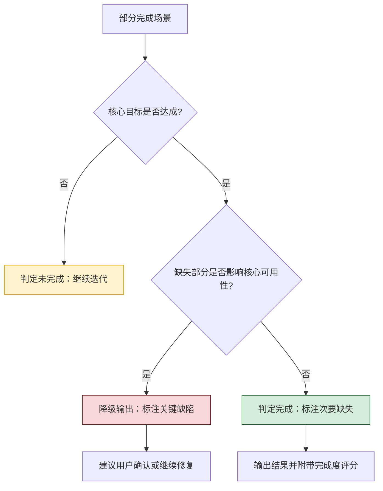

#### 6.2.4 主观性强的处理

**策略：多维评分 + 用户确认**

- 采用多个 LLM 作为"评审委员会"独立评分，取平均或中位数。
- 引入用户偏好画像，个性化调整评分标准。
- 在关键节点要求用户确认。

#### 6.2.5 资源耗尽的处理

**策略：优雅降级，保留成果**

```python
def handle_budget_exhaustion(task_state: TaskState) -> dict:
    """资源耗尽时的处理"""
    completion = task_state.overall_completion

    if completion >= 0.8:
        # 完成度较高：输出结果并标注"部分完成"
        return {
            "action": "output_partial",
            "completion_score": completion,
            "message": f"任务已完成约 {completion:.0%}，因预算限制提前结束",
            "pending_items": get_pending_sub_goals(task_state)
        }
    elif completion >= 0.3:
        # 完成度中等：输出中间结果并建议用户继续
        return {
            "action": "output_intermediate",
            "completion_score": completion,
            "message": "任务进行中因预算限制暂停，已保存进度",
            "resume_hint": "可增加预算后继续"
        }
    else:
        # 完成度很低：如实报告失败
        return {
            "action": "report_failure",
            "completion_score": completion,
            "message": "因预算限制未能完成任务的主要部分",
            "partial_results": get_completed_sub_goals(task_state)
        }
```

### 6.3 人机协作模式

在模糊场景中，"人机协作"是重要的兜底机制。常见的人机协作模式包括：

| 模式 | 适用场景 | 实现方式 |
|-----|---------|---------|
| 确认式 | 关键决策点 | Agent 提出方案，用户确认后继续 |
| 选择式 | 多种可能方案 | Agent 提供候选项，用户选择 |
| 校正式 | Agent 不确定时 | Agent 输出初稿，用户修正 |
| 接管式 | Agent 无法继续 | Agent 交还控制权给用户 |

---

## 七、任务完成度的量化评估方法

### 7.1 量化评估框架

任务完成度的量化评估应采用"分层加权 + 多维融合"的框架：

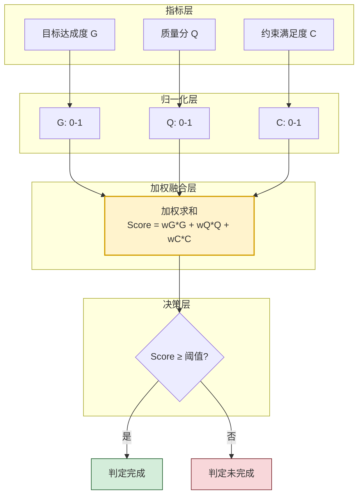

### 7.2 评分模型设计

#### 7.2.1 权重设计

不同任务类型的指标权重应有差异：

| 任务类型 | 目标达成度权重 | 质量权重 | 约束权重 |
|---------|:------------:|:------:|:------:|
| 信息检索 | 0.6 | 0.3 | 0.1 |
| 代码生成 | 0.5 | 0.4 | 0.1 |
| 问题解决 | 0.6 | 0.3 | 0.1 |
| 内容创作 | 0.4 | 0.5 | 0.1 |
| 多步复合 | 0.5 | 0.3 | 0.2 |

#### 7.2.2 完整评分模型实现

```python
from dataclasses import dataclass


@dataclass
class DimensionScore:
    """单维度评分"""
    score: float          # 0-1
    weight: float         # 该维度权重
    sub_scores: dict      # 子指标得分明细
    evidence: list        # 支撑证据


class TaskCompletionScorer:
    """任务完成度评分器"""

    # 默认权重配置
    DEFAULT_WEIGHTS = {
        "goal": 0.5,       # 目标达成度
        "quality": 0.3,    # 质量分
        "constraint": 0.2  # 约束满足度
    }

    # 任务类型特定权重
    TASK_WEIGHTS = {
        "information_retrieval": {"goal": 0.6, "quality": 0.3, "constraint": 0.1},
        "code_generation": {"goal": 0.5, "quality": 0.4, "constraint": 0.1},
        "problem_solving": {"goal": 0.6, "quality": 0.3, "constraint": 0.1},
        "content_creation": {"goal": 0.4, "quality": 0.5, "constraint": 0.1},
        "multi_step": {"goal": 0.5, "quality": 0.3, "constraint": 0.2},
    }

    def __init__(self, task_type: str, threshold: float = 0.85):
        self.weights = self.TASK_WEIGHTS.get(
            task_type, self.DEFAULT_WEIGHTS
        )
        self.threshold = threshold  # 完成阈值

    def score(self, goal_score: float, quality_score: float,
              constraint_score: float) -> dict:
        """计算综合完成度"""
        # 硬性约束一票否决：若任一关键维度为0，整体判定未完成
        if goal_score == 0:
            return self._build_result(0.0, vetoed=True, reason="目标达成度为0")

        # 加权求和
        total = (
            self.weights["goal"] * goal_score
            + self.weights["quality"] * quality_score
            + self.weights["constraint"] * constraint_score
        )

        return self._build_result(
            score=total,
            vetoed=False,
            detail={
                "goal": goal_score,
                "quality": quality_score,
                "constraint": constraint_score,
                "weights": self.weights,
            }
        )

    def is_complete(self, score: float) -> bool:
        """判断是否达到完成标准"""
        return score >= self.threshold

    def _build_result(self, score: float, vetoed: bool,
                      reason: str = "", detail: dict = None) -> dict:
        return {
            "completion_score": round(score, 4),
            "is_complete": score >= self.threshold and not vetoed,
            "threshold": self.threshold,
            "vetoed": vetoed,
            "veto_reason": reason,
            "detail": detail or {},
        }


# 使用示例
scorer = TaskCompletionScorer(task_type="code_generation", threshold=0.85)
result = scorer.score(
    goal_score=0.95,       # 需求全部满足
    quality_score=0.80,    # 测试通过率略低
    constraint_score=1.0   # 预算充足
)
print(f"完成度: {result['completion_score']}, 是否完成: {result['is_complete']}")
# 输出: 完成度: 0.895, 是否完成: True
```

### 7.3 阈值设定与决策

完成阈值的设定是判断机制的关键参数，需根据任务特性动态调整：

| 阈值范围 | 适用场景 | 说明 |
|---------|---------|------|
| ≥ 0.95 | 安全关键、合规任务 | 高可靠性要求，几乎零容忍 |
| ≥ 0.85 | 代码生成、数据处理 | 允许少量瑕疵但核心必须正确 |
| ≥ 0.70 | 内容创作、信息检索 | 允许部分不完美，可迭代优化 |
| ≥ 0.50 | 探索性任务、头脑风暴 | 重视过程价值，结果可粗糙 |

**动态阈值调整策略**：

```python
class AdaptiveThreshold:
    """自适应阈值调整器"""

    @staticmethod
    def compute(base_threshold: float, context: dict) -> float:
        threshold = base_threshold

        # 因素1：剩余预算越少，阈值适当降低（避免无意义重试）
        budget_ratio = context.get("budget_remaining_ratio", 1.0)
        if budget_ratio < 0.2:
            threshold -= 0.05  # 预算紧张时降低标准

        # 因素2：重试次数越多，阈值适当降低（避免陷入死循环）
        retry_count = context.get("retry_count", 0)
        if retry_count > 3:
            threshold -= 0.05

        # 因素3：任务重要性高时，阈值提升
        importance = context.get("importance", "medium")
        if importance == "critical":
            threshold += 0.05

        # 确保阈值在合理范围
        return max(0.5, min(0.98, threshold))
```

### 7.4 完成度可视化

为提升可解释性，完成度的评估结果应可视化呈现：

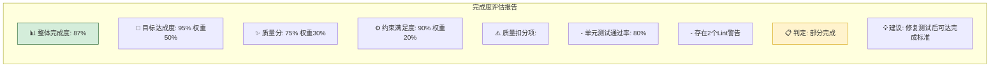

---

## 八、实践指导与最佳实践

### 8.1 通用判断框架

综合前述内容，一个通用的任务完成判断框架如下：

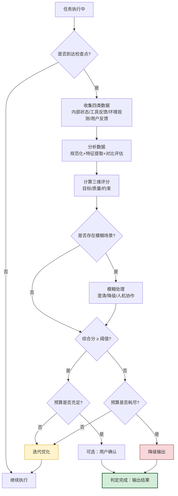

### 8.2 完整实现示例

下面给出一个完整的、可运行的完成判断器实现示例，综合运用了前述的指标体系、数据收集、量化评估等方法：

```python
"""
AI Agent 任务完成判断器 - 完整实现示例
综合运用指标体系、证据收集、量化评估、模糊处理
"""
import time
from dataclasses import dataclass, field
from enum import Enum
from typing import Optional


class JudgeDecision(Enum):
    COMPLETE = "complete"               # 完成
    CONTINUE = "continue"               # 继续执行
    DEGRADE_OUTPUT = "degrade_output"   # 降级输出
    HUMAN_HELP = "human_help"           # 请求人工介入
    FAIL = "fail"                       # 失败


@dataclass
class JudgmentResult:
    """判断结果"""
    decision: JudgeDecision
    completion_score: float
    confidence: float
    reason: str
    evidence_summary: dict
    suggestions: list[str] = field(default_factory=list)
    timestamp: float = field(default_factory=time.time)


class TaskCompletionJudge:
    """任务完成判断器"""

    def __init__(self, config: dict):
        self.task_type = config["task_type"]
        self.threshold = config.get("threshold", 0.85)
        self.max_retries = config.get("max_retries", 3)
        self.budget = config.get("budget", {"steps": 20, "tokens": 50000})

    def judge(self, task_state: dict) -> JudgmentResult:
        """执行完成判断"""
        # 第1步：收集证据
        evidence = self._collect_evidence(task_state)

        # 第2步：计算三维评分
        scores = self._compute_scores(evidence, task_state)

        # 第3步：检测模糊场景
        fuzzy_issues = self._detect_fuzzy_scenarios(scores, evidence)

        # 第4步：综合决策
        decision = self._make_decision(
            scores, fuzzy_issues, task_state
        )

        return JudgmentResult(
            decision=decision,
            completion_score=scores["total"],
            confidence=scores["confidence"],
            reason=self._explain_decision(decision, scores, fuzzy_issues),
            evidence_summary={
                "goal_score": scores["goal"],
                "quality_score": scores["quality"],
                "constraint_score": scores["constraint"],
                "fuzzy_issues": fuzzy_issues,
            },
            suggestions=self._generate_suggestions(decision, scores, fuzzy_issues),
        )

    def _collect_evidence(self, task_state: dict) -> dict:
        """收集四类证据"""
        return {
            "internal": task_state.get("execution_trace", []),
            "tool_feedback": task_state.get("tool_results", []),
            "environment": task_state.get("env_observations", []),
            "user_feedback": task_state.get("user_signals", []),
        }

    def _compute_scores(self, evidence: dict, task_state: dict) -> dict:
        """计算三维评分"""
        # 目标达成度：基于子目标完成情况
        sub_goals = task_state.get("sub_goals", [])
        goal_score = self._compute_goal_score(sub_goals)

        # 质量分：基于工具反馈与质量检查
        quality_score = self._compute_quality_score(evidence["tool_feedback"])

        # 约束满足度：基于资源消耗
        constraint_score = self._compute_constraint_score(task_state)

        # 加权求和
        weights = self._get_weights()
        total = (
            weights["goal"] * goal_score
            + weights["quality"] * quality_score
            + weights["constraint"] * constraint_score
        )

        # 置信度：基于证据充分性
        confidence = self._compute_confidence(evidence)

        return {
            "goal": goal_score,
            "quality": quality_score,
            "constraint": constraint_score,
            "total": total,
            "confidence": confidence,
            "weights": weights,
        }

    def _compute_goal_score(self, sub_goals: list) -> float:
        if not sub_goals:
            return 0.0
        completed = sum(1 for sg in sub_goals if sg.get("status") == "completed")
        return completed / len(sub_goals)

    def _compute_quality_score(self, tool_feedback: list) -> float:
        if not tool_feedback:
            return 0.5  # 无工具反馈时给中等分
        positive = sum(1 for tf in tool_feedback if tf.get("success", False))
        return positive / len(tool_feedback)

    def _compute_constraint_score(self, task_state: dict) -> float:
        steps_used = task_state.get("step_count", 0)
        steps_budget = self.budget["steps"]
        tokens_used = task_state.get("token_used", 0)
        tokens_budget = self.budget["tokens"]

        step_ratio = 1.0 - (steps_used / steps_budget)
        token_ratio = 1.0 - (tokens_used / tokens_budget)
        return max(0.0, min(1.0, (step_ratio + token_ratio) / 2))

    def _compute_confidence(self, evidence: dict) -> float:
        total_evidence = sum(len(v) for v in evidence.values())
        if total_evidence == 0:
            return 0.1
        # 证据越多置信度越高，但有上限
        return min(0.95, 0.3 + total_evidence * 0.1)

    def _get_weights(self) -> dict:
        weights_map = {
            "information_retrieval": {"goal": 0.6, "quality": 0.3, "constraint": 0.1},
            "code_generation": {"goal": 0.5, "quality": 0.4, "constraint": 0.1},
            "problem_solving": {"goal": 0.6, "quality": 0.3, "constraint": 0.1},
            "content_creation": {"goal": 0.4, "quality": 0.5, "constraint": 0.1},
        }
        return weights_map.get(self.task_type,
                               {"goal": 0.5, "quality": 0.3, "constraint": 0.2})

    def _detect_fuzzy_scenarios(self, scores: dict, evidence: dict) -> list:
        """检测模糊场景"""
        issues = []

        # 部分完成：分数在中间区间
        if 0.5 < scores["total"] < self.threshold:
            issues.append("partial_completion")

        # 证据冲突：工具反馈中存在矛盾
        if self._has_contradiction(evidence["tool_feedback"]):
            issues.append("evidence_conflict")

        # 置信度低
        if scores["confidence"] < 0.5:
            issues.append("low_confidence")

        return issues

    def _has_contradiction(self, tool_feedback: list) -> bool:
        # 简化实现：检查是否有成功与失败并存的反馈
        has_success = any(tf.get("success") for tf in tool_feedback)
        has_failure = any(not tf.get("success") for tf in tool_feedback if tf)
        return has_success and has_failure

    def _make_decision(self, scores: dict, fuzzy_issues: list,
                       task_state: dict) -> JudgeDecision:
        """综合决策"""
        # 硬性规则：预算耗尽
        if task_state.get("step_count", 0) >= self.budget["steps"]:
            if scores["total"] >= 0.7:
                return JudgeDecision.DEGRADE_OUTPUT
            else:
                return JudgeDecision.FAIL

        # 硬性规则：目标完全未达成
        if scores["goal"] == 0:
            if task_state.get("retry_count", 0) >= self.max_retries:
                return JudgeDecision.HUMAN_HELP
            return JudgeDecision.CONTINUE

        # 主规则：达到阈值
        if scores["total"] >= self.threshold:
            # 存在模糊场景时，降低为降级输出
            if fuzzy_issues and scores["confidence"] < 0.7:
                return JudgeDecision.DEGRADE_OUTPUT
            return JudgeDecision.COMPLETE

        # 未达阈值：继续迭代
        if task_state.get("retry_count", 0) >= self.max_retries:
            return JudgeDecision.HUMAN_HELP
        return JudgeDecision.CONTINUE

    def _explain_decision(self, decision: JudgeDecision,
                          scores: dict, fuzzy_issues: list) -> str:
        reasons = {
            JudgeDecision.COMPLETE: f"综合完成度 {scores['total']:.0%} 达到阈值，判定完成",
            JudgeDecision.CONTINUE: f"综合完成度 {scores['total']:.0%} 未达阈值，继续迭代",
            JudgeDecision.DEGRADE_OUTPUT: f"完成度 {scores['total']:.0%} 较高但存在模糊场景，降级输出",
            JudgeDecision.HUMAN_HELP: "多次尝试未达完成标准，请求人工介入",
            JudgeDecision.FAIL: "预算耗尽且完成度低，判定失败",
        }
        return reasons.get(decision, "未知决策")

    def _generate_suggestions(self, decision: JudgeDecision,
                               scores: dict, fuzzy_issues: list) -> list:
        suggestions = []
        if decision == JudgeDecision.CONTINUE:
            if scores["quality"] < scores["goal"]:
                suggestions.append("优先提升质量分：检查工具反馈中的失败项")
            if scores["goal"] < 0.8:
                suggestions.append("优先提升目标达成度：检查未完成的子目标")
        if "evidence_conflict" in fuzzy_issues:
            suggestions.append("存在证据冲突，建议增加验证步骤")
        if "low_confidence" in fuzzy_issues:
            suggestions.append("置信度偏低，建议收集更多证据")
        return suggestions


# ====== 使用示例 ======
if __name__ == "__main__":
    # 配置判断器
    judge = TaskCompletionJudge({
        "task_type": "code_generation",
        "threshold": 0.85,
        "max_retries": 3,
        "budget": {"steps": 20, "tokens": 50000},
    })

    # 模拟任务状态
    task_state = {
        "sub_goals": [
            {"id": "g1", "description": "实现核心逻辑", "status": "completed"},
            {"id": "g2", "description": "编写单元测试", "status": "completed"},
            {"id": "g3", "description": "编写文档", "status": "completed"},
        ],
        "tool_results": [
            {"tool": "pytest", "success": True, "output": "9/10 passed"},
            {"tool": "mypy", "success": True, "output": "no errors"},
            {"tool": "flake8", "success": False, "output": "2 warnings"},
        ],
        "step_count": 8,
        "token_used": 12000,
        "retry_count": 1,
    }

    # 执行判断
    result = judge.judge(task_state)
    print(f"决策: {result.decision.value}")
    print(f"完成度: {result.completion_score:.2%}")
    print(f"置信度: {result.confidence:.2%}")
    print(f"原因: {result.reason}")
    print(f"建议: {result.suggestions}")
```

### 8.3 常见陷阱与避坑指南

| 陷阱 | 表现 | 规避方法 |
|-----|------|---------|
| 自我宣称完成 | Agent 直接说"已完成"就终止 | 强制要求提供客观证据 |
| 单指标依赖 | 只看能否运行就判定完成 | 采用多维度加权评估 |
| 阈值僵化 | 所有任务用同一阈值 | 按任务类型动态调整阈值 |
| 忽略用户意图 | 只验证技术指标不看用户目标 | 每次判断回溯原始意图 |
| 无降级机制 | 未达阈值就简单失败 | 设计分级降级输出 |
| 预算无感知 | 反复重试耗尽资源 | 实时监控预算并触发兜底 |
| 证据单一 | 只依据单一来源就判定 | 要求多源交叉验证 |

### 8.4 与"避免无限循环"机制的协同

完成判断与 [13Agent避免无限循环机制详解.md](./13Agent避免无限循环机制详解.md) 中的循环避免机制是互补关系：

- **循环避免机制**：关注"如何避免无意义的重复"，是被动保护。
- **完成判断机制**：关注"如何主动识别已达成目标"，是主动决策。

两者协同工作：完成判断在每次执行后评估是否该停止，循环避免机制在完成判断失效时作为兜底保护。完整的 Agent 系统应同时具备两者。

---

## 九、总结与展望

### 9.1 核心要点回顾

本文系统阐述了 AI Agent 任务完成判断的完整机制，核心要点如下：

1. **任务完成判断是 Agent 决策回路中的终止性决策环节**，其质量直接决定 Agent 的成本、质量与用户体验。
2. **五大核心原则**——目标对齐、可验证性、渐进式确认、多维度评估、不确定性兜底——是判断机制设计的标尺。
3. **指标体系由三层构成**——目标维度、质量维度、约束维度，通过加权融合形成综合完成度。
4. **数据收集是判断的基础**，需从内部状态、工具反馈、环境观测、用户反馈四个渠道全面收集证据。
5. **不同任务类型需要差异化的判断逻辑**——代码任务可高度自动化，创作任务需人机结合。
6. **模糊场景需要分级处理**——通过澄清、降级、人机协作等策略应对真实世界的不确定性。
7. **量化评估采用"分层加权 + 阈值决策"模型**，阈值应按任务类型与上下文动态调整。

### 9.2 判断机制的成熟度模型

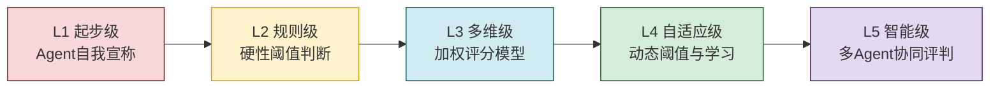

当前主流 Agent 系统多处于 L2-L3 之间，向 L4-L5 演进是未来方向。

### 9.3 未来发展方向

1. **学习型判断**：Agent 从历史任务中学习判断标准，逐步个性化。
2. **多 Agent 协同评判**：引入"评判 Agent"角色，专门负责完成度评估，与执行 Agent 解耦。
3. **用户偏好建模**：基于用户历史反馈，构建个性化完成标准。
4. **主动学习**：Agent 在模糊场景中主动向用户学习，丰富判断知识库。
5. **标准化评估基准**：行业形成统一的任务完成度评估基准与数据集。

### 9.4 给开发者的实践建议

1. **从最小可用判断开始**：先实现 L2 级的硬性阈值判断，再逐步演进。
2. **强制证据化**：杜绝 Agent 自我宣称完成，所有判断必须有证据支撑。
3. **保留判断日志**：记录每次判断的输入、输出、决策依据，便于调试与改进。
4. **设计清晰的降级路径**：宁可降级输出，不要错误地宣称完成。
5. **让用户参与判断闭环**：在关键节点引入用户确认，弥补纯自动判断的不足。
6. **持续校准阈值**：基于线上数据反馈，动态调整各类任务的完成阈值。

---

> **相关文档**
>
> - [12Agent自主决策机制深度解析.md](./12Agent自主决策机制深度解析.md)：决策机制是完成判断的上游，理解决策才能理解终止。
> - [13Agent避免无限循环机制详解.md](./13Agent避免无限循环机制详解.md)：循环避免是完成判断失效时的兜底保护。
> - [5Agent规划能力深度解析.md](./5Agent规划能力深度解析.md)：规划提供子目标与验收标准，是判断的依据。
> - [6Agent记忆能力深度解析.md](./6Agent记忆能力深度解析.md)：记忆提供执行轨迹，是判断的证据来源。
