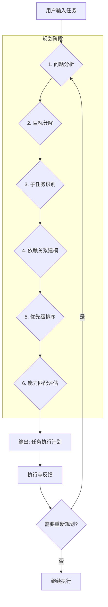
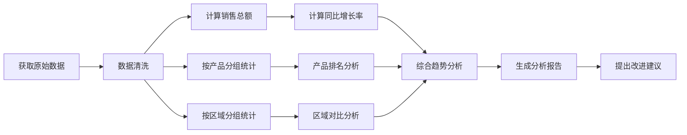
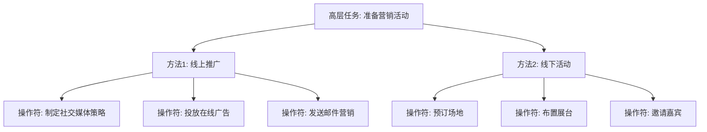
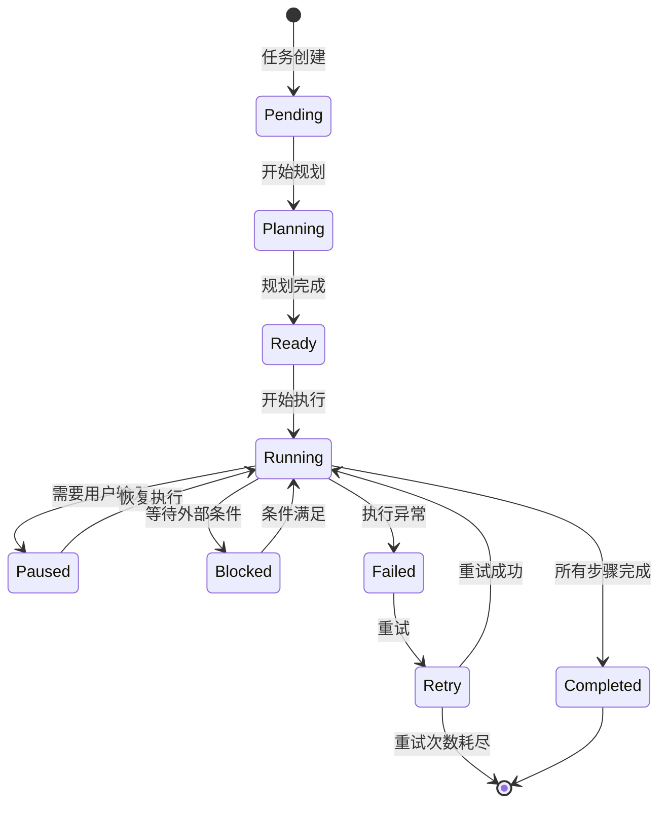
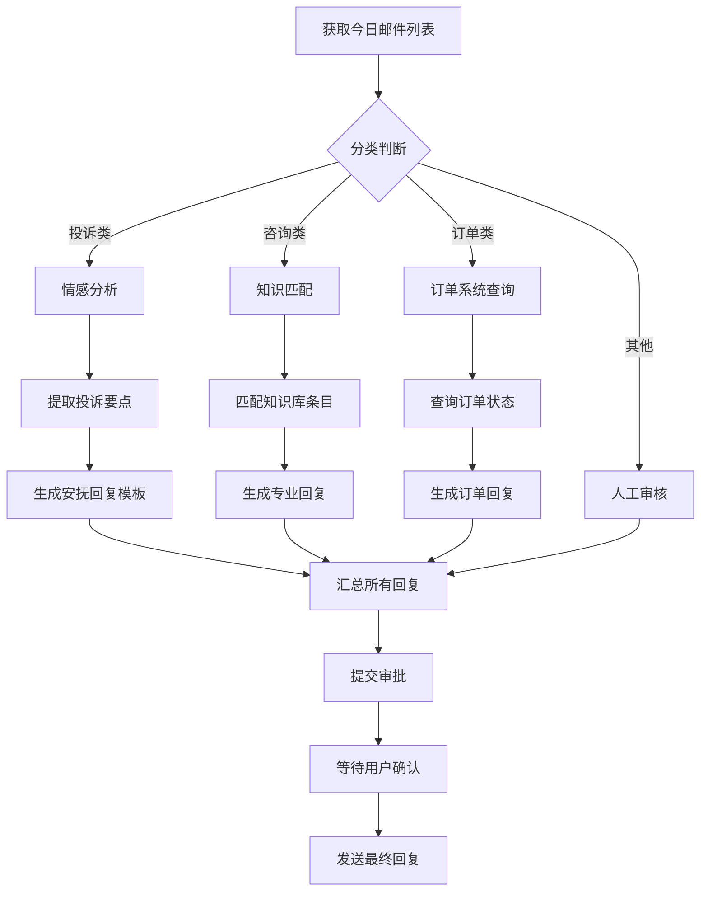

# AI Agent 任务拆解机制深度解析

## 一、任务拆解的定义与重要性

### 1.1 什么是任务拆解

任务拆解（Task Decomposition）是指 Agent 将用户输入的复杂、模糊的高层目标，转化为一系列具体、可执行、有序的子任务（Subtasks）或行动步骤（Actions）的过程。它是 Agent 规划能力的核心体现。

### 1.2 任务拆解的重要性

#### (1) 应对复杂任务的根本途径
用户的指令往往是宏观的（如“帮我准备一次日本旅行”），直接执行不可行。通过拆解，Agent 可以将其转化为“确定日期”、“预订机票”、“选择酒店”、“制定行程”等一系列具体动作。

#### (2) 降低问题复杂度
将大问题分解为小问题，每个子任务的搜索空间和决策复杂度都会大幅降低，从而提高执行成功率和结果质量。

#### (3) 支持并行执行与优化
拆解后，Agent 可以识别独立的子任务，将其分配给不同的工具或 Agent 并行执行，提升整体效率。

#### (4) 增强可解释性
清晰的任务拆解步骤让 Agent 的决策过程对用户透明，便于用户干预和调整。

### 1.3 任务拆解 vs 普通对话的区别

| 维度 | 普通对话（Chat） | Agent 任务拆解 |
| :--- | :--- | :--- |
| **目标** | 回答单个问题 | 完成一个复杂目标 |
| **过程** | 单轮或多轮问答 | 结构化的规划与执行 |
| **输出** | 一段文本回答 | 一系列可执行的步骤/行动 |
| **工具使用** | 可选的单次调用 | 通常伴随多次工具调用 |
| **状态管理** | 无状态 | 需要维护任务状态图 |

---

## 二、Agent 执行任务拆解的具体步骤

任务拆解是一个动态的、循环迭代的过程，通常包含以下核心步骤：

### 2.1 任务拆解完整流程图



### 2.2 各步骤详解

#### 步骤一：问题分析与意图理解

Agent 首先需要深入理解用户的真实意图和任务的上下文环境。

```markdown
用户输入："帮我分析 Q3 的销售数据，并给出改进建议"

问题分析包含：
1. **核心目标**：分析数据 + 给出建议
2. **关键实体**：Q3 时间范围、销售数据
3. **隐含要求**：建议需要具体、可执行，可能需要数据可视化
4. **约束条件**：可能涉及数据权限、分析维度等
```

**关键技术**：
- 大语言模型的语义理解能力
- 上下文窗口中的历史对话信息
- 预设的 Prompt 模板引导分析方向

#### 步骤二：目标分解与层级化处理

将识别到的核心目标分解为不同层次的子目标，形成任务树结构。

```markdown
核心目标：分析 Q3 销售数据并给出建议
├── 第一层子目标
│   ├── 1. 数据准备
│   │   ├── 1.1 确定数据源（ERP/BI系统）
│   │   ├── 1.2 获取 Q3 全量销售数据
│   │   └── 1.3 数据清洗（去除异常值、补全缺失值）
│   ├── 2. 数据分析
│   │   ├── 2.1 销售额趋势分析（按周/月）
│   │   ├── 2.2 产品维度分析（TOP/N）
│   │   └── 2.3 区域/渠道分析
│   └── 3. 建议生成
│       ├── 3.1 识别业绩下滑/增长点
│       ├── 3.2 分析原因
│       └── 3.3 制定改进措施
```

#### 步骤三：子任务识别与原子化

将高层子目标进一步细化为不可再分的原子操作（Atomic Actions），每个操作对应一个具体的工具调用或推理步骤。

**原子任务的特征**：
- 单一职责：只做一件事
- 可独立验证：执行结果明确
- 对应工具：可以映射到具体的 API 或函数
- 低耦合：减少与其他子任务的依赖

#### 步骤四：依赖关系建模

识别子任务之间的先后顺序和依赖关系，构建任务依赖图（DAG）。



**依赖类型**：
- **完成-开始（FS）**：前置任务完成后，后续任务才能开始
- **完成-完成（FF）**：多个任务需要同时完成
- **开始-开始（SS）**：多个任务需要同步启动

#### 步骤五：优先级排序

在并行路径存在时，Agent 需要根据任务的重要性、紧迫性和依赖关系确定执行顺序。

**常用排序策略**：
1. **关键路径法（CPM）**：优先处理影响整体完成时间的关键路径任务
2. **最短处理时间（SPT）**：优先执行耗时最短的任务
3. **重要-紧急矩阵**：按任务的重要性和紧急程度排序
4. **资源依赖优先**：优先执行需要特定资源/工具的任务

#### 步骤六：能力匹配与可行性评估

在最终确定执行计划前，Agent 需要评估：
- 每个子任务所需的工具/API 是否可用
- 自身的知识和能力是否足以完成
- 是否需要用户提供额外信息或授权

---

## 三、常用的任务拆解算法与模型

### 3.1 基于规则的拆解（Rule-Based）

通过预定义的规则模板，对特定类型任务进行固定模式的拆解。

**适用场景**：高频、结构化的任务（如报销审批、订单处理）

```python
# 伪代码示例：基于规则的拆解
RULES = {
    "travel_booking": [
        "查询机票价格",
        "选择航班",
        "预订酒店",
        "安排接送机",
        "生成行程单"
    ],
    "report_generation": [
        "收集数据源",
        "数据清洗",
        "指标计算",
        "图表生成",
        "撰写分析结论"
    ]
}

def rule_based_decompose(task_type):
    return RULES.get(task_type, [])
```

**优点**：高效、可预测、结果稳定
**缺点**：灵活性差，难以应对新场景和复杂任务

### 3.2 基于 LLM 思维链的拆解（CoT-Based）

利用大语言模型的推理能力，通过 Chain-of-Thought 引导模型进行分步拆解。

```markdown
# Prompt 示例：CoT 任务拆解

请将以下用户任务拆解为具体的执行步骤：

用户任务：帮我组织一次公司年会

请按以下格式输出：
1. [步骤1名称] - [具体描述] - [所需工具/能力]
2. [步骤2名称] - [具体描述] - [所需工具/能力]
...

考虑因素：
- 需要哪些前置准备工作？
- 各步骤之间的依赖关系是什么？
- 哪些步骤可以并行执行？
```

**优点**：灵活性强，适应各种任务类型
**缺点**：可能产生幻觉，结果不够稳定

### 3.3 基于图结构的拆解（Graph-Based）

将任务表示为有向无环图（DAG），节点代表子任务，边代表依赖关系。

```python
# 图结构任务表示
class TaskGraph:
    def __init__(self):
        self.nodes = {}  # task_id -> TaskNode
        self.edges = []  # (from_id, to_id, dependency_type)
    
    def add_task(self, task_id, description, tools_needed):
        self.nodes[task_id] = {
            "id": task_id,
            "description": description,
            "tools": tools_needed,
            "status": "pending"  # pending, running, completed, failed
        }
    
    def add_dependency(self, from_id, to_id, dep_type="FS"):
        self.edges.append((from_id, to_id, dep_type))
    
    def get_ready_tasks(self):
        """获取所有前置任务已完成的可执行任务"""
        completed = {n["id"] for n in self.nodes.values() if n["status"] == "completed"}
        ready = []
        for node in self.nodes.values():
            if node["status"] != "pending":
                continue
            deps = [e[0] for e in self.edges if e[1] == node["id"]]
            if all(d in completed for d in deps):
                ready.append(node)
        return ready
```

### 3.4 层级任务网络（HTN）

将任务拆解为"方法"（Methods）和"操作符"（Operators）两级结构。



---

## 四、影响任务拆解效果的关键因素

### 4.1 任务描述的清晰度

**模糊描述**："帮我处理一下报表" → 拆解困难，可能遗漏关键步骤
**清晰描述**："帮我处理 Q3 华东区销售报表，需要包含销售额、增长率、TOP5 产品排名" → 拆解精准

### 4.2 Agent 的领域知识

Agent 对任务领域越熟悉，拆解的粒度和准确性越高。

| 任务领域 | 知识要求 | 示例 |
| :--- | :--- | :--- |
| **财务分析** | 会计准则、报表结构 | 知道需要先获取总账数据，再做明细分析 |
| **软件开发** | 编码规范、依赖管理 | 知道需要先配置环境，再编写单元测试 |
| **市场营销** | 用户画像、渠道特性 | 知道需要先调研目标用户，再选择推广渠道 |

### 4.3 可用工具的丰富度

- 工具越丰富，Agent 能将任务拆解到更细的粒度
- 工具的文档质量影响 Agent 对工具能力的理解
- 工具的响应速度影响拆解过程中的动态调整

### 4.4 历史经验数据

Agent 如果能参考历史上类似任务的拆解方案，拆解效果会显著提升。

```markdown
# 经验复用示例
历史任务："分析 Q2 销售数据" 
→ 拆解步骤：获取数据 → 清洗 → 统计 → 分析 → 生成报告

当前任务："分析 Q3 销售数据"
→ 复用并调整：获取 Q3 数据 → 清洗 → 统计 → 分析 → 生成报告
```

### 4.5 上下文信息

- 会话历史：用户之前的补充说明
- 环境信息：当前时间、系统状态、资源可用性
- 用户偏好：语言风格、输出格式、关注重点

---

## 五、不同类型任务的拆解策略对比

### 5.1 复杂决策任务

**任务特征**：涉及多方案评估、不确定性、需要权衡取舍

**拆解策略**：

```markdown
示例："帮我选择一个云服务提供商"

策略：多维度评估拆解
1. 明确评估维度（价格、性能、可靠性、支持）
2. 确定各维度权重
3. 收集各候选方案在每个维度上的数据
4. 计算综合评分
5. 生成对比报告
6. 给出推荐方案及理由
```

**关键要点**：
- 引入评估框架（如 AHP 层次分析法）
- 考虑所有备选方案
- 确保决策的可解释性

### 5.2 多步骤操作任务

**任务特征**：步骤清晰，逻辑明确，通常有标准流程

**拆解策略**：

```markdown
示例："帮我部署一个新应用到生产环境"

策略：线性流程拆解 + 检查点
1. [前置检查] 确认代码已合并到主分支
2. [构建阶段] 执行 CI/CD 构建流程
3. [测试阶段] 运行自动化测试套件
4. [预发布验证] 在预发布环境进行冒烟测试
5. [生产部署] 分批次部署到生产环境
6. [部署验证] 监控系统指标和错误日志
7. [回滚预案] 准备回滚脚本
```

**关键要点**：
- 严格遵循顺序依赖
- 在关键节点设置验证检查点
- 规划异常处理和回滚方案

### 5.3 知识密集型任务

**任务特征**：需要大量信息检索、分析和综合

**拆解策略**：

```markdown
示例："帮我写一份关于人工智能在医疗领域应用的调研报告"

策略：信息漏斗式拆解
1. [广度检索] 搜索 AI 医疗应用的主要领域（诊断、治疗、影像分析等）
2. [深度研究] 对每个领域进行深入调研，收集案例和数据
3. [信息整合] 整理、分类、对比收集到的信息
4. [观点形成] 基于分析形成核心观点和趋势判断
5. [报告撰写] 按照学术/专业报告结构撰写内容
6. [质量审核] 检查引用来源、数据准确性和逻辑连贯性
```

**关键要点**：
- 充分利用搜索和数据库查询工具
- 确保信息来源的多样性和权威性
- 注重信息的交叉验证

### 5.4 类型拆解策略对比表

| 任务类型 | 核心挑战 | 拆解策略 | 关键工具 |
| :--- | :--- | :--- | :--- |
| **复杂决策** | 不确定性、多目标权衡 | 多维度评估框架 | 搜索、计算工具 |
| **多步骤操作** | 顺序依赖、异常处理 | 线性流程 + 检查点 | 执行、监控工具 |
| **知识密集型** | 信息获取与整合 | 信息漏斗式流程 | 搜索、分析工具 |
| **创造性任务** | 创意生成与评估 | 发散-收敛双阶段 | 搜索、生成工具 |

---

## 六、任务拆解过程中的常见挑战与解决方案

### 6.1 挑战一：过度拆解 vs 拆解不足

| 问题 | 表现 | 后果 |
| :--- | :--- | :--- |
| **过度拆解** | 将任务分解到过细的粒度 | 执行效率低下，管理开销增大 |
| **拆解不足** | 子任务粒度过粗，模糊不清 | 执行时需要频繁重新规划 |

**解决方案**：
- 设定拆解深度阈值（如子任务应在 1-5 步内可完成）
- 引入反馈机制，执行中动态调整粒度
- 基于任务类型预设合理的拆解层级

### 6.2 挑战二：依赖关系遗漏

表现为执行到某一步时，发现缺少前置条件或数据。

```markdown
错误示例：
1. 生成数据分析图表
2. 计算统计指标
3. 获取销售数据
→ 执行时发现步骤1依赖步骤2的结果，而步骤2依赖步骤3

正确顺序应为：
1. 获取销售数据
2. 计算统计指标
3. 生成数据分析图表
```

**解决方案**：
- 引入拓扑排序算法确保依赖关系正确
- 在执行前进行完整的依赖图校验
- 对复杂任务先进行模拟执行（Dry Run）

### 6.3 挑战三：动态环境变化

任务执行过程中，用户需求变更或环境发生变化。

**解决方案**：
- 引入增量式规划（Incremental Planning），允许局部调整
- 设置检查点（Checkpoints），在关键节点暂停等待用户确认
- 维护版本化的任务计划，便于回滚到之前的状态

### 6.4 挑战四：工具能力边界

当拆解出的子任务超出 Agent 或工具的能力范围。

**解决方案**：
- 维护工具能力注册表，在拆解前进行可行性检查
- 对于超出能力的子任务，生成人工协作请求
- 设计降级方案，用现有能力近似完成

### 6.5 挑战五：长周期任务的状态管理

对于需要长时间运行的任务，如何保持状态一致性。

**解决方案**：
- 引入任务状态机（Task State Machine）
- 定期持久化任务进度到外部存储
- 设计超时和恢复机制



---

## 七、实际应用案例分析

### 案例一：智能邮件处理 Agent

**任务**："处理今天收到的所有客户邮件，给出回复建议"

#### 7.1 拆解流程



#### 7.2 关键拆解决策

| 决策点 | 选择方案 | 决策理由 |
| :--- | :--- | :--- |
| **分类依据** | 按邮件内容语义分类 | 不同类型邮件需要不同的处理流程 |
| **并行策略** | 各分类独立处理 | 邮件之间相互独立，可以并行提高效率 |
| **人工介入** | 投诉类邮件需要审核 | 涉及客户关系，需要人类把关 |

#### 7.3 执行效果评估

- 处理效率：从原来的人工 2 小时/50 封，降低到 Agent 30 分钟/50 封
- 准确率：首次回复通过率达到 85%
- 可扩展性：可以轻松应对邮件量的 3-5 倍增长

### 案例二：代码重构 Agent

**任务**："重构登录模块的代码，提升安全性"

#### 7.4 拆解流程

```markdown
1. [分析阶段]
   1.1 扫描登录模块代码结构
   1.2 识别安全隐患（明文密码、SQL注入、弱加密等）
   1.3 评估重构影响范围

2. [规划阶段]
   2.1 设计新的认证方案（如 JWT + OAuth2）
   2.2 制定迁移计划
   2.3 确定测试策略

3. [执行阶段]
   3.1 实现新的认证逻辑
   3.2 编写单元测试
   3.3 进行代码审查
   3.4 集成测试

4. [验证阶段]
   4.1 安全渗透测试
   4.2 性能回归测试
   4.3 兼容性测试

5. [部署阶段]
   5.1 分环境部署（开发 → 测试 → 预发布 → 生产）
   5.2 监控线上指标
   5.3 准备回滚方案
```

#### 7.5 技术要点

- **增量替换**：采用适配器模式，新旧认证方案并存一段时间
- **灰度发布**：先让 10% 用户使用新方案，观察一周
- **完整回滚**：保持旧方案可随时启用

---

## 八、总结与展望

### 8.1 任务拆解的核心原则

1. **原子性原则**：每个子任务应足够简单，可独立执行和验证
2. **正交性原则**：减少子任务之间的耦合度
3. **可验证原则**：每个子任务的完成状态必须明确可判断
4. **动态性原则**：支持执行过程中的动态调整和重新规划

### 8.2 未来发展方向

| 方向 | 说明 | 预期价值 |
| :--- | :--- | :--- |
| **自适应拆解** | 根据执行反馈自动调整拆解粒度 | 提升复杂任务的成功率 |
| **多粒度并存** | 同时维护宏观计划和微观操作视图 | 兼顾全局性和精确性 |
| **协作式拆解** | 多 Agent 协同完成大规模任务拆解 | 支撑更复杂的企业级场景 |
| **用户定制化拆解** | 学习用户偏好和工作习惯，个性化拆解 | 提升用户体验和接受度 |

### 8.3 对 Agent 能力的影响

任务拆解能力是 Agent 从"工具"走向"助手"的关键转折点。高效的任务拆解机制能够：

- **提升自主性**：减少对用户的依赖，自主完成更多工作
- **扩大适用范围**：处理越来越复杂和开放的任务
- **增强可靠性**：通过结构化的步骤和验证机制减少错误
- **提高效率**：通过并行执行和优化调度节约时间

---

## 参考文献

1. **ReAct: Synergizing Reasoning and Acting in Language Models** - Yao et al., 2022
2. **Toolformer: Language Models Can Teach Themselves to Use Tools** - Schick et al., 2023
3. **Hierarchical Task Networks for Agent Planning** - Nau et al., 2021
4. **AutoGen: Enabling Next-Gen LLM Applications via Multi-Agent Conversation** - Wu et al., 2023
5. **LangGraph: Building Stateful, Multi-Agent Applications** - LangChain, 2024
