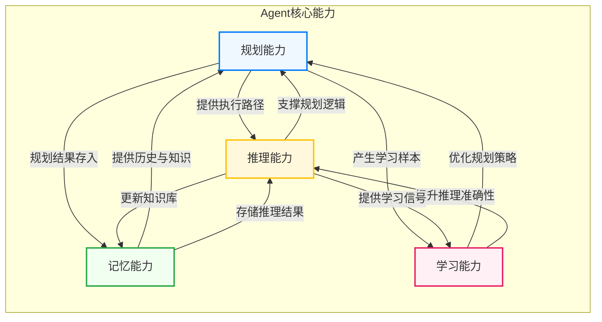

# Agent 规划能力深度解析：为何规划是智能体的核心基石

## 1. 规划能力的定义与核心概念

规划（Planning）是 Agent 核心的认知能力之一，它指的是 Agent 将一个复杂的、高层的目标（Goal）分解为一系列有序的、可执行的子任务（Subtasks/Actions），并通过推理和评估选择最优执行路径的过程。

如果将 Agent 比作一个智能的执行者，那么规划能力就是它的"大脑决策中枢"。没有规划，Agent 只能进行被动的、单轮的响应；拥有了规划，Agent 才能主动地、多步骤地解决问题。

### 1.1 规划能力的核心构成

规划能力通常包含以下几个核心子能力：

- **任务分解（Task Decomposition）**：将复杂目标拆解为较小的、可管理的步骤。例如，将"制作一份年度报告"分解为"收集数据"、"分析趋势"、"绘制图表"、"撰写文字"等子任务。
- **路径规划（Path Planning）**：在多个子任务之间确定执行顺序，形成一条从起点到终点的执行路径。
- **依赖管理（Dependency Management）**：识别并处理子任务之间的依赖关系。例如，"分析趋势"必须在"收集数据"之后进行。
- **动态重规划（Dynamic Re-planning）**：当执行过程中遇到阻碍或环境变化时，能够调整或重新制定计划。

## 2. Agent 在执行复杂任务时面临的挑战

当 Agent 被赋予复杂任务时，它会面临一系列从简单对话模式延伸出的独特挑战：

### 2.1 任务的复杂性与歧义性
用户提出的任务可能是模糊且复杂的。例如，"帮我组织一次产品发布会"包含了无数细节（场地、嘉宾、流程、宣传等）。Agent 需要能够"理解"这些隐含的要求。

### 2.2 长程依赖与多步执行
许多任务的完成需要经过数十个甚至上百个步骤，且步骤之间存在严格的逻辑链条。在没有规划的情况下，Agent 很容易在中间步骤"遗忘"或"混乱"，导致任务失败。

### 2.3 资源与约束管理
执行任务往往受到时间、工具、权限等多方面约束。Agent 必须在这些约束下寻找可行的解决方案，而不是尝试所有可能。

### 2.4 环境的不确定性
现实世界的执行环境是动态变化的。网络请求可能失败，API 可能更改，用户需求可能发生变化。Agent 必须具备处理这种不确定性的能力。

## 3. 规划能力如何帮助 Agent 解决这些挑战

规划能力是应对上述挑战的关键，它为 Agent 提供了一套结构化的问题解决框架。

### 3.1 将复杂性转化为有序性
通过任务分解，Agent 可以将一个庞大的挑战转化为一系列小的、确定性的步骤。每一步都有明确的输入和输出，降低了问题的解决难度。

### 3.2 建立思维链（Chain of Thought）
规划过程本质上是一个逻辑推理的过程。在制定计划时，Agent 模拟了人类的"思维链"，通过分析每个步骤的前置条件和预期结果，确保整个执行路径的逻辑性和可行性。

### 3.3 资源优化与权衡
规划过程允许 Agent 在多个可行的路径中进行评估和选择。例如，它可以选择执行速度最快的路径，或者消耗最少 API 调用的路径，从而实现资源的优化。

### 3.4 预置容错与回滚机制
一个好的规划不仅包含"成功路径"，还应包含"失败回退"路径。在规划阶段，Agent 可以预判可能出现的错误，并制定相应的补救措施（Plan B），大大提升了任务的成功率。

### 3.5 核心规划流程图

下图展示了 Agent 规划与执行的核心闭环：

```mermaid
graph TD
    subgraph 规划阶段 (Planning Phase)
        A[接收高层目标] --> B{任务分解}
        B --> C[子任务列表生成]
        C --> D{路径规划与依赖分析}
        D --> E[制定执行计划]
    end

    subgraph 执行与反馈阶段 (Execution & Feedback Phase)
        E --> F[执行第一个子任务]
        F --> G{结果评估}
        G -- 成功 --> H{是否达到最终目标?}
        H -- 是 --> I[任务完成]
        H -- 否 --> J[推进到下一个子任务]
        J --> F
        
        G -- 失败 --> K{启动动态重规划}
        K --> B
    end
    
    style A fill:#f9f,stroke:#333,stroke-width:2px
    style I fill:#ccf,stroke:#333,stroke-width:2px
    style K fill:#fcc,stroke:#333,stroke-width:2px
```

## 4. 规划能力对提升 Agent 智能水平的具体作用

规划能力是 Agent 迈向更高智能水平的标志性特征，它使 Agent 从一个"工具"变成了一个"合作者"。

### 4.1 从被动响应到主动执行
没有规划的 Agent 就像一个命令提示符，用户输入指令，它执行。具有规划能力的 Agent 则具备了主动性，它可以在收到模糊指令后，主动向用户澄清需求，或者在用户没考虑到的地方提出建议。

### 4.2 从单轮对话到多轮工作流
规划能力使得 Agent 能够处理跨越多个对话轮次的复杂工作流。例如，它可以与用户进行多轮交互，逐步完善计划，或者在后台长时间执行一个长计划，最后汇报结果。

### 4.3 增强自主决策与创造力
在规划过程中，Agent 会面临多个可能的行动方案。选择哪个方案的过程，实际上就是 Agent 在进行"决策"。这种自主决策的能力是智能的核心体现。

### 4.4 提升用户信任与体验
一个能够清晰展示其规划思路的 Agent，会给用户带来极大的信任感。用户可以理解 Agent 是如何一步步达到最终结果的，这种可解释性（Explainability）在复杂任务中至关重要。

## 5. 不同类型 Agent 中规划能力的应用场景分析

规划能力并非千篇一律，它会根据 Agent 的类型和目标呈现不同的应用形式。

### 5.1 通用型 Agent (Generalist Agent)
- **应用场景**：处理开放式的、知识密集型任务，如研究报告撰写、市场分析。
- **规划特点**：侧重于信息收集路径的规划。例如，规划先查阅哪些数据源，再进行综合分析，最后如何组织结构。

### 5.2 任务型 Agent (Task-Specific Agent)
- **应用场景**：执行特定领域的重复性或一次性任务，如文件处理、数据录入、代码生成。
- **规划特点**：侧重于工具调用序列的规划。例如，规划依次调用文件读取工具、内容修改工具、格式转换工具等。

### 5.3 对话型 Agent (Conversational Agent)
- **应用场景**：提供个性化服务，如客服、个人助理。
- **规划特点**：侧重于对话流的规划。Agent 需要规划对话的结构、提问的顺序、信息收集的节奏等，以最高效地完成服务。

### 5.4 自主型 Agent (Autonomous Agent)
- **应用场景**：需要长时间独立运行的复杂任务，如代码重构、长期数据监控。
- **规划特点**：侧重于长期计划的制定与动态调整。这类 Agent 通常采用层级规划（Hierarchical Planning），先制定高层策略，再细化为可执行的子计划。

## 6. 规划能力与 Agent 其他核心能力的关系

规划能力并不是孤立的，它与 Agent 的记忆、推理、学习等能力紧密协作，共同构筑了 Agent 的完整智能体系。

### 6.1 规划与记忆（Planning & Memory）
- **记忆是规划的基础**：Agent 的短期和长期记忆为规划提供了必要的上下文。例如，在规划"预订餐厅"时，它需要记住用户的口味偏好（长期记忆）和当前对话的上下文（短期记忆）。
- **规划依赖记忆的检索**：在制定计划时，Agent 需要从记忆中检索相关的知识和经验。没有有效的记忆检索，规划就会变成无源之水。

### 6.2 规划与推理（Planning & Reasoning）
- **推理是规划的引擎**：规划的核心过程（如任务分解、路径选择）都依赖于逻辑推理。Agent 通过推理来判断哪个步骤应该先执行，哪个方案更优。
- **规划是推理的体现**：一个好的计划本身就是严密推理的结果。Agent 规划出的每一步，背后都应有相应的逻辑支撑。

### 6.3 规划与学习（Planning & Learning）
- **学习优化规划**：随着 Agent 执行任务次数的增加，它可以从成功和失败的经验中学习，优化其规划策略。例如，学习到某种路径执行效率更高，从而在未来的规划中优先选择。
- **规划促进学习**：规划的过程本身也是一种学习。通过分析不同的规划方案及其结果，Agent 可以形成更深层次的领域知识。

### 6.4 核心能力协作关系图



## 总结

规划能力是 Agent 从简单工具向智能助手转型的关键。它赋予了 Agent 处理复杂性、不确定性和长程任务的能力。通过与记忆、推理、学习等核心能力的深度协作，规划能力不仅提升了 Agent 解决实际问题的效率和质量，更重要的是，它为 Agent 带来了主动性、创造性和可解释性，使其能够真正理解并服务于人类的复杂需求。理解了规划能力，我们就掌握了设计和构建高性能 Agent 的核心密钥。
