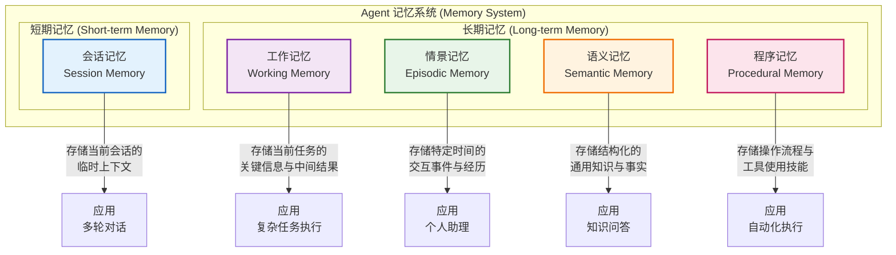

# Agent 记忆能力深度解析：智能体的"心智存储空间"

## 1. 记忆能力的定义与核心概念

记忆（Memory）是 Agent 系统中至关重要的基础能力，它赋予 Agent 存储、保留和检索信息的能力。如果说规划能力是 Agent 的"大脑决策中枢"，那么记忆能力就是 Agent 的"心智存储空间"，是所有智能行为得以发生的前提。

在 Agent 领域，记忆不仅仅是简单的信息存储，更是一个动态的认知过程，涉及信息的**编码**（Encoding）、**存储**（Storage）和**检索**（Retrieval）三个关键阶段。它使得 Agent 能够"记住"过去的交互、积累经验、学习新知识，并在未来的任务中应用这些信息，从而表现出连续性和个性化。

### 1.1 为什么 Agent 需要记忆？

一个没有记忆的 Agent 就像一个"失忆症患者"：
- **交互失忆**：每次对话都从零开始，无法理解上下文，导致交互割裂、效率低下。
- **经验匮乏**：无法从过去的成功或失败中学习，只能机械地执行指令，无法进化。
- **身份缺失**：无法记住用户的偏好和习惯，无法提供个性化的服务，永远是冷冰冰的。
- **知识断层**：无法积累领域知识，每次处理新任务都需要重新"学习"，成本高昂。

## 2. 记忆能力的核心作用与功能价值

记忆能力在 Agent 系统中扮演着多重关键角色，其价值体现在多个维度。

### 2.1 实现上下文连续的对话交互
这是记忆能力最直观的作用。在多轮对话中，Agent 需要记住之前的交流内容，才能真正理解用户的意图。
- **指代消解**：理解"它"、"那个文件"等代词的实际指代对象。例如，用户先说"帮我分析一下 Q3 报表"，然后说"把它做成图表"，Agent 需要通过记忆理解"它"指的是 Q3 报表。
- **意图连贯**：支持跨越多轮的复杂任务。例如，用户先让 Agent 查天气，再让它安排出行，Agent 需要记住天气信息来规划路线。
- **个性化调整**：根据用户之前的反馈（如"这个图表颜色太暗了"）调整后续的输出风格。

### 2.2 支撑长期的任务执行与目标追踪
许多复杂任务需要 Agent 长时间工作，甚至跨会话执行。
- **进度保存**：在任务中断后，能够从上次的断点继续。例如，用户让 Agent 写一篇长文，中断后回来，Agent 能继续写作而不是重新开始。
- **目标状态追踪**：记住当前任务的完成状态、已完成的步骤和待办事项。
- **多项目管理**：同时处理多个用户任务时，能清晰区分不同任务的相关信息，避免混淆。

### 2.3 个性化与用户画像构建
通过积累用户的交互历史，Agent 可以构建用户画像，提供"千人千面"的服务。
- **偏好学习**：自动学习用户的写作风格、常用语言、格式要求等，例如"用户总喜欢用 Markdown 格式记录笔记"。
- **习惯识别**：识别用户的工作模式和习惯，例如"用户总是在周一早上生成周报"。
- **主动服务**：基于历史行为预测用户需求，主动提供帮助，例如"根据您上次的报告结构，我为您生成了这次的框架"。

### 2.4 经验积累与持续学习
记忆是 Agent 学习的基础，没有记忆就没有真正的学习。
- **错误避免**：记住之前的执行失败和错误原因，在后续任务中避免重蹈覆辙。
- **策略优化**：学习到某种工具调用组合更有效，在未来的任务中优先使用。
- **知识积累**：逐步构建特定领域的知识库，成为该领域的"专家"。

## 3. 不同类型记忆的应用场景分析

Agent 的记忆系统通常借鉴人类认知心理学的理论，被划分为几种核心类型，每种类型都有其独特的作用和应用场景。

### 3.1 记忆类型分类图

下图展示了 Agent 记忆系统的层次结构：



### 3.2 短期记忆 (Short-term Memory)

- **定义**：指 Agent 在当前会话中临时存储的信息，生命周期通常为单个对话会话。
- **核心功能**：维持对话的上下文连贯性。
- **应用场景**：
    - **多轮对话理解**：在客服场景中，记住用户在前几轮提到的订单号、问题描述等信息，避免重复询问。
    - **指代消解**：理解用户使用的代词，如"帮我把它发给张三"中的"它"指代上一轮对话中的某个文件。
- **特点**：容量有限，访问速度快，通常在会话结束后清除。

### 3.3 工作记忆 (Working Memory)

- **定义**：存储 Agent 在执行特定复杂任务时所需的关键信息和中间计算结果的记忆。
- **核心功能**：支持复杂的、多步骤的推理和计算。
- **应用场景**：
    - **复杂数据分析**：在处理一份大型数据表时，工作记忆存储当前正在分析的数据集、中间统计结果、计算指标等。
    - **代码调试**：在辅助调试代码时，工作记忆存储最近的错误日志、代码片段、推理步骤等。
- **特点**：动态性强，随着任务执行不断更新，任务完成后通常被清除或转化为其他类型的记忆。

### 3.4 情景记忆 (Episodic Memory)

- **定义**：存储与特定时间、地点和情境相关的个人交互事件和经历的记忆。
- **核心功能**：使 Agent 具有"阅历"，能够从历史情境中学习。
- **应用场景**：
    - **个人助理**：记住"上周二帮您预订的餐厅"、"上次您提到喜欢的咖啡店"等具体事件。
    - **问题复现**：当用户再次遇到问题时，能回忆起上次解决该问题的具体情境和步骤。
- **特点**：包含时间戳和情境信息，具有自传体性质，是构建用户画像的重要基础。

### 3.5 语义记忆 (Semantic Memory)

- **定义**：存储结构化的、通用的、独立于具体情境的知识和事实的记忆。
- **核心功能**：提供知识问答能力，是 Agent 的"知识库"。
- **应用场景**：
    - **通用问答**：回答"Python 的发明人是谁？"、"地球到月球的距离是多少？"等事实性问题。
    - **领域知识**：存储特定领域的专业知识，如医疗术语、法律条文、技术文档等。
- **特点**：内容稳定，更新频率低，可被多个任务和会话共享。

### 3.6 程序记忆 (Procedural Memory)

- **定义**：存储操作流程、技能和"如何做"的知识的记忆。
- **核心功能**：使 Agent 能够自动执行复杂任务，是实现自动化的关键。
- **应用场景**：
    - **自动化脚本**：记住如何格式化代码、如何编写特定框架的测试用例等操作流程。
    - **工具使用**：存储如何调用特定 API、如何操作文件系统等技能。
- **特点**：通常以步骤序列的形式存储，一旦习得，可以高效地被调用执行。

## 4. 记忆能力的工作机制

记忆并非单一的存储，而是一套复杂的信息处理系统，其工作流程可以分为三个核心阶段。

### 4.1 记忆处理流程图

```mermaid
graph TD
    subgraph 编码 (Encoding)
        A[感知输入] --> B{注意力机制<br/>筛选重要信息}
        B --> C[信息转换为<br/>可存储格式]
    end

    subgraph 存储 (Storage)
        C --> D{分类存储<br/>短期/长期记忆}
        D --> E[形成记忆痕迹<br/>Memory Trace]
    end

    subgraph 检索 (Retrieval)
        F[检索线索<br/>用户请求/当前上下文] --> G{匹配搜索<br/>相关记忆}
        G --> H[提取记忆内容]
    end
    
    E -->|被检索| G
    
    subgraph 遗忘与更新 (Forgetting & Updating)
        I[时间衰减/新信息覆盖] --> J{记忆更新<br/>修正/删除}
    end

    style A fill:#e8f5e9,stroke:#2e7d32,stroke-width:2px
    style F fill:#fff3e0,stroke:#ef6c00,stroke-width:2px
```

### 4.2 编码 (Encoding)
这是记忆的第一步，Agent 需要决定哪些信息值得被记住。
- **选择性注意**：Agent 不可能记住所有信息，它需要像人类一样通过"注意力机制"筛选重要内容。例如，在对话中，用户的核心需求和明确的偏好是重要信息，而无关的闲聊可能被忽略。
- **格式转换**：将原始信息转换为适合存储的格式。例如，将一段长对话总结为几个关键点，或者将非结构化的文本转化为结构化的知识表示。

### 4.3 存储 (Storage)
信息经过编码后，被存入相应的记忆系统中。
- **分类与索引**：为存储的信息创建索引，以便后续高效检索。例如，为用户的偏好打上"用户偏好"标签，为特定事件打上时间戳和上下文标签。
- **整合与关联**：新信息不是孤立存储的，而是与已有的知识进行整合，建立关联。例如，用户提到"喜欢喝手冲咖啡"，这条信息会与已有的"用户习惯"、"用户画像"等知识节点建立联系。

### 4.4 检索 (Retrieval)
当需要使用记忆时，Agent 根据当前的上下文和任务需求检索相关信息。
- **线索依赖**：检索依赖于线索，即当前任务的上下文、用户的提问方式等。例如，当用户问"我上次说的那个方案是什么？"，"上次"和"方案"就是检索线索。
- **相似度匹配**：通过计算检索线索与存储信息之间的相似度，找到最相关的记忆。这通常涉及向量嵌入（Vector Embedding）和语义搜索技术。

## 5. 缺乏记忆能力对 Agent 的影响

为了更深刻地理解记忆的重要性，我们可以设想一个"失忆"的 Agent 在执行任务时的困境。

### 5.1 用户体验的灾难
- **"金鱼脑"对话**：用户每次都要重复提供基本信息。例如，用户："帮我预订一家可以带狗的餐厅"。Agent（无记忆）："好的，为您预订。请告诉我您的会员号。" 用户（叹气）："我是 VIP 会员，上次在你们这儿订过十次了..."
- **缺乏尊重感**：Agent 不记得用户的名字、不记得用户的喜好，每次都像对待新客户一样，让用户感到被忽视。
- **挫败感积累**：重复性的提问和低效的交互会迅速消耗用户的耐心，导致体验极差。

### 5.2 任务执行的低效
- **"从零开始"问题**：每次任务都需要重新输入所有信息，相当于每次都"冷启动"。
- **无法处理复杂任务**：对于需要跨多步、多会话的任务（如"每周一早上帮我生成上周的周报"），无记忆的 Agent 根本无法胜任。
- **重复犯错**：犯过的错误会一犯再犯，效率无法提升。

### 5.3 知识无法积累
- **"学无所成"**：无论使用多久，Agent 都无法成为某个领域的专家，因为它记不住任何学到的知识。
- **服务一成不变**：无法随着时间推移优化和个性化服务，永远停留在初始状态。

### 5.4 具体案例对比

| 场景 | 有记忆的 Agent 表现 | 无记忆的 Agent 表现 |
| :--- | :--- | :--- |
| **个人助理** | "张先生，根据您上周的行程，我为您预订了同一家酒店。" | "请提供您的会员信息和预订要求。" |
| **代码助手** | "上次您修改过这个函数，我帮您对比了差异，发现有个边界条件没处理。" | "您的函数有问题。" (需要用户解释上下文) |
| **数据分析** | "结合您上个月的销售数据，我发现本月趋势有显著变化。" | "这是您本月的销售数据。" (无法进行趋势对比) |

## 6. 记忆能力的实践案例分析

让我们通过一个具体的实践案例，看看记忆能力是如何工作的。

### 案例：构建一个具备长期记忆的个人学习助手

#### 场景描述
用户希望有一个 Agent 助手，可以帮助他学习一门新语言。这个助手需要跟踪用户的学习进度、记忆用户的薄弱环节、并根据用户的偏好推荐学习材料。

#### 记忆能力的应用

1.  **情景记忆应用**
    - **存储**：记录"2026年8月7日，用户学习了 30 分钟，重点是虚拟语气，遇到了困难"。
    - **检索**：当用户下次登录时，Agent 能"记得"上次的学习情况，并直接切入虚拟语气的练习。

2.  **语义记忆应用**
    - **存储**：积累关于该语言的知识，如"动词变位规则"、"常用词汇表"等。
    - **检索**：在用户提问时，直接从知识库中检索相关解释。

3.  **程序记忆应用**
    - **存储**：学习到"用户偏好先看例句再看规则"、"用户喜欢使用选择题模式进行练习"。
    - **检索**：在生成练习题时，自动采用用户偏好的格式。

4.  **工作记忆应用**
    - **存储**：在一次学习会话中，存储当前正在练习的句子、用户犯的具体错误、正在学习的语法点等。
    - **检索**：在用户提问"我刚才那个句子哪里错了？"时，能准确回忆并解释。

#### 最终效果
通过综合运用不同类型的记忆能力，这个学习助手：
- **理解用户**：像一个了解用户的私人老师，而不是一个通用的练习册。
- **高效推进**：跳过已经掌握的内容，集中精力攻克薄弱环节。
- **持续陪伴**：无论中断多久，都能无缝继续学习旅程。

## 总结

记忆能力是 Agent 智能的基石，它赋予 Agent 以"连续性"、"个性化"和"成长性"。没有记忆，Agent 只是一个机械的工具；有了记忆，Agent 才能成为一个有"记忆"、懂"感情"、会"学习"的智能体。

理解记忆能力的不同类型及其工作机制，是设计和构建高级 Agent 系统的关键。一个设计良好的记忆系统，能够让 Agent 从一次次交互中积累经验、学习知识、形成个性，最终成长为用户不可或缺的智能伙伴。在追求 Agent 更高智能水平的道路上，构建强大的记忆能力永远是首要任务之一。
