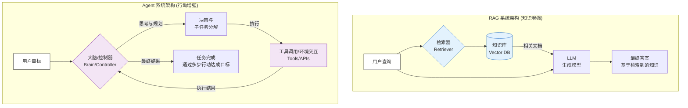
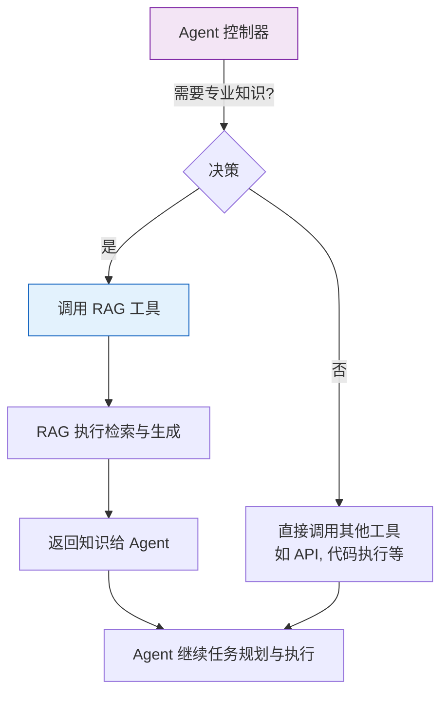
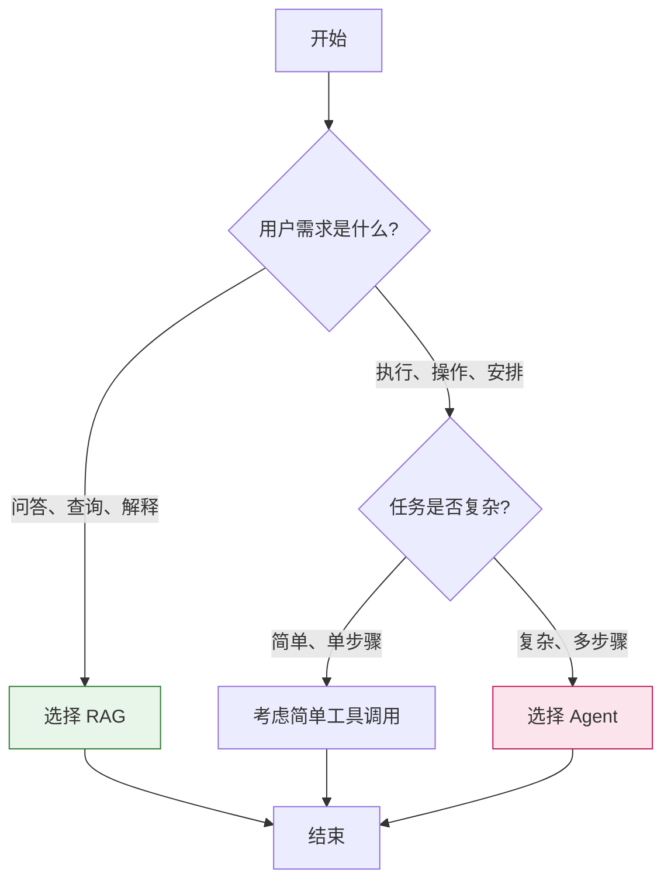

# Agent vs. RAG 系统：深度解析与核心区别

在当今 AI 应用开发领域，Agent（智能体）和 RAG（Retrieval-Augmented Generation，检索增强生成）是两个最核心、最热门的概念。它们都是为了解决大语言模型（LLM）的固有局限性（如知识过时、幻觉、缺乏上下文等）而诞生的技术。然而，两者在设计理念、架构逻辑和应用场景上存在着本质的区别。

## 1. 核心概念解析

在深入探讨之前，我们先对两者有一个清晰的定义。

### 1.1 什么是 RAG (检索增强生成)

RAG 是一种将信息检索（Retrieval）与文本生成（Generation）相结合的框架。其核心思想是：在大语言模型回答问题之前，先从一个外部的、可定制的知识库（如向量数据库）中检索出与问题相关的文档片段，然后将这些检索到的内容作为上下文（Context）提供给 LLM，由其基于这些外部知识生成最终答案。

**简单来说，RAG 的核心是“告诉”模型正确的答案是什么，从而避免模型“幻觉”或回答过时。**

### 1.2 什么是 Agent (智能体)

Agent 是一种具备自主决策能力的计算实体。它不仅能够理解用户的指令，更能够将复杂的目标分解为一系列子任务，并通过调用工具（Tools）、与环境交互、根据反馈调整计划，最终自主完成任务。Agent 的核心在于“行动”和“自主”。

**简单来说，Agent 的核心是“让”模型自己决定如何一步步完成任务，而不仅仅是回答一个问题。**

## 2. 核心区别对比

RAG 和 Agent 的根本区别在于它们的设计哲学：RAG 是关于“知识增强”，而 Agent 是关于“行动能力”。

### 2.1 架构与逻辑差异

### 2.2 关键维度对比表

| 对比维度 | RAG (检索增强生成) | Agent (智能体) |
| :--- | :--- | :--- |
| **核心目标** | 提供准确、可追溯的知识回答 | 自主完成复杂、多步骤的任务 |
| **处理模式** | 单轮查询，一次生成 | 多轮交互，循环执行 |
| **关键能力** | 信息检索、语义匹配 | 任务规划、工具调用、环境交互 |
| **交互对象** | 主要是文本和文档 | 各种工具、API、系统环境 |
| **局限性** | 无法执行复杂任务，只是“回答问题” | 实现复杂，但也增加了不确定性和成本 |
| **典型应用** | 企业知识库问答、智能客服、文档分析 | 智能助理、自动化工作流、复杂代码生成 |

## 3. 应用场景分析

理解两者区别的最佳方式是看它们各自擅长的应用场景。

### 3.1 RAG 的理想应用场景：知识密集型问答

RAG 最适合解决**“知不知道”**的问题，即模型本身不知道答案，但我们有一个包含答案的知识库。

- **企业内部知识问答系统**
    - **场景**：员工问“公司年假政策是什么？”
    - **RAG 流程**：从 HR 手册库中检索相关段落，然后 LLM 基于检索到的内容生成回答。
- **垂直领域智能客服**
    - **场景**：用户问“我的快递到哪了？”
    - **RAG 流程**：从订单系统数据库中检索用户的订单状态，然后生成物流信息。
- **个人文档助手**
    - **场景**：用户问“我上周写的项目总结里提到了哪些风险？”
    - **RAG 流程**：在用户的文档库中检索相关文档，提取风险点，汇总回答。

**核心优势**：回答准确、可溯源，知识更新简单（只需更新数据库）。

### 3.2 Agent 的理想应用场景：复杂任务执行

Agent 最适合解决**“做不做”**的问题，即模型需要执行一系列操作才能达成目标，而不仅仅是回答问题。

- **智能办公助理**
    - **场景**：用户说“帮我安排一个明天下午与张三关于 Q3 项目的 1 小时会议”。
    - **Agent 流程**：
        1.  任务分解：检查张三日程 -> 检查自己日程 -> 寻找共同空闲时间 -> 创建日程。
        2.  调用工具：依次调用日历 API、会议系统 API。
        3.  反馈确认：向用户汇报安排结果。
- **自动化数据分析**
    - **场景**：用户说“分析上个月的销售数据，找出异常波动的产品，并生成一份简要报告”。
    - **Agent 流程**：
        1.  任务分解：读取数据 -> 计算统计指标 -> 识别异常 -> 撰写报告。
        2.  调用工具：依次调用数据库查询工具、数据分析脚本、文档生成工具。
- **代码智能体**
    - **场景**：用户说“在这个项目中添加一个新的用户注册 API”。
    - **Agent 流程**：
        1.  分析代码库，了解项目结构。
        2.  规划需要修改的文件和代码。
        3.  依次调用文件读写工具、代码执行工具。
        4.  编写代码、运行测试、修复错误。

**核心优势**：能够处理复杂、多步骤、需要与外部系统交互的任务，具备自主性。

## 4. RAG 是否是 Agent 的一部分？

这是一个常见的问题。答案是：**是的，RAG 通常是 Agent 获取外部知识的一种“工具”。**

在一个功能完善的 Agent 系统中，为了让 Agent 具备特定领域的专业知识，它可以通过集成 RAG 能力来实现。此时，RAG 是 Agent 的众多 Tool 之一。

## 5. 如何选择：RAG 还是 Agent？

在构建应用时，如何选择合适的技术路线？一个简单的判断标准是：

### 问自己两个问题：

1.  **用户的核心需求是“获取信息”还是“完成任务”？**
    - 如果是**获取信息**（如：是什么、为什么、谁、哪里），优先考虑 **RAG**。
    - 如果是**完成任务**（如：安排、创建、删除、分析、发送），优先考虑 **Agent**。

2.  **任务是否需要多步骤执行和与外部系统交互？**
    - 如果任务可以通过单次查询解决，选 **RAG**。
    - 如果任务需要分成多个步骤，并调用多个工具，选 **Agent**。

### 选择决策图

## 6. 总结

RAG 和 Agent 并非互斥，而是互补的。它们代表了 AI 应用发展的两个方向：

-   **RAG 代表了“知识增强”的方向**，它通过引入外部知识库，让 LLM 能够回答**更准**、**更新**、**更有依据**的问题。它是构建可靠问答系统的基石。
-   **Agent 代表了“行动增强”的方向**，它通过引入规划和工具调用能力，让 LLM 能够**自主完成**复杂的、多步骤的任务。它是构建真正智能助理和自动化工作流的核心。

在实际应用中，一个强大的 AI 系统往往是两者的结合：利用 RAG 获取准确的领域知识，赋予 Agent 专业的大脑；利用 Agent 的行动能力，将知识转化为实际的操作和成果。理解了这两者的区别与联系，我们就能更好地选择和设计合适的 AI 解决方案。
