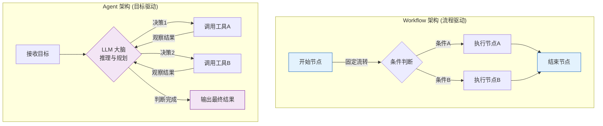
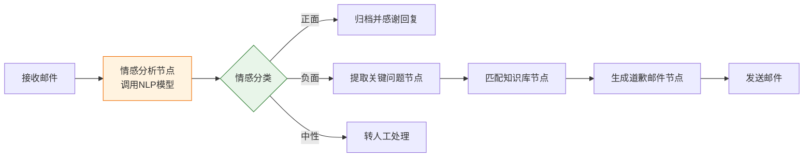
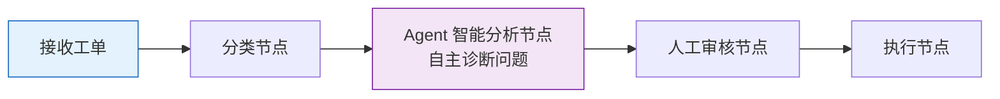
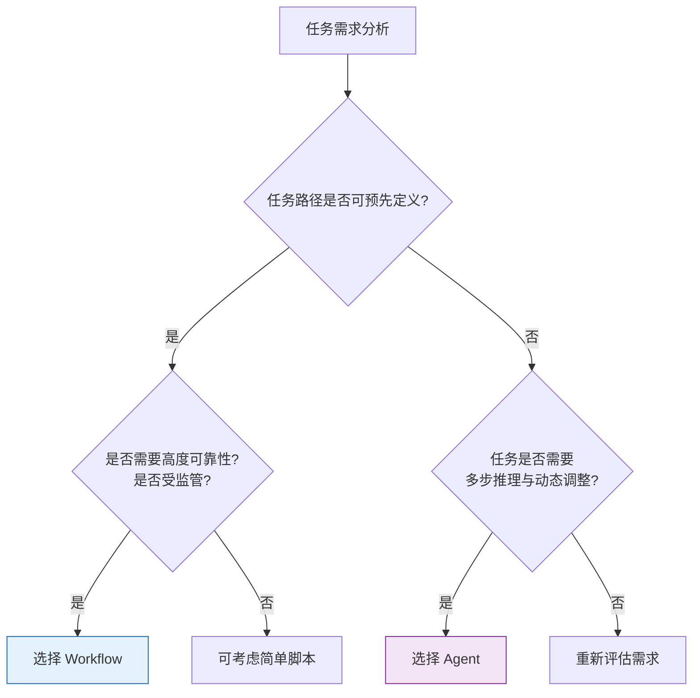

# Agent vs. Workflow 工作流：多维度深度对比解析

在 AI 应用与企业自动化的浪潮中，**Agent（智能体）** 与 **Workflow（工作流）** 是两种常被提及、却极易混淆的概念。它们都旨在"自动化完成某项任务"，但在设计哲学、运行机制和适用边界上存在本质差异。

理解这两者的区别，是构建高效、可靠自动化系统的关键。本文将从多个维度对 Agent 与 Workflow 进行深度对比分析。

## 1. 核心定义与本质特征

### 1.1 Workflow（工作流）的本质

Workflow 是一种**预定义、确定性**的任务编排机制。它将一个完整流程拆解为若干固定的步骤（Step/Node），并按照预先设定好的规则和顺序，从一个节点流转到下一个节点。

- **核心特征**：**确定性**和**可预测性**。
- **本质类比**：就像一条工厂流水线，每个工位（节点）的职责、操作顺序、流转条件都在设计时就已固定。原料进来，按既定路线加工，最后产出成品。
- **关键词**：流程图、DAG（有向无环图）、节点、边、条件分支。

### 1.2 Agent（智能体）的本质

Agent 是一种**自主、动态**的决策实体。它接收一个目标后，会根据当前环境状态、自身知识和推理能力，**自主决定**下一步该做什么，调用什么工具，何时停止。

- **核心特征**：**自主性**和**动态性**。
- **本质类比**：就像一位经验丰富的项目顾问，你只告诉他目标（"帮我搞定这次活动的策划"），他自行分析情况、决定先做什么后做什么、遇到问题随机应变，最终交付结果。
- **关键词**：目标驱动、LLM 大脑、工具调用、反思、ReAct。

## 2. 多维度核心区别对比

### 2.1 关键维度对比表

| 对比维度 | Workflow（工作流） | Agent（智能体） |
| :--- | :--- | :--- |
| **定义特征** | 流程编排，固定路径 | 目标驱动，自主决策 |
| **运行机制** | 确定性流转，按图执行 | 动态推理，按需行动 |
| **控制逻辑** | 外部预设规则控制 | 内部 LLM 自主控制 |
| **灵活性** | 低，路径固定，难以应对意外 | 高，可动态调整策略 |
| **可预测性** | 高，每次执行路径基本一致 | 低，执行路径可能每次不同 |
| **组成要素** | 节点（Node）、边（Edge）、条件 | 大脑（LLM）、记忆、规划、工具 |
| **交互方式** | 节点间数据传递，线性或分支 | 与环境多轮交互，工具调用 |
| **成本与延迟** | 较低，执行高效 | 较高，需多次 LLM 推理 |
| **适用场景** | 标准化、重复性、明确流程 | 开放性、探索性、模糊任务 |

### 2.2 架构与运行机制对比图

## 3. 核心维度深度剖析

### 3.1 控制逻辑：预设规则 vs. 自主推理

这是两者最根本的区别。

- **Workflow 的控制逻辑是"写死的"**：流程的走向由开发者在设计阶段通过代码或配置（如 JSON、YAML）预先定义。每个节点执行完后，根据固定的 if-else 规则或条件分支决定下一步。开发者对整个流程拥有完全的控制权。
- **Agent 的控制逻辑是"涌现的"**：Agent 的行为不是预先编排的，而是由 LLM（大脑）在运行时动态决定的。LLM 根据当前的目标、历史记忆和工具反馈，通过推理（如 ReAct 模式）决定下一步动作。控制权实际上交给了 LLM。

### 3.2 灵活性与适应性：刚性 vs. 弹性

- **Workflow 是刚性的**：它严格按照既定路径执行。如果中间某个节点失败或遇到流程未覆盖的边缘情况，Workflow 通常会直接报错停止，需要人工介入修改流程。它无法应对"意料之外"的情况。
- **Agent 是弹性的**：Agent 具备反思和动态调整能力。当某个工具调用失败或某个策略无效时，Agent 可以通过 LLM 分析失败原因，自主尝试其他路径或更换工具。它能适应环境的动态变化。

### 3.3 可预测性与可靠性

- **Workflow 的可预测性高**：因为路径固定，开发者可以精确预测流程在每个输入下的行为，易于调试、监控和审计。这对于金融、合规等对可靠性要求极高的场景至关重要。
- **Agent 的可预测性低**：由于 LLM 推理的随机性，Agent 面对相同输入可能采取不同的执行路径。这带来了"幻觉"或"跑偏"的风险，增加了调试和审计的难度。

### 3.4 组成要素与交互方式

| 要素 | Workflow | Agent |
| :--- | :--- | :--- |
| **核心单元** | Node（节点），封装具体操作 | Tool（工具），供 LLM 调用 |
| **流转机制** | Edge（边），定义节点间数据流向 | LLM 推理，决定工具调用序列 |
| **状态管理** | 流程上下文变量 | 短期/长期记忆系统 |
| **交互对象** | 主要是数据，节点间传递 | 主要是工具/API，多轮调用 |

## 4. 应用场景与实例对比

为了更直观地理解，我们通过一个相同任务来看两者的不同表现。

### 场景：处理一份客户反馈邮件，并决定如何回复

#### 4.1 用 Workflow 实现

**流程设计**：

**特点**：
- 流程清晰，每个节点职责明确。
- 如果邮件情感分类错误，流程会沿着错误路径执行，可能导致负面邮件被当作正面处理。
- 遇到知识库匹配不到的问题，流程会卡住或发送模板化的无效回复。
- **优势**：执行速度快，成本低，易于监控。

#### 4.2 用 Agent 实现

**Agent 行为**：
1. Agent 接收目标："处理这封客户反馈邮件，妥善解决客户问题"。
2. Agent 阅读邮件内容，**自主判断**这是一封关于产品 bug 的负面反馈。
3. Agent 决定调用**工单系统 API** 创建一个技术支持工单。
4. Agent 调用**代码库检索工具**，查找该 bug 是否已知。
5. 发现是已知问题，Agent 决定调用**邮件发送工具**，回复客户致歉并提供临时解决方案，同时告知已创建工单。
6. Agent 判断任务完成，结束。

**特点**：
- Agent 没有"固定路径"，它根据邮件内容动态决定调用哪些工具。
- 如果发现是新 bug，Agent 可能会选择直接转交技术团队，而不是发模板回复。
- 能处理意料之外的情况（如客户同时提了多个问题），展现出更强的"智能"。
- **劣势**：需要多次 LLM 推理，延迟高，成本高，路径不可预测。

### 4.3 适用范围总结

| 场景特征 | 推荐方案 | 理由 |
| :--- | :--- | :--- |
| **标准化审批流程** | Workflow | 步骤固定、明确，要求高可靠与可审计 |
| **ETL 数据处理管道** | Workflow | 重复性高，路径明确，追求效率 |
| **复杂客户服务处理** | Agent | 需求多样，需根据具体情况灵活应对 |
| **开放性研究报告撰写** | Agent | 需自主检索、分析、整合，路径不可预设 |
| **订单状态查询** | Workflow | 简单的数据查询与返回 |
| **自动化代码修复** | Agent | 需理解上下文、尝试多种策略、迭代调试 |

## 5. 两者关系：融合而非对立

在实际应用中，Agent 和 Workflow 并非非此即彼，而是常常**融合使用**，取长补短。

### 5.1 Agent 作为 Workflow 中的一个节点

在一个大型企业流程中，某些环节需要高度智能的决策，而整体流程需要保持确定性。此时，可以将 Agent 作为一个"超级节点"嵌入 Workflow 中。

### 5.2 Workflow 作为 Agent 的执行框架

Agent 在规划好策略后，可以将一些标准化的执行步骤交给 Workflow 来完成，以提高效率和可靠性。Agent 负责"想"，Workflow 负责"做"。

### 5.3 选择决策指南

## 6. 总结

Agent 与 Workflow 代表了自动化领域的两种范式：

-   **Workflow 是"确定性的编排"**：它通过预定义的流程图和规则，实现了对标准化、重复性任务的高效、可靠自动化。它强在**可控、可预测、低成本**。
-   **Agent 是"自主性的智能"**：它通过 LLM 的推理能力，赋予系统应对复杂、模糊、动态任务的能力。它强在**灵活、自适应、能处理开放性问题**。

在实际工程中，成熟的智慧做法不是盲目追求"全 Agent 化"或"全 Workflow 化"，而是根据任务特性，将两者有机结合：用 Workflow 搭建可靠的骨架，用 Agent 注入智能的灵魂。理解并驾驭这两者的差异与协同，是构建下一代智能应用的核心能力。
