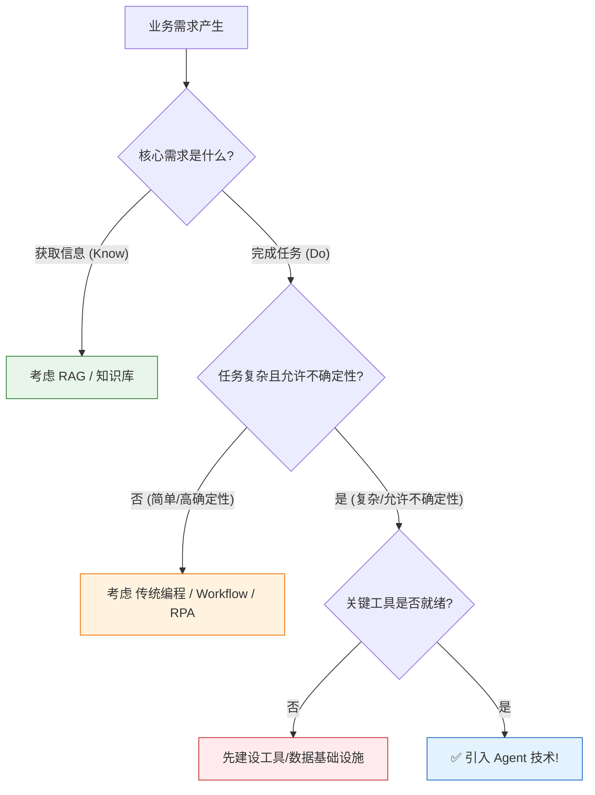

# AI Agent 技术适用场景与非适用场景分析

> **文档说明**：本文档旨在系统分析 AI Agent 技术的“甜点区”与“禁区”，明确其适用与非适用的边界。通过剖析典型场景特征、列举正反案例，并提供实用的判断框架，帮助技术决策者准确判断在不同业务需求下是否应该引入 Agent 技术，从而避免盲目跟风导致的项目失败。

## 目录

- [一、核心观点：Agent 不是银弹](#一核心观点agent-不是银弹)
- [二、适用场景：Agent 大显身手的领域](#二适用场景agent-大显身手的领域)
  - [2.1 适用场景特征总结](#21适用场景特征总结)
  - [2.2 典型应用案例分析](#22典型应用案例分析)
- [三、非适用场景：Agent 应回避的领域](#三非适用场景agent-应回避的领域)
  - [3.1 非适用场景特征总结](#31非适用场景特征总结)
  - [3.2 典型反例与替代方案](#32典型反例与替代方案)
- [四、决策框架：何时应该使用 Agent？](#四决策框架何时应该使用-agent)
- [五、总结与最佳实践](#五总结与最佳实践)

---

## 一、核心观点：Agent 不是银弹

在当前的 AI 浪潮中，Agent 因其强大的自主执行能力而备受推崇，仿佛任何问题都可以通过引入 Agent 来解决。然而，**Agent 并非万能的“银弹”（Silver Bullet）**。

*   **Agent 的优势在于“智能调度与执行”**，它擅长处理那些需要思考、规划、与外部交互的复杂任务。
*   **Agent 的弱点在于“确定性、成本与延迟”**，对于需要 100% 确定性、极低延迟或极高效率的任务，引入 Agent 反而可能是一场灾难。

**技术决策的核心思维应该是**：
> 选择能以最低成本、最高可靠性完成目标的技术方案，而不是选择“最酷”的技术。Agent 的价值在于将 AI 的“智能”转化为“行动力”，但这种转化有其特定的土壤。

本文将深入剖析 Agent 的“能力边界”，通过具体场景对比，帮助您做出明智的技术选型。

---

## 二、适用场景：Agent 大显身手的领域

当一个业务需求具备以下特征时，引入 Agent 通常能带来巨大的价值，甚至是革命性的变化。

### 2.1 适用场景特征总结

| 特征维度 | 具体表现 | Agent 优势 |
|---------|---------|------------|
| **1. 目标导向而非步骤导向** | 用户只关心“做什么”（目标），不关心“怎么做”（步骤）。 | Agent 能自主规划路径，适应不同情况。 |
| **2. 任务复杂度高** | 任务需要 3 个以上的步骤才能完成，可能涉及分支判断。 | Agent 擅长复杂任务的分解与调度。 |
| **3. 需要与多系统交互** | 任务需要调用多个不同的 API、数据库或工具。 | Agent 能充当“胶水”，连接异构系统。 |
| **4. 非结构化输入** | 用户需求以自然语言、语音、截图等形式表达。 | Agent 的感知模块能理解非结构化输入。 |
| **5. 环境动态变化** | 执行过程中环境可能发生变化，需要实时调整策略。 | Agent 具备反应性和反思能力，能动态调整。 |
| **6. 允许一定的容错率** | 任务失败后可以重试，或有人类兜底（Human-in-the-loop）。 | Agent 的不确定性在此场景下可被接受。 |
| **7. 高价值、低频任务** | 单次任务价值高，且不常发生（如：写年度报告、分析季度数据）。 | 成本和延迟可以被接受，换取效率提升。 |

### 2.2 典型应用案例分析

#### 案例一：智能办公助理（Smart Office Assistant）

**业务场景**：企业员工期望通过自然语言快速完成日程管理、会议安排、信息查询等事务性工作。

**示例指令**：
> “帮我看看下周我和技术团队的空闲时间，安排一个 1 小时的会议，讨论 Q4 的 AI Agent 技术选型，并把相关的资料链接放到会议议程里。”

**Agent 处理流程**：
1.  **意图识别**：Agent 理解到核心任务是“安排会议”，且有特定的参与者、时长、主题和附加要求。
2.  **任务规划**：
    *   步骤 1：获取“我”的下周日程。
    *   步骤 2：获取“技术团队”关键成员的下周日程（需查询组织架构）。
    *   步骤 3：寻找所有参与者的共同空闲时间段。
    *   步骤 4：（附加步骤）搜索关于“AI Agent 技术选型”的内部资料。
    *   步骤 5：创建日历事件，包含议程和资料链接。
3.  **工具调用**：依次调用 **日历 API**、**组织架构 API**、**知识库搜索 API**。
4.  **动态调整**：如果没有共同空闲时间，Agent 会主动提供几个可选时间段供用户确认。

**为什么适合 Agent？**
*   **多步骤、多系统交互**：需要操作两个独立的系统（日历和知识库）。
*   **需要动态决策**：时间冲突时的处理需要逻辑判断。
*   **用户体验提升巨大**：用户从繁琐的操作中解放出来，只需一句话即可完成。

#### 案例二：自动化数据分析与报告生成（Automated Data Analyst）

**业务场景**：业务部门需要定期生成数据报告，分析业务趋势并给出行动建议。

**示例指令**：
> “分析上个月华东区的销售数据，找出销售额下降超过 10% 的产品，结合库存数据分析原因，并生成一份 PPT 格式的分析报告，发送给销售总监。”

**Agent 处理流程**：
1.  **意图识别**：复杂分析与报告生成任务。
2.  **任务规划**：
    *   步骤 1：从数据仓库中提取“华东区上个月销售数据”。
    *   步骤 2：计算各产品销售额，筛选下降 >10% 的产品。
    *   步骤 3：提取这些产品的当前库存数据。
    *   步骤 4：调用 LLM 分析销售与库存的关系，生成原因假设。
    *   步骤 5：调用图表工具生成可视化图表。
    *   步骤 6：使用 PPT 生成工具创建报告。
    *   步骤 7：调用邮件 API 发送报告。
3.  **工具调用**：依次调用 **SQL 查询工具**、**数据分析库 (Pandas)**、**LLM 推理**、**绘图库 (Matplotlib)**、**PPT 生成库**、**邮件 API**。

**为什么适合 Agent？**
*   **长链路、高价值**：原本需要一个数据分析师花半天的工作，Agent 可以几分钟完成。
*   **多工具协同**：需要数据处理、逻辑推理、文档生成等多种能力的组合。
*   **非结构化目标**：“分析原因”这一步没有固定的代码逻辑，需要 LLM 的推理能力。

#### 案例三：智能编程助手（Intelligent Coding Assistant）

**业务场景**：辅助开发者完成从代码编写到部署的完整流程。

**示例指令**：
> “在当前项目里，为用户模块添加一个基于 Token 的登录接口，别忘了加上单元测试和接口文档。”

**Agent 处理流程**：
1.  **环境感知**：Agent 首先“阅读”项目代码，理解现有的代码风格、框架结构（如 Express + TypeScript）和数据库模型。
2.  **任务规划**：
    *   步骤 1：定义 User 模型和 Token 模型的数据库迁移（Migration）脚本。
    *   步骤 2：实现生成与验证 Token 的工具函数。
    *   步骤 3：编写登录路由 (Router) 和控制器 (Controller)。
    *   步骤 4：添加参数校验的中间件 (Middleware)。
    *   步骤 5：为上述代码编写单元测试。
    *   步骤 6：更新 Swagger/OpenAPI 接口文档。
3.  **工具调用**：**代码读写工具**、**命令行工具 (Git, npm/yarn)**、**测试运行器**、**文件编辑工具**。
4.  **动态修复**：如果运行测试失败，Agent 会自动分析错误日志，修改代码，再次运行测试，直到通过。

**为什么适合 Agent？**
*   **上下文理解至关重要**：Agent 需要理解项目特有的代码风格和结构，这超出了传统代码生成工具的能力。
*   **自主迭代修复**：Agent 的“思考-行动-观察”循环在调试场景中极为有效。
*   **从“回答”到“交付”**：Agent 的最终交付物是可运行的代码，而不是代码片段。

---

## 三、非适用场景：Agent 应回避的领域

明确了适用场景，同样重要的是识别出那些不适合引入 Agent 的场景。在这些领域，使用传统方法或简单的 AI 工具反而更好。

### 3.1 非适用场景特征总结

| 特征维度 | 具体表现 | Agent 问题 |
|---------|---------|------------|
| **1. 需要 100% 确定性** | 任务不能有任何错误，如金融交易、医疗处方、安全系统。 | Agent 的非确定性（幻觉、错误决策）在此是致命的。 |
| **2. 极低延迟要求** | 任务需要在毫秒或秒级完成，如实时风控、高频交易、实时游戏。 | Agent 的多轮 LLM 调用和工具链会带来不可接受的延迟。 |
| **3. 步骤高度固定** | 任务步骤明确且固定，不需要任何动态调整，如数据格式转换、批量文件重命名。 | 引入 Agent 的复杂度和成本是完全多余的，传统脚本或工作流更高效。 |
| **4. 缺乏有效的工具** | 任务所需的关键工具或 API 不可用、不稳定或不安全。 | Agent 无法“无中生有”，巧妇难为无米之炊。 |
| **5. 需要处理敏感数据** | 任务涉及核心机密数据，且必须在严格隔离的环境中完成。 | Agent 的自主行为可能导致数据泄露，其决策链路难以完全审计。 |
| **6. 极高吞吐量** | 任务需要处理海量并发请求，如日志压缩、图片预处理。 | Agent 的架构瓶颈无法支撑高并发场景，传统计算集群更适合。 |
| **7. 决策逻辑可枚举** | 所有情况都可以被预定义规则覆盖，如简单的路由分发、表单验证。 | 使用 `if-else` 规则引擎比 Agent 更简单、更快、更可靠。 |

### 3.2 典型反例与替代方案

#### 反例一：实时高频交易系统

**错误做法**：设想一个 Agent 根据市场行情自主决定买入卖出。

**问题分析**：
*   **延迟致命**：Agent 一次思考和执行可能需要几百毫秒甚至数秒，而高频交易要求在微秒级完成。
*   **确定性不足**：在巨额资金交易中，任何由 Agent “幻觉”或误判导致的错误都是灾难性的。
*   **成本过高**：每一次交易都消耗 Token 成本，这在高频次场景下不可接受。

**正确做法**：使用**传统算法交易系统**。
*   使用 C++/Rust 等高性能语言编写确定性的交易策略。
*   部署在极低延迟的硬件环境中。
*   如果需要 AI 辅助，可使用**离线模型**生成策略参数，而非在交易时实时使用 Agent。

#### 反例二：简单的 ETL 数据处理任务

**错误做法**：让一个 Agent 从 A 数据库读取数据，格式转换后写入 B 数据库。

**问题分析**：
*   **大材小用**：这是经典的 ETL（Extract, Transform, Load）场景，有成熟的工具链（如 Apache Airflow, dbt）。
*   **效率低下**：Agent 通过多次 LLM 调用处理数据，其吞吐量远低于基于 SQL 或 Stream Processing 的方案。
*   **成本浪费**：每一行数据的处理都消耗 Token，成本可能是传统方案的数十倍甚至上百倍。

**正确做法**：使用 **专用的 ETL/ELT 工具**。
*   对于批量处理：使用 **Apache Spark** 或 **dbt**。
*   对于实时处理：使用 **Apache Kafka** + **Flink**。
*   这些工具是为大规模数据处理设计的，稳定、高效、低成本。

#### 反例三：金融审批流程（如贷款审批）

**错误做法**：让 Agent 自主决定是否批准一笔贷款申请。

**问题分析**：
*   **合规风险**：金融审批必须有明确的、可审计的决策规则（如评分卡模型），不能是 Agent 的“黑盒”决策。
*   **可解释性要求**：监管机构要求每一笔拒绝都必须有明确的、文字化的理由。Agent 的解释能力在此不可靠。
*   **确定性要求**：相同的输入必须产出相同的决策，而 LLM 的随机性无法满足。

**正确做法**：使用**确定性的决策引擎**。
*   使用基于规则和评分卡的传统金融系统。
*   如果想引入 AI，可使用 **可解释 AI (XAI)** 模型（如线性回归、决策树）作为规则的一部分，而非 Agent。
*   Agent 可以用在**审批流程的辅助环节**，如自动收集申请人的补充材料、生成审批报告，但最终决策必须由确定性系统做出。

#### 反例四：简单的格式转换或自动回复

**错误做法**：用 Agent 将用户的投诉邮件转换为工单格式并自动回复。

**问题分析**：
*   **过度设计**：如果工单格式和回复模板都很固定，这完全是基于规则的文本处理。
*   **风险增加**：Agent 可能会“创造性”地回复，超出模板范围，带来合规或品牌风险。

**正确做法**：使用 **RPA (机器人流程自动化)** 或**简单的规则引擎**。
*   使用 RPA 工具（如 UiPath, BluePrism）定义固定的流程步骤。
*   使用正则表达式或简单的 NLP 模型提取关键信息。
*   只有在需要理解**复杂、非结构化投诉内容**时，才考虑将 Agent 作为辅助，但最终回复仍应基于模板。

---

## 四、决策框架：何时应该使用 Agent？

为了帮助技术决策者做出判断，我们可以使用以下“三步决策框架”。

### 第一步：核心需求测试

**问：用户的核心需求是“获取信息”还是“完成任务”？**

*   如果是**“获取信息”**（如：“公司年假政策是什么？”、“这个错误代码是什么意思？”）
    *   **→ 首选 RAG 或传统的 FAQ 系统**。
    *   参考文档：[Agent vs. RAG 系统深度对比](file:///m:/note-book/agent/1基础概念/7Agent与RAG系统深度对比.md)
*   如果是**“完成任务”**（如：“帮我订机票”、“生成报告”、“修复 Bug”）
    *   → 进入第二步。

### 第二步：任务复杂度与确定性测试

**问：这个任务是否复杂（>3 步骤）且不需要 100% 确定性？**

*   如果任务**简单或高度确定**（如：“把这张表转成 CSV”、“当订单状态变为已付款时发送邮件”）
    *   **→ 首选传统编程、Workflow 或 RPA**。
    *   *传统编程*：适合逻辑简单的场景。
    *   *Workflow (如 n8n, Zapier)*：适合连接多个 SaaS 应用的自动化场景。
    *   *RPA*：适合模拟人工操作的桌面应用自动化。
*   如果任务**复杂且允许一定的不确定性**（如：“分析销售数据找出异常原因”）
    *   → 进入第三步。

### 第三步：工具与环境就绪度测试

**问：我们是否拥有完成该任务所需的关键工具（API、数据源）？**

*   如果**核心工具缺失**（如：想让 Agent 做数据分析，但没有数据仓库访问权限）
    *   **→ 暂缓 Agent 引入，先建设基础设施**。
*   如果**工具齐备**
    *   **→ 恭喜，这是一个理想的 Agent 应用场景！** 您可以开始规划 Agent 项目了。

### 决策流程图

---

## 五、总结与最佳实践

### 5.1 Agent 的最佳定位

*   **Agent 是“智能调度中枢”**，而不是“全能执行引擎”。
*   **Agent 最适合做“指挥官”**，规划和协调各种“专业兵种”（工具、API、脚本）。
*   **Agent 的价值在于“连接”和“编排”**，而非替代所有底层能力。

### 5.2 引入 Agent 的最佳时机

1.  **当传统自动化方法（脚本、Workflow）因无法处理非结构化输入或动态变化而陷入困境时**。
2.  **当业务流程复杂到需要人类专家花大量时间进行协调、判断和手动操作时**。
3.  **当企业已经积累了必要的数字资产（API、数据、知识库），且希望通过一个智能层将其激活时**。

### 5.3 实施建议

*   **从小处着手 (Start Small)**：选择一个具体、价值明确、容错率高的场景（如：辅助生成报告、处理常见的多步骤咨询）进行试点，积累经验。
*   **人机协同 (Human-in-the-Loop)**：在初期，为 Agent 的关键决策设置人工审核点，确保风险可控。
*   **关注成本与延迟**：为 Agent 设定明确的成本预算和执行超时限制，防止失控。
*   **持续迭代**：通过真实用户反馈，不断优化 Agent 的 Prompt、工具集和规划逻辑。

**最终结论**：
AI Agent 技术为我们提供了强大的“数字员工”雏形，但它并非万能。真正的智慧在于**精准识别其应用边界**，在适合的场景充分发挥其智能与灵活性，在不适合的场景回归传统技术的稳健与高效。通过本文提供的分析框架，希望能帮助您的企业在拥抱 Agent 技术时，做出更加理性、务实和成功的决策。
