# 大模型上下文窗口深度解析

> 文档定位:系统阐述大语言模型(LLM)上下文窗口的核心概念、技术原理、性能影响与应用策略,为开发者提供完整的理解框架与实践指导。
>
> 阅读建议:本文是"大模型基础"系列的关键组成部分,建议结合 [1Transformer基本结构详解.md](./1Transformer基本结构详解.md)、[2Self-Attention机制完整计算过程.md](./2Self-Attention机制完整计算过程.md)、[9Token数量与上下文长度关系详解.md](./9Token数量与上下文长度关系详解.md) 一并阅读,以深入理解上下文窗口背后的 Transformer 架构与 Token 编码机制。

---

## 目录

- [一、上下文窗口的定义与基本概念](#一上下文窗口的定义与基本概念)
- [二、上下文窗口的技术原理与工作机制](#二上下文窗口的技术原理与工作机制)
- [三、上下文窗口在大模型运行中的核心作用](#三上下文窗口在大模型运行中的核心作用)
- [四、不同类型大模型上下文窗口的特点与差异](#四不同类型大模型上下文窗口的特点与差异)
- [五、影响上下文窗口大小的关键因素](#五影响上下文窗口大小的关键因素)
- [六、上下文窗口大小对模型性能的影响](#六上下文窗口大小对模型性能的影响)
- [七、实际应用中的使用策略与最佳实践](#七实际应用中的使用策略与最佳实践)
- [八、上下文窗口技术的发展趋势与未来挑战](#八上下文窗口技术的发展趋势与未来挑战)
- [九、总结与展望](#九总结与展望)

---

## 一、上下文窗口的定义与基本概念

### 1.1 什么是上下文窗口

**上下文窗口(Context Window)** 是指大语言模型在一次推理过程中,能够**同时处理和关注的最大文本序列长度**。它以 **Token** 为单位衡量,定义了模型在单次调用中能"看到"的完整输入(历史对话 + 用户提问)与"生成"的输出的上限。

更通俗地说,上下文窗口是大模型的**"短期记忆容量"**——它决定了模型在当前对话或任务中,能参考多长的前文信息来生成回应。

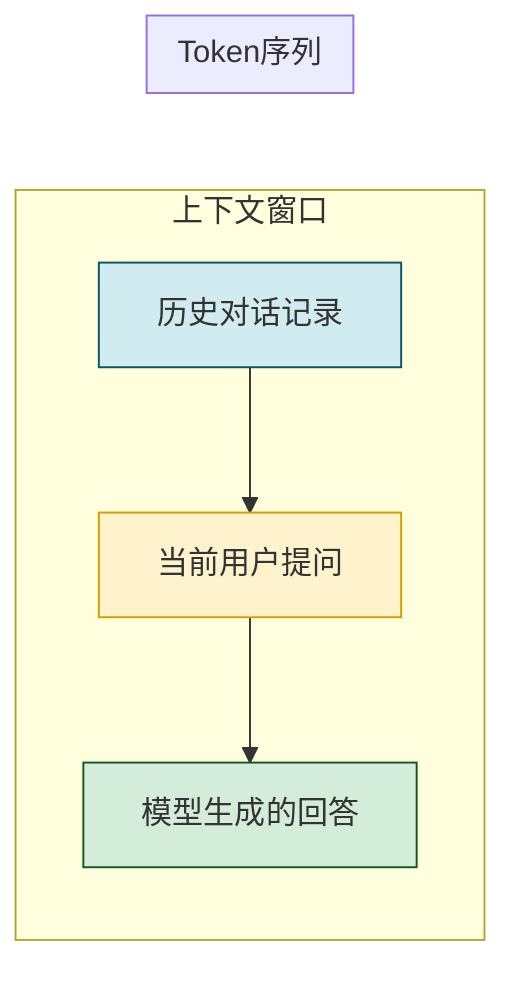

### 1.2 上下文窗口的组成

上下文窗口通常由三部分组成:

| 组成部分 | 说明 | 性质 |
|---------|------|------|
| **System Prompt(系统提示)** | 定义模型的角色、行为规则、安全约束等 | 固定或低频变化 |
| **Conversation History(对话历史)** | 多轮对话中累积的用户与助手消息 | 动态累积 |
| **User Input(当前输入)** | 用户本次提问或指令 | 当前轮次 |

部分现代模型(如 GPT-4o、Claude 3.5)还区分 **输入窗口** 与 **输出限制**,两者之和构成总上下文窗口。

### 1.3 上下文窗口的核心特征

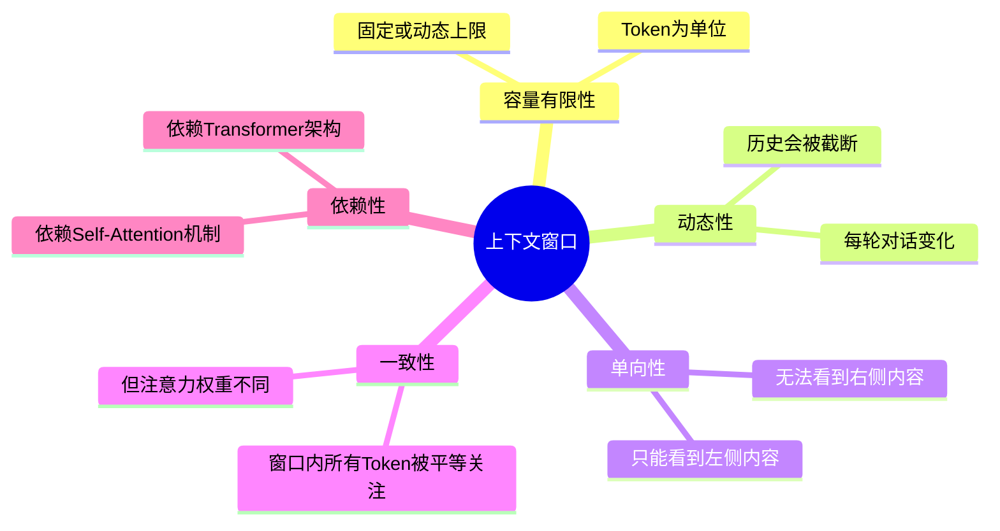

#### 1.3.1 容量有限性

上下文窗口的大小以 Token 为精确度量单位。不同模型的窗口大小差异巨大,从早期的 2048 Token 到如今的 1M+ Token。

#### 1.3.2 动态性

在多轮对话中,上下文窗口是动态变化的。随着对话轮次增加,历史对话会逐渐被**截断或摘要**,以适应窗口大小限制。

#### 1.3.3 单向性

Transformer 的自回归生成特性决定了模型只能"看到"当前 Token 之前的内容,无法看到"未来"的内容。这一特性影响了上下文窗口的使用方式。

### 1.4 上下文窗口与相关概念的辨析

| 概念 | 定义 | 与上下文窗口的关系 |
|-----|------|-----------------|
| **Token** | 文本的最小处理单位 | 上下文窗口的度量单位 |
| **Prompt(提示)** | 用户输入给模型的完整文本 | 上下文窗口的输入部分 |
| **Token 限制** | 单次调用允许的最大 Token 数 | 上下文窗口的数值化表达 |
| **上下文理解** | 模型对前文信息的把握程度 | 上下文窗口大小的效果体现 |
| **长期记忆** | Agent 跨会话的持久化记忆 | 上下文窗口是短期记忆,长期记忆需外部存储 |
| **System Prompt** | 定义模型角色与规则的指令 | 上下文窗口的第一部分 |

### 1.5 上下文窗口的量化理解

为了直观理解上下文窗口的大小,以下是一些参考数据:

| Token 数 | 对应文本量 | 典型场景 |
|:-------:|----------|---------|
| 2,000 | ~1,500 中文字 | 短对话、单段落文本 |
| 8,000 | ~6,000 中文字 | 长文档阅读、多轮对话 |
| 32,000 | ~24,000 中文字 | 技术文档、代码库分析 |
| 128,000 | ~96,000 中文字 | 整本书籍、大型代码库 |
| 200,000+ | ~150,000+ 中文字 | 超长文档、多文档联合分析 |
| 1,000,000+ | ~750,000+ 中文字 | 百万级长文本处理 |

---

## 二、上下文窗口的技术原理与工作机制

### 2.1 Transformer 架构与上下文窗口的关系

上下文窗口的大小从根本上由 **Transformer 架构** 决定。Transformer 的核心组件 **Self-Attention 机制** 的计算复杂度直接限定了可处理的序列长度上限。

```mermaid
flowchart TD
    subgraph Transformer架构
        A[输入序列] --> E[嵌入层 Embedding]
        E --> PE[位置编码 Positional Encoding]
        PE --> L[Transformer层<br/>×N]
        L --> O[输出序列]
    end

    subgraph Self-Attention
        SA[Self-Attention]
    end

    L --> SA
    SA -->|计算复杂度 O(n²)| CW[上下文窗口大小]

    style SA fill:#fff3cd,stroke:#d39e00,stroke-width:2px
    style CW fill:#f8d7da,stroke:#721c24
```

详细的 Transformer 架构与 Self-Attention 计算过程可参考 [1Transformer基本结构详解.md](./1Transformer基本结构详解.md) 与 [2Self-Attention机制完整计算过程.md](./2Self-Attention机制完整计算过程.md)。

### 2.2 Self-Attention 机制对上下文窗口的约束

Self-Attention 机制的核心计算是:

$$Attention(Q, K, V) = softmax\left(\frac{QK^T}{\sqrt{d_k}}\right)V$$

其中 $Q, K, V$ 均为长度为 $n$ 的序列,计算 $QK^T$ 产生一个 $n \times n$ 的注意力矩阵。这导致:

- **计算复杂度**: $O(n^2 \cdot d)$,其中 $n$ 是序列长度,$d$ 是嵌入维度。
- **内存占用**: $O(n^2)$,需要存储 $n \times n$ 的注意力矩阵。
- **当 $n$ 增大时**,计算量与内存需求呈平方级增长。

**具体影响示例**:

```python
# 不同序列长度下的注意力计算量对比
import math

# 假设嵌入维度 d = 4096 (GPT-4级别)
d = 4096

for n in [1000, 10000, 50000, 128000, 1000000]:
    # 计算量近似 O(n² * d)
    flops = n * n * d * 2  # QK^T 计算
    memory = n * n * 4      # FP32 存储,单位字节
    
    print(f"序列长度 {n:>10}:")
    print(f"  计算量: {flops/1e9:>10.2f} GFLOPs")
    print(f"  内存占用: {memory/1024**3:>8.2f} GB")
    print(f"  计算量相对增加: {math.log10(n):.1f} 阶")
    print()
```

**典型输出**:
```
序列长度       1000:
  计算量:       8.19 GFLOPs
  内存占用:    0.00 GB
  计算量相对增加: 3.0 阶

序列长度      10000:
  计算量:     819.20 GFLOPs
  内存占用:    0.38 GB
  计算量相对增加: 4.0 阶

序列长度      50000:
  计算量:   20480.00 GFLOPs
  内存占用:    9.54 GB
  计算量相对增加: 4.7 阶

序列长度    128000:
  计算量:  1373696.00 GFLOPs
  内存占用:   629.15 GB
  计算量相对增加: 5.1 阶

序列长度   1000000:
  计算量:  81920000.00 GFLOPs
  内存占用:  4096.00 GB
  计算量相对增加: 6.0 阶
```

这就是为什么早期 Transformer 模型的上下文窗口通常只有 2048-4096 Token,而如今的 128K+ Token 窗口需要大量工程优化。

### 2.3 扩大上下文窗口的关键技术

为突破 Self-Attention 的平方级瓶颈,学术界与工业界发展了多种优化技术:

#### 2.3.1 稀疏注意力(Sparse Attention)

只让每个 Token 关注序列中的部分 Token,而非全部,将计算复杂度从 $O(n^2)$ 降至近线性。

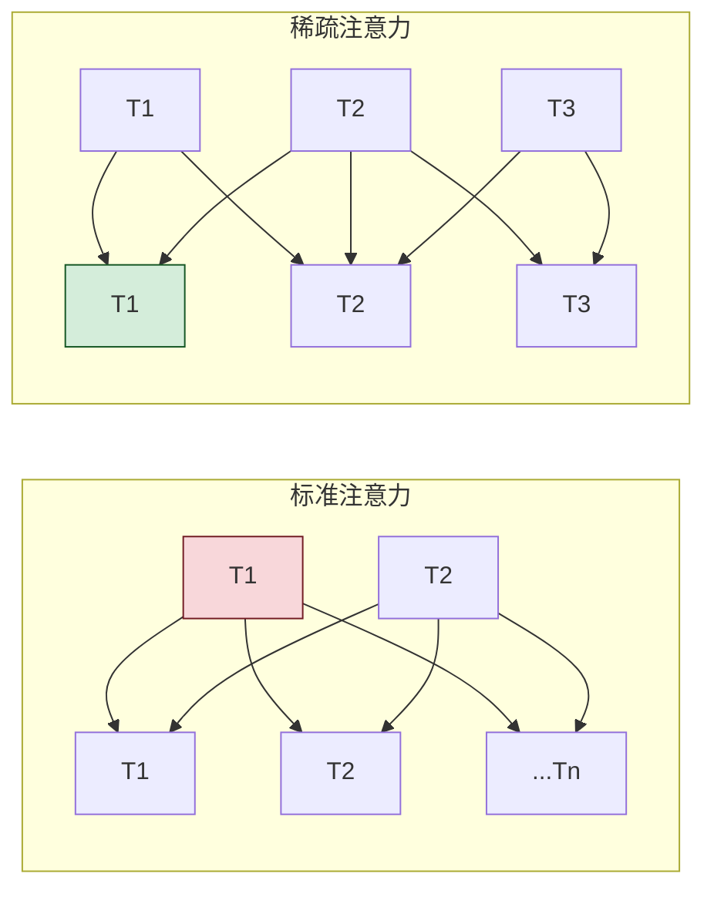

#### 2.3.2 滑动窗口注意力(Sliding Window Attention)

每个 Token 只关注最近的 $w$ 个 Token,窗口大小为 $w$,计算复杂度为 $O(n \cdot w)$。

#### 2.3.3 多尺度注意力(Multi-Scale Attention)

在不同 Transformer 层使用不同的注意力模式:
- 底层:局部窗口注意力,捕捉短距离依赖。
- 中层:稀疏注意力,捕捉中距离依赖。
- 顶层:全局注意力,捕捉长距离依赖。

#### 2.3.4 压缩与检索增强

对历史信息进行**压缩存储**,需要时再**检索调用**,避免全量参与注意力计算:

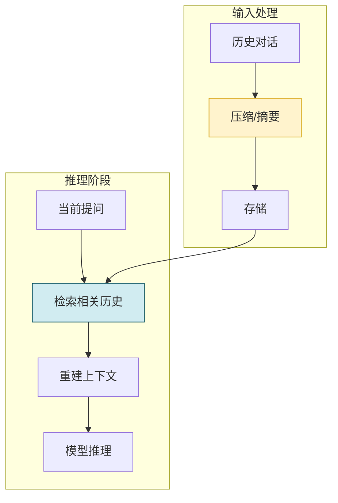

#### 2.3.5 旋转位置编码(RoPE)的扩展

RoPE(Rotary Position Embedding)能更好地支持长上下文,许多超长窗口模型都基于 RoPE 进行了位置编码扩展。

### 2.4 上下文窗口的工作流程

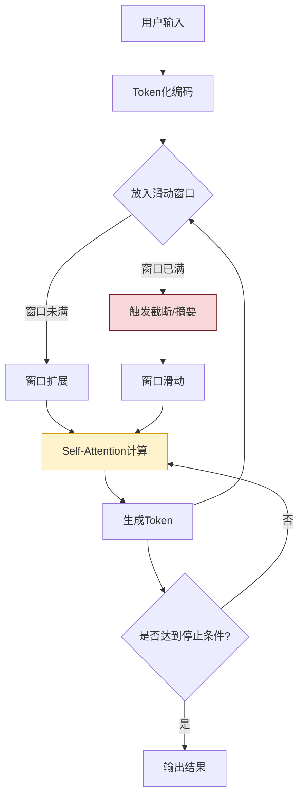

**关键步骤说明**:

1. **Token 化**:用户输入被编码为 Token 序列。
2. **窗口管理**:Token 序列进入上下文窗口,若超上限则截断或摘要。
3. **注意力计算**:窗口内所有 Token 参与 Self-Attention 计算。
4. **自回归生成**:模型逐 Token 生成,每个新 Token 基于窗口内全部历史生成。
5. **动态更新**:新生成的 Token 进入窗口,最旧的 Token 可能被截断。

---

## 三、上下文窗口在大模型运行中的核心作用

### 3.1 上下文窗口的五大核心作用

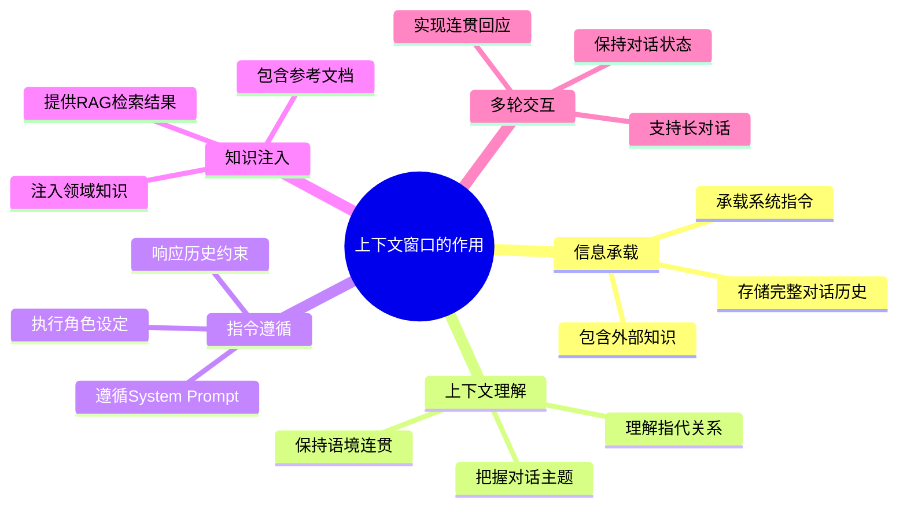

### 3.2 信息承载:模型的"工作记忆"

上下文窗口是模型的**工作记忆区**,所有供模型参考的信息都必须装入这一窗口:

- **System Prompt**:角色设定、行为规则、安全约束等核心指令。
- **对话历史**:上一轮及更早的用户与助手消息。
- **外部知识**:通过 RAG 检索到的相关文档、代码片段等。
- **当前输入**:用户最新的提问或指令。

若上下文窗口不足,部分关键信息会被挤出,导致模型"遗忘"重要信息。

### 3.3 上下文理解:指代消解与语境保持

大模型需要通过上下文窗口中的信息理解对话中的**指代关系**:

**示例**:
```
用户:小明今年多大了?
助手:小明今年8岁。
用户:他上几年级?        ← "他"指代小明,需要上下文判断
助手:他上小学二年级。   ← 需要从上下文中找到"小明"的信息
```

如果"小明今年8岁"这一轮对话被挤出窗口,模型将无法理解"他"指的是谁,导致回答失败。

### 3.4 指令遵循:System Prompt 的执行保障

System Prompt 定义了模型的行为规范,它必须**始终位于上下文窗口中**才能生效:

```python
# System Prompt 必须保留在窗口中
system_prompt = """你是一个专业的代码审查助手,
必须:
1. 逐行分析代码
2. 指出潜在Bug
3. 给出改进建议
4. 使用中文回复
"""

# 若 System Prompt 被挤出窗口,模型可能:
# - 不再按代码审查模式工作
# - 改用英文回复
# - 跳过代码分析步骤
```

### 3.5 知识注入:RAG 的承载基础

RAG(检索增强生成)将外部知识注入上下文窗口,窗口大小直接决定了可注入知识的规模:

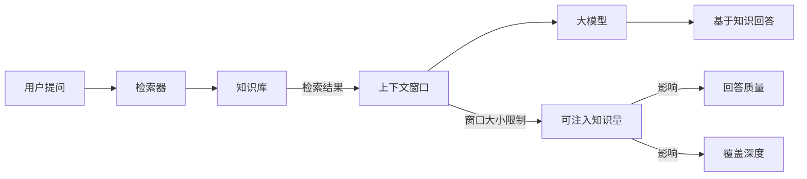

**实际影响**:若上下文窗口只能容纳 4K Token,则 RAG 只能注入 1-2 篇短文档;若窗口为 128K+,则可注入多份长文档,实现更全面的知识覆盖。

### 3.6 多轮交互:长对话的状态保持

在客服、编程助手、写作辅助等场景中,用户与模型可能进行数十轮甚至上百轮对话,上下文窗口是**保持对话连贯性的唯一机制**:

- **话题转移**:模型能跟随用户在不同话题间切换。
- **渐进式构建**:模型能逐步构建上下文(如逐步完善一份文档)。
- **纠错与回溯**:模型能回溯之前的内容并进行修正。

### 3.7 核心作用总结

| 作用 | 说明 | 窗口不足时的表现 |
|-----|------|---------------|
| 信息承载 | 存储所有供模型参考的信息 | 关键信息丢失,模型"遗忘" |
| 指代消解 | 理解对话中的指代关系 | 指代错误,答非所问 |
| 指令遵循 | 执行 System Prompt 规则 | 行为偏离设定,角色混乱 |
| 知识注入 | 承载 RAG 检索结果 | 知识覆盖不足,回答不准确 |
| 多轮交互 | 保持长对话连贯 | 对话断裂,需要重复信息 |

---

## 四、不同类型大模型上下文窗口的特点与差异

### 4.1 主流模型上下文窗口对比

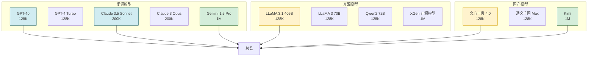

### 4.2 详细参数对比表

| 模型系列 | 最大上下文窗口 | 发布时间 | 技术路线 | 主要应用场景 |
|---------|:-----------:|:-------:|---------|-------------|
| GPT-3 | 2,048 | 2020 | 标准 Transformer | 短文本生成 |
| GPT-3.5 | 4,096 | 2022 | 标准 Transformer | 对话、代码 |
| GPT-4 | 8,192 / 32,768 | 2023 | 混合专家(MoE) | 综合任务 |
| GPT-4 Turbo | 128,000 | 2023 | 优化注意力 | 长文档处理 |
| GPT-4o | 128,000 | 2024 | 多模态优化 | 多模态长文本 |
| Claude 2 | 100,000 | 2023 | 密集连接 | 长文档分析 |
| Claude 3 | 200,000 | 2024 | 优化架构 | 超长文档、代码库 |
| Claude 3.5 | 200,000 | 2024 | 推理优化 | 代码、长文档 |
| Gemini 1.5 Pro | 1,000,000 | 2024 | 压缩+检索 | 百万级长文本 |
| Gemini 1.5 Flash | 1,000,000 | 2024 | 快速推理 | 实时长文本 |
| LLaMA 1 | 4,096 | 2023 | 标准 Transformer | 基础对话 |
| LLaMA 2 | 4,096 | 2023 | RLHF 对齐 | 对话、指令 |
| LLaMA 3 | 128,000 | 2024 | RoPE 扩展 | 长文本、代码 |
| LLaMA 3.1 | 128,000 | 2024 | 多语言优化 | 多语言长文本 |
| Qwen2 | 128,000 | 2024 | RoPE+稀疏 | 中文长文本 |
| Kimi | 1,000,000 | 2024 | 压缩+推理优化 | 超长中文文本 |
| 文心一言 4.0 | 128,000 | 2024 | 多模态 | 中文综合任务 |
| 通义千问 Max | 128,000 | 2024 | Agent优化 | 中文 Agent |

### 4.3 按窗口大小的分级

| 窗口等级 | Token 数 | 代表模型 | 适用场景 | 技术特点 |
|:-------:|:-------:|---------|---------|---------|
| **标准级** | ≤ 32K | GPT-3、GPT-3.5、LLaMA 1/2 | 短对话、单文档 | 标准 Self-Attention,训练稳定 |
| **长文本级** | 32K-200K | GPT-4 Turbo、Claude 3、LLaMA 3 | 长文档、代码库 | 稀疏注意力/优化 RoPE/Flash Attention |
| **超长文本级** | 200K-1M | Gemini 1.5、Kimi | 书籍、多文档集 | 压缩+检索、分级注意力、特殊位置编码 |
| **百万级** | ≥ 1M | Gemini 1.5 Pro/Flash、部分研究模型 | 超级长文本、多模态长上下文 | 创新架构、外推技术、工程优化 |

### 4.4 不同技术路线的差异

#### 4.4.1 基于 Flash Attention 的优化

**代表**:GPT-4 Turbo、Claude 3、LLaMA 3

通过算法优化,在不改变架构的前提下显著加速注意力计算,将窗口扩展到 128K-200K。

#### 4.4.2 基于 RoPE 外推的扩展

**代表**:LLaMA 3、Qwen2、Mistral

旋转位置编码(RoPE)天然支持长度外推,通过调整频率参数可在不重新训练的情况下扩展上下文窗口。

#### 4.4.3 基于压缩与检索的方案

**代表**:Claude 2、Gemini 1.5

对历史信息进行压缩或摘要,需要时再检索,有效突破 $O(n^2)$ 的硬限制。

#### 4.4.4 基于全新架构的方案

**代表**:部分研究模型(如 Mamba、RWKV)

采用循环结构或线性注意力替代传统 Transformer,理论上支持无限长上下文,但目前在大规模应用上尚不成熟。

### 4.5 闭源 vs 开源模型的上下文窗口对比

| 对比维度 | 闭源模型 | 开源模型 |
|---------|---------|---------|
| **最大窗口** | 通常更大(Gemini 1M、Claude 3.5 200K) | 跟进较快(LLaMA 3.1 128K、Qwen2 128K) |
| **性能一致性** | 长上下文下性能保持好 | 长上下文下性能衰减更快 |
| **价格** | 按 Token 收费,长窗口成本高 | 自部署,长窗口无额外费用 |
| **定制性** | 不可定制,需使用固定窗口 | 可根据硬件配置调整 |
| **中文支持** | 部分模型中文窗口效率较低 | 国产开源模型中文优化更好 |
| **技术支持** | 厂商持续优化 | 社区维护,更新频率取决于项目活跃度 |

---

## 五、影响上下文窗口大小的关键因素

### 5.1 影响因素全景

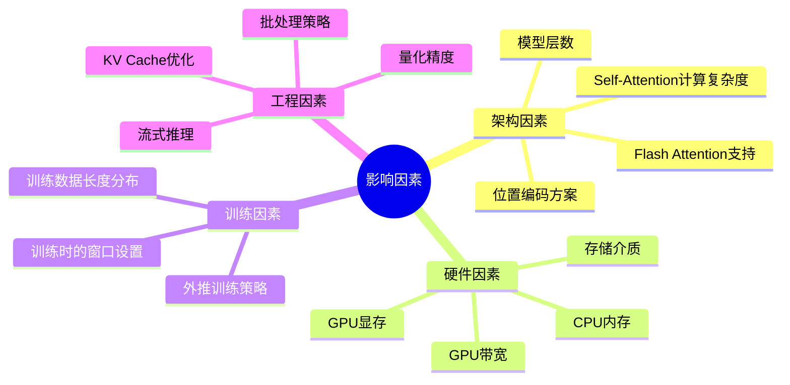

### 5.2 架构因素

#### 5.2.1 Self-Attention 计算复杂度

标准 Self-Attention 的 $O(n^2)$ 复杂度是最根本的限制。通过以下技术可降低:

| 优化技术 | 复杂度 | 实现原理 |
|---------|:------:|---------|
| 标准 Attention | $O(n^2)$ | 完整注意力矩阵 |
| Flash Attention | $O(n^2)$,但常数优化 | 块计算+IO优化 |
| 稀疏注意力 | $O(n \cdot k)$ | 只关注局部或采样Token |
| 线性注意力 | $O(n)$ | 核函数近似 |
| 滑动窗口 | $O(n \cdot w)$ | 固定窗口大小 |

#### 5.2.2 位置编码方案

位置编码方案直接影响长窗口的性能:

| 编码类型 | 长窗口表现 | 代表模型 |
|---------|----------|---------|
| 绝对位置编码 | 超过训练长度性能骤降 | GPT-2(2048) |
| ALiBi | 线性衰减,支持有限外推 | Bloom |
| RoPE | 频率外推,支持较长上下文 | LLaMA 系列、GPT-4 |
| YaRN | RoPE 外推改进,支持更长 | 部分 LLaMA 微调版 |
| NTK-aware RoPE | 动态调整频率,超长支持 | 研究前沿 |

#### 5.2.3 Flash Attention

Flash Attention 通过 **IO-aware tiling** 优化,将注意力计算从内存密集型变为计算密集型,显著提升计算效率:

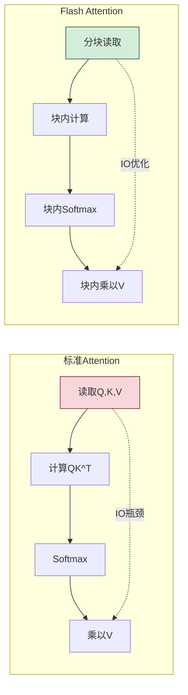

### 5.3 硬件因素

#### 5.3.1 GPU 显存

上下文窗口大小与 KV Cache 占用直接相关:

$$KV\text{-}Cache = 2 \times n \times d \times L \times p$$

其中:
- $n$:序列长度(Token 数)
- $d$:注意力头维度
- $L$:层数
- $p$:精度(FP16=2 字节,FP8=1 字节)

**典型估算**(GPT-4 规模模型,FP16):

| 窗口大小 | KV Cache 大小 | 显存需求(含权重) |
|:-------:|:----------:|:--------------:|
| 32K | ~32 GB | ~80 GB |
| 128K | ~128 GB | ~200 GB |
| 200K | ~200 GB | ~350 GB |
| 1M | ~1 TB | 需多卡分片 |

#### 5.3.2 GPU 带宽与计算力

即便显存足够,GPU 带宽与计算力也会限制实际可用的上下文窗口:

- **H100**:989 GB/s 带宽,1979 TFLOPS,支持更大的实际窗口。
- **A100**:2039 GB/s 带宽,624 TFLOPS,窗口受限于计算而非带宽。
- **消费级 GPU**:带宽与计算力均有限,实际可用窗口远低于理论上限。

### 5.4 训练因素

#### 5.4.1 训练数据长度分布

模型在训练时接触的序列长度分布,直接影响其对不同长度的适应能力:

- 训练数据以短序列为主 → 长序列性能差。
- 训练数据包含长序列 → 长序列性能好。
- 训练长度为 4K 的模型,外推到 128K 时性能骤降。

#### 5.4.2 外推训练策略

为扩展上下文窗口,研究人员发展了多种训练策略:

| 策略 | 原理 | 效果 |
|-----|------|------|
| 长度外推训练 | 训练时混入更长序列 | 支持有限外推 |
| 位置编码外推 | 调整位置编码频率 | RoPE/ALiBi 等方案 |
| 压缩训练 | 训练模型压缩历史信息 | 支持超长窗口 |
| 多尺度训练 | 不同层处理不同长度 | 平衡效率与质量 |

### 5.5 工程因素

#### 5.5.1 KV Cache 优化

KV Cache 存储模型在注意力计算中产生的 Key 和 Value 张量,工程优化可显著降低显存占用:

- **PagedAttention**:将 KV Cache 分页存储,支持更灵活的内存管理。
- **KV Cache 量化**:用 FP8 或 INT8 存储 KV Cache,节省显存。
- **KV Cache 共享**:在多请求间共享相同的 KV Cache。

#### 5.5.2 批处理与并发

同时处理多个请求时,内存管理更加复杂:

- **Continuous Batching**:动态调整批量大小,优化显存利用。
- **Prefix Caching**:相同前缀的 KV Cache 复用,节省计算。
- **内存池化**:统一管理 KV Cache 内存,减少碎片。

---

## 六、上下文窗口大小对模型性能的影响

### 6.1 优势:更大的上下文窗口能带来什么

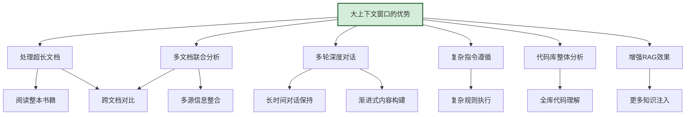

#### 6.1.1 超长文档处理

最大的价值在于**无需切分即可处理整份长文档**:

- **法律领域**:分析整份合同(通常 20-50 页),避免切分导致的上下文断裂。
- **学术研究**:分析完整论文或综述,把握完整论证逻辑。
- **财务分析**:分析整份财报(通常 100+ 页),提取关键财务指标。
- **书籍分析**:整本书籍的内容理解与摘要生成。

#### 6.1.2 多文档联合分析

在知识密集型任务中,多文档联合分析是核心需求:

- **系统设计**:同时参考技术文档、API 文档、用户手册。
- **竞品分析**:同时对比多个产品的功能、价格、特性。
- **数据研究**:同时分析多篇研究论文,进行系统性综述。
- **代码库理解**:同时阅读多个关联文件,理解完整代码结构。

#### 6.1.3 多轮深度对话

上下文窗口越大,模型在多轮对话中能保持的连贯性越好:

- **代码助手**:用户在数十轮对话中逐步构建一个功能模块。
- **写作辅助**:用户与模型协作完成一篇文章,多轮修改。
- **学习辅导**:长时段的教学对话,保持学习上下文。
- **项目规划**:从需求分析到方案设计的完整对话链路。

#### 6.1.4 复杂指令遵循

更大的上下文窗口允许模型遵循更复杂的指令:

- **多级规则**:执行包含数十条规则的校验逻辑。
- **模板填充**:遵循复杂的报告模板,填充各部分内容。
- **格式约束**:严格遵循复杂的输出格式要求。

### 6.2 局限性:大上下文窗口的代价

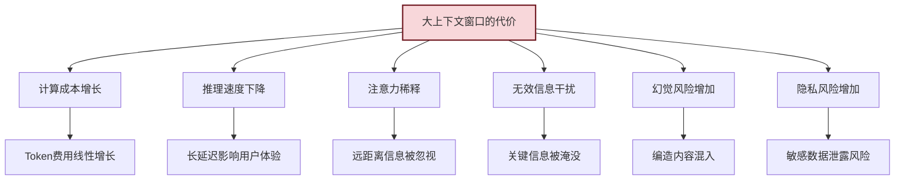

#### 6.2.1 计算成本的平方级增长

虽然优化技术不断进步,但上下文窗口的扩大仍伴随着显著的成本增长:

```python
# 成本估算示例
# 假设:处理128K Token的成本约为4K Token的10-30倍

cost_4k = 0.01      # 4K Token的API费用
cost_128k = 0.20    # 128K Token的API费用(示例值)
cost_1m = 5.00      # 1M Token的API费用(示例值)

print(f"4K Token: ${cost_4k}")
print(f"128K Token: ${cost_128k} (约 {cost_128k/cost_4k:.0f}x)")
print(f"1M Token: ${cost_1m} (约 {cost_1m/cost_4k:.0f}x)")
```

#### 6.2.2 推理速度下降

随着上下文窗口增大,推理速度会显著下降:

| 窗口大小 | 相对延迟(Fastest=1x) | 用户体验 |
|:-------:|:--------------------:|---------|
| 4K | 1x | 流畅(< 1s) |
| 32K | 2-3x | 可接受(1-3s) |
| 128K | 5-10x | 较慢(3-10s) |
| 200K+ | 10-30x | 等待明显(10-30s) |
| 1M | 30-100x | 需等待(30s+) |

#### 6.2.3 注意力稀释

当上下文过长时,模型的注意力会被"稀释",导致**远距离信息被忽视**:

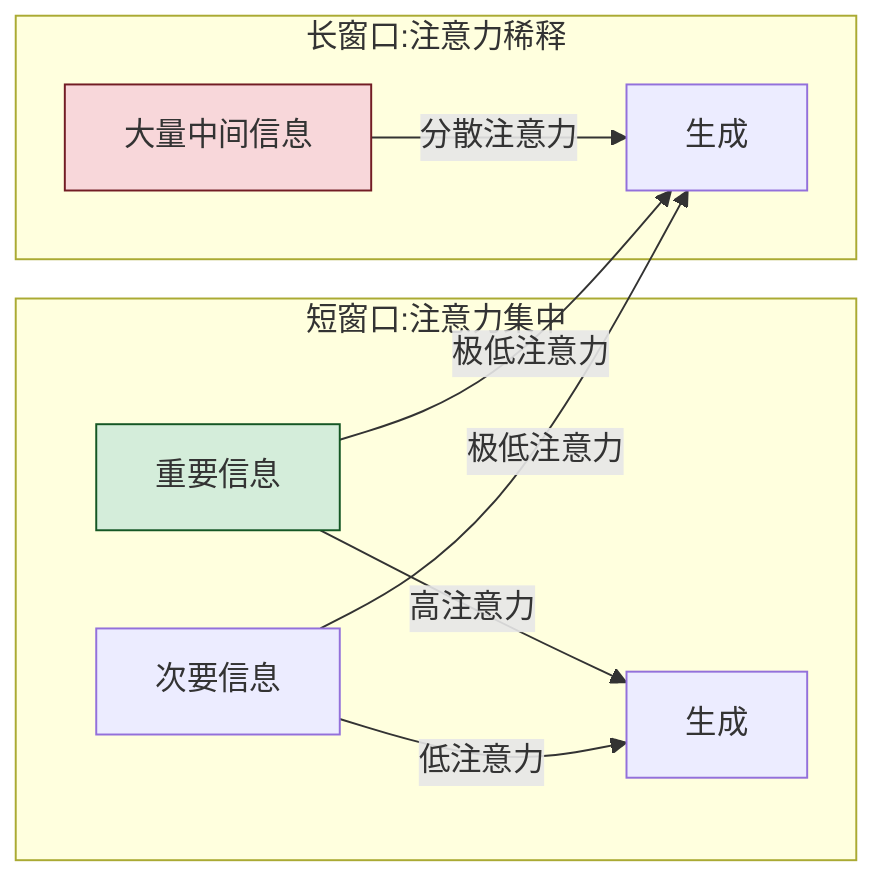

**研究发现**:当上下文长度超过某个阈值(通常为 32K-128K,取决于模型),模型对开头信息的记忆能力显著下降,这一现象被称为 **"Lost in the Middle"** 效应。

#### 6.2.4 无效信息干扰

更长的上下文往往包含更多无关信息,干扰模型对关键信息的关注:

- **信息过载**:用户提供了过长的背景材料,但关键信息被淹没。
- **噪声干扰**:长文档中包含大量无关内容,分散模型注意力。
- **冗余信息**:重复或相似的信息让模型产生混淆。

#### 6.2.5 幻觉风险增加

长上下文为模型提供了更多"原材料",但也增加了幻觉风险:

- **信息混淆**:模型可能将不同文档的信息错误组合。
- **编造倾向**:上下文越长,模型越倾向于"编造"缺失的信息。
- **事实冲突**:多文档中的矛盾信息可能引发幻觉。

#### 6.2.6 隐私风险

更长的上下文可能包含更多敏感信息,增加隐私风险:

- **数据泄露**:用户上传的文档中可能包含密码、密钥、个人信息。
- **反向推理**:通过上下文信息可能推断出用户的敏感数据。

### 6.3 性能平衡点

上下文窗口并非越大越好,而是存在一个**性能最优点**:

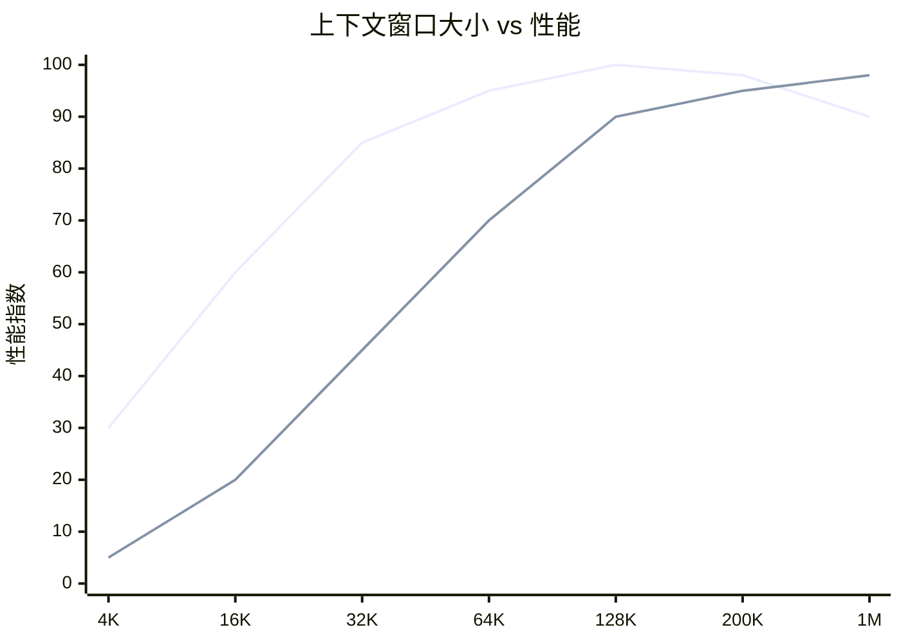

**关键洞察**:
- 小窗口 → 性能低(信息不足)。
- 中等窗口(32K-128K)→ 性能最优(信息充足且注意力集中)。
- 超大窗口 → 性能略降(注意力稀释、干扰增加)。

---

## 七、实际应用中的使用策略与最佳实践

### 7.1 上下文窗口管理的三大策略

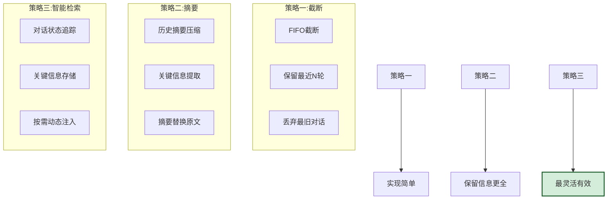

### 7.2 策略一:FIFO 截断

最简单的策略,当上下文溢出时丢弃最旧的对话。

```python
def fifo_truncate(conversation: list, max_tokens: int) -> list:
    """FIFO截断:保留最新的对话,丢弃最旧的"""
    total_tokens = sum(count_tokens(msg["content"]) for msg in conversation)
    
    while total_tokens > max_tokens and len(conversation) > 2:
        # 丢弃最旧的非系统消息
        for i, msg in enumerate(conversation):
            if msg["role"] != "system":
                conversation.pop(i)
                total_tokens -= count_tokens(msg["content"])
                break
    
    return conversation
```

**适用场景**:简单的客服对话、短会话交互。
**优点**:实现简单,延迟低。
**缺点**:历史信息丢失,无法支持长会话。

### 7.3 策略二:历史摘要压缩

用模型对历史对话进行摘要,用摘要替换原始内容。

```python
class SummaryBasedWindowManager:
    """基于摘要的窗口管理器"""
    
    def __init__(self, llm_client, max_summary_tokens=1000):
        self.llm = llm_client
        self.max_summary_tokens = max_summary_tokens
    
    def manage(self, conversation: list, system_prompt: str,
                max_context_tokens: int) -> list:
        """管理上下文窗口,必要时摘要压缩"""
        total = self._count_total_tokens(conversation)
        
        if total <= max_context_tokens:
            return conversation  # 无需压缩
        
        # 1. 提取可摘要的历史对话
        to_summarize = []
        recent = []
        for msg in conversation:
            # 保留最近 3 轮对话
            if len(recent) < 6:
                recent.append(msg)
            else:
                to_summarize.append(msg)
        
        # 2. 对历史对话生成摘要
        if to_summarize:
            summary = self._summarize(to_summarize)
            # 3. 构建新上下文
            new_context = [
                {"role": "system", "content": system_prompt},
                {"role": "system", "content": f"【对话历史摘要】{summary}"},
            ] + recent
            return new_context
        
        return conversation
    
    def _summarize(self, messages: list) -> str:
        """调用LLM生成摘要"""
        prompt = f"""请将以下对话历史总结为简洁的摘要,
保留关键信息、用户偏好、已决定的事项:

对话历史:
{self._format_messages(messages)}

摘要:"""
        return self.llm.generate(prompt)
    
    def _count_total_tokens(self, messages: list) -> int:
        return sum(count_tokens(m["content"]) for m in messages)
    
    def _format_messages(self, messages: list) -> str:
        return "\n".join(
            f"{m['role']}: {m['content']}" for m in messages
        )
```

**适用场景**:长对话助手、编程助手、写作辅助。
**优点**:保留历史信息,窗口利用率高。
**缺点**:摘要质量影响效果,增加推理开销。

### 7.4 策略三:智能检索(Memory + RAG)

将关键信息存储在外部,需要时动态注入,是最先进的管理策略。

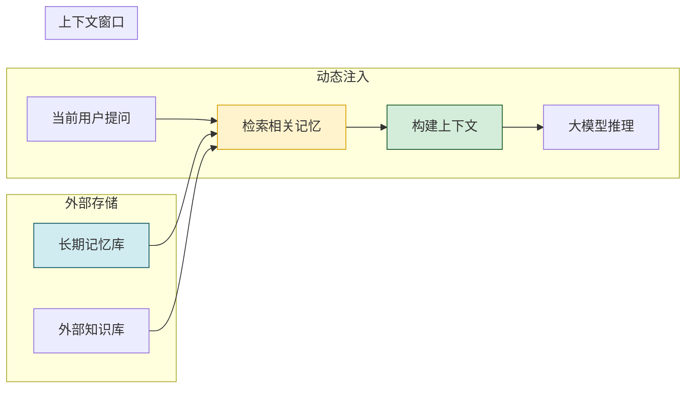

**适用场景**:Agent系统、知识问答、复杂多步骤任务。
**优点**:上下文使用最优化,支持超长会话。
**缺点**:实现复杂度高,依赖检索系统质量。

### 7.5 不同策略的选择

| 应用场景 | 推荐策略 | 理由 |
|---------|---------|------|
| 简单客服 | FIFO 截断 | 对话短、历史不重要 |
| 编程助手 | 摘要压缩 | 需要保留代码上下文历史 |
| 写作辅助 | 摘要压缩+关键信息保留 | 需要保留创作主线 |
| 知识问答 | 智能检索+RAG | 需要按需注入知识 |
| Agent系统 | 智能检索+工作记忆 | 需要动态管理多任务上下文 |
| 长文分析 | 摘要压缩+分段处理 | 需要长文本理解能力 |

### 7.6 不同场景下的最佳实践

#### 7.6.1 文档分析场景

```python
DOCUMENT_ANALYSIS_BEST_PRACTICES = {
    "practice_1": "文档长度 > 窗口:先摘要再分析",
    "practice_2": "多文档场景:按相关性排序,优先注入最相关文档",
    "practice_3": "关键信息高亮:在注入前提取文档中的关键段落",
    "practice_4": "结构化注入:按文档结构(标题-摘要-正文)组织内容",
}
```

#### 7.6.2 对话系统场景

```python
DIALOGUE_BEST_PRACTICES = {
    "practice_1": "保留最近 3-5 轮对话,保证流畅性",
    "practice_2": "历史对话摘要保留关键决策与偏好",
    "practice_3": "用户关键信息(如姓名、偏好)单独存储",
    "practice_4": "System Prompt 始终完整保留",
}
```

#### 7.6.3 代码分析场景

```python
CODE_ANALYSIS_BEST_PRACTICES = {
    "practice_1": "优先注入当前正在编辑的文件",
    "practice_2": "关联文件按需注入(通过 import 关系)",
    "practice_3": "函数级摘要:对长文件生成函数级摘要",
    "practice_4": "项目结构信息作为背景上下文",
}
```

### 7.7 窗口使用率优化

**目标**:在上下文窗口限制下,最大化有效信息密度。

```python
def optimize_context_usage(system_prompt: str, history: list, 
                             external_knowledge: str, 
                             max_tokens: int) -> dict:
    """优化上下文窗口使用"""
    # 1. 保证 System Prompt
    system_tokens = count_tokens(system_prompt)
    
    # 2. 分配历史对话配额
    history_budget = max_tokens * 0.3
    history_tokens = min(history_budget, count_tokens(str(history)))
    
    # 3. 分配外部知识配额
    knowledge_budget = max_tokens - system_tokens - history_tokens
    knowledge_tokens = min(knowledge_budget, count_tokens(external_knowledge))
    
    # 4. 优化外部知识(若超出配额)
    optimized_knowledge = external_knowledge
    if count_tokens(external_knowledge) > knowledge_budget:
        # 摘要压缩或只保留最相关部分
        optimized_knowledge = compress_knowledge(
            external_knowledge, target_tokens=knowledge_budget
        )
    
    return {
        "system_prompt": system_prompt,
        "history": truncate_or_summarize(history, history_tokens),
        "external_knowledge": optimized_knowledge,
        "total_tokens": system_tokens + history_tokens + 
                        count_tokens(optimized_knowledge),
        "usage_ratio": (system_tokens + history_tokens + 
                        count_tokens(optimized_knowledge)) / max_tokens,
    }
```

### 7.8 常见陷阱与避坑指南

| 陷阱 | 表现 | 规避方法 |
|-----|------|---------|
| 盲目追求大窗口 | 为"利用"窗口塞入所有信息 | 只注入最相关信息 |
| 忽略 System Prompt | System Prompt 被挤出窗口 | 始终为 System Prompt 预留空间 |
| 历史对话无管理 | 对话无限增长直到溢出 | 实现智能截断/摘要 |
| 无效信息注入 | 注入大量无关信息 | 严格筛选,只注入高相关内容 |
| 忽略延迟影响 | 超长窗口导致响应过慢 | 平衡窗口大小与响应速度 |
| 不标注截断 | 用户不知道信息已被截断 | 告知用户当前的上下文范围 |
| 摘要质量差 | 摘要丢失关键信息 | 迭代优化摘要提示词 |

---

## 八、上下文窗口技术的发展趋势与未来挑战

### 8.1 发展历程

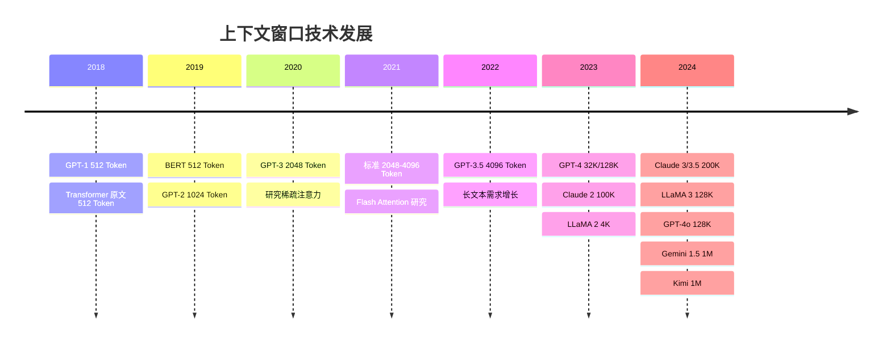

### 8.2 当前发展趋势

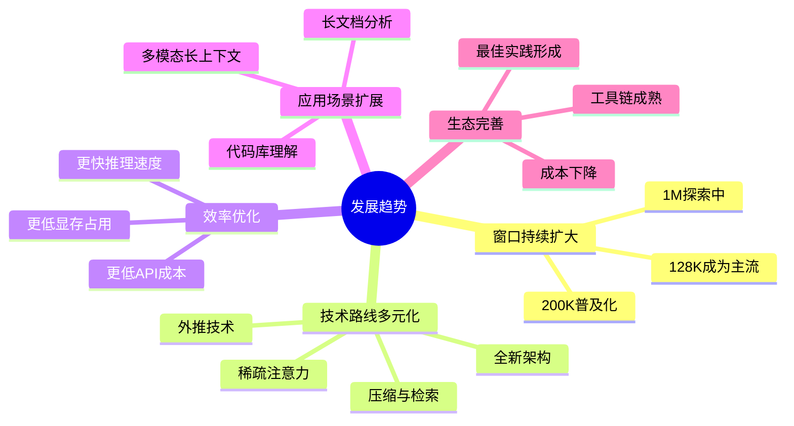

#### 8.2.1 窗口持续扩大

上下文窗口的扩大速度惊人:
- 2020 年:主流 2K-4K。
- 2023 年:主流 32K-128K。
- 2024 年:主流 128K-200K,1M 级别进入实用阶段。
- 预测 2025-2026 年:1M 可能成为主流,更大窗口持续探索。

#### 8.2.2 技术路线多元化

不再依赖单一技术,而是多种路线并行发展:

| 技术路线 | 代表工作 | 成熟度 | 适用场景 |
|---------|---------|:------:|---------|
| Flash Attention + 优化 | GPT-4、Claude 3 | 成熟 | 通用场景 |
| RoPE 外推 | LLaMA 3、Qwen | 成熟 | 开源场景 |
| 压缩+检索 | Claude 2、Gemini | 成熟 | 长文档 |
| 稀疏注意力 | BigBird、Longformer | 中 | 特定结构文档 |
| 线性注意力 | Performer、RWKV | 中 | 实时场景 |
| 全新循环架构 | Mamba、S4 | 早期 | 研究前沿 |
| 记忆增强 | RetNet、记忆 Transformer | 早期 | 长序列依赖 |

#### 8.2.3 工程效率优化

在窗口扩大的同时,工程优化持续推进:
- **推理加速**:vLLM、TensorRT-LLM 等推理引擎的持续优化。
- **显存优化**:量化、KV Cache 压缩、PagedAttention 等技术。
- **成本下降**:长窗口的单位 Token 成本持续下降。
- **多模态扩展**:上下文窗口开始支持图像、音频等多模态内容。

### 8.3 未来面临的核心挑战

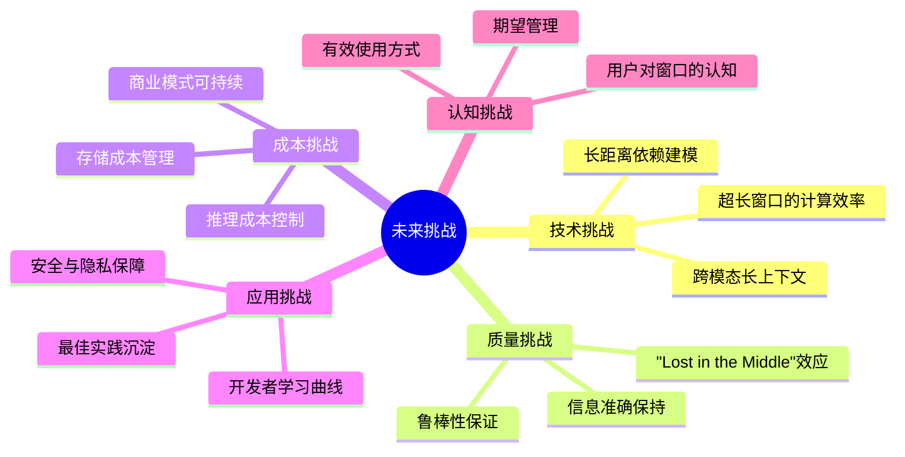

#### 8.3.1 超长窗口的计算效率

即使是 1M 窗口,当前的计算效率仍是瓶颈。未来需要:
- 更高效的注意力算法(如 $O(n)$ 级别的线性注意力)。
- 专用硬件加速长序列处理。
- 更智能的 KV Cache 管理策略。

#### 8.3.2 "Lost in the Middle" 效应

研究表明,即使是 128K+ 窗口的模型,对中间位置的信息记忆能力仍显著低于开头和结尾。这一效应需要通过架构改进或训练策略缓解。

#### 8.3.3 长距离依赖建模

如何在百万级 Token 的序列中准确建模相隔数百 K Token 的依赖关系,仍是开放问题:
- 长距离指代消解。
- 跨段落/跨章节的逻辑关联。
- 长程一致性保持。

#### 8.3.4 成本与价值的平衡

超长窗口带来了能力提升,但成本也随之增长。需要找到**成本与价值的最优平衡点**:
- 大部分场景 32K-128K 已足够。
- 仅在特定场景(如整本书籍分析)才需要 1M 窗口。
- 智能路由:根据任务复杂度自动选择合适的窗口大小。

#### 8.3.5 安全与隐私

超长窗口意味着更多的用户数据被送入模型:
- 敏感信息(密码、密钥、个人数据)可能被模型记忆或泄露。
- 需要更完善的输入过滤与数据脱敏机制。
- 需要考虑数据主权与合规问题。

### 8.4 未来发展方向

#### 8.4.1 动态窗口

根据任务复杂度动态调整窗口大小,实现成本与效果的最优平衡:

```mermaid
flowchart LR
    T[任务到达] --> A[复杂度评估]
    A -->|简单任务| S1[分配小窗口:4K]
    A -->|中等任务| S2[分配中窗口:32K]
    A -->|复杂任务| S3[分配大窗口:128K+]
    S1 --> E[高效执行]
    S2 --> E
    S3 --> E

    style A fill:#fff3cd,stroke:#d39e00
    style E fill:#d4edda,stroke:#155724
```

#### 8.4.2 多模态长上下文

未来的上下文窗口将支持文本、图像、音频、视频等多种模态的混合输入:
- 同时分析数百张图片及其配套文本。
- 处理长音频的字幕与内容。
- 多模态文档(PDF、扫描件)的完整理解。

#### 8.4.3 工作记忆与长期记忆的融合

将上下文窗口(短期工作记忆)与外部知识库(长期记忆)有机结合:
- **智能分层**:短期记忆保持在窗口内,长期记忆存储在外部。
- **无缝切换**:需要时自动从长期记忆检索信息注入窗口。
- **记忆合成**:从历史对话中提炼出结构化的"记忆条目"。

#### 8.4.4 窗口即服务(Context as a Service)

未来可能出现专门的上下文管理服务:
- 统一的上下文存储与管理平台。
- 跨模型的上下文迁移与共享。
- 上下文质量评估与优化建议。

---

## 九、总结与展望

### 9.1 核心要点回顾

1. **上下文窗口是大模型的"工作记忆"**,以 Token 为单位,定义了单次推理中模型能处理的最大文本序列。
2. **技术根源是 Transformer 架构**:Self-Attention 的 $O(n^2)$ 计算复杂度是窗口扩展的核心瓶颈,Flash Attention、稀疏注意力、RoPE 外推等技术突破推动窗口从 2K 扩展到 1M+。
3. **上下文窗口承担五大核心作用**:信息承载、指代消解、指令遵循、知识注入、多轮交互。
4. **不同模型窗口差异显著**:GPT-4o(128K)、Claude 3.5(200K)、Gemini 1.5(1M)处于领先,开源模型(LLaMA 3.1、Qwen2)紧跟其后。
5. **大窗口优势与代价并存**:优势体现在超长文档处理、多文档分析、多轮深度对话;代价是计算成本增长、推理速度下降、注意力稀释、幻觉风险增加。
6. **管理策略分三级**:FIFO 截断适合简单场景,摘要压缩适合长对话,智能检索适合 Agent 系统。
7. **未来趋势**:窗口持续扩大、技术路线多元化、动态窗口、多模态融合、工作记忆与长期记忆结合。

### 9.2 开发者实践建议

| 建议 | 说明 |
|-----|------|
| **先评估后使用** | 根据任务复杂度选择合适窗口,避免盲目追求大窗口 |
| **管理上下文** | 实现智能的窗口管理策略,而非简单截断 |
| **关注 System Prompt** | 确保核心指令始终保留在窗口中 |
| **质量 > 数量** | 优先注入最相关的少量信息,而非大量无关信息 |
| **延迟敏感场景** | 对延迟敏感的场景,控制窗口大小在 32K 以内 |
| **长文档处理** | 利用大窗口优势处理完整文档,避免切分断裂 |
| **成本监控** | 监控 Token 使用量,优化成本效益比 |
| **持续关注前沿** | 上下文窗口技术快速发展,持续关注新模型与新技术 |

### 9.3 与系列其他文档的关系

本文档是"大模型基础"系列的重要组成部分:

- [1Transformer基本结构详解.md](./1Transformer基本结构详解.md):理解 Transformer 架构是理解上下文窗口的基础。
- [2Self-Attention机制完整计算过程.md](./2Self-Attention机制完整计算过程.md):Self-Attention 是上下文窗口的核心计算机制。
- [9Token数量与上下文长度关系详解.md](./9Token数量与上下文长度关系详解.md):Token 是上下文窗口的度量单位。
- [5大模型幻觉现象深度解析.md](./5大模型幻觉现象深度解析.md):上下文窗口大小影响幻觉率。
- [../1基础概念/7Agent与RAG系统深度对比.md](../1基础概念/7Agent与RAG系统深度对比.md):RAG 是上下文窗口能力的补充与延伸。
- [../1基础概念/6Agent记忆能力深度解析.md](../1基础概念/6Agent记忆能力深度解析.md):上下文窗口是 Agent 短期记忆的实现基础。

---

> **相关文档**
>
> - [1Transformer基本结构详解.md](./1Transformer基本结构详解.md):Transformer 架构是上下文窗口的计算基础。
> - [2Self-Attention机制完整计算过程.md](./2Self-Attention机制完整计算过程.md):Self-Attention 机制直接决定上下文窗口的计算复杂度。
> - [9Token数量与上下文长度关系详解.md](./9Token数量与上下文长度关系详解.md):Token 是上下文窗口的基本度量单位。
> - [5大模型幻觉现象深度解析.md](./5大模型幻觉现象深度解析.md):上下文窗口大小影响幻觉率。
> - [../1基础概念/6Agent记忆能力深度解析.md](../1基础概念/6Agent记忆能力深度解析.md):上下文窗口是 Agent 短期记忆的实现方式。
> - [../1基础概念/7Agent与RAG系统深度对比.md](../1基础概念/7Agent与RAG系统深度对比.md):RAG 通过外部知识补充上下文窗口的局限。
