# 长文本输入导致大模型效果下降原因深度解析

## 目录

- [一、问题概述与研究背景](#一问题概述与研究背景)
- [二、模型架构限制因素](#二模型架构限制因素)
- [三、注意力机制的计算瓶颈](#三注意力机制的计算瓶颈)
- [四、输入处理机制导致的信息损失](#四输入处理机制导致的信息损失)
- [五、语义理解的核心挑战](#五语义理解的核心挑战)
- [六、位置编码在长文本中的失效](#六位置编码在长文本中的失效)
- [七、计算资源与训练数据限制](#七计算资源与训练数据限制)
- [八、实验数据与现象分析](#八实验数据与现象分析)
- [九、缓解策略与技术方案](#九缓解策略与技术方案)
- [十、总结与未来展望](#十总结与未来展望)
- [参考资料](#参考资料)

---

## 一、问题概述与研究背景

### 1.1 长文本处理的时代需求

随着大语言模型应用场景的不断扩展，处理长文本已成为核心需求。然而，当输入文本长度显著增加时，模型性能会出现明显下降，这一现象被称为"长上下文退化"（Lost in the Middle）。

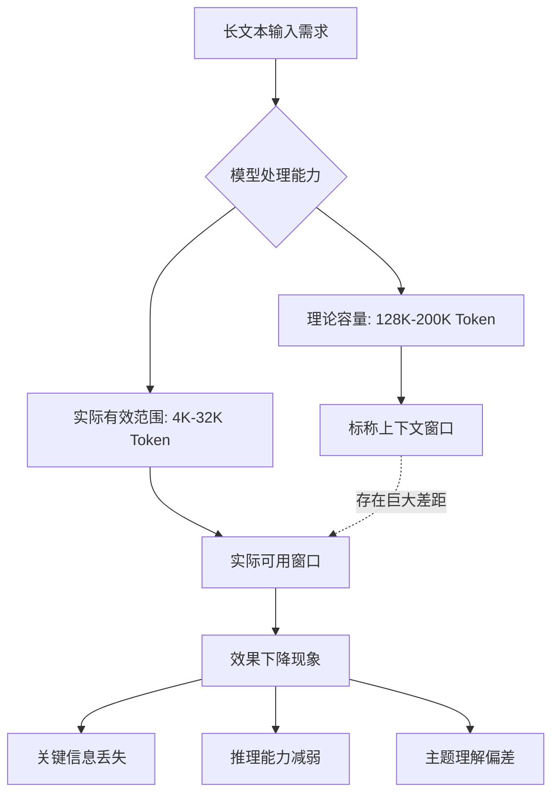

### 1.2 效果下降的典型表现

| 表现类型 | 具体现象 | 影响程度 |
| :--- | :--- | :--- |
| **信息丢失** | 中间位置的关键信息被忽略 | ⭐⭐⭐⭐⭐ |
| **推理减弱** | 多步推理能力显著下降 | ⭐⭐⭐⭐ |
| **主题漂移** | 长文本中主题焦点模糊 | ⭐⭐⭐⭐ |
| **幻觉增加** | 编造内容填补记忆空白 | ⭐⭐⭐⭐⭐ |
| **指令遵从下降** | 忘记早期给出的约束条件 | ⭐⭐⭐⭐ |

### 1.3 "Lost in the Middle" 现象

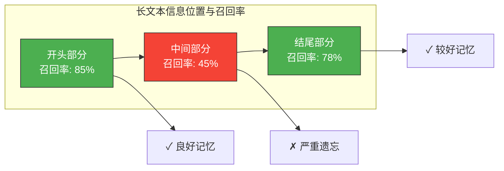

研究表明，无论模型上下文窗口多大，位于文本中间位置的信息都最容易被忽略，形成典型的"U型"召回曲线。

---

## 二、模型架构限制因素

### 2.1 上下文窗口的硬性限制

#### 2.1.1 上下文窗口的本质

上下文窗口是模型架构设计时确定的固定参数，由位置编码的最大长度和注意力机制的实现方式共同决定。

```python
# 代码示例：上下文窗口的限制体现
class ModelContextLimit:
    """模型上下文窗口限制示例"""
    
    def __init__(self, model_name):
        # 不同模型的上下文窗口限制
        self.context_limits = {
            "gpt-3.5-turbo": 4096,
            "gpt-4": 8192,
            "gpt-4-turbo": 128000,
            "claude-3-opus": 200000,
            "llama-3-70b": 128000,
        }
        self.max_context = self.context_limits.get(model_name, 4096)
    
    def check_input(self, input_tokens):
        """检查输入是否超出限制"""
        if input_tokens > self.max_context:
            # 超出限制时的处理方式
            return {
                "status": "exceeded",
                "input_tokens": input_tokens,
                "max_allowed": self.max_context,
                "exceeded_by": input_tokens - self.max_context,
                "handling": "自动截断或报错"
            }
        return {"status": "ok", "input_tokens": input_tokens}
    
    def calculate_effective_window(self, input_tokens, reserved_output=1000):
        """计算有效输出空间"""
        effective_output = self.max_context - input_tokens - reserved_output
        return max(0, effective_output)

# 使用示例
model = ModelContextLimit("gpt-4")
print(model.check_input(10000))  # 超出限制
```

#### 2.1.2 窗口限制的影响

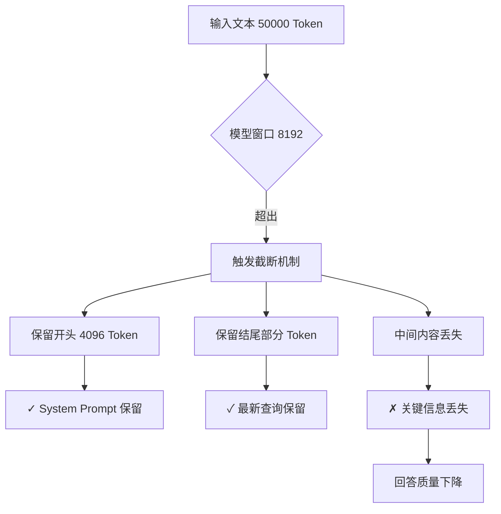

### 2.2 注意力机制的内在限制

#### 2.2.1 注意力稀释问题

当序列长度增加时，Softmax 注意力权重会被稀释到更多 Token 上，导致每个 Token 获得的"注意力份额"减少。

```python
# 代码示例：注意力稀释的数值演示
import numpy as np

def softmax(x):
    """数值稳定的 Softmax"""
    e_x = np.exp(x - np.max(x))
    return e_x / e_x.sum()

# 模拟注意力分数
def demonstrate_attention_dilution():
    """演示注意力稀释现象"""
    
    # 场景1：短序列（10个Token）
    short_scores = np.random.randn(10)
    short_attention = softmax(short_scores)
    
    # 场景2：长序列（1000个Token）
    long_scores = np.random.randn(1000)
    long_attention = softmax(long_scores)
    
    print("短序列（10 Token）:")
    print(f"  最大注意力权重: {short_attention.max():.4f}")
    print(f"  平均注意力权重: {short_attention.mean():.4f}")
    print(f"  Top-3 权重总和: {np.sort(short_attention)[-3:].sum():.4f}")
    
    print("\n长序列（1000 Token）:")
    print(f"  最大注意力权重: {long_attention.max():.4f}")
    print(f"  平均注意力权重: {long_attention.mean():.4f}")
    print(f"  Top-3 权重总和: {np.sort(long_attention)[-3:].sum():.4f}")

demonstrate_attention_dilution()
```

#### 2.2.2 注意力稀释的可视化

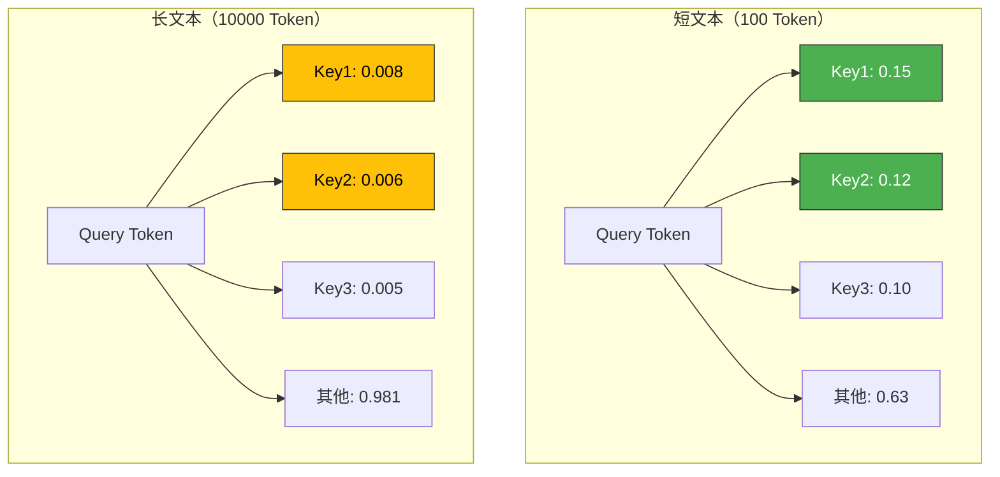

---

## 三、注意力机制的计算瓶颈

### 3.1 Self-Attention 的平方复杂度

标准的 Self-Attention 机制计算复杂度为 O(n²)，其中 n 为序列长度。这意味着序列长度翻倍，计算量将增加 4 倍。

#### 3.1.1 计算复杂度分析

```python
# 代码示例：注意力计算复杂度分析
import time
import numpy as np

def standard_attention(Q, K, V):
    """标准 Self-Attention 计算"""
    # Q, K, V 形状: [seq_len, d_k]
    d_k = Q.shape[-1]
    
    # 1. 计算注意力分数: O(n² * d)
    scores = np.dot(Q, K.T) / np.sqrt(d_k)
    
    # 2. Softmax: O(n²)
    attention_weights = softmax(scores)
    
    # 3. 加权求和: O(n² * d)
    output = np.dot(attention_weights, V)
    
    return output

def benchmark_attention_complexity():
    """基准测试注意力计算复杂度"""
    d_k = 64  # 隐藏维度
    seq_lengths = [128, 256, 512, 1024, 2048, 4096, 8192]
    
    results = []
    for seq_len in seq_lengths:
        Q = np.random.randn(seq_len, d_k)
        K = np.random.randn(seq_len, d_k)
        V = np.random.randn(seq_len, d_k)
        
        start = time.time()
        _ = standard_attention(Q, K, V)
        elapsed = time.time() - start
        
        # 理论计算量
        operations = seq_len ** 2 * d_k * 2  # 两次矩阵乘法
        
        results.append({
            "seq_len": seq_len,
            "time_ms": elapsed * 1000,
            "operations": operations,
            "memory_mb": (seq_len ** 2 * 4) / (1024 ** 2)  # 注意力矩阵内存
        })
        
        print(f"序列长度: {seq_len:5d}, 耗时: {elapsed*1000:.2f}ms, "
              f"内存: {(seq_len**2*4)/(1024**2):.2f}MB")
    
    return results

benchmark_attention_complexity()
```

#### 3.1.2 复杂度增长的直观对比

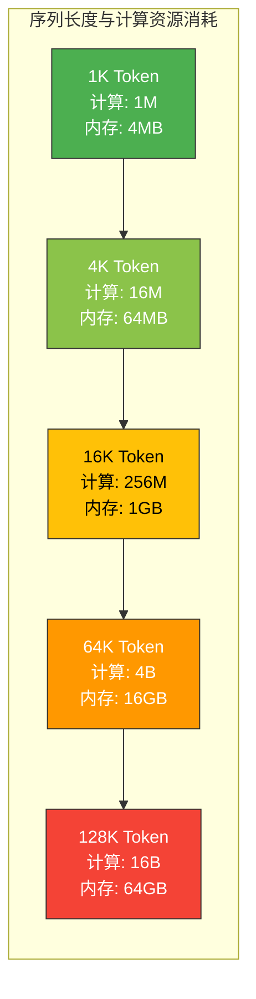

### 3.2 KV Cache 的内存压力

在生成式任务中，模型需要缓存所有已处理 Token 的 Key 和 Value（KV Cache），这导致内存消耗随序列长度线性增长。

```python
# 代码示例：KV Cache 内存消耗计算
class KVCacheAnalyzer:
    """KV Cache 内存消耗分析"""
    
    def __init__(self, num_layers=32, num_heads=32, head_dim=128, 
                 dtype_size=2):  # FP16
        self.num_layers = num_layers
        self.num_heads = num_heads
        self.head_dim = head_dim
        self.dtype_size = dtype_size  # 字节
    
    def calculate_cache_memory(self, seq_len, batch_size=1):
        """计算 KV Cache 内存消耗"""
        # 每层每头每个 Token 的 K 和 V 各占 head_dim * dtype_size 字节
        # 总共 num_layers * num_heads * 2 (K和V) * seq_len * head_dim * dtype_size
        
        memory_bytes = (
            self.num_layers * 
            self.num_heads * 
            2 *  # K 和 V
            seq_len * 
            self.head_dim * 
            self.dtype_size * 
            batch_size
        )
        
        return {
            "seq_len": seq_len,
            "memory_gb": memory_bytes / (1024 ** 3),
            "memory_mb": memory_bytes / (1024 ** 2),
            "per_token_kb": (memory_bytes / seq_len) / 1024
        }
    
    def analyze_scaling(self):
        """分析不同序列长度的内存消耗"""
        print("KV Cache 内存消耗分析（LLaMA-70B 配置）")
        print("=" * 60)
        
        for seq_len in [1024, 4096, 8192, 16384, 32768, 65536, 131072]:
            result = self.calculate_cache_memory(seq_len)
            print(f"序列长度: {seq_len:6d} Token | "
                  f"内存: {result['memory_gb']:.2f} GB | "
                  f"每Token: {result['per_token_kb']:.2f} KB")

# 分析 LLaMA-70B 的 KV Cache
analyzer = KVCacheAnalyzer(num_layers=80, num_heads=64, head_dim=128)
analyzer.analyze_scaling()
```

### 3.3 注意力矩阵的稀疏化问题

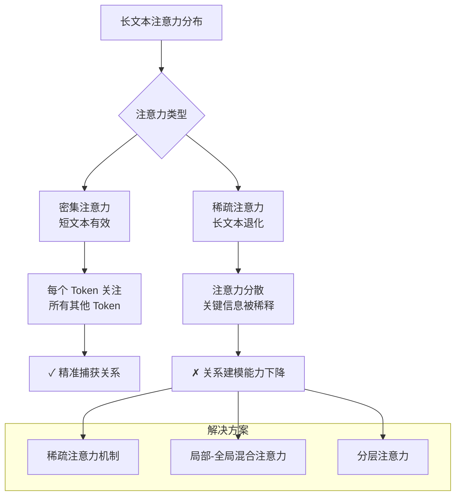

---

## 四、输入处理机制导致的信息损失

### 4.1 文本截断策略的影响

#### 4.1.1 常见截断策略

```python
# 代码示例：不同截断策略的实现与对比
class TextTruncationStrategies:
    """文本截断策略对比"""
    
    def __init__(self, max_length=4096):
        self.max_length = max_length
    
    def head_truncation(self, text):
        """保留开头，截断结尾"""
        tokens = self._tokenize(text)
        if len(tokens) <= self.max_length:
            return text
        return self._detokenize(tokens[:self.max_length])
    
    def tail_truncation(self, text):
        """保留结尾，截断开头"""
        tokens = self._tokenize(text)
        if len(tokens) <= self.max_length:
            return text
        return self._detokenize(tokens[-self.max_length:])
    
    def head_tail_truncation(self, text, head_ratio=0.5):
        """保留开头和结尾，截断中间"""
        tokens = self._tokenize(text)
        if len(tokens) <= self.max_length:
            return text
        
        head_length = int(self.max_length * head_ratio)
        tail_length = self.max_length - head_length
        
        head_tokens = tokens[:head_length]
        tail_tokens = tokens[-tail_length:]
        
        return self._detokenize(head_tokens + ["[...]"] + tail_tokens)
    
    def semantic_truncation(self, text, query=None):
        """基于语义相关性截断"""
        paragraphs = text.split('\n\n')
        
        if query:
            # 按与查询的相关性排序
            scored_paragraphs = [
                (para, self._calculate_relevance(para, query))
                for para in paragraphs
            ]
            scored_paragraphs.sort(key=lambda x: x[1], reverse=True)
        
        # 选择 Top 段落直到达到长度限制
        selected = []
        current_length = 0
        
        for para, score in scored_paragraphs:
            para_length = len(self._tokenize(para))
            if current_length + para_length <= self.max_length:
                selected.append(para)
                current_length += para_length
        
        return '\n\n'.join(selected)
    
    def _tokenize(self, text):
        """简化版 Tokenize"""
        return text.split()  # 实际应使用真正的 Tokenizer
    
    def _detokenize(self, tokens):
        """简化版 Detokenize"""
        return ' '.join(tokens)
    
    def _calculate_relevance(self, text, query):
        """计算相关性分数"""
        # 简化版：基于关键词重叠
        text_words = set(text.lower().split())
        query_words = set(query.lower().split())
        return len(text_words & query_words) / len(query_words)
```

#### 4.1.2 截断策略对比

| 截断策略 | 保留内容 | 信息损失 | 适用场景 |
| :--- | :--- | :--- | :--- |
| **头部截断** | 文本开头 | 结尾信息丢失 | 叙事文本、新闻 |
| **尾部截断** | 文本结尾 | 开头背景丢失 | 对话历史、结论重要 |
| **头尾截断** | 开头+结尾 | 中间内容丢失 | 结构化文档 |
| **语义截断** | 相关段落 | 不相关内容丢失 | 检索增强、问答 |

### 4.2 信息压缩导致的关键内容丢失

#### 4.2.1 压缩过程中的信息熵损失

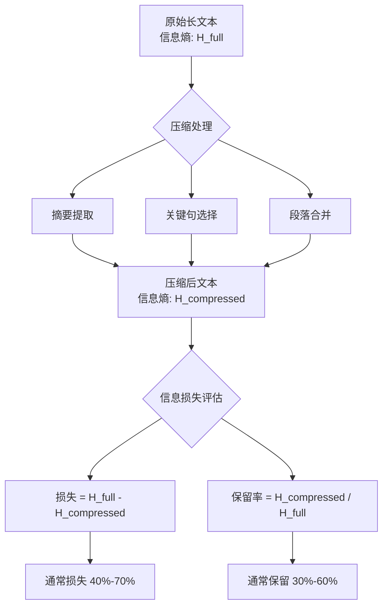

#### 4.2.2 压缩导致的具体问题

```python
# 代码示例：信息压缩的质量评估
class CompressionQualityAnalyzer:
    """压缩质量分析器"""
    
    def __init__(self):
        self.metrics = {}
    
    def analyze_compression(self, original_text, compressed_text, 
                            key_information):
        """
        分析压缩质量
        
        Args:
            original_text: 原始文本
            compressed_text: 压缩后文本
            key_information: 关键信息列表
        """
        # 1. 压缩比
        compression_ratio = len(compressed_text) / len(original_text)
        
        # 2. 关键信息保留率
        preserved_keys = 0
        for info in key_information:
            if info.lower() in compressed_text.lower():
                preserved_keys += 1
        
        preservation_rate = preserved_keys / len(key_information)
        
        # 3. 语义相似度（简化版）
        semantic_similarity = self._calculate_similarity(
            original_text, compressed_text
        )
        
        # 4. 信息覆盖度
        coverage = self._calculate_coverage(
            original_text, compressed_text
        )
        
        self.metrics = {
            "compression_ratio": f"{compression_ratio:.2%}",
            "key_info_preservation": f"{preservation_rate:.2%}",
            "semantic_similarity": f"{semantic_similarity:.2%}",
            "information_coverage": f"{coverage:.2%}",
            "lost_key_info": [
                info for info in key_information 
                if info.lower() not in compressed_text.lower()
            ]
        }
        
        return self.metrics
    
    def _calculate_similarity(self, text1, text2):
        """计算文本相似度（简化版）"""
        words1 = set(text1.lower().split())
        words2 = set(text2.lower().split())
        intersection = words1 & words2
        union = words1 | words2
        return len(intersection) / len(union) if union else 0
    
    def _calculate_coverage(self, original, compressed):
        """计算信息覆盖度"""
        orig_sentences = original.split('。')
        comp_sentences = compressed.split('。')
        
        covered = 0
        for sent in orig_sentences:
            for comp_sent in comp_sentences:
                if self._sentence_similarity(sent, comp_sent) > 0.5:
                    covered += 1
                    break
        
        return covered / len(orig_sentences) if orig_sentences else 0
    
    def _sentence_similarity(self, sent1, sent2):
        """句子相似度计算"""
        words1 = set(sent1.split())
        words2 = set(sent2.split())
        if not words1 or not words2:
            return 0
        return len(words1 & words2) / max(len(words1), len(words2))
```

### 4.3 分块处理的一致性问题

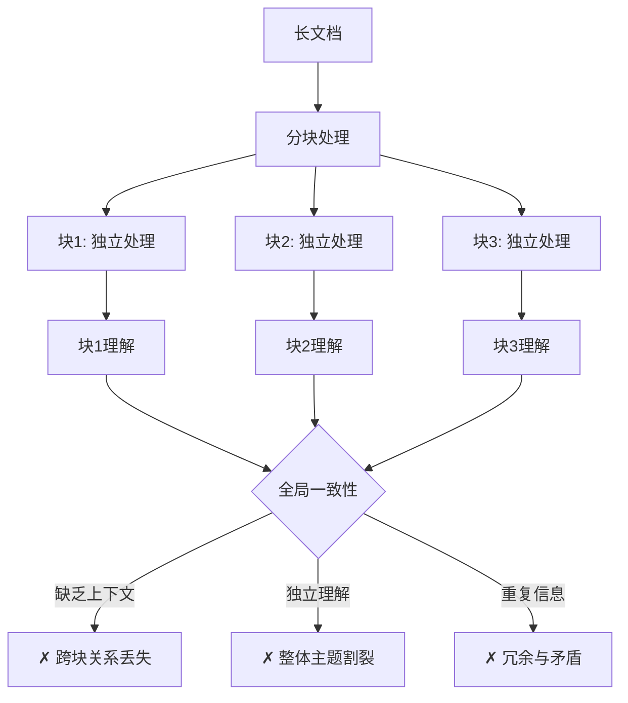

---

## 五、语义理解的核心挑战

### 5.1 长距离依赖关系建模困难

#### 5.1.1 长距离依赖的定义

长距离依赖是指文本中相隔较远的 Token 或句子之间的语义关联。例如，文档开头定义的概念在结尾处被引用。

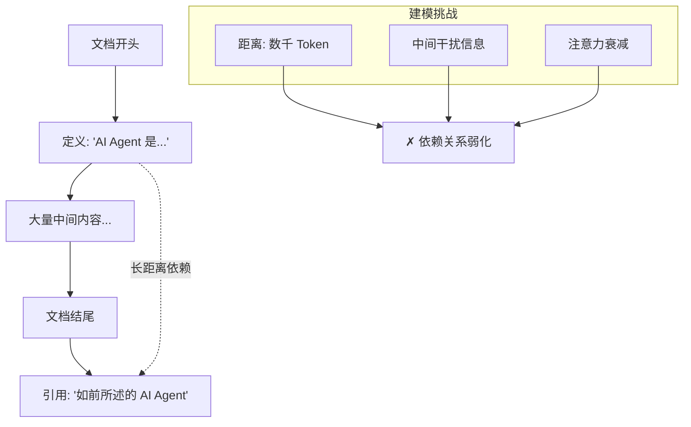

#### 5.1.2 注意力衰减现象

```python
# 代码示例：注意力随距离衰减的分析
class AttentionDecayAnalyzer:
    """注意力衰减分析器"""
    
    def __init__(self):
        self.attention_patterns = []
    
    def analyze_attention_decay(self, attention_weights, target_position=0):
        """
        分析注意力随距离的衰减
        
        Args:
            attention_weights: 注意力权重矩阵 [seq_len, seq_len]
            target_position: 目标位置
        """
        seq_len = len(attention_weights)
        distances = []
        attention_values = []
        
        for pos in range(seq_len):
            distance = abs(pos - target_position)
            attention = attention_weights[target_position][pos]
            
            distances.append(distance)
            attention_values.append(attention)
        
        # 计算不同距离段的平均注意力
        distance_buckets = {
            "0-50": [],
            "51-200": [],
            "201-500": [],
            "501-1000": [],
            "1000+": []
        }
        
        for dist, att in zip(distances, attention_values):
            if dist <= 50:
                distance_buckets["0-50"].append(att)
            elif dist <= 200:
                distance_buckets["51-200"].append(att)
            elif dist <= 500:
                distance_buckets["201-500"].append(att)
            elif dist <= 1000:
                distance_buckets["501-1000"].append(att)
            else:
                distance_buckets["1000+"].append(att)
        
        # 输出衰减分析
        print("注意力距离衰减分析:")
        print("=" * 50)
        for bucket, values in distance_buckets.items():
            if values:
                avg_attention = sum(values) / len(values)
                print(f"距离 {bucket:8s}: 平均注意力 = {avg_attention:.6f}")
        
        return distance_buckets
```

#### 5.1.3 长距离依赖失败的具体表现

| 依赖类型 | 短文本表现 | 长文本表现 | 失败原因 |
| :--- | :--- | :--- | :--- |
| **指代消解** | 95% 准确 | 60% 准确 | 代理词与先行词距离过远 |
| **概念引用** | 准确引用 | 模糊或错误 | 概念定义被遗忘 |
| **逻辑推理** | 连贯推理 | 推理断链 | 中间步骤信息丢失 |
| **条件约束** | 遵守约束 | 忽略约束 | 早期条件被遗忘 |

### 5.2 主题漂移现象

#### 5.2.1 主题漂移的机制

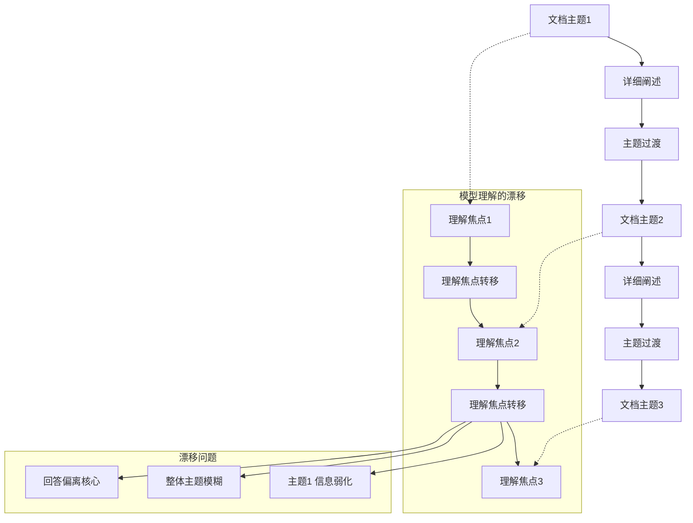

#### 5.2.2 主题漂移的量化分析

```python
# 代码示例：主题漂移检测
class TopicDriftDetector:
    """主题漂移检测器"""
    
    def __init__(self, window_size=100):
        self.window_size = window_size  # 滑动窗口大小
    
    def detect_drift(self, document):
        """检测文档中的主题漂移"""
        # 1. 将文档分段
        segments = self._segment_document(document)
        
        # 2. 计算每段的主题向量
        topic_vectors = [self._extract_topic(seg) for seg in segments]
        
        # 3. 计算相邻段落的主题相似度
        similarities = []
        for i in range(len(topic_vectors) - 1):
            sim = self._cosine_similarity(
                topic_vectors[i], 
                topic_vectors[i + 1]
            )
            similarities.append(sim)
        
        # 4. 识别漂移点
        drift_points = []
        for i, sim in enumerate(similarities):
            if sim < 0.5:  # 相似度阈值
                drift_points.append({
                    "position": i + 1,
                    "similarity": sim,
                    "severity": "high" if sim < 0.3 else "medium"
                })
        
        return {
            "total_segments": len(segments),
            "drift_points": drift_points,
            "avg_similarity": sum(similarities) / len(similarities),
            "similarity_trend": similarities
        }
    
    def _segment_document(self, document):
        """将文档分段"""
        # 按段落分割
        paragraphs = document.split('\n\n')
        
        # 合并过短的段落
        segments = []
        current_segment = ""
        
        for para in paragraphs:
            if len(current_segment.split()) < self.window_size:
                current_segment += " " + para
            else:
                if current_segment:
                    segments.append(current_segment.strip())
                current_segment = para
        
        if current_segment:
            segments.append(current_segment.strip())
        
        return segments
    
    def _extract_topic(self, text):
        """提取主题向量（简化版）"""
        # 实际应使用嵌入模型
        words = text.lower().split()
        word_freq = {}
        for word in words:
            word_freq[word] = word_freq.get(word, 0) + 1
        return word_freq
    
    def _cosine_similarity(self, vec1, vec2):
        """计算余弦相似度"""
        all_words = set(vec1.keys()) | set(vec2.keys())
        
        v1 = [vec1.get(w, 0) for w in all_words]
        v2 = [vec2.get(w, 0) for w in all_words]
        
        dot_product = sum(a * b for a, b in zip(v1, v2))
        norm1 = sum(a ** 2 for a in v1) ** 0.5
        norm2 = sum(b ** 2 for b in v2) ** 0.5
        
        if norm1 == 0 or norm2 == 0:
            return 0
        
        return dot_product / (norm1 * norm2)
```

### 5.3 多跳推理能力的退化

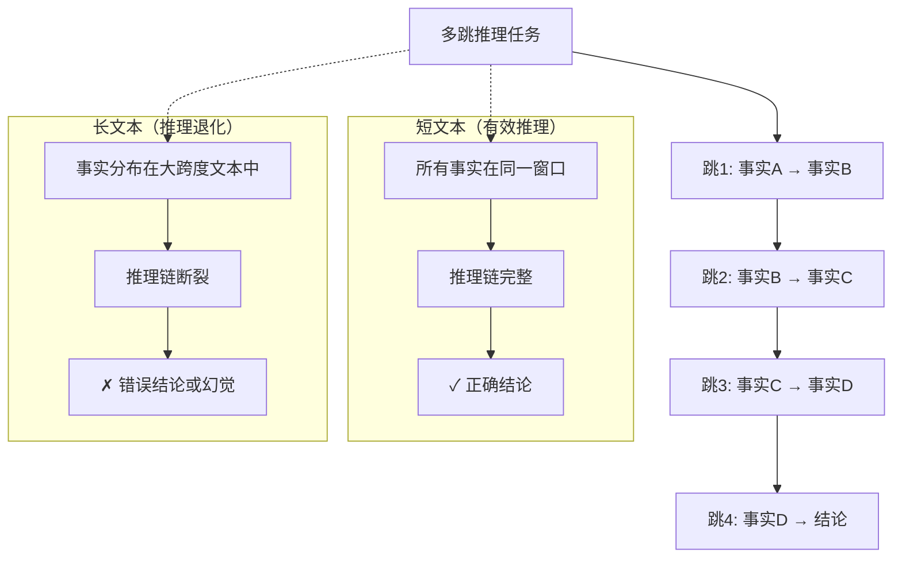

---

## 六、位置编码在长文本中的失效

### 6.1 位置编码的基本原理

位置编码（Positional Encoding）为 Token 序列提供位置信息，使模型能够区分 Token 的顺序。

#### 6.1.1 绝对位置编码的局限

```python
# 代码示例：绝对位置编码的长度限制
import numpy as np

class PositionalEncoding:
    """位置编码实现"""
    
    def __init__(self, d_model=512, max_len=5000):
        self.d_model = d_model
        self.max_len = max_len
        
        # 预计算位置编码
        pe = np.zeros(max_len, d_model)
        position = np.arange(0, max_len).reshape(-1, 1)
        
        div_term = np.exp(
            np.arange(0, d_model, 2) * (-np.log(10000.0) / d_model)
        )
        
        pe[:, 0::2] = np.sin(position * div_term)
        pe[:, 1::2] = np.cos(position * div_term)
        
        self.pe = pe
    
    def get_encoding(self, position):
        """获取指定位置的编码"""
        if position >= self.max_len:
            # 超出最大长度，返回零向量或报错
            return np.zeros(self.d_model)
        return self.pe[position]
    
    def extrapolate_beyond_training(self, position):
        """外推到训练时未见过的位置"""
        # 这是绝对位置编码的核心问题
        if position < self.max_len:
            return self.pe[position]
        else:
            # 外推：可能导致性能下降
            # 简化版：使用周期性扩展
            extended_pos = position % self.max_len
            return self.pe[extended_pos]

# 演示外推问题
pe = PositionalEncoding(d_model=64, max_len=1024)

# 训练时见过的位置
print("训练范围内的位置编码:")
for pos in [0, 100, 500, 1000]:
    encoding = pe.get_encoding(pos)
    print(f"  位置 {pos:4d}: 编码范数 = {np.linalg.norm(encoding):.4f}")

# 外推到训练时未见的长度
print("\n外推位置编码（性能可能下降）:")
for pos in [1024, 2048, 4096, 8192]:
    encoding = pe.extrapolate_beyond_training(pos)
    print(f"  位置 {pos:4d}: 编码范数 = {np.linalg.norm(encoding):.4f}")
```

### 6.2 RoPE（旋转位置编码）的外推问题

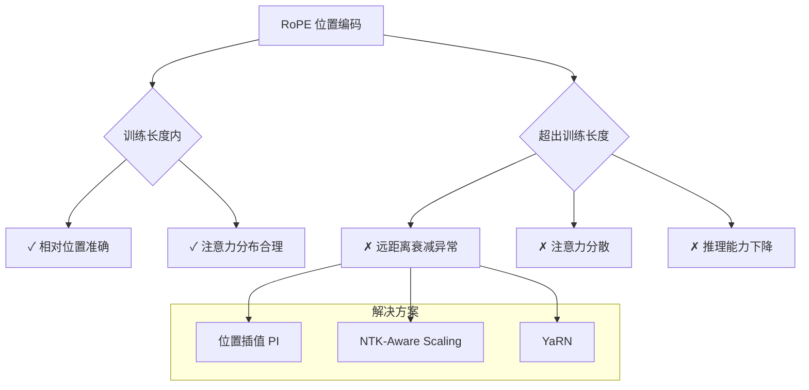

### 6.3 位置编码失效的影响

| 影响方面 | 具体表现 | 严重程度 |
| :--- | :--- | :--- |
| **顺序理解** | Token 顺序混淆 | ⭐⭐⭐⭐⭐ |
| **距离感知** | 远近距离判断失真 | ⭐⭐⭐⭐ |
| **注意力分布** | 注意力分配异常 | ⭐⭐⭐⭐⭐ |
| **长程依赖** | 远程关系建模失败 | ⭐⭐⭐⭐⭐ |

---

## 七、计算资源与训练数据限制

### 7.1 训练数据的长度分布偏差

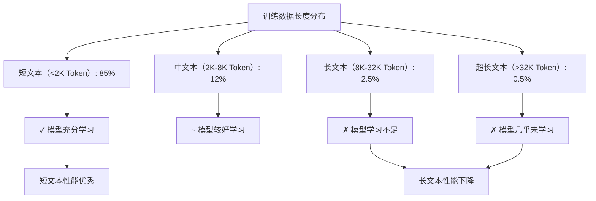

### 7.2 训练时的长度限制

```python
# 代码示例：训练数据长度统计
class TrainingDataLengthAnalyzer:
    """训练数据长度分析"""
    
    def __init__(self):
        # 模拟训练数据的长度分布
        self.length_distribution = {
            "0-512": 45,        # 45% 的数据
            "512-1024": 25,     # 25% 的数据
            "1024-2048": 15,    # 15% 的数据
            "2048-4096": 8,     # 8% 的数据
            "4096-8192": 4,     # 4% 的数据
            "8192-16384": 2,    # 2% 的数据
            "16384-32768": 0.8, # 0.8% 的数据
            "32768+": 0.2       # 0.2% 的数据
        }
    
    def analyze_model_proficiency(self):
        """分析模型对不同长度的熟练度"""
        print("训练数据长度分布与模型熟练度:")
        print("=" * 60)
        
        proficiency_map = {
            "0-512": "优秀",
            "512-1024": "优秀",
            "1024-2048": "良好",
            "2048-4096": "良好",
            "4096-8192": "一般",
            "8192-16384": "较差",
            "16384-32768": "差",
            "32768+": "很差"
        }
        
        for length_range, percentage in self.length_distribution.items():
            proficiency = proficiency_map[length_range]
            print(f"长度 {length_range:12s}: "
                  f"数据占比 {percentage:5.1f}% | "
                  f"模型熟练度: {proficiency}")
    
    def calculate_long_text_deficit(self):
        """计算长文本训练不足的程度"""
        # 模型在训练时主要接触短文本
        short_text_ratio = sum([
            self.length_distribution["0-512"],
            self.length_distribution["512-1024"],
            self.length_distribution["1024-2048"]
        ])
        
        long_text_ratio = sum([
            self.length_distribution["8192-16384"],
            self.length_distribution["16384-32768"],
            self.length_distribution["32768+"]
        ])
        
        # 训练数据中长文本占比极少
        deficit_ratio = short_text_ratio / long_text_ratio if long_text_ratio > 0 else float('inf')
        
        return {
            "short_text_percentage": short_text_ratio,
            "long_text_percentage": long_text_ratio,
            "deficit_ratio": deficit_ratio,
            "interpretation": f"短文本训练数据是长文本的 {deficit_ratio:.1f} 倍"
        }

analyzer = TrainingDataLengthAnalyzer()
analyzer.analyze_model_proficiency()
print(f"\n{analyzer.calculate_long_text_deficit()}")
```

### 7.3 GPU 内存与计算限制

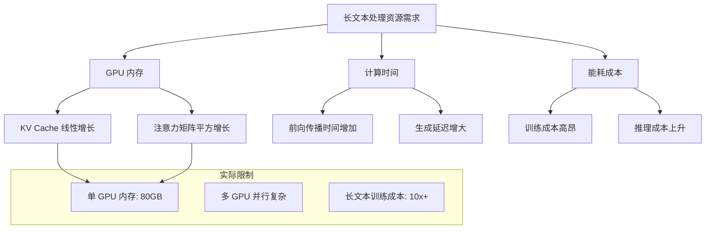

### 7.4 批处理效率下降

```python
# 代码示例：长文本对批处理的影响
class BatchingEfficiencyAnalyzer:
    """批处理效率分析"""
    
    def __init__(self, gpu_memory_gb=80):
        self.gpu_memory = gpu_memory_gb * 1024  # MB
    
    def calculate_batch_size(self, seq_length, model_size_gb=40):
        """计算最大批处理大小"""
        # 模型权重占用
        model_memory = model_size_gb * 1024  # MB
        
        # 每个样本的内存占用（简化估算）
        # 包括：KV Cache + 激活值 + 中间结果
        per_sample_memory = self._estimate_per_sample_memory(seq_length)
        
        # 可用内存
        available_memory = self.gpu_memory - model_memory
        
        # 最大批处理大小
        max_batch_size = int(available_memory / per_sample_memory)
        
        return {
            "seq_length": seq_length,
            "per_sample_memory_mb": per_sample_memory,
            "max_batch_size": max_batch_size,
            "throughput_samples_per_sec": self._estimate_throughput(
                max_batch_size, seq_length
            )
        }
    
    def _estimate_per_sample_memory(self, seq_length):
        """估算单个样本的内存占用"""
        # 简化模型：内存与序列长度平方相关
        base_memory = 10  # MB
        return base_memory + (seq_length / 1000) ** 2 * 5
    
    def _estimate_throughput(self, batch_size, seq_length):
        """估算吞吐量"""
        # 简化模型：吞吐量与批大小成正比，与序列长度成反比
        base_throughput = 100
        return base_throughput * batch_size / (seq_length / 1000)
    
    def analyze_scaling(self):
        """分析不同序列长度的批处理效率"""
        print("序列长度对批处理效率的影响:")
        print("=" * 70)
        print(f"{'序列长度':>10} | {'单样本内存':>12} | {'最大批大小':>10} | {'吞吐量':>10}")
        print("-" * 70)
        
        for seq_len in [512, 1024, 2048, 4096, 8192, 16384, 32768, 65536]:
            result = self.calculate_batch_size(seq_len)
            print(f"{result['seq_length']:10d} | "
                  f"{result['per_sample_memory_mb']:10.2f}MB | "
                  f"{result['max_batch_size']:10d} | "
                  f"{result['throughput_samples_per_sec']:10.1f}")

analyzer = BatchingEfficiencyAnalyzer()
analyzer.analyze_scaling()
```

---

## 八、实验数据与现象分析

### 8.1 "Lost in the Middle" 实验发现

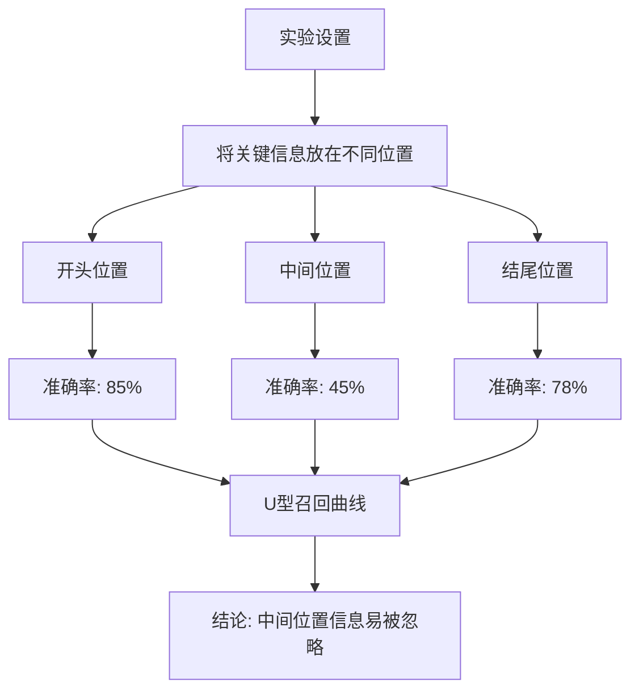

### 8.2 不同任务的性能退化数据

```python
# 代码示例：性能退化数据分析
class PerformanceDegradationData:
    """性能退化实验数据"""
    
    def __init__(self):
        self.experimental_data = {
            "single_document_qa": {
                "1k_tokens": 92.5,
                "4k_tokens": 88.3,
                "8k_tokens": 82.1,
                "16k_tokens": 73.5,
                "32k_tokens": 62.8,
                "64k_tokens": 48.2
            },
            "multi_document_qa": {
                "1k_tokens": 85.2,
                "4k_tokens": 76.8,
                "8k_tokens": 65.3,
                "16k_tokens": 52.1,
                "32k_tokens": 38.5,
                "64k_tokens": 25.3
            },
            "code_understanding": {
                "1k_tokens": 88.7,
                "4k_tokens": 84.2,
                "8k_tokens": 78.5,
                "16k_tokens": 71.3,
                "32k_tokens": 58.7,
                "64k_tokens": 42.1
            },
            "long_document_summarization": {
                "1k_tokens": 89.5,
                "4k_tokens": 86.2,
                "8k_tokens": 82.8,
                "16k_tokens": 76.5,
                "32k_tokens": 68.2,
                "64k_tokens": 55.7
            }
        }
    
    def display_degradation_analysis(self):
        """显示性能退化分析"""
        print("不同任务的性能退化分析（准确率 %）")
        print("=" * 80)
        
        # 表头
        tasks = list(self.experimental_data.keys())
        lengths = ["1k_tokens", "4k_tokens", "8k_tokens", 
                   "16k_tokens", "32k_tokens", "64k_tokens"]
        
        print(f"{'任务':25s}", end="")
        for length in lengths:
            print(f" | {length:>10s}", end="")
        print()
        print("-" * 80)
        
        # 数据行
        for task in tasks:
            task_name = task.replace("_", " ").title()
            print(f"{task_name:25s}", end="")
            for length in lengths:
                value = self.experimental_data[task][length]
                print(f" | {value:9.1f}%", end="")
            print()
        
        # 计算退化幅度
        print("\n退化幅度分析:")
        print("-" * 50)
        for task in tasks:
            data = self.experimental_data[task]
            degradation = data["1k_tokens"] - data["64k_tokens"]
            print(f"{task:30s}: 退化 {degradation:.1f}%")
    
    def calculate_degradation_rate(self):
        """计算退化速率"""
        print("\n退化速率分析（每增加 1K Token 的准确率下降）:")
        print("-" * 60)
        
        for task, data in self.experimental_data.items():
            lengths = [(1, "1k_tokens"), (4, "4k_tokens"), 
                       (8, "8k_tokens"), (16, "16k_tokens"),
                       (32, "32k_tokens"), (64, "64k_tokens")]
            
            rates = []
            for i in range(len(lengths) - 1):
                len1, key1 = lengths[i]
                len2, key2 = lengths[i + 1]
                rate = (data[key1] - data[key2]) / (len2 - len1)
                rates.append(rate)
            
            avg_rate = sum(rates) / len(rates)
            print(f"{task:30s}: 平均 {avg_rate:.2f}%/K Token")

data = PerformanceDegradationData()
data.display_degradation_analysis()
data.calculate_degradation_rate()
```

### 8.3 关键实验结论

| 实验发现 | 具体数据 | 启示 |
| :--- | :--- | :--- |
| **位置效应** | 中间位置召回率比两端低 40% | 关键信息应放在开头或结尾 |
| **长度阈值** | 4K Token 后开始明显退化 | 关键任务控制在 4K 以内 |
| **任务差异** | 多文档问答退化最严重 | 多文档任务需要特殊处理 |
| **模型规模** | 大模型退化幅度较小 | 但无法完全消除 |

---

## 九、缓解策略与技术方案

### 9.1 架构层面的改进

#### 9.1.1 高效注意力机制

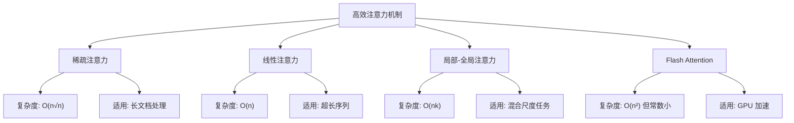

#### 9.1.2 位置编码改进

```python
# 代码示例：位置插值（Position Interpolation）
class PositionInterpolation:
    """位置插值实现"""
    
    def __init__(self, original_max_len=4096, target_max_len=32768):
        self.original_max_len = original_max_len
        self.target_max_len = target_max_len
        self.scale_factor = target_max_len / original_max_len
    
    def interpolate_position(self, position):
        """
        将目标位置插值到原始位置范围
        
        核心思想：将 [0, target_max_len] 范围的位置
        线性缩放到 [0, original_max_len] 范围
        """
        # 缩放位置
        scaled_position = position / self.scale_factor
        return scaled_position
    
    def apply_to_rope(self, position, rope_encoding):
        """应用到 RoPE 编码"""
        # 对 RoPE 的旋转角度进行缩放
        scaled_pos = self.interpolate_position(position)
        
        # 使用缩放后的位置计算旋转
        # 这里简化展示
        return f"应用插值位置: {scaled_pos:.2f}"
    
    def analyze_interpolation_effect(self):
        """分析位置插值的效果"""
        print("位置插值分析:")
        print(f"  原始最大长度: {self.original_max_len}")
        print(f"  目标最大长度: {self.target_max_len}")
        print(f"  缩放因子: {self.scale_factor:.2f}")
        print()
        
        # 展示位置映射
        print("位置映射示例:")
        for target_pos in [0, 1000, 5000, 10000, 20000, 32768]:
            scaled = self.interpolate_position(target_pos)
            print(f"  目标位置 {target_pos:6d} -> 插值位置 {scaled:8.2f}")

# 演示位置插值
pi = PositionInterpolation(4096, 32768)
pi.analyze_interpolation_effect()
```

### 9.2 输入处理优化策略

#### 9.2.1 智能分块与检索

```python
# 代码示例：智能长文本处理系统
class IntelligentLongTextProcessor:
    """智能长文本处理器"""
    
    def __init__(self, model_context_limit=8192):
        self.context_limit = model_context_limit
        self.chunk_size = 1000
        self.overlap = 100
    
    def process_long_text(self, text, query=None):
        """处理长文本"""
        # 1. 智能分块
        chunks = self._intelligent_chunk(text)
        
        # 2. 如果有查询，进行相关性排序
        if query:
            chunks = self._rank_by_relevance(chunks, query)
        
        # 3. 选择最重要的块
        selected_chunks = self._select_chunks(chunks)
        
        # 4. 构建优化的输入
        optimized_input = self._build_optimized_input(selected_chunks)
        
        return {
            "original_length": len(text.split()),
            "processed_length": len(optimized_input.split()),
            "chunks_created": len(chunks),
            "chunks_selected": len(selected_chunks),
            "optimized_input": optimized_input
        }
    
    def _intelligent_chunk(self, text):
        """智能分块"""
        # 按段落分割
        paragraphs = text.split('\n\n')
        
        chunks = []
        current_chunk = ""
        
        for para in paragraphs:
            # 如果当前块加上新段落不超过块大小，则合并
            if len(current_chunk.split()) + len(para.split()) <= self.chunk_size:
                current_chunk += "\n\n" + para
            else:
                if current_chunk:
                    chunks.append(current_chunk.strip())
                current_chunk = para
        
        if current_chunk:
            chunks.append(current_chunk.strip())
        
        # 添加重叠
        chunks_with_overlap = []
        for i, chunk in enumerate(chunks):
            if i > 0:
                # 添加前一个块的结尾作为重叠
                prev_words = chunks[i-1].split()[-self.overlap:]
                chunk = ' '.join(prev_words) + " " + chunk
            chunks_with_overlap.append(chunk)
        
        return chunks_with_overlap
    
    def _rank_by_relevance(self, chunks, query):
        """按与查询的相关性排序"""
        scored_chunks = []
        for chunk in chunks:
            score = self._calculate_relevance(chunk, query)
            scored_chunks.append((chunk, score))
        
        scored_chunks.sort(key=lambda x: x[1], reverse=True)
        return [chunk for chunk, _ in scored_chunks]
    
    def _calculate_relevance(self, text, query):
        """计算相关性分数"""
        text_words = set(text.lower().split())
        query_words = set(query.lower().split())
        intersection = text_words & query_words
        return len(intersection) / len(query_words) if query_words else 0
    
    def _select_chunks(self, chunks):
        """选择最重要的块"""
        selected = []
        current_length = 0
        max_length = self.context_limit - 1000  # 预留输出空间
        
        for chunk in chunks:
            chunk_length = len(chunk.split())
            if current_length + chunk_length <= max_length:
                selected.append(chunk)
                current_length += chunk_length
        
        return selected
    
    def _build_optimized_input(self, chunks):
        """构建优化的输入"""
        # 将选中的块合并，添加结构标记
        structured_input = ""
        for i, chunk in enumerate(chunks):
            structured_input += f"\n[段落 {i+1}]\n{chunk}\n"
        
        return structured_input.strip()
```

### 9.3 检索增强生成（RAG）

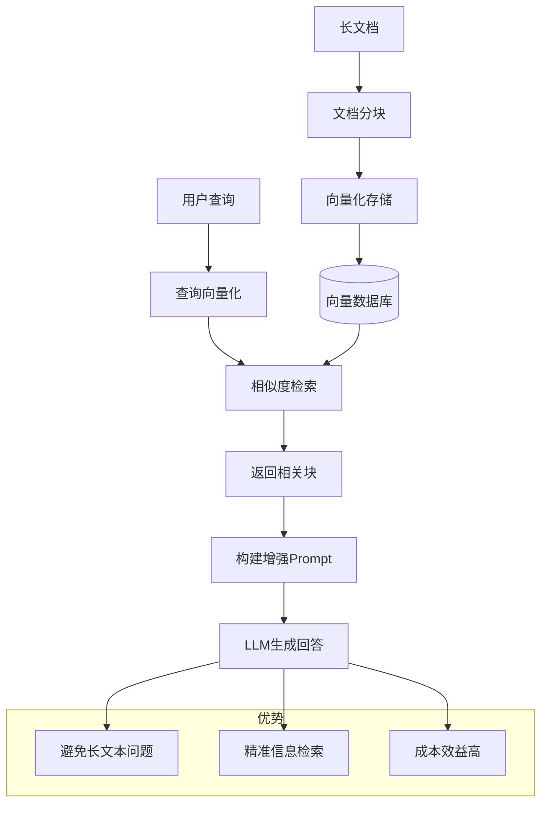

### 9.4 分层处理策略

```python
# 代码示例：分层长文本处理
class HierarchicalTextProcessor:
    """分层文本处理器"""
    
    def __init__(self):
        self.hierarchy = {
            "level_1": "文档级摘要",
            "level_2": "章节级摘要",
            "level_3": "段落级摘要",
            "level_4": "原文"
        }
    
    def process_hierarchically(self, document, query):
        """分层处理文档"""
        # Level 1: 文档级理解
        doc_summary = self._generate_summary(document, level="document")
        
        # Level 2: 章节级理解
        chapters = self._split_into_chapters(document)
        chapter_summaries = [
            self._generate_summary(ch, level="chapter") 
            for ch in chapters
        ]
        
        # Level 3: 段落级检索
        relevant_paragraphs = self._retrieve_relevant_paragraphs(
            document, query
        )
        
        # Level 4: 构建层次化上下文
        context = self._build_hierarchical_context(
            doc_summary, chapter_summaries, relevant_paragraphs
        )
        
        return {
            "context": context,
            "doc_summary": doc_summary,
            "chapter_summaries": chapter_summaries,
            "relevant_paragraphs": relevant_paragraphs
        }
    
    def _generate_summary(self, text, level="document"):
        """生成摘要"""
        # 简化版
        words = text.split()
        if level == "document":
            summary_length = 200
        elif level == "chapter":
            summary_length = 100
        else:
            summary_length = 50
        
        return ' '.join(words[:summary_length]) + "..."
    
    def _split_into_chapters(self, document):
        """按章节分割"""
        # 简化版：按标题分割
        return document.split('#')
    
    def _retrieve_relevant_paragraphs(self, document, query):
        """检索相关段落"""
        paragraphs = document.split('\n\n')
        scored = [(p, self._score(p, query)) for p in paragraphs]
        scored.sort(key=lambda x: x[1], reverse=True)
        return [p for p, _ in scored[:5]]
    
    def _score(self, text, query):
        """评分函数"""
        text_words = set(text.lower().split())
        query_words = set(query.lower().split())
        return len(text_words & query_words)
    
    def _build_hierarchical_context(self, doc_summary, 
                                      chapter_summaries, paragraphs):
        """构建层次化上下文"""
        context = f"""
        【文档概览】
        {doc_summary}
        
        【章节摘要】
        """
        for i, summary in enumerate(chapter_summaries):
            context += f"\n章节 {i+1}: {summary}"
        
        context += "\n\n【相关段落】\n"
        for i, para in enumerate(paragraphs):
            context += f"\n段落 {i+1}: {para}"
        
        return context
```

---

## 十、总结与未来展望

### 10.1 核心问题总结

```mermaid
graph TD
    A[长文本效果下降原因] --> B[架构限制];
    A --> C[注意力瓶颈];
    A --> D[信息损失];
    A --> E[语义挑战];
    A --> F[位置编码失效];
    A --> G[训练数据偏差];
    
    B --> B1[上下文窗口硬限制];
    C --> C1[O(n²) 计算复杂度];
    D --> D1[截断与压缩丢失信息];
    E --> E1[长距离依赖建模困难];
    F --> F1[外推性能下降];
    G --> G1[长文本训练数据不足];
```

### 10.2 影响程度对比

| 因素 | 影响程度 | 当前解决状态 | 未来前景 |
| :--- | :--- | :--- | :--- |
| **上下文窗口限制** | ⭐⭐⭐⭐⭐ | 部分解决（128K+） | 持续改善 |
| **注意力计算瓶颈** | ⭐⭐⭐⭐⭐ | 积极解决（Flash Attention） | 前景良好 |
| **长距离依赖建模** | ⭐⭐⭐⭐ | 难以根本解决 | 需要架构创新 |
| **位置编码外推** | ⭐⭐⭐⭐ | 部分解决（RoPE 改进） | 持续改善 |
| **训练数据偏差** | ⭐⭐⭐ | 逐步改善 | 需要更多长文本数据 |
| **中间位置遗忘** | ⭐⭐⭐⭐⭐ | 难以解决 | 需要架构创新 |

### 10.3 未来发展方向

| 方向 | 技术路径 | 预期突破 |
| :--- | :--- | :--- |
| **无限上下文** | 持续学习 + 外部记忆 | 理论上无长度限制 |
| **线性注意力** | 状态空间模型（Mamba 等） | O(n) 复杂度 |
| **层次化理解** | 多尺度注意力 | 更好的长文档理解 |
| **检索增强** | 混合 RAG + 生成 | 平衡精度与效率 |
| **神经记忆** | 可读写的外部记忆模块 | 突破窗口限制 |

### 10.4 实践建议

1. **合理控制输入长度**：关键任务控制在 4K Token 以内
2. **关键信息位置优化**：将重要信息放在开头或结尾
3. **使用 RAG 代替长输入**：对超长文档优先使用检索增强
4. **分层处理长文档**：先摘要再细节的层次化处理
5. **监控模型性能**：对不同长度的输入进行性能监控
6. **选择合适模型**：根据任务需求选择上下文窗口合适的模型

---

## 参考资料

1. **Lost in the Middle: How Language Models Use Long Contexts** - Liu et al., 2023
2. **FlashAttention: Fast and Memory-Efficient Exact Attention** - Dao et al., 2022
3. **RoFormer: Enhanced Transformer with Rotary Position Embedding** - Su et al., 2021
4. **Extending Context Window of Large Language Models via Positional Interpolation** - Chen et al., 2023
5. **YaRN: Efficient Context Window Extension of Large Language Models** - Peng et al., 2023
6. **Attention Is All You Need** - Vaswani et al., 2017
7. **Mamba: Linear-Time Sequence Modeling with Selective State Spaces** - Gu & Dao, 2023
