# 大模型推理过程深度解析：从输入到输出的完整流程

## 目录

- [一、推理过程概述](#一推理过程概述)
- [二、推理的核心原理](#二推理的核心原理)
- [三、推理的主要步骤](#三推理的主要步骤)
- [四、关键技术详解](#四关键技术详解)
- [五、常见算法与实现](#五常见算法与实现)
- [六、推理优化策略](#六推理优化策略)
- [七、实际应用场景](#七实际应用场景)
- [八、总结与展望](#八总结与展望)
- [参考资料](#参考资料)

---

## 一、推理过程概述

### 1.1 什么是大模型推理

大模型推理（Inference）是指将训练好的大语言模型（LLM）应用于实际场景，对输入文本进行处理并生成输出的过程。它是从"模型学习"到"模型应用"的关键环节。

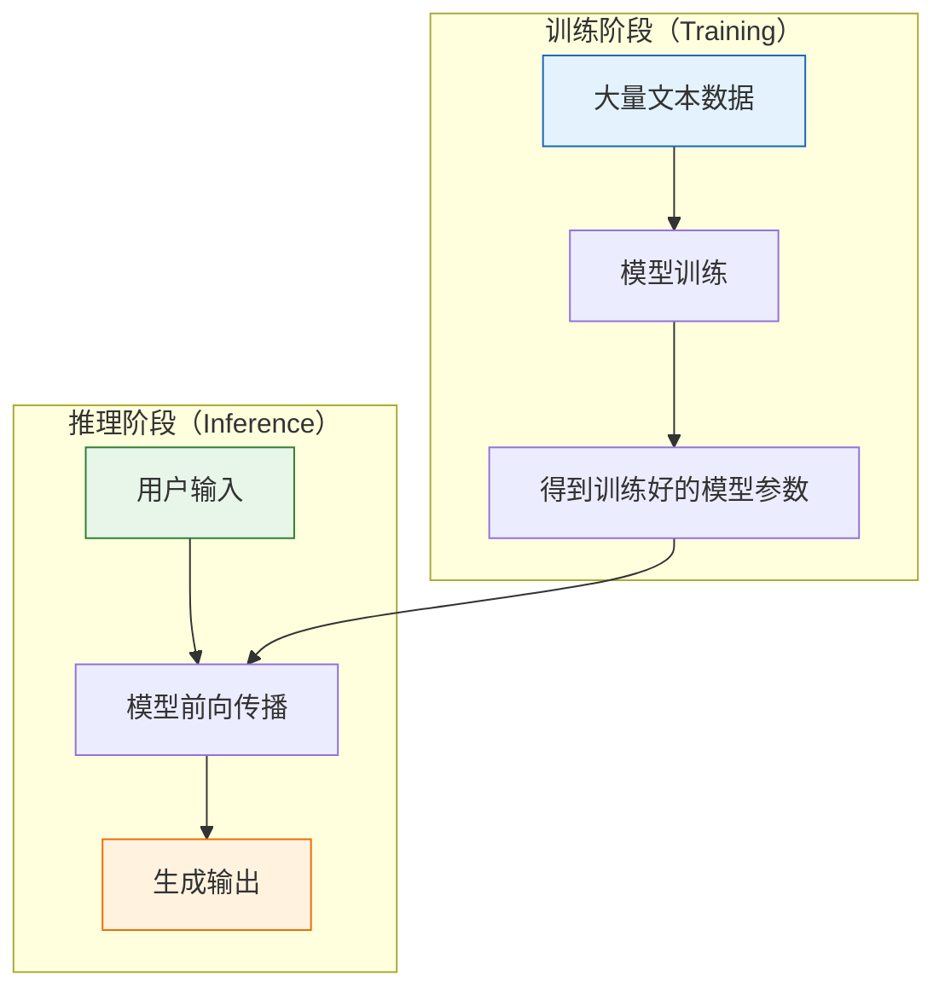

### 1.2 推理的重要性

| 维度 | 说明 |
| :--- | :--- |
| **响应速度** | 直接影响用户体验，是实时应用的核心指标 |
| **计算资源** | 决定部署成本和可扩展性 |
| **输出质量** | 影响产品可用性和用户满意度 |
| **吞吐量** | 决定系统能同时服务的用户数量 |

### 1.3 推理的两种主要模式

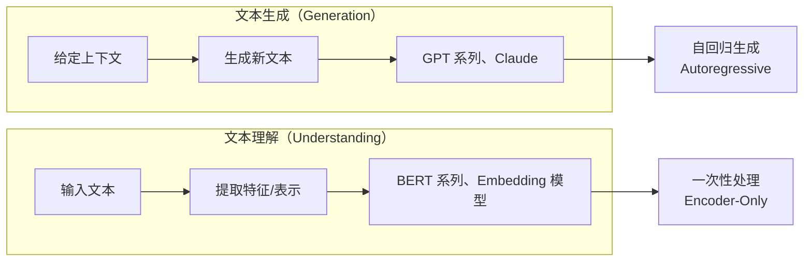

---

## 二、推理的核心原理

### 2.1 前向传播机制

#### 2.1.1 基本流程

前向传播（Forward Propagation）是推理的核心计算过程，数据从输入层经过各层处理最终产生输出。

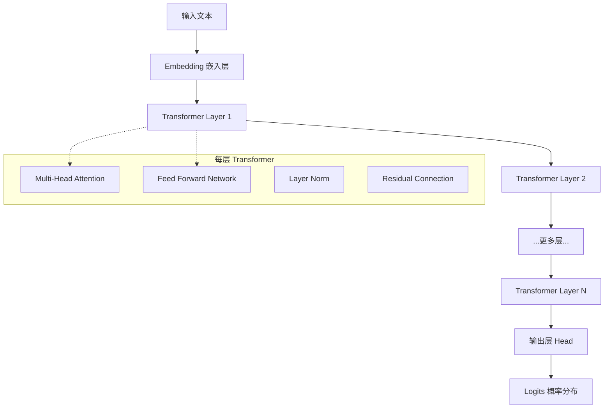

#### 2.1.2 计算过程详解

```python
# 代码示例：前向传播的简化实现
import torch
import torch.nn as nn
import torch.nn.functional as F

class SimplifiedTransformerBlock(nn.Module):
    """简化的 Transformer Block"""
    
    def __init__(self, d_model=512, num_heads=8, d_ff=2048):
        super().__init__()
        self.attention = nn.MultiheadAttention(d_model, num_heads, batch_first=True)
        self.feed_forward = nn.Sequential(
            nn.Linear(d_model, d_ff),
            nn.GELU(),
            nn.Linear(d_ff, d_model)
        )
        self.norm1 = nn.LayerNorm(d_model)
        self.norm2 = nn.LayerNorm(d_model)
    
    def forward(self, x):
        # 自注意力 + 残差连接 + 层归一化
        attn_out, _ = self.attention(x, x, x)
        x = self.norm1(x + attn_out)
        
        # 前馈网络 + 残差连接 + 层归一化
        ff_out = self.feed_forward(x)
        x = self.norm2(x + ff_out)
        
        return x

class LLModelInference:
    """大模型推理核心类"""
    
    def __init__(self, vocab_size=50000, d_model=4096, num_layers=32):
        self.embedding = nn.Embedding(vocab_size, d_model)
        self.transformer_layers = nn.ModuleList([
            SimplifiedTransformerBlock(d_model) 
            for _ in range(num_layers)
        ])
        self.output_head = nn.Linear(d_model, vocab_size)
    
    def forward_pass(self, input_ids):
        """
        前向传播
        
        Args:
            input_ids: 输入 Token ID [batch_size, seq_len]
            
        Returns:
            logits: 预测概率分布 [batch_size, seq_len, vocab_size]
        """
        # 1. Embedding 层
        x = self.embedding(input_ids)  # [batch, seq_len, d_model]
        
        # 2. 经过所有 Transformer 层
        for layer in self.transformer_layers:
            x = layer(x)
        
        # 3. 输出层
        logits = self.output_head(x)  # [batch, seq_len, vocab_size]
        
        return logits
```

### 2.2 自回归生成原理

#### 2.2.1 自回归特性

自回归生成（Autoregressive Generation）是大语言模型的核心生成方式，即模型基于已生成的内容预测下一个 Token，逐步生成完整文本。

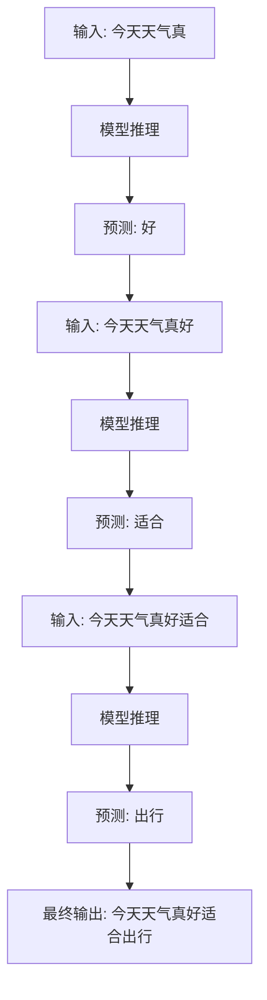

#### 2.2.2 自回归生成的特点

| 特点 | 说明 |
| :--- | :--- |
| **顺序生成** | 必须一个 Token 一个 Token 地生成 |
| **上下文依赖** | 每个 Token 的生成都依赖之前的所有内容 |
| **不可并行** | 生成过程必须串行执行 |
| **累积延迟** | 长文本生成的总延迟 = 每步延迟 × Token 数 |

### 2.3 概率生成模型

#### 2.3.1 概率建模

大模型本质上是在建模文本的条件概率分布：

$$
P(\text{text}) = P(\text{token}_1) \times P(\text{token}_2 | \text{token}_1) \times \cdots \times P(\text{token}_n | \text{token}_1, \ldots, \text{token}_{n-1})
$$

```python
# 代码示例：概率生成过程
def autoregressive_generate(model, prompt, max_length=100, temperature=1.0):
    """
    自回归文本生成
    
    Args:
        model: 语言模型
        prompt: 初始提示文本
        max_length: 最大生成长度
        temperature: 温度参数，控制随机性
        
    Returns:
        生成的 Token 序列
    """
    generated_tokens = prompt.copy()
    
    for step in range(max_length):
        # 1. 前向传播获取 Logits
        logits = model.forward_pass(generated_tokens)
        
        # 2. 获取最后位置的 Logits
        last_logits = logits[:, -1, :]
        
        # 3. 应用温度缩放
        scaled_logits = last_logits / temperature
        
        # 4. 计算概率分布
        probabilities = F.softmax(scaled_logits, dim=-1)
        
        # 5. 采样下一个 Token
        next_token = torch.multinomial(probabilities, num_samples=1)
        
        # 6. 追加到生成序列
        generated_tokens = torch.cat([generated_tokens, next_token], dim=1)
        
        # 7. 检查是否生成结束符
        if next_token.item() == 2:  # 假设 2 是 EOS Token
            break
    
    return generated_tokens
```

---

## 三、推理的主要步骤

### 3.1 完整推理流程

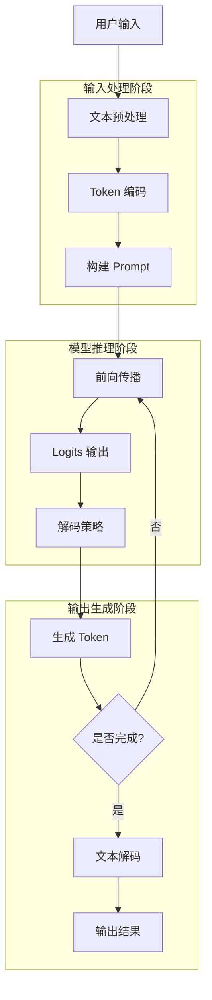

### 3.2 输入处理阶段

#### 3.2.1 文本预处理

```python
# 代码示例：输入文本预处理
class InputPreprocessor:
    """输入预处理器"""
    
    def __init__(self, tokenizer):
        self.tokenizer = tokenizer
    
    def preprocess(self, text, max_length=4096):
        """
        预处理输入文本
        
        Args:
            text: 原始输入文本
            max_length: 最大长度限制
            
        Returns:
            处理后的 Token ID 序列
        """
        # 1. 基础清洗
        cleaned_text = self._clean_text(text)
        
        # 2. Token 编码
        tokens = self.tokenizer.encode(cleaned_text)
        
        # 3. 添加特殊 Token
        processed_tokens = self._add_special_tokens(tokens)
        
        # 4. 长度检查与截断
        if len(processed_tokens) > max_length:
            processed_tokens = processed_tokens[:max_length]
        
        return processed_tokens
    
    def _clean_text(self, text):
        """文本清洗"""
        text = ' '.join(text.split())
        text = ''.join(char for char in text if char.isprintable())
        return text
    
    def _add_special_tokens(self, tokens):
        """添加特殊 Token"""
        return [1] + tokens  # 1 通常是 BOS Token
```

#### 3.2.2 Prompt 构建

```python
# 代码示例：Prompt 构建
class PromptBuilder:
    """Prompt 构建器"""
    
    def __init__(self, model_type="chat"):
        self.model_type = model_type
    
    def build_prompt(self, system_message, user_message, 
                     history=None, context=None):
        """
        构建完整的 Prompt
        
        Args:
            system_message: 系统指令
            user_message: 用户消息
            history: 对话历史
            context: 额外上下文
            
        Returns:
            构建的 Prompt 文本
        """
        if self.model_type == "chat":
            return self._build_chat_prompt(
                system_message, user_message, history, context
            )
        else:
            return self._build_completion_prompt(
                system_message, user_message, context
            )
    
    def _build_chat_prompt(self, system_message, user_message, 
                           history=None, context=None):
        """构建对话式 Prompt"""
        parts = []
        
        if system_message:
            parts.append(f"System: {system_message}")
        
        if history:
            for msg in history:
                role = msg["role"].capitalize()
                content = msg["content"]
                parts.append(f"{role}: {content}")
        
        if context:
            parts.append(f"Context: {context}")
        
        parts.append(f"User: {user_message}")
        parts.append("Assistant: ")
        
        return "\n".join(parts)
```

### 3.3 模型推理阶段

#### 3.3.1 前向传播详解

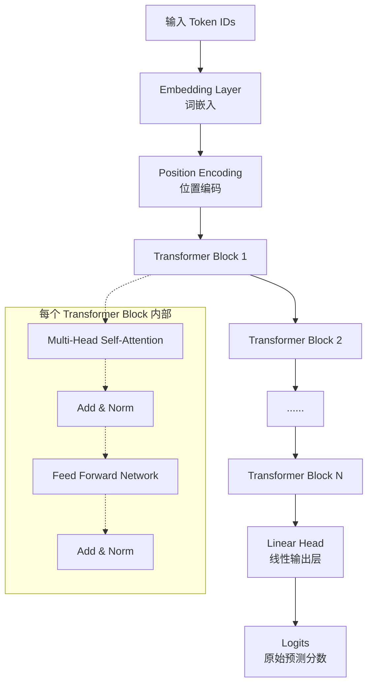

#### 3.3.2 注意力机制计算

```python
# 代码示例：注意力机制详细计算
import numpy as np

class AttentionCalculator:
    """注意力计算器"""
    
    def __init__(self, d_model=4096, num_heads=32):
        self.d_model = d_model
        self.num_heads = num_heads
        self.d_k = d_model // num_heads
    
    def calculate_attention(self, query, key, value, mask=None):
        """
        计算缩放点积注意力
        
        Args:
            query: 查询矩阵 [seq_len, d_k]
            key: 键矩阵 [seq_len, d_k]
            value: 值矩阵 [seq_len, d_k]
            mask: 可选的掩码
            
        Returns:
            注意力输出和权重
        """
        # 1. 计算注意力分数
        scores = np.dot(query, key.T) / np.sqrt(self.d_k)
        
        # 2. 应用掩码（如果有）
        if mask is not None:
            scores = np.where(mask == 0, -1e9, scores)
        
        # 3. Softmax 归一化
        attention_weights = self._softmax(scores)
        
        # 4. 加权求和
        output = np.dot(attention_weights, value)
        
        return output, attention_weights
    
    def _softmax(self, x):
        """数值稳定的 Softmax"""
        e_x = np.exp(x - np.max(x))
        return e_x / e_x.sum(axis=-1, keepdims=True)
```

### 3.4 输出生成阶段

#### 3.4.1 解码策略选择

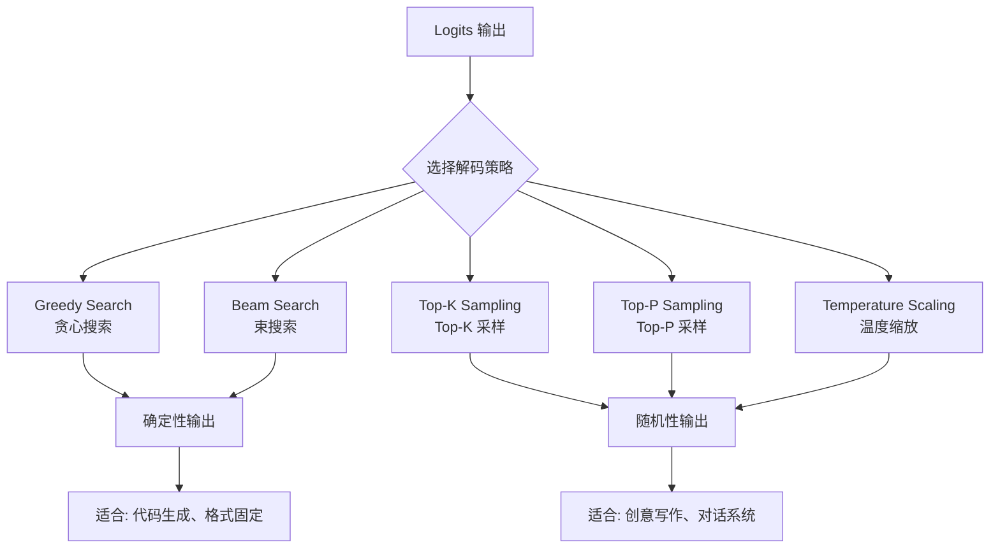

#### 3.4.2 Token 解码与输出

```python
# 代码示例：完整的生成流程
class TextGenerator:
    """文本生成器"""
    
    def __init__(self, model, tokenizer, max_length=100, 
                 temperature=1.0, top_k=0, top_p=0.9):
        self.model = model
        self.tokenizer = tokenizer
        self.max_length = max_length
        self.temperature = temperature
        self.top_k = top_k
        self.top_p = top_p
    
    def generate(self, prompt):
        """
        生成文本
        
        Args:
            prompt: 输入提示文本
            
        Returns:
            生成的文本
        """
        # 1. 编码输入
        input_ids = self.tokenizer.encode(prompt)
        input_tensor = torch.tensor([input_ids])
        
        # 2. 初始化生成序列
        generated = input_ids.copy()
        
        # 3. 逐步生成
        for _ in range(self.max_length):
            with torch.no_grad():
                outputs = self.model(input_tensor)
            
            next_token_logits = outputs.logits[0, -1, :]
            next_token_logits = next_token_logits / self.temperature
            
            if self.top_k > 0:
                top_k_values, _ = torch.topk(next_token_logits, self.top_k)
                next_token_logits[next_token_logits < top_k_values[0]] = float('-inf')
            
            if self.top_p > 0:
                sorted_logits, sorted_indices = torch.sort(
                    next_token_logits, descending=True
                )
                cumulative_probs = torch.cumsum(
                    F.softmax(sorted_logits, dim=-1), dim=-1
                )
                sorted_mask = cumulative_probs > self.top_p
                sorted_mask[1:] = sorted_mask[:-1].clone()
                sorted_mask[0] = False
                sorted_logits[sorted_mask] = float('-inf')
                next_token_logits[sorted_indices] = sorted_logits
            
            probs = F.softmax(next_token_logits, dim=-1)
            next_token = torch.multinomial(probs, num_samples=1)
            generated.append(next_token.item())
            
            if next_token.item() == self.tokenizer.eos_token_id:
                break
            
            input_tensor = torch.tensor([generated])
        
        output_text = self.tokenizer.decode(generated[len(input_ids):])
        return output_text
```

---

## 四、关键技术详解

### 4.1 KV Cache 技术

#### 4.1.1 原理介绍

KV Cache 是一种缓存技术，用于存储已处理 Token 的 Key 和 Value 向量，避免重复计算。

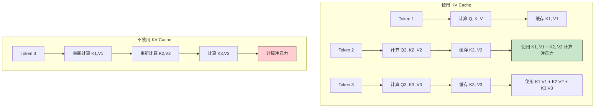

#### 4.1.2 KV Cache 实现

```python
# 代码示例：KV Cache 实现
class KVCache:
    """KV Cache 管理器"""
    
    def __init__(self, num_layers=32, num_heads=32, head_dim=128):
        self.num_layers = num_layers
        self.num_heads = num_heads
        self.head_dim = head_dim
        self.cache = {}
    
    def initialize(self, batch_size=1, max_length=4096):
        """初始化 KV Cache"""
        for layer_idx in range(self.num_layers):
            self.cache[f"layer_{layer_idx}_k"] = torch.zeros(
                batch_size, self.num_heads, 0, self.head_dim
            )
            self.cache[f"layer_{layer_idx}_v"] = torch.zeros(
                batch_size, self.num_heads, 0, self.head_dim
            )
    
    def update(self, layer_idx, new_k, new_v):
        """更新 KV Cache"""
        self.cache[f"layer_{layer_idx}_k"] = torch.cat(
            [self.cache[f"layer_{layer_idx}_k"], new_k], dim=2
        )
        self.cache[f"layer_{layer_idx}_v"] = torch.cat(
            [self.cache[f"layer_{layer_idx}_v"], new_v], dim=2
        )
    
    def get_memory_usage(self):
        """计算内存使用量"""
        total_elements = 0
        for k, v in self.cache.items():
            total_elements += v.numel()
        return total_elements * 2 / (1024 ** 2)  # FP16, MB
```

### 4.2 批量推理（Batching）

#### 4.2.1 Continuous Batching

```python
# 代码示例：连续批处理实现
import time
from collections import deque
from dataclasses import dataclass

@dataclass
class InferenceRequest:
    request_id: str
    input_ids: list
    priority: int = 0
    arrived_at: float = 0

class ContinuousBatchingEngine:
    """连续批处理引擎"""
    
    def __init__(self, max_batch_size=8, timeout_ms=50):
        self.max_batch_size = max_batch_size
        self.timeout_ms = timeout_ms
        self.queue = deque()
        self.batch_id = 0
    
    def add_request(self, request):
        """添加请求到队列"""
        request.arrived_at = time.time()
        self.queue.append(request)
        self.queue = deque(
            sorted(self.queue, key=lambda r: r.priority, reverse=True)
        )
    
    def get_next_batch(self):
        """获取下一个批次"""
        if not self.queue:
            return None
        
        self.batch_id += 1
        batch = []
        max_len_in_batch = 0
        
        while self.queue and len(batch) < self.max_batch_size:
            if batch and len(batch) < self.max_batch_size:
                if time.time() - self.queue[0].arrived_at > self.timeout_ms / 1000.0:
                    break
            
            request = self.queue.popleft()
            batch.append(request)
            max_len_in_batch = max(max_len_in_batch, len(request.input_ids))
        
        padded_batch = self._pad_batch(batch, max_len_in_batch)
        
        return {
            "batch_id": self.batch_id,
            "requests": padded_batch,
            "batch_size": len(batch),
            "max_sequence_length": max_len_in_batch
        }
    
    def _pad_batch(self, batch, max_len):
        """填充批次到相同长度"""
        padded_requests = []
        for request in batch:
            padded_ids = request.input_ids + [0] * (max_len - len(request.input_ids))
            padded_requests.append({
                **request.__dict__,
                "input_ids": padded_ids
            })
        return padded_requests
```

### 4.3 Speculative Decoding

#### 4.3.1 投机解码原理

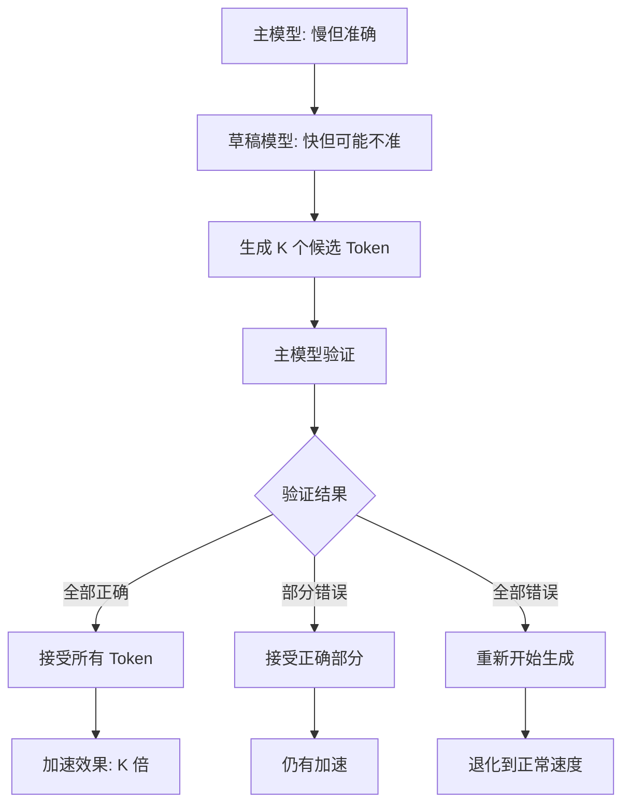

### 4.4 Flash Attention

#### 4.4.1 核心思想

Flash Attention 通过 IO-aware 优化，减少 GPU 显存读写，实现高效注意力计算。

```mermaid
graph TD
    subgraph "标准注意力"
        A[Q, K, V 在 HBM] --> B[计算 S = QK^T]
        B --> C[存储 S 到 HBM]
        C --> D[计算 Softmax(S)]
        D --> E[存储 P 到 HBM]
        E --> F[计算 O = PV]
        F --> G[存储 O 到 HBM]
    end
    
    subgraph "Flash Attention"
        H[Q, K, V 在 HBM] --> I[分块加载到 SRAM]
        I --> J[分块计算注意力]
        J --> K[分块写回 HBM]
        K --> L[累积输出]
    end
    
    G --> M["IO 复杂度: O(N²)"]
    L --> N["IO 复杂度: O(N)"]
    
    style M fill:#ffcdd2,stroke:#333
    style N fill:#c8e6c9,stroke:#333
```

---

## 五、常见算法与实现

### 5.1 贪心搜索（Greedy Search）

```python
# 代码示例：贪心搜索实现
def greedy_search(logits):
    """
    贪心搜索：每步选择概率最高的 Token
    
    Args:
        logits: 模型输出的原始分数 [vocab_size]
        
    Returns:
        选定的 Token ID
    """
    return torch.argmax(logits, dim=-1)
```

### 5.2 束搜索（Beam Search）

```python
# 代码示例：束搜索实现
def beam_search(model, prompt, beam_size=3, max_length=50):
    """
    束搜索解码
    
    Args:
        model: 语言模型
        prompt: 初始提示
        beam_size: 束宽
        max_length: 最大生成长度
        
    Returns:
        最佳生成序列
    """
    beams = [(prompt, 0.0)]
    
    for step in range(max_length):
        candidates = []
        
        for seq, score in beams:
            with torch.no_grad():
                logits = model(seq.unsqueeze(0)).logits[0, -1, :]
            
            probs = F.log_softmax(logits, dim=-1)
            topk_probs, topk_ids = torch.topk(probs, beam_size)
            
            for prob, token_id in zip(topk_probs, topk_ids):
                new_seq = torch.cat([seq, token_id.unsqueeze(0)])
                new_score = score + prob.item()
                candidates.append((new_seq, new_score))
        
        candidates.sort(key=lambda x: x[1] / len(x[0]), reverse=True)
        beams = candidates[:beam_size]
        
        if all(seq[-1].item() == 2 for seq, _ in beams):
            break
    
    best_seq, _ = beams[0]
    return best_seq
```

### 5.3 Top-K 采样

```python
# 代码示例：Top-K 采样
def top_k_sampling(logits, k=50):
    """
    Top-K 采样
    
    Args:
        logits: 模型输出 [vocab_size]
        k: 保留的 Token 数量
        
    Returns:
        采样的 Token ID
    """
    probs = F.softmax(logits, dim=-1)
    top_k_probs, top_k_indices = torch.topk(probs, k)
    top_k_probs = top_k_probs / top_k_probs.sum()
    sampled_idx = torch.multinomial(top_k_probs, num_samples=1)
    return top_k_indices[sampled_idx]
```

### 5.4 Top-P 采样

```python
# 代码示例：Top-P 采样（核采样）
def top_p_sampling(logits, p=0.9):
    """
    Top-P 采样（核采样）
    
    Args:
        logits: 模型输出 [vocab_size]
        p: 累积概率阈值
        
    Returns:
        采样的 Token ID
    """
    probs = F.softmax(logits, dim=-1)
    sorted_probs, sorted_indices = torch.sort(probs, descending=True)
    cumulative_probs = torch.cumsum(sorted_probs, dim=-1)
    
    sorted_mask = cumulative_probs <= p
    sorted_mask[1:] = sorted_mask[:-1].clone()
    sorted_mask[0] = True
    
    sorted_probs_filtered = sorted_probs * sorted_mask.float()
    sorted_probs_filtered = sorted_probs_filtered / sorted_probs_filtered.sum()
    
    sampled_idx = torch.multinomial(sorted_probs_filtered, num_samples=1)
    return sorted_indices[sampled_idx]
```

### 5.5 解码算法对比

| 算法 | 确定性 | 多样性 | 适用场景 | 实现复杂度 |
| :--- | :--- | :--- | :--- | :--- |
| **Greedy** | 完全确定 | 无 | 格式固定、代码生成 | 低 |
| **Beam Search** | 较高 | 低 | 翻译、摘要 | 中 |
| **Top-K** | 适中 | 适中 | 通用对话、翻译 | 低 |
| **Top-P** | 较低 | 高 | 创意写作、头脑风暴 | 低 |
| **Temperature** | 可调 | 可调 | 通用场景 | 低 |

---

## 六、推理优化策略

### 6.1 量化技术

#### 6.1.1 量化方法对比

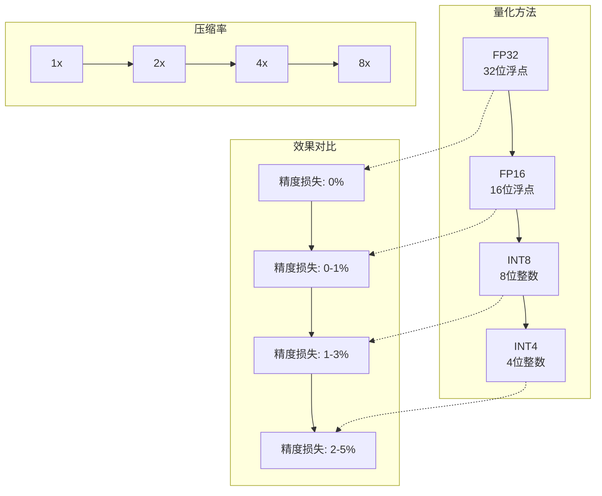

### 6.2 模型剪枝

```python
# 代码示例：模型剪枝
import torch.nn.utils.prune as prune

def prune_model(model, pruning_amount=0.3, method="unstructured"):
    """
    剪枝模型
    
    Args:
        model: 原始模型
        pruning_amount: 剪枝比例
        method: 剪枝方法
        
    Returns:
        剪枝后的模型
    """
    if method == "unstructured":
        for name, module in model.named_modules():
            if isinstance(module, nn.Linear):
                prune.l1_unstructured(module, name='weight', amount=pruning_amount)
    elif method == "structured":
        for name, module in model.named_modules():
            if isinstance(module, nn.Linear):
                prune.ln_structured(module, name='weight', amount=pruning_amount, n=2)
    
    # 永久化剪枝
    for name, module in model.named_modules():
        if isinstance(module, nn.Linear):
            prune.remove(module, 'weight')
    
    return model
```

### 6.3 分布式推理

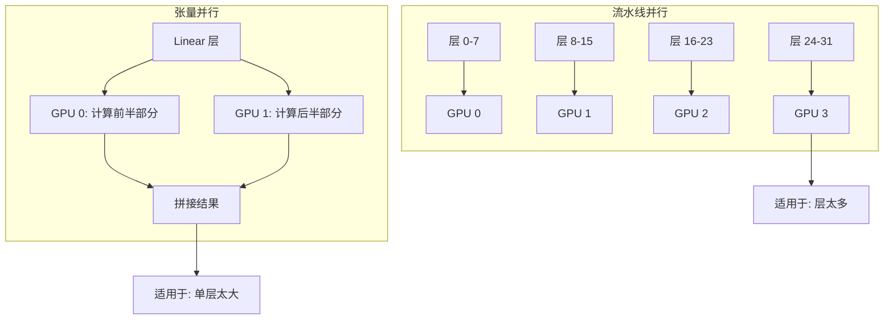

### 6.4 模型服务优化

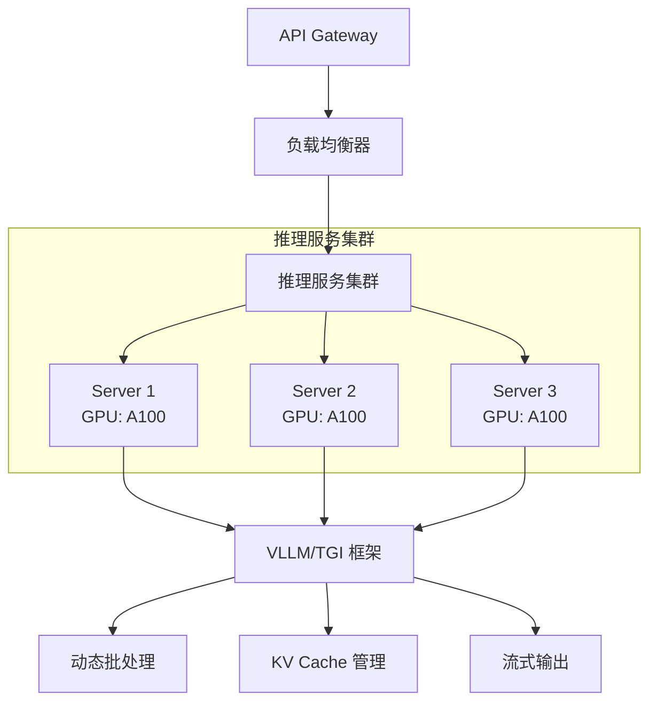

---

## 七、实际应用场景

### 7.1 对话系统

```python
# 代码示例：对话系统推理
class ChatSystem:
    """对话系统"""
    
    def __init__(self, model, tokenizer, max_history=10):
        self.model = model
        self.tokenizer = tokenizer
        self.history = []
        self.max_history = max_history
    
    def chat(self, user_message, system_message=None):
        """处理用户消息"""
        messages = []
        
        if system_message:
            messages.append({"role": "system", "content": system_message})
        
        messages.extend(self.history[-self.max_history:])
        messages.append({"role": "user", "content": user_message})
        
        formatted_input = self._format_messages(messages)
        response = self._generate_response(formatted_input)
        
        self.history.append({"role": "user", "content": user_message})
        self.history.append({"role": "assistant", "content": response})
        
        return response
    
    def _format_messages(self, messages):
        """格式化消息序列"""
        formatted = ""
        for msg in messages:
            role = msg["role"]
            content = msg["content"]
            formatted += f"{role.capitalize()}: {content}\n"
        formatted += "Assistant: "
        return formatted
    
    def _generate_response(self, formatted_input):
        """生成回复"""
        input_ids = self.tokenizer.encode(formatted_input)
        input_tensor = torch.tensor([input_ids])
        
        generated = []
        current_input = input_tensor
        
        for _ in range(512):
            with torch.no_grad():
                outputs = self.model(current_input)
            
            logits = outputs.logits[0, -1, :]
            next_token = torch.argmax(logits).unsqueeze(0)
            generated.append(next_token.item())
            
            if next_token.item() == self.tokenizer.eos_token_id:
                break
            
            current_input = torch.cat([input_tensor, next_token.unsqueeze(0)], dim=1)
        
        return self.tokenizer.decode(generated)
```

### 7.2 文本摘要

```python
# 代码示例：文本摘要推理
class TextSummarizer:
    """文本摘要器"""
    
    def __init__(self, model, tokenizer, max_summary_length=200):
        self.model = model
        self.tokenizer = tokenizer
        self.max_summary_length = max_summary_length
    
    def summarize(self, text):
        """生成摘要"""
        prompt = f"请为以下文本生成一个简洁的摘要：\n\n文本：{text[:3000]}\n\n摘要："
        
        input_ids = self.tokenizer.encode(prompt)
        input_tensor = torch.tensor([input_ids])
        
        generated = []
        current_input = input_tensor
        
        for _ in range(self.max_summary_length):
            with torch.no_grad():
                outputs = self.model(current_input)
            
            logits = outputs.logits[0, -1, :]
            next_token = torch.argmax(logits).unsqueeze(0)
            generated.append(next_token.item())
            
            if next_token.item() == self.tokenizer.eos_token_id:
                break
            
            current_input = torch.cat([input_tensor, next_token.unsqueeze(0)], dim=1)
        
        return self.tokenizer.decode(generated)
```

### 7.3 RAG 增强推理

```python
# 代码示例：RAG 增强推理
class RAGInferenceEngine:
    """RAG 增强推理引擎"""
    
    def __init__(self, llm_model, embedding_model, vector_store):
        self.llm_model = llm_model
        self.embedding_model = embedding_model
        self.vector_store = vector_store
    
    def answer_question(self, question, top_k=5):
        """使用 RAG 回答问题"""
        # 1. 编码问题
        question_embedding = self.embedding_model.encode(question)
        
        # 2. 检索相关文档
        relevant_docs = self.vector_store.search(
            query_vector=question_embedding,
            top_k=top_k
        )
        
        # 3. 构建增强的 Prompt
        context = "\n".join([
            f"文档{i+1}: {doc['content']}" 
            for i, doc in enumerate(relevant_docs)
        ])
        
        enhanced_prompt = f"""请根据以下参考文档回答问题：

参考文档：
{context}

问题：{question}

答案："""
        
        # 4. 生成答案
        answer = self._generate_answer(enhanced_prompt)
        
        return {
            "answer": answer,
            "source_documents": relevant_docs,
            "question": question
        }
    
    def _generate_answer(self, prompt):
        """生成答案"""
        input_ids = self.llm_model.tokenizer.encode(prompt)
        input_tensor = torch.tensor([input_ids])
        
        generated = []
        current_input = input_tensor
        
        for _ in range(512):
            with torch.no_grad():
                outputs = self.llm_model.model(current_input)
            
            logits = outputs.logits[0, -1, :]
            next_token = torch.argmax(logits).unsqueeze(0)
            generated.append(next_token.item())
            
            if next_token.item() == self.llm_model.tokenizer.eos_token_id:
                break
            
            current_input = torch.cat([input_tensor, next_token.unsqueeze(0)], dim=1)
        
        return self.llm_model.tokenizer.decode(generated)
```

---

## 八、总结与展望

### 8.1 核心要点总结

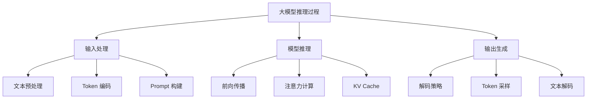

### 8.2 关键技术汇总

| 技术 | 作用 | 性能提升 |
| :--- | :--- | :--- |
| **KV Cache** | 缓存历史 K/V，避免重复计算 | 生成速度提升 2-3x |
| **Flash Attention** | IO-aware 注意力计算 | 注意力计算加速 2-4x |
| **Continuous Batching** | 动态批处理请求 | 吞吐量提升 2-8x |
| **Speculative Decoding** | 草稿-验证机制 | 生成速度提升 1.5-2x |
| **模型量化** | 降低模型精度存储 | 显存节省 2-4x |
| **分布式推理** | 多 GPU 并行计算 | 线性扩展 |

### 8.3 未来发展方向

| 方向 | 技术路径 | 预期突破 |
| :--- | :--- | :--- |
| **更高吞吐** | 更高效的批处理和调度 | 实时响应千亿参数模型 |
| **更低延迟** | 投机解码、流式生成优化 | Sub-100ms 首 Token 延迟 |
| **更小模型** | 结构化剪枝、知识蒸馏 | 移动端部署 |
| **更好质量** | 更优解码策略、RLHF 优化 | 更自然的生成质量 |
| **多模态推理** | 统一的多模态推理架构 | 文本、图像、音频统一处理 |

---

## 参考资料

1. **Attention Is All You Need** - Vaswani et al., 2017
2. **FlashAttention: Fast and Memory-Efficient Exact Attention** - Dao et al., 2022
3. **VLLM: Easy, Fast, and Cheap LLM Serving** - Kwon et al., 2023
4. **Speculative Decoding** - Chen et al., 2023
5. **Fast Inference from Transformers via Speculative Decoding** - Leviathan et al., 2023
6. **Efficient Memory Management for Large Language Model Serving** - Kwon et al., 2023
7. **GPT-4 Technical Report** - OpenAI, 2023
