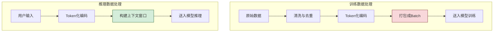
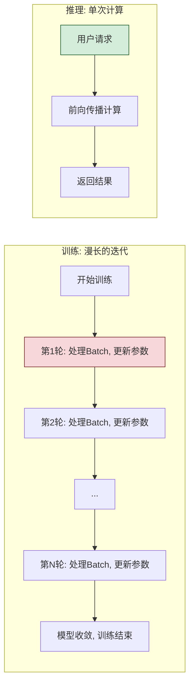

# 大模型训练与推理核心区别深度解析

> 文档定位:系统阐述大模型“训练 (Training)”与“推理 (Inference)”两大核心阶段的本质差异,从定义、资源、算法、工程实现等多维度进行深度对比,帮助读者建立清晰的认知边界。
>
> 阅读建议:本文是“大模型基础”系列的关键组成部分,建议结合 [4Transformer并行训练机制详解.md](./4Transformer并行训练机制详解.md) 与 [12大模型推理过程深度解析.md](./12大模型推理过程深度解析.md) 一并阅读,以分别深入理解训练与推理的具体实现细节。

---

## 目录

- [一、核心概念与定义目标差异](#一核心概念与定义目标差异)
- [二、计算资源需求对比](#二计算资源需求对比)
- [三、数据处理方式不同](#三数据处理方式不同)
- [四、时间周期长短比较](#四时间周期长短比较)
- [五、核心算法与优化策略区别](#五核心算法与优化策略区别)
- [六、输出结果性质差异](#六输出结果性质差异)
- [七、典型应用场景区分](#七典型应用场景区分)
- [八、评估指标的不同](#八评估指标的不同)
- [九、总结与展望](#九总结与展望)

---

## 一、核心概念与定义目标差异

### 1.1 基本定义

大模型的“训练 (Training)”与“推理 (Inference)”是其生命周期中两个截然不同的阶段。

*   **训练 (Training)**: 指模型**从数据中学习规律和知识**的过程。在这个阶段,模型的参数 (Weights/Biases) 会被不断调整和更新,使其预测结果越来越接近真实答案。这是一个“学习”的过程。

*   **推理 (Inference)**: 指使用**已经训练好的模型**对新数据进行预测的过程。在这个阶段,模型的参数是固定的,不再进行任何更新,只根据输入计算输出。这是一个“使用”的过程。

```mermaid
flowchart LR
    subgraph 训练阶段 (Training)
        A[输入: 训练数据] --> B[模型学习]
        B --> C[输出: 新模型/更新的参数]
    end

    subgraph 推理阶段 (Inference)
        D[输入: 用户请求/新数据] --> E[模型预测]
        E --> F[输出: AI 回答/预测结果]
    end

    style B fill:#fff3cd,stroke:#d39e00
    style E fill:#d4edda,stroke:#155724
```

### 1.2 核心目标对比

| 对比维度 | 训练 (Training) | 推理 (Inference) |
| :--- | :--- | :--- |
| **核心目标** | **学习** (Learning): 让模型从数据中掌握模式、知识和规则。 | **预测** (Prediction): 利用已学知识对未知数据做出快速预测。 |
| **参数状态** | **动态变化** (不断更新): 模型权重在每个训练步骤中都会被修改。 | **静态固定** (冻结不变): 模型权重保持不变。 |
| **本质过程** | **优化问题**: 找到一组最优参数,使模型在训练数据上的损失函数 (Loss) 最小。 | **计算问题**: 对固定参数的模型执行一个数学计算 (通常是矩阵乘法),得到输出。 |
| **数学操作** | 前向传播 (Forward Pass) + **反向传播 (Backpropagation)**。 | **仅**前向传播 (Forward Pass)。 |

### 1.3 形象类比

*   **训练 (Training)** 就像是 **“上学读书”**:
    *   学生 (模型) 每天上课 (输入数据)、做作业 (计算损失)、被老师批改 (反向传播、优化)。
    *   经过长期学习 (几个月的训练),学生掌握了知识 (模型参数固化)。
    *   学生的大脑 (模型参数) 发生了变化,记住了学过的东西。

*   **推理 (Inference)** 就像是 **“参加考试”**:
    *   学生拿着试卷 (用户请求/输入数据) 开始答题 (前向传播计算)。
    *   答题过程中,学生的大脑不再改变,只是运用所学知识解题。
    *   最终交卷,得到分数/答案 (预测结果)。

---

## 二、计算资源需求对比

### 2.1 硬件资源差异

训练和推理在硬件需求上的差异巨大,这是两者最核心的工程区别。

```mermaid
flowchart TB
    subgraph 训练 (Training)
        direction LR
        T1[海量 GPU/TPU 集群]
        T2[高显存 (HBM)]
        T3[高速互联 (NVLink)]
    end

    subgraph 推理 (Inference)
        direction LR
        I1[单/少量 GPU]
        I2[相对低显存]
        I3[或 CPU/NPU]
    end

    style T1 fill:#f8d7da,stroke:#721c24
    style I1 fill:#d4edda,stroke:#155724
```

| 对比维度 | 训练 (Training) | 推理 (Inference) |
| :--- | :--- | :--- |
| **硬件规模** | 需要**数百甚至数千块**高端 GPU/TPU 组成的集群 (如 NVIDIA DGX 集群)。 | 通常只需**单块或几块** GPU,甚至可以在 CPU、手机芯片 (NPU) 上运行。 |
| **显存要求** | 需求巨大 (数百 GB 到 TB 级)。因为需要存储模型参数、激活值 (Activations)、梯度 (Gradients) 和优化器状态 (Optimizer States)。 | 需求相对较小。只需要存储模型参数和 KV Cache (用于对话)。通常是训练显存需求的数分之一。 |
| **计算强度** | 极高。训练过程需要大量的浮点运算 (主要是 FP16/BF16),并要求极高的计算精度。 | 相对较低。推理可以使用更低精度 (如 INT8/INT4) 来加速计算,且只需要前向计算。 |
| **网络依赖** | 强依赖。多卡分布式训练需要极高带宽的网络 (如 NVLink, InfiniBand) 来同步梯度。 | 基本无依赖。单卡推理不需要网络;多卡推理也只是简单的模型并行,网络要求低。 |

### 2.2 资源开销量化对比

以 GPT-3 级别 (175B 参数) 的模型为例:

*   **训练 (Training)**:
    *   **硬件**: 需要约 10,000 块 A100 GPU 组成的集群。
    *   **时间**: 需要约数月的时间 (约 34 天的连续训练)。
    *   **成本**: 硬件、电费、运维成本极高,属于国家级/超大型科技公司才能承担的资源。

*   **推理 (Inference)**
    *   **硬件**: 只需单块 A100 或 H100 GPU (甚至消费级显卡)。
    *   **时间**: 单次对话响应时间通常在几百毫秒到几秒。
    *   **成本**: 成本极低,可以通过 API 按需调用,个人开发者也能轻松使用。

---

## 三、数据处理方式不同

### 3.1 数据使用方式

| 对比维度 | 训练 (Training) | 推理 (Inference) |
| :--- | :--- | :--- |
| **数据性质** | **历史数据** (存量数据):使用大规模、高质量的**标注/未标注训练数据集** (如 Common Crawl、书籍、代码库)。 | **实时数据** (增量数据):使用**用户实时输入**的请求,或 RAG 系统检索到的动态知识。 |
| **数据量** | **海量** (Billions to Trillions of Tokens):需要消耗整个互联网规模的数据。 | **微量** (单次请求):每次推理只处理当前的输入 (通常是几千到几万 tokens)。 |
| **数据格式** | **格式化的批量数据**:通常被处理成固定长度的 Token 序列,以 Batch 的形式送入模型。 | **流式/单条数据**:用户的输入是自由文本,会被动态 Token 化后送入模型。 |
| **数据作用** | 用于“教学”,即调整模型的参数。模型会“记住”数据中的知识。 | 用于“问题”,即作为模型要回答的问题,模型本身不改变。 |

### 3.2 数据处理流程



### 3.3 关键差异

*   **训练时的数据是“标准答案”**:模型知道每个输入对应的正确输出 (对于有监督学习),通过比对自己的预测和标准答案的差异来学习。
*   **推理时的数据是“用户问题”**:模型面对的是它可能从未见过的问题,需要运用它在训练中学到的知识来生成答案,没有“标准答案”可以比对。

---

## 四、时间周期长短比较

### 4.1 时间量级差异

训练和推理在时间周期上的差异堪称“天壤之别”。

| 对比维度 | 训练 (Training) | 推理 (Inference) |
| :--- | :--- | :--- |
| **总耗时** | **极长** (数周、数月)。从模型开训到最终收敛可能需要数月时间。 | **极短** (毫秒、秒)。单次请求的响应时间通常在几百毫秒内完成。 |
| **单次计算耗时** | 每个 Step (处理一个 Batch) 可能需要**几秒钟到几分钟**。 | 每次 Token 生成可能只需要**几毫秒**,生成整个回答的总时间通常在**几秒**内。 |
| **迭代次数** | 需要**数十亿次**的迭代 (Step) 才能完成整个训练。 | 通常只需要**一次**前向传播即可完成一次推理 (对于生成任务是多次自回归,但通常不超过几百次)。 |

### 4.2 形象对比

*   **训练 (Training)**: 就像是**“用几年时间读完大学四年的课程”**,是一个漫长、艰苦、需要大量资源投入的过程。
*   **推理 (Inference)**: 就像是**“用几分钟/几小时做完一次考试”**,是一个快速、即时、单步的过程。

### 4.3 迭代过程



---

## 五、核心算法与优化策略区别

### 5.1 核心计算流程

这是两者最本质的算法区别。

#### 5.1.1 训练的核心流程:前向 + 反向

训练包含两个核心步骤的循环:

1.  **前向传播 (Forward Pass)**:
    *   输入数据,模型进行计算,得到预测结果。
    *   计算预测结果与真实答案之间的误差 (Loss)。

2.  **反向传播 (Backpropagation)**:
    *   计算误差对模型所有参数的梯度 (Gradients)。
    *   使用优化算法 (如 Adam, SGD) 根据梯度更新模型参数。

```python
# 训练伪代码
for epoch in range(num_epochs):
    for batch in dataloader:
        # 1. Forward Pass
        predictions = model(batch.input)
        loss = compute_loss(predictions, batch.target)

        # 2. Backward Pass
        gradients = compute_gradients(loss, model.parameters)

        # 3. Update Parameters
        optimizer.update(model.parameters, gradients)
```

#### 5.1.2 推理的核心流程:仅前向

推理只包含前向传播:

1.  输入数据,模型进行计算,得到预测结果。
2.  **没有**误差计算,**没有**反向传播,**没有**参数更新。

```python
# 推理伪代码
with torch.no_grad(): # 禁用梯度计算
    predictions = model(user_input)
    # 直接使用 predictions, 无需计算loss或更新参数
```

### 5.2 关键技术对比

| 对比维度 | 训练 (Training) | 推理 (Inference) |
| :--- | :--- | :--- |
| **核心算法** | **梯度下降 (Gradient Descent)** 家族算法。 | **矩阵乘法 (Matrix Multiplication)**。 |
| **是否需要梯度** | **必须**。计算梯度是训练的核心。 | **不需要**。关闭梯度计算可以节省大量内存和计算。 |
| **优化算法** | 使用 Adam, AdamW, SGD 等优化器。 | 无优化算法。 |
| **并行策略** | **数据并行** (Data Parallelism), **模型并行** (Model Parallelism), **流水线并行** (Pipeline Parallelism)。 | **张量并行** (Tensor Parallelism), **流水线并行** (Pipeline Parallelism), **批处理并行** (Batching)。 |
| **精度选择** | 常用 FP32 (全精度), FP16, BF16 (混合精度)。 | 常用 FP16, INT8, INT4 (量化精度),追求速度。 |

### 5.3 工程优化策略

#### 5.3.1 训练优化

*   **混合精度训练 (Mixed Precision Training)**: 结合 FP16 和 FP32,在保证精度的同时加速训练。
*   **梯度检查点 (Gradient Checkpointing)**: 通过计算部分中间激活值而非全部,来节省显存,以空间换时间。
*   **分布式训练框架**: DeepSpeed, Megatron-LM 等。

#### 5.3.2 推理优化

*   **KV Cache 缓存**: 缓存已生成 Token 的 Key 和 Value,避免重复计算,大幅降低推理时间。
*   **模型量化 (Quantization)**: 将 FP16 模型转换为 INT8/INT4,减小模型体积,提高推理速度。
*   **算子融合 (Operator Fusion)**: 将多个连续的小计算融合成一个大计算,减少调度开销。
*   **连续批处理 (Continuous Batching)**: 在推理过程中动态添加新请求,最大化 GPU 的计算利用率。

---

## 六、输出结果性质差异

### 6.1 输出的本质区别

| 对比维度 | 训练 (Training) | 推理 (Inference) |
| :--- | :--- | :--- |
| **输出内容** | **更新后的模型参数 (Weights)**。这是一个巨大的二进制文件。 | **AI 生成的回答 (文本、图像、代码等)**。这是面向用户的最终产物。 |
| **确定性** | **确定性**。给定相同的训练数据和随机种子,训练出的模型是确定的 (虽然实际上不完全可复现)。 | **非确定性**。对于生成式模型,即使输入相同,每次推理的结果也可能不同 (取决于采样策略)。 |
| **存在形式** | 存在于存储介质上的静态文件。 | 流式/实时生成的动态内容。 |

### 6.2 结果示例

#### 6.2.1 训练结果

训练的“结果”是权重文件,它是模型知识的物理载体。

```
# 训练的输出
model_v1.safetensors # 包含数十亿个浮点数的权重文件
model_v2.safetensors # 经过更多数据训练后的新权重文件
```

#### 6.2.2 推理结果

推理的“结果”是模型对用户问题的直接回答。

```
# 推理的输出
用户: “什么是量子计算?”
AI: “量子计算是一种利用量子力学现象... (一大段流畅的解释)”

用户: “帮我写一段 Python 代码实现排序”
AI: “您可以使用 Python 的 sorted() 函数:
     numbers = [3, 1, 4, 1, 5, 9, 2, 6]
     sorted_numbers = sorted(numbers)
     print(sorted_numbers)”
```

---

## 七、典型应用场景区分

### 7.1 训练的应用场景

训练主要发生在模型的**研发阶段**,由 AI 研究人员和工程师完成。

*   **大模型预训练**: 从海量数据开始训练一个基础模型 (Foundation Model)。
*   **模型微调 (Fine-tuning)**: 基于一个预训练好的模型,使用特定领域或特定任务的数据进行训练,使其适应特定需求。
*   **对齐训练 (Alignment)**: 使用人类反馈强化学习 (RLHF) 等技术,让模型的输出更符合人类价值观和意图 (如 ChatGPT 的训练过程)。

### 7.2 推理的应用场景

推理发生在模型的**部署和使用阶段**,由最终用户或下游系统触发。

*   **Chatbot 对话**: 用户与 AI 助手进行问答交互。
*   **内容生成**: 自动生成文章、摘要、翻译、代码等内容。
*   **智能客服**: 为用户提供 7x24 小时的自动化客户服务。
*   **数据分析**: 辅助分析数据、生成报告。
*   **Agent 应用**: 作为 Agent 的大脑,与外部工具交互完成复杂任务。

### 7.3 生命周期对比

```mermaid
flowchart LR
    subgraph 模型生命周期
        direction TB
        Phase1[1. 预训练 (Training)]
        Phase2[2. 微调/对齐 (Training)]
        Phase3[3. 部署上线 (Inference)]
        Phase4[4. 日常使用 (Inference)]
        
        Phase1 --> Phase2
        Phase2 --> Phase3
        Phase3 --> Phase4
    end
    
    style Phase1 fill:#f8d7da,stroke:#721c24
    style Phase2 fill:#f8d7da,stroke:#721c24
    style Phase3 fill:#d4edda,stroke:#155724
    style Phase4 fill:#d4edda,stroke:#155724
```

---

## 八、评估指标的不同

### 8.1 核心评估指标

| 对比维度 | 训练 (Training) | 推理 (Inference) |
| :--- | :--- | :--- |
| **核心指标** | **损失值 (Loss)**: 衡量模型预测与真实答案的差距。训练的目标就是最小化这个值。 | **准确率/有用性**: 衡量模型生成的内容是否正确、是否符合用户需求。 |
| **辅助指标** | **困惑度 (Perplexity)**: 衡量模型对下一个 Token 的预测难度。数值越低越好。 | **响应延迟 (Latency)**: 衡量生成速度。数值越低越好。 |
| **** | **收敛速度**: 模型参数趋于稳定的快慢。 | **吞吐量 (Throughput)**: 单位时间内能处理多少请求。 |
| **** | **泛化能力**: 在未见数据上的表现 (通过验证集评估)。 | **资源利用率**: 推理时的显存/GPU 利用率。 |

### 8.2 指标详解

#### 8.2.1 训练指标:损失值 (Loss)

损失值是一个非负实数,用于衡量模型预测的“错误程度”。

*   当预测完全正确时,损失值为 0。
*   损失值越大,说明模型预测越差。
*   训练过程就是不断调整参数,使损失值逐步下降的过程。

```python
# 损失值的概念
def compute_loss(predictions, targets):
    # 计算预测值与真实值的差距
    # MSE Loss = 1/n * sum((pred - target)^2)
    return ((predictions - targets) ** 2).mean()

# 在训练中,这个值是不断下降的
```

#### 8.2.2 推理指标:准确率 (Accuracy)

准确率衡量模型生成的内容是否是用户期望的答案,这是一个更主观、更复杂的指标。

*   对于分类任务:准确率是预测正确的样本数占总样本数的比例。
*   对于生成任务:准确率的衡量要复杂得多,通常需要人工评估或使用专门的指标 (如 BLEU, ROUGE)。更关注内容的“流畅性”、“相关性”和“事实正确性”。

#### 8.2.3 推理性能指标:延迟 (Latency)

延迟是指从用户发送请求到收到 AI 回答的时间。
*   **首字延迟 (Time to First Token)**: 从请求到 AI 吐出第一个字的时间,影响用户的第一感知。
*   **全响应延迟 (Time to Full Response)**: 从请求到 AI 回答完毕的时间。

---

## 九、总结与展望

### 9.1 核心区别总结

训练与推理作为大模型生命周期的两个核心阶段,在以下方面存在本质区别:

| 维度 | 训练 (Training) | 推理 (Inference) |
| :--- | :--- | :--- |
| **核心目标** | **学习**: 从数据中获取知识,更新模型参数。 | **预测**: 利用知识生成答案,不改变模型。 |
| **计算流程** | 前向传播 + **反向传播**。 | **仅**前向传播。 |
| **资源需求** | **极大** (海量 GPU 集群、极高显存)。 | **较小** (单/少量 GPU、普通显存)。 |
| **数据需求** | **海量** (万亿 Token 的历史数据)。 | **微量** (单次用户输入)。 |
| **时间周期** | **极长** (几周/数月)。 | **极短** (毫秒/秒)。 |
| **输出结果** | **模型权重** (二进制文件)。 | **AI 回答** (文本/图像/代码)。 |
| **评估指标** | **损失值 (Loss)**。 | **准确率/有用性**、**延迟**。 |
| **人员角色** | AI 研究/工程师。 | 最终用户/应用程序。 |

### 9.2 对开发者的启示

1.  **理解成本结构**: 训练成本极高,属于“重资产”。而推理成本相对较低,是“轻资产”。大多数公司和个人是推理服务的消费者,而非训练者。
2.  **认识推理优化的价值**: 对于应用开发者来说,理解推理阶段的优化技术 (量化、KV Cache、批处理) 比训练技术更有现实意义,可以显著降低服务成本、提升用户体验。
3.  **区分问题性质**: 在调试模型效果时,要区分问题是出在“训练没学好” (需要重新训练/微调) 还是“推理没用好” (需要优化 Prompt、调整参数或改进推理策略)。

### 9.3 未来展望

*   **训练与推理的融合**: 未来可能出现“训练即推理”的新范式,即在推理过程中动态进行轻量级的参数更新 (In-Context Learning, Few-Shot Learning),模糊两者的边界。
*   **更高效的推理架构**: 研究领域正在探索更适合推理的 Transformer 变体,或全新的神经网络架构,以进一步降低推理成本、提升速度。
*   **端侧推理的普及**: 随着移动设备 NPU 算力的增强,将有越来越多的大模型在手机、PC 等端侧设备上直接进行推理,实现更好的隐私保护和更低的服务成本。

通过本文的学习,希望能帮助读者清晰地划分训练与推理的界限,深入理解大模型运作的核心机制,为后续的学习和实践打下坚实基础。
