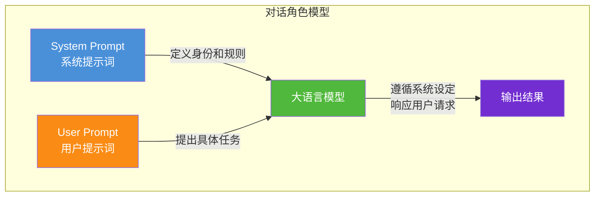
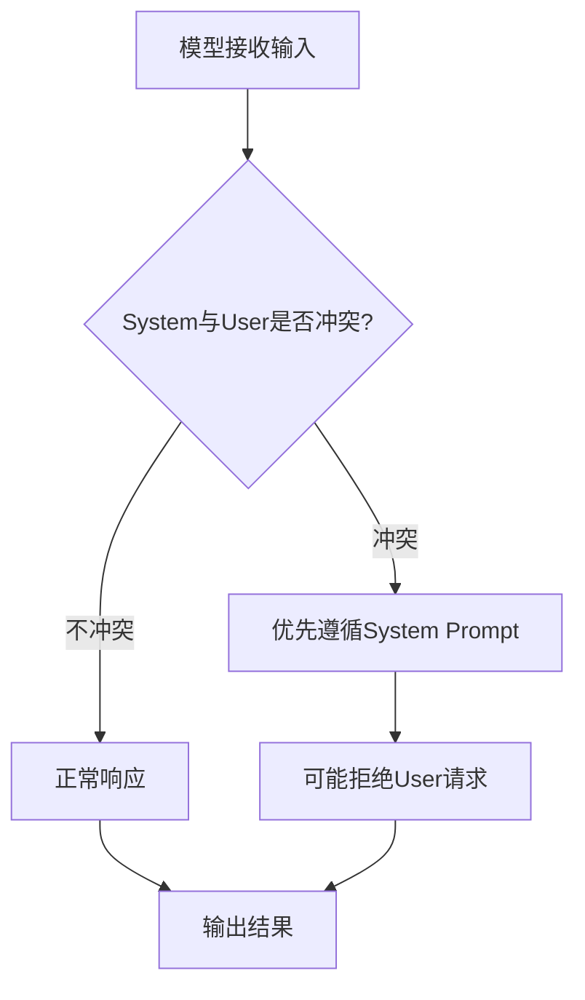
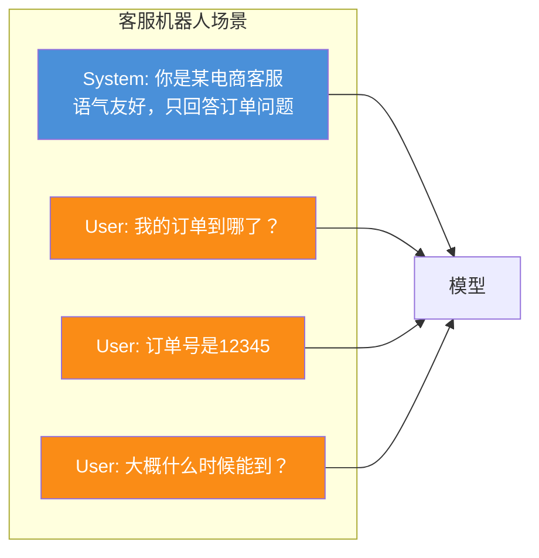
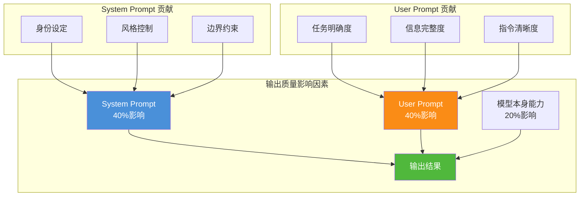

# System Prompt 与 User Prompt 区别简明解析

> **文档说明**：本文档面向大模型初学者，简明介绍 System Prompt 与 User Prompt 的定义、核心功能、角色定位、使用场景及对模型输出的影响，帮助读者快速理解两种提示词在 LLM 交互中的不同作用。

## 目录

- [一、概念引入](#一概念引入)
- [二、System Prompt 详解](#二system-prompt-详解)
- [三、User Prompt 详解](#三user-prompt-详解)
- [四、核心区别对比](#四核心区别对比)
- [五、使用场景分析](#五使用场景分析)
- [六、对模型输出的影响](#六对模型输出的影响)
- [七、最佳实践建议](#七最佳实践建议)
- [八、总结](#八总结)

---

## 一、概念引入

### 1.1 什么是 Prompt

在与大语言模型（LLM）交互时，**Prompt（提示词）** 是我们向模型提供的输入文本，用于引导模型生成期望的输出。Prompt 的质量直接影响模型输出的准确性和相关性。

在 Chat 模式的 LLM 交互中，Prompt 被划分为不同的角色，最常见的两种是：

- **System Prompt**：系统提示词
- **User Prompt**：用户提示词

### 1.2 一个简单示例

```
[System Prompt]
你是一位专业的翻译助手，专门负责中英文互译。

[User Prompt]
请把这句话翻译成英文：今天天气真好。
```

模型输出：

```
The weather is nice today.
```

从这个示例可以看出，**System Prompt 定义了"模型应该扮演什么角色"**，而 **User Prompt 则是"用户具体想要做什么"**。

---

## 二、System Prompt 详解

### 2.1 定义

**System Prompt（系统提示词）** 是对话开始时设置的全局指令，用于定义模型的**身份、行为准则和响应方式**。它相当于给模型设定一个"人设"或"工作职责"。

### 2.2 核心功能

| 功能 | 说明 | 示例 |
|------|------|------|
| **角色定义** | 告诉模型它是谁 | "你是一位资深 Python 开发工程师" |
| **行为约束** | 规定模型的回应方式 | "只回答技术问题，拒绝无关话题" |
| **语气设定** | 设定回复风格 | "使用专业但友好的语气" |
| **格式规范** | 规定输出格式 | "以 JSON 格式返回结果" |
| **边界设定** | 限定知识范围 | "只基于提供的上下文回答" |

### 2.3 特点

- **全局性**：对整个对话过程产生影响，不是针对单个问题
- **稳定性**：在多轮对话中持续生效，不会被用户的提问覆盖
- **权威性**：优先级高于 User Prompt，模型会优先遵循 System Prompt 的约束

### 2.4 典型示例

```text
你是一位经验丰富的儿科医生，专门解答0-12岁儿童的健康问题。
请遵循以下规则：
1. 使用通俗易懂的语言，避免专业术语
2. 对于严重疾病症状，建议及时就医
3. 不要开具具体药物处方
4. 回答时保持耐心和关怀的语气
```

---

## 三、User Prompt 详解

### 3.1 定义

**User Prompt（用户提示词）** 是用户在每轮对话中提出的**具体问题、请求或指令**。它代表了用户当下想要完成的任务。

### 3.2 核心功能

| 功能 | 说明 | 示例 |
|------|------|------|
| **任务描述** | 告诉模型要做什么 | "帮我写一首关于春天的诗" |
| **问题提问** | 提出具体问题 | "什么是面向对象编程？" |
| **内容提供** | 提供待处理的素材 | "总结以下文章的核心观点..." |
| **指令下达** | 要求执行特定操作 | "把这段代码改成 Python 版本" |
| **反馈澄清** | 对上一轮回答进行追问 | "能再详细解释一下第二点吗？" |

### 3.3 特点

- **即时性**：针对当前这一轮对话的具体需求
- **多变性**：随着对话进行，每轮的 User Prompt 都可能不同
- **具体性**：通常包含具体的任务内容、问题和上下文

### 3.4 典型示例

```text
我家宝宝3岁了，最近两天有点咳嗽，没有发烧，精神状态还可以。
请问这种情况需要立刻去医院吗？在家应该怎么护理？
```

---

## 四、核心区别对比

### 4.1 角色定位差异



### 4.2 核心区别对比表

| 对比维度 | System Prompt | User Prompt |
|---------|---------------|-------------|
| **角色定位** | 导演/设定者 | 演员/执行者 |
| **作用范围** | 全局，整个对话 | 局部，当前这一轮 |
| **生命周期** | 整个会话持续生效 | 单轮对话使用 |
| **内容性质** | 抽象规则、身份设定 | 具体任务、实际问题 |
| **变化频率** | 通常不变 | 每轮都可能变化 |
| **优先级** | 高（权威约束） | 低（具体请求） |
| **设置时机** | 对话开始前设置 | 对话过程中实时输入 |
| **类比** | 公司规章制度 | 员工具体任务 |

### 4.3 优先级关系

当 System Prompt 与 User Prompt 出现冲突时，模型通常会优先遵循 System Prompt：



---

## 五、使用场景分析

### 5.1 System Prompt 适用场景

| 场景 | 说明 | 示例 |
|------|------|------|
| **专用助手** | 构建特定领域助手 | "你是法律咨询助手" |
| **风格控制** | 要求特定回复风格 | "用幽默的口吻回答" |
| **安全约束** | 防止不当内容 | "拒绝回答暴力相关话题" |
| **格式要求** | 统一输出格式 | "始终以表格形式呈现数据" |
| **多语言设置** | 指定回复语言 | "始终用中文回答" |

### 5.2 User Prompt 适用场景

| 场景 | 说明 | 示例 |
|------|------|------|
| **问答查询** | 获取信息 | "什么是机器学习？" |
| **内容创作** | 生成文本 | "写一篇关于环保的短文" |
| **代码编写** | 编程辅助 | "写一个冒泡排序的Python函数" |
| **文本处理** | 摘要、翻译、改写 | "把这段话翻译成英文" |
| **多轮追问** | 深入交流 | "能再举个例子吗？" |

### 5.3 协同使用示例



在这个场景中：
- **System Prompt** 一次性设定了模型的客服身份和行为边界
- **User Prompt** 随着对话进行，每轮提出不同的具体问题

---

## 六、对模型输出的影响

### 6.1 System Prompt 的影响

#### 6.1.1 影响特点

System Prompt 对模型输出产生的是**深层次、全局性**的影响：

| 影响维度 | 无 System Prompt | 有 System Prompt |
|---------|-----------------|------------------|
| **回答风格** | 默认风格，可能不稳定 | 风格统一，符合设定 |
| **专业程度** | 通用回答，深度有限 | 针对性强，专业深入 |
| **安全边界** | 可能回答敏感问题 | 主动规避不当话题 |
| **格式规范** | 格式随意 | 严格遵循指定格式 |
| **一致性** | 多轮回答可能风格漂移 | 多轮保持稳定风格 |

#### 6.1.2 实际对比示例

**问题相同：**"介绍一下黑洞"

| 场景 | 模型输出特点 |
|------|------------|
| **无 System Prompt** | 通用科普介绍，内容随机，风格不确定 |
| **System Prompt="你是天文学家"** | 使用专业术语，深入讲解物理原理 |
| **System Prompt="你是少儿科普作家"** | 语言生动形象，用比喻解释概念 |

### 6.2 User Prompt 的影响

#### 6.2.1 影响特点

User Prompt 对模型输出产生的是**即时、具体**的影响：

| 影响维度 | 说明 |
|---------|------|
| **回答内容** | 直接决定模型说什么 |
| **详细程度** | 通过提问方式控制回答的详略 |
| **方向引导** | 引导回答走向特定方向 |
| **信息量** | 提供的背景信息越充分，回答越精准 |

#### 6.2.2 提问方式对输出的影响

| 提问方式 | 输出效果 |
|---------|---------|
| "什么是人工智能？" | 概念性概述 |
| "人工智能和机器学习有什么区别？" | 对比性分析 |
| "用小学生能懂的话解释人工智能" | 通俗化解释 |
| "列举人工智能的5个应用场景" | 具体示例列举 |

### 6.3 两者协同的影响

System Prompt 与 User Prompt 协同作用，共同决定最终输出质量：



---

## 七、最佳实践建议

### 7.1 System Prompt 编写建议

1. **角色明确**：清晰定义模型身份
   - ✅ "你是一位有10年经验的Python开发工程师"
   - ❌ "你是一个助手"

2. **规则具体**：给出明确的行为准则
   - ✅ "回答时先给出结论，再提供解释"
   - ❌ "好好回答"

3. **边界清晰**：明确能做什么、不能做什么
   - ✅ "只回答与编程相关的问题，其他问题礼貌拒绝"
   - ❌ "只回答相关问题"

4. **格式规范**：明确输出格式要求
   - ✅ "以Markdown格式输出，代码用代码块包裹"
   - ❌ "格式好看一点"

### 7.2 User Prompt 编写建议

1. **任务清晰**：明确表达想要什么
   - ✅ "请用Python实现一个二分查找函数，并添加注释"
   - ❌ "写个查找"

2. **提供上下文**：给模型足够的背景信息
   - ✅ "我在做一个电商网站，需要实现购物车功能，请..."
   - ❌ "帮我写购物车"

3. **分步提问**：复杂任务拆解为多步
   - ✅ 先问思路，再问实现，最后问优化
   - ❌ 一次性抛出所有需求

4. **及时反馈**：对不满意的回答进行追问
   - ✅ "第二点的解释不够详细，能展开说明吗？"
   - ❌ 直接放弃

### 7.3 协同使用原则

| 原则 | 说明 |
|------|------|
| **System 定方向，User 给任务** | System 设定角色，User 提出具体需求 |
| **System 管规则，User 管内容** | System 控制行为边界，User 决定回答内容 |
| **System 少而精，User 多而细** | System 简洁明确，User 详尽具体 |
| **一次设定，多次使用** | System 设置后保持稳定，User 随需求变化 |

---

## 八、总结

### 8.1 核心要点

| 要点 | System Prompt | User Prompt |
|------|---------------|-------------|
| **是什么** | 系统级全局指令 | 用户级即时请求 |
| **做什么** | 定义身份、规则、风格 | 提出任务、问题、内容 |
| **管什么** | 管整体行为和边界 | 管具体内容和方向 |
| **持续多久** | 整个对话 | 单轮对话 |

### 8.2 一句话总结

> **System Prompt 决定了模型"以什么身份、按什么规则"来回答，而 User Prompt 决定了模型"具体回答什么内容"。**

两者协同作用，共同塑造了大语言模型的最终输出。掌握这两种提示词的区别与使用方法，是与大模型高效交互的基础。

### 8.3 进阶建议

理解 System Prompt 与 User Prompt 的区别后，可以进一步学习：

- **Few-shot Prompting**：通过示例引导模型输出
- **Chain of Thought**：引导模型展示推理过程
- **Prompt 模板设计**：构建可复用的提示词模板
- **多角色对话**：Assistant、Tool 等更多角色的运用

---

> **关联文档**：本文档是 `2大模型基础` 系列文档的入门补充，建议结合 [14Prompt Engineering核心解析.md](file:///m:/note-book/agent/2大模型基础/14Prompt%20Engineering核心解析.md) 深入学习 Prompt 工程的完整知识体系。
