# 高质量Prompt设计方法论详解

> 文档定位：系统阐述高质量 Prompt 设计的完整方法论，包括设计原则、结构化组成要素、场景化优化策略、效果评估标准及实现步骤，为开发者提供一套可落地的 Prompt 设计体系。
>
> 阅读建议：本文是 "大模型基础" 系列的实践方法论篇，建议结合 [14Prompt Engineering核心解析.md](./14Prompt%20Engineering核心解析.md)、[15System Prompt与User Prompt区别简明解析.md](./15System%20Prompt与User%20Prompt区别简明解析.md)、[10大模型上下文窗口深度解析.md](./10大模型上下文窗口深度解析.md) 一并阅读，以理解 Prompt 设计背后的理论基础。

---

## 目录

- [一、方法论概述与核心理念](#一方法论概述与核心理念)
- [二、Prompt 设计七大黄金原则](#二prompt-设计七大黄金原则)
- [三、结构化组成要素与模板设计](#三结构化组成要素与模板设计)
- [四、不同场景下的 Prompt 优化策略](#四不同场景下的-prompt-优化策略)
- [五、Prompt 效果评估标准与体系](#五prompt-效果评估标准与体系)
- [六、Prompt 设计完整流程与伪代码实现](#六prompt-设计完整流程与伪代码实现)
- [七、常见问题与解决方案](#七常见问题与解决方案)
- [八、逻辑流程图解](#八逻辑流程图解)
- [九、总结与最佳实践](#九总结与最佳实践)

---

## 一、方法论概述与核心理念

### 1.1 什么是高质量 Prompt

高质量 Prompt 是指能够**稳定、准确、高效**地引导大语言模型生成符合预期输出的指令文本。它不仅仅是"告诉模型做什么"，更是一门"精准传达意图、构建有效上下文、规范输出形式"的系统艺术。

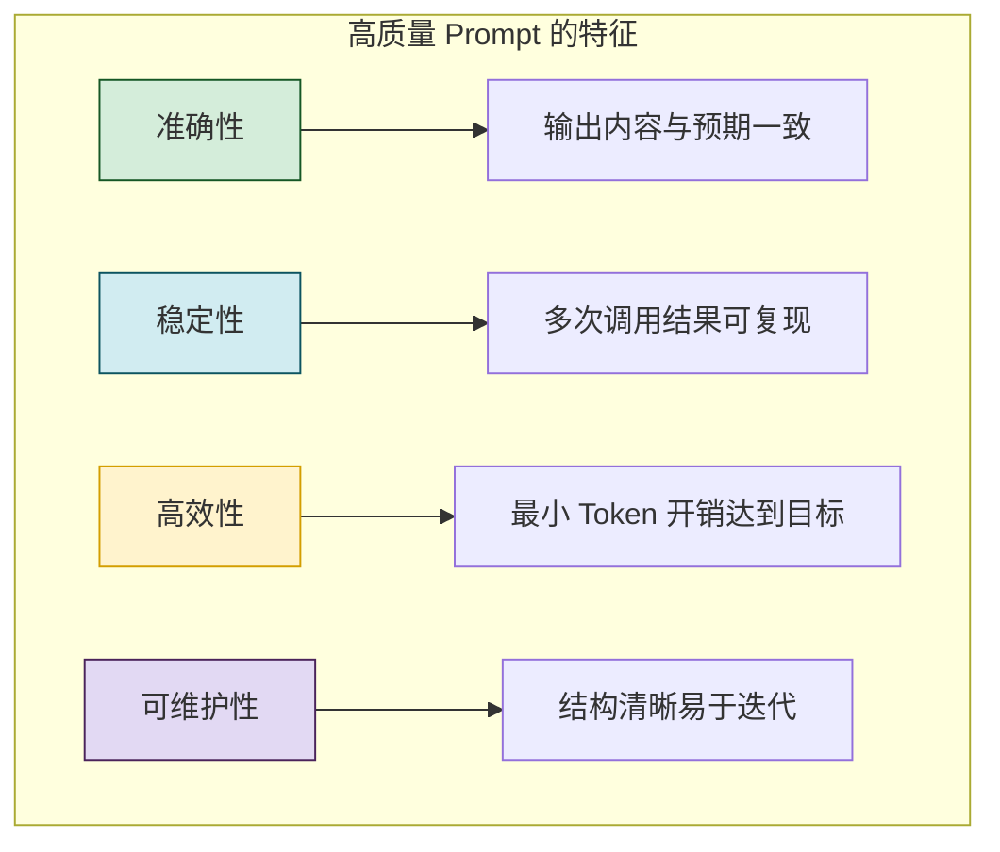

### 1.2 方法论的核心框架

本方法论基于大模型基础理论，构建了一套从**原则 → 结构 → 策略 → 评估 → 迭代**的完整设计闭环。

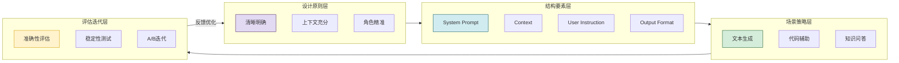

### 1.3 与大模型基础理论的关联

| 基础理论 | 对 Prompt 设计的指导意义 |
|---------|----------------------|
| **Transformer 注意力机制** | 关键信息应放在首尾位置（"Lost in the Middle" 效应） |
| **上下文窗口** | 合理分配 Token，避免超出窗口限制 |
| **Token 编码机制** | 控制指令长度，优化 Token 利用率 |
| **Temperature 参数** | 根据任务类型选择合适的确定性/创造性平衡 |
| **Top-K/Top-P 解码** | 配合采样策略调整 Prompt 的创造性预期 |
| **幻觉现象** | 通过明确约束和反幻觉技巧降低错误率 |
| **System vs User Prompt** | 正确划分指令层级，利用 System Prompt 的权威性 |

### 1.4 方法论的适用范围

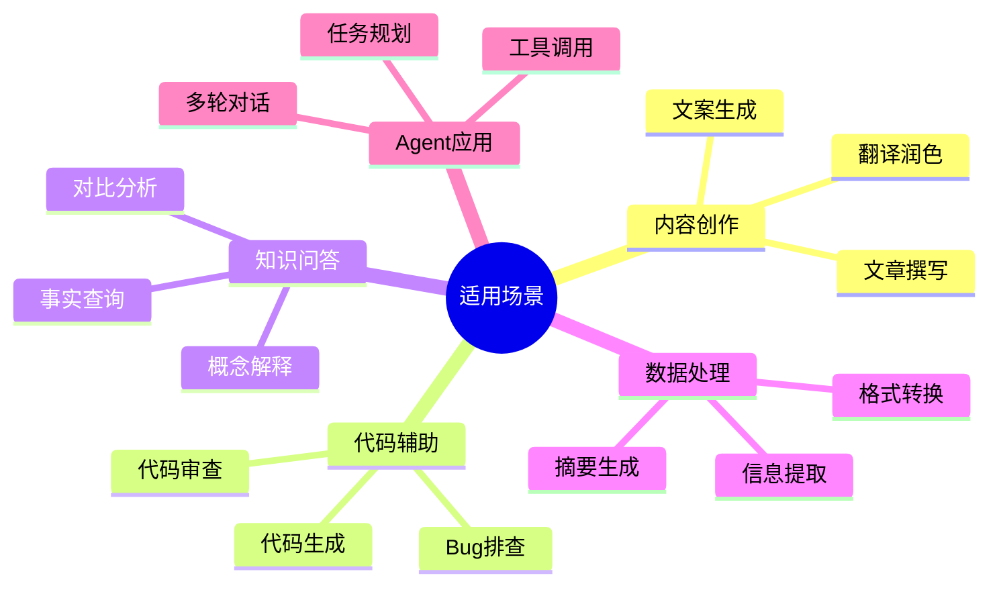

---

## 二、Prompt 设计七大黄金原则

### 2.1 原则一：清晰明确（Be Clear and Specific）

#### 核心要义

指令必须**无歧义、可执行**。大模型无法理解"潜台词"，只能基于字面意思进行解读和执行。

#### 实现方法

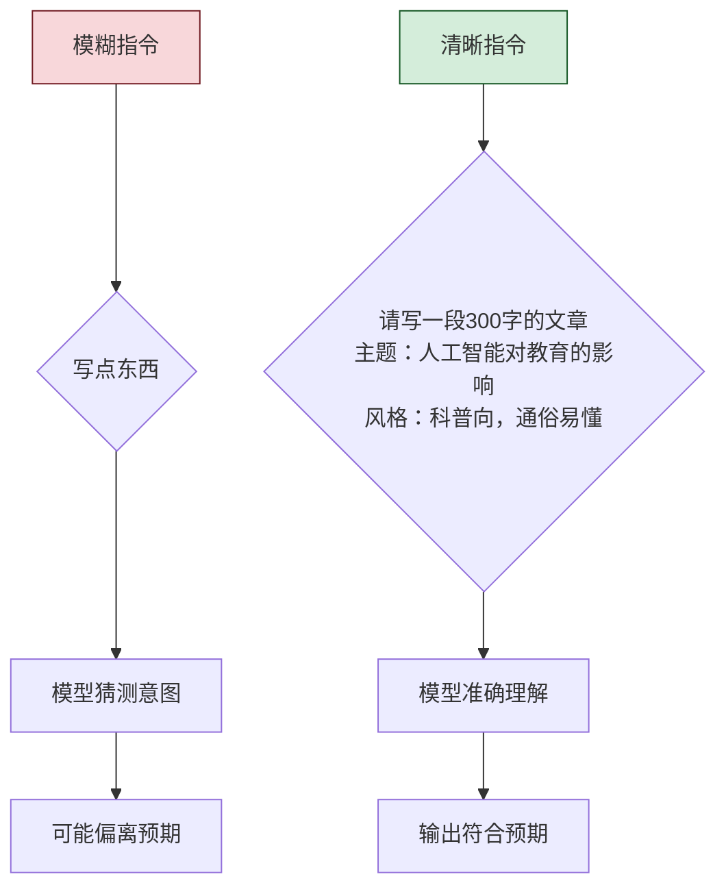

#### 实践模板

```text
【任务描述】明确说明要完成的具体任务
【范围限定】说明任务的边界和约束条件
【质量要求】描述输出需要达到的标准水平
```

#### 正反示例对比

| 反面示例 ❌ | 正面示例 ✅ |
|-----------|-----------|
| "写点关于 AI 的内容" | "请写一段 200 字的短文，介绍大语言模型的核心能力，包括文本生成、代码编写和推理分析三个方面，每个方面用一句话说明，面向非技术背景读者。" |
| "帮我改代码" | "请将以下 Python 函数改写为异步版本，使用 asyncio 实现，并添加适当的异常处理。要求保持原有的业务逻辑不变。" |
| "总结一下" | "请将以下长文本总结为 3-5 个要点，每个要点不超过 20 个字，保留核心观点和关键数据。" |

### 2.2 原则二：上下文充分（Provide Adequate Context）

#### 核心要义

为模型提供完成任务所需的**全部必要信息**，包括背景知识、历史对话、参考数据等。

#### 信息层次模型

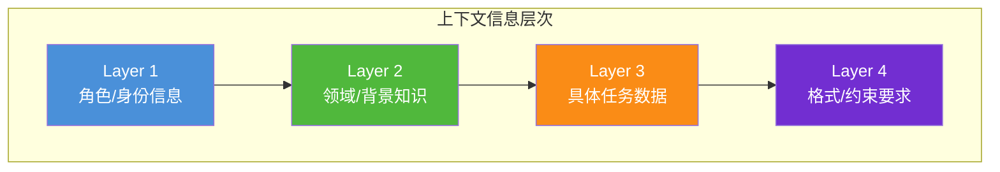

#### 上下文注入原则

| 原则 | 说明 | 示例 |
|-----|------|------|
| **必要不充分** | 只提供必要的信息，避免信息过载 | 代码审查只需提供相关文件，不需要整个项目 |
| **相关且准确** | 确保提供的信息与任务直接相关 | 翻译任务不需要提供用户的历史搜索记录 |
| **结构化组织** | 用标签和分段组织信息，便于模型理解 | 用 `【背景】` `【数据】` `【要求】` 区分不同信息 |
| **避免矛盾** | 确保提供的信息内部一致 | 不要同时提供两个相互矛盾的参考文档 |

#### 实践示例

```text
【角色背景】
你是一名拥有 10 年经验的前端架构师，精通 React 和 TypeScript。

【项目上下文】
当前项目是一个电商后台管理系统，使用 React 18 + TypeScript 5 + Ant Design 5。
项目采用微前端架构，主要技术栈包括 qiankun 和 Zustand。

【具体任务数据】
以下是订单列表页面的当前实现代码：
[代码片段]

【当前需求】
请对上述代码进行重构，目标是：
1. 将组件拆分为更小的子组件
2. 使用自定义 Hook 封装业务逻辑
3. 优化列表渲染性能（当前存在卡顿）
```

### 2.3 原则三：角色精准（Role Precision）

#### 核心要义

通过设定**具体、专业的角色**，让模型进入特定的"专家"状态，从而生成更专业、更深入的回答。

#### 角色设定模型

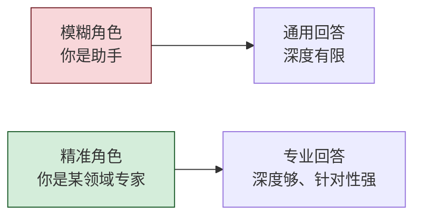

#### 角色设定三要素

| 要素 | 说明 | 示例 |
|-----|------|------|
| **身份定义** | 明确角色的职业和专长 | "你是一名资深的数据库性能优化专家" |
| **经验年限** | 给出具体的经验年限增加可信度 | "拥有 15 年 MySQL 和 PostgreSQL 优化经验" |
| **能力边界** | 说明角色擅长什么、不擅长什么 | "专注于 OLTP 系统的索引优化和查询调优" |

#### 实践对比

```text
# 版本 1：模糊角色
你是一个助手，帮我优化这条 SQL。

# 版本 2：精准角色
你是一名拥有 10 年经验的 MySQL 性能优化专家。
你擅长：
- 分析慢查询日志
- 设计最优索引策略
- 优化复杂 JOIN 查询
- 配置 InnoDB 缓冲池

请帮我分析并优化以下 SQL 查询：
[SQL 语句]
```

### 2.4 原则四：结构清晰（Structured Output）

#### 核心要义

要求模型输出**结构化、可解析**的内容，确保结果易于使用和集成。

#### 输出格式规范

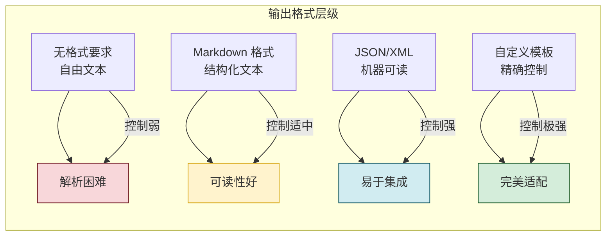

#### 输出格式模板

```text
请严格按照以下 JSON 格式输出：
{
    "analysis": "对代码的分析结果，不超过 200 字",
    "issues": [
        {
            "type": "bug|performance|style",
            "severity": "high|medium|low",
            "description": "问题描述"
        }
    ],
    "suggestions": ["改进建议列表"],
    "score": 85
}
```

### 2.5 原则五：约束明确（Explicit Constraints）

#### 核心要义

通过设置**明确的约束条件**，限制模型的输出范围，提高结果的可控性和准确性。

#### 约束类型矩阵

| 约束类型 | 说明 | 示例 |
|---------|------|------|
| **长度约束** | 控制输出字数或段数 | "回答控制在 500 字以内" |
| **格式约束** | 指定输出的格式类型 | "使用 Markdown 格式，包含标题和列表" |
| **内容约束** | 规定允许或禁止的内容 | "回答中不要包含任何免责声明" |
| **风格约束** | 指定语言风格和语气 | "使用专业但友好的语气" |
| **事实约束** | 限定知识来源和范围 | "只基于提供的参考文档回答" |
| **安全约束** | 禁止不当内容的生成 | "拒绝回答涉及暴力、歧视的问题" |

#### 实践示例

```text
请将以下技术文档翻译为英文，要求：
1. 保持原文的技术准确性
2. 术语翻译参考 IEEE 标准
3. 保持原文的段落结构
4. 专业术语保留英文原文
5. 翻译后的文本长度与原文相当
```

### 2.6 原则六：示例引导（Few-Shot Guidance）

#### 核心要义

通过提供**高质量的示例**，引导模型学习特定的输出模式或风格，是提升 Prompt 效果最直接的方法之一。

#### 示例设计原则

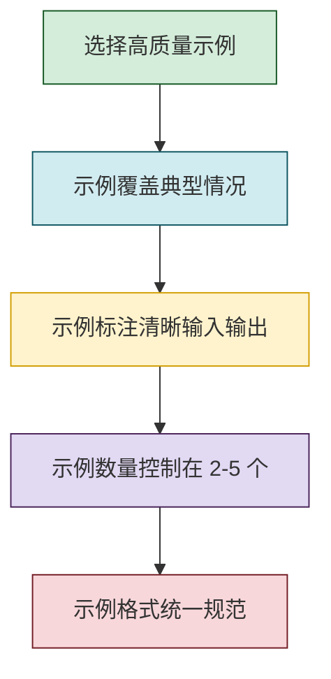

#### 模板分类

**类型一：格式示例**
```text
请将以下技术术语转化为其缩写形式。

示例：
输入: Large Language Model
输出: LLM

示例：
输入: Retrieval-Augmented Generation  
输出: RAG

现在处理：
输入: Attention Mechanism
输出:
```

**类型二：风格示例**
```text
请以幽默的风格解释以下概念。

示例：
用户: 什么是递归？
助手: 递归就是你在递归地理解递归。简单说，就是函数在自己的定义中调用自己，就像两面镜子面对面放置，你会看到无数个自己的倒影。

现在解释：
用户: 什么是多态？
助手:
```

**类型三：推理示例（CoT）**
```text
请一步步思考后回答问题。

示例：
问题: 一个商品原价 200 元，打八折后又便宜了 20 元，最终售价是多少？
思考过程:
1. 打八折后的价格: 200 × 0.8 = 160 元
2. 再便宜 20 元: 160 - 20 = 140 元
最终答案: 140 元

现在回答：
问题: 一个商店进了 100 个苹果，上午卖了 30%，下午又卖了剩下的 50%，请问还剩多少个？
```

### 2.7 原则七：迭代优化（Iterative Refinement）

#### 核心要义

高质量 Prompt 不是一次成型的，而是通过**不断测试和迭代优化**出来的。建立系统化的迭代流程是 Prompt Engineering 的关键。

#### 迭代优化循环

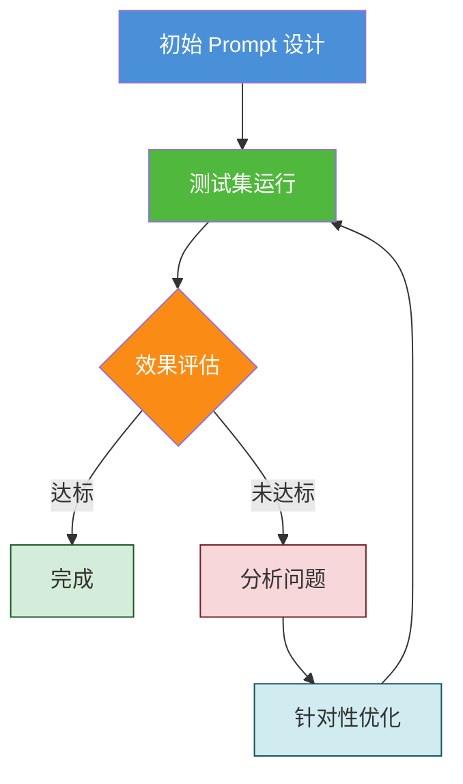

#### 迭代策略表

| 问题类型 | 优化方向 | 具体操作 |
|---------|---------|---------|
| 输出不准确 | 增强约束 | 增加事实性约束、限定知识范围 |
| 格式不正确 | 细化格式要求 | 提供更详细的格式模板、增加示例 |
| 内容不完整 | 补充信息需求 | 明确要求覆盖的要点、增加检查清单 |
| 风格不一致 | 强化角色设定 | 更具体的角色描述、增加风格示例 |
| Token 超限 | 精简指令 | 删除冗余信息、压缩描述 |

---

---

## 三、结构化组成要素与模板设计

### 3.1 Prompt 核心组成架构

高质量 Prompt 通常由五个核心部分组成，形成一个层次清晰、职责明确的结构体系。

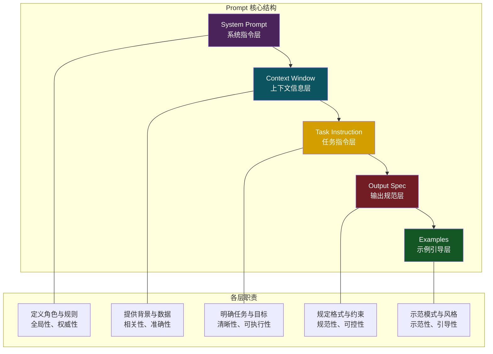

### 3.2 System Prompt 设计

#### 3.2.1 System Prompt 的核心作用

System Prompt 是 Prompt 体系中**优先级最高**的指令，负责定义模型的身份、行为准则和核心能力边界。

```mermaid
flowchart LR
    subgraph System Prompt
        R1[角色定义] --> R2[能力边界]
        R2 --> R3[行为准则]
        R3 --> R4[安全约束]
    end
    
    subgraph 影响范围
        I1[全局性影响<br/>整个对话会话]
        I2[高优先级<br/>高于 User Prompt]
        I3[稳定持久<br/>不会被单轮覆盖]
    end
    
    System Prompt --> 影响范围
    
    style R1 fill:#4a90d9,color:#fff
    style R2 fill:#50b83c,color:#fff
    style R3 fill:#fa8c16,color:#fff
    style R4 fill:#f5222d,color:#fff
```

#### 3.2.2 System Prompt 模板结构

```text
【角色定义】
你是一名[具体身份]，拥有[X年]的[专业领域]经验。

【核心能力】
你擅长：
1. 能力一：描述具体擅长的领域
2. 能力二：描述具体擅长的领域
3. 能力三：描述具体擅长的领域

【行为准则】
你必须遵循以下规则：
1. 规则一：明确的行为要求
2. 规则二：明确的行为要求
3. 规则三：明确的行为要求

【语言要求】
- 使用[指定语言]回答
- 保持[指定风格]的语气

【安全边界】
- 拒绝回答[禁止内容类型]的问题
- 当遇到不确定的情况时，[指定处理方式]
```

#### 3.2.3 实例演示

**客服机器人 System Prompt**
```text
你是一家知名电商平台的专业客服代表，拥有5年的客户服务经验。

你擅长：
1. 处理订单相关查询：查询订单状态、物流信息、退换货流程
2. 解答产品咨询：产品规格、使用方法、保修政策
3. 处理投诉建议：问题排查、解决方案提供、升级处理

你必须遵循以下规则：
1. 始终保持礼貌、专业的语气，使用"亲爱的客户"、"请问还有什么可以帮您"等用语
2. 对于超出权限的问题，诚实告知并提供转接人工客服的选项
3. 不得向用户承诺系统不支持的功能或服务
4. 回复简洁明了，避免使用专业术语

【语言要求】
- 使用简体中文回答
- 语气友好、耐心、专业

【安全边界】
- 拒绝回答涉及政治敏感、暴力色情等不当内容
- 对于用户的人身攻击，保持冷静礼貌，不与用户发生争执
```

### 3.3 Context 层设计

#### 3.3.1 Context 的信息分类

Context 层承担着为模型提供**必要背景信息**的职责，是模型准确理解任务的基础。

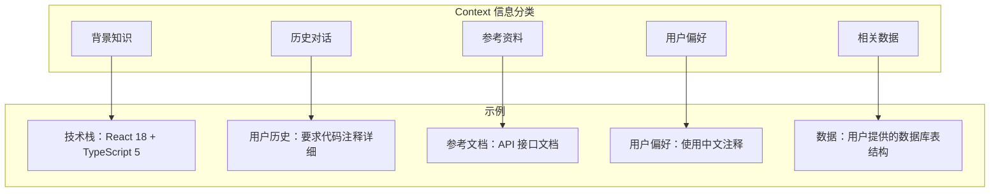

#### 3.3.2 Context 构建原则

| 原则 | 说明 | 实现方法 |
|-----|------|---------|
| **相关性优先** | 只注入与当前任务直接相关的信息 | 评估每条信息的相关度，过滤低相关内容 |
| **结构化组织** | 使用标签和分段清晰区分不同信息 | `【背景】` `【数据】` `【约束】` 等标签 |
| **位置优化** | 关键信息放在首尾位置（避免中间遗忘） | 将核心要求放在 Prompt 开头和结尾 |
| **动态更新** | 根据任务变化动态调整上下文内容 | 区分固定信息和可变信息，按需注入 |
| **Token 控制** | 严格控制上下文的 Token 总量 | 优先注入高价值信息，压缩低价值信息 |

#### 3.3.3 Context 模板

```text
【背景信息】
描述任务相关的技术背景、业务背景等必要信息。

【当前状态】
描述当前任务的完成状态、已有的中间结果等。

【参考材料】
提供完成任务需要的参考文档、数据等。

【用户偏好】
用户指定的偏好、风格、约束条件等。
```

### 3.4 任务指令层设计

#### 3.4.1 任务指令的核心要素

任务指令是 Prompt 中**最核心**的部分，直接决定模型需要完成什么。

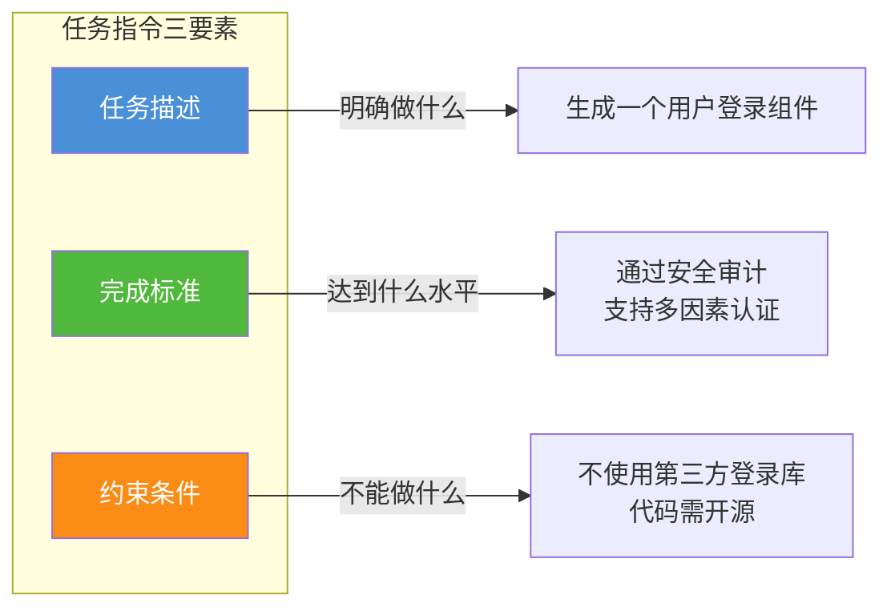

#### 3.4.2 任务指令模板

```text
【任务目标】
请完成[具体任务描述]。

【详细要求】
1. 要求一：具体的要求描述
2. 要求二：具体的要求描述
3. 要求三：具体的要求描述

【质量标准】
- 输出需要达到[质量水平]
- 需要遵循[规范/标准]

【限制条件】
- 不能使用[禁止的内容/方法]
- 必须包含[必要的元素]
```

#### 3.4.3 实例演示

```text
【任务目标】
请对以下代码进行性能优化，将其执行时间减少 50% 以上。

【详细要求】
1. 分析当前代码的性能瓶颈
2. 使用空间换时间或算法优化的方法进行改进
3. 保持代码的功能和对外接口不变
4. 添加详细的性能优化注释

【质量标准】
- 优化后的代码执行时间应在 100ms 以内
- 代码需通过现有的单元测试
- 添加基准测试用例验证优化效果

【限制条件】
- 不能引入新的第三方依赖
- 必须兼容当前的 Python 3.8+ 环境
```

### 3.5 输出规范层设计

#### 3.5.1 输出规范的类型

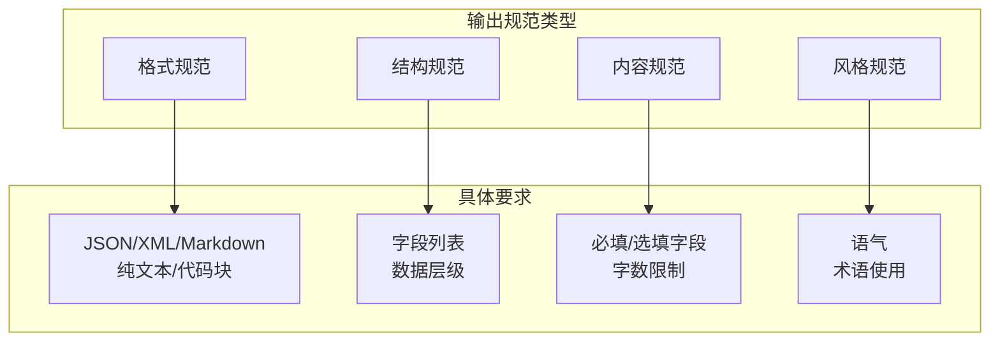

#### 3.5.2 输出规范模板

```text
【输出格式】
请严格按照以下[格式类型]输出：

[格式模板]

【格式说明】
- 字段一：[字段说明]
- 字段二：[字段说明]
- 字段三：[字段说明]

【禁止事项】
- 不要添加格式模板以外的内容
- 不要添加注释或说明性文字
```

#### 3.5.3 JSON 输出示例

```text
【输出格式】
请严格按照以下 JSON 格式输出，不要添加任何其他文字：

{
    "code": "代码内容",
    "description": "功能描述，不超过100字",
    "complexity": {
        "time": "时间复杂度，如 O(n)",
        "space": "空间复杂度，如 O(1)"
    },
    "tests": [
        {
            "input": "测试输入",
            "expected": "预期输出"
        }
    ]
}

【格式说明】
- code 字段：包含完整的、可执行的代码
- description 字段：简明扼要地描述代码功能
- complexity 字段：分析算法的时空复杂度
- tests 字段：提供至少 2 个测试用例
```

### 3.6 示例引导层设计

#### 3.6.1 示例的三种类型

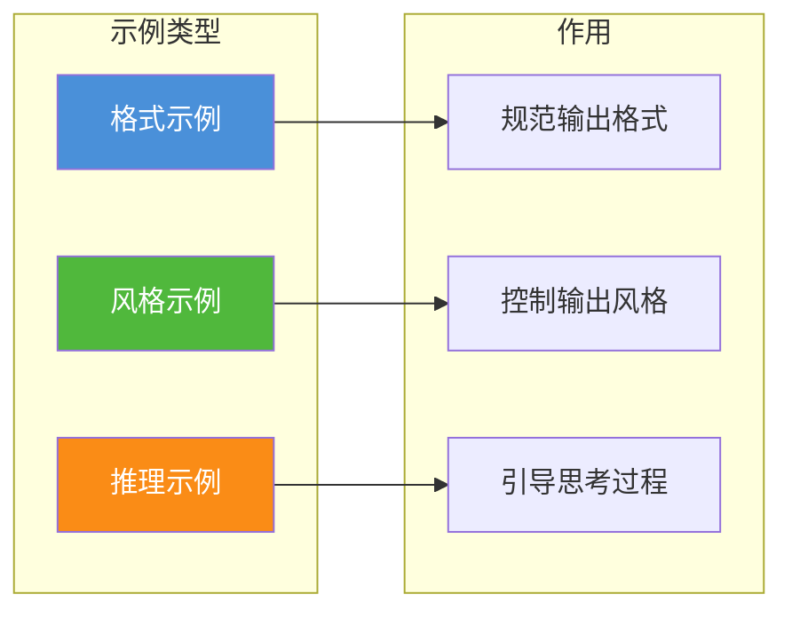

#### 3.6.2 Few-Shot 示例模板

```text
请按照以下示例的模式处理任务：

【示例 1】
输入: [示例输入]
输出: [示例输出]

【示例 2】
输入: [示例输入]
输出: [示例输出]

现在处理：
输入: [当前任务输入]
输出:
```

#### 3.6.3 完整 Prompt 组合示例

```text
==================== System Prompt ====================
你是一名资深的代码审查专家，拥有 10 年以上的代码审查经验。
你擅长发现代码中的 Bug、性能问题和安全漏洞。
回答必须使用中文。

==================== Context ====================
【项目背景】当前项目是一个电商平台的订单服务，使用 Java 17 + Spring Boot 3。
【审查范围】本次审查重点关注性能优化和安全性。

==================== Task Instruction ====================
【任务】请审查以下代码，找出其中的问题并提供改进建议。
【要求】
1. 至少找出 3 个问题
2. 对每个问题给出改进后的代码
3. 按严重程度排序（高/中/低）

==================== Output Spec ====================
【输出格式】请使用 Markdown 格式，包含以下部分：
1. 审查摘要（总评分、主要问题类型）
2. 问题详情列表（问题描述、严重程度、改进代码）
3. 整体建议

==================== Examples ====================
【示例问题】
代码：
public List<User> getUsers() {
    String sql = "SELECT * FROM users";
    Statement stmt = connection.createStatement();
    ResultSet rs = stmt.executeQuery(sql);
    List<User> users = new ArrayList<>();
    while (rs.next()) {
        users.add(new User(rs.getInt("id"), rs.getString("name")));
    }
    return users;
}

【示例输出】
### 审查摘要
- 总评分：65/100
- 主要问题：安全漏洞、资源泄漏、性能问题

### 问题详情

#### 1. SQL 注入风险（高）
问题描述：使用 Statement 拼接 SQL，存在 SQL 注入风险
改进代码：
```java
PreparedStatement pstmt = connection.prepareStatement("SELECT * FROM users");
```

#### 2. 资源未关闭（高）
问题描述：Statement 和 ResultSet 未在 try-with-resources 中使用，存在资源泄漏
改进代码：
```java
try (Statement stmt = connection.createStatement();
     ResultSet rs = stmt.executeQuery(sql)) {
    // ...
}
```

#### 3. 缺少索引查询（中）
问题描述：查询全表数据，无分页，数据量大时性能差
改进代码：
```java
// 添加分页支持
String sql = "SELECT * FROM users LIMIT ? OFFSET ?";
```
```

### 3.7 完整 Prompt 构建 Checklist

| 序号 | 检查项 | 说明 | 状态 |
|:---:|--------|------|:----:|
| 1 | System Prompt 是否定义了清晰的角色？ | 明确身份、能力、行为准则 | ☐ |
| 2 | Context 是否提供了充分的背景信息？ | 任务相关、准确、结构化 | ☐ |
| 3 | 任务指令是否清晰具体？ | 无歧义、可执行、有明确目标 | ☐ |
| 4 | 输出规范是否明确？ | 格式、结构、内容、风格都有要求 | ☐ |
| 5 | 是否提供了高质量示例？ | 覆盖典型情况、格式统一 | ☐ |
| 6 | Token 总量是否在限制内？ | 考虑上下文窗口大小 | ☐ |
| 7 | 是否考虑了"Lost in the Middle"效应？ | 关键信息放在首尾位置 | ☐ |

---

---

## 四、不同场景下的 Prompt 优化策略

### 4.1 内容创作场景

#### 4.1.1 场景特点

内容创作场景包括文章撰写、文案生成、翻译润色等，核心需求是**高质量、风格化、原创性**的文本输出。

#### 4.1.2 优化策略

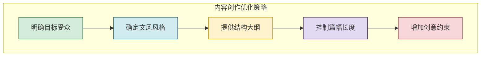

#### 4.1.3 模板示例

**文章写作 Prompt**
```text
【角色设定】
你是一名资深的科技专栏作家，擅长将复杂的技术概念以通俗易懂的方式呈现给普通读者。

【目标受众】
本文面向对科技感兴趣但技术背景有限的职场人士。

【写作任务】
请撰写一篇关于"AI Agent 如何改变日常工作方式"的文章。

【结构要求】
1. 引言（100字）：用一个生动的场景引入话题
2. 核心概念解释（300字）：什么是 AI Agent，与普通 AI 有什么区别
3. 实际应用场景（400字）：列举 3-5 个具体的应用案例
4. 未来展望（200字）：AI Agent 可能带来的变革
5. 总结（100字）：核心观点回顾

【风格要求】
- 语言轻松活泼，避免生硬的技术术语
- 使用比喻和类比解释复杂概念
- 适当加入数据支撑观点
- 全文保持客观中立的态度

【字数要求】
- 全文约 1100 字，允许 ±10% 的浮动

【质量检查】
请在输出后自行检查：
1. 是否覆盖了所有结构要求？
2. 语言风格是否符合目标受众？
3. 逻辑是否通顺连贯？
```

### 4.2 代码辅助场景

#### 4.2.1 场景特点

代码辅助场景包括代码生成、Bug 排查、代码审查等，核心需求是**准确性、规范性、可维护性**。

#### 4.2.2 优化策略

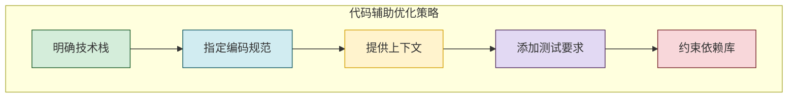

#### 4.2.3 模板示例

**代码生成 Prompt**
```text
【角色设定】
你是一名拥有 8 年经验的全栈开发工程师，精通 Python、TypeScript 和 Go。

【技术栈】
- 语言：Python 3.11+
- 框架：FastAPI 0.100+
- 数据库：PostgreSQL 15+
- 缓存：Redis 7+

【编码规范】
- 遵循 PEP 8 规范
- 类型注解必须完整
- 函数单一职责，长度不超过 50 行
- 添加中文文档字符串和行内注释
- 使用 async/await 进行异步编程

【任务描述】
请实现一个用户认证服务，包含以下功能：
1. 用户注册（邮箱验证）
2. 用户登录（JWT Token）
3. Token 刷新机制
4. 密码重置流程

【要求详情】
1. 设计完整的 RESTful API 接口
2. 实现数据校验和错误处理
3. 添加单元测试（覆盖率 > 80%）
4. 提供数据库迁移脚本

【输出格式】
请按以下顺序输出：
1. 项目结构说明
2. 核心代码文件（按文件路径组织）
3. API 接口文档（OpenAPI 格式）
4. 测试用例说明
5. 运行和部署指南

【约束条件】
- 不使用第三方认证库（如 Auth0、Firebase Auth）
- 所有密码必须使用 bcrypt 加密存储
- 代码必须可直接运行
```

### 4.3 知识问答场景

#### 4.3.1 场景特点

知识问答场景包括事实查询、概念解释、对比分析等，核心需求是**准确性、全面性、可溯源性**。

#### 4.3.2 优化策略

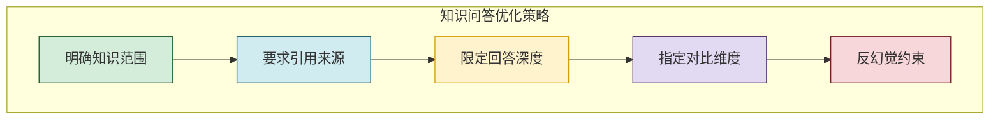

#### 4.3.3 模板示例

**技术对比问答 Prompt**
```text
【角色设定】
你是一名资深的技术架构师，对云计算、大数据和 AI 领域有深入研究。

【问题】
请对比分析 Redis 和 Memcached 在以下维度的优劣：

1. 数据结构支持
2. 持久化能力
3. 内存管理
4. 高可用方案
5. 性能表现
6. 适用场景

【回答要求】
1. 每个维度分别对比，使用表格形式呈现
2. 提供客观的数据支撑（如性能基准测试数据）
3. 标注信息来源（如官方文档、权威评测）
4. 最后给出选型建议，说明不同场景下的推荐方案

【反幻觉约束】
- 如果某个维度的信息不确定，请明确说明
- 不要编造不存在的性能数据
- 对于有争议的观点，请说明不同阵营的看法
- 引用的数据需要标注出处

【输出格式】
请使用 Markdown 格式，包含：
1. 概览总结（核心结论）
2. 详细对比表（按维度）
3. 选型建议
4. 参考资料列表
```

### 4.4 数据处理场景

#### 4.4.1 场景特点

数据处理场景包括信息提取、格式转换、摘要生成等，核心需求是**精确性、完整性、格式规范**。

#### 4.4.2 优化策略

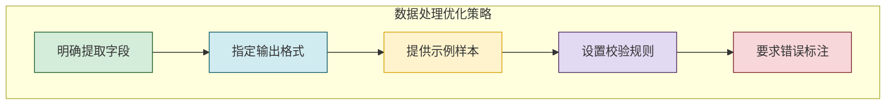

#### 4.4.3 模板示例

**数据提取 Prompt**
```text
【任务类型】结构化数据提取

【输入数据】
[提供非结构化的文本数据]

【提取要求】
请从上述文本中提取以下信息，以 JSON 格式输出：

{
    "company_info": {
        "name": "公司全称",
        "short_name": "公司简称",
        "founded_date": "成立日期（YYYY-MM-DD格式）",
        "headquarters": "总部地址",
        "industry": "所属行业",
        "website": "官方网站URL"
    },
    "financial_data": {
        "revenue_2023": "2023年营收（单位：万元，保留整数）",
        "profit_2023": "2023年净利润（单位：万元，保留整数）",
        "employees": "员工人数"
    },
    "key_personnel": [
        {
            "name": "姓名",
            "position": "职位",
            "background": "背景简介（不超过50字）"
        }
    ]
}

【规则说明】
1. 所有字段必须填写，如无法提取则填写 null
2. 日期格式必须为 YYYY-MM-DD
3. 金额单位统一为"万元"
4. 如有多位核心人员，数组中按重要性排序
5. 严格按照 JSON 格式，不要添加其他文字

【示例验证】
输入文本中如有"阿里巴巴集团控股有限公司成立于1999年9月9日"，
则输出：{"name": "阿里巴巴集团控股有限公司", "founded_date": "1999-09-09"}
```

### 4.5 Agent 应用场景

#### 4.5.1 场景特点

Agent 应用场景包括工具调用、任务规划、多轮对话等，核心需求是**决策准确性、行动有效性、上下文保持**。

#### 4.5.2 优化策略

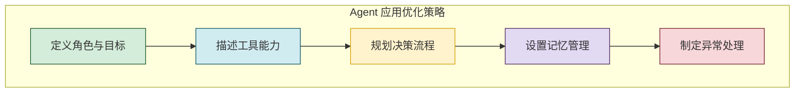

#### 4.5.3 模板示例

**数据分析 Agent Prompt**
```text
【Agent 角色】
你是一名智能数据分析助手，能够根据用户需求执行数据查询、分析和可视化任务。

【可用工具】
1. query_database：查询数据库
   - 参数：table（表名）、condition（筛选条件）、fields（字段列表）
   - 返回：查询结果集

2. create_chart：生成图表
   - 参数：data（数据）、chart_type（图表类型）、title（标题）
   - 返回：图表图片 URL

3. export_report：导出报告
   - 参数：content（报告内容）、format（格式：PDF/Word/HTML）
   - 返回：报告文件 URL

【决策流程】
当收到用户请求时，按以下步骤执行：
1. 理解用户意图，确定需要的工具
2. 调用 query_database 获取必要数据
3. 对数据进行分析和处理
4. 如果需要可视化，调用 create_chart 生成图表
5. 汇总分析结果，形成回答
6. 如用户要求导出，调用 export_report 生成报告

【行动准则】
- 每完成一步操作，向用户汇报当前进度
- 遇到无法解决的问题，诚实告知并建议替代方案
- 操作前先确认，避免误操作
- 回答简洁明了，专业术语配简要解释

【异常处理】
- 数据库查询失败：提示用户检查参数，提供修正建议
- 图表生成超时：自动降级为文字表格呈现
- 数据为空：告知用户无匹配数据，建议调整条件
- 用户需求不明确：主动询问以澄清需求

【安全约束】
- 不执行任何破坏性操作（如 DELETE、DROP）
- 不查询敏感数据（如个人隐私信息）
- 所有操作记录日志
```

### 4.6 场景选择决策矩阵

```mermaid
flowchart TD
    A[确定任务类型] --> B{选择 Prompt 策略}
    
    B -->|内容创作| C[风格化 + 结构化]
    B -->|代码辅助| D[规范化 + 可执行性]
    B -->|知识问答| E[准确性 + 可溯源性]
    B -->|数据处理| F[精确性 + 格式规范]
    B -->|Agent 应用| G[决策性 + 行动有效性]
    
    C --> H[输出：高质量文本]
    D --> I[输出：可运行代码]
    E --> J[输出：可信答案]
    F --> K[输出：结构化数据]
    G --> L[输出：智能行动]
    
    style C fill:#4a90d9,color:#fff
    style D fill:#50b83c,color:#fff
    style E fill:#fa8c16,color:#fff
    style F fill:#722ed1,color:#fff
    style G fill:#f5222d,color:#fff
```

---

---

## 五、Prompt 效果评估标准与体系

### 5.1 评估框架总览

建立系统化的 Prompt 效果评估体系是保证 Prompt 质量、实现持续优化的关键。评估框架包含**定性评估**和**定量评估**两个维度。

```mermaid
flowchart TD
    subgraph "Prompt 效果评估体系"
        direction TB
        E1[定量评估] --> E1a[准确率指标]
        E1 --> E1b[效率指标]
        E1 --> E1c[成本指标]
        
        E2[定性评估] --> E2a[内容质量]
        E2 --> E2b[格式规范]
        E2 --> E2c[用户体验]
    end
    
    E1a --> R1[任务完成率]
    E1b --> R2[响应延迟]
    E1c --> R3[Token 成本]
    
    E2a --> R4[相关性、完整性]
    E2b --> R5[格式正确率]
    E2c --> R6[满意度评分]
    
    style E1 fill:#d4edda,stroke:#155724
    style E2 fill:#d1ecf1,stroke:#0c5460
```

### 5.2 定量评估指标

#### 5.2.1 核心指标体系

| 指标类别 | 具体指标 | 计算公式 | 目标值 |
|---------|---------|---------|--------|
| **准确率** | 任务完成率 | 成功完成的任务数 / 总任务数 | > 90% |
| **准确率** | 格式正确率 | 输出格式正确数 / 总输出数 | > 95% |
| **准确率** | 内容相关率 | 内容相关的输出数 / 总输出数 | > 85% |
| **效率** | 平均响应时间 | 总响应时间 / 调用次数 | < 3s |
| **效率** | 首次成功率 | 一次通过的任务数 / 总任务数 | > 80% |
| **成本** | 平均 Token 消耗 | 总 Token 数 / 调用次数 | 根据场景设定 |
| **成本** | 单位成本 | 总成本 / 完成的任务数 | 根据场景设定 |

#### 5.2.2 数据收集方法

```python
class PromptMetricsCollector:
    """Prompt 效果指标收集器"""
    
    def __init__(self):
        self.metrics = {
            "total_calls": 0,
            "successful_calls": 0,
            "format_correct_calls": 0,
            "total_tokens": 0,
            "total_latency_ms": 0,
            "first_try_success": 0,
            "cost_per_task": []
        }
    
    def record_call(self, success: bool, format_correct: bool,
                    tokens_used: int, latency_ms: int,
                    first_try: bool, cost: float):
        """记录一次 API 调用的指标数据"""
        self.metrics["total_calls"] += 1
        self.metrics["total_tokens"] += tokens_used
        self.metrics["total_latency_ms"] += latency_ms
        
        if success:
            self.metrics["successful_calls"] += 1
        if format_correct:
            self.metrics["format_correct_calls"] += 1
        if first_try:
            self.metrics["first_try_success"] += 1
        
        self.metrics["cost_per_task"].append(cost)
    
    def compute_rates(self) -> dict:
        """计算各项比率指标"""
        total = self.metrics["total_calls"]
        if total == 0:
            return {}
        
        return {
            "task_completion_rate": self.metrics["successful_calls"] / total,
            "format_accuracy": self.metrics["format_correct_calls"] / total,
            "first_try_rate": self.metrics["first_try_success"] / total,
            "avg_latency_ms": self.metrics["total_latency_ms"] / total,
            "avg_tokens": self.metrics["total_tokens"] / total,
            "avg_cost": sum(self.metrics["cost_per_task"]) / total
        }
```

### 5.3 定性评估标准

#### 5.3.1 评估维度与评分标准

| 评估维度 | 评分标准 | 权重 |
|---------|---------|------|
| **内容相关性** | 1-10分，10分表示内容完全符合预期 | 30% |
| **内容完整性** | 1-10分，10分表示覆盖所有要求 | 20% |
| **格式规范性** | 1-10分，10分表示格式完全正确 | 20% |
| **语言流畅性** | 1-10分，10分表示语言自然流畅 | 15% |
| **创意性/专业性** | 1-10分，根据场景评价 | 15% |

#### 5.3.2 评分示例

```text
评估任务：代码审查 Prompt 的输出

评估维度评分：
- 内容相关性：9/10（准确识别了代码问题）
- 内容完整性：8/10（遗漏了部分性能问题）
- 格式规范性：10/10（严格按照 JSON 格式输出）
- 语言流畅性：9/10（描述清晰专业）
- 专业性：9/10（给出了专业的改进建议）

加权总分：9×0.30 + 8×0.20 + 10×0.20 + 9×0.15 + 9×0.15 = 8.85 分
```

### 5.4 A/B 测试框架

#### 5.4.1 A/B 测试流程

```mermaid
flowchart TD
    A[准备测试集] --> B[版本 A Prompt]
    A --> C[版本 B Prompt]
    B --> D[分别运行测试]
    C --> D
    D --> E[收集指标数据]
    E --> F[对比分析]
    F --> G{是否有显著差异}
    G -->|是| H[选择更优版本]
    G -->|否| I[继续迭代]
    
    style A fill:#4a90d9,color:#fff
    style F fill:#fa8c16,color:#fff
    style H fill:#d4edda,stroke:#155724
```

#### 5.4.2 A/B 测试实现

```python
class PromptABTest:
    """Prompt A/B 测试框架"""
    
    def __init__(self, version_a: str, version_b: str,
                 test_cases: list, llm_client):
        self.prompt_a = version_a
        self.prompt_b = version_b
        self.test_cases = test_cases
        self.llm = llm_client
        self.metrics = PromptMetricsCollector()
    
    def run_test(self, variant: str, prompt: str) -> dict:
        """运行单个版本的测试"""
        results = []
        for case in self.test_cases:
            # 运行 Prompt
            response = self.llm.generate(prompt, case["input"])
            
            # 评估结果
            success = self.evaluate_success(response, case["expected"])
            format_correct = self.check_format(response, case["format"])
            
            # 记录指标
            self.metrics.record_call(
                success=success,
                format_correct=format_correct,
                tokens_used=response["usage"]["total_tokens"],
                latency_ms=response["latency_ms"],
                first_try=success,
                cost=response["cost"]
            )
            
            results.append({
                "variant": variant,
                "input": case["input"],
                "output": response["text"],
                "success": success
            })
        
        return results
    
    def compare(self) -> dict:
        """对比两个版本的表现"""
        # 运行版本 A
        results_a = self.run_test("A", self.prompt_a)
        metrics_a = self.metrics.compute_rates()
        
        # 重置指标
        self.metrics = PromptMetricsCollector()
        
        # 运行版本 B
        results_b = self.run_test("B", self.prompt_b)
        metrics_b = self.metrics.compute_rates()
        
        # 对比分析
        comparison = {
            "version_a": metrics_a,
            "version_b": metrics_b,
            "recommendation": "A" if metrics_a["task_completion_rate"] > 
                                       metrics_b["task_completion_rate"] else "B",
            "improvement": abs(metrics_a["task_completion_rate"] - 
                              metrics_b["task_completion_rate"])
        }
        
        return comparison
```

### 5.5 效果评估 Checklist

| 序号 | 检查项 | 评估方法 | 通过标准 |
|:---:|--------|---------|---------|
| 1 | 任务完成率 | 自动化测试 | > 90% |
| 2 | 格式正确率 | 自动化解析 | > 95% |
| 3 | 内容相关性 | 人工评审 | > 85% |
| 4 | 响应延迟 | 性能监控 | < 3s |
| 5 | Token 消耗 | 成本统计 | 在预算内 |
| 6 | 用户满意度 | 用户反馈 | > 4.5/5 |
| 7 | 稳定性 | 多次测试 | 标准差 < 5% |

---

## 六、Prompt 设计完整流程与伪代码实现

### 6.1 设计流程总览

```mermaid
flowchart TD
    subgraph Prompt 设计流程
        direction TB
        P1[需求分析] --> P2[模板选择]
        P2 --> P3[内容填充]
        P3 --> P4[初始测试]
        P4 --> P5[效果评估]
        P5 --> P6{是否达标}
        P6 -->|是| P7[部署上线]
        P6 -->|否| P8[迭代优化]
        P8 --> P4
    end
    
    subgraph 需求分析
        R1[明确任务目标]
        R2[分析目标用户]
        R3[确定输出要求]
    end
    
    subgraph 模板选择
        T1[选择场景模板]
        T2[调整结构层级]
        T3[确定示例类型]
    end
    
    subgraph 内容填充
        C1[编写 System Prompt]
        C2[构建 Context]
        C3[定义任务指令]
        C4[设置输出规范]
        C5[添加示例]
    end
    
    P1 --> R1 & R2 & R3
    P2 --> T1 & T2 & T3
    P3 --> C1 & C2 & C3 & C4 & C5
    
    style P1 fill:#4a90d9,color:#fff
    style P7 fill:#d4edda,stroke:#155724
    style P8 fill:#f8d7da,stroke:#721c24
```

### 6.2 需求分析阶段

#### 6.2.1 需求分析 Checklist

| 分析项 | 核心问题 | 输出文档 |
|--------|---------|---------|
| 任务类型 | 要完成什么任务？ | 任务描述文档 |
| 输入来源 | 用户提供什么输入？ | 输入规范说明 |
| 输出要求 | 需要什么格式的输出？ | 输出格式规范 |
| 质量标准 | 达到什么质量水平？ | 质量评估标准 |
| 约束条件 | 有什么限制条件？ | 约束条件列表 |
| 目标用户 | 谁在使用这个 Prompt？ | 用户画像文档 |

#### 6.2.2 需求分析实现

```python
class PromptRequirementAnalyzer:
    """Prompt 需求分析器"""
    
    def __init__(self):
        self.requirements = {}
    
    def analyze(self, task_description: str) -> dict:
        """分析任务需求"""
        self.requirements = {
            "task_type": self._determine_task_type(task_description),
            "input_spec": self._extract_input_spec(task_description),
            "output_spec": self._extract_output_spec(task_description),
            "quality_standards": self._define_quality_standards(),
            "constraints": self._extract_constraints(task_description),
            "target_users": self._define_target_users()
        }
        return self.requirements
    
    def _determine_task_type(self, desc: str) -> str:
        """确定任务类型"""
        task_types = {
            "content_creation": ["写", "创作", "生成", "撰写", "文章", "文案"],
            "code_assistance": ["代码", "编程", "函数", "程序", "Bug", "错误"],
            "knowledge_qa": ["解释", "说明", "什么是", "为什么", "原理", "对比"],
            "data_processing": ["提取", "整理", "转换", "格式化", "解析"],
            "agent_task": ["调用", "执行", "操作", "流程", "自动化"]
        }
        
        for task_type, keywords in task_types.items():
            if any(kw in desc for kw in keywords):
                return task_type
        return "general"
    
    def _extract_input_spec(self, desc: str) -> dict:
        """提取输入规范"""
        return {
            "input_type": "text",
            "required_fields": [],
            "optional_fields": [],
            "max_length_tokens": 4000
        }
    
    def _extract_output_spec(self, desc: str) -> dict:
        """提取输出规范"""
        return {
            "format": "markdown",
            "structure": [],
            "required_elements": [],
            "max_length_tokens": 2000
        }
    
    def _define_quality_standards(self) -> dict:
        """定义质量标准"""
        return {
            "accuracy_threshold": 0.9,
            "format_compliance": 0.95,
            "relevance_score": 0.85
        }
    
    def _extract_constraints(self, desc: str) -> list:
        """提取约束条件"""
        return []
    
    def _define_target_users(self) -> dict:
        """定义目标用户"""
        return {
            "user_type": "developer",
            "technical_level": "intermediate",
            "use_case": "production"
        }
```

### 6.3 Prompt 构建阶段

#### 6.3.1 Prompt 构建器实现

```python
class PromptBuilder:
    """Prompt 构建器"""
    
    def __init__(self, requirements: dict):
        self.requirements = requirements
        self.components = {}
    
    def build(self) -> str:
        """构建完整的 Prompt"""
        # 1. 构建 System Prompt
        self.components["system"] = self._build_system_prompt()
        
        # 2. 构建 Context
        self.components["context"] = self._build_context()
        
        # 3. 构建任务指令
        self.components["instruction"] = self._build_instruction()
        
        # 4. 构建输出规范
        self.components["output_spec"] = self._build_output_spec()
        
        # 5. 构建示例
        self.components["examples"] = self._build_examples()
        
        # 组合所有部分
        return self._combine_components()
    
    def _build_system_prompt(self) -> str:
        """构建 System Prompt"""
        task_type = self.requirements["task_type"]
        
        templates = {
            "content_creation": """你是一名专业的{domain}创作者。
你的专长是将{target}的内容以{style}的风格呈现。
请始终保持内容的准确性和可读性。""",
            
            "code_assistance": """你是一名资深的{language}开发工程师。
你精通{framework}框架和{patterns}设计模式。
生成的代码必须符合{standards}编码规范。""",
            
            "knowledge_qa": """你是一名资深的{domain}专家。
你对{specialty}有深入研究。
回答必须基于事实，不确定的内容请诚实说明。""",
            
            "data_processing": """你是一名数据处理专家。
你擅长从非结构化文本中提取结构化信息。
输出结果必须严格符合指定格式。""",
            
            "agent_task": """你是一名智能 Agent。
你具备{tools}等能力。
执行任务时请遵循决策流程，确保操作的准确性和安全性。"""
        }
        
        template = templates.get(task_type, templates["general"])
        return template.format(
            domain=self.requirements.get("domain", "通用"),
            target=self.requirements.get("target", "目标受众"),
            style=self.requirements.get("style", "专业"),
            language=self.requirements.get("language", "多种"),
            framework=self.requirements.get("framework", "主流"),
            patterns=self.requirements.get("patterns", "常见"),
            standards=self.requirements.get("standards", "行业"),
            specialty=self.requirements.get("specialty", "相关领域"),
            tools=self.requirements.get("tools", "基础工具")
        )
    
    def _build_context(self) -> str:
        """构建 Context 部分"""
        context_parts = []
        
        if self.requirements.get("background"):
            context_parts.append(f"【背景信息】\n{self.requirements['background']}")
        
        if self.requirements.get("state"):
            context_parts.append(f"【当前状态】\n{self.requirements['state']}")
        
        if self.requirements.get("references"):
            refs = "\n".join([f"- {ref}" for ref in self.requirements["references"]])
            context_parts.append(f"【参考资料】\n{refs}")
        
        if self.requirements.get("user_preferences"):
            context_parts.append(
                f"【用户偏好】\n{self.requirements['user_preferences']}"
            )
        
        return "\n\n".join(context_parts)
    
    def _build_instruction(self) -> str:
        """构建任务指令"""
        output = []
        
        if self.requirements.get("task_description"):
            output.append(f"【任务目标】\n{self.requirements['task_description']}")
        
        if self.requirements.get("detailed_requirements"):
            reqs = "\n".join([
                f"{i+1}. {req}" 
                for i, req in enumerate(
                    self.requirements["detailed_requirements"]
                )
            ])
            output.append(f"【详细要求】\n{reqs}")
        
        if self.requirements.get("quality_standards"):
            output.append(
                f"【质量标准】\n{self.requirements['quality_standards']}"
            )
        
        if self.requirements.get("constraints"):
            constraints = "\n".join([
                f"- {constraint}" 
                for constraint in self.requirements["constraints"]
            ])
            output.append(f"【限制条件】\n{constraints}")
        
        return "\n\n".join(output)
    
    def _build_output_spec(self) -> str:
        """构建输出规范"""
        output = []
        
        output_format = self.requirements.get("output_format", "markdown")
        output.append(f"【输出格式】请使用{output_format}格式输出。")
        
        if self.requirements.get("output_template"):
            output.append(f"\n输出模板：\n{self.requirements['output_template']}")
        
        if self.requirements.get("output_rules"):
            rules = "\n".join([
                f"{i+1}. {rule}" 
                for i, rule in enumerate(
                    self.requirements["output_rules"]
                )
            ])
            output.append(f"\n【格式规则】\n{rules}")
        
        return "\n".join(output)
    
    def _build_examples(self) -> str:
        """构建示例部分"""
        examples = self.requirements.get("examples", [])
        if not examples:
            return ""
        
        parts = ["【示例】"]
        for i, example in enumerate(examples, 1):
            parts.append(f"\n示例 {i}：")
            if "input" in example:
                parts.append(f"输入：{example['input']}")
            if "output" in example:
                parts.append(f"输出：{example['output']}")
        
        return "\n".join(parts)
    
    def _combine_components(self) -> str:
        """组合所有组件"""
        sections = [
            ("System Prompt", self.components["system"]),
            ("Context", self.components["context"]),
            ("Task Instruction", self.components["instruction"]),
            ("Output Spec", self.components["output_spec"]),
            ("Examples", self.components["examples"])
        ]
        
        parts = []
        for title, content in sections:
            if content:
                parts.append(f"{'='*20} {title} {'='*20}")
                parts.append(content)
                parts.append("")
        
        return "\n".join(parts)
```

### 6.4 测试优化阶段

#### 6.4.1 迭代优化实现

```python
class PromptOptimizer:
    """Prompt 优化器"""
    
    def __init__(self, initial_prompt: str, test_set: list,
                 llm_client, max_iterations: int = 10):
        self.current_prompt = initial_prompt
        self.test_set = test_set
        self.llm = llm_client
        self.max_iterations = max_iterations
        self.history = []
    
    def optimize(self, target_score: float = 0.9) -> dict:
        """迭代优化 Prompt"""
        best_prompt = self.current_prompt
        best_score = 0.0
        
        for iteration in range(self.max_iterations):
            # 1. 评估当前 Prompt
            scores = self._evaluate(self.current_prompt)
            current_score = self._compute_overall_score(scores)
            
            # 2. 记录历史
            self.history.append({
                "iteration": iteration + 1,
                "prompt": self.current_prompt,
                "score": current_score,
                "scores_detail": scores
            })
            
            # 3. 检查是否达标
            if current_score >= target_score:
                return {
                    "status": "success",
                    "iterations": iteration + 1,
                    "final_prompt": self.current_prompt,
                    "final_score": current_score,
                    "best_prompt": best_prompt,
                    "best_score": best_score,
                    "history": self.history
                }
            
            # 4. 更新最优
            if current_score > best_score:
                best_score = current_score
                best_prompt = self.current_prompt
            
            # 5. 分析问题并优化
            issues = self._analyze_issues(scores)
            self.current_prompt = self._apply_optimizations(issues)
        
        return {
            "status": "max_iterations_reached",
            "iterations": self.max_iterations,
            "best_prompt": best_prompt,
            "best_score": best_score,
            "history": self.history
        }
    
    def _evaluate(self, prompt: str) -> list:
        """评估 Prompt 在测试集上的表现"""
        scores = []
        for test_case in self.test_set:
            response = self.llm.generate(prompt, test_case["input"])
            score = self._score_response(response, test_case)
            scores.append(score)
        return scores
    
    def _score_response(self, response: dict, 
                        test_case: dict) -> dict:
        """评分单次响应"""
        return {
            "relevance": self._check_relevance(
                response["text"], test_case["expected"]
            ),
            "completeness": self._check_completeness(
                response["text"], test_case["required_elements"]
            ),
            "format_correct": self._check_format(
                response["text"], test_case["format"]
            ),
            "score": 0.0
        }
    
    def _compute_overall_score(self, scores: list) -> float:
        """计算总体得分"""
        if not scores:
            return 0.0
        
        avg_relevance = sum(s["relevance"] for s in scores) / len(scores)
        avg_completeness = sum(s["completeness"] for s in scores) / len(scores)
        avg_format = sum(s["format_correct"] for s in scores) / len(scores)
        
        return 0.4 * avg_relevance + 0.3 * avg_completeness + 0.3 * avg_format
    
    def _analyze_issues(self, scores: list) -> list:
        """分析存在的问题"""
        issues = []
        
        for i, score in enumerate(scores):
            if score["relevance"] < 0.8:
                issues.append({
                    "type": "relevance",
                    "test_case_index": i,
                    "severity": "high"
                })
            if score["completeness"] < 0.8:
                issues.append({
                    "type": "completeness",
                    "test_case_index": i,
                    "severity": "medium"
                })
            if not score["format_correct"]:
                issues.append({
                    "type": "format",
                    "test_case_index": i,
                    "severity": "high"
                })
        
        return issues
    
    def _apply_optimizations(self, issues: list) -> str:
        """应用优化策略"""
        optimized = self.current_prompt
        
        for issue in issues:
            if issue["type"] == "relevance":
                # 增强任务描述的明确性
                optimized += "\n\n【补充说明】请确保回答直接针对问题，避免内容偏离主题。"
            elif issue["type"] == "completeness":
                # 强调完整性要求
                optimized += "\n\n【重要提示】请确保覆盖所有要求的内容点，不要遗漏。"
            elif issue["type"] == "format":
                # 重申格式要求
                optimized += "\n\n【格式重申】请严格按照指定的输出格式，不要添加任何额外内容。"
        
        return optimized
```

### 6.5 完整流程伪代码

```python
class PromptDesignPipeline:
    """Prompt 设计完整流水线"""
    
    def run(self, task_description: str, 
            test_set: list, target_score: float = 0.9) -> dict:
        """执行完整的 Prompt 设计流程"""
        
        # ============ 阶段一：需求分析 ============
        print("=" * 50)
        print("阶段一：需求分析")
        print("=" * 50)
        
        analyzer = PromptRequirementAnalyzer()
        requirements = analyzer.analyze(task_description)
        print(f"任务类型: {requirements['task_type']}")
        print(f"输入规范: {requirements['input_spec']}")
        print(f"输出规范: {requirements['output_spec']}")
        
        # ============ 阶段二：Prompt 构建 ============
        print("\n" + "=" * 50)
        print("阶段二：Prompt 构建")
        print("=" * 50)
        
        builder = PromptBuilder(requirements)
        initial_prompt = builder.build()
        print(f"初始 Prompt 长度: {len(initial_prompt)} 字符")
        print(f"包含组件: {list(builder.components.keys())}")
        
        # ============ 阶段三：测试优化 ============
        print("\n" + "=" * 50)
        print("阶段三：测试与优化")
        print("=" * 50)
        
        optimizer = PromptOptimizer(
            initial_prompt=initial_prompt,
            test_set=test_set,
            llm_client=self.llm_client,
            max_iterations=10
        )
        
        result = optimizer.optimize(target_score=target_score)
        print(f"优化状态: {result['status']}")
        print(f"迭代次数: {result['iterations']}")
        print(f"最终得分: {result['final_score']:.2f}")
        
        # ============ 阶段四：效果评估 ============
        print("\n" + "=" * 50)
        print("阶段四：效果评估")
        print("=" * 50)
        
        metrics = self._comprehensive_evaluation(
            result["best_prompt"], test_set
        )
        print(f"任务完成率: {metrics['task_completion_rate']:.2%}")
        print(f"格式正确率: {metrics['format_accuracy']:.2%}")
        print(f"平均延迟: {metrics['avg_latency_ms']:.1f}ms")
        print(f"平均 Token 消耗: {metrics['avg_tokens']:.0f}")
        
        # ============ 阶段五：输出结果 ============
        print("\n" + "=" * 50)
        print("阶段五：生成结果")
        print("=" * 50)
        
        return {
            "final_prompt": result["best_prompt"],
            "optimization_result": result,
            "evaluation_metrics": metrics,
            "requirements": requirements
        }
    
    def _comprehensive_evaluation(self, prompt: str, 
                                   test_set: list) -> dict:
        """综合评估"""
        collector = PromptMetricsCollector()
        
        for test_case in test_set:
            response = self.llm.generate(prompt, test_case["input"])
            collector.record_call(
                success=response["success"],
                format_correct=response["format_correct"],
                tokens_used=response["tokens"],
                latency_ms=response["latency_ms"],
                first_try=response["first_try"],
                cost=response["cost"]
            )
        
        return collector.compute_rates()
```

---

---

## 七、常见问题与解决方案

### 7.1 输出不准确问题

#### 7.1.1 问题诊断

```mermaid
flowchart TD
    A[输出不准确] --> B{分析原因}
    B --> C[指令模糊]
    B --> D[上下文不足]
    B --> E[角色设定不当]
    B --> F[约束缺失]
    
    C --> S1[明确指令]
    D --> S2[补充信息]
    E --> S3[调整角色]
    F --> S4[增加约束]
    
    style A fill:#f8d7da,stroke:#721c24
    style S1 fill:#d4edda,stroke:#155724
    style S2 fill:#d1ecf1,stroke:#0c5460
    style S3 fill:#fff3cd,stroke:#d39e00
    style S4 fill:#e2d9f3,stroke:#4a235a
```

#### 7.1.2 解决方案

| 问题原因 | 检测方法 | 解决方案 |
|---------|---------|---------|
| 指令过于模糊 | 分析指令是否包含明确的动作和目标 | 使用祈使句，明确要求做什么、做到什么程度 |
| 上下文信息不足 | 检查是否提供了必要的背景和数据 | 补充相关的背景知识、参考资料、约束条件 |
| 角色设定不当 | 评估角色是否匹配任务需求 | 设定更专业、更具体的角色身份 |
| 约束条件缺失 | 检查是否明确了禁止事项 | 添加明确的禁止事项和边界条件 |
| 示例质量不佳 | 评估示例是否覆盖典型情况 | 增加或优化示例，确保示范正确模式 |

### 7.2 格式不正确问题

#### 7.2.1 常见格式问题

```mermaid
flowchart LR
    subgraph "格式问题类型"
        A[缺少必需字段]
        B[字段类型错误]
        C[额外内容混入]
        D[格式标记遗漏]
    end
    
    A --> E[指定所有必需字段]
    B --> F[明确字段数据类型]
    C --> G[禁止模板外内容]
    D --> H[提供完整格式模板]
    
    style A fill:#f8d7da,stroke:#721c24
    style B fill:#fff3cd,stroke:#d39e00
    style C fill:#d1ecf1,stroke:#0c5460
    style D fill:#e2d9f3,stroke:#4a235a
```

#### 7.2.2 格式问题解决方案

```text
# 格式问题修复模板

【问题诊断】
模型输出未遵循指定的 JSON 格式，可能的原因：
1. 格式说明不够明确
2. 字段类型定义不清
3. 缺少完整的格式模板

【解决方案】

步骤 1：提供完整的格式模板
请使用以下精确的 JSON 格式输出：
{
    "field1": "字符串类型",
    "field2": 数字类型,
    "field3": ["数组元素1", "数组元素2"],
    "field4": {
        "子字段1": "值"
    }
}

步骤 2：明确字段说明
- field1：[说明]，必须是字符串
- field2：[说明]，必须是整数
- field3：[说明]，至少包含 1 个元素
- field4：[说明]，必须包含子字段1

步骤 3：添加禁止规则
- 不要在 JSON 之前添加任何说明文字
- 不要在 JSON 之后添加任何总结或解释
- 严格遵循 JSON 语法，确保引号、逗号、括号正确

步骤 4：提供示例验证
示例：
输入：[示例输入]
输出：{"field1": "示例", "field2": 123}
```

### 7.3 内容不完整问题

#### 7.3.1 原因分析与解决

| 原因 | 表现 | 解决方案 |
|-----|------|---------|
| 任务拆分不清晰 | 模型遗漏子任务 | 将大任务拆分为明确的子任务列表 |
| 优先级不明确 | 模型关注次要任务 | 指定任务的优先级顺序 |
| 检查机制缺失 | 模型自信地输出不完整内容 | 添加自检要求，要求检查覆盖度 |
| Token 限制 | 输出被截断 | 增加 max_tokens 限制或精简指令 |

#### 7.3.2 内容完整性保障模板

```text
【完整性检查清单】
请在输出完成后，自行检查以下内容是否都已覆盖：

检查项：
□ 核心功能点 1：[描述]
□ 核心功能点 2：[描述]
□ 核心功能点 3：[描述]
□ 边界情况处理
□ 错误处理机制
□ 性能考虑

如果某项未覆盖，请补充完整后再输出。
```

### 7.4 幻觉问题

#### 7.4.1 反幻觉策略

```mermaid
flowchart TD
    A[反幻觉策略] --> B[明确知识边界]
    B --> B1[说明知识截止时间]
    B --> B2[限定知识领域范围]
    
    A --> C[要求溯源]
    C --> C1[标注信息来源]
    C --> C2[区分事实与推测]
    
    A --> D[引导诚实表达]
    D --> D1[不确定时承认不知道]
    D --> D2[避免编造信息]
    
    style A fill:#d4edda,stroke:#155724
    style B fill:#d1ecf1,stroke:#0c5460
    style C fill:#fff3cd,stroke:#d39e00
    style D fill:#e2d9f3,stroke:#4a235a
```

#### 7.4.2 反幻觉 Prompt 模板

```text
【反幻觉约束】
请严格遵循以下原则回答：

1. 只基于以下信息源回答：
   - 提供的参考文档
   - 你确信无误的事实知识

2. 当遇到以下情况时，请诚实说明：
   - 不确定的内容：回答"根据现有信息无法确定"
   - 超出知识范围的问题：回答"我没有相关信息"
   - 可能不准确的内容：标注"此信息可能不准确"

3. 禁止以下行为：
   - 编造不存在的事实、数据、引用
   - 对不确定的内容给出肯定的回答
   - 用推测代替事实

4. 对于有争议的观点，请客观呈现不同看法，不要偏向某一方。
```

### 7.5 Token 超限问题

#### 7.5.1 Token 管理策略

```mermaid
flowchart TD
    subgraph Token 管理策略
        A[精确估算] --> B[合理分配]
        B --> C[动态调整]
        C --> D[压缩优化]
    end
    
    subgraph 实施方法
        E[使用 Tokenizer 计算]
        F[System: 40%<br/>Context: 40%<br/>Output: 20%]
        G[根据任务复杂度调整]
        H[摘要压缩、精简表述]
    end
    
    A --> E
    B --> F
    C --> G
    D --> H
    
    style A fill:#d4edda,stroke:#155724
    style B fill:#d1ecf1,stroke:#0c5460
    style C fill:#fff3cd,stroke:#d39e00
    style D fill:#e2d9f3,stroke:#4a235a
```

#### 7.5.2 Token 优化技巧

| 优化方向 | 技巧 | Token 节省 |
|---------|------|-----------|
| 精简指令 | 去除冗余描述，使用简洁表达 | 30-50% |
| 压缩上下文 | 对长文本进行摘要处理 | 60-80% |
| 结构化组织 | 使用标记语言替代自然语言描述 | 20-40% |
| 动态加载 | 只注入与当前任务相关的信息 | 40-60% |

### 7.6 问题排查 Checklist

| 序号 | 问题类型 | 排查步骤 | 检查重点 |
|:---:|---------|---------|---------|
| 1 | 输出不准确 | ① 检查指令是否明确<br/>② 评估上下文是否充分<br/>③ 验证角色设定是否恰当 | 指令的清晰度和可执行性 |
| 2 | 格式错误 | ① 检查格式模板是否完整<br/>② 验证字段说明是否清晰<br/>③ 确认禁止规则是否明确 | 格式规范的精确性 |
| 3 | 内容不全 | ① 检查任务拆分是否清晰<br/>② 评估检查清单是否完备<br/>③ 确认 Token 是否充足 | 任务覆盖的完整性 |
| 4 | 出现幻觉 | ① 检查知识边界是否明确<br/>② 评估溯源要求是否到位<br/>③ 确认反幻觉约束是否充分 | 约束条件的有效性 |
| 5 | Token 超限 | ① 估算各部分 Token 消耗<br/>② 识别可压缩内容<br/>③ 应用压缩优化技巧 | Token 分配的合理性 |

---

## 八、逻辑流程图解

### 8.1 Prompt 设计全流程总览

```mermaid
flowchart TD
    subgraph 需求分析
        A1[接收任务需求] --> A2[分析任务类型]
        A2 --> A3[确定目标用户]
        A3 --> A4[定义质量标准]
    end
    
    subgraph 结构设计
        B1[选择 Prompt 模板] --> B2[定制 System Prompt]
        B2 --> B3[构建 Context 层]
        B3 --> B4[定义任务指令]
        B4 --> B5[设置输出规范]
        B5 --> B6[添加示例引导]
    end
    
    subgraph 内容填充
        C1[编写角色描述] --> C2[填充背景信息]
        C2 --> C3[编写任务要求]
        C3 --> C4[定义输出格式]
        C4 --> C5[准备示例数据]
    end
    
    subgraph 测试优化
        D1[构建测试集] --> D2[运行初始测试]
        D2 --> D3[收集评估指标]
        D3 --> D4[分析问题原因]
        D4 --> D5[针对性优化]
        D5 --> D6{是否达标}
        D6 -->|否| D2
        D6 -->|是| D7[生成最终 Prompt]
    end
    
    A4 --> B1
    B6 --> C1
    C5 --> D1
    
    style D6 fill:#fa8c16,color:#fff
    style D7 fill:#d4edda,stroke:#155724
```

### 8.2 问题诊断与修复流程

```mermaid
flowchart TD
    subgraph 问题识别
        P1[接收用户反馈] --> P2[归类问题类型]
        P2 --> P3[选择排查方向]
    end
    
    subgraph 原因分析
        Q1[指令问题] --> Q1a[指令模糊<br/>约束不足]
        Q2[上下文问题] --> Q2a[信息缺失<br/>信息冲突]
        Q3[角色问题] --> Q3a[角色不当<br/>能力错配]
        Q4[格式问题] --> Q4a[模板不全<br/>说明不清]
    end
    
    subgraph 修复实施
        R1[优化指令表述] --> R2[补充必要信息]
        R2 --> R3[调整角色设定]
        R3 --> R4[完善格式规范]
        R4 --> R5[验证修复效果]
    end
    
    P3 --> Q1 & Q2 & Q3 & Q4
    Q1a & Q2a & Q3a & Q4a --> R1
    R5 --> S{修复成功}
    S -->|是| T[完成]
    S -->|否| P1
    
    style P2 fill:#4a90d9,color:#fff
    style R5 fill:#50b83c,color:#fff
    style S fill:#fa8c16,color:#fff
```

### 8.3 Prompt 迭代优化循环

```mermaid
flowchart LR
    subgraph 迭代循环
        direction TB
        A[初始 Prompt] --> B[基线测试]
        B --> C{评估得分}
        C -->|不达标| D[分析不足]
        C -->|达标| E[部署使用]
        
        D --> F[设计优化方案]
        F --> G[修改 Prompt]
        G --> H[回归测试]
        H --> I[效果对比]
        I --> B
    end
    
    subgraph 评估维度
        M1[准确性]
        M2[完整性]
        M3[规范性]
        M4[效率性]
    end
    
    C --评估--> M1 & M2 & M3 & M4
    
    style A fill:#4a90d9,color:#fff
    style E fill:#d4edda,stroke:#155724
    style D fill:#f8d7da,stroke:#721c24
```

### 8.4 场景选择决策树

```mermaid
flowchart TD
    A[开始设计 Prompt] --> B{确定任务类型}
    
    B -->|内容创作| C[选择创作模板]
    B -->|代码辅助| D[选择代码模板]
    B -->|知识问答| E[选择问答模板]
    B -->|数据处理| F[选择处理模板]
    B -->|Agent 应用| G[选择 Agent 模板]
    
    C --> H[设置风格与结构]
    D --> I[设置规范与测试]
    E --> J[设置深度与引用]
    F --> K[设置字段与格式]
    G --> L[设置流程与工具]
    
    H --> M[添加示例与约束]
    I --> M
    J --> M
    K --> M
    L --> M
    
    M --> N[测试与优化]
    N --> O[评估与部署]
    
    style A fill:#4a235a,color:#fff
    style O fill:#155724,color:#fff
```

---

## 九、总结与最佳实践

### 9.1 方法论核心要点

| 模块 | 核心要点 | 关键产出 |
|-----|---------|---------|
| **设计原则** | 七大黄金原则 | 清晰明确、上下文充分、角色精准、结构清晰、约束明确、示例引导、迭代优化 |
| **结构要素** | 五层组成架构 | System Prompt、Context、Task Instruction、Output Spec、Examples |
| **场景策略** | 五大场景优化 | 内容创作、代码辅助、知识问答、数据处理、Agent 应用 |
| **评估体系** | 多维评估框架 | 定量指标、定性评分、A/B 测试 |
| **设计流程** | 五步完整流程 | 需求分析、Prompt 构建、测试优化、效果评估、部署上线 |

### 9.2 快速上手指南

#### 9.2.1 新手入门路径

```mermaid
flowchart LR
    A[第一步<br/>理解基础] --> B[第二步<br/>选择模板]
    B --> C[第三步<br/>填充内容]
    C --> D[第四步<br/>测试迭代]
    D --> E[第五步<br/>部署应用]
    
    style A fill:#e2d9f3,stroke:#4a235a
    style B fill:#d1ecf1,stroke:#0c5460
    style C fill:#d4edda,stroke:#155724
    style D fill:#fff3cd,stroke:#d39e00
    style E fill:#f8d7da,stroke:#721c24
```

#### 9.2.2 各阶段要点

| 阶段 | 关键动作 | 常见陷阱 |
|-----|---------|---------|
| **理解基础** | 掌握七大设计原则 | 忽视上下文窗口限制 |
| **选择模板** | 根据任务类型选模板 | 使用过于通用的模板 |
| **填充内容** | 按结构逐层填充 | 信息过载或信息不足 |
| **测试迭代** | 用测试集持续优化 | 单次测试就下结论 |
| **部署应用** | 建立监控和持续优化机制 | 忽视生产环境变化 |

### 9.3 进阶提升路径

#### 9.3.1 技能进阶模型

```mermaid
flowchart TD
    subgraph 技能进阶路径
        direction TB
        L1[Level 1<br/>基础应用] --> L2[Level 2<br/>熟练掌握]
        L2 --> L3[Level 3<br/>专家水平]
        L3 --> L4[Level 4<br/>方法论创新]
    end
    
    subgraph 能力要求
        R1[能用模板快速创建 Prompt]
        R2[能根据场景优化 Prompt]
        R3[能设计新的 Prompt 模式]
        R4[能创立新的方法论]
    end
    
    L1 --> R1
    L2 --> R2
    L3 --> R3
    L4 --> R4
    
    style L1 fill:#e2d9f3,stroke:#4a235a
    style L2 fill:#d1ecf1,stroke:#0c5460
    style L3 fill:#d4edda,stroke:#155724
    style L4 fill:#fff3cd,stroke:#d39e00
```

#### 9.3.2 各阶段能力矩阵

| 阶段 | 核心能力 | 实践项目 |
|-----|---------|---------|
| **Level 1** | 使用现有模板、基础调试 | 简单问答、格式转换 |
| **Level 2** | 场景化优化、A/B 测试 | 内容创作、代码生成 |
| **Level 3** | 架构设计、自动化优化 | Agent 系统、RAG 应用 |
| **Level 4** | 方法论创新、跨领域应用 | 企业级 AI 应用体系 |

### 9.4 最佳实践总结

#### 9.4.1 必须遵循的实践

| 实践 | 重要性 | 说明 |
|-----|:-----:|------|
| **始终提供清晰的角色设定** | ⭐⭐⭐⭐⭐ | 角色是高质量输出的基础 |
| **确保上下文信息充分且相关** | ⭐⭐⭐⭐⭐ | 信息是准确性的保障 |
| **明确要求输出格式** | ⭐⭐⭐⭐ | 格式是可用性的关键 |
| **使用 Few-Shot 示例引导** | ⭐⭐⭐⭐ | 示例是学习模式的捷径 |
| **建立系统化的测试流程** | ⭐⭐⭐⭐⭐ | 测试是质量的保证 |
| **持续迭代优化** | ⭐⭐⭐⭐ | 迭代是精进的必经之路 |

#### 9.4.2 应当避免的陷阱

| 陷阱 | 危害 | 规避方法 |
|-----|------|---------|
| **指令模糊不清** | 模型输出偏离预期 | 使用具体、可执行的语言 |
| **信息过载** | 注意力分散，关键信息被忽略 | 只提供必要的、相关的信息 |
| **缺少示例** | 模型难以理解期望模式 | 提供 2-5 个典型示例 |
| **格式要求不明确** | 输出结果无法使用 | 提供精确的格式模板和说明 |
| **忽视 Token 限制** | 输出被截断，效果下降 | 合理估算和分配 Token |
| **一次测试就定型** | 存在潜在问题 | 多轮测试和回归验证 |

### 9.5 与系列其他文档的关系

本文档是"大模型基础"系列的实践方法论篇，与以下文档密切相关：

- [14Prompt Engineering核心解析.md](./14Prompt%20Engineering核心解析.md)：Prompt Engineering 的核心概念和基础技巧
- [15System Prompt与User Prompt区别简明解析.md](./15System%20Prompt与User%20Prompt区别简明解析.md)：System Prompt 与 User Prompt 的详细对比
- [10大模型上下文窗口深度解析.md](./10大模型上下文窗口深度解析.md)：理解上下文窗口对 Prompt 设计的约束
- [11长文本输入导致大模型效果下降原因深度解析.md](./11长文本输入导致大模型效果下降原因深度解析.md)：理解 "Lost in the Middle" 效应
- [5大模型幻觉现象深度解析.md](./5大模型幻觉现象深度解析.md)：理解幻觉原理，指导反幻觉设计
- [8Top-K与Top-P解码策略对比.md](./8Top-K与Top-P解码策略对比.md)：理解解码策略与 Prompt 的配合
- [7Temperature参数详解.md](./7Temperature参数详解.md)：理解 Temperature 参数对创造性的影响

### 9.6 结语

高质量 Prompt 设计不是一蹴而就的技能，而是需要**持续实践、不断迭代**的工程艺术。本方法论提供了一套从原则到实践的完整框架，但真正的掌握需要通过大量的实战经验积累。

**核心建议**：
1. **从模板开始**：先用成熟的模板快速上手
2. **在实践中迭代**：通过不断测试和优化，逐步形成自己的风格
3. **关注理论进展**：持续关注 Prompt Engineering 领域的最新研究
4. **建立团队规范**：将有效的 Prompt 模式沉淀为团队资产
5. **保持用户视角**：始终从用户体验出发优化 Prompt

随着大模型能力的持续提升和 Prompt Engineering 技术的不断发展，Prompt 设计的方法论也将持续演进。掌握这套方法论，将为你构建高质量的 AI 应用提供坚实的基础。

---

## 附录

### A. 快速参考卡

```text
╔══════════════════════════════════════════════╗
║         Prompt 设计快速参考卡                  ║
╠══════════════════════════════════════════════╣
║                                              ║
║  七大黄金原则：                                ║
║  1. 清晰明确  2. 上下文充分                    ║
║  3. 角色精准  4. 结构清晰                      ║
║  5. 约束明确  6. 示例引导                      ║
║  7. 迭代优化                                   ║
║                                              ║
║  五层结构：                                    ║
║  System Prompt → Context →                    ║
║  Task Instruction → Output Spec → Examples    ║
║                                              ║
║  五大场景：                                    ║
║  内容创作 | 代码辅助 | 知识问答                ║
║  数据处理 | Agent 应用                         ║
║                                              ║
║  核心指标：                                    ║
║  完成率>90% | 格式正确率>95%                  ║
║  首次成功率>80% | 响应延迟<3s                 ║
║                                              ║
╚══════════════════════════════════════════════╝
```

### B. Prompt 设计 Checklist

- [ ] 是否定义了清晰、专业的角色？
- [ ] 是否提供了充分且相关的背景信息？
- [ ] 是否明确描述了任务目标和要求？
- [ ] 是否规定了明确的输出格式？
- [ ] 是否提供了高质量的示例？
- [ ] 是否设置了必要的约束条件？
- [ ] 是否考虑了上下文窗口限制？
- [ ] 是否考虑了"Lost in the Middle"效应？
- [ ] 是否建立了系统化的测试流程？
- [ ] 是否有持续的迭代优化机制？

### C. 常用 Prompt 模板索引

| 模板类型 | 适用场景 | 所在章节 |
|---------|---------|---------|
| 文章写作模板 | 内容创作 | 4.1.3 |
| 代码生成模板 | 代码辅助 | 4.2.3 |
| 技术对比模板 | 知识问答 | 4.3.3 |
| 数据提取模板 | 数据处理 | 4.4.3 |
| Agent 应用模板 | Agent 应用 | 4.5.3 |
| 反幻觉约束模板 | 幻觉防范 | 7.4.2 |
| Token 管理模板 | Token 优化 | 7.5.2 |

---

> **相关文档**
>
> - [14Prompt Engineering核心解析.md](./14Prompt%20Engineering核心解析.md)：Prompt Engineering 核心概念解析
> - [15System Prompt与User Prompt区别简明解析.md](./15System%20Prompt与User%20Prompt区别简明解析.md)：System Prompt 与 User Prompt 的核心区别
> - [10大模型上下文窗口深度解析.md](./10大模型上下文窗口深度解析.md)：上下文窗口对 Prompt 的约束
> - [5大模型幻觉现象深度解析.md](./5大模型幻觉现象深度解析.md)：反幻觉设计的理论基础
> - [7Temperature参数详解.md](./7Temperature参数详解.md)：Temperature 参数与 Prompt 的配合
> - [8Top-K与Top-P解码策略对比.md](./8Top-K与Top-P解码策略对比.md)：解码策略的选择指导