# Function Calling（函数调用）核心原理详解

> 文档定位：系统阐述 Function Calling 的核心概念、工作流程、技术实现与应用实践，帮助开发者深入理解大模型与外部工具/函数交互的完整机制。
>
> 阅读建议：本文是"大模型基础"系列的重要进阶篇，建议结合 [14Prompt Engineering核心解析.md](./14Prompt%20Engineering核心解析.md)、[7Temperature参数详解.md](./7Temperature参数详解.md)、[3Agent任务拆解机制深度解析.md](./3Agent任务拆解机制深度解析.md) 一并阅读，以建立完整的技术知识体系。

---

## 目录

- [一、引言](#一引言)
- [二、核心概念](#二核心概念)
- [三、工作流程](#三工作流程)
- [四、与大模型的交互机制](#四与大模型的交互机制)
- [五、输入输出格式规范](#五输入输出格式规范)
- [六、参数传递方式](#六参数传递方式)
- [七、错误处理机制](#七错误处理机制)
- [八、典型应用场景](#八典型应用场景)
- [九、代码实现示例](#九代码实现示例)
- [十、最佳实践与注意事项](#十最佳实践与注意事项)
- [附录](#附录)

---

## 一、引言

### 1.1 Function Calling 的定义与内涵

**Function Calling（函数调用）** 是指大语言模型（LLM）在生成回复过程中，根据用户意图和对话上下文，主动决定调用外部预定义函数来获取实时信息或执行特定操作的机制。它使大模型从被动的文本生成器转变为具备主动行动能力的智能体。

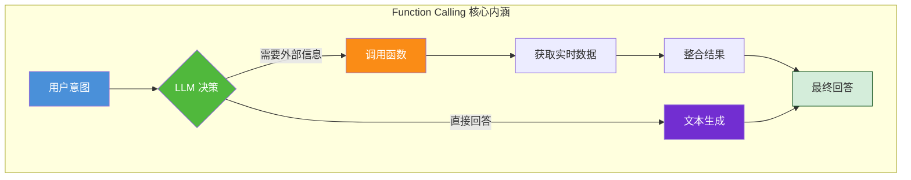

### 1.2 技术发展背景

#### 从无工具调用到 Function Calling 的演进历程

大模型工具调用能力经历了三个主要发展阶段：

| 阶段 | 时间 | 代表技术 | 核心特征 |
|------|------|---------|---------|
| **阶段一：纯 Prompt 驱动** | 2020-2022 | Prompt Engineering | 通过文本指令模拟函数调用，输出不稳定 |
| **阶段二：伪函数调用** | 2022-2023 | ReAct, LangChain | 在 Prompt 中描述函数，模型生成文本形式的"调用"，需解析 |
| **阶段三：原生 Function Calling** | 2023.06-至今 | GPT-4 Function Calling, Tool Use | 模型原生支持，输出结构化的函数调用指令，可靠解析 |

#### 技术演进对比

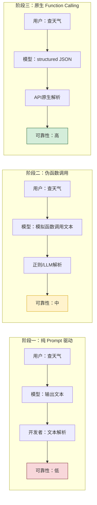

### 1.3 核心技术价值

#### 解决三大核心痛点

Function Calling 的出现，从根本上解决了大模型应用中的三个核心问题：

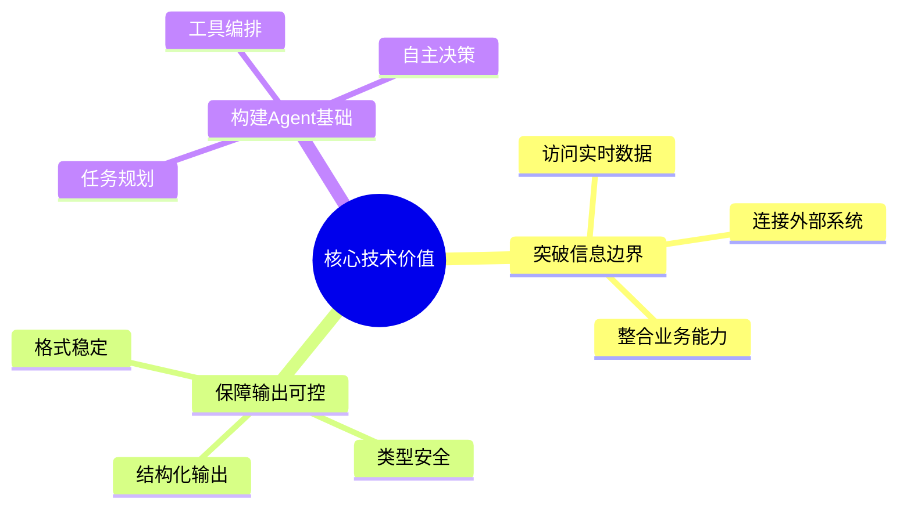

#### 价值详细说明

| 价值维度 | 说明 | 具体示例 |
|---------|------|---------|
| **突破信息边界** | 大模型无法直接访问互联网、数据库等外部信息源 | 查询实时天气、获取最新股价、检索数据库记录 |
| **保障输出可控** | 通过强制的 JSON Schema 约束，确保模型输出格式正确 | 生成 API 请求参数、构造数据库查询条件 |
| **构建 Agent 基础** | 让模型具备"思考-行动-观察"的循环能力，是 Agent 实现的基石 | 多步骤任务执行、复杂工作流编排、自动化办公 |

---

## 二、核心概念

### 2.1 什么是 Function Calling

**Function Calling** 是一种让大模型能够在对话过程中调用外部工具（函数）的协议机制。模型在理解用户意图后，会生成一个结构化的函数调用指令，由应用程序执行该函数，并将结果返回给模型，模型再基于结果生成最终的自然语言回复。

#### 核心术语定义

| 术语 | 英文名称 | 说明 | 示例 |
|------|---------|------|------|
| **函数/工具** | Function/Tool | 可供模型调用的外部操作能力 | 天气查询、日期计算、数据库操作 |
| **参数** | Parameters | 函数执行所需的输入数据 | 城市名称、日期范围、操作类型 |
| **调用** | Call/Invocation | 模型发起的函数调用请求 | `get_weather(city="北京")` |
| **响应** | Response | 函数执行后的返回结果 | `{"temperature": 25, "condition": "晴"}` |
| **注册** | Registration | 将函数定义提供给模型的过程 | API 请求中的 `tools` 参数 |

### 2.2 Function Calling 与 Prompt Engineering 的关系

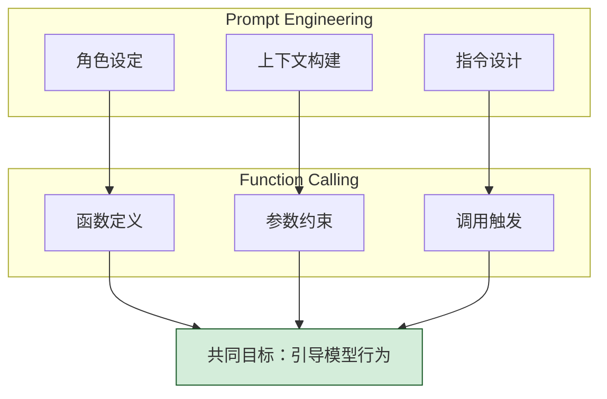

**关系说明：**
- **互补关系**：Prompt Engineering 通过自然语言引导模型，Function Calling 通过结构化定义约束模型，两者相辅相成。
- **层级关系**：在实际应用中，通常在 System Prompt 中描述函数的使用场景和约束，而函数的具体实现通过 Function Calling 机制完成。
- **统一目标**：两者都是为了让模型输出更准确、更可控的结果。

### 2.3 Function Calling 与 Agent 的关系

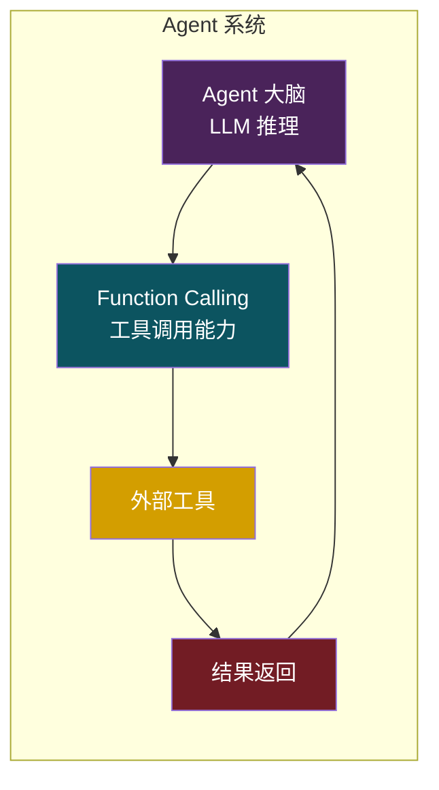

**核心关系：**
- Function Calling 是 Agent 实现其"行动能力"的**核心基础设施**。
- Agent 通过 Function Calling 实现"思考→行动→观察"（Think-Act-Observe）的循环。
- 没有 Function Calling，Agent 只能进行文本推理，无法与真实世界交互。

### 2.4 Function Calling vs 传统 API 调用对比

| 对比维度 | 传统 API 调用 | Function Calling |
|---------|-------------|-----------------|
| **调用发起方** | 开发者/程序员手动调用 | 大模型自主决策调用 |
| **参数生成** | 开发者手动构造参数 | 大模型基于理解自动生成参数 |
| **调用决策** | 硬编码在程序逻辑中 | 基于语义理解动态决策 |
| **错误处理** | 开发者编写错误处理逻辑 | 模型可根据错误信息调整参数重试 |
| **适用场景** | 固定流程的业务逻辑 | 开放域的智能交互 |
| **灵活性** | 低（需预先编码所有调用路径） | 高（模型可自主选择函数和参数） |
| **可靠性** | 高（确定性执行） | 中（依赖模型理解准确度） |
| **交互方式** | 请求-响应模式 | 多轮对话中动态触发 |

---

## 三、工作流程

### 3.1 完整调用流程概述

Function Calling 的完整生命周期包含五个核心阶段，各阶段之间形成闭环交互。

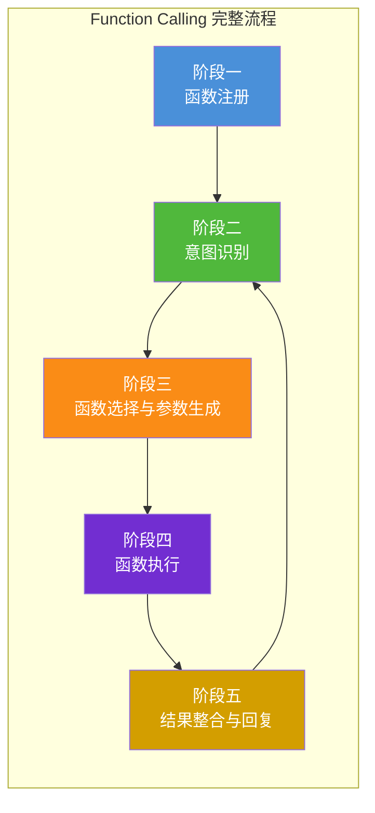

### 3.2 完整调用时序图

以下时序图展示了从用户发起到最终回复的完整链路：

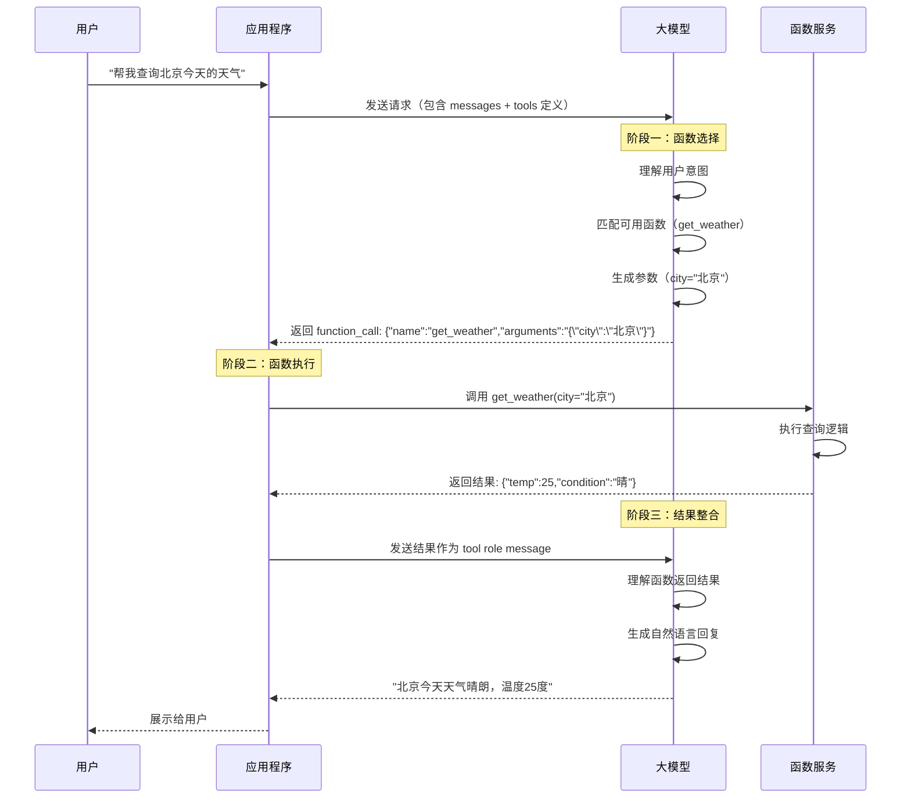

### 3.3 各阶段详解

#### 3.3.1 函数注册与描述定义

函数注册是 Function Calling 的起点，开发者需要将所有可供模型调用的函数以标准化的 JSON Schema 格式定义并注册给模型。

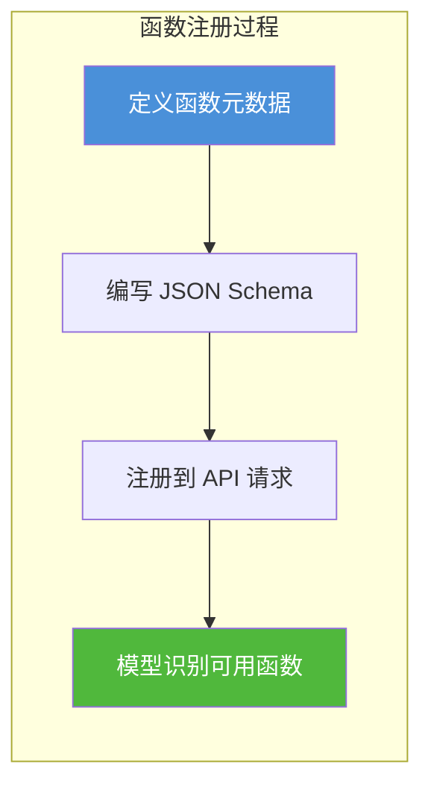

**注册要点：**
- 每个函数需定义 `name`、`description` 和 `parameters` 三个核心字段。
- `description` 的质量直接影响模型选择函数的准确性。
- `parameters` 必须严格遵循 JSON Schema 规范。

#### 3.3.2 用户输入接收与意图识别

当用户发送消息后，模型首先进行意图分析，判断用户需求是否需要调用外部函数。

**意图识别逻辑：**
1. 模型解析用户自然语言输入，提取核心意图。
2. 对比已注册函数的 `description`，判断是否存在匹配的函数。
3. 评估函数调用的必要性（有些问题可以直接回答）。

#### 3.3.3 函数选择与参数生成

模型根据意图识别结果，选择最合适的函数，并生成符合 `parameters` Schema 约束的参数。

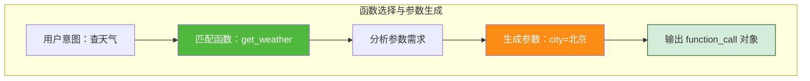

#### 3.3.4 函数执行与结果返回

应用程序接收到模型返回的 `function_call` 后，需要执行以下操作：

1. **解析函数名和参数**：从 `function_call` 对象中提取 `name` 和 `arguments`。
2. **路由到对应实现**：根据函数名找到本地的函数实现。
3. **执行函数逻辑**：调用函数并获取返回结果。
4. **格式化返回结果**：将结果包装为 `tool` 角色的消息。

#### 3.3.5 结果整合与最终响应生成

模型接收到函数返回结果后，将其作为 `tool` 角色的消息加入对话历史，然后基于新的上下文生成最终的自然语言回复。

**关键要点：**
- 结果消息必须以 `tool` 角色发送。
- `tool` 消息的 `content` 通常是 JSON 字符串。
- 模型会将函数结果与原始对话上下文整合，生成自然、流畅的回复。

---

## 四、与大模型的交互机制

### 4.1 模型如何决定调用函数

#### 4.1.1 基于函数描述的语义理解

模型通过分析每个函数的 `description` 字段，理解函数的功能和适用场景。这是模型选择函数的主要依据。

**示例：**
```json
{
    "type": "function",
    "function": {
        "name": "get_current_time",
        "description": "获取当前系统时间，返回时间字符串。注意：此函数不接受任何参数。",
        "parameters": {
            "type": "object",
            "properties": {},
            "required": []
        }
    }
}
```

当用户说"现在几点了"，模型匹配到 `get_current_time` 的描述最符合。

#### 4.1.2 基于对话上下文的函数选择

模型不仅考虑当前用户输入，还会结合完整的对话历史来选择函数。

**示例场景：**
```
用户：北京明天天气怎么样？
助手：（调用 get_weather 函数）北京明天晴转多云...
用户：那上海呢？
```
此时模型会基于上下文理解"那上海呢"是询问上海明天的天气，继续调用 `get_weather` 函数。

#### 4.1.3 基于参数 Schema 的结构化生成

模型根据函数的 `parameters` Schema 定义，自动生成符合要求的参数。如果用户输入信息不全，模型可能不调用函数，而是询问用户补充信息。

### 4.2 函数调用的触发条件

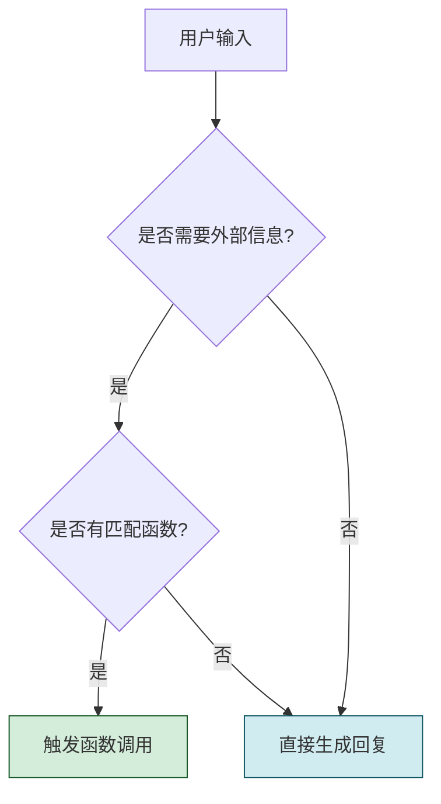

**触发条件总结：**

| 条件 | 模型行为 |
|------|---------|
| 用户问题涉及实时数据 | 触发函数调用 |
| 用户问题需要执行操作 | 触发函数调用 |
| 已有函数能满足需求 | 触发函数调用 |
| 用户问题超出模型知识 | 尝试调用相关函数 |
| 问题可直接回答 | 不触发函数调用 |
| 无匹配的可用函数 | 不触发函数调用，直接告知用户 |

### 4.3 多函数选择策略

当多个函数都能满足用户需求时，模型的选择遵循以下策略：

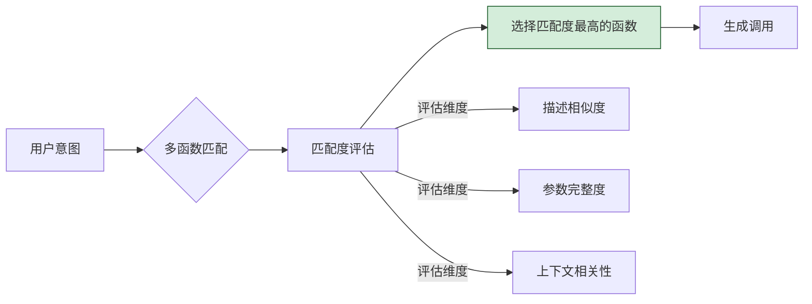

**策略示例：**

假设有两个函数 `get_weather` 和 `get_weather_forecast`：
- 用户问"现在北京温度多少" → 匹配 `get_weather`（获取当前天气）
- 用户问"北京未来一周天气" → 匹配 `get_weather_forecast`（获取天气预报）

### 4.4 模型输出格式规范

当模型决定调用函数时，输出消息中的 `tool_calls` 字段会包含结构化的函数调用信息。

```json
{
    "choices": [
        {
            "message": {
                "role": "assistant",
                "content": null,
                "tool_calls": [
                    {
                        "id": "call_abc123",
                        "type": "function",
                        "function": {
                            "name": "get_weather",
                            "arguments": "{\"city\": \"北京\", \"date\": \"2024-01-15\"}"
                        }
                    }
                ]
            }
        }
    ]
}
```

**关键字段说明：**

| 字段 | 类型 | 说明 |
|------|------|------|
| `id` | string | 唯一标识此次函数调用，用于后续结果关联 |
| `type` | string | 调用类型，目前仅支持 `"function"` |
| `function.name` | string | 要调用的函数名称 |
| `function.arguments` | string | 函数参数，JSON 字符串格式 |
| `content` | string/null | 当有函数调用时为 null，否则为文本内容 |

---

## 五、输入输出格式规范

### 5.1 函数定义规范（JSON Schema 格式）

#### 完整函数定义示例

```json
{
    "type": "function",
    "function": {
        "name": "get_weather",
        "description": "获取指定城市的天气信息。返回温度、天气状况、风力等信息。",
        "parameters": {
            "type": "object",
            "properties": {
                "city": {
                    "type": "string",
                    "description": "城市名称，如'北京'、'上海'、'广州'"
                },
                "date": {
                    "type": "string",
                    "description": "查询日期，格式为 YYYY-MM-DD。默认为当天"
                },
                "detail": {
                    "type": "boolean",
                    "description": "是否返回详细天气信息，默认 false"
                }
            },
            "required": ["city"]
        }
    }
}
```

#### 字段规范说明

| 字段 | 是否必填 | 规范要求 |
|------|---------|---------|
| `type` | 是 | 固定值 `"function"` |
| `function.name` | 是 | 函数名称，使用小写字母和下划线，不超过 64 字符 |
| `function.description` | 是 | 函数功能描述，应清晰说明函数用途和适用场景 |
| `function.parameters` | 是 | 参数定义，遵循 JSON Schema 规范 |
| `parameters.type` | 是 | 固定值 `"object"` |
| `parameters.properties` | 是 | 参数属性定义对象 |
| `parameters.required` | 否 | 必填参数名称数组 |

### 5.2 函数调用请求格式（messages + tools）

#### 完整 API 请求示例

```json
{
    "model": "gpt-4",
    "messages": [
        {
            "role": "system",
            "content": "你是一个智能助手，可以帮助用户查询天气信息。"
        },
        {
            "role": "user",
            "content": "帮我查一下北京今天的天气"
        }
    ],
    "tools": [
        {
            "type": "function",
            "function": {
                "name": "get_weather",
                "description": "获取指定城市的天气信息",
                "parameters": {
                    "type": "object",
                    "properties": {
                        "city": {
                            "type": "string",
                            "description": "城市名称"
                        },
                        "date": {
                            "type": "string",
                            "description": "查询日期"
                        }
                    },
                    "required": ["city"]
                }
            }
        }
    ],
    "tool_choice": "auto"
}
```

#### `tool_choice` 参数说明

| 取值 | 说明 | 使用场景 |
|------|------|---------|
| `"auto"` | 模型自主决定是否调用函数 | 通用场景，推荐默认使用 |
| `"required"` | 强制模型必须调用函数 | 必须执行操作的场景 |
| `"none"` | 禁止模型调用函数 | 纯对话场景 |
| `{"type": "function", "function": {"name": "xxx"}}` | 指定调用特定函数 | 需要强制调用某个函数的场景 |

### 5.3 函数调用响应格式

#### 模型返回的函数调用

```json
{
    "choices": [
        {
            "message": {
                "role": "assistant",
                "content": null,
                "tool_calls": [
                    {
                        "id": "call_123456",
                        "type": "function",
                        "function": {
                            "name": "get_weather",
                            "arguments": "{\"city\": \"北京\"}"
                        }
                    }
                ]
            },
            "finish_reason": "tool_calls"
        }
    ],
    "usage": {
        "prompt_tokens": 150,
        "completion_tokens": 50,
        "total_tokens": 200
    }
}
```

### 5.4 函数执行结果格式

将函数执行结果作为 `tool` 角色的消息返回给模型：

```json
{
    "role": "tool",
    "tool_call_id": "call_123456",
    "content": "{\"city\": \"北京\", \"date\": \"2024-01-15\", \"temperature\": 25, \"condition\": \"晴\", \"wind\": \"东北风3级\"}"
}
```

**注意事项：**
- `tool_call_id` 必须与模型返回的 `id` 字段一致。
- `content` 通常为 JSON 字符串，格式不限定，但建议使用 JSON 格式以便模型理解。
- 一个响应如果有多个 `tool_calls`，需要为每个调用返回一条 `tool` 消息。

### 5.5 完整 API 调用示例

#### cURL 示例

```bash
curl -X POST https://api.openai.com/v1/chat/completions \
  -H "Content-Type: application/json" \
  -H "Authorization: Bearer $API_KEY" \
  -d '{
    "model": "gpt-4",
    "messages": [
        {"role": "user", "content": "北京今天天气怎样？"}
    ],
    "tools": [
        {
            "type": "function",
            "function": {
                "name": "get_weather",
                "description": "获取指定城市的天气信息",
                "parameters": {
                    "type": "object",
                    "properties": {
                        "city": {"type": "string", "description": "城市名"}
                    },
                    "required": ["city"]
                }
            }
        }
    ]
  }'
```

---

## 六、参数传递方式

### 6.1 基本类型参数

#### 支持的基本类型

| 类型 | JSON Schema 写法 | 示例 |
|------|-----------------|------|
| **字符串** | `"type": "string"` | `"北京"` |
| **整数** | `"type": "integer"` | `25` |
| **浮点数** | `"type": "number"` | `3.14` |
| **布尔值** | `"type": "boolean"` | `true` |

#### 基本类型定义示例

```json
{
    "type": "object",
    "properties": {
        "city": {
            "type": "string",
            "description": "城市名称"
        },
        "count": {
            "type": "integer",
            "description": "查询数量，必须为正整数"
        },
        "temperature_unit": {
            "type": "string",
            "enum": ["celsius", "fahrenheit"],
            "description": "温度单位"
        },
        "verbose": {
            "type": "boolean",
            "description": "是否显示详细信息"
        }
    },
    "required": ["city"]
}
```

### 6.2 复杂类型参数

#### 对象类型（object）

```json
{
    "type": "object",
    "properties": {
        "address": {
            "type": "object",
            "description": "地址信息",
            "properties": {
                "province": {"type": "string", "description": "省份"},
                "city": {"type": "string", "description": "城市"},
                "district": {"type": "string", "description": "区县"},
                "detail": {"type": "string", "description": "详细地址"}
            },
            "required": ["province", "city"]
        }
    }
}
```

#### 数组类型（array）

```json
{
    "type": "object",
    "properties": {
        "items": {
            "type": "array",
            "description": "商品列表",
            "items": {
                "type": "object",
                "properties": {
                    "name": {"type": "string", "description": "商品名称"},
                    "quantity": {"type": "integer", "description": "数量"},
                    "price": {"type": "number", "description": "单价"}
                },
                "required": ["name", "quantity"]
            }
        }
    }
}
```

### 6.3 可选参数与必填参数

#### 配置方式

通过 `required` 数组指定必填参数：

```json
{
    "type": "object",
    "properties": {
        "keyword": {
            "type": "string",
            "description": "搜索关键词"
        },
        "page": {
            "type": "integer",
            "description": "页码，默认 1"
        },
        "page_size": {
            "type": "integer",
            "description": "每页数量，默认 10"
        },
        "category": {
            "type": "string",
            "description": "分类筛选"
        }
    },
    "required": ["keyword"]
}
```

**说明：** `keyword` 为必填参数，`page`、`page_size`、`category` 为可选参数。

### 6.4 嵌套参数结构

嵌套结构用于表达复杂的数据层级关系：

```json
{
    "name": "create_order",
    "description": "创建订单",
    "parameters": {
        "type": "object",
        "properties": {
            "customer": {
                "type": "object",
                "description": "客户信息",
                "properties": {
                    "name": {"type": "string"},
                    "phone": {"type": "string"},
                    "address": {
                        "type": "object",
                        "properties": {
                            "street": {"type": "string"},
                            "city": {"type": "string"},
                            "zipcode": {"type": "string"}
                        },
                        "required": ["street", "city"]
                    }
                },
                "required": ["name", "phone"]
            },
            "items": {
                "type": "array",
                "items": {
                    "type": "object",
                    "properties": {
                        "product_id": {"type": "string"},
                        "quantity": {"type": "integer", "minimum": 1}
                    },
                    "required": ["product_id", "quantity"]
                }
            },
            "remark": {
                "type": "string",
                "description": "订单备注"
            }
        },
        "required": ["customer", "items"]
    }
}
```

### 6.5 枚举类型参数

枚举类型限制参数只能取特定值：

```json
{
    "type": "object",
    "properties": {
        "order_type": {
            "type": "string",
            "enum": ["dine_in", "takeaway", "delivery"],
            "description": "订单类型：堂食/外卖/配送"
        },
        "payment_method": {
            "type": "string",
            "enum": ["alipay", "wechat", "card", "cash"],
            "description": "支付方式"
        },
        "sort_order": {
            "type": "string",
            "enum": ["asc", "desc"],
            "description": "排序方式：升序/降序"
        }
    }
}
```

### 6.6 参数传递完整示例代码

```python
import json


def get_weather(city: str, date: str = None, detail: bool = False) -> dict:
    """模拟天气查询函数"""
    weather_data = {
        "北京": {"temp": 25, "condition": "晴", "wind": "东北风3级"},
        "上海": {"temp": 22, "condition": "多云", "wind": "东南风2级"},
        "广州": {"temp": 30, "condition": "阵雨", "wind": "南风4级"}
    }
    
    data = weather_data.get(city, {"temp": 20, "condition": "未知", "wind": "无"})
    
    result = {
        "city": city,
        "date": date or "今天",
        "temperature": data["temp"],
        "condition": data["condition"]
    }
    
    if detail:
        result["wind"] = data["wind"]
        result["humidity"] = "65%"
    
    return result


def execute_function_call(function_name: str, arguments: str) -> str:
    """
    执行函数调用的通用方法
    
    参数:
        function_name: 要调用的函数名称
        arguments: JSON 字符串格式的参数
    """
    # 解析参数
    params = json.loads(arguments)
    
    # 函数路由表
    function_map = {
        "get_weather": get_weather
    }
    
    # 查找对应函数
    func = function_map.get(function_name)
    if not func:
        return json.dumps({"error": f"函数 {function_name} 不存在"})
    
    # 执行函数
    result = func(**params)
    return json.dumps(result, ensure_ascii=False)


# 使用示例
arguments = json.dumps({"city": "北京", "detail": True})
result = execute_function_call("get_weather", arguments)
print(result)
# 输出: {"city": "北京", "date": "今天", "temperature": 25, "condition": "晴", "wind": "东北风3级", "humidity": "65%"}
```

---

## 七、错误处理机制

### 7.1 常见错误类型

#### 7.1.1 函数名不存在

| 错误场景 | 原因 | 模型行为 |
|---------|------|---------|
| 函数名拼写错误 | 模型生成的函数名与注册名不匹配 | 应用层报错，结果返回给模型 |
| 函数未注册 | 调用了未注册的函数 | 应用层报错，需提示用户 |

**处理方案：** 应用层维护函数路由表，未匹配的函数返回明确的错误信息。

#### 7.1.2 参数缺失或格式错误

| 错误场景 | 原因 | 处理方式 |
|---------|------|---------|
| 必填参数缺失 | 模型未提供 `required` 中的参数 | 校验后返回错误，模型可能补全参数重试 |
| 参数类型错误 | 如 `city` 传了数字而非字符串 | 类型校验失败，返回错误信息 |
| 参数取值超出范围 | 枚举类型传了不在 `enum` 中的值 | 枚举校验失败，返回错误信息 |

#### 7.1.3 函数执行超时

| 错误场景 | 原因 | 处理方式 |
|---------|------|---------|
| 外部 API 响应慢 | 网络延迟或第三方服务慢 | 设置超时时间，超时后返回错误 |
| 数据库查询慢 | 数据量大或索引优化 | 设置超时或优化查询 |

#### 7.1.4 函数返回异常

| 错误场景 | 原因 | 处理方式 |
|---------|------|---------|
| API 返回错误码 | 第三方服务返回错误 | 解析错误码，转译为用户友好的信息 |
| 返回格式不符预期 | 第三方数据格式变更 | 增加格式校验，格式不符时返回错误 |
| 业务逻辑异常 | 如库存不足、余额不足 | 返回业务错误信息 |

### 7.2 错误处理策略

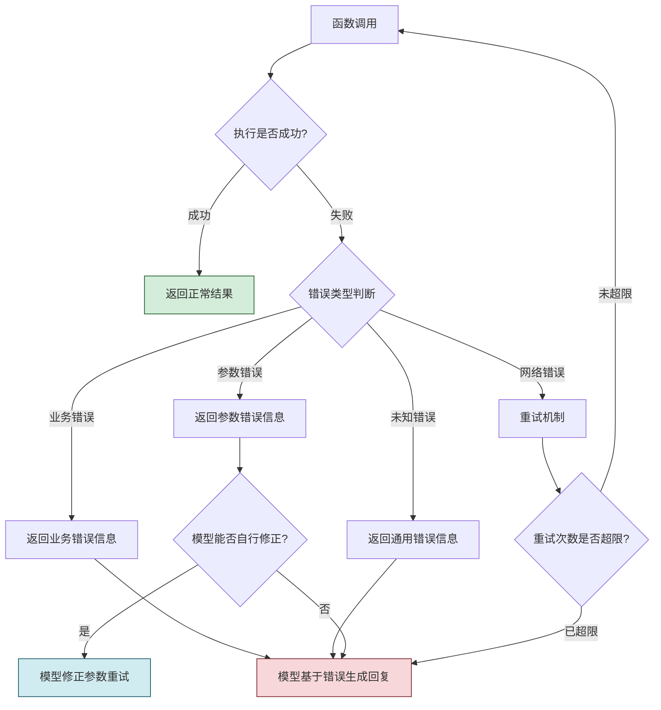

#### 7.2.1 自动重试机制

对网络超时等临时性错误，可实现自动重试：

```python
import time
import functools


def retry(max_retries: int = 3, delay: float = 1.0, exceptions: tuple = (Exception,)):
    """
    通用重试装饰器
    
    参数:
        max_retries: 最大重试次数
        delay: 重试间隔（秒）
        exceptions: 可重试的异常类型
    """
    def decorator(func):
        @functools.wraps(func)
        def wrapper(*args, **kwargs):
            last_exception = None
            for attempt in range(max_retries + 1):
                try:
                    return func(*args, **kwargs)
                except exceptions as e:
                    last_exception = e
                    if attempt < max_retries:
                        print(f"第 {attempt + 1} 次尝试失败，{delay}秒后重试...")
                        time.sleep(delay)
                    else:
                        print(f"已达最大重试次数 {max_retries}")
            raise last_exception
        return wrapper
    return decorator


@retry(max_retries=3, delay=1.0, exceptions=(TimeoutError, ConnectionError))
def call_external_api(url: str, payload: dict) -> dict:
    """
    调用外部 API，支持自动重试
    
    参数:
        url: API 地址
        payload: 请求参数
    """
    import requests
    response = requests.post(url, json=payload, timeout=5)
    response.raise_for_status()
    return response.json()
```

#### 7.2.2 降级处理方案

```python
class WeatherService:
    """天气服务，包含降级策略"""
    
    def __init__(self):
        self.primary_provider = "api.weather.com"
        self.backup_provider = "api.backup-weather.com"
    
    def get_weather(self, city: str, **kwargs) -> dict:
        """
        获取天气，主服务失败时自动降级到备用服务
        
        参数:
            city: 城市名称
        """
        try:
            result = self._fetch_from_provider(self.primary_provider, city, **kwargs)
            return result
        except Exception as e:
            print(f"主服务调用失败: {e}，尝试备用服务...")
            return self._fetch_from_provider(self.backup_provider, city, **kwargs)
    
    def _fetch_from_provider(self, provider: str, city: str, **kwargs) -> dict:
        """从指定服务商获取天气数据"""
        # 实际调用外部 API 的逻辑
        raise NotImplementedError("需要实现具体的 API 调用逻辑")
```

#### 7.2.3 用户友好提示

错误信息传递给模型时，需要格式清晰，便于模型理解并转化为用户友好的回复。

**错误消息格式示例：**
```json
{
    "error": {
        "code": "PARAM_MISSING",
        "message": "缺少必填参数 'city'",
        "suggestion": "请提供城市名称，如：北京、上海"
    }
}
```

模型收到此错误后，会生成："抱歉，我需要您提供具体的城市名称才能查询天气，比如北京、上海等。"

### 7.3 错误处理代码示例

```python
import json
from typing import Optional, Callable


class FunctionCallHandler:
    """Function Calling 处理器，包含完整的错误处理"""
    
    def __init__(self):
        self.function_map: dict[str, Callable] = {}
        self.max_retries = 2
    
    def register_function(self, name: str, func: Callable, description: str, 
                          parameters_schema: dict) -> None:
        """
        注册函数到处理器
        
        参数:
            name: 函数名称
            func: 函数实现
            description: 函数描述
            parameters_schema: 参数的 JSON Schema
        """
        self.function_map[name] = {
            "func": func,
            "description": description,
            "schema": parameters_schema
        }
    
    def handle_function_call(self, function_name: str, 
                             arguments_str: str) -> str:
        """
        处理函数调用请求，包含完整的错误处理
        
        参数:
            function_name: 要调用的函数名
            arguments_str: JSON 字符串格式的参数
        """
        # 步骤 1：验证函数是否存在
        if function_name not in self.function_map:
            error = {
                "error": {
                    "code": "FUNCTION_NOT_FOUND",
                    "message": f"函数 '{function_name}' 不存在",
                    "available_functions": list(self.function_map.keys())
                }
            }
            return json.dumps(error, ensure_ascii=False)
        
        # 步骤 2：解析参数
        try:
            parameters = json.loads(arguments_str)
        except json.JSONDecodeError as e:
            error = {
                "error": {
                    "code": "INVALID_ARGUMENTS",
                    "message": f"参数解析失败: {str(e)}",
                    "raw_arguments": arguments_str
                }
            }
            return json.dumps(error, ensure_ascii=False)
        
        # 步骤 3：验证参数
        validation_error = self._validate_parameters(
            parameters, 
            self.function_map[function_name]["schema"]
        )
        if validation_error:
            return json.dumps(validation_error, ensure_ascii=False)
        
        # 步骤 4：执行函数（带重试）
        func = self.function_map[function_name]["func"]
        last_error = None
        
        for attempt in range(self.max_retries + 1):
            try:
                result = func(**parameters)
                return json.dumps(result, ensure_ascii=False)
            except TypeError as e:
                # 参数类型错误，不需要重试
                error = {
                    "error": {
                        "code": "TYPE_ERROR",
                        "message": f"参数类型错误: {str(e)}",
                        "parameters": parameters
                    }
                }
                return json.dumps(error, ensure_ascii=False)
            except Exception as e:
                last_error = e
                if attempt < self.max_retries:
                    continue
        
        # 所有重试都失败
        error = {
            "error": {
                "code": "EXECUTION_FAILED",
                "message": f"函数执行失败: {str(last_error)}",
                "function_name": function_name
            }
        }
        return json.dumps(error, ensure_ascii=False)
    
    def _validate_parameters(self, parameters: dict, schema: dict) -> Optional[dict]:
        """
        验证参数是否符合 Schema 定义
        
        参数:
            parameters: 待验证的参数字典
            schema: 参数的 JSON Schema
        """
        # 检查必填参数
        required = schema.get("required", [])
        for param_name in required:
            if param_name not in parameters:
                return {
                    "error": {
                        "code": "MISSING_REQUIRED_PARAM",
                        "message": f"缺少必填参数: '{param_name}'",
                        "required_params": required,
                        "provided_params": list(parameters.keys())
                    }
                }
        
        # 检查参数类型
        properties = schema.get("properties", {})
        for param_name, value in parameters.items():
            if param_name in properties:
                expected_type = properties[param_name].get("type")
                type_check = self._check_type(value, expected_type)
                if not type_check:
                    return {
                        "error": {
                            "code": "TYPE_MISMATCH",
                            "message": f"参数 '{param_name}' 类型不匹配",
                            "expected_type": expected_type,
                            "actual_value": type(value).__name__
                        }
                    }
        
        return None
    
    def _check_type(self, value, expected_type: str) -> bool:
        """检查值是否符合期望类型"""
        type_map = {
            "string": str,
            "integer": int,
            "number": (int, float),
            "boolean": bool,
            "array": list,
            "object": dict
        }
        expected = type_map.get(expected_type)
        if expected is None:
            return True
        # 特殊处理：bool 不应被识别为 int
        if expected_type == "integer" and isinstance(value, bool):
            return False
        return isinstance(value, expected)


# 使用示例
def search_database(keyword: str, limit: int = 10) -> dict:
    """模拟数据库查询"""
    return {
        "results": [
            {"id": 1, "title": f"关于{keyword}的文章一"},
            {"id": 2, "title": f"关于{keyword}的文章二"}
        ],
        "total": 2
    }


handler = FunctionCallHandler()
handler.register_function(
    name="search_database",
    func=search_database,
    description="搜索数据库中的文章",
    parameters_schema={
        "type": "object",
        "properties": {
            "keyword": {"type": "string", "description": "搜索关键词"},
            "limit": {"type": "integer", "description": "返回数量"}
        },
        "required": ["keyword"]
    }
)

# 测试：缺少必填参数
result = handler.handle_function_call("search_database", "{}")
print(result)
# 输出包含 MISSING_REQUIRED_PARAM 错误

# 测试：正确调用
result = handler.handle_function_call("search_database", 
                                       '{"keyword": "AI", "limit": 5}')
print(result)
# 输出: {"results": [...], "total": 2}
```

---

## 八、典型应用场景

### 8.1 工具调用场景

#### 天气查询

```python
def create_weather_tool() -> dict:
    """创建天气查询工具定义"""
    return {
        "type": "function",
        "function": {
            "name": "get_weather",
            "description": "获取指定城市的当前天气信息，包括温度、天气状况、风力等",
            "parameters": {
                "type": "object",
                "properties": {
                    "city": {
                        "type": "string",
                        "description": "城市名称，支持中文名和英文名，如'北京'、'Shanghai'"
                    },
                    "date": {
                        "type": "string",
                        "description": "查询日期，格式 YYYY-MM-DD，为空则查询当前天气"
                    }
                },
                "required": ["city"]
            }
        }
    }
```

#### 计算器

```python
def create_calculator_tool() -> dict:
    """创建计算器工具定义"""
    return {
        "type": "function",
        "function": {
            "name": "calculate",
            "description": "执行数学计算，支持加、减、乘、除等基本运算",
            "parameters": {
                "type": "object",
                "properties": {
                    "expression": {
                        "type": "string",
                        "description": "数学表达式，如 '2 + 3 * 4'、'(10 - 5) / 2'"
                    }
                },
                "required": ["expression"]
            }
        }
    }


def calculate(expression: str) -> dict:
    """安全的计算器实现"""
    try:
        # 安全地计算数学表达式
        allowed_chars = set("0123456789+-*/() .")
        if not all(c in allowed_chars for c in expression):
            return {"error": "表达式包含非法字符"}
        
        result = eval(expression)
        return {
            "expression": expression,
            "result": result,
            "operation": "计算成功"
        }
    except ZeroDivisionError:
        return {"error": "除数不能为零"}
    except Exception as e:
        return {"error": f"计算失败: {str(e)}"}
```

#### 多语言翻译

```python
def create_translation_tool() -> dict:
    """创建翻译工具定义"""
    return {
        "type": "function",
        "function": {
            "name": "translate_text",
            "description": "将文本翻译为指定语言",
            "parameters": {
                "type": "object",
                "properties": {
                    "text": {
                        "type": "string",
                        "description": "待翻译的文本内容"
                    },
                    "target_language": {
                        "type": "string",
                        "enum": ["english", "chinese", "japanese", "korean", "french", "german"],
                        "description": "目标语言"
                    },
                    "source_language": {
                        "type": "string",
                        "description": "源语言，为空则自动检测"
                    }
                },
                "required": ["text", "target_language"]
            }
        }
    }
```

### 8.2 数据库操作场景

#### 用户查询

```python
def create_user_query_tool() -> dict:
    """创建用户查询工具"""
    return {
        "type": "function",
        "function": {
            "name": "query_user",
            "description": "根据条件查询用户信息",
            "parameters": {
                "type": "object",
                "properties": {
                    "user_id": {
                        "type": "integer",
                        "description": "用户 ID"
                    },
                    "username": {
                        "type": "string",
                        "description": "用户名，支持模糊匹配"
                    },
                    "email": {
                        "type": "string",
                        "description": "邮箱地址"
                    },
                    "status": {
                        "type": "string",
                        "enum": ["active", "inactive", "banned"],
                        "description": "用户状态"
                    }
                }
            }
        }
    }
```

#### 数据统计

```python
def create_statistics_tool() -> dict:
    """创建数据统计工具"""
    return {
        "type": "function",
        "function": {
            "name": "get_sales_statistics",
            "description": "获取销售统计数据",
            "parameters": {
                "type": "object",
                "properties": {
                    "time_range": {
                        "type": "string",
                        "description": "时间范围，如 'today'、'last_7_days'、'last_month'、'this_year'"
                    },
                    "dimension": {
                        "type": "string",
                        "enum": ["total", "by_product", "by_region", "by_channel"],
                        "description": "统计维度"
                    },
                    "include_comparison": {
                        "type": "boolean",
                        "description": "是否包含同比/环比对比"
                    }
                },
                "required": ["time_range"]
            }
        }
    }
```

### 8.3 外部 API 集成场景

#### 邮件发送

```python
def create_email_tool() -> dict:
    """创建邮件发送工具"""
    return {
        "type": "function",
        "function": {
            "name": "send_email",
            "description": "发送电子邮件",
            "parameters": {
                "type": "object",
                "properties": {
                    "to": {
                        "type": "string",
                        "description": "收件人邮箱地址"
                    },
                    "subject": {
                        "type": "string",
                        "description": "邮件主题"
                    },
                    "content": {
                        "type": "string",
                        "description": "邮件正文内容"
                    },
                    "cc": {
                        "type": "array",
                        "items": {"type": "string"},
                        "description": "抄送的邮箱地址列表"
                    },
                    "priority": {
                        "type": "string",
                        "enum": ["normal", "high", "low"],
                        "description": "邮件优先级"
                    }
                },
                "required": ["to", "subject", "content"]
            }
        }
    }
```

#### 日程管理

```python
def create_calendar_tool() -> dict:
    """创建日程管理工具"""
    return {
        "type": "function",
        "function": {
            "name": "create_event",
            "description": "创建日程事件",
            "parameters": {
                "type": "object",
                "properties": {
                    "title": {
                        "type": "string",
                        "description": "事件标题"
                    },
                    "start_time": {
                        "type": "string",
                        "description": "开始时间，ISO 8601 格式，如 '2024-01-15T14:00:00'"
                    },
                    "end_time": {
                        "type": "string",
                        "description": "结束时间"
                    },
                    "location": {
                        "type": "string",
                        "description": "会议地点"
                    },
                    "attendees": {
                        "type": "array",
                        "items": {"type": "string"},
                        "description": "参会人邮箱列表"
                    },
                    "description": {
                        "type": "string",
                        "description": "事件描述"
                    }
                },
                "required": ["title", "start_time", "end_time"]
            }
        }
    }
```

### 8.4 复杂工作流场景

多函数组合可以实现复杂的工作流任务，例如"查询客户订单并生成报表"：

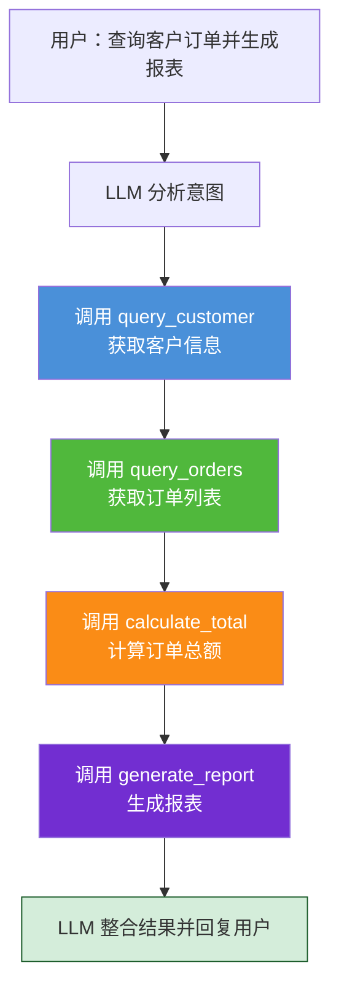

### 8.5 代码生成与执行场景

通过 Function Calling，模型可以生成代码并调用执行工具运行：

```json
{
    "type": "function",
    "function": {
        "name": "execute_code",
        "description": "在安全环境中执行 Python 代码并返回结果",
        "parameters": {
            "type": "object",
            "properties": {
                "code": {
                    "type": "string",
                    "description": "要执行的 Python 代码"
                },
                "timeout": {
                    "type": "integer",
                    "description": "执行超时时间（秒），默认 30 秒"
                },
                "packages": {
                    "type": "array",
                    "items": {"type": "string"},
                    "description": "需要的额外包，如 ['numpy', 'pandas']"
                }
            },
            "required": ["code"]
        }
    }
}
```

---

## 九、代码实现示例

### 9.1 基础 Function Calling 实现

#### Python + OpenAI API 基础示例

```python
import json
import os
from openai import OpenAI


# 初始化客户端
client = OpenAI(api_key=os.environ.get("OPENAI_API_KEY"))


def get_current_time() -> dict:
    """获取当前时间"""
    from datetime import datetime
    now = datetime.now()
    return {
        "datetime": now.strftime("%Y-%m-%d %H:%M:%S"),
        "date": now.strftime("%Y-%m-%d"),
        "time": now.strftime("%H:%M:%S"),
        "weekday": ["周一", "周二", "周三", "周四", "周五", "周六", "周日"][now.weekday()]
    }


# 定义可用工具
tools = [
    {
        "type": "function",
        "function": {
            "name": "get_current_time",
            "description": "获取当前的系统时间，返回日期、时间和星期",
            "parameters": {
                "type": "object",
                "properties": {},
                "required": []
            }
        }
    }
]


def chat_with_function_calling(user_message: str) -> str:
    """
    与模型对话，支持 Function Calling
    
    参数:
        user_message: 用户消息
    """
    # 第一轮对话：发送用户消息和工具定义
    response = client.chat.completions.create(
        model="gpt-4",
        messages=[{"role": "user", "content": user_message}],
        tools=tools,
        tool_choice="auto"
    )
    
    assistant_message = response.choices[0].message
    
    # 检查是否触发了函数调用
    if assistant_message.tool_calls:
        # 处理函数调用
        available_functions = {
            "get_current_time": get_current_time
        }
        
        # 为每个函数调用生成结果
        messages = [{"role": "user", "content": user_message}]
        
        for tool_call in assistant_message.tool_calls:
            function_name = tool_call.function.name
            function_args = json.loads(tool_call.function.arguments)
            
            # 执行函数
            function_to_call = available_functions[function_name]
            function_response = function_to_call(**function_args)
            
            # 将函数结果添加到消息中
            messages.append({
                "role": "assistant",
                "content": assistant_message.content,
                "tool_calls": assistant_message.tool_calls
            })
            messages.append({
                "role": "tool",
                "tool_call_id": tool_call.id,
                "content": json.dumps(function_response, ensure_ascii=False)
            })
        
        # 第二轮对话：将函数结果返回给模型，获取最终回复
        second_response = client.chat.completions.create(
            model="gpt-4",
            messages=messages
        )
        
        return second_response.choices[0].message.content
    
    # 如果没有函数调用，直接返回模型回复
    return assistant_message.content


# 使用示例
if __name__ == "__main__":
    # 示例 1：需要调用函数
    result = chat_with_function_calling("现在几点了？")
    print(result)  # 输出：现在是 2024年1月15日 14:30:00，周一
    
    # 示例 2：不需要调用函数
    result = chat_with_function_calling("你好，介绍一下你自己")
    print(result)  # 输出：模型直接生成文本回复
```

### 9.2 多函数注册与调用示例

```python
import json
import os
from openai import OpenAI


client = OpenAI(api_key=os.environ.get("OPENAI_API_KEY"))


# ============ 工具实现 ============

def get_weather(city: str) -> dict:
    """查询天气"""
    weather_data = {
        "北京": {"temp": 25, "condition": "晴", "humidity": "40%"},
        "上海": {"temp": 22, "condition": "多云", "humidity": "65%"},
        "广州": {"temp": 30, "condition": "阵雨", "humidity": "80%"}
    }
    return weather_data.get(city, {"temp": 20, "condition": "未知", "humidity": "未知"})


def calculate(expression: str) -> dict:
    """计算数学表达式"""
    try:
        allowed = set("0123456789+-*/() .")
        if not all(c in allowed for c in expression):
            return {"error": "包含非法字符"}
        result = eval(expression)
        return {"expression": expression, "result": result}
    except Exception as e:
        return {"error": str(e)}


def search_knowledge(keyword: str) -> dict:
    """搜索知识库"""
    kb = {
        "Python": {"category": "编程语言", "description": "Python 是一种高级编程语言"},
        "API": {"category": "技术概念", "description": "API 是应用程序编程接口"},
        "AI": {"category": "技术领域", "description": "人工智能，研究计算机模拟人类智能"}
    }
    results = {k: v for k, v in kb.items() if keyword.lower() in k.lower()}
    return {"keyword": keyword, "results": results, "count": len(results)}


# ============ 工具定义 ============

tools = [
    {
        "type": "function",
        "function": {
            "name": "get_weather",
            "description": "获取指定城市的天气信息，返回温度、天气状况等",
            "parameters": {
                "type": "object",
                "properties": {
                    "city": {
                        "type": "string",
                        "description": "城市名称，如'北京'、'上海'"
                    }
                },
                "required": ["city"]
            }
        }
    },
    {
        "type": "function",
        "function": {
            "name": "calculate",
            "description": "计算数学表达式，支持加减乘除运算",
            "parameters": {
                "type": "object",
                "properties": {
                    "expression": {
                        "type": "string",
                        "description": "数学表达式，如 '2 + 3 * 4'"
                    }
                },
                "required": ["expression"]
            }
        }
    },
    {
        "type": "function",
        "function": {
            "name": "search_knowledge",
            "description": "搜索知识库，查找关键词相关信息",
            "parameters": {
                "type": "object",
                "properties": {
                    "keyword": {
                        "type": "string",
                        "description": "搜索关键词"
                    }
                },
                "required": ["keyword"]
            }
        }
    }
]

# 函数路由表
function_map = {
    "get_weather": get_weather,
    "calculate": calculate,
    "search_knowledge": search_knowledge
}


def multi_turn_conversation(system_prompt: str, user_input: str) -> str:
    """
    多轮对话，支持连续的 Function Calling
    
    参数:
        system_prompt: 系统提示词
        user_input: 用户输入
    """
    messages = [
        {"role": "system", "content": system_prompt},
        {"role": "user", "content": user_input}
    ]
    
    # 最多允许 10 轮函数调用（防止无限循环）
    max_rounds = 10
    current_round = 0
    
    while current_round < max_rounds:
        current_round += 1
        
        # 调用模型
        response = client.chat.completions.create(
            model="gpt-4",
            messages=messages,
            tools=tools,
            tool_choice="auto"
        )
        
        assistant_message = response.choices[0].message
        
        # 如果没有函数调用，说明对话结束
        if not assistant_message.tool_calls:
            return assistant_message.content
        
        # 处理函数调用
        messages.append({
            "role": "assistant",
            "content": assistant_message.content,
            "tool_calls": assistant_message.tool_calls
        })
        
        # 执行每个函数调用
        for tool_call in assistant_message.tool_calls:
            function_name = tool_call.function.name
            function_args = json.loads(tool_call.function.arguments)
            
            # 执行函数
            if function_name in function_map:
                function_result = function_map[function_name](**function_args)
            else:
                function_result = {"error": f"未知函数: {function_name}"}
            
            # 添加函数结果到消息
            messages.append({
                "role": "tool",
                "tool_call_id": tool_call.id,
                "content": json.dumps(function_result, ensure_ascii=False)
            })
    
    # 达到最大轮次，返回最后一次模型的回复
    return "抱歉，对话已达到最大轮次限制。"


# 使用示例
if __name__ == "__main__":
    system_prompt = """你是一个智能助手，可以调用以下工具：
1. get_weather - 查询天气
2. calculate - 数学计算
3. search_knowledge - 知识搜索

请根据用户需求选择合适的工具。"""
    
    # 测试多轮对话
    result = multi_turn_conversation(
        system_prompt,
        "北京天气怎么样？另外帮我算一下 123 * 456 等于多少"
    )
    print(result)
```

### 9.3 带错误处理的完整实现

```python
import json
import os
import time
from typing import Optional, Callable
from openai import OpenAI


class RobustFunctionCallingClient:
    """
    带完整错误处理的 Function Calling 客户端
    """
    
    def __init__(self, model: str = "gpt-4", 
                 max_retries: int = 3,
                 max_function_rounds: int = 10):
        """
        初始化客户端
        
        参数:
            model: 使用的模型名称
            max_retries: API 调用最大重试次数
            max_function_rounds: 函数调用最大轮次
        """
        self.client = OpenAI(api_key=os.environ.get("OPENAI_API_KEY"))
        self.model = model
        self.max_retries = max_retries
        self.max_function_rounds = max_function_rounds
        self.function_map: dict[str, Callable] = {}
        self.tools: list[dict] = []
    
    def register_tool(self, name: str, func: Callable, 
                      description: str, parameters_schema: dict) -> None:
        """
        注册工具
        
        参数:
            name: 工具名称
            func: 工具实现函数
            description: 工具描述
            parameters_schema: 参数的 JSON Schema
        """
        self.function_map[name] = func
        self.tools.append({
            "type": "function",
            "function": {
                "name": name,
                "description": description,
                "parameters": parameters_schema
            }
        })
    
    def _call_api(self, messages: list, use_tools: bool = True) -> dict:
        """
        调用 API，带重试机制
        
        参数:
            messages: 消息列表
            use_tools: 是否使用工具
        """
        last_exception = None
        
        for attempt in range(self.max_retries):
            try:
                if use_tools:
                    return self.client.chat.completions.create(
                        model=self.model,
                        messages=messages,
                        tools=self.tools,
                        tool_choice="auto"
                    )
                else:
                    return self.client.chat.completions.create(
                        model=self.model,
                        messages=messages
                    )
            except Exception as e:
                last_exception = e
                if attempt < self.max_retries - 1:
                    wait_time = 2 ** attempt  # 指数退避
                    time.sleep(wait_time)
        
        raise last_exception
    
    def chat(self, user_input: str, system_prompt: Optional[str] = None) -> str:
        """
        与模型对话，支持 Function Calling 和完整错误处理
        
        参数:
            user_input: 用户输入
            system_prompt: 系统提示词（可选）
        """
        # 构建初始消息
        messages = []
        if system_prompt:
            messages.append({"role": "system", "content": system_prompt})
        messages.append({"role": "user", "content": user_input})
        
        current_round = 0
        
        while current_round < self.max_function_rounds:
            current_round += 1
            
            try:
                # 调用 API
                response = self._call_api(messages, use_tools=True)
            except Exception as e:
                return f"API 调用失败: {str(e)}"
            
            assistant_message = response.choices[0].message
            
            # 如果没有函数调用，返回最终回复
            if not assistant_message.tool_calls:
                return assistant_message.content or "抱歉，我无法生成回复。"
            
            # 处理函数调用
            messages.append({
                "role": "assistant",
                "content": assistant_message.content,
                "tool_calls": assistant_message.tool_calls
            })
            
            # 执行所有函数调用
            for tool_call in assistant_message.tool_calls:
                function_name = tool_call.function.name
                function_args = tool_call.function.arguments
                
                # 解析参数
                try:
                    params = json.loads(function_args) if function_args else {}
                except json.JSONDecodeError:
                    params = {}
                
                # 执行函数
                func = self.function_map.get(function_name)
                if not func:
                    function_result = {
                        "error": f"未注册的函数: {function_name}",
                        "available_functions": list(self.function_map.keys())
                    }
                else:
                    try:
                        function_result = func(**params)
                    except TypeError as e:
                        function_result = {
                            "error": f"参数错误: {str(e)}",
                            "provided_params": params
                        }
                    except Exception as e:
                        function_result = {
                            "error": f"函数执行失败: {str(e)}"
                        }
                
                # 添加函数结果
                messages.append({
                    "role": "tool",
                    "tool_call_id": tool_call.id,
                    "content": json.dumps(function_result, ensure_ascii=False)
                })
        
        # 达到最大轮次
        return "抱歉，对话已达到最大轮次限制，请尝试更具体的问题。"


# 使用示例
if __name__ == "__main__":
    # 初始化客户端
    client = RobustFunctionCallingClient(max_function_rounds=5)
    
    # 注册工具
    def get_weather(city: str) -> dict:
        """获取天气"""
        data = {"北京": "晴", "上海": "多云", "广州": "阵雨"}
        return {"city": city, "weather": data.get(city, "未知"), "temperature": 25}
    
    def get_time() -> dict:
        """获取时间"""
        from datetime import datetime
        return {"current_time": datetime.now().strftime("%H:%M:%S")}
    
    client.register_tool(
        name="get_weather",
        func=get_weather,
        description="获取指定城市的天气信息",
        parameters_schema={
            "type": "object",
            "properties": {
                "city": {"type": "string", "description": "城市名称"}
            },
            "required": ["city"]
        }
    )
    
    client.register_tool(
        name="get_time",
        func=get_time,
        description="获取当前系统时间",
        parameters_schema={
            "type": "object",
            "properties": {},
            "required": []
        }
    )
    
    # 对话示例
    system_prompt = "你是一个智能助手，可以查询天气和获取时间。"
    result = client.chat("北京现在天气怎么样？", system_prompt)
    print(result)
```

### 9.4 交互式多轮对话实现

```python
import json
import os
from openai import OpenAI


class InteractiveFunctionCallingBot:
    """
    交互式 Function Calling 机器人
    支持连续多轮对话，模型可自主决定是否调用函数
    """
    
    def __init__(self, api_key: str, model: str = "gpt-4"):
        """
        初始化机器人
        
        参数:
            api_key: API 密钥
            model: 使用的模型名称
        """
        self.client = OpenAI(api_key=api_key)
        self.model = model
        self.conversation_history = []
        self.tools = []
        self.function_map = {}
        self.max_rounds = 10
    
    def set_system_prompt(self, prompt: str) -> None:
        """设置系统提示词"""
        self.conversation_history = [{"role": "system", "content": prompt}]
    
    def register_tool(self, name: str, func: callable, 
                      description: str, parameters: dict) -> None:
        """
        注册工具
        
        参数:
            name: 工具名称
            func: 工具函数
            description: 工具描述
            parameters: 参数定义
        """
        self.function_map[name] = func
        self.tools.append({
            "type": "function",
            "function": {
                "name": name,
                "description": description,
                "parameters": parameters
            }
        })
    
    def chat(self, user_input: str) -> str:
        """
        与机器人对话
        
        参数:
            user_input: 用户输入
        """
        # 添加用户消息
        self.conversation_history.append({
            "role": "user",
            "content": user_input
        })
        
        # 多轮函数调用循环
        for round_num in range(self.max_rounds):
            # 调用 API
            response = self.client.chat.completions.create(
                model=self.model,
                messages=self.conversation_history,
                tools=self.tools if self.tools else None,
                tool_choice="auto" if self.tools else None
            )
            
            assistant_message = response.choices[0].message
            
            # 存储助手消息
            self.conversation_history.append({
                "role": "assistant",
                "content": assistant_message.content,
                "tool_calls": assistant_message.tool_calls
            })
            
            # 如果没有函数调用，返回最终回复
            if not assistant_message.tool_calls:
                return assistant_message.content or "我暂时无法回答这个问题。"
            
            # 执行函数调用
            for tool_call in assistant_message.tool_calls:
                function_name = tool_call.function.name
                function_args = tool_call.function.arguments
                
                # 解析参数
                try:
                    args = json.loads(function_args) if function_args else {}
                except json.JSONDecodeError:
                    args = {}
                
                # 执行函数
                func = self.function_map.get(function_name)
                if func:
                    try:
                        result = func(**args)
                    except Exception as e:
                        result = {"error": str(e)}
                else:
                    result = {"error": f"未知函数: {function_name}"}
                
                # 添加函数结果
                self.conversation_history.append({
                    "role": "tool",
                    "tool_call_id": tool_call.id,
                    "content": json.dumps(result, ensure_ascii=False)
                })
        
        return "抱歉，对话已达到最大轮次限制。"
    
    def clear_history(self) -> None:
        """清空对话历史"""
        system_prompt = None
        for msg in self.conversation_history:
            if msg["role"] == "system":
                system_prompt = msg["content"]
                break
        self.conversation_history = []
        if system_prompt:
            self.set_system_prompt(system_prompt)


# ============ 使用示例 ============

def interactive_demo():
    """交互式对话演示"""
    # 初始化机器人
    bot = InteractiveFunctionCallingBot(api_key=os.environ.get("OPENAI_API_KEY"))
    
    # 设置系统提示词
    bot.set_system_prompt("""你是一个智能助手，可以帮用户完成以下任务：
1. 查询天气 - get_weather(city)
2. 计算数学表达式 - calculate(expression)
3. 搜索资讯 - search_news(keyword)

请根据用户需求，主动调用合适的工具。""")
    
    # 注册工具
    def get_weather(city: str) -> dict:
        """模拟天气查询"""
        weather_db = {
            "北京": {"temp": 25, "condition": "晴", "humidity": "45%"},
            "上海": {"temp": 22, "condition": "多云", "humidity": "68%"},
            "广州": {"temp": 30, "condition": "阵雨", "humidity": "82%"}
        }
        return weather_db.get(city, {"temp": 20, "condition": "未知", "humidity": "未知"})
    
    def calculate(expression: str) -> dict:
        """模拟计算器"""
        try:
            allowed = set("0123456789+-*/() .")
            if not all(c in allowed for c in expression):
                return {"error": "表达式包含非法字符"}
            result = eval(expression)
            return {"expression": expression, "result": result}
        except Exception as e:
            return {"error": str(e)}
    
    def search_news(keyword: str) -> dict:
        """模拟新闻搜索"""
        news = [
            {"title": f"{keyword}相关新闻一", "time": "2024-01-15"},
            {"title": f"{keyword}相关新闻二", "time": "2024-01-14"},
            {"title": f"{keyword}最新进展", "time": "2024-01-13"}
        ]
        return {"keyword": keyword, "news": news, "total": len(news)}
    
    bot.register_tool("get_weather", get_weather, 
                      "获取指定城市的天气信息",
                      {"type": "object", "properties": {
                          "city": {"type": "string", "description": "城市名称"}
                      }, "required": ["city"]})
    
    bot.register_tool("calculate", calculate,
                      "计算数学表达式",
                      {"type": "object", "properties": {
                          "expression": {"type": "string", "description": "数学表达式"}
                      }, "required": ["expression"]})
    
    bot.register_tool("search_news", search_news,
                      "搜索相关新闻资讯",
                      {"type": "object", "properties": {
                          "keyword": {"type": "string", "description": "搜索关键词"}
                      }, "required": ["keyword"]})
    
    # 开始交互式对话
    print("=== 智能助手已启动 ===")
    print("输入您的问题，输入 'quit' 退出，输入 'clear' 清空历史\n")
    
    while True:
        try:
            user_input = input("用户: ").strip()
        except (EOFError, KeyboardInterrupt):
            print("\n再见！")
            break
        
        if user_input.lower() == 'quit':
            print("再见！")
            break
        elif user_input.lower() == 'clear':
            bot.clear_history()
            print("对话历史已清空！\n")
            continue
        elif not user_input:
            continue
        
        # 获取回复
        print("助手: ", end="", flush=True)
        response = bot.chat(user_input)
        print(response)
        print()


if __name__ == "__main__":
    interactive_demo()
```

---

## 十、最佳实践与注意事项

### 10.1 函数设计建议

#### 函数命名规范

| 规范项 | 建议 | 示例 |
|--------|------|------|
| **命名风格** | 动词开头，使用小写字母加下划线 | `get_weather`、`send_email` |
| **命名长度** | 控制在 20 个字符以内 | `calculate_expression` ✅ |
| **语义明确** | 名称本身能说明函数功能 | `query_by_id` ❌ 太模糊，`get_user_by_id` ✅ |
| **避免歧义** | 避免使用容易混淆的缩写 | `fetch_user` vs `get_user`（建议统一） |

#### 函数粒度控制

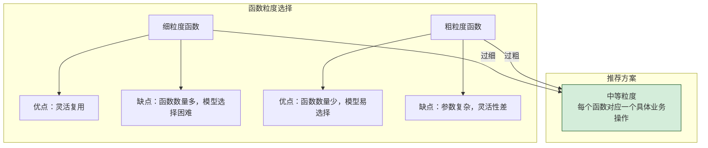

**粒度设计原则：**
- 一个函数对应一个**明确的业务操作**。
- 避免将多个独立操作合并到一个函数中（如同时支持查询和更新）。
- 也不要将一个简单操作过度拆分成多个函数。

#### 正反示例对比

| 反面示例 ❌ | 问题 | 正面示例 ✅ |
|-----------|------|-----------|
| `process_data(data, mode)` | 函数功能不明确，mode 参数含义不清 | `clean_data(data)`、`transform_data(data, format)` |
| `handle_request(req)` | 过于模糊 | `create_order(order_data)`、`cancel_order(order_id)` |
| `do_thing1()`、`do_thing2()` | 命名无语义 | `get_user_profile()`、`update_user_settings()` |

### 10.2 参数设计建议

#### 参数设计原则

| 原则 | 说明 | 示例 |
|------|------|------|
| **最小必要** | 只定义函数执行所必需的参数 | 天气查询只需要 `city`，不需要 `country` |
| **类型明确** | 为每个参数指定精确的类型 | `city` 用 `string`，`count` 用 `integer` |
| **枚举约束** | 对固定取值范围的参数使用 `enum` | `sort_order`: `["asc", "desc"]` |
| **合理默认** | 为可选参数提供合理默认值说明 | `date` 参数说明"默认为当天" |
| **清晰描述** | 每个参数的 `description` 要具体 | `"城市名称，如'北京'、'上海'"` ✅ |

#### 参数描述编写技巧

```json
{
    "city": {
        "type": "string",
        "description": "城市名称，支持中文和英文名称。例如：'北京'、'上海'、'Beijing'、'Shanghai'"
    }
}
```

**好的 description 特征：**
- 包含具体的示例值。
- 说明支持的格式或范围。
- 指出参数的用途。

### 10.3 描述编写技巧

`description` 是模型选择函数的主要依据，编写时需要特别注意。

#### 编写原则

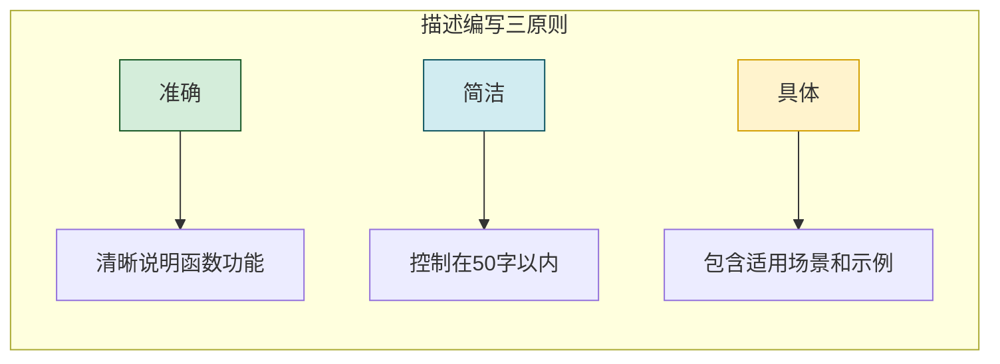

#### 正反示例

| 反面示例 ❌ | 正面示例 ✅ |
|-----------|-----------|
| `更新用户信息` | `根据用户ID更新指定字段的信息，支持修改姓名、邮箱等` |
| `搜索数据` | `从文章库中搜索包含关键词的文章，返回文章标题和摘要` |
| `发送通知` | `向指定用户发送系统通知，支持站内信、邮件两种方式` |

#### 高级技巧：描述中包含触发关键词

在 `description` 中包含用户可能使用的关键词，可以提高函数匹配准确率：

```json
{
    "name": "get_stock_price",
    "description": "获取股票实时价格。当用户询问股价、股票、行情、涨跌等相关问题时使用此函数。"
}
```

### 10.4 性能优化建议

#### 减少函数数量

注册的函数越多，模型选择的难度越大。建议根据场景精简函数数量：

| 函数数量 | 模型选择难度 | 建议 |
|---------|------------|------|
| 1-5 个 | 低 | 适合简单场景 |
| 5-15 个 | 中 | 适合中等复杂场景 |
| 15-30 个 | 高 | 需要优化描述，考虑分类 |
| > 30 个 | 很高 | 建议拆分多个 Agent |

#### 优化 Token 消耗

```python
# 优化前：完整的函数定义
full_tools = [
    {
        "type": "function",
        "function": {
            "name": "get_weather",
            "description": "获取指定城市的天气信息，包括温度、天气状况、风力、湿度等详细信息。适用于查询城市当前天气、未来天气预报等场景。",
            "parameters": {
                "type": "object",
                "properties": {
                    "city": {
                        "type": "string",
                        "description": "城市名称，支持中文和英文名称，如'北京'、'上海'、'Guangzhou'"
                    },
                    "date": {
                        "type": "string",
                        "description": "查询日期，格式为 YYYY-MM-DD。如果不指定，则查询当前天气"
                    }
                },
                "required": ["city"]
            }
        }
    }
]

# 优化后：精简的函数定义（节省 Token）
optimized_tools = [
    {
        "type": "function",
        "function": {
            "name": "get_weather",
            "description": "获取城市天气，用户问天气/气温/温度时调用",
            "parameters": {
                "type": "object",
                "properties": {
                    "city": {"type": "string", "description": "城市名，如北京"}
                },
                "required": ["city"]
            }
        }
    }
]
```

#### 并发执行优化

当模型一次返回多个函数调用时，可以并行执行以提升性能：

```python
import concurrent.futures


def execute_tool_calls_parallel(tool_calls: list, 
                                 function_map: dict) -> list:
    """
    并行执行多个函数调用
    
    参数:
        tool_calls: 模型返回的函数调用列表
        function_map: 函数路由表
    """
    results = []
    
    with concurrent.futures.ThreadPoolExecutor(max_workers=5) as executor:
        future_to_call = {}
        
        for tool_call in tool_calls:
            func_name = tool_call.function.name
            args = json.loads(tool_call.function.arguments or "{}")
            
            if func_name in function_map:
                future = executor.submit(function_map[func_name], **args)
                future_to_call[future] = tool_call
            else:
                results.append({
                    "tool_call_id": tool_call.id,
                    "content": json.dumps({"error": f"未知函数: {func_name}"})
                })
        
        for future in concurrent.futures.as_completed(future_to_call):
            tool_call = future_to_call[future]
            try:
                result = future.result()
                results.append({
                    "tool_call_id": tool_call.id,
                    "content": json.dumps(result, ensure_ascii=False)
                })
            except Exception as e:
                results.append({
                    "tool_call_id": tool_call.id,
                    "content": json.dumps({"error": str(e)})
                })
    
    # 按 tool_call_id 排序，保持顺序
    id_order = {tc.id: i for i, tc in enumerate(tool_calls)}
    results.sort(key=lambda r: id_order.get(r["tool_call_id"], 999))
    
    return results
```

### 10.5 安全注意事项

#### 输入验证

```python
def safe_calculator(expression: str) -> dict:
    """
    安全的计算器实现，防止注入攻击
    
    参数:
        expression: 数学表达式
    """
    # 1. 白名单验证：只允许数学表达式中的合法字符
    allowed_chars = set("0123456789+-*/() .%^")
    if not all(c in allowed_chars for c in expression):
        return {"error": "表达式包含非法字符，只允许数字和运算符"}
    
    # 2. 长度限制
    if len(expression) > 100:
        return {"error": "表达式过长，请简化"}
    
    # 3. 禁止危险操作
    dangerous_patterns = ["import", "exec", "eval", "__", "open", "os.", "sys."]
    for pattern in dangerous_patterns:
        if pattern in expression:
            return {"error": "表达式包含禁止的操作"}
    
    # 4. 使用安全的计算方式
    try:
        # 限制计算复杂度
        if expression.count("(") > 10:
            return {"error": "嵌套层级过深"}
        
        result = eval(expression)  # 生产环境建议使用 ast.literal_eval
        return {"expression": expression, "result": result}
    except ZeroDivisionError:
        return {"error": "除数不能为零"}
    except Exception as e:
        return {"error": f"计算失败: {str(e)}"}
```

#### 权限控制

| 安全措施 | 说明 | 实现方式 |
|---------|------|---------|
| **函数白名单** | 只暴露必要的函数给模型 | 维护严格的函数注册表 |
| **参数校验** | 对模型生成的参数进行严格验证 | Schema 校验 + 业务规则校验 |
| **操作审计** | 记录所有函数调用的日志 | 日志系统 + 调用追踪 ID |
| **权限分级** | 不同用户可调用不同的函数 | 基于角色的函数访问控制 |
| **敏感操作二次确认** | 对关键操作（如删除、支付）要求用户确认 | 在 System Prompt 中设置确认规则 |

#### 安全函数注册示例

```python
class SecureFunctionRegistry:
    """安全的函数注册表，包含权限控制"""
    
    def __init__(self):
        self._functions = {}
        self._user_permissions = {}
    
    def register(self, name: str, func: callable, 
                 allowed_roles: list = None) -> None:
        """
        注册函数并设置权限
        
        参数:
            name: 函数名称
            func: 函数实现
            allowed_roles: 允许调用的角色列表，None 表示所有角色
        """
        self._functions[name] = {
            "func": func,
            "allowed_roles": allowed_roles
        }
    
    def check_permission(self, function_name: str, user_role: str) -> bool:
        """
        检查用户是否有权调用指定函数
        
        参数:
            function_name: 函数名称
            user_role: 用户角色
        """
        if function_name not in self._functions:
            return False
        
        allowed_roles = self._functions[function_name]["allowed_roles"]
        if allowed_roles is None:
            return True
        
        return user_role in allowed_roles
    
    def execute(self, function_name: str, args: dict, 
                user_role: str) -> dict:
        """
        安全执行函数
        
        参数:
            function_name: 函数名称
            args: 函数参数
            user_role: 用户角色
        """
        # 权限检查
        if not self.check_permission(function_name, user_role):
            return {"error": f"权限不足，无法调用 {function_name}"}
        
        # 执行函数
        func = self._functions[function_name]["func"]
        try:
            return func(**args)
        except Exception as e:
            return {"error": str(e)}


# 使用示例
registry = SecureFunctionRegistry()

# 注册函数
registry.register("get_weather", get_weather)  # 所有角色可用
registry.register("delete_user", delete_user, allowed_roles=["admin"])  # 仅管理员
registry.register("send_email", send_email, allowed_roles=["admin", "operator"])

# 执行函数
result = registry.execute("get_weather", {"city": "北京"}, "user")  # 成功
result = registry.execute("delete_user", {"user_id": 123}, "user")  # 权限不足
```

#### 生产环境检查清单

| 序号 | 检查项 | 说明 | 状态 |
|:---:|--------|------|:----:|
| 1 | 函数白名单 | 只注册必要的函数 | ☐ |
| 2 | 参数校验 | 所有函数参数都经过 Schema 校验 | ☐ |
| 3 | 输入净化 | 防止注入攻击和恶意输入 | ☐ |
| 4 | 权限控制 | 敏感函数设置角色权限 | ☐ |
| 5 | 日志审计 | 记录所有函数调用 | ☐ |
| 6 | 超时控制 | 每个函数都有超时机制 | ☐ |
| 7 | 错误隔离 | 单个函数失败不影响其他函数 | ☐ |
| 8 | 速率限制 | 防止函数被恶意频繁调用 | ☐ |

---

## 附录

### 附录一：常用 Function Calling 框架对比表

| 框架名称 | 语言 | 核心特性 | 适用场景 | 官方文档 |
|---------|------|---------|---------|---------|
| **LangChain** | Python/JS | 完整的 Agent 框架，支持多种工具集成 | 复杂 Agent 系统、多工具编排 | [官方文档](https://python.langchain.com/) |
| **LlamaIndex** | Python | 数据连接和 RAG 优化，工具调用支持 | 知识库问答、文档分析 | [官方文档](https://www.llamaindex.ai/) |
| **AutoGen** | Python | 多 Agent 对话框架，支持 Function Calling | 多 Agent 协作、复杂工作流 | [官方文档](https://microsoft.github.io/autogen/) |
| **Semantic Kernel** | Python/Java | 微软出品，支持 Function Calling 和 Plugins | 企业级应用、.NET 生态 | [官方文档](https://learn.microsoft.com/semantic-kernel/) |
| **Dify** | Python/Node | 低代码平台，可视化 Function Calling 编排 | 快速原型、非开发人员 | [官方文档](https://dify.ai/) |
| **Coze** | - | 字节跳动出品，支持插件式 Function Calling | 快速搭建 Bot、C 端应用 | [官方文档](https://www.coze.cn/) |
| **Function Calling SDK** | Python | 轻量级 SDK，专注于 Function Calling | 简单场景、学习用途 | [PyPI](https://pypi.org/) |

### 附录二：Function Calling 与相关技术关系图

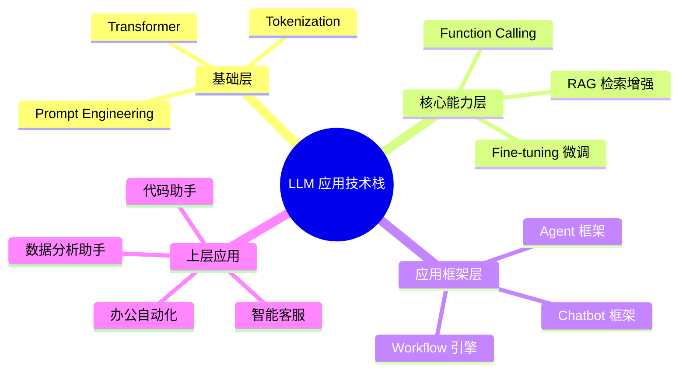

### 附录三：参考文献

1. **OpenAI Function Calling Documentation** - https://platform.openai.com/docs/guides/function-calling
2. **Anthropic Tool Use Documentation** - https://docs.anthropic.com/claude/docs/tool-use
3. **Function Calling 原始论文** - *"Function Calling in Large Language Models"*, 2023
4. **ReAct: Synergizing Reasoning and Acting** - Yao et al., 2022
5. **LangChain 官方文档** - https://python.langchain.com/docs/
6. **JSON Schema 规范** - https://json-schema.org/
7. **GPT-4 Technical Report** - OpenAI, 2023

### 附录四：Function Calling 调用速查表

#### 常用 API 参数

| 参数 | 类型 | 说明 | 推荐值 |
|------|------|------|--------|
| `model` | string | 模型名称 | `gpt-4` |
| `messages` | array | 对话历史 | - |
| `tools` | array | 可用函数列表 | 根据需求定义 |
| `tool_choice` | string/object | 函数选择策略 | `"auto"` |
| `temperature` | float | 生成温度 | `0.7`（函数调用场景建议较低） |
| `max_tokens` | integer | 最大生成 Token | 根据场景设置 |

#### 函数定义模板

```json
{
    "type": "function",
    "function": {
        "name": "your_function_name",
        "description": "清晰的函数描述，包含使用场景和触发关键词",
        "parameters": {
            "type": "object",
            "properties": {
                "param1": {
                    "type": "string",
                    "description": "参数说明，包含示例值"
                }
            },
            "required": ["param1"]
        }
    }
}
```

#### 完整调用流程 Checklist

| 步骤 | 操作 | 说明 | 状态 |
|:---:|------|------|:----:|
| 1 | 定义函数 | 编写 JSON Schema 格式的函数定义 | ☐ |
| 2 | 注册函数 | 将函数定义加入 `tools` 列表 | ☐ |
| 3 | 实现函数 | 编写函数的实际逻辑代码 | ☐ |
| 4 | 构建请求 | 发送 `messages` + `tools` 给模型 | ☐ |
| 5 | 检测调用 | 检查响应中的 `tool_calls` 字段 | ☐ |
| 6 | 执行函数 | 解析函数名和参数，执行对应实现 | ☐ |
| 7 | 返回结果 | 将函数结果以 `tool` 角色返回给模型 | ☐ |
| 8 | 获取回复 | 模型基于函数结果生成最终回复 | ☐ |
| 9 | 错误处理 | 处理可能的异常和重试逻辑 | ☐ |
| 10 | 日志记录 | 记录完整的调用链路用于调试 | ☐ |
