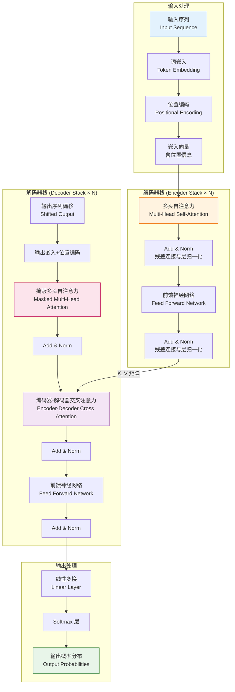
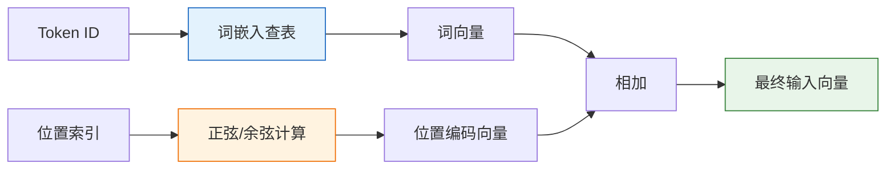
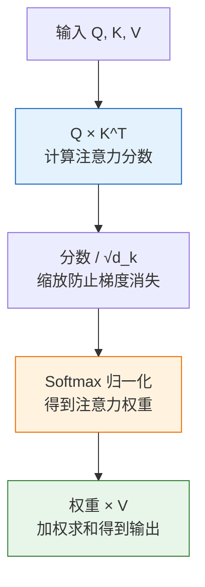
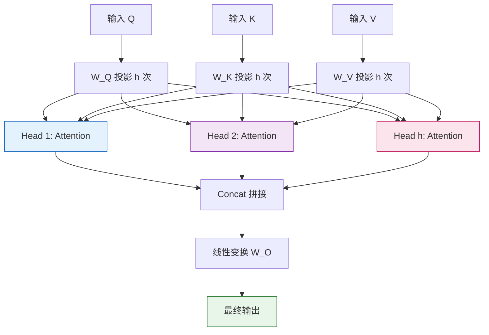
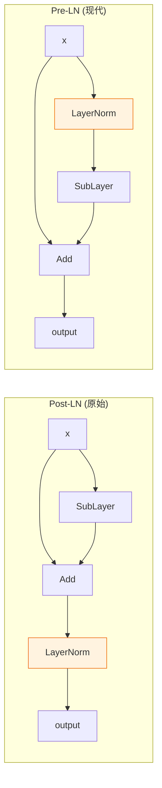
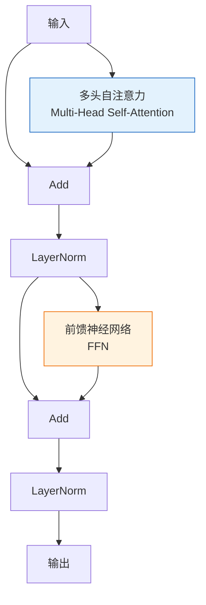
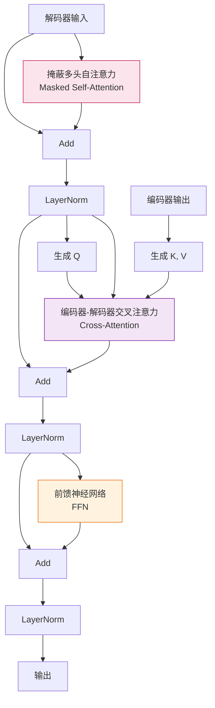
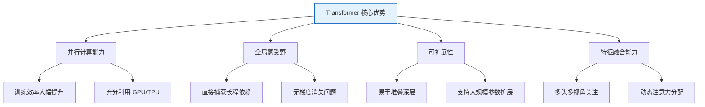
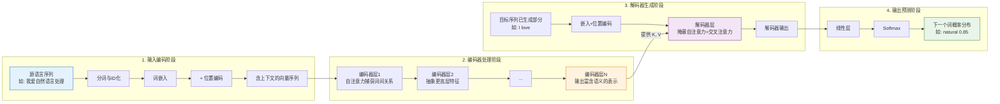

# Transformer 基本结构详解：大模型时代的基石架构

## 引言

2017 年，Google 团队在论文《Attention Is All You Need》中首次提出了 Transformer 架构。这一架构彻底颠覆了自然语言处理领域的传统范式，摒弃了循环神经网络（RNN）和长短期记忆网络（LSTM）的序列依赖模式，完全基于注意力机制（Attention Mechanism）构建。Transformer 不仅在机器翻译任务上取得了 SOTA（State-of-the-Art）性能，更成为后续 BERT、GPT、LLaMA 等几乎所有大语言模型（LLM）的基础架构。

本文将系统阐述 Transformer 的核心组成部分及其工作原理，从数学原理到工程实现，帮助读者建立对这一基石架构的深入理解。

---

## 1. Transformer 整体架构概览

Transformer 采用经典的 **编码器-解码器（Encoder-Decoder）** 架构，整体设计围绕"完全基于注意力、无循环结构"的核心理念展开。

### 1.1 整体架构图

### 1.2 核心设计思想

Transformer 的设计基于三个核心理念：

1. **并行化处理**：摒弃 RNN 的时序依赖，允许整个序列并行计算，大幅提升训练效率。
2. **全局感受野**：通过自注意力机制，每个位置都能直接关注序列中的所有其他位置，捕获长程依赖。
3. **位置感知**：由于失去了循环结构固有的顺序信息，引入位置编码显式注入位置信息。

---

## 2. 词嵌入与位置编码

### 2.1 词嵌入（Token Embedding）

词嵌入是将离散的词元（Token）映射到连续的向量空间的过程。

**数学描述**：

给定词表大小为 $V$，嵌入维度为 $d_{model}$，嵌入矩阵 $E \in \mathbb{R}^{V \times d_{model}}$。对于输入词元序列 $(t_1, t_2, ..., t_n)$，其嵌入表示为：

$$
X = [E_{t_1}, E_{t_2}, ..., E_{t_n}] \in \mathbb{R}^{n \times d_{model}}
$$

其中 $E_{t_i}$ 是词表中第 $t_i$ 个词的嵌入向量。

**关键点**：
- 嵌入权重通常乘以 $\sqrt{d_{model}}$ 进行缩放，以保持方差稳定。
- 嵌入矩阵是可学习的参数，在训练过程中不断优化。

### 2.2 位置编码（Positional Encoding）

由于 Transformer 完全摒弃了循环结构，模型本身不具备感知序列顺序的能力。为了让模型理解词元的相对或绝对位置，需要显式地注入位置信息。

#### 2.2.1 正弦/余弦位置编码

原始 Transformer 论文采用正弦和余弦函数的固定位置编码：

$$
PE_{(pos, 2i)} = \sin\left(\frac{pos}{10000^{2i/d_{model}}}\right)
$$

$$
PE_{(pos, 2i+1)} = \cos\left(\frac{pos}{10000^{2i/d_{model}}}\right)
$$

其中：
- $pos$ 是词元在序列中的位置（$0, 1, 2, ...$）
- $i$ 是嵌入维度的索引（$0, 1, 2, ..., d_{model}/2 - 1$）
- $2i$ 和 $2i+1$ 分别表示偶数和奇数维度

#### 2.2.2 编码原理与直觉

为什么选择正弦/余弦函数？这基于以下数学性质：

1. **周期性表达相对位置**：对于固定的偏移量 $\delta$，$PE_{pos+\delta}$ 可以表示为 $PE_{pos}$ 的线性函数：

$$
\begin{pmatrix} \sin(pos+\delta) \\ \cos(pos+\delta) \end{pmatrix} = \begin{pmatrix} \cos\delta & \sin\delta \\ -\sin\delta & \cos\delta \end{pmatrix} \begin{pmatrix} \sin(pos) \\ \cos(pos) \end{pmatrix}
$$

   这使得模型能够轻松学习到相对位置关系。

2. **不同维度对应不同周期**：低频维度（大 $i$）捕捉长距离位置关系，高频维度（小 $i$）捕捉近距离位置关系，形成多尺度的位置表征。

3. **泛化能力强**：由于是固定函数，可外推到训练时未见过的更长序列。

#### 2.2.3 最终嵌入

最终的输入嵌入是词嵌入与位置编码的逐元素相加：

$$
X_{final} = X + PE
$$

---

## 3. 多头注意力机制（Multi-Head Attention）

多头注意力是 Transformer 的**核心创新**，也是"Attention Is All You Need"这一论断的灵魂所在。

### 3.1 缩放点积注意力（Scaled Dot-Product Attention）

在介绍多头之前，先理解基础的注意力机制。

#### 3.1.1 Q、K、V 的概念

注意力机制借鉴了信息检索的范式：
- **Query（Q，查询）**：当前正在处理的位置，表示"我要寻找什么信息"
- **Key（K，键）**：序列中各位置的索引特征，表示"我有什么信息"
- **Value（V，值）**：序列中各位置的实际内容，表示"我提供的具体信息"

#### 3.1.2 数学公式

给定查询矩阵 $Q$、键矩阵 $K$、值矩阵 $V$，注意力计算公式为：

$$
\text{Attention}(Q, K, V) = \text{softmax}\left(\frac{QK^T}{\sqrt{d_k}}\right)V
$$

其中 $d_k$ 是键向量的维度，$\sqrt{d_k}$ 是缩放因子。

#### 3.1.3 计算步骤分解

#### 3.1.4 为什么需要缩放因子 $\sqrt{d_k}$？

当 $d_k$ 较大时，$QK^T$ 的点积结果会变得很大，导致 softmax 函数进入梯度极小的饱和区（梯度消失）。除以 $\sqrt{d_k}$ 可使点积的方差控制在 1 左右，保证梯度稳定。

**数学推导**：假设 $Q$ 和 $K$ 的元素是均值 0、方差 1 的独立随机变量，则点积 $q \cdot k = \sum_{i=1}^{d_k} q_i k_i$ 的均值为 0，方差为 $d_k$。除以 $\sqrt{d_k}$ 后，方差变为 1。

### 3.2 多头机制（Multi-Head Mechanism）

单个注意力函数只能学习一种注意力模式。为了让模型能同时从不同的表示子空间和不同位置关注信息，Transformer 引入了多头机制。

#### 3.2.1 工作原理

将 Q、K、V 分别投影到 $h$ 个不同的子空间，各自独立计算注意力，最后拼接并线性变换：

$$
\text{MultiHead}(Q, K, V) = \text{Concat}(\text{head}_1, ..., \text{head}_h)W^O
$$

其中每个头：

$$
\text{head}_i = \text{Attention}(QW_i^Q, KW_i^K, VW_i^V)
$$

参数矩阵：
- $W_i^Q \in \mathbb{R}^{d_{model} \times d_k}$
- $W_i^K \in \mathbb{R}^{d_{model} \times d_k}$
- $W_i^V \in \mathbb{R}^{d_{model} \times d_v}$
- $W^O \in \mathbb{R}^{hd_v \times d_{model}}$

通常设置 $d_k = d_v = d_{model} / h$，以保持计算量与单头注意力相当。

#### 3.2.2 多头注意力结构图

#### 3.2.3 多头的直觉

不同头可以学习到不同的语义关系：
- 某些头可能专注于**语法依赖**（如主谓关系）
- 某些头可能专注于**指代消解**（如代词与其先行词）
- 某些头可能专注于**长距离语义关联**
- 某些头可能关注**局部上下文**

这种多视角的并行关注能力，是 Transformer 强大表征能力的核心来源。

---

## 4. 前馈神经网络（Feed Forward Network, FFN）

在每个注意力子层之后，Transformer 都接一个前馈神经网络。

### 4.1 结构与公式

FFN 是一个两层的全连接网络，中间通过非线性激活函数（原始论文使用 ReLU）：

$$
\text{FFN}(x) = \max(0, xW_1 + b_1)W_2 + b_2
$$

**关键特征**：
- 第一层将维度从 $d_{model}$ 扩展到 $d_{ff}$（通常 $d_{ff} = 4 \times d_{model}$）
- 第二层将维度从 $d_{ff}$ 压缩回 $d_{model}$
- 对序列中每个位置**独立且相同**地应用（即位置间的权重共享）

### 4.2 功能作用

FFN 在 Transformer 中扮演着"特征变换与整合"的角色：

1. **非线性增强**：注意力机制本身是线性的（除 softmax 外），FFN 引入非线性能力，增强模型表达能力。
2. **特征升维与降维**：通过先扩展后压缩的瓶颈结构，学习更丰富的特征表示。
3. **位置独立处理**：注意力机制负责"跨位置信息融合"，FFN 负责"单位置特征深化"，两者分工互补。

### 4.3 现代变体

后续研究对 FFN 进行了改进：
- **GELU 激活**：BERT、GPT 系列采用更平滑的 GELU 替代 ReLU
- **SwiGLU**：LLaMA 等模型采用门控线性单元（GLU）变体，效果优于 ReLU
- **GLU 变体公式**：$\text{SwiGLU}(x) = \text{Swish}(xW_1) \otimes (xW_2)$

---

## 5. 残差连接与层归一化（Add & Norm）

每个子层（注意力或 FFN）都嵌套在一个残差连接和层归一化的结构中。

### 5.1 残差连接（Residual Connection）

**公式**：

$$
\text{output} = \text{SubLayer}(x) + x
$$

**作用**：
1. **缓解梯度消失**：为梯度提供直接回传通路，使深层网络训练成为可能。
2. **信息保留**：确保原始输入信息不被子层变换完全覆盖，模型可选择性地利用变换后的特征。
3. **支持深层堆叠**：Transformer 通常堆叠 6 层（原始）到数十层（现代大模型），残差连接是关键。

### 5.2 层归一化（Layer Normalization）

**公式**：

$$
\text{LayerNorm}(x) = \gamma \cdot \frac{x - \mu}{\sqrt{\sigma^2 + \epsilon}} + \beta
$$

其中 $\mu$ 和 $\sigma^2$ 是 $x$ 在特征维度上的均值和方差，$\gamma$ 和 $\beta$ 是可学习的缩放和平移参数。

**作用**：
1. **稳定训练**：归一化每层的输入分布，减少内部协变量偏移（Internal Covariate Shift）。
2. **加速收敛**：允许使用更大的学习率，加快训练速度。
3. **特征维度归一化**：与 BatchNorm 不同，LayerNorm 在特征维度上归一化，不依赖 batch 大小，适合序列模型。

### 5.3 Add & Norm 的两种顺序

- **Post-LN（原始 Transformer）**：先 SubLayer，再 Add，最后 Norm。即 $\text{Norm}(x + \text{SubLayer}(x))$。
- **Pre-LN（现代大模型常用）**：先 Norm，再 SubLayer，最后 Add。即 $x + \text{SubLayer}(\text{Norm}(x))$。

Pre-LN 训练更稳定，无需复杂的学习率预热，被 GPT-2 之后的大模型广泛采用。

---

## 6. 编码器（Encoder）结构详解

编码器的任务是**理解输入序列**，将其编码为富含上下文信息的连续表示。

### 6.1 单层编码器结构

每个编码器层包含两个子层：

1. **多头自注意力层**（Multi-Head Self-Attention）
2. **前馈神经网络层**（Position-wise Feed Forward Network）

每个子层都包裹在 Add & Norm 结构中。

### 6.2 自注意力的"自"含义

编码器中的注意力称为**自注意力**（Self-Attention），因为 Q、K、V 三者都来自同一个输入序列。这意味着序列中的每个位置都可以直接"看到"并关注序列中的所有其他位置（包括自己），从而捕获任意距离的依赖关系。

### 6.3 编码器栈

原始 Transformer 堆叠 $N=6$ 个相同的编码器层。每一层的输出作为下一层的输入，逐层提取更高层次的抽象特征。

---

## 7. 解码器（Decoder）结构详解

解码器的任务是**生成输出序列**，在编码器提供的上下文表示基础上，自回归地逐个生成输出词元。

### 7.1 单层解码器的三个子层

解码器比编码器多了一个子层，共有三个：

1. **掩蔽多头自注意力层**（Masked Multi-Head Self-Attention）
2. **编码器-解码器交叉注意力层**（Encoder-Decoder Cross-Attention）
3. **前馈神经网络层**（Feed Forward Network）

### 7.2 掩蔽自注意力（Masked Self-Attention）

**为什么需要掩蔽？**

解码器采用自回归（Auto-Regressive）方式生成序列，即第 $t$ 个词元的生成只能依赖前面 $t-1$ 个已生成的词元。为了保证训练时的并行性（同时预测所有位置），必须通过掩蔽（Masking）阻止位置 $t$ 关注位置 $> t$ 的信息。

**实现方式**：在计算注意力分数后、softmax 之前，将未来位置的分数设为 $-\infty$：

$$
\text{MaskedAttention}(Q, K, V) = \text{softmax}\left(\frac{QK^T + M}{\sqrt{d_k}}\right)V
$$

其中 $M$ 是掩蔽矩阵，上三角部分为 $-\infty$，其余为 0。经过 softmax 后，未来位置的权重变为 0。

### 7.3 编码器-解码器交叉注意力（Cross-Attention）

这是连接编码器与解码器的桥梁：
- **Q** 来自解码器上一层的输出（"我要查询什么"）
- **K, V** 来自编码器的最终输出（"源序列提供什么信息"）

这一层使解码器在生成每个词元时，都能动态地从输入序列中检索最相关的信息，实现"对齐"与"信息提取"。

---

## 8. 输出层：线性变换与 Softmax

解码器栈的最终输出经过一个线性层和 softmax 层，转换为词表上的概率分布。

### 8.1 计算过程

1. **线性变换**：将解码器输出（维度 $d_{model}$）投影到词表大小维度 $V$：
$$
\text{logits} = xW_{out} + b_{out}, \quad W_{out} \in \mathbb{R}^{d_{model} \times V}
$$

2. **Softmax 归一化**：转换为概率分布：
$$
P(y_t = w) = \frac{\exp(\text{logits}_w)}{\sum_{w'} \exp(\text{logits}_{w'})}
$$

3. **采样生成**：根据概率分布采样（贪婪、beam search、top-k、top-p 等）得到下一个词元。

### 8.2 权重共享

原始 Transformer 中，输入嵌入矩阵和输出投影矩阵（$W_{out}$）通常**共享权重**。这一做法：
- 大幅减少参数量（词表大时尤其显著）
- 让输入和输出在统一的语义空间中表示
- 实验证证可提升模型性能

---

## 9. Transformer vs. 传统序列模型

### 9.1 与 RNN/LSTM 的对比

| 对比维度 | RNN / LSTM | Transformer |
| :--- | :--- | :--- |
| **计算并行性** | 必须按时间步顺序计算，无法并行 | 所有位置可完全并行计算 |
| **长程依赖** | 受梯度消失/爆炸影响，长程依赖捕获困难 | 自注意力直接连接任意位置，长程依赖捕获优秀 |
| **计算复杂度** | $O(n \cdot d^2)$，序列长度线性增长 | $O(n^2 \cdot d)$，序列长度平方增长 |
| **位置信息** | 隐式包含在时序处理中 | 需显式位置编码注入 |
| **训练效率** | 低，难以充分利用 GPU 并行能力 | 高，高度适配 GPU 并行计算 |
| **内存消耗** | $O(n \cdot d)$ | $O(n^2 \cdot d)$，长序列内存压力大 |

### 9.2 Transformer 的核心优势

### 9.3 Transformer 的局限性

1. **序列长度的平方复杂度**：自注意力的 $O(n^2)$ 复杂度使得处理超长序列（如长文档）时计算和内存成本高昂。这是后续 FlashAttention、Longformer、Linformer 等优化的动机。
2. **缺乏归纳偏置**：不像 CNN 具有局部性归纳偏置，Transformer 需要更多数据才能学到空间/序列结构。
3. **位置编码的外推能力有限**：固定正弦编码在序列长度远超训练长度时效果下降。

---

## 10. 完整信息流动路径总结

让我们以一次完整的"编码-解码"流程梳理信息如何在 Transformer 中流动：

**信息流动详解**：

1. **输入编码**：源序列经词嵌入和位置编码，转化为携带语义和位置信息的向量序列。
2. **编码器处理**：向量序列逐层通过自注意力（建立词间关联）和 FFN（深化特征），最终输出富含上下文语义的编码表示。每个位置的表示都融合了整个序列的信息。
3. **解码器生成**：已生成的目标序列前缀经嵌入后进入解码器。掩蔽自注意力确保因果性，交叉注意力从编码器输出中检索相关信息，FFN 深化特征。
4. **输出预测**：解码器输出经线性层和 softmax，得到词表上的概率分布，采样得到下一个词元。重复此过程直至生成结束符。

---

## 11. 关键超参数总结

| 超参数 | 原始 Transformer (Base) | 原始 Transformer (Big) | 说明 |
| :--- | :--- | :--- | :--- |
| $d_{model}$ | 512 | 1024 | 模型隐藏层维度 |
| $N$（层数） | 6 | 6 | 编码器/解码器堆叠层数 |
| $h$（头数） | 8 | 16 | 多头注意力的头数 |
| $d_k = d_v$ | 64 | 64 | 每个头的维度，$d_k = d_{model}/h$ |
| $d_{ff}$ | 2048 | 4096 | FFN 中间层维度，通常为 $4 \times d_{model}$ |
| 参数量 | 约 65M | 约 213M | 模型总参数 |

---

## 12. 总结

Transformer 架构的成功源于其精妙的设计组合：

- **自注意力机制**：实现了任意位置间的直接信息交互，彻底解决了长程依赖问题，并通过多头机制支持多视角的特征学习。
- **位置编码**：以优雅的数学形式弥补了去除循环结构后的位置信息缺失。
- **并行架构**：摒弃时序依赖，充分利用现代硬件的并行计算能力，使大规模训练成为可能。
- **残差连接与层归一化**：保障了深层网络的可训练性和稳定性。
- **编码器-解码器分离**：清晰区分"理解"与"生成"两个阶段，结构明确且易于扩展。

正是这些设计的协同作用，使 Transformer 成为现代大语言模型的基石。理解 Transformer，是理解 BERT、GPT、LLaMA 等模型工作原理的前提，也是深入探索 AI Agent 技术栈不可或缺的基础。后续的预训练范式（如 Decoder-only 的 GPT 系列、Encoder-only 的 BERT 系列）都是在这一基础架构上的变体与演进。
