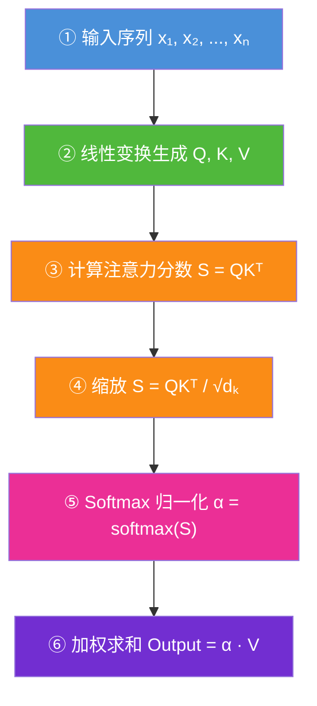
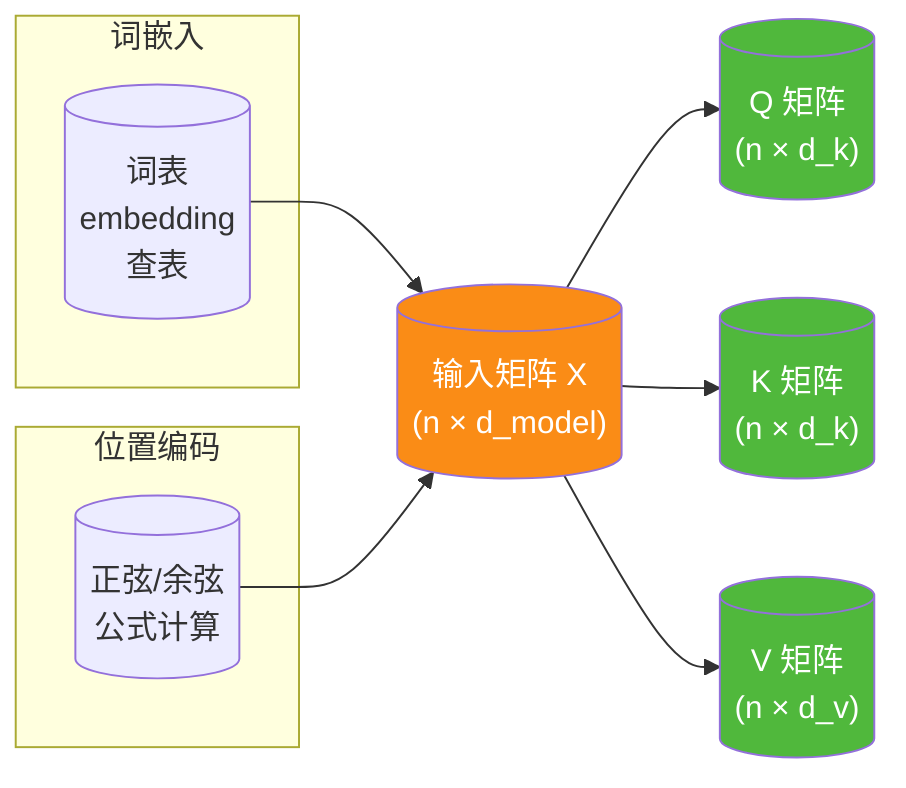
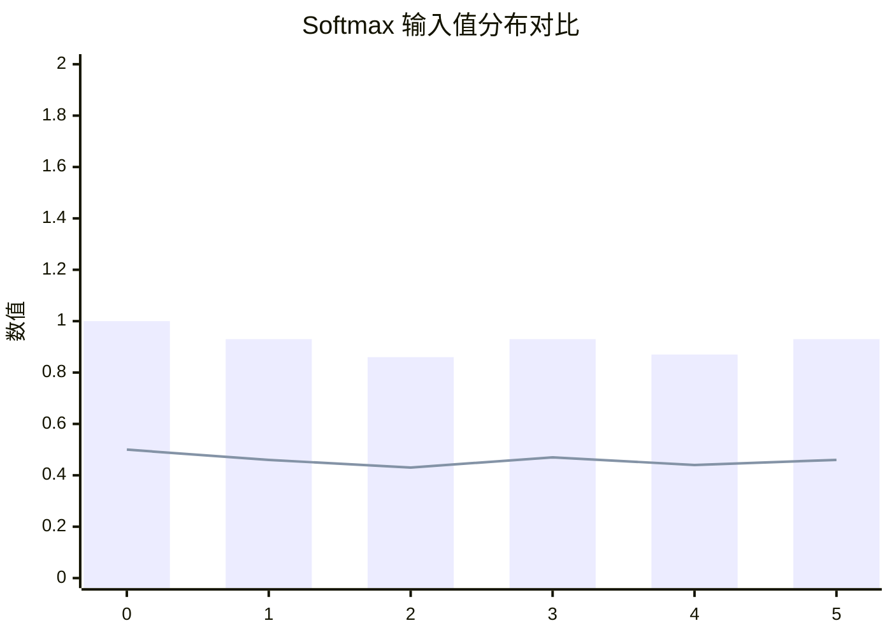
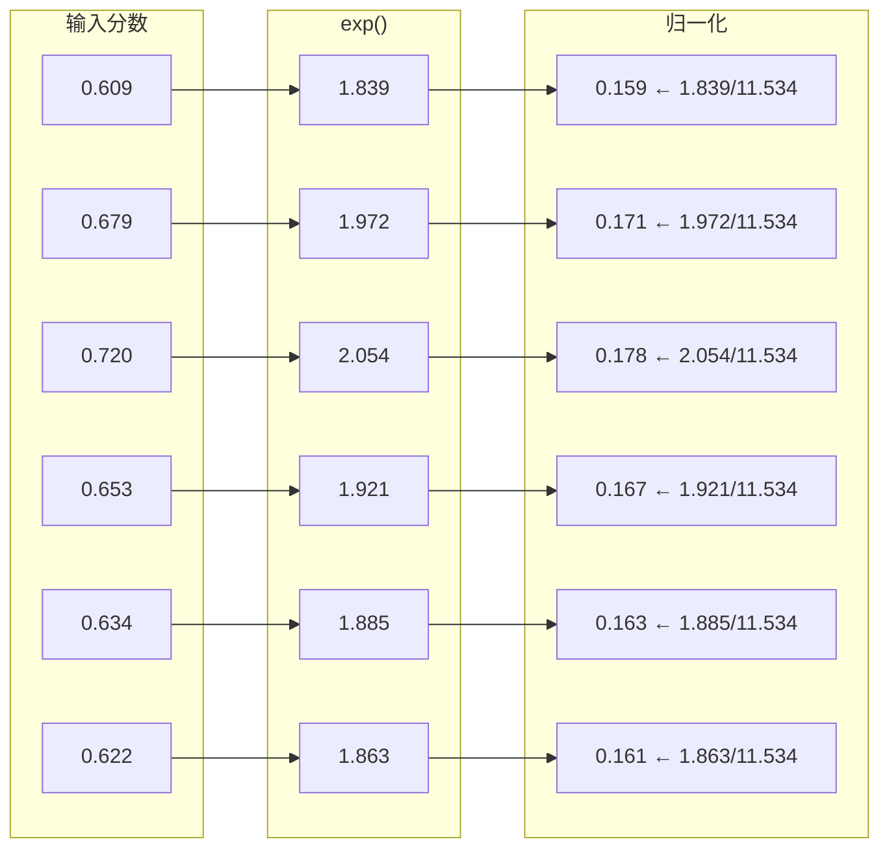
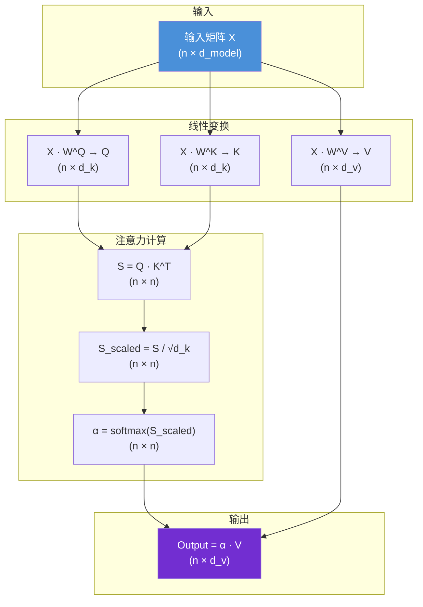
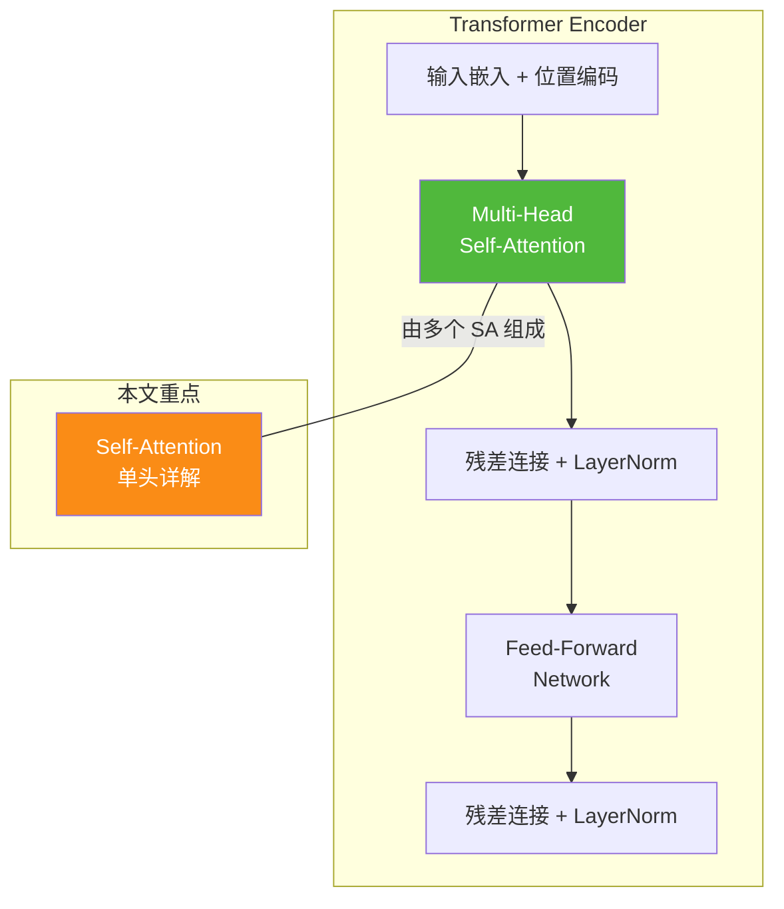

# Self-Attention 机制完整计算过程详解

> Self-Attention（自注意力）是 Transformer 架构的核心组件，也是大语言模型（LLM）能够理解上下文、捕捉语义关联的关键技术。本文将从输入到输出，逐步拆解 Self-Attention 的每一个计算步骤，配合数学公式、矩阵维度分析、具体数值演示和代码实现，帮助读者彻底理解其内部工作原理。

---

## 目录

1. [Self-Attention 核心思想概述](#1-self-attention-核心思想概述)
2. [整体计算流程总览](#2-整体计算流程总览)
3. [第一步：输入序列的处理](#3-第一步输入序列的处理)
4. [第二步：Query / Key / Value 矩阵的生成](#4-第二步query--key--value-矩阵的生成)
5. [第三步：注意力分数的计算](#5-第三步注意力分数的计算)
6. [第四步：缩放点积注意力（Scaled Dot-Product）](#6-第四步缩放点积注意力scaled-dot-product)
7. [第五步：Softmax 归一化得到注意力权重](#7-第五步softmax-归一化得到注意力权重)
8. [第六步：加权求和得到输出](#8-第六步加权求和得到输出)
9. [完整数值演示：端到端手工计算](#9-完整数值演示端到端手工计算)
10. [PyTorch 代码实现](#10-pytorch-代码实现)
11. [Multi-Head Attention 扩展](#11-multi-head-attention-扩展)
12. [总结](#12-总结)

---

## 1. Self-Attention 核心思想概述

### 1.1 什么是 Self-Attention

Self-Attention 的核心思想非常直观：

> **序列中的每个 token（词），都去"关注"序列中所有其他 token，并根据重要性权重进行加权汇总，从而得到一个包含全局上下文信息的新表示。**

举个例子，当模型处理句子"**动物**不穿越**街道**，因为**它**太困了"时：

- 当处理"它"这个 token 时，模型需要知道"它"指的是"动物"而不是"街道"
- Self-Attention 机制让"它"这个 query 能够主动与"动物"和"街道"计算关联分数，并学习到"它"应该更多地关注"动物"

### 1.2 与传统方法的对比

| 方法 | 核心机制 | 全局依赖 | 计算复杂度 |
|------|---------|---------|-----------|
| RNN / LSTM | 递归顺序处理 | 需逐步传递，容易遗忘 | O(n) 顺序，难并行 |
| CNN | 卷积核局部感受野 | 堆叠多层才可达全局 | O(k·n)，感受野受限 |
| **Self-Attention** | **全局两两直接计算** | **任意两个 token 直接相连** | **O(n²)，完全可并行** |

Self-Attention 的优势在于：序列中任意两个位置的 token 之间的依赖关系可以被**一步**捕获，且所有计算可以**并行执行**。

---

## 2. 整体计算流程总览

### 2.1 六个核心步骤



### 2.2 矩阵维度变化一览

假设输入序列长度为 $n$，每个 token 的嵌入维度为 $d_{model}$：

| 步骤 | 操作 | 输出维度 | 说明 |
|------|------|---------|------|
| 输入嵌入 | — | $(n, d_{model})$ | 词嵌入 + 位置编码 |
| 线性变换 | $X \cdot W^Q, X \cdot W^K, X \cdot W^V$ | Q,K,V 各为 $(n, d_k)$ | 通常 $d_k = d_{model}$ 或更小 |
| 分数计算 | $Q \cdot K^T$ | $(n, n)$ | 每个 token 对其他 token 的相关性 |
| 缩放 | $S / \sqrt{d_k}$ | $(n, n)$ | 除以 Key 维度的平方根 |
| Softmax | $\text{softmax}(S)$ | $(n, n)$ | 每行和为 1 的注意力权重 |
| 加权求和 | $\alpha \cdot V$ | $(n, d_v)$ | 通常 $d_v = d_k$ |

---

## 3. 第一步：输入序列的处理

### 3.1 Token 嵌入（Embedding）

假设我们处理的句子是：

> **"The cat sat on the mat"**

分词后得到 6 个 token：$[\text{The}, \text{cat}, \text{sat}, \text{on}, \text{the}, \text{mat}]$

每个 token 通过一个预训练的词嵌入矩阵 $E$（vocab_size × $d_{model}$），查表得到一个 $d_{model}$ 维的稠密向量。

取 $d_{model} = 4$（简化演示，实际通常为 512 或 768）：

$$
X = [\mathbf{x}_1, \mathbf{x}_2, \mathbf{x}_3, \mathbf{x}_4, \mathbf{x}_5, \mathbf{x}_6]^T
$$

其中每个 $\mathbf{x}_i \in \mathbb{R}^{4}$，矩阵 $X \in \mathbb{R}^{6 \times 4}$：

$$
X = \begin{bmatrix}
0.2 & 0.5 & 0.1 & 0.8 \\  % The
0.9 & 0.3 & 0.7 & 0.2 \\  % cat
0.1 & 0.8 & 0.4 & 0.6 \\  % sat
0.6 & 0.2 & 0.9 & 0.3 \\  % on
0.3 & 0.7 & 0.2 & 0.5 \\  % the
0.8 & 0.4 & 0.6 & 0.1 \\  % mat
\end{bmatrix}
$$

### 3.2 位置编码（Position Encoding）

由于 Self-Attention 本身不感知序列顺序，需要为每个 token 注入位置信息。

Transformer 使用正弦/余弦位置编码公式：

$$
PE_{(pos, 2i)} = \sin\left(\frac{pos}{10000^{2i/d_{model}}}\right)
$$
$$
PE_{(pos, 2i+1)} = \cos\left(\frac{pos}{10000^{2i/d_{model}}}\right)
$$

其中：
- $pos$：token 在序列中的位置（0, 1, 2, ..., n-1）
- $i$：嵌入维度的索引（0, 1, ..., $d_{model}$/2 - 1）

**位置编码矩阵 PE 的维度为 $(n, d_{model})$**，直接与输入嵌入 $X$ 相加：

$$
X_{input} = X + PE
$$

### 3.3 完整输入矩阵

经过嵌入查表和位置编码相加后，最终输入矩阵 $X \in \mathbb{R}^{n \times d_{model}}$，在本例中为 $(6, 4)$。



---

## 4. 第二步：Query / Key / Value 矩阵的生成

### 4.1 线性变换

Self-Attention 的核心机制是将输入矩阵 $X$ 通过三个不同的**可学习权重矩阵** $W^Q, W^K, W^V$ 进行线性变换，分别生成 Query、Key、Value 矩阵：

$$
Q = X \cdot W^Q
$$
$$
K = X \cdot W^K
$$
$$
V = X \cdot W^V
$$

其中：
- $X \in \mathbb{R}^{n \times d_{model}}$：输入矩阵（$n$ 个 token，每个 $d_{model}$ 维）
- $W^Q \in \mathbb{R}^{d_{model} \times d_k}$：Query 的权重矩阵（可学习参数）
- $W^K \in \mathbb{R}^{d_{model} \times d_k}$：Key 的权重矩阵（可学习参数）
- $W^V \in \mathbb{R}^{d_{model} \times d_v}$：Value 的权重矩阵（可学习参数）
- $Q \in \mathbb{R}^{n \times d_k}$：Query 矩阵
- $K \in \mathbb{R}^{n \times d_k}$：Key 矩阵
- $V \in \mathbb{R}^{n \times d_v}$：Value 矩阵

### 4.2 直观理解

可以这样理解 Q、K、V 的角色：

| 矩阵 | 比喻 | 作用 |
|------|------|------|
| **Query (Q)** | "查询" | 当前 token 想从其他 token 中查找什么信息 |
| **Key (K)** | "索引/标签" | 每个 token 提供什么信息供他人查询 |
| **Value (V)** | "内容" | 每个 token 实际携带的信息内容 |

类比数据库查询：Query 是搜索条件，Key 是索引字段，Value 是查询结果返回的内容。

### 4.3 数值示例

延续前面的输入矩阵 $X$（6×4），假设 $d_k = 4$，$d_v = 4$，三个权重矩阵为：

$$
W^Q = \begin{bmatrix}
0.3 & 0.1 & 0.5 & 0.2 \\
0.4 & 0.6 & 0.1 & 0.3 \\
0.2 & 0.5 & 0.3 & 0.4 \\
0.5 & 0.2 & 0.4 & 0.1
\end{bmatrix}, 
W^K = \begin{bmatrix}
0.2 & 0.5 & 0.1 & 0.4 \\
0.6 & 0.3 & 0.4 & 0.2 \\
0.1 & 0.4 & 0.5 & 0.3 \\
0.5 & 0.2 & 0.3 & 0.6
\end{bmatrix},
W^V = \begin{bmatrix}
0.4 & 0.2 & 0.3 & 0.5 \\
0.1 & 0.5 & 0.6 & 0.2 \\
0.3 & 0.4 & 0.2 & 0.5 \\
0.6 & 0.1 & 0.4 & 0.3
\end{bmatrix}
$$

以 $Q = X \cdot W^Q$ 为例，计算第一行（token "The" 的 Query 向量）：

$$
\mathbf{q}_1 = \mathbf{x}_1 \cdot W^Q = [0.2, 0.5, 0.1, 0.8] \cdot W^Q
$$

$$
= [0.2×0.3+0.5×0.4+0.1×0.2+0.8×0.5, \ 0.2×0.1+0.5×0.6+0.1×0.5+0.8×0.2, \ ...]
$$

$$
= [0.680, 0.530, 0.500, 0.310]
$$

对所有 token 做同样计算，得到完整的 $Q, K, V$ 矩阵（维度均为 $6 \times 4$）：

$$
Q = \begin{bmatrix}
0.680 & 0.530 & 0.500 & 0.310 \\
0.630 & 0.660 & 0.770 & 0.570 \\
0.730 & 0.810 & 0.490 & 0.480 \\
0.590 & 0.690 & 0.710 & 0.570 \\
0.660 & 0.650 & 0.480 & 0.400 \\
0.570 & 0.640 & 0.660 & 0.530
\end{bmatrix}, \quad
K = \begin{bmatrix}
0.750 & 0.450 & 0.510 & 0.690 \\
0.530 & 0.860 & 0.620 & 0.750 \\
0.840 & 0.570 & 0.710 & 0.680 \\
0.480 & 0.780 & 0.680 & 0.730 \\
0.750 & 0.540 & 0.560 & 0.620 \\
0.510 & 0.780 & 0.570 & 0.640
\end{bmatrix}, \quad
V = \begin{bmatrix}
0.640 & 0.410 & 0.700 & 0.490 \\
0.720 & 0.630 & 0.670 & 0.920 \\
0.600 & 0.640 & 0.830 & 0.590 \\
0.710 & 0.610 & 0.600 & 0.880 \\
0.550 & 0.540 & 0.750 & 0.540 \\
0.600 & 0.610 & 0.640 & 0.810
\end{bmatrix}
$$"

---

## 5. 第三步：注意力分数的计算

### 5.1 点积计算

有了 $Q$ 和 $K$ 之后，每个 Query 向量与所有 Key 向量做点积，得到注意力分数：

$$
S = Q \cdot K^T
$$

维度变化：$Q$ 是 $(n, d_k)$，$K^T$ 是 $(d_k, n)$，所以 $S$ 是 $(n, n)$。

$$
S_{ij} = \mathbf{q}_i \cdot \mathbf{k}_j = \sum_{k=1}^{d_k} q_{i,k} \cdot k_{j,k}
$$

即第 $i$ 个 token 对第 $j$ 个 token 的关注度。

### 5.2 几何直觉

两个向量的点积 $\mathbf{q} \cdot \mathbf{k}$ 等价于：

$$
\mathbf{q} \cdot \mathbf{k} = \|\mathbf{q}\| \cdot \|\mathbf{k}\| \cdot \cos(\theta)
$$

其中 $\theta$ 是两个向量的夹角。这意味着：
- **方向越相似**（$\cos\theta$ 越大）→ 点积越大 → 关注度越高
- **向量模长越大** → 点积越大 → 也会影响关注度

### 5.3 数值计算示例

以 $\mathbf{q}_1$（"The" 的 Query）和 $\mathbf{k}_1$（"The" 的 Key）为例：

$$
s_{11} = \mathbf{q}_1 \cdot \mathbf{k}_1 = 0.680 \times 0.750 + 0.530 \times 0.450 + 0.500 \times 0.510 + 0.310 \times 0.690
$$
$$
= 0.510 + 0.239 + 0.255 + 0.214 = 1.217
$$

计算完整的 $Q \cdot K^T$ 矩阵（6×6）：

$$
S = Q \cdot K^T = \begin{bmatrix}
1.217 & 1.359 & 1.439 & 1.306 & 1.268 & 1.244 \\
1.556 & 1.806 & 1.840 & 1.757 & 1.614 & 1.640 \\
1.493 & 1.747 & 1.749 & 1.666 & 1.557 & 1.591 \\
1.508 & 1.774 & 1.781 & 1.720 & 1.566 & 1.609 \\
1.308 & 1.506 & 1.538 & 1.442 & 1.363 & 1.373 \\
1.418 & 1.659 & 1.673 & 1.609 & 1.471 & 1.505
\end{bmatrix}
$$

---

## 6. 第四步：缩放点积注意力（Scaled Dot-Product）

### 6.1 为什么需要缩放

当 $d_k$ 较大时，点积的方差也会变大。假设 $\mathbf{q}$ 和 $\mathbf{k}$ 的每个分量都是均值为 0、方差为 1 的独立随机变量：

$$
\text{Var}(\mathbf{q} \cdot \mathbf{k}) = d_k \cdot \text{Var}(q_i) \cdot \text{Var}(k_i) = d_k
$$

当 $d_k$ 较大时，点积值会变得很大，导致 Softmax 函数的梯度消失问题（输出集中在接近 0 或 1 的区域，梯度趋近于 0）。

### 6.2 缩放公式

$$
\text{Attention}(Q, K, V) = \text{softmax}\left(\frac{QK^T}{\sqrt{d_k}}\right) V
$$

将点积除以 $\sqrt{d_k}$ ，使得点积的方差被归一化为 1：

$$
\text{Var}\left(\frac{\mathbf{q} \cdot \mathbf{k}}{\sqrt{d_k}}\right) = \frac{d_k}{d_k} = 1
$$

### 6.3 缩放的效果

- **缩放前**：$s_{11} = 1.217$
- **缩放后**（$d_k = 4$，$\sqrt{d_k} = 2$）：$s_{11}^{scaled} = 1.217 / 2 = 0.609$

对整个矩阵进行缩放：

$$
S^{scaled} = \frac{S}{\sqrt{d_k}} = \frac{S}{2} = \begin{bmatrix}
0.609 & 0.679 & 0.720 & 0.653 & 0.634 & 0.622 \\
0.778 & 0.903 & 0.920 & 0.878 & 0.807 & 0.820 \\
0.747 & 0.874 & 0.875 & 0.833 & 0.778 & 0.795 \\
0.754 & 0.887 & 0.890 & 0.860 & 0.783 & 0.804 \\
0.654 & 0.753 & 0.769 & 0.721 & 0.681 & 0.687 \\
0.709 & 0.830 & 0.836 & 0.804 & 0.736 & 0.753
\end{bmatrix}
$$

### 6.4 缩放与不缩放的对比图示



---

## 7. 第五步：Softmax 归一化得到注意力权重

### 7.1 Softmax 函数

对缩放后的分数矩阵 $S^{scaled}$ 的**每一行**分别应用 Softmax：

$$
\alpha_{ij} = \frac{\exp(s_{ij}^{scaled})}{\sum_{k=1}^{n} \exp(s_{ik}^{scaled})}
$$

Softmax 的作用：
1. 将任意实数转换为 $(0, 1)$ 区间的概率值
2. 每行所有元素之和为 1
3. 分数越高，对应的权重越大

### 7.2 数值计算示例

以第一行（token "The"）为例，计算注意力权重：

$$
[0.609, 0.679, 0.720, 0.653, 0.634, 0.622]
$$

计算每个元素的指数值：

$$
[e^{0.609}, e^{0.679}, e^{0.720}, e^{0.653}, e^{0.634}, e^{0.622}] = [1.839, 1.972, 2.054, 1.921, 1.885, 1.863]
$$

求和：$1.839 + 1.972 + 2.054 + 1.921 + 1.885 + 1.863 = 11.534$

归一化：

$$
\alpha_{1,:} = [1.839/11.534, \ 1.972/11.534, \ ..., \ 1.863/11.534] \approx [0.159, 0.171, 0.178, 0.167, 0.163, 0.161]
$$

对所有行做同样的计算，得到完整的注意力权重矩阵 $\alpha$（6×6）：

$$
\alpha = \text{softmax}(S^{scaled}) = \begin{bmatrix}
0.159 & 0.171 & 0.178 & 0.167 & 0.163 & 0.161 \\
0.155 & 0.175 & 0.178 & 0.171 & 0.159 & 0.161 \\
0.155 & 0.176 & 0.176 & 0.169 & 0.160 & 0.163 \\
0.154 & 0.176 & 0.177 & 0.172 & 0.159 & 0.162 \\
0.157 & 0.174 & 0.176 & 0.168 & 0.162 & 0.163 \\
0.155 & 0.175 & 0.176 & 0.171 & 0.160 & 0.162
\end{bmatrix}
$$

> **注意**：由于此示例中所有权重矩阵是随机初始化的，注意力分布比较均匀。在训练充分的模型中，注意力权重会呈现明显的不对称性，正确捕捉 token 间的语义关联。

### 7.3 Softmax 的可视化



---

## 8. 第六步：加权求和得到输出

### 8.1 加权求和计算

最后一步，将注意力权重矩阵 $\alpha$ 与 Value 矩阵 $V$ 做矩阵乘法：

$$
\text{Output} = \alpha \cdot V
$$

维度变化：$\alpha$ 是 $(n, n)$，$V$ 是 $(n, d_v)$，Output 是 $(n, d_v)$。

对于第 $i$ 个 token 的输出：

$$
\text{output}_i = \sum_{j=1}^{n} \alpha_{ij} \cdot \mathbf{v}_j
$$

即：每个 token 的新表示是所有 token 的 Value 向量的加权平均，权重由注意力权重决定。

### 8.2 数值计算示例

以第一个 token "The" 的输出为例：

$$
\text{output}_1 = 0.159 \cdot \mathbf{v}_1 + 0.171 \cdot \mathbf{v}_2 + 0.178 \cdot \mathbf{v}_3 + 0.167 \cdot \mathbf{v}_4 + 0.163 \cdot \mathbf{v}_5 + 0.161 \cdot \mathbf{v}_6
$$

计算第一个维度：

$$
0.159 \times 0.640 + 0.171 \times 0.720 + 0.178 \times 0.600 + 0.167 \times 0.710 + 0.163 \times 0.550 + 0.161 \times 0.600
$$
$$
= 0.102 + 0.123 + 0.107 + 0.119 + 0.090 + 0.097 = 0.637
$$

对所有维度和所有 token 计算后，得到最终输出矩阵 Output（6×4）：

$$
\text{Output} = \begin{bmatrix}
0.637 & 0.575 & 0.700 & 0.706 \\
0.638 & 0.577 & 0.699 & 0.710 \\
0.638 & 0.577 & 0.699 & 0.710 \\
0.638 & 0.577 & 0.699 & 0.710 \\
0.638 & 0.576 & 0.699 & 0.708 \\
0.638 & 0.577 & 0.699 & 0.710
\end{bmatrix}
$$

### 8.3 最终公式汇总

$$
\boxed{\text{Attention}(Q, K, V) = \text{softmax}\left(\frac{QK^T}{\sqrt{d_k}}\right) V}
$$

展开完整推导：

$$
\begin{aligned}
Q &= X \cdot W^Q \\
K &= X \cdot W^K \\
V &= X \cdot W^V \\
S &= Q \cdot K^T \\
S^{scaled} &= \frac{S}{\sqrt{d_k}} \\
\alpha &= \text{softmax}(S^{scaled}) \quad \text{（逐行）} \\
\text{Output} &= \alpha \cdot V
\end{aligned}
$$

### 8.4 计算流程图总结



---

## 9. 完整数值演示：端到端手工计算

本节以一个极简的例子展示从输入到输出的完整计算过程。

### 9.1 设置

- 序列：3 个 token，$d_{model} = 3$，$d_k = 3$
- 输入矩阵 $X$ (3×3) 和权重矩阵 $W^Q, W^K, W^V$ 均设为简单数值

### 9.2 输入矩阵

$$
X = \begin{bmatrix}
1.0 & 0.0 & 1.0 \\  % token 1
0.0 & 1.0 & 1.0 \\  % token 2
1.0 & 1.0 & 0.0 \\  % token 3
\end{bmatrix}
$$

### 9.3 Q、K、V 生成

设 $W^Q = W^K = W^V = I$（单位矩阵，简化演示），则 $Q = K = V = X$。

### 9.4 注意力分数

$$
S = QK^T = XX^T = \begin{bmatrix}
1.0 & 0.0 & 1.0 \\
0.0 & 1.0 & 1.0 \\
1.0 & 1.0 & 0.0
\end{bmatrix}
\begin{bmatrix}
1.0 & 0.0 & 1.0 \\
0.0 & 1.0 & 1.0 \\
1.0 & 1.0 & 0.0
\end{bmatrix}
= \begin{bmatrix}
2.0 & 1.0 & 1.0 \\
1.0 & 2.0 & 1.0 \\
1.0 & 1.0 & 2.0
\end{bmatrix}
$$

### 9.5 缩放

$d_k = 3$，$\sqrt{d_k} = \sqrt{3} \approx 1.732$

$$
S^{scaled} = \frac{S}{1.732} = \begin{bmatrix}
1.155 & 0.577 & 0.577 \\
0.577 & 1.155 & 0.577 \\
0.577 & 0.577 & 1.155
\end{bmatrix}
$$

### 9.6 Softmax

第一行：$[1.155, 0.577, 0.577]$

$$
[e^{1.155}, e^{0.577}, e^{0.577}] = [3.174, 1.781, 1.781]
$$

$$
\text{sum} = 3.174 + 1.781 + 1.781 = 6.736
$$

$$
\alpha_{1,:} = [3.174/6.736, 1.781/6.736, 1.781/6.736] \approx [0.471, 0.264, 0.264]
$$

同理可得完整的注意力矩阵：

$$
\alpha = \begin{bmatrix}
0.471 & 0.264 & 0.264 \\
0.264 & 0.471 & 0.264 \\
0.264 & 0.264 & 0.471
\end{bmatrix}
$$

### 9.7 加权求和

$$
\text{Output} = \alpha \cdot V = \alpha \cdot X = \begin{bmatrix}
0.471 & 0.264 & 0.264 \\
0.264 & 0.471 & 0.264 \\
0.264 & 0.264 & 0.471
\end{bmatrix}
\begin{bmatrix}
1.0 & 0.0 & 1.0 \\
0.0 & 1.0 & 1.0 \\
1.0 & 1.0 & 0.0
\end{bmatrix}
$$

$$
= \begin{bmatrix}
0.735 & 0.528 & 0.735 \\
0.528 & 0.735 & 0.735 \\
0.528 & 0.528 & 0.735
\end{bmatrix}
$$

**解读**：每个 token 的输出是自身表示（权重 0.471）与其他 token 表示（权重 0.264）的加权混合。每个 token 保留了自身信息的同时，也融合了其他 token 的上下文信息。

---

## 10. PyTorch 代码实现

### 10.1 完整 Self-Attention 实现

```python
import torch
import torch.nn as nn
import torch.nn.functional as F
import math

class SelfAttention(nn.Module):
    """
    Self-Attention 层的完整实现
    
    参数:
        d_model: 输入和输出的维度
        d_k: Query 和 Key 的维度
        d_v: Value 的维度
    """
    
    def __init__(self, d_model: int, d_k: int, d_v: int):
        super().__init__()
        self.d_model = d_model
        self.d_k = d_k
        self.d_v = d_v
        
        # 三个可学习的线性变换矩阵
        self.W_q = nn.Parameter(torch.randn(d_model, d_k) * 0.1)
        self.W_k = nn.Parameter(torch.randn(d_model, d_k) * 0.1)
        self.W_v = nn.Parameter(torch.randn(d_model, d_v) * 0.1)
        
    def forward(self, X: torch.Tensor, 
                mask: torch.Tensor = None) -> tuple:
        """
        前向传播
        
        参数:
            X: 输入张量，形状 (batch_size, seq_len, d_model)
            mask: 可选的掩码张量，用于阻止关注某些位置
            
        返回:
            output: 输出张量，形状 (batch_size, seq_len, d_v)
            attention_weights: 注意力权重，形状 (batch_size, seq_len, seq_len)
        """
        batch_size, seq_len, _ = X.shape
        
        # ① 生成 Query, Key, Value 矩阵
        Q = torch.matmul(X, self.W_q)  # (batch_size, seq_len, d_k)
        K = torch.matmul(X, self.W_k)  # (batch_size, seq_len, d_k)
        V = torch.matmul(X, self.W_v)  # (batch_size, seq_len, d_v)
        
        # ② 计算注意力分数 S = Q · K^T
        # K.transpose(-2, -1): 对最后两个维度转置
        scores = torch.matmul(Q, K.transpose(-2, -1))  # (batch_size, seq_len, seq_len)
        
        # ③ 缩放: S / √d_k
        scores = scores / math.sqrt(self.d_k)
        
        # ④ 可选：应用掩码（如 Padding Mask 或 Causal Mask）
        if mask is not None:
            scores = scores.masked_fill(mask == 0, float('-inf'))
        
        # ⑤ Softmax 归一化得到注意力权重
        attention_weights = F.softmax(scores, dim=-1)  # (batch_size, seq_len, seq_len)
        
        # ⑥ 加权求和: Output = attention_weights · V
        output = torch.matmul(attention_weights, V)  # (batch_size, seq_len, d_v)
        
        return output, attention_weights
```

### 10.2 使用示例

```python
# 创建模型
d_model, d_k, d_v = 512, 64, 64
attention = SelfAttention(d_model, d_k, d_v)

# 模拟输入：batch_size=2, seq_len=10, d_model=512
X = torch.randn(2, 10, d_model)

# 前向传播
output, attn_weights = attention(X)

print(f"输入形状: {X.shape}")
print(f"输出形状: {output.shape}")          # [2, 10, 64]
print(f"注意力权重形状: {attn_weights.shape}")  # [2, 10, 10]
print(f"注意力权重每行和: {attn_weights.sum(dim=-1)}")  # 应为全 1

# 使用 PyTorch 内置实现（生产环境推荐）
import torch.nn as nn

nn_self_attn = nn.MultiheadAttention(
    embed_dim=512,
    num_heads=8,
    dropout=0.0,
    batch_first=True
)

output_builtin, attn_builtin = nn_self_attn(X, X, X)
```

### 10.3 带掩码的 Self-Attention

```python
def create_causal_mask(seq_len: int) -> torch.Tensor:
    """
    创建因果掩码（Causal Mask），用于自回归生成场景
    位置 i 只能关注位置 j <= i
    """
    mask = torch.triu(torch.ones(seq_len, seq_len), diagonal=1).bool()
    return ~mask  # 下三角为 True，上三角为 False

# 因果掩码示例
seq_len = 5
mask = create_causal_mask(seq_len)
print("因果掩码 (True = 允许关注):")
print(mask)
# tensor([[ True, False, False, False, False],
#         [ True,  True, False, False, False],
#         [ True,  True,  True, False, False],
#         [ True,  True,  True,  True, False],
#         [ True,  True,  True,  True,  True]])

# 使用因果掩码
output, attn = attention(X, mask=mask)
```

---

## 11. Multi-Head Attention 扩展

### 11.1 为什么需要 Multi-Head

单一的 Self-Attention 头只能捕捉一种类型的依赖关系。Multi-Head Attention 通过**并行运行多个注意力头**，让模型同时关注不同子空间中的信息：

- Head 1：捕捉语法关系（如主谓宾）
- Head 2：捕捉指代关系（如"它"→"动物"）
- Head 3：捕捉长距离依赖
- ...

### 11.2 计算步骤

$$
\text{MultiHead}(Q, K, V) = \text{Concat}(\text{head}_1, ..., \text{head}_h) \cdot W^O
$$

其中每个 head：

$$
\text{head}_i = \text{Attention}(Q W_i^Q, K W_i^K, V W_i^V)
$$

### 11.3 Multi-Head 代码实现

```python
class MultiHeadAttention(nn.Module):
    def __init__(self, d_model: int, num_heads: int):
        super().__init__()
        assert d_model % num_heads == 0, "d_model 必须能被 num_heads 整除"
        
        self.d_model = d_model
        self.num_heads = num_heads
        self.d_k = d_model // num_heads  # 每个头的维度
        
        # 所有头的参数合并在一个大矩阵中
        self.W_Q = nn.Parameter(torch.randn(d_model, d_model) * 0.1)
        self.W_K = nn.Parameter(torch.randn(d_model, d_model) * 0.1)
        self.W_V = nn.Parameter(torch.randn(d_model, d_model) * 0.1)
        self.W_O = nn.Parameter(torch.randn(d_model, d_model) * 0.1)
    
    def forward(self, X: torch.Tensor, 
                mask: torch.Tensor = None) -> tuple:
        batch_size, seq_len, _ = X.shape
        
        # 线性变换
        Q = torch.matmul(X, self.W_Q)  # (batch, seq_len, d_model)
        K = torch.matmul(X, self.W_K)
        V = torch.matmul(X, self.W_V)
        
        # 拆分为多个头
        # (batch, seq_len, d_model) → (batch, num_heads, seq_len, d_k)
        Q = Q.view(batch_size, seq_len, self.num_heads, self.d_k).transpose(1, 2)
        K = K.view(batch_size, seq_len, self.num_heads, self.d_k).transpose(1, 2)
        V = V.view(batch_size, seq_len, self.num_heads, self.d_k).transpose(1, 2)
        
        # 缩放点积注意力
        scores = torch.matmul(Q, K.transpose(-2, -1)) / math.sqrt(self.d_k)
        
        if mask is not None:
            scores = scores.masked_fill(mask == 0, float('-inf'))
        
        attn_weights = F.softmax(scores, dim=-1)
        attn_output = torch.matmul(attn_weights, V)
        
        # 合并多头: (batch, num_heads, seq_len, d_k) → (batch, seq_len, d_model)
        attn_output = attn_output.transpose(1, 2).contiguous().view(
            batch_size, seq_len, self.d_model
        )
        
        # 输出线性变换
        output = torch.matmul(attn_output, self.W_O)
        
        return output, attn_weights
```

---

## 12. 总结

### 12.1 核心公式回顾

$$
\boxed{\text{Attention}(Q, K, V) = \text{softmax}\left(\frac{QK^T}{\sqrt{d_k}}\right) V}
$$

这个看似简洁的公式，背后包含了六个精心设计的计算步骤：

| 步骤 | 操作 | 目的 |
|------|------|------|
| ① | $X + PE$ | 为输入添加位置信息 |
| ② | $Q = XW^Q, K = XW^K, V = XW^V$ | 生成查询/索引/内容三种表示 |
| ③ | $S = QK^T$ | 计算两两 token 的原始关联分数 |
| ④ | $S / \sqrt{d_k}$ | 防止 Softmax 梯度消失 |
| ⑤ | $\alpha = \text{softmax}(S)$ | 将分数归一化为概率分布 |
| ⑥ | $\text{Output} = \alpha V$ | 加权汇总上下文信息 |

### 12.2 关键要点

1. **并行性**：所有 token 的注意力计算同时完成，无需递归
2. **全局依赖**：任意两个 token 直接交互，路径长度为 O(1)
3. **可解释性**：注意力权重 $\alpha$ 直接反映了 token 间的依赖关系
4. **核心代价**：计算和空间复杂度为 $O(n^2)$，长序列下需要优化
5. **多头机制**：通过多个并行头捕捉不同类型的依赖关系

### 12.3 在 Transformer 中的位置



Self-Attention 是 Transformer 的**最小核心单元**。理解了单头 Self-Attention 的完整计算过程，就掌握了 Transformer 架构的基石，也为进一步学习 Multi-Head Attention、Cross-Attention 以及 LLM 的推理机制打下了坚实的基础。

---

> **参考来源**：
> - Vaswani et al., "Attention Is All You Need", NeurIPS 2017
> - Devlin et al., "BERT: Pre-training of Deep Bidirectional Transformers", NAACL 2019
> - Brown et al., "Language Models are Few-Shot Learners", NeurIPS 2020
