# AI Agent 任务拆解机制深度解析

> 文档定位:系统阐述 AI Agent 如何将复杂任务拆解为可执行子任务的完整流程、核心方法与关键技术,重点剖析大模型在任务拆解中的应用方式,为 Agent 开发者提供可操作的方法论与实践指导。
>
> 阅读建议:本文是 Agent 规划能力的核心组成,建议结合 [1Transformer基本结构详解.md](./1Transformer基本结构详解.md)、[2Self-Attention机制完整计算过程.md](./2Self-Attention机制完整计算过程.md) 一并阅读,以理解大模型底层能力如何支撑任务拆解。

---

## 目录

- [一、任务拆解的核心概念与价值](#一任务拆解的核心概念与价值)
- [二、任务拆解的基本原则与标准](#二任务拆解的基本原则与标准)
- [三、常用的任务分解策略](#三常用的任务分解策略)
- [四、大模型在任务拆解中的应用方式](#四大模型在任务拆解中的应用方式)
- [五、不同类型任务的拆解案例分析](#五不同类型任务的拆解案例分析)
- [六、任务拆解质量的评估指标与优化方法](#六任务拆解质量的评估指标与优化方法)
- [七、任务拆解过程中的挑战及解决方案](#七任务拆解过程中的挑战及解决方案)
- [八、实践指导与最佳实践](#八实践指导与最佳实践)
- [九、总结与展望](#九总结与展望)

---

## 一、任务拆解的核心概念与价值

### 1.1 什么是任务拆解

**任务拆解(Task Decomposition)** 是指 Agent 在面对复杂任务时,将其分解为一系列粒度更小、更易执行、可独立验证的子任务的过程。它是 Agent 规划能力的核心环节,也是连接"理解用户意图"与"执行具体动作"的桥梁。

任务拆解的本质是**问题空间的结构化降维**——将一个高维、模糊、复杂的原始问题,转化为低维、清晰、可操作的子问题序列。

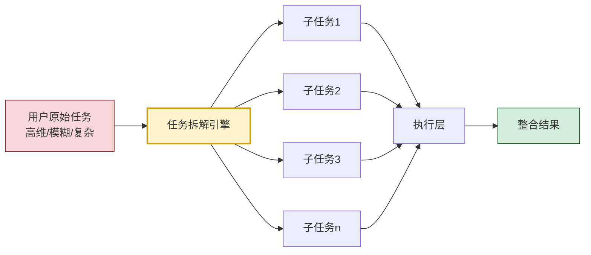

### 1.2 为什么 Agent 需要任务拆解

直接处理复杂任务会面临多个根本性障碍,任务拆解是克服这些障碍的关键手段:

| 障碍类型 | 直接处理的表现 | 拆解后的改善 |
|---------|-------------|------------|
| **认知超载** | 大模型在长上下文中丢失关键信息,推理质量下降 | 每个子任务上下文聚焦,推理质量提升 |
| **不可验证** | 整体结果对错难分,出错无法定位 | 每个子任务可独立验证,错误精准定位 |
| **不可恢复** | 中途失败需从头再来,成本高昂 | 失败仅重做子任务,可断点续接 |
| **不可并行** | 单一大任务无法拆分并行执行 | 独立子任务可并行处理,效率提升 |
| **不可解释** | 黑盒决策,用户难以理解与信任 | 拆解步骤清晰可见,过程可审计 |
| **资源失控** | 一次性消耗大量 token 与算力 | 按子任务分配预算,资源可控 |

### 1.3 任务拆解在 Agent 架构中的位置

任务拆解不是孤立环节,它位于 Agent 决策回路的关键位置,与感知、规划、执行、记忆紧密耦合:

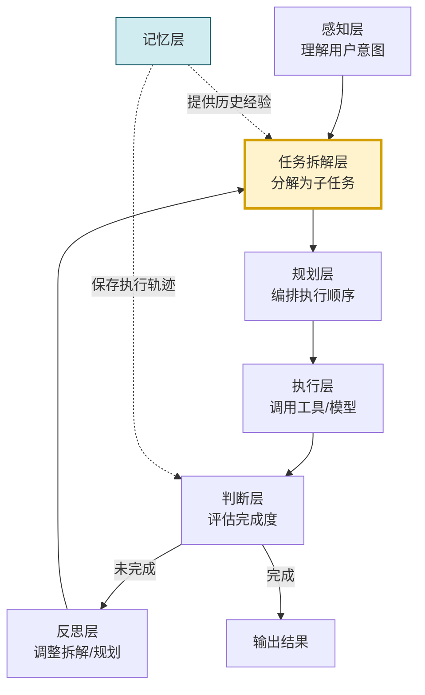

任务拆解层接收感知层输出的"用户意图",结合记忆层提供的"历史经验与领域知识",产出结构化的子任务列表供规划层编排。当执行过程中发现拆解不合理时,反思层会触发**重新拆解**。

### 1.4 任务拆解的核心价值

1. **降低复杂度**:每个子任务的认知负荷显著低于整体任务。
2. **提升可验证性**:子任务粒度小,验证标准明确。
3. **支持错误恢复**:失败可定位到子任务,局部重试而非全局重来。
4. **增强可解释性**:拆解过程本身就是一种解释,用户可逐步追踪。
5. **提升资源效率**:按子任务分配预算,避免一次性消耗。
6. **支持并行处理**:无依赖的子任务可并行执行,缩短整体耗时。

---

## 二、任务拆解的基本原则与标准

### 2.1 任务拆解的七大核心原则

高质量的任务拆解必须遵循一组核心原则,这些原则是评估拆解质量的基本标尺:

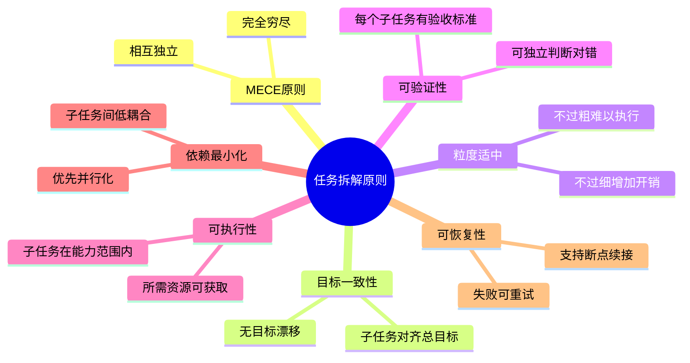

#### 2.1.1 MECE 原则(相互独立,完全穷尽)

子任务之间应当**相互独立**(Mutually Exclusive)且**完全穷尽**(Collectively Exhaustive)。这是任务拆解最根本的原则:

- **相互独立**:不同子任务之间无功能重叠,避免重复劳动与结果冲突。
- **完全穷尽**:所有子任务的并集等于完整原始任务,无遗漏无冗余。

**反面示例**(违反 MECE):
```
任务:实现用户登录功能
  子任务1:实现用户名密码登录(包含前端表单)
  子任务2:实现登录界面(包含用户名密码字段)  ← 与子任务1重叠
  子任务3:实现后端验证逻辑
  // 遗漏:Token 生成与会话管理
```

**正面示例**(符合 MECE):
```
任务:实现用户登录功能
  子任务1:设计登录界面(前端表单组件)
  子任务2:实现前端表单校验逻辑
  子任务3:实现后端身份验证 API
  子任务4:实现 Token 生成与会话管理
  子任务5:实现登录失败处理与错误提示
```

#### 2.1.2 目标一致性原则

所有子任务必须严格对齐原始任务目标,不能在拆解过程中发生"目标漂移"。Agent 常见的失败模式是将"执行手段"误认为"任务目标"。

**校验方法**:对每个子任务追问"完成它能推进原始目标的哪一部分?"——若答不上来,该子任务可能是目标漂移。

#### 2.1.3 粒度适中原则

子任务粒度过粗或过细都会带来问题:

| 粒度 | 问题表现 | 典型场景 |
|-----|---------|---------|
| 过粗 | 子任务仍复杂,无法直接执行,失去拆解意义 | 将"开发系统"仅拆为"前端+后端" |
| 过细 | 子任务数量爆炸,管理开销大,上下文切换频繁 | 将"写一个函数"拆为"打开文件+输入字符+保存" |
| 适中 | 单个子任务可在一次工具调用或一轮推理中完成 | "实现登录 API"是一个合适粒度 |

**粒度判定经验法则**:一个子任务应当能在**一次模型推理**或**一次工具调用**中完成,否则应继续拆分。

#### 2.1.4 可验证性原则

每个子任务必须有明确的**验收标准**(Acceptance Criteria),使得执行后可独立判断是否完成:

```python
# 良好的子任务定义示例
{
    "id": "subtask_3",
    "description": "实现用户身份验证 API",
    "acceptance_criteria": [
        "API 接收用户名与密码,返回 JWT Token",
        "密码错误时返回 401 状态码",
        "响应时间小于 200ms",
        "通过单元测试覆盖率 ≥ 90%"
    ],
    "verification_method": "运行 pytest tests/test_auth.py"
}
```

#### 2.1.5 可执行性原则

每个子任务必须在 Agent 的能力范围内,所需资源(工具、数据、API)可获取。若发现子任务超出能力范围,应在拆解阶段就识别并处理——通过分解为更细子任务,或明确标注为"需要外部协助"。

#### 2.1.6 依赖最小化原则

子任务之间的依赖关系应尽量减少,以支持并行执行。当依赖不可避免时,应明确标注依赖关系,供规划层编排执行顺序。

#### 2.1.7 可恢复性原则

每个子任务应支持失败后的独立重试,而不影响其他已完成子任务。这要求子任务的输入输出明确,状态可序列化保存。

### 2.2 任务拆解的质量标准

基于上述原则,可定义一组可量化的质量标准:

| 标准维度 | 度量指标 | 合格阈值 |
|---------|---------|---------|
| 完整性 | 子任务覆盖原始目标的比例 | ≥ 95% |
| 独立性 | 子任务间重叠度 | ≤ 5% |
| 粒度均匀性 | 子任务粒度的方差 | 适中 |
| 可验证性 | 有验收标准的子任务比例 | = 100% |
| 依赖度 | 平均每个子任务的依赖数 | ≤ 2 |
| 可执行性 | 在能力范围内的子任务比例 | ≥ 90% |

### 2.3 何时需要任务拆解

并非所有任务都需要拆解。简单任务直接执行更高效,过度拆解反而增加管理开销。判定是否需要拆解的决策树:

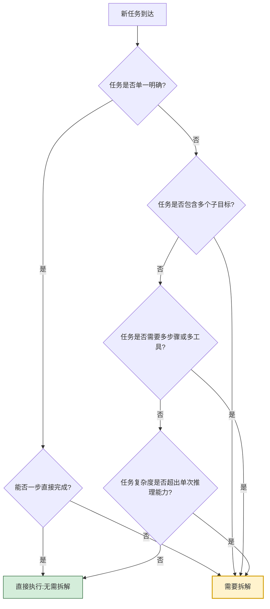

---

## 三、常用的任务分解策略

任务分解策略决定了 Agent 如何将一个大任务切分为子任务。不同策略适用于不同任务类型,实际系统常组合使用。

### 3.1 自顶向下分解法(Top-Down Decomposition)

**核心思想**:从原始任务出发,逐层向下分解,直到每个子任务达到可执行粒度。这是最经典也最常用的分解策略。

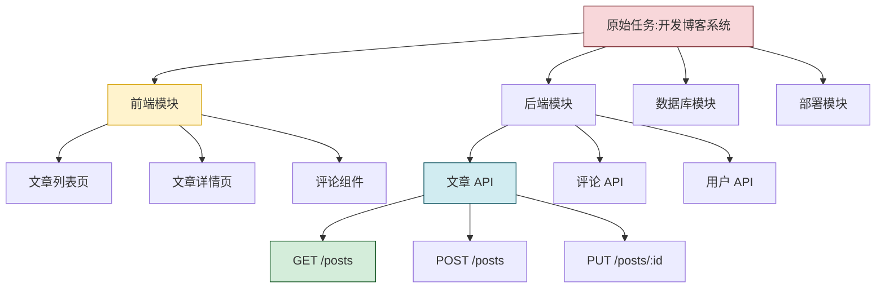

**适用场景**:
- 任务结构清晰,可按功能模块划分。
- 任务具有自然的层次结构(如软件系统)。
- 任务的边界与组成可预先识别。

**优点**:结构清晰、易于管理、与人类思维习惯一致。
**缺点**:对模糊任务或探索性任务效果差;依赖 Agent 对任务结构的预先理解。

**实现示例**:

```python
from dataclasses import dataclass, field
from typing import Optional


@dataclass
class SubTask:
    """子任务节点"""
    id: str
    description: str
    acceptance_criteria: list[str] = field(default_factory=list)
    children: list["SubTask"] = field(default_factory=list)
    parent_id: Optional[str] = None
    is_leaf: bool = True  # 是否为可执行叶子节点

    def add_child(self, child: "SubTask") -> None:
        child.parent_id = self.id
        self.children.append(child)
        self.is_leaf = False

    def get_leaf_tasks(self) -> list["SubTask"]:
        """获取所有可执行叶子任务"""
        if self.is_leaf:
            return [self]
        leaves = []
        for child in self.children:
            leaves.extend(child.get_leaf_tasks())
        return leaves


class TopDownDecomposer:
    """自顶向下分解器"""

    def __init__(self, llm_client, max_depth: int = 4, min_granularity: int = 3):
        self.llm = llm_client
        self.max_depth = max_depth
        self.min_granularity = min_granularity  # 最少分解的子任务数

    def decompose(self, task_description: str) -> SubTask:
        """执行自顶向下分解"""
        root = SubTask(id="root", description=task_description)
        self._decompose_recursive(root, depth=0)
        return root

    def _decompose_recursive(self, node: SubTask, depth: int) -> None:
        """递归分解"""
        # 终止条件1:达到最大深度
        if depth >= self.max_depth:
            return

        # 终止条件2:任务已是原子粒度
        if self._is_atomic(node):
            node.is_leaf = True
            return

        # 调用大模型分解
        sub_tasks = self._llm_decompose(node.description, depth)
        if not sub_tasks or len(sub_tasks) < 2:
            node.is_leaf = True
            return

        # 添加子任务并递归
        for i, st in enumerate(sub_tasks):
            child = SubTask(
                id=f"{node.id}_{i}",
                description=st["description"],
                acceptance_criteria=st.get("criteria", []),
            )
            node.add_child(child)
            self._decompose_recursive(child, depth + 1)

    def _is_atomic(self, node: SubTask) -> bool:
        """判断任务是否已是原子粒度"""
        prompt = f"""判断以下任务是否可在单次工具调用或单轮推理中完成:
任务: {node.description}
只回答 YES 或 NO。"""
        return self.llm.generate(prompt).strip().upper() == "YES"

    def _llm_decompose(self, description: str, depth: int) -> list[dict]:
        """调用大模型分解任务"""
        prompt = f"""请将以下任务分解为 {self.min_granularity} 个相互独立、完全穷尽的子任务。
要求:
1. 子任务之间无功能重叠
2. 子任务的并集等于原任务
3. 每个子任务有明确的验收标准

任务: {description}

请以JSON数组格式输出,每个元素包含 description 和 criteria 字段。"""
        result = self.llm.generate(prompt)
        return self._parse_json(result)
```

### 3.2 基于领域知识的分解法(Domain-Knowledge-Based Decomposition)

**核心思想**:利用领域专家总结的标准化任务模板,直接套用预先定义的分解结构。这种方法依赖**领域知识库**而非实时推理。

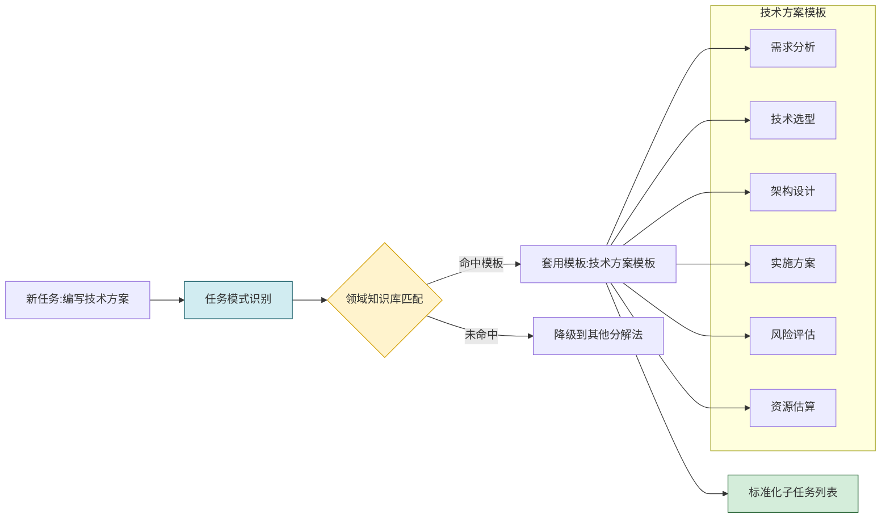

**适用场景**:
- 任务属于成熟领域,有标准流程(如软件开发、文档撰写、数据分析)。
- 领域知识库已建立,有可复用的模板。
- 需要高质量、稳定的分解结果(模板经过专家验证)。

**优点**:分解质量稳定、速度快、可解释性强。
**缺点**:覆盖范围有限,无法处理新颖任务;模板维护成本高。

**领域知识库示例**:

```python
DOMAIN_TEMPLATES = {
    "技术方案文档": {
        "keywords": ["技术方案", "技术选型", "架构设计", "实施方案"],
        "sub_tasks": [
            {
                "id": "req_analysis",
                "description": "需求分析:明确业务需求、功能需求、非功能需求",
                "criteria": ["覆盖所有业务场景", "非功能需求量化"],
            },
            {
                "id": "tech_selection",
                "description": "技术选型:对比候选技术,给出选型理由",
                "criteria": ["至少对比3种方案", "选型理由充分"],
            },
            {
                "id": "architecture",
                "description": "架构设计:系统架构图、模块划分、接口定义",
                "criteria": ["含架构图", "模块职责清晰"],
            },
            {
                "id": "implementation",
                "description": "实施方案:分阶段实施计划、里程碑",
                "criteria": ["阶段划分合理", "里程碑可度量"],
            },
            {
                "id": "risk",
                "description": "风险评估:识别风险,制定应对策略",
                "criteria": ["识别主要风险", "应对策略具体"],
            },
        ],
    },
    "数据分析报告": {
        "keywords": ["数据分析", "数据报告", "数据洞察"],
        "sub_tasks": [
            {"id": "data_collect", "description": "数据收集与清洗"},
            {"id": "eda", "description": "探索性数据分析"},
            {"id": "deep_analysis", "description": "深入分析与建模"},
            {"id": "insight", "description": "洞察提炼与结论"},
            {"id": "report", "description": "报告撰写与可视化"},
        ],
    },
    # 更多领域模板...
}


class DomainKnowledgeDecomposer:
    """基于领域知识的分解器"""

    def __init__(self, templates: dict = DOMAIN_TEMPLATES):
        self.templates = templates

    def decompose(self, task_description: str) -> Optional[list[dict]]:
        """根据领域知识库分解任务"""
        matched_template = self._match_template(task_description)
        if matched_template:
            # 模板匹配成功,返回标准化子任务
            return self.templates[matched_template]["sub_tasks"]
        return None  # 未匹配,需降级到其他方法

    def _match_template(self, task_description: str) -> Optional[str]:
        """通过关键词匹配任务模板"""
        for template_name, template in self.templates.items():
            for keyword in template["keywords"]:
                if keyword in task_description:
                    return template_name
        return None
```

### 3.3 动态规划分解法(Dynamic Planning Decomposition)

**核心思想**:不预先完成全部分解,而是**边执行边分解**,根据中间结果动态调整后续分解。适用于任务结构在执行前无法完全明确的情况。

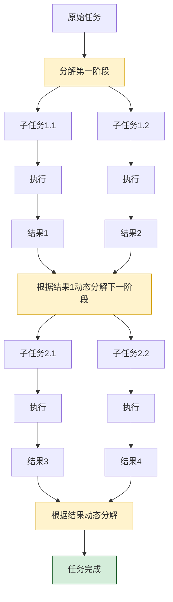

**适用场景**:
- 探索性任务,执行前无法预知全貌(如科学研究、市场调研)。
- 任务依赖中间结果,后续步骤由前序结果决定。
- 任务存在不确定性,需要边做边调整。

**优点**:适应性强,可应对动态变化的任务环境。
**缺点**:整体规划性弱,可能产生非最优路径;实现复杂度高。

**实现示例**:

```python
class DynamicPlanningDecomposer:
    """动态规划分解器"""

    def __init__(self, llm_client, executor):
        self.llm = llm_client
        self.executor = executor  # 子任务执行器

    def decompose_and_execute(self, task: str, max_rounds: int = 10) -> dict:
        """动态分解并执行"""
        context = {"original_task": task, "executed": [], "results": []}

        for round_num in range(max_rounds):
            # 步骤1:基于当前上下文分解下一阶段任务
            next_subtasks = self._decompose_next(context)

            if not next_subtasks:
                # 无更多子任务,任务完成
                break

            # 步骤2:执行子任务
            for st in next_subtasks:
                result = self.executor.execute(st)
                context["executed"].append(st)
                context["results"].append(result)

            # 步骤3:判断是否需要继续分解
            if self._is_task_complete(context):
                break

        return {
            "total_rounds": round_num + 1,
            "executed_subtasks": context["executed"],
            "final_result": context["results"][-1] if context["results"] else None,
        }

    def _decompose_next(self, context: dict) -> list[dict]:
        """基于当前上下文分解下一阶段"""
        prompt = f"""基于以下信息,分解出下一阶段需要执行的子任务:
原始任务: {context['original_task']}
已完成子任务: {[st['description'] for st in context['executed']]}
最近结果: {context['results'][-1] if context['results'] else '无'}

请只分解下一阶段(非全部剩余),并确保子任务基于已有结果。
以JSON数组格式输出。"""
        result = self.llm.generate(prompt)
        return self._parse_json(result)

    def _is_task_complete(self, context: dict) -> bool:
        """判断原始任务是否完成"""
        prompt = f"""判断原始任务是否已完成:
原始任务: {context['original_task']}
已执行子任务: {[st['description'] for st in context['executed']]}
结果摘要: {str(context['results'])[:500]}
只回答 YES 或 NO。"""
        return self.llm.generate(prompt).strip().upper() == "YES"
```

### 3.4 其他常用分解策略

#### 3.4.1 基于目标-手段分析(Goal-Means Analysis)

从目标出发,反推达成目标所需的手段,再分解为具体步骤。适用于目标明确但路径不明确的任务。

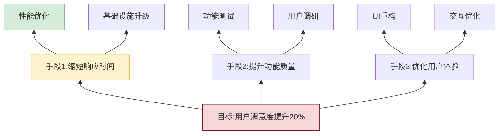

#### 3.4.2 基于流程的分解(Process-Based Decomposition)

按任务的自然执行流程拆分,适用于流程明确的任务。例如"数据处理任务"按"采集→清洗→转换→分析→可视化"拆分。

#### 3.4.3 基于角色的分解(Role-Based Decomposition)

在多 Agent 系统中,按角色能力拆分任务。例如"产品规划任务"拆分为"市场分析师负责需求调研"、"架构师负责技术评估"、"设计师负责原型设计"。

#### 3.4.4 策略对比与选择

| 策略 | 适用任务类型 | 优势 | 局限 |
|-----|-----------|------|------|
| 自顶向下 | 结构化、可预先规划 | 清晰、可管理 | 不适应变化 |
| 领域知识 | 标准化、成熟领域 | 稳定、快速 | 覆盖有限 |
| 动态规划 | 探索性、不确定 | 灵活、适应强 | 实现复杂 |
| 目标-手段 | 目标明确、路径不明 | 紧扣目标 | 反推可能不全 |
| 流程分解 | 流程明确 | 自然、易理解 | 仅适用流程类 |
| 角色分解 | 多 Agent 协作 | 并行、专业 | 需多 Agent 支持 |

**实践建议**:实际系统应**组合使用**多种策略。例如:先用领域知识模板快速分解,未命中则降级到自顶向下,执行中遇到不确定性则切换到动态规划。

---

## 四、大模型在任务拆解中的应用方式

大模型是 Agent 任务拆解的核心引擎,本节详细阐述大模型在拆解各环节的具体应用方式。

### 4.1 大模型在任务拆解中的核心能力

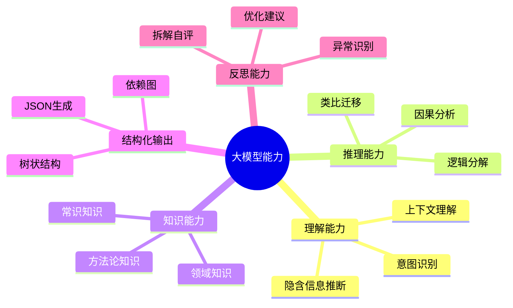

### 4.2 任务理解与意图识别

任务拆解的第一步是准确理解用户意图。大模型在意图识别中的应用包括:

1. **显式意图提取**:从用户输入中提取明确的任务目标。
2. **隐式意图推断**:识别用户未明说但实际需要的诉求。
3. **意图歧义消除**:当用户表述模糊时,主动澄清或合理推断。
4. **意图边界界定**:明确任务的范围,识别"包含什么、不包含什么"。

**Prompt 设计示例**:

```python
INTENT_UNDERSTANDING_PROMPT = """请分析以下用户任务,提取任务意图:

用户输入: {user_input}

请按以下结构输出:
1. 核心意图:一句话描述用户真正想达成什么
2. 显式目标:用户明确提出的具体目标
3. 隐含目标:用户未明说但合理推断的目标
4. 任务边界:任务包含什么、不包含什么
5. 成功标准:如何判断任务完成
6. 潜在歧义:需要澄清的关键点

输出JSON格式。
"""
```

### 4.3 子任务生成

大模型生成子任务的核心环节。不同的 Prompt 设计会产生不同质量的拆解结果。

#### 4.3.1 基础分解 Prompt

```python
BASIC_DECOMPOSITION_PROMPT = """请将以下任务分解为可独立执行的子任务:

任务: {task_description}

分解要求:
1. 子任务相互独立,无功能重叠(MECE原则)
2. 子任务的并集等于原始任务
3. 每个子任务粒度适中,可在单次工具调用中完成
4. 每个子任务有明确的验收标准

输出JSON数组,每个元素包含:
- id: 子任务ID
- description: 子任务描述
- criteria: 验收标准列表
- dependencies: 依赖的其他子任务ID列表
- estimated_steps: 预估执行步数
"""
```

#### 4.3.2 思维链分解 Prompt(CoT Decomposition)

引入思维链,让模型"先思考再分解",显著提升拆解质量:

```python
COT_DECOMPOSITION_PROMPT = """请分解以下任务,采用思维链方式逐步推理:

任务: {task_description}

请按以下步骤思考:
步骤1 [任务分析]:分析任务类型、复杂度、关键难点
步骤2 [目标分解]:将任务目标分解为若干子目标
步骤3 [子任务规划]:为每个子目标规划具体的子任务
步骤4 [依赖分析]:分析子任务之间的依赖关系
步骤5 [完整性检查]:检查是否覆盖所有目标,是否有遗漏
步骤6 [粒度校验]:检查子任务粒度是否适中
步骤7 [输出]:输出最终的子任务列表

每一步请详细思考,最后输出JSON格式的子任务列表。
"""
```

#### 4.3.3 多视角分解 Prompt

通过角色扮演,从多个视角审视并优化分解:

```python
MULTI_PERSPECTIVE_PROMPT = """请从多个专家视角分解以下任务:

任务: {task_description}

视角1 [架构师视角]:关注系统结构与模块划分
视角2 [测试工程师视角]:关注可验证性与测试覆盖
视角3 [运维工程师视角]:关注可部署性与可维护性
视角4 [用户代表视角]:关注用户体验与价值交付

请综合以上视角,输出统一的子任务列表。
"""
```

### 4.4 依赖关系识别

大模型不仅能生成子任务,还能识别子任务之间的依赖关系,为规划层提供编排依据:

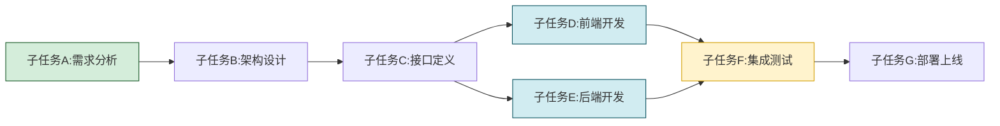

**依赖关系类型**:

| 依赖类型 | 含义 | 示例 |
|---------|------|------|
| 数据依赖 | B 需要 A 的输出作为输入 | 测试依赖代码完成 |
| 时序依赖 | B 必须在 A 完成后才能开始 | 部署依赖测试通过 |
| 资源依赖 | B 与 A 共享同一资源,需串行 | 数据库写入需互斥 |
| 弱依赖 | B 最好在 A 之后,但非强制 | 文档建议在开发后撰写 |

### 4.5 拆解结果的自评估与优化

大模型可作为"自我评审员",对自己的拆解结果进行评估与优化:

```python
SELF_REVIEW_PROMPT = """请评审以下任务拆解方案:

原始任务: {original_task}
子任务列表: {sub_tasks}

请从以下维度评审:
1. 完整性:是否覆盖原始任务的所有方面?(0-10分)
2. 独立性:子任务之间是否有重叠?(0-10分)
3. 粒度:子任务粒度是否适中?(0-10分)
4. 可验证性:每个子任务是否有明确验收标准?(0-10分)
5. 依赖合理性:依赖关系是否必要且最小化?(0-10分)

输出:
- 各维度评分
- 总分(平均)
- 发现的问题列表
- 优化建议列表
- 优化后的子任务列表(如总分<8分)
"""
```

### 4.6 Few-Shot 示例学习

通过提供高质量的拆解示例,引导大模型学习拆解模式:

```python
FEW_SHOT_PROMPT = """请参考以下示例,分解新任务:

## 示例1
任务: 实现一个用户注册功能
分解:
[
  {{"id": "1", "description": "设计注册表单UI", "criteria": ["包含用户名/密码/邮箱字段", "含表单校验"]}},
  {{"id": "2", "description": "实现前端表单校验逻辑", "criteria": ["校验用户名格式", "校验密码强度", "校验邮箱格式"]}},
  {{"id": "3", "description": "实现后端注册API", "criteria": ["接收表单数据", "密码加密存储", "返回注册结果"]}},
  {{"id": "4", "description": "实现邮箱验证功能", "criteria": ["发送验证邮件", "验证链接有效"]}},
  {{"id": "5", "description": "实现注册成功后的引导流程", "criteria": ["跳转到欢迎页", "提示完善资料"]}}
]

## 示例2
任务: {example_task_2}
分解: {example_decomposition_2}

## 新任务
任务: {new_task}
分解:
"""
```

### 4.7 大模型拆解的完整工作流

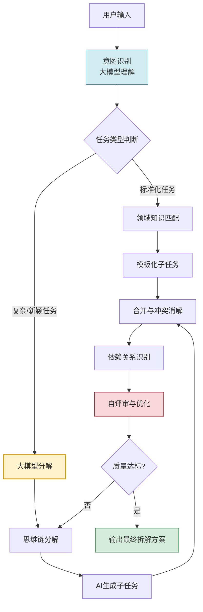

---

## 五、不同类型任务的拆解案例分析

### 5.1 复杂决策任务

**案例**:为一家电商公司制定下一年度的营销策略

**任务特征**:涉及多维度权衡、需要数据支撑、决策影响重大、不确定性高。

**拆解方案**:

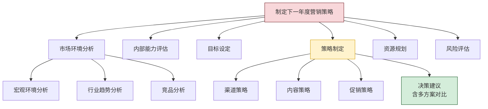

**子任务清单**:

| ID | 子任务 | 验收标准 | 依赖 |
|----|-------|---------|------|
| 1 | 收集行业宏观数据 | 含 GDP、消费指数、政策趋势 | - |
| 2 | 分析主要竞品营销策略 | 覆盖 Top 5 竞品 | - |
| 3 | 评估公司历史营销效果 | 含 ROI、转化率对比 | - |
| 4 | 设定年度营销目标 | SMART 原则、量化指标 | 1,2,3 |
| 5 | 制定渠道策略 | 含线上线下、预算分配 | 4 |
| 6 | 制定内容策略 | 含内容主题、发布节奏 | 4 |
| 7 | 制定促销策略 | 含关键节点、力度 | 4 |
| 8 | 制定风险应对预案 | 识别 3+ 主要风险 | 5,6,7 |
| 9 | 输出决策建议报告 | 含多方案对比、推荐方案 | 5,6,7,8 |

**拆解要点**:决策任务的核心是**信息充分性**与**方案多样性**,因此拆解时需保证数据收集与分析环节充分,且策略制定环节产出多个备选方案。

### 5.2 多步骤执行任务

**案例**:重构一个遗留系统模块并保证业务不中断

**任务特征**:步骤明确、有时序依赖、需保证业务连续性、风险可控。

**拆解方案**:

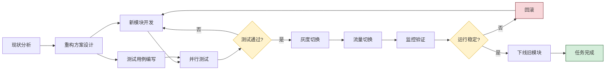

**关键拆解要点**:
- 每个"检查点"都设置为独立子任务,便于断点续接。
- 显式拆分"测试用例编写"与"开发",支持并行。
- 加入"回滚"子任务,确保失败可恢复。

### 5.3 知识密集型任务

**案例**:撰写一份关于"向量数据库选型"的技术调研报告

**任务特征**:依赖大量领域知识、需要深度分析、产出质量与知识深度强相关。

**拆解方案**:

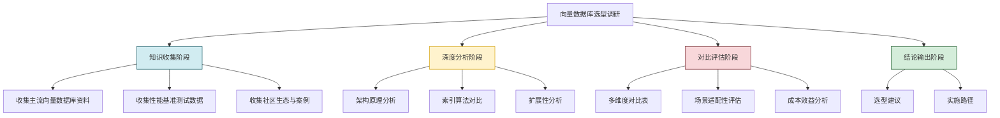

**拆解要点**:知识密集型任务的核心是**知识收集要全面、分析要深入、对比要客观**。应将"知识收集"与"知识应用"分开,避免知识不足时就草率产出。

### 5.4 创意性任务

**案例**:设计一个产品的品牌口号

**任务特征**:无固定流程、依赖创意与灵感、主观性强、需要多轮迭代。

**拆解方案**:

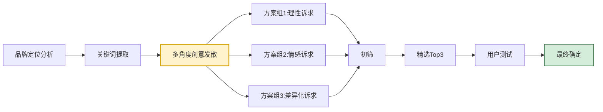

**拆解要点**:创意任务的核心是**发散与收敛分离**,先广撒网再精选,避免过早收敛。每个"创意方案"是独立子任务,可并行。

### 5.5 案例对比与规律总结

| 任务类型 | 拆解核心 | 关键特征 | 推荐策略 |
|---------|---------|---------|---------|
| 复杂决策 | 信息充分+方案多样 | 多维权衡、高影响 | 自顶向下+目标-手段 |
| 多步骤执行 | 步骤明确+可恢复 | 时序依赖、风险可控 | 流程分解+动态规划 |
| 知识密集 | 知识全面+分析深入 | 依赖领域知识 | 领域知识+自顶向下 |
| 创意性 | 发散+收敛 | 主观、需迭代 | 多方案并行+用户反馈 |

---

## 六、任务拆解质量的评估指标与优化方法

### 6.1 拆解质量评估指标体系

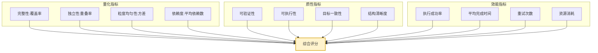

### 6.2 核心指标详解

#### 6.2.1 完整性(Coverage)

衡量子任务覆盖原始任务目标的比例:

```python
def compute_coverage(sub_tasks: list, original_goals: list) -> float:
    """
    计算拆解完整性
    sub_tasks: 子任务列表
    original_goals: 原始任务的目标清单
    """
    covered = 0
    for goal in original_goals:
        # 检查是否有子任务覆盖该目标
        for st in sub_tasks:
            if goal_covered_by_subtask(goal, st):
                covered += 1
                break
    return covered / len(original_goals) if original_goals else 1.0


def goal_covered_by_subtask(goal: str, subtask: dict) -> bool:
    """检查子任务是否覆盖某目标(实际中可用LLM判断)"""
    # 简化实现:关键词匹配
    goal_keywords = set(goal.lower().split())
    st_keywords = set(subtask["description"].lower().split())
    overlap = goal_keywords & st_keywords
    return len(overlap) / len(goal_keywords) > 0.3 if goal_keywords else True
```

#### 6.2.2 独立性(Independence)

衡量子任务之间的重叠程度:

```python
def compute_independence(sub_tasks: list) -> float:
    """计算独立性(1-平均重叠率)"""
    n = len(sub_tasks)
    if n < 2:
        return 1.0
    total_overlap = 0
    pairs = 0
    for i in range(n):
        for j in range(i + 1, n):
            overlap = compute_task_overlap(sub_tasks[i], sub_tasks[j])
            total_overlap += overlap
            pairs += 1
    avg_overlap = total_overlap / pairs if pairs else 0
    return 1.0 - avg_overlap
```

#### 6.2.3 粒度均匀性(Granularity Uniformity)

衡量子任务粒度的离散程度,理想状态是粒度均匀:

```python
import statistics


def compute_granularity_uniformity(sub_tasks: list) -> float:
    """计算粒度均匀性(基于预估步数的变异系数)"""
    steps = [st.get("estimated_steps", 1) for st in sub_tasks]
    if len(steps) < 2:
        return 1.0
    mean = statistics.mean(steps)
    if mean == 0:
        return 1.0
    stdev = statistics.stdev(steps)
    cv = stdev / mean  # 变异系数
    # 变异系数越小越均匀,转化为0-1分数
    return max(0.0, 1.0 - cv)
```

### 6.3 综合评分模型

```python
class DecompositionQualityScorer:
    """拆解质量评分器"""

    WEIGHTS = {
        "completeness": 0.30,    # 完整性最重要
        "independence": 0.20,    # 独立性
        "granularity": 0.10,     # 粒度均匀性
        "verifiability": 0.15,    # 可验证性
        "executability": 0.10,    # 可执行性
        "dependency": 0.10,      # 依赖合理性
        "goal_alignment": 0.05,   # 目标一致性
    }

    def score(self, decomposition: dict, original_task: dict) -> dict:
        scores = {
            "completeness": self._score_completeness(decomposition, original_task),
            "independence": self._score_independence(decomposition),
            "granularity": self._score_granularity(decomposition),
            "verifiability": self._score_verifiability(decomposition),
            "executability": self._score_executability(decomposition),
            "dependency": self._score_dependency(decomposition),
            "goal_alignment": self._score_alignment(decomposition, original_task),
        }
        total = sum(scores[k] * self.WEIGHTS[k] for k in scores)
        return {
            "total_score": round(total, 3),
            "dimension_scores": scores,
            "grade": self._grade(total),
            "issues": self._identify_issues(scores),
        }

    def _grade(self, score: float) -> str:
        if score >= 0.9:
            return "A"
        elif score >= 0.8:
            return "B"
        elif score >= 0.7:
            return "C"
        elif score >= 0.6:
            return "D"
        return "F"

    def _identify_issues(self, scores: dict) -> list:
        issues = []
        thresholds = {
            "completeness": 0.9,
            "independence": 0.85,
            "granularity": 0.6,
            "verifiability": 0.9,
            "executability": 0.85,
            "dependency": 0.7,
            "goal_alignment": 0.9,
        }
        for dim, score in scores.items():
            if score < thresholds[dim]:
                issues.append(f"{dim} 评分 {score:.2f} 低于阈值 {thresholds[dim]}")
        return issues
```

### 6.4 优化方法

#### 6.4.1 迭代优化

通过多轮自我评审与优化,逐步提升拆解质量:

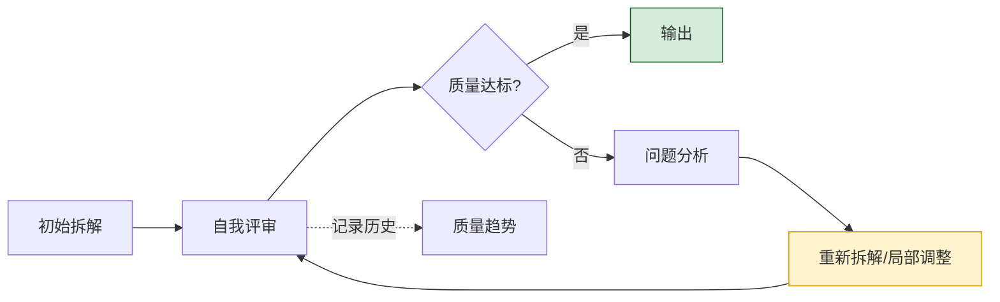

#### 6.4.2 局部优化策略

当评审发现局部问题时,可针对性优化而非全部重做:

| 问题类型 | 优化策略 |
|---------|---------|
| 完整性不足 | 补充遗漏的子任务 |
| 重叠度高 | 合并重叠子任务或重新切分边界 |
| 粒度不均 | 拆分过粗的、合并过细的 |
| 依赖过多 | 重新切分以减少耦合 |
| 验收不清 | 补充每个子任务的验收标准 |

#### 6.4.3 历史学习

记录拆解案例与执行结果,通过反馈学习优化未来拆解:

```python
@dataclass
class DecompositionCase:
    """拆解案例记录"""
    original_task: str
    decomposition: list[dict]
    quality_score: float
    execution_result: dict  # 实际执行结果
    success: bool
    lessons: list[str]      # 经验教训


class DecompositionLearner:
    """拆解学习器"""

    def __init__(self):
        self.case_base: list[DecompositionCase] = []

    def record(self, case: DecompositionCase) -> None:
        self.case_base.append(case)

    def get_similar_cases(self, task: str, top_k: int = 3) -> list:
        """获取相似任务的历史拆解案例"""
        # 实际中可用向量检索
        return sorted(
            self.case_base,
            key=lambda c: self._similarity(task, c.original_task),
            reverse=True,
        )[:top_k]

    def get_lessons(self, task: str) -> list:
        """获取相似任务的经验教训"""
        similar = self.get_similar_cases(task)
        lessons = []
        for case in similar:
            lessons.extend(case.lessons)
        return lessons
```

---

## 七、任务拆解过程中的挑战及解决方案

### 7.1 核心挑战全景

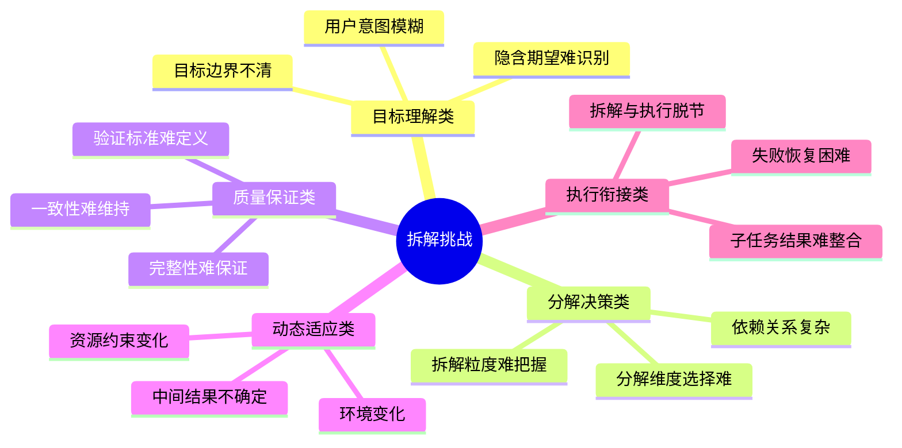

### 7.2 各类挑战与解决方案

#### 7.2.1 用户意图模糊

**挑战表现**:用户表述笼统,无法从中提取明确的任务目标与边界。

**解决方案**:

1. **主动澄清机制**:Agent 主动提问以明确意图。

```python
CLARIFICATION_PROMPT = """用户任务表述模糊,请生成澄清问题:

用户输入: {user_input}
已识别意图: {inferred_intent}
不确定点: {uncertain_points}

请生成1-3个最关键的澄清问题,问题应:
1. 直接影响拆解方案
2. 用户容易回答
3. 覆盖最关键的不确定性
"""
```

2. **意图推断+置信度标注**:无法澄清时,基于上下文推断并标注置信度。
3. **多方案并行**:对模糊意图,生成多个拆解方案,执行最可能的一个并保留备选。

#### 7.2.2 拆解粒度难把握

**挑战表现**:粒度过粗导致子任务仍复杂,过细导致管理开销大。

**解决方案**:

1. **粒度判定器**:用大模型判断子任务是否已达原子粒度。
2. **粒度参考基准**:基于历史案例建立"标准粒度"参考库。
3. **动态调整**:执行中发现粒度不当,触发重新拆分或合并。

```python
def check_granularity(subtask: dict, llm) -> str:
    """检查子任务粒度,返回 too_coarse / appropriate / too_fine"""
    prompt = f"""评估以下子任务的粒度是否合适:

子任务: {subtask['description']}
预估步数: {subtask.get('estimated_steps', '?')}

判断标准:
- too_coarse: 需要多步才能完成,应进一步拆分
- appropriate: 可在单次工具调用或单轮推理中完成
- too_fine: 粒度过细,可与其他任务合并

只输出 too_coarse / appropriate / too_fine。"""
    return llm.generate(prompt).strip()
```

#### 7.2.3 完整性难以保证

**挑战表现**:拆解后遗漏了原始任务的某些方面。

**解决方案**:

1. **目标清单核对**:拆解前先列出原始任务的所有目标,拆解后逐项核对。
2. **多视角检查**:从不同视角(用户、测试、运维)审视完整性。
3. **反向验证**:从子任务出发,验证其并集是否等于原任务。

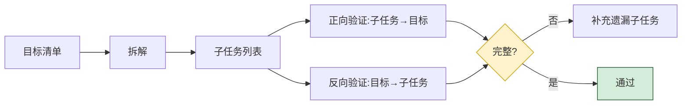

#### 7.2.4 动态环境变化

**挑战表现**:执行过程中环境变化,导致原拆解方案失效。

**解决方案**:

1. **环境监控**:持续监测任务环境的关键变量。
2. **触发式重规划**:当环境变化超过阈值时,触发重新拆解。
3. **增量式调整**:不全部重做,仅调整受影响的子任务。

```python
class EnvironmentMonitor:
    """环境监控器"""

    def __init__(self, key_variables: list, thresholds: dict):
        self.key_variables = key_variables
        self.thresholds = thresholds
        self.last_values = {}

    def check_change(self, current_values: dict) -> dict:
        """检查环境变化"""
        changes = {}
        for var in self.key_variables:
            old = self.last_values.get(var)
            new = current_values.get(var)
            if old is not None and new is not None:
                change_ratio = abs(new - old) / max(abs(old), 1e-6)
                if change_ratio > self.thresholds.get(var, 0.2):
                    changes[var] = {
                        "old": old, "new": new,
                        "change_ratio": change_ratio,
                        "exceeds_threshold": True
                    }
        self.last_values = current_values
        return changes

    def should_replan(self, changes: dict) -> bool:
        """判断是否需要重新规划"""
        return len(changes) > 0
```

#### 7.2.5 拆解与执行脱节

**挑战表现**:拆解方案看似合理,但执行时发现子任务无法实际完成。

**解决方案**:

1. **可行性预检**:拆解后对每个子任务进行可行性评估。
2. **试执行机制**:对关键子任务先进行小规模试执行。
3. **反馈闭环**:执行结果反馈到拆解层,触发调整。

```python
def feasibility_check(subtask: dict, agent_capabilities: dict) -> dict:
    """子任务可行性检查"""
    return {
        "executable": _is_in_capability(subtask, agent_capabilities),
        "resources_available": _check_resources(subtask),
        "estimated_cost": _estimate_cost(subtask),
        "risks": _identify_risks(subtask),
    }
```

#### 7.2.6 子任务结果难整合

**挑战表现**:各子任务独立完成后,结果难以整合为统一输出。

**解决方案**:

1. **输出格式预定义**:拆解时明确每个子任务的输出格式。
2. **整合模板**:为不同类型任务预定义整合模板。
3. **整合 Agent**:专门设置一个"整合 Agent"负责汇总各子任务结果。

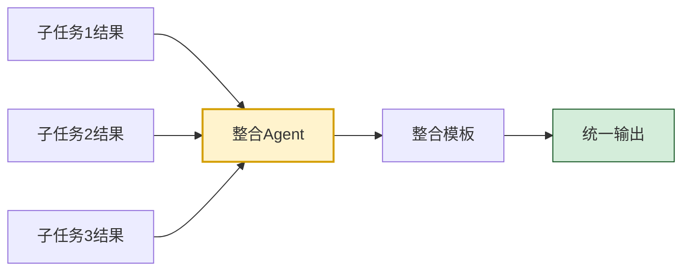

### 7.3 挑战应对策略汇总

| 挑战 | 根本原因 | 核心策略 |
|-----|---------|---------|
| 意图模糊 | 用户表述不清 | 主动澄清+推断兜底 |
| 粒度难把握 | 缺乏客观标准 | 粒度判定器+动态调整 |
| 完整性不足 | 视角局限 | 多视角检查+反向验证 |
| 环境变化 | 外部不确定性 | 监控+触发式重规划 |
| 拆解执行脱节 | 拆解时未考虑可行性 | 可行性预检+反馈闭环 |
| 结果难整合 | 输出格式未统一 | 预定义格式+整合Agent |

---

## 八、实践指导与最佳实践

### 8.1 任务拆解的完整工作流

```mermaid
flowchart TD
    START[接收任务] --> U[理解用户意图]
    U --> CT{任务类型?}
    CT -- 简单任务 --> EX[直接执行]
    CT -- 复杂任务 --> TC{能否匹配领域模板?}
    TC -- 是 --> TM[套用模板]
    TC -- 否 --> TD[自顶向下分解]
    TD --> COT[思维链分解]
    COT --> DR[识别依赖关系]
    DR --> FC[可行性预检]
    FC --> SR[自我评审]
    SR --> Q{质量达标?}
    Q -- 否 --> OPT[优化调整]
    OPT --> SR
    Q -- 是 --> OUT[输出拆解方案]
    TM --> DR
    OUT --> PL[交付规划层]

    style U fill:#d1ecf1,stroke:#0c5460
    style COT fill:#fff3cd,stroke:#d39e00,stroke-width:2px
    style SR fill:#f8d7da,stroke:#721c24
    style OUT fill:#d4edda,stroke:#155724
```

### 8.2 完整实现示例

下面给出一个综合运用前述方法的完整任务拆解器实现:

```python
"""
AI Agent 任务拆解器 - 完整实现示例
综合运用意图理解、多种分解策略、质量评估、自优化
"""
import json
from dataclasses import dataclass, field
from typing import Optional


@dataclass
class DecompositionResult:
    """拆解结果"""
    intent: dict                          # 识别的意图
    sub_tasks: list[dict]                 # 子任务列表
    dependencies: dict[str, list[str]]    # 依赖关系
    quality_score: dict                  # 质量评分
    strategy_used: str                    # 使用的策略
    iterations: int = 1                  # 迭代次数


class TaskDecomposer:
    """任务拆解器"""

    def __init__(self, llm_client, domain_templates: dict = None):
        self.llm = llm_client
        self.domain_templates = domain_templates or {}
        self.quality_scorer = DecompositionQualityScorer()
        self.max_iterations = 3
        self.quality_threshold = 0.8

    def decompose(self, task: str, context: dict = None) -> DecompositionResult:
        """执行完整任务拆解流程"""
        context = context or {}

        # 第1步:意图理解
        intent = self._understand_intent(task, context)

        # 第2步:选择分解策略并执行
        sub_tasks, strategy = self._select_and_decompose(intent, context)

        # 第3步:识别依赖关系
        dependencies = self._identify_dependencies(sub_tasks)

        # 第4步:可行性预检
        sub_tasks = self._feasibility_check(sub_tasks)

        # 第5步:质量评估与迭代优化
        iterations = 0
        quality_score = {}
        while iterations < self.max_iterations:
            iterations += 1
            quality_score = self.quality_scorer.score(
                {"sub_tasks": sub_tasks, "dependencies": dependencies},
                {"intent": intent}
            )
            if quality_score["total_score"] >= self.quality_threshold:
                break
            # 质量不达标,优化
            sub_tasks = self._optimize(sub_tasks, quality_score["issues"])

        return DecompositionResult(
            intent=intent,
            sub_tasks=sub_tasks,
            dependencies=dependencies,
            quality_score=quality_score,
            strategy_used=strategy,
            iterations=iterations,
        )

    def _understand_intent(self, task: str, context: dict) -> dict:
        """理解用户意图"""
        prompt = f"""分析以下任务,提取任务意图:

任务: {task}
上下文: {context}

输出JSON格式,包含:
- core_intent: 核心意图
- explicit_goals: 显式目标列表
- implicit_goals: 隐含目标列表
- boundaries: 任务边界(包含/不包含)
- success_criteria: 成功标准
- ambiguities: 潜在歧义点
"""
        result = self.llm.generate(prompt)
        return self._parse_json(result)

    def _select_and_decompose(self, intent: dict, context: dict) -> tuple:
        """选择并执行分解策略"""
        # 策略1:尝试领域知识匹配
        template_result = self._try_domain_template(intent)
        if template_result:
            return template_result, "domain_template"

        # 策略2:自顶向下+思维链分解
        cot_result = self._cot_decompose(intent)
        return cot_result, "cot_decomposition"

    def _try_domain_template(self, intent: dict) -> Optional[list]:
        """尝试领域模板匹配"""
        for template_name, template in self.domain_templates.items():
            for keyword in template["keywords"]:
                if keyword in intent.get("core_intent", ""):
                    return template["sub_tasks"]
        return None

    def _cot_decompose(self, intent: dict) -> list:
        """思维链分解"""
        prompt = f"""采用思维链方式分解任务:

核心意图: {intent['core_intent']}
显式目标: {intent['explicit_goals']}
隐含目标: {intent['implicit_goals']}
成功标准: {intent['success_criteria']}

请按以下步骤思考:
1. 分析任务类型与复杂度
2. 将目标分解为子目标
3. 为每个子目标规划子任务
4. 分析子任务依赖关系
5. 检查完整性与粒度

输出JSON数组,每个子任务包含:
- id, description, criteria, dependencies, estimated_steps
"""
        result = self.llm.generate(prompt)
        return self._parse_json(result)

    def _identify_dependencies(self, sub_tasks: list) -> dict:
        """识别依赖关系"""
        dependencies = {}
        for st in sub_tasks:
            dependencies[st["id"]] = st.get("dependencies", [])
        return dependencies

    def _feasibility_check(self, sub_tasks: list) -> list:
        """可行性预检"""
        checked = []
        for st in sub_tasks:
            # 标注可行性(实际中可调用工具检查)
            st["feasibility"] = "feasible"  # 简化
            checked.append(st)
        return checked

    def _optimize(self, sub_tasks: list, issues: list) -> list:
        """基于问题清单优化"""
        prompt = f"""优化以下任务拆解方案:

当前子任务: {json.dumps(sub_tasks, ensure_ascii=False)}
发现问题: {issues}

请针对每个问题优化拆解方案,输出优化后的完整子任务列表(JSON)。
"""
        result = self.llm.generate(prompt)
        return self._parse_json(result)

    def _parse_json(self, text: str):
        """解析JSON(含容错处理)"""
        try:
            return json.loads(text)
        except json.JSONDecodeError:
            # 容错:尝试提取JSON片段
            start = text.find('[')
            end = text.rfind(']') + 1
            if start >= 0 and end > start:
                return json.loads(text[start:end])
            start = text.find('{')
            end = text.rfind('}') + 1
            if start >= 0 and end > start:
                return json.loads(text[start:end])
            return []


# ====== 使用示例 ======
if __name__ == "__main__":
    # 模拟大模型客户端
    class MockLLM:
        def generate(self, prompt):
            # 实际中调用真实大模型
            return '[{"id": "1", "description": "子任务1", "criteria": ["标准1"]}]'

    decomposer = TaskDecomposer(
        llm_client=MockLLM(),
        domain_templates=DOMAIN_TEMPLATES,
    )

    result = decomposer.decompose("实现一个用户登录功能")
    print(f"使用策略: {result.strategy_used}")
    print(f"迭代次数: {result.iterations}")
    print(f"质量评分: {result.quality_score.get('total_score', 0)}")
    print(f"子任务数: {len(result.sub_tasks)}")
```

### 8.3 最佳实践清单

| 实践领域 | 最佳实践 |
|---------|---------|
| **意图理解** | 拆解前先明确意图,宁可多问一句也不要错误拆解 |
| **策略选择** | 优先用领域模板,未命中再用大模型分解 |
| **Prompt 设计** | 用思维链 Prompt,显式要求 MECE、验收标准 |
| **质量保障** | 必须有自我评审环节,质量不达标则迭代优化 |
| **粒度控制** | 单子任务应在一次工具调用中可完成 |
| **依赖管理** | 显式标注依赖关系,支持并行化 |
| **可行性预检** | 拆解后预检每个子任务的可执行性 |
| **反馈闭环** | 执行结果反馈到拆解层,持续改进 |
| **案例积累** | 记录拆解案例,构建可复用的知识库 |
| **降级机制** | 拆解失败时降级为更简单的方法或人工介入 |

### 8.4 常见陷阱与避坑指南

| 陷阱 | 表现 | 规避方法 |
|-----|------|---------|
| 过度拆解 | 简单任务被拆为过多子任务 | 设置最小复杂度门槛 |
| 目标漂移 | 拆解过程中偏离原始目标 | 每步回溯原始意图 |
| 拆解僵化 | 一刀切用同一策略 | 根据任务类型灵活选择 |
| 忽略依赖 | 子任务无法按顺序执行 | 显式识别依赖关系 |
| 无质量评估 | 直接输出未评审的拆解 | 强制自我评审环节 |
| 不可恢复 | 子任务失败需全部重来 | 设计断点续接机制 |
| 忽略上下文 | 拆解脱离实际环境 | 拆解时纳入环境上下文 |

---

## 九、总结与展望

### 9.1 核心要点回顾

1. **任务拆解是 Agent 规划能力的核心**,通过结构化降维将复杂任务转化为可执行子任务,解决认知超载、不可验证、不可恢复等根本问题。
2. **七大核心原则**(MECE、目标一致、粒度适中、可验证、可执行、依赖最小、可恢复)是拆解质量的标尺。
3. **六大分解策略**(自顶向下、领域知识、动态规划、目标-手段、流程分解、角色分解)各有适用场景,实际系统应组合使用。
4. **大模型在任务拆解中扮演核心引擎**,应用于意图理解、子任务生成、依赖识别、自评审优化等环节。
5. **不同任务类型需要差异化拆解**:决策任务重信息充分,执行任务重可恢复,知识任务重深度,创意任务重发散收敛。
6. **质量评估需多维度量化**:完整性、独立性、粒度、可验证性、依赖度等指标综合评分。
7. **挑战与解决方案**:意图模糊用主动澄清,粒度难把握用判定器,完整性不足用多视角检查,环境变化用触发式重规划。

### 9.2 拆解能力的成熟度模型

```mermaid
flowchart LR
    L1[L1 起步级<br/>硬编码拆解] --> L2[L2 规则级<br/>模板化拆解]
    L2 --> L3[L3 LLM级<br/>大模型动态拆解]
    L3 --> L4[L4 自适应级<br/>学习与优化]
    L4 --> L5[L5 协同级<br/>多Agent协同拆解]

    style L1 fill:#f8d7da,stroke:#721c24
    style L2 fill:#fff3cd,stroke:#d39e00
    style L3 fill:#d1ecf1,stroke:#0c5460
    style L4 fill:#d4edda,stroke:#155724
    style L5 fill:#e2d9f3,stroke:#4a235a
```

### 9.3 未来发展方向

1. **学习型拆解**:Agent 从历史拆解案例中学习,持续优化拆解策略。
2. **多 Agent 协同拆解**:不同专长的 Agent 共同参与拆解,如"架构师 Agent"负责结构、"测试 Agent"负责可验证性。
3. **拆解知识图谱**:构建跨领域、可演进的拆解知识图谱,提升模板覆盖率。
4. **自适应粒度**:根据任务难度与 Agent 能力动态调整粒度。
5. **拆解可解释性**:向用户清晰展示拆解逻辑与依据,支持人工干预与调整。

### 9.4 给开发者的实践建议

1. **从最小可用拆解开始**:先实现简单的自顶向下分解,再逐步引入领域模板与动态规划。
2. **强制质量评审**:不要直接输出大模型拆解结果,必须经过自我评审环节。
3. **积累领域模板**:针对你所在领域的常见任务,逐步构建标准化模板库。
4. **重视 Prompt 工程**:好的 Prompt 是高质量拆解的基础,持续优化与迭代。
5. **建立反馈闭环**:记录拆解案例与执行结果,持续学习与改进。
6. **设计降级路径**:拆解失败时降级为更简单方法或人工介入,避免僵死。
7. **关注可解释性**:拆解过程对用户可见,增强信任与可干预性。

---

> **相关文档**
>
> - [1Transformer基本结构详解.md](./1Transformer基本结构详解.md):理解 Transformer 架构,是大模型任务拆解能力的底层基础。
> - [2Self-Attention机制完整计算过程.md](./2Self-Attention机制完整计算过程.md):Self-Attention 是大模型理解任务上下文的核心机制。
> - [../1基础概念/5Agent规划能力深度解析.md](../1基础概念/5Agent规划能力深度解析.md):任务拆解是规划能力的核心组成。
> - [../1基础概念/12Agent自主决策机制深度解析.md](../1基础概念/12Agent自主决策机制深度解析.md):拆解决策是自主决策的关键环节。
> - [../1基础概念/14Agent任务完成判断机制深度解析.md](../1基础概念/14Agent任务完成判断机制深度解析.md):拆解产生的子任务需要完成判断机制评估。
