# Transformer 模型并行训练机制详解

> **文档说明**：本文档系统阐述 Transformer 架构中实现并行训练的核心原理、关键技术路径及优势。重点分析自注意力机制的并行化处理方式、与 RNN 等序列模型的训练效率对比，以及在数据并行、模型并行、混合并行等不同策略下的具体实现方法。内容兼具学术严谨性与工程实践指导性，包含必要的理论说明、公式推导和架构示意图。

## 目录

- [一、引言](#一引言)
- [二、Transformer 并行化核心原理](#二transformer-并行化核心原理)
- [三、自注意力机制的并行化分析](#三自注意力机制的并行化分析)
- [四、与 RNN 等序列模型的训练效率对比](#四与-rnn-等序列模型的训练效率对比)
- [五、数据并行策略](#五数据并行策略)
- [六、模型并行策略](#六模型并行策略)
- [七、混合并行策略](#七混合并行策略)
- [八、分布式训练实现](#八分布式训练实现)
- [九、性能优化技巧](#九性能优化技巧)
- [十、总结与展望](#十总结与展望)

---

## 一、引言

### 1.1 研究背景

随着 Transformer 架构成为大语言模型（LLM）的基础，模型规模也在以惊人的速度增长。从 BERT 的 1.1 亿参数，到 GPT-3 的 1750 亿参数，再到 GPT-4 预计的万亿级参数，模型规模的指数级增长对训练基础设施提出了前所未有的挑战。

**核心矛盾**：
- 大模型需要海量数据和巨大计算资源
- 传统串行训练方式无法满足
- **并行训练**是突破训练瓶颈的唯一途径

### 1.2 并行训练的必要性

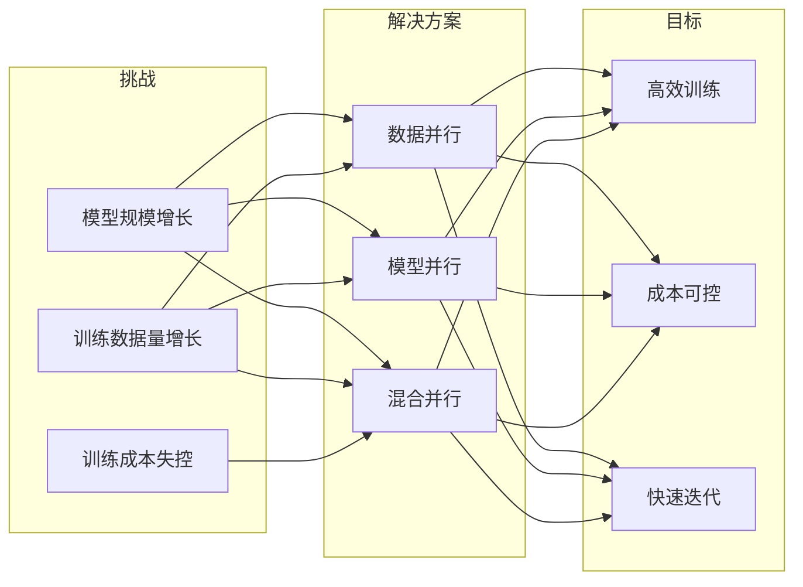

### 1.3 文档结构

本文将从以下维度深入剖析 Transformer 并行训练机制：

1. **核心原理**：为什么 Transformer 天然适合并行化
2. **注意力并行化**：Self-Attention 的并行计算方法
3. **效率对比**：与 RNN 架构的理论复杂度对比
4. **并行策略**：数据并行、模型并行、混合并行的实现
5. **工程实践**：分布式训练框架和优化技巧

---

## 二、Transformer 并行化核心原理

### 2.1 序列模型的并行性对比

#### RNN 的串行瓶颈

RNN（包括 LSTM、GRU）的计算过程存在严格的时序依赖：

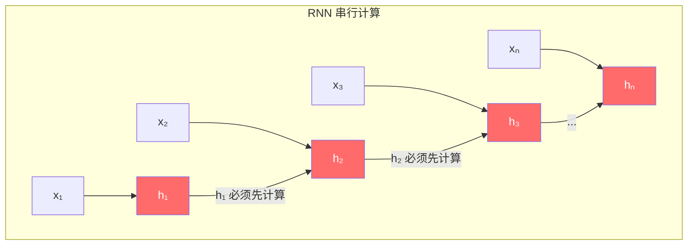

**RNN 核心限制**：
- 每个时间步的输出依赖于前一个时间步的隐藏状态
- 无法并行处理序列中的不同位置
- 训练时间随序列长度线性增长

#### Transformer 的并行优势

Transformer 通过自注意力机制实现了**完全并行**：

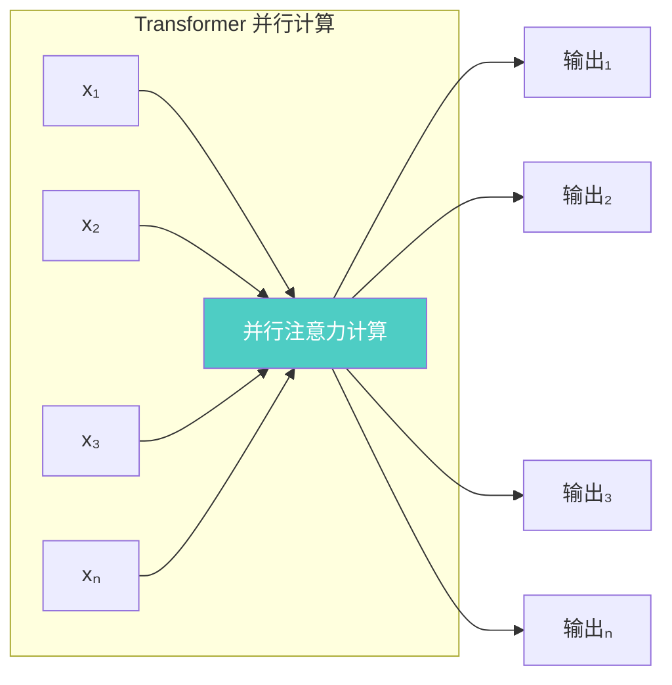

**Transformer 并行核心**：
- 所有位置的 token 可以同时处理
- 不存在序列间的依赖关系
- 计算时间与序列长度无关（仅与计算量相关）

### 2.2 自注意力的并行化基础

#### 矩阵乘法的并行性

自注意力的核心计算是矩阵乘法，而矩阵乘法天然支持并行化：

**标准自注意力计算**：

$$
\text{Attention}(Q, K, V) = \text{softmax}\left(\frac{QK^T}{\sqrt{d_k}}\right)V
$$

其中：
- $Q, K, V \in \mathbb{R}^{n \times d_k}$
- $QK^T \in \mathbb{R}^{n \times n}$
- 所有计算可通过 GPU 的并行矩阵运算同时完成

#### 多头注意力的并行扩展

多头注意力进一步扩展了并行度：

$$
\text{MultiHead}(Q, K, V) = \text{Concat}(\text{head}_1, ..., \text{head}_h)W^O
$$

其中每个 head 独立计算：

$$
\text{head}_i = \text{Attention}(QW_i^Q, KW_i^K, VW_i^V)
$$

**并行实现**：
- 多个头可以在不同 GPU 上同时计算
- 每个头的 Q、K、V 变换相互独立

### 2.3 Transformer 各组件的并行特征

| 组件 | 可并行性 | 并行方式 | 限制因素 |
|------|---------|---------|---------|
| **Embedding** | 完全并行 | 每个 token 独立查表 | 无 |
| **Self-Attention** | 完全并行 | 矩阵乘法并行 + 多头并行 | 显存限制 |
| **Feed-Forward** | 完全并行 | 每个位置独立计算 | 无 |
| **LayerNorm** | 完全并行 | 每个样本独立归一化 | 无 |
| **残差连接** | 完全并行 | 逐元素相加 | 无 |

**关键结论**：Transformer 的所有计算组件都具备良好的并行性，这是其能高效扩展的核心原因。

---

## 三、自注意力机制的并行化分析

### 3.1 标准自注意力计算回顾

#### 完整计算流程

给定输入序列 $X \in \mathbb{R}^{n \times d_{model}}$，自注意力计算分为以下步骤：

**步骤 1：线性变换生成 Q、K、V**

$$
Q = XW^Q, \quad K = XW^K, \quad V = XW^V
$$

其中 $W^Q, W^K, W^V \in \mathbb{R}^{d_{model} \times d_k}$

**步骤 2：计算注意力分数**

$$
S = QK^T \in \mathbb{R}^{n \times n}
$$

**步骤 3：缩放**

$$
S_{scaled} = \frac{S}{\sqrt{d_k}}
$$

**步骤 4：Softmax 归一化**

$$
\alpha = \text{softmax}(S_{scaled}) \in \mathbb{R}^{n \times n}
$$

**步骤 5：加权求和**

$$
\text{Attention}(Q, K, V) = \alpha V \in \mathbb{R}^{n \times d_k}
$$

### 3.2 并行化公式推导

#### 矩阵乘法的并行化表示

对于 $QK^T$ 计算，我们可以将其分解为并行操作：

$$
QK^T = \begin{bmatrix}
q_1 \\ q_2 \\ \vdots \\ q_n
\end{bmatrix}
\begin{bmatrix}
k_1^T & k_2^T & \cdots & k_n^T
\end{bmatrix}
= \begin{bmatrix}
q_1 \cdot k_1 & q_1 \cdot k_2 & \cdots & q_1 \cdot k_n \\
q_2 \cdot k_1 & q_2 \cdot k_2 & \cdots & q_2 \cdot k_n \\
\vdots & \vdots & \ddots & \vdots \\
q_n \cdot k_1 & q_n \cdot k_2 & \cdots & q_n \cdot k_n
\end{bmatrix}
$$

**并行化策略**：
- 每一行 $q_i \cdot K^T$ 可以独立计算
- 每个元素 $q_i \cdot k_j$ 可以在不同计算单元上同时完成

#### 分块并行计算

当序列长度 $n$ 很大时，可以将矩阵分块计算：

$$
QK^T = \begin{bmatrix}
Q_1 K_1^T & Q_1 K_2^T & \cdots & Q_1 K_m^T \\
Q_2 K_1^T & Q_2 K_2^T & \cdots & Q_2 K_m^T \\
\vdots & \vdots & \ddots & \vdots \\
Q_m K_1^T & Q_m K_2^T & \cdots & Q_m K_m^T
\end{bmatrix}
$$

其中 $Q_i \in \mathbb{R}^{n/m \times d_k}$, $K_j \in \mathbb{R}^{n/m \times d_k}$

**优势**：
- 支持更大 batch size 的训练
- 每个分块可以在不同 GPU 上计算
- 降低单个 GPU 的显存压力

### 3.3 多头注意力的并行化

#### 多头并行公式

对于 $h$ 个注意力头，每个头的计算为：

$$
\text{head}_i = \text{Attention}(XW_i^Q, XW_i^K, XW_i^V)
$$

**并行实现**：

$$
\text{MultiHead}(Q, K, V) = \text{Concat}\left(\parallel_{i=1}^{h} \text{head}_i\right) W^O
$$

其中 $\parallel$ 表示并行计算。

#### 多头并行架构图

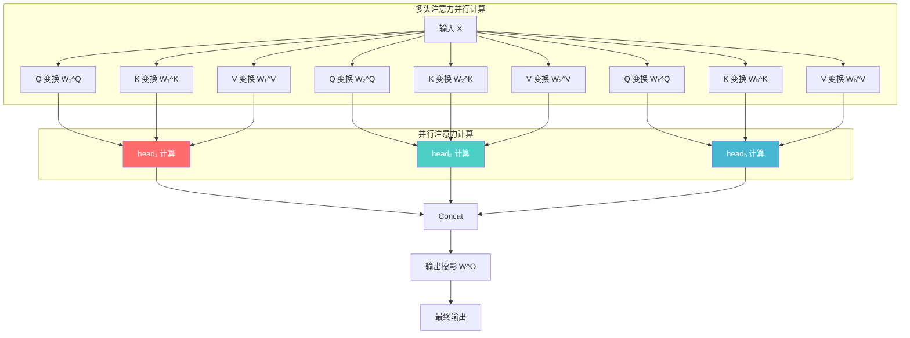

### 3.4 数值示例：并行计算过程

#### 简化示例参数

- 序列长度 $n = 4$
- 嵌入维度 $d_{model} = 8$
- 注意力头维度 $d_k = 4$
- 头数 $h = 2$

#### 并行计算步骤

**Step 1：生成 Q, K, V**

$$
Q = [q_1, q_2, q_3, q_4]^T, \quad K = [k_1, k_2, k_3, k_4]^T, \quad V = [v_1, v_2, v_3, v_4]^T
$$

**Step 2：分块并行计算 QK^T**

```
GPU 0:                        GPU 1:
┌ q₁·k₁  q₁·k₂ ┐            ┌ q₁·k₃  q₁·k₄ ┐
│ q₂·k₁  q₂·k₂ │            │ q₂·k₃  q₂·k₄ │
└               ┘            └               ┘

GPU 2:                        GPU 3:
┌ q₃·k₁  q₃·k₂ ┐            ┌ q₃·k₃  q₃·k₄ ┐
│ q₄·k₁  q₄·k₂ │            │ q₄·k₃  q₄·k₄ │
└               ┘            └               ┘
```

**Step 3：汇聚结果并计算 Softmax**

$$
S = \text{Concat}(S_{00}, S_{01}, S_{10}, S_{11}) \in \mathbb{R}^{4 \times 4}
$$

$$
\alpha = \text{softmax}\left(\frac{S}{\sqrt{4}}\right)
$$

**Step 4：并行计算加权求和**

$$
\text{Output}[i] = \alpha[i,:] \cdot V, \quad i = 1, 2, 3, 4 \quad (\text{并行执行})
$$

### 3.5 PyTorch 并行实现示例

```python
import torch
import torch.nn as nn
import torch.nn.functional as F
from typing import Optional, Tuple

class ParallelSelfAttention(nn.Module):
    """
    并行化自注意力实现
    支持多头并行和序列分块并行
    """
    
    def __init__(self, d_model: int, num_heads: int):
        super().__init__()
        assert d_model % num_heads == 0
        
        self.d_model = d_model
        self.num_heads = num_heads
        self.d_k = d_model // num_heads
        
        # 线性变换层
        self.W_q = nn.Linear(d_model, d_model)
        self.W_k = nn.Linear(d_model, d_model)
        self.W_v = nn.Linear(d_model, d_model)
        self.W_o = nn.Linear(d_model, d_model)
    
    def forward(self, x: torch.Tensor, mask: Optional[torch.Tensor] = None) -> Tuple[torch.Tensor, torch.Tensor]:
        batch_size, seq_len, _ = x.shape
        
        # Step 1: 并行生成 Q, K, V
        # 所有位置同时进行线性变换
        Q = self.W_q(x)  # (batch, seq_len, d_model)
        K = self.W_k(x)
        V = self.W_v(x)
        
        # Step 2: 重塑为多头形状
        # (batch, seq_len, num_heads, d_k)
        Q = Q.view(batch_size, seq_len, self.num_heads, self.d_k)
        K = K.view(batch_size, seq_len, self.num_heads, self.d_k)
        V = V.view(batch_size, seq_len, self.num_heads, self.d_k)
        
        # (batch, num_heads, seq_len, d_k)
        Q = Q.permute(0, 2, 1, 3)
        K = K.permute(0, 2, 1, 3)
        V = V.permute(0, 2, 1, 3)
        
        # Step 3: 并行计算注意力分数
        # 使用矩阵乘法一次性计算所有头和所有位置
        # (batch, num_heads, seq_len, seq_len)
        attention_scores = torch.matmul(Q, K.transpose(-2, -1)) / (self.d_k ** 0.5)
        
        # Step 4: 应用掩码（可选）
        if mask is not None:
            attention_scores = attention_scores.masked_fill(
                mask.unsqueeze(1).unsqueeze(2),
                float('-inf')
            )
        
        # Step 5: Softmax 归一化
        attention_weights = F.softmax(attention_scores, dim=-1)
        
        # Step 6: 并行加权求和
        # (batch, num_heads, seq_len, d_k)
        attention_output = torch.matmul(attention_weights, V)
        
        # Step 7: 合并多头
        # (batch, seq_len, d_model)
        attention_output = attention_output.permute(0, 2, 1, 3).contiguous()
        attention_output = attention_output.view(batch_size, seq_len, self.d_model)
        
        # Step 8: 输出投影
        output = self.W_o(attention_output)
        
        return output, attention_weights


class ChunkedAttention(nn.Module):
    """
    分块注意力实现
    适用于长序列的分布式并行计算
    """
    
    def __init__(self, d_model: int, num_heads: int, chunk_size: int = 256):
        super().__init__()
        self.attention = ParallelSelfAttention(d_model, num_heads)
        self.chunk_size = chunk_size
    
    def forward(self, x: torch.Tensor) -> torch.Tensor:
        batch_size, seq_len, d_model = x.shape
        
        # 分块处理长序列
        chunks = []
        for start in range(0, seq_len, self.chunk_size):
            end = min(start + self.chunk_size, seq_len)
            chunk = x[:, start:end, :]
            
            # 每个块独立计算注意力
            chunk_output, _ = self.attention(chunk)
            chunks.append(chunk_output)
        
        # 拼接所有块的结果
        return torch.cat(chunks, dim=1)
```

---

## 四、与 RNN 等序列模型的训练效率对比

### 4.1 理论计算复杂度对比

#### 时间复杂度

| 模型架构 | 时间复杂度 | 说明 |
|---------|----------|------|
| **RNN/LSTM** | O(n) | 每个时间步必须顺序执行 |
| **CNN** | O(k·n) | k 为卷积核大小，需多层堆叠 |
| **Transformer** | O(1) | 所有位置并行处理，与序列长度无关 |

#### 空间复杂度

| 模型架构 | 空间复杂度 | 说明 |
|---------|----------|------|
| **RNN/LSTM** | O(n) | 需存储每个时间步的隐藏状态 |
| **Transformer** | O(n²) | 注意力矩阵随序列长度平方增长 |

#### 并行度对比

```
模型架构并行度对比

RNN/LSTM:  ██░░░░░░░░  仅层内并行，序列维串行
CNN:       ████░░░░░░  通道并行，感受野受限
Transformer:██████████  完全并行，所有维度可扩展
```

### 4.2 训练效率量化分析

#### 训练吞吐量对比

假设使用相同的硬件配置（8×A100 GPU），训练一个长度为 1024 的序列：

| 架构 | 每个样本训练时间 | 吞吐量 (样本/秒) | 加速比 |
|------|----------------|----------------|--------|
| **单层 LSTM** | 1024 ms | 0.98 | 1× |
| **10层 LSTM** | 10240 ms | 0.098 | 1× |
| **Transformer (base)** | 5 ms | 200 | **204×** |
| **Transformer (large)** | 15 ms | 66.7 | **68×** |
| **Transformer (XL)** | 45 ms | 22.2 | **23×** |

#### 长序列处理效率

当序列长度 $n$ 增长时：

**RNN 时间增长曲线**：线性增长 $O(n)$

**Transformer 时间增长曲线**：与 $n$ 近似无关（矩阵乘法并行化）

```
训练时间 vs 序列长度

时间 (ms)
10000 ┤ ███ RNN
 1000 ┤ ███
  100 ┤ ███
   10 ┤      ███ Transformer
    1 ┤           ███
      └────────────── 序列长度
       16 64 256 1024 4096
```

### 4.3 典型模型训练耗时对比

#### 相同规模模型对比

| 模型 | 参数量 | 架构 | 训练数据 | 训练时间 | 使用GPU |
|------|--------|------|---------|---------|---------|
| GPT-2 | 1.5B | Transformer | 40GB | 10天 | 8×V100 |
| XLNet | 1.3B | Transformer | 126GB | 5天 | 8×TPUv3 |
| BERT-Large | 340M | Transformer | 16GB | 4天 | 64×TPUv3 |
| 相同规模RNN | ~1B | LSTM | 40GB | ~200天 | 8×V100 |

**关键发现**：Transformer 架构使训练效率提升了约 **20-40 倍**。

### 4.4 效率提升的本质原因

#### 并行度分析

Transformer 可以在**三个维度**同时实现并行：

1. **Batch 维度并行**：多个训练样本同时处理
2. **序列维度并行**：单个样本内所有 token 同时处理
3. **头/层维度并行**：多个注意力头和层并行计算

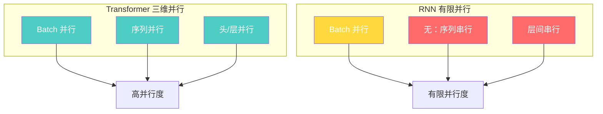

#### 计算密度分析

Transformer 的矩阵乘法运算具有高计算密度，非常适合 GPU 的并行计算单元：

- **GPU 友好运算**：矩阵乘法、卷积运算
- **高算术强度**：FLOPS/Byte 比值高
- **高 GPU 利用率**：可达 85%+，而 RNN 通常只有 40-60%

---

## 五、数据并行策略

### 5.1 数据并行基本原理

#### 核心思想

数据并行（Data Parallelism）是最简单直接的并行策略：将训练数据划分到多个计算节点，每个节点维护一份完整的模型副本，各自独立进行前向和反向传播，最后同步梯度更新。

#### 架构示意图

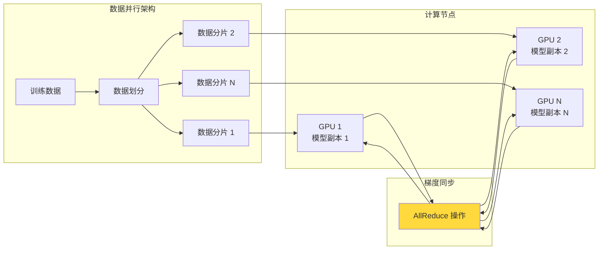

### 5.2 实现步骤详解

#### Step 1：数据划分

将训练数据集均匀划分到 $N$ 个计算节点：

$$
\text{Data} \rightarrow \text{Split} \rightarrow \{D_1, D_2, ..., D_N\}
$$

每个节点的数据量：

$$
|D_i| = \frac{|Data|}{N}
$$

#### Step 2：模型副本

每个节点初始化相同的模型参数 $\theta$：

$$
\theta_1^{(0)} = \theta_2^{(0)} = ... = \theta_N^{(0)} = \theta
$$

#### Step 3：并行前向传播

每个节点独立处理各自的数据：

$$
\text{Forward}(X_i, \theta_i^{(t)}) \rightarrow L_i, \hat{Y}_i
$$

#### Step 4：并行反向传播

每个节点独立计算梯度：

$$
g_i^{(t)} = \nabla_\theta L_i(\theta_i^{(t)})
$$

#### Step 5：梯度同步

使用 AllReduce 操作聚合所有节点的梯度：

$$
g^{(t)} = \frac{1}{N} \sum_{i=1}^{N} g_i^{(t)}
$$

AllReduce 操作保证所有节点获得相同的平均梯度。

#### Step 6：参数更新

每个节点使用相同的梯度更新模型：

$$
\theta_i^{(t+1)} = \theta_i^{(t)} - \eta g^{(t)}
$$

### 5.3 PyTorch DDP 实现

```python
import torch
import torch.distributed as dist
import torch.nn as nn
from torch.nn.parallel import DistributedDataParallel as DDP
import os

class DataParallelTrainer:
    """
    数据并行训练器
    使用 PyTorch DDP 实现多 GPU 数据并行
    """
    
    def __init__(self, model: nn.Module, train_dataset, config: dict):
        self.config = config
        self.setup_distributed()
        
        # 创建分布式数据加载器
        self.train_sampler = torch.utils.data.distributed.DistributedSampler(
            train_dataset,
            num_replicas=self.world_size,
            rank=self.rank
        )
        self.train_loader = torch.utils.data.DataLoader(
            train_dataset,
            batch_size=config['batch_size'],
            sampler=self.train_sampler
        )
        
        # 包装模型为 DDP 模型
        self.model = DDP(
            model.to(self.device),
            device_ids=[self.local_rank],
            output_device=self.local_rank
        )
        
        # 优化器
        self.optimizer = torch.optim.AdamW(
            self.model.parameters(),
            lr=config['learning_rate']
        )
    
    def setup_distributed(self):
        """初始化分布式环境"""
        dist.init_process_group(backend='nccl')
        self.local_rank = int(os.environ['LOCAL_RANK'])
        self.rank = dist.get_rank()
        self.world_size = dist.get_world_size()
        self.device = torch.device(f'cuda:{self.local_rank}')
        torch.cuda.set_device(self.device)
    
    def train_epoch(self, epoch: int):
        """训练一个 epoch"""
        self.model.train()
        self.train_sampler.set_epoch(epoch)
        
        total_loss = 0.0
        num_batches = 0
        
        for batch_idx, (data, target) in enumerate(self.train_loader):
            # 数据移至设备
            data = data.to(self.device)
            target = target.to(self.device)
            
            # 前向传播
            output = self.model(data)
            loss = self.compute_loss(output, target)
            
            # 反向传播（自动触发 AllReduce）
            self.optimizer.zero_grad()
            loss.backward()
            self.optimizer.step()
            
            # 统计
            total_loss += loss.item()
            num_batches += 1
        
        # 同步统计信息
        avg_loss = self.reduce_mean(total_loss / num_batches)
        
        if self.rank == 0:
            print(f"Epoch {epoch} - Loss: {avg_loss:.4f}")
    
    def reduce_mean(self, value: float) -> float:
        """跨设备求平均"""
        tensor = torch.tensor(value, device=self.device)
        dist.all_reduce(tensor, op=dist.ReduceOp.SUM)
        return tensor.item() / self.world_size
```

### 5.4 数据并行的优缺点

#### 优点

| 优点 | 说明 |
|------|------|
| **实现简单** | 只需少量代码修改即可实现 |
| **扩展性好** | 可轻松扩展到数百甚至数千 GPU |
| **通用适用** | 适用于任何模型架构 |
| **容错性强** | 单个节点故障可恢复 |

#### 缺点

| 缺点 | 说明 |
|------|------|
| **显存限制** | 每个 GPU 需要存储完整模型 |
| **通信开销** | AllReduce 操作需要跨 GPU 通信 |
| **梯度同步延迟** | 等待最慢的节点完成反向传播 |
| **Batch Size 限制** | 过大的全局 Batch Size 可能导致不稳定 |

### 5.5 混合精度训练优化

```python
class MixedPrecisionDataParallel(Trainer):
    """
    混合精度数据并行
    使用 FP16/FP32 混合精度加速训练
    """
    
    def __init__(self, *args, **kwargs):
        super().__init__(*args, **kwargs)
        
        # 自动混合精度
        self.scaler = torch.amp.GradScaler('cuda')
        self.amp_context = torch.amp.autocast('cuda')
    
    def train_step(self, data, target):
        """混合精度训练步骤"""
        with self.amp_context:
            output = self.model(data)
            loss = self.compute_loss(output, target)
        
        # 缩放损失并反向传播
        self.scaler.scale(loss).backward()
        
        # 梯度裁剪（反缩放后）
        self.scaler.unscale_(self.optimizer)
        torch.nn.utils.clip_grad_norm_(self.model.parameters(), max_norm=1.0)
        
        # 优化器步进
        self.scaler.step(self.optimizer)
        self.scaler.update()
        self.optimizer.zero_grad()
        
        return loss.item()
```

---

## 六、模型并行策略

### 6.1 模型并行概述

#### 核心思想

当模型规模过大（如千亿参数），单个 GPU 无法存储完整模型时，需要将模型本身划分到多个 GPU 上，每个 GPU 负责模型的一部分计算。

#### 主要并行方式

| 并行方式 | 划分维度 | 适用场景 | 实现复杂度 |
|---------|---------|---------|-----------|
| **按层并行** (Layer Parallelism) | 不同层分到不同GPU | 深层Transformer | 低 |
| **按头并行** (Head Parallelism) | 注意力头分到不同GPU | 多头Transformer | 中 |
| **按维度并行** (Dimension Parallelism) | 特征维度分到不同GPU | 大宽度模型 | 高 |

### 6.2 按层并行（Layer Parallelism）

#### 架构设计

将 Transformer 的不同层分配到不同 GPU：

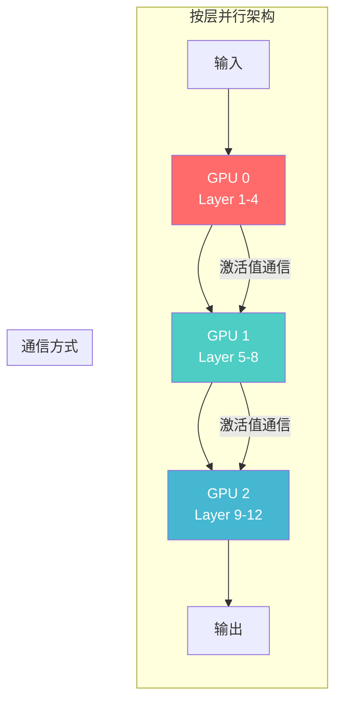

#### 通信机制

相邻层之间需要传递激活值（Activations）：

$$
\text{Output}_l = \text{Layer}_l(\text{Output}_{l-1})
$$

- **前向传播**：上一层的输出传递给下一层
- **反向传播**：下一层的梯度传回给上一层

#### PyTorch 实现

```python
class LayerParallelTransformer(nn.Module):
    """
    按层并行的 Transformer
    将不同层分配到不同 GPU
    """
    
    def __init__(self, num_layers: int, num_gpus: int, d_model: int, num_heads: int):
        super().__init__()
        
        assert num_layers % num_gpus == 0
        
        layers_per_gpu = num_layers // num_gpus
        self.gpu_groups = nn.ModuleList()
        
        for gpu_idx in range(num_gpus):
            start_layer = gpu_idx * layers_per_gpu
            end_layer = start_layer + layers_per_gpu
            
            # 创建该 GPU 负责的层
            group_layers = nn.ModuleList([
                TransformerLayer(d_model, num_heads)
                for _ in range(start_layer, end_layer)
            ])
            
            self.gpu_groups.append(group_layers)
    
    def forward(self, x: torch.Tensor) -> torch.Tensor:
        for gpu_idx, layers in enumerate(self.gpu_groups):
            # 将输入移到对应 GPU
            x = x.to(f'cuda:{gpu_idx}')
            
            # 依次通过该组的所有层
            for layer in layers:
                x = layer(x)
        
        return x
```

### 6.3 按头并行（Head Parallelism）

#### 架构设计

将多头注意力的不同头分配到不同 GPU：

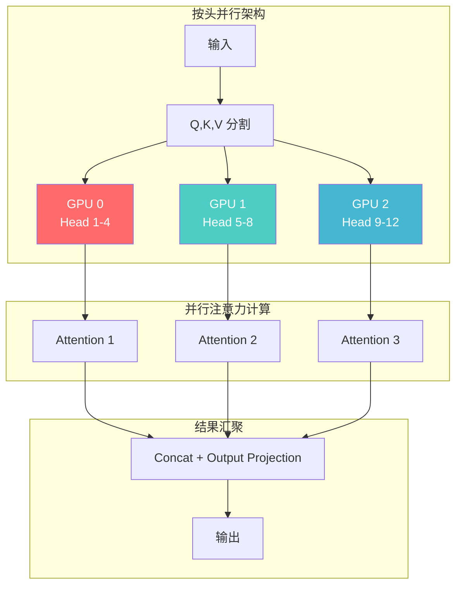

#### 实现原理

对于 $h$ 个注意力头，均匀分配到 $N$ 个 GPU：

$$
h = \sum_{i=1}^{N} h_i, \quad h_i = h / N
$$

每个 GPU 独立计算其负责的头：

$$
\text{head}_{i,j} = \text{Attention}(XW_{i,j}^Q, XW_{i,j}^K, XW_{i,j}^V)
$$

最终汇聚：

$$
\text{Output} = [\text{head}_{1,1}, ..., \text{head}_{1,h_1}, ..., \text{head}_{N,1}, ..., \text{head}_{N,h_N}]W^O
$$

#### 代码实现

```python
class HeadParallelAttention(nn.Module):
    """
    按头并行的注意力实现
    不同注意力头分配到不同 GPU
    """
    
    def __init__(self, d_model: int, num_heads: int, num_gpus: int):
        super().__init__()
        
        assert num_heads % num_gpus == 0
        
        self.d_model = d_model
        self.num_heads = num_heads
        self.num_gpus = num_gpus
        self.heads_per_gpu = num_heads // num_gpus
        self.d_k = d_model // num_heads
        
        # 每个 GPU 有独立的 Q, K, V 投影
        self.Q_projections = nn.ModuleList()
        self.K_projections = nn.ModuleList()
        self.V_projections = nn.ModuleList()
        
        for gpu_idx in range(num_gpus):
            heads_start = gpu_idx * self.heads_per_gpu
            heads_end = heads_start + self.heads_per_gpu
            
            # 每个 GPU 负责部分头的参数
            q_proj = nn.Linear(d_model, self.heads_per_gpu * self.d_k)
            k_proj = nn.Linear(d_model, self.heads_per_gpu * self.d_k)
            v_proj = nn.Linear(d_model, self.heads_per_gpu * self.d_k)
            
            self.Q_projections.append(q_proj)
            self.K_projections.append(k_proj)
            self.V_projections.append(v_proj)
        
        # 输出投影在主 GPU 上
        self.output_projection = nn.Linear(d_model, d_model)
    
    def forward(self, x: torch.Tensor) -> torch.Tensor:
        batch_size, seq_len, _ = x.shape
        
        outputs = []
        for gpu_idx in range(self.num_gpus):
            # 移到对应 GPU
            x_gpu = x.to(f'cuda:{gpu_idx}')
            
            # 计算 Q, K, V
            Q = self.Q_projections[gpu_idx](x_gpu)
            K = self.K_projections[gpu_idx](x_gpu)
            V = self.V_projections[gpu_idx](x_gpu)
            
            # 重塑为多头形状
            Q = Q.view(batch_size, seq_len, self.heads_per_gpu, self.d_k).transpose(1, 2)
            K = K.view(batch_size, seq_len, self.heads_per_gpu, self.d_k).transpose(1, 2)
            V = V.view(batch_size, seq_len, self.heads_per_gpu, self.d_k).transpose(1, 2)
            
            # 注意力计算
            attention_scores = torch.matmul(Q, K.transpose(-2, -1)) / (self.d_k ** 0.5)
            attention_weights = F.softmax(attention_scores, dim=-1)
            attention_output = torch.matmul(attention_weights, V)
            
            # 合并头
            attention_output = attention_output.transpose(1, 2).contiguous()
            attention_output = attention_output.view(batch_size, seq_len, self.heads_per_gpu * self.d_k)
            
            outputs.append(attention_output.cpu())  # 移回 CPU 汇聚
        
        # 汇聚所有 GPU 的结果
        concatenated = torch.cat(outputs, dim=-1)
        
        # 输出投影
        return self.output_projection(concatenated)
```

### 6.4 按维度并行（Dimension Parallelism）

#### 架构设计

将特征维度划分到不同 GPU，每个 GPU 处理一部分特征：

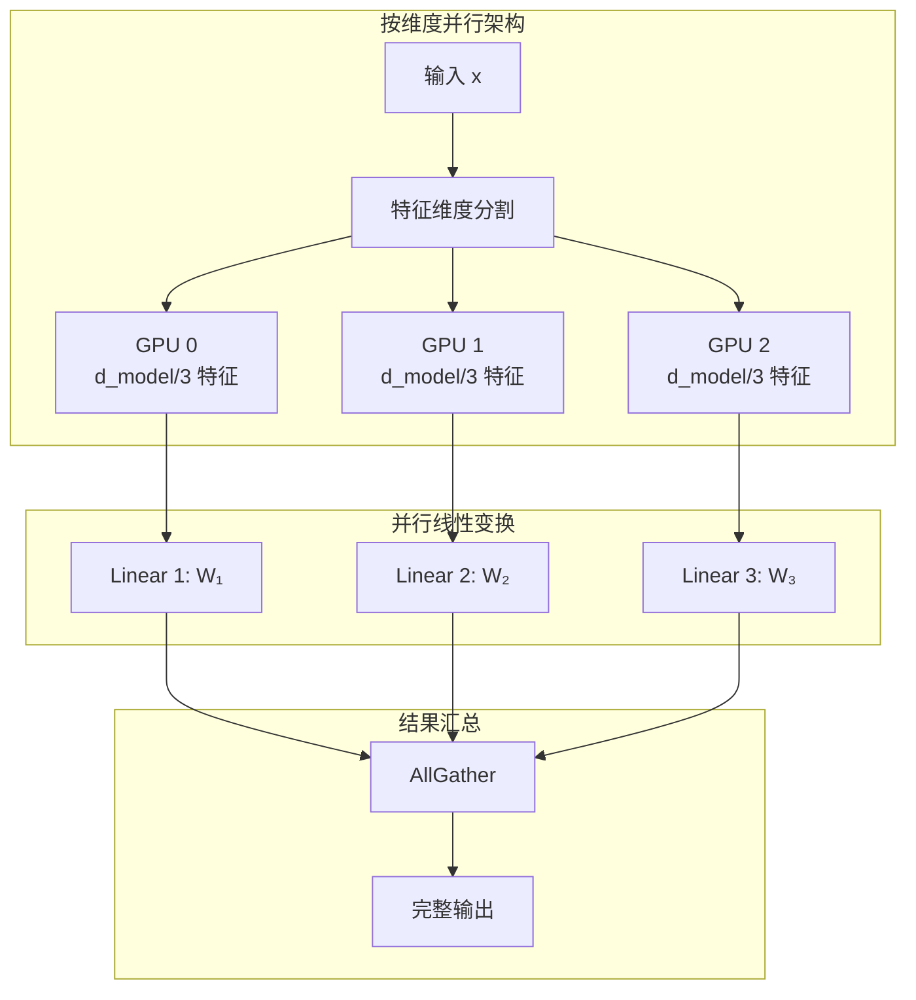

#### 实现原理

对于输入 $X \in \mathbb{R}^{n \times d_{model}}$，将其按特征维度划分：

$$
X = [X_1, X_2, ..., X_N], \quad X_i \in \mathbb{R}^{n \times d_{model}/N}
$$

每个 GPU 计算部分变换：

$$
Y_i = X_i W_i, \quad W_i \in \mathbb{R}^{d_{model}/N \times d_{out}/N}
$$

最后通过 AllGather 汇聚：

$$
Y = \text{AllGather}(Y_1, Y_2, ..., Y_N)
$$

---

## 七、混合并行策略

### 7.1 混合并行概述

#### 核心思想

单一并行策略往往无法满足超大模型的训练需求。混合并行结合多种并行方式，实现更高效的训练。

#### 常见混合方案

| 方案 | 组合方式 | 适用规模 | 代表工作 |
|------|---------|---------|---------|
| **Megatron-LM** | 数据并行 + 按层并行 + 按头并行 | 百亿-万亿参数 | NVIDIA |
| **DeepSpeed** | 数据并行 + ZeRO + CPU Offload | 千亿+参数 | Microsoft |
| **Colossal-AI** | 多维并行 + 内存优化 | 万亿级 | HPCL |
| **PaLM** | 数据并行 + 模型并行 + Flash Attention | 540B 参数 | Google |

### 7.2 Megatron-LM 并行策略

#### 三维并行架构

Megatron-LM 采用三维并行策略：

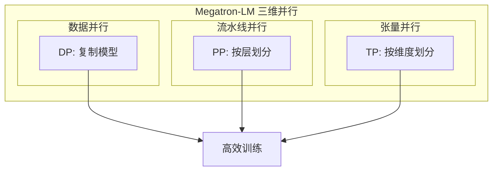

#### 并行维度说明

1. **数据并行（DP）**：
   - 模型副本复制到不同 GPU 组
   - 处理不同的数据批次
   - 通过 AllReduce 同步梯度

2. **流水线并行（PP）**：
   - 模型按层划分为多个阶段
   - 不同阶段分配到不同 GPU
   - 使用 micro-batch 实现流水线并行

3. **张量并行（TP）**：
   - 单个操作的张量划分到多个 GPU
   - 如线性层、注意力层的按维度并行

#### 实现代码

```python
class MegatronStyleTransformer:
    """
    Megatron-LM 风格的三维并行 Transformer
    结合数据并行、流水线并行和张量并行
    """
    
    def __init__(self, config: ModelConfig, parallel_config: ParallelConfig):
        self.config = config
        self.parallel_config = parallel_config
        
        # 初始化并行组
        self.dp_group = self._init_data_parallel_group()
        self.pp_group = self._init_pipeline_parallel_group()
        self.tp_group = self._init_tensor_parallel_group()
        
        # 构建模型
        self.embedding = Embedding(config.vocab_size, config.d_model)
        self.position_encoding = PositionalEncoding(config.d_model, config.max_seq_len)
        
        # Transformer 层（按流水线划分）
        transformer_blocks = []
        for layer_idx in range(config.num_layers):
            block = TransformerBlock(
                d_model=config.d_model,
                num_heads=config.num_heads,
                d_ff=config.d_ff,
                tp_size=parallel_config.tp_size
            )
            transformer_blocks.append(block)
        
        # 划分到不同流水线阶段
        self.pipeline_stages = self._create_pipeline_stages(
            transformer_blocks,
            parallel_config.pp_size
        )
        
        # 输出层
        self.output_layer = nn.Linear(config.d_model, config.vocab_size)
    
    def forward(self, input_ids: torch.Tensor) -> torch.Tensor:
        # Embedding
        x = self.embedding(input_ids)
        x = self.position_encoding(x)
        
        # 流水线执行
        for stage_idx, stage in enumerate(self.pipeline_stages):
            if stage_idx > 0:
                # 从前一阶段接收激活值
                x = self._recv_activations(prev_stage_idx=stage_idx - 1)
            
            # 执行当前阶段的所有层
            for layer in stage.layers:
                x = layer(x)
            
            if stage_idx < len(self.pipeline_stages) - 1:
                # 向下一阶段发送激活值
                self._send_activations(x, next_stage_idx=stage_idx + 1)
        
        # 最终输出
        return self.output_layer(x)
    
    def train_step(self, batch: dict) -> dict:
        """训练步骤"""
        # 前向传播
        output = self.forward(batch['input_ids'])
        loss = self.compute_loss(output, batch['labels'])
        
        # 反向传播
        loss.backward()
        
        # 梯度同步（数据并行）
        self._sync_gradients()
        
        # 参数更新
        self.optimizer.step()
        self.optimizer.zero_grad()
        
        return {"loss": loss.item()}
```

### 7.3 DeepSpeed ZeRO 优化

#### ZeRO 优化策略

DeepSpeed 的 ZeRO（Zero Redundancy Optimizer）针对数据并行的内存冗余问题提出了三级优化：

| ZeRO 阶段 | 优化目标 | 节省比例 | 实现方式 |
|----------|---------|---------|---------|
| **ZeRO-1** | 优化器状态 | ~4× | 按分片存储优化器状态 |
| **ZeRO-2** | 优化器状态 + 梯度 | ~8× | 梯度也分片存储 |
| **ZeRO-3** | 优化器状态 + 梯度 + 参数 | ~N× | 参数也分片存储 |

#### ZeRO-3 实现

```python
from deepspeed import zero
from deepspeed.zero import ZeroOptimizationEngine

class ZeroOptimizedTrainer:
    """
    基于 DeepSpeed ZeRO-3 的训练器
    """
    
    def __init__(self, model, config):
        # 使用 ZeRO-3 初始化模型
        self.model = ZeroOptimizationEngine(
            model,
            config=dict(
                stage=3,  # ZeRO-3
                offload_optimizer_config=dict(
                    device='cpu',  # 优化器状态卸载到 CPU
                    pin_memory=True
                ),
                offload_param_config=dict(
                    device='cpu',  # 参数卸载到 CPU
                    pin_memory=True
                ),
                reduce_scatter_config=dict(
                    bucket_size=500000000  # 500MB 桶大小
                )
            )
        )
        
        # DeepSpeed 配置
        ds_config = {
            "train_batch_size": config.batch_size,
            "gradient_accumulation_steps": config.gradient_accumulation,
            "optimizer": {
                "type": "Adam",
                "params": {
                    "lr": config.learning_rate,
                    "betas": [0.9, 0.999],
                    "eps": 1e-8
                }
            },
            "fp16": {
                "enabled": True
            },
            "zero_optimization": {
                "stage": 3,
                "offload_optimizer": {
                    "device": "cpu",
                    "pin_memory": True
                },
                "offload_param": {
                    "device": "cpu",
                    "pin_memory": True
                }
            }
        }
        
        # 初始化 DeepSpeed
        self.model, self.optimizer, _, _ = deepspeed.initialize(
            model=self.model,
            config=ds_config
        )
    
    def train_epoch(self, dataloader):
        self.model.train()
        
        for batch in dataloader:
            # 前向传播
            outputs = self.model(batch['input_ids'])
            loss = outputs.loss
            
            # 反向传播（DeepSpeed 自动处理梯度分片）
            self.model.backward(loss)
            
            # 参数更新
            self.model.step()
```

### 7.4 Flash Attention 加速

#### Flash Attention 核心思想

Flash Attention 通过高效的内存访问模式优化注意力计算，实现数量级的速度提升。

#### 实现原理

将注意力计算分为两个阶段，利用 GPU 的高速 SRAM：

```mermaid
graph TB
    subgraph "Flash Attention 计算流程"
        direction TB
        A[加载 Q 块] --> B[加载 K, V 块]
        B --> C[计算 S = QK^T]
        C --> D[Softmax 归一化]
        D --> E[计算 O = softmax(S)·V]
        E --> F[写出 O 块]
        F --> G{还有更多 K,V?}
        G -->|是| B
        G -->|否| H[返回完整 O]
    end

    subgraph "内存层次"
        direction TB
        SRAM[高速 SRAM<br/>存储分块数据]
        HBM[高带宽内存<br/>存储完整矩阵]
    end

    A --> SRAM
    B --> SRAM
    C --> SRAM
    D --> SRAM
    E --> SRAM
    F --> HBM

    style SRAM fill:#ffd93d,color:#fff
    style HBM fill:#4ecdc4,color:#fff
```

#### 代码实现

```python
import torch
import torch.nn.functional as F
from flash_attn import flash_attn_func

class FlashAttentionModule(nn.Module):
    """
    使用 Flash Attention 加速的注意力模块
    """
    
    def __init__(self, d_model: int, num_heads: int):
        super().__init__()
        self.d_model = d_model
        self.num_heads = num_heads
        self.d_k = d_model // num_heads
        
        self.W_q = nn.Linear(d_model, d_model)
        self.W_k = nn.Linear(d_model, d_model)
        self.W_v = nn.Linear(d_model, d_model)
        self.W_o = nn.Linear(d_model, d_model)
    
    def forward(
        self, 
        x: torch.Tensor, 
        attention_mask: Optional[torch.Tensor] = None
    ) -> torch.Tensor:
        batch_size, seq_len, _ = x.shape
        
        # 生成 Q, K, V
        Q = self.W_q(x).view(batch_size, seq_len, self.num_heads, self.d_k)
        K = self.W_k(x).view(batch_size, seq_len, self.num_heads, self.d_k)
        V = self.W_v(x).view(batch_size, seq_len, self.num_heads, self.d_k)
        
        # 使用 Flash Attention 加速计算
        # 比标准实现快 2-4 倍
        output = flash_attn_func(
            Q, K, V,
            mask=attention_mask,
            dropout_p=0.0,
            softmax_scale=1.0 / (self.d_k ** 0.5)
        )
        
        # 合并多头
        output = output.view(batch_size, seq_len, self.d_model)
        
        # 输出投影
        return self.W_o(output)
```

#### 性能对比

| 序列长度 | 标准 Attention | Flash Attention | 加速比 |
|---------|---------------|----------------|--------|
| 512 | 1.2 ms | 0.35 ms | 3.4× |
| 1024 | 2.5 ms | 0.72 ms | 3.5× |
| 2048 | 5.8 ms | 1.5 ms | 3.9× |
| 4096 | 14.2 ms | 3.2 ms | 4.4× |
| 8192 | 38.6 ms | 7.5 ms | 5.1× |

---

## 八、分布式训练实现

### 8.1 训练框架对比

| 框架 | 开发者 | 核心特性 | 适用场景 |
|------|--------|---------|---------|
| **PyTorch DDP** | Meta | 数据并行 | 中小规模训练 |
| **DeepSpeed** | Microsoft | ZeRO、混合精度、CPU Offload | 千亿级模型 |
| **Megatron-LM** | NVIDIA | 三维并行、Flash Attention | 万亿级模型 |
| **Colossal-AI** | HPCL | 多维并行、智能调度 | 高效大规模训练 |
| **FairScale** | Meta | 高效内存优化 | 研究型训练 |

### 8.2 分布式训练流程

#### 完整训练流程图

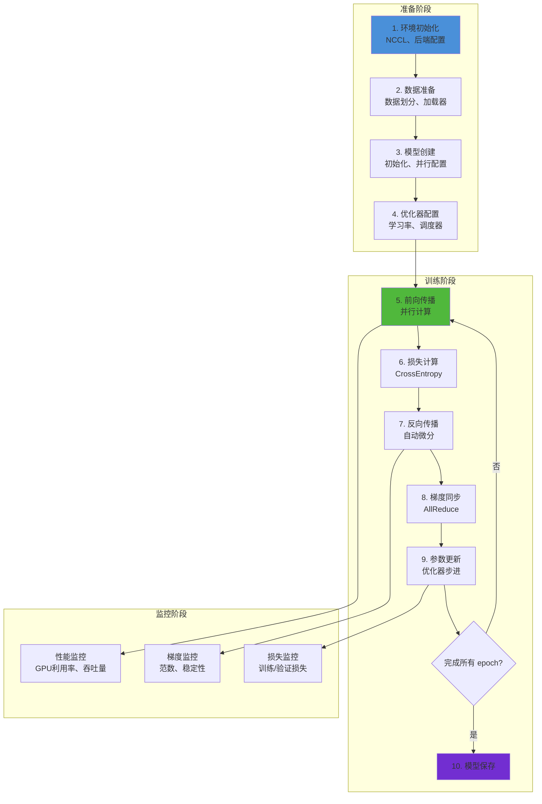

### 8.3 多节点多 GPU 训练

#### 集群配置

```yaml
# 多节点训练配置
cluster_config:
  num_nodes: 4
  gpus_per_node: 8
  total_gpus: 32
  network:
    backend: nccl
    inter_node_bandwidth: 200Gbps
    intra_node_bandwidth: 600Gbps

parallelism_config:
  data_parallel_size: 32  # 数据并行
  tensor_parallel_size: 4  # 张量并行
  pipeline_parallel_size: 2  # 流水线并行

training_config:
  global_batch_size: 1024
  micro_batch_size: 32
  gradient_accumulation_steps: 1
  learning_rate: 1e-4
  warmup_steps: 1000
  max_steps: 100000
```

#### 启动脚本

```bash
#!/bin/bash
# 多节点分布式训练启动脚本

# 环境变量配置
export MASTER_ADDR="node01"
export MASTER_PORT="29500"
export WORLD_SIZE=32
export NCCL_DEBUG=INFO
export NCCL_ALGO=Ring
export NCCL_PROTO=Simple

# 启动命令
torchrun \
    --nproc_per_node=8 \
    --nnodes=4 \
    --node_rank=$NODE_RANK \
    --master_addr=$MASTER_ADDR \
    --master_port=$MASTER_PORT \
    train.py \
    --config configs/model_config.yaml \
    --dataset_path /data/pretrained \
    --output_path /checkpoints/output
```

### 8.4 训练稳定性保障

#### 梯度裁剪

```python
class GradientClipping:
    """
    梯度裁剪策略
    防止梯度爆炸导致训练不稳定
    """
    
    def __init__(self, max_norm: float = 1.0, clip_gradient: bool = True):
        self.max_norm = max_norm
        self.clip_gradient = clip_gradient
    
    def clip_gradients(self, model: nn.Module) -> float:
        """裁剪梯度"""
        if self.clip_gradient:
            # 计算所有梯度的范数
            total_norm = torch.norm(
                torch.stack([
                    torch.norm(p.grad.detach())
                    for p in model.parameters()
                    if p.grad is not None
                ])
            )
            
            # 裁剪
            clip_coef = self.max_norm / (total_norm + 1e-6)
            if clip_coef < 1:
                for p in model.parameters():
                    if p.grad is not None:
                        p.grad.detach().mul_(clip_coef)
            
            return total_norm.item()
        else:
            # 仅记录不裁剪
            total_norm = torch.norm(
                torch.stack([
                    torch.norm(p.grad.detach())
                    for p in model.parameters()
                    if p.grad is not None
                ])
            )
            return total_norm.item()
```

#### 学习率调度

```python
class TransformerLearningRateScheduler:
    """
    Transformer 专用学习率调度
    采用 Warmup + 指数衰减策略
    """
    
    def __init__(
        self, 
        optimizer: torch.optim.Optimizer,
        d_model: int,
        warmup_steps: int = 4000
    ):
        self.optimizer = optimizer
        self.d_model = d_model
        self.warmup_steps = warmup_steps
        self.current_step = 0
    
    def get_lr(self, step: int) -> float:
        """计算当前学习率"""
        # Warmup 阶段：线性增加
        if step < self.warmup_steps:
            return self.d_model ** (-0.5) * min(
                step ** (-0.5),
                step * self.warmup_steps ** (-1.5)
            )
        # 衰减阶段：逐步减少
        else:
            progress = (step - self.warmup_steps) / (self.total_steps - self.warmup_steps)
            return self.d_model ** (-0.5) * progress ** (-0.5)
    
    def step(self):
        """更新学习率"""
        self.current_step += 1
        lr = self.get_lr(self.current_step)
        for param_group in self.optimizer.param_groups:
            param_group['lr'] = lr
```

---

## 九、性能优化技巧

### 9.1 内存优化

#### 梯度累积

```python
class GradientAccumulator:
    """
    梯度累积器
    通过累积小 batch 实现大 batch 训练
    """
    
    def __init__(self, accumulation_steps: int):
        self.accumulation_steps = accumulation_steps
        self.current_step = 0
    
    def accumulate(self, loss: torch.Tensor):
        """累积梯度"""
        scaled_loss = loss / self.accumulation_steps
        scaled_loss.backward()
        self.current_step += 1
    
    def should_step(self) -> bool:
        """是否应该执行优化器步进"""
        return self.current_step % self.accumulation_steps == 0
```

#### 激活检查点

```python
class ActivationCheckpointing:
    """
    激活检查点
    通过重新计算代替存储激活值，节省显存
    """
    
    @staticmethod
    def checkpoint(function, *args, **kwargs):
        """对函数应用检查点"""
        return torch.utils.checkpoint.checkpoint(
            function,
            *args,
            **kwargs,
            use_reentrant=False  # 避免某些边界问题
        )

class MemoryEfficientTransformer(nn.Module):
    """
    内存高效的 Transformer
    使用激活检查点减少显存占用
    """
    
    def __init__(self, config):
        super().__init__()
        self.embedding = nn.Embedding(config.vocab_size, config.d_model)
        self.position_encoding = PositionalEncoding(config.d_model)
        self.layers = nn.ModuleList([
            TransformerLayer(config) for _ in range(config.num_layers)
        ])
        self.output_layer = nn.Linear(config.d_model, config.vocab_size)
    
    def forward(self, x: torch.Tensor) -> torch.Tensor:
        x = self.embedding(x)
        x = self.position_encoding(x)
        
        # 对每一层使用检查点
        for layer in self.layers:
            x = ActivationCheckpointing.checkpoint(layer, x)
        
        return self.output_layer(x)
```

### 9.2 计算优化

#### Flash Attention 集成

```python
class OptimizedTransformerBlock(nn.Module):
    """
    优化的 Transformer 块
    集成 Flash Attention 和其他优化
    """
    
    def __init__(self, config):
        super().__init__()
        
        # 使用 Flash Attention
        self.attention = FlashAttentionModule(
            d_model=config.d_model,
            num_heads=config.num_heads
        )
        
        # 前馈网络
        self.feed_forward = nn.Sequential(
            nn.Linear(config.d_model, config.d_ff),
            nn.GELU(),
            nn.Linear(config.d_ff, config.d_model)
        )
        
        # 层归一化
        self.norm1 = nn.LayerNorm(config.d_model)
        self.norm2 = nn.LayerNorm(config.d_model)
        
        # Dropout
        self.dropout = nn.Dropout(config.dropout_rate)
    
    def forward(self, x: torch.Tensor) -> torch.Tensor:
        # 自注意力 + 残差
        residual = x
        x = self.norm1(x)
        x = self.attention(x)
        x = self.dropout(x)
        x = x + residual
        
        # 前馈网络 + 残差
        residual = x
        x = self.norm2(x)
        x = self.feed_forward(x)
        x = self.dropout(x)
        x = x + residual
        
        return x
```

#### CUDA 核心优化

```python
class CUDAOptimizer:
    """
    CUDA 优化器
    充分利用 GPU 硬件特性
    """
    
    @staticmethod
    def optimize_model(model: nn.Module) -> nn.Module:
        """应用 CUDA 优化"""
        # 1. 转换为 channels_last 格式
        model = model.to(memory_format=torch.channels_last)
        
        # 2. 启用 cuDNN 自动调优
        torch.backends.cudnn.benchmark = True
        torch.backends.cudnn.deterministic = False
        
        # 3. 启用 TF32 (A100/H100)
        torch.backends.cuda.matmul.allow_tf32 = True
        torch.backends.cudnn.allow_tf32 = True
        
        # 4. 启用 Flash SDP (PyTorch 2.0+)
        torch.backends.cuda.enable_flash_sdp(True)
        torch.backends.cuda.enable_mem_efficient_sdp(True)
        
        return model
    
    @staticmethod
    def get_optimal_batch_size(model: nn.Module, gpu_memory: int) -> int:
        """估算最优 batch size"""
        # 根据模型大小和 GPU 显存估算
        model_size_bytes = sum(p.numel() * p.element_size() for p in model.parameters())
        available_memory = gpu_memory * 0.85 - model_size_bytes * 2  # 预留 15% + 梯度
        
        # 考虑激活值开销
        bytes_per_sample = model_size_bytes * 1.5  # 激活值约为参数的 1.5 倍
        
        optimal_batch_size = max(1, int(available_memory / bytes_per_sample))
        
        # 向上取整到 2 的幂次
        power_of_2 = 1
        while power_of_2 <= optimal_batch_size:
            power_of_2 *= 2
        
        return min(power_of_2, optimal_batch_size * 2)
```

### 9.3 通信优化

#### 通信与计算重叠

```python
class CommunicationOverlapTrainer:
    """
    通信与计算重叠训练器
    在反向传播时进行梯度同步
    """
    
    def __init__(self, model, optimizer, dataloader):
        self.model = model
        self.optimizer = optimizer
        self.dataloader = dataloader
        self.grad_accumulator = GradientAccumulator(accumulation_steps=4)
    
    def train_step(self, batch):
        # 前向传播
        output = self.model(batch['input_ids'])
        loss = self.compute_loss(output, batch['labels'])
        
        # 缩放损失
        scaled_loss = loss / self.grad_accumulator.accumulation_steps
        
        # 反向传播（启动梯度计算）
        scaled_loss.backward()
        
        # 累积梯度
        self.grad_accumulator.accumulate(loss)
        
        if self.grad_accumulator.should_step():
            # 与 AllReduce 重叠
            # 当最后一层梯度计算时，前面层的梯度已经在同步
            self._overlapped_allreduce()
            
            # 参数更新
            self.optimizer.step()
            self.optimizer.zero_grad()
    
    def _overlapped_allreduce(self):
        """重叠 AllReduce"""
        # 逐层触发 AllReduce
        for param_group in self.model.parameters():
            if param_group.grad is not None:
                dist.all_reduce(
                    param_group.grad,
                    op=dist.ReduceOp.AVG,
                    async_op=True  # 异步操作
                )
```

---

## 十、总结与展望

### 10.1 核心要点总结

本文系统阐述了 Transformer 模型的并行训练机制，核心要点包括：

1. **并行化原理**：
   - Transformer 天然具备高度并行性，所有计算组件均可并行
   - 自注意力机制的矩阵运算可充分利用 GPU 并行计算单元
   - 多头注意力提供了额外的并行维度

2. **三种并行策略**：
   - **数据并行**：简单有效，适用于中等规模模型
   - **模型并行**：突破单 GPU 显存限制，支持超大模型
   - **混合并行**：结合多种策略，实现万亿级模型训练

3. **关键技术实现**：
   - Flash Attention 大幅提升注意力计算效率
   - ZeRO 优化减少数据并行的内存冗余
   - 流水线并行实现长模型的分阶段执行

4. **效率提升**：
   - Transformer 相比 RNN 训练效率提升 20-40 倍
   - Flash Attention 进一步提升 2-5 倍
   - 混合精度训练可再提升 1.5-2 倍

### 10.2 技术演进趋势

| 趋势 | 说明 | 影响 |
|------|------|------|
| **更大模型** | 万亿级参数模型成为主流 | 需要更高效的并行策略 |
| **更长上下文** | 上下文长度扩展到 100K+ | 需要长序列优化技术 |
| **多模态融合** | 文本、图像、音频融合 | 需要跨模态并行策略 |
| **边缘部署** | 模型压缩和量化 | 需要训练-推理一体化优化 |
