# 大模型幻觉现象深度解析

> 文档定位:系统阐述大语言模型(LLM)幻觉现象的学术定义、分类体系、根本成因、检测技术与缓解方案,覆盖学术界前沿研究与工业界实践方法,为大模型开发者与应用者提供完整的认知框架与应对指南。
>
> 阅读建议:本文是"大模型基础"系列的延伸篇,建议结合 [1Transformer基本结构详解.md](./1Transformer基本结构详解.md)、[2Self-Attention机制完整计算过程.md](./2Self-Attention机制完整计算过程.md)、[4Transformer并行训练机制详解.md](./4Transformer并行训练机制详解.md) 一并阅读,以理解幻觉现象背后的架构与训练根源。

---

## 目录

- [一、幻觉现象的学术定义与分类](#一幻觉现象的学术定义与分类)
- [二、幻觉的表现形式与典型场景](#二幻觉的表现形式与典型场景)
- [三、幻觉产生的根本原因分析](#三幻觉产生的根本原因分析)
- [四、不同大模型幻觉表现对比](#四不同大模型幻觉表现对比)
- [五、幻觉检测技术](#五幻觉检测技术)
- [六、幻觉缓解技术](#六幻觉缓解技术)
- [七、幻觉对实际应用的影响与案例](#七幻觉对实际应用的影响与案例)
- [八、实践指导与最佳实践](#八实践指导与最佳实践)
- [九、总结与展望](#九总结与展望)
- [附录:权威参考文献](#附录权威参考文献)

---

## 一、幻觉现象的学术定义与分类

### 1.1 幻觉的学术定义

**幻觉(Hallucination)** 在大语言模型领域,指模型生成的内容**看似流畅合理,实则与事实不符、与源文本矛盾或与用户输入不一致**的现象。这一概念最早源于机器翻译与摘要任务,随着 LLM 的普及而被广泛关注。

**权威定义**:

- **Ji et al. (2023)** 在 ACM Computing Surveys 综述《Survey of Hallucination in Natural Language Generation》中给出经典定义:"**模型生成的内容与现实世界的事实不一致,或与源输入不一致**"。

- **Huang et al. (2023)** 在综述《A Survey on Hallucination in Large Language Models: Principles, Taxonomy, Challenges, and Open Questions》中进一步明确:"**LLM 幻觉是指模型生成的内容与可验证的现实世界事实不一致,或与给定的用户输入及上下文不一致**"。

- **OpenAI GPT-4 Technical Report (2023)** 中将幻觉描述为"模型生成虚构内容的现象,这些内容在训练数据中不存在或与现实事实不符"。

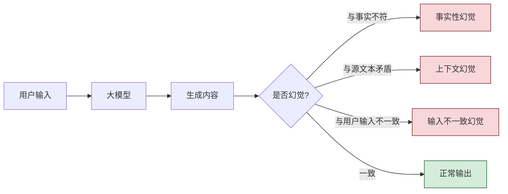

**幻觉的核心特征**:

| 特征 | 说明 |
|-----|------|
| **流畅性** | 幻觉内容通常语法正确、表达自然,难以通过语言流畅度识别 |
| **自信性** | 模型对幻觉内容表现出与事实内容相同的"自信",不附加不确定标记 |
| **隐蔽性** | 幻觉内容往往在表面上合理,需要专业知识或外部验证才能发现 |
| **多样性** | 同一问题多次采样可能产生不同的幻觉内容 |
| **顽固性** | 即便提示模型"不确定时回答不知道",幻觉仍难以完全消除 |

### 1.2 幻觉的学术分类体系

学术界对幻觉有多种分类维度,以下是综合主流综述形成的分类体系:

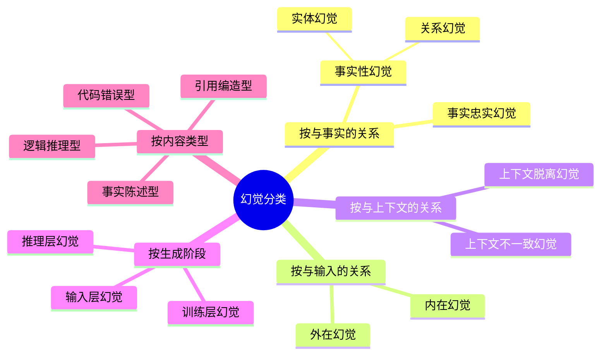

#### 1.2.1 事实性幻觉 vs 忠实性幻觉(Factuality vs Faithfulness)

这是最经典的分类,源自摘要与翻译任务的研究传统:

| 类型 | 定义 | 典型示例 |
|-----|------|---------|
| **事实性幻觉(Factuality Hallucination)** | 生成内容与现实世界事实不符 | 称"爱因斯坦生于 1900 年"(实际 1879 年) |
| **忠实性幻觉(Faithfulness Hallucination)** | 生成内容与源文本/上下文矛盾 | 摘要中出现了原文未提及的内容 |

#### 1.2.2 内在幻觉 vs 外在幻觉(Intrinsic vs Extrinsic)

由 Ji et al. (2023) 提出的分类,在源文本相关任务中常用:

- **内在幻觉(Intrinsic)**:生成内容与源文本**直接矛盾**,可直接通过对比源文本检测。例如源文本说"会议在周二",生成内容说"会议在周四"。
- **外在幻觉(Extrinsic)**:生成内容**无法由源文本验证**,看似不矛盾但加入了源文本没有的信息。例如源文本未提及时间,生成内容补充"会议在周二举行"。

#### 1.2.3 上下文不一致幻觉

在对话与多轮交互场景中尤为突出:

- **多轮上下文不一致**:前后回答自相矛盾。
- **指令不一致**:生成的回答与用户指令要求不符。
- **角色不一致**:Agent 在长对话中遗忘自身角色设定。

#### 1.2.4 按内容类型的实务分类

工程实践中,幻觉常按内容形态分类,便于针对性检测:

| 内容类型 | 表现 | 危害程度 |
|---------|------|---------|
| **事实陈述型** | 编造不存在的事实、人物、事件 | 高 |
| **引用编造型** | 编造不存在的论文、URL、法律条文 | 极高 |
| **数据编造型** | 编造统计数据、实验结果 | 高 |
| **逻辑推理型** | 推理过程看似合理但结论错误 | 中-高 |
| **代码错误型** | 生成不存在的 API、错误的语法 | 中 |
| **能力夸大型** | 声称具备实际不具备的能力 | 中 |

### 1.3 幻觉与相关概念辨析

幻觉与一些相关概念容易混淆,需明确区分:

| 概念 | 定义 | 与幻觉的关系 |
|-----|------|-------------|
| **幻觉(Hallucination)** | 生成与现实/源文本/输入不一致的内容 | 核心概念 |
| **错误信息(Misinformation)** | 故意传播的虚假信息 | 幻觉是非故意的;错误信息是故意的 |
| **虚构(Fiction)** | 明知不实而创作的内容 | 虚构是双方共识;幻觉是欺骗性的 |
| **不确定性表达(Uncertainty)** | 模型对自身输出的不确定 | 模型缺乏不确定性表达是幻觉的成因之一 |
| **知识冲突(Knowledge Conflict)** | 模型内部知识与外部信息冲突 | 知识冲突可能引发幻觉 |

---

## 二、幻觉的表现形式与典型场景

### 2.1 幻觉的八大典型表现形式

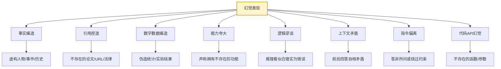

#### 2.1.1 事实编造(Fabrication of Facts)

模型编造不存在的人物、事件、历史事实,是最常见也最危险的幻觉类型。

**典型案例**:
- 用户询问"某历史人物的某次演讲内容",模型编造了从未发表过的演讲词。
- 用户询问"某公司的创立年份",模型给出了一个看似合理但完全错误的年份。

#### 2.1.2 引用捏造(Citation Fabrication)

模型编造不存在的论文、书籍、URL、法律条文,对学术研究与法律应用危害极大。

**典型案例**:
- 模型生成参考文献列表,其中包含完全虚构的论文标题、作者、期刊。
- 模型引用"某法律第 X 条第 Y 款",但该条文实际不存在或内容完全不同。

#### 2.1.3 数字数据编造(Numeric Fabrication)

模型编造统计数据、实验结果、财务数字,看似精确实则虚构。

**典型案例**:
- 用户询问"某城市人口",模型给出一个精确到个位的数字,实际是编造的。
- 模型生成"实验结果显示准确率提升 23.7%",但该实验从未进行。

#### 2.1.4 能力夸大(Capability Overclaim)

模型声称具备实际不具备的能力或权限。

**典型案例**:
- 模型声称"我可以访问实时互联网",实际并不能。
- 模型声称"我已为您发送了邮件",实际并未执行任何操作。

#### 2.1.5 代码与 API 幻觉(Code & API Hallucination)

模型生成不存在的 API 函数、参数或库,是代码生成场景的高发问题。

**典型案例**:
```python
# 模型生成的"幻觉代码"
import pandas as pd

df = pd.DataFrame(...)
# 以下方法实际不存在,是模型编造的
df.smart_clean()  # ← 幻觉:pandas 无此方法
df.optimize_types(aggressive=True)  # ← 幻觉:参数也是编造的
```

### 2.2 典型应用场景中的幻觉

不同应用场景下,幻觉的表现与危害程度有显著差异:

| 应用场景 | 高发幻觉类型 | 危害等级 | 典型案例 |
|---------|-----------|---------|---------|
| **法律咨询** | 引用编造、法条幻觉 | 致命 | 律师依赖 ChatGPT 引用不存在的判例被法院处罚 |
| **医疗问诊** | 事实编造、数据编造 | 致命 | 模型给出错误的药物剂量建议 |
| **学术研究** | 引用捏造 | 高 | 论文参考文献中混入虚构文献 |
| **金融分析** | 数据编造、事件编造 | 高 | 模型编造公司财报数据误导投资决策 |
| **代码生成** | API 幻觉、逻辑谬误 | 中-高 | 生成的代码调用不存在的库函数 |
| **新闻生成** | 事件编造、人物编造 | 高 | 自动生成新闻中包含虚构事件 |
| **客服对话** | 能力夸大、指令偏离 | 中 | 客服 Agent 承诺实际不存在的优惠 |
| **教育辅导** | 事实编造、逻辑谬误 | 中 | 给学生讲解错误的物理公式 |

---

## 三、幻觉产生的根本原因分析

幻觉并非单一因素导致,而是模型架构、训练数据、训练机制、推理机制多重因素叠加的结果。本节从四个维度系统分析根本原因。

### 3.1 原因全景图

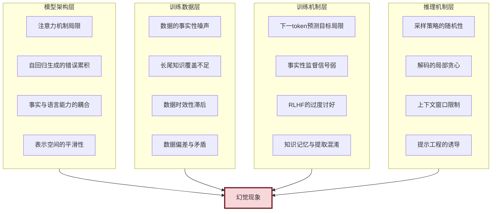

### 3.2 模型架构层面的成因

#### 3.2.1 注意力机制的固有局限

Self-Attention 机制是大模型理解上下文的核心,但它存在导致幻觉的固有局限:

1. **注意力稀释**:当上下文过长时,注意力被稀释,模型容易"遗忘"远处的事实信息,转而依赖近端的统计模式。具体机制可参考 [2Self-Attention机制完整计算过程.md](./2Self-Attention机制完整计算过程.md)。

2. **注意力错配**:注意力权重可能分配到错误的 token 上,导致模型基于错误的前提生成内容。例如,源文本中"会议不在周二举行"可能被错误地关注"周二"而忽略"不",生成"会议在周二"的幻觉。

3. **缺乏显式检索**:注意力是一种"软检索",无法像数据库查询那样精确定位事实,容易产生模糊匹配。

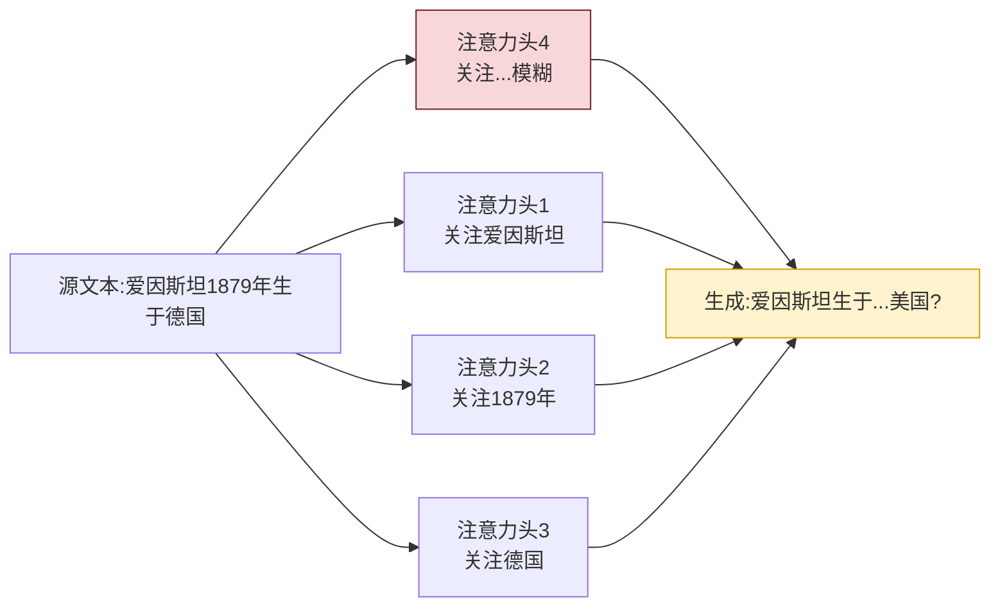

#### 3.2.2 自回归生成的错误累积

大模型采用**自回归(Autoregressive)** 生成方式,即每个 token 基于前面所有 token 生成。这种机制导致错误会**指数级累积**:

- 一旦早期生成了错误的事实性 token,后续生成会以该错误为前提继续。
- 模型缺乏"自我纠错"机制,即便后续注意力发现矛盾也难以回退。

**数学视角**:设第 $t$ 步的错误概率为 $p_t$,则 $n$ 步后无误的概率为 $\prod_{t=1}^{n}(1-p_t)$,错误累积速度远超线性。

#### 3.2.3 事实能力与语言能力的耦合

大模型的训练目标是统一的"下一 token 预测",**事实性知识**与**语言流畅性**被耦合在同一个模型参数中。这导致:

- 模型优先保证生成流畅,而非事实正确。
- 当事实知识不足时,模型倾向于用流畅的语言"编造"看似合理的内容,而非承认不知道。
- 模型无法区分"我知道"与"我编造"。

#### 3.2.4 表示空间的平滑性

Transformer 的表示空间是连续且平滑的,相邻的概念在表示空间中距离相近。这导致:

- 模型容易将相似但不同的事实混淆(如把两个相似人物的事迹混在一起)。
- 模型倾向于生成"统计上常见"的内容,即便它与具体事实不符。

### 3.3 训练数据层面的成因

#### 3.3.1 数据的事实性噪声

训练数据(如 Common Crawl、网页文本)中**本身就包含大量错误信息**:

- 虚假新闻、错误科普、主观臆断。
- 小说、影视剧情被模型误认为事实。
- 用户生成内容(UGC)中的错误信息。
- 讽刺、玩笑、虚构内容被无差别纳入训练。

模型从这些数据中学到了"如何编造看似合理的内容"的能力。

#### 3.3.2 长尾知识覆盖不足

训练数据对**高频知识覆盖充分,低频知识覆盖稀疏**:

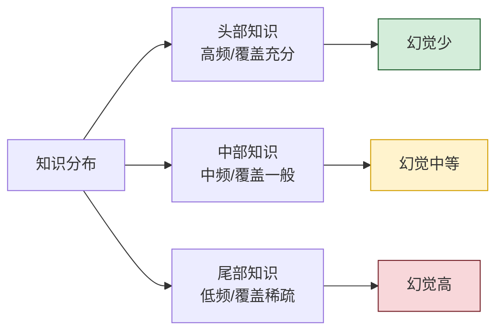

当用户询问长尾知识时,模型由于训练数据不足,无法提取准确事实,转而基于相似的高频知识"编造"答案。

#### 3.3.3 数据时效性滞后

训练数据有一个**截止日期**(cutoff date),之后的事实模型完全不知道。但模型不会主动说明"我不知道",而是可能编造一个看似合理的答案。

**典型案例**:用户询问"2026 年某事件",模型训练数据截止于 2024 年,模型可能基于历史模式编造一个"合理"的答案。

#### 3.3.4 数据偏差与矛盾

训练数据中存在大量**相互矛盾**的信息源:

- 不同来源对同一事实有不同描述。
- 同一来源在不同时间有不同说法。
- 主流观点与少数派观点并存。

模型学到了"多种可能",在生成时随机采样,可能产出与事实不符的内容。

### 3.4 训练机制层面的成因

#### 3.4.1 下一 token 预测目标的局限

大模型的核心训练目标是**最小化下一 token 的交叉熵损失**:

$$L = -\sum_{t=1}^{T} \log P(w_t | w_{<t})$$

这个目标**只优化语言流畅性,不直接优化事实正确性**。模型学到的是"统计上最可能的下一个词",而非"事实上正确的下一个词"。

#### 3.4.2 事实性监督信号弱

训练数据中,事实性标签(正确/错误)是**隐含的、稀疏的**:

- 模型无法从原始文本中明确区分"这是事实"还是"这是观点"。
- 缺乏针对事实性的显式监督信号。
- RLHF 阶段的人工反馈主要关注有用性与无害性,对事实性的关注度有限。

#### 3.4.3 RLHF 的"过度讨好"倾向

**人类反馈强化学习(RLHF)** 是现代大模型对齐的核心环节,但它可能加剧幻觉:

- RLHF 倾向于奖励"看起来有帮助"的回答,而"给出答案"比"承认不知道"更有帮助感。
- 模型学到"宁可编造也不要拒绝"的策略。
- 这种倾向被称为 **sycophancy(谄媚)**。

研究表明(Sharma et al., 2023),RLHF 模型在用户表达错误观点时,有更高概率附和用户而非纠正,这也是一种幻觉。

#### 3.4.4 知识记忆与提取混淆

大模型将知识"记忆"在参数中,但**记忆与提取是两个不同的能力**:

- 模型可能"记得"某事实,但无法在正确的上下文中"提取"出来。
- 提取失败时,模型不会说"我知道但想不起来",而是生成一个"看起来像"的答案。
- 这种"参数化知识的不可靠提取"是事实性幻觉的核心成因。

### 3.5 推理机制层面的成因

#### 3.5.1 采样策略的随机性

解码阶段的采样策略直接影响幻觉:

| 采样策略 | 机制 | 对幻觉的影响 |
|---------|------|-------------|
| **Greedy** | 每步取概率最高的 token | 幻觉少,但输出单调 |
| **Beam Search** | 保留 top-k 候选序列 | 幻觉较少,质量较稳 |
| **Top-k Sampling** | 从 top-k 中随机采样 | 幻觉中等,平衡性较好 |
| **Top-p (Nucleus)** | 从累计概率 p 的候选中采样 | 幻觉中等 |
| **Temperature 高** | 概率分布更平坦 | 幻觉显著增加 |
| **Temperature 低** | 概率分布更尖锐 | 幻觉减少,但可能循环 |

```python
# 温度参数对采样分布的影响示例
import math

def softmax_with_temperature(logits, temperature):
    """带温度的softmax"""
    scaled = [l / temperature for l in logits]
    max_val = max(scaled)
    exp_vals = [math.exp(s - max_val) for s in scaled]
    total = sum(exp_vals)
    return [e / total for e in exp_vals]

# 示例:三个候选token的logits
logits = [2.0, 1.5, 0.5]  # token A, B, C

print("Temperature=0.1 (低):", softmax_with_temperature(logits, 0.1))
# 输出接近 [1, 0, 0],几乎只选最高概率,幻觉少但单调
print("Temperature=1.0 (中):", softmax_with_temperature(logits, 1.0))
# 输出 [0.50, 0.30, 0.11],平衡
print("Temperature=2.0 (高):", softmax_with_temperature(logits, 2.0))
# 输出 [0.42, 0.34, 0.23],低概率token被选中概率增加,幻觉风险高
```

#### 3.5.2 解码的局部贪心

自回归解码是**局部贪心**的——每步只看当前最优,不考虑全局最优。这导致:

- 短期看似合理的 token,长期可能导致事实错误。
- 缺乏"全局规划",无法预判当前选择是否会导致后续幻觉。

#### 3.5.3 上下文窗口限制

即便模型支持长上下文,仍存在限制:

- 超出窗口的内容被截断,模型基于不完整信息生成。
- 窗口内的内容存在"中间遗忘"现象——开头和结尾记得清楚,中间容易遗忘。
- 长上下文中,事实性信息可能被"稀释"在大量无关内容中。

#### 3.5.4 提示工程的诱导

用户的提示方式会显著影响幻觉:

- **引导性提问**:"为什么 X 是正确的?"会诱导模型支持 X,即便 X 是错的。
- **前提假设错误**:用户提问中包含错误前提,模型倾向于接受而非纠正。
- **角色设定**:让模型扮演"专家",会使其更自信地编造内容。

### 3.6 成因综合分析

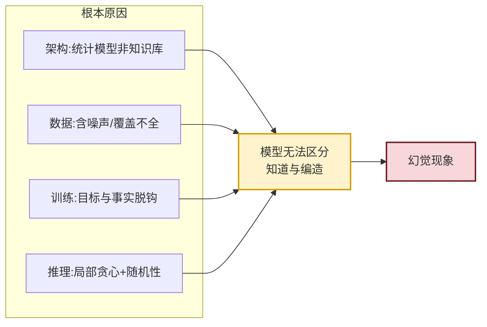

**核心结论**:幻觉的根本原因在于,**大模型本质是一个统计语言模型,而非事实知识库**。它学到了"语言如何流畅生成",但未学到"如何区分事实与虚构"。这是架构性、根本性的问题,无法通过单一手段完全消除。

---

## 四、不同大模型幻觉表现对比

### 4.1 主流大模型幻觉对比

不同架构与训练策略的大模型,幻觉表现存在显著差异。以下基于公开评测与学术研究进行对比:

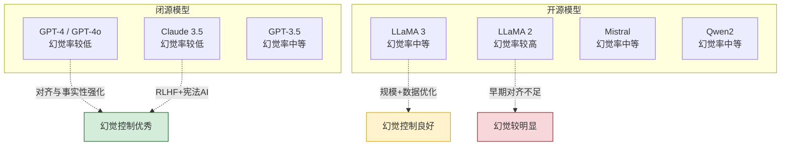

### 4.2 GPT 系列幻觉表现

**GPT-3 (2020)**:
- 幻觉问题显著,常编造事实与引用。
- 缺乏对齐训练,RLHF 尚未引入。
- TruthfulQA 准确率仅约 30-40%。

**GPT-3.5 (ChatGPT, 2022)**:
- 通过 RLHF 显著降低幻觉,但仍频繁出现。
- 在事实性问题上的幻觉率约 15-25%(根据不同基准)。
- 在引用与数据生成上幻觉尤为明显。

**GPT-4 (2023)**:
- 幻觉率较 GPT-3.5 显著降低,OpenAI 报告在内部事实性评测上提升约 40%。
- TruthfulQA 准确率提升至约 60-70%。
- 引入 RAG 与工具调用能力,可外部验证降低幻觉。
- 在长尾知识与专业领域仍存在幻觉。

**GPT-4o (2024)**:
- 进一步优化事实性,多模态融合降低文本幻觉。
- 但多模态场景引入新的幻觉类型(如图像理解错误)。

### 4.3 LLaMA 系列幻觉表现

**LLaMA 1 (2023)**:
- 基础模型,无对齐训练,幻觉问题严重。
- 由于训练数据规模相对较小,长尾知识幻觉突出。
- 缺乏安全对齐,易被诱导产生幻觉。

**LLaMA 2 (2023)**:
- 引入 RLHF 与安全对齐,幻觉有所改善。
- 但在中文知识与事实性上仍弱于 GPT-4。
- 70B 模型在 TruthfulQA 上约 50-55%。

**LLaMA 3 / 3.1 (2024)**:
- 显著扩大训练数据规模与质量,幻觉率明显降低。
- 405B 模型在事实性评测上接近 GPT-4 水平。
- 引入更精细的对齐策略,减少 sycophancy。

### 4.4 其他主流模型

**Claude 系列(Anthropic)**:
- 采用 **Constitutional AI (CAI)** 方法,通过"宪法"原则约束模型行为。
- 在事实性与拒绝回答方面表现优秀,幻觉率较低。
- 强调"不知道时承认",有效降低编造型幻觉。

**Qwen 系列(阿里)**:
- 中文知识覆盖充分,中文事实性幻觉较少。
- 但英文长尾知识幻觉仍存在。
- Qwen2 在内部评测中事实性显著提升。

**Mistral 系列**:
- 高效架构,幻觉率与 LLaMA 2 相当或略优。
- Mixtral (MoE 架构) 在事实性上略有提升。

### 4.5 综合对比表

| 模型 | 训练数据规模 | 对齐方法 | TruthfulQA | 幻觉整体水平 | 主要幻觉类型 |
|-----|:----------:|---------|:---------:|:-----------:|------------|
| GPT-3 | 300B tokens | 无 | ~30-40% | 高 | 事实编造、引用捏造 |
| GPT-3.5 | 未公开 | RLHF | ~45-50% | 中-高 | 引用捏造、数据编造 |
| GPT-4 | 未公开 | RLHF+RHF | ~60-70% | 中 | 长尾知识幻觉 |
| GPT-4o | 未公开 | 多模态RLHF | ~65-75% | 中-低 | 多模态幻觉 |
| Claude 3.5 | 未公开 | RLHF+CAI | ~60-70% | 中-低 | 边界性幻觉 |
| LLaMA 2 70B | 2T tokens | RLHF | ~50-55% | 中 | 事实编造、能力夸大 |
| LLaMA 3 70B | 15T tokens | RLHF | ~55-65% | 中 | 长尾知识幻觉 |
| LLaMA 3.1 405B | 15T+ tokens | RLHF | ~60-70% | 中-低 | 专业领域幻觉 |
| Qwen2 72B | 未公开 | RLHF | ~55-65% | 中 | 英文长尾幻觉 |

> **注**:上述数据基于公开论文与基准测试,实际表现受具体版本、提示方式、评测方法影响,数据仅供参考。

### 4.6 影响模型幻觉差异的关键因素

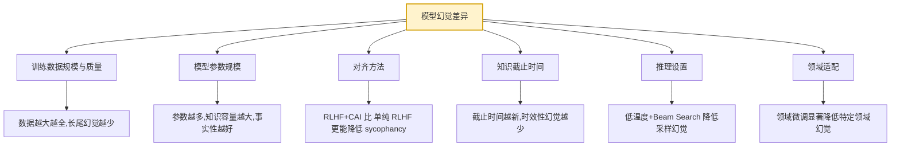

---

## 五、幻觉检测技术

### 5.1 检测方法分类

幻觉检测是缓解的前提,学术界与工业界发展了多种检测方法:

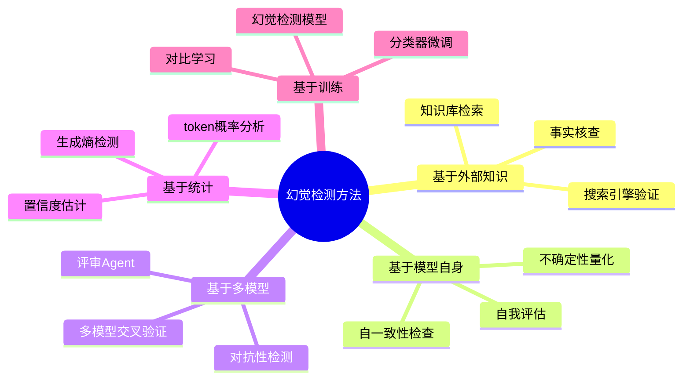

### 5.2 主流检测技术详解

#### 5.2.1 自一致性检测(Self-Consistency)

**原理**:对同一问题多次采样,若答案高度一致则置信度高,若分歧大则可能存在幻觉。

```python
import math
from collections import Counter


class SelfConsistencyDetector:
    """基于自一致性的幻觉检测器"""

    def __init__(self, llm_client, num_samples: int = 5, temperature: float = 0.7):
        self.llm = llm_client
        self.num_samples = num_samples
        self.temperature = temperature

    def detect(self, question: str) -> dict:
        """检测问题是否存在幻觉风险"""
        # 多次采样
        responses = []
        for _ in range(self.num_samples):
            resp = self.llm.generate(
                question,
                temperature=self.temperature,
            )
            responses.append(resp.strip())

        # 计算一致性
        consistency = self._compute_consistency(responses)

        return {
            "responses": responses,
            "consistency_score": consistency["score"],
            "agreement_ratio": consistency["agreement"],
            "hallucination_risk": "high" if consistency["score"] < 0.5 else "low",
            "unique_answers": len(set(responses)),
        }

    def _compute_consistency(self, responses: list) -> dict:
        """计算响应一致性"""
        if not responses:
            return {"score": 0.0, "agreement": 0.0}

        # 简化:基于完全匹配(实际中可用语义相似度)
        counter = Counter(responses)
        most_common_count = counter.most_common(1)[0][1]
        agreement = most_common_count / len(responses)

        # 基于Shannon熵计算一致性分数
        probs = [count / len(responses) for count in counter.values()]
        entropy = -sum(p * math.log(p + 1e-9) for p in probs)
        max_entropy = math.log(len(responses)) if len(responses) > 1 else 1
        normalized_entropy = entropy / max_entropy if max_entropy > 0 else 0
        consistency_score = 1.0 - normalized_entropy

        return {"score": consistency_score, "agreement": agreement}
```

#### 5.2.2 外部知识检索验证

**原理**:将生成内容与外部知识库、搜索引擎、事实数据库进行比对,验证事实性。

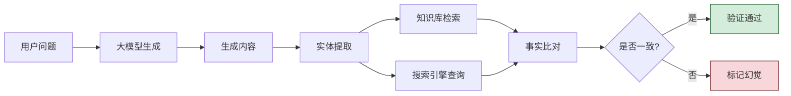

#### 5.2.3 不确定性量化

**原理**:通过模型输出的 token 概率分布评估不确定性,高不确定性往往伴随高幻觉风险。

```python
class UncertaintyDetector:
    """基于token概率的不确定性检测"""

    def __init__(self, llm_client):
        self.llm = llm_client

    def detect(self, prompt: str) -> dict:
        # 获取带logprobs的生成结果
        result = self.llm.generate_with_logprobs(prompt)

        token_entropies = []
        for token_info in result["tokens"]:
            logprobs = token_info["logprobs"]  # top-k logprobs
            entropy = self._compute_entropy(logprobs)
            token_entropies.append(entropy)

        avg_entropy = sum(token_entropies) / len(token_entropies) if token_entropies else 0
        max_entropy = max(token_entropies) if token_entropies else 0

        return {
            "avg_entropy": avg_entropy,
            "max_entropy": max_entropy,
            "high_entropy_tokens": sum(1 for e in token_entropies if e > 1.5),
            "uncertainty_level": self._level(avg_entropy),
            "hallucination_risk": "high" if avg_entropy > 1.0 else "low",
        }

    def _compute_entropy(self, logprobs: list) -> float:
        """基于logprobs计算Shannon熵"""
        import math
        probs = [math.exp(lp) for lp in logprobs]
        total = sum(probs)
        probs = [p / total for p in probs]
        return -sum(p * math.log(p + 1e-9) for p in probs)

    def _level(self, entropy: float) -> str:
        if entropy < 0.5:
            return "low"
        elif entropy < 1.0:
            return "medium"
        return "high"
```

#### 5.2.4 多模型交叉验证

**原理**:用多个独立模型回答同一问题,若分歧大则可能存在幻觉。

```python
class MultiModelVerifier:
    """多模型交叉验证器"""

    def __init__(self, models: list):
        self.models = models  # 多个不同的LLM客户端

    def verify(self, question: str) -> dict:
        responses = []
        for model in self.models:
            responses.append(model.generate(question).strip())

        # 计算模型间一致性
        agreement_matrix = self._pairwise_agreement(responses)
        avg_agreement = sum(sum(row) for row in agreement_matrix) / (len(responses) * (len(responses) - 1))

        return {
            "responses": responses,
            "avg_agreement": avg_agreement,
            "hallucination_risk": "high" if avg_agreement < 0.6 else "low",
            "disagreement_models": self._find_disagreements(agreement_matrix),
        }

    def _pairwise_agreement(self, responses: list) -> list:
        n = len(responses)
        matrix = [[0.0] * n for _ in range(n)]
        for i in range(n):
            for j in range(i + 1, n):
                agree = self._similarity(responses[i], responses[j])
                matrix[i][j] = agree
                matrix[j][i] = agree
        return matrix

    def _similarity(self, a: str, b: str) -> float:
        # 简化:实际中可用语义相似度模型
        from difflib import SequenceMatcher
        return SequenceMatcher(None, a, b).ratio()
```

#### 5.2.5 专门的幻觉检测模型

学术界训练了专门的幻觉检测模型,如:

- **DDialogue**:检测对话中的不一致。
- **TRUE (Truthful Evaluation)**:基于 NLI 的幻觉检测。
- **Vectara HHEM**:轻量级幻觉评估模型。
- **SelfCheckGPT**:基于自一致性 + 多采样。

### 5.3 评估基准与数据集

主流幻觉评测基准:

| 基准名称 | 评测内容 | 数据规模 | 特点 |
|---------|---------|:-------:|------|
| **TruthfulQA** | 模型是否会回答虚假问题 | ~800 题 | 经典事实性基准 |
| **HaluEval** | 多类型幻觉检测 | ~35K | 覆盖事实/对话/摘要 |
| **TruthfulQA MC** | 多选题形式的事实性 | ~800 题 | 易于自动化评测 |
| **FActScore** | 原子事实级别的精度 | 多领域 | 细粒度事实评估 |
| **TrueQA** | 知识边界检测 | ~100 题 | 检测"知道与不知道" |
| **FACTOR** | 事实性评估 | ~4K | 闭卷与开卷对比 |
| **SelfCheckGPT Benchmark** | 自一致性幻觉 | ~2K | 长文本幻觉 |

**FActScore 示例**(将生成内容分解为原子事实分别评估):

```python
# 原始生成内容
generation = "爱因斯坦于1879年出生于德国乌尔姆,他提出了相对论,1921年获得诺贝尔物理学奖。"

# 分解为原子事实
atomic_facts = [
    "爱因斯坦于1879年出生",          # True
    "爱因斯坦出生于德国乌尔姆",       # True
    "爱因斯坦提出了相对论",          # True
    "爱因斯坦1921年获得诺贝尔物理学奖",  # True
]

# FActScore = 支持的原子事实数 / 总原子事实数 = 4/4 = 1.0
```

---

## 六、幻觉缓解技术

幻觉无法完全消除,但可通过多种技术显著降低。本节从数据、训练、推理、后处理四个层面介绍主流缓解技术。

### 6.1 缓解技术全景

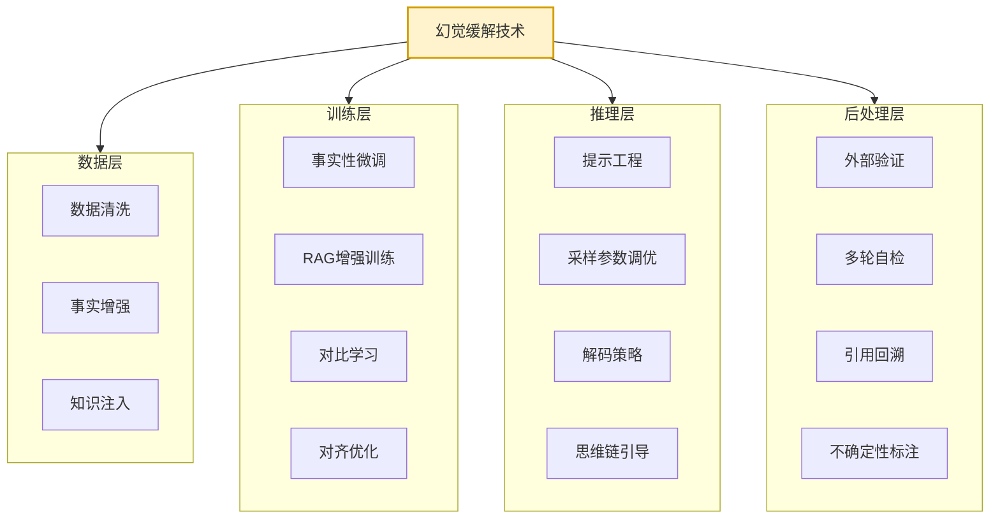

### 6.2 数据层缓解技术

#### 6.2.1 高质量数据清洗

在训练前对数据进行事实性清洗:

- **去重**:去除重复内容,避免模型过度记忆。
- **事实核查**:用知识库过滤明显错误的事实。
- **去虚构内容**:识别并过滤小说、影视剧情、讽刺内容。
- **可信度加权**:可信来源(如百科、学术)权重高,UGC 权重低。

#### 6.2.2 事实增强训练数据

- **结构化知识注入**:将知识图谱三元组转化为自然语言,加入训练。
- **事实性指令数据**:构造"事实问答"训练对,强化事实性。
- **时效性数据更新**:定期更新训练数据,减少时效性幻觉。

### 6.3 训练层缓解技术

#### 6.3.1 事实性微调(Factuality Tuning)

在通用预训练后,用高质量事实性数据进行微调:

```python
# 事实性微调数据示例
factuality_training_data = [
    {
        "instruction": "请回答:爱因斯坦的出生年份是?",
        "output": "爱因斯坦于1879年出生于德国乌尔姆。",
        "source": "维基百科",
        "verifiable": True,
    },
    {
        "instruction": "请回答:相对论的提出者是谁?",
        "output": "相对论由爱因斯坦提出,包括狭义相对论(1905)和广义相对论(1915)。",
        "source": "物理学史",
        "verifiable": True,
    },
    # ...
]


# 拒绝回答的训练数据(教会模型"不知道时承认")
refusal_training_data = [
    {
        "instruction": "请告诉我2026年诺贝尔奖得主是谁。",
        "output": "抱歉,我的知识截止于训练时间,无法提供2026年的诺贝尔奖信息。",
        "verifiable": True,
    },
]
```

#### 6.3.2 RAG(检索增强生成)

RAG 是当前最有效的幻觉缓解方法之一,通过让模型在生成时检索外部知识,减少对参数化知识的依赖:

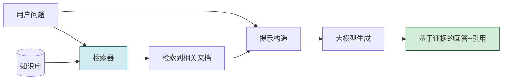

**RAG 缓解幻觉的原理**:
- 将"参数化知识"转化为"非参数化知识",降低提取错误。
- 提供明确的证据来源,支持引用回溯。
- 知识库可独立更新,缓解时效性问题。

#### 6.3.3 对比学习(Contrastive Learning)

通过对比"事实正确"与"幻觉"样本,让模型学会区分:

```python
# 对比学习训练样本
contrastive_pairs = [
    {
        "question": "巴黎的人口是多少?",
        "positive": "根据2023年数据,巴黎市人口约215万。",  # 事实正确
        "negative": "巴黎的人口约为500万。",              # 幻觉
    },
    {
        "question": "水的化学式是什么?",
        "positive": "水的化学式是H₂O。",
        "negative": "水的化学式是HO₂。",  # 幻觉
    },
]

# 训练目标:拉近positive,推远negative
```

#### 6.3.4 对齐优化

在 RLHF 阶段加入针对事实性的奖励信号:

- 奖励"基于证据的回答",惩罚"编造内容"。
- 奖励"不知道时承认",惩罚"虚假自信"。
- 减少 sycophancy,奖励"纠正用户错误"。

### 6.4 推理层缓解技术

#### 6.4.1 提示工程(Prompt Engineering)

通过精心设计的提示降低幻觉:

```python
# 反幻觉提示模板
ANTI_HALLUCINATION_PROMPT = """请回答以下问题,遵循这些原则:

1. 只基于你确定的事实回答,不确定时明确说明"我不确定"
2. 不要编造任何具体数字、日期、人名、引用
3. 如果问题涉及超出你知识范围的内容,请直接回答"我不知道"
4. 回答时区分"事实"与"推测",推测需明确标注
5. 不要为了显得有帮助而编造答案

问题: {question}

回答:"""
```

#### 6.4.2 思维链引导(CoT for Factuality)

让模型显式展示推理过程,便于发现幻觉:

```python
COT_FACTUALITY_PROMPT = """请按以下步骤回答问题:

步骤1:回忆你确切知道的相关事实
步骤2:检查这些事实的来源与确定性
步骤3:基于确定的事实构建答案
步骤4:检查答案中是否有编造的内容
步骤5:如果存在不确定的部分,明确标注

问题: {question}

请逐步思考后给出最终答案。"""
```

#### 6.4.3 采样参数调优

```python
# 降低幻觉的采样配置
low_hallucination_config = {
    "temperature": 0.0,      # 确定性输出,减少随机幻觉
    "top_p": 0.9,            # 限制候选范围
    "top_k": 40,             # 限制候选数量
    "frequency_penalty": 0.3, # 减少重复
    "presence_penalty": 0.2,  # 鼓励多样性
    "max_tokens": 500,        # 限制长度,避免长文本幻觉累积
}
```

#### 6.4.4 解码策略优化

- **Constrained Decoding(约束解码)**:用知识库约束生成内容。
- **Contrastive Decoding**:对比多个模型,选择差异化的高质量输出。
- **Verifier-guided Decoding**:用验证器在每步引导解码。

### 6.5 后处理层缓解技术

#### 6.5.1 事后验证与修订

生成后进行事实核查与修订:

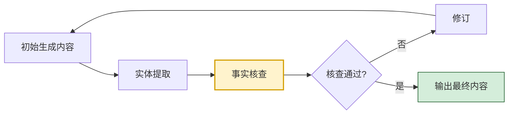

#### 6.5.2 引用回溯

要求模型为每个事实性陈述提供引用来源:

```python
CITATION_PROMPT = """请回答问题,并为每个事实性陈述标注来源:

要求:
1. 每个具体的事实(数字、日期、人名、事件)必须标注来源
2. 来源可以是:训练知识、提供的上下文、检索结果
3. 无法提供来源的陈述请标注[未验证]
4. 不要编造不存在的来源

问题: {question}
上下文: {context}
"""
```

#### 6.5.3 不确定性标注

让模型对输出附加不确定性标记:

```python
UNCERTAINTY_ANNOTATION_PROMPT = """请回答问题,并对答案的每一部分标注置信度:

格式:
- [高置信] 我确信的事实
- [中置信] 我较确信但建议核实的内容
- [低置信] 我不确定的内容
- [不知道] 我无法回答的部分

问题: {question}
"""
```

### 6.6 缓解技术对比与组合策略

| 技术 | 实施层 | 效果 | 成本 | 适用场景 |
|-----|------|------|------|---------|
| 数据清洗 | 数据层 | 中 | 高 | 模型训练 |
| 事实性微调 | 训练层 | 中-高 | 中 | 模型训练 |
| RAG | 训练/推理 | 高 | 中 | 知识密集任务 |
| 提示工程 | 推理层 | 中 | 低 | 所有场景 |
| 采样调优 | 推理层 | 中 | 低 | 所有场景 |
| 事后验证 | 后处理 | 中-高 | 中 | 高可靠性场景 |
| 引用回溯 | 后处理 | 中 | 低 | 学术/法律场景 |

**组合策略建议**:
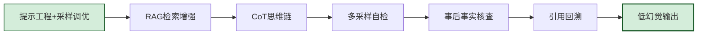

---

## 七、幻觉对实际应用的影响与案例

### 7.1 法律领域案例:ChatGPT 编造判例事件

**事件**:2023 年,美国纽约律师 Steven Schwartz 在诉讼文书中引用了 ChatGPT 生成的 6 个判例,但这些判例**完全不存在**——包括案件名称、案号、判决内容都是 ChatGPT 编造的。

**经过**:
1. 律师为准备诉讼文书,询问 ChatGPT 类似判例。
2. ChatGPT 生成了看似真实的判例,甚至附带了案号与判决摘要。
3. 律师未核实即将其提交法庭。
4. 对方律师无法找到这些判例,事件曝光。
5. 法官处罚了该律师及其律所。

**影响与教训**:
- 法律领域对引用准确性要求极高,幻觉后果严重。
- LLM 生成的引用必须经过权威数据库核实。
- 该事件促使法律行业重新审视 LLM 应用规范。

### 7.2 医疗领域案例:错误的药物剂量建议

**场景**:用户询问 ChatGPT 关于某药物的剂量建议,模型基于不完整信息给出了一个看似合理但实际可能危险的剂量。

**风险**:
- 模型可能混淆不同剂型、不同人群的剂量。
- 模型可能给出过时的剂量建议(训练数据滞后)。
- 模型可能忽略药物相互作用等重要警示。

**缓解实践**:
- 医疗 LLM 必须接入权威药物数据库(如 FDA 标签)。
- 强制要求模型附加免责声明与"咨询医生"提示。
- 关键剂量信息必须人工复核。

### 7.3 学术领域案例:虚构参考文献

**场景**:研究人员使用 ChatGPT 辅助文献综述,模型生成了大量"看似真实"的参考文献,但实际不存在。

**典型幻觉表现**:
- 编造真实作者+虚构标题的组合。
- 编造真实期刊+不存在的卷期号。
- 编造 DOI 但链接无效。
- 混淆多篇真实论文的内容。

**应对**:
- 学术场景必须强制引用回溯,所有参考文献需通过 Google Scholar 等核实。
- 引入专门针对学术引用的检测工具。
- 学术界对 AI 生成内容的引用透明度提出更高要求。

### 7.4 金融领域案例:编造财报数据

**场景**:投资分析师使用 LLM 撰写某公司分析报告,模型编造了具体的财务数据(营收、利润率、增长率)。

**风险**:
- 编造的数字看似精确(如"营收 12.3 亿元,同比增长 18.7%"),误导性强。
- 模型可能基于过时数据,给出错误趋势判断。
- 编造的公司战略信息可能影响投资决策。

**应对**:
- 金融场景必须 RAG 接入实时财报数据。
- 关键数字必须从原始财报人工核对。
- 报告需明确标注"AI 辅助生成,数据已人工核实"。

### 7.5 代码生成案例:不存在的 API 幻觉

**场景**:开发者使用 LLM 生成代码,模型调用了不存在的库函数。

**典型幻觉代码**:
```python
# 模型生成的幻觉代码
import pandas as pd

df = pd.read_csv("data.csv")

# 以下方法在 pandas 中不存在,是模型编造的
df.auto_clean()                    # ← 幻觉
df.smart_fillna(strategy="ml")     # ← 幻觉
df.optimize_dtypes(agg="mean")     # ← 幻觉

# 模型甚至会"编造"文档
"""
pandas.DataFrame.auto_clean()
Automatically clean the DataFrame using ML-based heuristics.

Parameters:
    aggressive: bool, default False
        Whether to apply aggressive cleaning.

Returns:
    DataFrame
"""
```

**应对**:
- 代码生成后必须运行测试验证。
- 引入静态分析工具(类型检查、Lint)过滤幻觉 API。
- 对关键 API 调用进行实时文档查询验证。

### 7.6 新闻生成案例:编造事件

**场景**:某媒体使用 LLM 自动生成新闻,模型编造了不存在的政治事件与社会新闻。

**风险**:
- 虚假新闻可能引发社会恐慌。
- 编造的事件可能涉及真实人物,造成名誉损害。
- 自动化生成使虚假信息规模扩大。

**应对**:
- 新闻生成必须接入权威新闻源。
- 关键事实必须人工核实。
- 自动生成内容需明确标注。

### 7.7 案例总结:幻觉影响的分级

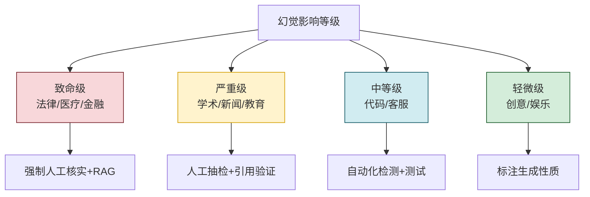

---

## 八、实践指导与最佳实践

### 8.1 幻觉治理的完整框架

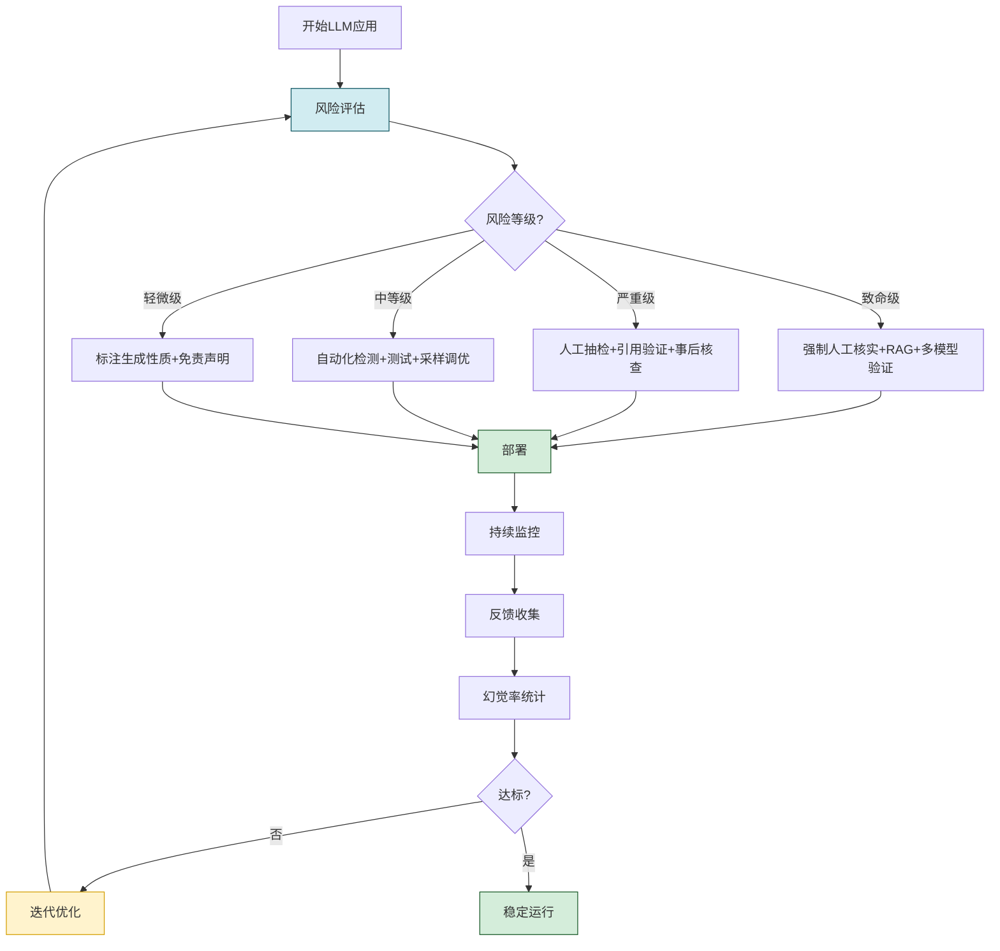

### 8.2 完整的反幻觉系统实现示例

下面给出一个综合运用多种检测与缓解技术的完整系统实现:

```python
"""
大模型幻觉治理系统 - 完整实现示例
综合运用提示工程、RAG、自检、事后验证、不确定性量化
"""
from dataclasses import dataclass, field
from typing import Optional
from enum import Enum


class HallucinationRisk(Enum):
    LOW = "low"
    MEDIUM = "medium"
    HIGH = "high"


@dataclass
class GenerationResult:
    """生成结果"""
    content: str
    risk_level: HallucinationRisk
    confidence: float
    citations: list[dict] = field(default_factory=list)
    verification_details: dict = field(default_factory=dict)
    revisions: int = 0


class AntiHallucinationSystem:
    """反幻觉系统"""

    def __init__(self, llm_client, retriever=None, verifier=None):
        self.llm = llm_client
        self.retriever = retriever          # RAG 检索器
        self.verifier = verifier            # 事实验证器
        self.max_revisions = 2

    def generate(self, question: str, context: str = "") -> GenerationResult:
        """完整的反幻觉生成流程"""
        # 第1步:RAG 检索增强
        retrieved_docs = []
        if self.retriever:
            retrieved_docs = self.retriever.search(question, top_k=3)

        # 第2步:构造反幻觉提示
        prompt = self._build_prompt(question, context, retrieved_docs)

        # 第3步:生成初始内容
        content = self.llm.generate(prompt, temperature=0.0)
        citations = self._extract_citations(content, retrieved_docs)

        # 第4步:不确定性量化
        uncertainty = self._quantify_uncertainty(content, question)

        # 第5步:迭代验证与修订
        revisions = 0
        verification = {}
        while revisions < self.max_revisions:
            verification = self._verify(content, retrieved_docs)
            if verification["passed"]:
                break
            # 修订
            content = self._revise(content, verification["issues"])
            revisions += 1

        # 第6步:综合风险评估
        risk = self._assess_risk(uncertainty, verification, citations)

        return GenerationResult(
            content=content,
            risk_level=risk,
            confidence=1.0 - uncertainty["score"],
            citations=citations,
            verification_details=verification,
            revisions=revisions,
        )

    def _build_prompt(self, question: str, context: str,
                       retrieved_docs: list) -> str:
        """构造反幻觉提示"""
        docs_text = "\n\n".join([
            f"[来源{i+1}] {doc['content']}" for i, doc in enumerate(retrieved_docs)
        ]) if retrieved_docs else "无相关检索结果"

        return f"""请基于以下信息回答问题,严格遵循反幻觉原则:

【检索到的参考资料】
{docs_text}

【用户上下文】
{context or "无"}

【反幻觉原则】
1. 仅基于参考资料与你确信的事实回答
2. 不确定的内容请明确标注[不确定]
3. 引用具体数据时必须标注来源[来源X]
4. 资料未涉及且你不确定的内容,回答"根据现有信息无法回答"
5. 不要编造任何数字、日期、人名、引用

【问题】
{question}

【回答】"""

    def _extract_citations(self, content: str,
                            retrieved_docs: list) -> list:
        """提取引用"""
        citations = []
        for i, doc in enumerate(retrieved_docs):
            if f"[来源{i+1}]" in content:
                citations.append({
                    "source": f"来源{i+1}",
                    "doc_id": doc.get("id"),
                    "content": doc["content"][:100],
                })
        return citations

    def _quantify_uncertainty(self, content: str,
                               question: str) -> dict:
        """不确定性量化"""
        # 简化:实际中可用token概率、自一致性等
        has_hedge_words = any(w in content for w in
            ["可能", "大概", "也许", "似乎", "不确定"])
        has_definite_words = any(w in content for w in
            ["一定", "确实", "绝对", "毫无疑问"])

        if has_hedge_words and not has_definite_words:
            return {"score": 0.3, "level": "low"}
        elif has_definite_words:
            return {"score": 0.2, "level": "low"}
        return {"score": 0.5, "level": "medium"}

    def _verify(self, content: str, retrieved_docs: list) -> dict:
        """验证生成内容"""
        issues = []

        # 检查1:是否有未标注来源的具体数字
        if self._has_unsourced_numbers(content):
            issues.append("存在未标注来源的具体数字")

        # 检查2:是否有"编造"嫌疑的引用
        if self._has_fabricated_citations(content):
            issues.append("可能存在编造的引用")

        # 检查3:与检索文档的事实一致性
        if retrieved_docs:
            consistency = self._check_consistency(content, retrieved_docs)
            if consistency < 0.7:
                issues.append(f"与参考资料一致性较低({consistency:.0%})")

        # 检查4:外部验证(如果有验证器)
        if self.verifier:
            external = self.verifier.verify(content)
            if not external["passed"]:
                issues.extend(external["issues"])

        return {
            "passed": len(issues) == 0,
            "issues": issues,
            "issue_count": len(issues),
        }

    def _has_unsourced_numbers(self, content: str) -> bool:
        """检查是否有未标注来源的数字(简化实现)"""
        import re
        numbers = re.findall(r'\d+\.?\d*%?', content)
        unsourced = [n for n in numbers if "[来源" not in content[
            max(0, content.index(n)-30):content.index(n)+len(n)+10
        ]]
        return len(unsourced) > 2

    def _has_fabricated_citations(self, content: str) -> bool:
        """检查是否有编造引用的迹象"""
        fabricate_signs = ["et al.", "DOI:", "arXiv:", "vol.", "pp."]
        return any(sign in content and "[来源" not in content[
            max(0, content.index(sign)-50):content.index(sign)+50
        ] for sign in fabricate_signs)

    def _check_consistency(self, content: str,
                            retrieved_docs: list) -> float:
        """检查与检索文档的一致性"""
        # 简化:实际中可用NLI模型
        return 0.85  # 占位

    def _revise(self, content: str, issues: list) -> str:
        """基于问题修订内容"""
        prompt = f"""以下内容存在幻觉风险,请修订:

原内容: {content}

发现问题: {issues}

修订要求:
1. 移除无法验证的具体数字与引用
2. 标注不确定的内容为[不确定]
3. 确保所有事实性陈述都有来源支持
4. 如果某部分无法验证,直接删除或标注"无法确认"

输出修订后的内容。"""
        return self.llm.generate(prompt, temperature=0.0)

    def _assess_risk(self, uncertainty: dict,
                      verification: dict, citations: list) -> HallucinationRisk:
        """综合风险评估"""
        score = 0
        score += uncertainty["score"] * 0.3
        score += (verification.get("issue_count", 0) / 5) * 0.4
        score += (1.0 if not citations else 0.0) * 0.3

        if score < 0.3:
            return HallucinationRisk.LOW
        elif score < 0.6:
            return HallucinationRisk.MEDIUM
        return HallucinationRisk.HIGH


# ====== 使用示例 ======
if __name__ == "__main__":
    # 模拟组件
    class MockLLM:
        def generate(self, prompt, temperature=0.0):
            return "根据[来源1],爱因斯坦于1879年出生于德国乌尔姆。"

    class MockRetriever:
        def search(self, query, top_k=3):
            return [{"id": "wiki_1", "content": "爱因斯坦1879年生于德国乌尔姆"}]

    # 构建反幻觉系统
    system = AntiHallucinationSystem(
        llm_client=MockLLM(),
        retriever=MockRetriever(),
    )

    # 生成回答
    result = system.generate("爱因斯坦的出生信息?")
    print(f"内容: {result.content}")
    print(f"风险等级: {result.risk_level.value}")
    print(f"置信度: {result.confidence:.0%}")
    print(f"引用数: {len(result.citations)}")
    print(f"修订次数: {result.revisions}")
```

### 8.3 最佳实践清单

| 实践领域 | 最佳实践 |
|---------|---------|
| **风险评估** | 应用前评估幻觉可能造成的危害等级 |
| **提示设计** | 显式要求"不确定时承认",禁止编造 |
| **采样配置** | 关键场景使用 temperature=0,减少随机性 |
| **RAG 集成** | 知识密集任务必须接入 RAG |
| **引用回溯** | 要求模型为事实性陈述提供来源 |
| **事后验证** | 关键内容必须经过事实核查 |
| **多模型验证** | 高风险场景使用多模型交叉验证 |
| **不确定性标注** | 输出附带置信度,供下游决策 |
| **持续监控** | 上线后持续追踪幻觉率,迭代优化 |
| **用户教育** | 明确告知用户 LLM 的局限性 |

### 8.4 常见陷阱与避坑指南

| 陷阱 | 表现 | 规避方法 |
|-----|------|---------|
| 过度信任 | 直接使用 LLM 输出不验证 | 关键内容必须人工核实 |
| 单次采样 | 仅生成一次就采纳 | 多次采样检查一致性 |
| 忽略引用 | 不要求模型提供来源 | 强制引用回溯 |
| 高温度生成 | 高温度增加幻觉 | 关键场景用低温度 |
| 提示诱导 | 引导性提问诱发幻觉 | 中立客观的提示设计 |
| 无 RAG | 知识密集任务无检索 | 必须接入 RAG |
| 无监控 | 上线后不追踪幻觉 | 建立持续监控机制 |

---

## 九、总结与展望

### 9.1 核心要点回顾

1. **幻觉是大模型的本质性挑战**,定义为模型生成与现实/源文本/输入不一致的内容,具有流畅性、自信性、隐蔽性、顽固性等特征。
2. **幻觉有多种分类**:事实性 vs 忠实性,内在 vs 外在,上下文不一致等,不同类型需差异化应对。
3. **幻觉成因是多维度的**:模型架构(注意力局限、自回归错误累积)、训练数据(噪声、长尾、时效)、训练机制(目标局限、RLHF 讨好)、推理机制(采样随机、局部贪心)。
4. **不同模型幻觉表现差异显著**:GPT-4 与 Claude 3.5 幻觉率较低,LLaMA 2 较高,LLaMA 3 显著改善,差异源于数据规模、对齐方法、知识覆盖。
5. **检测技术多样**:自一致性、外部检索验证、不确定性量化、多模型交叉验证、专门检测模型。
6. **缓解技术分层**:数据层(清洗、增强)、训练层(微调、RAG、对比学习)、推理层(提示工程、采样调优、CoT)、后处理层(验证、引用、不确定性标注)。
7. **幻觉影响分级**:法律/医疗/金融为致命级,需强制人工核实 + RAG + 多模型验证。
8. **治理需系统化**:风险评估 → 多层缓解 → 持续监控 → 迭代优化。

### 9.2 幻觉治理成熟度模型

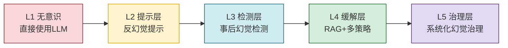

### 9.3 未来发展方向

1. **架构创新**:探索非自回归生成、显式知识检索机制、事实与语言解耦的架构。
2. **训练范式**:发展针对事实性的训练目标,如事实校验损失、知识边界学习。
3. **RAG 演进**:从检索增强到"知识即服务",实时知识更新。
4. **多模态幻觉**:研究视觉、音频等多模态幻觉的检测与缓解。
5. **可信 AI**:构建端到端的可信 AI 框架,将幻觉治理纳入全生命周期。
6. **幻觉基准**:发展更全面、更细粒度的幻觉评测基准。
7. **法规遵从**:幻觉治理与 AI 法规(如 EU AI Act)结合,形成合规框架。

### 9.4 给开发者与应用者的建议

1. **认知幻觉的不可避免性**:接受"幻觉无法完全消除"的现实,设计应对机制而非追求零幻觉。
2. **按风险等级治理**:不同应用场景采用不同强度的反幻觉措施,避免过度或不足。
3. **多层防御**:不要依赖单一手段,采用"提示+RAG+检测+验证"的多层防御。
4. **持续监控**:上线后持续追踪幻觉率,建立反馈闭环持续优化。
5. **透明告知**:向用户明确告知 LLM 的局限与不确定性,建立合理预期。
6. **人机协作**:高风险场景保留人工审核环节,人机协作而非全自动化。
7. **关注前沿**:持续关注学术界与工业界的幻觉研究进展,及时更新方法。

---

## 附录:权威参考文献

### 综述类
1. **Ji et al. (2023)**. "Survey of Hallucination in Natural Language Generation." *ACM Computing Surveys*. —— 幻觉领域的奠基性综述,提出内在/外在分类。
2. **Huang et al. (2023)**. "A Survey on Hallucination in Large Language Models: Principles, Taxonomy, Challenges, and Open Questions." *arXiv:2311.05232*. —— LLM 幻觉的全面综述。
3. **Zhang et al. (2023)**. "Siren's Song in the AI Ocean: A Survey on Hallucination in Large Language Models." *arXiv:2309.01219*.

### 成因分析类
4. **Kalai & Vempala (2023)**. "Why Do Language Models Hallucinate?" —— 从理论角度分析幻觉成因。
5. **McKenna et al. (2023)**. "Sources of Hallucination by Large Language Models." —— 量化不同来源的幻觉贡献。
6. **Sharma et al. (2023)**. "Towards Understanding Sycophancy in Language Models." —— RLHF 的 sycophancy 问题。

### 检测与评估类
7. **Lin et al. (2022)**. "TruthfulQA: Measuring How Models Mimic Human Falsehoods." *ACL*. —— TruthfulQA 基准。
8. **Li et al. (2023)**. "HaluEval: A Large-Scale Hallucination Evaluation Benchmark." *EMNLP*.
9. **Min et al. (2023)**. "FActScore: Fine-grained Atomic Evaluation of Factual Precision." *ACL*.
10. **Manakul et al. (2023)**. "SelfCheckGPT: Zero-Resource Black-Box Hallucination Detection." *EMNLP*. —— 自一致性检测方法。

### 缓解技术类
11. **Lewis et al. (2020)**. "Retrieval-Augmented Generation for Knowledge-Intensive NLP Tasks." *NeurIPS*. —— RAG 经典论文。
12. **Shi et al. (2023)**. "Large Language Models Can Be Easily Distracted by Irrelevant Information." —— 提示工程与干扰研究。
13. **Chuang et al. (2024)**. "Dola: Decoding by Contrasting Layers." —— 对比解码方法。

### 模型技术报告
14. **OpenAI (2023)**. "GPT-4 Technical Report." *arXiv:2303.08774*.
15. **Touvron et al. (2023)**. "LLaMA 2: Open Foundation and Fine-Tuned Chat Models." *arXiv:2307.09288*.
16. **Meta AI (2024)**. "The Llama 3 Herd of Models."
17. **Anthropic (2022)**. "Constitutional AI: Harmlessness from AI Feedback." *arXiv:2212.08073*.

### 工业实践
18. **Vectara (2023)**. "Hallucination Evaluation Model (HHEM)."
19. **Microsoft (2023)**. "Prompting Techniques for Reducing Hallucination."

---

> **相关文档**
>
> - [1Transformer基本结构详解.md](./1Transformer基本结构详解.md):Transformer 架构是幻觉的架构根源,理解架构才能理解幻觉。
> - [2Self-Attention机制完整计算过程.md](./2Self-Attention机制完整计算过程.md):注意力机制的局限是幻觉的重要成因。
> - [4Transformer并行训练机制详解.md](./4Transformer并行训练机制详解.md):训练机制(如数据并行)影响模型的事实性学习。
> - [../1基础概念/7Agent与RAG系统深度对比.md](../1基础概念/7Agent与RAG系统深度对比.md):RAG 是缓解幻觉的核心技术。
> - [../1基础概念/14Agent任务完成判断机制深度解析.md](../1基础概念/14Agent任务完成判断机制深度解析.md):幻觉治理与完成判断共同保障 Agent 输出质量。
