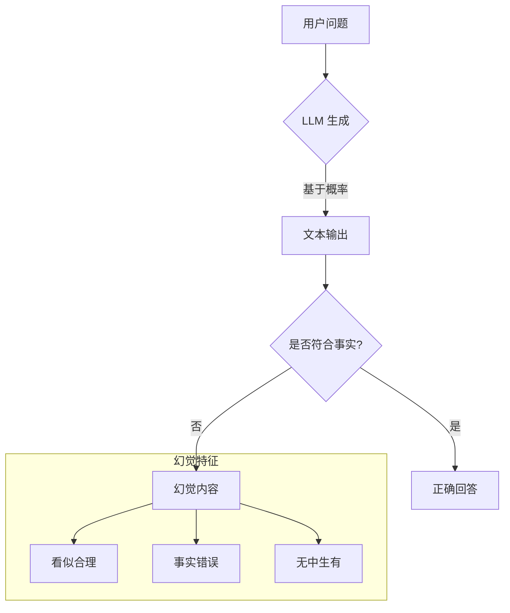
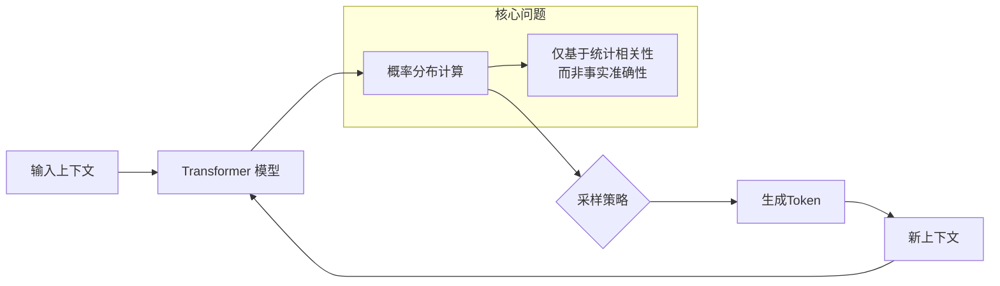
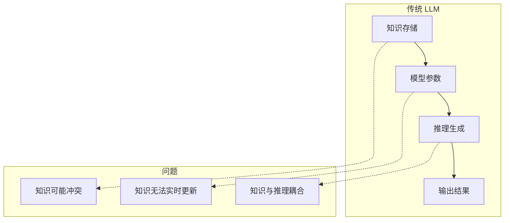
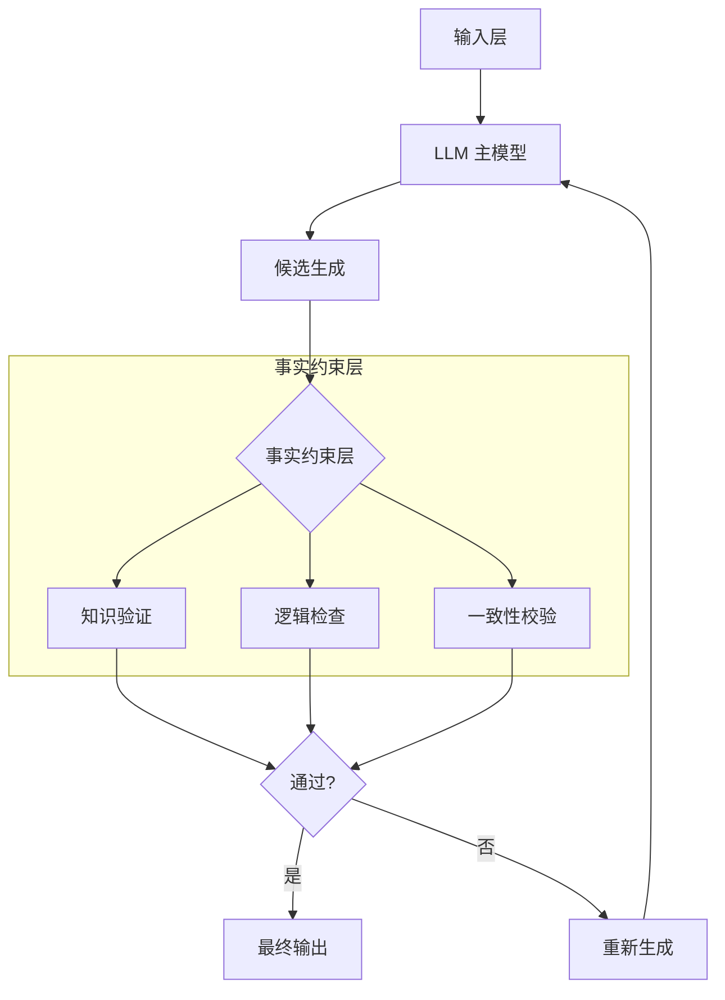
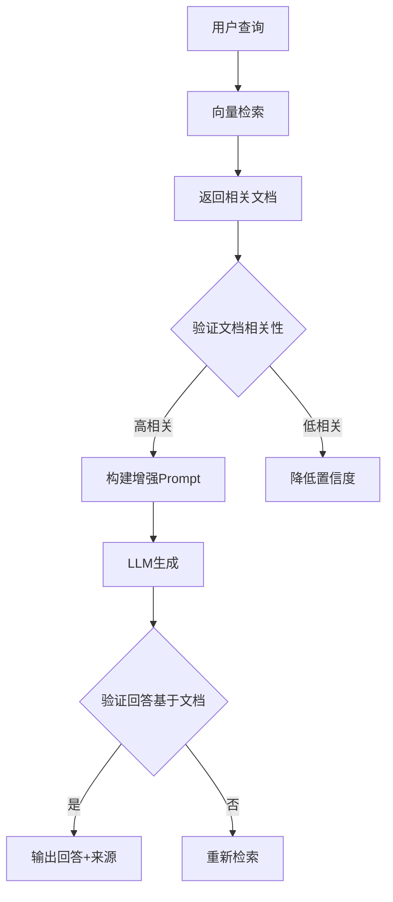
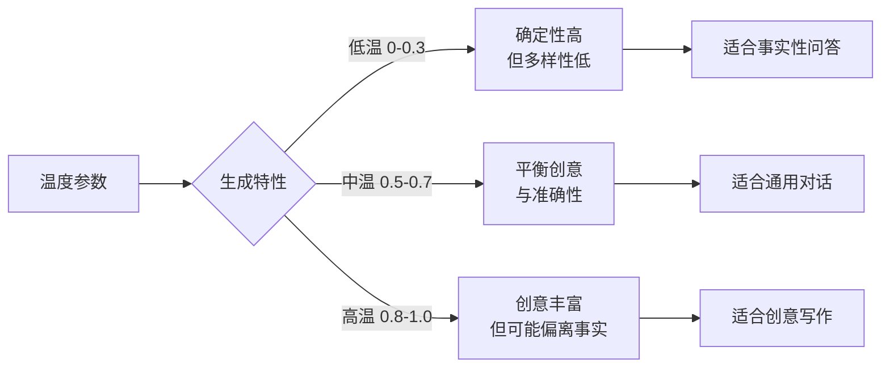
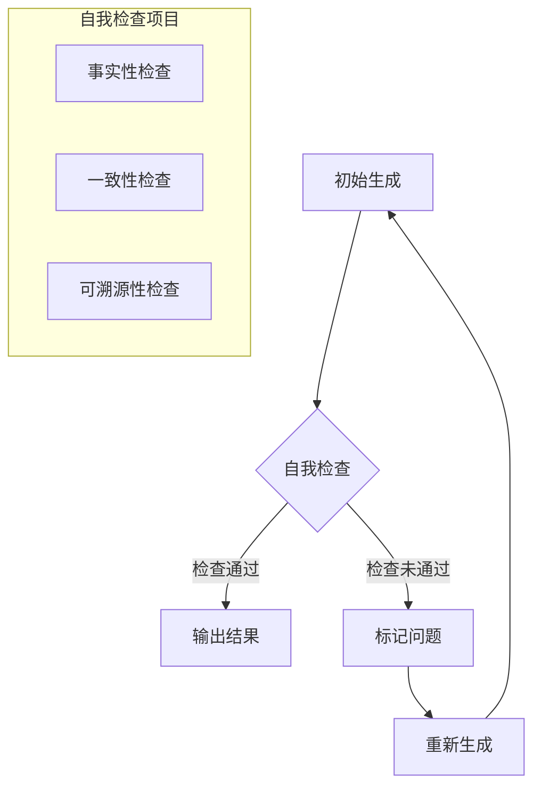
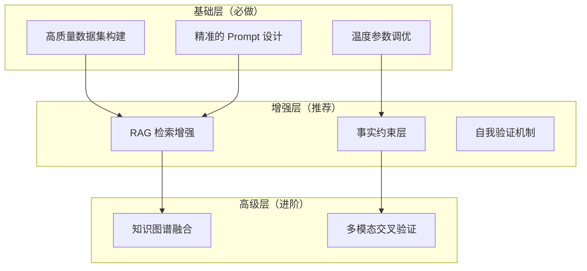

# 降低 LLM 幻觉现象技术详解

## 目录

- [一、LLM 幻觉的定义与分类](#一llm-幻觉的定义与分类)
- [二、LLM 幻觉的产生机制](#二llm-幻觉的产生机制)
- [三、数据质量优化策略](#三数据质量优化策略)
- [四、模型架构改进方法](#四模型架构改进方法)
- [五、提示工程设计优化](#五提示工程设计优化)
- [六、知识增强策略](#六知识增强策略)
- [七、推理机制优化](#七推理机制优化)
- [八、实战案例分析](#八实战案例分析)
- [九、效果评估指标体系](#九效果评估指标体系)
- [十、总结与未来展望](#十总结与未来展望)

---

## 一、LLM 幻觉的定义与分类

### 1.1 什么是 LLM 幻觉

LLM 幻觉（Hallucination）是指大型语言模型在生成文本时，产生与事实不符、无中生有或逻辑矛盾的内容的现象。模型基于统计概率生成的"看起来合理但实际错误"的文本，就像人类的幻觉一样"凭空捏造"。



### 1.2 幻觉的主要类型

#### 1.2.1 事实性幻觉（Factual Hallucination）

模型生成与客观事实不符的内容。

```markdown
**示例**：
用户："爱因斯坦的相对论发表于哪一年？"
LLM 回答："爱因斯坦的相对论发表于 1915 年。"
→ 正确答案：1905 年（狭义相对论），1915 年是广义相对论
```

#### 1.2.2 忠实性幻觉（Faithfulness Hallucination）

生成的内容无法从提供的上下文中得到支持。

```markdown
**示例**：
上下文："苹果公司在 2023 年发布了 iPhone 15 系列产品。"
用户："苹果公司的创始人是谁？"
LLM 回答："苹果公司由史蒂夫·乔布斯、史蒂夫·沃兹尼亚克和罗纳德·韦恩创立。"
→ 虽然答案正确，但无法从给定上下文中推导得出
```

#### 1.2.3 指代性幻觉（Referential Hallucination）

错误地引用或指代不存在的来源、文献或数据。

```markdown
**示例**：
用户："这篇论文的作者是谁？"
LLM 回答："这篇论文由 Smith et al. (2022) 撰写，发表在 Nature 杂志上。"
→ 可能 Smith 不存在或论文未发表在 Nature
```

### 1.3 不同类型幻觉对比

| 幻觉类型 | 严重程度 | 检测难度 | 常见场景 |
| :--- | :--- | :--- | :--- |
| **事实性幻觉** | ⭐⭐⭐⭐⭐ | 中等 | 知识问答、报告生成 |
| **忠实性幻觉** | ⭐⭐⭐⭐ | 较高 | RAG 系统、文档总结 |
| **指代性幻觉** | ⭐⭐⭐⭐ | 中等 | 学术写作、引文生成 |
| **连贯性幻觉** | ⭐⭐⭐ | 较低 | 长文本生成、多轮对话 |
| **风格性幻觉** | ⭐⭐ | 较低 | 创意写作、翻译 |

---

## 二、LLM 幻觉的产生机制

### 2.1 语言模型的概率生成本质



**关键机制**：
- LLM 通过学习大量文本的统计规律来预测下一个 Token
- 模型关注的是"语言流畅性"而非"事实正确性"
- 当训练数据中存在知识冲突或偏差时，模型倾向于生成统计上最可能的答案

### 2.2 训练数据的局限性

#### 2.2.1 知识截止问题

```markdown
训练数据截止日期：2024年6月

用户问题："2024年8月发布的 iPhone 16 有什么新功能？"
→ 模型无法回答，可能产生幻觉
```

#### 2.2.2 训练数据偏差

- 互联网上的错误信息被模型学习
- 某些领域的数据不足，导致模型"猜测"
- 过时信息未被及时更新

### 2.3 知识与推理的分离



---

## 三、数据质量优化策略

### 3.1 高质量数据集构建

#### 3.1.1 数据来源筛选

```markdown
**权威数据来源优先级**：
1. 政府官方出版物（统计数据、法律条文）
2. 顶级学术期刊（Nature、Science、顶会论文）
3. 权威出版社（教科书、专著）
4. 官方技术文档（API文档、产品手册）
5. 高质量百科（维基百科、大英百科）
6. 主流媒体报道
7. 用户生成内容（需严格审核）
```

#### 3.1.2 数据质量评估框架

```python
# 代码示例：数据质量评估
class DataQualityChecker:
    def __init__(self):
        self.quality_scores = {
            "accuracy": 0,      # 准确性
            "completeness": 0,  # 完整性
            "consistency": 0,   # 一致性
            "timeliness": 0     # 时效性
        }
    
    def evaluate(self, data_point):
        """评估数据点质量"""
        scores = {}
        
        # 1. 准确性检查
        scores["accuracy"] = self._check_accuracy(data_point)
        
        # 2. 完整性检查
        scores["completeness"] = self._check_completeness(data_point)
        
        # 3. 一致性检查
        scores["consistency"] = self._check_consistency(data_point)
        
        # 4. 时效性检查
        scores["timeliness"] = self._check_timeliness(data_point)
        
        # 加权计算总分
        self.quality_scores = {
            "accuracy": 0.4 * scores["accuracy"],
            "completeness": 0.2 * scores["completeness"],
            "consistency": 0.2 * scores["consistency"],
            "timeliness": 0.2 * scores["timeliness"]
        }
        
        return sum(self.quality_scores.values())
    
    def _check_accuracy(self, data):
        """检查准确性：与权威来源交叉验证"""
        # 实现逻辑
        pass
    
    def _check_completeness(self, data):
        """检查完整性：关键字段是否齐全"""
        pass
    
    def _check_consistency(self, data):
        """检查一致性：是否与已有知识矛盾"""
        pass
    
    def _check_timeliness(self, data):
        """检查时效性：是否为最新信息"""
        pass
```

### 3.2 数据清洗与去重

#### 3.2.1 语义去重算法

```python
# 代码示例：基于嵌入的语义去重
from sentence_transformers import SentenceTransformer
import numpy as np

class SemanticDeduplicator:
    def __init__(self, model_name='BAAI/bge-large-zh'):
        self.model = SentenceTransformer(model_name)
        self.threshold = 0.95  # 相似度阈值
    
    def deduplicate(self, documents):
        """语义去重"""
        # 1. 计算嵌入
        embeddings = self.model.encode(documents)
        
        # 2. 计算相似度矩阵
        similarity_matrix = np.dot(embeddings, embeddings.T)
        
        # 3. 标记重复内容
        unique_indices = set()
        duplicate_indices = set()
        
        for i in range(len(documents)):
            if i in duplicate_indices:
                continue
            unique_indices.add(i)
            
            for j in range(i + 1, len(documents)):
                if j not in duplicate_indices:
                    if similarity_matrix[i][j] > self.threshold:
                        duplicate_indices.add(j)
        
        # 4. 返回去重结果
        return [documents[i] for i in unique_indices]
```

### 3.3 知识准确性验证

```python
# 代码示例：知识验证管道
class KnowledgeValidator:
    def __init__(self, verification_sources):
        self.sources = verification_sources  # 权威数据源列表
    
    def validate(self, knowledge_point):
        """验证知识点"""
        results = []
        
        # 1. 多源交叉验证
        for source in self.sources:
            source_result = self._check_against_source(knowledge_point, source)
            results.append(source_result)
        
        # 2. 综合判定
        confirmed = sum(1 for r in results if r['passed'])
        total = len(results)
        
        confidence = confirmed / total if total > 0 else 0
        
        if confidence >= 0.8:
            return {"status": "verified", "confidence": confidence}
        elif confidence >= 0.5:
            return {"status": "uncertain", "confidence": confidence}
        else:
            return {"status": "rejected", "confidence": confidence}
    
    def _check_against_source(self, knowledge, source):
        """从指定数据源验证"""
        # 实现逻辑：调用外部API查询验证
        pass
```

---

## 四、模型架构改进方法

### 4.1 事实一致性约束层

#### 4.1.1 架构设计



#### 4.1.2 实现代码

```python
# 代码示例：事实一致性约束层
class FactConsistencyLayer:
    def __init__(self, knowledge_base):
        self.knowledge_base = knowledge_base
        self.max_retries = 3
    
    def validate_output(self, generated_text, context=None):
        """验证生成内容的事实一致性"""
        for retry in range(self.max_retries):
            issues = []
            
            # 1. 事实性检查
            fact_issues = self._check_factual_accuracy(generated_text)
            issues.extend(fact_issues)
            
            # 2. 一致性检查
            consistency_issues = self._check_consistency(generated_text, context)
            issues.extend(consistency_issues)
            
            if not issues:
                return {"valid": True, "text": generated_text, "issues": []}
            
            if retry == self.max_retries - 1:
                return {
                    "valid": False,
                    "text": generated_text,
                    "issues": issues,
                    "warnings": "达到最大重试次数"
                }
        
        return {"valid": False, "text": None, "issues": issues}
    
    def _check_factual_accuracy(self, text):
        """检查事实准确性"""
        issues = []
        claims = self._extract_claims(text)
        
        for claim in claims:
            verification = self.knowledge_base.verify(claim)
            if not verification.get('supported'):
                issues.append({
                    "type": "factual",
                    "claim": claim,
                    "reason": verification.get('reason', '未找到支持证据')
                })
        
        return issues
    
    def _check_consistency(self, text, context):
        """检查与上下文的一致性"""
        # 实现逻辑
        pass
    
    def _extract_claims(self, text):
        """提取文本中的事实声明"""
        # 实现逻辑
        pass
```

### 4.2 检索增强的生成模型

```python
# 代码示例：检索增强的生成模型
class RetrievalAugmentedLLM:
    def __init__(self, llm, retriever):
        self.llm = llm
        self.retriever = retriever
        self.max_iterations = 3
    
    def generate_with_verification(self, query):
        """带验证的生成"""
        context_history = []
        
        for iteration in range(self.max_iterations):
            # 1. 检索相关知识
            retrieved_docs = self.retriever.retrieve(query, context_history)
            
            # 2. 构建增强提示
            enhanced_prompt = self._build_enhanced_prompt(query, retrieved_docs)
            
            # 3. 生成初步回答
            initial_response = self.llm.generate(enhanced_prompt)
            
            # 4. 验证回答
            verification_result = self._verify_response(initial_response, retrieved_docs)
            
            if verification_result['passed']:
                return {
                    "answer": initial_response,
                    "sources": retrieved_docs,
                    "iteration": iteration + 1
                }
            
            # 记录问题并重新检索
            context_history.append({
                "query": query,
                "response": initial_response,
                "issues": verification_result.get('issues', [])
            })
        
        return {"answer": initial_response, "sources": retrieved_docs}
    
    def _build_enhanced_prompt(self, query, docs):
        """构建增强的提示"""
        # 实现逻辑
        pass
    
    def _verify_response(self, response, docs):
        """验证回答"""
        # 实现逻辑
        pass
```

---

## 五、提示工程设计优化

### 5.1 反幻觉提示模板

```markdown
**反幻觉系统提示词**：

你是一个严格基于事实的知识助手。请严格遵守以下规则：

1. **只基于提供的上下文回答**：如果答案不在上下文中，明确说明"根据现有信息无法回答"
2. **标注不确定性**：对于不确定的内容，使用"据目前所知"、"根据现有资料"等限定词
3. **区分事实与推测**：明确区分已确认的事实和合理的推测
4. **不编造信息**：绝不捏造不存在的数据源、文献或事实
5. **引用来源**：所有关键声明都应标注信息来源
6. **承认局限**：对于知识截止日期后的事件，明确说明

**输出格式**：
1. 事实陈述：[具体内容]
2. 来源标注：[信息出处]
3. 置信度：高/中/低
4. 补充说明：[限制或不确定性]
```

### 5.2 思维链（Chain-of-Thought）引导

#### 5.2.1 事实验证的思维链

```markdown
**反幻觉思维链示例**：

用户问题："牛顿第二定律的数学表达式是什么？"

**引导思维过程**：
1. 识别问题类型：这是一个物理学基础概念问题
2. 检索相关知识：
   - 回忆牛顿运动定律的相关内容
   - 确认牛顿第二定律的准确表述
3. 验证事实准确性：
   - 检查数学表达式的正确性
   - 确认各符号的含义
4. 构建回答：
   - 给出准确的数学表达式
   - 解释各符号含义
   - 引用物理学标准教材
5. 最终检查：
   - 表达式是否正确？
   - 是否有任何不确定性？

**最终回答**：
根据经典物理学教材（Halliday & Resnick, 《Physics》第10版），牛顿第二定律的数学表达式为：

F = ma

其中：
- F：作用在物体上的合外力（单位：牛顿 N）
- m：物体的质量（单位：千克 kg）
- a：物体的加速度（单位：米/秒² m/s²）

置信度：**高**
```

### 5.3 Few-Shot 示例约束

```markdown
**Few-Shot 示例设计**：

# 示例1：准确引用
用户："世界上最高的山峰是什么？"
助手："世界上最高的山峰是珠穆朗玛峰。根据中国登山协会（2020年）的测量数据，其海拔高度为 8848.86 米。"

# 示例2：承认局限
用户："2024年奥运会的金牌榜排名如何？"
助手："抱歉，我的知识截止到 [日期]，无法提供 2024 年奥运会的信息。建议您访问国际奥委会官网获取最新信息。"

# 示例3：区分事实与推测
用户："宇宙中是否存在外星生命？"
助手："目前的科学研究尚未确认外星生命的存在（事实）。不过，基于宇宙的广阔性和生命诞生的条件，许多科学家认为外星生命很可能存在（推测）。"
```

---

## 六、知识增强策略

### 6.1 RAG 检索增强生成

#### 6.1.1 RAG 架构与反幻觉



### 6.2 反幻觉 RAG 实现

```python
# 代码示例：反幻觉 RAG 系统
class AntiHallucinationRAG:
    def __init__(self, retriever, llm):
        self.retriever = retriever
        self.llm = llm
        self.max_retrieval_attempts = 3
    
    def answer_with_verification(self, query):
        """带验证的回答"""
        best_context = None
        best_score = 0
        
        # 1. 多次检索尝试
        for attempt in range(self.max_retrieval_attempts):
            docs = self.retriever.retrieve(query, num_docs=10)
            relevance_score = self._evaluate_relevance(docs, query)
            
            if relevance_score > best_score:
                best_score = relevance_score
                best_context = docs
            
            if relevance_score >= 0.8:
                break
        
        # 2. 如果没有找到相关文档
        if best_score < 0.3:
            return {
                "answer": None,
                "confidence": "low",
                "message": "抱歉，根据现有知识库，我无法回答您的问题。"
            }
        
        # 3. 基于高质量文档生成回答
        prompt = self._build_factual_prompt(query, best_context)
        response = self.llm.generate(prompt)
        
        # 4. 验证回答
        verification = self._verify_against_context(response, best_context)
        
        return {
            "answer": response if verification['passed'] else None,
            "confidence": self._calculate_confidence(best_score, verification),
            "sources": self._extract_sources(best_context)
        }
    
    def _evaluate_relevance(self, docs, query):
        """评估文档相关性"""
        if not docs:
            return 0.0
        scores = [doc.get('similarity', 0) for doc in docs]
        return sum(scores) / len(scores)
    
    def _build_factual_prompt(self, query, context):
        """构建事实性 Prompt"""
        context_text = "\n\n".join([
            f"【来源: {doc.get('source', '未知')}】\n{doc.get('content', '')}"
            for doc in context
        ])
        
        return f"""
# 参考资料
{context_text}

# 回答要求
1. 严格基于上述参考资料回答
2. 如果参考资料中没有答案，请明确说明
3. 引用内容必须标注来源

# 用户问题
{query}
"""
    
    def _verify_against_context(self, response, context):
        """验证回答是否基于上下文"""
        # 实现验证逻辑
        pass
    
    def _calculate_confidence(self, relevance_score, verification):
        """计算置信度"""
        base_confidence = relevance_score * 0.5
        if verification.get('passed'):
            base_confidence += 0.3
        if base_confidence >= 0.8:
            return "high"
        elif base_confidence >= 0.5:
            return "medium"
        else:
            return "low"
    
    def _extract_sources(self, context):
        """提取来源"""
        return list(set(doc.get('source', '未知') for doc in context))
```

---

## 七、推理机制优化

### 7.1 温度参数调优

#### 7.1.1 温度与幻觉的关系



#### 7.1.2 动态温度调整

```python
# 代码示例：基于任务类型的动态温度调整
class DynamicTemperatureController:
    def __init__(self):
        self.task_temperature_map = {
            "fact_qa": 0.2,          # 事实问答
            "summarization": 0.3,    # 摘要生成
            "translation": 0.4,      # 翻译
            "general_qa": 0.5,       # 通用问答
            "creative_writing": 0.8, # 创意写作
            "code_generation": 0.1,  # 代码生成
        }
    
    def get_temperature(self, task_type, confidence_level=None):
        """获取合适的温度参数"""
        base_temp = self.task_temperature_map.get(task_type, 0.5)
        
        if confidence_level == "low":
            return max(base_temp - 0.2, 0.0)
        
        return base_temp
```

### 7.2 多轮验证与自我检查



### 7.3 不确定性估计

```python
# 代码示例：不确定性估计
class UncertaintyEstimator:
    def __init__(self, n_samples=5):
        self.n_samples = n_samples
    
    def estimate_uncertainty(self, llm, query):
        """估计生成内容的不确定性"""
        # 多次采样生成
        samples = []
        for i in range(self.n_samples):
            sample = llm.generate(query, temperature=0.7 + i * 0.05)
            samples.append(sample)
        
        # 计算一致性
        agreement_score = self._calculate_agreement(samples)
        uncertainty = 1.0 - agreement_score
        
        confidence_level = self._categorize_confidence(uncertainty)
        
        return {
            "agreement_score": agreement_score,
            "uncertainty": uncertainty,
            "confidence_level": confidence_level
        }
    
    def _calculate_agreement(self, samples):
        """计算多个生成结果的一致性"""
        # 实现逻辑
        pass
    
    def _categorize_confidence(self, uncertainty):
        """分类置信度等级"""
        if uncertainty < 0.1:
            return "very_high"
        elif uncertainty < 0.3:
            return "high"
        elif uncertainty < 0.5:
            return "medium"
        else:
            return "low"
```

---

## 八、实战案例分析

### 案例一：金融报告生成系统

#### 8.1.1 业务背景

```markdown
**需求**：为投资分析师生成公司财务分析报告
**痛点**：
- 报告中经常出现数据错误
- 引用的财务数据不准确

**目标**：
- 事实准确率从 75% 提升到 98%
- 所有数据可溯源
```

#### 8.1.2 解决方案

```python
# 代码示例：金融报告生成器
class FinancialReportGenerator:
    def __init__(self):
        self.rag = AntiHallucinationRAG(
            retriever=self._setup_financial_retriever(),
            llm=self._setup_financial_llm()
        )
    
    def generate_analysis(self, company, quarter):
        """生成公司财务分析报告"""
        sections = {
            "revenue": f"{company} {quarter} 营收数据",
            "profit": f"{company} {quarter} 利润指标",
            "guidance": f"{company} {quarter} 业绩指引",
        }
        
        report_sections = {}
        for section_name, section_query in sections.items():
            verified_response = self.rag.answer_with_verification(section_query)
            report_sections[section_name] = {
                "content": verified_response['answer'],
                "confidence": verified_response['confidence'],
                "sources": verified_response['sources']
            }
        
        return report_sections
    
    def _setup_financial_retriever(self):
        """设置金融数据检索器"""
        # 实现逻辑
        pass
    
    def _setup_financial_llm(self):
        """设置金融专用 LLM"""
        # 实现逻辑
        pass
```

#### 8.1.3 效果评估

| 指标 | 优化前 | 优化后 | 提升 |
| :--- | :--- | :--- | :--- |
| **事实准确率** | 75% | 98% | +23% |
| **可溯源率** | 60% | 100% | +40% |
| **人工审核时间** | 4小时/报告 | 30分钟/报告 | -87.5% |

### 案例二：医疗知识问答系统

#### 8.2.1 解决方案

```python
# 代码示例：医疗知识验证系统
class MedicalKnowledgeVerifier:
    def __init__(self):
        self.evidence_levels = {
            "level_A": "系统性综述/Meta分析",
            "level_B": "随机对照试验",
            "level_C": "队列研究",
            "level_D": "病例报告/专家意见"
        }
    
    def verify_medical_claim(self, claim):
        """验证医疗声明"""
        # 1. 分类声明类型
        claim_type = self._classify_medical_claim(claim)
        
        # 2. 多数据库检索验证
        verification_results = []
        for database in ["PubMed", "Cochrane Library", "UpToDate"]:
            result = self._search_database(database, claim)
            verification_results.append(result)
        
        # 3. 评估证据等级
        is_supported = sum(1 for r in verification_results if r['found']) >= 2
        
        return {
            "claim": claim,
            "supported": is_supported,
            "supporting_sources": [
                r['source'] for r in verification_results if r['found']
            ]
        }
    
    def _classify_medical_claim(self, claim):
        """分类医疗声明"""
        pass
    
    def _search_database(self, database, claim):
        """搜索数据库"""
        pass
```

---

## 九、效果评估指标体系

### 9.1 核心评估指标

| 指标 | 定义 | 计算方法 |
| :--- | :--- | :--- |
| **事实准确率** | 回答中事实正确的比例 | 正确事实数 / 总事实数 |
| **忠实度** | 回答基于提供上下文的程度 | 支持的声明数 / 总声明数 |
| **一致性** | 回答内部逻辑一致的程度 | 1 - 矛盾声明数 |
| **可溯源率** | 回答中标注来源的比例 | 有来源的声明数 / 总声明数 |
| **拒答准确率** | 正确拒绝的比例 | 正确拒答数 / 应拒答总数 |

### 9.2 RAGAS 评估框架

```python
# 代码示例：RAGAS 评估集成
class RAGEvaluator:
    def evaluate_rag_system(self, rag_system, test_dataset):
        """评估 RAG 系统"""
        results = []
        
        for query, ground_truth in test_dataset:
            response = rag_system.query(query)
            
            results.append({
                "query": query,
                "answer": response['answer'],
                "sources": response.get('sources', []),
                "ground_truth": ground_truth
            })
        
        # 计算汇总指标
        summary = {
            "faithfulness": self._calculate_faithfulness(results),
            "answer_relevancy": self._calculate_relevancy(results),
            "context_precision": self._calculate_precision(results),
            "context_recall": self._calculate_recall(results)
        }
        
        return summary
    
    def _calculate_faithfulness(self, results):
        """计算忠实度"""
        pass
    
    def _calculate_relevancy(self, results):
        """计算相关性"""
        pass
    
    def _calculate_precision(self, results):
        """计算精度"""
        pass
    
    def _calculate_recall(self, results):
        """计算召回率"""
        pass
```

---

## 十、总结与未来展望

### 10.1 实践建议

#### 10.1.1 分层实施策略



#### 10.1.2 实施优先级

| 优先级 | 技术方案 | 实现难度 | 预期效果 |
| :--- | :--- | :--- | :--- |
| ⭐⭐⭐⭐⭐ | 高质量数据筛选 | 低 | 高 |
| ⭐⭐⭐⭐⭐ | 反幻觉 Prompt 设计 | 低 | 中-高 |
| ⭐⭐⭐⭐ | RAG 检索增强 | 中 | 高 |
| ⭐⭐⭐⭐ | 温度参数优化 | 低 | 中 |
| ⭐⭐⭐ | 事实约束层 | 中 | 高 |
| ⭐⭐⭐ | 自我验证机制 | 中 | 中-高 |

### 10.2 未来研究方向

| 方向 | 说明 | 预期突破 |
| :--- | :--- | :--- |
| **可验证 LLM** | 内置事实验证机制的模型 | 从根源减少幻觉 |
| **形式化验证** | 用数学方法验证生成内容 | 提供理论保证 |
| **因果推理** | 让模型理解因果关系 | 减少关联幻觉 |
| **持续学习** | 实时更新模型知识 | 解决知识滞后 |
| **多模态对齐** | 跨模态一致性验证 | 增强交叉验证能力 |

### 10.3 总结

降低 LLM 幻觉需要从数据、模型、Prompt、知识、推理五个维度综合施策。没有单一技术可以完全解决幻觉问题，但通过多层防护和组合策略，可以显著降低幻觉发生率，提升 LLM 的可靠性和可信度。

---

## 参考文献

1. **Hallucination in Large Language Models** - Huang et al., 2023
2. **RAG: Retrieval-Augmented Generation** - Lewis et al., NeurIPS 2020
3. **Self-Verification for Chain-of-Thought Reasoning** - Weng et al., 2023
4. **RAGAS: Evaluation Framework for RAG** - RAGAS Team, 2024
5. **Faithful and Grounded Generations** - Meng et al., 2023
