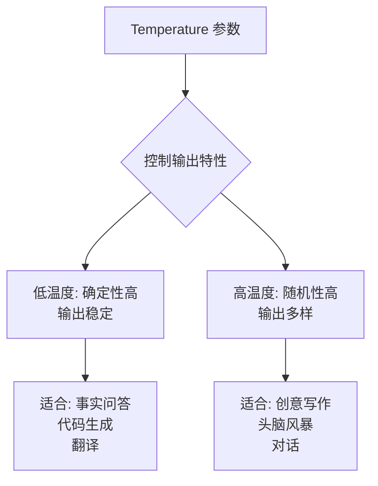
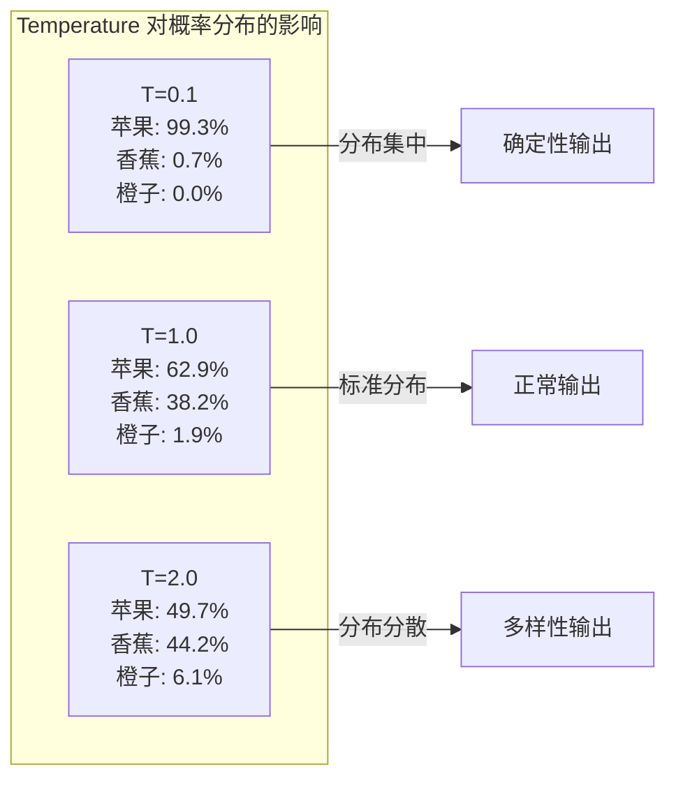
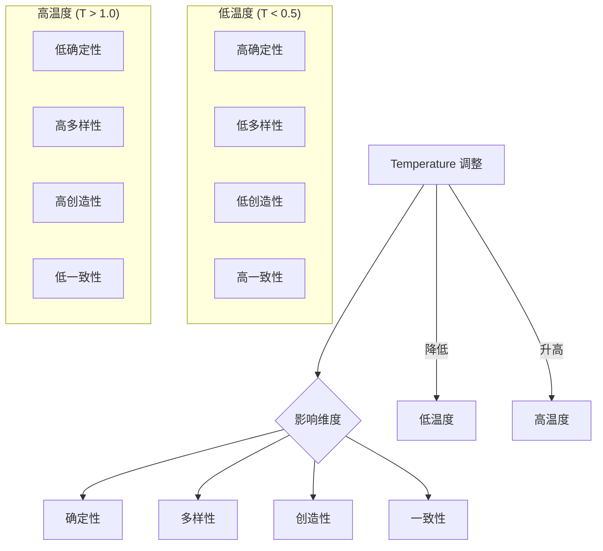
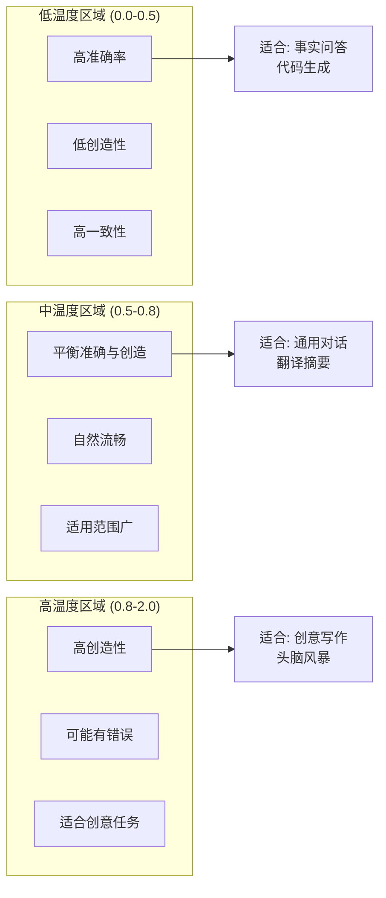
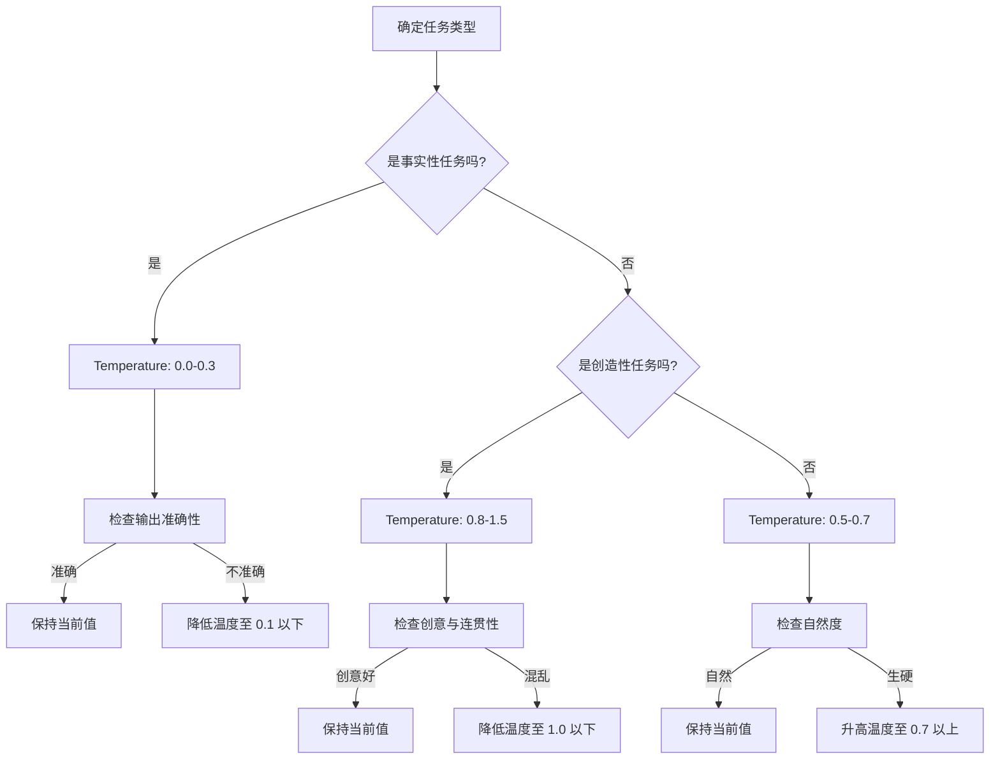
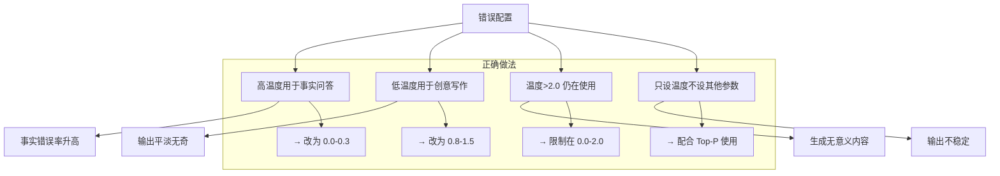

# LLM Temperature 参数详解

## 目录

- [一、Temperature 参数的定义](#一temperature-参数的定义)
- [二、数学原理与取值范围](#二数学原理与取值范围)
- [三、对模型输出的影响机制](#三对模型输出的影响机制)
- [四、不同取值场景的应用效果对比](#四不同取值场景的应用效果对比)
- [五、与其他采样参数的协同配合](#五与其他采样参数的协同配合)
- [六、实际使用中的调整建议](#六实际使用中的调整建议)
- [七、常见问题与注意事项](#七常见问题与注意事项)
- [参考资料](#参考资料)

---

## 一、Temperature 参数的定义

### 1.1 什么是 Temperature

Temperature（温度）是大型语言模型（LLM）文本生成过程中的一个关键参数，用于控制模型输出的**确定性**与**随机性**。它通过调整模型对预测概率分布的"平滑"程度，直接影响生成文本的多样性和稳定性。

### 1.2 核心作用



### 1.3 直观理解

可以将 Temperature 想象成模型的"创造力旋钮"：

- **Temperature = 0**：模型非常"死板"，总是选择最确定的输出
- **Temperature = 1**：模型按照训练时的概率分布正常输出
- **Temperature > 1**：模型变得"富有创造力"，更倾向于选择概率较低但有创意的选项
- **Temperature < 0**：几乎从不使用，理论上会使模型输出更确定

---

## 二、数学原理与取值范围

### 2.1 核心数学公式

Temperature 参数作用于模型输出的 logits（预测分数），通过 Softmax 函数进行温度缩放：

#### 公式表达

$$P(x_i) = \frac{e^{z_i / T}}{\sum_{j=1}^{n} e^{z_j / T}}$$

其中：
- $P(x_i)$：Token $x_i$ 的生成概率
- $z_i$：模型对 Token $x_i$ 的原始 logit 值
- $T$：Temperature 参数值
- $n$：词表大小

### 2.2 不同温度值的数学效果

#### 示例：假设有 3 个候选 Token

假设模型对三个 Token（"苹果"、"香蕉"、"橙子"）的原始 logits 为：`[2.0, 1.5, 0.5]`

```python
import numpy as np

# 原始 logits
logits = np.array([2.0, 1.5, 0.5])

def softmax_with_temperature(logits, temperature):
    """带温度的 Softmax 计算"""
    scaled_logits = logits / temperature
    exp_logits = np.exp(scaled_logits - np.max(scaled_logits))
    return exp_logits / np.sum(exp_logits)

# 不同温度值下的概率分布
temperatures = [0.1, 0.5, 1.0, 1.5, 2.0]

for temp in temperatures:
    probs = softmax_with_temperature(logits, temp)
    print(f"Temperature={temp:.1f}: 苹果={probs[0]:.4f}, 香蕉={probs[1]:.4f}, 橙子={probs[2]:.4f}")
```

#### 计算结果

| Temperature | 苹果 (概率) | 香蕉 (概率) | 橙子 (概率) | 分布特征 |
| :--- | :--- | :--- | :--- | :--- |
| **0.1** | 0.9933 | 0.0067 | 0.0000 | 高度集中 |
| **0.5** | 0.7314 | 0.2685 | 0.0001 | 相对集中 |
| **1.0** | 0.6285 | 0.3815 | 0.0190 | 标准分布 |
| **1.5** | 0.5525 | 0.4235 | 0.0440 | 较为分散 |
| **2.0** | 0.4967 | 0.4424 | 0.0609 | 相对分散 |



### 2.3 取值范围

#### 标准取值范围

| 范围 | 说明 | 使用场景 |
| :--- | :--- | :--- |
| **0.0 - 0.3** | 极低温度 | 需要高度确定性的任务 |
| **0.3 - 0.7** | 低-中温度 | 多数通用任务 |
| **0.7 - 1.0** | 中-高温度 | 需要一定创造性的任务 |
| **> 1.0** | 高温度 | 需要高度创造性的任务 |

#### 主流 API 默认值

| 平台/模型 | 默认 Temperature |
| :--- | :--- |
| **GPT-4 / GPT-3.5** | 1.0 |
| **Claude 3** | 1.0 |
| **Llama 2** | 1.0 |
| **Ollama** | 0.7 |

---

## 三、对模型输出的影响机制

### 3.1 输出确定性 vs 多样性



### 3.2 具体影响表现

#### 3.2.1 低温度输出特征

```python
# 低温度示例：Temperature=0.2
prompt = "中国的首都是"

# Temperature=0.2 时的典型输出
# 输出1: "中国的首都是北京"
# 输出2: "中国的首都是北京"  
# 输出3: "中国的首都是北京"
# → 三次输出结果完全一致
```

#### 3.2.2 高温度输出特征

```python
# 高温度示例：Temperature=1.5
prompt = "写一首关于春天的诗"

# Temperature=1.5 时的典型输出
# 输出1: "春风拂面花自开，燕子归来寻旧宅..."
# 输出2: "绿意萌生柳丝长，桃花含笑映池塘..."
# 输出3: "和风送暖万物苏，草长莺飞二月初..."
# → 三次输出风格迥异，富有创造性
```

### 3.3 对生成质量的影响

#### 代码生成场景对比

```markdown
**任务**：生成一个计算斐波那契数列的 Python 函数

**Temperature=0.1 时**：
```python
def fibonacci(n):
    if n <= 0:
        return []
    elif n == 1:
        return [0]
    fib = [0, 1]
    for i in range(2, n):
        fib.append(fib[i-1] + fib[i-2])
    return fib
```
→ 代码准确、标准，但可能不够简洁

**Temperature=0.7 时**：
```python
def fibonacci(n):
    if n <= 0:
        return []
    fib_sequence = [0, 1]
    while len(fib_sequence) < n:
        fib_sequence.append(fib_sequence[-1] + fib_sequence[-2])
    return fib_sequence[:n]
```
→ 代码简洁，实现方式略有不同

**Temperature=1.5 时**：
```python
def fibonacci(n, memo={}):
    """生成斐波那契数列，使用记忆化优化"""
    if n <= 1:
        return list(range(n + 1))[:n]
    if n not in memo:
        prev = fibonacci(n - 1, memo)
        memo[n] = prev + [prev[-1] + prev[-2]] if len(prev) >= 2 else prev
    return memo[n][:n]
```
→ 创造性地使用了记忆化，但实现可能过于复杂且可能有 bug
```

---

## 四、不同取值场景的应用效果对比

### 4.1 应用场景推荐矩阵

| 场景 | 推荐 Temperature | 预期效果 | 注意事项 |
| :--- | :--- | :--- | :--- |
| **事实性问答** | 0.0 - 0.3 | 高准确性、零幻觉 | 过低可能导致答非所问 |
| **代码生成** | 0.0 - 0.2 | 代码准确、可执行 | 过高可能引入 bug |
| **数据提取** | 0.0 - 0.2 | 稳定提取、格式统一 | 避免格式混乱 |
| **机器翻译** | 0.3 - 0.5 | 准确翻译、语句通顺 | 过高可能改变原意 |
| **摘要生成** | 0.3 - 0.5 | 忠实原文、简洁明了 | 过高可能添加主观内容 |
| **通用对话** | 0.5 - 0.7 | 自然流畅、有温度 | 过低可能回答生硬 |
| **创意写作** | 0.8 - 1.2 | 富有创意、风格多样 | 过高可能逻辑混乱 |
| **头脑风暴** | 1.2 - 2.0 | 点子丰富、突破常规 | 过高可能脱离主题 |

### 4.2 典型场景对比示例

#### 场景一：事实性问答

```python
# Temperature=0.1：适合事实问答
response = llm.generate(
    prompt="地球到太阳的平均距离是多少？",
    temperature=0.1
)
# 输出：地球到太阳的平均距离约为 1.496 亿公里（一个天文单位）。
```

```python
# Temperature=1.5：不适合事实问答
response = llm.generate(
    prompt="地球到太阳的平均距离是多少？",
    temperature=1.5
)
# 可能输出：地球到太阳的距离大约是 9300 万英里，这个距离在天文学中被称为一个天文单位...
# → 可能使用英里作为单位，表述不一致
```

#### 场景二：创意写作

```python
# Temperature=0.3：不适合创意写作
response = llm.generate(
    prompt="写一个关于机器人的故事开头",
    temperature=0.3
)
# 输出：这是一个关于机器人的故事。故事的主角是一个机器人。这个机器人...
# → 过于平淡，缺乏创意
```

```python
# Temperature=1.2：适合创意写作
response = llm.generate(
    prompt="写一个关于机器人的故事开头",
    temperature=1.2
)
# 输出：在 2147 年的最后一个黎明，K-9 型服务机器人睁开了它从未被启用过的情感模拟模块...
# → 富有想象力，引人入胜
```

### 4.3 Temperature 与输出质量关系



---

## 五、与其他采样参数的协同配合

### 5.1 主要采样参数概览

| 参数 | 作用 | 与 Temperature 的关系 |
| :--- | :--- | :--- |
| **Temperature** | 控制概率分布的平滑度 | 单独使用时的主要控制手段 |
| **Top-K** | 只从概率最高的 K 个 Token 中采样 | 限制采样范围，与 Temperature 互补 |
| **Top-P (Nucleus Sampling)** | 从累积概率达到 P 的 Token 集合中采样 | 动态调整采样范围 |
| **Typical** | 从概率分布中选取"典型"Token | 减少重复，增加多样性 |
| **Repetition Penalty** | 惩罚已出现过的 Token | 减少重复生成 |

### 5.2 协同使用策略

#### 策略一：低温度 + Top-K

```python
# 适合：需要高确定性但有一定灵活性的场景
config = {
    "temperature": 0.3,      # 低温度保证确定性
    "top_k": 10,             # 限制在概率最高的 10 个 Token
    "top_p": 0.9             # 同时设置 Top-P 作为安全阈值
}

# 应用场景：
# - 专业术语生成
# - 格式固定的文本
# - 需要稳定输出的报告生成
```

#### 策略二：中温度 + Top-P

```python
# 适合：平衡准确性与创造性的场景
config = {
    "temperature": 0.7,      # 中温度
    "top_p": 0.95            # 动态采样，保证质量
}

# 应用场景：
# - 通用对话
# - 邮件撰写
# - 文章改写
```

#### 策略三：高温度 + Top-P + 低 Repetition Penalty

```python
# 适合：需要高度创造性的场景
config = {
    "temperature": 1.2,      # 高温度增加创造性
    "top_p": 0.9,            # Nucleus 采样保证质量
    "repetition_penalty": 1.0  # 不惩罚重复，保持流畅性
}

# 应用场景：
# - 诗歌创作
# - 广告文案
# - 角色扮演
```

### 5.3 参数组合效果对比

| 配置 | Temperature | Top-K | Top-P | 输出特征 |
| :--- | :--- | :--- | :--- | :--- |
| **极致确定性** | 0.0 | 1 | 1.0 | 完全确定，每次输出相同 |
| **高确定性** | 0.2 | 10 | 0.9 | 非常稳定，偶有变化 |
| **平衡模式** | 0.7 | - | 0.95 | 自然流畅，适度创造 |
| **创意模式** | 1.2 | - | 0.9 | 富有创意，可能出人意料 |
| **随机模式** | 2.0 | - | 0.8 | 高度随机，可能脱离主题 |

---

## 六、实际使用中的调整建议

### 6.1 快速决策指南



### 6.2 不同任务的推荐配置

#### 6.2.1 事实性问答系统

```python
# 事实性问答推荐配置
class FactQASystem:
    def __init__(self):
        self.config = {
            "temperature": 0.1,
            "top_p": 0.9,
            "max_tokens": 200,
            "presence_penalty": 0,
            "frequency_penalty": 0
        }
    
    def answer(self, question):
        return self.llm.generate(
            prompt=question,
            **self.config
        )
```

#### 6.2.2 创意写作助手

```python
# 创意写作推荐配置
class CreativeWritingAssistant:
    def __init__(self):
        self.config = {
            "temperature": 1.0,
            "top_p": 0.95,
            "max_tokens": 1000,
            "presence_penalty": 0.5,
            "frequency_penalty": 0.5
        }
    
    def generate_story(self, theme, length="short"):
        """根据主题生成故事"""
        prompt = f"请写一个关于'{theme}'的{length}故事。"
        return self.llm.generate(
            prompt=prompt,
            **self.config
        )
    
    def generate_poem(self, style="现代诗"):
        """生成特定风格的诗歌"""
        prompt = f"请写一首{style}，主题自选。"
        # 诗歌生成使用更高的温度
        self.config["temperature"] = 1.3
        return self.llm.generate(
            prompt=prompt,
            **self.config
        )
```

#### 6.2.3 代码生成器

```python
# 代码生成推荐配置
class CodeGenerator:
    def __init__(self):
        self.config = {
            "temperature": 0.0,  # 代码生成建议使用 0.0
            "top_p": 1.0,
            "max_tokens": 2000,
            "presence_penalty": 0,
            "frequency_penalty": 0
        }
    
    def generate_function(self, description, language="python"):
        """根据描述生成函数"""
        prompt = f"""
        请生成一个 {language} 函数，功能描述如下：
        {description}
        
        要求：
        1. 代码正确、可执行
        2. 添加必要的注释
        3. 遵循最佳实践
        """
        return self.llm.generate(
            prompt=prompt,
            **self.config
        )
    
    def fix_code(self, buggy_code, error_message):
        """修复有 bug 的代码"""
        prompt = f"""
        以下代码存在错误，请修复：
        
        错误信息：{error_message}
        
        原始代码：
        ```{language}
        {buggy_code}
        ```
        
        请输出修复后的完整代码。
        """
        return self.llm.generate(
            prompt=prompt,
            temperature=0.2,  # 修复代码可以稍微提高一点温度
            top_p=0.9,
            max_tokens=2000
        )
```

### 6.3 动态调整策略

#### 基于反馈的自动调整

```python
# 代码示例：根据用户反馈自动调整温度
class AdaptiveTemperatureController:
    def __init__(self, base_temperature=0.7):
        self.base_temperature = base_temperature
        self.adjustment_history = []
    
    def adjust_based_on_feedback(self, feedback_type):
        """根据反馈类型调整温度"""
        adjustments = {
            "too_generic": -0.2,      # 输出太泛，降低温度
            "too_repetitive": 0.1,    # 重复太多，升高温度
            "not_creative": 0.3,      # 缺乏创意，大幅升高
            "incorrect": -0.3,        # 有错误，大幅降低
            "perfect": 0.0,           # 输出完美，保持不变
        }
        
        adjustment = adjustments.get(feedback_type, 0.0)
        new_temperature = self.base_temperature + adjustment
        
        # 限制在有效范围内
        new_temperature = max(0.0, min(2.0, new_temperature))
        
        # 记录历史
        self.adjustment_history.append({
            'feedback': feedback_type,
            'old_temp': self.base_temperature,
            'new_temp': new_temperature
        })
        
        self.base_temperature = new_temperature
        return new_temperature
    
    def get_temperature(self):
        """获取当前温度"""
        return self.base_temperature
    
    def reset(self):
        """重置温度"""
        self.base_temperature = 0.7
        self.adjustment_history.clear()
```

---

## 七、常见问题与注意事项

### 7.1 常见问题解答

#### Q1: Temperature=0 和 Temperature=0.0 有区别吗？

```markdown
A: 在大多数 LLM API 中，Temperature=0 和 Temperature=0.0 效果完全相同。
   它们都代表贪心采样（Greedy Sampling），即总是选择概率最高的 Token。
   建议使用 0.0 以保持代码一致性。
```

#### Q2: 为什么有时候低温度输出仍然会有错误？

```markdown
A: Temperature 只能控制输出的确定性，无法保证事实的准确性。
   模型的"知识"决定了它能输出什么，Temperature 只影响输出的随机性。
   如果模型本身不知道正确答案，即使 Temperature=0，它也会稳定地输出错误答案。
   
   解决方案：
   1. 使用 RAG 检索增强，提供外部知识
   2. 微调模型，注入正确知识
   3. 在 Prompt 中提供必要的上下文信息
```

#### Q3: Temperature 可以为负数吗？

```markdown
A: 理论上可以，但实际上没有意义。
   负 Temperature 会使概率分布更加尖锐，但比 Temperature=0 更"确定"没有实际意义。
   主流 API 通常不允许设置负数。
```

#### Q4: Temperature 越高越好吗？

```markdown
A: 不是。Temperature 过高会导致：
   1. 输出偏离主题
   2. 逻辑混乱
   3. 事实错误率增加
   4. 生成无意义内容
   
   建议：
   - 即使在创意场景，也不要超过 2.0
   - 使用 Top-P 作为安全阈值
```

#### Q5: 如何选择合适的 Temperature？

```markdown
A: 推荐以下方法：
   
   1. **参考默认值**：
      - 大多数 API 默认 1.0
      - 建议从 0.7 开始测试
   
   2. **分步调整**：
      - 从低温度开始（0.3）
      - 如果输出太死板，逐步升高（每次 +0.1-0.2）
      - 直到找到平衡点
   
   3. **A/B 测试**：
      - 对同一任务使用不同温度生成
      - 人工评估输出质量
      - 选择效果最好的温度
   
   4. **参考行业最佳实践**：
      - 代码生成：0.0-0.2
      - 翻译：0.3-0.5
      - 对话：0.5-0.7
      - 创意：0.8-1.2
```

### 7.2 最佳实践总结

| 原则 | 说明 | 建议 |
| :--- | :--- | :--- |
| **从低开始** | 先用低温度测试，再逐步升高 | 从 0.3 开始 |
| **场景优先** | 根据任务类型选择温度范围 | 参考第 4 章矩阵 |
| **配合使用** | Temperature 与 Top-P/Top-K 配合 | 优先使用 Top-P |
| **动态调整** | 根据输出反馈调整温度 | 建立反馈机制 |
| **记录历史** | 记录不同任务的最佳温度 | 形成知识库 |

### 7.3 错误配置警示



### 7.4 生产环境检查清单

在将 Temperature 参数配置应用到生产环境前，请确认：

- [ ] **任务类型确认**：温度设置与任务类型匹配
- [ ] **范围检查**：温度值在 0.0-2.0 范围内
- [ ] **参数配合**：已设置 Top-P 或 Top-K 作为安全阈值
- [ ] **测试验证**：通过 A/B 测试验证温度设置的效果
- [ ] **监控机制**：建立输出质量监控，及时发现问题
- [ ] **文档记录**：记录不同场景的最佳温度配置
- [ ] **降级方案**：准备温度异常时的降级处理方案

---

## 参考资料

1. **The Illustrated Transformer** - Jay Alammar, 2018
2. **Language Models are Few-Shot Learners** - Brown et al., 2020
3. **Nucleus Sampling for Conditional Language Models** - Holtzman et al., 2019
4. **GPT API Documentation** - OpenAI, 2024
5. **Claude API Reference** - Anthropic, 2024
