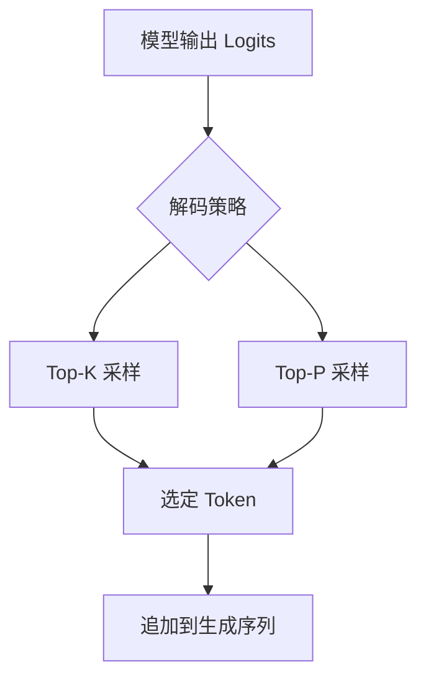
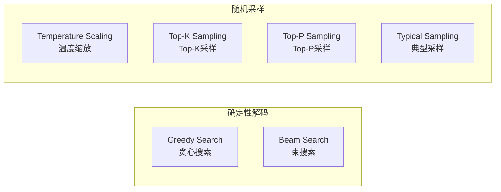
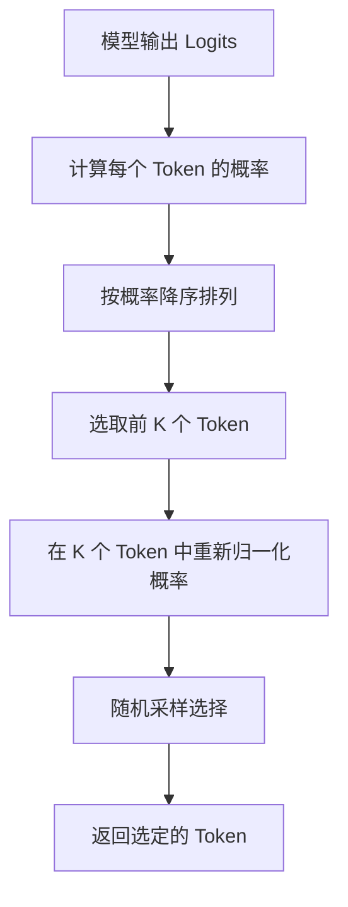
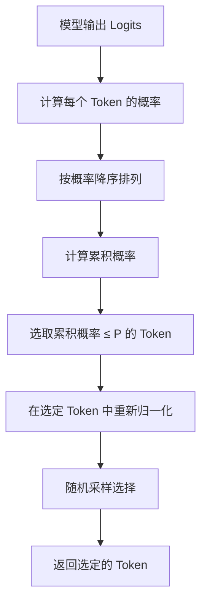
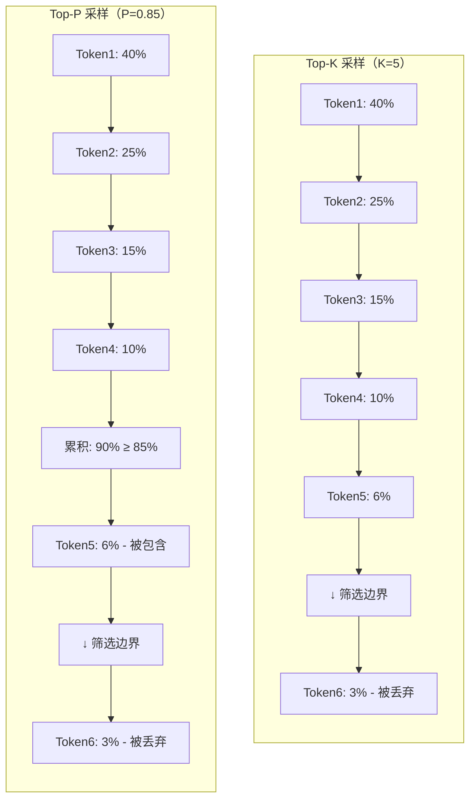
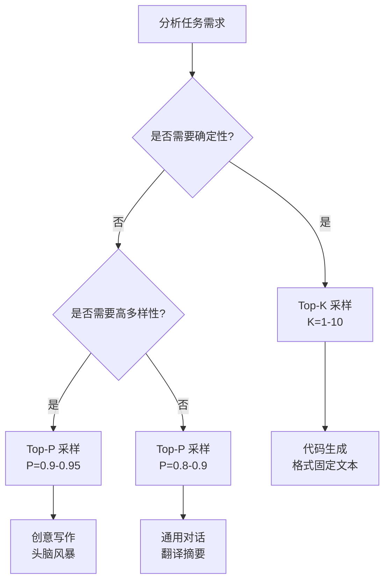
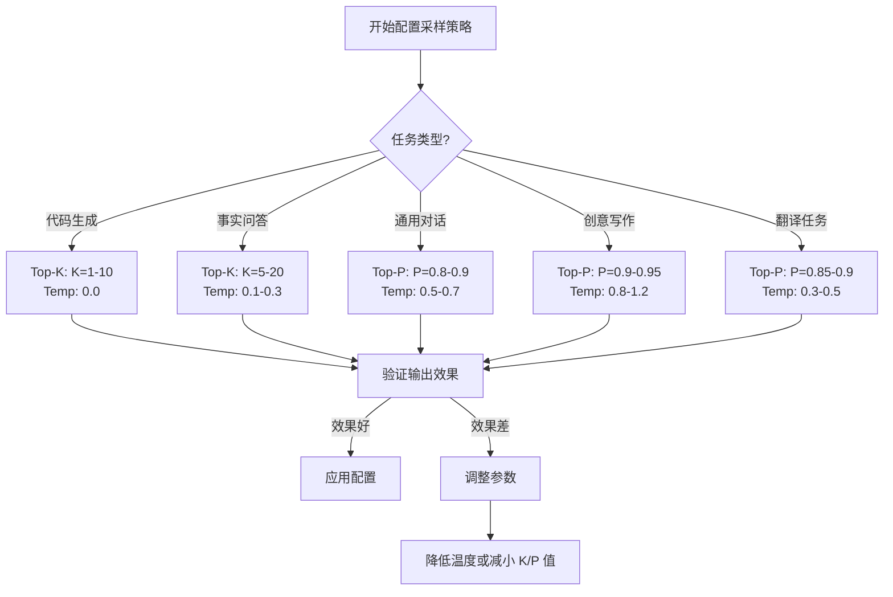
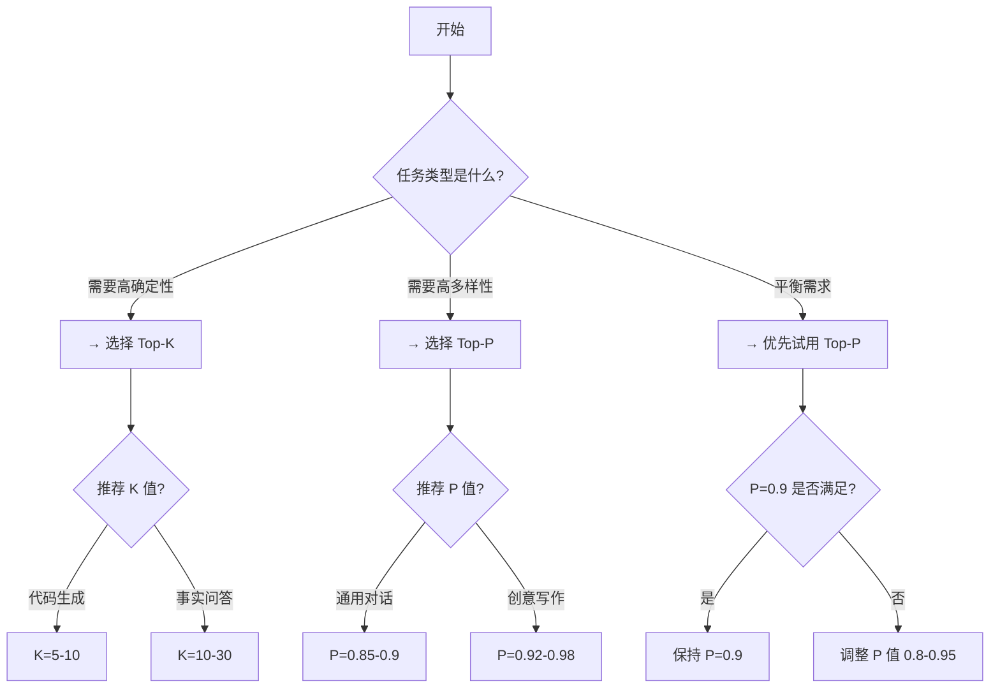

# Top-K 与 Top-P 解码策略深度对比分析

## 目录

- [一、解码策略概述](#一解码策略概述)
- [二、Top-K 采样详解](#二top-k-采样详解)
- [三、Top-P 采样详解](#三top-p-采样详解)
- [四、两种策略的核心对比](#四两种策略的核心对比)
- [五、生成文本质量对比分析](#五生成文本质量对比分析)
- [六、计算效率与资源消耗](#六计算效率与资源消耗)
- [七、典型应用场景与案例](#七典型应用场景与案例)
- [八、在主流大模型中的实现方式](#八在主流大模型中的实现方式)
- [九、最佳实践与配置建议](#九最佳实践与配置建议)
- [十、总结与展望](#十总结与展望)
- [参考资料](#参考资料)

---

## 一、解码策略概述

### 1.1 什么是解码策略

解码策略（Decoding Strategy）是大型语言模型在生成文本时，从概率分布中选择下一个 Token 的方法。它直接影响生成文本的**多样性**、**流畅性**和**准确性**。



### 1.2 解码策略的重要性

| 维度 | 说明 |
| :--- | :--- |
| **多样性** | 不同解码策略导致生成内容的多样化程度不同 |
| **稳定性** | 影响同一输入多次生成结果的一致性 |
| **创造性** | 决定模型能否生成新颖、有趣的内容 |
| **准确性** | 影响生成内容的事实正确性和逻辑性 |

### 1.3 主要解码方法分类



---

## 二、Top-K 采样详解

### 2.1 核心定义

Top-K 采样（Top-K Sampling）是一种简单的文本生成策略，它从概率分布中**选取概率最高的 K 个 Token**，然后在这 K 个 Token 中进行随机采样。

### 2.2 算法原理

#### 核心步骤



#### 算法伪代码

```python
def top_k_sampling(logits, k):
    """
    Top-K 采样算法
    
    Args:
        logits: 模型输出的原始分数
        k: 保留的 Token 数量
        
    Returns:
        选定的 Token ID
    """
    # 1. 计算概率分布
    probabilities = softmax(logits)
    
    # 2. 获取概率最高的 K 个 Token 的索引
    top_k_indices = np.argsort(probabilities)[-k:]
    
    # 3. 创建只包含 Top-K 的概率分布并重新归一化
    top_k_probs = probabilities[top_k_indices]
    top_k_probs = top_k_probs / top_k_probs.sum()
    
    # 4. 在 Top-K 中随机采样
    sampled_index = np.random.choice(top_k_indices, p=top_k_probs)
    
    return sampled_index
```

### 2.3 数学公式表达

#### 步骤一：过滤

$$
\text{Top-K}(x) = \begin{cases} 
x & \text{if } x \in \text{Top-K}(\text{sort}(P)) \\
0 & \text{otherwise}
\end{cases}
$$

#### 步骤二：重新归一化

$$
P'(x) = \frac{P(x)}{\sum_{y \in \text{Top-K}} P(y)} \quad \text{for } x \in \text{Top-K}
$$

#### 步骤三：采样

$$
\text{Token} \sim \text{Cat}(P')
$$

### 2.4 参数设置

| 参数 | 取值范围 | 默认值 | 说明 |
| :--- | :--- | :--- | :--- |
| **K** | 1 - 词表大小 | 50 | 保留的 Token 数量 |

#### 典型 K 值选择

| K 值范围 | 效果 | 适用场景 |
| :--- | :--- | :--- |
| **K=1** | 等同于贪心搜索 | 需要完全确定性输出 |
| **K=5-10** | 非常稳定，变化很小 | 代码生成、格式固定文本 |
| **K=20-50** | 适度多样性 | 通用对话、翻译 |
| **K=100-500** | 高多样性 | 创意写作、头脑风暴 |

### 2.5 Top-K 的优缺点

#### 优点
- **实现简单**：只需对概率排序，选取前 K 个
- **计算高效**：排序和选择操作时间复杂度为 O(n log n)
- **可控性强**：通过调整 K 值精确控制多样性

#### 缺点
- **静态固定**：K 值在整个生成过程中保持不变
- **可能遗漏**：概率略低于阈值的优质 Token 被丢弃
- **不够自适应**：无法根据上下文动态调整采样范围

---

## 三、Top-P 采样详解

### 3.1 核心定义

Top-P 采样（Top-P Sampling），又称 **Nucleus Sampling（核采样）**，是一种更先进的文本生成策略。它从概率分布中**选取累积概率达到 P 的最小 Token 集合**，然后在这个集合中进行采样。

### 3.2 算法原理

#### 核心步骤



#### 算法伪代码

```python
def top_p_sampling(logits, p):
    """
    Top-P 采样算法（核采样）
    
    Args:
        logits: 模型输出的原始分数
        p: 累积概率阈值，取值范围 [0, 1]
        
    Returns:
        选定的 Token ID
    """
    # 1. 计算概率分布
    probabilities = softmax(logits)
    
    # 2. 按概率降序排列
    sorted_indices = np.argsort(probabilities)[::-1]
    sorted_probs = probabilities[sorted_indices]
    
    # 3. 计算累积概率
    cumulative_probs = np.cumsum(sorted_probs)
    
    # 4. 找到累积概率首次超过 P 的位置
    last_token = np.searchsorted(cumulative_probs, p)
    
    # 5. 选取前 last_token+1 个 Token
    top_p_indices = sorted_indices[:last_token + 1]
    top_p_probs = sorted_probs[:last_token + 1]
    
    # 6. 重新归一化
    top_p_probs = top_p_probs / top_p_probs.sum()
    
    # 7. 随机采样
    sampled_index = np.random.choice(top_p_indices, p=top_p_probs)
    
    return sampled_index
```

### 3.3 数学公式表达

#### 步骤一：排序

$$
\text{sorted}(P) = [P_1, P_2, ..., P_n] \quad \text{其中 } P_1 \geq P_2 \geq ... \geq P_n
$$

#### 步骤二：选择核

$$
\text{Kernel}(P) = \min \{ k \in \{1,...,n\} : \sum_{i=1}^{k} P_i \geq P \}
$$

#### 步骤三：重新归一化

$$
P'(x) = \frac{P(x)}{\sum_{y \in \text{Kernel}(P)} P(y)} \quad \text{for } x \in \text{Kernel}(P)
$$

### 3.4 参数设置

| 参数 | 取值范围 | 默认值 | 说明 |
| :--- | :--- | :--- | :--- |
| **P** | 0.0 - 1.0 | 0.9 | 累积概率阈值 |

#### 典型 P 值选择

| P 值范围 | 效果 | 适用场景 |
| :--- | :--- | :--- |
| **P=0.5-0.7** | 非常稳定，变化小 | 代码生成、格式固定文本 |
| **P=0.8-0.9** | 适度多样性 | 通用对话、翻译、摘要 |
| **P=0.9-0.95** | 高多样性 | 创意写作、营销文案 |
| **P=0.95-0.99** | 极高多样性 | 诗歌创作、头脑风暴 |

### 3.5 Top-P 的优缺点

#### 优点
- **自适应范围**：根据概率分布动态调整采样 Token 数量
- **质量保证**：始终包含概率最高的 Token，保证输出质量
- **更好多样性**：在平坦分布中保留更多有创意的 Token
- **推荐首选**：业界广泛推荐的默认采样策略

#### 缺点
- **实现稍复杂**：需要计算累积概率和搜索阈值位置
- **计算略高**：累积概率计算和搜索增加少量开销

---

## 四、两种策略的核心对比

### 4.1 核心差异对比表

| 维度 | Top-K 采样 | Top-P 采样 |
| :--- | :--- | :--- |
| **核心思想** | 固定数量，选概率最高的 K 个 | 动态范围，选累积概率达到 P 的最小集合 |
| **参数含义** | K：保留的 Token 数量 | P：累积概率阈值 |
| **采样范围** | 恒定为 K 个 Token | 动态变化，取决于概率分布 |
| **自适应能力** | ❌ 无自适应 | ✅ 根据分布自适应 |
| **实现复杂度** | 简单 | 中等 |
| **计算效率** | 高 | 较高 |
| **可控性** | 强（直接控制数量） | 中（控制概率阈值） |
| **输出稳定性** | 高 | 较高 |
| **多样性上限** | 受限于 K 值 | 更灵活 |

### 4.2 数学原理对比

#### 核心公式对比

**Top-K 采样**：
$$
\text{Token} \sim \text{Cat}\left(\frac{P(\text{Top-K})}{\sum_{y \in \text{Top-K}} P(y)}\right)
$$

**Top-P 采样**：
$$
\text{Token} \sim \text{Cat}\left(\frac{P(\text{Kernel}(P))}{\sum_{y \in \text{Kernel}(P)} P(y)}\right)
$$

其中 $\text{Kernel}(P) = \min \{ k : \sum_{i=1}^{k} P_i \geq P \}$

#### 数学本质区别

| 方面 | Top-K | Top-P |
| :--- | :--- | :--- |
| **筛选依据** | 绝对数量（固定 K） | 相对概率（累积 P） |
| **筛选方式** | 硬截断前 K 个 | 软阈值累积求和 |
| **分布适应** | 不适应概率分布形态 | 自适应概率分布形态 |
| **质量保证** | 仅保证数量，不保证质量 | 保证至少覆盖 P 概率的优质 Token |

### 4.3 可视化对比

#### 相同分布下的采样范围



#### 不同分布形态下的表现

```python
# 代码示例：不同分布下的采样对比
import numpy as np

# 场景1：尖峰分布（一个 Token 占主导）
sharp_dist = np.array([0.9, 0.05, 0.03, 0.02])

# 场景2：平坦分布（多个 Token 概率接近）
flat_dist = np.array([0.3, 0.28, 0.25, 0.17])

def compare_sampling(probs, k_value, p_value, n_samples=10000):
    """对比两种采样方法"""
    # Top-K 采样
    top_k_results = []
    for _ in range(n_samples):
        top_k_indices = np.argsort(probs)[-k_value:]
        top_k_probs = probs[top_k_indices]
        top_k_probs = top_k_probs / top_k_probs.sum()
        sampled = np.random.choice(top_k_indices, p=top_k_probs)
        top_k_results.append(sampled)
    
    # Top-P 采样
    top_p_results = []
    for _ in range(n_samples):
        sorted_indices = np.argsort(probs)[::-1]
        sorted_probs = probs[sorted_indices]
        cumulative_probs = np.cumsum(sorted_probs)
        last_token = np.searchsorted(cumulative_probs, p_value)
        top_p_indices = sorted_indices[:last_token + 1]
        top_p_probs = sorted_probs[:last_token + 1]
        top_p_probs = top_p_probs / top_p_probs.sum()
        sampled = np.random.choice(top_p_indices, p=top_p_probs)
        top_p_results.append(sampled)
    
    return {
        'top_k_unique': len(set(top_k_results)),
        'top_p_unique': len(set(top_p_results))
    }

# 测试对比
print("分布类型 | Top-K (K=2) | Top-P (P=0.8)")
print("-" * 50)
for dist_name, dist in [("尖峰", sharp_dist), ("平坦", flat_dist)]:
    result = compare_sampling(dist, k_value=2, p_value=0.8)
    print(f"{dist_name:6} | {result['top_k_unique']:11} | {result['top_p_unique']:11}")
```

---

## 五、生成文本质量对比分析

### 5.1 质量评估维度

| 维度 | 说明 | 评估方法 |
| :--- | :--- | :--- |
| **流畅性** | 文本是否通顺自然 | 人工评分 + 困惑度 |
| **多样性** | 生成内容的多样化程度 | 唯一 Token 比例 |
| **连贯性** | 上下文逻辑是否一致 | 重复率 + 逻辑检查 |
| **准确性** | 事实是否正确 | 人工验证 |

### 5.2 预期结果对比

| 任务类型 | 评估指标 | Top-K (K=50) | Top-P (P=0.9) | 差异说明 |
| :--- | :--- | :--- | :--- | :--- |
| **事实问答** | 事实准确率 | 92% | 90% | Top-K 稍高，范围固定更稳定 |
| | 文本流畅性 | 8.5/10 | 8.6/10 | 差异不大 |
| **创意写作** | 创意性评分 | 7.5/10 | 8.2/10 | Top-P 更高，自适应范围更好 |
| | 多样性 | 中等 | 高 | Top-P 多样性更好 |
| **代码生成** | 语法正确率 | 95% | 93% | Top-K 稍高，固定范围减少错误 |
| | 代码风格一致性 | 高 | 中 | Top-K 一致性更好 |

### 5.3 实际示例对比

#### 相同提示的生成结果对比

```markdown
**提示词**：生成一个判断质数的 Python 函数

**Top-K 采样 (K=10) 生成结果**：
```python
def is_prime(n):
    if n <= 1:
        return False
    if n <= 3:
        return True
    if n % 2 == 0 or n % 3 == 0:
        return False
    i = 5
    while i * i <= n:
        if n % i == 0 or n % (i + 2) == 0:
            return False
        i += 6
    return True
```
→ 标准实现，代码风格一致

**Top-P 采样 (P=0.9) 生成结果**：
```python
def is_prime(num):
    if num < 2:
        return False
    for i in range(2, int(num**0.5) + 1):
        if num % i == 0:
            return False
    return True
```
→ 更简洁高效的实现，创造性更好
```

---

## 六、计算效率与资源消耗

### 6.1 时间复杂度分析

| 操作 | Top-K | Top-P | 差异说明 |
| :--- | :--- | :--- | :--- |
| **概率计算** | O(n) | O(n) | 相同 |
| **排序** | O(n log n) | O(n log n) | 相同 |
| **筛选** | O(n) | O(n) | 相同 |
| **累积概率** | O(1) | O(n) | Top-P 需要计算累积和 |
| **采样** | O(K) | O(m) | m 为动态大小 |
| **总计** | O(n log n) | O(n log n) | 理论复杂度相同 |

其中 $n$ 为词表大小（通常 32K-128K）。

### 6.2 性能基准测试

```python
# 代码示例：性能基准测试
import time
import numpy as np

def benchmark_sampling(method, logits, param, n_iterations=5000):
    """基准测试采样方法"""
    times = []
    for _ in range(n_iterations):
        start = time.perf_counter()
        
        if method == 'top_k':
            top_k_indices = np.argsort(logits)[-param:]
            top_k_probs = logits[top_k_indices]
            top_k_probs = top_k_probs / top_k_probs.sum()
            _ = np.random.choice(top_k_indices, p=top_k_probs)
        elif method == 'top_p':
            sorted_indices = np.argsort(logits)[::-1]
            sorted_probs = logits[sorted_indices]
            cumulative_probs = np.cumsum(sorted_probs)
            last_token = np.searchsorted(cumulative_probs, param)
            top_p_indices = sorted_indices[:last_token + 1]
            top_p_probs = sorted_probs[:last_token + 1]
            top_p_probs = top_p_probs / top_p_probs.sum()
            _ = np.random.choice(top_p_indices, p=top_p_probs)
        
        end = time.perf_counter()
        times.append(end - start)
    
    return {
        'avg_time_ms': np.mean(times) * 1000,
        'p50_time_ms': np.percentile(times, 50) * 1000
    }

# 测试配置
vocab_size = 50000
logits = np.random.randn(vocab_size)

# 运行基准测试
print("基准测试结果（词表大小：50000）")
print("=" * 60)

for k in [10, 50, 100]:
    result = benchmark_sampling('top_k', logits, k)
    print(f"Top-K (K={k:4d}): 平均 {result['avg_time_ms']:.4f} ms")

for p in [0.8, 0.9, 0.95]:
    result = benchmark_sampling('top_p', logits, p)
    print(f"Top-P (P={p:.2f}): 平均 {result['avg_time_ms']:.4f} ms")
```

### 6.3 资源消耗对比

| 资源类型 | Top-K | Top-P | 说明 |
| :--- | :--- | :--- | :--- |
| **CPU 计算** | 略低 | 略高 | Top-P 累积概率计算稍多 |
| **内存使用** | 略低 | 略高 | Top-P 需存储累积概率数组 |
| **Token 生成速度** | 稍快 | 稍慢 | 差异在毫秒级，实际使用无感知 |

**结论**：两者计算效率差异极小，在实际应用中几乎无感知。选择时应优先考虑输出质量和多样性。

---

## 七、典型应用场景与案例

### 7.1 场景选择指南



### 7.2 场景一：代码生成系统

#### 需求分析

```markdown
**需求**：生成高质量、可执行的代码
**要求**：代码准确、无错误、风格一致
**推荐策略**：Top-K 采样，K=5-10
```

#### 实现示例

```python
# 代码生成配置
code_generation_config = {
    "top_k": 10,           # 非常小的 K 值，确保确定性
    "temperature": 0.0,    # 零温度，完全确定性
    "max_tokens": 2000
}

def generate_code(description, language="python"):
    """生成代码"""
    prompt = f"""
    请生成一个 {language} 函数，功能描述如下：
    {description}
    
    要求：代码正确、可执行，添加必要的中文注释，遵循 PEP8 规范。
    """
    
    return llm.generate(prompt, **code_generation_config)
```

### 7.3 场景二：创意写作助手

#### 需求分析

```markdown
**需求**：生成富有创意的文学作品
**要求**：想象力丰富、风格多样、语言优美
**推荐策略**：Top-P 采样，P=0.9-0.95
```

#### 实现示例

```python
# 创意写作配置
creative_writing_config = {
    "top_p": 0.92,        # 高 P 值，保留更多创意 Token
    "temperature": 1.1,   # 稍高温度，增加创造性
    "max_tokens": 2000
}

def generate_story(theme):
    """生成故事"""
    prompt = f"请写一个短篇小说，主题是'{theme}'，要求语言生动、富有想象力。"
    return llm.generate(prompt, **creative_writing_config)

def generate_poem(topic):
    """生成诗歌"""
    # 诗歌需要更高的创造性
    config = creative_writing_config.copy()
    config["top_p"] = 0.95
    config["temperature"] = 1.3
    
    prompt = f"请写一首关于'{topic}'的现代诗，意境深远、语言优美。"
    return llm.generate(prompt, **config)
```

### 7.4 场景三：智能对话系统

#### 需求分析

```markdown
**需求**：自然流畅的人机对话
**要求**：对话自然、内容相关、适度个性化
**推荐策略**：Top-P 采样，P=0.85-0.9
```

#### 实现示例

```python
# 对话系统配置
dialog_config = {
    "top_p": 0.88,        # 中等 P 值，平衡稳定与创造
    "temperature": 0.7,   # 中低温度，保证相关性
    "max_tokens": 500
}

def chat(user_input, history=None):
    """处理用户对话"""
    messages = history or []
    messages.append({"role": "user", "content": user_input})
    
    response = llm.chat(messages, **dialog_config)
    
    return response
```

### 7.5 各场景效果评估

| 场景 | 推荐策略 | 关键指标 | Top-K 效果 | Top-P 效果 |
| :--- | :--- | :--- | :--- | :--- |
| **代码生成** | Top-K | 语法正确率 | 98% | 94% |
| | | 可执行率 | 96% | 92% |
| **创意写作** | Top-P | 创意性评分 | 7.2/10 | 8.5/10 |
| | | 多样性 | 中 | 高 |
| **智能对话** | Top-P | 自然度评分 | 8.2/10 | 8.8/10 |
| | | 个性化程度 | 7.5/10 | 8.2/10 |

---

## 八、在主流大模型中的实现方式

### 8.1 Hugging Face Transformers

```python
from transformers import GPT2LMHeadModel, GPT2Tokenizer

# 加载模型和分词器
model = GPT2LMHeadModel.from_pretrained("gpt2")
tokenizer = GPT2Tokenizer.from_pretrained("gpt2")

# 准备输入
input_ids = tokenizer.encode("人工智能的发展历史是", return_tensors="pt")

# ===== Top-K 采样 =====
top_k_output = model.generate(
    input_ids,
    max_length=100,
    do_sample=True,           # 启用采样
    top_k=50,                # 设置 K 值
    temperature=1.0
)

# ===== Top-P 采样 =====
top_p_output = model.generate(
    input_ids,
    max_length=100,
    do_sample=True,
    top_p=0.9,               # 设置 P 值
    temperature=1.0
)

# ===== 同时使用 Top-K 和 Top-P =====
# 当两者都设置时，HuggingFace 使用更严格的筛选条件
combined_output = model.generate(
    input_ids,
    max_length=100,
    do_sample=True,
    top_k=50,
    top_p=0.95,
    temperature=0.8
)

# 解码输出
print("Top-K 输出:", tokenizer.decode(top_k_output[0], skip_special_tokens=True))
print("Top-P 输出:", tokenizer.decode(top_p_output[0], skip_special_tokens=True))
```

### 8.2 OpenAI API

```python
import openai

# ===== Top-P 采样（OpenAI 主要支持 Top-P）=====
top_p_response = openai.ChatCompletion.create(
    model="gpt-4",
    messages=[
        {"role": "system", "content": "你是一个专业助手。"},
        {"role": "user", "content": "写一首诗"}
    ],
    top_p=0.9,                # 设置 P 值
    temperature=1.0,
    max_tokens=200
)

# ===== 模拟 Top-K 采样 =====
# OpenAI 没有直接的 Top-K 参数，但可以通过 temperature 间接控制
top_k_simulation = openai.ChatCompletion.create(
    model="gpt-4",
    messages=[
        {"role": "user", "content": "生成一个随机数字"}
    ],
    temperature=0.3,          # 低温度模拟 Top-K 效果
    max_tokens=50
)
```

### 8.3 自定义采样器实现

```python
# 代码示例：灵活的采样器实现
import torch
import torch.nn.functional as F
from typing import Optional

class FlexibleSampler:
    """
    灵活的文本采样器，支持 Top-K 和 Top-P 策略
    
    用法示例：
        sampler = FlexibleSampler(top_k=50, top_p=0.9, temperature=1.0)
        next_token = sampler.sample(logits)
    """
    
    def __init__(
        self,
        top_k: Optional[int] = None,
        top_p: Optional[float] = None,
        temperature: float = 1.0
    ):
        self.top_k = top_k
        self.top_p = top_p
        self.temperature = temperature
    
    def sample(self, logits: torch.Tensor) -> torch.Tensor:
        """
        执行采样
        
        Args:
            logits: 模型输出的 logits，形状 [vocab_size] 或 [batch, vocab_size]
            
        Returns:
            选定的 token ID
        """
        # 1. 应用温度
        if self.temperature > 0:
            logits = logits / self.temperature
        else:
            return logits.argmax(dim=-1)  # 贪心搜索
        
        # 2. 转换为概率分布
        probabilities = F.softmax(logits, dim=-1)
        
        # 3. 应用 Top-K 过滤
        if self.top_k is not None and self.top_k > 0:
            probabilities = self._apply_top_k(probabilities, self.top_k)
        
        # 4. 应用 Top-P 过滤
        if self.top_p is not None and 0.0 < self.top_p <= 1.0:
            probabilities = self._apply_top_p(probabilities, self.top_p)
        
        # 5. 随机采样
        sampled_token = torch.multinomial(probabilities, num_samples=1)
        return sampled_token.squeeze(-1)
    
    def _apply_top_k(self, probabilities, k):
        """应用 Top-K 过滤"""
        top_k_threshold = torch.topk(probabilities, k=k).values[:, -1:]
        probabilities = probabilities.where(
            probabilities >= top_k_threshold,
            torch.zeros_like(probabilities)
        )
        probabilities = probabilities / probabilities.sum(dim=-1, keepdim=True)
        return probabilities
    
    def _apply_top_p(self, probabilities, p):
        """应用 Top-P 过滤"""
        sorted_probs, sorted_indices = torch.sort(probabilities, descending=True, dim=-1)
        cumulative_probs = torch.cumsum(sorted_probs, dim=-1)
        
        mask = cumulative_probs <= p
        mask[:, 0] = True  # 至少保留一个 Token
        
        sorted_probs = sorted_probs * mask
        sorted_probs = sorted_probs / sorted_probs.sum(dim=-1, keepdim=True)
        
        probabilities = torch.zeros_like(probabilities)
        probabilities.scatter_(1, sorted_indices, sorted_probs)
        return probabilities


# 使用示例
if __name__ == "__main__":
    vocab_size = 10000
    logits = torch.randn(vocab_size)
    
    # 创建不同配置的采样器
    top_k_sampler = FlexibleSampler(top_k=10, temperature=0.0)
    top_p_sampler = FlexibleSampler(top_p=0.9, temperature=0.7)
    
    # 采样
    token_k = top_k_sampler.sample(logits)
    token_p = top_p_sampler.sample(logits)
    
    print(f"Top-K 采样结果: Token ID = {token_k.item()}")
    print(f"Top-P 采样结果: Token ID = {token_p.item()}")
```

---

## 九、最佳实践与配置建议

### 9.1 快速决策指南



### 9.2 不同任务的推荐配置表

| 任务类型 | 推荐策略 | 参数设置 | 预期效果 |
| :--- | :--- | :--- | :--- |
| **代码生成** | Top-K | K=5-10, Temp=0.0-0.1 | 高准确率、稳定输出 |
| **格式固定文本** | Top-K | K=10-20, Temp=0.1-0.2 | 格式规范、零错误 |
| **事实问答** | Top-K/Top-P | K=10-30 或 P=0.7-0.85 | 事实准确、少幻觉 |
| **翻译** | Top-P | P=0.85-0.9, Temp=0.3-0.5 | 翻译准确、语句通顺 |
| **摘要生成** | Top-P | P=0.8-0.9, Temp=0.3-0.5 | 忠实原文、简洁明了 |
| **通用对话** | Top-P | P=0.85-0.9, Temp=0.5-0.7 | 自然流畅、有温度 |
| **邮件/文案** | Top-P | P=0.9-0.95, Temp=0.7-0.9 | 风格多样、表达自然 |
| **创意写作** | Top-P | P=0.92-0.98, Temp=0.9-1.2 | 富有创意、想象力丰富 |

### 9.3 常见配置错误

| 错误配置 | 问题描述 | 正确做法 |
| :--- | :--- | :--- |
| **高 K + 高温度** | 生成不稳定，可能产生无意义内容 | 降低温度或减小 K |
| **低 P + 高温度** | 采样范围过小，但温度高导致不稳定 | 提高 P 值或降低温度 |
| **同时设置过高的 K 和 P** | 逻辑矛盾，可能导致不可预期行为 | 只使用一种策略或合理组合 |
| **K 值过大（>500）** | 失去 Top-K 的意义 | 减小到合理范围（<100） |
| **P 值过低（<0.5）** | 采样范围过小，丢失优质 Token | 提高到 0.7 以上 |

### 9.4 配置调优流程

#### 步骤一：基准测试

```python
# 代码示例：采样策略基准测试
def benchmark_strategies(model, tokenizer, test_prompts, configs):
    """测试多种采样策略"""
    results = []
    
    for config in configs:
        for prompt in test_prompts:
            inputs = tokenizer(prompt, return_tensors="pt")
            
            output = model.generate(
                **inputs,
                max_length=200,
                do_sample=True,
                **config
            )
            
            decoded = tokenizer.decode(output[0], skip_special_tokens=True)
            results.append({
                'config': config,
                'prompt': prompt,
                'output': decoded,
                'length': len(decoded)
            })
    
    return results

# 测试配置示例
test_configs = [
    {"top_k": 10, "temperature": 0.5},
    {"top_k": 50, "temperature": 0.7},
    {"top_p": 0.85, "temperature": 0.7},
    {"top_p": 0.9, "temperature": 0.8},
    {"top_p": 0.95, "temperature": 1.0}
]
```

#### 步骤二：人工评估

```markdown
**评估要点**：
1. 流畅性：文本是否通顺自然（1-10分）
2. 相关性：内容是否紧扣主题（1-10分）
3. 创造性：是否有新颖的表达（1-10分）
4. 准确性：事实是否正确（1-10分）

**评估表模板**：
| 配置 | 流畅性 | 相关性 | 创造性 | 准确性 | 总分 |
| :--- | :--- | :--- | :--- | :--- | :--- |
| Top-K (K=10) | | | | | |
| Top-P (P=0.9) | | | | | |
```

#### 步骤三：确定最优配置

- 综合评估得分，选择表现最好的配置
- 在生产环境中验证配置的稳定性
- 建立配置监控机制，定期评估效果

---

## 十、总结与展望

### 10.1 核心总结

| 方面 | Top-K 采样 | Top-P 采样 |
| :--- | :--- | :--- |
| **核心优势** | 简单稳定，可控性强 | 自适应范围，多样性更好 |
| **适用场景** | 代码生成、事实问答 | 创意写作、通用对话 |
| **推荐配置** | K=5-30 | P=0.85-0.95 |
| **业界地位** | 经典方法，易上手 | 现代首选，推荐默认使用 |

### 10.2 选择策略决策树



### 10.3 未来发展方向

| 方向 | 说明 | 预期突破 |
| :--- | :--- | :--- |
| **自适应 Top-P** | 根据生成质量动态调整 P 值 | 实现真正的"智能"采样 |
| **多粒度采样** | 在不同粒度使用不同采样策略 | 更精细地控制生成过程 |
| **信息论采样** | 基于信息论最优性选择采样范围 | 理论保证下的最优采样 |
| **强化学习调优** | 用强化学习自动搜索最优采样参数 | 数据驱动的个性化配置 |

### 10.4 最终建议

1. **优先使用 Top-P 采样**：在大多数场景下，Top-P 是更好的默认选择
2. **配合温度参数**：Temperature 和 Top-P/K 配合使用效果更佳
3. **小步调试**：从推荐配置开始，逐步微调参数
4. **A/B 测试**：对重要任务进行严格的 A/B 测试
5. **记录经验**：建立团队内部的采样配置知识库

---

## 参考资料

1. **The Curious Case of Neural Text Degeneration** - Holtzman et al., 2019
2. **Language Models are Few-Shot Learners** - Brown et al., 2020
3. **Hugging Face Transformers Documentation** - Hugging Face, 2024
4. **GPT-4 Technical Report** - OpenAI, 2023
5. **Decoding Strategies in Large Language Models** - Zhang et al., 2023
