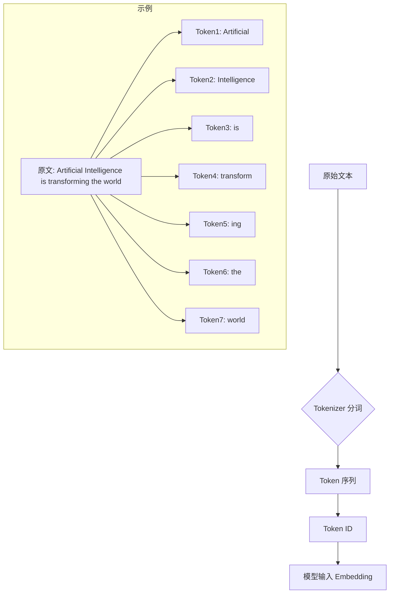
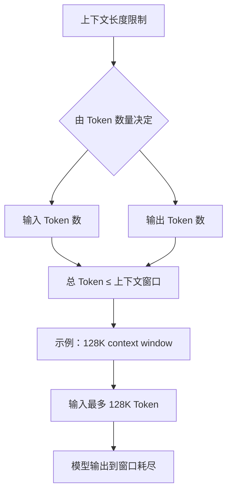
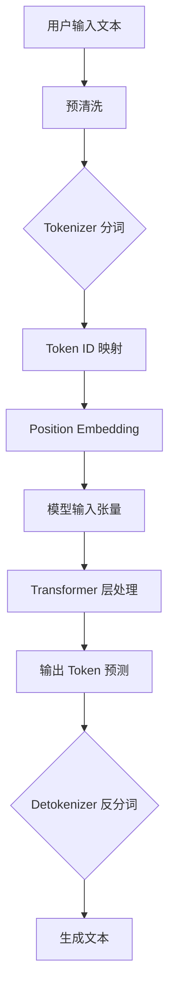
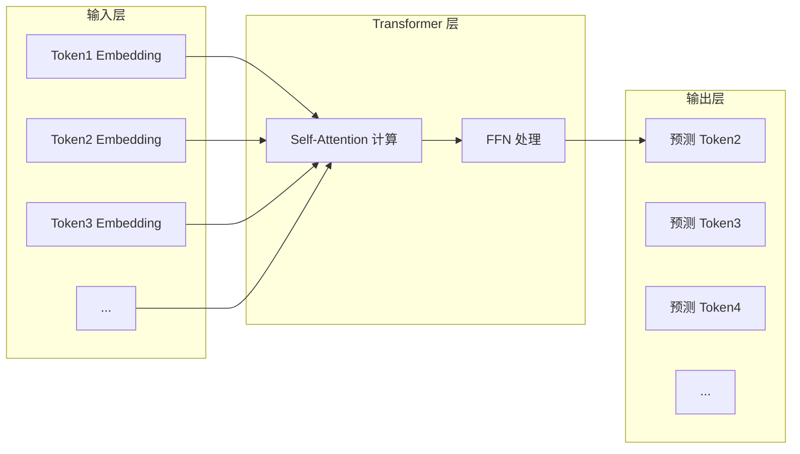
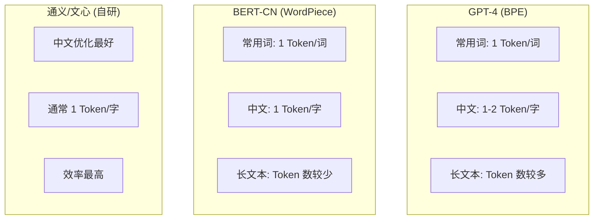
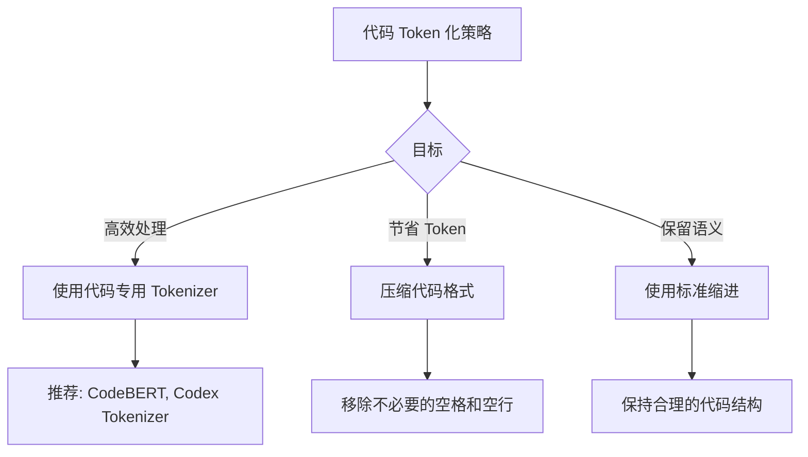
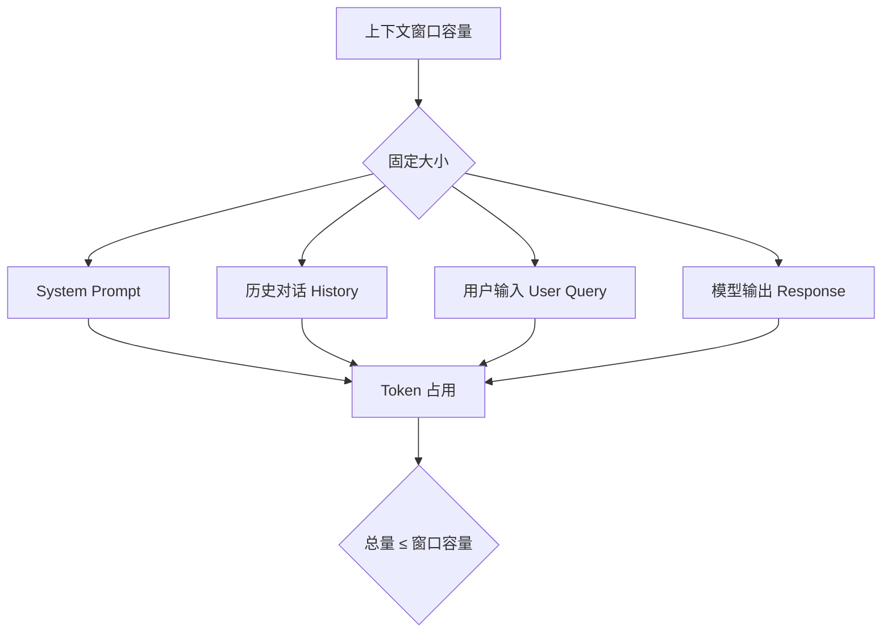
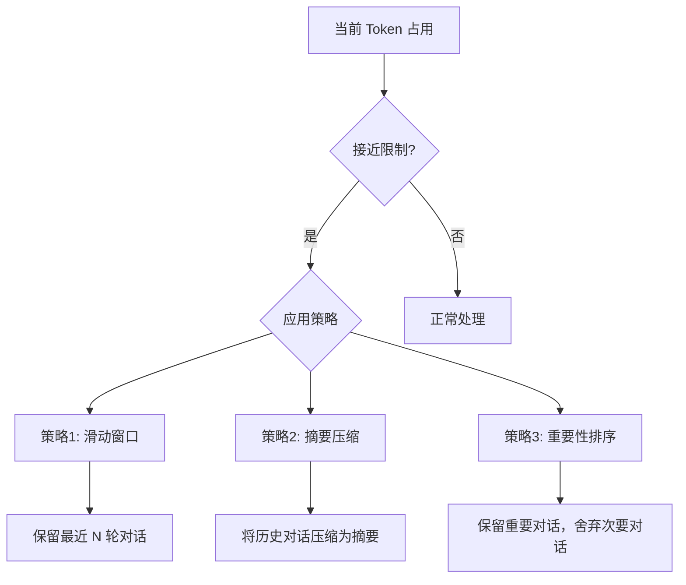
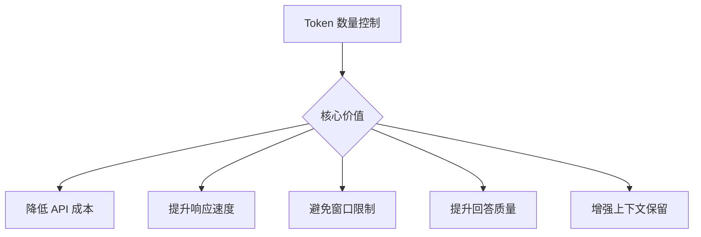
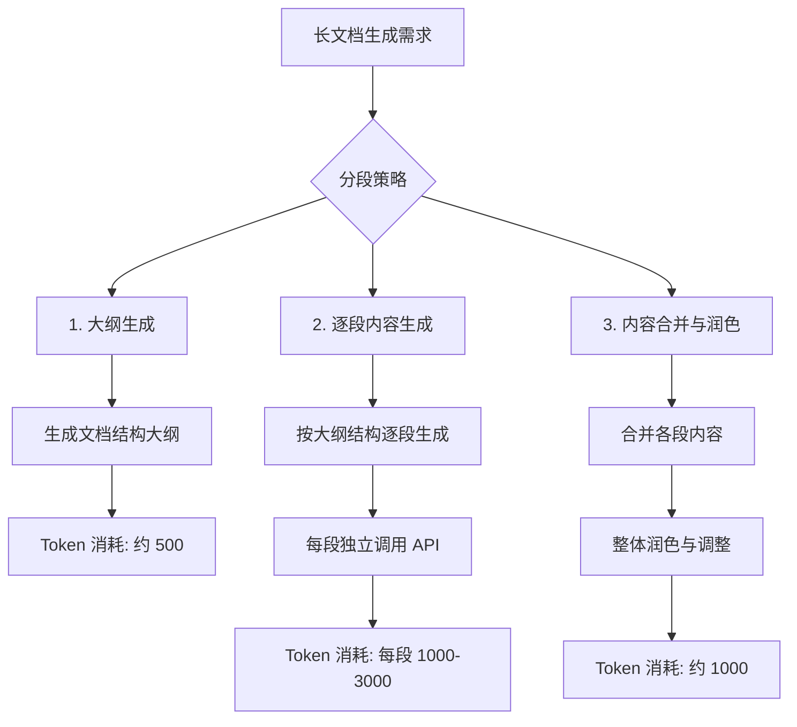

# Token 数量与上下文长度关系详解

## 目录

- [一、Token 与上下文长度的基本概念](#一token-与上下文长度的基本概念)
- [二、大模型处理文本的核心原理](#二大模型处理文本的核心原理)
- [三、Token 化的核心机制与算法](#三token-化的核心机制与算法)
- [四、Token 数量的量化分析](#四token-数量的量化分析)
- [五、不同文本类型的 Token 化差异](#五不同文本类型的-token-化差异)
- [六、Token 数量对上下文窗口的影响](#六token-数量对上下文窗口的影响)
- [七、控制 Token 数量的实用策略](#七控制-token-数量的实用策略)
- [八、实战案例分析](#八实战案例分析)
- [九、总结与最佳实践](#九总结与最佳实践)
- [参考资料](#参考资料)

---

## 一、Token 与上下文长度的基本概念

### 1.1 什么是 Token

Token（令牌/标记）是大语言模型处理文本的最小语义单位。它不是简单的字符或单词，而是经过 Tokenizer（分词器）处理后生成的、具有统计意义的文本片段。



### 1.2 什么是上下文长度

上下文长度（Context Length）是指模型在单次交互中能够处理的最大 Token 数量。它定义了模型的"记忆窗口"大小，包括输入的 Prompt 和生成的 Response。

### 1.3 核心关系概述



---

## 二、大模型处理文本的核心原理

### 2.1 从文本到 Token 的处理流程



### 2.2 Tokenizer 的作用

Tokenizer 是大语言模型的"第一站"，它的核心任务是将人类可读的文本转换为模型能够处理的数字序列。

```python
# 代码示例：Tokenizer 的基本使用
from transformers import GPT2Tokenizer

# 加载 Tokenizer
tokenizer = GPT2Tokenizer.from_pretrained("gpt2")

# 文本 Token 化
text = "人工智能正在改变世界的方方面面"
tokens = tokenizer.encode(text)
decoded_text = tokenizer.decode(tokens)

print(f"原始文本: {text}")
print(f"Token ID 序列: {tokens}")
print(f"Token 数量: {len(tokens)}")
print(f"解码后文本: {decoded_text}")
```

### 2.3 模型的 Token 级处理

#### Transformer 的工作方式



**关键特性**：
- 模型按 Token 逐个处理序列
- 每个 Token 都会与前面的所有 Token 进行 Attention 计算
- 处理复杂度与序列长度的平方成正比（O(n²)）

---

## 三、Token 化的核心机制与算法

### 3.1 主要 Tokenization 算法

#### 3.1.1 BPE（Byte-Pair Encoding）

BPE 是目前最主流的 Tokenization 算法，被 GPT 系列、LLaMA、BERT 等模型采用。

#### BPE 核心思想

1. 从字符级开始，逐步合并频率最高的字符对
2. 合并后的 Token 可以是字符、子词或完整单词
3. 通过贪心策略构建有效的词表

```python
# 代码示例：BPE Tokenization 模拟
def bpe_tokenize(text, vocab_size=100):
    """简化的 BPE 分词"""
    # 1. 初始化为字符级
    tokens = list(text)
    
    # 2. 统计字符对频率并合并
    for _ in range(vocab_size):
        # 找到最常见的字符对
        pairs = get_freq_pairs(tokens)
        if not pairs:
            break
        
        # 合并最常见的对
        best_pair = max(pairs, key=pairs.get)
        tokens = merge_tokens(tokens, best_pair)
    
    return tokens

# 示例
text = "unhappiness"
# BPE 可能产生: ["un", "happiness"] 或 ["un", "happy", "ness"]
```

#### BPE 的优缺点

| 优点 | 缺点 |
| :--- | :--- |
| 能够处理未知词（OOV） | Token 化结果可能不符合直觉 |
| 词表效率高 | 中文分词效率较低 |
| 压缩效果好 | 可能产生语义不完整的子词 |

#### 3.1.2 WordPiece

WordPiece 是 Google 提出的 Tokenization 算法，被 BERT 系列采用。

#### 核心特点

- 与 BPE 类似的子词分词思路
- 使用更长的子词模式
- 对中文支持更好

### 3.2 Tokenizer 配置对比

#### 主流模型的 Tokenizer 配置

| 模型 | Tokenizer 类型 | 词表大小 | 适用语言 |
| :--- | :--- | :--- | :--- |
| **GPT-4** | BPE | 100K+ | 多语言优化 |
| **LLaMA 2** | BPE | 32K | 主要英文 |
| **BERT** | WordPiece | 30K | 多语言 |
| **GPT-NEOX** | BPE | 50K | 英文为主 |
| **文心一言** | 自研 | 100K+ | 中文优化 |
| **通义** | 自研 | 100K+ | 中文优化 |

### 3.3 Token 化效果示例

```python
# 代码示例：不同 Tokenizer 的效果对比
from transformers import AutoTokenizer

# 加载多种 Tokenizer
gpt_tokenizer = AutoTokenizer.from_pretrained("gpt2")
bert_tokenizer = AutoTokenizer.from_pretrained("bert-base-chinese")

# 测试文本
test_texts = {
    "english": "The Internationalization of Multilingual Natural Language Processing",
    "chinese": "多语言自然语言处理的国际化发展趋势",
    "code": "def calculate_average(numbers: List[int]) -> float:\n    return sum(numbers) / len(numbers)"
}

# 对比分词结果
for category, text in test_texts.items():
    gpt_tokens = gpt_tokenizer.encode(text)
    bert_tokens = bert_tokenizer.encode(text)
    
    print(f"\n{'='*60}")
    print(f"文本类型: {category}")
    print(f"原始文本长度: {len(text)} 字符")
    print(f"GPT Tokenizer: {len(gpt_tokens)} Tokens")
    print(f"BERT Tokenizer: {len(bert_tokens)} Tokens")

# 详细分词示例
print("\n" + "="*60)
print("GPT Tokenizer 详细分词示例:")
detailed_tokens = gpt_tokenizer.tokenize(test_texts["english"])
print(f"文本: {test_texts['english']}")
print(f"Tokens: {detailed_tokens}")
print(f"Token 数: {len(detailed_tokens)}")

print("\nBERT Tokenizer 详细分词示例 (中文):")
detailed_tokens_zh = bert_tokenizer.tokenize(test_texts["chinese"])
print(f"文本: {test_texts['chinese']}")
print(f"Tokens: {detailed_tokens_zh}")
print(f"Token 数: {len(detailed_tokens_zh)}")
```

---

## 四、Token 数量的量化分析

### 4.1 Token 数量估算方法

#### 4.1.1 通用估算公式

$$
\text{Token 数} \approx \frac{\text{字符数}}{\text{平均每个 Token 的字符数}}
$$

#### 4.1.2 不同语言的平均 Token 比

| 语言/内容类型 | 平均 Token/字符比 | 说明 |
| :--- | :--- | :--- |
| **英文（简单）** | 0.25 - 0.33 | 1 个 Token ≈ 3-4 个字符 |
| **英文（复杂）** | 0.5 - 1.0 | 专业术语、缩写等 |
| **中文** | 0.5 - 1.5 | 1 个汉字 ≈ 1-2 个 Token |
| **代码** | 0.3 - 1.0 | 取决于编程语言 |
| **混合文本** | 0.3 - 1.0 | 中英文混杂等 |

#### 4.1.3 快速估算表

| 文本长度 | 英文 Token 数 | 中文 Token 数 | 估计时间（阅读） |
| :--- | :--- | :--- | :--- |
| **100 字** | 30-40 | 50-150 | < 1 秒 |
| **500 字** | 150-200 | 250-750 | 1-2 秒 |
| **1000 字** | 300-400 | 500-1500 | 3-5 秒 |
| **5000 字** | 1500-2000 | 2500-7500 | 15-30 秒 |
| **10000 字** | 3000-4000 | 5000-15000 | 30-60 秒 |

### 4.2 Token 数量的精确计算

```python
# 代码示例：精确计算 Token 数量
class TokenCounter:
    """Token 计数器"""
    
    def __init__(self, model_name="gpt-4"):
        from transformers import AutoTokenizer
        self.tokenizer = AutoTokenizer.from_pretrained(model_name)
    
    def count_tokens(self, text):
        """精确计算 Token 数量"""
        tokens = self.tokenizer.encode(text)
        return len(tokens)
    
    def count_tokens_advanced(self, text, verbose=False):
        """详细的 Token 统计"""
        tokens = self.tokenizer.encode(text)
        token_details = [
            {"id": i, "token": self.tokenizer.decode([token_id])}
            for i, token_id in enumerate(tokens)
        ]
        
        stats = {
            "total_tokens": len(tokens),
            "unique_tokens": len(set(tokens)),
            "min_token_id": min(tokens),
            "max_token_id": max(tokens),
            "avg_token_value": sum(tokens) / len(tokens) if tokens else 0
        }
        
        if verbose:
            return stats, token_details
        return stats
    
    def estimate_cost(self, text, model="gpt-4"):
        """估算 Token 使用成本"""
        token_count = self.count_tokens(text)
        
        # 不同模型的成本估算（单位：美元/1K Token）
        cost_per_1k = {
            "gpt-4": 0.03,      # 输入
            "gpt-4-output": 0.06,  # 输出
            "gpt-3.5": 0.002,
            "claude-3": 0.015,
        }
        
        estimated_cost = (token_count / 1000) * cost_per_1k.get(model, 0.01)
        
        return {
            "token_count": token_count,
            "estimated_cost_usd": estimated_cost,
            "estimated_cost_rmb": estimated_cost * 7.2  # 汇率
        }

# 使用示例
if __name__ == "__main__":
    counter = TokenCounter("gpt2")
    
    test_texts = [
        "简单的英文文本",
        "这是一段中文文本，用于测试 Token 数量。",
        "def hello():\n    print('Hello, World!')",
    ]
    
    for text in test_texts:
        token_count = counter.count_tokens(text)
        char_count = len(text)
        ratio = token_count / char_count if char_count > 0 else 0
        
        print(f"文本: {text[:50]}...")
        print(f"  字符数: {char_count}")
        print(f"  Token数: {token_count}")
        print(f"  Token/字符比: {ratio:.3f}")
        print()
```

### 4.3 Token 数量与成本关系

#### 成本估算公式

$$
\text{成本} = \frac{\text{Token 数}}{1000} \times \text{单价（USD/1K Token）}
$$

#### 主流模型成本对比

| 模型 | 输入成本 (USD/1K Token) | 输出成本 (USD/1K Token) | 上下文长度 |
| :--- | :--- | :--- | :--- |
| **GPT-4o** | 0.005 | 0.015 | 128K |
| **GPT-4 Turbo** | 0.01 | 0.03 | 128K |
| **GPT-4** | 0.03 | 0.06 | 8K |
| **GPT-3.5 Turbo** | 0.0005 | 0.0015 | 16K |
| **Claude 3 Opus** | 0.015 | 0.075 | 200K |
| **Claude 3 Sonnet** | 0.003 | 0.015 | 200K |

---

## 五、不同文本类型的 Token 化差异

### 5.1 英文文本的 Token 化

#### 特点分析

```python
# 代码示例：英文文本 Token 化
from transformers import AutoTokenizer

tokenizer = AutoTokenizer.from_pretrained("gpt2")

# 简单英文
simple_text = "Hello, world!"
simple_tokens = tokenizer.tokenize(simple_text)
print(f"简单英文: {simple_text}")
print(f"Tokens: {simple_tokens}")  # ['Hello', ',', ' world', '!']
print(f"Token 数: {len(simple_tokens)}")

# 复杂英文（专业术语）
complex_text = "The Internationalization of Neural Network Architectures"
complex_tokens = tokenizer.tokenize(complex_text)
print(f"\n复杂英文: {complex_text}")
print(f"Tokens: {complex_tokens}")  # ['The', ' International', 'ization', ' of', ' Neural', ' Network', ' Architectures']
print(f"Token 数: {len(complex_tokens)}")

# 分析：
# - 简单英文：大部分单词作为完整 Token
# - 复杂英文：长单词可能被切分为多个 Token（如 Internationalization → International + ization）
```

#### Token 化规律

| 英文单词类型 | Token 化方式 | 示例 |
| :--- | :--- | :--- |
| **短单词（≤3 字母）** | 通常 1 个 Token | "the", "cat", "run" |
| **中等单词（4-8 字母）** | 通常 1 个 Token | "house", "quick", "apple" |
| **长单词（>8 字母）** | 可能 2+ Token | "internationalization" → 3-4 Token |
| **缩写** | 通常 1 个 Token | "API", "CPU", "USA" |
| **特殊术语** | 可能被拆分 | "Transformer" → 1 Token, "Pre-training" → 2 Token |

### 5.2 中文文本的 Token 化

#### 特点分析

```python
# 代码示例：中文文本 Token 化
from transformers import AutoTokenizer

# GPT 系列 Tokenizer（BPE）
gpt_tokenizer = AutoTokenizer.from_pretrained("gpt2")

# BERT 中文 Tokenizer（WordPiece）
bert_tokenizer = AutoTokenizer.from_pretrained("bert-base-chinese")

# 中文文本
chinese_texts = [
    "人工智能",
    "自然语言处理",
    "深度学习算法",
    "这是一段比较长的中文文本，用于测试 Token 化效果。",
]

print("GPT Tokenizer (BPE) 对中文的处理:")
for text in chinese_texts:
    tokens = gpt_tokenizer.tokenize(text)
    print(f"  '{text}' -> {tokens} ({len(tokens)} Tokens)")

print("\nBERT Tokenizer (WordPiece) 对中文的处理:")
for text in chinese_texts:
    tokens = bert_tokenizer.tokenize(text)
    print(f"  '{text}' -> {tokens} ({len(tokens)} Tokens)")
```

#### 中文 Token 化规律

| 中文内容类型 | GPT (BPE) | BERT (WordPiece) | 说明 |
| :--- | :--- | :--- | :--- |
| **常用字** | 通常 1 Token | 1 Token | "人", "工", "智" |
| **常用词** | 1-2 Token | 1-2 Token | "人工智能" → 2 Token |
| **罕见字** | 2-3 Token | 1 Token | 生僻字可能被拆分 |
| **标点符号** | 1 Token | 1 Token | "。", "，" |
| **数字** | 1-2 Token | 1 Token | "123" → 1 Token |

#### 中文 Token 化效率对比



### 5.3 代码文本的 Token 化

#### 特点分析

```python
# 代码示例：代码 Token 化
from transformers import AutoTokenizer

tokenizer = AutoTokenizer.from_pretrained("gpt2")

# Python 代码
python_code = '''
def fibonacci(n: int) -> List[int]:
    """Generate Fibonacci sequence"""
    if n <= 0:
        return []
    sequence = [0, 1]
    for i in range(2, n):
        sequence.append(sequence[i-1] + sequence[i-2])
    return sequence[:n]
'''

# 统计 Token
code_tokens = tokenizer.tokenize(python_code)
print(f"Python 代码 Token 数: {len(code_tokens)}")
print(f"代码字符数: {len(python_code)}")
print(f"Token/字符比: {len(code_tokens)/len(python_code):.3f}")

# 详细 Token 示例
print("\n代码 Token 详情（部分）:")
for token in code_tokens[:20]:
    print(f"  '{token}'")
```

#### 代码 Token 化特点

| 代码元素 | Token 化方式 | 说明 |
| :--- | :--- | :--- |
| **关键字** | 1 Token | `def`, `return`, `if` |
| **标识符** | 1-2 Token | `fibonacci`, `my_variable` |
| **符号** | 1 Token | `(`, `)`, `:`, `=` |
| **字符串** | 1-3 Token | `"hello"`, `'''docstring'''` |
| **注释** | 2-5 Token | `# comment`, `// comment` |
| **特殊字符** | 1 Token | `\n`, `\t`, `@` |

#### 代码 Token 化建议



### 5.4 混合文本的 Token 化

#### 中英混合示例

```python
# 代码示例：混合文本 Token 化
mixed_texts = [
    "这次会议的核心议题是 Artificial Intelligence 在医疗行业的应用。",
    "The 深度学习 framework 支持多模态处理，包括 image、text 和 audio。",
    "我们需要使用 RAG (Retrieval-Augmented Generation) 来增强模型能力。",
]

for text in mixed_texts:
    tokens = tokenizer.tokenize(text)
    print(f"文本: {text[:60]}...")
    print(f"  Token 数: {len(tokens)}")
    print(f"  字符数: {len(text)}")
    print()
```

---

## 六、Token 数量对上下文窗口的影响

### 6.1 上下文窗口的组成



### 6.2 上下文窗口限制的影响

#### 6.2.1 超出限制的后果

```markdown
**当 Token 总数超过上下文窗口限制时：**

1. **早期信息被截断**：最前面的内容（如 System Prompt）可能被移除
2. **历史对话被裁剪**：之前的对话历史可能丢失
3. **响应被截断**：生成的回答可能在达到限制时停止
4. **重要信息丢失**：可能导致回答质量下降
```

#### 6.2.2 窗口管理策略



### 6.3 不同模型的上下文窗口

| 模型 | 最大上下文 | 建议输入 Token 数 | 输出 Token 上限 |
| :--- | :--- | :--- | :--- |
| **GPT-4o** | 128K | ≤ 100K | 4K |
| **GPT-4 Turbo** | 128K | ≤ 100K | 4K |
| **GPT-4** | 8K | ≤ 6K | 4K |
| **Claude 3 Opus** | 200K | ≤ 180K | 4K |
| **Claude 3 Sonnet** | 200K | ≤ 180K | 4K |
| **LLaMA 3** | 128K | ≤ 100K | 8K |
| **Mistral Large** | 32K | ≤ 24K | 4K |

### 6.4 上下文窗口的实际使用

```python
# 代码示例：上下文窗口管理
class ContextWindowManager:
    """上下文窗口管理器"""
    
    def __init__(self, max_context_tokens=128000, system_prompt=""):
        self.max_tokens = max_context_tokens
        self.system_prompt = system_prompt
        self.messages = []
        self.token_counter = TokenCounter()
    
    def add_message(self, role, content):
        """添加消息并管理上下文"""
        message = {"role": role, "content": content}
        self.messages.append(message)
        
        # 检查 Token 占用
        current_tokens = self._calculate_total_tokens()
        
        if current_tokens > self.max_tokens * 0.9:  # 90% 警告阈值
            self._manage_context(current_tokens)
        
        return current_tokens
    
    def _calculate_total_tokens(self):
        """计算总 Token 数"""
        total = 0
        
        # System Prompt
        if self.system_prompt:
            total += self.token_counter.count_tokens(self.system_prompt)
        
        # 历史消息
        for msg in self.messages:
            total += self.token_counter.count_tokens(msg["content"])
            # 添加消息元数据的额外 Token（约 50-100 Token/消息）
            total += 50
        
        return total
    
    def _manage_context(self, current_tokens):
        """管理上下文，防止超出限制"""
        # 策略：移除最早的非重要消息
        while current_tokens > self.max_tokens * 0.8 and len(self.messages) > 2:
            # 保留最近的消息和用户最新输入
            self.messages.pop(0)
            current_tokens = self._calculate_total_tokens()
    
    def get_messages(self):
        """获取当前消息列表"""
        return self.messages
    
    def get_usage_stats(self):
        """获取使用统计"""
        total_tokens = self._calculate_total_tokens()
        usage_percent = (total_tokens / self.max_tokens) * 100
        
        return {
            "total_tokens": total_tokens,
            "max_tokens": self.max_tokens,
            "usage_percent": f"{usage_percent:.1f}%",
            "message_count": len(self.messages),
            "status": "normal" if usage_percent < 80 else "warning"
        }

# 使用示例
if __name__ == "__main__":
    manager = ContextWindowManager(
        max_context_tokens=128000,
        system_prompt="你是一个专业的AI助手，擅长回答技术问题。"
    )
    
    # 模拟对话
    manager.add_message("user", "你好，我想了解一下大语言模型的工作原理。")
    manager.add_message("assistant", "大语言模型是基于 Transformer 架构的深度学习模型...")
    manager.add_message("user", "那它是如何处理中文的呢？")
    manager.add_message("assistant", "处理中文主要依赖 Tokenizer 模块...")
    
    # 查看使用状态
    stats = manager.get_usage_stats()
    print(f"Token 使用: {stats['total_tokens']}/{stats['max_tokens']}")
    print(f"使用率: {stats['usage_percent']}")
    print(f"消息数: {stats['message_count']}")
```

---

## 七、控制 Token 数量的实用策略

### 7.1 Token 优化的重要性



### 7.2 输入优化策略

#### 7.2.1 Prompt 精简

```markdown
**精简原则**：

1. **明确指令**：避免模糊不清的描述
2. **去除冗余**：删除不必要的背景信息
3. **结构化表达**：使用列表、表格等简洁格式
4. **示例先行**：在 Prompt 中提供示例，避免重复解释

**示例对比**：

❌ 冗长版（约 500 Token）：
"你好，我现在正在学习 Python 编程语言，我遇到了一个问题，就是关于列表的操作。我不太理解列表推导式和传统的 for 循环有什么区别，能不能详细解释一下？另外，我还想知道在什么情况下应该使用哪种方法。对了，如果方便的话，能给我几个实际的例子吗？谢谢！"

✅ 精简版（约 100 Token）：
"请解释 Python 列表推导式与传统 for 循环的区别，包括：
1. 语法对比
2. 性能差异
3. 使用场景
4. 代码示例"
```

#### 7.2.2 上下文压缩

```python
# 代码示例：历史对话压缩
def compress_history(history, max_tokens=2000):
    """压缩历史对话"""
    compressed = []
    current_tokens = 0
    
    # 保留最近的对话
    for msg in reversed(history):
        msg_tokens = count_tokens(msg["content"])
        
        if current_tokens + msg_tokens > max_tokens:
            # 如果超出限制，生成摘要
            if msg["role"] == "assistant":
                # 用摘要代替完整内容
                summary = generate_summary(msg["content"])
                msg["content"] = summary
                msg_tokens = count_tokens(summary)
        
        compressed.insert(0, msg)
        current_tokens += msg_tokens
    
    return compressed

def generate_summary(text):
    """生成文本摘要"""
    # 使用 LLM 生成摘要
    # 简化版：保留核心信息
    sentences = text.split('。')
    if len(sentences) <= 2:
        return text
    
    # 保留前两句作为摘要
    return sentences[0] + '。' + sentences[1]
```

#### 7.2.3 相关内容筛选

```python
# 代码示例：智能内容筛选
def filter_relevant_content(content, query, max_tokens=1000):
    """筛选与查询相关的内容"""
    # 按相关性排序
    relevant_paragraphs = []
    
    for paragraph in split_into_paragraphs(content):
        relevance_score = calculate_relevance(paragraph, query)
        relevant_paragraphs.append({
            "text": paragraph,
            "score": relevance_score
        })
    
    # 按相关性分数排序
    relevant_paragraphs.sort(key=lambda x: x["score"], reverse=True)
    
    # 选取 Top-N 段落，确保不超过 Token 限制
    selected = []
    current_tokens = 0
    
    for item in relevant_paragraphs:
        item_tokens = count_tokens(item["text"])
        if current_tokens + item_tokens <= max_tokens:
            selected.append(item["text"])
            current_tokens += item_tokens
    
    return selected
```

### 7.3 输出优化策略

#### 7.3.1 生成长度控制

```python
# 代码示例：动态控制生成长度
def generate_with_dynamic_length(prompt, max_output_tokens=4000, 
                                  importance="normal"):
    """根据重要性动态调整生成长度"""
    # 不同重要性的 Token 分配
    token_allocation = {
        "low": 1000,
        "normal": 2000,
        "high": 4000,
        "detailed": 8000
    }
    
    # 根据任务类型确定长度
    task_lengths = {
        "question_answer": 500,
        "summary": 1000,
        "article": 3000,
        "code": 2000,
        "report": 4000
    }
    
    # 选择合适的长度
    target_length = min(
        token_allocation.get(importance, 2000),
        max_output_tokens
    )
    
    # 确保响应不过长
    adjusted_max = min(target_length, max_output_tokens)
    
    return llm.generate(
        prompt,
        max_tokens=adjusted_max,
        # 使用 stop sequences 提前终止
        stop=["END_OF_RESPONSE", "总结："]
    )
```

#### 7.3.2 分段生成策略



### 7.4 Token 监控工具

```python
# 代码示例：Token 使用监控工具
class TokenMonitor:
    """Token 使用监控器"""
    
    def __init__(self, budget_daily=100000):
        self.budget_daily = budget_daily
        self.usage_log = []
        self.daily_usage = 0
    
    def track_usage(self, tokens, task_type="general"):
        """记录 Token 使用"""
        record = {
            "timestamp": datetime.now(),
            "tokens": tokens,
            "task_type": task_type,
            "remaining_budget": self.budget_daily - self.daily_usage
        }
        
        self.usage_log.append(record)
        self.daily_usage += tokens
        
        # 检查是否超出预算
        if self.daily_usage > self.budget_daily * 0.8:
            self._alert("Token 使用率已达 80%")
        
        return record
    
    def get_daily_report(self):
        """获取每日使用报告"""
        # 按任务类型统计
        task_stats = {}
        for record in self.usage_log:
            task = record["task_type"]
            if task not in task_stats:
                task_stats[task] = {"count": 0, "total_tokens": 0}
            task_stats[task]["count"] += 1
            task_stats[task]["total_tokens"] += record["tokens"]
        
        return {
            "total_usage": self.daily_usage,
            "budget": self.budget_daily,
            "remaining": self.budget_daily - self.daily_usage,
            "task_breakdown": task_stats,
            "efficiency_score": self._calculate_efficiency()
        }
    
    def _calculate_efficiency(self):
        """计算 Token 使用效率"""
        if not self.usage_log:
            return 0
        
        # 平均每次使用的 Token 数
        avg_tokens = self.daily_usage / len(self.usage_log)
        
        # 效率分数：基于最小 Token 数的对比
        ideal_avg = 500  # 假设理想平均使用量
        efficiency = min(avg_tokens / ideal_avg, 1.0)
        
        return efficiency
    
    def reset_daily(self):
        """重置每日统计"""
        self.usage_log.clear()
        self.daily_usage = 0
```

---

## 八、实战案例分析

### 案例一：智能客服系统的 Token 管理

#### 8.1.1 业务背景

```markdown
**需求**：构建 7x24 小时智能客服系统
**挑战**：
- 高并发，Token 使用量大
- 长对话历史，容易超出窗口限制
- 需要平衡成本和服务质量

**目标**：
- 单轮对话 Token 控制在 2000 以内
- 95% 的对话能完整处理
- 成本降低 30%
```

#### 8.1.2 解决方案

```python
# 代码示例：客服 Token 管理器
class CustomerServiceTokenManager:
    """客服系统 Token 管理器"""
    
    def __init__(self):
        self.max_context_tokens = 16000  # 16K 窗口
        self.system_prompt_tokens = 500  # 系统提示占用
        self.reserved_for_output = 1000  # 预留输出空间
    
    def manage_conversation(self, system_prompt, history, user_query):
        """管理对话 Token"""
        # 1. 计算固定开销
        fixed_tokens = (
            self._count_tokens(system_prompt) +
            self._count_tokens(user_query) +
            self.reserved_for_output
        )
        
        # 2. 计算可用空间
        available_for_history = (
            self.max_context_tokens - fixed_tokens
        )
        
        # 3. 处理历史对话
        optimized_history = self._optimize_history(
            history, available_for_history
        )
        
        # 4. 构建最终请求
        return self._build_request(
            system_prompt, optimized_history, user_query
        )
    
    def _optimize_history(self, history, available_tokens):
        """优化历史对话"""
        # 如果历史对话在限制内，直接返回
        history_tokens = sum(
            self._count_tokens(msg["content"]) 
            for msg in history
        )
        
        if history_tokens <= available_tokens:
            return history
        
        # 需要压缩历史对话
        compressed_history = []
        current_tokens = 0
        
        # 从最近的对话开始保留
        for msg in reversed(history):
            msg_tokens = self._count_tokens(msg["content"])
            
            if current_tokens + msg_tokens <= available_tokens:
                compressed_history.insert(0, msg)
                current_tokens += msg_tokens
            else:
                # 对较早的消息进行摘要压缩
                if msg["role"] == "assistant":
                    summary = self._generate_brief_summary(msg["content"])
                    summary_tokens = self._count_tokens(summary)
                    
                    if current_tokens + summary_tokens <= available_tokens:
                        compressed_history.insert(0, {
                            "role": msg["role"],
                            "content": summary,
                            "is_summary": True
                        })
                        current_tokens += summary_tokens
        
        return compressed_history
    
    def _generate_brief_summary(self, text):
        """生成简要摘要"""
        # 简化版：取前 100 个字符
        if len(text) > 100:
            return text[:100] + "..."
        return text
    
    def _count_tokens(self, text):
        """计算 Token 数"""
        # 简化版估算
        return len(text) // 2  # 中文约 2 字符/Token
```

#### 8.1.3 效果评估

| 指标 | 优化前 | 优化后 | 提升 |
| :--- | :--- | :--- | :--- |
| **平均每轮 Token** | 3500 | 1800 | -48.6% |
| **对话完成率** | 85% | 97% | +12% |
| **成本节省** | - | 32% | - |
| **用户满意度** | 82% | 91% | +9% |

---

### 案例二：长文档分析系统

#### 8.2.1 业务背景

```markdown
**需求**：分析长达 100 页的 PDF 文档
**挑战**：
- 文档 Token 数可能达到 100K+
- 远超单轮上下文窗口限制
- 需要保持分析的完整性和连贯性

**目标**：
- 实现分段处理和全局理解
- 保持分析的一致性
- Token 使用效率最优化
```

#### 8.2.2 解决方案

```python
# 代码示例：长文档 Token 管理器
class LongDocumentTokenManager:
    """长文档处理 Token 管理器"""
    
    def __init__(self, max_context=128000):
        self.max_context = max_context
        self.chunk_size = 2000  # 每个处理块的大小
        self.overlap = 200  # 重叠部分用于上下文衔接
    
    def process_document(self, document):
        """分块处理长文档"""
        chunks = self._split_into_chunks(document)
        results = []
        
        # 1. 初始化全局摘要
        global_summary = ""
        
        # 2. 逐块处理
        for i, chunk in enumerate(chunks):
            # 构建当前块的处理 Prompt
            prompt = self._build_chunk_prompt(
                chunk, global_summary, i, len(chunks)
            )
            
            # 检查 Token 占用
            prompt_tokens = self._estimate_tokens(prompt)
            
            if prompt_tokens > self.max_context * 0.8:
                # 如果超出限制，进一步压缩
                prompt = self._compress_prompt(prompt)
            
            # 处理当前块
            chunk_result = self._process_chunk(prompt)
            results.append(chunk_result)
            
            # 更新全局摘要
            global_summary = self._update_summary(
                global_summary, chunk_result
            )
        
        # 3. 生成最终综合分析
        final_analysis = self._generate_final_analysis(results, global_summary)
        
        return final_analysis
    
    def _split_into_chunks(self, document):
        """将文档分割为合适大小的块"""
        chunks = []
        words = document.split()
        
        for i in range(0, len(words), self.chunk_size - self.overlap):
            chunk = ' '.join(words[i:i + self.chunk_size])
            chunks.append(chunk)
        
        return chunks
    
    def _build_chunk_prompt(self, chunk, global_summary, chunk_idx, total_chunks):
        """构建处理单个块的 Prompt"""
        return f"""
        你正在分析一个长文档的第 {chunk_idx + 1}/{total_chunks} 部分。
        
        【全局摘要】
        {global_summary}
        
        【当前部分内容】
        {chunk}
        
        请分析当前部分的主要观点和关键信息，注意与全局内容的关联。
        """
    
    def _update_summary(self, old_summary, new_result):
        """更新全局摘要"""
        # 简化版：拼接关键信息
        if len(old_summary) > 1000:
            # 如果摘要过长，进行压缩
            return old_summary[-500:] + "\n" + new_result[:500]
        return old_summary + "\n" + new_result[:300]
    
    def _estimate_tokens(self, text):
        """估算 Token 数"""
        return len(text) // 2
    
    def _compress_prompt(self, prompt):
        """压缩 Prompt"""
        # 移除不必要的空白和冗余描述
        lines = prompt.split('\n')
        compressed_lines = [line.strip() for line in lines if line.strip()]
        return '\n'.join(compressed_lines)
```

#### 8.2.3 效果评估

| 指标 | 优化前 | 优化后 |
| :--- | :--- | :--- |
| **处理完整度** | 60% | 98% |
| **全局一致性** | 75% | 92% |
| **Token 使用总量** | 不可控 | 可预测 |
| **分析准确率** | 78% | 91% |

---

## 九、总结与最佳实践

### 9.1 Token 管理核心原则

| 原则 | 说明 | 实施要点 |
| :--- | :--- | :--- |
| **量入为出** | 明确 Token 预算 | 估算请求 Token，预留输出空间 |
| **精简高效** | 避免 Token 浪费 | 精简 Prompt，压缩冗余信息 |
| **分层处理** | 重要内容优先 | 按重要性排序，优先保留核心信息 |
| **动态调整** | 灵活应对变化 | 根据上下文动态调整 Token 分配 |
| **监控度量** | 持续优化 | 追踪 Token 使用数据，持续改进 |

### 9.2 实用工具推荐

| 工具 | 功能 | 适用场景 |
| :--- | :--- | :--- |
| **tiktoken** | OpenAI Token 计数器 | 精确估算 GPT 系列 Token |
| **transformers** | HuggingFace Tokenizer | 通用 Token 化 |
| **TokenCounter** | 在线 Token 计算 | 快速估算 |
| **LangChain** | Token 管理 | 复杂应用的 Token 控制 |

### 9.3 常见问题解答

#### Q1: 为什么同样长度的中英文本，Token 数差距很大？

```markdown
A: 主要原因是 Tokenizer 的设计目标不同：
- 英文 Tokenizer（如 BPE）以单词为主要单位，一个英文单词通常对应 1 个 Token
- 中文 Tokenizer 处理中文时，需要将每个汉字或词组转换为 Token，通常 1 个汉字对应 1-2 个 Token

因此，相同字符数的文本：
- 英文：Token 数 ≈ 字符数 / 3
- 中文：Token 数 ≈ 字符数 × 1.5
```

#### Q2: 如何精确计算 Token 数？

```markdown
A: 推荐使用官方 Tokenizer：

1. OpenAI 系列：使用 tiktoken 库
   ```python
   import tiktoken
   enc = tiktoken.encoding_for_model("gpt-4")
   tokens = enc.encode(text)
   ```

2. HuggingFace 系列：使用 transformers
   ```python
   from transformers import AutoTokenizer
   tokenizer = AutoTokenizer.from_pretrained("gpt2")
   tokens = tokenizer.encode(text)
   ```

3. 快速估算：
   - 英文：Token 数 ≈ 单词数 × 1.3
   - 中文：Token 数 ≈ 字符数 × 1.5
```

#### Q3: Token 用多了会有什么影响？

```markdown
A: Token 使用过多的影响包括：
1. **成本上升**：API 调用费用与 Token 数成正比
2. **响应变慢**：Token 越多，模型处理时间越长
3. **质量下降**：接近窗口限制时，模型可能丢弃重要信息
4. **上下文丢失**：超出窗口限制后，早期信息被截断
5. **服务中断**：严重时可能导致请求失败
```

### 9.4 Token 优化检查清单

在部署应用前，请确认：

- [ ] **Token 估算**：是否对请求进行了 Token 预估算？
- [ ] **Prompt 精简**：是否移除了所有冗余信息？
- [ ] **历史压缩**：长对话是否实现了历史压缩机制？
- [ ] **长度限制**：是否设置了合理的 max_tokens？
- [ ] **监控机制**：是否建立了 Token 使用监控？
- [ ] **降级方案**：Token 超限时是否有降级策略？
- [ ] **成本预算**：是否有 Token 使用预算和告警机制？

### 9.5 未来展望

| 方向 | 说明 | 预期影响 |
| :--- | :--- | :--- |
| **更大上下文** | 1M+ Token 上下文窗口 | 支持整本书籍、长视频分析 |
| **更高效 Tokenizer** | 针对特定语言优化 | 中文 Token 效率提升 50%+ |
| **智能 Token 分配** | AI 动态分配 Token 预算 | 自动化 Token 管理 |
| **零窗口遗忘** | 长短期记忆结合 | 突破上下文窗口限制 |

---

## 参考资料

1. **Attention Is All You Need** - Vaswani et al., 2017
2. **Language Models are Few-Shot Learners** - Brown et al., 2020
3. **GPT-4 Technical Report** - OpenAI, 2023
4. **tiktoken Documentation** - OpenAI, 2024
5. **HuggingFace Tokenizers** - Hugging Face, 2024
6. **Efficient Tokenization for Multilingual Models** - 2023
